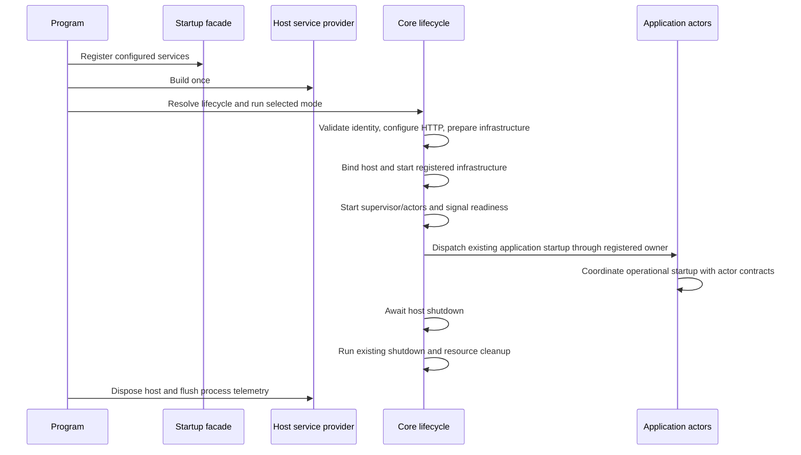

# IFM API Server Host and Core Services Refactoring Specification

**Version:** 1.0  
**Date:** 2026-10-09  
**Document type:** System-wide host organization standard and API refactoring specification  
**Status:** Target structure agreed by the user; specification prepared for review. Source extraction is now implemented and offline/Development verified; Aspire migration remains future work.  
**Scope:** Current single API process, reusable executable/Core library pattern, and future Aspire/WSL2 deployment boundaries.

## 1. Purpose and architectural decision

`TomasAI.IFM.Application.Api.Server` is the executable host container. Its production source root contains only `Program.cs` and `Startup.cs`; configuration and executable packaging remain alongside them. Supporting host services move to `TomasAI.IFM.Application.Api.Server.Core`, an organized class library loaded by that executable.

The same separation is the template for future IFM hosts: a small executable composes a capability-specific Core library and invokes its lifecycle through dependency injection. Core owns host integration services. Domain actors, business calculations, persistence implementations and transport implementations retain their existing application/domain/framework ownership.

?Host container? means the executable and its service provider; it does not require Docker. ?Api.Server.Core? means a DLL in the API process. It is distinct from the future **Core Actor Host**, an executable process in the Aspire target architecture. DLL extraction provides no new process isolation.

The immediate refactor changes organization and composition boundaries. It preserves process topology, actor contracts, startup behavior, recovery semantics, financial persistence, cache ownership and scheduled market open/close behavior.

## 2. Related architecture and precedence

- [IFM Aspire Actor-System Migration Overview](<Aspire migration overview.md>): future central actor host and selected capability processes; separate implementation review remains required.
- [Application Startup and Databento Recovery Actor-System Design](Application-Startup-and-Databento-Recovery-Actor-System-Design-v0.1.md): process bootstrap and operational startup are distinct; Application actors own operational workflows.
- [Databento Hard and Soft Recovery Design](Databento-Hard-and-Soft-Recovery-and-Terminal-Shutdown-Design-v1.0.md): recovery behavior survives extraction unchanged.
- [Actor Event Modeling Conventions](Actor-Event-Modeling-Conventions.md): command/event/query and persisted read-model boundaries.
- [Strategy Option Chain Cache Design](Strategy-Option-Chain-Cache-and-Order-Composition-Design-v1.0.md): resident cache and composer boundaries remain intact.

Current user instructions and verified implemented behavior take precedence over older design-only descriptions. This specification does not reactivate deferred behavior in those documents. Naming a future capability host does not authorize moving business state or database credentials into it.

## 3. Historical baseline

Git commit `da8901e50` (July 20, 2026) had five root C# files: Program, Startup, ActorMaps, CommandMaps and QueryMaps. Program configured the builder, registered services, built the provider, configured HTTP, mapped endpoints/actors and ran the host. Startup grouped registrations and integrated the DI containers. Commit `d1072aa31` (August 9) used asynchronous actor startup and explicit supervisor shutdown.

Startup historically also configured logging and middleware. The target makes responsibilities explicit: Startup exposes host composition; Core contains registration implementations, HTTP configuration and lifecycle orchestration. The inventory inspected contains 57 root C# files, including 55 supporting files to relocate. This count is a baseline, not a permanent constraint.

## 4. Project boundaries

| Component | Owns | Dependency direction |
| --- | --- | --- |
| Api.Server executable | Entry point, configuration sources, launch profiles, packaging, final provider construction and process lifetime | References Core and only packages/contracts directly required by the thin entry point |
| Api.Server.Core DLL | Registration modules, lifecycle coordinator, host adapters, HTTP mapping, readiness, health, recovery integration and maintenance entry points | References existing application/domain/framework libraries; never references Api.Server executable |
| Application libraries | Capability APIs, reusable application services and caches | Independent of executable hosts and Aspire AppHost |
| Domain libraries | Actor workflows, business state transitions, calculations and messages | Independent of host composition and deployment tooling |
| Framework libraries | Storage, transport, provider and telemetry implementations | Independent of Api.Server.Core and Aspire AppHost |
| Future AppHost | Resource topology, endpoint references and external process orchestration | Composes executable resources; does not execute business workflows |
| Future ServiceDefaults | Approved common host integration | Referenced by executables only; domain/framework libraries remain independent of Aspire |

Core is not a general business-services folder. A host-specific adapter belongs there; reusable pricing remains in its capability library. No reverse dependency on an executable is introduced.

## 5. Api.Server host container

```text
TomasAI.IFM.Application.Api.Server/
??? Program.cs
??? Startup.cs
??? appsettings.json
??? appsettings.Development.json
??? appsettings.Production.json
??? Properties/
?   ??? launchSettings.json
??? TomasAI.IFM.Application.Api.Server.csproj
??? TomasAI.IFM.Application.Api.Server.http       # optional development samples
```

Generated build outputs and runtime logs are not source folders. Operational/performance documentation belongs under `Documents/system`; tests belong in test projects.

### Program.cs

Program creates the WebApplication builder, calls Startup, builds once, resolves `IApiServerLifecycle`, invokes the selected mode and returns its exit code. It owns disposal of the built host/provider and concise process-level failure/logging cleanup.

It must not implement provider recovery, parameter seeding, schema migrations, actor registration, endpoint bodies, health probes or financial authority updates. Illustrative sequence, not a compiled contract:

```csharp
var builder = WebApplication.CreateBuilder(args);
Startup.Configure(builder, args);
await using var app = builder.Build();
var lifecycle = app.Services.GetRequiredService<IApiServerLifecycle>();
return await lifecycle.RunAsync(app, args);
```

The lifecycle service orchestrates the supplied host; it must not build or dispose a second provider. Bootstrap logging can use a Core helper before provider construction, with guaranteed final flushing. Existing startup error and fatal-recovery exit behavior is preserved.

### Startup.cs

Startup is a small composition facade calling `AddApiServerCore` and explicit registration modules. It applies host configuration/options selected by environment and run mode. It performs no database/network work, starts no actors and runs no jobs while registering services.

Registration order and lifetimes are explicit. Registration must not call `BuildServiceProvider` to resolve dependencies prematurely. Logging uses constructor injection or the documented bootstrap logger, without depending on the executable's generated Program type.

## 6. Api.Server.Core folder structure

```text
TomasAI.IFM.Application.Api.Server.Core/
??? DependencyInjection/
?   ??? RegisterApiServerCore.cs
?   ??? Actors/
?   ??? Storage/
?   ??? Messaging/
?   ??? MarketData/
?   ??? Trading/
?   ??? Observability/
??? Hosting/
?   ??? Contracts/IApiServerLifecycle.cs
?   ??? ApiServerLifecycle.cs
?   ??? Modes/
?   ??? ServerManager/
??? Startup/
?   ??? Application/
?   ??? Actors/
?   ??? Readiness/
?   ??? Schema/
??? Actors/
?   ??? Registration/
?   ??? Lifecycle/
?   ??? Recovery/
??? Recovery/
?   ??? Databento/
?   ?   ??? Contracts/
?   ?   ??? Composition/
?   ?   ??? SoftRecovery/
?   ?   ??? HardRecovery/
?   ?   ??? Verification/
?   ??? Shutdown/
??? MarketData/
?   ??? Initialization/
?   ??? Imports/
?   ??? InstrumentDefinitions/
?   ??? OptionChains/
?   ??? OptionPricing/
?   ??? Sessions/
?   ??? Rollover/
?   ??? Treasury/
??? Messaging/JetStream/
??? Trading/Emulation/
??? Http/
?   ??? Endpoints/
?   ??? Middleware/
?   ??? OutputCaching/
?   ??? Serialization/
??? Observability/
?   ??? Logging/
?   ??? Metrics/
?   ??? HealthChecks/
?   ??? StatusConsole/
??? Deployment/
?   ??? Identity/
?   ??? Validation/
??? Development/
?   ??? Provisioning/
?   ??? Verification/
??? TomasAI.IFM.Application.Api.Server.Core.csproj
```

Create folders when they contain implementations; empty folders in this diagram are extension points. Core uses the .NET class-library SDK with an ASP.NET Core framework reference for host/HTTP integration. It emits a DLL and has no executable entry point, appsettings or launch profile.

| Folder | Placement rule |
| --- | --- |
| DependencyInjection | Service/options/lifetime registration by capability; no running business work. |
| Hosting | Execution mode, top-level host coordinator, failure handling and process-control adapters. |
| Startup | Bootstrap readiness, schema preparation and host adapters for actor-owned operational startup. |
| Actors | Registry/supervisor integration and actor replacement/publication adapters; business handlers remain in domain projects. |
| Recovery | Databento host recovery orchestration and fatal shutdown integration. |
| MarketData | Host integration for reference maintenance, initialization, sessions, imports and provider operations; provider internals remain in framework libraries. |
| Messaging | Host messaging policy and subject/stream configuration; transport implementations remain in Framework. |
| Trading | Host-specific emulation wiring; business order/fill handling remains with trading actors. |
| Http | Endpoint mapping, middleware and serialization; endpoints call application contracts. |
| Observability | Host logging/metrics/status/health adapters; shared telemetry stays in Framework.Telemetry. |
| Deployment | Build/runtime identity validation and enforcement. |
| Development | Development-only provisioning and verification adapters. |

Options sit beside the configured service; interfaces sit in the capability's Contracts folder. Each class has one canonical location. Cross-cutting dependencies are injected, not copied into multiple folders.

## 7. Current root-class relocation map

This inventory covers every supporting root C# file inspected. Names omit `.cs`. Namespace and assembly compatibility rules are in Section 11.

| Destination under Core | Current classes |
| --- | --- |
| Hosting | ApiServerEntryPoint (adapt marker purpose and executable identity consumers), HostedServiceLifecycle |
| Hosting/ServerManager | ServerManagerStandardInputShutdown |
| Hosting/Modes | EventLogQualification; mode parsing and one-shot branches extracted from Program |
| Startup/Application | ApiApplicationStartupActivities, ApplicationStartupCommandDispatcher, ApplicationStartupOptions, ApplicationStartupHandoffStatus |
| Startup/Actors | ActorRuntimeStartupSignal, StartupOrchestrationOptions |
| Startup/Readiness | ApplicationBootstrapReadiness |
| Startup/Schema | ApplicationSchemaInitializer |
| Actors/Registration | ActorMaps |
| Actors/Recovery | RealtimeActorReplacementFactory, RealtimePublicationRecoveryService |
| Recovery/Databento/Contracts | IApiDatabentoRecoveryActions |
| Recovery/Databento/Composition | ApiDatabentoRecoveryComposition, ApiDatabentoRecoveryHostActivation |
| Recovery/Databento/SoftRecovery | ApiDatabentoRecoveryActions |
| Recovery/Databento/HardRecovery | ApiDatabentoRecoveryPipeline |
| Recovery/Databento/Verification | RecoveryInfrastructureProbes, DatabentoCandidateTickStorageProof, SupervisorRecoveryCanaryProbe |
| Recovery/Shutdown | ApiFatalRecoveryShutdown |
| MarketData/Initialization | HistoricalDailyAnalyticsInitializationService |
| MarketData/Imports | FmpMarketDataImportHostedService |
| MarketData/InstrumentDefinitions | InstrumentDefinitionMaintenance, StoredOptionDefinitionRangeLoader |
| MarketData/OptionChains | OptionContractExpiryCalendarRefreshService |
| MarketData/OptionPricing | OptionPricingReferenceMaintenance |
| MarketData/Sessions | FuturesMarketSessionAuthorityHostedService |
| MarketData/Rollover | FuturesRolloverPreparationHostedService |
| MarketData/Treasury | UsTreasuryRefreshHostedService |
| Trading/Emulation | FrozenEmulatorOrderExecutionBroker |
| Messaging/JetStream | FinancialJetStreamPolicy |
| Http/Endpoints | LivePipelineEndpoints |
| Http/Middleware | Request-pipeline configuration extracted from Startup |
| Http/OutputCaching | ApiOutputCachePolicies |
| Http/Serialization | ApiServerJsonContext |
| Observability/Metrics | ApplicationStartupHandoffMetrics |
| Observability/Logging | SupervisorFileHistoryPersistence, RecoveryFatalOpenTelemetry |
| Observability/StatusConsole | DatabentoWatchdogStatusConsolePublisher |
| Observability/HealthChecks | ActorRuntimeHealthCheck, ApplicationLifecycleHealthCheck, DeploymentIdentityHealthCheck, FmpConfigurationHealthCheck, MarketDataRuntimeHealthCheck, PortfolioOperationalHealthCheck, ProcessLivenessHealthCheck |
| Deployment/Identity | DeploymentIdentity |
| Deployment/Validation | DeploymentIdentityEnforcementService |
| Development/Provisioning | DevelopmentOptionChainParameterSeeder |
| Development/Verification | FourHourDatabentoSeedReplay, Oct1OptionPricingReferenceMaintenance, LivePipelineProbe |

Some services span soft/hard recovery steps. Their initial placement does not require splitting methods or changing behavior. Move each service intact first and retain its explicit registrations. Diagnostics retain their current invocation gating and must not run automatically merely because they moved folders.

`OPERATIONS.md` and `PERFORMANCE.md` move to named documents under `Documents/system`, with incoming links updated. Assembly metadata and generated source contexts belong to the assembly owning the associated types. The executable marker is an exception to a mechanical move: tests requiring the executable assembly must identify that assembly, rather than accidentally treating Core as the entry point.

## 8. Lifecycle ownership and startup sequence



The diagram identifies responsibility boundaries. Exact implemented ordering must be characterized before extraction, including hosted-service callbacks, provisioning and readiness dependencies.

- HTTP binding continues preceding actor subscription exposure, preventing a failed port bind from leaving consuming actors active.
- One registered owner dispatches application startup. The lifecycle service does not add a second dispatcher beside an existing hosted service.
- Additive schema preparation and permitted environment-specific provisioning remain explicit lifecycle stages, not side effects of DI registration.
- One-shot modes retain their actor/feed/HTTP startup restrictions. Startup verification must not accidentally mutate databases or start feeds.
- Global services are created and managed through DI. No static service provider or separately constructed supervisor, messaging connection, worker or cache.
- Existing actor container bridges remain centrally registered; extraction must not implicitly change actor lifetimes.
- Application actors continue owning operational startup. Host adapters do not become a second business workflow engine.
- FuturesMarketClose stops the feed and seals EOD according to the implemented workflow; it does not shut down the API, scheduler or backup availability. FuturesMarketOpen validates the operational value date and starts the feed, rather than restarting the application.

## 9. Recovery, shutdown and observability invariants

Relocation preserves configured soft attempts, hard reset escalation and terminal API shutdown behavior. Generation fencing and immediate replacement of disposable realtime processing remain intact. Organization refactoring adds no drain, replay, retry or recovery qualification step.

Financial command execution and disposable monitoring retain their distinct guarantees. Moving services does not change JetStream subjects, consumer identities, durability, projection policy or accepted-input freezing.

The lifecycle coordinator has one shutdown owner. Ctrl+C, ServerManager stop, host cancellation and terminal recovery converge on it without duplicate supervisor disposal. Startup failures clean up only resources actually started. The existing fatal-recovery termination guarantee must not be defeated by adding a graceful wait.

Logs retain available operation, actor/component/dataset identity, stage, outcome, elapsed time and exception detail. Service/deployment/process-run IDs remain associated with the executable after services move into a DLL. Moving logger namespaces must not silently disable category overrides. Lifetime GC recording remains process-owned and records counters; it does not request collections.

Registration must yield one instance per intended singleton and one intended telemetry pipeline per process. Extraction must not create duplicate hosted services, NATS subscriptions, workers, scheduled jobs or exporters.

## 10. Configuration and publish contract

- Existing appsettings keys and precedence remain stable. Environment variables, command-line configuration and approved secret sources remain supported.
- Core contains typed options and validation, not a competing appsettings file or hardcoded deployment endpoints.
- Content-root behavior belongs to the executable. Logs, subprocess binaries, configuration and maintenance assets resolve from explicit host paths; moving an assembly must not accidentally change them.
- Package references move with their consumers. Core references existing projects needed to register implementations. The executable retains directly used packages and Web SDK packaging metadata.
- API publish output includes Core, dependencies and current worker artifacts. Verify with a clean publish, not only an incremental build.
- Core must not depend on an executable project to locate its output directory. Worker delivery needs an explicit build/publish asset relationship if the current mechanism depends on the API project layout.
- Run-mode flags and exit codes remain stable for VS Code, ServerManager, CI and operator scripts. Parsing/dispatch lives in Hosting/Modes.
- Development provisioning stays explicitly gated, idempotent and version-aware. Folder extraction cannot broaden environment eligibility or reset user-authored settings.

## 11. Namespace, assembly and compatibility rules

The target uses capability namespaces under `TomasAI.IFM.Application.Api.Server.Core`. Namespace changes should be a separate reviewable step after physical extraction builds successfully.

Inventory and update tests, benchmarks, ServerManager, scripts, source generation, reflection, assembly scanning and `InternalsVisibleTo`. Preserve executable identity used by integration fixtures and WebApplicationFactory. Tests of moved internals reference Core and receive access from Core; executable-host tests still reference Api.Server.

Before renaming a type/namespace, check event payloads, serializer metadata, actor registration, persisted type names and transport contracts. Those identities are not renamed as incidental folder cleanup. Shared business messages stay in domain shared projects. Internal DI types can change after consumers and logger filters are updated.

No copied registration blocks, duplicate types or reverse project references remain. The executable root has only the two intended hand-authored C# files; an entry-point marker can be declared in Program when necessary.

## 12. Reusable host template

```text
TomasAI.IFM.Application.<Capability>.Server/
    Program.cs
    Startup.cs
    appsettings*.json
    Properties/launchSettings.json
    <executable>.csproj

TomasAI.IFM.Application.<Capability>.Server.Core/
    DependencyInjection/
    Hosting/Contracts/
    Hosting/<Capability>ServerLifecycle.cs
    Startup/
    <Capability-specific services>/
    Observability/
    <class-library>.csproj
```

Use established names for existing hosts; do not rename SchedulerHost or MarketData.Worker just to satisfy this illustrative naming template. Register only the capability the executable owns. Add optional folders when needed.

Future capability hosts must not all reference Api.Server.Core, which would bring central API/database composition into satellites. Each capability Core contains its own adapters. Truly common helpers may move to a small shared hosting library after reuse is demonstrated; it must not depend on business domains or the API executable.

Each host documents actor ownership, run modes, readiness, process identity, termination behavior, platform support, credentials and external message contracts. It remains independently runnable and testable without the complete topology.

## 13. Aspire and WSL2 migration boundary

### Aspire responsibilities

The future single AppHost declares resources and their connections. It runs alongside services and provides topology/local orchestration; it does not handle API requests. See the official [AppHost definition](https://aspire.dev/hub/glossary/apphost/).

IFM's existing target remains a central Core Actor Host plus selected market-feed, backup, broker and AI capability hosts, subject to the Aspire design's review. The current Core DLL is a preparation boundary; it provides no isolated process and cannot terminate an arbitrary stuck managed thread independently of the API process.

- AppHost owns resource launching and endpoint/configuration references.
- Executables own their DI containers, lifecycles and health integration.
- Application/domain actors own business startup, recovery decisions and operational state.
- Local actor work uses existing same-process dispatch; inter-host business/control/data communication uses approved NATS contracts. Aspire discovery does not replace actor routing.
- Central database access remains in the Core Actor Host under the existing target design. Satellites use its actor contracts; DLL extraction does not distribute database credentials.
- Shared ServiceDefaults, if adopted, is applied by executables and reconciled with current IFM telemetry to avoid duplicate exporters.
- Optional satellite failure must not fail central process liveness. Capability readiness reports the relevant dependency unavailable.

Future profiles explicitly select resource/container lifetimes and storage ownership. AppHost shutdown must not be assumed to delete persistent data. See the official [resource lifetime documentation](https://aspire.dev/app-host/resource-lifetimes/).

### WSL2 deployment profiles

WSL2 is the Linux execution environment. Docker Desktop can use its WSL2 backend for Linux containers; this is separate from choosing whether an IFM executable runs as a Windows process, a Linux process in WSL or a Linux container. See [Docker's WSL2 backend documentation](https://docs.docker.com/desktop/features/wsl/).

| Profile | Hosts | Dependencies and UI |
| --- | --- | --- |
| Current Development | Existing Windows .NET processes controlled by VS Code/ServerManager | Current infrastructure and Windows UI |
| Transitional Aspire | Approved project/executable resources; Windows hosts can remain Windows processes | Selected Linux infrastructure containers through WSL2; UI remains Windows |
| Linux qualification | Selected cross-platform hosts run in WSL2/Linux or Linux containers | Windows-specific broker/emulator/native integrations retain Windows owners until qualified |
| Later deployment | Approved central/satellite topology and deployment target | Defined persistence, secrets, resource limits and restart policy; WSL2 proof is not production qualification |

Before Linux activation:

1. Audit Windows-only APIs, native binaries, broker bridges, filesystem assumptions and process control per host.
2. Resolve endpoints from configuration. `localhost` refers to the process's network context and is not a universal Windows/WSL/container address.
3. Use configured paths and platform-aware file operations. Do not embed Windows repository paths or PowerShell-only assumptions in Core services. Mount/output paths are profile decisions.
4. Verify market time zones, DST, scheduling and operational value dates across platforms. Platform time-zone IDs must resolve to the intended market zone; machine-local time must not silently replace Eastern market time.
5. Verify Ctrl+C/SIGTERM, worker binary architecture, child-process cleanup and telemetry export on the actual platform.
6. Assign one orchestration owner per executable. ServerManager and Aspire must not launch duplicate owners against the same ports/subscriptions/workers. Existing VS Code scripts remain supported until explicit cutover.
7. Verify persistence and backups separately from restart. No development database move, reset or volume conversion is implied.

## 14. Refactoring sequence and verification gates

| Stage | Work | Required evidence |
| --- | --- | --- |
| 1. Baseline | Inventory classes, lifetimes, modes, endpoints, scripts, worker assets and test assembly identity | Recorded startup/shutdown order and runnable baseline |
| 2. Core extraction | Add library, relocate services, transfer references and assembly metadata | Build succeeds; no reverse reference; one owner per class |
| 3. Composition split | Extract registration modules; keep Startup as facade | Intended lifetimes; no duplicate hosted instances |
| 4. Lifecycle extraction | Move Program modes, HTTP configuration and lifecycle into injected services | Ordering, partial failure cleanup and one-shot restrictions preserved |
| 5. Publish/consumer update | Update markers, references, source generation, scripts and document links | Clean Release build/publish; worker assets resolve from output |
| 6. Behavioral verification | Run affected startup/actor/recovery/cache/scheduler tests and Development start/stop | No regressions; idempotent provisioning; no orphan IFM-owned workers |
| 7. Live qualification | Test feed startup, soft/hard recovery, session close/open and manual coexistence during trading hours | Correlated logs, continued processing and single actor/provider ownership |
| 8. Template acceptance | Record actual extraction results and reusable rules | Lean executable; organized Core; capability hosts avoid central dependency leakage |

Aspire topology implementation and Linux extraction are subsequent work with separate gates. They are not required to complete the current organizational refactor.

Minimum meaningful behavior checks include bind failure before actor exposure, startup dispatched once, partial-start cleanup, normal stop, fatal termination, generation fencing, verification-mode no-write behavior, additive schema/default provisioning and published-output startup with a different working directory. Reuse existing tests that cover these boundaries. Filename-only tests do not establish lifecycle correctness.

## 15. Acceptance checklist

- [ ] Api.Server root contains only Program and Startup as production C# source; configuration/packaging remain there.
- [ ] All 55 supporting root files have canonical Core placement or documented marker/asset adaptation.
- [ ] Core emits a DLL without an entry point or duplicate configuration files.
- [ ] Startup registration is declarative; the executable builds the provider once.
- [ ] Lifecycle preserves bootstrap, operational startup, recovery, maintenance and shutdown semantics.
- [ ] Dependencies, test identity, source generation, publish assets and logger categories are verified.
- [ ] Windows/ServerManager start-stop remains working without orphan workers or duplicate consumers.
- [ ] API and scheduler remain available during normal market closure for backups.
- [ ] Financial/event/read-model/cache semantics remain unchanged by extraction.
- [ ] Offline checks pass; live checks are recorded separately during trading hours.
- [ ] Aspire/WSL2 boundaries remain explicit; folder extraction implies no topology activation.

## 16. Decisions reserved for deployment design

Final Aspire resource names and migration stages; Linux/native broker/provider support; production process restart/isolation policy; networking, persistent volumes and secrets; and common helper/ServiceDefaults adoption remain separate deployment decisions.

These do not block the agreed Api.Server/Core organizational refactor. They must be resolved before the corresponding deployment change is activated.


## 17. Implemented organization and compatibility notes

The single-process API/Core extraction is implemented. See the [implementation plan and evidence record](Api-Server-Host-and-Core-Services-Refactoring-Implementation-Plan-v1.0.md) for actual verification results and the deferred live gate.

Core namespaces now follow capability ownership under `TomasAI.IFM.Application.Api.Server.Core`, with consumer imports and reflected startup type names updated. Startup/ParameterSets contains the four existing nested host helpers. CoreServiceRegistration uses capability partial modules in the shared `Core.DependencyInjection` namespace; the executable facade retains its familiar registration methods. Partial lifecycle and mode classes likewise share their owning class namespace. Executable entry-marker, service identity and meter names remain stable. ApiServerLifecycle and its normal-runtime partial implementation own orchestration, while ApiServerModes owns one-shot execution and ApiOperationalEndpoints owns operational HTTP mappings.

The executable entry marker is declared in Program. Deployment identity hashes the Core DLL as well as the executable and Trade DLL. No Aspire resource, new process boundary or Linux activation was introduced. API, UI and scheduler were launched and stopped through the existing Development scripts; live recovery qualification remains deferred to trading hours.
