# IFM Aspire Actor-System Migration Overview

**Document type:** Target architecture and migration constraints

**Status:** First draft for review; not approved for implementation

**Created:** 2026-08-10

**Owner:** IFM engineering

## 1. Purpose

This document defines the high-level target architecture for evolving IFM from the current monolithic
`TomasAI.IFM.Application.Api.Server` process into an Aspire-orchestrated actor system with a central Core Actor Host
and a small number of coarse capability hosts.

The document establishes the complete architectural picture before implementation begins. It intentionally emphasizes
boundaries, invariants, operational responsibilities, failure semantics, and migration gates rather than packages,
classes, configuration keys, or detailed code changes.

This is a first draft. It does not authorize a flag-day migration, production activation, removal of an existing host,
or movement of a business responsibility across a process boundary.

## 2. Executive decision

IFM will remain a centrally managed actor application. It will not become one service per actor or one service per
domain entity.

The target system consists of:

1. one logically central Core Actor Host that owns business-domain management, actor placement, centralized
   operational configuration, all application-database access, and the primary management API;
2. a small set of independently hosted satellite capabilities that exist only where failure, security, resource, or
   lifecycle isolation provides a material benefit;
3. local actor-mailbox dispatch when the active owner of the target actor is in the calling process;
4. NATS Core and JetStream communication for every business, control, or application-data request that crosses a
   process or server boundary;
5. HTTP endpoints and HTTP-based telemetry export for health, readiness, metrics, traces, logs, diagnostics, operator
   configuration, and approved external management protocols rather than internal trading hot paths; and
6. Aspire as the application topology, development orchestration, service-discovery, and observability composition
   layer, never as a business workflow engine or hot-path dependency.

The initial capability-host set is:

- `TomasAI.IFM.Api.Server.Host`, the Core Actor Host;
- `TomasAI.IFM.Api.MarketDataFeed.Host`;
- `TomasAI.IFM.Api.DatabaseBackup.Host`;
- `TomasAI.IFM.Api.AgenticAi.Host`; and
- `TomasAI.IFM.Api.TradeBroker.Host`.

Names remain subject to review. `TomasAI.IFM.Api.ControlPlane.Host` may communicate the Core Actor Host's role more
clearly than `TomasAI.IFM.Api.Server.Host`.

## 3. Objectives

The migration must:

- preserve the actor model as the system's business-concurrency boundary;
- remove legacy business behavior from general-purpose hosted services;
- keep business state changes serialized through the owning actor mailbox;
- make the Core Actor Host the only holder of PostgreSQL, ScyllaDB, Redis, and other application-database client
  connection strings;
- require every satellite to access application data through Core-owned actor contracts over NATS;
- make same-process actor messaging materially cheaper than a NATS network round trip;
- retain transparent multi-server routing and failover capability from the start;
- isolate native market-data, backup, AI, and broker resource profiles from the core business process;
- let optional capabilities stop, restart, or upgrade without stopping the Core Actor Host;
- make NATS the authoritative inter-host command, query, event, and data fabric;
- make HTTP the management and observability plane and keep general observability traffic off NATS;
- avoid distributed-monolith coupling, chatty remote workflows, and shared business-state ownership;
- preserve existing cancellation, overload, graceful shutdown, readiness, durability, and telemetry guarantees;
- support Windows and Linux deployment where the capability implementation supports both; and
- enable incremental, reversible migration with measurable gates after every boundary change.

## 4. Non-goals

This architecture does not intend to:

- create a microservice for every actor, aggregate, handler, or bounded context;
- move every domain out of the Core Actor Host;
- route same-process messages through NATS merely for uniformity;
- claim distributed exactly-once processing;
- introduce distributed transactions across PostgreSQL, ScyllaDB, Redis, NATS, model providers, or brokers;
- make Aspire responsible for actor ownership, business routing, retries, or consistency;
- require Docker for normal editing, unit testing, or running an individual .NET host;
- make every satellite a prerequisite for Core Actor Host readiness;
- place Agentic AI on a mandatory time-critical trading path;
- reactivate or extend the legacy Interactive Brokers market-data implementation; or
- change production topology before component, failure, replay, soak, and paper-trading evidence is available.

## 5. Architectural principles

### 5.1 Coarse capability boundaries

A separate process is justified only by at least one strong boundary:

- materially different CPU, memory, GC, native-thread, or latency requirements;
- an external connection with an independent lifecycle or credential boundary;
- a failure mode that should not terminate the Core Actor Host;
- an independently scheduled operational workload;
- a distinct scaling profile; or
- an independently secured deployment surface.

Source-code organization alone is not a sufficient reason to create another process.

### 5.2 One authoritative owner

Every mutable business aggregate, durable workflow, configuration decision, and external side effect must have exactly
one logical owner. Deployment redundancy must not create concurrent unfenced owners.

### 5.3 Mailbox serialization remains mandatory

Local dispatch is an optimization of transport, not a bypass around the actor runtime. A local message must still pass
through admission control, the target actor mailbox, scheduling, cancellation rules, telemetry, and sequential handler
execution.

Directly invoking an actor's command handler or mutating its state from another actor is prohibited.

### 5.4 Remote delivery is at least once

Remote message handlers must tolerate duplicate, delayed, reordered, and redelivered messages. Stable message,
command, event, effect, and external-order identities are required where the operation has durable consequences.

### 5.5 No synchronous distributed call chains

One bounded remote request/reply is acceptable for an explicit control operation. A request must not synchronously
traverse a chain of capability hosts. Cross-host workflows use durable state, commands, events, and reconciliation.

### 5.6 Locality must not change business semantics

Moving an actor between processes may change latency and delivery mechanics, but it must not change validation,
authorization, ordering, idempotency, result types, or durable outcomes.

### 5.7 Fail closed for trading authority

An ambiguous actor owner, expired placement lease, unavailable broker capability, missing configuration revision, or
uncertain external-order outcome must stop new trading mutation rather than guess an owner or repeat an unverified
side effect.

### 5.8 One-way capability dependency

Every satellite capability depends on an available Core Actor Host, a compatible centralized configuration revision,
and NATS connectivity before it can become operationally ready. The Core Actor Host does not depend on satellite
startup or readiness for its own core readiness.

If the Core Actor Host becomes unavailable, a satellite remains live for diagnostics and graceful cleanup but stops
accepting new business work, drains or checkpoints already accepted work according to its capability policy, and
reports not ready. It must not continue autonomously using stale business configuration.

### 5.9 Credential confinement

Connection credentials belong only to the host that owns the external resource:

- application-database client connection strings belong only to the Core Actor Host;
- Databento credentials belong only to the Market Data Feed Host;
- model-provider credentials belong only to the Agentic AI Host;
- broker credentials belong only to the Trade Broker Host; and
- backup-destination credentials belong only to the Database Backup Host.

The Aspire AppHost and shared configuration model must not broaden a credential's distribution to unrelated hosts.

### 5.10 Allowed cross-host channels

The Core Actor Host and satellites communicate only through:

- NATS Core or JetStream for actor commands, queries, events, configuration, application-data contracts, and
  capability data; and
- authenticated HTTP/HTTP2 for health, metrics, logs, traces, diagnostics, approved operator protocols, and other
  observability exchange.

They do not communicate through a shared application database, shared Redis keys, shared writable filesystem paths,
in-memory references, host-project references, or an undocumented side channel.

## 6. Target system topology

```mermaid
flowchart TB
    Operator[Operator / UI / external management client]
    AppHost[IFM Aspire AppHost]
    Nats[(NATS Core and JetStream cluster)]
    AppStores[(PostgreSQL / ScyllaDB / Redis containers)]
    BackupStore[(Backup destination)]
    Observability[(HTTP / OTLP collector and dashboards)]

    subgraph Core[Core Actor Host]
        Http[HTTP management and observability]
        Registry[Actor placement and capability registry]
        Runtime[Core actor runtime and local mailboxes]
        Config[Authoritative business configuration]
        StorageActors[Application database actors and in-process clients]
    end

    subgraph Feed[Market Data Feed Host]
        FeedHttp[Health / metrics / diagnostics]
        FeedActors[Feed control actors]
        Databento[Databento native ingestion and bounded batching]
    end

    subgraph Backup[Database Backup Host]
        BackupHttp[Health / metrics / diagnostics]
        BackupActors[Backup scheduling and execution actors]
    end

    subgraph AI[Agentic AI Host]
        AiHttp[Health / metrics / approved AI protocols]
        AiActors[Agent workflow and tool-gateway actors]
        Maf[Microsoft Agent Framework runtime]
    end

    subgraph Broker[Trade Broker Host]
        BrokerHttp[Health / metrics / diagnostics]
        BrokerActors[Execution and reconciliation actors]
        BrokerAdapter[External broker adapter]
    end

    AppHost -. orchestrates .-> Core
    AppHost -. orchestrates .-> Feed
    AppHost -. orchestrates .-> Backup
    AppHost -. orchestrates .-> AI
    AppHost -. orchestrates .-> Broker

    Operator -->|HTTP management| Http
    Core <-->|inter-host commands, queries, events, data| Nats
    Feed <--> Nats
    Backup <--> Nats
    AI <--> Nats
    Broker <--> Nats
    Runtime -->|same-process mailbox dispatch| Runtime
    StorageActors -->|only application DB client access| AppStores
    BackupActors --> BackupStore
    Http -->|HTTP health, metrics, OTLP| Observability
    FeedHttp -->|HTTP health, metrics, OTLP| Observability
    BackupHttp -->|HTTP health, metrics, OTLP| Observability
    AiHttp -->|HTTP health, metrics, OTLP| Observability
    BrokerHttp -->|HTTP health, metrics, OTLP| Observability
```



Aspire edges in this diagram represent orchestration, configuration references, discovery, and development resource
management. They do not carry IFM business messages or application data. The Core Actor Host is the only application
database client. Satellite-to-Core business and application-data access crosses NATS; cross-host observability uses
HTTP-based endpoints or export.

## 7. Host responsibilities

### 7.1 Core Actor Host

The Core Actor Host is the only IFM application capability that must remain available continuously. Every satellite
requires it to become and remain operationally ready. NATS and the required databases are infrastructure dependencies
and require their own high-availability design; they are not optional IFM capability hosts.

The Core Actor Host owns:

- the principal business-domain actor runtime;
- authoritative actor placement and ownership decisions;
- business command validation and workflow coordination;
- authoritative non-bootstrap configuration and configuration revisioning for the complete application;
- the only application-database client connection strings and connection pools;
- all application-data access through Core-owned actors, including event sourcing, schema readiness, projections, and
  read models;
- the primary HTTP management surface;
- capability registration and health state;
- local-versus-remote actor route selection;
- authorization decisions for operator-issued business commands;
- system-wide trading-mode decisions such as stopped, simulation, paper, and live; and
- composite operational status exposed to the UI and operators.

The Core Actor Host must remain live when any satellite is absent. Capability-dependent commands must return a typed
unavailable or degraded result; they must not wait indefinitely or make the complete core runtime unresponsive. Core
startup and core readiness never wait for a satellite. Composite paper/live-trading readiness may require selected
satellites without changing that dependency direction.

### 7.2 Market Data Feed Host

The Market Data Feed Host owns:

- Databento connection and subscription lifecycles;
- native feed handles, native threads, managed drain threads, and affinity policy;
- bounded native-to-managed buffers;
- symbol mapping and feed-session recovery;
- transport-level normalization, validation, batching, and feed telemetry;
- feed-specific backpressure and explicitly approved loss policies; and
- publication of normalized market-data messages to NATS.

The Databento connection string, API key, and feed credentials exist only in this host. The host has no PostgreSQL,
ScyllaDB, Redis, or other application-database connection string. Any durable IFM state, reference data, subscription
configuration, or historical application data that it needs is requested from Core-owned actors through NATS. Feed
data requiring application persistence is published to an approved Core-owned persistence actor contract.

It does not own trading strategy, portfolio state, application data, or centralized operational configuration.
Databento remains the reference market-data implementation; the legacy Interactive Brokers feed remains outside this
migration.

No design should emit several network messages per raw field when one bounded normalized batch preserves the required
semantics. Batching, timestamps, sequence identities, gap detection, and replay boundaries are part of the capability
contract.

### 7.3 Database Backup Host

The Database Backup Host owns:

- execution of backup workflows requested and configured by Core-owned actors;
- backup progress, verification, retention, and restore-readiness reporting;
- resource throttling so backup work cannot saturate production stores;
- access to backup destinations and backup-specific credentials; and
- publication of backup audit outcomes to the owning Core actor for durable storage.

The host does not receive an application-database client connection string and cannot query application tables or
become a second application-data access path. NATS carries backup control, progress, outcome, and bounded application
contracts; it must not carry an unbounded raw database dump.

The physical backup mechanism remains an open design decision. It must preserve the database credential boundary. A
Core-owned database actor may initiate a database-native snapshot/export and provide an opaque artifact reference, or
a separately secured database-infrastructure backup mechanism may write the artifact without granting the satellite
normal application-data access. The Backup Host can then verify, retain, copy, encrypt, and report on that artifact
using its backup-destination credentials. Restore remains an explicitly authorized, separately gated workflow led by
the Core Actor Host.

The host must default to disabled or dry-run behavior in normal development environments.

### 7.4 Agentic AI Host

The Agentic AI Host owns:

- Microsoft Agent Framework agents and workflows;
- model-provider clients and AI-specific resilience;
- AI session, checkpoint, tool-call, token, cost, and latency telemetry;
- approved protocol adapters when external AI clients require them;
- retrieval or contextual memory that is explicitly assigned to the capability; and
- a constrained tool gateway that submits authorized commands to the Core Actor Host through NATS.

The Agentic AI Host must not directly mutate trading aggregates, bypass actor validation, write broker state, or become
a required dependency for market-data ingestion or deterministic execution. AI recommendations become normal actor
commands or proposals subject to the same authorization, risk, idempotency, audit, and trading-mode rules as human or
strategy-generated requests.

Model-provider credentials exist only in this host. It receives no application-database connection string. Durable AI
sessions, checkpoints, approved memory, and application context stored in IFM databases are accessed through explicit
Core-owned actor contracts over NATS.

### 7.5 Trade Broker Host

The Trade Broker Host owns:

- external broker connections and credentials;
- broker-session lifecycle and recovery;
- submission of authorized execution intents;
- deterministic external-order identities;
- acknowledgement, fill, cancel, reject, and correction processing;
- reconciliation between IFM intent and broker-observed state; and
- broker-specific throttles, risk interlocks, audit, and telemetry.

This host is extracted only after execution identities, durable intent, fencing, ambiguous-result handling, and
reconciliation are proven. Simulation and paper modes are required before live activation.

Broker credentials exist only in this host. It receives no application-database connection string. Execution intent,
durable order state, configuration, and reconciliation records stored in IFM databases are exchanged with Core-owned
actors through NATS contracts rather than direct database access.

### 7.6 Common satellite contract

Every satellite:

- has only enough bootstrap configuration to identify itself, reach NATS and Core, expose HTTP observability, and open
  its exclusively owned external dependency;
- obtains centralized non-bootstrap configuration from the Core Actor Host through versioned NATS contracts;
- acknowledges the effective configuration revision before becoming ready;
- accesses application data only through Core-owned actors over NATS;
- exposes and exports observability through HTTP-based mechanisms;
- becomes not ready when Core is unavailable or configuration compatibility is lost; and
- cannot make the Core Actor Host unavailable merely by stopping or failing.

## 8. Local and remote actor routing

### 8.1 Required routing decision

Every actor message is resolved against an authoritative placement view:

1. If the current process owns the target actor identity and its ownership lease/fence is valid, admit the message to
   the local mailbox.
2. If another process owns the actor, serialize the same logical envelope and route it through NATS.
3. If ownership is absent and the actor type permits activation, request or perform a deterministic placement
   decision before accepting mutation.
4. If ownership is ambiguous or stale, fail closed with a typed routing/availability result.

Local preference is never sufficient by itself. In a multi-server deployment, a locally registered actor type does not
prove that the current process owns a particular actor identity.

### 8.2 Common logical envelope

Local and remote paths share one logical message contract containing, as applicable:

- message and correlation identity;
- causation identity;
- actor type, verb, entity/mailbox identity, and message kind;
- contract name and version;
- creation and expiry time;
- caller and authorization context reference;
- tracing context;
- idempotency or effect identity; and
- reply/result contract.

The local path should avoid serialization and network allocation but must retain equivalent metadata for telemetry,
authorization, cancellation boundaries, and result handling.

### 8.3 Delivery differences that remain explicit

Transport transparency must not hide real distributed differences:

| Concern | Local owner | Remote owner |
| --- | --- | --- |
| Admission | Local actor admission controller | Sender plus remote admission controller |
| Queue | In-process mailbox | NATS subscription then in-process mailbox |
| Serialization | Avoided | Required |
| Cancellation | Can stop safe local work before commit | Cancels publish/wait; cannot revoke accepted remote work |
| Failure | Typed local result/exception policy | Timeout, no responder, overload, disconnect, or typed remote result |
| Duplicate delivery | Normally absent before persistence retry | Expected and handled idempotently |
| Ordering | Mailbox serialization | Guaranteed only after ownership/admission; transport ordering limits remain explicit |

Callers must set bounded deadlines for remote request/reply. A timeout means the outcome may be unknown; it does not
prove that the remote actor did not accept or commit the operation.

### 8.4 Query policy

Queries against Core-owned immutable or read-model state execute through the owning Core actor. A caller in the Core
process uses local mailbox dispatch; a satellite uses NATS request/reply. Satellite hosts do not receive database
credentials and do not bypass the actor query contract with a direct repository, database client, shared cache, or
filesystem path.

Cross-host queries must be bounded and must not form fan-out trees on latency-critical paths. A satellite may retain an
explicitly approved bounded cache derived from versioned NATS messages, but that cache is not authoritative and cannot
be used to mutate Core state.

### 8.5 Application-data access rule

All access to data stored in IFM application databases is actor-mediated:

1. A Core actor sends the request to the owning data, repository, or projection actor through the local actor runtime
   when that owner is local.
2. A satellite sends the equivalent versioned command/query/event over NATS.
3. The owning Core actor performs the database operation through an in-process storage abstraction and database
   driver.
4. Results or durable outcome events return through the actor messaging contract.

NATS is required at the process boundary, not between a Core actor and its in-process database driver. HTTP is not an
application-data bypass.

## 9. NATS control and data plane

### 9.1 NATS Core

NATS Core is used for bounded request/reply commands, queries, capability control, and messages where loss during a
disconnection is explicitly acceptable. Required mutations must return typed acceptance, rejection, overload, or
unknown-outcome results.

Core distributes centralized operational configuration to satellites over NATS and receives explicit configuration
revision acknowledgements over NATS. General logs, traces, metrics, health payloads, and diagnostic dumps do not use
NATS.

### 9.2 JetStream

JetStream is used where work must survive process restart or connection loss, including selected domain events,
recovery work, durable execution intents, and capability handoffs. Durable use requires stable message identities,
bounded retention, acknowledgement policy, replay policy, poison-message handling, and operational ownership.

### 9.3 Market-data data plane

Market data requires separately versioned, bounded batch contracts. The contract must define:

- source and normalized sequence identity;
- event and receive timestamps;
- batch ordering and maximum size;
- gap and late-data semantics;
- compression or encoding policy;
- overload behavior;
- replay/live boundaries; and
- ownership/disposal rules for pooled payloads.

The design must avoid routing a quote through the Core Actor Host merely to send it to another non-persisting
satellite. Consumers subscribe to the approved NATS data contract directly while the core retains configuration and
capability authority. Any consumer that needs to read or persist IFM application data sends an actor message to the
Core Actor Host; it does not connect to an application database.

### 9.4 Prohibited messaging patterns

- unbounded request timeouts;
- remote request/reply inside a per-tick loop;
- synchronous chains across more than one remote capability;
- shared mutable state used to compensate for missing message contracts;
- cancellation-token serialization;
- fire-and-forget required commands;
- using a successful transport acknowledgement as proof of completed business work; and
- treating NATS duplicate suppression as permanent business idempotency.

## 10. HTTP management and observability plane

Every host configures its own observability and exposes only the HTTP surface required for its operational role.
Standard categories are:

- liveness;
- local readiness;
- metrics;
- diagnostics and version information;
- safe effective-configuration revision inspection;
- capability-specific operational actions; and
- an approved external protocol where NATS is not the appropriate client interface.

Operator configuration is submitted to the Core Actor Host over its authenticated HTTP management API. The endpoint
submits a command to the owning Core actor. Core then distributes applicable satellite configuration over NATS. A
satellite HTTP endpoint must not create a second configuration or application-data mutation path.

HTTP is not used for internal quote delivery, actor hot-path commands, or service-to-service polling that NATS events
can replace.

Cross-host observability uses HTTP-based mechanisms. Each host exposes health and metrics over HTTP as required and
exports logs, metrics, and traces through the approved HTTP/OTLP pipeline. NATS does not carry general observability
telemetry. A feed-gap, backup-completed, AI-workflow-failed, or broker-disconnected domain/control event may still use
NATS when another actor must make a business decision from it; that event is not a replacement for telemetry.

Management endpoints require authentication, authorization, audit, rate limiting, and environment-appropriate network
exposure. Health and metrics endpoints must not disclose credentials, positions, account information, model prompts,
or sensitive configuration.

## 11. Availability and readiness model

A single global ready/not-ready value is insufficient for this topology. The system distinguishes:

- **process liveness:** the process is responsive;
- **local readiness:** the host initialized its owned runtime and can accept its own work;
- **core readiness:** the Core Actor Host can serve core business operations and its required application databases;
- **distributed readiness:** NATS and required inter-host routes are usable;
- **capability readiness:** a named satellite can reach a compatible Core, has applied its centralized configuration
  revision, and can perform its capability;
- **paper-trading readiness:** all dependencies required for paper trading are ready; and
- **live-trading readiness:** every required market-data, risk, execution, configuration, and reconciliation gate is
  ready and authorized.

Satellite startup is ordered after Core readiness and never the reverse. Satellite failure does not make the Core Actor
Host dead or not ready. It changes the relevant capability/composite state and causes dependent commands to fail fast
with a typed result.

Loss of Core makes every satellite not ready even when its external provider remains reachable. The satellite remains
live for HTTP observation and bounded drain/checkpoint behavior but does not begin new autonomous business work using
stale configuration. Restoration requires a compatible Core handshake and configuration revision before readiness is
republished.

NATS loss may permit local diagnostic and selected local actor operations, but distributed or trading readiness must
fail closed. The allowed degraded operations require an explicit policy; they must not be inferred dynamically.

## 12. Actor placement, redundancy, and failover

The desire to run multiple servers for backup processing requires explicit ownership semantics before active/active
deployment.

### 12.1 Mutation ownership

At most one unfenced command owner may execute a mutable actor identity at a time. The placement design must provide:

- a stable actor identity;
- one active owner and an ownership epoch or fencing token;
- lease renewal and expiry rules;
- deterministic takeover;
- stale-owner rejection at durable mutation boundaries;
- mailbox recovery or durable redelivery; and
- observability of owner, epoch, lease age, movement, and conflicts without high-cardinality metric labels.

### 12.2 Initial production mode

Active/passive Core Actor Host failover is safer than active/active mutation during the first production phase. An
active/active model may be introduced only after placement, fencing, recovery, and split-brain tests pass.

### 12.3 Stateless and read-only work

Stateless computations and immutable/read-model queries may scale horizontally when their storage consistency and
version requirements are explicit. This permission does not extend to mutable aggregate ownership.

## 13. State and storage ownership

PostgreSQL, ScyllaDB, Redis, and other IFM application databases remain external infrastructure processes or containers,
but their client libraries, connection strings, connection pools, repositories, schema management, and data-access
actors exist only inside the Core Actor Host.

The Core Actor Host remains the authority for:

- event logs, snapshots, projector state, outboxes, and actor reconstruction;
- ScyllaDB projections and read models;
- Redis/Blackboard application state;
- application schema readiness and compatible migrations;
- application-data authorization and query contracts; and
- database connection, statement, concurrency, and failure policy.

Controllers, satellite hosts, Aspire orchestration code, and observability components do not receive application-
database connection strings. An actor outside Core requests application data through NATS. An actor inside Core uses
the same logical actor contract but may take the local mailbox route. The owning data actor then invokes its in-process
storage implementation directly; no storage host or extra network facade is introduced.

Satellite hosts may own transient bounded buffers, external-provider sessions, and credentials exclusive to their
capability. If satellite state must be durable in an IFM application database, the satellite persists and retrieves it
through a Core-owned actor contract over NATS. A capability-local cache is derived state and never becomes an
authoritative application database.

Cross-store workflows use durable intent, idempotent effects, outbox/inbox patterns where required, and reconciliation.
No architecture document or implementation may describe PostgreSQL, ScyllaDB, Redis, NATS, a broker, and an LLM
provider as one atomic transaction.

Schema migrations execute under one Core-owned fenced coordinator and must be backward compatible across the supported
rolling-deployment window. A Core replica must not migrate merely because it can reach the database. A satellite
running the previous supported contract version must either continue operating safely through NATS contracts or fail
a clear compatibility readiness check before accepting work.

Each Core replica has its own in-process database clients, so total connection and concurrency budgets are calculated
across every possible Core replica. Actor ownership fencing, not database reachability, determines which replica may
mutate a particular aggregate.

## 14. Backpressure and overload

Every boundary is bounded or governed by explicit logical capacity:

- local actor mailboxes;
- process-wide actor admission;
- NATS subscriptions and dispatchers;
- JetStream acknowledgement windows and retention;
- market-data native and managed batches;
- database connection and statement concurrency;
- AI concurrent runs, token budgets, and tool calls;
- backup I/O and storage throughput; and
- broker command rate and outstanding-order limits.

Overload is a normal operating state and must produce an explicit action: reject, delay, durable redelivery, coalesce,
sample, or drop an approved optional message. Required trading commands and durable events are never silently dropped.

Capacity must be measured independently per host because separate processes have separate heaps, thread pools, native
allocations, and workload distributions.

## 15. Lifecycle and shutdown

The Core Actor Host follows the shared lifecycle contract without waiting for satellites. A satellite begins its
lifecycle only after Core is reachable and follows the same contract with an additional Core/configuration handshake:

1. validate host-local bootstrap configuration, credentials, and compatibility;
2. initialize local durable dependencies;
3. register and start owned actors;
4. establish capability-specific external connections;
5. for a satellite, connect to Core through NATS, obtain centralized configuration, and acknowledge its revision;
6. open NATS intake only after owned actors and required dependencies are ready;
7. publish local readiness and capability registration;
8. on shutdown or Core loss, clear readiness and stop external intake;
9. drain accepted actor and transport work;
10. persist required checkpoints and final outcomes through the owning Core actor where applicable;
11. close external resources; and
12. publish or retain a diagnosable terminal status.

Caller cancellation may bound a wait but must not abandon a shared graceful shutdown after durable mutation has begun.
Existing IFM graceful-cancellation and actor-first-startup rules remain binding.

Business behavior must be removed from legacy hosted services. A minimal host lifecycle adapter may remain to connect
the .NET host lifecycle to actor/runtime or native-resource startup and shutdown. Such adapters:

- contain no domain decision logic;
- do not own mutable business state;
- do not implement recurring business workflows; and
- reside in host or infrastructure namespaces rather than a legacy `Services.*` business layer.

## 16. Configuration and secrets

The Core Actor Host owns all authoritative non-bootstrap application configuration and its revisions. This includes
domain configuration, market-data subscriptions, backup schedules and policy, approved AI tools and budgets, broker
mode and limits, and composite trading-readiness policy.

Each satellite owns only bootstrap configuration that must exist before Core can be contacted:

- host identity and environment;
- NATS endpoint and workload credential;
- HTTP/observability bind and export settings;
- the endpoint/credential for the satellite's exclusively owned external provider; and
- the minimum safety mode required to fail closed before centralized configuration arrives.

Bootstrap configuration does not authorize business operation. A satellite must obtain a compatible versioned
configuration snapshot from Core over NATS and acknowledge the applied revision before it becomes ready.

Configuration rules are:

- environment and secret values enter only through the owning host composition boundary;
- application-database connection strings are injected only into Core;
- Databento credentials are injected only into Market Data Feed;
- model-provider credentials are injected only into Agentic AI;
- broker credentials are injected only into Trade Broker;
- backup-destination credentials are injected only into Database Backup;
- secrets are never transported in normal actor messages, logs, traces, metrics, or health payloads;
- runtime configuration changes use versioned actor commands;
- Core distributes accepted non-secret operational configuration over NATS;
- a satellite reports and acknowledges the effective non-secret configuration revision;
- unsafe changes require an explicit drain/restart or trading-mode transition;
- live credentials are unavailable in ordinary development profiles; and
- configuration drift across replicas is detectable before readiness.

## 17. Security and authorization

Each capability host has a distinct workload identity and least-privilege access:

- Market Data Feed can read feed credentials and publish approved data/control subjects.
- Database Backup can manage approved backup artifacts and destinations but cannot receive an application-database
  client connection string, query application records, or submit trades.
- Agentic AI can invoke only approved tool commands and cannot access broker credentials.
- Trade Broker can access broker credentials and execution subjects but cannot administer database backup.
- Core can access application databases and authorize business operations but cannot read or expose Databento, model,
  broker, or backup-destination credentials.

NATS subjects, JetStream resources, HTTP endpoints, databases, and secret stores require capability-specific
authorization. Network location alone is not an authorization mechanism.

All privileged configuration, backup, AI tool, trading-mode, and execution operations require durable audit identity
and correlation.

## 18. Observability

All hosts independently configure compatible OpenTelemetry logs, metrics, and traces using shared low-cardinality
conventions. Cross-host collection, scraping, export, dashboards, and diagnostic access use HTTP-based endpoints or
OTLP over HTTP/HTTP2. General observability payloads never use NATS. At minimum, the topology must correlate:

- original command/message identity;
- local versus NATS route;
- sending and owning host;
- actor mailbox wait and handler time;
- NATS publish, request, dispatch, redelivery, and pending time;
- capability processing stages;
- storage and external-provider duration;
- overload and drop/rejection reason;
- ownership epoch or failover transition; and
- final durable or unknown outcome.

Entity IDs, order IDs, symbols, prompts, and mailbox IDs belong in sampled traces or structured logs, not unbounded
metric tags.

The Core Actor Host may aggregate capability status for operators by reading satellite health/diagnostic HTTP endpoints
or the shared observability backend. It must not require a NATS telemetry stream. Business events that require actor
decisions remain NATS messages and carry correlation identifiers that join them to HTTP-exported traces.

The Aspire dashboard is a development and diagnostic view. Production telemetry must export over the approved
HTTP/OTLP path to a durable observability stack, such as OpenTelemetry Collector and Grafana-compatible backends.
Aspire is not the sole production monitoring system.

## 19. Aspire's architectural role

There is one Aspire AppHost topology project. The Core Actor Host and satellites are Aspire-managed project resources,
not separate Aspire AppHosts. Each executable host configures its own health and observability while the AppHost
composes their development topology.

The Aspire AppHost defines and observes the application topology. It may:

- launch .NET project resources as local development processes;
- launch selected executable or container resources;
- supply endpoints, connection references, parameters, and environment configuration;
- express startup dependencies and health gates;
- aggregate development logs, traces, metrics, and resource status; and
- provide a consistent topology model for integration testing and supported deployment tooling.

The AppHost must not:

- contain business or actor-routing logic;
- become a runtime message broker;
- persist actor ownership;
- execute backup, feed, AI, or trade workflows;
- be required on a trading hot path; or
- conceal production infrastructure and recovery responsibilities.

Resource references and parameters are scoped. Application-database connection references are supplied only to the
Core project resource. Databento, model-provider, broker, and backup-destination secrets are supplied only to their
owning satellite resource. AppHost topology must not become a shared secrets catalog visible to every host.

Shared Aspire Service Defaults, if introduced, are referenced only by executable host projects. Domain, actor,
storage, and transport libraries remain independent of Aspire. Existing IFM telemetry must be reconciled with Service
Defaults so only one intended OpenTelemetry pipeline is registered per host.

## 20. Development experience and Docker policy

Aspire project resources do not require each IFM .NET host to run inside Docker. The default development model should
launch IFM hosts as local processes with normal debugging. Docker or Podman is required only for dependencies that a
selected profile models as container resources.

Each host must remain independently runnable without starting the full AppHost. Unit and component tests must not
require Aspire.

Recommended development profiles are:

| Profile | Resources | Safety mode |
| --- | --- | --- |
| Core | Core Actor Host and required local infrastructure | No live trading |
| Market data | Core plus Market Data Feed | Synthetic or recorded replay by default |
| Backup | Core plus Database Backup | Disabled or dry run by default |
| Agentic AI | Core plus Agentic AI | Test double or explicitly budgeted model |
| Broker | Core plus Trade Broker | Simulation or paper only |
| Full | Complete topology | Explicit environment authorization required |

The full distributed application is expensive to create and must not be started per unit-test class. Aspire integration
tests should share a bounded application fixture where isolation rules permit it.

## 21. Distributed-monolith prevention constraints

The migration is rejected if it produces the operational cost of distribution without independent capability
boundaries. The following constraints are binding:

1. A capability host owns a complete coarse responsibility, not one step of every business request.
2. No normal command requires every satellite to be running.
3. Every satellite depends on Core; Core startup/readiness never depends on a satellite.
4. No remote synchronous chain may exceed one capability hop.
5. A capability can restart without restarting the Core Actor Host.
6. A capability can be unavailable without corrupting core state.
7. Only Core receives application-database connection strings and all satellite application-data access is actor-
   mediated over NATS.
8. Business storage has one writer/owner per aggregate or projection.
9. Contracts support a documented adjacent-version deployment window.
10. Hosts do not share in-memory caches, locks, files, or process-local coordination assumptions.
11. NATS subjects and contracts are versioned integration boundaries, not internal class-name leakage.
12. General observability uses HTTP-based mechanisms rather than NATS telemetry subjects.
13. Per-message network amplification is measured and bounded.
14. Capability readiness is local; composite trading readiness is calculated explicitly.
15. A host boundary must demonstrate a failure, security, resource, lifecycle, or scaling benefit.

## 22. Proposed project organization

The final names require review, but the intended dependency direction is:

```text
TomasAI.IFM.AppHost/                         Aspire topology only
TomasAI.IFM.ServiceDefaults/                 Host-only telemetry/health defaults

TomasAI.IFM.Api.Server.Host/                 Core Actor Host and only application DB composition root
TomasAI.IFM.Api.MarketDataFeed.Host/         Feed capability composition root
TomasAI.IFM.Api.DatabaseBackup.Host/         Backup capability composition root
TomasAI.IFM.Api.AgenticAi.Host/              AI capability composition root
TomasAI.IFM.Api.TradeBroker.Host/            Broker capability composition root

TomasAI.IFM.Domain.*/                        Business actors and contracts
TomasAI.IFM.Application.*/                   Application workflows and APIs
TomasAI.IFM.Framework.*/                     Infrastructure implementations
TomasAI.IFM.Shared*/                         Stable shared primitives/contracts
```

Host projects are composition roots. Other hosts must not reference a host project. Domain libraries must not reference
AppHost, Service Defaults, Kestrel endpoints, or a concrete deployment platform.

Only the Core host references and configures application-database implementations. Satellites reference versioned
actor/message contracts, NATS transport abstractions, their exclusively owned external-provider adapters, and host-only
observability components.

The long-term removal of `Services.*` namespaces means business workflows move to actors or explicit application
components. Infrastructure adapters should be named for their capability, transport, or hosting role rather than kept
under a generic service namespace.

## 23. Migration sequence

The migration is incremental and reversible. Exact work packages require separate reviewed plans.

### Stage 0: Baseline and decisions

- Approve this target architecture and naming.
- Inventory all hosted services, timers, external connections, storage ownership, and NATS subjects.
- Inventory every connection string and secret and assign exactly one owning host.
- Record current startup, shutdown, memory, GC, ThreadPool, throughput, and failure behavior.
- Classify every actor interaction as local-owner eligible, remote required, or unresolved.

Gate: no unknown production hosted service, owner, or message route remains undocumented.

### Stage 1: Actorize legacy business hosted services

- Move recurring business decisions and stateful workflows into actors.
- Replace internal timer work with scheduled actor messages.
- Retain only minimal infrastructure lifecycle adapters.
- Preserve the current single-process deployment while behavior is verified.

Gate: complete existing domain integration suites and lifecycle tests pass with no business logic remaining in legacy
hosted services.

### Stage 2: Add Aspire without changing topology

- Add AppHost and tailored Service Defaults.
- Run the existing Core Actor Host as a project resource.
- Model existing external dependencies by reference or container only where appropriate, scoping every connection
  reference and secret to its owning resource.
- Establish development profiles, per-host HTTP/OTLP observability, health, and integration-test fixtures.

Gate: the existing application behaves identically with and without Aspire orchestration.

### Stage 3: Add locality-aware actor routing

- Introduce one logical actor messaging abstraction with local-mailbox and NATS transports.
- Add placement ownership, fencing, typed route failures, telemetry, and parity tests.
- Keep all production actors in the existing process initially so the local path can be proven without distribution.

Gate: local routing is materially faster, preserves mailbox/admission semantics, and produces the same domain outcomes
as real-network NATS routing.

### Stage 4: Extract a low-risk capability-host pattern

- Use Database Backup or another approved operational capability to prove independent host composition, NATS control,
  readiness, configuration, security, deployment, and rollback.
- Prove the satellite cannot resolve an application-database connection string and cannot become ready without Core.
- Do not allow the first extraction to introduce a trading hot-path dependency.

Gate: independent restart, version compatibility, unavailable-capability behavior, and operational recovery pass.

### Stage 5: Extract Market Data Feed

- Move Databento lifecycle, native resources, bounded batching, and feed control actors.
- Keep Databento credentials exclusively in the feed host and all application-database access behind Core actor
  contracts over NATS.
- Preserve high-throughput batch semantics and existing affinity configurability.
- Run replay, burst, disconnect, gap, overload, soak, and paper-trading tests.

Gate: resource isolation improves or preserves measured throughput/tail latency, and feed-host loss cannot corrupt core
state or silently lose required durable work.

### Stage 6: Add Agentic AI

- Introduce Agent Framework hosting as an optional capability.
- Constrain tools to authorized NATS commands.
- Keep model credentials exclusively in the AI host and durable IFM session/application data behind Core actor
  contracts.
- Prove session durability, budgets, timeouts, audit, and safe absence from deterministic hot paths.

Gate: AI failure or model unavailability cannot stop core trading workflows or bypass actor authority.

### Stage 7: Extract Trade Broker

- Move broker connectivity and execution/reconciliation actors only after the trading workflow exists and is proven in
  the Core Actor Host.
- Establish deterministic intent/order identities, fencing, ambiguous-outcome recovery, and paper-trading evidence.
- Keep broker credentials exclusively in the broker host and persist IFM execution state through Core actor contracts.

Gate: crash and network-partition tests cannot create an uncontrolled duplicate order or an unreported unknown order.

### Stage 8: Multi-server production topology

- Introduce active/passive core failover first.
- Validate actor placement takeover and stale-owner fencing.
- Consider active/active stateless/read workloads, followed by mutable actor placement only if justified.

Gate: failover, split-brain, replay, rolling upgrade, capacity, and disaster-recovery exercises pass.

## 24. Verification strategy

Every stage requires evidence proportional to its failure impact:

- deterministic unit tests for routing, ownership, fencing, and contract compatibility;
- local-versus-NATS semantic parity tests;
- real-NATS request/reply, reconnect, overload, JetStream replay, and duplicate-delivery tests;
- process termination at every durable side-effect/checkpoint boundary;
- startup cancellation and graceful drain tests for every host;
- version-skew and rolling-upgrade tests;
- unavailable and slow satellite tests;
- network partition and NATS cluster failover tests;
- storage saturation and connection-pool tests;
- BenchmarkDotNet for local dispatch CPU/allocation;
- end-to-end throughput and p95/p99/p99.9 latency for remote paths;
- synthetic and recorded market-volatility replay;
- long-running soak tests; and
- paper-trading validation before any live-trading activation.

The complete domain integration suite remains a final shared-runtime gate, supplemented by capability-specific tests.

## 25. Rollback requirements

Each extraction must retain a defined rollback window:

- contracts remain backward compatible;
- additive storage changes remain readable by the previous supported version;
- the previous placement can be restored after intake is stopped and owned work is drained;
- actor ownership is transferred explicitly rather than started in both locations;
- pending JetStream work is preserved;
- no durable effect is deleted merely to simplify rollback; and
- configuration records which host/version owned a capability during the transition.

A rollback that can create two active mutation owners is invalid.

## 26. Open decisions

The following decisions require separate review before detailed implementation planning:

1. Final host and namespace names.
2. The authoritative actor-placement store and fencing mechanism.
3. Active/passive versus active/active long-term Core Actor Host topology.
4. Whether local and remote transport selection is static at startup or supports controlled actor movement.
5. Which queries remain direct in process and which use replicated read models or NATS.
6. Market-data batch contract, subject hierarchy, durability, gap, and replay policy.
7. The physical backup mechanism that preserves Core-only application-database credentials without moving bulk dumps
   through NATS.
8. NATS and JetStream production cluster topology, retention, backup, and disaster recovery.
9. Production host platform: Windows services, Linux systemd, containers, or a mixed model.
10. Aspire's production deployment role versus development/test orchestration only.
11. Service Defaults scope and reconciliation with existing IFM OpenTelemetry configuration.
12. Backup engine, destination, encryption, retention, restore testing, and resource throttles.
13. Agent Framework hosting model, protocol exposure, model providers, durable sessions, and tool authorization.
14. Broker provider, order identity, reconciliation, and disaster-recovery rules.
15. Composite readiness rules for simulation, paper, and live trading.

## 27. Acceptance criteria for the target architecture

The architecture is considered successfully established only when:

- the Core Actor Host remains independently operable with optional capabilities absent;
- every satellite requires Core readiness and a compatible centralized configuration revision before becoming ready;
- all business workflows are actor-owned rather than hidden in legacy hosted services;
- same-owner actors communicate through the local mailbox path without NATS serialization;
- remote actors use NATS with identical logical contracts and explicit distributed semantics;
- only Core receives application-database connection strings, pools, and clients;
- every satellite application-data read/write is performed through a Core-owned actor contract over NATS;
- Databento, model-provider, broker, and backup-destination credentials exist only in their owning hosts;
- actor ownership cannot split across servers without durable fencing rejection;
- each capability can restart and recover independently;
- no capability host creates shared business-state ownership;
- HTTP mutation endpoints submit commands to authoritative actors;
- general observability is independently configured per host and shared/exported through HTTP-based mechanisms rather
  than NATS telemetry subjects;
- production readiness distinguishes local, distributed, capability, paper, and live states;
- overload and failure are bounded, typed, observable, and recoverable;
- Aspire improves orchestration without entering the runtime business path;
- developers can run and debug individual hosts as local processes;
- capability extraction demonstrates measurable operational value; and
- the complete integration, fault, soak, paper-trading, and rollback gates pass before live activation.

## 28. Related documents

- `Documents/system/System-Wide-Optimization-Plan.md`
- `Documents/system/System-Wide-Optimization-Results.md`
- `Documents/system/Aggregate-Actor-Backlog-Overload-Control-Implementation-Plan.md`
- `Documents/system/Actor-Backlog-Capacity-Worksheet.md`
- `docs/Solution-Wide-Graceful-Cancellation-Implementation-Details.md`
- `docs/Domain-Actor-Api-Implementations.md`
- `TomasAI.IFM.Framework.Messaging.Nats/Docs/NatsJSDurableReplayQueue.md`
- [Aspire overview](https://learn.microsoft.com/en-us/dotnet/aspire/get-started/aspire-overview)
- [Add Aspire to an existing application](https://learn.microsoft.com/en-us/dotnet/aspire/get-started/add-aspire-existing-app)
- [Aspire executable resources](https://learn.microsoft.com/en-us/dotnet/aspire/app-host/executable-resources)
- [Aspire AppHost testing](https://learn.microsoft.com/en-us/dotnet/aspire/testing/manage-app-host)
- [Microsoft Agent Framework hosting](https://learn.microsoft.com/en-us/agent-framework/hosting/)

## 29. Revision history

| Version | Date | Summary |
| --- | --- | --- |
| 0.1 | 2026-08-10 | Created the first-draft Aspire actor-system target architecture, host responsibilities, local/NATS routing constraints, availability model, distributed-monolith safeguards, migration stages, and acceptance gates. |
| 0.2 | 2026-08-10 | Clarified Core-only application-database access, exclusive host credentials, NATS-mediated satellite data/configuration access, HTTP-based observability, one-way satellite-to-Core dependency, and the unresolved credential-safe physical backup mechanism. |
