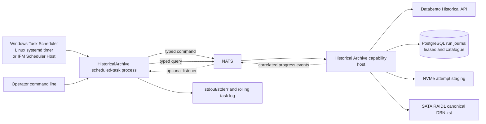

# Databento Historical Archive Scheduled-Task Design

**Version:** 1.2  
**Status:** Approved design candidate; implementation deferred until backtesting development  
**Date:** 2026-09-04  
**Primary workload:** Zero-additional-cost ES futures-option historical archive acquisition  
**Executable type:** Cross-platform one-shot .NET 10 console/Worker application  
**Required scheduling targets:** Windows Task Scheduler and Linux `systemd` timers  
**Optional scheduling target:** IFM Scheduler Host on Windows  
**Parent designs:**

- `Historical_Market_Data_Backtesting_Archive_Specification_v1.0.md`
- `Databento-ES-Options-Included-History-Loader-Design-v1.0.md`

This document supersedes the parent documents only for scheduled-task process structure, executable
naming, command-line syntax, and scheduling operations. Their data, cost, storage, and archive-integrity
policies remain authoritative.

---

## 1. Decision

The Databento included-history loader shall be implemented later as a real one-shot scheduled-task
executable named:

```text
TomasAI.IFM.Application.ScheduledTask.HistoricalArchive.exe
```

The executable shall follow the repository's modern scheduled-task pattern and remain directly
launchable by the native scheduler of the installed operating system:

1. start a generic .NET Host;
2. configure Serilog, NATS, typed command/query clients, and the shared scheduled-task runtime;
3. submit or inspect a durable Historical Archive operation through typed Command/Query contracts;
4. optionally listen for correlated progress events to enrich live logs;
5. query the durable run record until a terminal state is confirmed;
6. stop the NATS producer and host cooperatively; and
7. return an explicit process exit code that the scheduler can trust.

Windows Task Scheduler and Linux `systemd` timers are first-class deployment targets. The task shall
not require the IFM Scheduler Host to exist. The current Scheduler Host remains a supported Windows
operator/supervision option, but Linux scheduling shall use `systemd` directly until a cross-platform
Scheduler Host is deliberately designed and implemented.

The console process is an orchestration client, not the owner of Databento jobs, archive files, or
mutable workflow state. A separate Historical Archive capability host shall own provider requests,
cost gates, downloads, verification, manifests, publication, leases, restart recovery, and the
authoritative run journal.

This split allows a scheduler process to be cancelled, restarted, or disconnected without corrupting
or duplicating an archive acquisition. It also prevents API or UI startup from becoming the owner of
a multi-hour backfill.

No loader or scheduled-task code is to be developed as part of this design phase.

## 2. Repository findings and adopted conventions

The current scheduled-task projects establish a consistent operational model:

| Existing component | Pattern adopted by this design |
|---|---|
| `Application.ScheduledTask.FuturesMarketOpen` | Query required state, submit a typed command, validate `ServiceResult` |
| `Application.ScheduledTask.FuturesMarketClose` | Submit durable domain work instead of doing native backup work in the task |
| `Application.ScheduledTask.SetClosingPrice` | Compose several typed command/query APIs in a one-shot worker |
| `SceduledTask.TrainFuturesItiPredictiveModel` | Use a task-specific NATS client where no shared API exists yet |
| `Application.ScheduledTask.Shared` | Cooperative cancellation and exit codes `0`, `1`, `2`, and `3` |
| `Application.ServerManager.SchedulerHost` | Approved catalog, structured arguments, no shell, output capture, timeout, named-pipe cancellation, and process-tree ownership |

The legacy executables usually stop after durable command acceptance. That is sufficient for short
fire-and-forget operations, but it is insufficient for this loader: accepting a 12-month archive run
does not prove that the files were downloaded, verified, and published. Therefore this task shall
remain alive and confirm the operation's durable terminal state before returning success.

The current Scheduler Host is useful on Windows because it already owns persistent Quartz schedules,
run history, stdout/stderr capture, non-overlap protection, timeouts, and child-process lifecycle.
It is not a replacement for the cross-platform requirement: the same task must run directly from
Windows Task Scheduler or a Linux `systemd` timer without code changes to its domain protocol.

## 3. Scope

### 3.1 Included

- manual planning and bootstrap of the current included ES-options history;
- scheduled incremental reconciliation of newly available or missing coverage;
- status, coverage, health, verification, and cancellation commands;
- a hard zero-dollar provider cost ceiling in `IncludedOnly` mode;
- durable run identity, idempotency, leases, checkpoints, and restart recovery;
- listener-assisted progress logging with query-based completion authority;
- clean command-line usage from `cmd.exe` and PowerShell;
- native Windows Task Scheduler and Linux `systemd` deployment instructions;
- controlled provisioning, inspection, enable, disable, run-now, and removal of OS schedules;
- optional registration in the existing Windows IFM Scheduler Host task catalog; and
- design-time acceptance and test requirements.

### 3.2 Excluded from V1

- submitting any Databento request with an estimated cost above `$0.00`;
- strategy backtesting, strategy selection, Greeks calculation, or derived Parquet generation;
- an operator UI for configuring archive requests;
- downloading option `mbp-1`, `mbp-10`, or `mbo` data;
- loading the complete option quote archive into PostgreSQL or ScyllaDB;
- making API/UI startup wait for archive work;
- using process logs or an event listener as the authoritative completion record; and
- implementing this design before backtesting work is approved.

## 4. Target architecture



### 4.1 Process responsibilities

#### Scheduled-task executable

The executable shall:

- parse and validate the CLI command;
- obtain the scheduler-provided occurrence/run/attempt identifiers when present;
- start one NATS actor producer mailbox with a unique process identity;
- perform health and capacity preflight queries;
- submit a durable, idempotent archive command;
- attach an optional filtered progress listener after the durable run ID is known;
- poll the run query at a bounded interval and after reconnects;
- emit concise structured progress to stdout and Serilog sinks;
- translate the final domain state into the shared process exit code; and
- propagate cancellation by submitting a cancellation command, then wait for a bounded acknowledgement.

The executable shall not download DBN files or write canonical archive objects.

#### Historical Archive capability host

The capability host shall:

- be independently deployable from UI.Net and the API Server;
- own the Historical Archive Command/Event/Query handlers;
- own all Databento historical API and batch-download calls;
- enforce exact-request zero-cost estimates immediately before submission;
- persist provider batch job IDs and resumable download checkpoints;
- maintain PostgreSQL leases and the authoritative run state machine;
- validate and atomically publish immutable `DBN.zst` objects and manifests;
- publish correlated progress events after durable state changes; and
- recover incomplete operations without relying on the scheduler process.

The preferred production deployment is a dedicated headless Windows service, Linux `systemd` service,
or Aspire-managed worker. It must not be hosted only inside UI.Net. If hosted in the API during an
initial development phase, that is temporary and shall not be considered production-ready.

### 4.2 Scheduler independence

The executable contract is identical under every scheduling path:

```text
Windows Task Scheduler -> launch executable directly with Add arguments
Linux systemd timer -> start a oneshot service with an ExecStart argument vector
IFM Scheduler Host -> launch executable directly with ArgumentList (Windows option)
Operator -> launch executable directly from cmd.exe, PowerShell, or a POSIX shell
```

No scheduler path shall use `cmd.exe /c`, `sh -c`, a batch/shell wrapper, PowerShell, shell redirection,
or a mutable working directory to construct the business command.

Publish RID-specific, self-contained artifacts for `win-x64` and `linux-x64`. Windows invokes the
`.exe`; Linux invokes the executable file without an extension. Framework-dependent `dotnet *.dll`
launch is allowed for development but is not the preferred unattended deployment because it introduces
a machine-level runtime dependency.

## 5. Projects and boundaries proposed for implementation

| Project | Responsibility |
|---|---|
| `TomasAI.IFM.Domain.MarketData.HistoricalArchive.Shared` | Versioned commands, queries, events, IDs, states, and DTOs |
| `TomasAI.IFM.Domain.MarketData.HistoricalArchive` | Archive aggregate/coordinator, policies, state transitions, handlers |
| `TomasAI.IFM.Application.MarketData.HistoricalArchive.Host` | Independent capability host and dependency composition |
| `TomasAI.IFM.Application.ScheduledTask.HistoricalArchive` | One-shot CLI and scheduler adapter |
| `TomasAI.IFM.Application.ScheduledTask.Shared` | Existing exit outcome plus a cross-platform cancellation abstraction |
| future deployment/admin tooling | Native Windows Task Scheduler and Linux `systemd` provisioning adapters |
| corresponding UnitTests/IntegrationTests | CLI, actor contract, persistence, provider, scheduler, and recovery tests |

Existing historical provider code may be reused behind the capability host after it gains the
provider/native capabilities listed in the included-history loader design. The scheduled task shall
not reference native Databento bindings directly.

The existing shared runtime's named-pipe cancellation remains the Windows Scheduler Host adapter.
The cross-platform runtime must additionally honor .NET host shutdown triggered by `SIGTERM` and
`SIGINT`; `systemd` cancellation shall use `SIGTERM`. Platform-specific scheduler APIs must remain
outside the domain and provider projects.

## 6. Command, query, and event contracts

Names below are design names; final namespaces may be adjusted without changing their semantics.

### 6.1 Commands

#### `RequestHistoricalArchiveRunCommand`

Required fields:

| Field | Meaning |
|---|---|
| `RequestId` | Idempotency key for this requested occurrence |
| `CorrelationId` | End-to-end scheduler/log correlation |
| `RequestedBy` | Scheduler task identity or operator identity |
| `Origin` | `ScheduledTask`, `ManualCli`, or approved recovery origin |
| `Operation` | `Plan`, `BootstrapIncluded`, `Reconcile`, or `Verify` |
| `Product` | Initially `EsOptions` |
| `LookbackMonths` | Maximum desired included window; initially `12` |
| `CostPolicy` | Must be `IncludedOnly` for V1 |
| `MaximumCostUsd` | Must equal decimal `0.00` |
| `RequestedMonth` | Optional exact month for manual verify/repair |
| `MaximumDuration` | Requested domain-operation bound |
| `DryRun` | Persist plan and diagnostics without provider submission or publication |
| `ScheduledFireUtc` | Original scheduled occurrence, when available |

The returned value shall contain the durable `ArchiveRunId`, disposition (`Created`, `AlreadyActive`,
`AlreadyCompleted`, or `Rejected`), accepted request hash, and current state.

#### `CancelHistoricalArchiveRunCommand`

Contains `ArchiveRunId`, `RequestId`, caller identity, reason, and correlation ID. Cancellation is a
durable request. It checkpoints safe progress and never deletes valid staged or published objects.

### 6.2 Queries

| Query | Purpose |
|---|---|
| `GetHistoricalArchiveRunQuery` | Authoritative state, progress, last error, provider cost, and terminal result |
| `GetHistoricalArchiveCoverageQuery` | Verified schema/date/month coverage and gaps |
| `GetHistoricalArchiveHealthQuery` | Capability, NATS, Databento metadata, catalogue, staging, and archive-root readiness |
| `GetHistoricalArchivePlanQuery` | Persisted request units, estimates, capacity forecast, and request hash |

The console shall always execute a final run query before returning success, even if it observed a
terminal progress event.

### 6.3 Progress events and listener policy

Suggested events:

- `HistoricalArchiveRunStateChangedEvent`
- `HistoricalArchiveRequestUnitStartedEvent`
- `HistoricalArchiveRequestUnitCompletedEvent`
- `HistoricalArchiveObjectPublishedEvent`
- `HistoricalArchiveProgressUpdatedEvent`
- `HistoricalArchiveBillingPolicyViolationEvent`

The listener exists for responsive logs and future operator telemetry. It is not the source of truth:

- events are filtered by `ArchiveRunId`/`CorrelationId`;
- missed or duplicate progress events are harmless;
- every event is monotonic by persisted run sequence number;
- the console discards sequence regressions and duplicate sequence numbers;
- listener disconnects do not fail the archive operation;
- the console falls back to periodic queries while disconnected; and
- the final process result comes only from the authoritative run query.

A one-shot task must not create a permanent durable consumer per run. Prefer a filtered ephemeral
listener for progress. PostgreSQL retains the audit/run journal; JetStream durability is reserved for
domain event processing that actually requires replay, not console log convenience.

## 7. Durable run lifecycle

```text
Requested
  -> Validating
  -> Planned
  -> WaitingForLease
  -> Estimating
  -> Acquiring
  -> Downloading
  -> Verifying
  -> Publishing
  -> Completed

Any active state -> CancellationRequested -> Cancelled
Any active state -> Failed
Any submission with positive estimate -> BillingPolicyBlocked
No missing work -> NoWork
```

`Completed`, `NoWork`, `Cancelled`, `Failed`, and `BillingPolicyBlocked` are terminal. A terminal run
never returns to an active state.

`NoWork` is a successful reconciliation result and returns process exit code `0`. It is not a special
success exit code because the current Scheduler Host normally approves only `0`.

### 7.1 Idempotency and overlap

- The console shall use `IFM_SCHEDULED_OCCURRENCE_ID` as its `RequestId` under Scheduler Host.
- Under direct Windows Task Scheduler or Linux `systemd`, it shall derive a deterministic occurrence
  key from task key, product, operation, scheduled local date/week, and environment unless
  `--request-id` is supplied.
- Repeating the same request returns the existing run rather than submitting another provider job.
- A PostgreSQL lease permits only one mutating run for an overlapping product/schema/time range.
- Scheduler `Do not start a new instance`/Scheduler Host non-overlap is useful but not the domain lock.
- A new occurrence may attach to a compatible active reconciliation instead of failing or duplicating it.

### 7.2 File-level checkpoint and restart contract

Recovery is file-granular. A month is a packaging boundary, not the unit that must be downloaded again
after failure. PostgreSQL shall record each provider request unit and each provider-delivered file with
at least:

| Checkpoint field | Purpose |
|---|---|
| `ArchiveRunId` and request-unit ID | Locate the owning durable workflow |
| canonical request hash | Prove dataset, schema, symbols, symbology, and time range are unchanged |
| provider batch job ID and stable file ID/name | Reattach without submitting a duplicate job |
| expected byte length and provider ETag/checksum when supplied | Validate safe byte-range continuation |
| local partial/staged/canonical paths | Reconcile database state with actual files |
| bytes received | Progress hint; actual partial-file length is rechecked on restart |
| locally calculated SHA-256 | Identify the exact completed object |
| DBN validation result/version | Prove the file is decodable under the approved validator |
| state, attempt count, last error, and timestamps | Recovery and operational evidence |

Per-file states are:

```text
Planned
  -> ProviderAvailable
  -> Downloading
  -> Downloaded
  -> Verified
  -> Published

Any nonterminal state -> RetryWaiting -> prior safe state
Any state -> Quarantined or Failed
```

`Published` is the successful-file boundary. “Downloaded” alone is not enough because the bytes may
be incomplete or corrupt. On restart:

1. acquire/recover the product/range lease and locate the existing run by request ID or active range;
2. re-query the existing Databento batch job using its persisted provider job ID;
3. reconcile every nonterminal database row with the staging and canonical files;
4. skip every `Published` object whose canonical size and SHA-256 still match;
5. publish a `Verified` staged object without downloading it again;
6. validate a complete `Downloaded` object, then publish it if valid;
7. resume an incomplete `.partial` file only when the provider returns the same stable object identity,
   ETag/length, and supports a byte-range request;
8. otherwise discard/quarantine only that incomplete `.partial` object and restart that file; and
9. continue with the next required file, then finalize the month manifest only after all required files
   are `Published`.

Temporary download URLs are never treated as durable identity and are not logged or persisted as
credentials. If a URL expires, the host asks Databento for a fresh URL for the existing batch job/file.
It does not submit a new batch job merely because a download URL expired.

The host checkpoints progress after each successful file and periodically during a large partial
download (default: every 30 seconds or 64 MiB, whichever comes first). Persisted byte counts are
advisory; restart always verifies the actual `.partial` length before sending a range request.

### 7.3 Atomic publication and crash windows

Because NVMe staging and SATA archive storage are different volumes, publication cannot depend on a
cross-volume rename. The host shall:

1. copy the verified staged file to a uniquely named temporary file in the final SATA directory;
2. flush the target file to durable storage;
3. recalculate/confirm size and SHA-256 on the target volume;
4. atomically rename the target-volume temporary file to its immutable canonical name; and
5. commit the `Published` checkpoint and canonical object metadata.

Restart reconciliation handles every crash window deterministically:

| Observed restart state | Recovery action |
|---|---|
| `.partial` exists; row is `Downloading` | Validate identity/length and range-resume, or restart only that file |
| full staged file exists; row is `Downloading`/`Downloaded` | Hash and DBN-validate it before reuse |
| row is `Verified`; staged file is valid | Publish it without provider download |
| canonical file exists; row is not `Published` | Validate and adopt it, then commit `Published` |
| row says `Published`; canonical file is absent or mismatched | Stop, mark integrity failure, and repair/restore under policy |
| target-directory temporary file exists | Validate/adopt if complete; otherwise remove only that temporary file |
| provider job exists; local process state was lost | Reattach to the same job and continue its remaining files |
| provider job failed permanently | Preserve evidence; a replacement submission requires a fresh exact `$0.00` estimate |

The monthly manifest is written to a temporary file, flushed, hashed, and atomically renamed only when
all required objects are published. An incomplete month therefore remains explicitly incomplete and
cannot be mistaken for backtest-ready coverage.

### 7.4 Process and machine restart behavior

- **Scheduled-task console fails:** the capability host continues the durable run. Restarting the same
  `reconcile` command queries by occurrence/request ID or attaches to the compatible active run and
  waits; it does not start over.
- **Capability host fails:** its Windows service, Linux service, or Aspire owner restarts it. Startup
  recovery acquires leases, reconciles checkpoints/files, and resumes incomplete work automatically.
- **Whole machine restarts:** the capability host starts before normal archive administration. It
  recovers the run from PostgreSQL and storage checkpoints. A later/manual scheduled-task invocation
  attaches for observation and returns the authoritative terminal result.
- **PostgreSQL is unavailable:** no provider submission or publication occurs because idempotency and
  checkpoints cannot be proven. Recovery waits/fails closed.
- **SATA archive is unavailable:** downloads may pause only within configured NVMe capacity; nothing is
  reported `Published` until the canonical target is available and verified.

The one-shot task itself shall not use an unlimited automatic restart loop. Some failures—positive
cost, corrupt data, invalid configuration, or missing archive storage—require intervention. Scheduler
retry is bounded, while the durable capability host performs safe workflow recovery.

## 8. CLI contract

### 8.1 General syntax

```text
TomasAI.IFM.Application.ScheduledTask.HistoricalArchive.exe <command> [options]
```

Commands:

| Command | Mutates provider/archive | Waits for terminal state | Purpose |
|---|---:|---:|---|
| `plan` | No | Yes | Discover coverage, cost, capacity, and exact request units |
| `bootstrap-included` | Yes | Yes | Acquire the maximum current zero-cost window, up to 12 months |
| `reconcile` | Yes | Yes | Repair gaps and append newly complete included coverage |
| `verify` | No, unless `--repair` | Yes | Verify object hashes/DBN/manifests for a month or current coverage |
| `status` | No | Not applicable | Query a run or current product status and exit |
| `coverage` | No | Not applicable | Print verified local coverage and gaps |
| `health` | No | Not applicable | Validate required dependencies and permissions |
| `cancel` | Command only | Bounded acknowledgement | Request cancellation of a durable run |

Common options:

```text
--product es-options
--lookback-months 12
--included-only
--month YYYY-MM
--run-id <guid>
--request-id <guid>
--correlation-id <guid>
--maximum-duration HH:MM:SS
--poll-interval HH:MM:SS
--environment Development|Production
--output text|json
--repair
```

Rules:

- `bootstrap-included` and `reconcile` require `--included-only` in V1.
- No `--maximum-cost` or `--allow-paid` switch exists in V1.
- Unknown options and invalid combinations fail before NATS connection.
- CLI options override environment-specific configuration only where explicitly allowed.
- Commands default to human-readable output when interactive and newline-delimited JSON when the
  scheduler correlation environment variables are present.
- Progress is written to stdout; validation, connection, and terminal errors are written to stderr.
- Secrets are never accepted as command-line options.

### 8.2 Examples from `cmd.exe`

Set the deployment directory once for an interactive session:

```cmd
cd /d C:\TomasAI\IFMAppDir\Tasks\HistoricalArchive
```

Check dependencies:

```cmd
TomasAI.IFM.Application.ScheduledTask.HistoricalArchive.exe health --environment Production
```

Preview the current included plan without downloading data:

```cmd
TomasAI.IFM.Application.ScheduledTask.HistoricalArchive.exe plan --product es-options --lookback-months 12 --included-only --output text --environment Production
```

Run the initial bootstrap manually after reviewing the plan:

```cmd
TomasAI.IFM.Application.ScheduledTask.HistoricalArchive.exe bootstrap-included --product es-options --lookback-months 12 --included-only --maximum-duration 30:00:00 --environment Production
```

Run the normal scheduled reconciliation manually:

```cmd
TomasAI.IFM.Application.ScheduledTask.HistoricalArchive.exe reconcile --product es-options --lookback-months 12 --included-only --maximum-duration 30:00:00 --environment Production
```

Inspect a run:

```cmd
TomasAI.IFM.Application.ScheduledTask.HistoricalArchive.exe status --run-id 00000000-0000-0000-0000-000000000000 --output json --environment Production
```

Verify one archived month:

```cmd
TomasAI.IFM.Application.ScheduledTask.HistoricalArchive.exe verify --product es-options --month 2026-08 --environment Production
```

Request cancellation:

```cmd
TomasAI.IFM.Application.ScheduledTask.HistoricalArchive.exe cancel --run-id 00000000-0000-0000-0000-000000000000 --environment Production
```

### 8.3 Examples from Linux

Assuming the self-contained Linux deployment is installed under `/opt/tomasai/ifm`:

```bash
cd /opt/tomasai/ifm/tasks/historical-archive
./TomasAI.IFM.Application.ScheduledTask.HistoricalArchive health --environment Production
```

Preview the included plan:

```bash
./TomasAI.IFM.Application.ScheduledTask.HistoricalArchive plan --product es-options --lookback-months 12 --included-only --output text --environment Production
```

Run the normal reconciliation manually:

```bash
./TomasAI.IFM.Application.ScheduledTask.HistoricalArchive reconcile --product es-options --lookback-months 12 --included-only --maximum-duration 30:00:00 --environment Production
```

The installed binary shall be owned by `root`, not writable by the task service account, and executable
by that account. Manual production execution should use `systemctl start` so service identity, resource
limits, environment, and logging match scheduled execution.

### 8.4 Process exit codes

The project shall reuse `ScheduledTaskExitCode`:

| Code | Name | Meaning |
|---:|---|---|
| `0` | `Succeeded` | Completed, NoWork, valid plan, valid status/coverage/health result |
| `1` | `Failed` | Durable run failed, cost policy blocked, dependency failure, or query failure |
| `2` | `Cancelled` | Task or durable operation was cancelled |
| `3` | `InvalidConfiguration` | Invalid CLI/configuration or missing required non-secret configuration |

A positive-cost request is code `1`, not a successful no-op. The structured terminal log must include
`TerminalState=BillingPolicyBlocked` and the exact estimate without exposing credentials.

## 9. Configuration and secrets

Configuration precedence shall be:

1. `appsettings.json`;
2. `appsettings.{Environment}.json`;
3. approved environment variables;
4. permitted command-line options.

Platform configuration locations shall be explicit:

| Platform | Deployment | Non-secret machine configuration | Task log |
|---|---|---|---|
| Windows | `C:\TomasAI\IFMAppDir\Tasks\HistoricalArchive` | deployment `appsettings*.json` plus approved machine environment | `C:\ProgramData\TomasAI\IFM\ScheduledTasks\HistoricalArchive\Logs` |
| Linux | `/opt/tomasai/ifm/tasks/historical-archive` | `/etc/tomasai/ifm/historical-archive-task.env` and deployment `appsettings*.json` | `journald`; optional `/var/log/tomasai/ifm/historical-archive` |

The Linux environment file shall be owned by `root`, mode `0640` or stricter, and readable only by the
task account/group. The scheduled-task client normally needs only NATS connectivity; the Databento
credential remains with the capability host.

Proposed non-secret configuration:

```json
{
  "HistoricalArchiveTask": {
    "Product": "es-options",
    "LookbackMonths": 12,
    "IncludedOnly": true,
    "PollIntervalSeconds": 30,
    "ListenerEnabled": true,
    "MaximumDuration": "30:00:00",
    "CancellationAcknowledgementSeconds": 30
  },
  "Nats": {
    "Url": "nats://localhost:4222"
  }
}
```

Archive roots, staging roots, Databento dataset/schema policy, capacity limits, and provider credentials
belong to the capability host, not the scheduled-task client.

The Databento API key shall come from an approved secret provider or service-account-scoped protected
environment configuration in the capability host. It shall never be stored in Task Scheduler
arguments, task XML, appsettings committed to source, stdout/stderr, or the scheduler catalogue.

## 10. Scheduling policy

### 10.1 Initial bootstrap

The 12-month bootstrap is a manual, reviewed operation rather than a recurring trigger:

1. run `health`;
2. run `plan` and review exact zero-cost and capacity evidence;
3. start `bootstrap-included` during the Friday-to-Sunday maintenance window;
4. let the domain operation resume if the console or workstation is interrupted; and
5. verify terminal coverage and actual compressed storage before enabling reconciliation.

The loader processes the oldest eligible interval first because the included-history boundary moves
forward over time.

### 10.2 Recurring reconciliation

Recommended V1 schedule:

| Setting | Value |
|---|---|
| Frequency | Weekly |
| Day/time | Saturday 00:30 America/New_York |
| Command | `reconcile` |
| Lookback | 12 months maximum |
| Cost mode | `IncludedOnly` only |
| Misfire | `DoNothing`; operator reviews and runs manually if needed |
| Overlap | Disallowed |
| Maximum process runtime | 30 hours |

A weekly trigger is intentional. The reconcile command is deterministic and normally returns `NoWork`.
It captures a newly complete month promptly, repairs still-free gaps before they age out, and avoids
encoding fragile “first Saturday of month” calendar logic in Windows Task Scheduler.

After operating evidence exists, the cadence may be reduced to monthly. The domain planner, not the
scheduler expression, decides which exact intervals need acquisition.

## 11. IFM Scheduler Host registration (optional Windows integration)

When implementation is approved, add a disabled catalogue entry similar to:

```json
{
  "TaskKey": "historical-archive-reconcile",
  "DisplayName": "Historical Archive Reconcile",
  "Description": "Reconciles included Databento ES-options history without permitting paid requests.",
  "ExecutablePath": "Tasks\\HistoricalArchive\\TomasAI.IFM.Application.ScheduledTask.HistoricalArchive.exe",
  "WorkingDirectory": "Tasks\\HistoricalArchive",
  "DefaultArguments": [
    "reconcile",
    "--product", "es-options",
    "--lookback-months", "12",
    "--included-only",
    "--maximum-duration", "30:00:00",
    "--environment", "Production"
  ],
  "EnvironmentAllowlist": [],
  "RequiredEnvironment": "Production",
  "SuccessExitCodes": [0],
  "GracefulStopMode": "NamedPipe",
  "RequiresApi": false,
  "RequiredEndpoints": ["NATS"],
  "MaximumRuntimeSeconds": 108000,
  "RiskClassification": "Maintenance",
  "ManifestVersion": "1"
}
```

The initial schedule definition shall be disabled and reviewed before enablement. Scheduler Host shall
inject its normal `IFM_SCHEDULED_*` correlation environment variables, capture stdout/stderr, assign a
kill-on-close Job Object, and issue cooperative cancellation through the shared named pipe.

`RequiresApi` is false because the task depends on NATS and the independent Historical Archive
capability host, not the interactive API/UI process. A capability-specific readiness endpoint may be
added to `RequiredEndpoints` when Scheduler Host supports that probe.

## 12. Native operating-system scheduler integration

The installed operating system owns the recurring trigger:

- Windows uses Windows Task Scheduler 2.0.
- Linux uses a `systemd` `.timer` that starts a `.service` with `Type=oneshot`.

Exactly one trigger authority may be enabled for a task/environment pair. Do not enable Windows Task
Scheduler and IFM Scheduler Host for the same Production reconciliation. Likewise, do not install both
a `systemd` timer and a cron entry. The domain request idempotency and lease are final safety guards,
not permission to operate duplicate schedulers.

### 12.1 Scheduler access and provisioning boundary

The Historical Archive task executable shall not create, edit, enable, or delete its own schedule.
Those actions require elevated operating-system authority and belong to deployment/administration.

The future implementation shall include either a small cross-platform IFM schedule-administration
command or equivalent signed deployment tooling exposing these controlled operations:

```text
schedule install --task historical-archive-reconcile --scheduler auto
schedule show --task historical-archive-reconcile
schedule enable --task historical-archive-reconcile
schedule disable --task historical-archive-reconcile
schedule run-now --task historical-archive-reconcile
schedule history --task historical-archive-reconcile
schedule remove --task historical-archive-reconcile
```

Its platform adapters shall use native scheduler facilities:

| Platform | Native access | Required behavior |
|---|---|---|
| Windows | Task Scheduler 2.0 COM API or reviewed deployment PowerShell using the `ScheduledTasks` module | Register an `ExecAction`, principal, weekly trigger, settings, and task ACL without shell-wrapping the workload |
| Linux | Versioned unit files plus systemd D-Bus or reviewed `systemctl` deployment commands | Install service/timer, reload units, enable/disable/start, and read unit/timer status |

The conceptual adapter boundary is:

```text
DetectScheduler()
GetDefinition(taskKey)
InstallOrUpdate(taskManifest, enabled=false)
Enable(taskKey)
Disable(taskKey)
RunNow(taskKey)
GetStatus(taskKey)
GetRecentRuns(taskKey)
Remove(taskKey)
```

`taskManifest` is selected from a signed/approved catalogue. These APIs never accept an arbitrary
executable, shell command, environment variable, or secret from a normal operator.

The administration layer shall generate a proposed definition, show a diff, and require an explicit
privileged apply. It shall verify the installed executable hash, arguments, identity, schedule,
timezone, disabled/enabled state, and maximum runtime after registration. Normal archive execution
continues under an unprivileged service identity.

Read-only status/history access may be delegated to operators. Creating, changing, enabling, or
removing a Production schedule requires the OS administrator/deployment role and an audit record.

### 12.2 Windows Task Scheduler configuration

Windows Task Scheduler shall launch the executable directly.

#### 12.2.1 General tab

| Field | Value |
|---|---|
| Name | `IFM Historical Archive Reconcile` |
| Account | Dedicated least-privilege IFM task service account |
| Run mode | Run whether user is logged on or not |
| Highest privileges | Off unless validated storage ACLs require it |
| Configure for | The deployed Windows version |

The account needs execute permission on the task deployment, write permission on its log directory,
and network access to NATS. It does not need direct write permission to the canonical archive because
the capability host owns archive publication.

#### 12.2.2 Trigger tab

| Field | Value |
|---|---|
| Schedule | Weekly, Saturday |
| Start | `00:30` local Eastern time |
| Enabled | Only after bootstrap acceptance |
| Delay | Optional randomized delay up to 10 minutes |

#### 12.2.3 Action tab

```text
Program/script:
C:\TomasAI\IFMAppDir\Tasks\HistoricalArchive\TomasAI.IFM.Application.ScheduledTask.HistoricalArchive.exe

Add arguments:
reconcile --product es-options --lookback-months 12 --included-only --maximum-duration 30:00:00 --environment Production

Start in:
C:\TomasAI\IFMAppDir\Tasks\HistoricalArchive
```

Do not quote the entire Program/script plus arguments as one command. Task Scheduler stores the
executable and argument string separately.

#### 12.2.4 Conditions and settings tabs

- Start only if the NATS/capability-host network is available where that condition is reliable.
- Wake the computer to run the task if unattended archive maintenance is desired.
- Prefer “Start the task as soon as possible after a scheduled start is missed” only if operations
  accepts a delayed weekend run; otherwise keep strict `DoNothing` parity and launch manually.
- If the task is already running, choose **Do not start a new instance**.
- Allow one scheduler retry after 15 minutes only for a failure clearly reported before command
  acceptance. Domain idempotency makes a repeated occurrence safe, but ambiguous retries must attach
  to/query the prior durable run rather than create a new one.
- Stop the task after 30 hours and request cooperative cancellation first. If Windows Task Scheduler
  cannot guarantee cooperative control, prefer Scheduler Host for production operation.
- Do not select “If the running task does not end when requested, force it to stop” without verifying
  that the capability host, not the console, owns all mutable download state.
- Keep task history enabled and alert on any last-run result other than `0x0`.

The scheduled-task process can be terminated without corrupting the durable archive workflow, but its
termination must be visible as scheduler failure/abandonment. An operator then runs `status` or the
same idempotent `reconcile` command to reattach and confirm the authoritative result.

#### 12.2.5 Windows administration examples

The deployed task shall be registered from a reviewed XML definition or a deployment script using
`Register-ScheduledTask`; a GUI-created definition may be used for development only. After
registration, operators may use:

```cmd
schtasks /Query /TN "\TomasAI\IFM Historical Archive Reconcile" /V /FO LIST
schtasks /Run /TN "\TomasAI\IFM Historical Archive Reconcile"
schtasks /End /TN "\TomasAI\IFM Historical Archive Reconcile"
```

Enable, disable, create, and delete operations are privileged deployment actions. `schtasks /End`
stops the console observer and may request cancellation; operators must query the durable archive run
before deciding whether domain work needs further action.

### 12.3 Linux `systemd` configuration

Linux shall use two source-controlled unit templates installed into `/etc/systemd/system`. Cron is not
the Production scheduler because it lacks the required service identity, structured status, resource
policy, and journal integration.

#### 12.3.1 One-shot service unit

`tomasai-ifm-historical-archive-reconcile.service`:

```ini
[Unit]
Description=IFM Databento historical archive reconciliation
Wants=network-online.target
After=network-online.target

[Service]
Type=oneshot
User=ifm-archive-task
Group=ifm-archive-task
WorkingDirectory=/opt/tomasai/ifm/tasks/historical-archive
Environment=IFM_ENVIRONMENT=Production
EnvironmentFile=-/etc/tomasai/ifm/historical-archive-task.env
ExecStart=/opt/tomasai/ifm/tasks/historical-archive/TomasAI.IFM.Application.ScheduledTask.HistoricalArchive reconcile --product es-options --lookback-months 12 --included-only --maximum-duration 30:00:00 --environment Production
TimeoutStartSec=30h
TimeoutStopSec=45s
KillSignal=SIGTERM
Restart=no
StandardOutput=journal
StandardError=journal
SyslogIdentifier=tomasai-ifm-historical-archive
NoNewPrivileges=true
PrivateTmp=true
ProtectSystem=strict
ProtectHome=true
RestrictSUIDSGID=true

```

The task client does not write archive data, so `ProtectSystem=strict` is compatible. If a future task
requires a local file sink, add only its exact log directory through `ReadWritePaths`; do not weaken
the entire service sandbox.

#### 12.3.2 Timer unit

`tomasai-ifm-historical-archive-reconcile.timer`:

```ini
[Unit]
Description=Schedule IFM historical archive reconciliation

[Timer]
OnCalendar=Sat *-*-* 00:30:00 America/New_York
Persistent=false
RandomizedDelaySec=10m
AccuracySec=1m
Unit=tomasai-ifm-historical-archive-reconcile.service

[Install]
WantedBy=timers.target
```

`Persistent=false` implements the default `DoNothing` misfire policy: a Saturday occurrence missed
while the machine is off is not automatically replayed at an arbitrary later time. An operator may
run it manually after checking the trading and maintenance window.

#### 12.3.3 Linux administration examples

Install/upgrade operations are performed by deployment tooling with root authority:

```bash
sudo systemctl daemon-reload
sudo systemctl enable --now tomasai-ifm-historical-archive-reconcile.timer
```

Normal inspection and operation:

```bash
systemctl list-timers tomasai-ifm-historical-archive-reconcile.timer
systemctl status tomasai-ifm-historical-archive-reconcile.timer
systemctl status tomasai-ifm-historical-archive-reconcile.service
journalctl -u tomasai-ifm-historical-archive-reconcile.service
sudo systemctl start tomasai-ifm-historical-archive-reconcile.service
sudo systemctl stop tomasai-ifm-historical-archive-reconcile.service
```

Stopping the service sends `SIGTERM`. The .NET host shall translate that into its cancellation token,
submit the durable cancellation command, wait for the bounded acknowledgement, and exit `2`. If the
console cannot contact the capability host, systemd still stops it after `TimeoutStopSec`; the durable
run is inspected by request/run ID on the next invocation.

#### 12.3.4 Linux service identity and permissions

- `ifm-archive-task` is a non-login system account.
- `/opt/tomasai/ifm` binaries and unit files are root-owned and not writable by the task account.
- `/etc/tomasai/ifm/historical-archive-task.env` is root-owned and minimally readable.
- The account may connect only to required NATS/capability endpoints.
- The account has no direct Databento secret and no canonical archive write permission.
- `journalctl` access is granted through a narrowly scoped operator group when required.
- SELinux/AppArmor policy, when enabled, permits only the documented executable, configuration reads,
  network destinations, and optional log path.

### 12.4 Schedule drift and health checks

On either platform, deployment validation shall compare the installed native schedule against its
version-controlled desired definition. Drift includes executable path/hash, arguments, account,
frequency, timezone, enabled state, retry/misfire settings, timeout, or logging changes.

The native scheduler status is separate from domain health:

```text
Trigger installed/enabled?
    -> last native launch and process exit code?
        -> durable ArchiveRun terminal state?
            -> expected verified archive coverage present?
```

Monitoring shall alert independently on a disabled/missing trigger, repeated non-zero exits, a stale
or active run beyond its bound, and archive coverage falling behind the latest eligible complete
month.

## 13. Logging, telemetry, and audit

Every log record shall carry, when available:

- application/task key;
- environment and machine;
- scheduler run, occurrence, and attempt IDs;
- task request/correlation ID;
- durable archive run ID;
- operation and product;
- domain state and monotonic sequence;
- completed/total request units, objects, and bytes;
- provider estimated and final cost; and
- elapsed time and last successful checkpoint.

Logging targets:

1. console stdout/stderr for Scheduler Host capture;
2. a rolling local file for direct Windows Task Scheduler runs;
3. the `systemd` journal for Linux runs; and
4. existing OpenTelemetry/central log export when configured.

Recommended local path:

```text
C:\ProgramData\TomasAI\IFM\ScheduledTasks\HistoricalArchive\Logs\HistoricalArchive_.log
```

Recommended Linux query:

```bash
journalctl -u tomasai-ifm-historical-archive-reconcile.service --since today
```

Logs are diagnostics. PostgreSQL run state, object hashes, manifests, provider job IDs, estimates, and
final provider charges are the audit evidence. A listener event must never be the only record that an
object was downloaded or a run completed.

Progress should be rate-limited: log state transitions immediately, object/month completion once,
and aggregate byte/object progress no more than once every 30 seconds. Do not emit one log line per
market-data record.

## 14. Failure and recovery behavior

| Failure | Scheduled-task behavior | Capability-host behavior |
|---|---|---|
| NATS unavailable before acceptance | Log to stderr, exit `1` | No run created |
| Capability host unhealthy | Log health result, exit `1` | Remains authoritative/unhealthy |
| Duplicate scheduled occurrence | Attach/query existing run | Return existing run ID |
| Listener disconnect | Continue query polling | No effect on work |
| Console cancelled | Submit cancellation, wait bounded time, exit `2` | Checkpoint and cancel safely |
| Console killed/workstation restart | Next run queries/attaches | Resume from durable job/file checkpoints |
| Positive cost estimate | Exit `1` with blocked state | Never submit provider request |
| Disk capacity gate fails | Exit `1` | Keep plan/checkpoints; publish nothing partial |
| Object validation fails | Exit `1` | Quarantine object, retain evidence, permit selective repair |
| Missing old object now outside free window | Exit `1`/needs restore | Never purchase automatically; request backup restore |
| No missing/new work | Exit `0` | Persist/return `NoWork` evidence |

The task must distinguish “command was not accepted” from “command may have been accepted but response
was lost.” In the ambiguous case it queries by `RequestId` before any resubmission.

## 15. Resource and realtime-system isolation

- Archive work runs independently of the realtime Databento feed owner.
- Historical download concurrency, hashing, and validation are bounded in the capability host.
- Realtime API, market data, Market Outlook, and trading processes have CPU/I/O/network priority.
- Canonical files are streamed from Databento into attempt-scoped NVMe staging, verified, then
  atomically published to SATA RAID1.
- The console task has negligible market-data memory pressure; it receives only progress summaries.
- The host pauses or throttles acquisition when configured CPU, disk latency, NVMe free-space, SATA
  queue, or network thresholds are exceeded.
- A pause is a durable state and does not cause Task Scheduler to start a second operation.

## 16. Security model

- Typed actor APIs are the only remote control surface used by the scheduled task.
- The task identity has only archive plan/reconcile/status/cancel roles.
- Provider credentials and canonical storage credentials remain in the capability host.
- Every command includes caller identity, authorization reference, roles, origin, request ID,
  correlation ID, environment identity, and creation time.
- A Production task cannot target Development and vice versa.
- Archive root and deployment paths are absolute, canonicalized, and confined to approved roots.
- Task arguments cannot introduce arbitrary symbols, schemas, paths, executable names, URLs, or
  positive spending limits.
- Executables shall be hash-pinned or signature-verified by native deployment tooling; Scheduler Host
  shall retain its existing optional hash check.

## 17. Acceptance criteria for future implementation

### 17.1 CLI and scheduler

1. Every documented command produces deterministic help, validation, and exit codes.
2. RID-specific artifacts run directly from `cmd.exe`/Windows Task Scheduler and a Linux shell/`systemd`.
3. Scheduler Host captures stdout/stderr without deadlock and cancels through the named pipe.
4. Invalid configuration returns `3`; failed durable work returns `1`; cancellation returns `2`.
5. A successful no-op reconciliation returns `0` with explicit `NoWork` evidence.
6. A second overlapping scheduled launch does not create a second provider job.
7. `SIGTERM` causes bounded cooperative cancellation under `systemd`.
8. Native schedule provisioning produces the reviewed Windows task or Linux service/timer definition.
9. Schedule drift detection reports changed arguments, identity, hash, trigger, timezone, or timeout.
10. Only one scheduling authority can be enabled for the task/environment pair.

### 17.2 Commands, queries, listener, and recovery

11. Command acceptance returns a durable run ID and persisted request hash.
12. The console observes progress through a listener when available and continues through queries when
   the listener is disconnected.
13. A terminal event without a matching terminal query cannot produce exit code `0`.
14. Losing the command response after durable acceptance does not duplicate a run.
15. Killing and restarting the console reattaches to or locates the durable run.
16. Capability-host restart resumes from provider job IDs and object checkpoints.
17. A crash while downloading file N does not download already published files 1 through N-1 again.
18. A compatible partial file resumes by byte range; changed ETag/length restarts only that file.
19. A canonical file published immediately before a database outage is validated and adopted on restart.
20. A `Published` checkpoint with a missing or mismatched canonical file fails integrity checks.
21. An expired download URL is refreshed against the existing provider job without duplicate submission.

### 17.3 Cost and archive integrity

22. Every provider submission has a fresh exact estimate of `$0.00`.
23. Any positive estimate prevents submission and returns `BillingPolicyBlocked`/exit `1`.
24. An empty archive acquires the maximum current zero-cost interval up to 12 months.
25. Eleven valid months plus one missing month acquires only the missing coverage.
26. A corrupt daily object is selectively repaired if still included.
27. A missing object outside the included window requires restore and is never bought automatically.
28. Files and manifests are hashed, DBN-decoded, validated, and atomically published.
29. Repeated replay of a manifest produces the same ordered-record hash.

### 17.4 Operational safety

30. Stopping the API, UI, Server Manager, or scheduled-task console does not corrupt archive state.
31. The task does not start/stop or delay the realtime market-data lifecycle.
32. Listener/log volume remains bounded during a full-chain option BBO acquisition.
33. Windows Task Scheduler, `systemd`, or Scheduler Host records a non-success result whenever durable completion is not
    confirmed before the process deadline.

## 18. Deferred implementation sequence

When backtesting work is approved, implement in this order:

1. Historical Archive domain contracts and durable state model.
2. Provider/native additions for `bbo-1s`, `status`, parent symbology, and daily DBN splitting.
3. Independent capability host, PostgreSQL catalogue/leases, and exact zero-cost planner.
4. Opaque DBN batch acquisition, per-file checkpoints/range resume, restart reconciliation,
   validation, manifests, and cross-volume atomic publication.
5. Typed NATS Command/Query APIs and filtered progress events.
6. Cross-platform scheduled-task CLI and Windows named-pipe/Linux signal cancellation adapters.
7. Self-contained `win-x64` and `linux-x64` publish/package pipelines.
8. Version-controlled Windows Task Scheduler definition and Linux `systemd` service/timer templates.
9. Privileged provisioning/drift-validation tooling for the native scheduler selected by the host OS.
10. Unit/integration tests for CLI, idempotency, listener fallback, recovery, native scheduling, signals,
    and positive-cost blocking.
11. Direct Windows and Linux one-week dry-run/pilot.
12. Manual included-history bootstrap, oldest eligible interval first.
13. Install exactly one disabled native/IFM schedule definition and validate it in Development.
14. Enable the reviewed Production schedule.
15. Develop the replay/backtesting layer only after canonical archive acceptance.

## 19. Final operational contract

The scheduled task answers one question for its scheduler: **did the requested archive operation reach
an authoritative safe terminal result?**

- `0` means yes: completed, no work was necessary, or the requested read-only check succeeded.
- `1` means no: failure, unsafe/paid request blocked, or authoritative completion was not confirmed.
- `2` means cancellation was requested and observed.
- `3` means the task could not start because its command or configuration was invalid.

The listener makes the run observable. The query makes the result trustworthy. The Historical Archive
capability host makes it durable. Windows Task Scheduler or Linux `systemd` decides when to launch the
one-shot console; the optional IFM Scheduler Host may perform that role on Windows, but is not required.

## 20. Revision history

| Version | Date | Summary |
|---|---|---|
| 1.0 | 2026-09-04 | Defined the durable scheduled-task console, CLI, command/query/listener contract, and Windows scheduling model. |
| 1.1 | 2026-09-04 | Made native OS scheduling mandatory, added Windows Task Scheduler and Linux systemd provisioning/access contracts, cross-platform packaging, signals, security, logs, drift detection, and acceptance gates. |
| 1.2 | 2026-09-04 | Defined file-level checkpoints, provider-job reattachment, partial-download range resume, cross-volume atomic publication, crash reconciliation, and automatic capability-host recovery. |
