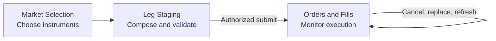

# ES Trade Blotter — Three-Tab Visual Design

This pack previews the approved replacement UI, not the current four-tab implementation. The surrounding **Trade Orders** form retains Portfolio, Fund, Fund Order, and Trade selection. Only its embedded blotter is replaced.

## Unified shell

```text
┌──────────────────────────────────────────────────────────────────────────────────────────────────────┐
│ [ Market Selection ] [ Leg Staging (4) ] [ Orders and Fills ]       Strategy: [ Iron Condor      ▼ ] │
├──────────────────────────────────────────────────────────────────────────────────────────────────────┤
│                                      Active tab content                                              │
└──────────────────────────────────────────────────────────────────────────────────────────────────────┘
```

There are exactly three tabs. The Strategy selector is right-aligned on the same header row; it is not a tab. Choices: Iron Condor, Vertical Spread, and Futures Outright.

## Workflow



## Documents

1. [Tab 1 — Market Selection](Tab-1-Market-Selection.md)
2. [Tab 2 — Leg Staging](Tab-2-Leg-Staging.md)
3. [Tab 3 — Orders and Fills](Tab-3-Orders-and-Fills.md)

## Modes

| Mode | Operator capability |
| --- | --- |
| Manual editable | Select, stage, validate, and submit when authorized |
| Manual submitted | View immutable composition and perform broker-valid actions |
| Automated read-only | Review persisted decision/execution evidence |
| Historical read-only | Review immutable historical evidence |

## Not part of this design

- A fourth Workflow or Volatility Context tab
- Embedded `IronCondorTradeOrderView` or `BrokerManualTradeOrderView`
- Separate outer Submit Order, End Of Day, or target-state controls
- Submission from an option-chain click

This preview follows `ES-Trade-Blotter-Integration-with-Trade-Orders-UI-v2.md`. Values shown are illustrative.
