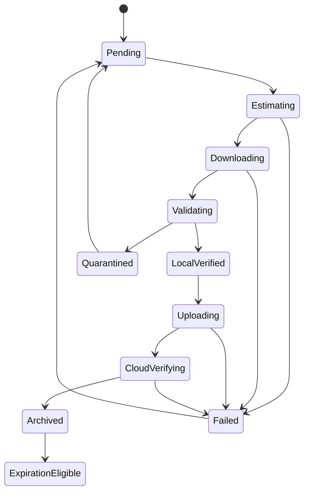
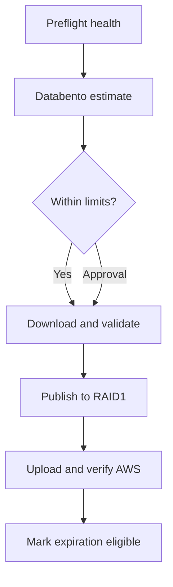

# Historical Market Data and Backtesting Archive Specification

**Version:** 1.1  
**Status:** Approved design baseline  
**Primary implementation platform:** .NET 10 / C# on Windows 11  
**Infrastructure platform:** Linux containers under Docker/WSL2, orchestrated with .NET Aspire where appropriate  
**Initial market scope:** CME ES futures and ES futures options  
**Archive cadence:** Monthly, with daily local operational backups  

---

## 1. Purpose

This specification defines a reliable, economical historical-market-data system for deterministic backtesting of the trading platform.

The system shall:

1. Retain recent live-captured trade and quote data in ScyllaDB for operational replay and diagnosis.
2. Acquire complete historical data directly from Databento after each calendar month closes.
3. Treat Databento historical data—not the rolling ScyllaDB capture—as the canonical input to backtesting.
4. Store canonical historical data losslessly in Databento Binary Encoding with Zstandard compression (`DBN.zst`).
5. Maintain a local historical archive on two 12 TB SATA disks configured as RAID1.
6. Maintain an independently verified off-site copy in AWS S3.
7. Expire old live-captured ticks from ScyllaDB only after the corresponding canonical monthly archive has been downloaded, validated, copied locally, uploaded to AWS, and verified.
8. Support future expansion from ES futures/options to additional futures, options and other asset classes without redesigning the archive protocol.

This document is intended to be directly usable by Codex when planning and implementing the system.

---

## 2. Architectural principles

### 2.1 Canonical versus operational data

Two intentionally different datasets shall exist:

| Dataset | Purpose | Retention |
|---|---|---|
| ScyllaDB live tick store | Recent operational replay, fault diagnosis, paper/live-trading support | Approximately 70–75 days; current and previous month operational target |
| Databento historical archive | Complete, immutable backtesting and research source | Permanent |
| PostgreSQL trade/event store | Permanent business events and audit evidence | Permanent according to production policy |
| Derived Parquet/backtest datasets | Efficient analytical scans and temporary backtest inputs | Reproducible and disposable |

Backtests shall never silently mix ScyllaDB live captures with canonical Databento historical files.

### 2.2 Immutability

Once a monthly historical archive is marked `Archived`, its canonical files shall never be modified in place. Provider corrections or processing corrections shall create a new archive version with a new manifest and explicit supersession metadata.

### 2.3 Determinism

Every backtest shall be reproducible from:

- Archive version and manifest hash
- Exact set of input object hashes
- Trading-system source commit
- Strategy/configuration version
- Calendar/session version
- Instrument-definition version
- Random seed, if any
- Backtest-engine version

### 2.4 Separation of storage responsibilities

- ScyllaDB is not the permanent historical warehouse.
- PostgreSQL is not the bulk quote archive.
- RAID1 provides local availability after one disk failure; it is not an independent backup.
- AWS provides the off-site durable copy.
- Parquet is a derived query format; DBN.zst remains the canonical replay format.

---

## 3. Initial historical data scope

### 3.1 ES futures

The initial ES futures archive shall include:

- `definition`
- `status`
- `statistics`
- `mbp-1`

`mbp-1` shall be used because it contains every event that changes the top price level and includes trades. It provides sufficient fidelity for:

- Directional Change and Intrinsic Time replay
- Best-bid/best-ask reconstruction
- Spread and liquidity analysis
- Trade-event replay
- Execution and slippage modelling that does not require queue position

MBO and MBP-10 shall not be acquired for V1.

### 3.2 ES futures options

The initial ES options archive shall include:

- `definition`
- `status`
- `statistics`
- `bbo-1s`
- `trades`

This combination is selected because:

- Monthly Iron Condor strategy decisions do not require every intra-second option quote update.
- `bbo-1s` provides broad-chain top-of-book coverage at one-second cadence.
- `trades` preserves every reported trade rather than only a sampled last sale.
- The resulting archive is materially smaller than option-chain-wide `mbp-1`.

### 3.3 Permanent execution evidence

For every paper or live trade actually considered, submitted or filled, the system shall permanently preserve a compact execution-evidence package independently of the broad historical schema. It shall include, when available:

- Candidate construction inputs
- Selected-leg quotes
- Nearby quote events surrounding submission and fills
- Calculated prices and Greeks
- Risk inputs and decisions
- Order submission, acknowledgement, modification, cancellation and fill messages
- IBKR identifiers and timestamps
- Strategy version and configuration hash
- Application build/source commit
- Relevant market-data sequence numbers and gap indicators

This evidence is for audit and diagnosis. It shall not replace the Databento archive as the general backtest source.

### 3.4 Future schema escalation

MBO or MBP-10 may be added only when a documented requirement exists for:

- Queue-position simulation
- Passive-order fill modelling
- Multi-level liquidity models
- Intraday market-microstructure strategies
- Order-flow research requiring order-level identity

Adding a richer schema shall not modify earlier archive versions.

---

## 4. Physical storage topology

### 4.1 Workstation storage roles

The relevant workstation storage assignments are:

| Storage | Role |
|---|---|
| Dedicated CPU Gen5 NVMe | Production ScyllaDB operational data on XFS |
| Dedicated CPU Gen5 NVMe | Production PostgreSQL on XFS |
| Chipset Gen4 NVMe | QA/backtesting databases, active historical working set, derived Parquet and backtest results |
| 2 × 12 TB SATA RAID1 | Local backups and permanent local historical archive |
| AWS S3 | Independent off-site historical archive and production-backup destination |

Two 12 TB RAID1 members provide approximately 12 TB decimal usable capacity, not 24 TB. Usable binary capacity reported by the operating system will be lower.

### 4.2 RAID1 directory layout

```text
archive-root/
├── historical/
│   └── databento/
├── operational-backups/
│   ├── postgres/
│   ├── scylla/
│   ├── redis/
│   └── greptime/
├── trade-audit/
├── manifests/
├── quarantine/
└── restore-staging/
```

The implementation shall monitor capacity by top-level category. Operational backups shall not be allowed to consume capacity reserved for permanent historical data.

### 4.3 Capacity policy

- Generate warnings at 70% and 80% array utilization.
- Generate a critical alert at 90% utilization.
- Target normal occupancy below 80%.
- Project capacity at least 12 months forward using trailing data-growth rates.
- Begin expansion planning when projected free capacity reaches less than 12 months.
- Adding new disks shall create a new archive tier or array; it shall not require rewriting the logical object hierarchy.

---

## 5. Canonical archive format

### 5.1 Canonical representation

Canonical historical objects shall use:

```text
Databento Binary Encoding + Zstandard compression
*.dbn.zst
```

The application shall request binary DBN delivery with Zstandard compression wherever supported. Files shall not be converted to CSV or JSON for archival storage.

### 5.2 Daily objects grouped by month

Daily objects shall be used within a monthly logical package. This limits failure scope and supports selective restoration and replay.

```text
historical/databento/GLBX.MDP3/
└── year=2027/
    └── month=01/
        ├── definitions/
        │   ├── asset=es-futures/
        │   └── asset=es-options/
        ├── status/
        ├── statistics/
        ├── es-futures/
        │   └── schema=mbp-1/
        │       ├── date=2027-01-04/part-000.dbn.zst
        │       └── date=2027-01-05/part-000.dbn.zst
        ├── es-options/
        │   ├── schema=bbo-1s/
        │   └── schema=trades/
        ├── manifest.json
        └── manifest.sha256
```

Objects should normally be hundreds of megabytes rather than thousands of tiny per-symbol files. A file may be split into deterministic parts when needed.

### 5.3 Derived Parquet representation

Parquet with Zstandard compression may be generated for analytical queries and backtest preparation. Derived data shall:

- Be generated from a specific canonical manifest version
- Record the source object hashes
- Use explicit, versioned schemas
- Be reproducible
- Be deletable without losing canonical history
- Never become the only copy of an input dataset

DuckDB may query Parquet directly for research and dataset selection. Loading the full permanent archive into PostgreSQL or ScyllaDB is not required.

---

## 6. Monthly archive manifest

Each monthly package shall include a versioned manifest containing at least:

```json
{
  "manifestSchemaVersion": 1,
  "archiveId": "GLBX.MDP3-ES-2027-01-v1",
  "archiveVersion": 1,
  "state": "Archived",
  "provider": "Databento",
  "dataset": "GLBX.MDP3",
  "calendarYear": 2027,
  "calendarMonth": 1,
  "requestedAtUtc": "2027-02-02T15:00:00Z",
  "completedAtUtc": "2027-02-02T17:00:00Z",
  "schemas": [],
  "symbolSelections": [],
  "expectedTradingSessions": [],
  "receivedTradingSessions": [],
  "files": [],
  "totalRecords": 0,
  "compressedBytes": 0,
  "uncompressedBytes": 0,
  "minimumTimestampNs": 0,
  "maximumTimestampNs": 0,
  "validationResults": [],
  "captureComparison": {},
  "awsObjectsVerified": false,
  "supersedesArchiveId": null
}
```

Each file entry shall contain:

- Relative path
- Asset/product group
- Schema
- Trading date
- Part number
- Compressed byte count
- Uncompressed byte count when known
- Record count
- Minimum and maximum event timestamps
- Minimum and maximum receive timestamps when present
- SHA-256 digest
- Provider request/batch identifier
- Decode-validation status

The manifest itself shall have a separately stored SHA-256 digest.

---

## 7. Monthly archival workflow

### 7.1 State machine



### 7.2 Trigger

The monthly process shall begin only after:

- The target calendar month has ended.
- The expected CME trading sessions are known.
- Databento indicates that the requested historical interval is available.
- No active production process is using archive staging resources heavily.

The default target is completion within the first three calendar days of the following month.

### 7.3 Preflight estimate

Before submission, the workflow shall call Databento cost/size metadata APIs or equivalent tooling to determine:

- Exact request definition
- Estimated uncompressed billable bytes
- Estimated price
- Available local staging capacity
- Available RAID1 capacity
- Expected AWS upload volume

The request shall stop for explicit approval when the predicted cost or size exceeds configured monthly limits.

### 7.4 Download

- Use Databento batch download when practical.
- Request DBN encoding and Zstandard compression.
- Download into a staging directory outside the immutable archive path.
- Record provider request identifiers.
- Make retries idempotent.
- Never treat a partially downloaded month as complete.
- Preserve the provider-delivered compressed bytes without recompression.

### 7.5 Validation

Validation shall include:

1. Expected daily objects are present.
2. All compressed files pass decompression tests.
3. All DBN headers and records decode sequentially.
4. File sizes and record counts are non-zero where activity is expected.
5. Event timestamps fall within the requested trading interval.
6. Records are ordered or orderable according to documented replay keys.
7. Required instrument definitions exist.
8. Instrument IDs referenced by market records can be resolved.
9. Expected CME sessions are covered.
10. Duplicate object and duplicate-record checks pass according to schema policy.
11. Sequence gaps or provider data-quality flags are recorded.
12. SHA-256 is calculated for every canonical object.

### 7.6 Comparison with ScyllaDB capture

The rolling ScyllaDB capture shall be used as an independent validation sample, not as a source for filling the historical archive without an explicit exception.

For periods when the live system was operating, compare:

- Instrument IDs
- First and last timestamps
- Trade counts
- Selected quote counts
- Sampled prices and sizes
- Sequence/gap indicators
- Market-session boundaries

Differences shall be classified as expected subscription-scope differences, expected provider-normalization differences, or unexplained discrepancies.

### 7.7 Local publication

After validation:

- Move or atomically rename the staged monthly package into the immutable RAID1 archive path.
- Write the final local manifest.
- Mark the state `LocalVerified`.
- Prevent ordinary application accounts from modifying archived objects.

### 7.8 AWS publication

- Upload canonical DBN.zst objects, the manifest and its checksum.
- Enable server-side encryption.
- Use a dedicated bucket/prefix and least-privilege IAM identity.
- Do not expose archive objects publicly.
- Record S3 bucket, key, version identifier and ETag/checksum metadata.
- Verify every expected remote object independently after upload.
- Mark `awsObjectsVerified=true` only after verification succeeds.

### 7.9 Completion gate

The month may transition to `Archived` only when:

- Local validation succeeded.
- Local RAID1 publication succeeded.
- AWS upload completed.
- All expected AWS objects were independently verified.
- Manifest and manifest checksum are present in both locations.
- No unresolved critical data-quality errors remain.

---

## 8. ScyllaDB rolling retention

### 8.1 Purpose

ScyllaDB shall hold recent live-captured tick data only. The operational target is the current month plus the previous month, with a safety buffer for failed or delayed archival runs.

### 8.2 Table design

Tick tables should use bounded time buckets, conceptually:

```sql
PRIMARY KEY ((instrument_id, trading_date), event_timestamp_ns, sequence_number)
```

The exact partition key may add a deterministic shard/bucket when required to keep partitions within measured size limits.

### 8.3 Expiration

- Configure TimeWindowCompactionStrategy for append-oriented tick tables.
- Use one consistent table-level TTL where practical.
- Recommended safety TTL: 70–75 days.
- Avoid row-by-row or range deletion of millions of records.
- Avoid rewriting old records into current SSTables.
- Monitor fully expired SSTable reclamation and disk utilization.

The monthly archive state controls whether the system considers historical loss acceptable. TTL remains the physical expiration mechanism; monitoring shall alert if data approaches expiry while its month is not `Archived`.

### 8.4 Expiry risk alerting

Generate escalating alerts when an unarchived record approaches TTL expiry:

- Warning: 14 days remaining
- High: 7 days remaining
- Critical: 72 hours remaining

A critical condition shall prevent nonessential backtesting jobs from consuming storage or bandwidth needed to complete the archive.

---

## 9. Local backup and retention policy

### 9.1 Daily operational backups

The RAID1 array shall receive daily operational backups using incremental or snapshot-aware methods where available. Do not copy the entire ScyllaDB data directory as a new full backup every day.

Initial rotation:

- Seven daily restore points
- Four weekly restore points
- Monthly production-database backups according to the separate database-backup specification
- Remove obsolete rolling-tick backups after the canonical historical month is safely archived

### 9.2 Permanent historical archive

Canonical monthly Databento packages and execution-evidence packages are permanent until an explicit retention policy is approved. Operational backup rotation must never delete them.

### 9.3 RAID health

Monitor:

- SMART/NVMe/SATA health data
- Reallocated and pending sectors
- Interface errors
- RAID degradation
- Scrub status
- Temperature
- Filesystem free space
- Last successful checksum scrub

Run scheduled filesystem/array scrubs and periodically validate a rotating subset of archive hashes.

---

## 10. AWS storage policy

### 10.1 Object hierarchy

AWS keys shall mirror the canonical local relative paths beneath a stable prefix, for example:

```text
s3://<private-bucket>/historical/databento/GLBX.MDP3/year=2027/month=01/...
```

### 10.2 Storage classes

Initial policy:

- Upload new monthly packages to S3 Standard or Standard-IA.
- Retain immediate accessibility during the initial validation/research period.
- Transition old, rarely used canonical data to Glacier Flexible Retrieval or Deep Archive according to measured access frequency.
- Do not archive the only active backtest copy into a delayed-retrieval tier.
- Respect minimum-duration charges when defining lifecycle transitions.

### 10.3 Security

- Block all public access.
- Use TLS for transfers.
- Use server-side encryption, preferably with a customer-controlled KMS key when operationally justified.
- Use separate read, write and restore permissions.
- Store credentials outside source code.
- Record CloudTrail or equivalent audit events where configured.
- Consider S3 Versioning and Object Lock after the workflow is proven.

### 10.4 Restore drills

At least quarterly:

1. Select one archived trading day.
2. Restore it from AWS into `restore-staging`.
3. Verify its checksum against the manifest.
4. Decode all records.
5. Run a deterministic replay smoke test.
6. Record duration, cost and outcome.

---

## 11. Backtesting data-access model

### 11.1 Input resolution

Every backtest request shall resolve to an explicit immutable archive manifest. It shall never request an unspecified concept such as “latest January data.”

Required identity:

```text
ArchiveId + ArchiveVersion + ManifestSHA256
```

### 11.2 Replay modes

The system shall support:

1. **Direct DBN replay** for exact chronological market-event processing.
2. **Derived Parquet scan** for analytical filtering and research.
3. **Temporary QA database load** when a test requires database semantics.

### 11.3 Event ordering

The replay engine shall define deterministic ordering for records sharing timestamps. Ordering shall consider the provider schema’s event timestamp, receive timestamp, sequence and original file order. The chosen rule shall be documented and versioned.

### 11.4 Market session and contract resolution

The backtester shall use archived definitions and a versioned exchange calendar to resolve:

- Contract lifecycle
- Expiration
- Strike and option type
- Trading session
- Holidays and early closes
- Futures roll policy
- Option-chain membership at a point in time

The backtester shall not use present-day contract metadata to interpret historical records.

### 11.5 Derived-data cache

Derived Parquet files or QA database images may be cached on the QA/backtesting NVMe. Cache entries shall include the canonical source manifest identity and may be evicted automatically.

---

## 12. Service boundaries

Suggested logical components:

| Component | Responsibility |
|---|---|
| `HistoricalArchiveCoordinator` | Monthly workflow and state transitions |
| `DatabentoHistoricalClient` | Cost estimate, request submission, polling and download |
| `DbnArchiveValidator` | Decode, timestamps, counts and data-quality validation |
| `LiveCaptureComparator` | Sample comparison against ScyllaDB |
| `ArchiveManifestWriter` | Canonical deterministic manifest generation |
| `LocalArchivePublisher` | Atomic RAID1 publication |
| `AwsArchivePublisher` | Upload and remote verification |
| `ScyllaRetentionMonitor` | TTL risk and archive-readiness checks |
| `BacktestDatasetResolver` | Manifest selection and local/cloud materialization |
| `ArchiveHealthMonitor` | Capacity, checksums, RAID and restore drills |

These may initially run within one administrative application, but interfaces and state shall not assume in-process execution.

---

## 13. Metadata persistence

PostgreSQL may store archive-control metadata, including:

- Archive identity and version
- State-machine state
- Databento request identifier and estimated/actual cost
- Expected and received objects
- Manifest hash
- Local path
- AWS bucket/key/version
- Validation issues
- Retry history
- Creation and verification timestamps
- Restore-drill results

The database metadata is an index. The manifest stored alongside the archive remains sufficient to identify and validate the archive if the control database is lost.

---

## 14. Failure handling and idempotency

### 14.1 General requirements

- Every workflow step shall be restartable.
- Repeating a completed step shall not create conflicting archive identities.
- Partial downloads shall remain in staging.
- Invalid files shall move to quarantine with diagnostic metadata.
- Publication shall use atomic rename where supported.
- Existing immutable archives shall never be overwritten automatically.
- A conflicting monthly archive shall create a new version or stop for operator review.

### 14.2 Provider correction

When Databento corrects previously delivered history:

1. Download the corrected objects into staging.
2. Validate independently.
3. Create archive version `vN+1`.
4. Set `supersedesArchiveId`.
5. Preserve the previous version until explicit retirement.
6. Mark backtests with the exact version used.

### 14.3 AWS failure

An AWS upload or verification failure shall leave the month in `Failed` or `CloudVerifying`; it shall not become `Archived` or `ExpirationEligible`.

---

## 15. Observability

Publish metrics for:

- Monthly estimated and actual Databento cost
- Compressed/uncompressed bytes by asset and schema
- Download throughput and retry count
- File and record counts
- Validation failures
- Missing sessions
- Capture comparison differences
- RAID utilization and projected exhaustion date
- AWS upload bytes, duration and failures
- Time since last successful archive
- Time remaining before unarchived Scylla data expires
- Restore duration and restore-test status
- Backtest-cache utilization

Structured logs shall include `archive_id`, `archive_version`, `year_month`, `schema`, `trading_date`, `provider_request_id` and a correlation identifier.

---

## 16. Configuration

All operational choices shall be configuration-driven:

```yaml
historicalArchive:
  provider: Databento
  dataset: GLBX.MDP3
  localArchiveRoot: <configured-path>
  stagingRoot: <configured-path>
  restoreStagingRoot: <configured-path>
  scyllaSafetyTtlDays: 75
  completionTargetDayOfMonth: 3
  minimumFreePercent: 20
  aws:
    bucket: <configured-bucket>
    prefix: historical/databento
    region: ca-central-1
  products:
    - id: es-futures
      schemas: [definition, status, statistics, mbp-1]
    - id: es-options
      schemas: [definition, status, statistics, bbo-1s, trades]
```

Secrets, API keys and AWS credentials shall not appear in this file or source control.

---

## 17. Expansion to additional assets

Adding an asset shall require a versioned product configuration specifying:

- Provider dataset
- Product/symbol-selection rules
- Required schemas
- Expected trading calendar
- Estimated monthly cost ceiling
- Estimated storage ceiling
- Definition-resolution rules
- Backtest replay adapter
- Licensing constraints

The archive path includes dataset, product, schema, year and month, so new products do not require a directory-layout change.

No new full-depth schema shall be enabled globally without a one-month cost and storage estimate.

---

## 18. Scheduled task and automation design

### 18.1 Scheduling architecture

Scheduling shall be owned by the Windows host because this is a Windows development workstation and the database containers may be stopped, restarted or recreated independently.

The preferred V1 implementation is:

```text
Windows Task Scheduler
    → HistoricalArchive.Cli command
    → PostgreSQL-backed job lease and run journal
    → Docker/Aspire infrastructure services as required
    → RAID1, Databento and AWS
```

.NET Aspire may start and describe the required services, but it shall not be the durable calendar scheduler. Container-local cron jobs shall not own the workflow because they can disappear with container replacement and may start before physical XFS mounts or RAID storage are ready.

Implement one idempotent .NET CLI/Worker executable with explicit commands rather than a separate executable for every task. Suggested command surface:

```text
HistoricalArchive.Cli health-check
HistoricalArchive.Cli daily-backup
HistoricalArchive.Cli archive-reconcile
HistoricalArchive.Cli weekly-verify
HistoricalArchive.Cli monthly-estimate --month YYYY-MM
HistoricalArchive.Cli monthly-download --month YYYY-MM
HistoricalArchive.Cli monthly-archive --month YYYY-MM
HistoricalArchive.Cli restore-drill [--month YYYY-MM --date YYYY-MM-DD]
HistoricalArchive.Cli capacity-forecast
```

Every command shall support:

- `--dry-run`
- `--correlation-id`
- `--resume`
- `--maximum-duration`
- Structured console and OTEL output
- Non-zero process exit code on failure
- Cancellation and graceful shutdown
- A deterministic no-op result when work is already complete

### 18.2 Time-zone and market-calendar policy

- Store every scheduled instant and job-run timestamp in UTC.
- Express operator-facing schedules in `America/New_York`, which aligns with the ES market and automatically accounts for daylight-saving changes.
- Do not use fixed UTC offsets for recurring market-aware tasks.
- Use the versioned CME trading calendar rather than weekdays alone.
- Heavy validation, restore and backtesting maintenance shall run when the market is closed, preferably Saturday.
- A schedule occurrence is an opportunity to reconcile desired state, not an assumption that all previous jobs succeeded.

### 18.3 Proposed schedule

The exact clock times shall remain configurable. The initial schedule is:

| Frequency | Local time | Command | Purpose |
|---|---:|---|---|
| Daily | 16:50 ET | `health-check` | Verify mounts, RAID health, free space, Scylla TTL risk, AWS/Databento credential availability and recent job status |
| Daily | 17:10 ET | `daily-backup` | Incremental/snapshot-aware local backup during the normal CME maintenance interval |
| Daily | 17:35 ET | `archive-reconcile` | Resume incomplete work, detect newly due monthly work and raise missed-run alerts |
| Weekly, Saturday | 02:00 ET | `weekly-verify` | Validate backup catalogues, decode/hash samples and test selected restore points |
| Weekly, Saturday | 04:00 ET | `capacity-forecast` | Forecast NVMe, RAID1 and AWS growth/cost |
| Monthly, first Saturday after month-end | 00:30 ET | `monthly-estimate` | Estimate exact Databento size/cost and validate capacity/budget |
| Monthly, first Saturday after approval | 01:00 ET | `monthly-download` | Download the previous month's complete Databento historical package |
| Monthly, chained after download | — | `monthly-archive` | Validate, compare, publish locally, upload to AWS and verify |
| Quarterly, second Saturday | 01:00 ET | `restore-drill` | Restore an archived day from AWS and run deterministic replay validation |

The daily 17:35 `archive-reconcile` task provides catch-up if the first-Saturday task was missed or interrupted. It shall not redownload a completed archive.

### 18.4 Daily health-check task

The daily health check shall verify, without mutating archive data:

1. Production PostgreSQL and Scylla XFS filesystems have the expected UUIDs and mount points.
2. RAID1 is present, healthy and writable.
3. Archive staging and immutable archive roots are on their expected filesystems.
4. NVMe and RAID capacity thresholds are not exceeded.
5. Scylla records are not approaching TTL expiry without a corresponding `Archived` month.
6. The latest daily and weekly jobs completed within their service-level windows.
7. Databento and AWS credentials are present and can perform a non-destructive identity/metadata check.
8. System time synchronization is healthy.
9. No orphaned job lease or stale staging directory exists.

Credential checks shall never print secrets or connection strings.

### 18.5 Daily local-backup task

The daily task shall:

- Perform PostgreSQL backup/WAL handling according to the production database-backup specification.
- Create a Scylla snapshot or incremental backup using a database-aware procedure.
- Back up Redis persistence, GreptimeDB data and configuration where required.
- Back up archive-control metadata and manifests.
- Copy new permanent trade-evidence packages.
- Verify completion and record hashes/catalog entries.
- Enforce the seven-daily/four-weekly rotation only on operational backups.
- Never apply operational rotation to canonical Databento archives.

If the daily job overlaps the end of the maintenance window, it may continue only when measured I/O remains below configured production limits. Otherwise, it shall checkpoint, pause and resume at the next safe opportunity.

### 18.6 Weekly verification task

The weekly task shall:

- Verify the backup catalogue against actual files.
- Decode a rotating sample of DBN.zst objects.
- Recalculate hashes for a rotating percentage of canonical archive objects.
- Restore at least one small operational-backup sample.
- Check RAID member health and the last array/filesystem scrub.
- Detect orphaned staging, quarantine or restore files.
- Validate that local manifests and AWS object catalogues agree.
- Produce a weekly report with failures, warnings, capacity and projected exhaustion dates.

A complete RAID scrub may be monthly rather than weekly if weekly scrubbing would create excessive I/O or disk wear.

### 18.7 Monthly Databento historical-download task

The Databento historical workflow shall be an explicit scheduled job. It shall target the immediately preceding calendar month and use the already implemented Databento API integration, upgraded where needed to support historical metadata, batch requests and downloads.

The task shall perform these stages:

1. Resolve the previous month using the CME calendar.
2. Verify that it has not already reached `Archived` state.
3. Build the exact configured requests:
   - ES futures: `definition`, `status`, `statistics`, `mbp-1`
   - ES options: `definition`, `status`, `statistics`, `bbo-1s`, `trades`
4. Request exact or best-available size and cost estimates.
5. Compare estimates against configurable monthly budgets and free-space requirements.
6. Require operator approval only when a configured cost/size limit is exceeded; otherwise continue automatically.
7. Submit or resume Databento historical batch requests.
8. Download DBN with Zstandard compression into staging.
9. Validate all files and build the draft manifest.
10. Compare the overlapping interval with samples from ScyllaDB.
11. Publish atomically to the RAID1 immutable archive.
12. Upload canonical objects and manifests to AWS.
13. Verify all remote AWS objects.
14. Mark the archive `Archived`, then `ExpirationEligible`.
15. Record actual Databento cost and compressed/uncompressed sizes.

The monthly task shall be resumable at every numbered stage. Restarting it shall reuse valid downloaded objects and completed AWS uploads rather than paying for or transferring them again unnecessarily.

### 18.8 Task dependencies



No stage may skip its predecessor. `ExpirationEligible` is impossible unless AWS verification succeeds.

### 18.9 Concurrency and leases

Every job shall acquire a named lease before mutation. The preferred implementation is a PostgreSQL advisory lock plus a persistent job-run record. A local OS mutex alone is insufficient because it does not provide durable history.

Required lease scopes include:

- `historical-archive-global`
- `historical-archive:YYYY-MM`
- `local-backup`
- `aws-upload:archive-id`
- `restore-staging`

Rules:

- Only one monthly mutation workflow may run for a given archive ID.
- A weekly verification job may read an immutable archive while another month is downloading.
- A restore drill shall use a distinct staging path.
- Backtesting may read only `Archived` versions.
- Expired leases require explicit timeout and ownership checks before takeover.

### 18.10 Retry policy

Classify failures as transient, permanent or operator-required.

| Failure | Policy |
|---|---|
| Network timeout, HTTP 429 or transient 5xx | Exponential backoff with jitter and bounded attempts |
| Databento batch still preparing | Persist state and poll later without counting as failure |
| Insufficient local capacity | Stop before download and alert |
| Cost exceeds configured ceiling | Pause for approval |
| Hash/decode mismatch | Quarantine object; do not publish |
| AWS upload interruption | Resume multipart upload where supported |
| AWS verification mismatch | Retry verification, then re-upload affected object |
| Missing XFS/RAID mount | Fail closed; never write to a fallback directory |
| UPS on battery or shutdown pending | Checkpoint and stop safely |
| Authentication/authorization failure | Stop and alert; do not retry aggressively |

Retries shall never bypass validation or mutate an existing immutable archive.

### 18.11 Missed-run and reboot recovery

Windows Task Scheduler entries shall be configured to:

- Run whether or not the interactive user is logged on.
- Run with the least privileges required.
- Start as soon as possible after a missed scheduled start.
- Avoid starting a second instance when one is already running.
- Apply a configurable maximum runtime.
- Send a graceful cancellation signal before forced termination.
- Not start heavy work while the UPS reports battery operation.

On startup, `archive-reconcile` shall inspect persistent job states and resume safe incomplete stages. It shall verify all physical mount identities before writing.

### 18.12 Market-hours resource protection

Scheduled jobs shall expose CPU, disk and network budgets. During active trading:

- No RAID scrub, full checksum sweep, AWS restore or large Databento download may begin.
- Existing downloads shall pause or throttle when production latency or queue-depth thresholds are breached.
- Background processes shall run at below-normal CPU and I/O priority where supported.
- CPU affinity shall exclude dedicated market-data, order-book and Intrinsic Time cores.
- AWS and Databento transfers shall have configurable bandwidth limits.
- The production trading process may publish a `MaintenanceSuspended` control state that scheduled workers must honor.

### 18.13 Job-run journal

Each invocation shall persist:

- Job name and version
- Scheduled and actual start times
- Completion time
- Host identity
- Process/build version
- Correlation ID
- Archive ID where applicable
- Attempt number
- Lease owner and expiry
- Starting checkpoint
- Final checkpoint
- Input and output byte counts
- Provider request IDs
- Exit classification
- Error summary without secrets

The journal shall make it possible to distinguish never-started, running, interrupted, failed, completed and completed-with-warning jobs.

### 18.14 Notifications

Notify immediately for:

- Unarchived data within seven days of Scylla TTL expiry
- RAID degradation
- Missing or incorrect physical mount
- Archive validation failure
- AWS verification failure
- Databento authentication failure
- Capacity above 90%
- Monthly workflow incomplete by the seventh calendar day

Provide a daily summary only when warnings exist and a weekly operational report regardless of outcome.

### 18.15 Scheduler acceptance tests

- Trigger the same monthly task twice and verify a single archive results.
- Terminate each monthly stage and verify correct resumption.
- Reboot Windows during download and AWS upload and verify recovery.
- Simulate missing RAID/XFS mounts and verify fail-closed behavior.
- Simulate cost overrun and verify approval gating.
- Simulate AWS checksum mismatch and verify Scylla remains non-expiration-eligible.
- Simulate a missed first-Saturday run and verify daily reconciliation catches it.
- Simulate UPS battery state and verify heavy tasks do not start.
- Run trading-load benchmarks while scheduled work is throttled and verify latency budgets remain satisfied.

---

## 19. Testing requirements

### 18.1 Unit tests

- Deterministic archive ID generation
- Manifest canonicalization and hashing
- File-name/path validation
- Expected-session calculation
- State-transition guards
- Idempotent retry behavior
- TTL risk calculation
- Cost and capacity limit enforcement

### 18.2 Integration tests

- Databento request estimate and mocked batch download
- DBN.zst decompression and full decoding
- Local atomic publication
- AWS multipart upload and verification against a test bucket
- Interrupted download recovery
- Interrupted upload recovery
- Duplicate invocation of the same monthly job
- Scylla comparison using a deterministic sample dataset

### 18.3 End-to-end acceptance test

Given one known ES trading week:

1. Download all configured schemas.
2. Generate and validate the archive.
3. Publish it locally.
4. Upload and verify it in AWS.
5. Resolve it by archive identity.
6. Run a deterministic replay.
7. Regenerate an optional Parquet dataset.
8. Compare repeated backtest output hashes.
9. Restore the source objects from AWS and repeat validation.

The system passes only if the two replay runs and the restored-source replay are equivalent according to documented tolerances.

---

## 20. Acceptance criteria

V1 is complete when:

- A complete calendar month of ES futures MBP-1 is archived.
- The same month of ES-options BBO-1s and trades is archived.
- Definitions, status and statistics are present.
- Every canonical file has a recorded SHA-256 hash.
- The monthly manifest passes schema validation.
- Local RAID1 and AWS copies are independently verified.
- The workflow is restartable without duplicate or conflicting archives.
- An archive can be restored from AWS and replayed.
- A deterministic backtest can identify its exact archive input.
- Scylla data nearing TTL cannot disappear without an alert when the month is not archived.
- Archived data can expire from Scylla without affecting backtest availability.
- Storage and cost forecasts are visible.
- Daily, weekly, monthly and quarterly scheduled tasks run idempotently and recover after interruption.
- The scheduled Databento historical download completes the archive workflow without permitting premature Scylla expiration.

---

## 21. Explicit non-goals for V1

- Full MBO/L3 preservation
- MBP-10/L2 preservation
- Queue-position simulation
- Permanent storage of the complete historical archive in ScyllaDB
- Permanent storage of bulk quotes in PostgreSQL
- Real-time backtesting against incomplete current-month historical files
- Automatic strategy deployment based on backtest results
- LLM decision-making inside the deterministic replay or trading path

---

## 22. Implementation sequence

1. Define archive configuration, identities, states and manifest schema.
2. Implement Databento cost/size estimation and approval limits.
3. Implement staged DBN.zst download.
4. Implement full archive validation and checksums.
5. Implement RAID1 atomic publication.
6. Implement AWS upload and remote verification using the existing production-backup infrastructure.
7. Implement PostgreSQL archive catalogue.
8. Implement Scylla TTL-risk monitoring and archive-state gate.
9. Implement direct DBN deterministic replay.
10. Add optional Parquet/DuckDB derived-data path.
11. Implement quarterly AWS restore drill.
12. Implement Windows Task Scheduler definitions, job leases, checkpoints and missed-run reconciliation.
13. Run one-week pilot, followed by one complete monthly acceptance run.

---

## 23. Final design decision

The approved V1 architecture is:

> ScyllaDB provides a short rolling window of live-captured ticks. Complete historical backtesting data is acquired monthly from Databento, stored canonically as daily DBN.zst objects grouped into an immutable monthly package, retained locally on dual 12 TB RAID1, copied and verified in AWS, and replayed directly or through reproducible derived Parquet datasets. ES futures use MBP-1; ES options use BBO-1s plus trades. Windows Task Scheduler invokes an idempotent .NET archival CLI for daily, weekly, monthly and quarterly operations, with durable leases, checkpoints, missed-run recovery and market-hours resource protection. Full order-book data is deferred until an intraday strategy creates a demonstrated requirement.

---

## 24. Primary references

- [Databento DBN encoding and Zstandard guidance](https://databento.com/docs/knowledge-base/new-users/dbn-encoding/getting-started-with-dbn)
- [Databento schema definitions](https://databento.com/docs/schemas-and-data-formats/whats-a-schema)
- [Databento MBP-1 documentation](https://databento.com/docs/schemas-and-data-formats/mbp-1)
- [Databento BBO guidance for options](https://databento.com/blog/bbo-schemas)
- [Databento data catalogue and cost estimation](https://databento.com/docs/portal/data-catalog)
- [ScyllaDB TimeWindowCompactionStrategy](https://docs.scylladb.com/manual/stable/cql/compaction.html)
- [ScyllaDB TTL behavior](https://docs.scylladb.com/manual/stable/kb/ttl-facts.html)
- [AWS S3 storage classes](https://aws.amazon.com/s3/storage-classes/)
