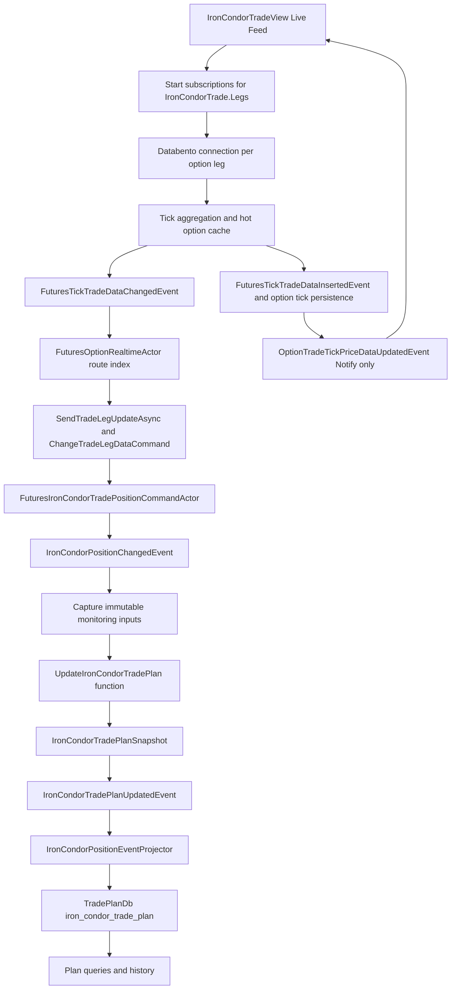

# Iron Condor Trade Plan Monitoring Design

Status: Implemented calculation and storage paths; live monitoring qualification pending. Updated: 2026-10-07.

This design connects live Databento option trades to monitoring an established Iron Condor, calculating a complete IronCondorTradePlanSnapshot and appending its projection in TradePlanDb. It retains the legacy trade_plan business columns and makes each monitoring decision reproducible from its recorded inputs. Implementation evidence and remaining data/provider gates are recorded in the companion implementation plan. Successful component tests do not certify live provider or UI qualification.

Follow [Actor Implementation Conventions](Actor-Implementation-Conventions.md), [Actor Event Modeling Conventions](Actor-Event-Modeling-Conventions.md) and [Structured Logging Conventions](Structured-Logging-Conventions.md).

## Agreed event path

The raw trade event remains the position input. The enriched option event remains Notify only. Tick insertion and its notification are a sibling path; database tick persistence must not delay live position processing. Persistence completion notifications must only report successful persistence.

## Current implementation and gaps

- Raw option trades route through `FuturesOptionRealtimeActor` to `ChangeTradeLegDataCommand`, preserving exact leg identity, sequence and generation.
- Position events capture immutable monitoring inputs and request a separate trade-plan function. Background market, analytics, calculator and freshness changes can request that same function without a new option tick.
- `IronCondorOptionCalculator` calls the existing `OptionCalculator.TheoreticalPrice` for all four qualified contracts. Its result populates the strategy-specific snapshot; the generic compatibility forward extrapolation is not the recovered forward-risk calculation.
- The source snapshot commits first. The projector attempts every generated snapshot once, including nonmaterial observations. Failures are logged and dropped, with no replay, repair or source readback.
- Development `TradePlanDbConnection` selects an independent keyspace; the table contains all 48 legacy scalar fields plus snapshot/provenance columns. Existing development history was copied without removing source rows.
- Per-contract transport isolation and owner-safe UI leases are implemented and tested with synthetic transports. Four observed live Databento subscriptions still require provider qualification.
- Recovered formulas, Fund cash capture and command/event limit initialization are connected. The development database lacks the preceding 60-day MScore sample; monitoring reports unavailable until genuine input data exists. Live subscriptions, FlaUI and measured end-to-end latency remain acceptance gates.

## Subscription lifecycle and routing

The view uses IronCondorTrade.Legs from the established model. Resolve the four exact contract IDs, expiry, put/call, action, signed ratio, tick size, multiplier and exchange metadata from persisted trade and security read models. Validate leg roles and identity before acquiring streams.

Implement one owned Databento live connection per distinct leg contract, with the owner containing trade and position identity. The connection worker must subscribe the exact symbol, attach instrument mapping, feed normalized records into aggregation, and expose start/failure/stop state. Shared ownership of the same contract may reuse that contract connection; releasing one trade must not stop another owner's stream. Register leases before delivery, roll back partial acquisition, and report Live Feed active only when all four subscriptions are observed active. Closing the view or switching Off releases its ownership. Backend automatic monitoring, if enabled, has its own owner and does not depend on the view remaining open.

Connection creation, limits, reconnect policy and symbol subscription must be qualified against the existing worker runtime and Databento entitlement before implementation acceptance. Connection failures are visible per leg. Reconnect increments the stream generation and preserves source ordering semantics; never treat a reset exchange sequence as an old trade indefinitely.

FuturesOptionRealtimeActor maps contract ticks to open position routes and sends ChangeTradeLegDataCommand with TradeLegId, ContractId, Price, SourceSequence, RouteGeneration, EffectiveAtUtc and full StrategyPositionId. Reject stale route generations, duplicate sequences, wrong identities and closed positions. Preserve one position mailbox's ordering. Option legs receive independent observations; monitoring snapshots are coherent captures of their latest observations, not a claim that the four market trades occurred atomically. Broker spread execution remains atomic across its legs.

## Monitoring inputs and state ownership

Introduce IronCondorTradePlanInputs, an immutable capture of:

- Established trade, current position, executions, opening prices, signed quantities, multiplier, commissions and realized PnL.
- Each leg's last trade, bid/ask, source sequence/generation, timestamp, IV and Greeks including delta/gamma/vega, with pricing provenance.
- Underlying current EOD cache, market price, statistical window, seeded analytics including RSI/TDI, and VIX inputs.
- Risk-free curve/rate, expiry calendar, valuation time, forward observation and strategy limits. Only the single latest source snapshot supplies revision and accepted stop ratio.
- Input versions, freshness, missing-field reasons, calculator/engine/numerical-policy versions and exact per-leg calculator inputs. No Monte Carlo seed is claimed by the current deterministic calculation.

Capture once before Compute. Use the authoritative current-session EOD cache for live market inputs; persisted Scylla read models provide trade/security configuration and cold fallback. Query actors read persisted projections, never command-state repositories. Cache reads for market observations are capabilities of realtime computation and do not replace persisted query models.

No database query, network request or simulation runs inside the pure Compute method. Slow distribution jobs run separately and publish immutable, versioned results. A changed distribution or underlying/risk input triggers recalculation even when no option trade occurs. A bounded periodic freshness evaluation marks silent/stale streams; monitoring cannot wait indefinitely for another tick.

Command state changes only through state.Update/event application. Use business names such as PositionSnapshot and IronCondorTradePlanSnapshot, never generic State payload names. Command handlers use Compute, failure guard switch arms first, a single default event update and the updated ternary ServiceResult convention. Event factories explicitly preserve command.CommandId. Keep function calculation intermediates separate from authoritative command-owned state. Any new authoritative plan acceptance owner follows command/event application conventions.

## Calculation implementation

Extract reusable pure helpers into IronCondor Plan/Model and pricing components. Adapt surviving legacy helpers to the new trade/position inputs; do not depend on UI calculation or legacy mutable option trade models. Every output carries CalculationVersion and InputFingerprint.

### Valuation and payoff

For each persisted leg, capture its exact qualified pricing context, underlying bid/ask, implied volatility, strike, right, expiry and rate. The valuation instant is frozen once. Reuse `Black76PricingModel.CreateRequest` to select the contract's exercise and premium conventions, then call `OptionCalculator.TheoreticalPrice(request, IV, token)`. This uses the existing engine and avoids an additional IV solve or unnecessary Greeks calculation. All four contracts must share an underlying, expiration instant and currency, have coherent source timestamps, and belong to one admitted generation. Missing or expired evidence makes the calculator price unavailable; a partial four-leg result is never returned.

Let `P_i` be the calculated option price and `s_i = sign(signedLegQuantity)`. `PutSpreadPrice = sum(s_i*P_i)` over puts; `CallSpreadPrice` is the corresponding call sum. `SignedSpreadPrice = PutSpreadPrice + CallSpreadPrice`. Legacy `netPrice = abs(PutSpreadPrice) + abs(CallSpreadPrice)` is points per strategy unit. The signed result and each leg's inputs/output are also captured, preserving the credit/debit convention. Contract quantity and multiplier are applied once when converting to currency. Observed last-trade position prices remain the source for the live graph and actual position PnL; theoretical prices are identified separately.

Current money PnL is `(position.UnrealizedPnl + position.RealizedPnl)*cashMultiplier - openingCommission - closingCommissions`. Position PnL is gross and quantity-weighted in points; fees are actual execution amounts in currency. Current remaining quantities are used after closing batches.

`InitializeIronCondorMonitoringCommand` captures persisted weighted opening prices, signed quantities, common multiplier, actual commissions, ledger Fund available cash and accepted order capital/revision. Its pure initializer computes the recovered trade and spread limits. The event carries the originating CommandId; State.Apply installs the computed limits, then the ordinary projector saves them to Scylla. Query readers do not write command state. All three TradeLimit insert overloads persist the negative MaxLoss column, and a missing limit query returns null so initialization can proceed.

### Forward observations and risk

`IronCondorMonitoringDistributionCompute` adapts the surviving `ProbabilityValueCollection.SetForwardPrice` formula to the new four-leg calculator output. For each put/call spread:

`forward = mean * (1 +/- 2*abs(shortDelta)*sqrt(remainingCalendarDays/openingToExpiryCalendarDays))`.

The recovered OTM-skew rule selects the sign; a nonpositive mean uses the spread magnitude from those same calculated legs. The current implementation supplies one deterministic observation per spread. It does not run Monte Carlo or represent a sampled distribution. The current price still comes from OptionCalculator; the legacy forward factor is a separate calculation.

`forwardPrice = abs(putForwardPrice) + abs(callForwardPrice)`. `forwardLossRatio = forwardPrice/configuredLegacyPriceLimit`, as recovered from Git. MScore uses square-root ratios and the recovered lower-middle median/MAD, including the current ratio with a preceding 60-day stored baseline. Missing baseline data remains explicitly unavailable; stale development rows are not relabelled as current samples.

The legacy `lossProbability` field retains the existing MAD score: it returns one when the minimum scenario PnL breaches its negative loss threshold; otherwise it uses `abs((median - 3.5*MAD)/maxLoss)`. It can exceed one and is not a calibrated probability. Neither clamping nor a new frequency-probability definition is introduced.

`ForwardDelta = sum(s_i*qualifiedOptionDelta_i)` per strategy unit, following the approved business definition. Put/call OTM values retain the recovered formula: `z = ln(strike/forward)/(IV*sqrt(years))`; call OTM = N(z), put OTM = 1-N(z). ShortPutGamma and ShortCallGamma are the qualified individual contract Greeks. These are model-based legacy monitoring values, not empirical forecasts.

The approved trailing-stop policy uses current net currency PnL and the accepted stop ratio from the single latest source snapshot. No ten-profit average or rolling plan collection is retained. Incomplete inputs preserve the accepted ratio and cannot advance a trailing stop or recommend exit. A new session has its own source stream; cross-session carry of an accepted stop remains an explicit qualification concern rather than an implicit historical replay.

Reference reads refresh at most every five seconds per trade/session; option evidence and price calculation refresh separately at most every second, with a three-second deadline. Available calculator inputs publish before a bounded single distribution-persistence request. A slow or failed request cannot hold current prices; failed observations are logged and dropped without retaining a history backlog. The generation-owned observer checks input/freshness changes once per second and fences retired actor or position observations.

### Market signals and decisions

Read AssetPrice and current-session observations from the hot EOD cache. AssetMean, AssetStdDev, FiftyDayMA and FiveDayXMA use named windows, sample conventions and EMA seed/alpha definitions. FiveDayXMA is a daily-window indicator; it must not be silently replaced with a five-minute EMA. AssetPriceChange declares its reference price and whether it is points or percentage.

MarketTrend, MarketVolatility, MarketDirection, VixVolatility, TrendType, TrendStrength, RSI, RSISlope, TDI and TDIStrength use versioned analytics snapshots with period and timestamp. Keep the agreed five-minute RSI/TDI interval; maintain historical daily indicators where required by legacy fields. Seed required windows; lack of sufficient data remains visible.

Evaluate deterministic action guards: closed state; input validity/freshness; configured hard monetary loss; profit targets; forward-risk limits; gamma/regime warnings; normal monitoring. Persist the exact thresholds, precedence, reason and input versions. Missing analytics can yield a degraded Hold/Monitor result, never a fictitious valid zero or normal risk classification. Financial close/exit actions require their own workflow acceptance and evidence; a computed plan is not proof that an order was submitted or filled.

## Legacy column mapping

All legacy trade_plan business columns and their CQL types are retained in iron_condor_trade_plan. The following mapping covers every legacy column. Values derived from an unavailable provider are null with a reason in the snapshot, until the completeness gate is met.

| Column | CQL type | Snapshot source or calculation |
|---|---|---|
| `orderId` | `int` | Trade identity, exchange session date, monotonic plan revision |
| `tradeId` | `int` | Trade identity, exchange session date, monotonic plan revision |
| `valueDate` | `date` | Trade identity, exchange session date, monotonic plan revision |
| `sequenceId` | `bigint` | Trade identity, exchange session date, monotonic plan revision |
| `actionDate` | `timestamp` | Captured valuation/action time and initiating actor/operator |
| `tradeDate` | `date` | Persisted established trade and security expiry |
| `maturityDate` | `date` | Persisted established trade and security expiry |
| `tradeType` | `text` | Persisted established trade and security expiry |
| `actionType` | `text` | Versioned decision model and reason |
| `actionSubType` | `text` | Versioned decision model and reason |
| `actionState` | `text` | Versioned decision model and reason |
| `actionReason` | `text` | Versioned decision model and reason |
| `tradePnl` | `decimal` | Valuation/payoff model and configured trade limits |
| `forwardLossRatio` | `double` | Versioned distribution and risk model; definition gate where unresolved |
| `lossProbability` | `double` | Versioned distribution and risk model; definition gate where unresolved |
| `mScore` | `double` | Versioned distribution and risk model; definition gate where unresolved |
| `maxProfit` | `decimal` | Valuation/payoff model and configured trade limits |
| `maxLoss` | `decimal` | Valuation/payoff model and configured trade limits |
| `minProfitTarget` | `decimal` | Valuation/payoff model and configured trade limits |
| `dailyProfitTarget` | `decimal` | Valuation/payoff model and configured trade limits |
| `assetPrice` | `decimal` | Underlying market/statistics and versioned analytics snapshot |
| `assetStdDev` | `double` | Underlying market/statistics and versioned analytics snapshot |
| `assetMean` | `double` | Underlying market/statistics and versioned analytics snapshot |
| `assetPriceChange` | `double` | Underlying market/statistics and versioned analytics snapshot |
| `marketTrend` | `text` | Underlying market/statistics and versioned analytics snapshot |
| `marketVolatility` | `text` | Underlying market/statistics and versioned analytics snapshot |
| `marketDirection` | `text` | Underlying market/statistics and versioned analytics snapshot |
| `vixVolatility` | `text` | Underlying market/statistics and versioned analytics snapshot |
| `tradeRisk` | `text` | Underlying market/statistics and versioned analytics snapshot |
| `fiftyDayMA` | `double` | Underlying market/statistics and versioned analytics snapshot |
| `fiveDayXMA` | `double` | Underlying market/statistics and versioned analytics snapshot |
| `putOTMProbability` | `double` | Option Greeks and distribution/risk classification |
| `callOTMProbability` | `double` | Option Greeks and distribution/risk classification |
| `shortPutGamma` | `double` | Option Greeks and distribution/risk classification |
| `shortCallGamma` | `double` | Option Greeks and distribution/risk classification |
| `gammaRisk` | `text` | Option Greeks and distribution/risk classification |
| `netPrice` | `decimal` | abs(calculated put spread) + abs(calculated call spread), OptionCalculator points per strategy unit |
| `forwardPrice` | `decimal` | Versioned distribution and risk model; definition gate where unresolved |
| `forwardDelta` | `double` | Signed sum of four qualified leg deltas, per strategy unit |
| `stopLossLimit` | `double` | Accepted stop ratio from the single latest source snapshot and current net PnL |
| `trendType` | `text` | Underlying market/statistics and versioned analytics snapshot |
| `trendStrength` | `text` | Underlying market/statistics and versioned analytics snapshot |
| `rsi` | `double` | Underlying market/statistics and versioned analytics snapshot |
| `rsiSlope` | `double` | Underlying market/statistics and versioned analytics snapshot |
| `tdi` | `text` | Underlying market/statistics and versioned analytics snapshot |
| `tdiStrength` | `text` | Underlying market/statistics and versioned analytics snapshot |
| `createdOn` | `timestamp` | Captured valuation/action time and initiating actor/operator |
| `createdBy` | `text` | Captured valuation/action time and initiating actor/operator |

## Snapshot and persistence contract

IronCondorTradePlanSnapshot lives in the owning mirrored Domain.Trade.Shared hierarchy. It contains the above fields plus full portfolio/fund/trade/position identity, PlanRevision, SourceEventId, PositionSequence, RouteGeneration, per-leg observations, input/calculation versions, completeness/freshness, Parameters, RequiresExit, Explanation and ContentHash. MessagePack keys are explicit and permanent. Introduce a new contract rather than reinterpreting existing published StrategyTradePlanSnapshot bytes. Adapt shared activity and exit workflow consumers explicitly; other strategy contracts remain valid.

Configure TradePlanDbConnection as its own setting and initialize its Scylla keyspace independently. Assert resolved connection identity at startup and in integration tests. The proposed table keeps all legacy column names/types and adds portfolioId, fundId, positionId, planRevision, sourceEventId, positionSequence, calculationVersion, inputFingerprint, contentHash, inputStatus and snapshotPayload. Partition by full identity plus valueDate; cluster by planRevision DESC. sequenceId is the legacy scalar alias of monotonic PlanRevision for this position/session. This preserves the legacy business schema while deliberately improving its partition key; byte-for-byte legacy primary-key compatibility is not claimed.

ValueDate comes from the exchange session calendar, including the evening session, rather than the UTC calendar date. Opening/restart seeding uses the same calendar. An existing table's primary key cannot be changed by CREATE TABLE IF NOT EXISTS: migrate using a versioned staging table, validated readback and explicit cutover, then retain the canonical iron_condor_trade_plan name as required. Do not drop existing history to achieve migration.

Append every accepted calculated plan revision, including changes only in Greeks, risk inputs or freshness. Keep MaterialChange as a notification/alert filter rather than a persistence filter. A repeated source decision produces the same revision/identity and hash; same identity with different bytes/hash is a typed conflict. Allocate revisions within the serialized owner and restore the persisted accepted revision on restart. Hash canonical inputs/business output using a documented serialization version.

The full plan snapshot event is saved to the source event log before projection. Loading the plan stream requests only the single latest persisted snapshot event (LIMIT 1); it does not replay earlier plans or consult Scylla history. A request-local state applies that full payload and uses its revision for the next snapshot. No resident plan dictionary or rolling plan collection is maintained.

The projector receives the already committed source payload directly and attempts its Scylla snapshot/history write once. It performs no additional source-event lookup, source-validity check, source/target comparison, replay, retry or projection repair. Failed writes or failed queue admission are logged with source and trade identity and dropped; the next current snapshot continues normally. Source events and Scylla history are allowed to differ. Loading a source snapshot must not resubmit a dropped projection. UI/history queries continue reading the latest snapshot successfully written to TradePlanDb. A calculated notification never claims that Scylla persistence succeeded.

GetCurrentIronCondorTradePlan and history queries read TradePlanDb projections; expose revision and persistence lag. UI live notifications can show newer calculated revisions while query history catches up, without replacing a newer view with an older query result.

## Recovery and performance

Recovery clears disposable tick queues and replaces mailbox/actor generations without waiting to drain. Fence old-generation commands, cache mutations and publications. Rebuild routes and seed last known leg/analytics observations with original timestamps; mark them stale until fresh. Financial execution events retain their durable lifecycle and replay policy. Stream reset cannot duplicate fills or reinterpret trade-plan evaluation as execution.

No per-tick security queries or Monte Carlo simulation. Cache contract metadata and immutable latest inputs, measure capture/compute/commit/project separately, and schedule bounded calculator refreshes and independent single-attempt forward observation writes. Record tick-to-position and position-to-plan latency, mailbox depth/age, dropped ticks by reason, per-leg freshness, distribution duration, plan persistence lag/backlog, dropped projections and projection failures. Structured logs include method name and bounded argument identities, command/source event IDs, position/revision/generation and elapsed time. Use source-generated logging and counters for high-volume success paths; avoid full simulation arrays and per-tick payload logging.

Performance targets require measured budgets before acceptance; no invented throughput or guaranteed subscription latency is implied. A one-minute history batch is outside this design unless separately approved; it must not delay calculated monitoring updates.

## Implementation stages and acceptance

1. Freeze contracts, complete legacy field semantics and units, and write reference fixtures. Resolve MScore, ForwardLossRatio, gamma bands and legacy target/action settings before calling monitoring complete.
2. Implement per-leg connection lifecycle and ownership, wire the new IronCondorTrade.Legs view path, verify partial-start rollback and reconnect fencing.
3. Implement immutable inputs, pure valuation/payoff/market/forward-risk models and independent distribution refresh using new trade models.
4. Introduce the snapshot/event adapters and command-owned acceptance where required, using failure guards and event-only state mutation.
5. Migrate schema and connection configuration; implement scalar mapping, one-attempt snapshot writes and current/history queries.
6. Wire read-only live UI monitoring and persistence status; leave exit dispatch for its separate design. Verify risk changes trigger plans without option price changes.
7. Run deterministic component tests, real Scylla integration and UI/emulator lifecycle tests before acceptance.

Required tests cover all legacy columns and types; short/long and unequal wings; sign, multiplier, quantity and commissions; probability versus score; reproducible frozen calculator inputs; underlying and analytics-only changes; stale/missing one leg; invalid IV/expiry; session rollover; duplicate/out-of-order ticks; reconnect/reset fencing; close/partial execution updates; same-revision conflicts; projector failure between plan and activity writes; restart from the single latest source snapshot without projection replay; independent TradePlanDb keyspace readback; Live Feed on/off and all four legs; UI plan details/history; and confirmation that monitoring dispatches no exit command. Use captured real option records and persisted established trades for integration, with source time/dataset recorded. Do not place live broker orders for qualification.

Completion means every required field is calculated from a documented provider, all unresolved definition gates are closed, every accepted plan can be reconstructed from its recorded inputs, persistence is verified in the intended keyspace, and monitoring remains responsive through tested transient storage/reconnect failures.

## Source references

- [Option routing actor](../../TomasAI.IFM.Domain.Trade/Futures/Option/Realtime/Actor/FuturesOptionRealtimeActor.cs) and [leg dispatch handler](../../TomasAI.IFM.Domain.Trade/Futures/Option/Realtime/FuturesTickTradeDataChanged.cs).
- [Position command](../../TomasAI.IFM.Domain.Trade/Futures/Option/Position/IronCondor/Command/ChangeTradeLegData.cs) and [position-to-plan request](../../TomasAI.IFM.Domain.Trade/Futures/Option/Position/IronCondor/Realtime/IronCondorPositionChanged.cs).
- [Current simplified algorithm](../../TomasAI.IFM.Domain.Trade/Futures/Option/Position/IronCondor/Plan/Model/IronCondorTradePlan.cs) and [plan projector](../../TomasAI.IFM.Domain.Trade/Futures/Option/Position/IronCondor/Command/EventProjector/IronCondorPositionEventProjector.cs).
- [Legacy schema](../../TomasAI.IFM.Application.Storage/TradeDb/Schema/TradeSchemaCql.cs), [current schema](../../TomasAI.IFM.Application.Storage/TradePlanDb/Schema/TradePlanSchemaCql.cs) and [writer and independently configured connection](../../TomasAI.IFM.Application.Storage/TradePlanDb/TradePlanDbContext.cs).
- [Legacy valuation helpers](../../TomasAI.IFM.Domain.Trade.Shared/Extensions/TradePositionReadModelExtension.cs), [MScore classification](../../TomasAI.IFM.Domain.Trade.Shared/TradePlan/ViewModels/IronCondorTradePlanReadModel.cs), [distribution job](../../TomasAI.IFM.Domain.OptionPricer/SpreadDistribution/Job/Services/IronCondorSpreadDistributionJobService.cs) and [MAD loss score](../../TomasAI.IFM.Framework.OptionPricer/Black76/LossProbability.cs).

## Monitoring scope clarification

IronCondorTradeView is strictly read-only. Subscribe to option leg notifications, Iron Condor position notifications and trade plan notifications. Load persisted initial trade/position/plan data and reconcile buffered notifications by identity and revision. Live Feed On/Off controls monitoring ownership. The graph plots the actual combined spread price from each accepted backend position update, records observation time and centers the latest point; Off freezes the last displayed values with inactive status.

Exit trade workflow design and execution are deferred. Plans may show exit recommendations but this monitoring implementation must not invoke the existing automatic StartIronCondorExitPositionWorkflowCommand path. There are no order actions or order-execution listeners in this view.

The recovered legacy initializer formulas supersede the earlier proposed monetary forward-loss ratio: forwardLossRatio is the combined absolute forward spread price divided by the configured legacy price limit, and MScore uses square-root ratios with a 60-day historical median/MAD sample including the current observation. Their implemented helpers and tests are the starting point for integration.

## Approved current-input definitions - 2026-10-07

`FiveDayXMA` uses completed daily futures closes ordered oldest to newest. Seed the EMA with the arithmetic mean of the first five closes; subsequent updates use `EMA = close/3 + 2*previousEMA/3`. The open exchange session is excluded. The background reader loads at most 60 closes from the preceding 120 calendar days once per underlying contract/session; insufficient data remains unavailable and can be refreshed after provider initialization. This caches a market input, not prior trade plans.

`ForwardDelta` is `sum(sign(signedLegQuantity) * qualifiedOptionDelta)` for the four matched option contracts, per strategy unit. All four absolute quantities must be equal and nonzero. Increasing strategy quantity from one to ten does not scale this value. The reader uses the four current qualified scopes and clears the value when their risk evidence expires. No trade-plan history is read by either calculation.

## OptionCalculator implementation evidence - 2026-10-07

The new spread adapter is [IronCondorOptionCalculator](../../TomasAI.IFM.Domain.Trade/Futures/Option/Position/IronCondor/Plan/Model/IronCondorOptionCalculator.cs). [IronCondorMonitoringInputReader](../../TomasAI.IFM.Domain.Trade/Futures/Option/Position/IronCondor/Plan/Model/IronCondorMonitoringInputReader.cs) captures and refreshes its qualified evidence outside tick handling. [IronCondorCalculatedSpreadPrices](../../TomasAI.IFM.Domain.Trade.Shared/Trade/Position/Plan/IronCondorCalculatedSpreadPrices.cs) records the calculator version, selected engine, numerical policy, exact inputs and four outputs inside the source snapshot. The graph remains an observed market-price graph.

Focused domain tests cover European/American and premium conventions, short/long signs, quantity invariance, source timestamps/generations, expiry, underlying identity, legacy forward formula parity, blocked history writes, latest-source supersession and command/event limit initialization. Real Scylla tests verify MaxLoss persistence for all insert overloads and null missing-limit reads. See the companion plan for logs and remaining live data acceptance gates.

## Live source publication and qualification update - 2026-10-07

Resident Iron Condor market marks publish their committed source event directly to the position UI Event route and the position Realtime plan route. Publication follows the PostgreSQL commit and is independent of history projection. The event UUID is deterministic from its originating CommandId and event type, and is present in the source payload before persistence. Replayed market-mark history writes never emit current UI marks or monitoring plan requests. Financial Open/Close/Correction events retain their established projection lifecycle.

Individually owned provider streams emit every changed two-sided bid/ask and at most one unchanged midpoint observation per second while provider records continue. This bounds redundant depth-update work without manufacturing trades, changing raw quote capture, or treating silence as fresh evidence. Owned exact-contract leases renew with bounded requests until their owner releases them.

A real Databento/API/PostgreSQL/Scylla/FlaUI run passed on 2026-10-07 for trade 101.701.1701.1101. Four legs were acknowledged and observed, current qualified calculator plans committed and projected, and a visible plan revision/price matched its captured source event in the original IronCondorTradeView. OFF released all four owners. Reproduction, exact IDs, logs, screenshot and remaining qualification limits are recorded in the companion implementation plan.

This verifies the live monitoring route. It does not establish complete legacy risk readiness: the development database lacks a genuine preceding 60-day forward-loss baseline for MScore. Missing or expired evidence remains unavailable; exit recommendations cannot become ready from missing inputs. Runtime source/target histories may differ and there is no plan replay, repair or store reconciliation.
