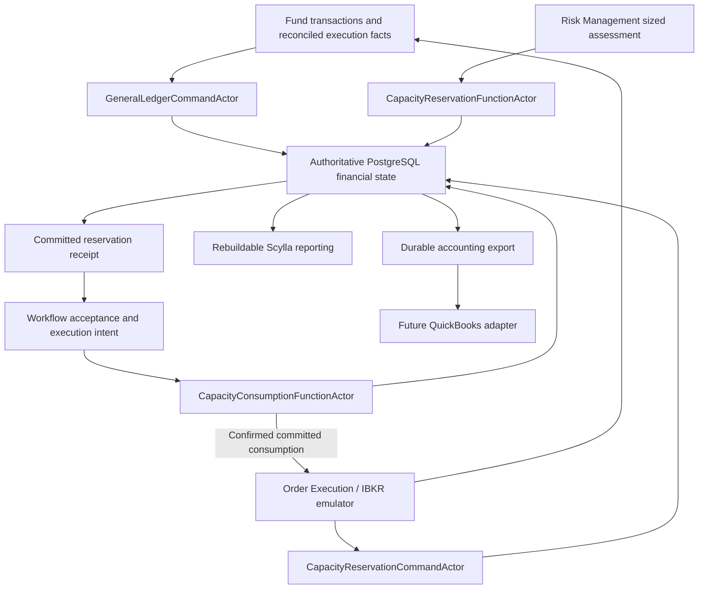

# Portfolio and Fund High-Level Design

> **Emulator scope correction (2026-09-08):** The IBKR emulator design has not started; its implementation is a future delivery after design approval. Do not list emulator fills, fees, settlement, cancellation or reconciliation as unfinished emulator work in the current Portfolio delivery. Current scope covers Portfolio accounting/capacity contracts, consumers and financial integrity tests using explicitly labelled execution-fact fixtures. Those tests do not qualify an emulator. Existing local submission/admission scaffolding is not a functioning emulator or evidence of broker acceptance. Full emulator integration is deferred; it is not a blocker for completing the current Portfolio development scope.

> **Development scope decision (2026-09-08):** The system is strictly in development while the complete trading system is being built. Production security implementation and qualification are deferred until immediately before production deployment. They do not block current development implementation or PF-FIN gate completion. Retain existing role/scope checks and all financial integrity rules; development principal/role metadata is not authenticated identity. Opening capital remains development-only. Completing development gates does not authorize production deployment.

> **Current financial-domain revision (2026-09-08):** Sections 27–34 define the new `Domain.Portfolio/GeneralLedger` and `Domain.Portfolio/CapacityReservation` subdomains, migration of legacy Fund transaction responsibilities, coordinated PostgreSQL financial authority, Portfolio Administration transaction views and future QuickBooks integration. Their implementation is planned; folder creation and this design do not establish a working ledger or reservation actor. These sections supersede earlier configuration-only and transaction-migration deferrals. Existing release evidence remains evidence for its original scope only.

> **Current strategy catalog alignment (2026-09-08):** ConfigurationDb now owns reusable strategy families, strategies, structures, variants, parameters and deployments. Portfolio owns exact Fund assignments and financial limits. The first four workflow Function actors, including Trade Selection and Order Composition, are implemented; Risk Management and Portfolio financial admission are the next design/implementation scope. Earlier ReferenceDb three-family seeds and family-to-timeframe tables below describe historical compatibility, not new admission rules. All twelve currently supported futures/vertical/iron-condor variants can use one triggering Daily, Weekly or Monthly horizon. See [ConfigurationDb strategy catalog implementation](../../TomasAI.IFM.Application.Storage/Docs/ConfigurationDb-Strategy-Catalog-Implementation.md).

> **2026-09-05 catalog amendment:** [Product discovery, family creation and exact Fund references](../../TomasAI.IFM.Domain.Reference/Docs/Trade-Strategy-Symbol-Catalog-Implementation.md) supersedes the earlier read-only/unique-SystemKey restrictions below. References now supports creating immutable product-linked definitions. SystemKey is non-unique classification; updated Fund/assignment editors persist exact catalog ID/version references (SchemaVersion 2). Seed-only acceptance statements describe the earlier baseline, not a current three-row limit. Existing history is preserved and no downstream trading capability is automatically enabled.

**Version:** 0.3 (filename retained for existing links)
**Status:** Design updated for General Ledger and Capacity Reservation; new financial implementation pending
**Scope:** Portfolio/Fund administration, exact catalog permissions, financial policy, General Ledger/Fund transactions, atomic capacity reservation, financial UI and controlled legacy migration
**Prerequisite for:** Authoritative financial balances and capacity admission for Risk Management and the five-stage strategy workflow
**Explicitly deferred:** Actual IBKR connectivity, QuickBooks connector implementation, and high-throughput market-data identity redesign; execution/fill accounting contracts are included, broker implementation is separate
**Detailed specification:** [Portfolio-Fund-Specification-v1.0.md](../../TomasAI.IFM.Domain.Portfolio/Docs/Portfolio-Fund-Specification-v1.0.md)
**Implementation plan:** [Portfolio-Fund-Implementation-Plan-v1.0.md](../../TomasAI.IFM.Domain.Portfolio/Docs/Portfolio-Fund-Implementation-Plan-v1.0.md)

**Construction/sizing and reservation clarification — 2026-09-08:** [Order Composition](../../TomasAI.IFM.Domain.Trade/Strategy/Workflow/IntrinsicTime/OrderComposer/Docs/OrderComposition-Specification-v1.0.md) produces one unapproved unit. [Risk Management](../../TomasAI.IFM.Domain.Trade/Strategy/Workflow/IntrinsicTime/RiskManager/Docs/RiskManagement-High-Level-Design-v0.1.md) calculates final units and financial eligibility. Portfolio's proposed `CapacityReservationFunctionActor` atomically commits capacity usage, its reservation receipt and completed event in PostgreSQL before returning Complete. Workflow acceptance and execution authority remain separate from a calculated approval.

## 1. Purpose

This document defines the new authoritative Portfolio and Fund model required by the trade-strategy workflow. It replaces the transitional assumption that a Fund independently owns capital and financial risk, while preserving the useful separation already present in the manual trading application:

- Portfolio and Fund describe investment authority and planned trade composition;
- TradeSelection chooses a permitted trade template;
- OrderComposition constructs an exact one-unit candidate order;
- RiskManagement determines final units and independently evaluates financial eligibility or rejects;
- GeneralLedger owns authoritative financial postings and balances;
- CapacityReservation commits holds against current financial capacity before execution is authorized; and
- a later OrderExecution workflow creates and manages broker-facing TradeDb records.

The earlier configuration phase stopped at the Fund-to-OrderComposition boundary. The next phase adds ledger posting, financial admission, transaction UI and migration under sections 27–34. It defines the financial effects of execution/fills without implementing actual broker connectivity or redesigning every execution-facing TradeDb table.

## 2. Authoritative decisions

The following decisions are approved and normative:

1. The ownership hierarchy is `Portfolio -> Fund`.
2. A Fund belongs to exactly one Portfolio for one effective Fund version.
3. Portfolio owns capital, allocation, reserves, financial limits, aggregate exposure, and delegated Fund risk envelopes.
4. Fund owns investment intent, mandate, eligible assets, selection guidance, trade-template assignments, composition-policy assignments, and Fund composition instances.
5. `FundOrder` and `FundOrderTrade` remain Fund-owned composition records. They are not broker orders, fills, or live positions.
6. `TradeTemplate` is reusable versioned selection configuration. `FundOrder` is a particular planned composition instance. These concepts must not be conflated.
7. TradeSelection selects a versioned permitted template or returns `NoTrade`. It does not construct exact contracts, legs, quantities, or prices.
8. OrderComposition constructs the exact non-executable one-unit candidate order. Risk Management determines final strategy-unit quantity. Portfolio's CapacityReservation subdomain reserves capacity atomically before workflow/execution acceptance. Composer does not contact a broker or create a live position.
9. The Fund composition process reserves the integer `OrderId` and `TradeId` values that all downstream stages must retain unchanged.
10. PostgreSQL `ISequenceIdGenerator` remains the allocator for Portfolio, PortfolioFinancialPolicy, Fund, Order, and Trade business identifiers. Operators never type, choose, or override generated integer IDs; creation allocates the ID before an editor or command can submit the new entity.
11. Workflow, command, event, trace, and idempotency identities may remain GUID based because they are technical identities, not operator-facing trade identifiers.
12. `PortfolioDbContext` supplies Scylla read models. GeneralLedger and CapacityReservation require authoritative PostgreSQL tables coordinated with Command/Function event persistence; Scylla projections cannot authorize spending.
13. Existing Fund actors/data remain legacy during migration. The user has requested migration of Fund transaction responsibilities, processing and tables into Portfolio. Section 32 defines a reconciled additive migration and one authoritative writer per Fund; it does not permit blind copying or destruction of historical evidence.
14. The existing Funds UI remains available during replacement. A separate Portfolio UI is built and tested before legacy removal.
15. The Trade UI must not create a Fund. Portfolio and Fund administration belongs to the Portfolio UI.
16. All application queries and commands reach actors through NATS messaging. UI and console clients do not access the Portfolio database directly.
17. OrderExecution, broker integration, broker fills, live positions, and the execution-facing TradeDb redesign are later work.
18. Sequence-generated identifiers used by high-throughput ScyllaDB tables require a separate performance and identity-semantics review; they are outside this design.
19. `PortfolioCode` is removed. `PortfolioId` is the stable sequence-generated operator identity and `Name` is the display description. A later external alias may be added only for a demonstrated integration requirement.
20. A v1 `PortfolioFinancialPolicy` is a real Portfolio-owned versioned aggregate, not a raw GUID or free-form document.
21. `PolicyId` is a positive operator-facing integer allocated by PostgreSQL `ISequenceIdGenerator`; operators never enter or override it.
22. Portfolio creation remains Draft and does not require a policy. Portfolio activation requires selection of one existing, valid Active policy belonging to that Portfolio.
23. Active policy versions are immutable. Updating financial limits creates a new policy version and activating it creates a new Portfolio version that freezes the selected PolicyId and PolicyVersion.
24. Only a never-active, unreferenced Draft policy may be deleted. Deletion removes operational projections but retains an authoritative tombstone and never reuses its integer ID.
25. Placeholder or randomly generated policy identities are prohibited.
26. Portfolio Administration exposes `Risk Policy...` as a primary Portfolio command. Less-frequent Portfolio version, state, and Draft-deletion operations are grouped under one `Portfolio Actions` menu instead of occupying separate command-bar buttons.
27. Trade Orders is the single operator-facing view for manual and Strategy Workflow compositions. Portfolio Administration does not expose Planned Compositions, and no separate composition viewer is retained.
28. ReferenceDb retains product definitions and legacy compatibility identities. ConfigurationDb owns reusable strategies, structures, variants and deployments; Portfolio owns exact Fund assignments and deployment-scoped limits.
29. `TradeStrategyFamilyId` is a positive sequence-generated integer. Each definition has a stable system key and immutable definition version; bootstrap is idempotent and never renumbers an existing family.
30. PortfolioFinancialPolicy contains one versioned `TradeFamilyRiskLimit` per configured family. A family must be enabled before use, and its limits can constrain but never enlarge Portfolio-wide limits.
31. New financial admission uses exact supported ConfigurationDb variants, including long/short, balanced/directional bias and debit/credit. A new catalog definition never expands financial permission or installs a risk model automatically.
32. `GeneralLedger` owns balanced financial journals, authoritative account balances, corrections, period control and reconciliation. `CapacityReservation` owns holds, usage and reservation lifecycle. A hold is not a cash expense.
33. Financial posting Commands and capacity reservation/consumption Functions use one shared PostgreSQL admission/concurrency protocol. Business changes, receipts and authoritative events commit together; financial success cannot depend on eventual Scylla projection.
34. QuickBooks is a future external accounting integration through explicit mapping and durable synchronization. Its availability and reporting projections are not trading admission authority.

## 3. Relationship to other designs

This document is the authoritative Portfolio/Fund prerequisite for:

- [TradeSelection-High-Level-Design-v0.1.md](../../TomasAI.IFM.Domain.Trade/Strategy/Workflow/IntrinsicTime/TradeSelection/Docs/TradeSelection-High-Level-Design-v0.1.md);
- `Intrinsic-Time-Strategy-Workflow-Design-v0.2.md`;
- the [TradeSelection specification](../../TomasAI.IFM.Domain.Trade/Strategy/Workflow/IntrinsicTime/TradeSelection/Docs/TradeSelection-Specification-v1.0.md);
- the [OrderComposition specification](../../TomasAI.IFM.Domain.Trade/Strategy/Workflow/IntrinsicTime/OrderComposer/Docs/OrderComposition-Specification-v1.0.md);
- the [RiskManagement design](../../TomasAI.IFM.Domain.Trade/Strategy/Workflow/IntrinsicTime/RiskManager/Docs/RiskManagement-High-Level-Design-v0.1.md); and
- the replacement Portfolio and Trade composition UI.

The implementation-grade commands, events, DTOs, state transitions, NATS services, persistence projections, validation codes, test obligations, and delivery gates are defined by [Portfolio-Fund-Specification-v1.0.md](../../TomasAI.IFM.Domain.Portfolio/Docs/Portfolio-Fund-Specification-v1.0.md). The high-level design remains authoritative for domain intent; the detailed specification is authoritative for the initial repository contract. Any conflict must be reconciled in both documents before implementation proceeds.

The linked Portfolio specification is updated to v1.2 with financial requirements in sections 37–46. The [implementation plan v1.2, sections 15–22](../../TomasAI.IFM.Domain.Portfolio/Docs/Portfolio-Fund-Implementation-Plan-v1.0.md#15-financial-phase-authority-scope-and-dependencies) defines PF-FIN-01 through PF-FIN-07, guardrails, migration and five-layer test evidence. All financial implementation gates remain Not Started. This document does not relabel old completed gates as covering the new subdomains.

The OrderExecution specifications remain valid future-direction documents, but their implementation does not begin as part of this design. Nothing in this document authorizes a broker side effect.

If another document describes Portfolio/Fund as a deferred post-paper-trading refactor, this document supersedes that timing. Portfolio/Fund is now a prerequisite for implementing TradeSelection and OrderComposition against the production-shaped domain model.

## 4. Responsibility model

| Component | Authoritative responsibility | Must not own |
| --- | --- | --- |
| Portfolio | Identity, operating state, selected financial-policy reference, Fund membership, allocations, aggregate exposure, and delegated Fund envelopes | Defining policy limits inline, trade-template compatibility, exact legs, broker execution, or live marks |
| PortfolioFinancialPolicy | Versioned capital, reserve, exposure, margin, drawdown, trade-family, and hard-risk limits for one Portfolio | Fund investment intent, exact order construction, broker credentials, or mutable active rules |
| Existing Reference family catalog | Versioned instrument/product/timeframe compatibility identities and discovery | New reusable strategy taxonomy or Fund authorization |
| ConfigurationDb strategy catalog | Reusable families, strategies, structures, variants, parameters and exact deployments | Portfolio-specific permissions, financial limits or executed contract facts |
| GeneralLedger | Fund transaction processing, balanced accounting journals, authoritative account balances, reversals, periods and reconciliation | Strategy selection, risk-policy decisions, broker submission or treating every valuation as settled cash |
| CapacityReservation | Atomic admission, financial holds, accounting of commitments and reservation consumption/release | Cash journal ownership, candidate construction or broker submission |
| Fund | Mandate, eligible assets, horizon, objectives, template assignments, composition preferences, and planned FundOrder/FundOrderTrade identities | Portfolio-wide capital authority, broker truth, fills, or live positions |
| Strategy Workflow | Stage sequencing, frozen input/result acceptance, timeouts, terminal semantics, and exactly-once logical progression | Reclassifying stage results or directly contacting a broker |
| TradeSelection | Select one permitted versioned template or `NoTrade` using accepted market decisions and the frozen Fund mandate | Exact expiration, strike, contract, quantity, price, or risk approval |
| OrderComposition | Build an exact, immutable one-unit candidate from the selected template/profile and fresh market data | Final strategy-unit sizing, risk reservation, broker submission or fill assumptions |
| RiskManagement | Determine final units using Portfolio/deployment/Fund limits and current capacity; independently validate economics and request Portfolio admission | Changing upstream classifications, silently changing legs/ratios or trusting provisional capacity as reserved |
| OrderExecution | Future broker submission, acknowledgement, replace/cancel, fill, reconciliation, and execution truth | Selecting a strategy or overriding an approval |
| TradeDb execution model | Future working orders, broker facts, fills, durable trades, and live-position inputs | Portfolio/Fund configuration authority |

The governing principle is:

> **Fund owns investment intent and composition guidance. Portfolio owns capital and financial risk. OrderExecution owns broker effects only after strategy approval.**

## 5. Conceptual model

```text
Portfolio
  +-- PortfolioFinancialPolicy versions
  +-- FundAllocation versions
  +-- FundRiskEnvelope versions
  +-- GeneralLedger: journals, balances, financial transactions, reconciliation
  +-- CapacityReservation: holds, commitments, atomic admission
  `-- Fund
       +-- FundMandate versions
       +-- TradeTemplate assignments
       +-- TradeSelectionHintProfile assignments
       +-- OrderCompositionProfile assignments
       `-- FundOrder
            `-- FundOrderTrade
                 |
                 | selected and composed by the strategy workflow
                 v
            OrderCompositionResult
                 |
                 | sized by RiskManagement, reserved by CapacityReservation
                 v
            Future OrderExecution
                 |
                 v
            Future TradeDb working order, fills, trade, and position

ConfigurationDb strategy catalog
  `-- exact deployment/strategy/structure/variant versions in Fund assignments and policy limits

GeneralLedger -> future QuickBooks adapter (asynchronous export and reconciliation)
```

## 6. Terminology

### 6.1 Portfolio

A Portfolio is the top-level financial authority for a broker/account scope. It selects a versioned PortfolioFinancialPolicy and delegates bounded authority to Funds.

### 6.2 PortfolioFinancialPolicy

A `PortfolioFinancialPolicy` is one Portfolio's versioned set of capital and hard-risk limits. It is a concrete managed entity with an allocated integer PolicyId, lifecycle, immutable versions, typed commands and queries, authoritative events, and operational projections. It is not the authorization-role map named `PortfolioOperationalPolicy`, a TradeSelection hint, or an OrderComposition profile.

### 6.3 TradeStrategyFamily

A `TradeStrategyFamily` is shared reference data identifying a typed asset-family/strategy pair, with a timeframe, underlying symbol, currency and description. The initial definitions are Daily ES futures, Weekly ES futures-option vertical spreads and Monthly ES futures-option iron condors, all USD. It is not a direction, bias, debit/credit choice, exact template, expiry contract, or order. Portfolio policies and templates reference its exact integer identity and definition version. `SystemKey` is the exact enum-name composition `Family-Strategy`; timeframe and symbol are metadata, not additional key components.

### 6.4 Fund

A Fund is a versioned investment mandate within one Portfolio. It describes what economic opportunity the Fund pursues and which structures it may use. A Fund does not independently create authoritative capital or risk limits.

### 6.5 TradeTemplate

A `TradeTemplate` is reusable versioned configuration describing a selectable trade structure, such as an ES directional future, ES option vertical, or directionally biased Iron Condor. It supplies compatibility and structural constraints, not current contracts or prices.

### 6.6 OrderCompositionProfile

An `OrderCompositionProfile` is reusable versioned construction policy. It may describe DTE bands, delta or strike-distance targets, width ranges, debit/credit preferences, leg shapes and per-unit ratios, price rules, liquidity requirements, and calculation versions. Final unit sizing belongs to Portfolio Risk Manager, not this construction profile.

### 6.7 FundOrder

A `FundOrder` is one Fund-owned planned composition instance. It binds a globally unique integer `OrderId` to one Portfolio, Fund, workflow context, selected template, composition policy, underlying intent, and lifecycle state.

It is not the broker order. It is the Fund's durable composition identity and audit record.

### 6.8 FundOrderTrade

A `FundOrderTrade` is one planned trade instruction inside a FundOrder. It binds a globally unique integer `TradeId` to the intended trade family, direction/action, role, and composition context.

It is not a fill and does not prove that a live position exists. A FundOrder may contain multiple FundOrderTrades when a future strategy requires related opening, closing, hedge, roll, or adjustment instructions.

### 6.9 OrderCompositionResult

An `OrderCompositionResult` is the immutable exact one-unit candidate produced by OrderComposition. It includes contracts, expiry, strikes, sides, ContractsPerUnit, UnitCount = 1, unit prices/economics, calculation evidence and the accepted identity/version chain. Final strategy-unit quantity is absent.

It is non-executable. RiskManagement creates a separately typed sized/approved result bound to its hash, final units, leg quantities and reservation, and the Strategy Workflow must accept that result before execution can proceed.

### 6.10 TradeDb trade and position

A TradeDb trade is future execution truth created through OrderExecution. A position exists only from confirmed fills, or from an explicitly approved manual-fill workflow. Current manual-entry behavior is legacy and is not the model for the new automated path.

## 7. Portfolio aggregate

### 7.1 Minimum Portfolio identity and lifecycle

The Portfolio aggregate requires:

| Field | Purpose |
| --- | --- |
| `PortfolioId` | Positive operator-facing integer identity |
| `Name` | Display name |
| `PortfolioVersion` | Immutable business configuration version |
| `BaseCurrency` | Currency for capital and risk normalization |
| `BrokerAccountRefs` | Versioned references to permitted accounts; no credentials |
| `OperatingState` | Draft, Active, Paused, ReduceOnly, Disabled, or Retired |
| `EffectiveFromUtc` / `EffectiveUntilUtc` | Version validity interval |
| `ActivePolicyId` / `ActivePolicyVersion` | Frozen reference to the selected Active PortfolioFinancialPolicy; empty while Draft is permitted |
| `CreatedOnUtc` / `CreatedBy` | Audit provenance |
| `SupersededOnUtc` / `SupersededBy` | Version-retirement provenance |

Physical deletion is not a normal business operation after activation. A never-activated Portfolio whose current state is Draft may be deleted from operational Portfolio/Fund projections through an audited `DraftPortfolioDeleted` tombstone. Draft-owned Fund configuration is removed with it, but authoritative event history and every allocated integer ID remain permanently retained and IDs are never reused. Any Portfolio that is not currently Draft is superseded or retired so historical workflow attribution remains resolvable.

### 7.2 Simplified v1 PortfolioFinancialPolicy

The v1 policy is intentionally a bounded financial-constraint model rather than a generic expression language. Its minimum contract is:

| Field | Purpose |
| --- | --- |
| `PortfolioId` | Owning Portfolio; cannot change |
| `PolicyId` | Positive sequence-generated operator identity; cannot change |
| `PolicyVersion` | Positive immutable version number |
| `Name` | Operator-readable policy description |
| `OperatingState` | Draft, Active, Superseded, or Retired |
| `BaseCurrency` | Currency used for policy capital and limits; must match Portfolio normalization currency |
| `CapitalBase` | Base-currency capital governed by this policy version |
| `ProtectedReserve` | Base-currency capital unavailable for new exposure |
| `MaximumDeployableCapital` | Base-currency upper bound delegated across Funds |
| `MaximumRiskPerTrade` | Base-currency maximum accepted candidate risk |
| `MaximumAggregateRisk` | Base-currency maximum combined accepted/open risk |
| `MaximumMargin` | Base-currency maximum aggregate margin use |
| `MaximumGrossNotional` | Base-currency maximum aggregate absolute notional |
| `MaximumOpenPositions` | Maximum simultaneous open positions |
| `MaximumDrawdownAmount` | Base-currency maximum Portfolio drawdown before new exposure is blocked |
| `TradeFamilyLimits` | Non-empty versioned collection keyed by TradeStrategyFamilyId/DefinitionVersion |
| `EffectiveFromUtc` / `EffectiveUntilUtc` | Policy-version validity interval |
| `CreatedOnUtc` / `CreatedBy` | Audit provenance |
| `SupersededOnUtc` / `SupersededBy` | Immutable replacement provenance |

Minimum invariants are:

- all monetary fields use decimal base-currency amounts rather than binary floating-point values;
- all monetary and count limits are non-negative, and an Active policy requires positive `CapitalBase` and `MaximumOpenPositions`;
- `ProtectedReserve <= CapitalBase`;
- `MaximumDeployableCapital <= CapitalBase - ProtectedReserve`;
- `MaximumRiskPerTrade <= MaximumAggregateRisk`;
- `EffectiveUntilUtc`, when present, is later than `EffectiveFromUtc`;
- trade-family identities are non-empty, recognized, versioned, and unique within the policy version;
- at least one family is enabled before activation;
- every enabled family has complete non-negative limits and references an Active ReferenceDb definition;
- a family limit can equal or reduce, but never exceed, its corresponding Portfolio-wide limit;
- one effective Active policy exists at most per Portfolio and time;
- Draft policy creation does not activate the Portfolio;
- Active policy versions cannot be edited in place;
- activation requires a complete valid policy, current time within its effective interval, and expected aggregate revisions; scheduled future activation is outside v1;
- assigning a policy to a Portfolio creates a new Portfolio version and freezes both identities/versions; and
- a policy selected by the current Portfolio version cannot be retired unless the same coordinated operation clears or replaces the reference; an Active Portfolio must also receive a valid replacement or transition out of Active; and
- a policy referenced by any Portfolio version, allocation, FundRiskEnvelope, workflow snapshot, composition, risk decision, or later execution record cannot be deleted.

Lifecycle behavior is:

```text
Create -> Draft v1
Draft -> Draft vN          (new immutable version)
Draft -> Active            (explicit activation)
Active -> Superseded       (when a newer version is activated)
Active -> Retired          (explicit terminal retirement when no replacement is intended)
Draft -> Deleted           (only when never active and unreferenced)
Superseded/Retired/Deleted -> no mutation
```

The v1 policy does not implement formulas, scripts, conditional rule trees, scenario engines, intraday utilization, live broker balances, credential storage, or execution behavior. Those require separately versioned extensions.

Each v1 `TradeFamilyRiskLimit` contains:

| Field | Purpose |
| --- | --- |
| `TradeStrategyFamilyId` / `DefinitionVersion` | Exact immutable ReferenceDb family definition |
| `Enabled` | Whether the family may be considered under this policy |
| `MaximumRiskPerTrade` | Base-currency family cap per candidate |
| `MaximumAggregateRisk` | Base-currency combined family-risk cap |
| `MaximumMargin` | Base-currency family margin cap |
| `MaximumGrossNotional` | Base-currency family gross-notional cap |
| `MaximumOpenPositions` | Family position-count cap |

The effective permission is the intersection of Portfolio-wide remaining capacity, the selected family limit, the FundRiskEnvelope, and current capacity. Per-family limits are caps, not reserved allocations, so their sum need not equal Portfolio capital. Disabled rejects the family. Enabled with a zero limit retains the configuration but blocks the corresponding capacity. No zero value means unlimited.

### 7.3 Portfolio authority

The PortfolioFinancialPolicy defines the limits within which the Portfolio may operate. The Portfolio aggregate records actual Fund allocations, delegated FundRiskEnvelopes, observed aggregate exposure, and Portfolio operating state. The v1 policy owns:

- approved capital base and protected reserves;
- deployable capital;
- maximum risk per candidate and aggregate open/working risk;
- maximum margin and gross notional;
- maximum open positions;
- maximum drawdown;
- permitted trade families; and
- policy identity, version, effective interval, and audit provenance.

Later policy versions may add Fund-allocation ranges, net-notional, leverage, concentration, correlation, Greeks, liquidity, exit-capacity, event-risk, loss, and recovery constraints. Those extensions remain Portfolio policy concerns; ownership must not be placed back on Fund merely for convenience.

## 8. Fund aggregate and mandate

### 8.1 Minimum Fund identity and lifecycle

| Field | Purpose |
| --- | --- |
| `PortfolioId` | Authoritative parent Portfolio |
| `FundId` | Positive operator-facing integer identity |
| `FundCode` | Stable operator-facing code |
| `Name` | Display name |
| `FundMandateVersion` | Immutable mandate version |
| `TradingYear` | Optional annual configuration boundary |
| `OperatingState` | Draft, Active, Paused, Disabled, or Retired |
| `EffectiveFromUtc` / `EffectiveUntilUtc` | Version validity interval |
| `DecisionHorizon` | Daily, Weekly, Monthly, or later configured horizon |
| `Objective` | Income, directional growth, volatility, mixed, or named objective |
| `UnderlyingUniverse` | Permitted economic exposures and roots |
| `EligibleAssetTypes` | Futures, futures options, or later approved asset types |
| `CreatedOnUtc` / `CreatedBy` | Audit provenance |

### 8.2 Fund mandate

The Fund mandate may define:

- permitted directions and biases;
- permitted RegimeDiscovery and MarketCondition classifications;
- preferred payoff intents;
- permitted strategy and trade families;
- preferred holding-period and entry-frequency ranges;
- minimum market-quality preferences;
- operational-complexity preferences;
- template preference weights where more than one template is later enabled;
- TradeSelection hint-profile references;
- OrderComposition profile references; and
- deterministic summary and reason-code versions.

The mandate may express preferences. It cannot override Portfolio hard constraints or a blocked FundRiskEnvelope.

### 8.3 Fund reporting versus authority

Fund projections should report:

- planned composition instances;
- working orders and positions received from future execution projections;
- realized and unrealized P&L;
- risk and margin utilization;
- performance and expectancy;
- active workflows; and
- incidents and health.

Reporting a value does not make Fund the authority that sets its financial threshold.

## 9. Template and profile assignments

Assignments are versioned relationships rather than mutable fields copied into every Fund row.

### 9.1 TradeTemplate assignment

An assignment contains:

- Portfolio and Fund identity/version;
- TradeTemplate identity/version;
- eligible horizon and underlying universe;
- enabled/paused state;
- effective interval;
- priority or preference weight if applicable;
- TradeSelection hint-profile identity/version; and
- OrderComposition profile identity/version.

### 9.2 Minimum initial catalog

The initial ES catalog remains:

| Horizon | Initial Fund intent | Trade family |
| --- | --- | --- |
| Daily | Directional ES exposure | Directional future |
| Weekly | Defined-risk directional ES exposure | Futures-option vertical spread |
| Monthly | Directionally biased range/income exposure | Futures-option Iron Condor |

These mappings are initial configuration, not permanent domain restrictions. The model must allow later templates and additional Funds without changing actor contracts structurally.

## 10. Fund composition lifecycle

### 10.1 Automated path

The minimum automated sequence is:

1. Strategy Workflow resolves and freezes Portfolio, Fund mandate, template assignments, and required policy versions.
2. RegimeDiscovery and MarketCondition complete normally.
3. TradeSelection evaluates only templates permitted by the frozen Fund mandate and Portfolio permissions.
4. On `Selected`, the workflow requests the Fund composition authority to reserve an integer OrderId and the required integer TradeId values.
5. The Fund actor creates a FundOrder/FundOrderTrade composition record bound to the accepted TradeSelection result.
6. OrderComposition consumes the frozen identity and policy chain and creates an exact candidate.
7. The workflow accepts or rejects the OrderComposition terminal result.
8. RiskManagement evaluates the exact candidate using the frozen Portfolio policy and FundRiskEnvelope.
9. The Strategy Workflow ends successfully, normally with no trade, or as failed according to its existing terminal rules.
10. A later OrderExecution workflow may consume only a committed, risk-approved result.

### 10.2 Manual composition path

A manual composition UI may remain useful, but it must use the same Portfolio/Fund actor commands, template catalog, composition profiles, identity reservation, validation, and candidate contracts as the automated path. Manual operation is an origin type, not permission to bypass TradeSelection, OrderComposition, or risk rules.

The unified Trade Orders screen creates a manual request as a canonical `Draft` owned by the Portfolio/Fund authority. The authority—not the UI or legacy Fund actor—allocates its integer OrderId. A Draft has no fabricated TradeSelection, template/profile, trade leg, broker, fill, or position data. It remains non-executable until later commands supply and validate the same selection, composition, and risk evidence required by the automated path. Manual and StrategyWorkflow rows carry explicit provenance in the same projection and query surface; no legacy Fund dual-write occurs.

### 10.3 Composition states

The design requires stable state concepts. Exact enum names are finalized in the specification, but the minimum semantics are:

- Draft;
- IdentityReserved;
- TemplateSelected;
- Composing;
- Composed;
- CompositionFailed;
- RiskPending;
- RiskRejected;
- RiskApproved;
- Cancelled;
- Expired; and
- future ExecutionRequested, Executing, Executed, and ExecutionFailed states.

Execution states are reserved for compatibility but are not implemented by the Portfolio/Fund phase.

### 10.4 Immutability

Once a workflow accepts a FundOrder identity and version:

- OrderId and TradeId cannot change;
- PortfolioId and FundId cannot change;
- selected template and profile versions cannot change;
- accepted upstream result identities/hashes cannot change;
- material economic changes create a new composition revision; and
- no configuration update may rewrite an in-flight or historical composition.

## 11. Pipeline contracts

### 11.1 Frozen Portfolio/Fund context

The Strategy Workflow should carry a resolved immutable context containing at least:

| Group | Minimum fields |
| --- | --- |
| Workflow | WorkflowId, StageInvocationId, EntityId, revision, trace context, started/evaluated timestamps |
| Portfolio | PortfolioId, PortfolioVersion, operating state, selected PolicyId/PolicyVersion |
| Financial policy | Complete frozen limits, lifecycle/effective interval, PolicyId, and PolicyVersion |
| Fund | FundId, FundMandateVersion, operating state, horizon, objective, eligible universe |
| Delegation | FundRiskEnvelope identity/version, capacity state, validity interval |
| Catalog | Eligible TradeTemplate assignments and versions |
| Selection | TradeSelection hint-profile identity/version |
| Composition | OrderComposition profile identity/version |

The snapshot is resolved once for the workflow version. Stages validate it at their trust boundaries but do not silently refresh it mid-workflow.

FundAllocation and FundRiskEnvelope provenance both carry the same `SourcePolicyId` and `SourcePolicyVersion`. A missing identity, version-only reference, fabricated identity, Portfolio ownership mismatch, or reference to a non-Active policy is invalid. Downstream stages receive the resolved immutable limits as well as their source identity; they never query for "latest policy" mid-workflow.

### 11.2 TradeSelection input and output

TradeSelection consumes:

- accepted RegimeDiscoveryDecision;
- accepted MarketConditionDecision;
- frozen Portfolio/Fund context;
- eligible template assignments; and
- a versioned deterministic selection parameter set.

TradeSelection returns either:

- `Selected`, containing one TradeTemplate identity/version, direction or bias, composition-policy reference, structural constraints, evidence, and validity; or
- `NoTrade`, containing stable incompatibility evidence.

It does not create FundOrder IDs, exact legs, prices, or broker fields.

### 11.3 Composition identity reservation

After `Selected`, the workflow sends a NATS command conceptually equivalent to:

`ReserveFundOrderCompositionCommand`

The command includes the accepted workflow, Portfolio, Fund, template, profile, result identity/hash, and required trade-role count. The Fund actor returns a committed composition reference containing:

- PortfolioId;
- PolicyId;
- FundId;
- FundOrderVersion;
- integer OrderId;
- one or more integer TradeId values;
- template/profile versions;
- reservation timestamp;
- idempotency identity; and
- composition status.

Retries with the same idempotency identity must return the same reservation. They must not consume or attach different IDs.

### 11.4 OrderComposition input

OrderComposition consumes:

- accepted TradeSelectionResult;
- committed Fund composition reference;
- frozen Portfolio/Fund context;
- exact OrderComposition profile;
- permitted futures/options reference and market data;
- current liquidity and price evidence;
- authenticated one-unit construction constraints supplied by Portfolio/Risk authority, not permission to perform final sizing; and
- deterministic calculation versions.

OrderComposition may use additional relevant market data required for exact construction. It must record every input identity, source timestamp, freshness decision, and version used.

### 11.5 OrderComposition output

The immutable result contains at least:

- PortfolioId, FundId, OrderId, and TradeId values;
- FundOrder and composition revision;
- selected template and profile versions;
- underlying and instrument contracts;
- expiration and DTE;
- ordered legs, actions and ContractsPerUnit; UnitCount = 1 and RequiresPortfolioSizing; no final unit quantity;
- order action and proposed order type;
- price or price-policy result;
- expected debit/credit and commissions;
- payoff, maximum-profit, maximum-loss, breakeven, and stress calculations as applicable;
- liquidity and tradability checks;
- composition evidence, warnings, and stable reason codes;
- result identity/hash, created time, and validity time; and
- `Composed`, `NoCandidate`, or `Failed` terminal semantics.

It contains no broker order ID and causes no external effect.

## 12. Integer identity strategy

### 12.1 Business identifiers

The following remain positive integer business identifiers:

- PortfolioId;
- PolicyId;
- TradeStrategyFamilyId;
- FundId;
- OrderId; and
- TradeId.

OrderId and TradeId are intended for concise operator communication, blotter use, reconciliation, and institutional trading workflows.

### 12.2 Allocation

`ISequenceIdGenerator` backed by PostgreSQL remains the only application-facing allocator. Named PostgreSQL sequences reserve disjoint blocks for each application instance. The authoritative business sequences are `Portfolio_PortfolioId`, `PortfolioPolicy_PolicyId`, `Reference_TradeStrategyFamilyId`, `Fund_FundId`, `Trade_OrderId`, and `Trade_TradeId`. The ReferenceDb bootstrap reserves family IDs idempotently by stable system key. The Fund composition authority requests and commits OrderId/TradeId values; downstream actors accept all allocated identities and never renumber them.

Every new low-volume business entity that requires an integer identity MUST receive that identity from its registered named sequence. UI, console, API, import, and test-support creation paths MUST NOT accept an operator-selected integer ID or calculate one from a row count or current maximum. A generated ID may be displayed read-only after allocation. Editing or versioning an existing entity preserves its allocated ID and never reserves a replacement.

Gaps are valid. Request-completion order is not a business guarantee. A reserved ID is never reused after cancellation, failure, or process termination.

### 12.3 Identity chain

The complete attribution key is:

`PortfolioId + PolicyId/PolicyVersion + TradeStrategyFamilyId/DefinitionVersion + FundId + OrderId + TradeId`

OrderId and TradeId are globally unique under their named sequences, while PortfolioId and FundId preserve explicit ownership and support direct query projections. No historical lookup should infer Portfolio solely from the Fund's current membership.

### 12.4 Capacity and overflow

Current OrderId and TradeId contracts use signed 32-bit integers. Allocation and projection layers must monitor high-watermarks and fail safely before overflow. Changing operator-facing ID width requires a separately versioned contract decision; silent wrapping is forbidden.

### 12.5 Deferred high-throughput ScyllaDB review

The PostgreSQL allocator is approved for low-volume business identifiers. It is not automatically approved for every ScyllaDB `sequenceId` or `tickId`.

Before high-throughput market data or execution tables are redesigned, every generated ID must be classified by purpose:

- human-facing identity;
- source-provided sequence;
- ordering within a partition;
- replay/idempotency identity;
- pagination cursor; or
- globally unique technical row identity.

Source sequences, composite keys, event-derived identities, partition-local sequences, timestamps, or time-based UUIDs may be more appropriate for performance-sensitive inserts. That review is explicitly deferred and must not block Portfolio/Fund implementation.

## 13. Actor topology and NATS APIs

### 13.1 Actor boundaries

The following list describes the initial configuration/composition topology. Sections 27–30 add `GeneralLedgerCommandActor`, `CapacityReservationFunctionActor`, `CapacityConsumptionFunctionActor`, `CapacityReservationCommandActor` and Query actors with shared atomic persistence. The two financial Functions are Portfolio services, not additional analysis stages.

The initial topology should expose separate logical responsibilities:

- Portfolio Command actor;
- Portfolio Query actor;
- Portfolio Financial Policy Command actor;
- Portfolio Financial Policy Query actor;
- Fund Command actor within the Portfolio domain;
- Fund Query actor;
- Fund composition Command actor or a clearly separated composition command surface on the Fund actor;
- Portfolio/Fund EventProjector actors; and
- existing Strategy Workflow, TradeSelection, OrderComposition, and RiskManagement actors.

The detailed specification decides whether Portfolio and Fund commands are implemented by separate actor classes or one bounded context with distinct subjects. The public contracts must remain separated by responsibility.

### 13.2 Minimum commands

Minimum command concepts include:

- CreatePortfolio;
- AddPortfolioVersion;
- ChangePortfolioOperatingState;
- AllocatePortfolioPolicyId;
- CreatePortfolioFinancialPolicy;
- AddPortfolioFinancialPolicyVersion;
- ActivatePortfolioFinancialPolicy;
- RetirePortfolioFinancialPolicy;
- DeleteDraftPortfolioFinancialPolicy;
- AssignActivePolicyToPortfolio;
- AddFundToPortfolio;
- AddFundMandateVersion;
- ChangeFundOperatingState;
- AssignTradeTemplateToFund;
- AssignTradeSelectionHintProfile;
- AssignOrderCompositionProfile;
- DelegateFundRiskEnvelope;
- ReserveFundOrderComposition;
- RecordFundOrderComposed;
- RecordFundOrderCompositionFailed;
- RecordFundOrderRiskOutcome; and
- CancelFundOrderComposition.

Names, payloads, MessagePack keys, and subject conventions are finalized in the specification.

### 13.3 Minimum queries

Minimum typed NATS queries include:

- GetPortfolio;
- GetPortfolioVersion;
- GetPortfolios;
- GetPortfolioFinancialPolicy;
- GetPortfolioFinancialPolicyVersion;
- GetPortfolioFinancialPolicies;
- GetActivePortfolioFinancialPolicy;
- GetTradeStrategyFamily;
- GetTradeStrategyFamilies;
- GetFundsByPortfolio;
- GetFundMandate;
- GetActiveFundByPortfolioAndHorizon;
- GetFundTemplateAssignments;
- GetFundComposition;
- GetFundCompositionsByPortfolioAndFund;
- GetFundOrderByOrderId;
- GetFundOrderTradeByTradeId; and
- GetPortfolioFundStrategyReferenceCombinations.

List queries must use bounded paging or streaming contracts where result size is not strictly bounded.

### 13.4 Terminal semantics

Every mutation follows the established actor conventions:

- validate before mutation;
- emit exactly one logical terminal outcome;
- preserve CommandId and trace context;
- support idempotent retry;
- project only committed events;
- use stable error categories and codes; and
- never treat a business rejection as an infrastructure failure.

For the two capacity Functions, Complete confirms the authoritative PostgreSQL transaction. Ledger/lifecycle Commands likewise return a committed financial outcome only after atomic business/receipt/event persistence; accepted/queued is not posted. Unknown commit requires reconciliation. Existing unrelated Command/projector and calculation Function behavior remains unchanged. Section 30 defines the opt-in financial paths.

## 14. Persistence boundaries

### 14.1 PortfolioDbContext

The new context owns logical projections for:

- Portfolio identity and versions;
- Portfolio policies and operating state;
- Funds and mandate versions;
- Portfolio-to-Fund membership history;
- Fund allocations and FundRiskEnvelope versions;
- TradeTemplate and profile assignments;
- FundOrder composition instances;
- FundOrderTrade composition instructions; and
- composition status/result references and audit provenance.

Exact physical CQL tables, partition keys, clustering order, paging, and retention policies belong to the detailed storage specification. Tables must be designed from approved query paths rather than relational normalization assumptions.

PostgreSQL EventSourceDb is authoritative for PortfolioFinancialPolicy history and deletion tombstones. PortfolioDb Scylla projections provide `policy_by_id`, `policies_by_portfolio`, and `active_policy_by_portfolio` query shapes. Projectors use committed event IDs as monotonic write/delete fences so delayed replay cannot overwrite or resurrect a newer policy version or deleted Draft. UI and pipeline actors never access these tables directly.

### 14.2 Strategy workflow persistence

The Strategy Workflow remains authoritative for accepted stage results, result hashes, continuation decisions, and workflow terminal state. PortfolioDb may project references needed for Portfolio/Fund views, but it must not create a second mutable authority for the exact stage result.

### 14.3 TradeDbContext

The existing TradeDb strategy-workflow projections may continue to support the current workflow implementation. Execution-facing TradeDb tables are not redesigned here.

Future OrderExecution will create working-order, acknowledgement, fill, trade, and live-position records using the approved PortfolioId, FundId, OrderId, and TradeId chain. TradeDb must not allocate replacement business IDs.

### 14.4 FundLegacyDbContext

Current Fund tables and historical data are legacy. They are retained through a `FundLegacyDbContext` boundary:

- no automatic startup migration; explicit Fund transaction migration follows section 32;
- no dual write;
- no dual read in new Portfolio actors;
- explicit identity/history compatibility for the requested transaction migration;
- read-only behavior by default after cutover; and
- separate UI labeling and operational controls.

Existing table shapes may be consulted as design input but do not constrain the new schema.

### 14.5 ReferenceDb TradeStrategyFamily catalog

ReferenceDb owns a query-shaped `trade_strategy_family_v3` catalog partition containing typed definition versions. Its database identity is the stable `(SystemKey, DefinitionVersion)` pair; its positive integer `TradeStrategyFamilyId` is allocated by the existing PostgreSQL sequence service. Bootstrap preserves mapped legacy IDs/version/audit from the untouched `trade_strategy_family_v2` table and conditionally inserts by the new stable key. A losing fresh initializer may leave an acceptable sequence gap, but an allocated ID is never hand-entered or reused. The bootstrap seeds:

| System key | Timeframe | Symbol / currency | Definition version | State |
| --- | --- | --- | ---: | --- |
| `Futures-Futures` | Daily | ES / USD | 1 | Active |
| `FuturesOption-VerticalSpread` | Weekly | ES / USD | 1 | Active |
| `FuturesOption-IronCondor` | Monthly | ES / USD | 1 | Active |

The [typed catalog definition](../../TomasAI.IFM.Domain.Reference/Docs/Trade-Strategy-Family-Typed-Definition.md) specifies the 14-key MessagePack contract and coordinated API/UI deployment. Fund mandate and assignment timeframe dropdowns expose only Daily, Weekly and Monthly, mapped to `TimeFrameType`.

The public surface now includes audited creation plus typed point/list queries. References offers Create Family; existing definitions remain immutable with no Edit, Retire or Delete action. New definitions use the additive CAS catalog `trade_strategy_family_catalog_v4`, and stable provider product identities use `trade_strategy_symbol_v1`. Several definitions may share SystemKey. No Portfolio, policy, pipeline, or UI component reads ReferenceDb directly.

### 14.6 General Ledger and Capacity Reservation authority

The financial subdomains own PostgreSQL journals, postings, balances, receipts, reservations and admission revisions. Typed contexts must enlist in the same request-scoped connection/transaction as the Command domain outcome or Function completed event append. Two independent contexts/transactions are insufficient. Section 29 defines logical tables; specification section 40 pins schemas/contexts and event-store co-location.

Existing `PortfolioDbContext` is a Scylla projection context; it must not be described as the transactional financial database. Add Portfolio-owned read models there as needed. Reference/configuration stores retain reusable definitions and mapping policy; they do not store current cash or spendable capacity.

## 15. Query projections

The new storage design must directly support the approved UI and actor queries. Minimum logical projections include:

- portfolios by operating state;
- Portfolio by PortfolioId;
- policies by PortfolioId and state;
- policy versions by PolicyId;
- active policy by PortfolioId and effective time;
- Funds by PortfolioId;
- active Fund by PortfolioId, trading year, and horizon;
- Fund mandate by FundId and version;
- template/profile assignments by FundId and mandate version;
- current FundRiskEnvelope by PortfolioId and FundId;
- FundOrders by PortfolioId, FundId, status, and time window;
- FundOrderTrades by PortfolioId, FundId, and OrderId;
- composition lookup by globally unique OrderId;
- trade-instruction lookup by globally unique TradeId; and
- active workflows/composition status by PortfolioId and FundId.

An optional Portfolio-wide blotter query may expose all Funds, but it requires its own projection. It must not perform an unbounded cross-partition scan.

## 16. UI design

### 16.1 Navigation

During transition:

- retain the existing Funds menu and current Fund UI;
- add a separate Portfolio menu and new Portfolio UI;
- label the old destination as Legacy Funds when operationally appropriate; and
- remove the old UI only after the new UI and workflows pass acceptance gates.

### 16.2 Portfolio UI minimum capabilities

The layout below describes the earlier compact command-bar revision. The next financial revision retains the current equal-width Portfolio list, Fund list and selected-Fund detail areas and bottom metric rows, and adds the scoped financial views/actions in section 31. Existing functionality must remain accessible; financial additions do not reinstate a separate planned-composition viewer.

The selected-Portfolio command bar is deliberately small. The current implementation has six visible action buttons: Refresh, Create Portfolio, New Portfolio Version, Change Portfolio State, Delete Draft, and Planned Compositions. The v1 design replaces that arrangement with four visible actions:

```text
+-----------------------------------------------------------------------------------------------------------+
| Portfolio Administration | Show State: [ Active v ] | [Refresh] [New Portfolio...] [Risk Policy...] [Portfolio Actions v] |
+-----------------------------------------------------------------------------------------------------------+
```

`Show State` is explicitly a list filter; it is not the command for changing the selected Portfolio's operating state. The visible actions are:

| Action | Behavior |
| --- | --- |
| `Refresh` | Reload the Portfolio list and selected projections |
| `New Portfolio...` | Allocate a PortfolioId and open the Draft Portfolio editor |
| `Risk Policy...` | Open policy management for the selected Portfolio; disabled until a Portfolio is selected |
| `Portfolio Actions` | Open the bounded menu for the selected Portfolio |

The `Portfolio Actions` menu contains:

- `New Portfolio Version...`;
- `Change Operating State...`;
- `Delete Draft...`, enabled only for a Draft Portfolio.

The command bar retains its black background, white title/foreground, and visible gray border. It does not add a Financial Policies tab. Existing Fund/configuration views remain; Transactions, Balances and Reservations are added under the selected-Fund details as specified in section 31.

The new UI should support:

- list and inspect Portfolios;
- create/version/retire Portfolio configuration;
- manage a selected Portfolio's Risk Policy through the primary command-bar button and a focused modal window;
- create a policy using a read-only sequence-generated PolicyId;
- view policy details and immutable version history;
- create a new policy version from an existing version;
- activate and assign a valid policy to the Portfolio;
- retire an Active policy;
- delete only a never-active, unreferenced Draft policy after explicit confirmation;
- list Funds within a Portfolio;
- create/version/retire Fund mandates;
- assign templates and selection/composition profiles;
- inspect allocations and delegated FundRiskEnvelope versions;
- inspect immutable workflow/template/profile provenance; and
- display validation and terminal actor results.

The Portfolio create/version dialog does not expose raw PolicyId or PolicyVersion text fields. Draft Portfolio creation requires no policy. Activation opens a bounded selector containing only valid policies owned by that Portfolio. Selecting and assigning a policy submits its typed identity/version; the operator never types an ID. The current behavior that fabricates a GUID for FundRiskEnvelope provenance is prohibited and must be removed.

### 16.3 Risk Policy workflow and UI

The UI label is `Risk Policy`; the domain aggregate remains `PortfolioFinancialPolicy`. `Risk Policy...` opens one modal window scoped to the selected Portfolio. It does not add a Portfolio Administration tab and it does not manage Fund allocations or FundRiskEnvelopes.

#### 16.3.1 Entry and scope

The Portfolio command is disabled until one Portfolio is selected. Opening it supplies the selected PortfolioId and current Portfolio revision; the operator never searches for or types a PortfolioId or PolicyId.

The modal title and fixed context header display:

- `Risk Policy - Portfolio {PortfolioId}: {Portfolio Name}`;
- Portfolio operating state and version;
- Portfolio base currency;
- selected PolicyId/PolicyVersion, or `No policy assigned`; and
- selected policy state and effective interval.

The window is read-only when the principal has view permission but lacks the permission required for a displayed mutation.

#### 16.3.2 Window layout

```text
+------------------------------------------------------------------------------------------------------------------+
| Risk Policy - Portfolio 7001: Core Portfolio                       Portfolio: Draft | Currency: USD | Version: 3 |
| Assigned Policy: None / or Policy 8101 v2 Active                                                            |
+------------------------------------------------------------------------------------------------------------------+
| State: [All v]  Effective: [As of date]  [Refresh]  [New Policy...]                                             |
+--------------------------------------+---------------------------------------------------------------------------+
| POLICIES AND VERSIONS                | SELECTED POLICY VERSION                                                   |
|                                      |                                                                           |
| Policy  Version  State   Effective   | Identity & lifecycle                                                      |
| 8101    1        Superseded ...      | PolicyId [8101]  Version [2]  State [Active]  Name [...]                  |
| 8101    2        Active     ...      |                                                                           |
| 8102    1        Draft      ...      | Capital                                                                   |
|                                      | Capital Base | Protected Reserve | Maximum Deployable Capital              |
|                                      |                                                                           |
|                                      | Risk and exposure                                                         |
|                                      | Risk/Trade | Aggregate Risk | Margin | Gross Notional | Open Positions     |
|                                      | Maximum Drawdown Amount                                                   |
|                                      |                                                                           |
|                                      | Family limits: Futures | Vertical Spread | Iron Condor                         |
|                                      | Effective interval and audit provenance                                  |
+--------------------------------------+---------------------------------------------------------------------------+
| [New Version...] [Activate & Assign] [Policy Actions v]                                      [Close]          |
+------------------------------------------------------------------------------------------------------------------+
```

The left grid is ordered by PolicyId descending and PolicyVersion descending. It supports bounded state/effective-date filtering. It shows identities and versions, not editable cells.

The right pane has five groups:

1. Identity and lifecycle: read-only PortfolioId, PolicyId, PolicyVersion and state; editable Name only while creating a new Draft version.
2. Capital: CapitalBase, ProtectedReserve, MaximumDeployableCapital and the calculated read-only `Capital Available After Reserve`.
3. Risk and exposure: MaximumRiskPerTrade, MaximumAggregateRisk, MaximumMargin, MaximumGrossNotional, MaximumOpenPositions and MaximumDrawdownAmount.
4. Trade-family limits: a ReferenceDb-backed family list with Enabled, MaximumRiskPerTrade, MaximumAggregateRisk, MaximumMargin, MaximumGrossNotional, and MaximumOpenPositions for the selected family.
5. Effective interval and provenance: creator/replacement audit fields and validation results.

All monetary inputs are decimal amounts in the fixed Portfolio base currency. The UI does not ask for currency per field and does not silently convert currencies.

#### 16.3.3 Create and version workflow

`New Policy...` performs these steps:

1. request the next PolicyId from the registered PostgreSQL sequence through the typed NATS identity API;
2. open edit mode for Draft version 1 with read-only PortfolioId, PolicyId, PolicyVersion, state, and base currency;
3. accept the bounded v1 fields defined in section 7.2;
4. validate continuously and again on submission;
5. submit `CreatePortfolioFinancialPolicy`; and
6. refresh and select the committed projection after acknowledgement.

Cancelling after identity allocation consumes the PolicyId; it is never reused. It does not create a policy record.

`New Version...` copies the selected version into a new Draft version under the same PolicyId. The operator changes the Name, limits, trade-family permissions, or effective interval and submits `AddPortfolioFinancialPolicyVersion` with the expected aggregate revision. Saved policy versions are never edited in place, including saved Draft versions. A validation correction therefore creates another Draft version.

Edit mode replaces the normal footer with `Save Draft` and `Cancel`. Navigation and selection changes are blocked until the edit is saved or cancelled; closing with unsaved changes requires confirmation.

#### 16.3.4 Validation behavior

The editor shows field-level validation and a summary without issuing a command for known-invalid input. At minimum it enforces:

- required Name and valid effective interval;
- current time within the effective interval before activation; future scheduling is not part of v1;
- decimal base-currency amounts and whole-number MaximumOpenPositions;
- positive CapitalBase and MaximumOpenPositions for activation;
- `ProtectedReserve <= CapitalBase`;
- `MaximumDeployableCapital <= CapitalBase - ProtectedReserve`;
- `MaximumRiskPerTrade <= MaximumAggregateRisk`;
- at least one enabled Active trade-strategy family;
- exact family identity/version uniqueness and completeness;
- every enabled family limit less than or equal to its corresponding Portfolio-wide hard limit; and
- Portfolio ownership and base-currency equality.

Zero risk, deployable-capital, margin, notional, or drawdown limits are valid and deliberately block the corresponding capacity; the UI must not reinterpret zero as unlimited. An unlimited value is not part of v1.

The family list is loaded through the typed Reference NATS query and is read-only catalog data. Selecting a family edits only that policy version's limit row. A catalog query failure prevents Draft activation but does not prevent read-only display of already-frozen family IDs, versions, and names from a committed policy projection.

#### 16.3.5 Activate and assign workflow

`Activate & Assign` is the only primary activation command. It opens a confirmation summary showing the selected Draft PolicyId/PolicyVersion, current assigned policy, changed limits, effective interval, and affected Portfolio. Confirmation sends one idempotent coordinated command.

- For a Draft Portfolio, the command activates the policy and records its exact PolicyId/PolicyVersion in a new Portfolio version. The Portfolio remains Draft until the operator separately changes its operating state.
- For an Active Portfolio, the command atomically activates the new version, supersedes the previous active policy, and creates a new Portfolio version referencing the new exact version.
- For any Portfolio, validation or concurrency failure leaves the previously assigned policy unchanged.

The button is enabled only for a complete valid Draft policy owned by the selected Portfolio whose effective interval includes the current time. It is disabled for Active, Superseded, Retired, deleted, expired, not-yet-effective, foreign, or stale versions. Re-selecting the currently assigned version is an idempotent no-op, not another Portfolio version.

#### 16.3.6 Retire and delete workflow

`Policy Actions` contains only context-valid secondary operations:

- `Retire...` for an Active policy that is not selected by the current Portfolio version, unless the same coordinated workflow clears or replaces that reference; and
- `Delete Draft...` for a never-active, unreferenced Draft policy identity.

Retirement requires a reason and preserves the policy and projections. Draft deletion requires the operator to enter the displayed integer PolicyId and a reason. The system removes operational projections only after the authoritative deletion tombstone commits; the PolicyId remains consumed. Ineligible actions remain visible but disabled with a concise explanation so the lifecycle is discoverable.

#### 16.3.7 Refresh, conflicts, and completion

Commands and queries use typed NATS APIs. The modal never accesses PostgreSQL or ScyllaDB directly. While a command is pending, duplicate submission is disabled and the status area displays acknowledgement/projection progress. On optimistic-concurrency conflict, the modal preserves the attempted values separately, refreshes the committed version list, and requires the operator to review before retrying; it does not silently overwrite newer state.

Closing the modal refreshes the selected Portfolio's assigned-policy summary without changing the Portfolio Administration tab or Fund selection. Actor validation, authorization, timeout, unavailable, conflict, and projection-pending states are displayed explicitly.

### 16.4 Trade composition/blotter UI

The existing Trade Orders screen becomes the only composition and pre-execution blotter. The separate `PortfolioCompositionForm`/Planned Compositions navigation is removed. Both creation paths write the same canonical Fund-owned identities:

```text
Manual composition ---------+
                            +--> FundOrder --> FundOrderTrade --> Trade Orders UI
Strategy OrderComposition --+
```

The minimum screen hierarchy is:

```text
+----------------------------------------------------------------------------------------------------------------+
| Trade Orders | Portfolio: [ Select Portfolio v ] | Fund: [ Select Fund v ] | Source: [ All v ] | [Refresh] |
+----------------------------------------------------------------------------------------------------------------+
| FundOrders: OrderId | Created | Source | Composition/Risk Status | Trade Family | Reference                      |
+----------------------------------------------------------------------------------------------------------------+
| FundOrderTrades: TradeId | Type/Family | Trade Date | Maturity | State | Action | Reference                     |
+----------------------------------------------------------------------------------------------------------------+
| Selected composition details, exact legs/economics when available, and immutable workflow/risk provenance       |
+----------------------------------------------------------------------------------------------------------------+
```

Selection and loading behavior is:

1. select Portfolio;
2. clear the prior Fund, FundOrder, FundOrderTrade, and detail selections;
3. query and select a Fund belonging to that Portfolio;
4. view that Fund's manual and Strategy Workflow FundOrders;
5. select a FundOrder;
6. view its FundOrderTrades; and
7. inspect the exact composition and, later, execution/position details.

The selected Portfolio is an explicit query and authorization boundary, not an inferred label. Changing Portfolio or Fund cancels or supersedes an outstanding load so a delayed response cannot display records from the previous selection.

Required UI changes are:

- add a Portfolio selector before the existing Fund selector;
- populate the Fund selector only from Funds owned by the selected Portfolio;
- remove `Create Fund` from Trade Orders because Fund administration belongs to Portfolio Administration;
- keep manual `Create Order`/`Add Trade` composition for an eligible selected Portfolio and Fund;
- display Strategy Workflow compositions in the same FundOrder and FundOrderTrade lists;
- add a read-only `Source` value of `Manual` or `StrategyWorkflow` and allow `All`, `Manual`, and `Strategy Workflow` filtering;
- retain sequence-generated integer OrderId and TradeId display, lookup, and selection;
- show workflow, TradeSelection, template/profile, composition-result, and risk-result provenance in the selected-order detail rather than in a second viewer;
- make Strategy Workflow compositions and any composition with an accepted immutable result read-only; manual Draft composition remains editable through valid commands;
- make every action state-aware so invalid create, edit, complete, cancel, submit, or execution operations are disabled with an explanatory status;
- use typed NATS queries and commands against the new Portfolio/Fund composition authority rather than direct database access or legacy Fund actors; and
- preserve the current order/trade selection and detailed trade-control experience where it remains compatible.

Automated OrderComposition remains a pipeline responsibility: it converts a selected template into exact contracts, per-unit leg ratios, prices and one-unit economics. Final unit quantity comes from Portfolio Risk Manager. Removing the separate viewer does not remove that actor or its result. The actor's committed FundOrder/FundOrderTrade and immutable result remain displayed by Trade Orders, with unsized composition distinguished from a sized risk approval.

The current Submit Order, live-feed, fill, End-of-Day, and position controls belong to the legacy execution path. They must not become enabled for a new Portfolio-backed composition merely because it appears in Trade Orders. Their integration with an approved Strategy Workflow order is deferred to the OrderExecution/TradeDb design. Until that work is complete, the UI clearly identifies the record as pre-execution and exposes no broker side effect.

The resulting interaction is:

1. select Portfolio;
2. select Fund within the Portfolio;
3. enter a new manual composition or view an existing manual/automated composition;
4. select a FundOrder;
5. view its FundOrderTrades;
6. inspect exact composition and decision provenance; and
7. later, after OrderExecution is implemented, follow the same OrderId/TradeId into broker and position state.

The conversion to the new authority is performed as one tested UI boundary. It must not leave some Trade Orders operations mutating legacy Fund state while others mutate new Portfolio state. The requested Fund transaction migration follows section 32 with explicit ownership mappings, reconciliation and a fenced single-writer cutover; other legacy history remains source-isolated.

## 17. Concurrency, consistency, and idempotency

### 17.1 Aggregate serialization

The actor mailbox remains the serialization boundary for one aggregate identity. Portfolio updates, PortfolioFinancialPolicy updates, Fund mandate updates, and composition reservations use explicit expected aggregate revisions.

Replacing the selected policy of an already-Active Portfolio is a coordinated workflow with an idempotency key. It validates the candidate policy first, activates the new policy and supersedes the prior policy exactly once, then commits a new Portfolio version referencing the exact PolicyId/PolicyVersion. A retry returns the same committed result. The operation either completes as one logical transition or compensates to the previously valid selection; a partial failure cannot leave an Active Portfolio referencing a missing, Draft, foreign, or superseded policy.

### 17.2 Composition reservation

The same workflow and reservation idempotency key must always resolve to the same FundOrder identity. A duplicate command must not allocate another OrderId or TradeId.

### 17.3 Frozen versions

A workflow must reject mismatched Portfolio, financial-policy, Fund, template, hint-profile, composition-profile, and risk-envelope versions. It cannot silently resolve the latest version after starting.

### 17.4 Projection behavior

Projectors must be replay-safe and idempotent. Older events or revisions cannot overwrite newer projections. Failed projection delivery must be retryable without reallocating IDs or duplicating composition history.

## 18. Validation and invariants

Minimum invariants include:

- positive PortfolioId, FundId, OrderId, and TradeId;
- positive PolicyId for every persisted policy and active Portfolio policy reference;
- no operator-entered PortfolioId, PolicyId, FundId, OrderId, or TradeId;
- an Active Portfolio requires an existing Active policy owned by that Portfolio and the exact selected version;
- at most one effective Active policy per Portfolio;
- policy limit relationships satisfy the v1 invariants in section 7.2;
- allocations and FundRiskEnvelopes reference the exact selected SourcePolicyId/SourcePolicyVersion;
- only never-active, unreferenced Draft policies may be deleted;
- one effective parent Portfolio per Fund version;
- no overlapping active versions for the same Portfolio or Fund identity where uniqueness is required;
- an active Fund requires an active parent Portfolio;
- a Fund template assignment must reference an allowed underlying, asset type, horizon, and effective version;
- TradeSelection may select only a template present in the frozen mandate;
- composition profile must match the selected template/version;
- FundOrder identity must match the accepted Portfolio/Fund/workflow context;
- FundOrderTrade identities must belong to their FundOrder;
- one business ID is never reassigned after reservation;
- OrderComposition output identities must exactly match the committed Fund composition reference;
- no candidate may be marked risk approved without a matching accepted RiskManagement result; and
- no Portfolio/Fund command may cause a broker side effect.

## 19. Observability and audit

Commands, events, projections, queries, and UI status should expose, where applicable:

- WorkflowId and StageInvocationId;
- trace and correlation context;
- PortfolioId and PortfolioVersion;
- PolicyId and PolicyVersion;
- FundId and FundMandateVersion;
- OrderId and TradeId;
- template, hint-profile, composition-profile, and risk-envelope versions;
- expected/current aggregate version;
- actor, verb, result, reason code, and error category;
- started, evaluated, committed, and projected timestamps; and
- idempotency and replay disposition.

Operator summaries may describe outcomes but are not authority. Machine-readable events and results remain authoritative.

## 20. Security and authorization

The detailed specification must define authorization for:

- Portfolio creation and policy versioning;
- policy creation, activation, assignment, retirement, and Draft deletion;
- Fund creation and mandate versioning;
- allocation and FundRiskEnvelope changes;
- template/profile assignment;
- manual composition initiation or cancellation;
- retirement/reactivation operations; and
- future execution authorization.

Broker credentials and secrets do not belong in Portfolio or Fund records. Only stable account references and approved scopes are stored.

## 21. Test strategy and gates

### 21.1 Unit tests

Unit tests cover:

- aggregate invariants and version transitions;
- TradeStrategyFamily identity/version validation, deterministic three-row seed definitions, and bootstrap duplicate detection;
- global/per-family policy intersection, disabled-family, zero-blocking, and family-over-global validation;
- PolicyId sequence allocation, policy-limit validation, lifecycle transitions, immutability, reference checks, and Draft deletion eligibility;
- mandate/template/profile compatibility;
- Portfolio/Fund identity validation;
- composition state transitions;
- deterministic snapshot construction;
- integer ID retention;
- idempotent reservation behavior;
- mapping and serialization; and
- no broker-side-effect boundaries.

### 21.2 BDD tests

BDD scenarios cover:

- create a Draft Portfolio without a policy;
- expose exactly the three read-only v1 TradeStrategyFamily definitions and no strategy variants;
- configure enabled/disabled Futures, Vertical Spread, and Iron Condor family limits under global policy caps;
- create, validate, activate, assign, version, supersede, retire, and delete eligible Draft policies;
- reject activation without a real valid Active policy and reject deletion after reference or activation;
- activate Portfolio with an exact owned PolicyId/PolicyVersion;
- add and activate Fund mandate;
- assign initial Daily, Weekly, and Monthly templates;
- resolve active Fund by Portfolio/horizon;
- select a permitted template;
- reject a template outside the mandate;
- reserve one FundOrder and required FundOrderTrades;
- repeat a reservation command without allocating new IDs;
- compose a valid candidate with retained identities;
- reject stale or mismatched versions;
- record composition failure or `NoCandidate` without execution; and
- prove that no broker or live-position operation occurs.

### 21.3 Integration tests

Integration tests use real NATS actor routing and the configured PostgreSQL/Scylla test infrastructure to verify:

- commands, events, projection, and typed queries;
- ReferenceDb schema, sequence-backed idempotent family bootstrap, typed NATS reads, concurrency, and restart;
- policy identity allocation, typed policy commands/queries, optimistic versioning, activation/assignment coordination, restart/replay, and projection cleanup;
- sequence allocation across multiple application instances;
- restart/replay and duplicate delivery;
- optimistic concurrency;
- Portfolio/Fund query projections;
- strategy workflow snapshot handoff;
- TradeSelection-to-composition identity reservation;
- OrderComposition result recording; and
- legacy/new context isolation.

### 21.4 Verification tests

Verification tests cover representative Portfolio/Fund/template combinations rather than uncontrolled Cartesian expansion. At minimum they verify:

- minimum valid Futures, VerticalSpread, and IronCondor policy families;
- idempotent ReferenceDb bootstrap produces exactly the three active v1 families with unique sequence IDs and no duplicate rows after restart;
- Portfolio-wide and per-family limits intersect correctly, disabled families reject, zero blocks, and family limits cannot enlarge global capacity;
- capital/reserve/deployable boundary values and risk-per-trade/aggregate-risk relationships;
- Draft, Active, Superseded, Retired, referenced-Draft, and deleted-Draft policy decisions;
- missing, foreign, stale, inactive, expired, and mismatched policy references fail closed;
- Daily Fund with directional future template;
- Weekly Fund with bullish and bearish vertical templates;
- Monthly Fund with neutral and directional-bias Iron Condor templates;
- active, paused, disabled, expired, missing, and duplicate configuration states;
- Portfolio Green/Constrained/Blocked-style permission inputs as defined by Risk design;
- TradeSelection `Selected` and `NoTrade` paths;
- OrderComposition `Composed`, `NoCandidate`, and `Failed` paths;
- immutable identity/version propagation; and
- no OrderExecution dispatch in the Portfolio/Fund implementation phase.

### 21.5 UI system tests

System tests verify:

- Portfolio navigation is separate from legacy Funds;
- the command bar has exactly Refresh, New Portfolio, Risk Policy, and Portfolio Actions as its visible actions;
- Portfolio Actions contains only New Version, Change State, and conditional Delete Draft;
- Portfolio Administration exposes no Planned Compositions action or separate composition viewer;
- Risk Policy modal create/read/version/activate/assign/retire/Delete-Draft journeys;
- Reference screen lists exactly the three v1 trade-strategy families read-only with no mutation controls;
- Risk Policy loads the Reference catalog, selects each family, and edits only the selected policy-family limit row;
- Risk Policy is disabled without a selected Portfolio and always displays the fixed Portfolio identity, state, version, and base currency;
- PolicyId is sequence-generated and read-only, raw GUID fields are absent, and no fallback identity is fabricated;
- cancelling after PolicyId allocation leaves an allowed sequence gap and no policy record;
- saved versions are read-only, New Version copies values into a new Draft, and unsaved-close confirmation works;
- field and summary validation enforce all v1 relationships, and zero is displayed and processed as a blocking limit rather than unlimited;
- Activate & Assign for Draft and Active Portfolios preserves the exact PolicyId/PolicyVersion and cannot leave a partial replacement;
- Retire and Delete Draft eligibility, disabled explanations, typed confirmation, and reason requirements match the lifecycle rules;
- policy actor errors, authorization, pending projection, timeout, conflicts, deletion confirmation, and refreshed projections are visible;
- existing Funds navigation remains operational during transition;
- Trade Orders Portfolio selection clears stale state and filters the Fund selector;
- Trade Orders Fund selection shows both manual and Strategy Workflow compositions from the canonical new authority;
- Source filtering and read-only automated-composition behavior are correct;
- pre-execution Strategy Workflow records cannot invoke legacy submit, fill, live-feed, End-of-Day, or position actions;
- OrderId/TradeId selection opens the expected detail;
- Create Fund is absent from Trade Orders while manual Create Order remains available for an eligible Portfolio/Fund;
- actor errors and terminal status are visible; and
- no test leaves shared Portfolio, Fund, or temporary export data behind.

## 22. Implementation sequence

This list records the earlier configuration-phase sequence. The General Ledger and Capacity Reservation delivery sequence is section 34; upstream selector/composer work already implemented is not restarted.

The recommended delivery order is:

1. maintain approval of this HLD and terminology;
2. update and approve the linked detailed specification and implementation gates for PortfolioCode removal, trade-strategy families, and v1 PortfolioFinancialPolicy;
3. add the ReferenceDb `trade_strategy_family` catalog, `Reference_TradeStrategyFamilyId` allocation, idempotent three-row bootstrap, typed read queries, and read-only Reference UI;
4. define PolicyId, policy/version/family-limit DTOs, events, snapshots, reason codes, and MessagePack contracts;
5. add `PortfolioPolicy_PolicyId` to PostgreSQL sequence allocation and typed NATS identity APIs;
6. implement financial-policy aggregate, global and per-family validation, actor APIs, EventSourceDb authority, PortfolioDb projections, and replay-safe Draft deletion;
7. implement activation/assignment coordination and replace raw/fabricated policy identities in Portfolio, allocation, envelope, and workflow contracts;
8. implement the compact Portfolio command bar and Risk Policy modal, and remove PortfolioCode plus raw PolicyId/PolicyVersion inputs from Portfolio dialogs;
9. complete catalog/policy BDD, unit, real NATS/PostgreSQL/Scylla integration, verification, and UI system gates;
10. implement or update remaining Portfolio/Fund actors, projectors, and NATS APIs;
11. implement template/profile assignment and active-Fund resolution;
12. implement FundOrder/FundOrderTrade reservation and lifecycle;
13. refactor the existing Trade Orders UI to select Portfolio then Fund, display unified manual/automated compositions, and remove the separate Portfolio composition viewer;
14. update TradeSelection to consume the frozen new Fund mandate, family limits, and policy provenance;
15. design and implement OrderComposition against committed Fund composition identities;
16. implement Portfolio-aware RiskManagement using the frozen global/family policy limits and FundRiskEnvelope;
17. design OrderExecution and the execution-facing TradeDb replacement as a separate final workflow; and
18. review high-throughput ScyllaDB sequence-ID strategies during that later storage design.

## 23. Explicitly deferred work

This section records original phase exclusions. General Ledger transaction migration, authoritative financial balances, capacity reservation, execution/fill accounting contracts and their UI are now included in sections 27–34. Actual IBKR connection, external QuickBooks connector and broad TradeDb redesign remain separate. Existing catalog variants are no longer deferred.

The following are not part of the Portfolio/Fund implementation:

- broker API submission;
- broker order IDs;
- acknowledgement, replace, cancel, and reconciliation;
- automated fill ingestion;
- partial-fill and overfill handling;
- live TradeDb position creation;
- market-feed-driven position updates;
- final TradeDb execution schema;
- unreviewed bulk copying or mutation of legacy Fund, order, trade, or position history; section 32 permits reconciled transaction migration without changing source rows;
- removal of the existing Funds UI;
- removal of the existing manual blotter;
- high-throughput tick-table key redesign;
- a universal sequence-ID strategy for all ScyllaDB tables;
- a generic policy expression language, script engine, conditional rule tree, or live broker-balance policy evaluator;
- automatic pipeline capability installation merely because a reference family exists.

Deferral does not permit placeholder shortcuts that would make the later OrderExecution boundary unsafe. The Portfolio/Fund result must preserve complete immutable attribution and exact accepted versions for that future handoff.

## 24. Acceptance criteria

These are historical configuration-phase criteria. For new implementation, exact ConfigurationDb permissions supersede three-read-only-family assertions, and section 34 supplies financial acceptance. PortfolioDb remains the read-model boundary, with PostgreSQL authority added for General Ledger and Capacity Reservation.

This HLD is ready for detailed specification when stakeholders accept that:

- Portfolio is the financial authority;
- PortfolioFinancialPolicy is the versioned source of v1 capital and hard-risk limits;
- ReferenceDb supplies exactly three read-only v1 TradeStrategyFamily definitions and policy versions freeze their exact IDs/versions;
- each enabled family has its own caps that can reduce but never enlarge Portfolio-wide limits;
- PolicyId is sequence-generated, never operator-entered, and policy updates create immutable versions;
- Draft Portfolio creation requires no policy, while activation selects one valid owned Active policy;
- only never-active unreferenced Draft policies may be deleted, and their IDs are never reused;
- PortfolioCode and raw PolicyId/PolicyVersion entry are absent from Portfolio dialogs;
- the compact Portfolio command bar exposes Risk Policy directly and groups infrequent operations under Portfolio Actions;
- Trade Orders is the only manual/automated composition view and selects Portfolio before Fund;
- Portfolio Administration has no Planned Compositions command or separate composition viewer;
- Fund is the mandate and composition-intent authority;
- FundOrder/FundOrderTrade are composition records, not execution truth;
- TradeSelection chooses templates and OrderComposition creates exact candidates;
- integer PortfolioId, PolicyId, TradeStrategyFamilyId, FundId, OrderId, and TradeId values are allocated through PostgreSQL and retained unchanged;
- PortfolioDb is the new context while existing Fund data remains isolated legacy history;
- the Portfolio UI is introduced alongside, not by mutating, the existing Funds UI;
- all actor interactions use NATS;
- execution-facing TradeDb changes are deferred; and
- the high-throughput ScyllaDB ID review is retained as mandatory later work.

## 25. Summary

Portfolio owns PortfolioFinancialPolicy, Fund mandates, GeneralLedger and CapacityReservation. ConfigurationDb supplies exact strategy deployments and supported variants. TradeSelection chooses a permitted intent; Fund composition authority retains the integer OrderId and TradeId identities; OrderComposition creates one exact unapproved unit. RiskManagement calculates eligibility and final units. GeneralLedger supplies committed financial balances, and CapacityReservation atomically reserves current capacity before accepted execution handoff.

The new financial phase includes durable posting, reservation, reconciliation and UI. OrderExecution remains the owner of external submissions and fills, initially against the IBKR emulator; actual IBKR connectivity is later. QuickBooks is an asynchronous accounting integration, never a prerequisite for a synchronous reservation result.

## 26. Approved legacy-history access extension

The operator may create one sequence-identified Draft `Legacy Test Portfolio`. Its imported Fund mandates receive new sequence-generated FundIds and retain the original FundDb identity only in the immutable `HistoricalSource=FundLegacyDb` and `HistoricalSourceFundId` metadata. These mandates are permanently Draft and cannot participate in active-Fund resolution, strategy execution, manual composition, or broker controls.

Trade Orders exposes two source-isolated modes. `Current` continues to read canonical PortfolioDb FundOrder/FundOrderTrade projections. `Legacy History` reads FundOrder and FundOrderTrade through `FundLegacyDbContext`, resolves the corresponding historical TradeDb record by `(OrderId, TradeId)`, and labels definition-only, position-backed, fill-backed, and missing-TradeDb cases. It never merges legacy rows into canonical collections or writes either legacy database. Historical rows whose source FundId has no matching Fund definition remain separately queryable as `Unassigned Legacy Records`; they are never attached to or used to invent a canonical Fund. The qualified source contains orphan FundIds `1003` and `1016`.

Single-selecting a TradeDb-backed legacy Iron Condor embeds the original four-leg `IronCondorTradeOrderView` in the lower Trade Orders detail region. It presents the historical order composition—leg actions, expirations, strikes, quantities, bid/ask values, spreads, probabilities, limits, and trade values—while Trade Orders remains open. This lower editor is intentionally distinct from the operational graph-enabled `IronCondorView` used by the normal middle-screen `OrderId:TradeId` tab. Changing the lower selection closes and disposes the preceding editor, and delayed selection work is generation-fenced. A missing TradeDb definition, unsupported trade type, or unavailable exact base contract displays only a concise editor-unavailable message. The historical editor receives the already-hydrated TradeDb option trade and legacy Fund balance, does not depend on current market-data calls, disables every editable control, and fences submission, removal, risk generation, order-action lookup, and live-feed entry points before service execution. Accepting the selected trade still closes the selector and creates or activates the normal middle-screen graph viewer in immutable historical read-only mode. The Trade Orders selector defaults to a compact resizable height while retaining access to each section.

## 27. New Portfolio financial subdomains

### 27.1 Location and design status

The two user-created subdomains are:

```text
TomasAI.IFM.Domain.Portfolio/
  GeneralLedger/
    Docs/                  design, specification, migration and verification evidence
    Command/               GeneralLedgerCommandActor single/batch posting; configuration
    Model/                 journal rules and accounting calculations
    Query/                 journal, balances, history and reconciliation
  CapacityReservation/
    Docs/                  admission and lifecycle contracts/evidence
    Function/              CapacityReservationFunctionActor and CapacityConsumptionFunctionActor
    Command/               CapacityReservationCommandActor for other lifecycle changes
    Model/                 capacity rules and accounting of holds/commitments
    Query/                 reservation state, usage and admission receipts
```

Only the subdomain directories exist at this revision. The agreed design uses exactly two Functions for reservation and consumption, Commands for ledger posting and other lifecycle changes, and Query actors for reads. Implementation remains pending. Storage stays in Application.Storage behind typed interfaces, DTOs in neutral shared contracts; no Portfolio dependency on Trade's concrete Risk actor or QuickBooks SDK.

`GeneralLedger` is the accounting authority. `CapacityReservation` is the authority for commitments against financial resources. Both belong to Portfolio; Fund is a validated dimension and mandate owner. Keep an explicit accounting-entity/book identity distinct from PortfolioId, FundId and external broker/company identity. V1 requires a verified exclusive Portfolio/account capacity pool. Multiple Funds share it; multiple Portfolios sharing one execution account require an account-level allocation authority before admission is enabled.

### 27.2 Combined operation



Each financial write returns only after its own authoritative transaction commits. The diagram does not imply a distributed transaction through every component. Execution and integration facts arrive through authenticated, idempotent messages, with gaps and unresolved outcomes visible.

## 28. General Ledger ownership and transaction processing

### 28.1 Reuse and redesign

The current `Domain.Fund/Transaction` actors, command validation, categories, cash editors and tests are migration inputs. Reuse qualified business behavior and reporting optimizations. Redesign the financial authority: current handlers read `FundDb.GetFundBalanceAsync`, calculate a new balance and persist an event whose projector writes Scylla. Current `FundTransactionEntityId` is FundId/OrderId; transaction DTOs do not explicitly carry Portfolio or currency. Renaming these classes cannot provide atomic Portfolio-wide spending authority.

The new ledger supports all existing categories: cash deposits/withdrawals and adjustments, opening-trade-related postings, commissions and adjustments, realized/unrealized P&L and adjustments, and end-of-day processing. Add explicit linked transfers, reversals, settlement and reconciliation semantics. Review what each legacy Amount means; transaction names alone are insufficient to choose a debit/credit account.

### 28.2 Journal and accounting model

A posting consists of an immutable journal header and two or more balanced accounting lines. The source business transaction is retained separately from its accounting representation. Required information includes:

| Record | Required information |
| --- | --- |
| Journal header | Generated JournalId, accounting entity/book, PortfolioId, transaction kind, source system/entity/event identity, idempotency key, canonical request hash, correlation/causation IDs, accounting date, value/settlement date, occurred/recorded/committed UTC, posting-rule version, actor/principal and reason |
| Journal line | JournalId/line ordinal, account identity, Fund dimension where applicable, debit or credit amount, currency, base-currency amount and explicit conversion evidence when supported; OrderId/TradeId/fill identity when relevant |
| Source reference | Exact original event/transaction identity, immutable content digest, source sequence/watermark, adjustment/reversal target and migration provenance |
| Account balance | Book/Portfolio/Fund/account/currency scope, authoritative revision, posted debit/credit totals, balance and valuation/settlement classification |
| Posting receipt | Original operation identity, committed JournalId and completion event, resulting financial revision, request hash and replay disposition |

Generate business IDs through the established sequence mechanism; technical correlation/idempotency identities can be GUIDs. Operators choose configured accounts and Funds from controlled selectors, not user-entered database IDs or account codes. Account IDs remain distinct from external accounting account IDs. Chart/account and posting-rule versions referenced by history are immutable.

Debits equal credits in the applicable book/base currency using explicit rounding entries when needed. Initial financial posting supports USD with currency fields required; unsupported cross-currency transactions fail until a versioned FX policy and sources exist. Never mix monetary currencies or treat a signed amount as an untyped credit/debit instruction. Missing or inactive accounts, unbalanced lines, forbidden Fund ownership, expired authority and unknown posting rules fail before commit.

The journal is append-only. Posted entries are corrected by linked reversal/replacement or explicit adjustment journals with a reason and original identity; no deletion or overwritten history. A reversal cannot reverse the same remaining amount twice. A batch designated atomic is committed in full or not at all; larger imports are explicitly chunked with per-chunk receipts, never reported as wholly atomic.

### 28.3 Cash, P&L, valuation and settlement

Keep settled cash, unsettled receivables/payables, fees, realized P&L, valuation/unrealized P&L, capital contributions/distributions and active capacity holds distinct. Actual account-specific settlement rules determine which balance is spendable. A model mark is not automatically cash. Futures variation settlement must be recorded from its qualified settlement facts; do not add daily marks repeatedly as new cash profits or losses.

Unrealized valuation updates use an explicit valuation cut/version and incremental accounting relative to prior booked valuation, or a documented reversal/rebook method. Realization must remove or reconcile previously booked unrealized amounts so profit is not counted twice. End-of-day is a controlled close/valuation process with completeness and source watermarks, not an unrestricted repeatable balance increment.

Deposits/withdrawals distinguish a request from confirmed funds movement. Only policy-qualified settled/confirmed deposits increase spendable capacity. Withdrawal admission checks settled, unreserved available funds inside the shared financial transaction boundary. Pending withdrawals remain committed until confirmed or reconciled as cancelled; timeout alone does not restore cash. Operator-entered confirmations require explicit permission/provenance and cannot assert an actual bank transfer occurred automatically.

Within one Portfolio/book/currency, a Fund transfer posts both sides atomically without changing Portfolio-wide capital. Cross-book, cross-Portfolio or cross-currency transfers require an explicit coordinated clearing/settlement design and are unavailable in initial posting; no two unrelated cash commands may simulate an atomic transfer.

### 28.4 Periods and reconciliation

Period controls distinguish open, closing and closed, with permitted adjustment policy. Closed-period history is never silently rewritten. Corrections use an authorized reopening or adjustment period according to the pinned accounting policy. Close requires complete source ingestion and reconciliation, with unresolved differences retained as visible exceptions.

Trial balance, journal-to-balance totals, broker cash/settlement reconciliation and position/P&L reconciliation must be reproducible at a known cut. External cash flows must not be reported as trading performance. A raw balance drawdown that includes deposits/withdrawals is not the flow-adjusted drawdown required by Risk Management. Retain valuation method, source observations and as-of times on reports.

## 29. Financial storage and query boundaries

The following are logical table responsibilities, not released SQL migrations or final DbContext names:

| Store / table concept | Responsibility |
| --- | --- |
| PostgreSQL `ledger_book` / `ledger_account` | Accounting entity, Portfolio book, chart membership, account type/currency and lifecycle |
| PostgreSQL `ledger_journal` / `ledger_entry` | Immutable financial source header and balanced lines |
| PostgreSQL `ledger_account_balance` | Revisioned financial balances updated atomically with journal entries |
| PostgreSQL `ledger_posting_receipt` | Unique business source/idempotency identity, content hash and committed result for replay |
| PostgreSQL `ledger_period` / `ledger_reconciliation` | Period state, valuation/source cuts, reconciliation evidence and exceptions |
| PostgreSQL `portfolio_financial_authority` | Shared admission fence/revision, policy activation epoch and current spending controls |
| PostgreSQL `capacity_reservation` / `capacity_usage` / lifecycle records | Exact receipts, amounts/units, current holds, order commitments and monotonic lifecycle revisions |
| PostgreSQL external mapping / delivery records | Book/account/QuickBooks mappings, durable export identity, remote receipt and reconciliation status |
| PostgreSQL Command/Function event storage | Command domain outcomes or Function completions committed atomically with owned business tables and receipts |
| Scylla Portfolio read models | Monthly Fund transaction history, journal detail, balance summaries, amount/type indexes and reservation/reconciliation status |

Journals, receipt uniqueness, balance updates and shared admission fencing must use the same PostgreSQL transaction where an invariant spans them. The eventual implementation must provide this across its financial and event-store schemas on the same database/connection. Scylla tables, caches or configuration tables are not alternative balance authorities.

Fund transaction queries require PortfolioId plus owned FundId, accounting book/currency, date range and bounded paging. Portfolio-wide views need dedicated query paths; no unbounded Fund scan or `ALLOW FILTERING`. Use max page size 100 with scope/filter/version-bound cursors. Display projection freshness separately from financial commit status. Rebuilding reporting indexes must not reserve capacity, allocate replacement business IDs or repost journal entries.

The legacy tables requiring explicit disposition are `fund_transaction`, `fund_transaction_identity_v4`, `fund_transaction_timeline_v3`, `fund_balance_by_status_day_v3`, `fund_transaction_amount_v3`, `fund_transaction_projection_state_v3`, `fund_transaction_projection_mutation_v3`, `fund_transaction_write_mutation_v3` and `fund_transaction_write_ownership_v3`, plus their balance dependencies. Preserve them as legacy during cutover. Their useful history/index/reconciliation behavior informs new Portfolio projections; legacy mutation markers are not imported as financial balances or retained automatically when a new mechanism supersedes them.

Reference/configuration definitions may use existing stores through exact versioned contracts. Current ledger balances, reservation receipts and mutable usage do not belong to ConfigurationDb. Physical migration design must state ownership and retention for every legacy table, index, reader, writer and event route.

## 30. Capacity Reservation and atomic financial actor conventions

### 30.1 Request and result

The agreed actor is `Domain.Portfolio/CapacityReservation/Function/Actor/CapacityReservationFunctionActor`. It receives a command-shaped Function request, proposed `ReservePortfolioTradeRiskCommand`, after a calculated Risk Management approval. Preserve Portfolio/Fund/Order/Trade IDs, exact assessment/candidate/sized-order hashes, requested whole units, all accounting requirements, policy/envelope/assignment versions, source completeness, expiry and a stable reservation/request identity.

`CapacityConsumptionFunctionActor` is the second Function, handling `ConsumeCapacityReservationCommand` before submission. `GeneralLedgerCommandActor` handles single/batch posting; `CapacityReservationCommandActor` handles working/fill/submission-unknown/cancel/release/expiry changes. Lifecycle Commands must reject Consume. The two Functions return committed receipts synchronously to the workflow; Commands use correlated post-commit outcomes and receipt queries. Command acceptance is not financial success.

A reservation identity scopes completed-only replay for one operation. The shared financial authority is Portfolio-wide, not one independent capacity balance per Fund, order or Function instance. All Funds compete against the same applicable Portfolio limits. Expected versions and database uniqueness protect against multiple actor/server instances.

Complete returns the committed reservation receipt and exact completed event. Insufficient capacity or a confirmed refusal/rollback returns Fail with a business/technical reason. Unknown COMMIT or lost reply cannot mean confirmed non-reservation: reconcile by the original identity, returning an explicit OutcomeUnknown classification if authority cannot be established. The caller cannot submit or start a differently identified reservation while the original may have committed.

### 30.2 Shared transactional completion

Follow [system Function conventions](Actor-Implementation-Conventions.md#133-functionactor-convention): frozen `_parseMap`, `_validationMap`, `_receiveMap`, `_executionPolicyMap` and `_eventMap`; base `ValidateMappedCommand`; ordered `List<ValidationError>` extensions; directly injected typed context aliased to the generic singleton; mapped Execute/Complete/Fail/policy handlers and pure Models. Shared MessagePack handles transport/storage; there is no inner serialized result payload or eventual Function event publication.

The existing Function base projects then appends separately. Add opt-in transactional completion for reservation/consumption, and enlisted Command persistence for ledger/lifecycle operations. Both commit business changes, receipt and authoritative event together. Commands follow standard mapped Command validation/receive/event conventions and continuing aggregate history, not completed-only Function state. Current calculation Functions and unrelated Commands remain unchanged. This is planned capability, not already supplied by a PostgreSQL projector.

Within one transaction: recognize matching receipts, lock/check common authority, validate policy/balances, apply mutation, construct receipt and append the authoritative event. Functions complete once per execution identity; Commands append at the continuing aggregate revision. Only after commit finalize in-memory state and return the Function result or arrange durable Command outcome delivery. Failures roll back all writes; unknown commit reconciles original identity. Transactions are request-local, not singleton state. Models/extensions own rules, shared persistence/lifecycle owns enforcement. Command notifications replay after restart without reapplying money effects.

Posting and reservation operations share the same fence for spendable-money invariants. Policy activation/suspension and relevant balance/usage changes must update that authority in the same transactional protocol, not through delayed notification consumption. Use a consistent lock order for affected balances; acquire no external service or broker calls while holding financial locks. An asynchronous awaited reply is synchronous business completion without blocking an actor worker thread.

### 30.3 Holds and downstream lifecycle

Risk Manager calculates whole-unit size. CapacityReservation validates and reserves that exact size against current cash/margin/risk/count/exposure limits; it does not silently resize or choose another strategy. A capacity revision conflict can cause a bounded new assessment attempt while the candidate is valid. A retry with the same committed identity never charges twice.

A hold changes availability, not necessarily the accounting cash balance. At execution consumption, convert the hold to an order commitment without releasing capacity. On fills, transfer filled usage to position/accounting usage and keep residual open-order commitments. Track exact lineage to avoid counting the hold, working order and filled position as three exposures.

Unconsumed expired holds may be released atomically after confirming no consumption. Consumed, partially filled, cancellation-pending or submission-unknown obligations remain held until authoritative reconciliation. A cancelled request is not a cancelled broker order. Replayed completion after release/expiry is historical evidence and cannot restore authority; consumption must check current state and policy.

GeneralLedger owns cash/settlement postings arising from confirmed execution facts. CapacityReservation owns corresponding holds/commitment lifecycle. Their coordinated transitions require durable identities, financial revision checks and recovery; missing execution evidence cannot become invented cash or a release. The first future execution integration is intended to use an IBKR emulator, whose design has not started. Current Portfolio tests use labelled execution-fact fixtures; actual emulator and IBKR connectivity qualification remain later deliveries.

## 31. Portfolio Administration UI additions

Retain three equal primary sections: Portfolios, Funds and selected Fund details, followed by the existing bottom metric rows. Preserve the Dark Trading Theme, existing font/control standards, equal button spacing, generated read-only business IDs and asynchronous selection-generation cancellation.

Add financial detail views for the selected Fund:

| View | Content and actions |
| --- | --- |
| Transactions | Bounded date/type/status-filtered history, source/currency/amount, journal link, posting/reversal status; Deposit, Withdrawal, permitted Transfer and Adjustment actions |
| Journal detail | Read-only balanced entries, original transaction, reversal links, immutable identifiers, posting rule, financial revision and audit provenance |
| Balances | Settled cash, unsettled obligations, fees/P&L, valuation, active holds and available-to-withdraw/trade with definition and as-of status |
| Reservations | Assessment/order/candidate references, requested/held/consumed/remaining quantity and amounts, expiry and reconciliation state |
| Reconciliation | Account/source cuts and explicit differences; authorized resolution history without editing posted entries |

Portfolio-wide chart, journal, period and reconciliation administration is accessible through a scoped General Ledger action under Portfolio Actions. Avoid duplicating Trade Orders' composition/execution viewer. Reservation actions are operational inspection/reconciliation by default; there is no general user button that bypasses the workflow to grant trading permission. Any exceptional release requires authorization and proof no live commitment exists.

Transaction editors select configured accounts, Fund, currency and transaction type; amounts/dates/descriptions follow policy and IDs are readonly. Deposits/withdrawals distinguish confirmed movement from request. Save/post awaits the correlated ledger Command outcome or reconciles the receipt; queued is not committed. If history lags, show the committed receipt with History updating. Retain the original identity on uncertainty rather than enabling a second submission.

Posted transactions are read-only. Corrections create linked entries and preserve source history. Switching Portfolio/Fund clears old selections and cancels/discards stale query responses. Disable invalid actions with reasons, including closed periods, unconfirmed balances, insufficient unreserved cash and foreign Fund/account selection. Legacy history remains visibly separate during migration. Bottom metrics must identify their valuation/cash-flow treatment and freshness; do not use a stale legacy balance metric as available capital.

## 32. Legacy Fund transaction migration

Migration is an additive, reconciled replacement of financial authority, not a wholesale namespace rename or blind copy of running Balance values.

Owner clarification (2026-09-08): opening capital is development-only. The current opening-balance path requires a Development API host and an Emulator book, explicit `DevelopmentOpeningCapital` provenance and an unqualified import phase. It does not activate spending or imply real deposited money. Production funding is a separate, evidence-backed operation; do not require production capital to finish development qualification, or promote synthetic balances into a production book. This overrides the general opening-journal alternative below for the current implementation; historical migration still requires source classification, reconciliation and writer fencing.

1. Inventory every transaction producer, actor route, shared DTO, API, UI entry, balance/report query, background/EOD job, event stream and table. Include cash actions, trade opening/closing effects, commissions, P&L, adjustments and corrections.
2. Establish exact legacy FundId to current Portfolio/Fund/book mappings. Preserve original TransactionId, FundId, OrderId, TradeId and source event IDs as provenance. Existing historical Draft-only test mandates do not automatically become active financial Funds. Unmapped/orphan rows remain exceptions; do not invent ownership.
3. Define posting rules for each legacy type and historical sign convention. Validate currency, timestamps, settlement/valuation meaning and linked adjustments. Unknown meanings are quarantined, not guessed as cash. Preserve existing canonical hashes/MessagePack readers; new wire types are versioned.
4. Perform repeatable dry-run migration with unique source identities and counts/hashes by Fund, date, type and currency. Reconcile transaction totals, journal balance, cash, realized/unrealized P&L, source balance and outstanding commitments. Report discrepancies without silently writing a balancing plug.
5. Choose a documented cutover basis: complete reconstructable journal history from an opening point, or a reconciled opening journal plus separately labelled legacy history. Never post both the same history and its closing balance. An opening balance requires documented composition; it does not turn unknown valuation into spendable cash.
6. Fence legacy writes for the Fund, drain/reconcile accepted pending events and background producers, capture a final watermark and repeat delta reconciliation. Switch all producers/readers to the new authority under a durable migration state. Only one financial writer is active per Fund.
7. Verify new transaction entry/history, reporting, authority snapshots and withdrawal-versus-reservation behavior before enabling risk admission. Retain legacy data and UI for labelled historical comparison until verification is complete.
8. Before new writes, rollback may return to the fenced baseline. After new postings/reservations, rollback requires reconciled financial transfer/recovery and fencing, not a simple route toggle. Never resume a stale legacy writer against a Fund with new commitments.

Create a per-table disposition and migration manifest. Legacy identity/index/projection bookkeeping is archived or replaced explicitly; no physical deletion is part of this documentation task. Final retirement requires completed reconciliation and operator verification of the updated Portfolio UI. Automated tests must prove duplicate migration delivery cannot repost money or renumber business history.

## 33. Future QuickBooks boundary

GeneralLedger supplies a stable accounting model independently of QuickBooks. The future connector maps accounting books/entities, chart accounts, currencies and supported Fund dimensions to the selected QuickBooks product/company. A Portfolio or Fund is not automatically a legal entity or separate company file. Decide Online versus Desktop, company/region capabilities and mapping policy before connector implementation; do not assume one universal API or dimension mapping.

Use committed journals or policy-defined daily summaries with source-to-export reconciliation. Export durable intent only from committed ledger operations. Each export has a stable identity, content hash, source journal set, mapping version, destination company and external receipt/status. Retry after a lost reply must reconcile the destination rather than create duplicate entries. If summaries are used, retain exact inclusion/watermark and correction rules so late transactions cannot be counted in two batches.

Initial direction is controlled outbound accounting export; bidirectional changes require a separately designed conflict/import policy. External edits or bank-feed duplicates are reconciliation exceptions, not silent overwrites of IFM cash or available capacity. Corrections preserve links between original and compensating entries on both sides. Future OAuth credentials/tokens belong in the integration secret store, not Portfolio/Fund/account rows.

QuickBooks outages do not block trading or financial commits. They produce visible pending/failed synchronization with bounded retries and reconciliation. Capacity reservations are not exported as cash expenses. Detailed trading marks, positions and risk scenarios are retained internally; only qualified accounting postings cross the connector boundary.

QuickBooks Online's journal model provides debit/credit lines referencing accounts, which supports this adapter direction; exact supported behavior must be qualified for the chosen destination. [Intuit JournalEntry documentation](https://static.developer.intuit.com/sdkdocs/qbv3doc/ippdotnetdevkitv3/html/124adc26-3988-e8ee-c447-c1ada39393fe.htm).

## 34. Financial delivery gates and acceptance

### 34.1 Required next specification/plan work

The [Portfolio specification v1.2](../../TomasAI.IFM.Domain.Portfolio/Docs/Portfolio-Fund-Specification-v1.0.md#37-financial-subdomain-scope-and-ownership) defines the financial contracts. The [implementation plan v1.2](../../TomasAI.IFM.Domain.Portfolio/Docs/Portfolio-Fund-Implementation-Plan-v1.0.md#17-financial-implementation-gates) expands PF-FIN-01 through PF-FIN-07 into deliverables, dependencies and BDD/unit/integration/verification/UI tests. Subdomain Docs should reference this authority and record implementation evidence without duplicating conflicting contracts. PF-FIN-01 must verify nested manifests, allocate registry IDs and freeze migrations/query cursors before release. Preserve old PF gate evidence separately; financial implementation remains pending.

| Gate | Required outcome |
| --- | --- |
| PF-FIN-01 Contracts and accounting rules | Portfolio/book/Fund/account ownership, versioned posting/receipt contracts, all legacy transaction mappings, USD-first rules and explicit unsupported cases |
| PF-FIN-02 Atomic financial actor persistence | Transactional Commands and opt-in capacity Functions; business/receipt/event atomicity, durable Command delivery and existing actor regressions |
| PF-FIN-03 General Ledger | Single/batch posting Command actor; balances, transfers, corrections, periods and reconciliation |
| PF-FIN-04 Capacity Reservation | Reservation/consumption Functions and lifecycle Command actor; shared fence, replay, contention and safe release |
| PF-FIN-05 Workflow/execution accounting | Real Risk Manager handoff, Fund outcome compatibility, Portfolio commitment/fill-fact consumer reconciliation with labelled fixtures and no duplicate financial effects; emulator integration deferred |
| PF-FIN-06 Migration and UI | Complete legacy producer/table disposition, reconciled one-writer cutover, selected-Fund financial views and generation-safe asynchronous UI |
| PF-FIN-07 Qualification | Unit/BDD/real NATS/PostgreSQL/Scylla integration/verification evidence, restart/rollback and operational runbook |

QuickBooks mapping/export interfaces are designed now; implementing and qualifying the external connector is a later gate, not a prerequisite to finish internal financial authority. Production margin/account sources and actual broker connectivity remain distinct from emulator qualification.

### 34.2 Mandatory tests

- Balanced versus unbalanced journals, decimal rounding, account/currency validation, period boundaries, ownership/authorization and immutable correction chains.
- Complete legacy category/sign matrix; deposits/withdrawals, transfers, commissions, P&L, valuation-to-realization, settlement and idempotent EOD with no repeated profit recognition.
- Same-source/same-hash replay, conflicting identity reuse, duplicate source delivery and all-or-nothing atomic batches.
- Failure after journal/balance update but before completed-event append; rollback leaves no financial mutation. Unknown COMMIT and lost reply reconcile the original receipt without a second posting.
- Concurrent withdrawals and reservations, competing Funds and multiple server instances; no negative spendable capacity or Portfolio overspending. Policy revocation races share the fence.
- Reservation consumption, partial fills, cancel/fill races, unknown submission, expiry and release; no premature release or duplicate position/commitment usage.
- Scylla/reporting outage does not change PostgreSQL financial authority; read models rebuild without reposting money. Queries enforce exact scope and bounded pagination.
- Migration counts/hashes, unmapped Funds, unknown sign/currency, opening-balance double-count prevention, fenced writer cutover and safe post-cutover recovery.
- UI committed-but-history-pending, unknown outcome/retry identity, closed period, stale Fund selection and current-versus-legacy history isolation.
- Five-stage lineage and exact risk/capacity receipt; unsized, expired or unreserved execution is refused. Emulator evidence is labelled and cannot qualify a live broker source.
- Future export contract fixtures for account/company mapping, source summaries, duplicate prevention, correction links and remote outage. These do not claim a live QuickBooks integration.

### 34.3 Completion evidence

Both subdomains require precise passed/failed/skipped test counts, database/schema versions, migration manifests and reconciliation evidence. Financial Complete must mean journal/balance or capacity/receipt **and** completed-event persistence committed atomically. No UI success, query projection, allocated ID or previous Fund balance can substitute for that evidence.

The resulting Portfolio Administration manages policy, Fund mandates, financial transactions and visible capacity while preserving the five-stage workflow boundary: four upstream results, Risk Manager sizing, Portfolio capacity admission and a recoverable authorized execution intent. The new subdomains remain planned until these gates are actually implemented and verified.


## Development financial continuation - 2026-09-09

The current workflow boundary is committed financial authorization (`Authorized`), with an exact saved sized execution intent. It does not consume capacity or dispatch preliminary emulator admission. Future execution owns consumption immediately before submission. A bounded PostgreSQL workflow snapshot recovery scan reissues existing mapped commands with saved identities and fixed deadlines; malformed latest snapshots never cause fallback to older financial intent.

Portfolio Financials includes ledger control/configuration reads, period/reconciliation/retirement commands, durable pending-configuration recovery and development book setup. Setup uses committed current Funds and configured Portfolio execution-account choices, generates business keys and creates an unqualified Importing book only. It posts no capital and enables no spending. Named sequence gaps after abandoned preparation are valid. See the financial implementation manifests for default account/rule definitions and append-only DTO keys.

Canonical legacy source inventory is a streamed, resumable audit archive with immutable original payloads/hashes and explicit quarantine reasons. Its `UnfencedInventory` result is not a reconciled source cut, migration qualification or writer switch. Missing legacy currency, movement and correction evidence is never inferred from a destination book or development capital. Writer fencing, qualified import/cutover and their recovery evidence remain mandatory before migrating a scope.

The implementation plan section 22.9 records this continuation and its test evidence; no financial gate is closed solely by these additions. Production security and the future emulator remain separately deferred as previously agreed.


## Development delivery clarification - 2026-09-09

Portfolio financial administration now separates generated book setup, explicit development opening capital, journal reconciliation, fresh-scope source qualification and review of spending authority. Qualification retains a legacy writer fence and requires actual source absence; it cannot migrate existing history by declaring it empty. Qualification records evidence and leaves new spending disabled. Existing legacy migration still requires its selected history/posting disposition and reconciled cutover.

Spending authority is derived from committed current Portfolio/Fund policy, envelopes and exact ConfigurationDb deployment assignments/products. The review is pinned to financial revision/source versions and can be saved through the conventional ledger configuration Command. It preserves already-qualified Fund membership and uses a separate per-trade loss cap. Shared underlying exposure uses symbol/exchange/currency independently of contract expiry or timeframe. Risk approval, reservation and Fund authorization finish at the durable Authorized checkpoint; submission/consumption belongs to the future execution design.

See the [financial development qualification/runbook](../../TomasAI.IFM.Domain.Portfolio/Docs/Portfolio-Financial-Development-Qualification-v1.0.md) and current implementation plan for verified behavior and remaining evidence. Neither development qualification nor labelled execution facts establish production readiness or a functioning broker emulator.
