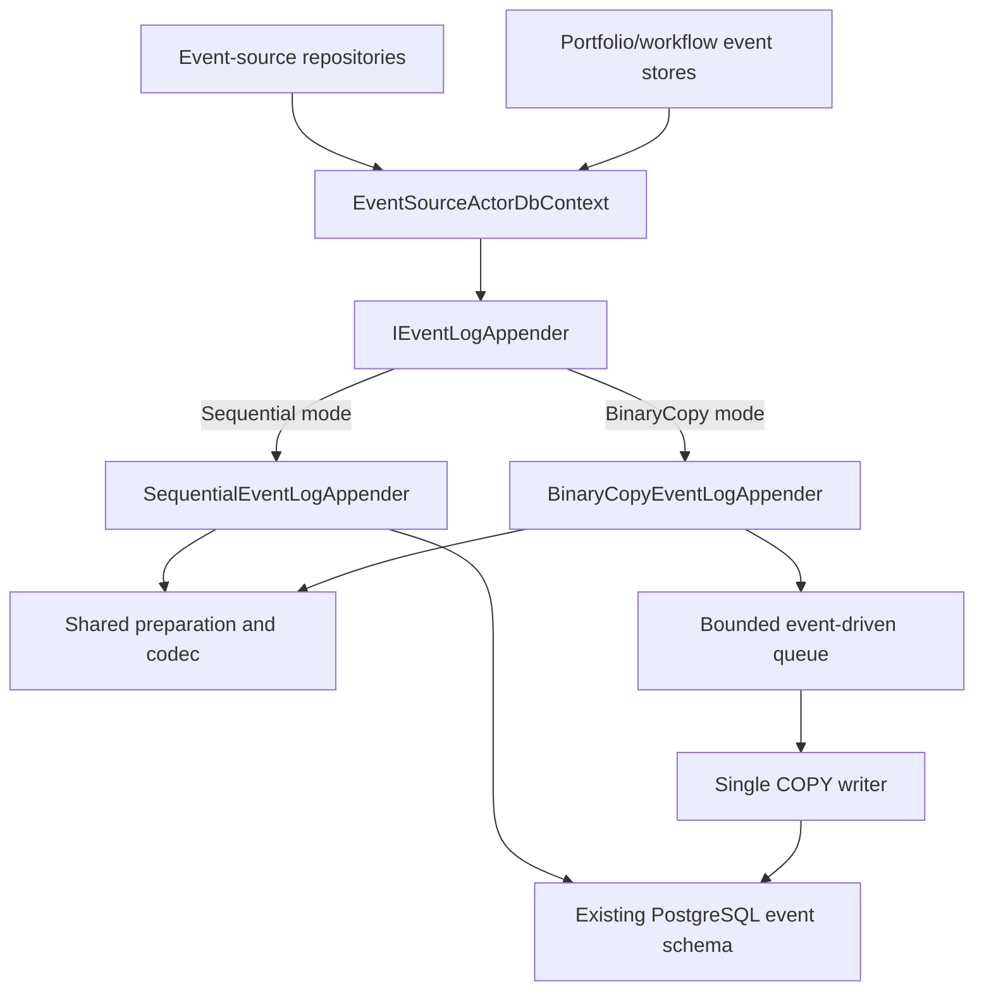

# PostgreSQL Event Log Dual Appender Implementation Plan

**Work package:** PostgreSQL event-log write-path abstraction and binary COPY optimization
**Status:** Implemented through interoperability; binary production rollout held at the performance gate
**Version:** 1.0
**Created:** 2026-09-11
**Owner:** IFM engineering
**Depends on:** `PostgreSQL-Event-Sourcing-Optimization-Design.md`

## 1. Purpose

This plan introduces one event-log append contract with two concrete PostgreSQL implementations:

1. `SequentialEventLogAppender`, which preserves the current transaction and per-event SQL path.
2. `BinaryCopyEventLogAppender`, which uses a bounded, event-driven queue and Npgsql binary COPY to persist
   micro-batches.

The implementation keeps the current MessagePack encoding and the current PostgreSQL `event_log` schema. The active
implementation is selected explicitly at application startup. Existing event-source repositories, domain actors,
projectors, replay readers, and stored events remain compatible with either implementation.

The sequential implementation remains a supported production path, behavioural reference, benchmark baseline, and
manual operational fallback. A failed or ambiguous binary COPY is never automatically retried through the sequential
implementation.

## 2. Verified current state

### 2.1 Current persistence facade

`IEventSourceActorDbContext` currently combines:

- event stream lookup and replay;
- event append operations;
- command auditing;
- projector execution state;
- projector recovery and outbox operations; and
- administrative deletion and map-reduce operations.

`BaseEventSourceActorRepository` depends on that facade and calls its `SaveEventsAsync` overloads. Portfolio and
selected workflow persistence paths also call those overloads directly. Replacing the complete database context would
therefore require two large implementations and create unnecessary divergence in read and recovery behaviour.

### 2.2 Current sequential write path

For each command, `EventSourceActorDbContext.SaveEventsAsync` currently:

1. Resolves the numeric event stream ID.
2. Resolves every event type's numeric event-name ID.
3. Begins one transaction.
4. Serializes each event with the shared MessagePack codec.
5. Executes one stream-version update and event insert per event.
6. Executes an additional statement for each required durable projection marker.
7. Commits the transaction.
8. Returns the events with their assigned bigint `EventId` values.

The transaction makes a command's event collection atomic, but the write phase still performs repeated PostgreSQL
commands and parameter binding.

### 2.3 Current durable representation

The durable event representation is:

- MessagePack with writer-selectable LZ4 block-array compression;
- `EventPayload bytea`;
- a bigint global event identity stored as `EventVersion`;
- a bigint per-stream `StreamVersion`;
- numeric `EventStreamId` and `EventNameId` registry references;
- a UUID `CommandId`; and
- the existing text `EventTimestamp` representation.

The reader is deliberately LZ4-aware and reads compressed, uncompressed, and mixed historical streams. Changing the
writer setting therefore requires no event rewrite. The schema already has a unique global `EventVersion` index and a
unique `(EventStreamId, StreamVersion)` index. The new appender must use those existing columns, sequences,
constraints, and foreign-key relationships.

### 2.4 Current serialization allocation

`EventLogMessagePackCodec.Serialize` creates an `ArrayBufferWriter<byte>` and then copies its written span into a new
`byte[]`. Both appenders will initially use this exact codec and byte representation. Pooled payload storage is a later
optimization gate and is not required to establish the dual-appender architecture.

## 3. Goals

1. Define one narrow append interface implemented by exactly two production implementations.
2. Preserve every current append caller and durable event representation.
3. Preserve the current sequential writer as a selectable implementation.
4. Add binary COPY batching without changing `event_log` or related projector schemas.
5. Keep all events produced by one command in one transaction and one terminal result.
6. Preserve optimistic stream concurrency and deterministic per-stream ordering.
7. Persist required projector markers in the same transaction as their source events.
8. Acknowledge a command only after PostgreSQL confirms commit.
9. Use bounded memory and explicit backpressure.
10. Keep the binary writer event-driven; it must not poll PostgreSQL or run an idle periodic loop.
11. Make implementation selection explicit, validated, observable, and reversible by application restart.
12. Measure database throughput, tail latency, and allocation improvements against the retained sequential writer.

## 4. Non-goals

This work does not:

- change existing event payload contracts;
- change bigint event or stream identities to UUIDs;
- add `commit_sequence`, `batch_ordinal`, or other columns to the event table;
- convert the existing text event timestamp column;
- dual-write an event through both appenders;
- automatically fall back to the sequential appender after a COPY failure;
- automatically retry failed or commit-ambiguous batches;
- change event replay or projection business logic;
- put raw market ticks into the PostgreSQL event log;
- introduce multiple event-log writer processes or distributed writer leases; or
- introduce pooled serialization buffers before profiling justifies them.

## 5. Required invariants

### DA-INV-001: One selected implementation

Exactly one `IEventLogAppender` is active for a process generation. The selection is immutable after startup.

### DA-INV-002: One durable representation

Both implementations use the same event registry, MessagePack codec, envelope version, PostgreSQL columns, and event
replay reader. An event written by either implementation is indistinguishable during replay.

### DA-INV-003: Command atomicity

All events produced by one command commit together or roll back together. A batching boundary may occur between
commands but never within a command.

### DA-INV-004: Durable acknowledgement

No event ID is reported as committed and no append call completes successfully until PostgreSQL commit succeeds.

### DA-INV-005: Stream ordering

Every committed stream contains unique, contiguous `StreamVersion` values in command order. Commands for the same
stream within one COPY batch are evaluated in queue order.

### DA-INV-006: Optimistic concurrency

An append carrying an expected stream version succeeds only when that version matches the committed version after all
earlier requests for the same stream in the batch have been considered.

### DA-INV-007: Projection-marker atomicity

An event requiring a durable projector execution marker cannot commit without its marker. Marker failure rolls back
the complete transaction and fails every command in the physical batch.

### DA-INV-008: No cross-implementation retry

A COPY error, cancellation, timeout, or ambiguous commit never invokes the sequential appender automatically. An
operator may select the sequential implementation for a later process generation after reconciling the previous
outcome.

### DA-INV-009: Bounded work

The binary writer queue, event count, serialized byte count, oldest-event delay, and shutdown drain time are bounded
and configurable. No accepted request is silently discarded.

### DA-INV-010: No schema mutation

Implementation and deployment verification must show that the schema objects, columns, types, constraints, and indexes
used by the event log are unchanged by this work.

## 6. Target architecture



`EventSourceActorDbContext` remains the stable application facade. It delegates only append operations to the selected
strategy. All read, replay, projector, outbox, audit, and administrative methods remain in their existing context.

## 7. Contracts and models

### 7.1 `IEventLogAppender`

Create a narrow storage contract in the application-storage event-source area. Its logical operation is:

```text
AppendAsync(EventLogAppendRequest request, CancellationToken cancellationToken)
    -> ValueTask<EventLogAppendResult>
```

The contract must not expose Npgsql connections, transactions, importers, queue types, pooled buffers, or concrete
implementation details.

### 7.2 `EventLogAppendRequest`

The immutable request contains:

| Field | Purpose |
| --- | --- |
| `EventStream` | Existing logical stream name. |
| `CommandId` | Existing command identity. |
| `Events` | Non-empty ordered command event collection. |
| `ExpectedStreamVersion` | Optional version; null preserves the existing legacy append semantics. |
| `RequestedAtUtc` | Monotonic-age/diagnostic anchor captured once. |

The public request treats one command as the indivisible batching unit. The binary writer may flatten prepared rows
internally, but it retains the request boundary for acknowledgements and failures.

### 7.3 `PreparedEventLogAppend`

A shared preparation component produces an internal immutable representation containing:

- resolved numeric stream ID;
- resolved numeric event-name ID per event;
- original event reference used only to set committed `EventId` metadata;
- serialized `byte[]` payload;
- command ID;
- existing timestamp text;
- expected stream version, when supplied; and
- required projector metadata, when supplied by the event.

Preparation validates empty payloads, missing identifiers, invalid required-projector stages, maximum command event
count, maximum per-event payload bytes, and maximum total request bytes before database admission.

### 7.4 `EventLogAppendResult`

The success result contains ordered assignments for every submitted event:

- bigint `EventVersion`;
- bigint `StreamVersion`;
- persisted event reference or stable event ordinal; and
- confirmed commit time captured after commit acknowledgement.

`EventSourceActorDbContext` applies the returned bigint event IDs to the submitted event objects and returns the same
`DomainEventCollection` shape used today.

### 7.5 Failure types

Define bounded failure categories shared by both implementations:

```text
Validation
OptimisticConcurrency
QueueCapacity
DatabaseConstraint
DatabaseTimeout
CancelledBeforeCommit
CommitOutcomeUnknown
WriterUnavailable
Shutdown
Unexpected
```

Exceptions retain the append implementation, command ID, stream, expected version, PostgreSQL SQL state when present,
batch diagnostic ID when present, and the innermost useful failure detail. Payload bytes are not logged.

## 8. Shared preparation services

### 8.1 Payload codec

Both implementations receive the same event-log codec dependency. The initial adapter delegates directly to
`EventLogMessagePackCodec.Shared` so the durable bytes do not change.

The codec may later be placed behind `IEventLogPayloadCodec` to improve testing and introduce pooled output, but there
must still be one selected codec for both appenders.

### 8.2 Stream registry

Extract or share the existing stream-name-to-`EventStreamId` resolution. Cache hits must not execute PostgreSQL. A
cache miss uses the current idempotent registry insert and returns the existing numeric ID.

### 8.3 Event-type registry

Extract or share the current concrete event-type-to-`EventNameId` resolution and cache. Both appenders must resolve the
same `(EventName, EventTypeName)` pair and use the same registry row.

### 8.4 Required projection preparation

Validate `IRequireDurableProjection` metadata before enqueueing. Convert it to an immutable marker specification that
can be inserted after event IDs have been assigned but before the event transaction commits.

## 9. Concrete implementation 1: sequential appender

### 9.1 Scope

Move the current `SaveEventsAsync` transaction logic from `EventSourceActorDbContext` into
`SequentialEventLogAppender` with no deliberate SQL or behavioural change.

### 9.2 Required behaviour

The sequential implementation must:

1. Prepare the append through the shared preparation service.
2. Begin the current repository transaction.
3. Execute the existing stream-version CTE and event insert for every event.
4. Use the expected-version SQL when an expected version is supplied.
5. Insert required durable projector state after each event ID is returned.
6. Commit once all command events and markers succeed.
7. Return ordered event and stream-version assignments.
8. Roll back and map failures into the shared taxonomy.

### 9.3 Behavioural freeze gate

Before implementing COPY, run the complete append contract suite against the extracted sequential appender. Database
rows, assigned IDs, exceptions, cancellation behaviour, and projection markers must match the pre-extraction path.

This gate establishes that the interface extraction is a refactor and not a storage behaviour change.

## 10. Concrete implementation 2: binary COPY appender

### 10.1 Runtime ownership

`BinaryCopyEventLogAppender` is a singleton for one process generation. It owns:

- one bounded multi-producer queue;
- one logical queue consumer;
- an Npgsql data source or dedicated writer connection lifecycle;
- batching state;
- shutdown admission state; and
- bounded metrics.

It is event-driven. The consumer waits for queue data. The maximum-age delay is created only after the first request is
available for a new batch, and it is cancelled when another flush condition wins. There is no idle polling loop and no
periodic PostgreSQL query.

### 10.2 Queue unit

One queue entry represents one complete command append. It contains the prepared append and one completion source.
The queue never contains individual events that could cause a command to be divided across batches.

Initial configurable limits:

| Setting | Initial value |
| --- | ---: |
| Queue command capacity | 8,192 |
| Maximum events per batch | 256 |
| Maximum serialized bytes per batch | 1 MiB |
| Maximum oldest-request delay | 1 millisecond |
| Maximum events per command | Explicit validated limit |
| Maximum payload bytes per event | Explicit validated limit |
| Shutdown drain timeout | Explicit bounded duration |

The final queue capacity and payload limits must be derived from measured production-size events and the allowed
memory budget rather than accepted solely from these starting values.

### 10.3 Batch construction

The consumer:

1. Waits for the first command request.
2. Starts the oldest-request delay.
3. Drains complete command entries while count and byte limits allow.
4. Stops before a command that would exceed a limit; that complete command remains for the next batch.
5. Flushes immediately when the count or byte threshold is reached.
6. Flushes the current batch when the oldest-request delay expires.
7. Flushes accepted work during graceful shutdown.

A single command larger than the normal batch-byte limit is accepted only when it remains below the explicit maximum
command size. It is written alone rather than split.

### 10.4 Existing-schema transaction algorithm

For each physical batch, the writer performs the following within one explicit PostgreSQL transaction:

1. Resolve any registry cache misses before taking stream locks where possible.
2. Sort distinct numeric stream IDs to establish deterministic lock order.
3. Read and lock affected `event_stream_id` rows using `FOR UPDATE`.
4. Build an in-memory version cursor for each affected stream.
5. Evaluate queued commands in batch order:
   - when `ExpectedStreamVersion` is present, require it to match the cursor;
   - when it is null, use the cursor to preserve the legacy append semantics;
   - assign contiguous stream versions to all events in that command; and
   - advance the cursor for subsequent commands in the same stream.
6. Update every affected stream's `CurrentVersion` to its final cursor through one set-based command.
7. Reserve the required bigint `EventVersion` values from the existing sequence in one command.
8. Assign event IDs in physical batch order.
9. Start Npgsql binary import directly into the existing `event_log` table.
10. Write the existing columns and explicit Npgsql types for every row.
11. Complete the binary importer.
12. Insert all required projector markers through a bounded set-based command or second binary import in the same
    transaction.
13. Commit the transaction.
14. Complete every command receipt successfully in queue order.

If validation, stream reservation, COPY, marker insertion, or commit fails, the writer rolls back and completes every
request in that physical batch with a failure. It does not isolate and retry apparently healthy rows because doing so
would change the batch's original ordering and failure semantics.

### 10.5 Event ID reservation

The current event table supplies `EventVersion` from `event_log_eventversion_seq`. COPY cannot return generated values
per row, while event objects and projector markers require those IDs before acknowledgement.

The binary writer therefore reserves the batch's bigint IDs from the existing sequence in one database command and
writes them explicitly through COPY. PostgreSQL sequence values are non-transactional, so a failed batch may leave a
gap. Gaps already have normal sequence semantics and do not indicate a partially committed batch.

### 10.6 COPY column mapping

The binary importer writes only existing columns:

```text
EventStreamId   -> Bigint
EventNameId     -> Integer
EventVersion    -> Bigint
StreamVersion   -> Bigint
EventPayload    -> Bytea
CommandId       -> Uuid
EventTimestamp  -> Text
```

Every write supplies an explicit `NpgsqlDbType`. No text or JSON conversion is introduced for the payload.

### 10.7 Durable projection markers

The writer uses the preassigned event IDs to insert existing `event_projector_state` rows. Marker insertion occurs
after COPY completion but before transaction commit. The implementation should prefer a bounded set-based operation
to one command per marker.

### 10.8 Connection lifecycle

The appender owns one logical writer and at most one active binary importer. It uses the configured Npgsql data source
and keeps a healthy connection available across batches when practical. A broken connection is disposed and may be
reopened for future new work only after the failed batch receives its terminal outcome.

Reopening a connection is not a retry of the failed batch.

### 10.9 Cancellation and commit boundary

Cancellation before commit initiation causes rollback when PostgreSQL can confirm rollback. Once commit has been sent,
caller cancellation cannot turn a confirmed commit into failure.

If the client loses the connection without learning whether commit succeeded, every affected request receives
`CommitOutcomeUnknown`. Reconciliation uses the reserved event IDs and command IDs. The writer must not resubmit the
batch automatically.

## 11. Facade integration

Retain all current `IEventSourceActorDbContext.SaveEventsAsync` overloads for source compatibility. Each overload:

1. Validates its existing arguments.
2. Creates one `EventLogAppendRequest`.
3. Calls the selected `IEventLogAppender`.
4. Applies confirmed bigint event IDs to the original event instances.
5. Returns a `DomainEventCollection` in the original order.

No domain repository should resolve either concrete appender. Domain and workflow code continues depending on
`IEventSourceActorDbContext` or its existing higher-level event store.

## 12. Configuration and dependency injection

### 12.1 Mode enum

Introduce a bounded enum:

```text
EventLogWriteMode.Sequential
EventLogWriteMode.BinaryCopy
```

Do not use arbitrary class names from configuration.

### 12.2 Options

`EventLogPersistenceOptions` contains:

- `WriteMode`;
- `UseLz4Compression` (a Boolean applied identically by both concrete appenders);
- queue command capacity;
- maximum events per batch;
- maximum bytes per batch;
- maximum oldest-request delay;
- maximum events per command;
- maximum event payload bytes;
- maximum command payload bytes; and
- shutdown drain timeout.

Startup validates positive bounds, safe maximums, and internal relationships. Invalid options fail startup with a
specific configuration error before accepting actor commands.

### 12.3 Registration

Register shared preparation, registries, and codec once. Register both concrete types so tests and benchmarks can
resolve them explicitly. Bind `IEventLogAppender` to exactly one concrete implementation based on the validated mode.

Only the selected binary implementation starts its queue consumer and owns writer lifecycle. Selecting sequential mode
must not start an unused COPY worker.

### 12.4 Operational switch

Changing `WriteMode` requires an application restart. Startup logs one structured information record with the selected
mode and bounded configuration. It must not log credentials or payloads.

## 13. Lifecycle and shutdown

### 13.1 Sequential mode

Sequential mode has no background lifecycle. Each caller owns its operation through completion.

### 13.2 Binary COPY mode

On startup:

1. Validate configuration.
2. Validate access to the required existing table and sequence.
3. Start the event-driven queue consumer.
4. Open admission only after initialization succeeds.

On graceful shutdown:

1. Close admission.
2. Drain already accepted complete command requests.
3. Flush the final partial batch.
4. Wait only up to the configured drain timeout.
5. Fail uncommitted requests explicitly if draining cannot complete.
6. Dispose the connection and queue resources.

Shutdown must never leave an accepted completion unresolved.

## 14. Observability

Expose equivalent metrics for both implementations, tagged by selected mode:

- append requests and events;
- successful, failed, cancelled, and commit-unknown commands;
- serialization duration and allocated bytes;
- payload bytes;
- transaction duration;
- commit duration;
- end-to-end acknowledgement duration;
- optimistic-concurrency failures; and
- required projection marker count.

Binary mode additionally exposes:

- current and maximum queue depth;
- current queued bytes;
- backpressure wait duration;
- batch command, event, and byte counts;
- batch assembly duration;
- stream reservation duration;
- event-ID reservation duration;
- COPY duration;
- marker insertion duration;
- flush trigger (`Count`, `Bytes`, `Age`, `Barrier`, or `Shutdown`); and
- failed physical batch size.

Successful appends should not emit one information log per event. Emit bounded batch summaries at debug/trace level,
aggregate metrics, mode lifecycle events, and complete failure evidence without payload bodies.

The writer can publish its bounded operational snapshot through the existing Supervisor runtime observability surface
later. Event persistence must not depend on Supervisor availability, and metrics recording must never fail an append.

## 15. Unit-test plan

### 15.1 Shared contract tests

Run the same abstract test suite against both implementations:

1. Reject empty stream names.
2. Reject empty command IDs where the current contract requires them.
3. Reject empty event collections.
4. Preserve event order.
5. Use the shared codec exactly once per event.
6. Return one assignment per event.
7. Preserve the existing event timestamp representation.
8. Validate required projector metadata.
9. Map concurrency and storage failures consistently.
10. Never expose payload bytes in exception text.

### 15.2 Sequential implementation tests

1. Preserve the existing non-versioned SQL path.
2. Preserve the expected-version SQL path.
3. Commit once for a successful command.
4. Roll back after any event insert failure.
5. Roll back after required marker failure.
6. Assign returned bigint IDs in event order.

### 15.3 Binary batching tests

1. Flush at maximum event count.
2. Flush before exceeding maximum byte count.
3. Flush after oldest-request delay.
4. Do not create an idle flush timer.
5. Never split a command across batches.
6. Write an allowed oversized command alone.
7. Reject a command exceeding its hard limit.
8. Apply bounded backpressure at queue capacity.
9. Preserve FIFO order for commands sharing a stream.
10. Allow unrelated streams in the same physical batch.
11. Complete all receipts only after the commit completion signal.
12. Fail every batch receipt when COPY fails.
13. Fail every batch receipt when marker insertion fails.
14. Classify an unacknowledged commit as unknown.
15. Drain accepted requests during graceful shutdown.
16. Resolve every accepted receipt when shutdown times out.

### 15.4 Version-planning tests

1. One command with one event.
2. One command with several events.
3. Several commands for one stream in one batch.
4. Several interleaved streams.
5. Explicit expected-version match.
6. Explicit expected-version mismatch.
7. Later same-stream request evaluated after an earlier batch request.
8. Legacy null expected version uses the locked committed cursor.
9. Deterministic stream lock ordering.
10. Sequence gaps after rollback do not appear as committed events.

## 16. PostgreSQL integration-test plan

Run every integration case against a dedicated PostgreSQL test database and against both append modes where applicable:

1. Write and replay a single event.
2. Write and replay a multi-event command.
3. Append to an existing stream created by the other implementation.
4. Alternate implementations across application restarts and replay the complete stream.
5. Verify contiguous per-stream versions.
6. Verify unique global event versions.
7. Verify an expected-version conflict commits no event.
8. Verify one invalid row rolls back the complete COPY batch.
9. Verify a marker constraint failure rolls back its source events and all other rows in the batch.
10. Verify event rows and required projector markers commit atomically.
11. Verify command IDs and timestamp text are unchanged.
12. Verify large workflow snapshot payloads round-trip byte-semantically.
13. Verify malformed or unknown payload handling remains a reader concern and is unchanged.
14. Verify cancellation before commit leaves no rows.
15. Simulate connection loss before COPY completion.
16. Simulate connection loss during or after commit request and verify unknown-outcome handling.
17. Verify graceful shutdown flushes a partial batch.
18. Verify forced shutdown completes outstanding callers with explicit failure.
19. Verify two simultaneous expected-version requests allow exactly one valid winner when appropriate.
20. Verify registry cache misses do not deadlock stream reservation.

## 17. Schema-preservation verification

Before and after each integration run, capture the definitions of:

- `event_log` columns and types;
- `event_log` constraints and indexes;
- `event_stream_id` columns and constraints;
- `event_name_id` columns and constraints;
- `event_projector_state` columns and foreign keys; and
- `event_log_eventversion_seq` properties.

Normalize and compare the snapshots. The test fails if this implementation creates, alters, or drops any schema object.

Also verify that no migration or startup schema step is added for this work.

## 18. Benchmark plan

### 18.1 Baselines

Preserve the extracted sequential appender as the BenchmarkDotNet baseline. Add `NpgsqlBatch` as an optional comparison
case, but it is not one of the two production implementations.

### 18.2 Workloads

Measure:

- 1, 64, 256, 1,024, and 4,096 events per offered workload;
- single-event commands and realistic multi-event commands;
- 1, 8, 32, and 128 concurrent producers;
- one hot stream, many independent streams, and mixed contention;
- representative small signal events;
- medium business events; and
- the frozen large workflow snapshot corpus.

### 18.3 Measurements

Capture:

- committed events per second;
- committed commands per second;
- mean, p50, p95, p99, and maximum command acknowledgement latency;
- low-volume single-event latency;
- allocated bytes per event and command;
- Gen0, Gen1, and Gen2 collections;
- queue depth and backpressure duration;
- PostgreSQL command count;
- transactions and commits;
- COPY duration;
- WAL bytes; and
- PostgreSQL CPU and I/O utilization.

Use `synchronous_commit=on`, the production MessagePack codec, and comparable database durability for both paths.
Run every read and write workload with `UseLz4Compression=false` and `UseLz4Compression=true`. Production keeps LZ4
enabled regardless of the selected writer.

### 18.4 Acceptance criteria

1. Binary COPY demonstrates a statistically repeatable throughput improvement under concurrent multi-command load.
2. Binary COPY materially reduces PostgreSQL commands per committed event.
3. Binary mode does not exceed the configured oldest-request delay before database work under low load.
4. Low-volume p99 acknowledgement latency remains within the explicitly accepted latency budget.
5. Allocations and GC collections do not regress materially; any regression requires a documented cause and decision.
6. Sequential performance after interface extraction remains within normal benchmark variance of its frozen baseline.
7. Both modes produce identical replay-visible state for the same ordered command corpus.

No universal speedup percentage is an acceptance requirement until the event-log database benchmark establishes a
credible baseline on the target PostgreSQL host.

## 19. Implementation phases and gates

### Gate 0: Baseline and inventory

- Freeze current event-log serialization results.
- Add an end-to-end sequential event-log PostgreSQL benchmark.
- Inventory every direct `SaveEventsAsync` caller.
- Capture current schema fingerprints.
- Record existing sequential failure and cancellation behaviour.

**Exit:** Reproducible performance, caller, schema, and behavioural baselines exist.

### Gate 1: Shared interface and sequential extraction

- Add request, result, option, mode, and failure models.
- Add `IEventLogAppender`.
- Add the shared preparation/registry service.
- Move existing append logic into `SequentialEventLogAppender`.
- Delegate current context save overloads to the interface.
- Select sequential mode by default.
- Run existing tests and the shared contract suite.

**Exit:** Sequential mode is behaviourally equivalent and no schema changed.

### Gate 2: Binary queue and lifecycle

- Add `BinaryCopyEventLogAppender` with a bounded command queue.
- Add event-driven batch assembly.
- Add admission closure and bounded shutdown drain.
- Add completion and failure guarantees.
- Add queue and lifecycle unit tests.

**Exit:** Queue operation is bounded, idle operation does not poll, and every accepted request has one terminal result.

### Gate 3: Existing-schema COPY transaction

- Add deterministic stream locking and version planning.
- Add set-based `CurrentVersion` reservation.
- Add bulk sequence reservation.
- Add explicit-type binary COPY to current columns.
- Add atomic required-marker persistence.
- Add commit, rollback, cancellation, and unknown-outcome handling.

**Exit:** PostgreSQL integration tests prove ordering, concurrency, atomicity, and schema preservation.

### Gate 4: Interoperability and failure verification

- Run both implementations through the shared contract suite.
- Run cross-mode restart and replay tests.
- Exercise constraint, connection, commit ambiguity, saturation, and shutdown failures.
- Verify no automatic retry or cross-mode fallback occurs.

**Exit:** Both modes are durably interchangeable between process generations.

### Gate 5: Performance and allocation verification

- Run the full BenchmarkDotNet matrix.
- Record PostgreSQL and GC evidence.
- Tune count, byte, age, and queue thresholds.
- Retain raw artifacts and an interpreted results document.

**Exit:** Binary mode meets the accepted throughput and latency budgets with production durability enabled.

### Gate 6: Controlled rollout

- Deploy with sequential mode still selected.
- Run an opt-in binary-mode integration environment.
- Run a bounded development/live canary with queue and commit monitoring.
- Reconcile event counts, stream versions, projector markers, and failures.
- Change the default only after explicit acceptance of benchmark and canary evidence.

**Exit:** Binary mode is approved for normal event-log writes; sequential mode remains a supported restart-time fallback.

### Gate 7: Optional allocation work

- Profile the accepted binary implementation.
- Introduce pooled payload buffers only if serialization allocation remains material.
- Retain payload ownership until commit or terminal failure.
- Consider pooled completion sources only after measuring completion allocation.

**Exit:** Any added pooling has lifetime, corruption, cancellation, and shutdown tests and shows a measured benefit.

## 19.1 Current gate disposition (2026-09-11)

- Gates 1-4 are implemented for the retained sequential writer and the new bounded binary COPY writer. The existing
  schema is used without a migration, cross-mode and cross-compression replay passes, and required projection markers
  remain atomic with their source events.
- Gate 5 has a reproducible local PostgreSQL BenchmarkDotNet matrix, including both compression settings. LZ4 materially
  reduces managed allocation, but binary COPY does not yet beat the sequential writer for the representative workload
  of 64 concurrent single-event actor commands.
- Gate 6 is therefore intentionally held. Production remains `Sequential` with `UseLz4Compression=true`; binary COPY
  remains an explicit restart-time integration/canary option until its low-volume and concurrent-command latency is
  tuned and accepted.
- Raw and interpreted results are recorded in
  `PostgreSQL-Event-Log-Dual-Appender-Benchmark-Results-v1.0.md` and under the corresponding
  `BenchmarkDotNet.Artifacts/event-log-*` directories.

## 20. Expected file impact

Exact filenames may follow repository naming conventions discovered during implementation, but ownership should remain:

### Application storage contracts and models

```text
TomasAI.IFM.Application.Storage/EventSourceDb/Persistence/
    IEventLogAppender.cs
    EventLogAppendRequest.cs
    EventLogAppendResult.cs
    EventLogAppendFailureCategory.cs
    EventLogWriteMode.cs
    EventLogPersistenceOptions.cs
```

### Shared preparation

```text
TomasAI.IFM.Application.Storage/EventSourceDb/Persistence/
    EventLogAppendPreparationService.cs
    PreparedEventLogAppend.cs
    PreparedEventLogRow.cs
    PreparedProjectionMarker.cs
```

### Implementations

```text
TomasAI.IFM.Application.Storage/EventSourceDb/Persistence/Sequential/
    SequentialEventLogAppender.cs

TomasAI.IFM.Application.Storage/EventSourceDb/Persistence/BinaryCopy/
    BinaryCopyEventLogAppender.cs
    BinaryCopyBatchBuilder.cs
    BinaryCopyBatchTransaction.cs
    BinaryCopyPendingRequest.cs
    BinaryCopyWriterMetrics.cs
```

### Existing integration points

```text
TomasAI.IFM.Application.Storage/IEventSourceActorDbContext.cs
TomasAI.IFM.Application.Storage/EventSourceDb/EventSourceActorDbContext.cs
TomasAI.IFM.Application.Api.Server/Startup.cs
TomasAI.IFM.Application.Actor.IntegrationTests/Startup.cs
application configuration files
```

### Tests and benchmarks

```text
TomasAI.IFM.Application.Storage.UnitTests/EventSourceDb/Persistence/
TomasAI.IFM.Application.Storage.IntegrationTests/EventSourceDb/Persistence/
TomasAI.IFM.Framework.Storage.Benchmarks/EventLogPersistence/
```

No schema source file should change unless a test-only schema fingerprint helper is added outside production schema
definitions.

## 21. Deployment and rollback

### Deployment

1. Ship both implementations with `Sequential` selected.
2. Confirm extracted sequential behaviour in the deployed environment.
3. Enable `BinaryCopy` in a controlled process generation.
4. Monitor queue depth, batch size, acknowledgement latency, failures, unknown commits, event counts, and projector lag.
5. Retain the configuration and evidence for that generation.

### Rollback

1. Stop binary-mode admission through normal application shutdown.
2. Drain accepted writes or receive explicit terminal failures.
3. Reconcile every `CommitOutcomeUnknown` batch by event and command IDs.
4. Change configuration to `Sequential`.
5. Start a new application generation.
6. Verify replay and the next expected stream version before normal traffic resumes.

Rollback never replays an unresolved batch blindly and never changes the database schema.

## 22. Completion definition

The work package is complete only when:

1. One focused `IEventLogAppender` has exactly two production implementations.
2. The current sequential behaviour remains selectable and passes its frozen baseline.
3. The binary COPY writer is bounded, event-driven, and has deterministic lifecycle behaviour.
4. Both implementations use identical MessagePack bytes and existing database columns.
5. Both pass the same unit and PostgreSQL integration contract suite.
6. Cross-mode restart and replay tests pass.
7. Required projector state remains atomic with event persistence.
8. Optimistic concurrency and per-stream ordering remain correct.
9. Failed and ambiguous batches are never automatically retried or redirected.
10. Schema fingerprint verification proves no production schema changes.
11. BenchmarkDotNet evidence includes throughput, latency, allocation, GC, PostgreSQL command, and WAL results.
12. Binary mode meets accepted performance budgets with `synchronous_commit=on`.
13. Sequential mode remains an operational restart-time fallback.
14. Implementation selection and relevant health metrics are visible in operational diagnostics.

## 23. Final implementation decision

Implement event-log writing as a strategy beneath the existing event-source database facade. Preserve
`SequentialEventLogAppender` as the current reference path and add `BinaryCopyEventLogAppender` as the optimized path.
Select exactly one implementation at startup through validated configuration. Both implementations use the same
MessagePack preparation and write the same current PostgreSQL schema. Binary mode batches complete commands through an
event-driven bounded queue, reserves existing stream and event versions transactionally, writes event rows with binary
COPY, persists required projector markers, commits, and only then acknowledges callers.
