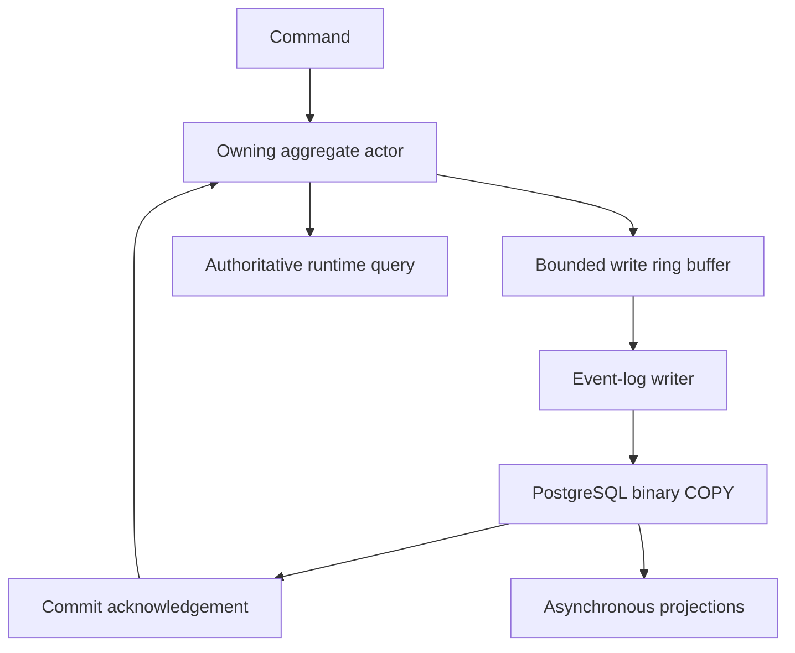
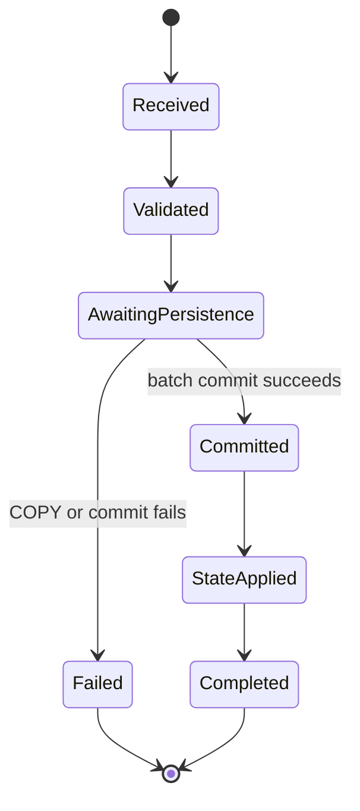

# PostgreSQL Event Sourcing Optimization Design

**Status:** Proposed V1 design
**Target platform:** .NET 10, C#, Npgsql, PostgreSQL, MessagePack
**Primary objective:** Maximize durable event-log write throughput while preserving deterministic actor processing, per-stream ordering, optimistic concurrency, read-your-write consistency, and explicit failure semantics.

## 1. Purpose

This document defines the high-throughput PostgreSQL persistence design for the trading system's event-sourced actors. It combines:

- MessagePack binary event payloads.
- PostgreSQL `bytea` payload storage.
- Npgsql binary `COPY FROM STDIN` ingestion.
- A bounded ring-buffer-based persistence writer.
- Micro-batched durable commits.
- Per-event persistence acknowledgements.
- Actor-owned committed runtime state.
- Causal consistency for asynchronous projections.

The design applies to business and workflow events. Raw market ticks remain outside this event log and continue through the dedicated ScyllaDB tick-persistence path.

## 2. Design goals

### 2.1 Functional goals

1. Append immutable events durably to PostgreSQL.
2. Preserve ordering within each event stream.
3. Reject duplicate event identities and stream versions.
4. Allow a command to read the state produced by its newly persisted events without rereading PostgreSQL.
5. Provide deterministic success or failure for every persistence request.
6. Support event schema evolution through explicit type and schema versions.
7. Recover actor state by replaying committed events.

### 2.2 Performance goals

1. Avoid one PostgreSQL command and round trip per event.
2. Amortize network, protocol, transaction, WAL flush, and commit costs across micro-batches.
3. Avoid JSON and text conversion on the write path.
4. Bound persistence latency even during low event volume.
5. Apply backpressure rather than permit unbounded memory growth.
6. Minimize allocations through pooled, lifetime-controlled serialization buffers where benchmarks justify them.

### 2.3 Safety goals

1. Never acknowledge an event before PostgreSQL commits it.
2. Never apply an event to committed actor state before durable acknowledgement.
3. Never automatically retry a failed batch without an explicit policy decision.
4. Keep PostgreSQL WAL durability enabled in production.
5. Treat a COPY batch as one atomic persistence unit.

## 3. Non-goals

- Persisting raw market ticks in PostgreSQL.
- Using PostgreSQL as the live state cache for active actors.
- Providing distributed, linearizable reads from every arbitrary read model.
- Speculatively applying uncommitted events in V1.
- Weakening production durability with unlogged tables or unsafe WAL settings.
- Storing all event metadata inside an opaque MessagePack payload.

## 4. Core architectural decision

PostgreSQL binary COPY is the primary bulk-ingestion mechanism. MessagePack serializes only the domain payload. Searchable and correctness-critical envelope values remain typed PostgreSQL columns.

Binary COPY does not bypass PostgreSQL durability, constraints, indexes, transactions, or WAL. It bypasses repeated per-row SQL command execution and parameter handling by streaming typed rows through the PostgreSQL COPY protocol.

The consistency contract is:

> A command succeeds only after all events produced by that command have committed to PostgreSQL and have been applied to the owning actor's committed in-memory state.

Consequently, the owning actor supplies immediate read-your-write state without a PostgreSQL reread.

## 5. System context



The actor validates commands and creates events. The writer owns batching and database I/O. After commit, the writer returns an acknowledgement to the originating actor. The actor then applies the event and completes the command.

## 6. Event envelope

Each event uses a stable envelope independent of its domain payload.

```csharp
public sealed record EventEnvelope<TEvent>(
    Guid EventId,
    Guid CommandId,
    Guid StreamId,
    long ExpectedStreamVersion,
    long StreamVersion,
    int EventTypeId,
    short SchemaVersion,
    DateTimeOffset OccurredAtUtc,
    Guid? CorrelationId,
    Guid? CausationId,
    Guid? WorkflowId,
    TEvent Event);
```

### 6.1 Envelope responsibilities

| Field | Responsibility |
| --- | --- |
| `event_id` | Globally unique event identity and idempotency key. |
| `command_id` | Associates one or more events with the initiating command. |
| `stream_id` | Identifies the aggregate or event stream. |
| `expected_stream_version` | Version the command validated against. Used before append or by writer-side validation. |
| `stream_version` | New immutable version assigned to this event. |
| `event_type_id` | Stable numeric type discriminator. |
| `schema_version` | Version of the serialized event contract. |
| `occurred_at_utc` | Domain occurrence time. |
| `correlation_id` | Groups related work across boundaries. |
| `causation_id` | Identifies the command or event that directly caused this event. |
| `workflow_id` | Connects the event to the strategy or position workflow. |
| `payload` | MessagePack-serialized domain data. |

The system should not use a CLR assembly-qualified type name as the durable event discriminator. `event_type_id` must remain stable through namespace, class, and assembly changes.

## 7. PostgreSQL schema

```sql
CREATE SEQUENCE event_commit_sequence_seq AS bigint;

CREATE TABLE event_log
(
    global_position   bigint GENERATED ALWAYS AS IDENTITY,
    commit_sequence   bigint      NOT NULL,
    batch_ordinal     integer     NOT NULL,
    event_id          uuid        NOT NULL,
    command_id        uuid        NOT NULL,
    stream_id         uuid        NOT NULL,
    stream_version    bigint      NOT NULL,
    event_type_id     integer     NOT NULL,
    schema_version    smallint    NOT NULL,
    occurred_at_utc   timestamptz NOT NULL,
    persisted_at_utc  timestamptz NOT NULL,
    correlation_id    uuid        NULL,
    causation_id      uuid        NULL,
    workflow_id       uuid        NULL,
    payload            bytea       NOT NULL,

    CONSTRAINT pk_event_log
        PRIMARY KEY (global_position),

    CONSTRAINT uq_event_log_event_id
        UNIQUE (event_id),

    CONSTRAINT uq_event_log_stream_version
        UNIQUE (stream_id, stream_version),

    CONSTRAINT uq_event_log_commit_order
        UNIQUE (commit_sequence, batch_ordinal)
);

CREATE INDEX ix_event_log_stream
    ON event_log (stream_id, stream_version);

CREATE INDEX ix_event_log_workflow
    ON event_log (workflow_id, global_position)
    WHERE workflow_id IS NOT NULL;
```

Only indexes justified by active access paths should be retained. Every additional index increases WAL generation and append cost. Foreign keys and triggers should be avoided on the hot event table unless a demonstrated correctness requirement outweighs their write cost.

### 7.1 Ordering fields

- `stream_version` defines order inside one aggregate stream.
- `global_position` provides database order for replay and projection consumption.
- `commit_sequence` identifies a committed writer batch.
- `batch_ordinal` preserves deterministic order inside that batch.

V1 may use a single writer-owned `commit_sequence`. If multiple independent writers or shards are later introduced, a global ordering policy must be defined before treating this value as globally monotonic.

## 8. MessagePack serialization policy

MessagePack payload types must use explicit numeric keys.

```csharp
[MessagePackObject]
public sealed record OrderSubmittedEvent
{
    [Key(0)]
    public required Guid OrderId { get; init; }

    [Key(1)]
    public required string Instrument { get; init; }

    [Key(2)]
    public required decimal Quantity { get; init; }

    [Key(3)]
    public required decimal LimitPrice { get; init; }
}
```

### 8.1 Compatibility rules

1. Never change the meaning of an assigned key.
2. Never reuse a retired key.
3. Add fields with new keys.
4. Preserve compatibility with missing fields when practical.
5. Increment `schema_version` for incompatible semantic changes.
6. Register an explicit upcaster when old serialized events must appear as a newer in-memory model.
7. Do not use typeless or contractless serialization for the permanent event store.
8. Keep envelope metadata outside the payload.

Compression should be disabled initially. Small event compression frequently costs more CPU and latency than it saves in I/O. Enable it only after representative benchmarks.

## 9. Ring-buffer write path

### 9.1 Pending write representation

```csharp
public sealed class PendingEventWrite
{
    public required Guid EventId { get; init; }
    public required Guid CommandId { get; init; }
    public required Guid StreamId { get; init; }
    public required long ExpectedStreamVersion { get; init; }
    public required long StreamVersion { get; init; }
    public required int EventTypeId { get; init; }
    public required short SchemaVersion { get; init; }
    public required DateTimeOffset OccurredAtUtc { get; init; }
    public Guid? CorrelationId { get; init; }
    public Guid? CausationId { get; init; }
    public Guid? WorkflowId { get; init; }
    public required ReadOnlyMemory<byte> Payload { get; init; }
    public required TaskCompletionSource<PersistResult> Completion { get; init; }
}

public readonly record struct PersistResult(
    Guid EventId,
    Guid StreamId,
    long StreamVersion,
    long CommitSequence,
    int BatchOrdinal,
    DateTimeOffset PersistedAtUtc);
```

An allocation-reduced `IValueTaskSource<T>` implementation may replace `TaskCompletionSource<T>` after correctness is established and profiling shows completion allocation is material. The simpler implementation is preferred for V1.

### 9.2 Ring-buffer invariants

1. The ring buffer is bounded.
2. Producers never overwrite unconsumed entries.
3. Each published entry has exactly one terminal result: committed or failed.
4. Payload memory remains valid until that terminal result.
5. A producer cannot return pooled memory immediately after publication.
6. Shutdown stops acceptance, drains accepted entries if possible, and explicitly fails any entry that cannot be committed.
7. Ring-buffer sequence publication uses the required memory barriers; partially initialized entries are never visible to the consumer.

### 9.3 Payload lifetime

When pooled memory is used, its lifecycle is:

```text
Rent buffer
  -> serialize MessagePack
  -> publish entry
  -> writer consumes payload
  -> PostgreSQL commits or fails
  -> complete acknowledgement
  -> return buffer
```

Returning the buffer before the database operation finishes can corrupt the persisted payload.

## 10. Micro-batching policy

The writer drains available events into a batch and flushes when any threshold is met:

- Maximum event count.
- Maximum serialized byte count.
- Maximum age of the oldest event.
- Explicit durability barrier.
- Graceful shutdown.

Recommended initial values:

| Setting | Initial value |
| --- | ---: |
| Maximum events | 256 |
| Maximum bytes | 1 MiB |
| Maximum oldest-event delay | 1 millisecond |
| Minimum useful batch | 1 event when latency timer expires |

These are starting values, not permanent constants. Benchmarks should test 64, 256, 1,024, and 4,096 event batches with realistic payload sizes and production durability settings.

## 11. Binary COPY implementation

The writer uses one dedicated Npgsql connection while a COPY operation is active.

```csharp
private const string CopySql = """
    COPY event_log
    (
        commit_sequence,
        batch_ordinal,
        event_id,
        command_id,
        stream_id,
        stream_version,
        event_type_id,
        schema_version,
        occurred_at_utc,
        persisted_at_utc,
        correlation_id,
        causation_id,
        workflow_id,
        payload
    )
    FROM STDIN (FORMAT BINARY)
    """;
```

The simplified persistence operation is:

```csharp
public async Task PersistBatchAsync(
    IReadOnlyList<PendingEventWrite> batch,
    long commitSequence,
    CancellationToken cancellationToken)
{
    await using var connection =
        await _dataSource.OpenConnectionAsync(cancellationToken);

    DateTimeOffset persistedAtUtc = _clock.GetUtcNow();

    try
    {
        await using var importer =
            await connection.BeginBinaryImportAsync(CopySql, cancellationToken);

        for (int ordinal = 0; ordinal < batch.Count; ordinal++)
        {
            PendingEventWrite item = batch[ordinal];

            await importer.StartRowAsync(cancellationToken);
            await importer.WriteAsync(commitSequence, NpgsqlDbType.Bigint, cancellationToken);
            await importer.WriteAsync(ordinal, NpgsqlDbType.Integer, cancellationToken);
            await importer.WriteAsync(item.EventId, NpgsqlDbType.Uuid, cancellationToken);
            await importer.WriteAsync(item.CommandId, NpgsqlDbType.Uuid, cancellationToken);
            await importer.WriteAsync(item.StreamId, NpgsqlDbType.Uuid, cancellationToken);
            await importer.WriteAsync(item.StreamVersion, NpgsqlDbType.Bigint, cancellationToken);
            await importer.WriteAsync(item.EventTypeId, NpgsqlDbType.Integer, cancellationToken);
            await importer.WriteAsync(item.SchemaVersion, NpgsqlDbType.Smallint, cancellationToken);
            await importer.WriteAsync(item.OccurredAtUtc, NpgsqlDbType.TimestampTz, cancellationToken);
            await importer.WriteAsync(persistedAtUtc, NpgsqlDbType.TimestampTz, cancellationToken);
            await WriteNullableUuidAsync(importer, item.CorrelationId, cancellationToken);
            await WriteNullableUuidAsync(importer, item.CausationId, cancellationToken);
            await WriteNullableUuidAsync(importer, item.WorkflowId, cancellationToken);
            await importer.WriteAsync(item.Payload, NpgsqlDbType.Bytea, cancellationToken);
        }

        await importer.CompleteAsync(cancellationToken);

        for (int ordinal = 0; ordinal < batch.Count; ordinal++)
        {
            PendingEventWrite item = batch[ordinal];
            item.Completion.TrySetResult(new PersistResult(
                item.EventId,
                item.StreamId,
                item.StreamVersion,
                commitSequence,
                ordinal,
                persistedAtUtc));
        }
    }
    catch (Exception exception)
    {
        foreach (PendingEventWrite item in batch)
            item.Completion.TrySetException(exception);

        throw;
    }
}
```

If an explicit Npgsql transaction surrounds COPY, acknowledgements occur only after `CommitAsync()` succeeds. If COPY itself is the complete transaction, `CompleteAsync()` must finish successfully before acknowledgements. Disposing an importer without completing it cancels the import.

All writes should provide an explicit `NpgsqlDbType`; binary COPY is type-specific.

## 12. Command and actor consistency model

A command does not persist new state directly. It is validated against actor state and produces one or more events. Those events become state only after durable persistence.

### 12.1 Command lifecycle



### 12.2 Actor processing rules

1. Validate the command against the current committed state.
2. Create immutable events and assign their stream versions.
3. Publish the events to the persistence ring buffer.
4. Enter `AwaitingPersistence` for that entity.
5. Do not apply the event to committed state yet.
6. Receive `PersistEventCompleted` or `PersistEventFailed`.
7. On success, apply events in stream-version order and complete the command.
8. On failure, keep the previous committed state and fail the command/workflow.

The actor should not block its physical thread waiting on a task. Persistence completion should be converted into an actor message or continuation scheduled through the actor runtime.

### 12.3 Subsequent commands

The recommended V1 policy is to queue subsequent commands for the same entity while persistence is outstanding. Once the acknowledgement is applied, the next command observes the new committed state.

Selected command classes, such as `StartStrategyWorkflowCommand`, may instead be rejected with `EntityWriteInProgress` when the domain explicitly permits only one inflight operation.

Speculative application of events is excluded from V1 because persistence failure would require rollback of state and every dependent command.

## 13. Multi-event commands

When one command emits several events, those events must be adjacent and ordered within the same COPY transaction whenever atomic command semantics are required.

The command completes only after every event commits. The actor then applies them in ascending stream-version order.

If commands for several streams require cross-stream atomicity, their events may share one batch transaction. This increases the blast radius of a constraint failure and should be reserved for genuine domain invariants.

## 14. Read-your-write behavior

### 14.1 Querying the owning actor

After command completion, a state query routed to the owning actor is immediately consistent because command completion guarantees:

1. PostgreSQL committed the event.
2. The actor applied the committed event.
3. The actor's committed version is at least the version returned in the command receipt.

No PostgreSQL reread is performed.

### 14.2 Command receipt

```csharp
public readonly record struct CommandReceipt(
    Guid CommandId,
    Guid StreamId,
    long StreamVersion,
    long CommitSequence,
    int LastBatchOrdinal,
    DateTimeOffset PersistedAtUtc);
```

The receipt is a causal token. It proves the minimum committed stream version and projection position required by a follow-up read.

### 14.3 Querying an asynchronous projection

A projection can legitimately lag behind the command. Its checkpoint contains the latest applied `(commit_sequence, batch_ordinal)` or `global_position`.

For a causally constrained query, the projection handler compares its checkpoint with the command receipt. If it is behind, it may:

1. Wait for a tightly bounded interval.
2. Return `ProjectionNotCaughtUp` with the current checkpoint.
3. Route an authoritative query to the owning actor.
4. Return actor state with `projectionPending = true` when the API supports that response.

It must not silently return stale data while claiming read-your-write consistency.

### 14.4 Operational UI

The recommended UI flow is:

1. Send command.
2. Receive committed command receipt.
3. Mark the command as persisted.
4. Allow normal domain events to update screen projections asynchronously.
5. Query the owning actor only when an immediate authoritative state is required.

## 15. Optimistic concurrency

The unique constraint on `(stream_id, stream_version)` is the final database guard against conflicting appends. A duplicate `event_id` is treated as an idempotency conflict.

Binary COPY has an important consequence: one conflicting row causes the entire COPY transaction to fail. Therefore:

- Prefer one logical writer for V1.
- Serialize commands per owning actor/entity.
- Assign stream versions only from the actor's committed version.
- Classify unique violations explicitly.
- Do not blindly retry a failed batch.
- Keep the complete original failure context for diagnostics.

If multi-process writers later require strict compare-and-append semantics, use one of these designs:

1. A stream-ownership/lease layer that guarantees one active writer per stream.
2. A staging-table COPY followed by a transactional validation and `INSERT ... SELECT`.
3. A prepared statement or stored function for contended streams while retaining COPY for uncontended bulk traffic.

The staging approach adds work and should not be introduced until distributed contention requires it.

## 16. Batch failure semantics

COPY and its transaction are atomic from the application perspective:

```text
COPY succeeds and transaction commits
    -> acknowledge every entry

COPY fails or transaction commit fails
    -> fail every entry
```

No actor applies any event from a failed batch.

Recommended failure message:

```csharp
public sealed record PersistEventFailed(
    Guid EventId,
    Guid CommandId,
    Guid StreamId,
    long ExpectedStreamVersion,
    long AttemptedStreamVersion,
    long BatchSequence,
    string FailureCategory,
    string? PostgreSqlState,
    string DiagnosticId);
```

Failure categories should distinguish:

- Duplicate event identity.
- Stream-version conflict.
- Constraint or serialization error.
- Connection failure before commit outcome.
- Ambiguous commit outcome.
- Timeout or cancellation.
- Serialization failure before publication.
- Writer shutdown or unavailable state.

An ambiguous commit outcome must not be treated as a safe retry. Reconciliation should look up the immutable `event_id` before an operator or explicit recovery policy decides the next action.

## 17. Backpressure and overload

The event writer must never use an unbounded queue.

When the ring buffer is full, choose an explicit policy by producer class:

| Producer | Policy |
| --- | --- |
| Trading command actor | Await bounded capacity or fail the command; never drop. |
| Workflow actor | Await bounded capacity, then fail workflow on timeout. |
| Critical risk event | Reserve capacity or use a dedicated priority lane; never drop. |
| Noncritical telemetry | Use the OTEL pipeline and its independent drop/sampling policy. |

Business events and telemetry must not compete in the same persistence ring buffer.

## 18. Writer lifecycle and recovery

### 18.1 Startup

1. Establish database connectivity.
2. Validate schema and supported event registrations.
3. Initialize the writer sequence/checkpoint policy.
4. Start the consumer.
5. Advertise readiness only after persistence is available.

### 18.2 Graceful shutdown

1. Stop accepting new writes.
2. Drain already accepted ring-buffer entries.
3. Flush the final batch.
4. Deliver terminal completion for every accepted request.
5. Close the Npgsql connection.
6. Mark the service stopped.

### 18.3 Actor recovery

On actor activation or restart:

1. Load the latest valid snapshot when snapshots are implemented.
2. Replay subsequent events in ascending `stream_version`.
3. Validate that versions are contiguous.
4. Rebuild committed actor state.
5. Accept commands only after recovery completes.

Snapshots are a read/recovery optimization and are not part of the authoritative event history.

## 19. PostgreSQL durability and physical design

Production settings and policies:

- Use a logged table.
- Keep `synchronous_commit = on` for acknowledged business events.
- Retain WAL and crash recovery guarantees.
- Use reliable CPU-lane NVMe storage as planned for production PostgreSQL.
- Keep autovacuum enabled and monitor its ability to maintain the append table and indexes.
- Avoid routine updates and deletes in the immutable event table.
- Keep database and WAL observability enabled.
- Introduce partitioning only after measured table size, maintenance, retention, or replay behavior justifies it.

An event log optimized only for benchmark throughput but capable of losing acknowledged trades after a crash is not acceptable.

## 20. Alternative persistence paths

Not every append must use COPY.

| Persistence path | Appropriate use |
| --- | --- |
| Binary COPY micro-batch | Normal high-throughput event ingestion. |
| Prepared `INSERT` | Low-volume single event requiring immediate `RETURNING`, specialized concurrency, or minimal queue delay. |
| Staging COPY plus transactional merge | Future distributed writers requiring validation across streams. |
| ScyllaDB batch writer | Raw market ticks and time-series tick storage. |

The application can expose one logical event-store interface while selecting the physical append path through policy.

## 21. Observability

### 21.1 Metrics

- Ring-buffer utilization and remaining capacity.
- Enqueue latency.
- Oldest queued event age.
- Batch event count and byte size.
- Batch formation time.
- MessagePack serialization duration and allocated bytes.
- COPY duration.
- Commit duration.
- End-to-end durable acknowledgement latency.
- Events and bytes persisted per second.
- Failed batches and failed events.
- Constraint conflicts by category.
- Ambiguous commit outcomes.
- Projection checkpoint lag by events and time.
- Actor time spent awaiting persistence.

Publish p50, p95, p99, and maximum latency where applicable.

### 21.2 Tracing

Trace relationships should include:

```text
command span
  -> actor handling span
  -> enqueue span
  -> batch/COPY span
  -> PostgreSQL commit span
  -> persistence acknowledgement
  -> actor state application
  -> command completion
```

Include `command_id`, `event_id`, `stream_id`, `stream_version`, `workflow_id`, `commit_sequence`, and `batch_ordinal` as structured attributes where cardinality and telemetry cost permit.

### 21.3 Logging

Normal successful events should not each produce verbose log entries. Log batch summaries and failures. Retain enough identifiers to reconcile an ambiguous outcome without logging the potentially sensitive binary payload.

## 22. Security

- Use a dedicated PostgreSQL role with only required schema usage, sequence use, INSERT/COPY, and read permissions.
- Do not grant server-file COPY privileges; the application uses `COPY FROM STDIN` over its connection.
- Encrypt database connections according to deployment topology.
- Do not place credentials or raw payloads in logs or traces.
- Validate maximum payload length before publishing to the ring buffer.
- Register allowed event types explicitly during startup.

## 23. Testing strategy

### 23.1 Unit tests

- MessagePack round-trip for every event type.
- Backward compatibility for retained schema versions.
- Upcaster behavior.
- Actor applies events only after success acknowledgement.
- Actor does not change committed state after failure.
- Command receipt version and causal token correctness.
- Buffer ownership and release rules.

### 23.2 Integration tests

- Successful binary COPY batch.
- Duplicate `event_id` failure.
- Duplicate `(stream_id, stream_version)` failure.
- Entire-batch rollback when one row fails.
- Importer disposal without `CompleteAsync()`.
- Connection loss before commit.
- Connection loss with ambiguous commit outcome.
- Graceful shutdown with a partial batch.
- Process termination during COPY and after commit.
- Replay order and actor-state reconstruction.
- Projection checkpoint waiting and timeout behavior.

### 23.3 Performance tests

Use realistic distributions of payload size, stream locality, and command rate. Measure:

- Prepared single-row INSERT baseline.
- Batched prepared INSERT baseline.
- Binary COPY at multiple batch sizes.
- One writer versus partitioned writers.
- Serialized `byte[]` versus pooled-buffer implementations.
- `synchronous_commit = on` under production-like storage.
- Low-volume latency and sustained peak throughput.
- Failure recovery cost and ring-buffer saturation behavior.

Performance acceptance must include tail latency and durability, not only average events per second.

## 24. Implementation phases

### Phase 1: Correct durable path

- Stable event registry and MessagePack contracts.
- PostgreSQL event schema and constraints.
- Single bounded writer queue/ring buffer.
- Binary COPY batches.
- Per-event completion acknowledgements.
- Actor `AwaitingPersistence` state.
- Failure classification and OTEL metrics.

### Phase 2: Tune and validate

- Benchmark count, byte, and time thresholds.
- Validate NVMe/WAL behavior under sustained load.
- Add causal projection checkpoints.
- Test crash and ambiguous-commit scenarios.
- Tune connection and PostgreSQL settings conservatively.

### Phase 3: Allocation optimization

- Introduce pooled MessagePack buffers if profiling supports it.
- Replace task completions with pooled `ValueTask` sources if necessary.
- Reduce batch metadata allocation.
- Evaluate synchronous inner-loop writes where supported and measurably faster while retaining asynchronous database waits.

### Phase 4: Scale-out only when required

- Define stream ownership and sharding.
- Introduce staging/merge validation for contended streams if required.
- Define global projection ordering across writers.
- Add partitioning based on observed data volume and maintenance needs.

## 25. Final V1 decisions

1. Use MessagePack for versioned domain payloads.
2. Store payloads as PostgreSQL `bytea`.
3. Keep event envelope metadata in typed columns.
4. Use Npgsql binary COPY for normal micro-batched ingestion.
5. Start with 256 events, 1 MiB, or 1 millisecond as flush thresholds.
6. Use one logical event-log writer initially.
7. Preserve per-stream uniqueness with `(stream_id, stream_version)`.
8. Acknowledge only after the PostgreSQL commit succeeds.
9. Apply events to committed actor state only after acknowledgement.
10. Queue or explicitly reject subsequent same-entity commands while persistence is outstanding.
11. Use owning-actor queries for immediate authoritative reads.
12. Use command receipts and projection checkpoints for causal projection reads.
13. Fail every request in a failed COPY batch; do not automatically retry.
14. Keep PostgreSQL WAL durability enabled.
15. Keep raw tick persistence in ScyllaDB, outside this event log.

## 26. Acceptance criteria

The V1 implementation is acceptable when:

- Every accepted persistence request receives exactly one committed or failed terminal result.
- A command never reports success before durable commit and actor state application.
- A following command for the same entity observes the newly committed state.
- A failed batch causes no actor to apply any batch event.
- Duplicate event and stream-version writes are detected deterministically.
- Projection consumers can expose and compare causal checkpoints.
- Shutdown either commits or explicitly fails every accepted request.
- Replay reconstructs actor state identically to live event application.
- Performance tests demonstrate a material throughput improvement over single-row inserts without violating the latency and durability requirements.
