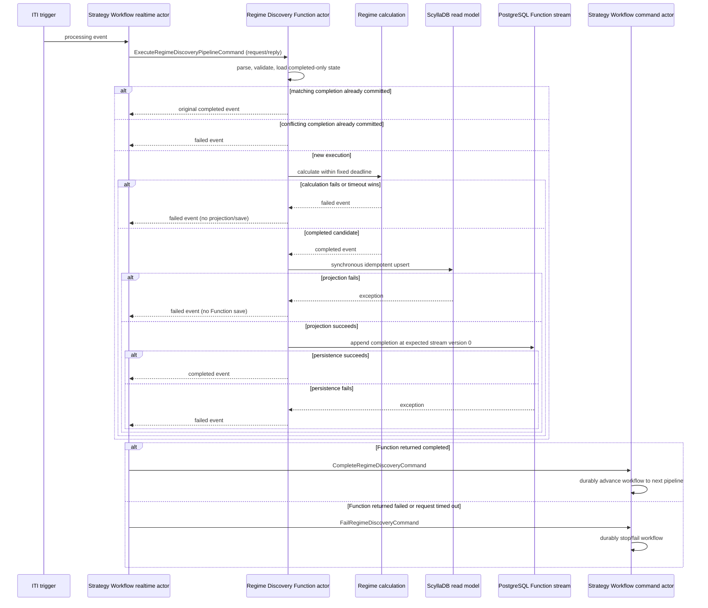

# Regime Discovery Function Actor Implementation

**Status:** Implemented and verified

**Last updated:** 2026-08-28
**Scope:** Regime Discovery pipeline execution and Strategy Workflow terminal handoff

## Decision

Regime Discovery is a FunctionActor, not a CommandActor plus EventProjector plus RealtimeActor
chain. The Strategy Workflow realtime actor sends one `ExecuteRegimeDiscoveryPipelineCommand` as a
Core NATS Function request and waits for a typed
`FunctionResult<RegimeDiscoveryPipelineCompletedEvent,RegimeDiscoveryPipelineFailedEvent>`.

Only a completed candidate is synchronously projected to ScyllaDB. Projection must succeed before
the completed-only PostgreSQL Function event is saved. A calculation, timeout, validation,
projection, or persistence exception returns a failed event. Failed Function results are not
projected or saved. Strategy Workflow converts the returned event to
`CompleteRegimeDiscoveryCommand` or `FailRegimeDiscoveryCommand`; that command actor owns the
durable workflow transition and determines whether another pipeline may start.

The calculation deadline in the request is authoritative. The caller allows a five-second
reply-only transport grace after that deadline so caller cancellation cannot race the Function's
typed timeout reply. This grace never extends calculation time or permits a late completion.

## Sequence

## FNC gate evidence

| Gate | Status | Evidence |
| --- | --- | --- |
| FNC-00 contracts | Complete | Added `ActorType.Function`, Function actor/context/state/repository/projector contracts, and typed `FunctionResult`. |
| FNC-01 transport | Complete | Added Core NATS Function request/reply producer/context APIs, Function consumer dispatch, admission rules, and `RequestReplyOnly` configuration. |
| FNC-02 base lifecycle | Complete | Added `BaseEventSourceFunctionActor` with parse, validation, exact receive dispatch, optional projection, completed-only save, typed failure conversion, and attempt logging. |
| FNC-03 persistence split | Complete | Added event-only repository save paths with no denormalizer and expected-version-zero completion append. |
| FNC-04 Regime state | Complete | Replaced started/failed Regime command state with completed-only Function state and repository. |
| FNC-05 Regime execution | Complete | Regime calculation now returns a typed complete/fail result and retains its fixed private deadline. |
| FNC-06 projection | Complete | Regime Function projector writes completed results directly to ScyllaDB and owns no queue, publication, failure projection, or replay. |
| FNC-07 workflow handoff | Complete | Strategy Workflow realtime actor directly requests the Function and submits complete/fail commands from the reply. |
| FNC-08 retire old flow | Complete | Removed Regime private terminal events, CommandActor, EventProjector, and Regime Pipeline RealtimeActor path. |
| FNC-09 registration/configuration | Complete | Registered Function contexts/repositories/projectors in API and integration hosts and added production/development admission classification. |
| FNC-10 unit/BDD coverage | Complete | Covers lifecycle ordering, failure barriers, timeout behavior, map architecture, workflow state transitions, retries, and conflicts. |
| FNC-11 integration coverage | Complete | Covers the live Function request/reply path, completed projection, workflow advance, calculation failure, timeout, restart, and busy workflow behavior. |
| FNC-12 documentation/verification | Complete | Updated actor and delivery conventions, this sequence, and build/test evidence. |

## Atomicity boundary

The safety invariant is definitive: Strategy Workflow advances only after it receives a completed
Function result and durably accepts `CompleteRegimeDiscoveryCommand`. Every failed, timed-out, lost,
or exceptional path prevents advancement toward order execution.

ScyllaDB and PostgreSQL do not share an ACID transaction. The required projection-first ordering
means a PostgreSQL outage after a successful idempotent ScyllaDB upsert may leave a completed read
model row without committed Function state. The caller still receives failure and the workflow does
not advance. Operational reconciliation may remove or supersede that orphan row later; it is not an
authorization to continue the strategy.

## Verification

- Shared actor lifecycle and delivery suites pass.
- Core NATS unit suite passes.
- Trade unit suite passes.
- Trade BDD suite passes.
- PostgreSQL expected-stream-version integration tests pass.
- Intrinsic Time Strategy Workflow runtime integration scenarios pass.
- API server, actor integration host, Trade BDD host, and Trade integrated-test host build with zero errors.
