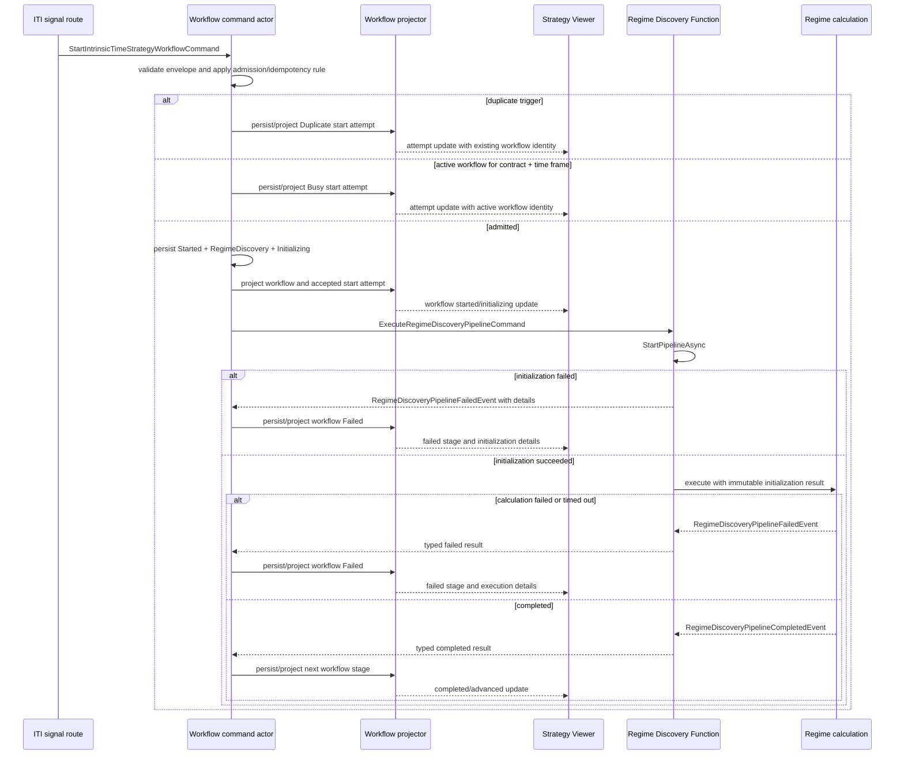
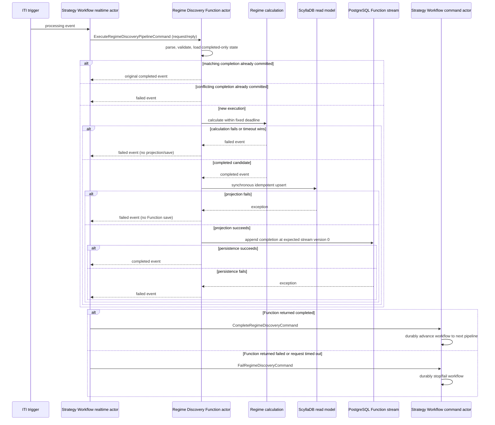

# Regime Discovery Function Actor Implementation

**Status:** Workflow-start correction implemented and focused verification passed

**Last updated:** 2026-09-10
**Scope:** ITI-to-workflow admission, Regime Discovery initialization and execution, durable failure
reporting, and Strategy Viewer visibility

## Corrective decision (2026-09-10)

Every validly received `FuturesItiSignalGeneratedEvent` must reach the Strategy Workflow command
actor. That actor makes the only pre-start business decision: start a workflow, or record that the
attempt is a duplicate or is blocked by an already active workflow for the same contract and time
frame. Pipeline readiness must not prevent creation of the workflow.

For an admitted attempt, the workflow is durably persisted and projected to the Strategy Viewer
before Regime Discovery initialization begins. Regime Discovery owns its configuration, input-data,
snapshot, and calculation-readiness checks through `StartPipelineAsync`. A failed initialization is
a normal typed pipeline result. Strategy Workflow converts it to a durable failed workflow event,
including structured details that the Strategy Viewer can display.

The first implementation applies this design to Regime Discovery only. Every later pipeline
operator will use the same initialization-result contract when that operator is migrated, while
retaining operator-specific checks.

### Required invariant

For every valid ITI signal received by the workflow route, one of these durable and queryable
outcomes must exist:

1. A new workflow was started for the signal's contract and time frame.
2. The start attempt was classified as an idempotent duplicate of an existing attempt.
3. The start attempt was rejected as busy and identifies the active workflow that owns the contract
   and time frame.

After outcome 1, every Regime Discovery initialization or execution failure must transition that
workflow to `Failed`. No readiness check may log and return before the workflow or start-attempt
record exists.

## Confirmed former behavior and defect

Before this correction, the realtime handler performed the following work before it sent
`ExecuteIntrinsicTimeStrategyWorkflowCommand`:

1. Parse the ITI generated event and construct proposed workflow identities.
2. Resolve effective Regime Discovery parameters.
3. Resolve the Market Condition assessment profile.
4. When warm-signal enforcement is enabled, capture a snapshot and qualify every required signal.
5. Resolve the exact activation for the time frame and pin its version/hash.
6. Resolve portfolio and fund-selection authority.
7. Resolve the selection binding.
8. Send the workflow command.

The observed live failure occurred at step 4: 79 required signal observations did not pass cache
warm-up qualification. The handler logged the rejection and returned. As a result, no workflow was
created, the Regime Discovery Function was never invoked, and the Strategy Viewer had no workflow
or failure to display. The later activation, portfolio, and selection checks were not reached.

Once the existing workflow command is received, it already validates the message, loads state,
handles duplicate and busy cases, closes an expired workflow when necessary, persists the
`Started / RegimeDiscovery / Processing` transition, projects it, and dispatches Regime Discovery.
The correction removes that earlier gate. The workflow realtime actor now invokes Regime
Discovery's `StartPipelineAsync` after the workflow start is durable. The resulting immutable
snapshot travels in `ExecuteRegimeDiscoveryPipelineCommand`; the Function never recaptures mutable
cache state.

## Target sequence



## Implemented contracts

The ITI handoff contains only information needed to identify and admit the attempt:

```csharp
public sealed record StartIntrinsicTimeStrategyWorkflowCommand(
    Guid CommandId,
    string EntityId,
    Guid ProposedWorkflowId,
    Guid TriggerEventId,
    FuturesItiSignalGeneratedEvent TriggerEvent,
    DateTimeOffset RequestedAtUtc);
```

The Regime Discovery Function receives the persisted workflow identity and fixed request time. It
does not require the ITI handler to pre-resolve pipeline inputs:

```csharp
public sealed record ExecuteRegimeDiscoveryPipelineCommand(
    Guid CommandId,
    Guid WorkflowId,
    string WorkflowEntityId,
    long WorkflowRevision,
    Guid TriggerEventId,
    FuturesItiSignalGeneratedEvent TriggerEvent,
    DateTimeOffset RequestedAtUtc,
    DateTimeOffset ExpiresAtUtc,
    RegimeDiscoveryParameterSet ParameterSet,
    string ParameterPayloadSha256,
    RegimeDiscoveryMarketSignalSnapshot Snapshot);
```

`StartPipelineAsync` returns the initialized Execute command required by calculation or a
structured error:

```csharp
public sealed record PipelineStartResult<T>(
    bool Success,
    T? Value,
    PipelineInitializationError? Error);

public sealed record PipelineInitializationError(
    string ErrorCode,
    string ErrorType,
    string Message,
    IReadOnlyList<string> ReasonCodes,
    IReadOnlyDictionary<string, string> DiagnosticData);
```

The exact property types will reuse the existing domain contracts where available. Error codes and
diagnostic keys must be bounded and versioned; exception text and stack traces remain in logs while
the persisted error contains safe operational details.

## Regime Discovery `StartPipelineAsync` responsibility

`StartPipelineAsync` owns every check required to determine whether Regime Discovery can execute:

1. Resolve the effective immutable Regime Discovery configuration as of `RequestedAtUtc`.
2. Validate the parameter set and verify its canonical payload hash.
3. Build and capture the required market-signal snapshot.
4. Validate required observations for presence, warm-up, validity, event time, staleness, schema
   version, calculation version, and internal snapshot consistency.
5. Validate the calculation deadline and any other Regime Discovery execution prerequisite.
6. Return a successful immutable initialization value or one typed error containing all applicable
   reason codes and diagnostic facts.

The workflow realtime actor calls `StartPipelineAsync` first. On failure it submits a durable
`FailRegimeDiscoveryCommand`; on success it sends the returned initialized Execute command to the
Function. The Function validates and calculates only from that frozen command and performs no
mutable configuration or signal-cache lookup.

Market Condition profiles, activation, portfolio/fund authority, and selection binding do not
belong in Regime Discovery initialization. They move to the initialization function of the
operator that consumes them. This keeps the ITI handoff simple and ensures failures occur inside a
visible workflow stage.

## Workflow admission and idempotency

- Admission is serialized by the workflow entity for the signal's strategy, futures contract, and
  time-frame bucket. Daily, weekly, and monthly workflows can run independently.
- A workflow that is already active in that admission scope prevents a second workflow from
  starting. The new attempt is persisted as `Busy` and links to the active workflow.
- Redelivery of the same `TriggerEventId` is idempotent and is persisted or projected as
  `Duplicate`; it cannot create a second workflow transition.
- An expired active workflow is terminalized before the new workflow is admitted.
- Command IDs and terminal transition IDs are deterministic enough for replay and crash recovery.
- A restart after `Started` but before Function completion redispatches or resumes initialization
  idempotently using the fixed `RequestedAtUtc` and pinned workflow identity.

Transport/schema validation remains at the receiving boundary. Only checks needed to establish a
valid command envelope may prevent dispatch to workflow admission; those failures must still create
an observable rejected strategy attempt when the ITI event itself was validly received.

## Durable state and Strategy Viewer requirements

The workflow projection and API must expose:

- the ITI trigger identity, contract, time frame, signal time, and receive/request time;
- the start decision: `Accepted`, `Busy`, or `Duplicate`;
- the workflow ID, or the conflicting active workflow ID for a busy decision;
- the current stage and phase, including Regime Discovery `Initializing`, `Processing`, and
  `Failed`;
- initialization start/completion timestamps and duration;
- failure code, type, safe message, all reason codes, and diagnostic data;
- configuration version/hash and snapshot identity when initialization reached those steps; and
- projection freshness and the workflow revision used for ordering updates.

The Strategy Viewer loads both recent workflows and recent start attempts. NATS notifications make
updates immediate, while query reconciliation makes the same state visible after reconnect or UI
restart. Out-of-order or duplicate notifications are ignored by workflow revision/version.

## Implementation plan

### Phase 1 - Lock the behavior with tests

1. Add characterization coverage proving the current early-return defect.
2. Add acceptance scenarios for accepted, busy, duplicate, expired, initialization-failed,
   execution-failed, and completed paths.
3. Define the admission key explicitly as strategy + futures contract + time-frame bucket and test
   independent Daily/Weekly/Monthly operation.

**Exit gate:** tests fail for the current invisible warm-up rejection and fully state the target
behavior.

### Phase 2 - Introduce start and initialization contracts

1. Add the minimal workflow-start command and the generic typed pipeline-start result.
2. Add Regime Discovery initialization and structured error contracts.
3. Add compatible serialization/schema registration and version handling.
4. Add an explicit initialization phase/status without changing the meaning of existing terminal
   statuses.

**Exit gate:** contract, serialization, and backward-compatibility tests pass in every producer and
consumer host.

### Phase 3 - Move admission to the workflow command actor

1. Replace the realtime handler's pipeline preflight with the minimal workflow-start command.
2. Keep envelope validation at the boundary and move all business prerequisite resolution out of
   the handler.
3. Persist accepted, busy, and duplicate start-attempt outcomes.
4. Persist and project the admitted workflow before dispatching Regime Discovery.
5. Preserve expiry replacement and duplicate-delivery behavior.

**Exit gate:** every valid ITI trigger produces a queryable accepted, busy, or duplicate result,
and an accepted workflow is visible before Regime Discovery receives its command.

### Phase 4 - Implement Regime Discovery initialization

1. Extract existing parameter and snapshot qualification into `StartPipelineAsync`.
2. Resolve all inputs at the workflow's fixed `RequestedAtUtc` and return an immutable successful
   initialization value.
3. Aggregate existing snapshot qualification reasons into the structured failure contract.
4. Map initialization exceptions, timeouts, and validation failures to a typed failed event.
5. Ensure calculation accepts initialized inputs and cannot silently redo mutable lookups.

**Exit gate:** the known 79-observation cold-cache condition starts a workflow, then fails Regime
Discovery with all reasons attached to that workflow.

### Phase 5 - Persist terminal results and expose them to the viewer

1. Map Function completion to `CompleteRegimeDiscoveryCommand` and every Function failure to
   `FailRegimeDiscoveryCommand`.
2. Persist initialization details and stage failure details in workflow state/read models.
3. Extend workflow queries and notifications with initialization phase and failure provenance.
4. Query and render start attempts, including busy and duplicate decisions, in Strategy Viewer.
5. Show detailed error information in the selected workflow/attempt view.

**Exit gate:** UI restart/reconnect shows the same accepted, busy, duplicate, processing, and failed
state as the authoritative projections.

### Phase 6 - Recovery, health, and telemetry

1. Make redispatch after a crash between workflow start and Function completion idempotent.
2. Record bounded metrics for attempts received/admitted/busy/duplicate, initialization
   started/succeeded/failed, duration, and reason-code counts.
3. Include workflow-route subscription, workflow-command progress, Regime Function request/reply,
   projection freshness, and viewer-notification freshness in the minute live-pipeline health
   snapshot.
4. Log identifiers needed to correlate ITI event, start attempt, workflow, Function request, and
   terminal transition.

**Exit gate:** restart and fault-injection tests recover without duplicate transitions, and the
minute health result identifies a broken handoff component.

### Phase 7 - Integrated verification and rollout

Run the following end-to-end scenarios through real NATS transport and the Scylla/PostgreSQL
projections used by the application:

1. Warm inputs: ITI signal -> visible workflow -> Regime completion -> next stage.
2. Cold inputs with 79 missing/unqualified observations: ITI signal -> visible workflow -> detailed
   Regime failure in Strategy Viewer.
3. Missing/invalid Regime configuration: visible workflow -> initialization failure.
4. Second signal in the same active contract/time-frame bucket: no second workflow and a visible
   busy attempt linked to the active workflow.
5. Signals for different time frames: workflows proceed independently.
6. Exact ITI redelivery: one workflow and a visible/idempotent duplicate outcome.
7. Expired workflow: old workflow is terminalized and the new workflow starts.
8. API restart after durable start but before Function reply: one resumed result and no duplicate
   state transition.
9. Function timeout, calculation failure, projection failure, and terminal-command failure: each
   remains safe, correlated, and visible at the last durable boundary.
10. Strategy Viewer disconnect/reconnect: query reconciliation restores the full attempt and error
    details even when a notification was missed.

Roll out compatible contracts and projections before enabling the new producer path. Deploy API
and processing hosts, then the Strategy Viewer. Rebuild and restart all affected applications so no
host retains the previous contract set.

**Final acceptance:** no valid ITI signal can disappear between reception and workflow admission;
no Regime Discovery readiness failure occurs outside a persisted workflow; and the Strategy Viewer
shows the exact admission or pipeline outcome.

## Implemented baseline decision

Regime Discovery is a FunctionActor, not a CommandActor plus EventProjector plus RealtimeActor
chain. The Strategy Workflow realtime actor sends one `ExecuteRegimeDiscoveryPipelineCommand` as a
Core NATS Function request and waits for a typed
`FunctionResult<RegimeDiscoveryPipelineCompletedEvent,RegimeDiscoveryPipelineFailedEvent>`.

Only a completed candidate is synchronously projected to ScyllaDB. Projection must succeed before
the completed-only PostgreSQL Function event is saved. A calculation, timeout, validation,
projection, or persistence exception returns a failed event. Failed Function results are not
projected or saved. Strategy Workflow converts the returned event to
`CompleteRegimeDiscoveryCommand` or `FailRegimeDiscoveryCommand`; that command actor owns the
durable workflow transition and determines whether another pipeline may start.

The calculation deadline in the request is authoritative. The caller allows a five-second
reply-only transport grace after that deadline so caller cancellation cannot race the Function's
typed timeout reply. This grace never extends calculation time or permits a late completion.

## Implemented baseline sequence



## Implemented baseline FNC gate evidence

| Gate | Status | Evidence |
| --- | --- | --- |
| FNC-00 contracts | Complete | Added `ActorType.Function`, Function actor/context/state/repository/projector contracts, and typed `FunctionResult`. |
| FNC-01 transport | Complete | Added Core NATS Function request/reply producer/context APIs, Function consumer dispatch, admission rules, and `RequestReplyOnly` configuration. |
| FNC-02 base lifecycle | Complete | Added `BaseEventSourceFunctionActor` with parse, validation, exact receive dispatch, optional projection, completed-only save, typed failure conversion, and attempt logging. |
| FNC-03 persistence split | Complete | Added event-only repository save paths with no denormalizer and expected-version-zero completion append. |
| FNC-04 Regime state | Complete | Replaced started/failed Regime command state with completed-only Function state and repository. |
| FNC-05 Regime execution | Complete | Regime calculation now returns a typed complete/fail result and retains its fixed private deadline. |
| FNC-06 projection | Complete | Regime Function projector writes completed results directly to ScyllaDB and owns no queue, publication, failure projection, or replay. |
| FNC-07 workflow handoff | Complete | Strategy Workflow realtime actor directly requests the Function and submits complete/fail commands from the reply. |
| FNC-08 retire old flow | Complete | Removed Regime private terminal events, CommandActor, EventProjector, and Regime Pipeline RealtimeActor path. |
| FNC-09 registration/configuration | Complete | Registered Function contexts/repositories/projectors in API and integration hosts and added production/development admission classification. |
| FNC-10 unit/BDD coverage | Complete | Covers lifecycle ordering, failure barriers, timeout behavior, map architecture, workflow state transitions, retries, and conflicts. |
| FNC-11 integration coverage | Complete | Covers the live Function request/reply path, completed projection, workflow advance, calculation failure, timeout, restart, and busy workflow behavior. |
| FNC-12 documentation/verification | Complete | Updated actor and delivery conventions, this sequence, and build/test evidence. |

## Atomicity boundary retained by the correction

The safety invariant is definitive: Strategy Workflow advances only after it receives a completed
Function result and durably accepts `CompleteRegimeDiscoveryCommand`. Every failed, timed-out, lost,
or exceptional path prevents advancement toward order execution.

ScyllaDB and PostgreSQL do not share an ACID transaction. The required projection-first ordering
means a PostgreSQL outage after a successful idempotent ScyllaDB upsert may leave a completed read
model row without committed Function state. The caller still receives failure and the workflow does
not advance. Operational reconciliation may remove or supersede that orphan row later; it is not an
authorization to continue the strategy.

## Implemented baseline verification

- Shared actor lifecycle and delivery suites pass.
- Core NATS unit suite passes.
- Trade unit suite passes.
- Trade BDD suite passes.
- PostgreSQL expected-stream-version integration tests pass.
- Intrinsic Time Strategy Workflow runtime integration scenarios pass.
- API server, actor integration host, Trade BDD host, and Trade integrated-test host build with zero errors.

## Workflow-start correction delivered 2026-09-10

- The ITI realtime route now sends the workflow admission command immediately. It performs no
  Regime configuration, warm-signal, Market Condition, activation, portfolio, or selection check.
- Workflow command validation is limited to the start envelope and routing identities. Revision 1
  is persisted as `Started / RegimeDiscovery / Processing` before any pipeline initialization.
- Regime Discovery owns `StartPipelineAsync`, resolves its effective configuration, and returns a
  typed `PipelineStartResult<T>`. Initialization failures carry a stable code, type, reason codes,
  and bounded diagnostic facts into `FailRegimeDiscoveryCommand` and the workflow projection.
- Successful Regime initialization parameters and hash travel through the completed Function event
  and completion command and are frozen into the durable workflow view.
- Market Condition owns an equivalent `StartPipelineAsync` for its assessment profile. Trade
  Selection owns activation, portfolio, fund, and selection-policy initialization. Failures after
  workflow admission terminate the applicable visible stage with durable error evidence.
- Order Composition and Risk Management retain their existing accepted-request preparation and
  failure transitions; both already execute only after a workflow and their stage state are durable.
- Trade unit tests pass 1,057/1,057 and Trade BDD tests pass 36/36. The complete broker-backed
  Intrinsic Time workflow runtime group passes 12/12, including admission, busy handling, Regime
  failure, Regime timeout, Market Condition acceptance, orphan detection, and durable
  `TS.INIT.ACTIVATION_MISSING` failure without selector dispatch. The affected projects build
  without warnings.

## Regime input correction delivered 2026-09-10

- `StartPipelineAsync` now resolves and validates the effective parameter set, verifies its canonical
  hash, builds the exact signal request, captures a revision-stable snapshot, and returns the
  snapshot in the Execute command. Missing or unqualified evidence returns
  `RD.INIT.INPUTS_UNAVAILABLE` with bounded metric, timeframe, availability, and signal-identity
  diagnostics.
- The ITI event is authoritative for current price, ITI direction, band level, reversal level, and
  the trigger's VX front value. These values are no longer dependent on the cache projector winning
  a race against workflow dispatch. Current price is applied to each configured trend timeframe
  when comparing the trigger price with its EMA evidence.
- Producer-backed structure and volatility evidence uses the longest required configured evidence
  timeframe: OneHour for Daily workflows, FourHours for Weekly workflows, and Daily for Monthly
  workflows. VX term structure and VIX evidence remain Daily.
- The Function calculates only from the initialized command snapshot. Calculation failures retain
  structured reason area, timeframe, and signal identity in the persisted workflow failure.
- Focused verification passes: 1,056 Trade unit tests; 13 Regime/evidence analytics tests; the
  broker-backed successful Regime initialization, completion, snapshot projection, and workflow
  advance scenario; and the broker-backed missing-input failure scenario.
