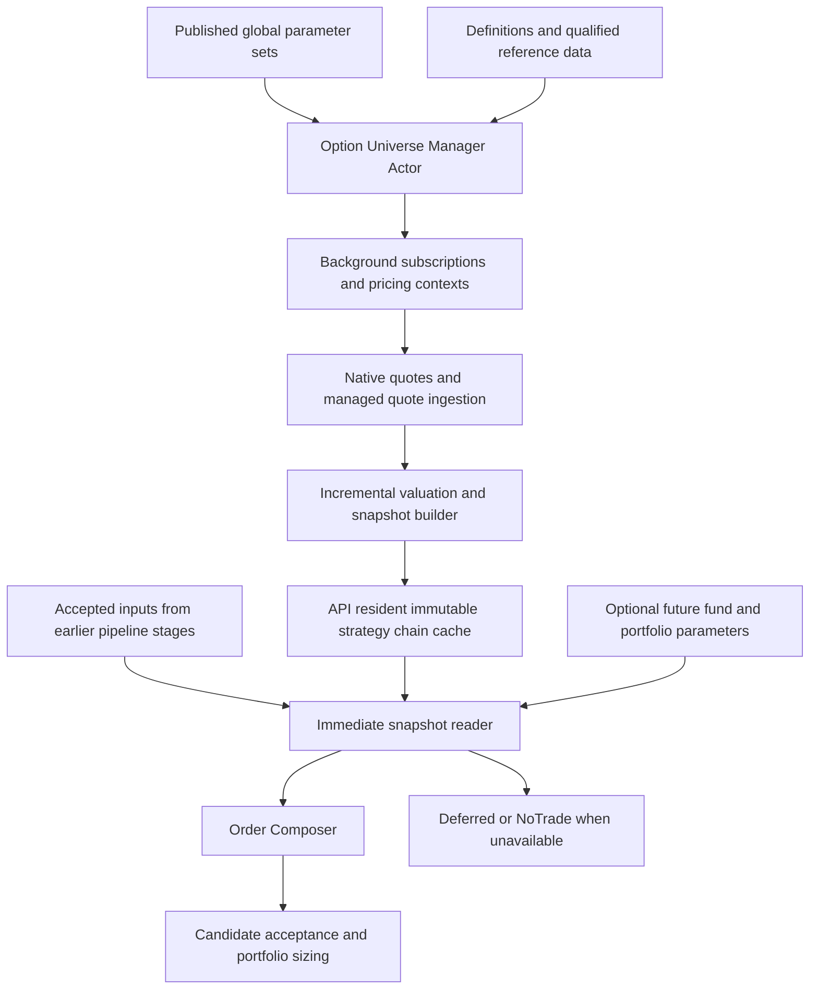

# Strategy Option Chain Cache and Order Composition Design

Status: Core and authoritative Development provisioning implemented; live verification gates outstanding. Version: 1.1. Date: October 9, 2026.

## Purpose and scope

Maintain a continuously prepared option universe so the strategy workflow Order Composer can obtain one accurate, consistent snapshot without waiting for definitions, subscriptions, pricing preparation or feed recovery. Global parameter sets define eligible expirations, directional delta targets, spread widths, quote quality, candidate selection and execution defaults. Earlier pipeline stages supply the accepted strategy and market context. A future interface permits explicit fund and portfolio parameters without defining their override policies now.

The current manual option-chain browser and custom-order editor remain available through their existing request path. This design applies to automated strategy workflow composition. The automated cache has independent subscription ownership and cannot be released or reconfigured by a manual view closing or changing its expiry.

The pipeline never starts or repairs a subscription after a signal arrives. It reads a ready snapshot or returns Deferred or NoTrade promptly. Recovery may temporarily prevent composition; it must not hold a workflow mailbox waiting for market data. Previously observed prices cannot become executable merely because a newer quote is unavailable.

Related documents:

- [Order Composition and Strategy Selection](Order-Composition-Strategy-Selection-Specification-v1.0.md).
- [Manual Live Option Chain Latency Plan](Live-Option-Chain-Latency-Implementation-Plan.md).
- [Contract Reference and Option Pricing Specification](ES-Trade-Blotter-Contract-Reference-and-Option-Pricing-Specification-v3.md).
- [Macro Window Monthly ES Iron Condor Strategy](Macro-Window-Monthly-ES-Iron-Condor-Strategy-Design-v0.1.md).

For automated option composition, this design replaces the existing specification's signal-time market acquisition with background preparation and immediate cache reads. Existing portfolio sizing, order acceptance and financial event persistence retain their responsibilities.

## Current integration boundary

`ExecuteOrderComposition.PrepareOrDispatchAsync` currently reads a workflow preparation and, if absent, calls `CompositionMarketPreparation.PrepareAsync`. That preparation can qualify references, allocate a worker subscription and poll every 25 milliseconds for usable quotes within a ten-second budget. `QualifiedCompositionDiscovery.AcquireAsync` also prepares pricing contexts and owns subscription allocation.

Those operations move to background universe maintenance. The automated workflow uses a new cache reader with no acquisition fallback. Existing `MarketCompositionSnapshot`, contract mappings, OptionCalculator integration, pricing context digests and generation fencing provide reusable contracts and accuracy checks. Existing preparation evidence remains useful after selecting a snapshot; a stored prior workflow preparation does not constitute a fresh chain for a new signal.

## Architecture and ownership



| Component | Responsibility |
| --- | --- |
| Parameter command actor | Validate and publish versioned global sets through domain events. |
| Parameter event projector | Persist parameter read models to ScyllaDB using established configuration storage conventions. |
| Parameter query actor | Read persisted current configuration from ScyllaDB; never read command actor state. |
| Option Universe Manager Actor | Resolve expiry dates, plan coverage, own subscriptions and respond to configuration, value-date and worker-generation changes. |
| Native data path | Receive bounded quote subscriptions and update the existing native buffers without an actor command for every quote. |
| Background snapshot builder | Copy qualified observations, calculate changed valuations and publish consistent immutable chain versions. |
| Strategy chain cache | Hold bounded current versions and indexes inside the API process. |
| Immediate snapshot reader | Resolve already-loaded parameters, capture a cache version, validate freshness and return a bounded selection view. |
| Order Composer | Select and rank strategies using one snapshot and the accepted pipeline inputs. |

Worker-to-API transfers occur in the background. A worker control-pipe request, NATS round trip, database query or subscription gate must never be necessary to serve a cache read. A separate API-resident mirror is required when quotes reside in a worker process; naming a worker capture method a cache does not satisfy this requirement.

Actor messages manage configuration, readiness and subscription lifecycle. Quote ingestion and valuation use the existing data path. Commands that create events set `event.CommandId = command.CommandId`; payload properties use domain names. Durable configuration read models follow event projection into ScyllaDB.

## Application API and folder placement

The high-level facade is `OptionChainCache` in `TomasAI.IFM.Application.MarketData/OptionChainCache`. Its provider-neutral `IOptionChainCache` contract belongs in `TomasAI.IFM.Application.MarketData/Contracts` and is exposed as `IMarketDataApi.OptionChainCache`. Order Composer function actors consume the existing market-data API; they do not access Databento classes or the framework store directly.

The provider-independent immutable store and indexes belong in `TomasAI.IFM.Framework.MarketData/OptionChainCache`. Existing Databento session and observation components remain in `TomasAI.IFM.Framework.MarketData.DataBento/OptionChain`. Background application services prepare and publish updates into the API-resident cache. Its stable facade is retained across worker replacements while old-generation data is fenced.

The earlier proposed `IStrategyOptionChainSnapshotReader` responsibility is implemented by `IOptionChainCache.TryGetSnapshot`; a second public reader contract is unnecessary. Publication and lifecycle interfaces remain internal to the background maintenance path.

See the [implementation plan](Strategy-Option-Chain-Cache-Implementation-Plan-v1.0.md) for stages, integration boundaries and acceptance gates.

## Global parameter set identity

Proposed contract: `StrategyOptionChainParameterSet` containing the following identity and policy sections. Cache, composition and execution settings are separately named sections within one versioned set.

| Field | Meaning |
| --- | --- |
| ParameterSetId and Version | Stable set identity and immutable published version. |
| Name and SchemaVersion | Administration label and wire schema. |
| Environment | Explicit Development, Paper or Production applicability. |
| StrategyDefinitionReference | Existing catalog strategy structure and its version; leg definitions are referenced rather than duplicated. |
| InstrumentRoot and Dataset | Underlying family and provider dataset, initially ES and GLBX.MDP3. |
| Enabled | Whether background maintenance includes this strategy. |
| EffectiveFromValueDate | First operational value date using this published version. |
| ConfigurationDigest | Canonical digest identifying the complete effective policy. |
| BiasRows | At least Neutral, Bullish and Bearish rows for every option strategy. |

An enabled strategy requires all three bias rows. A row may be disabled explicitly when a strategy/bias combination is unsupported. Missing rows cannot silently inherit another bias. Map the catalog's `Balanced` to `Neutral` at one documented boundary while preserving the original catalog identity in evidence.

All values are global in the first implementation. No implicit portfolio-specific defaults or overrides are introduced.

## Parameters for each market bias

| Field | Meaning and units |
| --- | --- |
| MarketBias and Enabled | Neutral, Bullish or Bearish applicability and explicit enablement. |
| MinimumDte and MaximumDte | Inclusive allowed expiry range in calendar days. |
| PreferredDte | Preferred expiry distance within the range. |
| ExpirySelectionRule | Deterministic rule, initially nearest eligible listed expiry to PreferredDte, then expiry timestamp and contract identity. |
| AllowedExpiryTypes | Catalogued weekly/monthly/quarterly eligibility where qualified metadata provides that classification. |
| ExpiryGroupRules | Same expiry for an Iron Condor; explicit group relationships for a future multi-expiry strategy. |
| PutDeltaMinimum, PutDeltaTarget, PutDeltaMaximum | Absolute per-contract put delta magnitude, between zero and one; the calculated signed put delta remains negative. |
| CallDeltaMinimum, CallDeltaTarget, CallDeltaMaximum | Absolute per-contract call delta magnitude, between zero and one. |
| TargetNetDelta and NetDeltaTolerance | Signed aggregate strategy delta per strategy unit, using catalog leg sides and ratios. |
| AllowedPutWingWidths and PreferredPutWingWidth | Discrete permitted strike differences in underlying price points. |
| AllowedCallWingWidths and PreferredCallWingWidth | Independent permitted call wing widths in underlying price points. |
| SymmetricWingsRequired | Whether put and call wings must have the same width. |
| MinimumNetCredit and MaximumNetDebit | Premium points per strategy unit; applicable to credit and debit structures respectively. |
| MaximumLegSpreadPoints and MaximumLegSpreadRatio | Maximum ask-minus-bid in premium points and relative to midpoint; both enabled constraints apply. |
| MinimumBidSize and MinimumAskSize | Displayed contract quantities required on executable sides. |
| MinimumVolume and MinimumOpenInterest | Optional contract-statistic thresholds; zero disables the filter. |
| MaximumStatisticsAge | Allowed age and session semantics when a statistic filter is enabled. |
| MaximumOptionQuoteAge and MaximumUnderlyingQuoteAge | Freshness limits in milliseconds, checked at cache read and candidate acceptance. |
| MaximumQuoteSkew | Maximum event-time difference among the required legs and underlying. |
| MaximumValuationAge | Allowed valuation age, independent of quote age. |
| MaximumShortCandidatesPerSide | Bound on shortlisted short puts and short calls. |
| MaximumSpreadCandidatesPerSide and MaximumCondorCandidates | Bounds on attached spreads and final combinations. |
| RankingRule | Versioned deterministic ranking and tie-break rule. |
| MaximumLossPerStrategyUnit | Optional global structure risk ceiling in broker contract currency. |

The catalog supplies buy/sell orientation, leg roles, leg ratios and credit/debit semantics. Long and short structures use their own catalog references; a Bullish setting does not invert a structure implicitly. One-sided strategies ignore the unused put or call fields explicitly. Currency and multiplier come from qualified contract references. Mixed-currency combinations are rejected until conversion rules are defined.

Minimum net credit is an eligibility condition, not a position size. Maximum loss per unit is distinct from the portfolio's permitted exposure and the monitoring DailyLossLimit.

## Cache maintenance parameters

| Field | Purpose |
| --- | --- |
| EarlierFallbackExpiryCount and LaterFallbackExpiryCount | Eligible alternate expirations to maintain around the preferred expiry. |
| CacheRangeMultiplier | Volatility envelope width, initially evaluated with development examples between 1.5 and 2.0. |
| BoundaryExpansionTrigger | Distance or fraction remaining before background coverage must expand. |
| MaximumExpirations and MaximumContractsPerExpiry | Bounds on subscriptions, memory and valuation work. |
| MaximumContractsTotal | Global resource ceiling across all enabled strategies. |
| WarmQuoteMode and ActiveQuoteMode | Desired broad and active schemas; BBO-1s and MBP-1 are proposed options subject to adapter capability verification. |
| ActiveCandidateBuffer | Additional nearby candidates maintained with the active tier. |
| SnapshotPublicationInterval and MaximumPublicationDelay | Bounded batching of changed observations into chain versions. |
| PricingContextRefreshPolicy | Background refresh and invalidation of rates, conventions and calendars. |
| DefinitionRefreshPolicy | Startup reconciliation and incremental definition changes. |
| MaximumSnapshotReadAttempts | Bounded capture attempts; prefer one read of an immutable reference. |
| MaximumReadDuration | Local reader time budget with no waiting or I/O fallback. |

Subscription plans cover the union of enabled bias rows and strategy requirements, including every allowed long-wing relationship. Overlapping strategies share physical subscriptions through independent logical owners. Their effective quote tier and freshness requirements use the strictest active consumer requirements.

A global ceiling that prevents required coverage makes the affected scope NotReady with a capacity reason. It never silently truncates a ready universe. An unsupported schema combination uses the supported bounded subscription path or marks the configuration unsupported; BBO/MBP coexistence is an implementation capability to verify before adoption.

## Approved initial Development rows

These user-approved values seed Development global profiles; they are not automatically enabled in Production. Delta targets express leg selection; aggregate net delta must be calculated and validated separately.

| Strategy | Bias | Put target delta | Call target delta | Put wing points | Call wing points | DTE range | Preferred DTE |
| --- | --- | --- | --- | --- | --- | --- | --- |
| Short Iron Condor | Neutral | 0.16 | 0.16 | 50 | 50 | 30 to 45 | 45 |
| Short Iron Condor | Bullish | 0.20 | 0.10 | 50 | 50 | 30 to 45 | 45 |
| Short Iron Condor | Bearish | 0.10 | 0.20 | 50 | 50 | 30 to 45 | 45 |

Every other supported option strategy has the same three-row structure with settings appropriate to its catalog definition. Published values require explicit delta ranges, net-delta tolerance, liquidity, freshness and ranking rules; the examples alone are insufficient for publication.

## Expiry and strike planning

Resolve DTE using calendar days between operational value date and the exchange-local expiry date. Pricing time to expiry uses the precise qualified last-trading timestamp and pricing day-count convention. Do not subtract wall-clock midnight timestamps to derive business DTE. Expiry eligibility also considers the current timestamp and accepted mandatory exit or holding-window constraints.

Operational value date follows the application's accepted lifecycle transition after successful market-close EOD processing. Cache planning follows that accepted date event rather than independently advancing it at 17:00.

For each eligible expiry and its correctly mapped futures underlying:

```text
ExpectedMove = FuturesPrice * ATMImpliedVolatility * sqrt(TimeToExpiryYears)
LowerCacheBoundary = min(BollingerLower, FuturesPrice - ExpectedMove * CacheRangeMultiplier)
                     - MaximumAllowedPutWingWidth
UpperCacheBoundary = max(BollingerUpper, FuturesPrice + ExpectedMove * CacheRangeMultiplier)
                     + MaximumAllowedCallWingWidth
```

`TimeToExpiryYears` follows the configured pricing convention; an ACT/365 example is DTE/365. Include contracts required by the configured delta bands and their wings even if they exceed this initial envelope. When one range input is unavailable, an explicit configured fallback may build coverage, but readiness still requires usable quotes and valuations. Never claim volatility coverage from a fixed nearest-strike count alone.

Expand before the underlying reaches a coverage boundary. Prepare replacement coverage before releasing old coverage. Configuration changes build a new version in the background and activate it atomically when ready. If the workflow requests the new version before readiness, return Deferred; never substitute the previous policy silently.

## Incremental pricing and accuracy

Use the existing OptionCalculator-backed qualified pricing engine appropriate to contract exercise and premium conventions. Black-76 applies only to contracts qualified for that model; unsupported conventions are excluded explicitly.

For a changed option, update quote, sizes and timestamps, solve IV where applicable, calculate required Greeks and liquidity metrics, and publish the updated valuation with its dependency versions. A changed underlying, rate, pricing context or expiry clock also invalidates dependent valuations even if an option quote has not changed. Schedule bounded background refreshes rather than recalculating the entire chain inside the signal handler.

Selection may use cached IV and delta, but final shortlisted legs must contain all risk values required by the composer and portfolio stage. A selection-only valuation is not an execution-qualified risk snapshot. Missing calculations make those candidates unavailable; they do not become zeros.

Keep event time and received time separately. Record mapping version, definition digest, rate publication, context digest, pricing engine version, underlying version and valuation time. Validate non-crossed positive prices, finite Greeks, valid maturity, sizes, premium tick increments and currencies. Out-of-order updates cannot regress an instrument observation.

## Published snapshot contract

Proposed contract: `StrategyOptionChainSnapshot`. The API cache stores immutable arrays and immutable indexes. Mutable native buffers are copied with a verified sequence boundary by the background builder; the composer never sees a partially updated buffer.

| Field | Meaning |
| --- | --- |
| SnapshotId, ChainVersion and CapturedAtUtc | Unique snapshot and monotonically increasing publication version within the cache lifecycle. |
| CacheInstanceId and WorkerGenerationId | Distinguish API restarts and worker replacements. |
| ParameterSetId, ParameterVersion and ConfigurationDigest | Policy used to prepare coverage and valuations. |
| StrategyDefinitionReference, Dataset, Root and ValueDate | Exact scope and business applicability. |
| DefinitionGeneration and PricingEngineVersion | Reference and calculation provenance. |
| UnderlyingSnapshots | Versioned quote and contract reference for each mapped futures underlying. |
| ExpirationIndex and StrikeIndex | Prebuilt indexes for bounded selection. |
| Options | Immutable qualified definitions, observations, valuations and quality flags. |
| Coverage | Expirations, delta bands, wing relationships and active-tier coverage. |
| ReadinessByScope | Readiness by strategy, bias, expiry and dependency generation. |
| ReadinessReasonCodes and NoSubscriptionGap | Diagnostic state and transport continuity status. |
| ValidUntilUtc | Upper bound on snapshot usage, supplemented by current per-candidate freshness checks. |

Every option observation carries bid, ask, sizes, event/received timestamps, strike, expiry, call/put, currency, multiplier, tick rules, IV, delta, required Greeks and dependency digests. Statistics also carry their session/date and observation age.

A logically consistent version may contain different instrument quote times. Consistency therefore requires both one immutable version and bounded quote age/skew for the selected legs and underlying. Capture time alone cannot establish freshness.

## Snapshot request from the workflow

Proposed request: `StrategyOptionChainSnapshotRequest`.

| Input | Producer and use |
| --- | --- |
| WorkflowId, stage invocation, correlation and input revision | Workflow identity and traceability. |
| Accepted strategy and catalog versions | Trade Selection result defining permitted construction. |
| MarketBias and horizon | Accepted direction and strategy horizon from previous operators. |
| ValueDate, root and underlying association | Accepted operational context; underlying mapping remains reference-driven. |
| ParameterSetId and required version | Global configuration pinned before composition. |
| Accepted market conditions | Available price boundaries, volatility assumptions, event dates and eligibility constraints from earlier stages. |
| Optional selection constraints | Narrow expiry/delta/width preferences within the effective policy; cannot expand coverage or relax accuracy gates implicitly. |
| PortfolioId and FundId | Trace and sizing context; no implicit configuration lookup on the cache read. |
| OptionalFundPortfolioParameters | Reserved future versioned contract for already-resolved parameters; absent in the first implementation. |
| DeadlineUtc | Deadline for this stage; an expired request is rejected immediately. |

Earlier operator outputs must retain their identity, timestamps and revision evidence. Their market conditions guide filtering; live quote prices come from the captured cache snapshot. Reject incompatible revisions or stale accepted inputs according to workflow rules.

Reserve the optional override field as a typed, versioned extension boundary. Until its schema and resolver are designed, a nonempty unsupported override returns `UnsupportedFundPortfolioParameters`; it is never ignored or guessed. The initial runtime uses only global settings. Future precedence is explicit fund override, then portfolio override, then global defaults, subject to a separately reviewed conflict and eligibility policy. Overrides requiring new coverage must be warmed in advance and cannot trigger a signal-time load.

## Immediate read and result semantics

Application contract: `IMarketDataApi.OptionChainCache.TryGetSnapshot(request)` through `Contracts.IOptionChainCache`. It performs bounded local work and returns synchronously. There is no asynchronous acquisition fallback.

1. Resolve the requested published policy from the resident immutable configuration index.
2. Read the current immutable chain reference once.
3. Verify cache identity, admitted worker generation, value date, policy version and scope readiness.
4. Apply earlier-stage eligibility constraints using prebuilt expiry and strike indexes.
5. Return the requested immutable snapshot view, or an explicit reason immediately.

| Result | Meaning and workflow behavior |
| --- | --- |
| Ready | One consistent snapshot satisfies prerequisites; composition may proceed. |
| Deferred | Recovery, missing fresh quotes, incomplete coverage, pending configuration or capacity shortage. Complete this invocation promptly; a subsequent normal strategy input may try again. |
| NoTrade | Ready data but no eligible expiry, liquid candidate or qualifying structure under the effective rules. |
| Rejected | Invalid request, contradictory accepted inputs, unknown policy or unsupported override schema. |

Deferral does not schedule a tight workflow retry loop or replay an old signal when recovery finishes. Readiness events support monitoring and future signals. A deployment requiring readiness-triggered re-evaluation needs a separate explicit signal policy.

Use structured reason codes such as `Recovering`, `PolicyNotReady`, `CoverageIncomplete`, `QuoteStale`, `ValuationStale`, `IncoherentQuotes`, `CapacityExceeded`, `NoEligibleExpiry` and `NoEligibleCandidate`. Return chain version and available readiness metadata for diagnostics without allocating a subscription or reading storage.

## Order composition from one snapshot

Filter eligible expirations, then shortlist short legs by configured delta, accepted market boundaries, spread quality, executable sizes and optional statistics. Attach wings through precomputed relationships and allowed widths. Rank a bounded number of put and call spreads before combining finalists. Other catalog structures use their own bounded topology rules.

For one short Iron Condor strategy unit:

```text
ExecutableCredit = BidShortPut - AskLongPut + BidShortCall - AskLongCall
MidpointCredit = MidShortPut - MidLongPut + MidShortCall - MidLongCall
NetDelta = sum(SignedLegRatio * OptionDelta)
MaximumExpiryLossPoints = max(PutWingWidth, CallWingWidth) - ExecutableCredit
MaximumExpiryLossCurrency = MaximumExpiryLossPoints * ContractMultiplier
```

The maximum-loss formula applies to a standard same-expiry Iron Condor with compatible contracts and equal unit ratios. Reject unsupported topology or use the appropriate catalog calculation. Track commission/fee estimates separately and include them consistently in net profitability and risk rules.

Use midpoint credit for analysis. Initial executable assumptions use bid/ask sides and conservative tick rounding. Ranking is deterministic: apply the published ranking criteria, then expiry, strikes and contract identities as explicit tie-breaks. Enforce all four selected quotes, underlying coherence, full risk valuations and policy constraints again before candidate acceptance.

Order Composer produces a one-unit candidate and its snapshot evidence. Portfolio sizing supplies quantity from current accepted capital, fund mandate and risk envelope. Financial reservation, order acceptance, broker contract validation and execution retain their existing stages. A stale candidate is rejected; it never reloads the option chain or silently replaces a leg at acceptance.

## Execution defaults

The global execution section specifies permitted order types, default time-in-force, executable-price rule, premium tick rounding, price bounds and optional algorithm settings. These are candidate defaults; broker capability and fund risk validation still determine whether the order can be submitted.

No speculative order placement is part of cache maintenance. Any optional final broker quote request runs in the execution stage with an explicit deadline, outside the cache reader. Exact broker contract mapping remains required even when Databento supplies the market quote.

## Readiness and recovery

Readiness requires loaded definitions, an eligible expiry, mapped fresh underlying, sufficient strike and wing coverage, fresh eligible quotes, valid pricing dependencies and no known subscription gap. Evaluate readiness by requested strategy scope so an unused stale option cannot block an otherwise complete eligible candidate universe. Every selected candidate still passes its own age/skew checks.

On disconnect or worker replacement, immediately fence the old generation and mark affected scopes Recovering. Metadata may remain reusable. Old quote and valuation generations cannot authorize a candidate. Natural refresh of current observations rebuilds readiness in the background without replaying chain history.

Reconnect desired global scopes independently of UI owners. Reconcile definitions, subscriptions and contexts, obtain current observations, then publish a new admitted ready version. No signal-time handshake or synchronous wait is introduced. Initial startup follows the same background preparation process; workflows return Deferred until their scope is ready.

## Persistence and administration

Persist global parameter definitions and published versions, qualified reference definitions/indexes where existing infrastructure supports them, and the desired subscription plan for restart reconstruction. Do not persist every chain version or replay historical chain versions to restore the live cache.

Preserve the exact selected decision inputs with the accepted workflow/candidate evidence: policy versions, chain identity, selected leg and underlying observations, valuation dependencies, quote times, prices and sizing inputs. Candidate evidence need not contain the entire cached universe. Existing financial event durability remains separate from disposable market-chain caching.

Administration should show a strategy list with Neutral/Bullish/Bearish rows, expiry and delta ranges, wing widths, global scope, published version, readiness and coverage diagnostics. Parameter changes use draft validation followed by version publication. A rejected or not-yet-ready configuration cannot silently affect current composition.

The manual order entry view remains independent and continues to support custom contracts and expirations. Enabling or disabling its live feed affects only its owner. It can display cached status in a future enhancement, but no manual UI redesign is required by this design.

## Performance targets and measurement

These are acceptance targets, not claims of achieved latency. No-wait means no external I/O, no polling, no delay, no subscription semaphore and no unbounded lock/retry on a signal-time cache read. Normal finite CPU processing is still required.

| Operation under representative load | Target |
| --- | --- |
| Snapshot acquisition and scope checks | p99 at or below 1 ms. |
| Indexed expiry and strike filtering | p99 at or below 5 ms. |
| Finalist risk verification/calculation | p99 at or below 10 ms. |
| Bounded spread generation and ranking | p99 at or below 50 ms. |
| Complete pure composer candidate or unavailable result | p99 at or below 100 ms, with Deferred reader results at or below 1 ms. |

Measure both end-to-end pure composition and individual phases; percentile targets are not additive guarantees. Measure allocations, GC pressure, cache publication lag, expiry/contract scale, request concurrency and quote burst load. Database commits, workflow transport and optional broker requests are separately measured and cannot be described as part of an under-one-millisecond cache operation.

Use BenchmarkDotNet with realistic prebuilt chains and topology limits. Cache hits, missing scopes, stale data, generation changes, maximum coverage and concurrent publication are separate benchmarks. A slow reader exceeding its configured budget returns Deferred without starting work elsewhere synchronously.

Emit low-volume structured state-transition logs and aggregate latency counters. Include workflow ID, strategy, bias, policy version, worker generation, chain version, readiness reason, selected contracts and oldest required quote age. Avoid one log per quote and repeated identical recovery warnings on every poll.

## Verification and acceptance

- All enabled option strategies have explicit Neutral, Bullish and Bearish rows; catalog Balanced mapping is tested.
- DTE endpoints, DST, precise expiry timestamps, same/multiple expiry groups and accepted value-date transitions are covered.
- Coverage contains all permitted short strikes and wings and expands before the configured boundary.
- Delta units, signs, net delta, tick rounding, currency, multiplier and strategy risk formulas have independent expected-value tests.
- Snapshot publication cannot mix reference, worker or pricing generations; out-of-order observations cannot regress state.
- Underlying-only and context-only changes invalidate dependent valuations correctly.
- A four-leg candidate comes from one immutable snapshot and passes per-leg freshness and skew checks.
- Recovery, unsupported schemas, capacity limits and missing coverage return immediate explicit outcomes.
- Instrumented tests assert zero calls to repositories, worker capture RPCs, subscription acquisition, context preparation or delays from the snapshot reader.
- Pipeline integration verifies earlier accepted inputs, deterministic candidate selection, retained snapshot evidence and portfolio sizing handoff.
- Warm universes remain available after manual views close or switch expiries; independent owners release only their own interests.
- Parameter publication prepares new coverage before switching effective versions; unsupported future overrides are rejected explicitly.
- Fault injection during composition returns Deferred promptly and resumes usable snapshots after background recovery without replaying signals.
- BenchmarkDotNet and sustained live-feed tests meet the stated budgets with no silent stale-data substitution.

## Implementation boundaries

Implement the global parameter contracts and actor projection first, then background universe planning, subscription ownership, incremental valuation and the API-resident cache. Add the immediate reader and integrate it at the existing composition preparation boundary. Preserve accepted snapshot evidence and existing portfolio/execution behavior. Complete concurrency, accuracy, live recovery and performance qualification before declaring automated cache composition complete.

Fund/portfolio override schemas, resolution rules and editing UI are future work. Calendar-spread construction is supported only when an explicit catalog builder and expiry-group policy exist. Feed schema support and quote freshness defaults must be qualified under real provider update cadence; a one-second warm feed does not automatically satisfy a one-second execution quote-age requirement.

## Implemented architecture and approved initial profiles (October 9, 2026)

The public boundary is `IMarketDataApi.OptionChainCache`, backed by the singleton application facade and the framework immutable store. Existing Reference parameter command actors create and publish global configuration; their event projector persists exact versions into ScyllaDB. MarketData query actors read that persisted model. A host-managed `OptionChainBackgroundUpdater` owns provider preparation; no additional universe actor is needed for that background ownership. It starts and stops with the API host and fences publications when dataset admission changes.

| Strategy | Bias | Absolute put delta | Absolute call delta | Width (ES points) | Calendar DTE | Preferred DTE |
| --- | --- | --- | --- | --- | --- | --- |
| Iron Condor | Neutral | 0.16 | 0.16 | 50 | 30?45 | 45 |
| Iron Condor | Bullish | 0.20 | 0.10 | 50 | 30?45 | 45 |
| Iron Condor | Bearish | 0.10 | 0.20 | 50 | 30?45 | 45 |
| Call/Put Vertical | Neutral | 0.16 | 0.16 | 50 | 5?10 | 5 |
| Call/Put Vertical | Bullish | 0.20 | 0.10 | 50 | 5?10 | 5 |
| Call/Put Vertical | Bearish | 0.10 | 0.20 | 50 | 5?10 | 5 |

Delta ranges use an initial ?0.03 tolerance. Net targets initially use put target minus call target (0, +0.10, ?0.10), with ?0.05 tolerance. These additional settings are engineering defaults, not approved production calibration. Actual wing deltas remain part of net-delta verification. Vertical strategies use their relevant option side and catalog topology; the row does not manufacture a neutral topology or authorize unsupported variants.

Construction schema 3 pins the exact global set ID, version and normalized payload digest. Snapshot evidence includes operational value date, policy payload and bias. The workflow freezes the exact immutable observation before durable acceptance; duplicate accepted commands use that evidence. Cold automated option acquisition is rejected. Temporary missing/stale cache data completes the signal as NoTrade with a reason, without recapture or delayed signal replay.

Planning groups contracts by exact expiry and actual underlying. Coverage is underlying price ? observed IV ? sqrt(calendar DTE / 365) ? coverage multiplier, enlarged by maximum wing width. The initial coverage-only IV is 0.20 until qualified observed IV becomes available. It is never substituted for an execution valuation. Contract and expiry ceilings are explicit (2,048 contracts per plan, three expiry dates); capacity shortages defer readiness. Provider sessions support independent chain connections (bounded at 16) so different manual and strategy selections coexist. Identical strategy universes share a lease and background capture. Per-leg business subscriptions retain their existing semantics.

The background loop captures every 250 ms and refreshes configuration/coverage every 30 seconds. It calculates and filters prepared valuations outside workflow handling. This implementation captures a bounded worker scope; it does not claim per-option incremental capture. The reader validates every returned ranking observation, not only requested contract IDs. Readiness requires event/receive freshness, coherent timestamps, positive bid/ask size, finite full valuations, exact generation and policy provenance.

### Deployment and verification gates

Existing Development catalog versions allow 5?20-point wings and older delta targets. Their immutable manifests do not become compatible by publishing new cache parameters. Automated activation needs new compatible catalog/rules/construction versions and an activation migration; existing Fund authorization references must be coordinated. The shared vertical construction profile must be split by structure or deliberately extended to pin multiple structure policies. The later authoritative provisioning update resolves this design dependency; actual running activation still requires a successful provisioning run.

Fresh live quote readiness, provider burst behavior and recovery under live traffic remain unverified while the Friday futures session is closed. Benchmarks of the local reader and background filtering do not establish full workflow latency or p99 targets.

## Authoritative Development provisioning update

The latest user-approved profiles replace earlier option engineering defaults. Daily deployments contain Futures only; Weekly and Monthly contain Vertical Spreads and Iron Condors only. Both option horizons use the same strategy-specific DTE ranges: Iron Condor 30?45/preferred45; Verticals 5?10/preferred5. Width is always50 ES points. Neutral targets are put/call0.16/0.16; Bullish0.20/0.10; Bearish0.10/0.20.

Provisioning authors new immutable variant, composition-rule and deployment versions2; construction version2 uses schema3 for option horizons and retains schema1 for Daily futures. Activation version3 replaces the previous activation graph. A schema3 construction profile can pin up to eight exact structure policies; Weekly/Monthly pin the approved Iron Condor, Call Vertical and Put Vertical global sets. Runtime resolution selects only the exact selected structure and validates its hash. There is no fallback to another structure or current policy version.

The original reserved Development permissions migrate through financial-policy and Fund command APIs. New financial-policy and Fund mandate versions replace their exact deployment permissions; allocation and risk-envelope references are versioned without changing monetary values. Financial authority is refreshed after reference migration. Automatic migration recognizes only the exact original reserved manifest; unrelated operator configurations require review. Earlier published versions remain available as history.

The earlier single-structure activation design blocker is resolved by this mapping. Actual database migration occurs during the next Development provisioning run; code and generated-manifest tests do not constitute verification of the running database migration. Live readiness and complete workflow performance acceptance remain separate gates.


## Development verification update ? October 9, 2026

The approved option defaults and compatible graph have been migrated into Development storage. Published activation version 3 enables one Daily futures deployment and two option deployments each for Weekly and Monthly. Three approved global cache profiles are published in ScyllaDB; startup creates their additive tables before background readers and seeds through Reference actors after actor readiness. Repeated provisioning verifies the same existing portfolio and capital without a new capital posting.

Five offline cache-to-successful-composer integration cases pass using synthetic model-priced quotes and production candidate preparation. Full prepared-composer BenchmarkDotNet means are 18.78?28.51 ms, with 4.32?5.08 MB allocated per composition. These exclude provider acquisition, broker execution and persistence; they are not live latency or p99 guarantees. See the implementation plan for individual results and evidence paths.

Fresh live quote readiness, recovery, sustained load and manual coexistence acceptance are explicitly deferred until trading hours. The manual custom-order path remains available.
