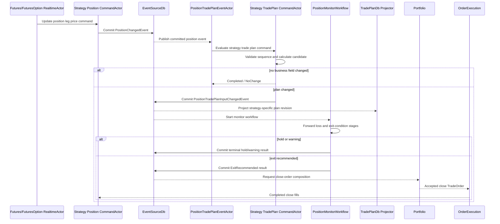

# Strategy Position Trade Plan and Monitoring System Design

**Document type:** System-wide domain and runtime design
**Status:** Implemented backend design; legacy UI migration and live soak remain release gates
**Version:** 1.0
**Created:** 2026-09-13
**Applies to:** Futures, Futures Options, strategy positions, trade plans, position monitoring, exit decisions, actor messaging, projections, and TradePlanDb storage

## 1. Purpose

This document defines the replacement for the legacy option trade-plan algorithm and the generic `Domain.Trade.Plan` implementation. The replacement is centered on the live `StrategyPositionSnapshot`, uses the complete `TradeEntityId` ownership identity, supports every position strategy through a common lifecycle, and keeps each strategy's calculations and persisted schema explicit.

The first supported strategies are:

- futures iron condor;
- futures option vertical spread; and
- futures outright.

Every accepted position update is evaluated in position-sequence order. A strategy-specific trade plan is produced when any persisted business field changes. A changed plan starts a durable position-monitor workflow that calculates forward loss, evaluates exit conditions, and records the resulting action. An exit decision requests a closing order through the Portfolio and OrderExecution lifecycle; it does not mark the position closed before broker fills establish that outcome.

The design also creates a dedicated `TradePlanDbContext`. Trade-plan tables are derived monitoring and decision-history projections. The position event stream remains the durable source of position truth, and the Portfolio remains the financial book of record.

## 2. Design decisions

The following decisions are normative:

1. `StrategyPositionSnapshot` is the authoritative input for plan evaluation.
2. `TradeEntityId` and `StrategyPositionId` identify every plan. Legacy two-part `OrderId`/`TradeId` identities are not used by new code.
3. Iron-condor logic moves to `Domain.Trade/Futures/Option/Position/Algorithm/IronCondor`.
4. Vertical-spread logic resides under `Domain.Trade/Futures/Option/Position/Algorithm/VerticalSpread`.
5. Futures-outright logic resides under `Domain.Trade/Futures/Position/Algorithm`.
6. Strategy-neutral contracts and workflow contracts reside in `Domain.Trade.Shared`.
7. Each concrete actor message has one dedicated extension handler class, following `Actor-Implementation-Conventions.md`.
8. Every valid position sequence is evaluated. Duplicate and stale sequences are classified outcomes, not exceptions.
9. The hot evaluation path performs no database read and does not poll.
10. A plan revision is emitted only when a persisted business field changes. Timestamps, event IDs, command IDs, and revision counters are excluded from change comparison.
11. The plan history is append-only. A newer revision does not overwrite an older revision.
12. Projector replay is idempotent because the strategy table primary key contains the position identity and plan revision.
13. TradePlanDb projection failure cannot roll back an already committed position event or plan event. The existing durable event-projector mechanism retries the projection from the committed event; no background database poller is added.
14. Missing inputs are represented explicitly through data-quality status and reason codes. Missing inputs are never silently changed to zero.
15. An exit recommendation never closes a position directly. It requests a Portfolio-owned close order and waits for execution evidence.
16. Strategy thresholds are versioned parameter sets. A plan records the exact parameter-set identity, version, and payload hash used for its evaluation.

## 3. Scope

### 3.1 Included

- Reimplementation of the useful legacy iron-condor rules.
- Common strategy-position trade-plan contracts.
- Iron-condor, vertical-spread, and futures plan models.
- Strategy-specific plan algorithms and command actors.
- A position-monitor workflow modeled after the strategy workflow.
- Forward-loss calculation and exit-condition evaluation.
- TradePlanDb read/write contracts, context, schema management, and projections.
- One strategy-specific history table per supported strategy.
- A summary activity table for cross-strategy monitoring and date-range queries.
- Commands, events, queries, results, enums, error classification, and observability.
- Migration from the legacy option algorithm and `Domain.Trade.Plan`.
- Unit, BDD, integration, verification, recovery, load, and benchmark requirements.

### 3.2 Excluded

- IBKR order translation and broker execution implementation.
- Replacing Portfolio order acceptance rules.
- Changing how raw market ticks are archived.
- Backtesting and reinforcement-learning implementation. The immutable plan history is designed to support both later.
- A final UI implementation. Query contracts and read models required by a future position-monitor UI are included.

## 4. Verified legacy implementation

### 4.1 Legacy option algorithm flow

The legacy option algorithm is under `TomasAI.IFM.Domain.Trade/Option/Algorithm` and supports long and short iron condors.

Its intended flow is:

1. `ExecuteLongIronCondorAlgorithmCommand` or `ExecuteShortIronCondorAlgorithmCommand` enters the option algorithm bounded context.
2. `OptionTradeAlgorithmBoundedContextState` asks `IAlgorithmBuilder` to build the applicable algorithm.
3. `AlgorithmBuilder` constructs a `LongIronCondorAlgorithm` or `ShortIronCondorAlgorithm` from:
   - the legacy `IOptionTradeCollection`;
   - futures EOD data;
   - a legacy futures trade signal;
   - trade and spread-pricer queries;
   - fund queries;
   - TradePlan queries; and
   - mutable Blackboard caches.
4. The builder enriches the plan with loss probability, M-score, trade price, stop-loss state, fund balance, forward delta, and forward-loss-limit status.
5. The command handler checks named rules in a hard-coded priority order and selects the first match.
6. The selected rule mutates the plan's action, severity, reason, and trailing-stop state.
7. The bounded-context state emits a long- or short-iron-condor algorithm event only when it believes the plan changed.

The useful business intent in the legacy rules includes:

- raising a trailing stop as profit increases;
- exiting when a trailing stop is crossed;
- retaining or clearing trailing-stop state;
- classifying profit and loss positions;
- warning or exiting on forward-loss thresholds;
- warning or exiting on market-direction reversal;
- exiting on maximum loss;
- recognizing daily profit targets; and
- detecting asymmetric short-gamma risk.

### 4.2 Legacy generic Trade Plan flow

`TomasAI.IFM.Domain.Trade/Plan` is a second, separate implementation:

1. `TradePlanCommandActor` accepts `UpdateTradePlanCommand`.
2. Its handler writes `TradePlanReadModel` directly to the Scylla-backed `TradeDbContext`.
3. After the write, it publishes `TradePlanUpdatedEvent`.
4. `TradePlanQueryActor` reads generic plan rows, forward-loss ratios, forward-loss limits, stop-loss values, and forward delta.
5. A separate forward-loss-limit bounded context manages limit state.

The current `trade_plan` table mixes identity, position valuation, market conditions, signals, strategy-specific option metrics, and action results into one wide generic schema keyed only by legacy order/trade/date/sequence values.

### 4.3 Legacy defects and migration risks

The replacement must not reproduce these behaviors:

| Finding | Consequence |
| --- | --- |
| `HasTradePlanChanged` compares only `AssetPrice` | PnL, risk, action, gamma, signal, stop, and forward-loss changes can be lost. |
| Rule engines register rules that command handlers never request | Market-reversal and gamma rules can be unreachable even though they appear configured. |
| Many builder operations catch every exception and return zero/default | Operational failure is indistinguishable from valid zero-valued risk. |
| `OptionTrades` is ignored by MessagePack in `UpdateIronCondorTradePlanCommand` | A serialized command cannot carry its declared required input. |
| `ExecuteAlgorithm` throws `NotImplementedException` in both plan subclasses | The object API advertises behavior it cannot execute. |
| `OptionTradeAlgorithmBoundedContextState.Apply` catches and discards exceptions | Corrupt or incompatible state can be hidden. |
| `TradePlanId` is generated on object construction | Rebuilding the same logical plan creates unstable identity. |
| `ActionDate` uses local `DateTime.Now` | Ordering and replay are timezone-dependent. |
| Legacy models use only `OrderId` and `TradeId` | Portfolio and Fund ownership can be ambiguous. |
| The algorithm queries several services for every build | The hot path incurs network/database latency and can combine inputs from different points in time. |
| Blackboard objects contain decision state | Recovery correctness depends on non-durable, process-local state. |
| The generic command writes the projection before publishing the event | Database state and event state can diverge on partial failure. |
| One generic schema contains iron-condor-only columns | Futures and vertical-spread semantics are unclear and sparse. |

## 5. Target domain model

### 5.1 Ownership boundaries

| Component | Owns | Does not own |
| --- | --- | --- |
| Strategy position actor | Current leg prices, basis, PnL, position sequence, open/closed phase | Exit policy, Portfolio acceptance, broker execution |
| Strategy trade-plan actor | Strategy calculation state, last evaluated position sequence, current plan revision, change detection | Raw tick routing, broker state |
| Position-monitor workflow | Forward-loss result, exit-condition evaluation, workflow status, final recommendation | Financial booking or direct position closure |
| Portfolio | Whether a close proposal is accepted for its Fund and creation of close TradeOrder identity | Market tick handling |
| OrderExecution | Submission/fill evidence and completed close execution | Exit-policy selection |
| TradePlanDb | Queryable plan and workflow projections | Authoritative position or Portfolio financial state |
| EventSourceDbContext | Durable command/event history and actor recovery | Strategy-specific query layout |

### 5.2 Identity

New contracts use these identities:

```text
TradeEntityId
  PortfolioId
  FundId
  OrderId
  TradeId

StrategyPositionId
  existing stable position identifier associated with TradeEntityId

PositionTradePlanId
  TradeEntityId
  StrategyPositionId

PositionTradePlanRevisionId
  PositionTradePlanId
  PlanRevision

PositionMonitorWorkflowId
  PositionTradePlanRevisionId
```

`PositionTradePlanId` is stable for the life of the position. `PlanRevision` begins at one and increases only when a plan business field changes. It is not increased for a duplicate position event, a retry, or a projection replay.

### 5.3 Common enums

The following enums belong in `TomasAI.IFM.Domain.Trade.Shared/Position/TradePlan`:

```text
PositionTradePlanStatus
  PendingEvaluation
  Active
  Degraded
  Warning
  ExitRecommended
  ExitRequested
  Closing
  Closed
  Failed

PositionTradePlanAction
  Hold
  Warn
  TightenTrailingStop
  ClearTrailingStop
  HedgeRecommended
  ExitAtMid
  ExitAtMarket
  NoAction

PositionTradePlanSeverity
  Information
  Warning
  Critical
  Emergency

PositionPlanDataQuality
  Complete
  Degraded
  WaitingForMarketData
  StaleMarketData
  MissingReferenceData
  InvalidPosition

PositionExitConditionType
  None
  Manual
  MaximumLoss
  DailyProfitTarget
  MinimumProfitTarget
  TrailingStop
  ForwardLossWarning
  ForwardLossLimit
  Expiry
  MarketDirectionReversal
  VolatilityChange
  GammaRisk
  DeltaRisk
  DataStale
  PortfolioEmergency

PositionMonitorWorkflowStatus
  Pending
  Processing
  Hold
  ExitRecommended
  ExitDispatched
  NoAction
  Failed
  Superseded

PositionPlanChangeField
  PositionPhase
  PositionValue
  Pnl
  LegPrice
  MarketObservation
  ForwardLoss
  LossProbability
  RiskClassification
  ProfitTarget
  LossLimit
  TrailingStop
  ExitCondition
  Action
  DataQuality
  ParameterVersion
```

Existing `TradeStrategyKind` remains the strategy discriminator. Existing legacy `ActionType`, `ActionSubType`, and `ActionState` may be mapped during migration, but new position monitoring must use the narrower enums above so that order-entry actions and position-monitor decisions are not mixed.

### 5.4 Common plan snapshot

`PositionTradePlanSnapshot` is the common immutable contract contained by every strategy plan:

| Field group | Required fields |
| --- | --- |
| Schema | `SchemaVersion`, `CalculationVersion` |
| Identity | `PositionTradePlanId`, `PlanRevision`, `TradeStrategyKind` |
| Causality | `PositionSequence`, `RouteGeneration`, `SourceEventId`, `SourceCommandId`, `TriggerTradeLegId`, `TriggerContractId`, `TriggerSourceSequence` |
| Time | `ValueDate`, `PositionAsOfUtc`, `TriggerTickAtUtc`, `EvaluatedAtUtc` |
| Position | `PositionPhase`, `IsOpen`, `MarketValue`, `UnrealizedPnl`, `RealizedPnl`, `TotalPnl` |
| Trade | `EstablishedAtUtc`, `OpeningValue`, `OpeningCommission`, `EvidenceRevision`, `ExecutionAttemptId`, `SourceComponentId` |
| Limits | `MaximumProfit`, `MaximumLoss`, `MinimumProfitTarget`, `DailyProfitTarget`, `StopLossAmount`, `TrailingStopLevel` |
| Forward risk | `ForwardLossAmount`, `ForwardLossRatio`, `LossProbability`, `MScore`, `RiskClassification` |
| Decision | `Status`, `Action`, `Severity`, `ExitCondition`, `ReasonCode`, `ReasonDetail` |
| Data quality | `DataQuality`, `DataQualityReasons`, `MarketDataAgeMilliseconds` |
| Configuration | `ParameterSetId`, `ParameterSetVersion`, `ParameterPayloadSha256` |
| Change | `ChangedFields`, `BusinessPayloadHash` |

Transport and persistence timestamps are not business-change fields. All other persisted fields participate in change detection.

### 5.5 Trigger tick metadata

The existing `PositionChangedEvent` contains the whole resulting position state but does not explicitly identify the tick that caused the new state. New position-changed event versions must also carry:

- triggering `TradeLegId`;
- broker-agnostic `ContractId`;
- price;
- source sequence;
- route generation; and
- tick occurrence UTC.

Open, correction, EOD, and close transitions set an explicit trigger kind and may omit market-tick fields. This makes plan rows auditable without inferring the trigger from the largest sequence among all legs.

## 6. Strategy-specific plans

### 6.1 IronCondorTradePlan

`IronCondorTradePlan` is the first implementation and replaces both legacy long- and short-iron-condor plan subclasses. Credit/debit direction is data, not a separate algorithm class.

It contains the common snapshot plus:

- strategy direction: credit, debit, long-volatility, or short-volatility;
- underlying contract and current underlying price;
- expiry and days to expiry;
- long put, short put, short call, and long call leg identities;
- contract ID, strike, signed quantity, opening price, current price, market value, and PnL for each leg;
- put-wing width and call-wing width;
- opening net debit/credit and current net debit/credit;
- lower and upper break-even prices;
- maximum profit and maximum loss;
- put and call OTM probabilities;
- short-put and short-call delta and gamma;
- aggregate delta, gamma, theta, and vega when available;
- gamma-risk classification;
- forward price and forward delta;
- current trailing-stop percentage and amount; and
- market trend, direction, volatility, RSI, RSI slope, TDI, and TDI strength when supplied by the assigned parameter set.

The algorithm validates exactly four distinct option legs and resolves their roles from put/call, strike ordering, and signed quantity. An invalid or ambiguous role mapping produces `InvalidPosition`; it does not guess.

### 6.2 VerticalSpreadTradePlan

`VerticalSpreadTradePlan` contains the common snapshot plus:

- option type: put or call;
- spread direction: debit or credit;
- expiry and days to expiry;
- long and short leg identities;
- contract ID, strike, signed quantity, opening price, current price, market value, and PnL for both legs;
- spread width;
- opening and current net debit/credit;
- break-even price;
- maximum profit and maximum loss;
- long- and short-leg delta/gamma;
- aggregate delta, gamma, theta, and vega when available;
- underlying contract and price;
- OTM probability for the threatened short leg;
- forward price and forward loss; and
- applicable market observations and signal values.

The algorithm validates exactly two compatible option legs with the same underlying, expiry, and option type.

### 6.3 FuturesTradePlan

`FuturesTradePlan` contains the common snapshot plus:

- futures contract ID;
- expiry;
- signed quantity and long/short direction;
- contract multiplier;
- tick size and tick value;
- opening price, current price, and price change;
- opening notional and current notional;
- initial, maintenance, and current margin when available;
- per-contract and total PnL;
- profit target, stop price, and trailing-stop price;
- forward price and forward loss;
- market direction, volatility, trend, RSI, RSI slope, TDI, and TDI strength; and
- roll proximity and expiry condition.

The algorithm validates one futures leg. Futures pricing metadata comes from reference/configuration state prepared outside the hot handler and supplied in the evaluation input.

## 7. Algorithm contract and rule execution

### 7.1 Common calculation contract

Each strategy implements a calculation model with the equivalent contract:

```text
IPositionTradePlanAlgorithm<TPlan>
  Evaluate(previousPlan, positionUpdate, preparedInputs, parameters)
    -> PositionTradePlanEvaluation<TPlan>
```

The calculation model is a domain model, not an actor, database context, or service locator. It receives one coherent input object and returns one deterministic result. It performs no database, NATS, Blackboard, clock, or logging calls.

`PositionTradePlanEvaluation<TPlan>` contains:

- candidate plan;
- changed/not-changed outcome;
- changed-field flags;
- matched rule code;
- all evaluated rule outcomes for diagnostics;
- data-quality result; and
- classified failure when evaluation cannot proceed.

### 7.2 Rule priority

Rules are declared in an ordered immutable array. The array order is the executable priority order. There is no separate dictionary plus hard-coded handler switch.

Each rule contains:

- stable rule code;
- priority;
- applicable strategy and direction;
- required inputs;
- predicate;
- resulting action;
- severity;
- reason template; and
- whether evaluation should continue after a match.

Emergency exit rules run before warnings and hold rules. The proposed common priority bands are:

| Priority | Rule family |
| ---: | --- |
| 0-99 | Invalid position, stale critical price, manual or Portfolio emergency |
| 100-199 | Maximum loss, expiry, hard forward-loss limit |
| 200-299 | Trailing-stop exit, severe gamma/delta risk |
| 300-399 | Daily/minimum profit exit policy |
| 400-499 | Market reversal and volatility exit policy |
| 500-599 | Forward-loss and Greek warnings |
| 600-699 | Raise or clear trailing stop |
| 900 | Hold/no action |

Every registered rule is evaluated or explicitly short-circuited by an earlier terminal rule. Tests must fail if a configured rule is unreachable.

### 7.3 Parameter sets

Hard-coded legacy values such as 20% initial trailing stop, 5% trailing increments, gamma difference thresholds, maximum loss, profit targets, signal requirements, and staleness limits move to Reference Data parameter sets.

Assignments use:

```text
Parameter family: PositionTradePlan
Operator: IronCondor | VerticalSpread | Futures
Strategy direction: optional discriminator
Horizon: strategy monitoring horizon
```

The command actor resolves an assignment only on position open or parameter-version change and retains the immutable resolved payload in resident actor state. Tick evaluation does not query Reference Data.

## 8. Actor architecture

### 8.1 Actor inventory

| Actor | Type | Mailbox identity | Responsibility |
| --- | --- | --- | --- |
| `PositionTradePlanEventActor` | EventActor | `StrategyPositionId` | Receives committed position changes and routes strategy-specific evaluation commands. |
| `IronCondorTradePlanCommandActor` | CommandActor | `StrategyPositionId` | Maintains iron-condor plan state and evaluates ordered iron-condor rules. |
| `VerticalSpreadTradePlanCommandActor` | CommandActor | `StrategyPositionId` | Maintains vertical-spread plan state and evaluates ordered spread rules. |
| `FuturesTradePlanCommandActor` | CommandActor | `StrategyPositionId` | Maintains futures plan state and evaluates ordered futures rules. |
| `PositionMonitorWorkflowCommandActor` | CommandActor | `PositionTradePlanRevisionId` | Owns the durable stage state and terminal workflow result. |
| `PositionMonitorWorkflowRealtimeActor` | RealtimeActor | workflow ID | Dispatches the next pipeline stage from committed workflow events. |
| `ForwardLossCalculationFunctionActor` | FunctionActor | workflow ID | Calculates forward loss and probability from a supplied immutable input. |
| `PositionExitConditionFunctionActor` | FunctionActor | workflow ID | Evaluates strategy-specific exit conditions and returns a typed decision. |
| `PositionTradePlanQueryActor` | QueryActor | query identity | Reads TradePlanDb current/history/activity projections. |

The EventActor and RealtimeActor contain only parse maps, receive maps, lifecycle behavior, and dispatch. Each message maps to one dedicated extension-handler class.

### 8.2 Position-update flow



### 8.3 Command actor state

Each strategy plan command state contains:

- actor-thread ID;
- stable plan ID;
- latest accepted position sequence;
- latest route generation;
- latest source sequence per leg;
- current plan revision;
- current immutable plan snapshot;
- active parameter-set identity/version/hash;
- trailing-stop state;
- last workflow revision started; and
- domain events pending commit.

The state is rehydrated from EventSourceDb. It does not rehydrate from TradePlanDb.

### 8.4 Sequence and duplicate rules

For a received evaluation command:

1. `PositionSequence < LastPositionSequence`: return classified `StalePositionUpdate`; emit no event.
2. Equal sequence and equal business payload: return idempotent success; emit no event.
3. Equal sequence and conflicting payload: fail with `PositionSequenceConflict`; include both payload hashes.
4. Greater sequence with invalid route generation: return `StaleRoute`; emit no event.
5. Greater valid sequence: evaluate exactly once in mailbox order.

Expected stale, duplicate, closed-position, and unavailable-optional-input outcomes are logged without throwing exceptions.

### 8.5 Workflow stages

The position-monitor workflow has four durable stages:

1. **Input qualification**
   - validates position/trade identity;
   - validates required legs and current prices;
   - classifies signal and observation freshness;
   - records degraded operation explicitly.
2. **Forward-loss calculation**
   - calculates loss amount and ratio;
   - derives distribution-based loss probability and M-score;
   - records data window, sample count, and calculation version.
3. **Exit-condition evaluation**
   - applies ordered strategy rules;
   - records every matched warning and the winning terminal rule;
   - returns Hold, Warn, HedgeRecommended, ExitAtMid, or ExitAtMarket.
4. **Action dispatch**
   - records the final workflow result first;
   - for exit, requests Portfolio close-order composition using the existing trade ownership;
   - records accepted order IDs or a classified no-order/failed outcome.

Each stage has Processing, Completed, Failed, and TimedOut events. Retry is an explicit supervisor/operator or policy decision keyed by the same workflow ID. No two-second recovery poller is introduced.

### 8.6 Loop prevention

Only `PositionTradePlanInputChangedEvent` can start a monitor workflow. Enrichment, workflow completion, projection completion, warning, exit recommendation, and close-order events cannot start another workflow for the same revision.

`PositionMonitorWorkflowCommandState` records the plan revision and terminal status. A duplicate start for that revision returns its current result. A newer plan revision can supersede a pending older workflow, but an older emergency exit recommendation remains visible and cannot be silently erased.

## 9. Messages

### 9.1 Plan commands

```text
EvaluateIronCondorTradePlanCommand
EvaluateVerticalSpreadTradePlanCommand
EvaluateFuturesTradePlanCommand
RefreshPositionTradePlanParametersCommand
MarkPositionTradePlanClosingCommand
CompletePositionTradePlanCommand
FailPositionTradePlanCommand
```

Every evaluation command contains the full position snapshot, exact trigger metadata, immutable established-trade snapshot or reference, prepared market/risk inputs, and resolved parameter-set payload. It must be independently serializable; no required member may use `[IgnoreMember]`.

### 9.2 Plan events

```text
IronCondorTradePlanInputChangedEvent
VerticalSpreadTradePlanInputChangedEvent
FuturesTradePlanInputChangedEvent
PositionTradePlanNoChangeObservedEvent       (operational only; not event sourced by default)
PositionTradePlanClosingEvent
PositionTradePlanClosedEvent
PositionTradePlanFailedEvent
```

The three input-changed events carry the complete strategy plan revision so the projector never reconstructs business state from other databases.

### 9.3 Workflow commands and events

```text
StartPositionMonitorWorkflowCommand
CompletePositionInputQualificationCommand
CompletePositionForwardLossCommand
CompletePositionExitConditionCommand
CompletePositionMonitorWorkflowCommand
FailPositionMonitorWorkflowCommand
TimeoutPositionMonitorWorkflowCommand
SupersedePositionMonitorWorkflowCommand

PositionMonitorWorkflowStartedEvent
PositionInputQualificationCompletedEvent
PositionForwardLossCompletedEvent
PositionExitConditionCompletedEvent
PositionMonitorWorkflowCompletedEvent
PositionMonitorWorkflowFailedEvent
PositionMonitorWorkflowTimedOutEvent
PositionMonitorWorkflowSupersededEvent
PositionExitRecommendedEvent
PositionCloseOrdersRequestedEvent
```

### 9.4 Queries

```text
GetCurrentIronCondorTradePlanQuery
GetIronCondorTradePlanHistoryQuery
GetCurrentVerticalSpreadTradePlanQuery
GetVerticalSpreadTradePlanHistoryQuery
GetCurrentFuturesTradePlanQuery
GetFuturesTradePlanHistoryQuery
GetPositionMonitorWorkflowQuery
GetPositionMonitorWorkflowTimelineQuery
GetPositionTradePlanActivityQuery
```

All identity-specific queries accept the complete `TradeEntityId` and `StrategyPositionId`. History and activity queries require bounded UTC/date ranges and paging.

## 10. TradePlanDbContext

### 10.1 Storage role and provider

TradePlanDb is a ScyllaDB context because the data is derived, append-oriented monitoring history with potentially high write volume. It is not the Portfolio financial book of record and does not participate in Portfolio PostgreSQL transactions.

Decision correctness never depends on TradePlanDb being current. Actors use committed event state and immutable message inputs. TradePlanDb is used for UI queries, operational review, analysis, backtesting, and later learning datasets.

### 10.2 Code layout

```text
TomasAI.IFM.Application.Storage/TradePlanDb/
  ITradePlanDbReadContext.cs
  ITradePlanDbWriteContext.cs
  TradePlanDbContext.cs
  TradePlanDbCql.cs
  Schema/
    TradePlanSchemaDb.cs
    TradePlanSchemaCql.cs
```

Only two public context-interface files are used. `ITradePlanDbContext` may combine the read and write interfaces in the context file if required by the repository framework. All CQL constants reside in `TradePlanDbCql.cs` or schema DDL in `TradePlanSchemaCql.cs`.

`IDbContextFactory` exposes `TradePlanDb` and `TradePlanSchema`. Startup creates the schema through `TradePlanSchemaDb` with additive, versioned migrations.

### 10.3 Physical tables

Required tables:

```text
iron_condor_trade_plan_v1
vertical_spread_trade_plan_v1
futures_trade_plan_v1
position_trade_plan_activity_by_date_v1
position_monitor_workflow_v1
```

The three strategy tables contain immutable revision history. The latest plan is the first row by descending `plan_revision` in the position partition.

### 10.4 Common physical columns

These columns are physically present in all three strategy tables:

| Column | CQL type | Purpose |
| --- | --- | --- |
| `portfolio_id` | `int` | Portfolio ownership |
| `fund_id` | `int` | Fund ownership |
| `order_id` | `int` | Order identity |
| `trade_id` | `int` | Trade identity |
| `position_id` | `uuid` | Strategy position identity |
| `plan_revision` | `bigint` | Immutable plan revision |
| `schema_version` | `smallint` | Payload/schema compatibility |
| `strategy_kind` | `text` | Strategy discriminator |
| `position_sequence` | `bigint` | Source position version |
| `route_generation` | `bigint` | Route version |
| `trigger_source_sequence` | `bigint` | Triggering tick sequence |
| `trigger_trade_leg_id` | `uuid` | Triggering leg |
| `trigger_contract_id` | `text` | Broker-neutral contract |
| `trigger_price` | `decimal` | Triggering price |
| `trigger_tick_at_utc` | `timestamp` | Market occurrence time |
| `source_event_id` | `uuid` | Position event causality |
| `source_command_id` | `uuid` | Position command causality |
| `value_date` | `date` | Trading value date |
| `position_as_of_utc` | `timestamp` | Position effective time |
| `evaluated_at_utc` | `timestamp` | Evaluation time |
| `position_phase` | `text` | Open/MTM/EOD/close/correction |
| `is_open` | `boolean` | Open-position flag |
| `market_value` | `decimal` | Whole-position market value |
| `unrealized_pnl` | `decimal` | Unrealized PnL |
| `realized_pnl` | `decimal` | Realized PnL |
| `total_pnl` | `decimal` | Total PnL |
| `opening_value` | `decimal` | Established trade value |
| `opening_commission` | `decimal` | Original commission |
| `evidence_revision` | `int` | Trade evidence revision |
| `established_at_utc` | `timestamp` | Trade establishment time |
| `execution_attempt_id` | `uuid` | Execution evidence identity |
| `source_component_id` | `uuid` | Accepted order component |
| `maximum_profit` | `decimal` | Strategy max profit |
| `maximum_loss` | `decimal` | Strategy max loss |
| `minimum_profit_target` | `decimal` | Configured target |
| `daily_profit_target` | `decimal` | Daily target |
| `stop_loss_amount` | `decimal` | Current stop amount |
| `trailing_stop_level` | `double` | Current trailing percentage |
| `forward_loss_amount` | `decimal` | Calculated forward loss |
| `forward_loss_ratio` | `double` | Calculated ratio |
| `loss_probability` | `double` | Estimated probability |
| `m_score` | `double` | Robust standardized score |
| `risk_classification` | `text` | Strategy risk class |
| `plan_status` | `text` | Current plan status |
| `plan_action` | `text` | Current action |
| `severity` | `text` | Decision severity |
| `exit_condition` | `text` | Winning exit condition |
| `reason_code` | `text` | Stable reason code |
| `reason_detail` | `text` | Human-readable explanation |
| `data_quality` | `text` | Input completeness/freshness |
| `data_quality_reasons` | `list<text>` | Classified missing/stale inputs |
| `market_data_age_ms` | `bigint` | Freshness evidence |
| `parameter_set_id` | `uuid` | Parameter-set identity |
| `parameter_set_version` | `int` | Immutable version |
| `parameter_payload_sha256` | `text` | Exact configuration evidence |
| `calculation_version` | `text` | Algorithm version |
| `changed_fields` | `set<text>` | Changed business fields |
| `business_payload_hash` | `text` | Idempotency/audit fingerprint |
| `trade_payload` | `blob` | Versioned MessagePack `EstablishedTradeDefinition` |
| `position_payload` | `blob` | Versioned MessagePack `StrategyPositionSnapshot` |
| `plan_payload` | `blob` | Versioned MessagePack concrete plan |

Primary key for every strategy table:

```sql
PRIMARY KEY (
  (portfolio_id, fund_id, order_id, trade_id, position_id),
  plan_revision
)
WITH CLUSTERING ORDER BY (plan_revision DESC)
```

Projection replay writes the same revision key and payload, making it idempotent. A replay that finds the same key with a different business hash is a projection conflict and must fail visibly.

### 10.5 Iron-condor columns

`iron_condor_trade_plan_v1` adds:

```text
strategy_direction, underlying_contract_id, underlying_price,
expiry, days_to_expiry,
long_put_leg_id, long_put_contract_id, long_put_strike, long_put_quantity,
long_put_open_price, long_put_current_price, long_put_market_value, long_put_pnl,
short_put_leg_id, short_put_contract_id, short_put_strike, short_put_quantity,
short_put_open_price, short_put_current_price, short_put_market_value, short_put_pnl,
short_call_leg_id, short_call_contract_id, short_call_strike, short_call_quantity,
short_call_open_price, short_call_current_price, short_call_market_value, short_call_pnl,
long_call_leg_id, long_call_contract_id, long_call_strike, long_call_quantity,
long_call_open_price, long_call_current_price, long_call_market_value, long_call_pnl,
put_wing_width, call_wing_width, opening_net_price, current_net_price,
lower_break_even, upper_break_even,
put_otm_probability, call_otm_probability,
short_put_delta, short_call_delta, short_put_gamma, short_call_gamma,
aggregate_delta, aggregate_gamma, aggregate_theta, aggregate_vega,
gamma_risk, forward_price, forward_delta,
market_trend, market_direction, market_volatility,
rsi, rsi_slope, tdi, tdi_strength
```

IDs use `uuid`, contract IDs use `text`, quantities use `int`, money/prices use `decimal`, probabilities/Greeks/signals use `double`, dates use `date`, and classifications use `text`.

### 10.6 Vertical-spread columns

`vertical_spread_trade_plan_v1` adds:

```text
option_type, spread_direction, underlying_contract_id, underlying_price,
expiry, days_to_expiry,
long_leg_id, long_contract_id, long_strike, long_quantity,
long_open_price, long_current_price, long_market_value, long_pnl,
short_leg_id, short_contract_id, short_strike, short_quantity,
short_open_price, short_current_price, short_market_value, short_pnl,
spread_width, opening_net_price, current_net_price, break_even,
short_leg_otm_probability,
long_delta, short_delta, long_gamma, short_gamma,
aggregate_delta, aggregate_gamma, aggregate_theta, aggregate_vega,
forward_price,
market_trend, market_direction, market_volatility,
rsi, rsi_slope, tdi, tdi_strength
```

### 10.7 Futures columns

`futures_trade_plan_v1` adds:

```text
contract_id, expiry, signed_quantity, position_direction,
contract_multiplier, tick_size, tick_value,
opening_price, current_price, price_change,
opening_notional, current_notional,
initial_margin, maintenance_margin, current_margin,
per_contract_pnl, stop_price, profit_target_price, trailing_stop_price,
forward_price, roll_days_remaining,
market_trend, market_direction, market_volatility,
rsi, rsi_slope, tdi, tdi_strength
```

### 10.8 Activity-by-date table

`position_trade_plan_activity_by_date_v1` provides bounded operational/date queries without cross-partition filtering.

```text
partition_date date,
activity_bucket tinyint,
occurred_at_utc timestamp,
event_id uuid,
portfolio_id int,
fund_id int,
order_id int,
trade_id int,
position_id uuid,
plan_revision bigint,
strategy_kind text,
position_sequence bigint,
plan_status text,
plan_action text,
severity text,
exit_condition text,
reason_code text,
business_payload_hash text
```

Primary key:

```sql
PRIMARY KEY ((partition_date, activity_bucket), occurred_at_utc, event_id)
WITH CLUSTERING ORDER BY (occurred_at_utc DESC, event_id ASC)
```

`activity_bucket` is a stable hash bucket configured at schema creation to prevent a single trading day from becoming one hot partition.

### 10.9 Workflow table

`position_monitor_workflow_v1` stores the query projection for one plan revision:

```text
portfolio_id, fund_id, order_id, trade_id, position_id, plan_revision,
workflow_id, status, current_stage, started_at_utc, completed_at_utc,
failed_at_utc, source_event_id, input_business_hash,
forward_loss_amount, forward_loss_ratio, loss_probability, m_score,
winning_rule_code, action, severity, exit_condition,
close_request_id, accepted_close_order_ids,
failure_code, failure_type, failure_message, failure_detail,
workflow_payload
```

Its partition key is the full position identity and its clustering key is `plan_revision DESC`.

## 11. Change detection and persistence

### 11.1 Definition of change

A plan changed when at least one persisted business field differs from the previous accepted plan. This includes leg price, position value, PnL, market input, risk metric, limit, data quality, action, and parameter version.

These fields do not cause a change by themselves:

- command ID;
- event ID;
- message receipt time;
- evaluation duration;
- projection time;
- plan revision; and
- tracing identifiers.

### 11.2 Comparison algorithm

Each strategy has an explicit `CompareBusinessFields(previous, candidate)` model function. It returns `PositionPlanChangeField` flags and performs typed comparisons. Floating-point values use the parameter-set tolerance defined for that metric; decimal price and money fields use exact normalized decimal comparison.

`BusinessPayloadHash` is calculated from a canonical, versioned serialization of the compared business fields. The hash accelerates duplicate checks and supports audit. It does not replace typed comparison where a hash collision could suppress a decision.

### 11.3 Write ordering

1. The strategy plan actor commits the changed-plan event to EventSourceDb.
2. The committed event becomes eligible for NATS publication.
3. The strategy projector writes the immutable revision to TradePlanDb.
4. The plan-input event starts the position-monitor workflow.

The workflow does not wait for TradePlanDb. It receives the complete plan payload from the committed event.

### 11.4 Projection failure

Projection failure records:

- strategy and full trade identity;
- position and plan revision;
- source event ID;
- table and operation;
- exception type and complete detail; and
- retry/replay status.

The durable event-projector queue retries only the failed event. No timer polls the plan tables. Actor Health exposes queue depth, oldest age, last success, last failure, and replay history.

## 12. Forward-loss design

The legacy M-score calculation uses recent forward-loss ratios, median, and median absolute deviation but silently defaults on errors. The new calculation is explicit and versioned.

`ForwardLossCalculationInput` contains:

- strategy and direction;
- current plan revision;
- current PnL and defined loss denominator;
- time to expiry;
- historical sample values and sample-window metadata;
- minimum sample requirement;
- distribution result when applicable; and
- parameter-set version.

`ForwardLossCalculationResult` contains:

- amount and ratio;
- sample count and window;
- median and median absolute deviation;
- M-score;
- loss probability and threshold evidence;
- data quality and reason codes; and
- calculation version.

Zero denominator, insufficient samples, missing spread distribution, and non-finite calculations are typed outcomes. The workflow may continue in degraded mode according to the assigned parameter set, but the missing value cannot masquerade as a genuine zero-risk result.

## 13. Exit and close-order lifecycle

An exit condition produces `PositionExitRecommendedEvent` with the plan revision, rule evidence, urgency, and preferred execution instruction. It does not call `Close...PositionCommand`.

The Portfolio receives a close-composition request containing:

- the complete `TradeEntityId`;
- strategy position ID;
- current open leg quantities;
- broker-agnostic contract IDs;
- plan and workflow revision;
- exit reason and severity; and
- requested price behavior such as mid or market.

Portfolio either atomically accepts and returns close TradeOrders, returns no order with a reason, or fails. OrderExecution processes accepted orders. Completed fills update the established trade and position. Only that evidence moves the position to Closed and removes realtime routes.

Repeated exit recommendations for the same plan revision are idempotent. A new revision can escalate urgency, but it cannot create a second active close order for the same remaining quantity.

## 14. Data readiness and degraded operation

Position monitoring favors continued visibility and recovery:

- A valid current leg price and coherent position identity are mandatory.
- Optional signals and observations may be unavailable.
- A missing optional input produces a Degraded plan with explicit reasons.
- A stale or missing mandatory price produces WaitingForMarketData or StaleMarketData and prevents unsafe automatic exit pricing.
- A hard Portfolio emergency may still request a market exit under its emergency policy.
- When data resumes, the next position update evaluates normally without manual state reset.

All failures, holds, and degraded results remain visible in the workflow timeline and Actor Health.

## 15. Folder and namespace layout

```text
TomasAI.IFM.Domain.Trade.Shared/
  Position/TradePlan/
    PositionTradePlanId.cs
    PositionTradePlanEnums.cs
    PositionTradePlanContracts.cs
    Commands/
    Events/
    Queries/
    ViewModels/
  Position/Monitor/Workflow/
    Commands/
    Events/
    Pipeline/
    ViewModels/

TomasAI.IFM.Domain.Trade/
  Futures/Option/Position/Algorithm/
    Event/Actor/PositionTradePlanEventActor.cs
    IronCondor/
      Command/Actor/IronCondorTradePlanCommandActor.cs
      Command/Actor/IronCondorTradePlanCommandContext.cs
      Command/State/IronCondorTradePlanCommandState.cs
      Command/State/IronCondorTradePlanStateRepository.cs
      Command/EventProjector/IronCondorTradePlanEventProjector.cs
      Command/EvaluateIronCondorTradePlan.cs
      Model/IronCondorTradePlan.cs
      Model/IronCondorTradePlanAlgorithm.cs
      Model/IronCondorTradePlanRules.cs
    VerticalSpread/
      Command/...
      Model/VerticalSpreadTradePlan.cs
      Model/VerticalSpreadTradePlanAlgorithm.cs
      Model/VerticalSpreadTradePlanRules.cs
  Futures/Position/Algorithm/
    Command/...
    Model/FuturesTradePlan.cs
    Model/FuturesTradePlanAlgorithm.cs
    Model/FuturesTradePlanRules.cs
  Position/Monitor/Workflow/
    Command/Actor/
    Command/State/
    Command/EventProjector/
    Realtime/Actor/
    ForwardLoss/Function/Actor/
    ExitCondition/Function/Actor/
    Query/Actor/

TomasAI.IFM.Application.Storage/
  TradePlanDb/
    ITradePlanDbReadContext.cs
    ITradePlanDbWriteContext.cs
    TradePlanDbContext.cs
    TradePlanDbCql.cs
    Schema/TradePlanSchemaDb.cs
    Schema/TradePlanSchemaCql.cs
```

The exact user-requested iron-condor algorithm root is therefore `Futures/Option/Position/Algorithm/IronCondor`. Futures logic remains under Futures rather than incorrectly nesting futures outright beneath Option.

## 16. Legacy migration

### 16.1 Coexistence

The new system uses new actor names, message verbs, IDs, and tables. Existing `trade_plan` data remains readable during migration. No legacy immutable event definition or historical table is overwritten.

### 16.2 Migration sequence

1. Add shared identities, enums, plan contracts, and MessagePack registrations.
2. Add TradePlanDbContext and additive schema creation.
3. Add causal tick metadata to new versions of position-changed events.
4. Implement the iron-condor plan actor and deterministic model.
5. Implement plan projectors and queries.
6. Implement the position-monitor workflow and forward-loss function.
7. Run iron-condor in shadow mode against live position updates:
   - calculate and persist plans;
   - do not dispatch close orders;
   - compare outcomes with legacy calculations where inputs overlap.
8. Enable iron-condor warning/hold decisions.
9. Enable Portfolio close-order dispatch after explicit operational acceptance.
10. Implement vertical-spread plan calculation and repeat qualification.
11. Implement futures plan calculation and repeat qualification.
12. Migrate UI/API consumers from generic `TradePlanReadModel` to strategy-specific queries.
13. Remove legacy option algorithm commands, bounded context, builders, rules, and tests.
14. Remove generic `Domain.Trade.Plan` command actor and legacy persistence after all consumers are migrated.
15. Retain legacy tables read-only for the configured retention period, then retire through an explicit schema migration.

### 16.3 Legacy rule mapping

| Legacy rule | New rule family |
| --- | --- |
| RaiseTrailingStopLimit | Common trailing-stop rule with strategy parameters |
| TrailingStopLimitReached | Common terminal exit rule |
| InTrailingStop | Common warning state |
| ClearStopLossLimit | Common trailing-state transition |
| MaxLossLimitReached | Common emergency/terminal loss rule |
| DailyProfitTargetExceeded | Configurable profit-exit rule |
| ForwardLossRiskLimitWarning | Forward-loss warning stage |
| ForwardLossRiskLimitReachedWarning | Forward-loss critical warning stage |
| ForwardLossRiskLimitReached | Forward-loss terminal exit rule |
| MarketRevertingToUp/DownTrend | Strategy-direction market-reversal rule |
| High/LowShortGammaRisk | Iron-condor/vertical-spread Greek-risk rule |
| TradeInProfit/LossPosition | Informational fallback, never ahead of terminal rules |

The new priority order corrects the legacy ordering problem in which broad profit/loss matches can make later risk rules unreachable.

## 17. Observability

Source-generated structured logging is used for hot actor paths. Required dimensions include:

- actor name/type/thread ID;
- Portfolio/Fund/Order/Trade IDs;
- strategy position ID;
- strategy kind;
- position sequence;
- plan revision;
- workflow ID and stage;
- source event/command IDs;
- parameter-set ID/version;
- changed-field flags;
- action, severity, exit condition;
- data-quality status;
- evaluation duration; and
- projection duration/replay state.

Metrics include:

```text
position_plan_updates_received_total
position_plan_evaluations_total
position_plan_no_change_total
position_plan_changes_total
position_plan_evaluation_failures_total
position_plan_evaluation_duration_ms
position_plan_mailbox_depth
position_plan_oldest_message_age_ms
position_monitor_workflows_started_total
position_monitor_workflows_completed_total
position_monitor_workflows_failed_total
position_monitor_exit_recommendations_total
position_monitor_close_orders_accepted_total
trade_plan_projection_queue_depth
trade_plan_projection_replays_total
trade_plan_projection_duration_ms
```

Actor Health displays these actors beneath the Trade domain and exposes mailbox activity, waiting messages, inactive threads, durable projector queues, and replay history.

## 18. Error taxonomy

Stable error codes are grouped by boundary:

```text
PTP.INPUT.*       Position/trade/parameter input problems
PTP.SEQUENCE.*    Stale, duplicate, conflicting sequence outcomes
PTP.CALC.*        Strategy calculation failures
PTP.DATA.*        Missing or stale dependent data
PTP.PERSIST.*     Event or projection persistence failures
PMW.STAGE.*       Position-monitor workflow stage failures
PMW.EXIT.*        Exit decision and close-dispatch failures
PMW.TIMEOUT.*     Stage timeout outcomes
```

Failure events and workflow read models include error code, type, message, full detail, failed stage, exception type, source IDs, and UTC time. Expected business outcomes do not throw exceptions.

## 19. Tests and qualification gates

### 19.1 Unit tests

- Identity formatting/parsing and invalid identity rejection.
- Every plan field participates in change detection as specified.
- Metadata-only changes do not create revisions.
- Stale, duplicate, and conflicting position sequences.
- Iron-condor leg-role validation and calculations.
- Vertical-spread leg-role validation and calculations.
- Futures single-leg calculations.
- Exact boundary tests for every rule threshold.
- Rule priority and unreachable-rule detection.
- Trailing-stop raise, hold, clear, and exit transitions.
- Missing/zero denominator and non-finite forward-loss calculations.
- Missing input produces explicit degraded status rather than zero substitution.
- Exit recommendations never invoke direct position closure.

### 19.2 Message and actor tests

- MessagePack round-trip for every command/event/query/result.
- All required command input remains serialized.
- Parse-map and receive-map parity.
- One dedicated extension handler per mapped message.
- Actor names, types, subjects, verbs, and route identities.
- Complete and failure result typing.
- Actor exception containment and complete error detail.

### 19.3 Storage integration tests

- Create all TradePlanDb tables on an empty Scylla schema.
- Append and read latest/history for each strategy.
- Replay the same event without adding a second logical revision.
- Detect same-key/different-hash projection conflict.
- Page bounded history in descending revision order.
- Query activity across buckets and merge in descending UTC order.
- Serialize and restore full trade, position, and strategy plan payloads.
- Projector interruption and durable replay recovery.

### 19.4 Workflow BDD scenarios

- Given an open iron condor and a normal tick, the plan remains Hold.
- Given profit beyond the configured trailing threshold, the stop is tightened.
- Given a trailing-stop breach, an exit is recommended once.
- Given maximum loss, emergency exit outranks a generic loss state.
- Given high gamma risk, the configured warn/exit outcome wins.
- Given missing optional signals, the plan is Degraded and observable.
- Given stale mandatory prices, automatic mid-price exit is withheld.
- Given Portfolio rejection, the position remains open and the reason is recorded.
- Given accepted close orders and fills, the position closes and routing is removed.
- Given duplicate events or workflow starts, no duplicate plan or close order is created.
- Given projector outage, decisions continue and projections catch up through replay.

### 19.5 Verification tests

- No new code references legacy `OptionTradeEntityId` for position plans.
- No strategy algorithm performs database or service calls.
- No hot actor handler polls or performs a TradePlanDb read.
- No broad empty catch exists in plan or workflow code.
- No new plan actor uses the legacy bounded-context pattern.
- All actors follow the system actor conventions.
- Strategy tables expose all required typed columns and versioned payloads.
- Legacy code remains isolated during coexistence and has no new consumers.

### 19.6 Benchmarks and soak tests

BenchmarkDotNet suites measure:

- iron-condor evaluation for one changed leg;
- vertical-spread evaluation;
- futures evaluation;
- unchanged-plan comparison;
- changed-plan serialization;
- MessagePack with configurable LZ4 on/off;
- route-to-position-to-plan in-memory handoff; and
- projector batch writes by strategy.

Report operations/second, mean and P95/P99 latency, allocated bytes/op, Gen0/1/2 collections, payload size, and rows/second.

The qualification soak test replays at least 100,000 ordered updates, includes duplicate and out-of-order updates, exercises four-leg fan-out, interrupts the projector, restores it, and verifies exact final plan revision and history. No test host may remain running after completion.

## 20. Acceptance criteria

The implementation is accepted when:

1. Every supported strategy position update is evaluated in mailbox order.
2. The hot evaluation path performs no database read and no polling.
3. Every business-field change creates exactly one plan revision.
4. Duplicate/replayed input creates no duplicate revision.
5. Iron-condor plan history contains full ownership, trade, position, trigger-tick, risk, and decision evidence.
6. Vertical-spread and futures tables provide equivalent strategy-specific completeness.
7. Forward-loss and exit results identify their data and parameter versions.
8. Missing data is explicit and cannot silently become zero risk.
9. An exit recommendation creates at most one active close request for the remaining position.
10. Position closure occurs only from accepted execution evidence.
11. TradePlanDb can be rebuilt from committed events.
12. Actor Health exposes processing, mailbox, failure, durable queue, and replay state.
13. Required unit, BDD, integration, verification, recovery, benchmark, and soak gates pass.
14. Legacy `Option/Algorithm` and generic `Domain.Trade.Plan` are removed only after all runtime consumers have migrated.

## 21. Resulting lifecycle

```text
Market tick
  -> Futures/FuturesOption realtime route
  -> strategy position command
  -> committed position revision
  -> strategy-specific trade-plan evaluation
  -> changed plan revision
  -> position-monitor workflow
  -> forward-loss calculation
  -> exit-condition evaluation
  -> Hold / Warn / Hedge recommendation / Exit recommendation
  -> Portfolio close-order acceptance
  -> OrderExecution
  -> close fills
  -> established trade and strategy position close
```

This gives all supported position strategies one lifecycle while preserving explicit strategy calculations, storage schemas, and exit policies.
