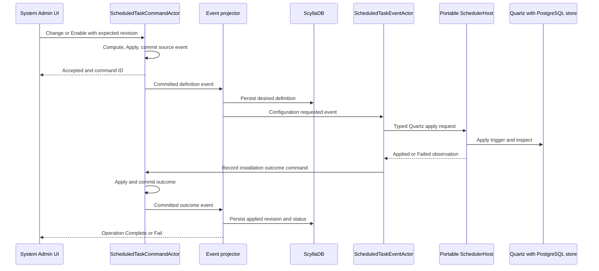

# System Admin Scheduled Tasks Design

**Version:** 1.1  
**Status:** Draft for owner review  
**Date:** 2026-10-07  
**Scope:** System Admin UI, actor ownership, Quartz cron scheduling on Windows and Linux, and futures session open and close
**Accepted engine decision:** Reuse the existing Quartz scheduler

### Operational value-date rollover (owner correction)

The market clock closes the session at 17:00 Eastern but does not advance the operational value date. The close task carries the held date, confirms feed shutdown, and commits every position EOD command. Only then does a committed `PositionsFinalized` run-stage event permit the operational date to advance to the next trading date. Rejection, timeout or partial finalization retains the current date. Persist the completed date in ScyllaDB and restore it before startup; neither 18:00 nor midnight can bypass missing EOD completion. Later maintenance or backup failure does not undo a successfully finalized session. Opening must reject an active-session date different from the held operational date.


## 1 Purpose and proposed design

Add **Scheduled Tasks** to the System Admin function selector beside Backups. Operators choose a deployed scheduled-task project, set its days and time or a specific date, preview the schedule, and enable or disable it. System Admin command actors own definitions and changes. Query actors read persisted ScyllaDB read models. Event actors coordinate Quartz operations and record results through commands.

**Quartz owns recurring triggers on both Windows and Linux.** Reuse `Application.ServerManager.SchedulerHost`, its cron validation/reconciliation, PostgreSQL Quartz store, task catalog, and applicable execution/history code. Run the portable host as a Windows Service, a Linux systemd service, or a foreground development process. Service managers supervise the host process; Quartz computes and fires the scheduled jobs. The UI uses the same Quartz cron dialect on both platforms.

This supersedes the native-trigger proposal in version 1.0 of this document. The separately deferred [Historical Archive design](Databento-Historical-Archive-Scheduled-Task-Design-v1.0.md) retains its own deployment scope until that feature is explicitly aligned; it is not modified by this decision.

The two minimum schedules are FuturesMarketClose at **17:01 Monday through Friday** and FuturesMarketOpen at **18:00 Sunday through Thursday**, in **America/New_York**. Toronto observes the same Eastern session times. Close must stop Databento before sending position EOD commands. The API remains running to process those commands and backups.

This draft defines the proposed UI and implementation. It does not register, activate, or change running schedules.

## 2 Repository findings and proposed changes

| Area | Current implementation | Proposed change |
| --- | --- | --- |
| System Admin UI | `UI.Net.Views/SystemAdmin/SystemAdminForm.cs` maps `BackupDatabases` to its view | Add `ScheduledTasks`, its service, view model, and view |
| Task projects | `Application.ScheduledTask.FuturesMarketOpen`, `FuturesMarketClose`, and `SetClosingPrice` exist | Expose reviewed deployment manifests in the catalog |
| Existing scheduler | `Application.ServerManager.SchedulerHost` uses Quartz, PostgreSQL definitions, a Windows target, and a local dashboard pipe | Reuse the engine/store and move adopted definition ownership to System Admin actors; make the host portable |
| Close schedule | Configuration contains enabled `0 1 17 ? * MON-FRI` | Adopt the existing definition and verify its applied Quartz trigger |
| Open schedule | Configuration contains disabled `0 0 18 ? * SUN-THU` | Import the required Sunday through Thursday 18:00 definition and enable it through the UI |
| Close task | Calls `ShutdownApplicationAsync`, then transport maintenance and backups | Use the ordered close workflow in section 9 |
| Shutdown handler | `Domain.Application/Event/ApplicationShutdown.cs` logs that orchestration is deferred | Do not treat acknowledgement as proof that feeds stopped |
| Position EOD | `StrategyPositionActorStateMachine.UpdateLeg` can turn EOD back into MTM | Seal each ended value date; the next session uses a separate daily MTM row |
| Linux | Existing SchedulerHost targets `net10.0-windows7.0` | Retarget the existing host to portable `net10.0`; isolate process/service/security APIs by platform |

Existing Server Manager documents describe its current PostgreSQL definition authority and pipe control plane. For adopted schedules, actor source events become definition authority; existing PostgreSQL scheduler tables become runtime materializations owned by the Quartz integration. Keep the Quartz trigger identities and run evidence. System Admin and Server Manager must use the same command API rather than remaining independent definition writers.

## 3 Required schedules and timing

Use the existing **Quartz six-field cron dialect**, with an optional seventh year field: `seconds minutes hours day-of-month month day-of-week [year]`. Do not silently interpret POSIX five-field expressions. The same expression and stored time-zone ID are used on both operating systems. See [Quartz cron triggers](https://www.quartz-scheduler.net/documentation/quartz-3.x/tutorial/crontriggers.html).

| Task key | Project | Days | Eastern time | Quartz cron |
| --- | --- | --- | --- | --- |
| `futures-market-close` | `TomasAI.IFM.Application.ScheduledTask.FuturesMarketClose` | Monday through Friday | 17:01 | `0 1 17 ? * MON-FRI` |
| `futures-market-open` | `TomasAI.IFM.Application.ScheduledTask.FuturesMarketOpen` | Sunday through Thursday | 18:00 | `0 0 18 ? * SUN-THU` |

- Store canonical IANA zone `America/New_York` and resolve it on each platform. Explicitly assign the resolved zone to the CronTrigger. Host local time can differ from the schedule zone.
- Use the Quartz TimeZoneConverter integration, or one equivalent shared resolver, for Windows/IANA mapping and persisted trigger reload. Do not rely on an OS-specific zone lookup in only one code path. See [Quartz TimeZoneConverter integration](https://www.quartz-scheduler.net/documentation/quartz-3.x/packages/timezoneconverter-integration.html).
- Record intended firing instant in UTC, local date/time, zone, and resolved value date on each run.
- Support weekly recurrence and a one-time local date/time, with optional start/end bounds. One-time jobs use a Quartz one-shot trigger rather than a fabricated recurring expression.
- Weekly controls generate Quartz cron. Advanced editing validates against the pinned installed Quartz version, including the correct day-of-month/day-of-week `?` rules. Unsupported expressions fail with a readable explanation.
- Reuse `ScheduleValidationService`, `CronExpression`, and `QuartzScheduleReconciler.BuildTrigger`; preview ten actual trigger occurrences with local and UTC times. Preview, application, and restart reconstruction share the same resolver and expression parser.
- At 17:01 resolve the **ended session's value date**. An active-value-date query may return no session then; the UTC calendar date is not the value-date authority.
- At 18:00 resolve the new session. Sunday evening normally belongs to Monday's value date.
- Consult the exchange calendar before acting. Normal weekly schedules do not encode holidays or early closes. Show calendar skips; provide a dated override for early-close timing.

Set market lifecycle CronTriggers explicitly to `WithMisfireHandlingInstructionDoNothing()`. Missed sessions are not run on restart. Proposed ordinary dispatch tolerance is **60 seconds** from Quartz's `ScheduledFireTimeUtc`; record later dispatches as Missed. Explicit Run Now evaluates the current session instead of replaying a stale occurrence. The tolerance remains a review choice and is separate from Quartz's misfire-detection threshold.

Use the existing Quartz 3.19.1 package baseline for this work. No engine major-version upgrade is required by this design.

## 4 System Admin UI

Add reference lookup short code `ScheduledTasks`, caption **Scheduled Tasks**, and map it to `ScheduledTasksView` in `SystemAdminForm`. Use the existing async service/view-model boundary and dark trading styles. End labels with a colon.

### Task list and editor

```text
System Admin Function: [Scheduled Tasks]

Task / Schedule         Desired enabled   Quartz status   Next run ET   Last result
Futures Market Close    Yes               Applied         ...           ...
Futures Market Open     Yes               Applied         ...           ...

Task:          [Futures Market Close v...]
Schedule Name: [Futures Market Close]
Environment:   [Development]             Host: [Local workstation]
Schedule Type: [Weekly / One Time]
Days:          [Mon] [Tue] [Wed] [Thu] [Fri] [Sat] [Sun]
Time:          [17:01]                    Time Zone: [America/New_York]
Date:          [one-time date]            Start Date: [...] End Date: [...]
Cron:          [0 1 17 ? * MON-FRI]          [Advanced]
Enabled:       [ ]                        Maximum Runtime: [...]

Next Runs:     [local time / UTC preview]
Status:        [desired revision / applied revision / reason]

[Add Task] [Save] [Enable] [Disable] [Run Now] [Refresh]

Run History | Run Details | Logs
```

**Add Task** selects an entry from the deployed catalog and creates a schedule. It does not browse arbitrary project or executable files. A new project becomes available after its reviewed manifest and platform artifact are deployed and its catalog registration is projected.

Saving preserves existing requested enablement; new definitions start disabled. Separate Enable and Disable commands make intent visible. After Quartz trigger verification, the user enables the two required schedules from this screen. Broker-account qualification evidence is unrelated to schedule activation.

Show desired enablement separately from applied Quartz enablement. Save/Enable/Disable remain Pending until the host confirms the requested revision. Show registration failure, missing deployment, unsupported task platform, host offline, and revision conflicts beside the task. A command acknowledgement alone cannot produce Applied status.

Run history displays intended/actual start, finish, value date, stage, duration, result, and error. Selection loads bounded details/logs. Notifications refresh persisted read models; reconnect reloads the dashboard.

### Interaction rules

- Prevent duplicate UI operations while a request runs; keep Refresh available.
- Saves include the expected definition revision. Concurrent edits produce a visible conflict.
- Disable prevents new runs and does not cancel an active close or backup.
- Run Now uses the same catalog and actor admission path with an operator reason and explicit session/value-date semantics.
- Show deployment/dependency capabilities before activation.
- Closing this view removes listeners and cancels UI reads; it does not disable schedules or stop domain work.

## 5 Actor ownership and layout

Place the feature under `TomasAI.IFM.Domain.SystemAdmin/ScheduledTask`, with contracts in the mirrored `TomasAI.IFM.Domain.SystemAdmin.Shared/ScheduledTask` hierarchy.

| Actor | Responsibility |
| --- | --- |
| `ScheduledTaskCommandActor` | Own one definition, its desired/applied revisions, enablement, and installation outcomes |
| `ScheduledTaskCatalogCommandActor` | Own approved project manifests and target-host capabilities |
| `ScheduledTaskRunCommandActor` | Own one occurrence and its admitted, running, terminal, or uncertain result |
| `ScheduledTaskQueryActor` | Read catalog, definitions, dashboard, run history/details, and host health from ScyllaDB |
| `ScheduledTaskEventActor` | Coordinate installation/run requests and translate observations into concrete Record commands |
| `FuturesMarketCloseWorkflowCommandActor` | Own the dated close workflow and ordered stage decisions |
| `FuturesMarketCloseWorkflowEventActor` | Send feed-stop, position-EOD, and maintenance commands and process their outcomes |

Use the conventional `Command/Actor`, `Command/State`, `Command/Model`, `Command/EventProjector`, `Query/Actor`, and `Event/Actor` layout. Quartz integration services apply triggers and launch catalog tasks; they do not own authoritative definition state. Platform-specific process supervision stays outside command computation.

Follow [Actor Implementation Conventions](Actor-Implementation-Conventions.md), [Actor Event Modeling Conventions](Actor-Event-Modeling-Conventions.md), and [Actor Message Types and Delivery Conventions](Actor-Message-Types-and-Delivery-Conventions.md).

Handlers compute immutable business-named changes. Put failure guards first in a switch expression, using `command.UpdateFailed(ref errorMsg, reason)`; the default arm is the single `state.Update(command.Create...Event(change), command)` call. Event factories explicitly set `CommandId = command.CommandId`. State's event switch owns authoritative mutations. Add XML documentation to all extension-handler methods.

Use payload names such as `ScheduledTaskDefinition`, `ScheduledTaskScheduleChange`, `ScheduledTaskInstallation`, and `ScheduledTaskRun`, rather than generic `State`, `Data`, or `Model`. Preserve permanent MessagePack keys and stable actor routes. Each mapped concrete message has its own extension handler.

## 6 Commands queries and events

### Concrete commands

| Owner | Commands |
| --- | --- |
| Catalog | `RegisterScheduledTaskProjectCommand`, `RecordScheduledTaskHostCapabilityCommand` |
| Definition | `CreateScheduledTaskCommand`, `ChangeScheduledTaskScheduleCommand`, `EnableScheduledTaskCommand`, `DisableScheduledTaskCommand`, `RemoveScheduledTaskCommand`, `AdmitScheduledTaskRunCommand` |
| Installation results | `RecordScheduledTaskInstallationCommand`, `RecordScheduledTaskInstallationFailureCommand` |
| Run | `RequestScheduledTaskRunCommand`, `RecordScheduledTaskRunAdmissionCommand`, `RecordScheduledTaskRunStartedCommand`, `CompleteScheduledTaskRunCommand`, `FailScheduledTaskRunCommand`, `RecordScheduledTaskRunUncertainCommand` |
| Close workflow | `RequestFuturesMarketCloseCommand` and concrete commands recording feed-stop, position-EOD, and maintenance outcomes |

Definition requests carry ID, task key, target host/environment, normalized timing, zone, expected revision, operator, and reason. Registration/run observations retain `OperationCommandId` for the initiating UI request; a Record command has its own `CommandId`, which its created source event preserves. Do not overwrite that event identity with the earlier operation ID. Quartz apply requests carry definition revision, operation command ID, host, and bounded deadline. Run requests carry intended time and trigger source; scheduled and manual requests remain distinguishable.

Removing a definition requires it to be disabled and preserves run/audit history. Catalog registration records deployment identity; normal UI operations cannot register arbitrary code.

### Queries

- `GetScheduledTaskCatalogQuery`
- `GetScheduledTasksDashboardQuery`
- `GetScheduledTaskQuery`
- `PreviewScheduledTaskScheduleQuery`
- `GetScheduledTaskRunQuery`
- `ListScheduledTaskRunsQuery`
- `GetScheduledTaskHostHealthQuery`

Preview reads the persisted catalog/capabilities and computes proposed occurrences without mutation. Query actors do not read CommandActor state, Quartz runtime APIs, or a singleton in-memory read store.

### Configuration lifecycle

Every configuration operation has a private committed source event and matching public Complete/Fail contracts. Projection completion and Quartz-operation completion have distinct meanings.



SchedulerHost control uses existing typed actor messaging for trigger application and task lifecycle observations. This feature adds no private API-to-worker control pipe. Existing Windows dashboard compatibility access is isolated and cannot remain an independent writer for adopted definitions.

## 7 Persistence and authority

PostgreSQL source streams persist authoritative catalog, definition, run, and close-workflow decisions. ScyllaDB projections serve queries and the UI.

| Proposed table | Key and purpose |
| --- | --- |
| `scheduled_task_catalog` | Host/environment and task key; deployed projects/capabilities |
| `scheduled_tasks_by_environment` | Environment/host and schedule ID; bounded list |
| `scheduled_task_definition` | Schedule ID; desired/applied revisions and timing |
| `scheduled_task_runs_by_schedule` | Schedule ID/month bucket; paged recent runs |
| `scheduled_task_run` | Run ID; stages, timestamps, exit code, outcome |
| `scheduled_task_host_health` | Host ID; backend, last observation, availability, drift |

Definitions include cron dialect/expression or one-time timestamp, zone, optional date bounds, requested enablement, runtime limit, manifest version, target, and audit metadata. Installation records include verified Quartz revision, job/trigger identity, and definition fingerprint. Existing `ifm_quartz.qrtz_*` tables remain the durable engine store, not a second domain authority. Runtime `ifm_scheduler` rows materialize committed settings and execution observations under one integration writer; they do not accept independent UI CRUD. Scylla remains the QueryActor read boundary.

Configuration projection and installation delivery are durable and revision-fenced. Repeat installation converges on the same definition. Serialize Quartz updates per schedule and reject old revisions so a delayed apply cannot overwrite newer settings. Administrative recovery does not change the drop-on-failure policy for realtime Iron Condor plan snapshots.

Show stale/Pending observations during read-model failures instead of answering from command memory. Run admission and duplicate handling use authoritative command state; UI read-model lag cannot authorize another occurrence.

## 8 Portable Quartz SchedulerHost

### Engine and control boundary

Reuse `TomasAI.IFM.Application.ServerManager.SchedulerHost` as the execution host. It owns one Quartz scheduler, its PostgreSQL engine store, trigger reconciliation, dependency probes, and catalog task execution. Add a typed actor messaging endpoint for committed definition apply requests and run observations. A proposed `IQuartzScheduledTaskRuntime` capability wraps the existing validation/reconciliation APIs; domain handlers do not depend on Quartz or perform engine calls inside `Compute`.

`IScheduler` provides the apply, pause, resume, reschedule, inspect, and remove operations. Apply each complete committed definition idempotently using the existing stable job/trigger keys and its revision. Complete/Fail feedback goes through Record commands and projection to Scylla. Pause/remove must be verified through the engine; receiving an apply request is not completion.

The existing custom `SchedulerBootstrapService` and `SchedulerRuntimeService` retain their migration, standby, reconciliation, and startup ordering. Do not register a second hosted Quartz scheduler beside them. Quartz has generic-host integration, but reusing the current lifecycle avoids bypassing its readiness gate. [Quartz hosting documentation](https://www.quartz-scheduler.net/documentation/quartz-3.x/packages/hosted-services-integration.html) describes that general hosting option.

Use one active SchedulerHost per environment/scheduler identity in the initial deployment. Keep its local instance lock and add/verify a PostgreSQL session-held ownership lease so a second host on another machine cannot start the same trigger set. Existing bootstrap migration locking alone does not establish runtime ownership. Loss of the ownership connection puts Quartz in standby. Multi-host Quartz clustering is a separate later deployment choice.

### Platform changes required

| Existing boundary | Windows implementation | Linux implementation |
| --- | --- | --- |
| Target framework | Retarget portable host/core to `net10.0`; isolate Windows APIs | Same `net10.0` core and Linux runtime artifact |
| Host supervision | Windows Service registration selected only on Windows | systemd service or foreground process; Quartz retains all timers |
| Task process ownership | Existing `WindowsJobObject` behind a platform interface | Owned process group/cgroup containment with bounded cancellation and termination |
| Process identity and paths | Windows deployment/run roots and task artifacts | Linux roots, executable permissions, platform artifacts, case-sensitive path validation |
| Host control | Actor messaging for adopted schedules; optional isolated dashboard compatibility | Same actor contracts; no Windows SID/ACL or pipe dependency |
| Environment | Approved Windows-specific environment allowlist | Approved Linux-specific environment allowlist, including required .NET runtime, time-zone and locale configuration |
| Time zones | Shared IANA/Windows resolver and Quartz converter | Same resolver and installed IANA zone data |

`ScheduledProcessRunner` currently constructs `WindowsJobObject` unconditionally. That must change before Linux task execution works. Merely retargeting the project or compiling it on Linux is not sufficient. Reuse the proven process-group approach already present in `Application.MarketData/DataBento/Workers/DatasetWorkerProcessSupervisor.cs` where appropriate, without coupling scheduler task ownership to market-data workers.

Isolate `SchedulerPipeServer` Windows identity/ACL behavior. Port System Admin control through NATS command/query/event contracts; the Windows desktop is a client of whichever host serves its selected environment. The UI itself remains Windows-only, while the scheduler/backend may run on Linux.

Use configured deployment/run/log roots, platform-specific executable manifests, bounded stdout/stderr capture, and explicit runtime limits. Test that stopping/crashing the host does not leave an untracked task process. A terminated task may have uncertain business effects; process containment cannot imply rollback.

### Run admission and execution

Quartz fires the existing `ExternalProcessJob` using stable schedule IDs. Reuse `ScheduledTaskExecutionService`, catalog resolution, dependency checks, and process execution after adding actor-owned admission and outcome reporting. No additional native-trigger runner project is needed.

The job sends `RequestScheduledTaskRunCommand` with schedule ID, applied revision, intended UTC occurrence from `IJobExecutionContext.ScheduledFireTimeUtc`, and trigger source. The run actor sends `AdmitScheduledTaskRunCommand` to the definition owner. Admission validates enabled/applied revision, deployment, host/environment, launch window, session calendar, and conflicting market lifecycle work. The run actor records the response before the host launches the catalog task. Scylla projection lag cannot authorize another run.

Derive occurrence identity from schedule ID plus intended UTC instant. Validate revision separately so changing a definition cannot create a second run for the same occurrence. Manual runs have explicit separate identities. Keep `DisallowConcurrentExecution` and the existing persistent overlap gate as additional execution guards.

Source admission and runtime store writes are not a single database transaction across services. On redelivery/restart, inspect the admitted run and runtime receipt using the same RunId before launching. If a crash occurred after launch but before its receipt, record an uncertain outcome and investigate; never promise exactly-once external effects or blindly relaunch that task.

Task workers observe their defined business completion through notifications and bounded query confirmation before returning success. Engine dispatch, command acceptance, and process exit are separate observations. Record timeout, failure, and uncertain termination through concrete commands; preserve the existing bounded host shutdown and process containment.

### Deployment and qualification

Publish the same scheduling core for Windows and Linux with the existing compatible Quartz 3.19.1 baseline. A Windows Service or Linux systemd **service** keeps SchedulerHost running; neither supplies per-task recurring triggers. Foreground development execution uses the same settings and Quartz store.

The host is independent of the API/UI process lifecycle, as in the current design. Development startup needs an explicit SchedulerHost start/readiness step, while unattended deployment starts its service. Dependency checks must use the actual API readiness endpoint, currently `http://localhost:22543/health/launch-ready` for the local development launch, rather than assuming the old `localhost:5000` template.

Run identical expression/zone/misfire/next-fire tests under Windows and Linux. Test trigger reload from PostgreSQL, alternate host-local time zones, both Eastern DST transitions, delayed dispatch, ownership loss, overlap, and process cleanup. Linux runtime acceptance requires an actual Linux execution environment; a Windows test does not qualify it.

## 9 Futures market close workflow

The task executable requests one dated workflow and observes its result. Required order:

1. **Resolve the ended session.** Capture value date, exchange close boundary, workflow ID, and current feed generation. Mark close requested so subscriptions/recovery cannot undo the stop.
2. **Stop Databento first.** Send `StopMarketDataFeedCommand` through its typed API. Stop all dataset workers and owned option-leg subscriptions, and fence stopped-generation publications. Clear disposable realtime backlog without an unbounded drain. Preserve financial order/execution messages.
3. **Confirm stopped.** Advance only after correlated `MarketDataFeedStoppedCompleteEvent` and matching lifecycle confirmation. Command acceptance or timeout is insufficient. If the watchdog already stopped the session, confirm that idempotently.
4. **Finalize positions.** Enumerate still-open strategy positions in bounded persisted-query pages. Send concrete Iron Condor, Vertical Spread, and Futures EOD commands carrying the ended value date and close boundary. Include positions without a tick that day, retaining their last known mark and its timestamp rather than inventing a new market price. Record source commitment separately from history projection. EOD source commitment seals the date; show the history write as Pending/Failed until its projector completes.
5. **Seal the date.** Persist explicit position value date and latest sealed value date in the command-owned position state and snapshot. Reject later market marks for that value date, including already-delivered ticks. Preserve its final EOD row. The next session creates/updates its own MTM row. The established trade remains Open until an opposite closing trade fills.
6. **Run maintenance.** After EOD source finalization and a bounded check of history projection outcomes, execute configured transport maintenance and submit backups. Mark incomplete history explicitly in the run/backup boundary; do not infer that Scylla history is current. Keep stage outcomes distinct; a backup failure does not reverse EOD.
7. **Report the result.** Persist stage durations/counts and publish terminal run status. Keep the API running. Backup requests remain Submitted until their separate workflows complete.

Use deterministic workflow and per-position EOD identities. Duplicate dated close requests converge on existing results. Bound every stage. If feed containment fails, do not send EOD commands. Partial position failures identify affected IDs; an explicit retry addresses only unfinalized positions without restarting feeds or adding duplicate EOD rows.

The watchdog may stop feeds at exchange closure before 17:01. The scheduled close then confirms stopped state and finalizes that session; it never starts/resets feeds to perform EOD.

Existing transport-purge checks remain intact. Purge is maintenance after finalization, not the mechanism for clearing realtime actor mailboxes, and cannot delete uncompleted financial messages.

## 10 Futures market open workflow

At Sunday through Thursday 18:00 Eastern:

1. Resolve the new session/value date and calendar eligibility.
2. Inspect prior close outcomes and report unresolved EOD source commitments separately from history projection failures. History-only failures must not delay Databento startup. New-session marks cannot mutate old dated rows; unresolved source finalization is a visible position-level fault for operator repair, not an unbounded feed-start wait.
3. Request the existing typed application/session startup workflow, reusing idempotent initialization, rollover, and historical indicator seeding. The API must already be reachable; opening a feed and starting the API process are different operations.
4. Start Databento for the new value date and confirm matching startup-complete/healthy lifecycle generation.
5. Restore monitoring subscriptions only when their owner/lease is still valid and enabled. Do not restore subscriptions for disposed views.
6. Route new-session marks to that date's MTM row while preserving prior EOD history.
7. Persist and publish terminal scheduled-run status.

Extend the existing FuturesMarketOpen worker, which stops after start-command acceptance, to observe actual completion before returning success. Run Now evaluates the current session rather than replaying an old opening.

## 11 Catalog deployment and adoption

Manifests declare task key, project/assembly, display name, version, platform artifacts, digest, structured arguments, dependencies, environment, runtime bound, and completion protocol. Start with the three modern task projects already cataloged. Historical Archive remains unavailable until its deferred executable is deployed.

Deployment registration commands publish catalog entries. Do not accept arbitrary assembly scans or user-entered executable paths. Runtime credentials and service permissions remain deployment configuration.

Adopt existing Quartz definitions rather than replacing the engine:

1. Read current `ifm_scheduler.schedule_definition` rows, including operator-owned settings, existing IDs, cron strings, zone, enablement, and version. Configuration defaults are not proof of the deployed state.
2. Import those definitions through System Admin commands and project the Scylla views. Preserve the six-field expressions and existing stable Quartz job/trigger identities.
3. Cut over definition writes while the scheduler is in bounded standby: disable legacy editing/seeding for adopted definitions and reconcile only the committed actor-owned revision. Resume without creating another trigger owner.
4. Verify trigger revision/zone/enablement and existing run evidence. Enable the required open definition through the new command API; retain verified close settings.
5. Route Server Manager mutations for adopted definitions through the same APIs, or make them read-only. Its old PostgreSQL CRUD must not remain a second writer.
6. Deploy the portable host on the chosen target with the same scheduler identity and runtime ownership policy. Do not run Windows and Linux copies independently against the same unclustered trigger set.

Retain PostgreSQL Quartz schemas and execution history; no table deletion or timer migration is required. Legacy Reference ScheduledJob rows are not automatically adopted as authoritative timing. Deployment defaults may create missing disabled definitions once through commands but cannot overwrite later user edits.

## 12 Logging failures and performance

Follow [Structured Logging Conventions](Structured-Logging-Conventions.md). Instrument selected command/Quartz-apply/run/stage boundaries with component, method, bounded arguments, schedule/task/run/command IDs, environment, host, revision, intended/actual time, value date, stage, duration, and error code. Exclude credentials/full output payloads. Use the existing Serilog and OTel Collector path.

Measure launch lateness, Quartz apply failures/duration, active runs, missed fires, drift, stage duration, feed-stop failures, and position finalization failures. Keep per-run/position IDs in logs rather than creating a metric series for each.

Administrative work stays outside option tick handlers. Use async APIs, bounded paging/log output, and serialized Quartz updates per schedule. Projection/install recovery has bounded retries and visible results. Backend/API failure does not block realtime actor recovery.

Reconciliation reports installed-definition drift through commands and may idempotently restore the latest desired definition. It never starts missed business work as a side effect. Ambiguous run outcomes require inspection.

## 13 Implementation stages and acceptance

| Stage | Deliverable | Verification |
| --- | --- | --- |
| 1 | Reuse existing Quartz host/core with portable service/process/control boundaries | Windows regression plus Linux execution, containment, zone resolution and persistent triggers |
| 2 | Catalog/definition/run actors, source persistence, Scylla projections/queries | Serialization, maps, guards, duplicates, revisions and restart reads |
| 3 | Scheduled Tasks UI/service/view model and lookup | Add/edit, cron/day/time/date preview, enable/disable, listener lifecycle and Pending/Applied/Failed |
| 4 | Ordered close workflow and daily EOD seal | Stop complete precedes EOD; all feeds stop; late marks rejected |
| 5 | Open workflow and next-session MTM | Sunday value date, actual startup completion, seeded values and prior EOD immutable |
| 6 | Adopt existing definitions with one settings writer | IDs/expressions/history preserved; old CRUD/seeding retired for adopted tasks; one active runtime owner |
| 7 | Live development and platform acceptance | Quartz firing, actor results, stored EOD/MTM, UI results and daily activation |

Required scenarios:

- Exact six-field weekly defaults, one-time scheduling, invalid cron, day-of-month/day-of-week validation and preview/application parity.
- Same `America/New_York` next-fire instants on Windows/Linux with different host-local zones, DST transitions and PostgreSQL trigger reload.
- Concurrent editing, disable during firing, old revisions, duplicated occurrences and a paused trigger with no replay of missed sessions.
- Host restart, duplicate-host ownership rejection, ownership-connection loss, missing artifacts, NATS/API/Scylla/PostgreSQL outage and no false Applied/Succeeded.
- Cross-platform task launch, runtime expiry, bounded cancellation, process containment, output capture and no arbitrary executable entry.
- Close with futures and all four Iron Condor feeds active: stop them, confirm stopped, then EOD; inject late ticks and prove the sealed date remains unchanged.
- Duplicate EOD, failed projection and explicit retry without another EOD row or feed restart.
- Next-session MTM/daily PnL with prior EOD preserved. Fill-backed opposite closing remains a separate trading workflow.
- Run Now, launch lateness, overlap, holiday skip and dated early-close override.
- FlaUI for System Admin catalog/editor/enable/disable/run details, connected to the actor APIs.
- Real Windows Quartz close/open cycle and an actual Linux host integration run, with evidence reported separately.

## 14 Owner review summary

**Reuse Quartz on both operating systems.** System Admin actors own task definitions and outcomes, the existing Quartz engine computes/fires jobs and persists its runtime in PostgreSQL, and Scylla read models serve the UI.

Required cron expressions are `0 1 17 ? * MON-FRI` for close and `0 0 18 ? * SUN-THU` for open, both in `America/New_York`. Close confirms Databento is stopped before EOD finalization; prior EOD dates stay immutable.

The engine decision is accepted. Remaining review covers the UI/actor integration and proposed 60-second dispatch tolerance. Platform host changes and Linux runtime qualification are implementation requirements. This revision changes the design only and does not activate schedules.


## Scheduled Tasks Logs and Setup tabs (2026-10-07)

The main Scheduled Tasks control has two tabs in this order: **Logs**, **Setup**. Logs opens by default. Setup retains the existing catalog, schedule editor, preview, enable/disable, Run Now and explicit uncertain-run resolution controls.

### Logs layout and semantics

- Left: one root per persisted task definition, including disabled/removed definitions whose run history remains available. The root displays task name, next scheduled date/time, latest actual start date/time, and status. Times use the task's configured timezone and include the UTC offset; an absent start is shown as absent rather than invented.
- Drill down: task ? year ? month ? day ? occurrence, grouped by the intended scheduled timestamp in that timezone. Each occurrence shows scheduled time, actual start time, and the recorded outcome.
- Status circles: blue = scheduled/requested/admitted; gray = unscheduled/disabled; yellow = running; green = successful run; red = failed/rejected/uncertain. An enabled root shows its latest run outcome, or blue when there is no outcome; a disabled root is gray. Historical occurrence colors preserve their own outcomes even when the definition is disabled.
- Right: read-only standard output from the selected run's retained stdout artifact. The first page loads on selection; **Load more output** continues until the retained end. This is the complete captured stdout, subject to existing capture/retention limits, rather than only the persisted diagnostic tail. Missing/expired artifacts are explicitly identified and the existing tail is shown as a fallback.
- **Load older runs** continues through opaque Scylla paging state; no arbitrary recent-100 cutoff prevents access to retained history. Queries are scoped to environment/host/schedule. Public notifications refresh current outcomes; node expansion and selected occurrence are retained.

### Actor and storage boundaries

`GetScheduledTaskRunHistoryQuery` reads native paged Scylla projections. `GetScheduledTaskOutputQuery` first reads the exact persisted run identity, then reads a bounded UTF-8 page from that run's artifact. The UI supplies identities and byte offsets, never arbitrary filesystem paths. Output pages are at most 64 KiB; UTF-8 characters are not split between pages. Selection changes cancel obsolete reads and prevent stale output from replacing the current run.

The API output reader uses `ScheduledTasks:OutputRoot`, which must point to the owning host's retained TaskRuns directory (local or mounted). Development defaults to the normal workstation TaskRuns directory under the repository. Configure this setting explicitly for a different deployment; remote artifacts require a mounted owning-host directory. Paths escaping the root and symlink/junction traversal are rejected. Full stdout is not copied into financial or scheduled-task source events, and no command-state read shortcuts are introduced.

### Implementation and acceptance

1. Add typed history/output page contracts, query routes, bounded Scylla paging, and retained-output reader registration.
2. Wire service/view-model reads with view-owned cancellation and per-request deadlines.
3. Add Logs/Setup tabs, dated tree, circle legend, stdout paging and preserved Setup functionality.
4. Verify grouping across month/year boundaries, all requested colors, older history continuation, full stdout beyond the diagnostic tail, missing artifacts and UTF-8 boundaries.
5. Rebuild API/UI, exercise real WinForms/FlaUI controls, and deploy through normal development startup. Existing scheduler execution, close/open ordering and source persistence remain unchanged by this UI extension.
