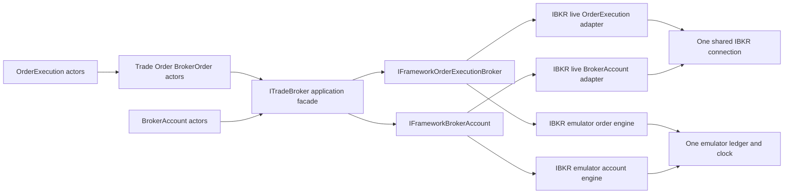
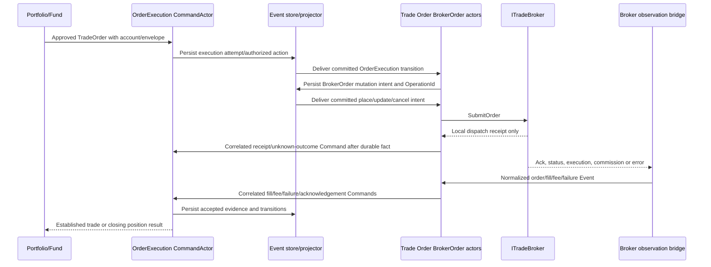

# Trade Broker Application and Framework Architecture Design v1.0

**Status:** Proposed design; documentation only

**Date:** 2026-09-15

**Scope:** Application-level `ITradeBroker`, separate framework order-execution and broker-account ports, Interactive Brokers live adapter, Interactive Brokers emulator, actor integration, recovery, and staged cash-backed account qualification.

## 1. Purpose and source baseline

OrderExecution and BrokerAccount actors need one broker-neutral application service. The service must support a real IBKR TWS/IB Gateway session and a selectable IBKR-shaped emulator without changing actor contracts. Beneath that application facade, order execution and broker-account state are separate framework capabilities. They share infrastructure in the real provider and a coherent ledger in the emulator; they do not share business ownership.

For V1, the platform models **one active cash-backed trading account environment at a time**: Emulator, IBKR Paper, or IBKR Live. Each has a separate account alias, ledger/evidence namespace and trading gate. The emulator's cash is synthetic; paper uses the IBKR paper account; live uses the actual IBKR account. Portfolio/Fund remains the internal financial book, with Fund transactions and positions **segregated by environment and account alias**; the selected broker account supplies external cash, buying-power, margin, position and fill evidence. Switching environments never carries synthetic/paper balances, Fund postings, positions or fills into the next account. Promotion is manual and evidence-backed: Emulator must be qualified and accepted before Paper new-risk trading can be enabled; Paper must be qualified and accepted before a **limited-capital Live pilot** can be enabled; a separate Live-pilot review is required before any broader live use.

“Cash-backed account” is the platform's funding/financial concept, not an assertion that the legal IBKR account subtype is `Cash`. IBKR's [account configuration guide](https://www.interactivebrokers.com/en/accounts/configuring-your-account.php) distinguishes actual account type and product permissions, and lists futures-option availability differently for Cash and Margin accounts by jurisdiction. Paper and Live qualification must verify the actual IBKR account subtype, futures/futures-option permissions, required collateral/margin and supported strategy combinations. An account that cannot execute the approved instruments cannot pass the gate merely because it reports a positive cash balance.

This design was reconciled against **all nine** specifications in `TomasAI.IFM.Framework.TradeBroker.InteractiveBrokers/Docs`:

| Source | Design contribution |
| --- | --- |
| [OrderExecutionWorkflowSpecification](../../TomasAI.IFM.Framework.TradeBroker.InteractiveBrokers/Docs/OrderExecutionWorkflowSpecification.md) | Execution aggregate, deadlines, permitted actions, reconciliation and compensation remain actor/workflow decisions. |
| [IbkrOrderExecutionAdapterSpecification](<../../TomasAI.IFM.Framework.TradeBroker.InteractiveBrokers/Docs/IbkrOrderExecutionAdapterSpecification (1).md>) | Order translation, dispatch receipts, order IDs, callback correlation, combo pricing, and ambiguity handling belong to the provider. |
| [IbkrBrokerAccountSpecification](../../TomasAI.IFM.Framework.TradeBroker.InteractiveBrokers/Docs/IbkrBrokerAccountSpecification.md) | Complete account snapshots, trading gates, freshness, positions, P&L, and reconciliation belong to the account capability. |
| [IbkrBrokerConnectionSpecification](../../TomasAI.IFM.Framework.TradeBroker.InteractiveBrokers/Docs/IbkrBrokerConnectionSpecification.md) | One physical TWS connection, reader, outbound dispatcher, callback router, session epoch, and ID allocators. |
| [IbkrContractReferenceSpecification](../../TomasAI.IFM.Framework.TradeBroker.InteractiveBrokers/Docs/IbkrContractReferenceSpecification.md) | Exact contract resolution and versioned fingerprints before an order can use a broker contract. |
| [IbkrMarketDataSpecification](../../TomasAI.IFM.Framework.TradeBroker.InteractiveBrokers/Docs/IbkrMarketDataSpecification.md) | IBKR market data is a separate, optional secondary provider; broker execution/account modules do not own the strategy feed. |
| [IbkrMarginPreviewSpecification](../../TomasAI.IFM.Framework.TradeBroker.InteractiveBrokers/Docs/IbkrMarginPreviewSpecification.md) | What-if preview is optional, separately paced and routed, and never approves or transmits an order. |
| [IbkrFlexReportingSpecification](../../TomasAI.IFM.Framework.TradeBroker.InteractiveBrokers/Docs/IbkrFlexReportingSpecification.md) | Historical reports use separate HTTPS transport and cannot enter the live order path. |
| [ScriptedBrokerTestHarnessSpecification](../../TomasAI.IFM.Framework.TradeBroker.InteractiveBrokers/Docs/ScriptedBrokerTestHarnessSpecification.md) | Scripted harness is test-only and distinct from the selectable emulator. |

The existing [QTS Trade Broker Integration Specification](QTS_Trade_Broker_Integration_Specification_v1.2.md) proposes two application interfaces and explicitly forbids a combined `ITradeBroker` in V1. **This design supersedes that one interface decision in accordance with the current product request.** Its separate order/account semantics, emulator-before-live delivery order, and broker-neutral schemas remain useful. The older IBKR order specification also illustrates a numeric `PlatformInstrumentId`; current trade contracts instead carry broker-agnostic string `ContractId`. This design preserves the current contract and resolves IBKR `conId` only inside the provider. The companion specifications should be revised during implementation so they no longer give contradictory interface or identity instructions.

## 2. Verified current implementation boundary

- `TomasAI.IFM.Framework.TradeBroker` and `TomasAI.IFM.Framework.TradeBroker.InteractiveBrokers` currently contain project shells and documentation, not a functioning TWS adapter or emulator.
- `TomasAI.IFM.Application.TradeBroker` does not yet exist. `TomasAI.IFM.Domain.TradeBroker` is a stub project and has no BrokerAccount actor.
- [OrderExecutionCommandActor](../../TomasAI.IFM.Domain.Trade/Order/Execution/Command/Actor/OrderExecutionCommandActor.cs) records `Start`, `Submit`, `AddFill`, `Accept`, `Cancel`, and `Reject` state through the event store, but no command calls a broker. Its projector currently handles read-model and established-trade handoff.
- [TradeOrderDefinition](../../TomasAI.IFM.Domain.Trade.Shared/TradeAggregateContracts.cs) contains Portfolio/Fund/Order identity, position type, components, and string leg `ContractId`, but no immutable execution-account reference or approved broker execution envelope. Those must be added through a versioned order contract before live dispatch.
- The present execution state machine treats local `Submitted` and `Cancelled` transitions as final enough for its simple model, and rejects fills after `Cancelled`. IBKR and emulator callbacks can arrive after a cancel request. The broker-connected migration must distinguish **requested**, **locally dispatched**, **broker acknowledged**, and **broker terminal** states and continue accepting valid late fills for reconciliation.

These are implementation gaps, not evidence that a broker already executes current orders.

## 3. Architecture decision and ownership



`ITradeBroker` is the **single application interface** injected into the BrokerOrder and BrokerAccount actor contexts. OrderExecution communicates with BrokerOrder through committed actor events/commands and receives correlated fill/failure/acknowledgement commands back; it does not place an order directly. The facade groups order and account operations by method name, with a shared capability/health snapshot and one normalized observation stream. The actors use only their relevant methods; the facade does not merge the actors or their state. Two concrete application implementations, `InteractiveBrokersTradeBroker` and `InteractiveBrokersEmulatorTradeBroker`, map application contracts to the corresponding framework ports and map framework observations back to application messages. Their constructors reject mixed source/environment/account identities.

The framework layer defines exactly two primary ports for this release:

1. `IFrameworkOrderExecutionBroker`: order dispatch, order queries/reconciliation, and normalized order observations.
2. `IFrameworkBrokerAccount`: local account snapshots, account/position queries and resynchronization, and normalized account observations.

`Framework.TradeBroker.InteractiveBrokers` implements the live ports in separate `OrderExecution` and `BrokerAccount` modules, using one internal `Connection`. A distinct `Framework.TradeBroker.InteractiveBrokers.Emulator` project implements the same two ports over one emulator engine and ledger. The separate emulator assembly does not reference `IBApi`, load IBKR credentials, or create a TWS connection. It may consume provider-neutral market snapshots from Application/Framework MarketData, but never depends on the concrete Databento project. A scripted broker test harness remains a third **test-only** facility and cannot be selected as a runtime broker mode.

Responsibility boundaries:

| Owner | Owns | Does not own |
| --- | --- | --- |
| Portfolio/Fund | Acceptance, risk, account selection, and trade-order identities | Broker API IDs or actual broker fills |
| OrderExecution actor/workflow | Approved order, execution attempt, action envelope, business deadlines, fill acceptance, compensation decision | TWS socket, contract lookup policy, broker-specific status strings |
| Trade Order BrokerOrder actors | One broker-facing place/update/cancel intent owner, micro-execution action, receipt and callback correlation; actor-message handoff to OrderExecution | Portfolio approval, final fill acceptance, TWS socket |
| BrokerAccount actor | Account readiness, snapshot and discrepancy handling, risk gate publication | Order submission/cancellation or Portfolio financial book |
| Application facade | Common actor contract, mode-safe mapping, normalized results/events | Risk approval, strategy selection, physical transport |
| Framework order port/provider | Exact broker contract/order translation, local dispatch, callback correlation, order evidence | Execution policy or accepting a trade |
| Framework account port/provider | Account subscriptions, complete snapshots, freshness and broker position evidence | Portfolio ledger or autonomous liquidation |
| Shared IBKR connection | Socket, reader, writer, epochs, IDs, callback fan-out and pacing | Account or order business state |
| Emulator engine | Synthetic order/account behavior driven by declared scenario and market inputs | Prediction of actual IBKR fill behavior |

## 4. Projects, files, and dependency direction

```text
TomasAI.IFM.Application.TradeBroker/
  Contracts/ITradeBroker.cs
  Contracts/Models/{Order,Account,Observation,Health,Error}.cs
  InteractiveBrokersTradeBroker.cs
  InteractiveBrokersEmulatorTradeBroker.cs
  Mapping/{Order,Account,Observation}Mapper.cs
  Hosting/TradeBrokerObservationBridge.cs
  Configuration/TradeBrokerOptions.cs

TomasAI.IFM.Framework.TradeBroker/
  Contracts/IFrameworkOrderExecutionBroker.cs
  Contracts/IFrameworkBrokerAccount.cs
  Contracts/Models/{Order,Account,Observation,Health,Error}.cs

TomasAI.IFM.Framework.TradeBroker.InteractiveBrokers/
  Connection/{Session,Dispatcher,Router,IdAllocator,Health}/
  ContractReference/
  OrderExecution/{Adapter,OrderMaterializer,Correlation,CallbackMapper}/
  BrokerAccount/{Adapter,Subscriptions,SnapshotAssembler,Reconciliation}/

TomasAI.IFM.Framework.TradeBroker.InteractiveBrokers.Emulator/
  Engine/{Ledger,Clock,Scheduler,Scenario,MarketExecution}/
  OrderExecution/EmulatedOrderExecutionBroker.cs
  BrokerAccount/EmulatedBrokerAccount.cs

TomasAI.IFM.Domain.Trade/Order/Execution/{Command,Event,Query,Model}/
TomasAI.IFM.Domain.Trade/Order/Broker/{Command,Event,Query,Realtime,Model,Logging}/
TomasAI.IFM.Domain.TradeBroker/BrokerAccount/{Command,Event,Query,Model}/
```

Domain actors reference only `Application.TradeBroker` contracts. `Application.TradeBroker` is deliberately the anti-corruption layer and references only provider-neutral `Framework.TradeBroker` ports/models, never `InteractiveBrokers` or `IBApi`. Both live and emulator framework projects reference `Framework.TradeBroker`; only the composition root selects a concrete provider. Framework ports do not reference Application or Domain actor types, so there is no dependency cycle. No concrete IBKR type crosses the framework-to-application mapping.

The existing `Domain.TradeBroker` project file is named `TomasAI.IFM.Domain.BrokerAccount.csproj` and contains a stub. The implementation gate must correct that project/namespace organization before adding BrokerAccount actors; it must not create a second `Trade` folder under `Domain.Trade`. Each actor's Command, Query, Event, and Realtime receive maps and one-message extension-handler classes follow [Actor Implementation Conventions](Actor-Implementation-Conventions.md).

## 5. Application contract: `ITradeBroker`

Representative contract; exact names can be adjusted to repository naming without changing the semantics:

```csharp
public interface ITradeBroker
{
    TradeBrokerCapabilitySnapshot GetCapabilitySnapshot();
    BrokerAccountSnapshot GetLatestAccountSnapshot(BrokerAccountReference account);
    bool TryGetBrokerPosition(BrokerAccountReference account, string contractId,
        out BrokerPositionSnapshot position);

    BrokerDispatchReceipt SubmitOrder(in BrokerSubmitOrderRequest request);
    BrokerDispatchReceipt ModifyOrderLimit(in BrokerModifyLimitRequest request);
    BrokerDispatchReceipt CancelOrder(in BrokerCancelOrderRequest request);

    ValueTask<BrokerOrderReconciliationResult> ReconcileOrderAsync(
        BrokerOrderReconciliationRequest request, CancellationToken cancellationToken);
    ValueTask<BrokerAccountReconciliationResult> ReconcileAccountAsync(
        BrokerAccountReconciliationRequest request, CancellationToken cancellationToken);
    ValueTask RequestAccountResynchronizationAsync(
        BrokerAccountReference account, string reason, CancellationToken cancellationToken);

    IAsyncEnumerable<TradeBrokerObservation> ReadObservationsAsync(
        CancellationToken cancellationToken);
}
```

`SubmitOrder`, `ModifyOrderLimit`, and `CancelOrder` return **local dispatch receipts**. `AcceptedForDispatch` means validated/queued locally; it never means the broker accepted, filled, or cancelled the order. The observation stream delivers those subsequent facts. `GetLatestAccountSnapshot` and `TryGetBrokerPosition` read immutable local state only and never perform network I/O. Reconciliation and account resynchronization are explicit control-plane operations, not per-tick reads. Exactly one hosted observation bridge consumes the facade stream; individual actors do not create competing subscriptions.

Both application implementations perform the same validation and map the same application schema. The live implementation asserts `BrokerSource.InteractiveBrokers`, the emulator implementation asserts `BrokerSource.InteractiveBrokersEmulator`. Both require framework order and account ports to report the same broker-instance identity, account reference, environment, and compatible session generation. A mismatched pair fails startup. Source identity is for configuration, provenance, and safety checks; strategy and execution policy do not branch on it.

## 6. Separate framework contracts

```csharp
public interface IFrameworkOrderExecutionBroker
{
    FrameworkBrokerCapabilitySnapshot GetSnapshot();
    FrameworkDispatchReceipt Submit(in FrameworkOrderRequest request);
    FrameworkDispatchReceipt ModifyLimit(in FrameworkModifyLimitRequest request);
    FrameworkDispatchReceipt Cancel(in FrameworkCancelRequest request);
    ValueTask<FrameworkOrderEvidence> ReconcileAsync(
        FrameworkOrderReconciliationRequest request, CancellationToken cancellationToken);
    IAsyncEnumerable<FrameworkOrderObservation> ReadOrderObservationsAsync(
        CancellationToken cancellationToken);
}

public interface IFrameworkBrokerAccount
{
    FrameworkBrokerCapabilitySnapshot GetSnapshot();
    FrameworkAccountSnapshot GetLatest(FrameworkAccountReference account);
    bool TryGetPosition(FrameworkPositionKey key, out FrameworkPosition position);
    ValueTask<FrameworkAccountEvidence> ReconcileAsync(
        FrameworkAccountReconciliationRequest request, CancellationToken cancellationToken);
    ValueTask RequestResynchronizationAsync(
        FrameworkAccountReference account, CancellationToken cancellationToken);
    IAsyncEnumerable<FrameworkAccountObservation> ReadAccountObservationsAsync(
        CancellationToken cancellationToken);
}
```

Framework order and account models include source and epoch provenance but no Domain actor messages. The ports are deliberately separate, including separate observation streams, so an account callback cannot place or cancel an order. The application bridge merges them into one application observation channel without erasing their type, sequence, or originating capability. If a framework stream stops or loses a critical observation, the application health snapshot becomes degraded and the responsible actor is notified; it does not silently continue with an apparently current cache.

Optional ContractReference, MarginPreview, IBKR MarketData, and Flex Reporting remain **separate** framework ports/modules. They are supporting or later capabilities, not additional members of the primary `ITradeBroker` actor contract. OrderExecution may use ContractReference inside the live adapter. MarginPreview cannot be used as a synchronous risk approval. Flex cannot block or approve a live order.

## 7. Neutral models, enums, and schema requirements

Application DTOs are versioned, immutable, and MessagePack-compatible where transmitted through actor messages. Framework DTOs are separate immutable transport-normalization records. Mapping tests prove field-level equivalence. Required application types:

| Type | Minimum fields and rule |
| --- | --- |
| `BrokerAccountReference` | Allowlisted account alias/reference, environment, base currency; exact actual IBKR account ID is resolved only inside provider configuration. |
| `BrokerOrderIdentity` | PortfolioId, FundId, OrderId, ExecutionAttemptId, TradeOrder revision, position type, optional closing TargetPositionId; never a numeric IBKR ID. |
| `BrokerSubmitOrderRequest` | OperationId, order identity, immutable approved definition/hash, account reference, execution purpose, contract-ID legs with signed quantities, overall side/cash-flow and limit, time-in-force/routing profile, expected attempt revision, created/not-after UTC, approved envelope fingerprint. |
| `BrokerModifyLimitRequest` | New operation ID, same logical broker order, expected acknowledged revision/price, new approved overall limit, unchanged account/contracts/legs/quantity/purpose. |
| `BrokerCancelOrderRequest` | New operation ID, target logical order, reason, expected attempt revision; individual cancellation only. |
| `BrokerDispatchReceipt` | OperationId, source, broker-instance ID, epoch, `RejectedLocally`/`AcceptedForDispatch`/`OutcomeUnknown`, accepted UTC/sequence, classified reason and safe detail; optional broker order correlation when available. |
| `BrokerOrderEvidence` | Open/completed order rows, execution IDs and individual fills, commission joins, completion markers, query epoch, completeness and conflict reasons. Partial evidence is never a complete empty order set. |
| `BrokerAccountSnapshot` | Account alias/environment, source/epoch, monotonic snapshot version, readiness, completeness/freshness/quality, gate, typed balances/margins/currency ledgers, positions, P&L telemetry, assembled UTC. |
| `BrokerPositionSnapshot` | Account alias, string ContractId plus provider-private contract correlation, quantity, average cost, currency, valuation/P&L metadata, completeness and version. |
| `TradeBrokerObservation` | Closed union of order status, execution, commission, broker error, connection, account value, position, P&L, snapshot completion, gate, and reconciliation observations. Each has event ID, source, epoch, receive sequence/UTC, operation/attempt correlation and schema version. |

Enums include `BrokerSource { Unknown=0, InteractiveBrokers=1, InteractiveBrokersEmulator=2 }`, `BrokerEnvironment { Unknown=0, Emulator=1, Paper=2, Live=3 }` (also the three cash-backed account environment values), `AccountPromotionScope`, `QualificationState`, `BrokerDispatchStatus`, `BrokerOrderStatus`, `BrokerAccountReadiness`, `BrokerObservationKind`, `BrokerOrderPurpose { Opening, Closing, Compensation }`, `BrokerAccountGateReason`, `BrokerEvidenceCompleteness`, `BrokerErrorCategory`, and `BrokerReconciliationStatus`. `LivePilot` is an approval scope within `BrokerEnvironment.Live`, not another account type. Unknown values are explicit and never interpreted as success. The existing `TradeOrderPositionType { Unknown=0, Opening=1, Closing=2 }` remains the order-position contract rather than adding another competing domain enum.

Every actor message containing these DTOs requires an explicit serialization version and stable MessagePack keys. Adding `ExecutionAccountReference` and an approved execution envelope to `TradeOrderDefinition` is a compatible versioned contract change: append new keys, retain immutable historical definitions, and migrate readers without silently rewriting old orders. The broker adapter never accepts an old order lacking a resolved account/envelope for live dispatch. Full Portfolio/Fund/Order/Trade identity remains in domain contracts; IBKR `orderId`, `permId`, `conId`, `execId`, and client ID are provider correlation evidence only.

## 8. Order execution actor flow



OrderExecution first persists its authorized attempt/action. The committed OrderExecution event is delivered to BrokerOrder under `Trade/Order/Broker`, whose CommandActor **persists the intended broker operation before external dispatch**. Its conventional durable event projector hands that committed intent to a BrokerOrder EventActor/handler. This is event-driven, not a new polling recovery service. The Event handler injects `ITradeBroker` and records the local receipt by a correlated BrokerOrder Command; it never treats receipt acceptance as broker acceptance. The one observation bridge sends concrete order/status/fill/commission/error messages to BrokerOrder EventActor, whose dedicated handlers record facts and send stable-ID correlated Commands to OrderExecution **after** BrokerOrder persistence. Both actor streams own durable deduplication and business transitions; the framework never edits OrderExecution or Portfolio state directly.

One immutable OperationId identifies each submit/modify/cancel. An identical replayed operation returns the original dispatch receipt; a different payload under the same ID is an invariant failure. IBKR order-ID reservation and correlation are persisted before `placeOrder`. If a socket call or process failure makes dispatch ambiguous, no automatic resubmit occurs: state becomes `OutcomeUnknown`, new-risk submission for that attempt stops, and bounded order/execution reconciliation is requested. Querying broker evidence is permitted at that uncertainty point, after reconnect, after a late fill, or on an explicit operator request. It is not a 2-second database poll.

Order status and `openOrder` echo are corroborating evidence; individual `execId`-keyed executions are authoritative fill facts. A `Filled` status alone cannot create a trade. Cancel dispatch and `PendingCancel` are not terminal. A cancel/fill race retains every valid execution, including those arriving after a cancel acknowledgement. Rejected/unknown/foreign orders are classified without binding them to an attempt by symbol or price similarity. The projector creates OptionTrade/FuturesTrade or closes a strategy position only after the accepted leg-fill set, commission evidence policy, and final broker reconciliation satisfy the existing trade lifecycle.

V1 live adapter qualification covers supported futures single-leg orders, futures-option vertical spreads and four-leg iron condor BAG limit orders that the current generic TradeOrder schema can express. Unsupported order types, mixed custom components, routing profiles, or ambiguous combo pricing fail locally with classified details; they are not approximated as another order. The order workflow owns any price ladder, edge constraint, cancellation, or compensation decision. The provider validates representability, exact IBKR market-rule increments, account, routing and contract fingerprints but never adjusts approved economics. Four-leg BAG orders use an overall limit and explicit supported IBKR combo-price convention; no per-leg price substitution or silent sign flip.

## 9. Broker-account actor flow and gates

On every real connection epoch, the account adapter verifies the configured account, gathers account summary and account download completion, gathers the completed initial position set, and promotes one coherent snapshot. The account actor receives normalized facts through the application observation bridge, records material readiness/position/gate changes, and publishes a versioned immutable latest snapshot. **No position callback before `positionEnd` is proof of zero positions.** Old-epoch observations cannot complete a new snapshot.

The broker account is authoritative for actual broker positions, cash, margin, and fills. Portfolio/Fund remains the internal financial and risk book; broker snapshots are reconciled against it by exact contract/quantity and account mapping. A single broker account may back multiple funds, but account data is not assigned to a fund merely because a contract symbol matches. The Portfolio-approved order carries the chosen account reference. Broker-only, internal-only, quantity mismatch, unresolved contract, or unknown evidence closes the **new-risk** gate and creates a classified discrepancy. Risk-reducing orders may remain eligible only under the separate execution/risk authorization envelope; an account gate alone never sends one.

Critical account values are typed decimals with preserved currency; missing, invalid, incomplete, and `NotApplicable` are distinct. No implicit multi-currency addition occurs. Account P&L is telemetry, not the financial ledger. New account snapshots are atomically promoted with snapshot version, session epoch, source time/provenance, freshness and completeness. Local synchronous reads remain cheap and immutable; account resynchronization is triggered by startup, reconnect, detected critical gaps or discrepancies, and explicit operations, rather than constant actor-side database polling.

The emulator publishes the **same** account contracts and readiness states. Its `Current` state requires scenario initialization and a coherent ledger checkpoint, not fictitious IBKR callbacks. In emulator mode, `BrokerSource` and environment remain unambiguous. Emulator margin estimates are conservative configurable approximations and are labelled as such; they never claim proprietary IBKR margin parity.

## 10. Interactive Brokers live provider

`Connection` owns exactly one physical session, one `EWrapper` entry point, the official C# API reader topology, one serialized outbound writer, callback routing, request/ticker IDs, order-ID high-water mark, liveness and reconnect. OrderExecution and BrokerAccount modules register independently before readiness. Every successful reconnect creates a new epoch. Callback handlers copy bounded primitive/immutable data and enqueue to their feature; database, NATS, Redis, risk, actor business logic, and UI calls never run on the IBKR reader thread. Critical order, execution, error, position, and completion callbacks cannot be silently dropped. If retention is not provable, the session and new-risk gate become unhealthy and resynchronization is required.

Order ID allocation waits for `nextValidId`, considers the durable high-water mark and observed IDs, and persists each reservation before dispatch. A modification reuses its existing API order ID; compensation uses a fresh ID and distinct purpose. Callback correlation uses exact client/order ID, then known `permId`, verified `orderRef`, and linked `execId`, with conflicts quarantined. The account module uses the same epoch/request allocator and coordinates singleton subscriptions; it does not create a second client ID/socket. Account callbacks never invoke order methods.

The provider resolves each application string `ContractId` through an exact, versioned mapping to an IBKR `conId` and verifies expiry, strike, right, multiplier, currency, exchange, trading class, and market rules. A missing, stale, contradictory, or multiple mapping blocks dispatch before any broker order ID is consumed where possible. No Databento numeric instrument ID or publisher ID is used as an IBKR execution identity. Position evidence maps back to the same string ContractId with explicit resolution quality; unresolved broker positions remain visible as broker-only risk evidence.

The pinned official `IBApi` package, callback signatures, host/API compatibility, combo price conventions, and paper/live connection profiles must be verified during implementation. The current specifications are design inputs rather than proof that a particular pinned SDK/API version already exists in this repository.

## 11. Interactive Brokers emulator and scripted harness

The selectable emulator has one configured synthetic broker account, one broker-instance/session generation, deterministic synthetic broker order IDs/execution IDs, one ledger, and one scheduler/clock shared by its framework order and account adapters. It has no IBKR network transport or credentials. It models order admission, acknowledgement, working/partial/full/rejected/cancelled/unknown states, executions, commissions, positions, cash, net liquidation, buying power, margin and P&L. **Every emulated execution updates the account ledger and emits correlated account/position observations** before a coherent next snapshot is published.

Modes are explicit: deterministic scenario, normalized live-market simulation, historical market replay, and declarative failure injection. The mandatory Level-1 market model consumes provider-neutral last trade, bid/ask, size, timestamp, sequence, freshness, and contract identity; it does not own the Databento connection. Single-leg futures fills may follow documented bid/ask crossing with bounded top-of-book size. Multi-leg futures-option BAG fills require a coherent combo price/leg-quote snapshot and a versioned spread execution model; the emulator must not invent a guaranteed four-leg fill from unrelated individual quotes. If required market evidence is absent or stale, an order remains working or returns a classified unavailable result. It does not default to a favorable fill.

Scenario configuration covers starting balances, conservative margin model, commissions, market-execution profile, acknowledgement/fill/modify/cancel/account-update latency, partial-fill rules, fixed random seed when stochastic mode is enabled, and fault declarations. Faults include dropped/delayed acknowledgements, duplicate/out-of-order callbacks, cancel/fill race, ambiguous dispatch, disconnect/reconnect, account lag, margin rejection, contract mismatch, and persistence/reconciliation failures. Given the same scenario, initial ledger, market input, order sequence, clock, and seed, normalized events and final ledger hashes must reproduce exactly. Emulator order/account reconciliation reads its own coherent ledger and produces explicit completeness evidence.

The [Scripted Broker Test Harness](../../TomasAI.IFM.Framework.TradeBroker.InteractiveBrokers/Docs/ScriptedBrokerTestHarnessSpecification.md) is separate: it tests actor/workflow decisions from declared operations and outcomes, has no implicit happy path, cannot select live-market mode, and is excluded from production registration/publish. The emulator tests realistic broker-account coherence and controlled market-driven execution; it is not a statistical predictor of actual IBKR fills. IBKR paper integration remains a later, separate qualification gate for the real adapter.

## 12. Storage, recovery, and consistency

| Store | Durable content | Authority |
| --- | --- | --- |
| PostgreSQL EventSourceDb | OrderExecution intents, operation IDs, dispatch receipts, broker observations accepted by actor, business status, fill allocations, close/open handoff | Authoritative internal execution aggregate and recovery. |
| PostgreSQL broker correlation tables | Broker instance/environment/client/order ID reservation, operation payload hash, attempt/TradeOrder correlation, `permId`, `orderRef`, ambiguity marker, high-water mark | Authoritative provider dispatch/dedupe evidence; written before socket call. |
| PostgreSQL PortfolioDb | Portfolio/Fund acceptance and financial decisions; selected account reference for accepted order | Internal financial book; not broker positions. |
| ScyllaDB read/observation projections | Detailed execution and account observations, position/P&L samples, discrepancies and operational review | Read model/diagnostics, never sole order-recovery source. |
| Redis plus process memory | Latest immutable account snapshot, gate, health and optional latest order view with version/epoch | Fast read cache; invalidated on restart/new epoch. |
| Emulator ledger checkpoint/journal | Orders, executions, commissions, positions, balances, clock/scenario version and ledger hash | Authoritative synthetic broker state across a system-under-test crash/restart. |

The event store and a separate broker correlation table cannot be presumed to share a transaction merely because both use PostgreSQL. Dispatch eligibility requires either an explicit shared PostgreSQL transaction/enlistment for intent plus correlation, or a durable post-commit handoff that persists correlation before external dispatch. The implementation must prove that a crash at each boundary leaves an unambiguous replay/reconciliation path. No external broker call participates in a SQL transaction. Projector failures retain durable delivery receipts; they do not create a 2-second recovery loop.

The provider does not resend a mutation after ambiguous socket outcome. On restart it reloads correlation and high-water marks, synchronizes the account and broker session, queries bounded open/completed orders and executions, and reports complete/conflicting/unknown evidence to the owning actor. The actor determines whether to wait, cancel, accept, compensate, or escalate under its existing envelope. BrokerAccount resynchronizes its current epoch and reconciles broker positions with the internal book. Recovery is event-driven by startup, reconnect, incidents, or explicit requests; no per-tick database read or perpetual polling worker is part of this design.

High-frequency account P&L callbacks do not each become primary PostgreSQL events. Material account-gate, position, and completeness transitions are durable; replaceable telemetry may be sampled/coalesced in read projections with an explicit gap marker on loss. Order/execution/commission/critical error evidence is never silently sampled away.

## 13. DI, environment, and startup behavior

`TradeBrokerOptions` chooses `Emulator`, `InteractiveBrokersPaper`, or `InteractiveBrokersLive`; it also supplies an allowlisted account reference, environment, routing profile, and versioned emulator scenario where applicable. Mode selection happens only in the API/TradeBroker host composition root. Actors do not branch on mode. Exactly one **active cash-backed account** and one `ITradeBroker` singleton/observation bridge are registered per running host. In live/paper mode the two framework ports share one `IIbkrConnection`; in emulator mode they share one emulator engine/ledger/clock. Mixed live/emulator order and account ports are a startup fault.

Development defaults to the emulator only when explicitly configured and labelled; it is never an automatic fallback from a failed IBKR connection. Paper and live profiles require separate allowlisted account IDs, client IDs, ports, credentials and deployment controls. The app does not claim an adapter is ready merely because DI registration succeeded. Startup order is: validate configuration and account/reference versions; start provider engine or connection; register feature routes; establish current epoch/ledger generation; synchronize account and broker orders; reconcile open attempts/internal positions; publish explicit capability and account-gate snapshots; then permit approved new-risk submissions. Order cancellation/reconciliation capacity remains available when the new-risk gate is closed, subject to the actual connection state and authorization.

The **promotion gate** is separate from session readiness and Portfolio risk acceptance. A target environment may connect and expose read-only account/health/reconciliation data for qualification while place/update of new-risk orders stays disabled. Before each broker mutation, the application account gate checks the configured environment and exact account alias, durable approval record, approved release/build/profile versions and permitted order shapes. The Live target initially has `Pilot` scope only; its immutable approval record carries a maximum capital-at-risk budget, per-order loss/notional/quantity bounds, supported instruments/strategies, Fund allowlist, concurrent-position limit and validity window. Portfolio and BrokerOrder both enforce the narrower of their approved trade envelope and the pilot caps. A configuration edit cannot silently raise those limits or promote to unrestricted Live. Cancel/reconcile and an explicitly authorized risk-reducing close remain available when new-risk promotion is blocked, if broker connectivity and exposure evidence permit them.

Qualification is a staged sequence, not an automatic mode switch: (1) isolated Emulator qualification may place synthetic test orders; its integration, failure/replay and Fund-accounting evidence is reviewed and explicitly accepted before operational Emulator use or Paper qualification; (2) after Emulator acceptance, Paper may run **separately authorized, capped qualification orders** to verify connection/order/account behavior, fills, cancellations, close workflows, reconciliation and financial postings; general Paper strategy/manual new-risk trading requires subsequent Paper acceptance; (3) after Paper acceptance, Live pilot is separately approved with very limited capital and bounded instruments/strategies; (4) actual Live pilot fills, account/Portfolio reconciliation and operational behavior are reviewed before broader Live approval. Paper qualification permission cannot be used by ordinary strategy/manual order paths, has an explicit test-order identity and short validity, and never qualifies Live by itself. Each acceptance is tied to a test/evidence manifest, approving identity, approved code and contract versions, target account alias/environment, allowed capability scope, effective/expiry times and revocation state. Failed evidence, changed material version, revoked approval, wrong account or unknown current exposure leaves the target's new-risk gate closed. Previous environment acceptance is necessary but never sufficient for the next environment's own readiness and approval.

## 14. Security, observability, and performance

Full IBKR account IDs, credentials, Flex tokens, sensitive raw rejection text and unrestricted callback payloads do not appear in actor messages, routine logs, metrics or UI. Logs use account alias and structured operation/attempt/TradeOrder IDs; raw evidence is access-controlled with bounded retention. Paper/live mode, account allowlist and broker-instance identity are validated on every dispatch, not only startup. Global cancel is absent from `ITradeBroker`; any future emergency cancel-all requires a separate privileged, audited interface.

Metrics and Actor Health detail should show session epoch, readiness, account snapshot version/gate, callback ingress backlog/loss, outbound queue depth, order mutation ambiguity, submit-to-ack/fill latency, partial fills, late fills, cancel/fill races, reconciliation outcomes, account freshness/completeness, discrepancies, emulator mode/scenario and ledger hash. Classified error results include source, operation, contract ID/account alias, epoch, correlation and reason without manufacturing exceptions for expected missing/foreign broker data. A critical failure is logged and visible in the appropriate actor mailbox/health history.

Reader callbacks perform bounded copy/enqueue work only. Actor mailboxes process immutable normalized facts. Synchronous account reads are lock-free or use immutable snapshot publication; they do not allocate a new account graph per market tick. Broker reconciliation and contract resolution are control-plane operations. The observation bridge routes critical order/fill/account-gate messages losslessly and lets replaceable P&L telemetry use explicit bounded coalescing. Queue overflow or unknown callback state closes readiness rather than hiding loss.

## 15. Implementation and acceptance gates

1. **Contracts and migration:** Create Application `ITradeBroker`/models and the two Framework ports/models; version TradeOrder account/envelope fields; align older combined-interface/numeric-ID specifications; add dependency and serialization compatibility tests.
2. **Emulator foundation first:** Build separate emulator project, shared ledger/clock, mandatory futures Level-1 execution, coherent account snapshots, deterministic observations and explicit no-fill behavior; qualify both framework ports and both actor handoffs with happy/edge BDD, unit, integration and replay tests.
3. **Actor integration:** Add BrokerAccount actors; migrate OrderExecution from local-only transitions to durable intent/dispatch/evidence states; create dedicated mapped handlers and one observation bridge; prove late-fill/cancel race, duplicate operation, incomplete account snapshot, closing order and multi-leg fill allocation.
4. **Live connection and contract reference:** Pin official C# API, build one session/router/writer/ID allocator, exact string ContractId-to-`conId` resolution and market rules; test with fake callback fixtures and no external broker.
5. **Live order adapter:** Implement single-leg futures and supported futures-option BAG translation, submit/price-only modify/cancel, echo validation, status/execution/commission normalization, durable correlation and ambiguity handling. Complete contract tests against both framework order implementations.
6. **Live account adapter:** Implement account verification, complete initial downloads, typed balances/margin/positions/P&L, immutable snapshots, gates and reconciliation using the shared epoch. Complete contract tests against both framework account implementations.
7. **Qualification:** Run scripted workflow scenarios, emulator market/replay soak, process-crash boundaries, callback overflow/loss, NATS routing, PostgreSQL/Scylla/Redis integration, and normal API/UI build as affected. Real adapter additionally requires controlled IBKR paper-account integration, API-version fixtures and operational runbook before any live profile can be enabled. Emulator success never qualifies actual IBKR connectivity.
8. **Promotion approval:** Persist reviewed Emulator acceptance; issue short-lived, capped Paper test-order authorization only after that acceptance; persist separate reviewed Paper acceptance before general Paper trading; persist separate limited-capital Live-pilot approval before the first live trade; review and explicitly accept the pilot results before broader Live scope. Startup and each new-risk dispatch must validate the exact account, approval chain, versions, caps and current readiness. Add negative tests proving no environment or configuration switch bypasses these gates.

Required shared scenarios include accepted and locally rejected submit, acknowledgement timeout, delayed/duplicate/out-of-order status, partial and complete individual leg fills, commission delay, cancel/fill race, unknown mutation outcome, process restart after intent/correlation/socket dispatch, incomplete account download, zero-position completion, broker-only/internal-only discrepancies, account gate recovery, market-data stale/no-fill, contract ambiguity, one-leg futures, vertical spread, four-leg iron condor, and closing position. Verify actor message maps, one-message handler files, typed results, and full application/framework field mapping. Benchmarks measure dispatch/callback routing, immutable account snapshot reads and emulator market-driven load without treating simulated TPS as evidence of live broker capacity.

The [BrokerOrder, Execution, and Accounting Specification](Trade-Broker-BrokerOrder-Execution-and-Accounting-Specification-v1.0.md) develops these actor, cash-backed account and promotion-gate decisions. A detailed implementation plan can follow when the exact versioned account/envelope contract, supported V1 order-shape profiles and paper/live pilot limits are frozen. This document makes no runtime or code changes.
