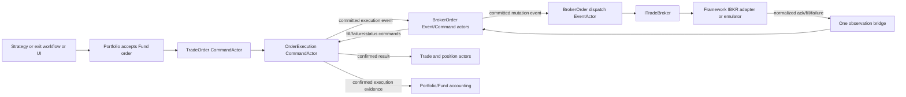

# Trade Broker, BrokerOrder, Micro-Execution, and Fund Accounting Specification v1.0

**Status:** Proposed implementation specification; documentation only<br>
**Date:** 2026-09-15<br>
**Target:** .NET 10, versioned MessagePack actor messages, PostgreSQL event and financial stores<br>
**Primary order shapes:** one-leg futures, futures-option vertical spread, futures-option iron condor; opening and closing orders<br>
**Cash-backed account environments:** emulator, IBKR paper, then separately qualified IBKR live (pilot first)

## 1. Authority, scope, and verified baseline

This specification develops the [Trade Broker Application and Framework Architecture Design](Trade-Broker-Application-and-Framework-Architecture-Design-v1.0.md). It adds one submission owner at `TomasAI.IFM.Domain.Trade/Order/Broker`, an event-driven order/cancel/update path, a broker-neutral micro-execution model, execution-to-Portfolio/Fund accounting, and broker-account management. It also uses the [Order Execution Workflow Specification](../../TomasAI.IFM.Framework.TradeBroker.InteractiveBrokers/Docs/OrderExecutionWorkflowSpecification.md), [IBKR Order Execution Adapter Specification](<../../TomasAI.IFM.Framework.TradeBroker.InteractiveBrokers/Docs/IbkrOrderExecutionAdapterSpecification (1).md>), [IBKR Broker Account Specification](../../TomasAI.IFM.Framework.TradeBroker.InteractiveBrokers/Docs/IbkrBrokerAccountSpecification.md), and [Actor Implementation Conventions](Actor-Implementation-Conventions.md). The newer design's single application `ITradeBroker`, two separate framework ports, and string `ContractId` decisions control where older documents disagree.

The verified repository currently has [TradeOrderLifecycleApi](../../TomasAI.IFM.Application.Api.Nats.Client/TradeOrderLifecycleApi.cs) creating/approving/readying/binding Portfolio-accepted orders; [TradeOrderEventProjector](../../TomasAI.IFM.Domain.Trade/Order/Command/EventProjector/TradeOrderEventProjector.cs) then starts OrderExecution. [OrderExecutionCommandActor](../../TomasAI.IFM.Domain.Trade/Order/Execution/Command/Actor/OrderExecutionCommandActor.cs) supports start/submit/fill/accept/cancel/reject locally, and [OrderExecutionEventProjector](../../TomasAI.IFM.Domain.Trade/Order/Execution/Command/EventProjector/OrderExecutionEventProjector.cs) creates or closes trades from its accepted state. No `BrokerOrder` actor, application TradeBroker implementation, or working IBKR adapter/emulator exists yet. The present execution model rejects a fill after a local cancellation and has no broker acknowledgement or ambiguity state. These are migration requirements, not existing functionality.

The existing [Iron Condor manual screen](../../TomasAI.IFM.UI.Net.ViewModels/Trade/IronCondor/IronCondorTradeOrderViewModel.cs) already submits an opening candidate via Portfolio. The [Trade Order editor](../../TomasAI.IFM.UI.Net.ViewModels/Trade/TradeOrderEditorViewModel.cs) also has an older `CreateManualOrderAsync` route. Both must converge on the same accepted `TradeOrderDefinition` and execution path before broker dispatch. No UI path may construct a broker order or fill directly.

This document specifies contracts and behavior. It does not assert that broker execution or automated fund posting is implemented.

The platform calls the selected environment its **cash-backed broker account**: synthetic cash in Emulator, IBKR paper cash/account state in Paper, and actual IBKR cash/account state in Live. Exactly one environment/account alias is active for broker mutations in a V1 host. These are three environments for the same broker-neutral APIs, not three concurrent balances pooled into one account. `LivePilot` is a *gate scope on the Live environment*, not a fourth account type. Actual IBKR legal account subtype and futures/futures-option permissions must be verified separately; [IBKR's account configuration guidance](https://www.interactivebrokers.com/en/accounts/configuring-your-account.php) shows that a positive cash balance alone does not establish eligibility for every futures-option order shape.

## 2. Ownership and end-to-end lifecycle

| Owner | Exclusive responsibility |
| --- | --- |
| Portfolio/Fund order composition | Accept or decline the candidate, select Fund(s) and account, assign Portfolio/Fund/Order and reserved Trade identities, freeze approved economic/risk envelope. |
| TradeOrder CommandActor | Hold one approved order definition, revision, position type, authorization source, and bound execution attempt. |
| OrderExecution CommandActor | Hold one execution attempt, broker facts accepted as evidence, leg-fill allocations, terminal/uncertain status, resulting trades or close result. |
| **BrokerOrder Command/Event/Query actors** | Single broker-facing submission controller for each attempt; create durable place/update/cancel intents, run micro-execution decisions, correlate inbound broker observations, route fill/failure commands to OrderExecution. |
| Application `ITradeBroker` | Broker-neutral order/account operations and one normalized observation stream; select live/emulator by composition root. |
| Framework order/account ports | Translate exact contracts and IBKR API calls, correlate callbacks, assemble broker account truth; emulator uses same ports over one ledger. |
| Portfolio financial actors | Fund position/capacity and double-entry book of record from confirmed execution/settlement evidence; broker account remains external truth for broker balances/positions. |

BrokerOrder is the **single entry for broker-bound order mutations**. Strategy workflow opening TradeOrders, position-exit Closing TradeOrders, and UI manual orders all first pass Portfolio approval and `TradeOrderLifecycleApi`; their bound attempts then arrive at BrokerOrder from committed OrderExecution events. `ExecutionChannel.Manual` must be defined precisely: it denotes a human/manual execution evidence route and never silently invokes the broker. A UI order intended for IBKR uses `ExecutionChannel.Broker` and an `Origin=DesktopTradeOrder` or equivalent provenance value. Manual fill entry, if retained, is separately authorized and never forged as an IBKR callback.



The flow uses actor messages for Domain-to-Domain communication. The framework receives application DTOs, **not** Domain `IEvent` implementations; the application adapter maps the committed BrokerOrder mutation event into `IFrameworkOrderExecutionBroker` calls. Framework callbacks become normalized application observations, then concrete BrokerOrder actor messages. Thus place/cancel/update are event-driven without reversing project dependencies.

## 3. Preconditions and immutable approved order

`TradeOrderDefinition` is versioned by appending MessagePack keys after current key 13; do not overwrite immutable historical definitions. Its dispatchable version must contain: selected `ExecutionAccountReference` alias/environment; approved `ExecutionEnvelope` ID/version/hash; explicit overall limit, side/cash-flow convention, maximum quantity/working units, minimum acceptable economics, tick/price boundary, order time-in-force, not-after UTC, routing profile/version, and allowed micro-execution actions. A compatibility reader can load older orders, but an old order lacking account/envelope cannot be dispatched to paper/live. The order also binds an immutable `AccountPromotionApprovalId`/revision/scope and applicable capital limits when using Paper or Live; a revoked/expired approval blocks new place/update requests without altering historical orders. The approved revision/hash and authorizing Portfolio event ID remain immutable for an attempt; a new approved revision requires a new bound attempt or an explicitly approved modification contract.

Opening orders use `TradeOrderPositionType.Opening=1`; position-exit orders use `Closing=2` and an existing `TargetPositionId`. `Unknown=0` is invalid for dispatch. Portfolio assigns the full `TradeEntityId` (`PortfolioId`, `FundId`, `OrderId`, `TradeId`) only after acceptance. Each leg retains its exact string `ContractId`; provider `conId`, IBKR `orderId`, `permId`, client ID and `execId` are private correlation data. The adapter rejects unresolved or conflicting contract fingerprints before socket mutation. No Databento ID lookup is needed for an IBKR order.

The supported V1 broker order is one limit order per approved executable component: a one-leg futures order or a coherent IBKR BAG for supported two/four-leg futures-option components. An accepted Portfolio order with multiple independently executable components gets separate `BrokerOrderId`s under **one** `OrderExecutionId`; the approved component set and all exposure must still reconcile before OrderExecution accepts the aggregate. Unsupported custom mixes fail locally with detail. No implicit conversion of a four-leg combination into four unrelated live orders is permitted.

## 4. Identities, revisions, and correlation

| Field | Rule |
| --- | --- |
| `TradeOrderId` | Full Portfolio/Fund/Order identity; no redundant `TradeOrderId` field inside `TradeEntityId`. |
| `OrderExecutionId` | `TradeOrderId + ExecutionAttemptId`, existing stream identity. |
| `BrokerOrderId` | `OrderExecutionId + ComponentId`; stable for one executable component and one attempt. |
| `OperationId` | Immutable unique ID for one place, price update, or cancel intent. Same ID/same hash is idempotent; same ID/different hash is a conflict. |
| `ObservationId` | Stable normalized ID based on broker instance/epoch/callback kind/IBKR correlation/sequence or exact `execId`; deduped without collapsing distinct fills. |
| `ExternalExecutionId` | Exact IBKR `execId` or emulator equivalent. Foreign/uncorrelated executions are held for account reconciliation, never guessed into an order by symbol/price. |
| `AccountReference` | One configured, allowlisted broker account alias in V1; actual IBKR account number is provider-private. |

Each command/event includes `SchemaVersion`, `CommandId`/`EventId`, `ActorSubject`, entity ID, correlation/causation IDs, source Portfolio event, UTC effective/received time, expected aggregate revision, approved definition/envelope hashes, and classified reason. Numeric MessagePack keys and unions are append-only. All transport messages are size bounded, and the framework/application mapper has exact field-coverage tests.

Broker correlation persists broker instance, environment, account alias, client/order ID reservation, `permId` when known, `orderRef`, operation payload hash, `BrokerOrderId`, epoch and callback high-water marks. It is provider evidence, never the business ID. A broker order cannot be sent until the corresponding correlation reservation is durable.

## 5. Actor contracts and handler maps

Actors belong under `TomasAI.IFM.Domain.Trade/Order/Broker/{Command,Event,Query,Realtime,Model}`; `BrokerOrderCommandActor`, `BrokerOrderEventActor`, `BrokerOrderQueryActor`, and a quote-triggered `BrokerOrderRealtimeActor` are actor names within that folder. No second `Trade` folder and no general Lifecycle folder. The Command actor has `_parseMap`, `_validationMap`, and `_receiveMap`; Event/Realtime actors have parse/receive maps; the Query actor has parse/receive/exception maps. Each mapped concrete message has a dedicated extension class directly in its owning role folder, named after **one** message without the suffix (for example `RequestPlaceBrokerOrder.cs` for `RequestPlaceBrokerOrderCommand`). Deterministic ingress validation accumulates `ValidationError` values in the Command map; handlers then perform small state-dependent business guards before `state.Update`. Ignored duplicates return no new state event. Failure paths return typed classified results and log real processing failures. A pure `Model` folder holds micro-execution calculations.

### 5.1 OrderExecution event intake

The OrderExecution projector adds a **durable notification** for committed `OrderExecutionChangedEvent` revisions; the existing trade/position projection remains separate. A `BrokerOrderEventActor` handler `OrderExecutionChanged` examines the typed event and sends only the appropriate command to BrokerOrder. It never dispatches an external order directly and never re-reads OrderExecution state for every tick. At minimum:

| Committed OrderExecution transition | BrokerOrder reaction |
| --- | --- |
| `Pending` after `StartOrderExecutionCommand`, broker channel | Send idempotent `InitializeBrokerOrderCommand` for each supported component. |
| Authorized place request / submission intent | Send `RequestPlaceBrokerOrderCommand`; if no separate transition exists today, add it to OrderExecution rather than infer place from a local `Submitted` label. |
| Authorized reprice/update decision | Send `RequestUpdateBrokerOrderCommand` with expected broker revision and envelope. |
| Authorized cancellation decision | Send `RequestCancelBrokerOrderCommand`; cancel **request** is not cancellation confirmation. |
| Filled/rejected/cancelled/unknown evidence | Reconcile/stop normal actions; ignore revisions already consumed. Do not create a new place intent. |

Use a stable `(OrderExecutionId, source EventId, transition kind, ComponentId)` intake receipt so projection replay cannot generate endless place attempts. BrokerOrder does not subscribe to its own OrderExecution fill commands as new submission instructions. Actor/queue redelivery may happen, but semantic IDs and status guards prevent a cycle.

### 5.2 BrokerOrder commands and events

| Command handled by BrokerOrder CommandActor | Required behavior and resulting committed event |
| --- | --- |
| `InitializeBrokerOrderCommand` | Verify approved attempt/component/account/envelope; create `BrokerOrderInitializedEvent` once. |
| `RequestPlaceBrokerOrderCommand` | Check authorization, **environment promotion approval**, current account gate, pilot capital caps, exact order shape, time and revision; persist `BrokerOrderPlaceRequestedEvent` with `OperationId`, payload hash and not-after time. |
| `RequestUpdateBrokerOrderCommand` | Price-only or explicitly supported update within the same promotion/pilot caps; unchanged account/contracts/legs/quantity/purpose; expected acknowledged revision; persist `BrokerOrderUpdateRequestedEvent`. |
| `RequestCancelBrokerOrderCommand` | One individual order, with reason; permitted despite a closed new-risk gate when connection/action is available; persist `BrokerOrderCancelRequestedEvent`. |
| `RecordBrokerDispatchReceiptCommand` | Persist local rejected/accepted-for-dispatch/unknown receipt; do not mark broker acceptance. |
| `RecordBrokerOrderAcknowledgementCommand` | Persist broker order/modify/cancel acknowledgement and authoritative revision/status evidence. |
| `RecordBrokerExecutionObservationCommand` | Persist each validated `execId`-keyed leg fill/correction and link to OrderExecution handoff. |
| `RecordBrokerOrderFailureCommand` | Persist classified local validation, broker rejection, technical transport or correlation failure; distinguish definitive rejection from ambiguous outcome. |
| `RecordBrokerCommissionObservationCommand` | Attach or correct commission evidence by execution ID; never fabricate a zero commission. |
| `RecordBrokerReconciliationCommand` | Persist evidence completeness, open/completed status, fills, conflicts, and approved next action. |
| `EvaluateMicroExecutionCommand` | Apply versioned pure model to immutable facts; persist material decision/action intent only when state/action changes. |

Committed mutation events route through `BrokerOrderCommandActor`'s conventional durable event projector to a **broker dispatch EventActor**. Its dedicated `BrokerOrderPlaceRequested`, `BrokerOrderUpdateRequested`, and `BrokerOrderCancelRequested` handlers call application `ITradeBroker` and send `RecordBrokerDispatchReceiptCommand`. The event handler cannot mutate actor state by direct method call. Projection receipt is recorded only when actor handoff/dispatch result is durably accounted for. External socket mutation is never assumed exactly once; provider OperationId/correlation and ambiguity reconciliation are mandatory.

### 5.3 Normalized inbound broker observations

Exactly one hosted application observation bridge reads `ITradeBroker.ReadObservationsAsync`, validates source/epoch/account and routes critical facts through bounded lossless actor delivery. The bridge sends concrete BrokerOrder **event messages** to `BrokerOrderEventActor`, whose dedicated extension handlers send the corresponding `Record*` commands. An order callback must never execute OrderExecution's state machine on the IBKR reader thread.

| Observation kind | BrokerOrder handling | OrderExecution command after durable fact |
| --- | --- | --- |
| Order/modify accepted and open-order echo | Record broker acknowledgement, compare exact approved revision/price/contract/account. | `ConfirmOrderExecutionSubmissionCommand` (new); a local receipt alone must not invoke current `SubmitOrderExecutionCommand` as final acceptance. |
| Individual execution fill | Validate exact `BrokerOrderId`, component, leg, string ContractId, signed quantity, price, time and `execId`; dedup. | Existing `AddOrderExecutionFillCommand`, one per accepted leg execution. |
| Commission/fee | Join by `execId`, preserve currency/source and corrections; if not yet linked, hold pending. | New `UpdateOrderExecutionFillCostCommand` or equivalent append-only correction, not duplicate fill. |
| Complete fill status | Compare to independent leg executions and balanced exposure; reconciliation if incomplete. | Existing `AcceptOrderExecutionCommand` **only after** verified acceptable fill set; status string alone is insufficient. |
| Broker order rejection | Verify definite zero/known exposure and correlation. | Existing `RejectOrderExecutionCommand` only for authoritative rejection with no fills; otherwise new `RecordOrderExecutionFailureCommand`. |
| Cancel acknowledgement | Preserve any prior/late fills and final broker evidence. | Existing `CancelOrderExecutionCommand` only after zero-exposure evidence; partial/unknown uses new `RecordOrderExecutionFailureCommand` and reconciliation. |
| Transport error, callback loss, disconnect, timeout, outcome unknown | Record degraded/unknown; request bounded reconciliation. | New `RecordOrderExecutionFailureCommand` with nonterminal `OutcomeUnknown` or `Degraded` status and complete details. |
| Foreign or late fill | Quarantine foreign evidence; correlated late fill updates attempt even after cancel ack. | `AddOrderExecutionFillCommand` for correlated fill; no exception merely because local state said Cancelled. |

BrokerOrder-to-OrderExecution command sending occurs from BrokerOrder's committed evidence projector or dedicated EventActor handlers **after** BrokerOrder fact persistence, with stable command IDs. This is the specified actor messaging in both directions: BrokerOrder listens to committed execution-command events and sends fill/failure/execution commands back. For an identical fill command replay, OrderExecution returns success **without** `state.Update`; if an existing fill ID has conflicting content, return a classified conflict. The current [state machine](../../TomasAI.IFM.Domain.Trade/Order/Execution/Model/OrderExecutionActorStateMachine.cs) must be revised so cancel-request, broker-cancel-confirmed, partial fill, late fill, rejection and unknown outcome cannot be conflated.

### 5.4 Required wire payloads and failure detail

All new messages use explicit numeric MessagePack keys, a schema version and exact `ActorSubject`/route. Required typed payload groups are:

| Payload | Required immutable fields |
| --- | --- |
| `BrokerOrderInitialization` | `BrokerOrderId`, full approved `TradeOrderDefinition` revision/hash, source Portfolio event ID, component/legs, `ExecutionChannel`, account alias/environment, envelope/profile IDs/version/hashes, attempt started UTC. |
| `BrokerOrderMutationIntent` | `BrokerOrderId`, `OperationId`, `MutationKind`, expected BrokerOrder/OrderExecution/broker revision, exact approved overall limit or cancel reason, unchanged contract/leg snapshot hash, not-after UTC, account/environment, causation source event and canonical payload hash. |
| `BrokerDispatchReceiptFact` | Operation ID/hash, broker instance/source/epoch, receipt status, local accepted UTC/sequence, socket-call certainty, provider correlation if durable, reason/error category. |
| `BrokerOrderObservationFact` | Observation ID, kind, source/epoch/receive sequence, account, exact order operation/`orderRef`/`permId` correlation, broker status and revision, callback and receive UTC, normalized safe error category; order echo fields for identity check. |
| `BrokerExecutionFact` | Exact `execId`, fill ID, order/attempt/component/leg IDs, string ContractId, signed quantity, price, fill UTC, currency, correction/cancel marker, source epoch and payload hash. |
| `BrokerCommissionFact` | Exact `execId`, fee amount/currency/report ID, correction version, received UTC and evidence quality; separate from price/fill evidence. |
| `OrderExecutionFailureFact` | Stage (`Validation`, `Dispatch`, `Broker`, `Reconciliation`, `Accounting`), severity, definitive versus ambiguous outcome, exposure completeness, safe code/message/detail, `BrokerOrderId`, `OperationId`, account alias/epoch, contract ID where relevant, source observation ID, failed UTC, actionable next state. |

`RecordOrderExecutionFailureCommand` must carry the last payload, and its resulting OrderExecution event must preserve it so the strategy/exit workflow and UI display **why** execution failed. A technical failure or outcome unknown is nonterminal unless reconciliation proves no exposure. Older `RejectOrderExecutionCommand` has no detail payload; it must be extended or accompanied by this failure command before an IBKR-facing release is allowed. Schema migration retains historical keys/unions and uses new discriminators only; a parse/validation map must reject unknown payload versions with a typed result.

## 6. Outbound application and framework APIs

The single application `ITradeBroker` owns the broker-neutral methods below. Two concrete application implementations select live IBKR versus emulator; actor contexts inject only this interface. The two framework ports remain separate.

| Application method | Framework order/account counterpart | Meaning |
| --- | --- | --- |
| `SubmitOrder(in BrokerSubmitOrderRequest)` | `IFrameworkOrderExecutionBroker.Submit` | Locally validates/queues one durable operation; receipt is **not** broker acceptance. |
| `ModifyOrderLimit(in BrokerModifyLimitRequest)` | `IFrameworkOrderExecutionBroker.ModifyLimit` | One supported price update against known working order/revision. |
| `CancelOrder(in BrokerCancelOrderRequest)` | `IFrameworkOrderExecutionBroker.Cancel` | One individual cancellation request; no global cancel exposed. |
| `ReconcileOrderAsync(request)` | `IFrameworkOrderExecutionBroker.ReconcileAsync` | Explicit bounded open/completed order, execution and commission evidence. |
| `ReadObservationsAsync(token)` | Separate framework order/account observation streams merged once | Normalized facts and health, preserving source, epoch, sequence and type. |

Dispatch receipt statuses are `RejectedLocally`, `AcceptedForDispatch`, and `OutcomeUnknown`; broker statuses separately include `Unknown`, `PendingSubmit`, `Submitted`, `Working`, `PartiallyFilled`, `Filled`, `PendingCancel`, `Cancelled`, `Rejected`, `Inactive`, and `ReconciliationRequired`. Unknown enum values cannot be interpreted as success. A failed local submit with definitive no socket call may be retried only under a **new** authorized operation after the cause is corrected; an ambiguous submit may never be blindly resent. The live provider persists the IBKR order ID/correlation reservation before `placeOrder`, serializes socket writes, validates open-order echo and `permId`, and routes `execDetails` and commission reports by exact correlation. The emulator obeys the same receipt/observation semantics and journals its ledger before simulated callbacks.

### 6.1 Order operation state transitions

| Current state | Input | Next state / allowed behavior |
| --- | --- | --- |
| Initialized | authorized PlaceRequested | IntentDurable; one dispatch operation eligible. |
| IntentDurable | accepted-for-dispatch receipt | DispatchPending; wait for broker echo/ack, do not claim Submitted. |
| IntentDurable/DispatchPending | ambiguous receipt, timeout or epoch loss | OutcomeUnknown; reconcile before any further mutation. |
| DispatchPending | broker ack with matching identity | Working; micro-execution may evaluate. |
| Working | price update requested | UpdatePending; no second update until ack/unknown resolution. |
| Working/Partial | cancel requested | CancelPending; continue accepting valid executions. |
| Any nonterminal | individual execution | Partial or fully filled by exact leg balance; send Fill command. |
| CancelPending | broker cancel confirmation + complete zero-exposure proof | Cancelled; unfilled release permissible. |
| Any | late correlated execution/correction | Reopen reconciliation and update accepted fill evidence; never discard. |
| Filled | accepted balanced fill set | Completed; establish/close trade and fund handoff. |

For `Closing`, any unbalanced/partial fill leaves position exposure explicit; close the strategy position only for a verified complete or Portfolio-authorized balanced partial close. A cancel callback alone does not prove the old position is unchanged. For `Opening`, accepted balanced partial units must be within `PermitBalancedPartialAcceptance` and the approved envelope. Actual unbalanced exposure enters compensation/reconciliation handling, never silently generates a valid trade.

## 7. Generic micro-execution specification

Micro-execution is a **versioned deterministic policy over an approved order**, independent of futures versus option strategy and opening versus closing transport. It decides when to wait, submit, update a limit, request cancel, request reconciliation, or escalate. It lives in `BrokerOrder/Model`, not in the IBKR adapter; actor state owns input facts and durable actions. V1 uses `IMicroExecutionPolicy`, `IMicroExecutionConstraintEvaluator`, and `IMicroExecutionPriceCalculator` (or equivalent pure model interfaces) with no network, database, clock, random or broker API calls inside `Evaluate`.

`MicroExecutionProfile` is a versioned reference-data parameter set: profile ID/version/hash, purpose (`Opening`, `Closing`, later `Compensation`), action cadence/deadlines, maximum updates, permitted price steps, freshness limits, slippage/edge floor, time-in-force and cancel behavior. Portfolio freezes profile reference and hard execution envelope at acceptance. Opening may prioritize approved edge; Closing may prioritize timely risk reduction, **within** its distinct preapproved price/loss envelope. `TradeOrderPositionType` selects the default profile family but the common model/DTO/action contract does not branch on specific strategy kind. Strategy-specific economic inputs, tick rules and risk limits arrive as immutable facts/constraints.

`MicroExecutionDecisionState` contains order purpose and approved envelope, attempt and broker revision, local/acknowledged order status, remaining approved units, per-leg actual fills and balance, immutable latest quote snapshot with contract IDs/source sequence/age, account gate, deadline, prior actions, reconciliation completeness and effective UTC. `IMicroExecutionConstraintEvaluator` constructs an allowed-action mask first. `IMicroExecutionPolicy` selects `Wait`, `Place`, `UpdateLimit`, `Cancel`, `Reconcile`, `Escalate`, or `Complete` from that mask. `IMicroExecutionPriceCalculator` converts a selected step into an exact tick-aligned overall BAG/futures limit under frozen bounds; it cannot alter strikes, expiry, side, account, leg ratios or quantities. Every material decision stores policy/profile/constraint version, input snapshot hash, allowed mask, selected action, exact price if any, reason and source facts.

Evaluation triggers are committed broker ack/status/fill/commission or reconciliation events, a materially changed usable quote, an authorized deadline timer, an account-gate transition, or an explicit operations command. It **does not** poll PostgreSQL or evaluate every trade tick. Repeated quotes/actions for the same source sequence and decision fingerprint return a no-change result. Deadline timers are scheduled once per working operation with stable IDs and cancelled when state changes. Under missing/stale market data, ambiguous broker state or an unready account, a policy cannot place/reprice new risk; it may select reconcile, individually cancel, or escalate as permitted. Closing risk-reducing orders retain a separate authorized action gate; the model may not treat "urgent" as unlimited price aggression.

Only a committed `BrokerOrderPlace/Update/CancelRequestedEvent` reaches the framework. Pure policy evaluation itself cannot call `ITradeBroker`. Future shadow or learned policies may consume the same decision state and record comparison telemetry, but only one frozen active policy plus deterministic constraints can create a broker mutation.

The following guard matrix is mandatory for both Opening and Closing profiles:

| Fact | Place | Update | Cancel | Reconcile |
| --- | --- | --- | --- | --- |
| Approved order, ready account, fresh market evidence, no in-flight mutation | Within envelope | If working and broker revision known | If working | Permitted |
| No order acknowledgement yet | Never send a second place | Block | Only if target broker identity known | Required at uncertainty deadline |
| Account new-risk gate closed | Block Opening; Closing only under its explicit risk-reducing authorization | Same separate gate | Permit if connection supports it | Permit |
| Market evidence missing/stale | Block price-derived place | Block repricing | Permit if authorized | Permit |
| Partial fill | Only remaining authorized units, never a duplicate original order | Only if exposure/quantity consistent | Permit; continue accepting fills | Permit |
| Unknown dispatch/callback gap | Block | Block | Block if broker target unknown | Required |
| Deadline passed | Block | Block | Request once if known and permitted | Determine actual outcome |

## 8. Portfolio/Fund execution and financial APIs

Portfolio-approved Fund orders determine allocation; a single IBKR account may back multiple Funds but IBKR statements/positions cannot be assigned to a Fund merely by contract symbol. Each actual fill maps through its approved `TradeOrderId`, component/leg and reserved `TradeEntityId`. One fund transaction or position change is derived from confirmed evidence for **each** accepted Fund order. A broker receipt, status-only Filled callback or proposed valuation never creates a financial posting.

The existing [Portfolio financial API](../../TomasAI.IFM.Domain.Strategy.Contracts.Shared/Portfolio/Financial/IPortfolioFinancialApi.cs) supports `PostBatchAsync(PostFundTransactionsCommand)`, posting receipts, fund transactions, balances and reconciliation; [GeneralLedger](../../TomasAI.IFM.Domain.Portfolio/GeneralLedger/Command/PostFundTransactions.cs) validates and commits a batch. Its [contract](../../TomasAI.IFM.Domain.Strategy.Contracts.Shared/Portfolio/Financial/FinancialContracts.cs) already has `LedgerTransactionKind.TradeSettlement`, `Commission`, `RealizedPnl`, `Valuation`, source `OrderId`/`TradeId`/`FillId`, FundId, rule reference and financial authority. Add a **typed trade-accounting boundary** in Portfolio shared/application APIs so Trade/OrderExecution actors submit confirmed evidence, while Portfolio alone decides exact posting rules and transaction timing:

```text
IPortfolioTradeAccountingApi
  ApplyOpeningExecutionAsync(ConfirmedTradeExecutionBatch, token)
  ApplyClosingExecutionAsync(ConfirmedTradeExecutionBatch, token)
  ApplyExecutionCostCorrectionAsync(ConfirmedExecutionCostCorrection, token)
  GetTradeAccountingReceiptAsync(PortfolioId, AccountingOperationId, token)
  GetFundTradeTransactionsAsync(PortfolioId, FundId, TradeEntityId?, date range, page, token)
  GetFundTradeExposureAsync(PortfolioId, FundId, TradeEntityId?, token)
```

`ConfirmedTradeExecutionBatch` includes full Portfolio/Fund/Order/Trade IDs, source OrderExecution event ID/revision/hash, position type, source and target positions, exact individual leg `execId` fills, contract IDs, signed quantities, prices, currency, separately sourced commissions, approved authority/version, accounting/value/settlement dates, broker account alias and evidence completeness. Portfolio rejects identity mismatch, missing original accepted Fund order, duplicate `execId` with conflicting content, unbalanced fill allocation, unsupported currency conversion, absent authority, invalid period or stale expected financial revision. It returns a typed `TradeAccountingReceipt` with per-fund transaction/journal IDs, source IDs, no-new-mutation flag and Portfolio financial revision.

Opening execution updates Fund trade/position/capacity state when a valid trade is established; Closing execution reduces or ends that exact Fund position only after verified close fills. `TradeSettlement` posts **only** when the configured financial rule and confirmed movement/settlement evidence support it. An execution fill can first create a pending obligation/exposure without claiming cash settlement. `Commission` posts from a known IBKR/emulator fee report (or an approved provisional-cost policy with later explicit correction); `RealizedPnl` uses closed basis/close fills and configured rule, not broker account P&L telemetry. Separate fee, currency and settlement dates are preserved. Corrected fees/fills produce linked correction/reversal rather than overwriting an immutable posting. `Valuation` remains a separate position/EOD process.

This boundary translates accepted execution evidence into existing `PostFundTransactionsCommand` and Portfolio position/capacity commands inside **Portfolio**, using the same concrete PostgreSQL `PortfolioDbContext` and GeneralLedger authority. It does not expose raw ledger drafts to BrokerOrder or let the broker write Portfolio tables. Batch manifest/hash, authenticated `FinancialAccess` with `LedgerPost` or appropriate role, fund/book references, posting-rule version and authority fence satisfy the current financial validation. A stable accounting `OperationId` derived from `(OrderExecutionId, source event ID/revision, FundId, transaction purpose)` ensures replay returns the original receipt. Different content under the same ID is an error. One Portfolio financial command may batch 1–100 related postings; larger groups use deterministic linked batches with an explicit incomplete state, never assume one SQL transaction spans an external broker call.

An OrderExecution `Filled` event can create/close Trade/Position and request Portfolio accounting through durable handoff, but those steps are separate actor/store commits. A persistent handoff receipt and visible `AccountingPending`/`AccountingFailed`/`AccountingCompleted` state make partial internal completion observable. If opening/closing position state is already committed but posting is pending, repeat only the same idempotent accounting request. Portfolio business acceptance itself remains atomic before any Order ID exists; broker dispatch is necessarily outside that transaction. The design must define whether fund capacity consumption is tied to each fill or to complete acceptance and prove no premature release when a cancel races a fill.

Portfolio accounting events use a one-way durable handoff: OrderExecution's accepted evidence event leads to `ApplyOpeningExecution` or `ApplyClosingExecution`; Portfolio returns its committed receipt or classified failure to a separate accounting-status handler. The receipt updates OrderExecution/Trade read status but **cannot** trigger a new BrokerOrder place/update/cancel. The source execution revision and transaction-purpose fingerprint distinguish fee corrections from a replay of an original fill. For one broker execution allocated to several accepted Fund orders, each Fund posting carries its own Portfolio/Fund/Order/Trade source and a declared allocation share; the aggregate of shares must equal the broker fill with no double accounting.

### 8.1 Fund and UI-facing read models

The Fund view/API returns accepted order, execution attempt, actual original/closing fills, source `execId`, commission status, fund position units/basis/close state, linked ledger transaction/journal IDs, receipt revision, and accounting status by date range. The existing `GetFundTransactionsPageAsync` stays available; typed trade-specific queries filter by full IDs, environment/account alias and exact source evidence rather than matching symbol. Fund transactions and positions from Emulator, Paper and Live are segregated: simulation/paper books cannot seed Live balances, capacity, exposure or original fills. A broker-account view shows the **one active external/synthetic account** snapshot and discrepancies separately from each Fund's internal book.

## 9. Broker account API and single-account management

V1 configures exactly one allowlisted **cash-backed** `BrokerAccountReference` for the selected environment: Emulator, IBKR Paper, or IBKR Live. Each has a distinct alias, evidence/ledger namespace and gate. Account selection is frozen on accepted TradeOrders; no runtime fallback or pooling moves balances, fills or open orders between environments. `ITradeBroker` groups account methods under distinct names while `IFrameworkBrokerAccount` remains a separate port. The BrokerAccount actors under `TomasAI.IFM.Domain.TradeBroker/BrokerAccount` own material account/gate/discrepancy and promotion-approval events and actor query responses; immutable latest snapshots support cheap synchronous reads. V1 account surface:

| Method/API | Result and rule |
| --- | --- |
| `GetCapabilitySnapshot()` / `GetBrokerConnectionHealthAsync` | Broker mode, instance, epoch, reader/writer/callback health, order/account capability and age. |
| `GetConfiguredAccountsAsync` | Exactly one active redacted account alias/environment/currency and selection state; list other configured environments as inactive with no pooled balance; never exposes credentials. |
| `GetLatestAccountSnapshot(account)` / `GetAccountSnapshotAsync` | Versioned complete/fresh snapshot, typed balances, net liquidation, available funds, buying power, excess liquidity, margin, multi-currency ledger, P&L telemetry, quality/completion flags. No network on synchronous call. |
| `GetAccountBalancesAsync(account, currency?)` | Currency-specific broker balances with source/version; no implicit cross-currency sum. |
| `GetBrokerPositionsAsync(account, page)` / `TryGetBrokerPosition` | Exact contract ID/quantity/average cost, complete-position-set marker and epoch. Empty set is valid only after completion. |
| `GetBrokerOpenOrdersAsync(account, page)` | Bounded current orders, external ID and internal correlation; foreign orders separately identified. |
| `GetBrokerExecutionsAsync(account, date range, page)` / `GetBrokerCommissionsAsync` | Exact execution/fee evidence for reconciliation and accounting correction. |
| `GetBrokerAccountPnlAsync(account)` | External P&L observation with time/freshness/currency; informational, not Fund ledger. |
| `GetAccountTradingGateAsync(account)` | New-risk/risk-reducing/cancel/reconcile capabilities, reasons, epoch and freshness. |
| `RequestAccountResynchronizationAsync(account, reason)` | Explicit rebuild after startup/reconnect/gap/operator action; completes only with coherent snapshot evidence. |
| `ReconcileAccountAsync(request)` / `GetAccountDiscrepanciesAsync` | Broker versus internal aggregate exposure/cash/order evidence; detailed broker-only/internal-only/quantity/contract/currency/incomplete classifications. |
| `SetManualTradingHoldAsync(account, expected revision, reason)` / `ReleaseManualTradingHoldAsync` | Audited application/BrokerAccount command; affects new-risk gate, does not send a broker liquidation or global cancel. |
| `GetPromotionGateAsync(environment, account)` / `GetQualificationEvidenceAsync(environment, account)` | Current stage, prerequisite acceptance, own qualification state, approved capability scope/caps, version/evidence manifest, approver, expiry/revocation, reasons. |
| `SubmitQualificationEvidenceAsync(environment, manifest)` | Record immutable emulator, paper or live-pilot verification evidence; submitting evidence does **not** grant trading permission. |
| `IssuePaperQualificationAuthorizationAsync(emulator approval, target paper account, test caps, expiry, approver)` | Audited, short-lived test-only authorization after Emulator acceptance; never grants general Paper strategy/manual trading. |
| `AcceptQualificationAsync(environment, scope, manifest hash, caps, approver)` / `RevokeQualificationAsync(approval id, reason)` | Audited privileged command that approves a reviewed manifest for exact environment/account/release/scope or revokes it. An actor/test result cannot self-approve. |

The real framework account module verifies the configured IBKR account and obtains complete account-summary/account-download and position-end evidence on each epoch before promoting a snapshot. No position callback before `positionEnd` means *unknown*, not zero. The two framework modules share one physical TWS session and epoch; emulator modules share one deterministic ledger/clock. Startup is not ready merely because DI registration worked. Losing critical callback evidence closes the appropriate capability gate and triggers event-driven resynchronization. There is no silent fallback from paper/live to emulator.

Multi-account expansion later adds an `AccountReference` to queries/commands, account-scoped gates and correlation partitions, Portfolio account allocation rules and per-account reconciliation. No V1 actor or schema may use a hard-coded actual IBKR account number as a business identity. The actual number stays provider-private and allowlisted; UI sees a redacted alias.

### 9.1 Sequential qualification and promotion gate

There are **three account environments**, four sequential qualification/promotion stages and five permitted trading scopes. Gates are independent of the per-order Portfolio risk decision and of connection/session readiness:

| Stage | Prerequisite acceptance | Qualification evidence and resulting permitted scope |
| --- | --- | --- |
| Emulator test/qualified | None | Isolated qualification harness may place synthetic orders to complete emulator actor/adapter/account/Fund-accounting, failure, replay and soak suite on declared versions; an authorized reviewer explicitly accepts the manifest. `EmulatorTrading` then permits operational synthetic broker new-risk orders within configured limits. |
| IBKR Paper test/qualified | Accepted Emulator manifest still applicable | A separate short-lived, capped `PaperQualification` authorization permits **test-identified** paper orders, never ordinary strategy/manual new-risk orders, to verify exact account subtype/product permissions, TWS connection, order shapes, market-rule translation, actual paper callbacks/fills/fees, cancel/late-fill/unknown reconciliation, opening and exit workflows, Fund postings and account snapshots. Reviewer then explicitly accepts Paper; `PaperTrading` permits general approved new-risk paper orders. |
| IBKR Live **pilot** | Accepted applicable Emulator **and** Paper manifests | Verify actual live account subtype/permissions/collateral, live connectivity and read-only snapshots/reconciliation, exact allowlisted account and deployment; reviewer separately approves `LivePilot` with very limited, nonzero capital and explicit Fund/instrument/strategy/quantity/loss/notional/concurrency/time caps. Only the pilot scope may place new-risk live orders. |
| IBKR Live broader use | Reviewed, accepted actual Live-pilot fills, close/cancel behavior, accounting and reconciliation | Separate reviewer approval for `LiveApproved` scope and limits; no automatic upgrade from a successful pilot. |

Use the design's `BrokerEnvironment` enum for cash-backed account environment: `Unknown=0`, `Emulator=1`, `Paper=2`, `Live=3`. No second competing cash-account enum is needed. `AccountPromotionScope` values are `None=0`, `EmulatorTrading=1`, `PaperQualification=2`, `PaperTrading=3`, `LivePilot=4`, `LiveApproved=5`; `PaperQualification` and `PaperTrading` target the same Paper environment, while `LivePilot` and `LiveApproved` target the **same Live environment**. `PaperQualification` is a bounded authorization issued only after Emulator acceptance, not Paper acceptance. `QualificationState` is `NotRun`, `EvidenceIncomplete`, `EvidenceReadyForReview`, `Accepted`, `Expired`, `Revoked`, or `Superseded`. States are not inferred from a configuration flag or adapter connection. `AccountTradingGate` reports distinct `Read/Health`, `Reconcile`, `CancelKnownOrder`, `RiskReducingClose`, `PlaceQualificationOrder`, `PlaceNewRisk`, and `UpdateNewRisk` capabilities with structured reasons. By default Paper and Live general new-risk capabilities are false. Failed/unknown exposure can also suspend a currently accepted target without destroying its approval record.

`AccountQualificationManifest` is immutable and content-addressed: environment/account alias, actual account subtype/product permission fingerprint where applicable, broker instance/epoch or emulator scenario, code/build/schema/contract-reference/routing/micro-execution/profile versions, enabled order shapes, test run IDs and pass/fail evidence, replay/soak/crash/callback-gap results, account/Fund reconciliation results, observed errors and open discrepancies, UTC review interval, and SHA-256 hash. `AccountPromotionApproval` binds manifest hash, prerequisite approval IDs/hashes, exact target account, scope and effective/expiry UTC, authenticated approver and reason, revocation/version, and explicit pilot limits. Reviewers can inspect evidence and decline without enabling anything. Changes to material code/contracts/profile, account identity, permissions or evidence status invalidate the applicable new-risk approval until requalification or an explicitly documented compatibility decision is reviewed; routine restart/epoch change requires fresh account readiness but need not erase a valid version-bound acceptance.

`LivePilotLimits` is frozen in the approval: maximum total capital at risk and reserved cash/collateral, maximum per-order loss/notional/quantity, maximum concurrent live positions and live Fund allocations, supported ContractId roots, strategies and order shapes, account alias, daily loss/stop threshold, pilot start/end UTC and review condition. Values are set in the signed-off pilot approval, not guessed in code or derived from account NLV. Portfolio checks these before accepting a live order; BrokerOrder checks again immediately before Place/Update, and the application adapter rejects a mismatched environment/account/scope. The narrowest of Portfolio, account gate, TradeOrder envelope and pilot limits applies. Paper qualification orders likewise carry a separate test-only authorization ID, allowlisted source/contract/quantity/cost cap and expiry; they still pass a Portfolio-approved **test Fund/order** and the standard TradeOrder/OrderExecution/BrokerOrder path, while BrokerOrder and adapter reject any ordinary TradeOrder trying to borrow that scope. Existing correlated cancel and explicitly authorized risk-reducing close may remain available when new-risk approval is suspended, provided current broker identity and exposure are known. No gate automatically sends an emergency liquidation.

Promotion workflow is event-driven: `SubmitAccountQualificationEvidenceCommand` commits `AccountQualificationEvidenceSubmittedEvent`; after Emulator acceptance, an authorized `IssuePaperQualificationAuthorizationCommand` commits a test-only authorization with exact cap/expiry/source; an authorized human-facing `AcceptAccountQualificationCommand` commits `AccountQualificationAcceptedEvent` only after prerequisite/manifest/caps validation; `RevokeAccountQualificationCommand` commits a revocation. BrokerAccount EventActor updates the effective immutable gate snapshot, and BrokerOrder receives a material gate-change event. The approval record must be durable in PostgreSQL with a unique `(environment, account alias, scope, approval revision)` key and a current approval projection; config alone cannot mark it Accepted. An unavailable approval store, mismatched account, missing prerequisite or expired/revoked approval closes new-risk at startup and at dispatch. The UI shows current stage, approval/evidence hashes, caps, approver/time, unresolved discrepancies and the exact disabled reason. It never offers Paper or Live general trading as enabled merely because an IBKR socket connects.

Qualification tests must prove: Paper cannot Place **any** order before accepted Emulator; after Emulator acceptance, only capped test-identified orders may Place before Paper acceptance; ordinary strategy/manual Paper orders cannot borrow the qualification scope; LivePilot cannot Place before accepted Paper and its own pilot approval; LiveApproved cannot Place before accepted pilot review and its own approval; changing mode/config/actual account ID does not bypass gates; test results cannot self-approve; expired/revoked/version-mismatched approval blocks Place/Update but preserves permitted cancel/reconcile; pilot caps hold across multiple Funds/orders, partial fills, concurrent reservations and restart; opening and closing order behavior remains within separate approved envelopes; and no synthetic/paper funds, fills or positions are promoted into the Live account ledger. No live broker order is required to test the blocked-gate cases.

## 10. Storage, delivery, recovery, and security

| Store | Required content |
| --- | --- |
| PostgreSQL EventSourceDb | TradeOrder, OrderExecution and BrokerOrder streams; approved version/hash, operation intents, receipts, normalized authoritative observations, fill/fee corrections, micro-execution decisions and terminal/unknown states. |
| PostgreSQL provider correlation | Broker instance/account/epoch, reserved order IDs, `orderRef`, `permId`, operation hash, execution ID dedupe and outcome ambiguity. Durable before socket mutation. |
| PostgreSQL PortfolioDbContext | Accepted Fund order/position/capacity, financial book, posting operations, journal/source receipts and accounting handoff status. |
| PostgreSQL BrokerAccount approval record/projection | Immutable qualification manifests, reviewer acceptances/revocations, prerequisite chain, exact account/build/profile scope and Live-pilot caps; authoritative promotion gate input. |
| Durable EventProjector queues/receipts | OrderExecution-to-BrokerOrder, BrokerOrder-to-dispatch, inbound evidence-to-OrderExecution and execution-to-Portfolio delivery. Event-triggered, no 2-second polling. |
| Scylla/read projections | UI histories, detailed broker/account observations and health; never sole authority for fills or financial postings. |
| Emulator journal/checkpoint | Synthetic orders, fills, fees, account balances/positions, clock/scenario and deterministic ledger hash. |

External broker mutation cannot join a PostgreSQL transaction. The internal event intent and provider correlation may use an explicitly enlisted shared PostgreSQL transaction if implemented and verified; otherwise the post-commit dispatch handoff must persist provider correlation **before** the socket call. Crash boundaries are: before intent commit, after commit/before dispatch, after correlation/before socket, during ambiguous socket call, after callback/before actor acceptance, and after execution acceptance/before Portfolio accounting. For each, tests prove the same operation is replayed/queried without a second blind broker mutation or duplicate Fund posting.

Reconciliation runs on startup/reconnect, ambiguous outcome, material callback gap, late fill, account discrepancy, or explicit command. It is bounded by account, epoch, attempt, order IDs and date window. It does not poll the database continuously. Callback reader threads only capture/enqueue bounded normalized facts; they never perform SQL, NATS, risk calculations or UI work. Critical order/fill/fee/account-gate facts cannot be sampled away. Replaceable P&L telemetry may be coalesced with a visible gap marker.

### 10.1 Proposed relational schema and constraints

Keep the existing event-log schema unchanged; new typed events occupy existing stream payloads. The following **new** provider/coordination tables are proposed in the same PostgreSQL server, with migrations that never rewrite immutable historical TradeOrder payloads. Exact physical schema names may follow the existing context's SQL conventions, but keys and constraints are normative:

| Table | Key and indexed columns | Required rule |
| --- | --- | --- |
| `broker_order_correlation` | PK `(broker_instance_id, broker_order_id)`; unique `(broker_instance_id, account_alias, client_id, ibkr_order_id)` where assigned; unique nonnull `perm_id` scoped to instance/account; indexed `order_ref`, `execution_attempt_id` | Save approved order/component hash, account/environment, session epoch, correlation state and UTC times; reject a different approved hash for same logical order. |
| `broker_operation_correlation` | PK `(broker_instance_id, operation_id)`; FK logical broker order; indexed `(broker_order_id, mutation_sequence)` | Immutable `mutation_kind`, canonical payload SHA-256, reserved outbound ID, dispatch certainty/status, local receipt and epoch. Same operation/payload returns receipt; changed payload fails. |
| `broker_execution_correlation` | PK `(broker_instance_id, account_alias, external_exec_id)`; indexed `(broker_order_id, component_id, trade_leg_id)` | Store exact fill hash, contract ID, quantity/price/time, correction lineage, fee-link status; duplicate identical exec ID is no-op, conflicting payload quarantined. |
| `broker_observation_inbox` | PK normalized `observation_id`; indexed `(broker_order_id, epoch, receive_sequence)` | Lossless delivery/actor-acceptance receipt for critical observations, source/hash and quarantine reason for foreign/conflicting data. |
| `trade_accounting_handoff` | PK `(portfolio_id, accounting_operation_id)`; indexed `(order_execution_id, source_event_id, fund_id)` | Source hash, purpose, pending/completed/failed status, financial receipt ID/revision and last classified failure; original immutable request retained for idempotent redelivery. |
| `broker_account_qualification` | PK `manifest_hash`; indexed `(environment, account_alias, submitted_at_utc)` | Immutable test/evidence/version/account-permission manifest; no Accepted flag controlled by a test runner. |
| `broker_account_promotion_approval` | PK `approval_id`; unique `(environment, account_alias, scope, approval_revision)`; indexed current effective scope | Exact manifest/prerequisite hashes, approver, accepted/effective/expiry/revoked UTC, pilot caps and version fingerprints; historical approvals never overwritten. |

Provider correlation tables are not a substitute for EventSourceDb's actor streams. An explicit enlisted transaction may atomically write intent and correlation on one PostgreSQL connection; otherwise durable handoff ordering prevents socket dispatch until correlation commit. `trade_accounting_handoff` may be colocated with PortfolioDb or an existing projector receipt table, but its uniqueness and visible state must be proven. Portfolio ledger/transaction/journal tables remain under the existing single PostgreSQL `PortfolioDbContext`; the new typed API invokes existing financial commands rather than duplicating a ledger.

Logs and Actor Health use structured source, account alias, TradeOrder/attempt/BrokerOrder/Operation IDs, event causation, broker epoch, callback latency, queue depth, receipt/ack state, unknown mutations, fill/late-fill/cancel races, reconciliation completeness, account gate, Fund accounting pending/failed/completed status. Classified failures carry stage, source, contract ID, operation, safe broker error category and reason. Expected duplicate, stale or foreign observations are recorded/ignored according to business guards without manufactured exceptions. Credentials, full actual account IDs and unrestricted IBKR error text remain access-controlled and out of routine logs/messages.

## 11. Error taxonomy and operational outcomes

| Category | Example | Required actor outcome |
| --- | --- | --- |
| `InvalidApprovedOrder` | Missing envelope, Unknown position type, unsupported order shape | Definitive local failure before dispatch, no broker order, typed detail. |
| `ContractResolutionFailed` | String ContractId resolves to no/ambiguous/stale IBKR contract | Definitive local failure, contract and fingerprint reason. |
| `AccountGateClosed` | Incomplete snapshot, wrong account/environment, manual hold | New-risk place blocked; permitted cancel/reconcile still available. |
| `DispatchRejectedLocally` | Adapter could not queue or validate | No broker acceptance; exact receipt retained. |
| `DispatchOutcomeUnknown` | Socket/epoch failure after possible send | Freeze mutation, reconcile; never blind retry. |
| `BrokerRejected` | Exact correlated IBKR rejection | Confirm exposure/late-fill evidence before terminal release. |
| `BrokerCallbackConflict` | Echo differs in account/legs/quantity/price or same `execId` conflicts | Quarantine, close relevant gate, reconcile and alert. |
| `PartialOrUnbalancedExposure` | Leg execution ratio inconsistent | Record actual fills; hold/compensate under approved envelope, never create an ordinary completed trade. |
| `PortfolioAccountingPending/Failed` | Portfolio authority/rule/period failure after fill | Do not undo broker fill; retain same idempotent handoff and expose exact error. |

BrokerOrder failures flow to `RecordOrderExecutionFailureCommand` with complete classified error data. A definitive broker rejection uses `RejectOrderExecutionCommand` only when no exposure is proven. OrderExecution's final status cannot be `Completed` with unresolved fill allocation or missing mandatory evidence. An unexpected actor exception is logged at the actor boundary with correlation and returned as failure; the supervisor can observe it, while routine business declines use results rather than throws.

## 12. Implementation gates and verification contracts

1. **Freeze contracts:** Append TradeOrder account/envelope fields and new BrokerOrder/OrderExecution messages, enums, union IDs and MessagePack keys; define exact account, combo price, rounding and settlement policy; migrate read compatibility without rewriting historical orders. Reject dispatch of incompatible old orders.
2. **Establish actor path:** Add BrokerOrder Command/Event/Query actors, one-message extension handlers and durable OrderExecution notification; update OrderExecution business state for requested/acknowledged/cancelled/partial/late/unknown and no-change duplicate guards. Wire all three entry sources through Portfolio acceptance and the same BrokerOrder path.
3. **Implement pure micro-execution:** Versioned profile and envelope, deterministic action mask/policy/price model, event-triggered evaluations, stable decision hashes, opening/closing tests and no-broker-call policy tests.
4. **Emulator first:** Implement application `ITradeBroker`, two framework ports and separate coherent IBKR emulator with shared ledger/clock; test actor-to-framework-to-actor events, actual futures/vertical/iron-condor fill allocation and account snapshot effects. Submit version-bound qualification evidence for review; no test self-approval.
5. **Portfolio accounting:** Add typed trade-accounting API and execution handoff using existing PostgreSQL Portfolio financial actors; prove opening, closing, partial, commissions, corrections, Fund allocation and idempotent receipt behavior. Distinguish execution from confirmed settlement.
6. **Paper then Live adapters:** Build single IBKR connection/router/dispatcher and exact contract reference; implement order and account framework ports, provider correlation and callbacks. Capped Paper qualification orders require accepted Emulator and an explicit test-only authorization; general Paper new-risk enablement additionally requires separate paper evidence/reviewer acceptance. Live enablement requires accepted Paper plus separate Live-pilot approval with capital caps; broader Live requires review and acceptance of actual pilot results. Emulator success alone cannot enable general paper or live mode.
7. **UI/API and operations:** Update manual trade entry to Portfolio-approved broker channel, show execution and Fund accounting evidence, add three-environment cash-backed account management, qualification/approval/cap/gate/discrepancy views and Actor Health metrics; audit permissions and redaction.
8. **System verification:** BDD/unit tests for each handler/state guard, integration tests with PostgreSQL/NATS/durable queue/PortfolioDb and emulator, crash/replay/ambiguity verification, long soak and benchmarks of callback routing, decision allocations and account snapshot reads. Finish normal API/UI builds and leave any test host exited before returning to a live IFM run.

Mandatory happy paths: accepted opening one-leg futures; accepted vertical and iron-condor BAG; approved closing position; manual UI and strategy/exit sources reach the same BrokerOrder; broker ack followed by individual fills/commission, accepted established or closed trade, exact Fund receipt; complete zero-position account snapshot; deterministic emulator replay. Mandatory edge paths: no Portfolio acceptance/no business IDs, old order missing envelope, contract ambiguity, account gate, dispatch unknown, delayed/duplicate/out-of-order callbacks, same `execId` conflict, fee arriving before/after fill, balanced and unbalanced partial fills, cancel/fill race and late fill, restart at every dispatch boundary, foreign order/execution, account-position discrepancy, invalid Fund rule/financial period, duplicate accounting request, callback queue loss, stale quote and deadline action.

Each gate publishes its exact contract tests and evidence: no duplicate broker mutation, no lost actual fill, no false terminal cancellation, no fabricated settlement, no cross-Fund posting, and no repeated exception loop. Benchmark results must report environment, broker mode, scenario, payload and allocations; synthetic emulator throughput is not evidence of live IBKR capacity.

## 13. Decision points to freeze before coding

The design fixes the boundaries above. Implementation must freeze these values in versioned reference/configuration rather than silently guessing: supported combo-price sign convention and IBKR routing/TIF profile; account alias and paper/live allowlists; opening/closing micro-execution price/deadline envelopes; commission finality/provisional-cost policy; settlement timing and Portfolio posting-rule mapping; treatment of balanced partial close and unbalanced compensation; callback retention capacity; accepted manual evidence route; and account snapshot freshness gates. The chosen values become test fixtures and immutable order/profile references. None of these decisions requires broker IDs to appear in Domain trade identities.

Implementation is split into the [IBKR Emulator plan](Trade-Broker-IBKR-Emulator-Implementation-Plan-v1.0.md) and the later [IBKR Live Adapter plan](Trade-Broker-IBKR-Live-Adapter-Implementation-Plan-v1.0.md). The Live adapter's first implementation gate requires tested and explicitly accepted Emulator evidence.
