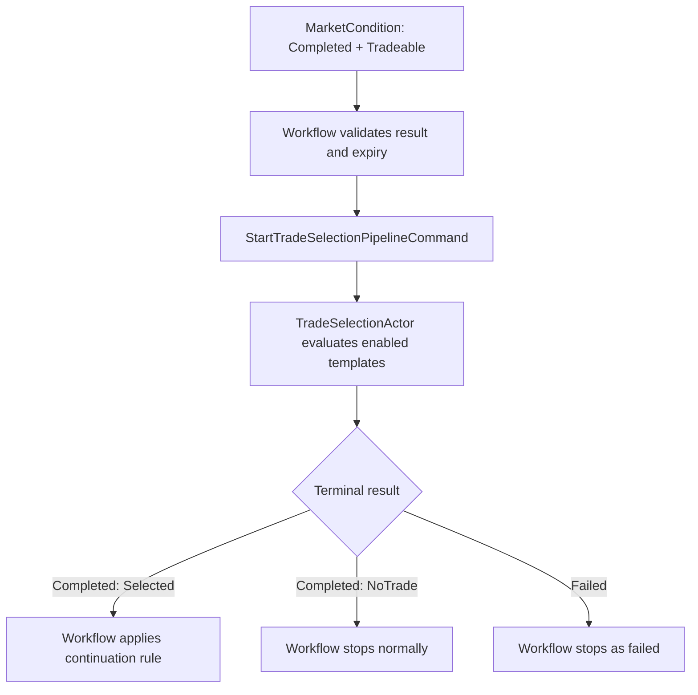

# TradeSelection High-Level Design

**Document version:** 0.4  
**Status:** High-level design  
**System:** Intrinsic Time Trade Strategy Workflow  
**Stage:** TradeSelection  
**Primary implementation target:** .NET 10 / C# actor-based trading system

**Portfolio/Fund prerequisite:** [Portfolio-Fund-High-Level-Design-v0.1.md](./Portfolio-Fund-High-Level-Design-v0.1.md) is authoritative for Portfolio, Fund, FundOrder/FundOrderTrade composition ownership, integer business IDs, persistence boundaries, legacy isolation, and the deferred OrderExecution boundary. Where an earlier section of this document describes Portfolio/Fund as a later refactor, the prerequisite design supersedes that timing.

**Portfolio/Fund implementation contract:** [Portfolio-Fund-Specification-v1.0.md](../../TomasAI.IFM.Domain.Portfolio/Docs/Portfolio-Fund-Specification-v1.0.md) defines the typed Fund snapshot, identity-reservation, actor/NATS, persistence, and validation contracts that TradeSelection must integrate with after that specification is approved.

## 1. Purpose

TradeSelection is the third decision stage in the trade strategy workflow. It receives an accepted, valid, `Tradeable` result from MarketCondition and determines whether the trade family assigned to the active Portfolio-owned Fund is compatible with that opportunity. The initial trading universe is restricted to ES futures and ES futures options.

Its central question is:

> Given this accepted market condition and the fund's permitted strategy catalog, which trade structure is compatible enough to send to OrderComposition?

TradeSelection selects a **trade template**, not an executable trade. It does not choose the exact expiration, strikes, contracts, leg ratios, limit price, broker order fields, or capital allocation. Those values are produced downstream by OrderComposition and approved or rejected by RiskManagement.

## 2. Position in the Strategy Workflow

The fixed opening workflow sequence is:

1. RegimeDiscovery
2. MarketCondition
3. TradeSelection
4. OrderComposition
5. RiskManagement
6. OrderExecution

The Strategy Workflow owns stage sequencing. TradeSelection cannot invoke OrderComposition directly or mutate workflow state.

## 3. Separation of Responsibilities

| Stage | Primary question | Authoritative output |
| --- | --- | --- |
| RegimeDiscovery | What broader market regime exists? | Trend, volatility, structure, scores, and horizon context |
| MarketCondition | Is a tradeable opportunity present now? | Tradeability, condition, direction, phase, strength, confidence, evidence, and blockers |
| TradeSelection | Which permitted trade structure best fits? | Selected template or `NoTrade`, with compatibility evidence and composition constraints |
| OrderComposition | What exact order expresses the selected structure? | Instrument contracts, expiration, strikes, legs, quantities, prices, and candidate order |
| RiskManagement | May the fund and portfolio accept the candidate? | Risk approval, rejection, or permitted adjustment |
| OrderExecution | Can the approved order be submitted and worked? | Broker submission and execution result |

The most important boundary is:

> **MarketCondition describes the opportunity. TradeSelection chooses the permitted structure. OrderComposition creates the exact trade.**

## 4. Core Design Decisions

1. **One actor at the workflow boundary.** `TradeSelectionActor` owns the stage. V1 uses private deterministic evaluator components rather than child actors.
2. **Template selection, not order construction.** The result identifies a versioned trade template plus constraints; it never contains executable legs or quantities.
3. **Deterministic authority.** Eligibility, compatibility, scoring, tie-breaking, reason codes, and summaries come from frozen versioned rules.
4. **Portfolio/Fund driven and ES-only.** The initial model reads one immutable Portfolio/Fund strategy snapshot for the trading year. That snapshot assigns the Daily Fund to ES futures, the Weekly Fund to ES futures-option verticals, and the Monthly Fund to directionally biased ES futures-option Iron Condors.
5. **NoTrade is a successful result.** It means the actor evaluated every permitted template and none satisfied the selection policy. It is not a technical failure.
6. **Completed does not mean continue.** Only the Strategy Workflow may accept the result and decide whether to invoke OrderComposition.
7. **Upstream results are immutable facts.** TradeSelection may assess compatibility but cannot change the RegimeDiscovery or MarketCondition classifications.
8. **One primary horizon per invocation.** Daily, Weekly, and Monthly selections are separate workflow executions, even when other horizons are supplied as context.
9. **No automatic retries.** A failure stops the realtime workflow. A later market trigger may start a new workflow after the current workflow terminates.
10. **No LLM authority.** An LLM may later summarize the completed workflow, but it cannot select or modify the trade template.
11. **Paper-trading priority.** V1 deliberately favors a small template catalog and deterministic compatibility rules so RegimeDiscovery, MarketCondition, TradeSelection, and OrderComposition can be validated before broker execution.
12. **Portfolio/Fund is a prerequisite.** TradeSelection consumes a frozen Portfolio-owned Fund mandate and delegated FundRiskEnvelope. Fund owns intent and template guidance; Portfolio owns capital and financial risk. The authoritative model is defined in [Portfolio-Fund-High-Level-Design-v0.1.md](./Portfolio-Fund-High-Level-Design-v0.1.md) and is required before TradeSelection and OrderComposition implementation proceeds.

## 5. Actor Boundary

### 5.1 Actor name

`TradeSelectionActor`

### 5.2 Actor responsibilities

The actor:

- validates the stage invocation and accepted upstream envelopes;
- validates the immutable Portfolio/Fund strategy snapshot and TradeSelection hint-profile version;
- verifies that the MarketCondition result remains valid;
- validates the one assigned template against fund, ES instrument, horizon, and operating state;
- applies the assigned template's compatibility hints to the accepted market condition;
- calculates deterministic compatibility scores when required;
- selects the assigned template or returns `NoTrade`;
- produces ordered supporting or incompatibility reasons;
- emits exactly one logical terminal event for the invocation.

### 5.3 Actor exclusions

The actor does not:

- decide whether the market is generally tradeable;
- recalculate RegimeDiscovery or MarketCondition;
- choose an exact option expiration or futures contract;
- choose strikes, wing width, leg ratios, contract count, or order quantity;
- calculate or reserve portfolio capital or margin;
- approve portfolio risk;
- obtain broker order IDs or submit orders;
- perform price discovery or set a limit price;
- mutate the Strategy Workflow state;
- retry itself automatically;
- call an LLM for selection;
- continually reread live market state while selecting.

## 6. Domain Model: Trade Template

A `TradeTemplate` is a versioned description of a trade structure that OrderComposition knows how to instantiate.

Recommended high-level fields are:

| Field | Purpose |
| --- | --- |
| `TradeTemplateId` | Stable identity, such as `ES.Monthly.DirectionalIronCondor` |
| `TemplateVersion` | Immutable version of the template contract |
| `TradeFamily` | Future, OptionVertical, or IronCondor |
| `InstrumentClass` | Futures or FuturesOptions |
| `PermittedInstrumentIds` | ES futures and ES futures options only |
| `DecisionHorizon` | Daily, Weekly, or Monthly |
| `PermittedDirections` | Bullish, Bearish, Neutral, or configured subset |
| `PermittedConditions` | Compatible MarketCondition classifications |
| `PermittedPhases` | Compatible initiating, confirmed, continuing, or other phases |
| `VolatilityRequirements` | Template-level compatibility requirements |
| `LiquidityRequirements` | Minimum accepted upstream liquidity classification |
| `MinimumStrength` | Minimum MarketCondition strength |
| `MinimumConfidence` | Minimum MarketCondition confidence |
| `CompositionPolicyId` | Downstream OrderComposition policy to use |
| `Priority` | Optional preference used when a future Fund exposes several templates |
| `Enabled` | Explicit production enablement flag |

The template may define **constraint ranges** for OrderComposition, such as a permitted DTE band, maximum number of legs, allowed debit or credit style, or a configured payoff profile. It must not contain an expiration, strike, quantity, or price chosen for the current trade.

## 7. Invocation Contract

### 7.1 Start command

`StartTradeSelectionPipelineCommand`

| Field | Purpose |
| --- | --- |
| `WorkflowId` | GUID v7 identity shared by the complete strategy workflow and correlated with the OTEL trace |
| `StageInvocationId` | Unique identity for this logical TradeSelection invocation |
| `EntityId` | Workflow concurrency entity, such as Portfolio-Fund-strategy-instrument identity |
| `PortfolioId` / `PortfolioVersion` | Authoritative Portfolio identity and frozen version |
| `FundId` | Fund for which the selection is being made |
| `FundMandateVersion` | Frozen Fund mandate version |
| `TradingYear` | Annual active-fund configuration boundary |
| `UnderlyingRoot` | Must be `ES`; exact contracts remain downstream |
| `DecisionHorizon` | Daily, Weekly, or Monthly |
| `WorkflowRevision` | Expected workflow revision for ordered acceptance |
| `TriggeredAtUtc` | Time of the original futures intrinsic-time trigger |
| `StageStartedAtUtc` | Time TradeSelection was invoked |
| `TriggerContext` | Immutable DC, TE, or TR trigger context |
| `RegimeDiscoveryResult` | Previously accepted immutable regime result |
| `MarketConditionResult` | Previously accepted immutable `Tradeable` result |
| `WorkflowSnapshot` | Read-only context accepted through prior stages |
| `PortfolioFundStrategySnapshot` | Immutable resolved Portfolio/Fund mandate, assigned templates/profiles, and delegated-envelope reference |
| `ParameterSetId` | TradeSelection parameter-set identity |
| `ParameterSetVersion` | Immutable parameter version frozen at workflow start |
| `TraceContext` | W3C trace propagation data when not derivable from workflow correlation |

The command carries accepted result envelopes rather than a mutable workflow object.

### 7.2 Preconditions

The Strategy Workflow should invoke TradeSelection only after accepting:

- `MarketConditionPipelineCompletedEvent`;
- `Tradeability = Tradeable`;
- a non-expired MarketCondition result;
- matching workflow, entity, instrument, fund, and horizon identities;
- the expected workflow revision and frozen parameter versions.

TradeSelection validates these conditions again at its trust boundary. An invalid invocation is a contract failure, not `NoTrade`.

### 7.3 Optional cancel command

`CancelTradeSelectionPipelineCommand` is optional for the first implementation.

If implemented, an applied cancellation emits `TradeSelectionPipelineFailedEvent` with `FailureCategory = Cancelled`. This preserves the workflow-wide invariant that every stage invocation ends with exactly one `Completed` or `Failed` event.

### 7.4 Queries

Read-only query contracts may include:

- `GetTradeSelectionInvocationStateQuery`
- `GetLatestTradeSelectionResultQuery`
- `GetTradeSelectionHistoryQuery`
- `GetEligibleTradeTemplatesQuery`

Query projections may be eventually consistent. They are not part of the realtime decision path and cannot change a running invocation.

## 8. Input Model

TradeSelection evaluates four input groups.

### 8.1 Accepted MarketCondition result

The primary input provides:

- `Tradeability`;
- condition type;
- direction;
- phase;
- strength and confidence;
- volatility behavior;
- liquidity quality;
- supporting and conflicting evidence;
- primary reason code;
- evaluation and validity timestamps;
- source snapshot identity and hash;
- MarketCondition parameter version.

TradeSelection consumes this classification. It does not reopen the MarketCondition snapshot or reclassify the market.

### 8.2 Accepted RegimeDiscovery result

The regime result remains available as supporting context for template compatibility, including:

- primary and supporting horizon regimes;
- trend and volatility regimes;
- term structure and market structure;
- regime strength, confidence, and evidence;
- upstream snapshot and parameter identities.

TradeSelection must not override the MarketCondition result using the broader regime. Any permitted cross-horizon or regime alignment check is an explicit versioned compatibility rule.

### 8.3 Workflow, Portfolio, and Fund context

The read-only context includes:

- Portfolio identity, configuration version, operating state, and policy reference;
- active Fund identity and immutable mandate version for the trading year;
- decision horizon;
- eligible asset types, economic exposures, and trade families;
- assigned TradeTemplate and OrderComposition-policy references;
- versioned MarketCondition compatibility hints;
- active, paused, or disabled Fund operating state; and
- the Portfolio-delegated `FundRiskEnvelope` identity, version, capacity state, and validity interval.

TradeSelection may use Portfolio/Fund permission and capacity guidance to determine whether a template is eligible, but it does not calculate live exposure, reserve capital, or approve financial risk. RiskManagement remains the financial approval authority and consumes the authoritative Portfolio state and delegated FundRiskEnvelope.

### 8.4 Frozen configuration

The workflow freezes the following identities and versions before the pipeline executes:

- strategy catalog;
- TradeSelection parameter set;
- referenced template definitions;
- deterministic scoring and tie-break policy;
- reason-code and summary-template versions.

No configuration update can change an executing workflow.

## 9. Strategy Catalog and Supported Scope

The actor may select trades for all three planned Daily, Weekly, and Monthly funds. The complete supported universe is limited to ES futures and ES futures options.

| Horizon | Permitted trade family | Direction output | Supported instrument |
| --- | --- | --- | --- |
| Daily | Directional futures | Long or Short | ES futures |
| Weekly | Futures-option vertical | Bullish or Bearish | ES futures options |
| Monthly | Directionally biased Iron Condor | Bullish-biased or Bearish-biased | ES futures options |

All three mappings are valid TradeSelection targets. The catalog binds each template to exactly one fund, one primary horizon, and the appropriate ES instrument class. Configuration may pause a template operationally, but Daily futures and Weekly verticals are not deferred by this design.

For the simplest initial implementation, each Fund exposes exactly one primary template: Daily ES directional futures, Weekly ES futures-option verticals, and Monthly ES futures-option directionally biased Iron Condors. TradeSelection performs deterministic compatibility validation for the applicable Fund and returns either its template or `NoTrade`. The versioned assignment model permits later multi-template ranking without changing the stage boundary.

### 9.1 Initial annual active-Fund model

Each Portfolio initially maintains three active Fund definitions for each trading year:

| Fund | Primary horizon | Assigned asset | Assigned trade family |
| --- | --- | --- | --- |
| Daily ES Futures Fund | Daily | ES futures | Directional future |
| Weekly ES Vertical Fund | Weekly | ES futures options | Vertical spread |
| Monthly ES Iron Condor Fund | Monthly | ES futures options | Directionally biased Iron Condor |

Exactly one active Fund should exist for each `(PortfolioId, TradingYear, DecisionHorizon)` tuple. A missing Fund, multiple active Funds for the same tuple, an inactive Fund, or a non-ES assignment is a configuration failure. It is not a `NoTrade` result.

The Strategy Workflow resolves the Portfolio/Fund context at workflow start, freezes the returned versions, and passes an immutable `PortfolioFundStrategySnapshot` to TradeSelection, OrderComposition, and RiskManagement. A configuration update affects only workflows started after activation of the new version.

Recommended read query:

`GetActiveTradingFundQuery(PortfolioId, TradingYear, DecisionHorizon)`

### 9.2 Minimum PortfolioFundStrategySnapshot

The storage schema may be normalized, but the workflow should receive one resolved snapshot containing at least:

| Field | Purpose |
| --- | --- |
| `PortfolioId` / `PortfolioVersion` | Authoritative parent identity and frozen Portfolio configuration version |
| `FundId` | Stable fund identity |
| `FundCode` | Stable operator-facing code |
| `FundMandateVersion` | Immutable Fund mandate version |
| `TradingYear` | Annual configuration boundary |
| `ActiveFromUtc` / `ActiveUntilUtc` | Effective interval |
| `OperatingState` | `Active`, `Paused`, or `Disabled` |
| `DecisionHorizon` | Daily, Weekly, or Monthly |
| `UnderlyingRoot` | Must be `ES` in V1 |
| `AssetType` | `Futures` or `FuturesOptions` |
| `TradeFamily` | `DirectionalFuture`, `VerticalSpread`, or `DirectionalIronCondor` |
| `TradeTemplateId` / `TradeTemplateVersion` | The one V1 template assigned to the fund |
| `TradeSelectionHintProfileId` / `Version` | Simple compatibility hints for TradeSelection |
| `OrderCompositionProfileId` / `Version` | Exact construction policy selected downstream |
| `PortfolioPolicyId` / `Version` | Frozen Portfolio financial-policy reference |
| `FundRiskEnvelopeId` / `Version` | Portfolio-delegated Fund financial authority |
| `CapacityState` / `ValidUntilUtc` | Whether new exposure may be considered and when permission expires |

The planned 10% Daily, 30% Weekly, and 60% Monthly allocation may be used during Portfolio setup to seed delegated Fund envelopes. Those percentages are allocation provenance, not contract counts or pipeline risk units. Portfolio owns both the percentage and resolved currency authority; RiskManagement compares resolved amounts.

### 9.3 Minimum TradeSelection hints

The initial implementation does not perform broad asset-class ranking. The active Fund mandate already supplies the eligible asset and trade family. The hint profile therefore needs only the values required to decide whether the assigned family is compatible with the accepted MarketCondition:

- permitted direction or bias values;
- permitted MarketCondition types;
- permitted phases;
- minimum MarketCondition strength;
- minimum MarketCondition confidence;
- permitted volatility behaviors;
- minimum liquidity quality;
- optional cross-horizon agreement requirement;
- selection-result validity lifetime;
- stable reason-code and summary-template versions.

DTE, delta, strike, spread width, credit/debit style, price, and quantity belong to the referenced OrderComposition profile rather than the minimum TradeSelection input.

### 9.4 Simplified V1 TradeSelection decision

TradeSelection performs the following deterministic steps:

1. Validate the workflow, upstream results, Portfolio identity/version, Fund identity/mandate version, trading year, and active intervals.
2. Validate that the fund mapping matches the workflow horizon and ES-only universe.
3. Validate `MarketConditionResult.Tradeability = Tradeable` and that the result has not expired.
4. Apply the fund's small compatibility-hint set to the accepted RegimeDiscovery and MarketCondition results.
5. Return `Selected` with the fund's one assigned template and the MarketCondition direction or bias, or return `NoTrade` with stable incompatibility reasons.

There is no initial cross-asset optimizer, unrestricted multi-template ranking, Portfolio-capacity optimizer, or LLM decision. Portfolio permissions constrain eligibility; TradeSelection remains a compatibility gate rather than a second MarketCondition, risk engine, or order builder.

### 9.5 Minimum RiskManager inputs

`StartRiskManagementPipelineCommand` needs more than the Fund definition. The Strategy Workflow passes the same frozen `PortfolioFundStrategySnapshot` previously accepted by TradeSelection and OrderComposition; RiskManagement does not resolve a newer Portfolio, Fund, or envelope version midway through the workflow. Its minimum immutable input is:

| Input | Minimum contents |
| --- | --- |
| Workflow envelope | `WorkflowId`, `StageInvocationId`, `EntityId`, `PortfolioId`, `FundId`, revision, timestamps, and trace context |
| Portfolio/Fund snapshot | Portfolio and Fund identities, versions, active states, mandate, policy, template, and profile references |
| FundRiskEnvelope | Portfolio-delegated capital, per-trade and aggregate risk, margin/notional, position/contract caps, capacity state, and validity |
| Accepted TradeSelection result | Selected family, direction or bias, and template identity |
| Candidate order | Exact ES contract or option legs, quantities, entry prices, multiplier, fees, slippage reserve, and expiry |
| Candidate risk summary | Maximum loss or futures loss-at-exit, stress loss, gross notional, initial-margin estimate, and calculator version |
| Current Portfolio/Fund risk snapshot | Portfolio and Fund open risk, working-order reserved risk, exposures, positions, current contracts, and snapshot timestamp |
| Broker/account safety snapshot | Account connected and tradeable, sufficient broker-reported funds/margin, and reconciliation freshness |

The candidate and current-risk snapshots must be point-in-time, source-timestamped, and versioned. Broker/account checks remain mandatory. Broad cross-asset optimization may be deferred, but Portfolio ownership and delegated Fund limits are not deferred.

### 9.6 Initial delegated Fund gross-risk definition

The initial Portfolio-owned FundRiskEnvelope may use a deliberately simple additive Fund-risk ledger:

\[
ProjectedFundGrossRisk = OpenGrossRisk + ReservedWorkingOrderRisk + CandidateGrossRisk
\]

A candidate cannot be approved when:

\[
CandidateGrossRisk > MaxGrossRiskPerTrade
\]

or:

\[
ProjectedFundGrossRisk > MaxAggregateGrossRisk
\]

Risk is reserved before order submission. The reservation is released on rejection or cancellation and converted to open-position risk after broker-confirmed fills. This prevents simultaneous workflows from spending the same apparent capacity.

All three funds express gross risk in the same currency. For conservative V1 accounting, an open position retains at least its originally approved gross-risk amount until broker-confirmed closure. A later recalculation may increase the recorded risk but must not reduce it merely because an unrealized profit appears. Partial fills convert the proportional reservation to open risk while preserving the unfilled reservation.

V1 adds gross risk across positions without cross-position netting, correlation credits, hedge credits, or margin-offset credits. Defined-risk offsets inside one validated atomic vertical or Iron Condor are recognized because they are part of that candidate's bounded payoff. This makes the ledger intentionally conservative and easy to diagnose during paper trading.

#### Defined-risk Weekly verticals

OrderComposition calculates maximum loss from the exact legs and RiskManagement independently validates it.

For a debit vertical:

\[
CandidateGrossRisk = NetDebit \times Multiplier \times Quantity + CostReserve
\]

For a credit vertical:

\[
CandidateGrossRisk = (SpreadWidth - NetCredit) \times Multiplier \times Quantity + CostReserve
\]

#### Defined-risk Monthly Iron Condors

For a standard defined-risk condor, including unequal directional wings:

\[
CandidateGrossRisk = (\max(PutWingWidth, CallWingWidth) - NetCredit) \times Multiplier \times Quantity + CostReserve
\]

RiskManagement must validate the exact expiration payoff across all legs rather than trust only the supplied formula fields.

#### Daily ES futures

An ES future has no option-style finite maximum loss. V1 therefore retains two distinct controls:

\[
GrossNotional = |Contracts| \times FuturesPrice \times ESContractMultiplier
\]

and:

\[
FuturesCandidateGrossRisk = \max(PlannedLossAtExit, ConfiguredStressLoss) + CostReserve
\]

where:

\[
PlannedLossAtExit = |EntryPrice - MaximumLossExitPrice| \times ESContractMultiplier \times |Contracts|
\]

The ES contract multiplier is resolved from the instrument definition rather than hardcoded in business logic. The current standard ES multiplier is USD 50 per index point.

The Daily fund candidate must satisfy all of the following:

- a finite, versioned maximum-loss exit threshold is present;
- candidate gross risk is within the per-trade and aggregate fund limits;
- projected gross notional is within `MaxGrossNotional`;
- contract count is within `MaxContractsPerTrade`;
- broker margin and account-safety checks pass.

Initial margin is recorded and checked but is not treated as the trade's maximum loss.

### 9.7 Minimum RiskManager decision

RiskManager returns `Approved` or `Rejected` with:

- workflow, Portfolio, and Fund identities;
- Portfolio policy, Fund mandate, and FundRiskEnvelope versions;
- candidate identity and hash;
- candidate gross risk;
- projected aggregate Portfolio and delegated Fund gross risk;
- gross notional where applicable;
- open and reserved risk before approval;
- approved quantity and price tolerance;
- approval expiry;
- stable decision and rejection reasons.

RiskManagement may reject or reduce the proposed quantity only through a deterministic, explicit rule. It may never increase quantity. Any quantity change must produce a candidate representation whose gross-risk values are recalculated and bound to the approval.

`Rejected` is a successful business result. `Failed` is reserved for inability to evaluate reliably, such as corrupt candidate economics, missing fund/risk configuration, stale broker truth, or a calculator invariant violation. Neither outcome causes an automatic retry.

### 9.8 Initial omissions by design

The Portfolio/Fund ownership model is not deferred. The following advanced capabilities may be staged after the initial deterministic ES implementation:

- dynamic Fund risk-budget reallocation;
- advanced cross-fund correlation optimization beyond hard Portfolio limits;
- broad selection among futures, futures options, equity, and equity options;
- asset-vehicle cost and payoff optimization;
- adaptive template-ranking models; and
- automated annual compounding and capital redistribution.

Portfolio allocation, delegated Fund envelopes, hard Portfolio constraints, and operating-state permission remain authoritative prerequisites even when advanced optimization is deferred.

## 10. V1 Evaluation Model

Evaluation occurs in five ordered steps.

### 10.1 Step 1: invocation and upstream validation

Validate:

- message contract and schema version;
- workflow, invocation, entity, fund, instrument, and horizon identities;
- confirmation that the instrument belongs to the ES futures or ES futures-option universe;
- expected workflow revision;
- frozen catalog and parameter versions;
- accepted upstream result identities;
- `Tradeability = Tradeable`;
- MarketCondition result freshness;
- required upstream fields and invariants.

A validation problem that prevents reliable evaluation produces `Failed`, not `NoTrade`.

### 10.2 Step 2: assigned-template eligibility

Validate the one template assigned by the active Fund:

- template is enabled;
- fund and horizon match;
- instrument and instrument class are permitted;
- template version is available;
- current operating policy permits new selection;
- MarketCondition direction is supported;
- condition type and phase are supported;
- minimum strength, confidence, volatility, and liquidity classifications are met;
- required downstream composition policy exists.

An expected incompatibility produces `NoTrade` with a stable reason. It does not fail the stage.

### 10.3 Step 3: compatibility evaluation

For the assigned template, the deterministic evaluator may calculate normalized components such as:

- condition-type fit;
- directional alignment;
- phase fit;
- trend-regime alignment;
- volatility-regime and volatility-behavior fit;
- liquidity-quality fit;
- primary-horizon and cross-horizon agreement;
- MarketCondition strength and confidence;
- conflicting-evidence penalty;
- template-specific timing or event-policy fit already represented in the accepted snapshot.

The exact weights and thresholds belong in the detailed specification. A normalized score is optional in V1 because no cross-template ranking occurs. Identical frozen inputs and versions must always produce the same result.

### 10.4 Step 4: selection decision

If the assigned template meets every required compatibility rule, it is selected. Otherwise the result is `NoTrade`.

The initial implementation has no ranking, tie-breaking, randomness, or LLM selection. General ranking remains an optional future expansion.

### 10.5 Step 5: result assembly

The actor returns:

- `Selected` with exactly one template; or
- `NoTrade` with reasons showing why no enabled template qualified.

Before committing, the actor verifies that the selected template was evaluated, remains enabled in the frozen catalog, has a valid composition policy, and produces internally consistent direction and constraints.

## 11. Selection Compatibility Examples

These examples illustrate responsibility boundaries; they are not final trading rules.

| MarketCondition | Possible compatible template | TradeSelection decision concept |
| --- | --- | --- |
| Daily, bullish directional, confirmed, strong confidence | ES directional future | Select the Long futures template if enabled and its threshold is met |
| Weekly, bearish directional, initiating or confirmed | Bearish ES option vertical | Select the configured bearish vertical template; OrderComposition chooses its contracts and strikes |
| Monthly, bullish directional continuation, acceptable volatility and liquidity | Bullish-biased Iron Condor | Select the monthly template; OrderComposition constructs the four legs |
| Monthly, bearish directional continuation, acceptable volatility and liquidity | Bearish-biased Iron Condor | Select the monthly template with bearish bias |
| Tradeable market but unsupported transition or conflicting evidence | None | Return `NoTrade / NoCompatibleTemplate` |

TradeSelection does not assume that every `Tradeable` MarketCondition must produce a trade. `Tradeable` means selection is permitted to run; compatibility rules may still produce `NoTrade`.

## 12. TradeSelection Result

`TradeSelectionResult` is an immutable, self-contained result envelope.

### 12.1 Core result

| Field | Recommended values or purpose |
| --- | --- |
| `SelectionOutcome` | `Selected` or `NoTrade` |
| `TradeTemplateId` | Selected stable template identity; absent for `NoTrade` |
| `TradeTemplateVersion` | Frozen selected template version |
| `TradeFamily` | `Future`, `OptionVertical`, `IronCondor`, or `None` |
| `InstrumentClass` | `Futures`, `FuturesOptions`, or `None` |
| `DirectionalBias` | `Long`, `Short`, `Bullish`, `Bearish`, `Neutral`, or `Undefined` |
| `DecisionHorizon` | Daily, Weekly, or Monthly |
| `CompatibilityScore` | Normalized 0 to 100 score; optional when a single-template binary policy is used |
| `SelectionConfidence` | Deterministic 0.00 to 1.00 confidence in template compatibility |
| `PrimaryReasonCode` | Stable reason for selection or no selection |
| `CompositionPolicyId` | Policy that OrderComposition must use |
| `ValidUntilUtc` | Latest time at which the workflow may accept this result |

### 12.2 Composition constraints

`CompositionConstraints` communicates the selected structure's intent without constructing the order. It may contain:

- required instrument class and trade family;
- directional bias;
- allowed debit, credit, or configured pricing style;
- permitted expiration or DTE range;
- permitted leg-count and structure shape;
- permitted width or payoff-profile ranges;
- template-specific liquidity requirements that OrderComposition must revalidate;
- named composition parameter-set identity and version.

It must not contain a current expiration selection, strike selection, contract quantity, leg quantity, marketable price, broker order ID, or risk approval.

### 12.3 Evidence and rejected alternatives

The result also contains:

- ordered `SelectionEvidenceItems`;
- ordered `ConflictingEvidenceItems`;
- `RejectedAlternatives`, each with template identity, eligibility status, score if calculated, and stable reason codes;
- accepted upstream result identities and hashes;
- catalog and parameter-set identities and versions;
- evaluated and validity timestamps;
- deterministic `SummaryText`.

Evidence is machine-readable authority. Summary text is an operator projection and may later be supplied to a non-authoritative workflow summary service.

### 12.4 Example deterministic summaries

Selected:

> Monthly ES TradeSelection completed: selected the bullish-biased Iron Condor template with compatibility score 78 and confidence 0.84. The accepted MarketCondition was bullish directional continuation with healthy liquidity. Exact expiration, strikes, quantity, and price remain for OrderComposition.

NoTrade:

> Monthly ES TradeSelection completed with NoTrade: the market was tradeable, but no enabled template supports the accepted Transition phase at the required confidence. No order composition was attempted.

## 13. Events and Terminal Semantics

### 13.1 Lifecycle events

- `TradeSelectionPipelineStartedEvent`
- `TradeSelectionPipelineCompletedEvent`
- `TradeSelectionPipelineFailedEvent`

Only `Completed` and `Failed` are terminal.

### 13.2 Completed event

`TradeSelectionPipelineCompletedEvent` contains:

- workflow, entity, fund, instrument, and invocation identities;
- accepted workflow revision;
- full `TradeSelectionResult`;
- deterministic summary;
- processing timestamps and duration;
- catalog, template, parameter, and upstream-result identities;
- trace context.

It means the actor evaluated the configured selection policy successfully. It does **not** mean:

- a template was necessarily selected;
- an executable candidate order exists;
- exact legs or quantities have been chosen;
- portfolio risk is approved;
- an order may be submitted.

### 13.3 Failed event

`TradeSelectionPipelineFailedEvent` contains:

- workflow, entity, fund, instrument, and invocation identities;
- stage and expected workflow revision;
- failure category and stable reason code;
- safe diagnostic message;
- catalog, parameter, and available upstream identities;
- whether processing started;
- timestamps, duration, and trace context.

Initial failure categories are:

- `ContractInvalid`
- `ConfigurationUnavailable`
- `UpstreamResultInvalid`
- `CatalogInvalid`
- `CalculationFailed`
- `InvariantViolation`
- `Cancelled` — optional
- `Timeout` — optional

An unsupported or incompatible market condition is not a failure when the actor can evaluate it reliably. It produces `Completed + NoTrade`.

### 13.4 Exactly one logical terminal event

For each `StageInvocationId`, the actor commits exactly one logical terminal outcome.

- An identical duplicate command is deduplicated.
- A reused invocation identity with a different payload is a contract violation.
- Transport recovery may republish an already committed terminal event without recalculation.
- A late event after an accepted timeout or cancellation cannot create a second terminal outcome.

Republishing a committed result is transport recovery, not a strategy retry.

## 14. Workflow Continuation Rules

The Intrinsic Time Strategy Workflow actor is the sole continuation authority.

After receiving a terminal event it:

1. validates workflow, entity, fund, horizon, invocation, stage, and revision;
2. validates upstream, catalog, template, and parameter versions;
3. records the terminal event and accepted result;
4. advances the workflow revision once for the logical transition;
5. applies the versioned continuation rule.

| TradeSelection terminal outcome | Workflow action |
| --- | --- |
| `Completed + Selected + valid result` | Continue to OrderComposition |
| `Completed + NoTrade` | Stop normally with the selection reason |
| `Completed + expired result` | Stop with `TradeSelectionExpired`; do not rerun the stage |
| `Completed + invalid result envelope` | Stop as a workflow contract failure |
| `Failed` | Stop immediately as failed |

The workflow creates a new `StageInvocationId` when it invokes OrderComposition and passes the accepted TradeSelection result unchanged.

## 15. Validity and Time Semantics

TradeSelection uses frozen inputs but remains part of a realtime decision.

- `EvaluatedAtUtc` records when selection completed.
- `ValidUntilUtc` is no later than the accepted MarketCondition `ValidUntilUtc`.
- The template or selection parameter set may define a shorter selection lifetime.
- The workflow checks validity before invoking OrderComposition.
- OrderComposition must independently revalidate time-sensitive market and chain data before creating a candidate.
- An expired result stops the workflow; TradeSelection is not automatically rerun.

The actor should not read a fresh option chain or futures quote to extend the upstream decision. Structural selection is based on the accepted point-in-time evidence. Exact tradability at composition time belongs downstream.

## 16. Private Components

Recommended private deterministic components are:

- `TradeSelectionInvocationValidator`
- `StrategyCatalogResolver`
- `TradeTemplateEligibilityEvaluator`
- `TradeTemplateCompatibilityEvaluator`
- `TradeTemplateRanker`
- `TradeSelectionInvariantValidator`
- `TradeSelectionSummaryBuilder`

These are testable components inside the stage boundary, not independently orchestrated actors in V1.

## 17. State and Persistence

### 17.1 Private actor state

Private state includes:

- invocation identity and status;
- command contract fingerprint;
- accepted workflow revision;
- upstream result identities;
- catalog and parameter versions;
- evaluated template identities;
- committed terminal outcome;
- result or failure details;
- processing timestamps.

### 17.2 Authoritative and query storage

Consistent with the wider architecture:

- authoritative stage events follow the event-store path;
- the accepted result is recorded in Strategy Workflow state;
- ScyllaDB may store query, history, and Operations UI projections;
- configuration and catalog versions remain queryable in ScyllaDB;
- Redis may cache current configuration or projections but is not the authoritative decision history.

Persist compact evidence and upstream references. Do not embed unrestricted option-chain, order-book, or tick payloads in workflow events.

## 18. Configuration Ownership

The Strategy Workflow owns parameter selection and freezes versions for the workflow. TradeSelection owns correct application of the supplied versions.

Initial configuration should support:

- exactly one active annual Fund per Portfolio for each Daily, Weekly, and Monthly horizon;
- one assigned ES template per initial Fund;
- Portfolio and Fund active intervals and operating states;
- TradeSelection hint and OrderComposition profile references;
- Portfolio policy and delegated FundRiskEnvelope references;
- permitted condition, direction, phase, and volatility classifications;
- minimum strength and confidence;
- composition policy references;
- FundRiskEnvelope capacity state and validity required for template eligibility;
- result validity lifetime;
- evidence, reason-code, and summary-template versions.

Multi-template priority, scoring, tie-breaking, and broad asset-vehicle ranking are optional future expansions described in Section 24. Portfolio allocation and FundRiskEnvelope ownership are already required. A Portfolio, Fund, parameter, or template update applies only to a later workflow and cannot alter a result already being calculated or accepted.

## 19. Observability and Traceability

The workflow GUID v7 propagates through commands, events, logs, and spans and is mapped consistently to the OTEL trace identity. `StageInvocationId` identifies the TradeSelection execution.

### 19.1 Traces

Recommended stable spans include:

- TradeSelection command handling;
- contract and upstream validation;
- catalog resolution;
- template eligibility evaluation;
- compatibility scoring;
- selection and tie-breaking;
- invariant validation;
- terminal event persistence and publication.

Useful span attributes include stage, fund, instrument, horizon, workflow revision, catalog version, parameter version, selection outcome, trade family, template version, compatibility band, primary reason code, and evaluated-template count.

### 19.2 Metrics

Recommended metrics include:

- processing count by terminal outcome;
- Selected versus NoTrade count;
- selected count by trade family and template;
- rejection count by stable reason code;
- failure count by failure category;
- processing duration and p50/p95/p99;
- queue depth and actor mailbox age;
- templates evaluated per invocation;
- compatibility-score and confidence distributions;
- result-expired-before-continuation count;
- timeout and manual-cancel count when implemented.

Workflow, entity, and invocation IDs must not be metric labels because they create unbounded cardinality.

### 19.3 Structured logs

Logs emphasize stage transitions, chosen template, NoTrade reasons, configuration failures, invariant violations, and unusual latency. Per-component scores belong in the result and trace rather than a large number of routine information logs.

## 20. Operations UI Projection

The Strategy Observation view should display:

- stage status and duration;
- `Selected` or `NoTrade`;
- selected trade family, template, version, and directional bias;
- compatibility score and selection confidence;
- primary reason and ordered supporting evidence;
- rejected alternatives and their reason codes;
- MarketCondition identity and expiry inherited by the selection;
- catalog and parameter versions;
- evaluation and validity timestamps;
- deterministic summary;
- workflow, trace, and invocation correlation identifiers.

`NoTrade` appears as a normal successful business outcome. `Failed` appears as an operational warning or error requiring diagnosis.

## 21. Security and Data Integrity

- Commands and events use authenticated NATS service identities and least-privilege subjects.
- Start commands are accepted only from the authorized Strategy Workflow identity.
- Optional cancel commands require the authorized workflow or operator role established through the Keycloak-based Zero Trust design.
- Catalog, template, parameter, and schema versions are validated before evaluation.
- Event and MessagePack contracts are explicitly versioned.
- Diagnostic messages exclude credentials, unrestricted account data, and raw broker payloads.
- Query endpoints cannot mutate actor or workflow state.

## 22. Failure, Timeout, and Cancellation Policy

V1 performs no automatic processing retry.

Optional later controls are:

- a per-stage workflow timeout;
- a manual cancel command from the Operations UI;
- a warning when the actor fails to produce a terminal event within the expected interval.

Timeout or cancellation must race atomically with normal completion. Exactly one outcome is committed, and the workflow must ignore a late completion after it has accepted the timeout or cancellation terminal result.

## 23. Testing Strategy

### 23.1 Deterministic rule tests

- eligibility for each fund, instrument, horizon, condition, direction, and phase;
- exact boundary behavior for strength, confidence, and compatibility thresholds;
- every stable rejection reason;
- compatibility component reconciliation with the final score;
- stable selection and tie-breaking across collection order changes;
- identical inputs and versions produce identical results;
- a disabled template is never selected.

### 23.2 Boundary tests

- a selected template contains no exact expiration, strikes, quantity, price, or risk approval;
- MarketCondition and RegimeDiscovery results are never mutated;
- TradeSelection does not read an unrestricted live chain to construct legs;
- the selected `CompositionPolicyId` exists and matches the template version.

### 23.3 Contract and invariant tests

- valid and invalid start commands;
- stale or conflicting workflow revisions;
- upstream identity or parameter mismatch;
- expired MarketCondition input;
- missing or corrupt catalog and template versions;
- duplicate delivery and conflicting invocation reuse;
- exactly one logical terminal event;
- `NoTrade` is never published as `Failed`;
- a calculation or invariant failure is never disguised as `NoTrade`.

### 23.4 Workflow integration tests

- MarketCondition `Tradeable` invokes TradeSelection once;
- MarketCondition `NotTradeable` never invokes TradeSelection;
- `Selected` continues to OrderComposition;
- `NoTrade` stops normally;
- `Failed` stops immediately;
- expired selection stops without redispatch;
- duplicate or late terminal events do not advance the workflow twice;
- optional timeout and cancellation races preserve terminal atomicity.

### 23.5 Strategy-profile fixtures

Use captured immutable fixtures for:

- Monthly bullish and bearish directionally biased Iron Condor selection;
- Monthly incompatible condition producing `NoTrade`;
- Daily long and short ES futures selection;
- Weekly bullish and bearish ES futures-option vertical selection;
- multiple eligible templates exercising deterministic priority and tie-breaking.

Production remains realtime and has no business replay requirement. Replayable fixtures are for deterministic tests and version comparison only.

### 23.6 Simplified delegated Fund-risk tests

- exactly one active Fund resolves for each Portfolio, trading year, and horizon;
- inactive, expired, missing, duplicate, or mismatched Portfolio/Fund definitions fail safely;
- percentage-based Portfolio allocations resolve to recorded FundRiskEnvelope currency values;
- option-leg maximum loss is independently recalculated;
- asymmetric Iron Condor risk uses the larger wing loss;
- futures initial margin is never treated as maximum loss;
- futures candidates without a finite maximum-loss exit threshold are rejected;
- futures planned-loss, stress-loss, notional, and contract caps are enforced;
- open risk, working-order reservations, and candidate risk are added without double counting;
- rejected and cancelled orders release reservations;
- broker-confirmed fills convert reservations into open risk;
- concurrent candidates cannot consume the same remaining delegated Fund risk;
- RiskManager never increases candidate quantity;
- broker/account safety failure rejects new exposure.

## 24. Authoritative Portfolio/Fund Prerequisite

### 24.1 Responsibility principle

[Portfolio-Fund-High-Level-Design-v0.1.md](./Portfolio-Fund-High-Level-Design-v0.1.md) promotes Portfolio/Fund from a deferred refactor to an implementation prerequisite. The authoritative model is:

> **Fund owns investment intent and selection guidance. Portfolio owns capital and financial risk.**

Financial constraints may still apply to a specific fund, but Portfolio creates and delegates them through a versioned `FundRiskEnvelope`. The Fund reports financial state and utilization; it does not independently author capital, exposure, margin, or loss limits.

| Component | Authoritative responsibility |
| --- | --- |
| Fund | Mandate, eligible assets, horizon, objectives, payoff preferences, strategy hints, and performance attribution |
| Portfolio | Capital allocation, reserves, all financial limits, aggregate exposure, cross-fund correlation, risk states, and compounding |
| TradeSelection | Select the market-fit asset vehicle and payoff/strategy family within Fund mandate and Portfolio permissions |
| OrderComposition | Construct exact contracts, expirations, strikes, legs, quantities, and prices within the selected intent |
| RiskManagement | Enforce Portfolio hard limits and delegated fund envelopes; approve, reduce, or reject |
| OrderExecution | Communicate only approved economics to the broker and preserve broker truth |

### 24.2 Fund mandate alignment

The `FundMandateSnapshot` is non-financial and may contain:

- stable Fund identity and version;
- purpose and investment objective;
- decision horizon;
- income, growth, directional, volatility, or mixed objective;
- eligible asset types: futures, futures options, equity, and equity options;
- eligible economic exposures and underlying universes;
- permitted direction and bias values;
- preferred payoff intents: linear directional, defined-risk directional, convex directional, directional income, range income, volatility expansion, or volatility contraction;
- strategy-family hints and relative preference weights;
- preferred holding-period and entry-frequency ranges;
- MarketCondition and RegimeDiscovery compatibility preferences;
- DTE, delta, strike-distance, width, credit/debit, and payoff-shape preferences used as OrderComposition hints;
- minimum market-quality and operational-complexity preferences;
- configuration, parameter, and summary-template versions;
- active, paused, disabled, or retired mandate state.

The Fund should also report, but not set authoritative thresholds for:

- positions and working orders;
- realized and unrealized P&L;
- drawdown;
- margin and risk utilization;
- notional and Greeks;
- performance, expectancy, slippage, and health;
- active workflows and incidents.

### 24.3 Portfolio authority alignment

Portfolio owns:

- total broker equity and approved capital base;
- protected reserves and deployable capital;
- target fund allocations and permitted allocation ranges;
- per-fund delegated capital and risk envelopes;
- maximum gross and net notional;
- maximum leverage and margin utilization;
- maximum aggregate ES exposure and delta;
- maximum aggregate option gamma, vega, and theta;
- maximum risk per trade and position;
- maximum open positions and concurrent contracts;
- working-order risk reservations;
- maximum correlated cross-fund exposure;
- daily, weekly, monthly, annual, and high-water-mark loss limits;
- Portfolio and delegated fund drawdown limits;
- deterministic ES-price and volatility stress limits;
- concentration, liquidity, and exit-capacity requirements;
- scheduled-event exposure limits;
- broker, account, market-data, and system-health gates;
- Green, Yellow, Red, Recovery, Pause, Reduce-Only, and Shutdown states;
- fund throttling, reallocation, annual reconciliation, withdrawal, reserve, and compounding policy.

Portfolio maintains the authoritative policy. Fund projections show usage against the delegated envelope.

### 24.4 Portfolio-owned FundRiskEnvelope

The later immutable envelope should include:

| Field | Purpose |
| --- | --- |
| `PortfolioId` / `PortfolioVersion` | Authoritative parent and policy version |
| `FundId` / `FundMandateVersion` | Delegated Fund identity |
| `AllocationWeight` | Target allocation provenance, not a contract percentage |
| `AllocatedCapital` / `AvailableCapital` | Delegated capital state |
| `MaxRiskPerTrade` / `MaxAggregateRisk` | Fund-level risk delegated by Portfolio |
| `MaxMargin` / `MaxGrossNotional` | Financial capacity limits |
| `MaxContracts` / `MaxOpenPositions` | Simple capacity limits |
| `DeltaLimit` / `GammaLimit` / `VegaLimit` | Delegated market-risk limits |
| `DrawdownLimit` / `RemainingLossBudget` | Loss-state controls |
| `CapacityState` | Available, Constrained, Blocked, or ReduceOnly |
| `PolicyVersion` / `ValidUntilUtc` | Frozen authority and expiry |

Effective permission becomes the intersection of broker/account constraints, Portfolio policy, delegated fund envelope, Fund mandate, current market fitness, and candidate economics.

### 24.5 Optional future TradeSelection expansion

After sufficient evidence, TradeSelection may expand from the initial one-template compatibility gate into two deterministic phases:

1. `AssetVehicleSelection` ranks futures, futures options, equity, and equity options allowed by the Fund and Portfolio.
2. `PayoffAndStrategyFamilySelection` selects the compatible linear, defined-risk, convex, income, or volatility expression.

The Daily-futures, Weekly-vertical, and Monthly-Iron-Condor mappings become configurable priors rather than permanent rules. The later input model adds:

- `FundMandateSnapshot`;
- Portfolio policy and FundRiskEnvelope asset-capacity guidance;
- common economic `ExposureTarget`;
- normalized per-asset availability, liquidity, cost, carry, financing, roll, borrow, volatility, expiration, settlement, and operational summaries;
- expected move, holding period, path, gap risk, volatility forecast, implied-versus-forecast volatility, skew, and term-structure features.

TradeSelection still does not construct exact orders or authorize capital.

### 24.6 RiskManagement expansion

RiskManagement should extend the initial delegated Fund gross-risk ledger with:

- Portfolio and fund capital availability;
- cross-fund ES notional and delta aggregation;
- aggregate gamma, vega, theta, and volatility stress;
- current and projected broker margin;
- concentration and correlation;
- Portfolio and fund loss/drawdown states;
- liquidity and exit capacity;
- event-risk exposure;
- reserved working-order risk across all funds;
- Portfolio operating state and risk-reducing exceptions.

The hierarchy is:

1. broker and account constraints;
2. Portfolio hard limits;
3. Portfolio-delegated FundRiskEnvelope;
4. strategy and trade limits;
5. optimization preferences.

No lower level may override a higher-level rejection.

### 24.7 Expansion timing and evidence

The initial ES-only, one-template-per-Fund simplification is intended for full-system paper trading. Evidence should be used to finalize later expansion details:

- actual loss and drawdown distributions by fund;
- simultaneous and correlated ES exposure behavior;
- futures loss-at-exit and stress calibration;
- vertical and Iron Condor maximum-loss and fill behavior;
- margin, working-order reservation, and broker-reconciliation behavior;
- position counts, holding periods, turnover, and liquidity usage;
- which RegimeDiscovery and MarketCondition outputs have real selection value;
- whether multiple asset types or strategy families materially improve outcomes.

Any expansion must preserve event contracts through versioning rather than rewriting historical decisions.

## 25. Recommended Initial Scope

The initial implementation should include:

- one `TradeSelectionActor`;
- one versioned `StartTradeSelectionPipelineCommand`;
- Started, Completed, and Failed events;
- immutable upstream result validation;
- versioned strategy catalog and templates;
- exactly three versioned active annual Fund definitions per initial Portfolio;
- one active Fund per Daily, Weekly, and Monthly horizon;
- explicit enablement by Portfolio, Fund, instrument, and horizon;
- an ES-only instrument-universe guard;
- Daily ES directional futures templates;
- Weekly ES futures-option vertical templates;
- Monthly ES futures-option directionally biased Iron Condor templates;
- template eligibility rules;
- deterministic compatibility evaluation;
- a single assigned-template compatibility path;
- `Selected` and `NoTrade` business outcomes;
- composition constraints without exact order construction;
- evidence, rejected alternatives, and stable reason codes;
- result expiry;
- deterministic summary text;
- workflow continuation handling;
- duplicate-delivery protection;
- OTEL traces, metrics, and structured logs;
- Operations UI projection;
- one Portfolio-owned delegated gross-risk ledger per active Fund;
- per-trade and aggregate FundRiskEnvelope limits;
- working-order risk reservation;
- defined-risk option maximum-loss validation;
- futures planned-loss, stress-loss, gross-notional, contract, and broker-margin checks;
- broker/account safety and reconciliation-freshness gates;
- no automatic retries and no LLM authority.

The initial supported catalog permits all three fund strategies: Daily ES directional futures, Weekly ES futures-option verticals, and Monthly ES futures-option directionally biased Iron Condors. No non-ES futures, equity, ETF, index-option, or other option strategy is part of this design.

Optional for the first implementation:

- per-stage timeout;
- manual cancellation;
- advanced cross-horizon compatibility scoring;
- workflow-level asynchronous LLM narrative summary.

## 26. Deferred Specification Decisions

The detailed implementation specification should define:

1. the exact template catalog and identifiers;
2. whether Weekly vertical variants are debit, credit, or separately configured templates;
3. the exact definition of bullish- and bearish-biased Iron Condors;
4. allowed condition, direction, phase, and volatility combinations for each template;
5. strength, confidence, compatibility thresholds, and score weights;
6. deterministic template priority and tie-break ordering;
7. permitted DTE, width, payoff-profile, and other composition constraint ranges;
8. complete reason-code catalog;
9. selection and rejected-alternative MessagePack schemas;
10. catalog, template, and private actor persistence schemas;
11. exact result validity lifetime;
12. OrderComposition handling when no valid concrete order can be built from a selected template;
13. timeout and cancellation state machine if included;
14. exact operational enable, pause, and resume controls for each of the three supported templates;
15. initial Portfolio allocations and delegated FundRiskEnvelope limits;
16. futures maximum-loss exit and stress-move calculation;
17. option cost/slippage reserve policy;
18. working-order reservation lifecycle and reconciliation rules;
19. the exact evidence gate for multi-template, cross-asset, and advanced Portfolio-risk expansion.

## 27. Acceptance Criteria for This High-Level Design

The TradeSelection design is ready to become a detailed specification when:

- MarketCondition, TradeSelection, OrderComposition, and RiskManagement boundaries are unambiguous;
- `Selected`, `NoTrade`, and `Failed` semantics are accepted;
- the strategy catalog and explicit enablement model are accepted;
- Daily ES futures, Weekly ES futures-option verticals, and Monthly ES futures-option directionally biased Iron Condors are all permitted;
- the ES futures and ES futures-options-only universe restriction is accepted;
- composition constraints are clearly separated from exact order values;
- configuration ownership and frozen-version behavior are accepted;
- the minimum `PortfolioFundStrategySnapshot` is accepted;
- V1 TradeSelection is accepted as one assigned-template compatibility evaluation rather than broad asset ranking;
- the delegated Fund gross-risk model distinguishes defined-risk options from unbounded futures exposure;
- per-trade risk, aggregate risk, working-order reservations, futures notional, and broker safety are enforced;
- the Portfolio/Fund prerequisite and authority boundaries are accepted;
- workflow continuation and expiry behavior are accepted;
- V1 and deferred scopes are accepted.

## 28. Final Design Summary

Initial TradeSelection is a deterministic assigned-template compatibility actor. It receives accepted, unexpired RegimeDiscovery and `Tradeable` MarketCondition results plus the immutable Portfolio/Fund strategy snapshot for the trading year. It evaluates only the strategy bound to that Fund and horizon: Daily ES directional futures, Weekly ES futures-option verticals, or Monthly ES futures-option directionally biased Iron Condors.

It returns one of two successful business outcomes:

- `Selected` — exactly one versioned template and its directional and composition constraints; or
- `NoTrade` — no enabled template is compatible enough, with explicit reasons and rejected alternatives.

Technical inability to evaluate produces `Failed`. The actor emits exactly one logical terminal event, never retries itself, never changes upstream classifications, never constructs exact legs or quantities, never approves risk, and never places an order. After selection, the Fund composition authority reserves the integer OrderId and TradeId identities. OrderComposition creates the exact candidate using those identities. RiskManagement then applies Portfolio hard limits and the delegated FundRiskEnvelope before approval.

This intentionally small initial model prioritizes validation of RegimeDiscovery, MarketCondition, TradeSelection, Fund composition identity, and OrderComposition. Portfolio/Fund is already the prerequisite authority model. Broker OrderExecution, fills, live positions, and the execution-facing TradeDb redesign remain separate later work.

## 29. Verification References

- [CFTC Futures Market Basics](https://www.cftc.gov/LearnAndProtect/EducationCenter/FuturesMarketBasics/index2.htm): futures participants must understand losses beyond the initial investment.
- [CFTC futures leverage warning](https://www.cftc.gov/LearnAndProtect/AdvisoriesAndArticles/signs_of_fraud.htm): margin and leverage can create losses exceeding the initial deposit.
- [CME E-mini S&P 500 contract specifications](https://www.cmegroup.com/markets/equities/sp/e-mini-sandp500.html): the standard ES contract unit is USD 50 multiplied by the S&P 500 Index.
- [Options Industry Council bull-call spread](https://www.optionseducation.org/strategies/all-strategies/bull-call-spread-debit-call-spread): a debit vertical's maximum loss is the initial net debit.
- [Options Industry Council bull-put spread](https://www.optionseducation.org/strategies/all-strategies/bull-put-spread-credit-put-spread): the long option caps the credit vertical's maximum loss.
- [Options Industry Council short Iron Condor](https://www.optionseducation.org/strategies/all-strategies/short-condor): maximum loss is the applicable wing width less premium received.
