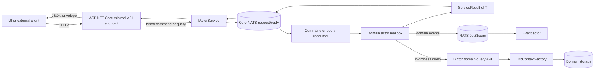

# API Server implementation details

## Purpose and scope

`TomasAI.IFM.Application.Api.Server` is the ASP.NET Core composition root for the IFM actor runtime. It exposes the public HTTP command and query surface, translates HTTP requests into typed actor messages, starts the domain actors and NATS consumers, and hosts the currently enabled background services.

This document describes the implementation as it exists in the repository. Items under [Current implementation notes](#current-implementation-notes) record known behavior and configuration gaps; they are not descriptions of a future design.

The project is an ASP.NET Core Web SDK executable targeting .NET 10.

## Source map

| Concern | Source |
| --- | --- |
| Host startup and top-level error handling | [`Program.cs`](../Program.cs) |
| Service registration, Simple Injector, middleware, logging, and configuration | [`Startup.cs`](../Startup.cs) |
| Actor discovery, producer/consumer wiring, and actor startup | [`ActorMaps.cs`](../ActorMaps.cs) |
| HTTP command endpoints | [`CommandMaps.cs`](../CommandMaps.cs) |
| HTTP query endpoints | [`QueryMaps.cs`](../QueryMaps.cs) |
| Shared command route constants | [`CommandPaths.cs`](../../TomasAI.IFM.Shared/Application/CommandPaths.cs) |
| Shared query route constants | [`QueryPaths.cs`](../../TomasAI.IFM.Shared/Application/QueryPaths.cs) |
| Actor subject identity and wire subject format | [`ActorSubject.cs`](../../TomasAI.IFM.Shared/EventModelActor/ActorSubject.cs) |
| HTTP-to-actor request adapter | [`ActorService.cs`](../../TomasAI.IFM.Shared/EventModelActor/ActorService.cs) |
| Environment configuration | [`appsettings.Development.json`](../appsettings.Development.json), [`appsettings.Production.json`](../appsettings.Production.json) |
| Project dependencies and publish settings | [`TomasAI.IFM.Application.Api.Server.csproj`](../TomasAI.IFM.Application.Api.Server.csproj) |

## Runtime architecture



Commands and queries use Core NATS request/reply. JetStream is used for the event actor path. Actor-only query APIs are a separate, in-process optimization for domain-to-domain queries and are not used by the HTTP endpoint mappings.

## Host startup sequence

The startup order in [`Program.cs`](../Program.cs) is significant:

1. `WebApplication.CreateBuilder(args)` creates the host builder and its default configuration sources.
2. `ConfigureApiServer` configures JSON configuration, Serilog, Kestrel, MVC-related services, Swagger, and Simple Injector.
3. `RegisterServices` adds infrastructure, public and actor-only APIs, storage, event producers, and hosted services to Microsoft DI.
4. `Build` creates the `WebApplication`.
5. `ConfigureRequestPipeline` scans and registers domain generic types in Simple Injector, cross-wires the containers, verifies Simple Injector, and installs middleware.
6. `MapApiCommands` maps the command endpoints.
7. `MapApiQueries` maps the query endpoints.
8. `MapEventModelActors` discovers actors, attaches transports, starts consumers, and starts every actor.
9. `Run` starts Kestrel and the registered ASP.NET Core hosted services.

The top-level `try/catch` logs fatal startup exceptions and always closes and flushes Serilog. The exception is not rethrown after logging.

## HTTP API implementation

The active HTTP surface consists entirely of minimal APIs. Controllers are registered, but there is no `MapControllers` call and there are no active controller routes in this project.

### Endpoint summary

| Surface | HTTP verbs | Count | Mapping source |
| --- | --- | ---: | --- |
| Commands | 83 POST | 83 | [`CommandMaps.cs`](../CommandMaps.cs) |
| Queries | 86 GET, 3 POST | 89 | [`QueryMaps.cs`](../QueryMaps.cs) |
| **Total** |  | **172** |  |

Command groups:

| Group | Endpoints |
| --- | ---: |
| Application | 2 |
| Fund | 8 |
| Fund transaction | 3 |
| Reference | 7 |
| Market data | 11 |
| Market data feed | 22 |
| Option pricer | 7 |
| Market data analytics | 6 |
| Option trade | 13 |
| Trade plan | 3 |
| System administration | 1 |

Query groups:

| Group | Endpoints |
| --- | ---: |
| Fund | 10 |
| Fund transaction | 1 |
| Reference | 18 |
| Market data | 16 |
| Market data feed | 19 |
| Option pricer | 1 |
| Market data analytics | 8 |
| Trade | 5 |
| Option trade | 10 |
| System administration | 1 |

The shared `*UriPath` constants define route text, but only constants actually mapped in `CommandMaps.cs` or `QueryMaps.cs` are active API endpoints. The route-constant files contain additional paths that this server does not currently map.

Economic-calendar range reads use `GET /api/marketdata/economiccalendar/page`. The request requires UTC start/end
bounds, comma-separated explicit country codes, a bounded page size, and an optional opaque continuation token. The
former external-calendar route is deprecated and instructs callers to use the authenticated
`POST /api/marketdata/fmp/import` operation.

### Command request flow

Every command endpoint follows the same adapter pattern:

1. ASP.NET Core binds a request object from the JSON body.
2. The endpoint derives the typed actor entity ID.
3. The endpoint constructs a new command from the request values.
4. The server assigns a new `CommandId` with `Guid.NewGuid()`.
5. The server assigns a command `ActorSubject` containing the actor name, verb, and formatted entity ID.
6. `IActorService.RequestAsync<TCommand, TEntityId>` sends the command through Core NATS and waits for the actor response.
7. The endpoint serializes the returned `ServiceResult<Guid>`.

A representative implementation is the fund creation endpoint:

```csharp
endpoints.MapPost(FundUriPath.Create,
    async (IActorService actorService, CreateFundParameter parameter) =>
    {
        var entityId = new FundId(parameter.Fund.FundId);
        var command = new CreateFundCommand(parameter.Fund)
        {
            CommandId = Guid.NewGuid(),
            Subject = new ActorSubject(
                ActorType.Command,
                CreateFundCommand.Actor,
                CreateFundCommand.Verb,
                entityId.Format()),
            EntityId = entityId
        };

        return await actorService.RequestAsync<CreateFundCommand, FundId>(command);
    });
```

The incoming request's command identity and subject are therefore not trusted as routing inputs; the server reconstructs them.

### Query request flow

Every query endpoint follows this pattern:

1. ASP.NET Core binds scalar values from the query string, or a body for one of the POST queries.
2. The endpoint creates the typed query.
3. The endpoint assigns a query `ActorSubject` from the query's actor, verb, and formatted entity ID.
4. `IActorService.RequestAsync<TResult, TQuery>` performs Core NATS request/reply.
5. The endpoint serializes the returned `ServiceResult<TResult>`.

A representative implementation is the current fund balance endpoint:

```csharp
endpoints.MapGet(FundQueryUriPath.GetFundBalance,
    async (IActorService actorService, int fundId) =>
    {
        var query = new GetFundBalanceQuery(fundId);
        query = query with
        {
            Subject = new ActorSubject(
                ActorType.Query,
                GetFundBalanceQuery.Actor,
                GetFundBalanceQuery.Verb,
                query.EntityId.Format())
        };

        return await actorService
            .RequestAsync<FundBalanceReadModel, GetFundBalanceQuery>(query);
    });
```

Most queries are GET requests with scalar query-string parameters. Three queries use POST:

| Route | Binding behavior |
| --- | --- |
| `/api/marketdata/futures/option/contractids` | `contractIds` is still a comma-separated query-string value. |
| `/api/marketdata/feed/futures/option/contract` | `contractId` comes from the query string; the contract parameter is JSON body-bound. |
| `/api/marketdata/feed/futures/option/spread` | Five scalar values come from the query string; the spread-data parameter is JSON body-bound. |

### Actor addressing

`ActorSubject` is the routing identity shared by commands, queries, and events. Its string representation is:

```text
{ActorType}.{Name}.{Verb}.{EntityId}
```

It also derives:

- `ActorId` from actor type and name, used to select a producer/mailbox.
- `ActorTypeId` from actor type, name, and verb.
- `ThreadId` from actor type, name, and entity ID, used for entity-affine processing.
- `StreamId` as `{ActorType}.{Name}.{EntityId}`.

## Actor runtime and messaging

### Actor discovery and startup

`MapEventModelActors` assembles the runtime after the HTTP endpoints have been mapped:

1. Resolve `IActorSupervisor`, `IActorRegistry`, and `IActorFactory`.
2. Instantiate each actor type discovered by the registry.
3. Register each actor with the supervisor.
4. Resolve and attach a Core NATS producer for each actor mailbox.
5. Attach an additional JetStream producer to event actors.
6. Register Core NATS consumers for `Command`, `Query`, and `Supervisor` actor types.
7. Register a JetStream consumer for the `Event` actor type.
8. Start all consumers.
9. Start actors sequentially and log each successful start.

Core NATS consumers subscribe by actor type using subjects shaped as `{ActorType}.>`. Producers and consumers use the internal NATS MessagePack serializer. MessagePack uses the contractless resolver with LZ4 compression for the actor wire payload.

The default NATS server is `nats://localhost:4222`. Command and request/reply timeouts default to two minutes. The option instances are currently created from class defaults rather than bound from `appsettings`.

JetStream defaults include:

- Stream: `EventStream`
- Durable consumer: `EventConsumer`
- Subject filter: `Event.>`
- Explicit acknowledgement
- Deliver-all policy
- Four bounded dispatch stripes by default, preserving ordering for an entity-affine stripe

See the Core NATS [`NatsActorProducer`](../../TomasAI.IFM.Framework.Messaging.NatsJetStream/NatsActorProducer.cs), [`NatsActorConsumer`](../../TomasAI.IFM.Framework.Messaging.NatsJetStream/NatsActorConsumer.cs), and [`NatsJetStreamActorConsumer`](../../TomasAI.IFM.Framework.Messaging.NatsJetStream/NatsJetStreamActorConsumer.cs) implementations for transport details.

### `IActorService` behavior

`ActorService` selects the actor producer with the request subject's `ActorId` and delegates to the transport.

- Query requests return `ServiceResult<TResult>`.
- Command requests return `ServiceResult<Guid>`, where the value is the server-generated command ID.
- A query transport/runtime exception becomes a failed result containing the exception message.
- A command transport/runtime exception becomes a failed result containing the command error code and exception message.

The service-result envelope is returned to the minimal endpoint; the endpoint does not translate it to an HTTP status code.

### Public APIs versus actor-only APIs

The DI configuration intentionally exposes two kinds of domain API:

| API kind | Intended caller | Implementation path |
| --- | --- | --- |
| Public `I*CommandApi` and `I*QueryApi` | UI or another application | REST clients using the configured command/query server base URI |
| Actor-only `IActor*QueryApi` | A domain actor | Direct in-process implementation using `IDbContextFactory`; no NATS request/reply |
| Actor-only command API factory | A domain event handler | Creates a domain API around the handler's `IEventActorContext`; command messaging remains on the actor/NATS path |
| Actor-only event API factory | A domain event handler | Creates the domain event API around the available actor context |

The server currently registers direct actor query implementations for Fund, Market Data, Market Data Analytics, Market Data Feed, Option Pricer, Trade, Reference, and System Administration. It registers actor command API factories for Market Data Analytics, Market Data Feed, Option Pricer, and Trade, plus actor event API factories for Fund and Market Data Feed.

The 172 HTTP endpoints do not call these higher-level API clients. They construct actor messages directly and call `IActorService`.

## Dependency injection

The application uses Microsoft DI and Simple Injector together.

### Microsoft DI registrations

`RegisterServices` organizes registrations into eight groups:

1. Base/platform services
2. Command APIs
3. Actor event APIs
4. Query APIs
5. Storage
6. Service handlers
7. Event producers
8. Hosted services

The base group includes:

- Hazelcast `IDistributedCache`
- Redis connection and cache abstractions
- Blackboard, local cache, and reference lookup services
- JSON and MessagePack serializers
- Bounded-context, actor-state, decorator, and event-handler resolvers
- `IActorSupervisor`, `IActorService`, `IActorRegistry`, and `IActorFactory`
- Core NATS and JetStream producers and consumers
- Durable replay and actor thread-queue services
- The bridge used to resolve from Microsoft DI first and Simple Injector second

Most infrastructure and API registrations are singletons. NATS actor producers/consumers and actor thread queues are transient.

### Simple Injector registrations

`ConfigureRequestPipeline` scans the loaded assemblies plus an explicit list of domain actor assemblies and registers:

| Service | Lifestyle |
| --- | --- |
| `IObjectRepository<T>` | Transient |
| `IActor<T>` | Singleton |
| `IActorStateDenormalizer<T>` | Singleton |
| `IEventSourceActorStateRepository<T>` | Singleton |
| `IEventProjector<T>` | Singleton |
| `IEventSourceActorState<T>` | Transient |

After registration, `UseSimpleInjector` cross-wires ASP.NET Core services and `_siContainer.Verify()` validates the Simple Injector graph. `IActorRegistry` is registered in Microsoft DI, but its factory reads the closed `IActor<>` registrations from Simple Injector.

## Storage and external systems

### Storage providers

`DbConnectionSettings` maps data stores by responsibility:

| Provider | Contexts/data |
| --- | --- |
| PostgreSQL | Event source, actor event source, logs, and sequence IDs |
| ScyllaDB | Fund, Market Data, Option Pricer, Reference, Securities, and Trade |
| Framework object/HTTP storage | Yield-curve rates and economic calendars |

The server registers `IDbCache`, `IDbContextResolver`, `IDbContextFactory`, the typed database contexts, schema helpers, and the PostgreSQL sequence generator. Actor-only query APIs use the singleton `IDbContextFactory` to execute direct typed database operations.

### Cache and service dependencies

| Dependency | Current source/default |
| --- | --- |
| Hazelcast | Cluster `ifm-cluster`, server `localhost:5701`, cache ID `api-server-cache` |
| Redis | `AppSettings:RedisUri` |
| Core NATS/JetStream | Option defaults; normally `nats://localhost:4222` |
| Interactive Brokers live API | `AppSettings:MarketDataFeedApi` section |
| Interactive Brokers snapshot API | `AppSettings:MarketDataFeedSnapshotApi` section |
| Azure storage | `AzureStorage` section |

### Hosted services

Two ASP.NET Core hosted services are active:

- `TradePositionHostedService`
- `TradePlanHostedService`

They start and stop their respective NATS event consumers with the web host. Market-data-feed and trade-placement hosted-service registrations remain commented out in `Startup.cs`.

## Configuration

### Configuration loading

`ConfigureApiServer` sets the configuration base path to the current working directory and explicitly adds:

1. `appsettings.json` (required)
2. `appsettings.{Environment}.json` (optional)
3. environment variables

Both JSON files are reloadable. Environment variables are deliberately appended after them, so deployment and test-process values override checked-in JSON by using the standard double-underscore hierarchy, for example `AppSettings__Databento__DataSource=Synthetic`. This precedence is protected by the G2 infrastructure contract.

Do not copy production secrets into this document or new checked-in configuration. The current environment files contain plaintext database credentials; those values should be rotated and supplied from a protected configuration source.

### Required settings

The following settings are consumed during service registration:

| Key or section | Purpose |
| --- | --- |
| `AppSettings:CommandServerBaseUri` | Base URI used by public command API clients |
| `AppSettings:QueryServerBaseUri` | Base URI used by public query API clients |
| `AppSettings:RedisUri` | Redis connection |
| `AppSettings:DomainDataStorageBaseUri` | Domain object-data storage base URI |
| `AppSettings:QueryDataStorageBaseUri` | Query object-data storage base URI |
| `AppSettings:MarketDataFeedApi:{Host,Port,ClientId}` | Interactive Brokers live API |
| `AppSettings:MarketDataFeedSnapshotApi:{Host,Port,ClientId}` | Interactive Brokers snapshot API |
| `AzureStorage` | Azure storage options |
| `ConnectionStrings:EventSourceActorDbConnection` | PostgreSQL actor event source |
| `ConnectionStrings:LogDbConnection` | PostgreSQL logs |
| `ConnectionStrings:SequenceIdDbConnection` | PostgreSQL sequence IDs |
| `ConnectionStrings:FundDbConnection` | ScyllaDB fund data |
| `ConnectionStrings:MarketDataDbConnection` | ScyllaDB market data |
| `ConnectionStrings:OptionPricerDbConnection` | ScyllaDB option-pricer data |
| `ConnectionStrings:ReferenceDbConnection` | ScyllaDB reference data |
| `ConnectionStrings:SecuritiesDbConnection` | ScyllaDB securities data |
| `ConnectionStrings:TradeDbConnection` | ScyllaDB trade data |
| `FMP_API_KEY` environment variable | Financial Modeling Prep credential; never stored in a URI or JSON setting |

The checked-in environment files do not currently define every consumed key. In particular, storage base URIs,
Azure storage, Interactive Brokers sections, and `FMP_API_KEY` must be provided by the deployment if those services
are used.

### Ports and profiles

| Environment/tool | Configured address |
| --- | --- |
| Development Kestrel | `http://localhost:22543` |
| Production Kestrel | `http://localhost:4096` |
| `launchSettings.json` HTTP profile | Port `5287` |
| `launchSettings.json` HTTPS profile | Port `7196` plus `5287` |

Kestrel's environment configuration is the current server source of truth. The launch-profile ports do not match it.

## Middleware, serialization, and response semantics

The active middleware pipeline is intentionally short:

- Development: Swashbuckle Swagger JSON and Swagger UI at `/`
- Non-Development: HTTPS redirection
- All environments: authorization middleware

Negotiate authentication is registered, authentication and authorization middleware are active, the FMP import route
requires authorization, and readiness/liveness health routes are mapped. CORS, rate limiting, a global exception
handler, and HSTS are not configured here.

### HTTP serialization

`AddControllers().AddNewtonsoftJson()` and an MVC `JsonStringEnumConverter` are registered. Because the server maps minimal APIs and does not map controllers, those MVC-specific settings may not govern the active endpoint responses. Minimal-API JSON options should be configured through `ConfigureHttpJsonOptions` when a consistent enum or naming policy is required.

Actor wire messages do not use HTTP JSON. They use the NATS MessagePack serializer described above.

### HTTP status behavior

Successful and failed actor operations are normally serialized as `ServiceResult<T>` response bodies. A failed `ServiceResult<T>` is still an ordinary return value, so it normally receives HTTP 200 rather than a 4xx/5xx status.

- Request-binding failures are handled by ASP.NET Core and can return HTTP 400.
- Exceptions caught by `ActorService` become failed service-result envelopes.
- Exceptions outside `ActorService` can become generic HTTP 500 responses; no global exception handler is configured.
- Query exception translation records the message but does not set a query error code.
- Exception messages can reach the HTTP response through `ServiceResult<T>`.

Endpoint mappings currently do not declare `Produces` metadata, names, endpoint filters, cancellation tokens, or per-route authorization.

## Logging and OpenAPI

Serilog is configured with:

- Minimum level `Information`
- `Microsoft` and `System` overridden to `Error`
- Console sink
- Daily file sink at `Logs/ifm-apiserver-.log`
- Seven retained files

Swashbuckle is active only in Development. Swagger JSON is served at `/swagger/v1/swagger.json`, and the UI is mounted at the application root `/`.

Both NSwag (`AddOpenApiDocument`) and Swashbuckle (`AddSwaggerGen`) are registered. Only the Swashbuckle middleware is used in the current request pipeline.

## Local execution

At minimum, local execution requires the .NET 10 SDK and the infrastructure used by the actors being started. The normal local defaults include NATS with JetStream, Redis, Hazelcast, PostgreSQL, and ScyllaDB.

The repository includes a NATS JetStream compose file at [`Docker/NatsJetstream/docker-compose.yml`](../../Docker/NatsJetstream/docker-compose.yml).

Run the API server in Development with:

```powershell
dotnet run --project TomasAI.IFM.Application.Api.Server --environment Development
```

With the current Kestrel settings, Swagger UI is available at:

```text
http://localhost:22543/
```

The checked-in [`TomasAI.IFM.Application.Api.Server.http`](../TomasAI.IFM.Application.Api.Server.http) requests `/weatherforecast` on port `5287`. That endpoint exists only in commented template code and the port does not match the Development Kestrel setting, so the file is currently stale.

Production enables HTTPS redirection while its checked-in Kestrel endpoint is HTTP-only. A production deployment therefore needs a correctly forwarded TLS scheme from a reverse proxy or an explicit HTTPS endpoint to avoid redirect problems.

## Adding an endpoint or actor capability

### Add a command endpoint

1. Define the command contract and typed entity ID in the appropriate shared domain project.
2. Add or reuse the route constant in `CommandPaths.cs`.
3. Add the minimal API mapping to the appropriate group in `CommandMaps.cs`.
4. Reconstruct the command from request values, assign a new `CommandId`, set `EntityId`, and build the command `ActorSubject`.
5. Call `IActorService.RequestAsync<TCommand, TEntityId>`.
6. Ensure the command actor is discoverable and its dependencies resolve from the two-container graph.
7. Add binding, routing, successful-result, and failed-result tests.

### Add a query endpoint

1. Define the query and typed result contract in the appropriate shared domain project.
2. Add or reuse the route constant in `QueryPaths.cs`.
3. Prefer GET for scalar query inputs; use POST only when a complex body is necessary.
4. Add the minimal API mapping to the appropriate group in `QueryMaps.cs`.
5. Build the query `ActorSubject` and call `IActorService.RequestAsync<TResult, TQuery>`.
6. If domain actors also need this query, expose it through the domain's `IActor*QueryApi` and direct `IDbContextFactory` implementation rather than coupling callers to the query actor or reusing the public REST client.
7. Add endpoint tests and actor-only API unit tests.

### Add an actor

1. Implement the appropriate closed `IActor<T>` contract.
2. Ensure its assembly is loaded or add its actor assembly marker to the explicit list in `RegisterGenericTypes`.
3. Register all storage, handlers, actor-only APIs, and external dependencies needed by the actor.
4. Verify Simple Injector and start the server with NATS available.
5. Confirm the actor is included in the startup actor count and that its command/query/event subject is consumed by the intended transport.

After changing the route surface, update the endpoint counts in this document.

## Current implementation notes

These observations are important when operating or extending the server:

1. **Anonymous HTTP surface.** Authorization middleware is present, but authentication, policies, and route authorization metadata are not configured. `AllowedHosts` is `*`.
2. **Service failures normally return HTTP 200.** The API exposes the `ServiceResult<T>` protocol directly instead of mapping failures to HTTP status codes or Problem Details.
3. **Minimal API JSON is not explicitly configured.** MVC Newtonsoft and enum settings may not apply to these routes.
4. **Configuration is not self-contained.** Several settings consumed by `Startup.cs` are absent from the checked-in environment files.
5. **Secrets are checked in.** Environment files contain plaintext database credentials. Do not duplicate them; rotate and externalize them.
6. **NATS settings use defaults.** The registered option objects are not bound from configuration and normally connect to `localhost:4222`.
7. **Actor initialization exceptions are swallowed.** `MapEventModelActors` logs failures inside `Task.Run(...).Wait()` without failing the web host, so Kestrel can start with an incomplete actor runtime.
8. **Consumers start before actors.** There is a short startup interval in which consumers can receive traffic before actor mailboxes have completed `StartAsync`.
9. **Actor shutdown is not integrated with host shutdown.** `ActorMaps` has no hosted lifecycle hook calling actor `StopAsync` or supervisor consumer shutdown, and its static actor list is not cleared.
10. **Top-level startup failures do not propagate.** `Program.cs` logs fatal exceptions but does not rethrow them, which can allow a zero exit code after failed startup.
11. **A temporary service provider is created during configuration.** `ConfigureApiServer` calls `BuildServiceProvider` to resolve the logger; it is not disposed and can create a duplicate singleton graph.
12. **Container resolution errors can be hidden.** `GetContainerInstance` catches all exceptions and returns `null`, which discards the original Simple Injector error.
13. **Cache implementations differ by container.** Microsoft DI registers `LocalDataCacheService`, while Simple Injector registers `DataCacheService` for `IDataCacheService`.
14. **Option Pricer discovery is implicit.** Its actor assembly marker is not in the explicit assembly list, so discovery depends on the assembly already being loaded into the `AppDomain`.
15. **OpenAPI is registered twice.** NSwag and Swashbuckle services are both present, while only Swashbuckle middleware is used.
16. **Launch tooling is stale.** `launchSettings.json` and the `.http` file use ports/routes that do not match the active Kestrel API.
17. **Production HTTPS requires deployment support.** Production redirects to HTTPS but declares only an HTTP Kestrel endpoint.
18. **Legacy trade-plan summary route remains mapped.** `/api/trade/tradeplansummary` currently constructs `GetTradePlanActionQuery`, while the actor-only `GetTradePlanSummaryAsync` contract is obsolete/not implemented pending UI cleanup.
19. **Endpoint metadata is minimal.** Routes do not currently declare response types, names, cancellation tokens, endpoint filters, or explicit OpenAPI operation details.

## Validation references

For an exact, current route inventory, run the application in Development and inspect Swagger at `/`, then compare it with `CommandMaps.cs` and `QueryMaps.cs`. Treat those two mapping files—not every constant in the shared path files—as the authoritative active HTTP surface.
