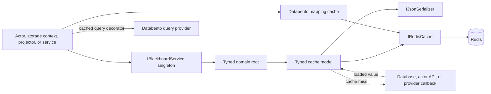

# Blackboard implementation details

## Purpose and scope

`TomasAI.IFM.Application.Blackboard` is the application's typed, Redis-backed shared-state facade. It groups cache models by owning domain, centralizes Redis key construction and payload serialization, and provides a small number of cache-aside and coordination abstractions used by actors, storage contexts, projectors, and hosted services.

The Blackboard is primarily a cache, but not every value is safely disposable without runtime impact. It also contains atomic sequence counters, event-projector progress, and live market-data correlation state. Clearing Redis can therefore reset identifiers or disrupt in-flight processing even when durable domain data remains elsewhere.

This document describes the current implementation in the repository. It supersedes the existing [`README.md`](../README.md) where that file still describes obsolete flat forwarding properties.

The library targets .NET 10. The tracked directory is named `TomasAI.IFM.Application.BlackBoard`, while the assembly and namespace use `TomasAI.IFM.Application.Blackboard`.

## Source map

| Concern | Source |
| --- | --- |
| Public facade | [`IBlackboardService.cs`](../IBlackboardService.cs) |
| Domain-root contracts and concrete root construction | [`BlackboardDomainRoots.cs`](../BlackboardDomainRoots.cs) |
| Facade construction | [`BlackboardService.cs`](../BlackboardService.cs) |
| Cache namespace enumeration | [`DataCacheName.cs`](../../TomasAI.IFM.Shared/Caching/DataCacheName.cs) |
| Redis abstraction | [`IRedisCache.cs`](../../TomasAI.IFM.Framework.Caching/IRedisCache.cs) |
| StackExchange.Redis adapter | [`RedisCache.cs`](../../TomasAI.IFM.Framework.Caching.Redis/RedisCache.cs) |
| Serializer abstraction and production implementation | [`IJsonSerializer.cs`](../../TomasAI.IFM.Framework.Serialization/IJsonSerializer.cs), [`NewtonSoftJsonSerializer.cs`](../../TomasAI.IFM.Framework.Serialization/NewtonSoftJsonSerializer.cs) |
| Databento mapping cache | [`DatabentoContractMappingCache.cs`](../DatabentoContractMappingCache.cs) |
| Cached Databento query decorator | [`CachedDatabentoMarketDataQueries.cs`](../CachedDatabentoMarketDataQueries.cs) |
| Production DI registration | [`Application.Api.Server/Startup.cs`](../../TomasAI.IFM.Application.Api.Server/Startup.cs) |
| Dedicated unit suite | [`Application.Blackboard.UnitTests`](../../TomasAI.IFM.Application.Blackboard.UnitTests) |
| Project dependencies | [`TomasAI.IFM.Application.Blackboard.csproj`](../TomasAI.IFM.Application.Blackboard.csproj) |

## Runtime architecture



The Blackboard does not own a process, thread, hosted-service lifecycle, or background refresh loop. Cache work happens synchronously on the caller's thread except for explicitly awaited miss callbacks.

## Construction and dependency injection

`BlackboardService` requires:

- `IRedisCache`
- `IJsonSerializer`

Its constructor validates both dependencies and eagerly creates all nine domain roots and every model. Root and model properties are get-only, so a `BlackboardService` instance always returns stable model instances.

The API Server production graph registers the following as singletons:

```csharp
services.AddSingleton<IConnectionMultiplexer>(
    _ => ConnectionMultiplexer.Connect(redisUri));
services.AddSingleton<IRedisCache, RedisCache>();
services.AddSingleton<IBlackboardService, BlackboardService>();
services.AddSingleton<IJsonSerializer, NewtonSoftJsonSerializer>();
```

`redisUri` comes from `AppSettings:RedisUri`. All callers in the API Server share one `BlackboardService`, one `RedisCache`, one serializer, and one StackExchange.Redis connection multiplexer. Other processes share values through Redis rather than through the in-process facade.

The actor integration-test host mirrors this registration. Other integration fixtures commonly construct `BlackboardService` directly with a test `IRedisCache` and `SystemTextJsonSerializer`; that is not the production serializer configuration.

## Public API shape

`IBlackboardService` exposes exactly nine domain roots:

```csharp
public interface IBlackboardService
{
    IApplicationBlackboard Application { get; }
    IEventSourcingBlackboard EventSourcing { get; }
    IFundBlackboard Fund { get; }
    IMarketDataBlackboard MarketData { get; }
    IMarketDataAnalyticsBlackboard MarketDataAnalytics { get; }
    IMarketDataFeedBlackboard MarketDataFeed { get; }
    IMarketDataSecuritiesBlackboard MarketDataSecurities { get; }
    IReferenceBlackboard Reference { get; }
    ITradeBlackboard Trade { get; }
}
```

There are 40 exposed model properties backed by 39 distinct instances. `MarketDataFeed.FuturesOptionTickData` and `MarketDataFeed.FuturesOptionTickPriceData` deliberately return the same `FuturesOptionTickDataModel` instance and use the same Redis namespace.

The old flat model properties no longer exist. Callers must enter through a domain root:

```csharp
blackboard.Application.SequenceCounter
blackboard.EventSourcing.EventProjectorState
blackboard.MarketDataFeed.FuturesEodData
blackboard.MarketDataAnalytics.FuturesRsiSignal
blackboard.Trade.OptionTrade
```

## Domain model catalog

The key patterns below show the suffix appended to the model's namespace. Exact punctuation and whitespace are compatibility-sensitive because values may already exist in Redis.

### Application

| Property/model | Operations and miss behavior | Redis identity |
| --- | --- | --- |
| `Application.SequenceCounter` / [`SequenceCounterModel`](../SequenceCounterModel.cs) | `Get<TEnum>` returns `0` on miss; `Increment<TEnum>` performs atomic Redis `INCR` and returns the new value. | `SequenceCounter:<enum-value>` |

### Event sourcing

| Property/model | Operations and miss behavior | Redis identity |
| --- | --- | --- |
| `EventSourcing.DomainEvents` / [`DomainEventsModel`](../DomainEventsModel.cs) | Direct `Get`/`Set`; a miss returns an empty `DomainEventCollection`. | `DomainEvents:<command-guid>` |
| `EventSourcing.EventStreamId` / [`EventStreamIdModel`](../EventStreamIdModel.cs) | Cache-aside `GetAsync`; `Remove` deletes the key. A loaded/null result ultimately falls back to an ID `0` read model. | `EventStreamId:<event-stream>` |
| `EventSourcing.EventNameId` / [`EventNameIdModel`](../EventNameIdModel.cs) | Cache-aside `GetAsync`; an empty serialized result returns an invalid read model with ID `-1`. | `EventNameId:<event-name>.<event-type-name>` |
| `EventSourcing.EventProjectorState` / [`EventProjectorStateModel`](../EventProjectorStateModel.cs) | Direct nullable `Get`, `Set`, and deleting `Clear`; projector name is required and isolates each projector's progress. | `EventProjectorState:<projector-name>:<event-id>` |

### Fund

| Property/model | Operations and miss behavior | Redis identity |
| --- | --- | --- |
| `Fund.FundBalance` / [`FundBalanceModel`](../FundBalanceModel.cs) | Nullable `Get`, `Set`, and `Exists`; cached by order rather than only by fund. | `FundBalanceByOrderId:<order-id>` |

### Market data

| Property/model | Operations and miss behavior | Redis identity |
| --- | --- | --- |
| `MarketData.RiskFreeRate` / [`RiskFreeRateModel`](../RiskFreeRateModel.cs) | Cache-aside `GetAsync`, cache-only `Get`, and empty-string `Clear`. Cache-only miss returns `0`; callback-loaded values receive a 60-minute TTL. | `RiskFreeRate:<yyyyMMdd>` |

### Market-data analytics

| Property/model | Operations and miss behavior | Redis identity |
| --- | --- | --- |
| `FuturesItiSignalAveragePredictedTrendDelta` / [`FuturesItiSignalAveragePredictedTrendDeltaModel`](../FuturesItiSignalAveragePredictedTrendDeltaModel.cs) | Cache-aside `GetAsync`; nullable/default result on miss callback failure. | `FuturesItiSignalAveragePredictedTrendDelta:<contract-id>. <yyyyMMdd>` |
| `FuturesItiSignalAveragePredictedTrendDeltaRange` / [`FuturesItiSignalAveragePredictedTrendDeltaRangeModel`](../FuturesItiSignalAveragePredictedTrendDeltaRangeModel.cs) | Cache-aside range `GetAsync`; nullable/default result. | `...Range:<symbol>.<start-yyyyMMdd>.<end-yyyyMMdd>` |
| `FuturesItiSignalMDI` / [`FuturesItiSignalMDIModel`](../FuturesItiSignalMDModel.cs) | Cache-aside `GetAsync` returns an empty array on unresolved miss. `Set` currently updates only when the key already contains a value. | `FuturesItiSignalMDI:<contract-id>. <yyyyMMdd>` |
| `FuturesRsiSignal` / [`FuturesRsiSignalModel`](../FuturesRsiSignalModel.cs) | Nullable `Get` and `Set`. | `FuturesRsiSignal:<entity-id.Format()>` |
| `FuturesRsiDailySignal` / [`FuturesRsiDailySignalModel`](../FuturesRsiDailySignalModel.cs) | Nullable `Get` and `Set`. | `FuturesRsiDailySignal:<entity-id.Format()>` |

The dot followed by a literal space in two analytics key formats is intentional current behavior, not Markdown formatting.

### Market-data feed

| Property/model | Operations and miss behavior | Redis identity/invalidation |
| --- | --- | --- |
| `FuturesTickData` / [`FuturesTickDataModel`](../FuturesTickDataModel.cs) | Direct `Get`/`Set`; miss returns the domain `Default` tick model. | `FuturesTickData:<contract-id>,<yyyyMMdd>` |
| `FuturesOptionTickData` and `FuturesOptionTickPriceData` / [`FuturesOptionTickDataModel`](../FuturesOptionTickDataModel.cs) | Exact same model instance; direct `Get`/`Set`; miss returns the domain `Default`. | `FuturesOptionTickData:<contract-id>.<yyyyMMdd>` |
| `FuturesTickDataStreamingParameter` / [`FuturesTickDataStreamingParameterModel`](../FuturesTickDataStreamingParameterModel.cs) | Direct `Get`/`Set`; miss returns a new invalid/default parameter instance. Uses `JsonConvert` directly. | `FuturesTickDataStreamingParameter:<request-id>` |
| `FuturesOptionTickDataStreamingParameter` / [`FuturesOptionTickDataStreamingParameterModel`](../FuturesOptionTickDataStreamingParameterModel.cs) | Nullable `Get` and `Set`. | `FuturesOptionTickDataStreamingParameter:<request-id>` |
| `FuturesEodData` / [`FuturesEodDataModel`](../FuturesEodDataModel.cs) | Nullable `Get` and `Set`. | `FuturesEodData:<contract-id>. <yyyyMMdd>` |
| `VixFuturesEodData` / [`VixFuturesEodDataModel`](../VixFuturesEodDataModel.cs) | `Get`/`Set`; miss or null deserialization returns an empty collection. | `VixFuturesEodData:<contract-id>-<yyyyMMdd>` |
| `FuturesEodDataRange` / [`FuturesEodDataRangeModel`](../FuturesEodDataRangeModel.cs) | Cache-aside one-year range. Empty data or a first item whose date differs from the requested date triggers refresh. Miss returns an empty array; `Remove` deletes. | `FuturesEodDataRange:<FuturesEodDataId.Format()>` |
| `NormalCurveTable` / [`NormalCurveTableModel`](../NormalCurveTableModel.cs) | Cache-aside nullable `GetAsync`; `Remove` deletes. | `NormalCurveTable:<yyyyMMdd>` |
| `VixFuturesContractId` / [`VixFuturesContractIdModel`](../VixFuturesContractIdModel.cs) | Raw-string nullable `Get` and `Set`. | `VixFuturesContractId:<yyyyMMdd>` |
| `FuturesOptionQuote` / [`FuturesOptionQuoteModel`](../FuturesOptionQuoteModel.cs) | Stores an array and returns a dictionary keyed by request ID. Miss returns an empty dictionary; `Clear` writes an empty string. | `FuturesOptionQuote:<quote-id>` |
| `FuturesOptionQuoteData` / [`FuturesOptionQuoteDataModel`](../FuturesOptionQuoteDataModel.cs) | Nullable `Get`, `Set`, and empty-string `Clear`. | `FuturesOptionQuoteData:<option-quote-id.Format()>` |
| `FuturesOpenPrice` / [`FuturesOpenPriceModel`](../FuturesOpenPriceModel.cs) | Raw-decimal cache-aside `GetAsync`; `Clear` writes an empty string. | `FuturesOpenPrice:<FuturesDataId.Format()>` |
| `VixFuturesOpenPrice` / [`VixFuturesOpenPriceModel`](../VixFuturesOpenPriceModel.cs) | Raw-decimal cache-aside `GetAsync`; `Clear` writes an empty string. | `VixFuturesOpenPrice:<entity-id.Format()>` |
| `StreamingRequestId` / [`StreamingRequestIdModel`](../StreamingRequestIdModel.cs) | Lookup by contract ID or numeric request ID; miss returns a new invalid/default object. `Set` writes both keys for one day and `Remove` deletes both. | `StreamingRequestId:<contract-id>` and `StreamingRequestId:<request-id>` |

### Market-data securities

| Property/model | Operations and miss behavior | Redis identity |
| --- | --- | --- |
| `DatabentoContractMapping` / [`DatabentoContractMappingCache`](../DatabentoContractMappingCache.cs) | Bidirectional `TryGet`, paired `SetMapping`, per-direction clear, and current dataset-partition clear. Miss returns `false`; conflicts throw. | Versioned dataset/UTC-date partitions; detailed below. |
| `FuturesContract` / [`FuturesContractModel`](../FuturesContractModel.cs) | Nullable `Get` and `Set`. | `FuturesContract:<typed-contract-id>` |
| `FuturesContractSymbol` / [`FuturesContractSymbolModel`](../FuturesContractSymbolModel.cs) | Cache-aside `GetAsync`; unresolved miss returns an empty string. | `FuturesContractSymbol:<contract-id>` |

### Reference

| Property/model | Operations and miss behavior | Redis identity |
| --- | --- | --- |
| `Reference.ReferenceLookup` / [`ReferenceLookupModel`](../ReferenceLookupModel.cs) | Stores one dictionary for all lookup types. Nullable `Get` and `Set`. | `ReferenceLookup` |

### Trade

| Property/model | Operations and miss behavior | Redis identity/invalidation |
| --- | --- | --- |
| `Trade.OptionTrade` / [`OptionTradeModel`](../OptionTradeModel.cs) | Nullable `Get`, `Set`, and deleting `Remove`. | `OptionTrade:<option-trade-id.Format()>` |
| `Trade.TradePositionAction` / [`TradePositionActionModel`](../TradePositionActionModel.cs) | Nullable `Get` and `Set`. | `TradePositionAction:<trade-position-id.Format()>` |
| `Trade.TradePlanForwardLossLimit` / [`TradePlanForwardLossLimitModel`](../TradePlanForwardLossLimitModel.cs) | Nullable `Get`, `Set`, and deleting `Remove`. | `TradePlanForwardLossLimit:<entity-id.Format()>` |
| `Trade.HedgePositionTradeId` / [`HedgePositionTradeIdModel`](../HedgePositionTradeIdModel.cs) | Nullable option-trade ID `Get` and `Set`. | `HedgePositionTradeId:<trade-position-id.Format()>` |
| `Trade.TradeOrder` / [`TradeOrderModel`](../TradeOrderModel.cs) | Nullable `Get` and `Set`. | `TradeOrder:<trade-order-id.Format()>` |
| `Trade.IronCondorMDILimit` / [`IronCondorMDILimitModel`](../IronCondorMDILimitModel.cs) | Nullable `Get` and `Set`. | `IronCondorMDILimit:<option-trade-id.Format()>,<yyyyMMdd>` |
| `Trade.ForwardLossRatioMap` / [`ForwardLossRatioMapModel`](../ForwardLossRatioMapModel..cs) | `Get` returns an empty dictionary on miss; also exposes `Exists` and `Set`. | `ForwardLossRatioMap:<yyyyMMdd>` |
| `Trade.StopLossLimit` / [`StopLossLimitModel`](../StopLossLimitModel.cs) | Nullable `Get`, `Set`, `Exists`, and deleting `Remove`. | `StopLossLimit:<option-trade-id.Format()>` |
| `Trade.SignalProcessor` / [`SignalProcessorModel`](../SignalProcessorModel..cs) | Generic nullable `Get<TSignal>`, `Set<TSignal>`, and `Exists`; the generic type is not part of the key. | `SignalProcessor:<option-trade-id.Format()>` |

## Redis key and payload rules

### Namespace construction

Most models use a `DataCacheName` enum member converted to text as the key prefix, followed by a colon and a model-specific identity. Common identities include:

- Scalar IDs
- `Guid`
- `DateOnly` formatted as `yyyyMMdd`
- Domain entity IDs formatted with `.Format()`
- Composite IDs joined with periods, commas, spaces, hyphens, or colons

There is no application, environment, tenant, or deployment prefix. Blackboard does not explicitly select a Redis database. Two environments pointed at the same Redis default database will read and overwrite the same keys.

Ordinary keys have no schema version. Databento mappings are the exception, using a `DatabentoContractMapping:v1` prefix.

Changing a key prefix, delimiter, date format, entity formatter, or payload type is a data migration. Do not normalize historical punctuation without a coordinated key migration or targeted invalidation plan.

### Serialization

Most object and collection models use the injected `IJsonSerializer`. Production injects `NewtonSoftJsonSerializer`. Some tests and integration fixtures inject `SystemTextJsonSerializer`, so persisted cross-serializer compatibility depends on the domain model shape and is not guaranteed by Blackboard.

Exceptions to the normal JSON path include:

- `SequenceCounterModel`: raw Redis integer.
- `RiskFreeRateModel`: interpolated `double` string.
- `FuturesOpenPriceModel` and `VixFuturesOpenPriceModel`: interpolated `decimal` string.
- `VixFuturesContractIdModel`: raw contract-ID string.
- `FuturesTickDataStreamingParameterModel`: direct Newtonsoft `JsonConvert`, bypassing the injected serializer.

The numeric scalar models use current-culture string formatting and `Convert` parsing. A writer and reader using different cultures can therefore disagree on decimal separators.

### Expiration matrix

| Model | Expiration |
| --- | --- |
| Ordinary Blackboard models | No TTL; retained until overwritten, explicitly invalidated, evicted, or Redis is cleared. |
| `RiskFreeRateModel` callback-loaded value | 60 minutes |
| `StreamingRequestIdModel` paired values | 1 day |
| `DatabentoContractMappingCache` | 15-minute renewable sliding TTL, bounded by a 24-hour hard expiration |

Calling plain `IRedisCache.Set` replaces the value without a TTL. Empty-string `Clear` methods therefore leave a persistent empty value that models interpret as a miss.

### Miss and invalidation semantics

Miss behavior is part of each typed model's contract and is not uniform:

- Nullable reference result
- Empty array, collection, or dictionary
- Numeric zero
- Domain `Default` or newly constructed invalid/sentinel value
- Cache-aside callback invocation

Invalidation is also model-specific. Some methods call Redis `DEL`; others write an empty string. Callers must use the model API rather than deriving keys and invalidating Redis directly.

## Cache-aside behavior and concurrency

Cache-aside models follow this general flow:

```text
Build typed key
  -> synchronously read Redis
  -> deserialize and return on hit
  -> await caller-supplied loader on miss
  -> serialize and synchronously write Redis
  -> return loaded value
```

Although the public method may be asynchronous, Redis operations surrounding the callback are synchronous. These calls run on the actor, event-handler, storage, or request thread that invoked the model.

General cache-aside models do not coalesce concurrent misses. Multiple callers can invoke the same database/API loader and race to write the key; the last write wins. `SequenceCounterModel.Increment` is the only general atomic operation because it delegates to Redis `INCR`.

There are no general compare-and-set operations, Redis transactions, distributed locks, cancellation tokens, timeouts, retries, circuit breakers, logging, metrics, or cache health reporting in this project.

## Databento mapping implementation

### Bidirectional mapping cache

`IDatabentoContractMappingCache` maps a Databento contract ID to an instrument ID and the instrument ID back to the contract ID. Its keys are isolated by escaped dataset and the current UTC definition date:

```text
DatabentoContractMapping:v1:<escaped-dataset>:<yyyyMMdd>:contract:<contract-id>
DatabentoContractMapping:v1:<escaped-dataset>:<yyyyMMdd>:instrument:<instrument-id>
```

UTC-date partitioning prevents instrument IDs remapped on a later trading day from reusing a prior day's entry.

On a read, the cache:

1. Validates the input and builds today's partition key.
2. Reads and deserializes the entry.
3. Evicts malformed, structurally invalid, or absolutely expired entries.
4. Verifies that the entry belongs to the requested dataset/date and requested direction.
5. Reads and verifies the reverse-direction counterpart when present.
6. Throws `DatabentoContractMappingException` after best-effort eviction when mappings conflict.
7. Best-effort rewrites both directions to renew the 15-minute TTL without extending the original 24-hour deadline.

`SetMapping` preserves the earliest hard expiration when one side already exists. It writes both directions sequentially. The operation is not a Redis transaction; a write failure triggers best-effort removal of both keys, but concurrent processes can still observe or create races between the two writes.

`ClearMapping` removes the requested direction and its verified counterpart. `ClearCurrentMappings` removes only the current UTC date partition for the requested dataset by scanning and deleting the literal prefix.

### Cached Databento query decorator

`CachedDatabentoMarketDataQueries` wraps `IDatabentoMarketDataQueries`:

- Contract-to-instrument and instrument-to-contract lookups use the bidirectional cache.
- A valid provider lookup populates both directions.
- Invalid provider results and provider exceptions are not cached.
- Mapping conflicts are propagated.
- General cache infrastructure failures fall back to the verified provider value.
- Identical misses in one process are coalesced with `ConcurrentDictionary<TKey, Lazy<T>>` and `ExecutionAndPublication`.
- The timeout is part of the coalescing key.
- Coalescing ends when the lookup completes and does not coordinate across processes.
- Contract-detail, option-chain, and contract-collection methods pass directly to the provider without caching.

This decorator is covered by unit tests but is not registered in API Server DI and has no production call site. A host that wants it must explicitly provide the source query service, the Blackboard mapping cache, and the dataset name.

## Production consumers

### Event sourcing and projection

- [`EventSourceDbContext`](../../TomasAI.IFM.Application.Storage/EventSourceDb/EventSourceDbContext.cs) and `EventSourceActorDbContext` use `EventStreamId` and `EventNameId` as cache-aside lookups around event-source storage.
- [`BaseEventProjector`](../../TomasAI.IFM.Application.EventProjector/BaseEventProjector.cs) and `EventProjectorBuilder` use `EventProjectorState`, isolated by projector name and event ID, while queueing, replaying, completing, or clearing projection work.
- No production `DomainEvents` call site was found during the audit.

### Market-data feed and analytics

The market-data-feed actors are the largest Blackboard consumers. Constructor-injected `IBlackboardService` is passed into their event-parameter objects and used to:

- Retain streaming request parameters and bidirectional request/contract correlation.
- Hold the latest futures and futures-option ticks.
- Cache one-year EOD ranges, VIX data, curve tables, contract IDs, and open prices.
- Accumulate option quote maps and quote data during streaming.
- Cache risk-free rates for option calculations.

Feed query APIs also use `Application.SequenceCounter` to allocate streaming request IDs and quote IDs atomically. RSI event handlers write the two analytics RSI cache models.

### Trade and fund workflows

- Active Trade Position event handlers set and remove cached option trades.
- Active Trade Plan event handlers maintain forward-loss-limit entries.
- `ActorTradeQueryApi` reads the iron-condor MDI limit.
- Trade algorithm source uses fund balances, forward-loss maps, stop-loss limits, signal processors, and iron-condor limits.

The API Server's `IAlgorithmBuilder` registration is currently commented out, so the algorithm cache path is implemented source behavior whose runtime activation depends on another container or registration path.

### Reference data

`ReferenceLookupActorService` reads one cached lookup dictionary. On a miss it performs an actor query, builds the dictionary, and caches it. The current implementation blocks on the actor query with `.Result` during this miss path.

### Models without production call sites found

The audit found no active production use for:

- `EventSourcing.DomainEvents`
- All three `MarketDataSecurities` models
- Analytics predicted-delta, predicted-delta-range, and MDI models
- `MarketDataFeed.FuturesOptionTickDataStreamingParameter`
- `Trade.TradePositionAction`
- `Trade.HedgePositionTradeId`
- `Trade.TradeOrder`
- `CachedDatabentoMarketDataQueries`

These APIs may be retained for future or legacy flows; absence of a discovered call site does not make their persisted namespaces safe to reuse.

## Failure behavior and operational considerations

Redis is an operational dependency. There is no in-memory fallback in the production registration.

For most models:

- Redis connection/command exceptions propagate to the caller.
- Serialization/deserialization exceptions propagate to the caller.
- A malformed payload can repeatedly fail until overwritten or invalidated.
- Empty or missing data is converted according to the model's typed miss contract.

Databento mapping is deliberately more defensive: malformed entries are evicted, renewal and cleanup are best effort, live verified mappings can survive cache-infrastructure failures, and logical mapping conflicts remain fatal.

Operational guidance:

1. Use an environment-specific Redis instance, database, or key prefix. The current Blackboard implementation itself provides no isolation.
2. Do not call `DeleteAllKeys` as a normal Blackboard invalidation mechanism; it flushes the selected Redis database and can reset counters and in-flight coordination state.
3. Prefer model-level `Remove`, `Clear`, or a versioned migration for targeted changes.
4. Treat key strings and JSON payload shapes as cross-process contracts.
5. Deploy serializer or domain-model changes compatibly across every process sharing the Redis database.
6. Monitor Redis latency because synchronous calls occur directly on actor and event-handler execution paths.
7. Plan behavior for Redis outages; the general facade does not degrade automatically.

## Testing

The dedicated .NET 10 xUnit project contains 164 `[Fact]` tests across nine files:

| Area | Tests | Source |
| --- | ---: | --- |
| Async cache-aside models | 27 | [`AsyncCallbackModelTests.cs`](../../TomasAI.IFM.Application.Blackboard.UnitTests/AsyncCallbackModelTests.cs) |
| Blackboard service and domain roots | 6 | [`BlackboardServiceTests.cs`](../../TomasAI.IFM.Application.Blackboard.UnitTests/BlackboardServiceTests.cs) |
| Collection models | 18 | [`CollectionModelTests.cs`](../../TomasAI.IFM.Application.Blackboard.UnitTests/CollectionModelTests.cs) |
| Complex async models | 20 | [`ComplexAsyncModelTests.cs`](../../TomasAI.IFM.Application.Blackboard.UnitTests/ComplexAsyncModelTests.cs) |
| Databento cache and decorator | 14 | [`DatabentoContractMappingCacheTests.cs`](../../TomasAI.IFM.Application.Blackboard.UnitTests/DatabentoContractMappingCacheTests.cs) |
| Get/set/remove models | 14 | [`GetSetRemoveModelTests.cs`](../../TomasAI.IFM.Application.Blackboard.UnitTests/GetSetRemoveModelTests.cs) |
| Sequence counter | 7 | [`SequenceCounterModelTests.cs`](../../TomasAI.IFM.Application.Blackboard.UnitTests/SequenceCounterModelTests.cs) |
| Simple get/set models | 34 | [`SimpleGetSetModelTests.cs`](../../TomasAI.IFM.Application.Blackboard.UnitTests/SimpleGetSetModelTests.cs) |
| Special and sentinel models | 24 | [`SpecialModelTests.cs`](../../TomasAI.IFM.Application.Blackboard.UnitTests/SpecialModelTests.cs) |

Run the suite with:

```powershell
dotnet test TomasAI.IFM.Application.Blackboard.UnitTests/TomasAI.IFM.Application.Blackboard.UnitTests.csproj
```

The suite verifies facade construction, root identity, most canonical keys, hit/miss behavior, callbacks, serialization, expiration policies, invalidation, sequence increment, and Databento conflict/concurrency behavior. The Databento tests use a deterministic `TimeProvider` and an in-memory `IRedisCache`; most general model tests use NSubstitute.

Direct model gaps currently include:

- `EventProjectorStateModel` behavior and projector isolation
- `FuturesRsiSignalModel`
- `FuturesRsiDailySignalModel`
- `RiskFreeRateModel.Get`
- `FundBalanceModel.Exists`
- `ForwardLossRatioMapModel.Exists`
- `SignalProcessorModel.Exists`

There is no focused Blackboard integration suite against a live StackExchange.Redis server covering real key creation, cross-process JSON, TTL, prefix removal, atomic increments, reconnects, or outages. Framework Redis tests and broader domain/storage integration suites provide partial coverage but do not replace that boundary test.

## Adding or changing a Blackboard model

1. Assign an owning domain root; do not add a flat property to `IBlackboardService`.
2. Add a `DataCacheName` only when an existing namespace is not semantically correct.
3. Define the complete key format, including date formatting and entity-ID normalization.
4. Decide and document whether a miss returns `null`, empty data, zero, a sentinel, or invokes a loader.
5. Decide the TTL and invalidation method explicitly.
6. Use `IJsonSerializer` unless raw/scalar storage is required for compatibility.
7. Consider schema-versioning the key for payload changes.
8. Consider cache-stampede behavior and whether in-process or distributed coordination is required.
9. Expose the model through the appropriate root interface and construct it once in the internal root implementation.
10. Add unit tests for the exact key, hit, miss, malformed value, serialization, expiration, invalidation, and concurrent behavior where applicable.
11. Add a live-Redis integration test for TTL, atomic, prefix, or cross-process requirements.
12. Register any decorator or higher-level service explicitly in the consuming host.

For an existing model, changing a key or payload requires a compatibility plan. Prefer a versioned namespace with dual-read/migration over silently reusing a key for a different type.

## Current implementation notes

1. **The existing README is stale.** It says obsolete flat forwarding aliases remain, but `IBlackboardService` now exposes only domain roots. Its tick-price alias note remains accurate.
2. **Most Redis calls are synchronous.** Async cache-aside methods await only the loader and perform synchronous Redis operations before and after it.
3. **Most values never expire.** Only risk-free rate, streaming-request correlation, and Databento mapping define TTLs.
4. **Clear behavior is inconsistent.** Risk-free rate, both open-price models, option quote, and option quote data write empty strings; other models delete.
5. **Most cache misses are not coalesced.** Concurrent callers can repeat database/provider work. The unregistered Databento decorator is the exception.
6. **Key formats are historically inconsistent.** Periods, literal spaces, commas, hyphens, colons, and `.Format()` are all used and must be treated as persisted compatibility contracts.
7. **Environment isolation is absent.** No environment prefix or Redis database selection is owned by Blackboard.
8. **Serializer choice is host-controlled.** Production uses Newtonsoft while several tests use System.Text.Json; cross-serializer payload compatibility is not directly tested.
9. **Scalar formatting is culture-sensitive.** Risk-free rates and open prices use interpolation plus `Convert` rather than invariant formatting.
10. **`FuturesItiSignalMDIModel.Set` cannot populate a miss.** It writes only when the key already has a non-empty value.
11. **`SignalProcessorModel` omits `TSignal` from the key.** Different generic signal types for one option trade can overwrite and later deserialize incompatible payloads.
12. **Futures EOD range freshness assumes array ordering.** It compares the requested date to the first cached item.
13. **Duplicate quote request IDs throw.** `FuturesOptionQuoteModel.Get` builds a dictionary with `Add`.
14. **BDD-only constructors contain null dependencies.** Parameterless constructors on several public models are safe only for test construction; calling cache methods on them can null-reference.
15. **Databento pair writes are not transactional.** Rollback is best effort and cross-process races remain possible.
16. **The Databento decorator is dormant.** It has unit coverage but no production DI registration or call site.
17. **The direct MessagePack dependency appears unused.** Blackboard source does not use MessagePack or `IBinarySerializer`.
18. **Case-sensitive checkout is at risk.** The tracked folder is `Application.BlackBoard`, while the solution and unit-test project reference `Application.Blackboard`; this works on Windows but can fail on Linux.
19. **Two source filenames contain double periods.** `ForwardLossRatioMapModel..cs` and `SignalProcessorModel..cs` are valid on Windows but are source-hygiene and tooling concerns.
20. **Some cache consumers are inactive through current DI.** In particular, the API Server's `IAlgorithmBuilder` registration remains commented out.

## Validation baseline

At the time this document was added, the dedicated Blackboard unit suite completed with 164 passed, 0 failed, and 0 skipped tests. Treat the source files and tests linked above as the authoritative behavior when this document and the implementation diverge.
