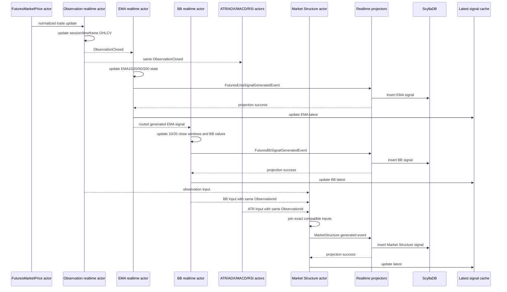
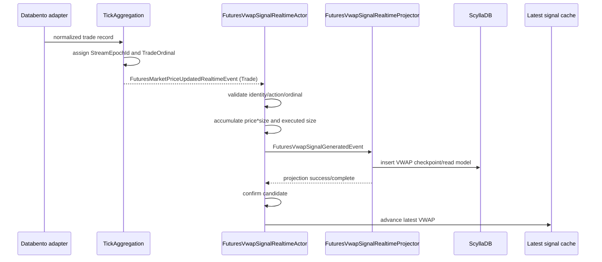
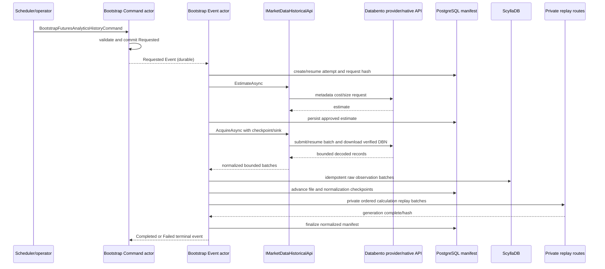

# Regime Discovery Market Signal Interface Implementation

Implementation Specification v1.0

| Item | Value |
| --- | --- |
| Status | Proposed repository-specific implementation plan; implementation not started |
| Date | 2026-08-25 |
| Design authority | `Regime-Discovery-Market-Signal-Interface-Design-v1.0.md` |
| Primary consumer | Intrinsic Time Strategy Workflow - Regime Discovery pipeline |
| Actor conventions | `Documents/system/Actor-Implementation-Conventions.md` |
| Message conventions | `Documents/system/Actor-Message-Types-and-Delivery-Conventions.md` |
| Target | Deterministic V1 / .NET 10 actor application |

## 1. Purpose

This document converts the approved Market Data Analytics signal design into
a repository-specific implementation plan. It defines project ownership,
files, actors, contexts, messages, state, projectors, cache behavior, ScyllaDB
tables, PostgreSQL bootstrap control state, Databento Historical acquisition,
runtime registration, migration order, tests, and gate exit criteria.

The implementation supplies one coherent signal interface for Regime
Discovery without allowing the Trade domain to calculate indicators or read
ticks, ScyllaDB, Redis, or provider APIs directly.

## 2. Binding implementation decisions

1. Market Data Feed owns normalized market observations. Market Data Analytics
   owns every indicator formula and derived signal.
2. Bar-derived signals consume one shared immutable OHLCV observation per
   contract/series and timeframe. Session VWAP is the explicit trade-derived
   signal and consumes normalized trade-originated market-price events.
3. `FuturesVwapSignalRealtimeActor`, not TickAggregation, owns VWAP state and
   calculation. TickAggregation only appends normalized trade and delivery
   lineage to `FuturesMarketPriceUpdatedRealtimeEvent`.
4. New live signal calculation uses Realtime actors, Core NATS routes, and
   `BaseRealtimeProjector<TActor>`. It does not create durable Event actors,
   JetStream replay queues, or event-source logs for each calculated sample.
5. Realtime projection remains one attempt. A source, complete, or fail event
   is published according to the existing projector convention; actor state
   is confirmed only after projection succeeds.
6. The historical bootstrap is different from live calculation. It is a
   durable, parameter-only external acquisition workflow with Command and
   Event actors, idempotent manifests, checkpoints, and a provider-neutral
   application API.
7. Historical provider rows never appear in Command/Event messages. The
   bootstrap complete event carries counts, hashes, and manifest identity,
   not a year of observations.
8. ScyllaDB stores raw normalized observations and derived read models.
   PostgreSQL event-source/control storage owns bootstrap workflow state and
   acquisition manifests.
9. New Scylla tables use descriptive names with `schemaVersion` columns and no
   `_vX` suffix. There is no production-data compatibility requirement for
   the Futures EOD cutover.
10. Public/shared entities are immutable. Entity IDs are `readonly record
    struct` types where their fields support value semantics.
11. Public MessagePack contracts are append-only. Existing keys are never
    reordered, removed, or reused.
12. Every public class, constructor, method, and property receives XML
    documentation. Private handler helpers are documented according to the
    actor convention.
13. New actor constructors receive only closed generic actor contexts:
    `ICommandActorContext<TActor>`, `IEventActorContext<TActor>`,
    `IQueryActorContext<TActor>`, or `IRealtimeActorContext<TActor>`.
14. Typed context properties are constructor-set once with
    `IsArgumentNull.Set`. Actor handlers access them through typed context
    interfaces and extension properties. New code does not use
    `Container.Resolve`.
15. Actor parse, receive, and validation support is explicit in dictionaries.
    New actors do not use reflection discovery or a growing domain switch.

## 3. Current baseline and required changes

### 3.1 Reusable application conventions

| Concern | Existing pattern to reuse |
| --- | --- |
| Closed generic contexts | `IRealtimeActorContext<FuturesMacdSignalRealtimeActor>` and the other refactored actor contexts |
| Realtime projection | `FuturesMacdSignalRealtimeProjector`, `FuturesAtrSignalRealtimeProjector`, and `BaseRealtimeProjector<TActor>` |
| Runtime routing | `AddRealtimeRouter` during actor startup and `RemoveRealtimeRouter` during shutdown |
| Open generic DI | Startup assembly scanning for `IActor<>`, all four closed context interfaces, state repositories, and projectors |
| Scylla schema | `MarketDataSchemaCql` plus ordered `SchemaObjectDefinition` entries in `MarketDataSchemaDb` |
| Storage command naming | `.Use($"{nameof(MarketDataDbCql)}.{nameof(...)}", commandText)` |
| Read/write API | `IMarketDataDbReadContext`, `IMarketDataDbWriteContext`, `MarketDataDbContext`, and cancellation-aware query overloads |
| Historical definition query | Pinned Databento C++ client, native opaque result handle, managed `SafeHandle`, strict timeout, complete-or-fail result |
| Event-source bootstrap control | `BaseEventSourceCommandActor<TActor>`, typed state repository, PostgreSQL event log, and explicit main/complete/fail event family |

### 3.2 Existing behavior that must not be copied

- Legacy per-indicator timers independently sample the latest price.
- `FuturesEodDataModel` calculates Bollinger/statistical interpretation in the
  Feed bounded context.
- `BollingerBands` mixes EOD price statistics and VX volatility interpretation.
- Existing signal tables omit complete observation/configuration provenance.
- Some legacy actors resolve repositories from `context.Container`.
- Several older actor implementations use type switches instead of explicit
  receive maps.
- Existing `IMarketDataApi` has live/hot-price and Historical definition
  operations only; it has no historical OHLCV/trade range contract.
- Databento `ohlcv-1d` is UTC-day based and must not be treated as the IFM
  18:00-to-17:00 futures value-date session without normalization.

## 4. Project and dependency boundaries

### 4.1 Contract ownership

```text
TomasAI.IFM.Domain.MarketData.Feed.Shared
  Raw normalized market-price and OHLCV observation contracts

TomasAI.IFM.Domain.MarketData.Analytics.Shared
  Signal entity IDs, read models, generated/complete/fail events,
  queries, query parameters, cache/snapshot contracts

TomasAI.IFM.Framework.MarketData.Contracts
  Provider-neutral historical request/result/streaming contracts

TomasAI.IFM.Framework.MarketData.DataBento
  Databento Historical provider implementation and native interop

TomasAI.IFM.Application.MarketData.Contracts
  Provider-neutral application orchestration boundary

TomasAI.IFM.Application.MarketData.DataBento
  Domain-symbol resolution and Databento historical application adapter

TomasAI.IFM.Application.Storage
  Scylla market observation/signal storage and PostgreSQL bootstrap control

TomasAI.IFM.Domain.MarketData.Feed
  Raw Futures EOD cutover and shared observation publication

TomasAI.IFM.Domain.MarketData.Analytics
  Calculation actors, runtime, cache, snapshot provider, bootstrap actors
```

`Domain.MarketData.Analytics.Shared` must not reference Trade.Shared.
Trade.Shared already references Analytics.Shared, preserving the dependency
direction required by Regime Discovery.

### 4.2 Historical API boundary

Do not add Databento request types to `IMarketDataApi` or actor contexts. Add a
separate application contract:

```text
Application.MarketData.Contracts/Historical/
  IMarketDataHistoricalApi.cs
  MarketDataHistoricalRequest.cs
  MarketDataHistoricalEstimate.cs
  MarketDataHistoricalManifest.cs
  NormalizedHistoricalObservation.cs
  NormalizedHistoricalTrade.cs
```

The application implementation depends on a framework provider contract:

```text
Framework.MarketData/Contracts/Historical/
  IMarketDataHistoricalProvider.cs
  HistoricalProviderRequest.cs
  HistoricalProviderEstimate.cs
  HistoricalProviderJob.cs
  HistoricalProviderFile.cs
  IHistoricalRecordReader.cs
```

Only `Framework.MarketData.DataBento` knows Databento dataset codes,
symbology, schema names, batch job IDs, DBN, Zstandard, or native handles.

## 5. Proposed repository topology

### 5.1 Shared contracts

```text
TomasAI.IFM.Domain.MarketData.Analytics.Shared/
  MarketSignals/
    Common/
      MarketAnalyticsSignalKey.cs
      MarketAnalyticsSignalMetadata.cs
      MarketSeriesIdentity.cs
      MarketSignalCalculationMethod.cs
      MarketSignalValidationIssue.cs
    Observation/
      FuturesAnalyticsObservationEntityId.cs
      FuturesAnalyticsObservationReadModel.cs
      FuturesAnalyticsObservationClosedRealtimeEvent.cs
    Ema/
      FuturesEmaSignalEntityId.cs
      FuturesEmaSignalReadModel.cs
      FuturesEmaSignalGeneratedEvent.cs
      FuturesEmaSignalGeneratedCompleteEvent.cs
      FuturesEmaSignalGeneratedFailEvent.cs
      GetLastFuturesEmaSignalQuery.cs
      GetFuturesEmaSignalHistoryQuery.cs
    BollingerBand/
      FuturesBbSignalEntityId.cs
      FuturesBbSignalReadModel.cs
      FuturesBbSignalGeneratedEvent.cs
      FuturesBbSignalGeneratedCompleteEvent.cs
      FuturesBbSignalGeneratedFailEvent.cs
      GetLastFuturesBbSignalQuery.cs
      GetFuturesBbSignalHistoryQuery.cs
    AtrVolatility/
      FuturesAtrVolatilitySignalEntityId.cs
      FuturesAtrVolatilitySignalReadModel.cs
    MarketStructure/
      FuturesMarketStructureSignalEntityId.cs
      FuturesMarketStructureSignalReadModel.cs
      generated/complete/fail and query contracts
    VxTermStructure/
      FuturesVxTermStructureSignalEntityId.cs
      FuturesVxTermStructureSignalReadModel.cs
      generated/complete/fail and query contracts
    Vwap/
      FuturesVwapSignalEntityId.cs
      FuturesVwapSignalReadModel.cs
      FuturesVwapSignalGeneratedEvent.cs
      FuturesVwapSignalGeneratedCompleteEvent.cs
      FuturesVwapSignalGeneratedFailEvent.cs
      GetLastFuturesVwapSignalQuery.cs
      GetFuturesVwapSignalHistoryQuery.cs
  RegimeDiscovery/
    Contracts/
    Model/
    ServiceApi/
```

### 5.2 Analytics implementation

Each new signal root follows existing domain structure:

```text
TomasAI.IFM.Domain.MarketData.Analytics/
  Observation/
    Realtime/Actor/
    Realtime/Extensions/
    Realtime/Projector/
    Realtime/State/
  FuturesEmaSignal/
    Realtime/Actor/
    Realtime/Extensions/
    Realtime/Projector/
    Realtime/State/
    Realtime/Model/
    Query/Actor/
    Query/Extensions/
  FuturesBbSignal/
    Realtime/Actor/
    Realtime/Extensions/
    Realtime/Projector/
    Realtime/State/
    Realtime/Model/
    Query/Actor/
    Query/Extensions/
  FuturesAtrVolatilitySignal/
  FuturesMarketStructureSignal/
  FuturesVxTermStructureSignal/
  FuturesVwapSignal/
  HistoricalBootstrap/
    Command/Actor/
    Command/Extensions/
    Command/State/
    Command/Validation/
    Event/Actor/
    Event/Extensions/
    Query/Actor/
    Query/Extensions/
  RegimeDiscovery/
    SignalCache/
    Snapshot/
    Warmup/
    Health/
  Runtime/
    MarketDataAnalyticsSignalRuntime.cs
    MarketDataAnalyticsSignalRuntimeOptions.cs
```

Realtime signal roots do not add durable Event actors. HistoricalBootstrap has
an Event actor because it participates in a durable external acquisition
workflow.

### 5.3 Storage files

Extend the existing storage surface rather than creating a second MarketData
context:

```text
TomasAI.IFM.Application.Storage/MarketDataDb/
  IMarketDataDbReadContext.cs
  IMarketDataDbWriteContext.cs
  MarketDataDbContext.AnalyticsSignals.cs
  MarketDataDbContext.AnalyticsSignalsCancellation.cs
  MarketDataDbCql.AnalyticsSignals.cs
  MarketDataDbParameters.AnalyticsSignals.cs
  Schema/MarketDataSchemaCql.AnalyticsSignals.cs
  Schema/MarketDataSchemaDb.cs

TomasAI.IFM.Application.Storage/HistoricalBootstrapDb/
  HistoricalBootstrapDbContext.cs
  IHistoricalBootstrapDbContext.cs
  HistoricalBootstrapDbSql.cs
  HistoricalBootstrapDbParameters.cs
  Schema/HistoricalBootstrapSchemaDb.cs
  Schema/HistoricalBootstrapSchemaSql.cs
```

Partial classes may be used to keep the already large MarketData context and
CQL catalog reviewable. They remain one logical context and schema registry.

## 6. Actor implementation conventions

### 6.1 Typed context pattern

Every new actor receives one closed generic context and retains one typed,
readonly domain context:

```csharp
public sealed class FuturesEmaSignalRealtimeActor(
    IRealtimeActorContext<FuturesEmaSignalRealtimeActor> actorContext)
    : BaseEventActor<FuturesEmaSignalRealtimeActor>(
        actorContext,
        actorContext.Logger)
{
    protected IFuturesEmaSignalRealtimeContext ActorContext { get; } =
        IsArgumentNull.Set(
            actorContext as IFuturesEmaSignalRealtimeContext,
            nameof(actorContext))!;
}
```

`IFuturesEmaSignalRealtimeContext` inherits
`IRealtimeActorContext<FuturesEmaSignalRealtimeActor>`. Its concrete context
derives from `EventActorContext`, implements both interfaces, and constructor-
sets `Supervisor`, `Projector`, `SignalCache`, `Logger`, and any approved
feature service with `IsArgumentNull.Set`.

Use one `Extensions` class per typed context to expose readonly extension
properties. Do not use `Container.Resolve`, static service location, or
duplicate concrete dependency registration.

### 6.2 Parsing and dispatch

Each actor owns:

- a static verb-to-parser dictionary;
- a concrete-event-type-to-handler dictionary;
- subject validation for its exact `ActorType` and actor name;
- common envelope validation after deserialization; and
- an explicit unsupported-message exception.

Handlers live in event-family extension classes and use `ExecuteAsync`.
Generated, complete, and fail behavior for one family remains co-located.
Actor methods await handlers; no fire-and-forget work is permitted.

### 6.3 Realtime startup and shutdown

Startup order is:

1. validate typed context;
2. start the actor's realtime projector;
3. hydrate bounded actor state when required;
4. add approved realtime source routes; and
5. mark actor health ready only after hydration succeeds.

Shutdown performs the reverse order:

1. remove routes so new messages stop arriving;
2. drain or reject bounded private replay input;
3. release stream ownership owned by the feature;
4. stop the projector; and
5. clear process-local state and health.

Every route added at startup is removed exactly once during shutdown and in
startup rollback.

### 6.4 Realtime projection contract

Each projector derives from `BaseRealtimeProjector<TActor>` and exposes an
immutable descriptor array. The normal flow is:

```text
input realtime event
  -> actor evaluates candidate against private state
  -> generated event
  -> BaseRealtimeProjector publishes source
  -> Scylla insert succeeds
  -> projector publishes complete
  -> actor confirms candidate and advances latest cache
```

On storage failure the projector publishes fail once, the candidate is not
confirmed, and no automatic durable replay is created. Cache failure after a
successful projection marks cache health unhealthy and is repaired from
Scylla or a later valid signal; it does not roll back Scylla history.

### 6.5 Query actors

Each signal Query actor uses `IQueryActorContext<TActor>`, explicit parse and
receive maps, cancellation propagation, and `ReplyAsync` only after
`cancellationToken.ThrowIfCancellationRequested()`. Queries call
`IDbContextFactory.MarketDataDb`; they do not inspect actor state or the hot
Regime snapshot cache.

Required queries are:

- exact latest by series/contract, timeframe, configuration, and value date;
- bounded history by date/time range with an explicit maximum row count; and
- bootstrap diagnostics by manifest ID through the bootstrap Query actor.

No query mutates state. No query uses `ALLOW FILTERING`.

### 6.6 Command and Event actors for bootstrap only

`FuturesAnalyticsHistoryBootstrapCommandActor` derives from
`BaseEventSourceCommandActor<TActor>`. It validates a parameter-only command,
loads event-sourced attempt state, commits a Requested event, and returns the
command ID. Its repository is constructor-injected through the typed context;
it is not resolved from the container.

`FuturesAnalyticsHistoryBootstrapEventActor` consumes the Requested event via
durable Event delivery. Its extension handler calls
`IMarketDataHistoricalApi`, resumes the manifest/checkpoints, normalizes and
persists bounded batches, drives private actor replay, and publishes one
correlated Completed or Failed terminal event. A failed attempt is terminal;
an operator or scheduler submits a new command ID to retry.

## 7. Message and identity structure

### 7.1 Entity IDs

Create immutable typed IDs instead of using unrelated generic IDs:

```csharp
public readonly record struct FuturesEmaSignalEntityId(
    MarketSeriesIdentity Series,
    TimeFrameType TimeFrame,
    string ConfigurationId) : IActorEntityId;

public readonly record struct FuturesVwapSignalEntityId(
    string ContractId,
    DateOnly ValueDate,
    string ConfigurationId) : IActorEntityId;
```

Each ID implements one canonical `Format()` representation and validation.
Daily continuation series use `FuturesSeriesId`; specific intraday signals use
`ContractId`. The identity kind is explicit and never inferred from string
shape.

### 7.2 Common read-model metadata

Every new read model carries:

```text
ContractId
FuturesSeriesId when applicable
ValueDate
TimeFrame
ObservationId
MarketDataAsOfUtc
CalculatedAtUtc
SourceSequence
SchemaVersion
CalculationConfigurationId
CalculationVersion
```

Warm/valid state belongs to the latest-cache envelope because a successfully
persisted historical signal is immutable. Formula validation issue codes that
describe the persisted calculation may remain on the read model.

### 7.3 Existing market-price contract extension

`FuturesMarketTradeSnapshot` currently uses MessagePack keys 0 through 4:

| Key | Existing member |
| ---: | --- |
| 0 | `LastPrice` |
| 1 | `LastSize` |
| 2 | `SourceSequence` |
| 3 | `EventTimestamp` |
| 4 | `ReceiveTimestamp` |

Append these keys:

| Key | New member | Purpose |
| ---: | --- | --- |
| 5 | `NormalizedTradeAction` | New/change/cancel/correct semantics |
| 6 | `NormalizedTradeSide` | Provider-neutral aggressor/side when known |
| 7 | `NormalizedTradeConditionFlags` | VWAP eligibility and correction evidence |
| 8 | `StreamEpochId` | Detect feed reconstruction |
| 9 | `TradeOrdinal` | Detect duplicate/missing accepted live trades |

Unknown/default values preserve compatibility with older serialized payloads
but are not sufficient for a warm, exact VWAP. `SchemaVersion` on
`FuturesMarketPriceUpdatedRealtimeEvent` advances when these fields are
introduced. `LastSize` remains one normalized trade record's executed size;
it is not quote size or cumulative session volume.

### 7.4 New realtime messages

| Message | Producer | Consumer | Delivery |
| --- | --- | --- | --- |
| `FuturesAnalyticsObservationClosedRealtimeEvent` | Observation actor | Bar-derived signal actors | Realtime/Core NATS |
| `FuturesEmaSignalGeneratedEvent` | EMA actor/projector source | EMA projector and BB route | Realtime subject |
| `FuturesBbSignalGeneratedEvent` | BB actor/projector source | BB projector and Market Structure route | Realtime subject |
| `FuturesAtrVolatilitySignalGeneratedEvent` | ATR migration actor | ATR projector and Market Structure route | Realtime subject |
| `FuturesMarketStructureSignalGeneratedEvent` | Market Structure actor | Projector/cache | Realtime subject |
| `FuturesVxTermStructureSignalGeneratedEvent` | VX actor | Projector/cache | Realtime subject |
| `FuturesVwapSignalGeneratedEvent` | VWAP actor | Projector/cache | Realtime subject |
| `FuturesAnalyticsObservationReplayBatchRealtimeEvent` | Bootstrap coordinator | Observation/calculation actor | Private Realtime route |
| `FuturesVwapTradeReplayBatchRealtimeEvent` | Bootstrap coordinator | VWAP actor | Private Realtime route |

Generated event contracts continue to implement the existing event envelope
expected by realtime projectors, but their `Subject.ActorType` and destination
actor name are Realtime. Complete/fail terminal events use the same Realtime
mailbox. No reply contract is added.

Private replay batches contain a bounded immutable array, manifest ID, replay
generation ID, batch ordinal, first/last source identity, and final-batch
marker. Maximum records and serialized bytes are configuration with hard
validation. A replay generation is all-or-invalid; partial generations do not
mark a signal warm.

### 7.5 Bootstrap command/event family

```text
BootstrapFuturesAnalyticsHistoryCommand
FuturesAnalyticsHistoryBootstrapRequestedEvent
FuturesAnalyticsHistoryBootstrapCompletedEvent
FuturesAnalyticsHistoryBootstrapFailedEvent
GetFuturesAnalyticsHistoryBootstrapQuery
```

The command/request event contains only:

```text
BootstrapAttemptId
Series requests (ES continuation, VX front/back, configured contracts)
StartDate / EndDate
Requested signal families
Exact VWAP required/optional
Maximum estimated cost and bytes
Configuration/calculation versions
RequestedBy / correlation metadata
```

The completed event contains manifest ID, normalized observation/trade counts,
date coverage, source and normalized hashes, gap summary, resulting latest
ObservationIds, and completion timestamp. The failed event uses the standard
error envelope plus the last durable stage/checkpoint. Neither terminal event
contains downloaded provider records.

### 7.6 MessagePack and validation rules

- Envelope keys remain 0 through 7 where that is the existing family layout;
  payload keys begin at 8.
- New members append only.
- Required strings reject null, empty, and whitespace.
- Decimal/double outputs must be finite; positive denominators are enforced.
- UTC `DateTime`/`DateTimeOffset` semantics are explicit.
- Source identity, contract, series, value date, timeframe, observation, and
  calculation configuration must agree at every actor join.
- Every shared contract has MessagePack round-trip and prior-payload
  compatibility tests.

## 8. Live actor topology and flows

### 8.1 Bar-derived calculation flow



`FuturesMarketStructureSignalRealtimeActor` keeps a bounded pending join keyed
by signal key and ObservationId. It emits only when required Observation, BB,
and ATR inputs are compatible. Expired incomplete joins produce health/issues,
not partially defaulted signals.

### 8.2 VWAP flow



The actor ignores quote-originated events even when their snapshot carries the
last cached trade. Duplicate/older ordinals are ignored. A forward ordinal gap,
unexpected epoch, uncorrelatable correction, or inconsistent close checkpoint
marks state invalid and starts bounded current-session recovery. The actor
does not publish a valid-looking value while an unknown contribution is
missing.

The actor processes every eligible trade. Projection/cache publication may be
coalesced by configuration to prevent one Scylla row per high-volume trade,
but coalescing never removes a trade from the private accumulator. Session
close always publishes a terminal checkpoint.

### 8.3 VX term structure flow

The Analytics runtime resolves calendar front and second VX contracts through
the Securities/current-contract authority and owns stream leases for both.
`FuturesVxTermStructureSignalRealtimeActor` registers the market-price route,
stores the newest valid leg snapshots, and emits only when:

- both configured contract identities match the same roll revision;
- both prices are positive;
- timestamps are within configured skew;
- source streams are active; and
- neither leg is stale.

Rollover removes old leases/routes, clears the incompatible two-leg join,
starts the new pair, and produces a new configuration/roll identity before any
new signal is valid.

### 8.4 Formula ownership

| Signal | Actor-owned state | Output |
| --- | --- | --- |
| EMA | Four recursive values, four prior values, bootstrap seed depth | EMA10/20/50/200 and slopes |
| BB | Last 20 closes, width history, compatible EMA10/20 | EMA-centered BB10/20, widths, positions |
| ATR Volatility | Existing Wilder state plus prior/baseline window | ATR, prior, baseline, ratio, true range |
| Market Structure | Prior highs/lows and bounded ObservationId join | ranges, breakout distance, BB/ATR context |
| VX Term Structure | Current front/back legs and prior composite | spread, ratio, percent, state |
| VWAP | Session numerator, volume, count, contribution/recovery lineage | VWAP and price relationship |

Formula classes are pure, deterministic, internal functions under each
feature's `Realtime/Model` folder. Actors own orchestration and state; formula
classes do not call storage, caches, clocks, NATS, or provider APIs.

## 9. Futures EOD cutover

### 9.1 Raw model

Replace the derived-field responsibility of `FuturesEodDataV2ReadModel` with a
raw `FuturesEodObservationReadModel` containing:

```text
ContractId / FuturesSeriesId / ValueDate
SessionStartUtc / SessionEndUtc
Open / High / Low / Close / Volume / TradeCount / PriceVolumeSum
ObservationId
Provider-neutral source identity and first/last sequence/timestamp
SchemaVersion / IsComplete / IsValid
```

Remove Bollinger, standard deviation, market direction/volatility, MDI, and
moving-average calculation from `FuturesEodDataModel`. Remove
`BollingerBands` from the Feed write path. Feed persists raw facts and emits
the Daily observation only after the raw write succeeds.

### 9.2 Compatibility assembler

Add `IFuturesEodAnalyticsAssembler` in the application/domain boundary used by
legacy UI/API queries. It joins:

- exact raw EOD observation;
- same-observation EMA signal;
- same-observation BB signal; and
- any explicitly requested ATR/structure/VX context.

The assembler reads hot cache for current values and bounded Scylla queries
for historical values. Missing/not-warm data is explicit. It never persists a
cache-derived value back into the raw EOD row.

### 9.3 Development migration

Because the environment has no production data dependency:

1. stop writers;
2. create the new raw and Analytics schemas;
3. remove legacy derived EOD table definitions and code paths;
4. run the one-year historical bootstrap;
5. validate row counts, gaps, hashes, and calculated values;
6. start new runtime routes; and
7. run UI/query compatibility tests.

Do not implement a permanent dual-write or `_v3` table merely to preserve
development rows.

## 10. Latest cache and Regime snapshot provider

### 10.1 Cache

Add singleton `IMarketAnalyticsLatestSignalCache`, keyed by
`MarketAnalyticsSignalKey`. Values are immutable envelopes containing the
typed read model, warm/valid state, issue codes, and accepted cache revision.

`TryPut` applies newer-wins ordering using observation time, source sequence,
calculation identity, and signal-specific lineage. Every accepted mutation
increments one monotonic process-local revision. Mutable actor windows and
historical collections never escape into the cache.

### 10.2 Warmup

`MarketAnalyticsSignalCacheWarmer` reads the newest compatible Scylla row and
the bounded preceding window required to reconstruct actor state. It validates
schema, calculation configuration, source identity, continuity, and formula
depth before setting `IsWarm`.

EMA200 requires at least 201 valid Daily closes for current/prior values. BB20
requires its close window and prior width baseline. VWAP can warm from a same-
session checkpoint only after replay fills every contribution after that
checkpoint.

### 10.3 Snapshot provider

`IRegimeDiscoveryMarketSignalSnapshotProvider.CaptureAsync` performs the
revision-stability loop from the design document. It returns one immutable
snapshot or structured availability issues. It makes no provider, Scylla,
Redis, or actor query during capture.

The provider validates specific-contract versus continuation-series identity,
timeframe, configuration, freshness, warm state, calculation method, and
same-timeframe observation compatibility. Approximate VWAP cannot satisfy an
exact-VWAP requirement.

## 11. ScyllaDB schema

### 11.1 Query-first rules

- Partition keys match exact latest/history query inputs.
- `yearMonth` bounds observation and bar-derived signal partitions.
- VWAP partitions by contract, value date, and configuration because its state
  is one bounded trading session.
- Clustering order is newest first for `LIMIT 1` latest reads.
- Primary keys include deterministic `observationId` or `tradeOrdinal` so
  replayed inserts are idempotent.
- No `ALLOW FILTERING`, server-side secondary index, or unbounded global latest
  scan is introduced.
- New tables have no TTL until retention is explicitly approved.
- Application code supplies `yearMonth`; CQL does not derive it.

### 11.2 Raw EOD observations

```sql
CREATE TABLE IF NOT EXISTS futures_eod_observation (
    seriesKey text,
    yearMonth int,
    valueDate date,
    contractId text,
    futuresSeriesId text,
    sessionStart timestamp,
    sessionEnd timestamp,
    openPrice decimal,
    highPrice decimal,
    lowPrice decimal,
    closePrice decimal,
    volume bigint,
    tradeCount bigint,
    priceVolumeSum decimal,
    observationId uuid,
    firstSourceSequence bigint,
    lastSourceSequence bigint,
    firstMarketEvent timestamp,
    lastMarketEvent timestamp,
    sourceDataset text,
    sourceSchema text,
    sourceSymbol text,
    schemaVersion int,
    isComplete boolean,
    isValid boolean,
    PRIMARY KEY ((seriesKey, yearMonth), valueDate, contractId)
) WITH CLUSTERING ORDER BY (valueDate DESC, contractId ASC);
```

### 11.3 Shared Analytics observations

```sql
CREATE TABLE IF NOT EXISTS futures_analytics_observation (
    seriesKey text,
    timePeriod text,
    yearMonth int,
    marketDataAsOf timestamp,
    observationId uuid,
    contractId text,
    futuresSeriesId text,
    valueDate date,
    intervalStart timestamp,
    intervalEnd timestamp,
    openPrice decimal,
    highPrice decimal,
    lowPrice decimal,
    closePrice decimal,
    volume bigint,
    tradeCount bigint,
    priceVolumeSum decimal,
    firstSourceSequence bigint,
    lastSourceSequence bigint,
    firstMarketEvent timestamp,
    lastMarketEvent timestamp,
    schemaVersion int,
    calculationVersion text,
    isComplete boolean,
    isValid boolean,
    PRIMARY KEY (
        (seriesKey, timePeriod, yearMonth),
        marketDataAsOf,
        observationId)
) WITH CLUSTERING ORDER BY (marketDataAsOf DESC, observationId ASC);
```

### 11.4 EMA signal

```sql
CREATE TABLE IF NOT EXISTS futures_ema_signal (
    seriesKey text,
    timePeriod text,
    configurationId text,
    yearMonth int,
    marketDataAsOf timestamp,
    observationId uuid,
    contractId text,
    futuresSeriesId text,
    valueDate date,
    price decimal,
    ema10 decimal,
    ema20 decimal,
    ema50 decimal,
    ema200 decimal,
    previousEma10 decimal,
    previousEma20 decimal,
    previousEma50 decimal,
    previousEma200 decimal,
    ema10Slope decimal,
    ema20Slope decimal,
    ema50Slope decimal,
    ema200Slope decimal,
    sourceSequence bigint,
    sourceEventNanos bigint,
    calculatedAt timestamp,
    schemaVersion int,
    calculationVersion text,
    PRIMARY KEY (
        (seriesKey, timePeriod, configurationId, yearMonth),
        marketDataAsOf,
        observationId)
) WITH CLUSTERING ORDER BY (marketDataAsOf DESC, observationId ASC);
```

### 11.5 Bollinger Band signal

```sql
CREATE TABLE IF NOT EXISTS futures_bb_signal (
    seriesKey text,
    timePeriod text,
    configurationId text,
    yearMonth int,
    marketDataAsOf timestamp,
    observationId uuid,
    contractId text,
    futuresSeriesId text,
    valueDate date,
    price decimal,
    ema10 decimal,
    standardDeviation10 double,
    upperBand10 decimal,
    lowerBand10 decimal,
    width10 decimal,
    position10 double,
    ema20 decimal,
    standardDeviation20 double,
    upperBand20 decimal,
    lowerBand20 decimal,
    width20 decimal,
    position20 double,
    width20Baseline decimal,
    width20Ratio double,
    sourceSequence bigint,
    sourceEventNanos bigint,
    calculatedAt timestamp,
    schemaVersion int,
    calculationVersion text,
    PRIMARY KEY (
        (seriesKey, timePeriod, configurationId, yearMonth),
        marketDataAsOf,
        observationId)
) WITH CLUSTERING ORDER BY (marketDataAsOf DESC, observationId ASC);
```

### 11.6 ATR volatility and Market Structure

```sql
CREATE TABLE IF NOT EXISTS futures_atr_volatility_signal (
    seriesKey text,
    timePeriod text,
    configurationId text,
    yearMonth int,
    marketDataAsOf timestamp,
    observationId uuid,
    contractId text,
    futuresSeriesId text,
    valueDate date,
    price decimal,
    trueRange decimal,
    atr decimal,
    previousAtr decimal,
    baselineAtr decimal,
    atrRatio double,
    sourceSequence bigint,
    sourceEventNanos bigint,
    calculatedAt timestamp,
    schemaVersion int,
    calculationVersion text,
    PRIMARY KEY (
        (seriesKey, timePeriod, configurationId, yearMonth),
        marketDataAsOf,
        observationId)
) WITH CLUSTERING ORDER BY (marketDataAsOf DESC, observationId ASC);

CREATE TABLE IF NOT EXISTS futures_market_structure_signal (
    seriesKey text,
    timePeriod text,
    configurationId text,
    yearMonth int,
    marketDataAsOf timestamp,
    observationId uuid,
    contractId text,
    futuresSeriesId text,
    valueDate date,
    openPrice decimal,
    highPrice decimal,
    lowPrice decimal,
    closePrice decimal,
    currentRange decimal,
    atrNormalizedRange double,
    prior20High decimal,
    prior20Low decimal,
    breakoutDistance decimal,
    breakoutDistanceAtr double,
    bb10Position double,
    bb20Position double,
    bb20WidthRatio double,
    sourceSequence bigint,
    sourceEventNanos bigint,
    calculatedAt timestamp,
    schemaVersion int,
    calculationVersion text,
    PRIMARY KEY (
        (seriesKey, timePeriod, configurationId, yearMonth),
        marketDataAsOf,
        observationId)
) WITH CLUSTERING ORDER BY (marketDataAsOf DESC, observationId ASC);
```

### 11.7 VX term structure

```sql
CREATE TABLE IF NOT EXISTS futures_vx_term_structure_signal (
    seriesKey text,
    configurationId text,
    yearMonth int,
    marketDataAsOf timestamp,
    observationId uuid,
    valueDate date,
    rollRevision text,
    frontContractId text,
    frontExpiry date,
    frontPrice decimal,
    frontSourceSequence bigint,
    frontMarketDataAsOf timestamp,
    backContractId text,
    backExpiry date,
    backPrice decimal,
    backSourceSequence bigint,
    backMarketDataAsOf timestamp,
    frontBackSpread decimal,
    frontBackRatio double,
    termStructurePercent double,
    termStructureState text,
    previousFrontBackRatio double,
    previousTermStructurePercent double,
    calculatedAt timestamp,
    schemaVersion int,
    calculationVersion text,
    PRIMARY KEY (
        (seriesKey, configurationId, yearMonth),
        marketDataAsOf,
        observationId)
) WITH CLUSTERING ORDER BY (marketDataAsOf DESC, observationId ASC);
```

### 11.8 VWAP signal

```sql
CREATE TABLE IF NOT EXISTS futures_vwap_signal (
    contractId text,
    valueDate date,
    configurationId text,
    marketDataAsOf timestamp,
    tradeOrdinal bigint,
    observationId uuid,
    sessionStart timestamp,
    cumulativePriceVolume decimal,
    cumulativeVolume bigint,
    eligibleTradeCount bigint,
    vwap decimal,
    lastPrice decimal,
    priceMinusVwap decimal,
    priceToVwapPercent double,
    streamEpochId uuid,
    lastTradeSourceSequence bigint,
    isTickExact boolean,
    calculationMethod text,
    calculatedAt timestamp,
    schemaVersion int,
    calculationVersion text,
    PRIMARY KEY (
        (contractId, valueDate, configurationId),
        marketDataAsOf,
        tradeOrdinal)
) WITH CLUSTERING ORDER BY (marketDataAsOf DESC, tradeOrdinal DESC);
```

### 11.9 Roll segments and VIX composite

Add `futures_series_roll_segment` keyed by `(futuresSeriesId,
rollConfigurationVersion)` and effective date. It records actual source
contract, provider instrument identity, unadjusted roll price, backward
adjustment amount/factor, and manifest ID. This is normalized market history;
the Securities domain remains the authority that resolves eligible contracts.

Add `vix_volatility_signal` only when a valid VIX spot provider is implemented.
It composes spot with a referenced VX term-structure ObservationId; it does not
duplicate the full front/back history.

### 11.10 Schema registration

Every table constant is registered in `MarketDataSchemaDb.Objects` with its
development drop statement. Registration order is raw observation, signal
tables, and optional composites. Schema creation tests assert the exact object
set and run twice to prove idempotency.

## 12. Storage context and CQL implementation

### 12.1 Interfaces

Append typed operations to `IMarketDataDbWriteContext`:

```text
InsertFuturesEodObservationAsync
InsertFuturesAnalyticsObservationAsync
InsertFuturesEmaSignalAsync
InsertFuturesBbSignalAsync
InsertFuturesAtrVolatilitySignalAsync
InsertFuturesMarketStructureSignalAsync
InsertFuturesVxTermStructureSignalAsync
InsertFuturesVwapSignalAsync
```

Append latest and bounded-history reads to `IMarketDataDbReadContext`, with
cancellation-aware overloads. Bulk historical observation inserts accept a
bounded `IReadOnlyList<T>` and never buffer a complete year in memory.

### 12.2 Command text and parameters

Each CQL constant has one globally clear name, such as:

```csharp
db.Use(
    $"{nameof(MarketDataDbCql)}.{nameof(MarketDataDbCql.InsertFuturesEmaSignal)}",
    MarketDataDbCql.InsertFuturesEmaSignal)
  .SetParameters(new InsertFuturesEmaSignal(signal));
```

Parameter records map every primary-key field explicitly. Do not pass domain
objects directly to anonymous provider parameters. Storage logging prints the
command name before command text through the existing `Use(commandName,
commandText)` convention.

### 12.3 Latest/history reads

Latest reads query the supplied/current `yearMonth` with `LIMIT 1`. If a Daily
latest query has no current-month row, application code checks a bounded number
of prior months determined by the requested warm-up window. It never removes
the month key or uses filtering.

History reads enumerate explicit month partitions, start them concurrently
within the configured storage fan-out limit, merge by market timestamp, and
apply the requested maximum result count. Cancellation propagates through
command execution and materialization.

### 12.4 Idempotency and batches

Deterministic primary keys make replay inserts idempotent. A conflicting row
with the same key but a different normalized hash is a bootstrap consistency
failure and is recorded in the manifest; it is not silently overwritten.

Use unlogged batches only for bounded statements in the same partition when
measurements justify them. Cross-partition historical ingestion uses bounded
parallel prepared statements, not a large logged batch.

## 13. PostgreSQL historical-bootstrap control schema

The event-source log remains authoritative for actor transitions. Add
operational manifest tables because provider jobs/files/checkpoints are not
domain event payloads:

```sql
CREATE SCHEMA IF NOT EXISTS market_data_history;

CREATE TABLE market_data_history.bootstrap_attempt (
    bootstrap_attempt_id uuid PRIMARY KEY,
    command_id uuid NOT NULL UNIQUE,
    status smallint NOT NULL,
    stage smallint NOT NULL,
    request_json jsonb NOT NULL,
    request_sha256 text NOT NULL,
    provider_name text NOT NULL,
    provider_job_id text NULL,
    estimated_cost numeric NULL,
    actual_cost numeric NULL,
    estimated_bytes bigint NULL,
    downloaded_bytes bigint NOT NULL DEFAULT 0,
    source_record_count bigint NOT NULL DEFAULT 0,
    normalized_record_count bigint NOT NULL DEFAULT 0,
    source_manifest_sha256 text NULL,
    normalized_manifest_sha256 text NULL,
    started_utc timestamptz NOT NULL,
    completed_utc timestamptz NULL,
    error_code text NULL,
    error_message text NULL,
    row_version bigint NOT NULL DEFAULT 0
);

CREATE TABLE market_data_history.bootstrap_file (
    bootstrap_attempt_id uuid NOT NULL,
    provider_file_id text NOT NULL,
    file_name text NOT NULL,
    schema_name text NOT NULL,
    expected_bytes bigint NOT NULL,
    expected_sha256 text NOT NULL,
    local_staging_path text NULL,
    downloaded_bytes bigint NOT NULL DEFAULT 0,
    decoded_record_count bigint NOT NULL DEFAULT 0,
    status smallint NOT NULL,
    PRIMARY KEY (bootstrap_attempt_id, provider_file_id)
);

CREATE TABLE market_data_history.bootstrap_checkpoint (
    bootstrap_attempt_id uuid NOT NULL,
    checkpoint_name text NOT NULL,
    batch_ordinal bigint NOT NULL,
    source_position text NOT NULL,
    last_source_timestamp timestamptz NULL,
    last_source_sequence bigint NULL,
    normalized_sha256 text NOT NULL,
    updated_utc timestamptz NOT NULL,
    PRIMARY KEY (bootstrap_attempt_id, checkpoint_name)
);
```

Updates use optimistic `row_version` checks. Paths are operational metadata,
not trusted input; the configured staging root is resolved and validated
before file access.

## 14. Databento Historical implementation

### 14.1 Current capability and required extension

The repository's pinned Databento C++ `v0.62.1` integration already uses the
Historical client for complete contract-definition intervals through a native
opaque result handle and managed `SafeHandle`. It does not expose time-series
range, cost estimate, batch submission, polling, file listing/download, or DBN
history decoding to the application.

Extend that provider boundary; do not build a second credential/TLS stack in
the Analytics domain. `DATABENTO_API_KEY` remains native-process input and is
never copied into a managed string or logged.

### 14.2 Provider request profiles

Initial profiles are configuration, not constants in actors:

| Purpose | Dataset/symbology | Schema | Normalization |
| --- | --- | --- | --- |
| ES Daily EMA/BB/structure | Configured ES dataset, volume or approved continuation rank | `ohlcv-1m` plus definitions | Aggregate to IFM futures session; apply versioned roll adjustment |
| Exact ES session VWAP | Actual/continuous ES trade identity | `trades` | Eligible trades grouped by IFM value date |
| VX front/back history | Configured VX dataset, calendar rank 0 and 1 | `ohlcv-1m` plus definitions | Resolve actual legs per date and aggregate aligned sessions |
| Contract/roll identity | Each configured dataset | `definition` and required mapping metadata | Persist actual instrument/contract mapping |
| EOD validation | Optional `statistics` | Statistics | Cross-check, never silently replace configured close semantics |

Databento continuous symbols return original, unadjusted prices. IFM records
the actual mapped instrument and applies its own versioned backward adjustment
for the Daily continuation series. VX term structure remains unadjusted actual
front/back prices; a synthetic price adjustment must never alter its ratio.

### 14.3 Session normalization

Databento `ohlcv-1d` is based on UTC dates. IFM's futures value date begins at
the configured 18:00 New York session start and ends at the following 17:00,
subject to holidays, early closes, maintenance breaks, and DST. Therefore:

- `ohlcv-1d` may be used for provider comparison and discovery only;
- canonical Daily EOD is aggregated from `ohlcv-1m` or exact trades;
- no-trade intervals do not create fabricated zero-volume bars;
- the first eligible price is Open, max/min are High/Low, the last eligible
  price is Close, and volume is summed with overflow checks; and
- exact VWAP is calculated only from eligible trade price and size.

The market calendar resolves UTC boundaries for each value date. Code must not
hard-code a fixed UTC offset.

### 14.4 Streaming versus batch

Use the Historical metadata cost/size estimate before any billable request.
The initial one-year acquisition uses a batch job because it is large,
resumable, and its files can be downloaded again without creating another data
request. Use direct time-series range streaming only for bounded repairs after
the same estimate/budget checks.

The initial date request is at least one complete calendar year ending at the
last complete trading session. If normalization produces fewer than 252 valid
sessions, extend the start backward until the configured minimum is met. The
EMA family is not fully warm until at least 201 consecutive valid closes exist.

Batch requests use DBN with Zstandard compression and a bounded split duration
(daily for trades; daily or monthly after measurement for bars/definitions).
Every returned support/data file is listed, size-checked, SHA-256 checked,
decoded, and recorded in the manifest before publication.

### 14.5 Native ABI extension

Add native exports and matching `LibraryImport` declarations for logical
operations:

```text
historical_estimate
historical_batch_submit
historical_batch_get_status
historical_batch_list_files
historical_batch_download_file
historical_range_open
historical_result_get_next_batch
historical_result_destroy
```

Names may follow the existing `dbf_*` C ABI prefix. Each request/result struct
contains `StructSize` and `AbiVersion`. Increment the native and managed ABI
version together, retain existing exports, and fail fast on mismatch.

Opaque native resources receive dedicated managed `SafeHandle` types. All
handles are released in `finally`/`Dispose`; download/decode cancellation stops
new work without freeing memory still owned by native code. Historical record
delivery uses bounded normalized batches and never materializes a complete
year in one managed array.

The existing pinned C++ dependency, OpenSSL/Zstandard linkage, Windows
certificate validation, error/status translation, and API-key handling remain
binding. Synthetic/offline native fixtures must exercise all new ABI functions
without network access.

### 14.6 Application historical API

`IMarketDataHistoricalApi` exposes provider-neutral asynchronous operations:

```csharp
ValueTask<MarketDataHistoricalEstimate> EstimateAsync(
    MarketDataHistoricalRequest request,
    CancellationToken cancellationToken);

ValueTask<MarketDataHistoricalManifest> AcquireAsync(
    MarketDataHistoricalRequest request,
    HistoricalAcquisitionCheckpoint checkpoint,
    IHistoricalObservationSink sink,
    CancellationToken cancellationToken);
```

The sink accepts bounded normalized observation/trade batches and returns only
after durable checkpoint storage. The application adapter resolves domain
series/contract requests to provider datasets and symbols, calls the framework
provider, converts native records to provider-neutral models, and enforces the
market calendar. Domain Event handlers receive only this application contract.

### 14.7 Cost, retry, and security

- Reject estimates above configured dollar or byte limits unless the command
  carries an approved override identity.
- Persist estimate/request hash before submitting a provider batch job.
- Reuse an existing matching provider job on redelivery; never submit a second
  billable job merely because an Event message was redelivered.
- Retry bounded provider 429/5xx/network failures inside the adapter with the
  original deadline and jitter; domain actors do not implement provider status
  codes.
- A failed attempt records stage/checkpoint and publishes Failed once. A new
  Command ID starts a later attempt.
- Never log credentials, authenticated download URLs, raw provider payloads,
  or unbounded symbol lists.
- Staging paths must remain under a configured absolute staging root. Publish
  verified files atomically; partial files never become inputs.

### 14.8 Historical bootstrap sequence



## 15. Historical series and calculation replay

### 15.1 Continuation identity

Daily long-window signals use `FuturesSeriesId` separate from the actual
`ContractId`. The configured ES V1 series uses an approved continuous roll
rule (initially volume-ranked front, subject to configuration approval). For
each mapped roll:

1. preserve original provider price and instrument;
2. resolve the old/new roll reference prices;
3. calculate the versioned backward adjustment;
4. apply adjustment only to older segments;
5. keep the current segment on the tradable price scale; and
6. persist the roll segment and manifest identity.

An ambiguous mapping, missing roll reference, or unexplained gap fails the
series generation. It is not interpolated.

VX front/back uses calendar-ranked actual expiries and does not use the ES
continuation adjustment algorithm.

### 15.2 Ordered replay

Normalized observations replay in market-time order through the same pure
calculation functions used live. The private replay coordinator creates a new
generation ID, resets target actor state for that generation, sends bounded
batches, validates acknowledgements/checkpoints internally, and marks warm
only after a final hash/count match.

EMA initialization uses the simple mean of the first complete period followed
by multiplier `2 / (period + 1)`. BB receives matching EMA output and the same
ordered close set. Historical and equivalent live replay must produce equal
rounded values, ObservationIds, and calculation versions.

### 15.3 VWAP replay and recovery

Historical exact VWAP uses normalized trades and the same eligibility and
accumulator functions as live processing. It enters only through
`FuturesVwapTradeReplayBatchRealtimeEvent` addressed to the VWAP actor; it is
never republished as `FuturesMarketPriceUpdatedRealtimeEvent`.

For a live restart or detected ordinal gap, load the latest valid same-session
VWAP checkpoint, acquire/replay every eligible trade after its exact source
position, compare terminal count/hash/ordinal, then atomically replace invalid
state and cache entry. If history is unavailable, health remains Red and exact
VWAP remains unavailable for that session.

## 16. Runtime registration and lifecycle

### 16.1 Open-generic registrations

The existing Startup scanning remains authoritative:

```text
IActor<>
ICommandActorContext<>
IEventActorContext<>
IQueryActorContext<>
IRealtimeActorContext<>
IEventSourceActorStateRepository<>
IEventProjector<>
IRealtimeProjector<>
```

New concrete actors, typed contexts, repositories, and projectors are placed
in scanned domain assemblies. Do not register every closed actor context
manually. Register only non-generic singleton services explicitly:

```text
IMarketAnalyticsLatestSignalCache
IRegimeDiscoveryMarketSignalSnapshotProvider
IMarketDataHistoricalApi
IMarketDataHistoricalProvider
MarketDataAnalyticsSignalRuntime
MarketAnalyticsSignalCacheWarmer
HistoricalBootstrapDbContext/interface
validated options
```

### 16.2 Server-owned activation

`MarketDataAnalyticsSignalRuntime` starts after market-data contract/feed
reconciliation and before Strategy Workflow realtime routing. It:

1. resolves configured ES and VX contracts/series;
2. verifies schema and historical bootstrap readiness;
3. starts/hydrates observation and signal actors;
4. acquires required market stream ownership;
5. enables shared observation routes;
6. enables VWAP market-price route;
7. enables VX front/back routes;
8. warms and validates the latest cache; and
9. publishes Green readiness before Regime Discovery routing is enabled.

The UI may control display/feed operations but does not own strategy-required
signal activation.

Shutdown first disables Strategy Workflow routing, then removes Analytics
routes, releases stream ownership, drains private replay, stops projectors,
and stops the market feed. Failure rollback releases only resources acquired
by the current startup attempt.

### 16.3 Configuration

Add validated `MarketDataAnalyticsSignals` options for:

- enabled contracts/series and timeframes;
- EMA/BB/ATR/structure calculation versions;
- observation schedules and market calendar;
- cache capacity and capture retry count;
- signal freshness/health thresholds;
- VWAP eligibility, projection cadence, gap recovery, and replay batch limits;
- VX roll rule, source skew, and flat epsilon;
- historical datasets, schemas, symbols, date depth, staging root, batch split;
- cost/byte limits, provider deadlines, retry policy, and concurrency; and
- historical normalization/roll/calculation versions.

Options validate before actors or provider handles start. Secrets are not
options values committed to source control.

## 17. Failure, recovery, and idempotency

| Failure | Required behavior |
| --- | --- |
| Invalid observation | Reject before projection/cache; emit health issue |
| Realtime Scylla write failure | Publish fail once; do not confirm actor state; no durable replay |
| Cache update failure after projection | Mark cache unhealthy; warm from Scylla/later value |
| Missing BB/ATR join input | Expire bounded join and mark ObservationMismatch |
| VWAP ordinal gap | Invalidate exact VWAP and start bounded session replay |
| VWAP replay unavailable | Remain Red/RequiredMissing; never approximate silently |
| VX one-leg stale/missing | Do not emit composite; report source leg |
| Historical cost over limit | Stop before provider submission; require approved new command |
| Historical partial download | Retain staging/checkpoint; never publish as complete |
| Event redelivery | Resume same manifest/provider job; idempotent Scylla keys |
| Conflicting normalized primary key | Fail consistency audit and quarantine conflict |
| Process restart during bootstrap | Rebuild attempt from PostgreSQL manifest/checkpoint |
| Process restart during live bar state | Warm bounded state from compatible Scylla history |

Recovery never changes calculation version or provider source silently. A
repair with different normalization creates a new manifest/calculation version
and cannot overwrite a prior identity as if it were identical.

## 18. Observability and health

Structured logs include operation/command name, actor, series/contract,
timeframe, configuration, ObservationId, source sequence, manifest ID, stage,
and safe failure code. Historical download URLs, credentials, raw payloads,
and entire windows are excluded.

Metrics include:

- observations opened/closed/dropped/duplicate/out-of-order;
- signal calculations, duration, warm depth, projection failure;
- cache mutation/rejection/revision and snapshot capture contention;
- VWAP eligible/rejected trades, epoch/ordinal gap, recovery duration;
- VX leg age/skew/roll changes;
- Historical estimates, jobs, files, bytes, records, gaps, retries, hashes;
- bootstrap stage duration and second-run idempotency; and
- readiness by required signal family and timeframe.

Health is Green only when all configured required signals are warm, compatible,
fresh, and valid. Yellow is warming or optional degradation. Red is a required
source/signal, schema, calculation, gap, provider, projector, or cache failure.

## 19. Testing strategy

### 19.1 Formula and state unit tests

Add deterministic golden vectors for:

- EMA10/20/50/200 seed, recursive update, prior values, and slopes;
- EMA-centered BB10/20 population deviation, width, position, baseline, ratio;
- ATR baseline/ratio and same-observation lineage;
- prior-20 high/low, range, breakout, and ATR normalization;
- VX spread, ratio, percent, flat epsilon, contango, and backwardation;
- VWAP eligible trades, zero size/volume, duplicate, correction, cancellation,
  epoch/ordinal continuity, reset, checkpoint, and replay; and
- roll adjustment across at least two ES roll transitions.

Every window tests one-before, exact, and one-after warm boundaries. Numeric
tests define rounding mode and tolerance explicitly.

### 19.2 Contract tests

- MessagePack round trips for every new shared command/event/query/read model.
- Old `FuturesMarketTradeSnapshot` payload deserializes with safe defaults for
  appended keys 5 through 9.
- New payload remains readable through the registered serializer resolver.
- Entity ID `Format()`/parse round trips and malformed identity rejection.
- XML documentation compiler checks for public contracts.
- Subjects enforce exact ActorType, actor name, verb, and entity identity.

### 19.3 Actor unit tests

For every new actor:

- parse-map coverage equals supported verbs;
- receive-map coverage equals parsed concrete event types;
- wrong ActorType/name/verb is rejected;
- handler exceptions reach `OnExceptionAsync`;
- startup starts projector before adding routes;
- shutdown removes routes before stopping projector;
- projection failure does not confirm state/cache;
- successful projection confirms once; and
- context properties are constructor-set and no container resolution occurs.

VWAP additionally proves that quote updates containing a cached trade do not
change numerator, volume, or count.

### 19.4 BDD scenarios

Add feature scenarios to
`TomasAI.IFM.Domain.MarketData.Analytics.BDDTests`:

1. one shared observation produces compatible EMA, BB, ATR, and Market
   Structure outputs;
2. a one-year ordered Daily replay warms EMA200 and BB20;
3. a missing Daily session leaves required signals unavailable;
4. ES roll preserves current tradable scale and auditable prior adjustment;
5. VX front/back rollover changes both legs atomically;
6. a full futures session produces expected VWAP from individual trade sizes;
7. quote interleaving cannot double count VWAP;
8. a delivery gap invalidates VWAP until exact replay repairs it;
9. restart cache warm-up restores compatible latest values; and
10. Regime snapshot capture succeeds/fails with exact reason codes.

Feed BDD tests cover raw EOD responsibility and session aggregation. No
scenario relies on a UI process to start Analytics.

### 19.5 Scylla storage integration tests

Use `TomasAI.IFM.Application.Storage.IntegrationTests` to verify:

- schema creation and second-run idempotency;
- insert/read round trips for every column;
- exact latest query in current and bounded prior month;
- ordered bounded history across month partitions;
- deterministic replay idempotency;
- conflict detection through normalized hash audit;
- cancellation propagation;
- no generated query contains `ALLOW FILTERING`; and
- raw EOD rows contain no derived Analytics fields.

### 19.6 Databento tests

`Framework.MarketData.DataBento.UnitTests` and native CTest use synthetic DBN
fixtures for estimate, submit/status/list/download, hashes, partial files,
decode batches, cancellation, ABI mismatch, safe-handle release, and corrupted
input. Recorded fixtures include definitions, `ohlcv-1m`, trades, and VX front/
back mappings around rollover.

Live integration tests are opt-in and credential-gated. Standard CI never
submits a billable year-long request. A live preflight performs metadata/
definition access and a tiny estimated range below a configured cost ceiling.
The development one-year qualification is an explicit operator run that
records estimate approval and manifest ID.

### 19.7 End-to-end qualification

Run:

- MarketData Feed unit/BDD/integration suites;
- MarketData Analytics unit/BDD/integration suites;
- Application MarketData unit tests;
- Framework MarketData and Databento unit/integration suites;
- Application Storage and Framework Storage unit/integration suites;
- Strategy Workflow/Regime Discovery integration tests;
- UI compatibility tests; and
- the full solution build.

The accepted end-to-end development run is:

```text
Databento historical bootstrap
  -> normalized session observations and roll segments
  -> Scylla raw history
  -> private ordered actor replay
  -> EMA/BB/ATR/Structure/VX/VWAP projections
  -> cache warm and Green health
  -> Daily/Weekly/Monthly Regime snapshot captures
  -> process restart
  -> Scylla/checkpoint warm-up
  -> identical latest snapshot identities
```

## 20. Implementation gates

Each gate is committed and tested independently. A later gate must not conceal
an earlier gate's failing tests.

### MDSI-0 - Baseline and migration inventory

Status: **Complete (2026-08-25)**. Accepted inventory and test results are in
`Regime-Discovery-Market-Signal-Interface-MDSI-0-Baseline-v1.0.md`.

Deliver:

- freeze current actor/message/schema/query inventory;
- characterize EOD derived-field callers and old timer routes;
- add baseline serialization and application tests; and
- record accepted current test counts/results.

Exit: no code behavior change; full affected baseline suites pass.

### MDSI-1 - Shared identities, observations, metadata, and event evolution

Status: **Complete (2026-08-25)**. Accepted contracts, mapping decisions, and
test results are in
`Regime-Discovery-Market-Signal-Interface-MDSI-1-Contracts-v1.0.md`.

Deliver:

- record-struct IDs and common metadata contracts;
- OHLCV observation/read-model/realtime event;
- append market trade keys 5-9 and normalized enums;
- MessagePack/XML/validation tests; and
- provider-neutral market series identity.

Exit: old/new serialization compatibility and synthetic trade mapping pass.

### MDSI-2 - Databento Historical provider/application API

Status: **Complete (2026-08-25)**. Accepted provider boundaries, live preflight,
and test evidence are in
`Regime-Discovery-Market-Signal-Interface-MDSI-2-Historical-Provider-v1.0.md`.

Deliver:

- framework/application historical contracts;
- native ABI and SafeHandle extensions;
- estimate/batch/range/download/decode implementation;
- synthetic native and managed tests;
- secure options/DI; and
- no domain dependency on Databento types.

Exit: offline fixtures pass, handles return to baseline, and opt-in tiny live
preflight succeeds without starting a live feed.

### MDSI-3 - Roll-aware one-year normalized bootstrap

Status: **Complete (2026-08-25)**. Accepted actor topology, restart behavior,
one-year fixture, and test evidence are in
`Regime-Discovery-Market-Signal-Interface-MDSI-3-Historical-Bootstrap-v1.0.md`.

Deliver:

- bootstrap Command/Event/Query actors and typed contexts;
- PostgreSQL manifest/checkpoint schema;
- market-calendar session normalization;
- ES continuation and VX calendar front/back mapping;
- idempotent Scylla raw observation writes; and
- private replay coordinator.

Exit: recorded one-year fixture produces at least 252 valid sessions, repeat
run creates no conflicting rows/provider job, and gaps/rolls are audited.

### MDSI-4 - Raw Futures EOD cutover

Status: **Complete (2026-08-25)**. Accepted responsibility cutover,
compatibility boundary, and test evidence are in
`Regime-Discovery-Market-Signal-Interface-MDSI-4-Raw-Eod-Cutover-v1.0.md`.

Deliver:

- raw EOD contract/table/context/projector;
- remove `BollingerBands` and derived calculations from Feed writes;
- compatibility assembler;
- remove development-only legacy derived schema paths; and
- Feed/UI compatibility tests.

Exit: raw write contains only session facts and an enriched query uses exact
Analytics signals rather than recalculation.

### MDSI-5 - Shared observation coordinator

Status: **Complete (2026-08-25)**. Accepted schedule, lineage, lifecycle, and
test evidence are in
`Regime-Discovery-Market-Signal-Interface-MDSI-5-Observation-Coordinator-v1.0.md`.

Deliver:

- observation realtime actor/context/extensions/projector/state;
- six intraday schedules plus Daily barrier;
- market-calendar alignment and OHLCV/price-volume aggregation;
- server-owned activation and route lifecycle; and
- duplicate/out-of-order/roll tests.

Exit: one closed interval produces one immutable ObservationId and all
bar-derived consumers receive that identity once.

### MDSI-6 - Existing indicator migration

Deliver:

- RSI/ATR/ADX/MACD consume shared observation events;
- complete common provenance on messages/read models/tables;
- disable independent sampling for attached entities; and
- preserve compatible Start/Stop surfaces during migration.

Exit: no logical observation is generated by both timer and coordinator; all
existing domain tests pass.

### MDSI-7 - RSI14 and RSI13/TDI isolation

Deliver:

- RSI14 configuration and cache identity;
- preserve RSI13 as TDI source;
- slope/warm semantics; and
- identity isolation tests.

Exit: RSI13 and RSI14 coexist without overwrites and TDI output is unchanged.

### MDSI-8 - EMA signal

Deliver:

- EMA actor/context/extensions/state/formula/projector/query actor;
- EMA10/20/50/200 shared contracts and Scylla table;
- historical/live replay parity; and
- cache integration.

Exit: exact 200th close seeds EMA200, 201st supplies prior/current pair, and
golden vectors pass across restart.

### MDSI-9 - Bollinger Band signal

Deliver:

- BB actor/context/extensions/state/formula/projector/query actor;
- EMA-generated route and exact ObservationId validation;
- BB10/20, width baseline/ratio, and Scylla table; and
- calculation-version identity for EMA-centered bands.

Exit: mismatched EMA observation is rejected and golden BB vectors pass.

### MDSI-10 - ATR volatility extension

Deliver:

- baseline/prior/ratio calculation;
- extended/new contracts and Scylla projection;
- same-observation routing; and
- cache/query support.

Exit: denominator/warm boundaries and historical/live parity pass.

### MDSI-11 - Market Structure signal

Deliver:

- bounded Observation/BB/ATR join actor;
- prior high/low, ranges, breakout calculations;
- projection/cache/query; and
- incomplete/mismatch expiry health.

Exit: only exact compatible joins emit and all failure paths are explicit.

### MDSI-12 - VX term structure and VIX composition boundary

Deliver:

- front/back resolver integration and stream ownership;
- VX actor/state/formula/projector/query/cache;
- live skew/staleness and historical roll behavior;
- Scylla table; and
- optional VIX spot composition boundary.

Exit: calendar front/back rollover is atomic and no pre/post-roll legs mix.

### MDSI-13 - Actor-owned session VWAP

Deliver:

- enriched market-price event production;
- VWAP actor/context/extensions/state/formula/projector/query/cache;
- private historical/current-session replay;
- trade eligibility/correction and epoch/ordinal gap behavior;
- coalesced projection plus session-close checkpoint; and
- Scylla table.

Exit: full session golden result passes; quotes do not double count; injected
gap invalidates then exact replay restores the expected VWAP.

### MDSI-14 - Daily barrier and historical/live parity

Deliver:

- Daily close orchestration after raw EOD success;
- complete one-year warm sequence for configured signals;
- daily continuation identity/roll revision validation; and
- weekend/holiday/early-close freshness tests.

Exit: Daily support is ready without Weekly/Monthly indicator actors.

### MDSI-15 - Unified latest cache and health

Deliver:

- bounded immutable cache, revisioning, warmer, and health;
- newer-wins and calculation compatibility rules;
- actor cache updates after successful projection; and
- restart qualification.

Exit: all configured required keys become Green before strategy routing.

### MDSI-16 - Regime Discovery snapshot interface

Deliver:

- request/result/envelope/availability contracts;
- atomic revision-stable provider;
- Daily/Weekly/Monthly requirement maps; and
- exact missing/stale/not-warm/mismatch codes.

Exit: Regime Discovery integration uses only the provider and performs no
direct market/storage/cache reads.

### MDSI-17 - Storage/schema consolidation

Deliver:

- final schema registry, CQL, parameters, interfaces, cancellation overloads;
- bounded cross-month history reads;
- schema/storage integration and load tests;
- remove obsolete development tables/code; and
- update storage documentation.

Exit: schema creation is idempotent, no new query filters, and storage suites
pass under representative bootstrap volume.

### MDSI-18 - Real-host qualification

Deliver:

- headless server lifecycle and rollover qualification;
- approved one-year Databento development bootstrap;
- restart/warm-up and Regime capture;
- all domain/application/framework/UI suites; and
- implementation/test-result documentation.

Exit: full required test matrix and solution build pass; Strategy Workflow
routing is enabled only after Analytics Green readiness.

## 21. Definition of done

1. Raw Feed data and derived Analytics responsibilities are separated.
2. All bar-derived signals share exact OHLCV observation lineage.
3. VWAP is calculated only in its realtime actor from complete normalized
   trade lineage; TickAggregation performs no VWAP calculation.
4. EMA10/20/50/200, BB10/20, ATR ratio, Market Structure, VX term structure,
   and session VWAP have typed contracts, actors, Scylla history, queries, and
   latest cache entries.
5. A provider-neutral Historical API performs cost-controlled, resumable,
   verified Databento acquisition without vendor types in domain messages.
6. At least one complete year and 252 normalized sessions are available, and
   EMA200 is deterministically warm.
7. ES continuation rolls are explicit/versioned; VX front/back identities are
   historically correct and unadjusted.
8. Exact VWAP gaps invalidate the signal until exact recovery; approximation
   is never silently substituted.
9. All new actors use closed generic typed contexts, readonly extension
   properties, open-generic DI discovery, explicit maps, and XML comments.
10. All public MessagePack changes are append-only and backward tested.
11. Scylla tables are query-first, bounded, idempotent, descriptive, and have
    no `_vX` suffix or `ALLOW FILTERING` dependency.
12. Historical control state/manifests survive restart and prevent duplicate
    billable provider jobs.
13. Regime Discovery captures one immutable snapshot without provider,
    database, Redis, or actor calls in the hot capture path.
14. Headless runtime ownership and health gates replace UI-owned activation.
15. All gate-specific and full-system tests pass.

## Appendix A - Initial implementation defaults requiring configuration

| Setting | Initial value |
| --- | --- |
| ES continuation rank | Volume-ranked front contract, configurable |
| VX term legs | Calendar-ranked front and second contracts |
| Daily close | Last eligible electronic-session trade before session close |
| Daily source | Session aggregation from `ohlcv-1m`; exact trades when required |
| EMA periods | 10, 20, 50, 200 |
| EMA seed | Simple mean of first complete period |
| BB periods/deviation | 10 and 20; two population standard deviations |
| BB centerline | Matching EMA10/EMA20 |
| ATR | Wilder 14 with prior-20 ATR baseline |
| VWAP | Eligible executed trades; exact price-size accumulation |
| VX flat epsilon | Configuration parameter; no hard-coded value |
| Historical depth | At least one calendar year and at least 252 valid sessions |
| Historical large request | Estimate then Databento batch job |

## Appendix B - External references

- Databento Historical API:
  <https://databento.com/docs/api-reference-historical>
- Databento schemas, including trades and OHLCV:
  <https://databento.com/docs/schemas-and-data-formats/whats-a-schema>
- Databento continuous futures symbology:
  <https://databento.com/docs/standards-and-conventions/symbology>
- Databento programmatic batch downloads:
  <https://databento.com/docs/examples/basics-historical/programmatic-batch-download>
- Repository historical archive authority:
  `Documents/system/Historical_Market_Data_Backtesting_Archive_Specification_v1.0.md`

The Databento API/client is pre-1.0 and may change. Implementation remains
isolated behind the provider-neutral contracts and the repository's exactly
pinned C++ dependency.
