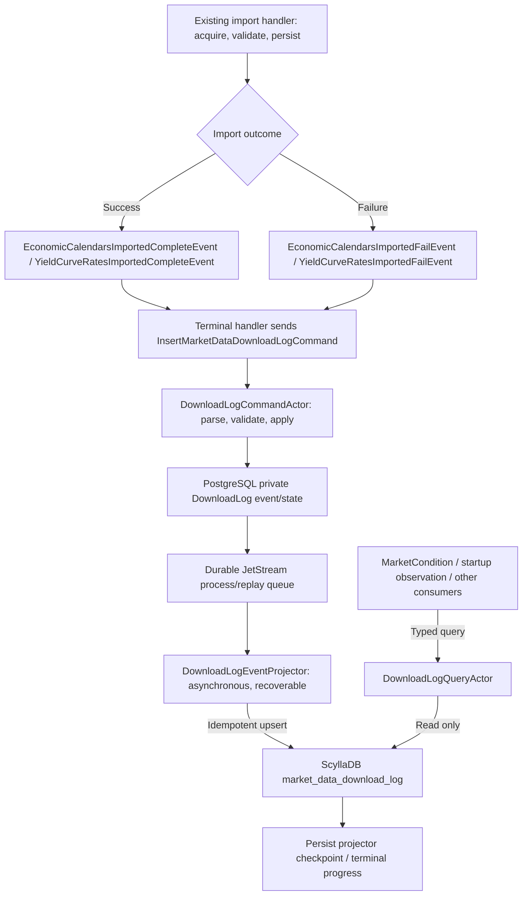

# Market Data Domain Actor Implementation

## Purpose

`TomasAI.IFM.Domain.MarketData` provides general market-data queries plus the event-sourced Economic Calendar and Yield Curve Rate actor pipelines. It targets .NET 10 and uses the Storage, Shared Domain, and MarketData Shared projects.

DownloadLog extends import observability through a command actor, a durable asynchronous projector, and a read-only query actor. Implementation and qualification evidence are recorded below.

## Root-to-leaf directory inventory

Paths are relative to `TomasAI.IFM.Domain.MarketData/`.

```text
Docs/
DownloadLog/Command/Actor/
DownloadLog/Command/EventProjector/
DownloadLog/Command/Extensions/
DownloadLog/Command/State/
DownloadLog/Query/Actor/
DownloadLog/Query/Extensions/
EconomicCalendar/Command/Actor/
EconomicCalendar/Command/Exceptions/
EconomicCalendar/Command/State/
EconomicCalendar/Command/Validation/
EconomicCalendar/Event/Actor/
EconomicCalendar/Query/Actor/
Query/Actor/
Query/Api/
YieldCurveRate/Command/Actor/
YieldCurveRate/Command/Model/
YieldCurveRate/Command/State/
YieldCurveRate/Command/Validation/
YieldCurveRate/Event/Actor/
YieldCurveRate/Query/Actor/
bin/Debug/net10.0/runtimes/win-x64/native/
bin/Debug/net8.0/
bin/Release/net10.0/runtimes/win-x64/native/
obj/Debug/net10.0/ref/
obj/Debug/net10.0/refint/
obj/Debug/net8.0/ref/
obj/Debug/net8.0/refint/
obj/Release/net10.0/ref/
obj/Release/net10.0/refint/
```

Every leaf path includes all parent folders. `bin/` and `obj/` are generated; `net8.0` is legacy output because the project now targets `net10.0`.

## Folder responsibilities

- `EconomicCalendar/` owns calendar commands, queries, state, validation, and event publication. Its read projections are stored in the MarketData keyspace beside Yield Curve tables.
- `Query/Actor/` contains `MarketDataQueryActor`, the general market-data query mailbox.
- `Query/Api/` contains `ActorMarketDataQueryApi`, which performs the storage-backed reads used by query actors and clients.
- `YieldCurveRate/Command/Actor/` routes yield-curve write commands.
- `YieldCurveRate/Command/Model/` contains command-side data structures.
- `YieldCurveRate/Command/State/` contains event-sourced state and its repository.
- `YieldCurveRate/Command/Validation/` contains command validation rules.
- `YieldCurveRate/Event/Actor/` consumes yield-curve domain events.
- `YieldCurveRate/Query/Actor/` serves yield-curve reads.
- `Docs/` contains this document.
- The root assembly marker supports actor registration and scanning.

## Implemented actors

`DownloadLogCommandActor` accepts immutable terminal import outcomes. `DownloadLogQueryActor` serves exact-attempt, history and completion-status requests. `DownloadLogEventProjector` uses the shared durable projection engine and follows the command actor's startup/shutdown lifecycle.

`MarketDataQueryActor`, `EconomicCalendarQueryActor`, and `YieldCurveRateQueryActor` inherit the shared query actor pipeline. The Economic Calendar and Yield Curve Rate command actors own their respective mailboxes and use event-sourced state/repository persistence. Their event actors provide the same-domain publication targets used by command processing.

## Processing model

Writes travel from a NATS command subject through parsing, validation, state reconstruction, typed dispatch, event persistence, and event publication. Event actors perform downstream processing when required, while query actors execute read-only operations through the market-data database API. All actor mailbox identities combine actor type, actor name, verb, and entity identifier.

The boolean returned by a command state's `Update` operation means that state changed. It is not the command's success result: a valid command may succeed without producing a state change. Actor handlers must preserve that distinction.

## Extension points

Add general reads beneath `Query`. Add a full command/event/query feature beneath its own market-data entity folder, mirroring `EconomicCalendar` or `YieldCurveRate` and keeping state, validation, and models with the write side.

## DownloadLog implementation plan

**Added:** 2026-09-05

**Status:** Implemented and integration-qualified on 2026-09-05. The user's subsequent API startup was verified against its logs and persistent stores: both live FMP imports and their DownloadLog projections completed. A typed query through that live API instance was not exercised because the user had already stopped it; typed command/query transport is covered by the integration qualification below.

### Implementation and verified behavior

- Shared contracts are under `Domain.MarketData.Shared/DownloadLog`; terminal events append nullable outcome slots without changing existing keys. Legacy payloads deserialize but do not create invented log records.
- `DownloadLogCommandActor` validates the envelope before reserving its deterministic logging command ID, then follows the shared audited command pipeline. Equivalent duplicates verify the committed payload; conflicting outcomes are rejected. An audited command with no committed state may resume. The repository uses expected stream version zero to prevent competing first commits.
- The private inserted event implements `IRequireDurableProjection`. `SaveEventsAsync` saves its event and initial projector recovery marker in the **same PostgreSQL transaction**, before queue publication. Existing events without this interface retain their admission behavior. Scalar/single-row PostgreSQL operations now honor the active repository transaction, including `INSERT ... RETURNING`.
- `MarketDataDbContext.DownloadLog.cs` owns typed CQL binding, millisecond timestamp mapping, hash verification, full-partition exact reads, UUID/timestamp keyset paging, and bounded status searches. The table is registered in `MarketDataSchemaDb` and was created and populated in the development/test keyspace during integration qualification.
- `IDownloadLogQueryApi` and `IDownloadLogCommandApi` are registered in both API and integration hosts. `GetStatusAsync` accepts a required import command ID; the result includes `RequiredAttempt` so a failed required attempt is distinguishable from a missing attempt. `RecordAsync` can resubmit the **original** outcome without downloading again.
- The existing startup import coordinator remains asynchronous with respect to download completion. Its normal command-submission response still means Started, not Completed. MarketCondition's wider design migration is separate; consumers can now query actual completion evidence through the registered API.
- MarketCondition's production calendar adapter now consumes bounded latest-attempt queries during capture. It requires exact event-window date coverage, distinguishes confirmed empty imports from missing/failed/stale imports, and preserves evidence in its completed result. Treasury is not an added MarketCondition dependency. See [MC-DL-01 implementation and remaining assessment migration](../../TomasAI.IFM.Domain.Trade/Strategy/Workflow/IntrinsicTime/MarketCondition/Docs/MarketCondition-Implementation-Plan-v2.0.md).

### Qualification record — 2026-09-05

| Check | Result |
|---|---|
| Existing MarketData baseline | 146 unit tests passed before implementation |
| MarketData unit suite, including BDD and Verification categories | 181 passed |
| DownloadLog integration suite | 13 passed against real PostgreSQL, ScyllaDB and isolated NATS/JetStream |
| Shared command-duplicate and cancellation regressions | 16 passed |
| PostgreSQL framework unit regressions | 32 passed |
| Existing PostgreSQL commit/rollback integration tests | 2 passed |
| API Server build | Succeeded, zero warnings/errors |
| Whitespace validation | `git diff --check` passed |

The integration suite verifies both datasets, the startup import coordinator through both terminal handlers, typed command/query transport, duplicate/conflict behavior, exact-attempt/scope/date isolation, empty completion, history paging including timestamp ties, incomplete searches, restart before enqueue, interrupted target writes, repeat upserts before checkpoint, notification-outbox recovery, retry exhaustion, and rollback when the recovery marker cannot be created. Provider responses in the startup-path test are controlled empty responses; no live FMP availability or credentials are inferred from that test. Interruption tests stop/recreate projector workers against persistent stores and inject failures at the target boundary; they do not kill the user's API process or stop the shared Scylla service.

To reproduce the focused integration suite, provide a separate JetStream broker at `nats://127.0.0.1:14222` (override with `IFM_DOWNLOADLOG_TEST_NATS_URL`), plus the repository's local PostgreSQL, Redis and Scylla test databases. For example, start `nats:2.12.0-alpine` with `--jetstream` and publish container port 4222 as loopback port 14222. Run:

```powershell
dotnet test TomasAI.IFM.Domain.MarketData.UnitTests/TomasAI.IFM.Domain.MarketData.UnitTests.csproj
dotnet test TomasAI.IFM.Domain.MarketData.IntegrationTests/TomasAI.IFM.Domain.MarketData.IntegrationTests.csproj --filter FullyQualifiedName~DownloadLog
```

The test host scopes actor discovery to MarketData and uses the isolated broker. Test data uses synthetic future dates in `market_data_test_db`.

### Live startup verification — 2026-09-05, 21:40 America/Toronto

Read-only verification after the user started and stopped the API correlated `Logs/ifm-apiserver-20260905.log` with `market_data_test_db` in ScyllaDB and `event-source-test-db` in PostgreSQL. The startup command was `9c82a0d6-2a41-4217-ae7a-4b2347cd4d67`; its operational value date was **2026-09-04**. Both DownloadLog actors started at 21:40:02 local time, and the startup submitted the imports at 21:40:12.

| Dataset | Scope | Import command ID | Downloaded / persisted | Elapsed | Log projected at UTC | Outcome |
|---|---|---|---|---|---|---|
| TreasuryCurve | US | `2ba363d2-2404-4296-9692-f8759721ada3` | 1 / 1 | 229 ms | 2026-09-06 01:40:12.790 | Completed |
| EconomicCalendar | ALL | `d9225dd6-ce26-4748-b8de-61176c79d6e9` | 104 / 104 | 318 ms | 2026-09-06 01:40:13.017 | Completed |

Both Scylla download-log rows have null error fields. PostgreSQL events `991678` and `991679` have `DownloadLogEventProjector` outcome/stage `Completed`, zero retries, and no error message. The actual Treasury curve row exists for the value date. Reading the calendar's 95 known country partitions for that date found 125 existing rows, of which **104 carry this startup's calendar import command ID**; the other 21 are not counted as records from this run. No downloads or projections were retriggered during verification.

This verifies the live startup-to-persisted-outcome path. It does not independently reconcile FMP's full source dataset or exercise a live typed query after shutdown.

### Earlier terminal-delivery boundary

Import terminal events use JetStream, but the event runtime acknowledges **mailbox admission**, not completion of terminal-handler processing. A terminal handler therefore checks the logging command response, records failures with the safe immutable outcome/correlation, and throws `DownloadLogDeliveryException`; this does **not** promise automatic actor-processing redelivery. A failure before terminal publication likewise records the original outcome separately from the download result. Recover that boundary using `IDownloadLogCommandApi.RecordAsync(originalOutcome)` from the recorded recovery payload. Never resubmit the original import to repair its log.

Automatic durable recovery starts at the atomic DownloadLog event/recovery-marker commit. Before that commit, an unrecovered handoff stays NotConfirmed. After it, the shared recovery/checkpoint/outbox machinery handles repair without contacting FMP.

### Purpose and ownership

Add a shared DownloadLog feature for EconomicCalendar and TreasuryCurve imports. For a requested value date it records whether an import completed or failed, how many logical records were downloaded and persisted, and elapsed processing milliseconds.

The existing import event handlers remain responsible for calling FMP through the provider-neutral application API, mapping/validating records, and saving the actual data. Their completed or failed terminal handlers send `InsertMarketDataDownloadLogCommand` to the new DownloadLog command actor. Neither terminal handler writes the log table directly.

DownloadLog owns validation and durable recording of the terminal import outcome. Its durable asynchronous projector writes the ScyllaDB read model through `IMarketDataDbContext`. A separate DownloadLog query actor reads that table. It does not call FMP or start/retry an import.

Use the established [CommandActor and QueryActor conventions](../../Documents/system/Actor-Implementation-Conventions.md), including PostgreSQL command-state persistence, and the existing [durable event-projector implementation](../../TomasAI.IFM.Application.EventProjector/Docs/EventProjector-Implementation-Details.md). DownloadLog must use durable replay rather than the process-local non-durable projection lane.

### Verified existing integration points

| Existing code | Current behavior | Planned addition |
|---|---|---|
| [EconomicCalendarsImported.cs](../EconomicCalendar/Event/EconomicCalendarsImported.cs) | Main handler downloads, validates, saves, then sends complete/fail; terminal handlers currently acknowledge/log | Capture timing/count metadata in the main handler; both terminal handlers send the DownloadLog command |
| [YieldCurveRatesImported.cs](../YieldCurveRate/Event/YieldCurveRatesImported.cs) | Same import lifecycle for Treasury curve snapshots | Same DownloadLog integration |
| [ApiApplicationStartupActivities.cs](../../TomasAI.IFM.Application.Api.Server/ApiApplicationStartupActivities.cs) | Startup submits imports for the operational value date | Remains a producer of import requests, not an authority for download completion |
| [MarketDataDbContext](../../TomasAI.IFM.Application.Storage/MarketDataDb/MarketDataDbContext.cs) | Persists the imported market/reference rows | Add log table initialization, insert, exact-attempt, date-history, and completion-status reads |

Import completion already occurs after the bulk data write succeeds. DownloadLog makes the resulting terminal outcome queryable. A command-submitted response is not a completed download.

### Message and persistence flow



The DownloadLog command actor follows the normal command pipeline: parse -> command audit -> validation -> state reconstruction -> typed command extension -> private event application -> repository persistence -> durable projection enqueue. The projector applies the committed event asynchronously; the command acknowledgement does not wait for or establish ScyllaDB readiness.

Projection-complete/failure notifications follow the existing framework convention and remain distinct from the source import's completion/failure. They must never invoke import terminal handlers recursively.

### Durable projector execution and recovery

Implement `DownloadLogEventProjector` using `BaseEventProjector<DownloadLogCommandActor>` and an immutable `EventProjectionDescriptor` for the committed DownloadLog inserted event. Set `UseDurableReplay = true` explicitly, even though it is the framework default. Reuse the framework's durable process/replay queues, PostgreSQL execution state and checkpoints, recovery coordinator, and publication outbox; do not introduce a separate DownloadLog retry queue or in-memory-only worker.

Required behavior:

1. Persist the immutable DownloadLog private event before admitting projection work. If the process stops after persistence but before queue publication, startup recovery must discover the unfinished event.
2. Use stable projector/process/replay identities and the established fenced execution mechanism. Configure and qualify `BoundedRecoveryEnabled` and `FencedExecutionEnabled`; use `TransactionalOutboxEnabled` for projection lifecycle notifications through the existing host reliability configuration.
3. Apply an idempotent upsert using the stored natural key and immutable outcome. Replay must preserve value date, attempt identity, status, counts, and the original import timestamps and elapsed milliseconds. Never increment counts or generate another attempt during projection.
4. Record target-application progress only after the ScyllaDB write succeeds. A crash after that write but before the checkpoint/queue acknowledgement may cause repeat delivery; the same upsert must remain safe.
5. Resume incomplete projection or notification stages through the existing recovery machinery. Use bounded retries and expose exhausted/blocked work for operator recovery; do not silently retry forever or mark failed projection work completed.
6. Replay only the committed DownloadLog event. The projector must not call FMP, replay an import main event, resend an import command, or regenerate download timing/counts from current data.
7. Treat durable transport/publication as at-least-once. Idempotent mutation and stable identities provide safe repeat application; there is no cross-database exactly-once transaction.

The ScyllaDB query is eventually consistent with the committed DownloadLog command state. Until a matching row is visible, completion remains NotConfirmed. A visible Completed row confirms the original import's outcome even if the projector is still finishing a separate notification stage. Projection status and download status are different concepts.

Durability begins with the committed DownloadLog event. It does not automatically protect the earlier import-terminal-handler -> InsertMarketDataDownloadLogCommand delivery. That handoff retains its own failure/recovery requirements below.

### Actor and directory layout

Implemented paths, relative to this domain:

```text
DownloadLog/
  Command/
    Actor/DownloadLogCommandActor.cs
    Actor/DownloadLogCommandContext.cs
    InsertMarketDataDownloadLog.cs
    State/DownloadLogCommandState.cs
    State/DownloadLogStateRepository.cs
    Extensions/DownloadLogCommandExtensions.cs
    EventProjector/DownloadLogEventProjector.cs
  Query/
    Actor/DownloadLogQueryActor.cs
    Actor/DownloadLogQueryContext.cs
    Extensions/GetMarketDataDownloadLog.cs
    Extensions/GetMarketDataDownloadHistory.cs
    Extensions/GetMarketDataDownloadStatus.cs
```

Shared contracts belong in `TomasAI.IFM.Domain.MarketData.Shared`: identity, dataset/status enums, command, private inserted event, projection terminal contracts, query requests, read models, and typed query results. Storage contracts and CQL belong in `TomasAI.IFM.Application.Storage/MarketDataDb`.

| Actor | Role and mailbox name | Responsibility |
|---|---|---|
| DownloadLogCommandActor | Command / DownloadLogCommand | Accept InsertMarketDataDownloadLogCommand, validate, deduplicate, record the immutable terminal outcome |
| DownloadLogQueryActor | Query / DownloadLogQuery | Read an attempt, history, or completion status for a dataset/value date/scope |
| DownloadLogEventProjector | Durable asynchronous projector using the framework's JetStream process/replay queues | Recover and idempotently project committed private DownloadLog events to ScyllaDB |

Command maps are `_parseMap`, `_validationMap`, and `_receiveMap`. Query maps are `_parseMap`, `_receiveMap`, and `_exceptionMap`. Keep domain logic in typed extensions and propagate cancellation through read/storage APIs.

### Terminal payload and command contract

Append a versioned `MarketDataDownloadOutcome` payload to each of the four existing import terminal event contracts. Preserve all existing MessagePack keys and enum values. Legacy terminal events without the payload remain readable but must not produce invented timing or successful log rows.

The main import handler creates this payload once and the terminal handler forwards it unchanged inside `InsertMarketDataDownloadLogCommand`.

| Field | Meaning |
|---|---|
| SchemaVersion | Version of the new outcome payload |
| Dataset | EconomicCalendar or TreasuryCurve; zero/unknown is invalid |
| Provider | FMP for these implementations |
| ValueDate | Requested provider data date from ImportedDate/ImportDate; not completion date or workflow timeframe |
| Scope | Canonical calendar country filter, or US for TreasuryCurve |
| ImportCommandId | Original import attempt identity |
| SourceTerminalEventId | Correlate the complete/fail event |
| RequestedAtUtc | Original request timestamp; stable across delivery attempts |
| StartedAtUtc | Actual acquisition/processing start |
| FinishedAtUtc | Time the import reached its terminal outcome |
| Status | Completed or Failed |
| DownloadedRecordCount | Provider records returned; nullable on failure before the count is known |
| PersistedRecordCount | Logical records whose storage is confirmed; nullable if a failed write leaves the count unknown |
| ElapsedMilliseconds | Nonnegative 64-bit processing duration measured with Stopwatch |
| ErrorCode / ErrorMessage | Stable, bounded diagnostic details for Failed; absent for Completed |

The command also carries its own CommandId, entity identity, subject/route, correlation, causation, and canonical payload SHA-256. Use a distinct deterministic logging CommandId derived from the original ImportCommandId and the DownloadLog purpose; do not reuse the import command's ID in shared command audit.

Route a DownloadLog aggregate by ImportCommandId so one import attempt has one authoritative terminal record. Dataset/date/provider/scope belong to its validated immutable payload. Separate import attempts, including repeated startup imports, use separate import command IDs and remain separate history rows.

Normalize country codes to uppercase, distinct, sorted values. An unrestricted calendar request uses scope ALL; a filtered request uses its canonical country set. A US-only completed request does not establish completion for another country.

### Timing, counts, and status semantics

Start Stopwatch immediately before provider acquisition. Stop it when download, mapping, validation, and all required data writes succeed, or when that processing fails. ElapsedMilliseconds excludes command queue delay, DownloadLog command delivery, and log projection time. UTC timestamps support audit; Stopwatch provides the duration.

For Completed:

- The provider call, full response processing, validation, and required data persistence succeeded.
- Counts are known and nonnegative. PersistedRecordCount counts logical input records durably accepted, including overwrites; it does not count Scylla projection/index writes or necessarily newly inserted records.
- If mapping/filtering/deduplication changes the count, preserve the distinct downloaded and persisted counts.
- A valid empty response is Completed with both counts zero.
- A Treasury record means one dated curve snapshot, not one record per maturity point.
- Completed with zero Treasury records confirms the request finished, not that a curve exists.

For Failed:

- Preserve known downloaded/persisted counts; do not fabricate zero after a potentially partial storage failure.
- Record the original processing error. Failed means the whole import was not confirmed successful; partial persisted rows may exist.
- A failure sending a terminal notification or projecting its log is a separate delivery/projection failure. It must not change a successfully persisted import into a failed download or create both source terminal outcomes.

Initial scope records terminal outcomes only. There is no Started log row because this design is driven by completed/failed events. No row means NotConfirmed/NotFound, which could mean not requested, still running, delivery pending, or an unavailable log path. It does not prove failure or an empty successful response.

### Command validation and idempotency

Validate before accepting a new outcome:

- nonempty logging/import/terminal identities, supported schema/dataset/status, and valid actor subject/route;
- exact agreement between entity ImportCommandId, payload identity, source terminal event, and command correlation;
- requested value date and normalized provider/scope;
- valid UTC timestamps, RequestedAtUtc <= StartedAtUtc <= FinishedAtUtc, and nonnegative ElapsedMilliseconds;
- nonnegative known counts; Completed requires both counts and no error; Failed requires diagnostic information;
- terminal event type agrees with Completed/Failed;
- canonical payload hash and defensive immutable copies of collection fields.

Once accepted, the attempt's terminal payload is immutable. Equivalent duplicate delivery is a no-op. Conflicting status, date, scope, timing, counts, or provenance for the same import attempt is rejected; it must not overwrite the accepted record.

The shared command audit already suppresses duplicate CommandId execution. Do not assume that audit alone verifies payload equality. During DL-03 qualify immutable-payload conflict detection using the command/state and shared audit mechanisms; do not add a competing actor-local command audit tracker.

Projection uses the same stable primary key and payload on repeat delivery. The durable projector replays a committed DownloadLog private event to repair its projection; it must never re-run the original external-data import. A duplicate command acknowledgement alone must not be treated as proof that a previously failed projection has recovered. Recovery belongs to the durable projector's execution state/checkpoints, not to bypassing command deduplication.

### ScyllaDB table

Initialize the following table in the existing MarketData keyspace through its schema initializer and expose access through MarketDataDbContext:

```sql
CREATE TABLE IF NOT EXISTS market_data_download_log (
    dataset text,
    provider text,
    scope text,
    value_date date,
    requested_at_utc timestamp,
    import_command_id uuid,
    log_command_id uuid,
    source_terminal_event_id uuid,
    schema_version smallint,
    status text,
    started_at_utc timestamp,
    finished_at_utc timestamp,
    elapsed_milliseconds bigint,
    downloaded_record_count bigint,
    persisted_record_count bigint,
    error_code text,
    error_message text,
    payload_sha256 text,
    projected_at_utc timestamp,
    PRIMARY KEY (
        (dataset, provider, scope, value_date),
        requested_at_utc,
        import_command_id
    )
) WITH CLUSTERING ORDER BY (
    requested_at_utc DESC,
    import_command_id DESC
);
```

Dataset, provider, scope, and date form a bounded partition for the required lookup. RequestedAtUtc and ImportCommandId preserve repeat attempts rather than replacing history with one mutable success flag. Normalize persisted timestamps to Scylla millisecond precision before calculating the canonical hash.

Status and dataset are validated closed values even though the CQL columns are text. Nullable counts on failure use null rather than a misleading zero. Do not store credentials, full provider payloads, or imported data arrays in the log.

CQL access must use full partition keys, typed parameters, and paging. Do not use ALLOW FILTERING or a whole-table scan to discover completion. Initial scope has no TTL/deletion policy that could silently remove evidence needed by consumers.

### Query contracts and readiness meaning

All queries use Core NATS request/reply and one typed IQuery<TResult> contract each.

| Query | Input | Result |
|---|---|---|
| GetMarketDataDownloadLogQuery | Dataset/provider/scope/value date plus RequestedAtUtc/ImportCommandId | One exact attempt or NotFound |
| GetMarketDataDownloadHistoryQuery | Dataset/provider/scope/value date, bounded page size and cursor | Paged attempts, newest request first |
| GetMarketDataDownloadStatusQuery | Dataset/provider/scope/value date; optional RequiredImportCommandId | Confirmation plus latest-attempt and successful-attempt metadata |

The status result includes CompletionConfirmed, LatestAttemptStatus, LatestAttemptId, SuccessfulImportCommandId, successful completion time, counts, elapsed milliseconds, scope, and whether the bounded search was exhaustive.

Rules:

1. Confirm completion only from a successfully projected Completed row covering the requested date/provider/scope.
2. When RequiredImportCommandId is supplied, only that attempt can confirm completion. A previous startup's successful refresh cannot satisfy a requirement for the current attempt.
3. Without a required attempt, return the latest matching successful attempt and the latest attempt separately. A later failure remains visible and does not erase earlier success.
4. CompletionConfirmed=false means no matching success has been confirmed; expose NotFound/Failed or an incomplete-search indication rather than claiming the download definitely failed.
5. A query/storage error is a typed query failure, not a fabricated false or true response.
6. A legitimate Completed zero-record response confirms download completion. Consumers separately decide whether actual rows are required.
7. Exact scope is queried first. A consumer requiring US calendar coverage may also query ALL as an explicitly permitted covering scope. Do not treat unrelated country subsets as sufficient.
8. Page date-partition history with fixed per-call bounds. If the search limit is reached before finding success, expose a continuation/incomplete result; do not claim there was no successful attempt.
9. Calendar consumers check the requested provider dates covered by their event window; Weekly/Monthly workflow horizons do not turn a date-based import into a week/month download.

A consumer can freeze a confirmed status alongside calendar observations before MarketCondition evaluation. No external FMP call occurs in DownloadLog or its query actor. Treasury consumers can use the same query; this does not make TreasuryCurve a new required MarketCondition input.

### Delivery, persistence, and recovery boundaries

- The four source terminal handlers send the new command through the typed actor command API and inspect submission failure. They do not write ScyllaDB or mark completion based on that acknowledgement.
- A successful command acknowledgement, committed private log event, projected row, and successful query are distinct steps. Readiness uses the projected row.
- Durable projection protects work after the private DownloadLog event is committed. It does not itself guarantee delivery of the original import terminal event or its logging command; qualify that earlier handoff independently.
- Preserve the immutable source outcome and correlation needed to resubmit a failed log delivery. Surface delivery failure operationally; a bare fire-and-forget send must not be described as guaranteed logging.
- A logging failure must not trigger the original FMP import again. Recovery resubmits only the same immutable logging request or reprojects its committed private event through the existing recovery mechanism.
- Qualify terminal-handler delivery failure and projector recovery before claiming complete audit coverage. If the delivery path cannot recover an outcome, status remains NotConfirmed and the failure must stay observable.
- PostgreSQL and ScyllaDB do not share an ACID transaction. Persisted log state with a missing projection is recoverable logging work, not a completed Scylla query result.
- Out-of-order delivery of different attempts retains each row. An older success cannot overwrite the latest attempt's status.
- Public DownloadLog projection failures are logging failures, not EconomicCalendar/Treasury import failures, and cannot cause a command/event loop.

### Implementation gates

The implemented gates are backed by the qualification record above. Live deployment qualification is distinguished from the repeatable integration-host evidence.

| Gate | Deliverable and required verification | Status |
|---|---|---|
| DL-00 | Inventory existing command/event/query routes, shared audit, projection recovery and transport failure behavior; record baseline tests and preserve unrelated changes | Verified |
| DL-01 | Add immutable outcome/log/query contracts, identity, numeric/schema manifests, append-only terminal metadata; verify all four terminal payload round trips and legacy compatibility | Verified |
| DL-02 | Capture Stopwatch duration and known counts in both import main handlers; completed/failed handlers construct and send the log command; test success, failure, zero records, partial-write uncertainty, and notification failure separation | Verified |
| DL-03 | Implement DownloadLog command actor/maps/validation/state/repository and BaseEventProjector-based durable asynchronous projection with UseDurableReplay=true; test duplicates, conflicts, ordering, state reconstruction, cancellation, and replay without external acquisition | Verified |
| DL-04 | Add MarketData Scylla table/schema initialization, insert/exact/history/status access, and typed query actor; test partition/scope/date isolation, current-attempt lookup, prior success plus later failure, paging, and query errors | Verified |
| DL-05 | Register actors, durable queues, projector identity/reliability options, recovery/outbox, clients, and schema; integrate eventually consistent readiness queries; qualify terminal-to-command delivery separately from committed-event recovery | Verified |
| DL-06 | Run Unit/BDD plus real NATS JetStream/PostgreSQL/Scylla integration for both datasets; test crash before enqueue, restart with pending work, Scylla outage/recovery, crash after upsert before checkpoint, outbox recovery, and retry exhaustion; preserve counts/timing and prove no reimport | Verified |
| DL-07 | Verify startup refresh -> terminal event -> DownloadLog command -> projected row -> query response in the actual application; document exact results and close only completed gates | Live startup and persisted outcomes verified; typed query verified in integration host, not against the stopped live instance |

Minimum failure coverage includes provider/validation/storage failures, log-command rejection, process restart, missing projection, duplicate/out-of-order terminal delivery, conflicting terminal outcomes, zero-row completion, unknown persisted count, and another country/date/attempt not satisfying readiness. Durable-projector tests must additionally prove incomplete work survives restart, queries stay NotConfirmed before projection, repeated application does not duplicate rows or counts, and projection/notification retry exhaustion remains observable without changing the source download status.

The implementation is complete only when both datasets produce queryable terminal logs with correct value date, scope, counts and duration; the new actors and durable projector follow repository conventions; committed projection work survives process interruption; recovery does not redownload data; and all required gates pass.

## Solution-wide graceful cancellation

The solution-wide cancellation phase is now in progress. Yield-curve command validation, state replay, repository calls, event-source storage, PostgreSQL/ScyllaDB operations, and NATS operations accept the actor token. Accepted mailbox work drains before actors and their producers stop. Event persistence and required publication become non-cancelable at the commit boundary to avoid ambiguous durable outcomes.

The active `MarketDataQueryActor`, `EconomicCalendarQueryActor`, and `YieldCurveRateQueryActor` paths propagate the worker token through query handlers, MarketData reads, month-bucket calendar fan-out, trading-calendar database access and date loops, and external calendar/yield-curve parsing. A canceled read does not publish a stale query reply. Existing no-token methods remain compatibility entry points.

The direct in-process `IActorMarketDataQueryApi` composes both MarketData and Securities stores. Its public cancellation overloads are intentionally scheduled with the Securities query/read-model tranche so the token reaches every composed leaf in one change rather than merely canceling the caller's wait.

The existing Interactive Brokers feed is excluded because Databento will replace it. Future IBKR work should mirror the completed Databento lifecycle and backpressure design rather than extend the legacy implementation.
