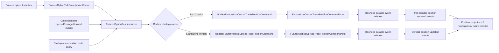

# Futures Option Strategy Trade Position Actor Design

Date: 2026-09-12  
Status: Proposed implementation baseline  
Scope: Refactor live futures-option position ownership out of `OptionTrade` and into strategy-specific, in-memory event-sourced command actors

## 1. Purpose

This document defines the target design for moving live futures-option trade-position state and calculation out of the current `OptionTradeCommandActor` and into:

- `FuturesIronCondorTradePositionCommandActor`;
- `FuturesVerticalSpreadTradePositionCommandActor`; and
- `FuturesOptionRealtimeActor`, which routes futures-option market observations to every affected open strategy position.

The first implementation must support both short and long Iron Condors and the four existing vertical-spread trade types. It must retain the current durable trade lifecycle while making `ITradePositionCollection` the resident working state used by the strategy position command actors.

This design supersedes the live-position ownership and purely realtime persistence direction in `Domain.Trade/Docs/Trade-Structure-Strategy-Position-Monitor-Design.md` where they conflict. That earlier document remains useful for its separation of durable trade facts, current position, monitor history, and UI responsibilities. The durability boundary in this design follows the qualified in-memory event-source actor implementation: commands may advance resident state within a bounded window, and replies complete only after the command events are durably committed.

## 2. Verified current implementation

The following behavior exists in the repository today:

1. `OptionTrade` owns both the durable option-trade definition and `ITradePositionCollection`.
2. Each `TradePosition` owns an `IOptionLegDataCollection` containing the latest bid, ask, implied volatility and Greeks for its legs.
3. `FuturesOptionTickDataUpdatedEvent` carries a `FuturesOptionTickDataV2ReadModel` with contract ID, value date, tick ID/time, last price, bid/ask, sizes, implied volatility, underlying price and Greeks.
4. `FuturesOptionTickDataEventExtensions.UpdateFuturesOptionTradeLegDataAsync` scans option trades for the contract, maps an Iron Condor leg to a put/call credit or debit spread, constructs `OptionTradeLegDataReadModel`, and sends `ChangeOptionTradeLegDataCommand`.
5. `OptionTradeCommandActor` currently treats `ChangeOptionTradeLegDataCommand` as its resident-state pilot command.
6. `OptionTradeCommandState` applies `OptionTradeLegDataChangedEvent`, replaces the leg data in an intraday position, and recalculates position P&L.
7. `OptionTradeLiveFeedMap` stores complete `OptionTradeReadModel` objects and performs a linear scan of every cached trade and its legs for a contract lookup.
8. Trade live-feed add/remove handling populates that map and starts or stops option streams.
9. Existing TradeDb projection tables include `option_trade`, `option_leg`, `option_leg_data`, `trade_position`, and `trade_position_state`.
10. `TradeType` currently identifies `PutCreditSpread`, `PutDebitSpread`, `CallCreditSpread`, `CallDebitSpread`, `ShortIronCondor`, and `LongIronCondor`.

The current path therefore combines four responsibilities: active-position discovery, strategy classification, live leg marking, and durable option-trade lifecycle. It also allocates arrays and performs repeated scans on the market-data path.

## 3. Design decisions

| Area | Decision |
| --- | --- |
| Durable option trade | `OptionTradeCommandActor` continues to own trade identity, strategy selection, static leg definitions, order/fill facts, limits, and lifecycle. |
| Live position ownership | Strategy-specific command actors own current and historical position state. |
| Resident state | `ITradePositionCollection` is the strategy position actors' in-memory domain state contract. A concrete actor state adds event-source bookkeeping without putting infrastructure members on the domain interface. |
| Iron Condor owner | One Iron Condor actor stream owns all four legs and both component verticals as one atomic strategy position. |
| Vertical owner | One Vertical Spread actor stream owns a standalone two-leg vertical position. It does not separately own the two component verticals inside an Iron Condor. |
| Realtime routing | `FuturesOptionRealtimeActor` receives option tick events, uses an in-memory contract index, and sends typed update commands to the owning strategy actor. |
| Router cache | The cache is a routing projection of all open futures-option positions. It is not authoritative position state. |
| Tick payload | Each update command carries a complete current observation for one contract. It does not carry only a price delta. |
| Tick durability | The strategy command actors use bounded in-memory event windows with durable event-log commit before success is returned. |
| Trade lifecycle durability | Open, close, correction, snapshot, and topology changes remain standard durable commands and form barriers around pending tick windows. |
| Database access | The realtime router performs one startup hydration and event-driven cache maintenance. It does not query a database for each tick or poll periodically. |
| Legacy history | Existing event-log entries and projected rows remain readable. They are never rewritten to manufacture the new aggregate history. |

## 4. Important model distinction

The dynamic `OptionTradeLegData` can be removed from `OptionTrade`, but the static option-leg definition cannot be removed from the system.

The realtime router must know that a contract belongs to a particular open trade, which strategy owns it, whether it is a put or call, whether it is long or short, and its quantity. Those are trade-definition facts. The current `OptionLeg`/`OptionTradeReadModel.OptionLegs` supplies that information.

The target split is:

| Data | Target owner |
| --- | --- |
| Contract ID, option type, action, strike, quantity | Durable option trade definition and router projection |
| Latest option price, bid/ask, sizes, IV and Greeks | Strategy trade-position state |
| Component spread values, aggregate value, P&L and risk | Strategy trade-position state |
| Orders, fills, limits, open/close lifecycle | `OptionTrade` aggregate |

Accordingly, “remove option leg data” means removing `IOptionLegData`, `IOptionLegDataCollection`, and tick-frequency leg snapshots from `OptionTrade` and its read model. It does not mean removing immutable leg topology.

## 5. Target component layout

```text
TomasAI.IFM.Domain.Trade/Futures/Option/
  Docs/
  Realtime/
    Actor/
      FuturesOptionRealtimeActor
      FuturesOptionRealtimeContext
    Model/
      FuturesOptionPositionRoute
      FuturesOptionPositionRouteCache
      FuturesOptionContractRouteIndex
    Extensions/
      FuturesOptionRealtimeExtensions
  Position/
    Model/
      ITradePosition
      ITradePositionCollection
      TradePosition
      TradePositionCollection
      FuturesOptionLegDefinition
      FuturesOptionMarketObservation
      FuturesOptionLegPosition
    IronCondor/
      Command/Actor/
      Command/State/
      Command/Handlers/
      Command/Extensions/
      Event/Handlers/
      Event/Extensions/
      Model/
      Query/
    VerticalSpread/
      Command/Actor/
      Command/State/
      Command/Handlers/
      Command/Extensions/
      Event/Handlers/
      Event/Extensions/
      Model/
      Query/
```

Shared commands, events, identifiers, enums and read models belong in `TomasAI.IFM.Domain.Trade.Shared/Futures/Option/...`. Calculations and strategy-specific domain actions belong in the relevant `Model` folder. Actor classes contain maps and lifecycle hooks; handlers and extension files contain behavior and message construction, consistent with the standard actor conventions.

## 6. Target message flow



For one option contract, the router may find zero, one, or several open positions. It sends one command per matching position. The target actor thread ID is derived from the strategy-position aggregate ID, so updates for the same position are ordered while unrelated positions can run concurrently.

## 7. Aggregate identity and ownership

### 7.1 Strategy position ID

Introduce a stable `FuturesOptionTradePositionId` containing:

- `OrderId`;
- `TradeId`; and
- the strategy owner type.

The order/trade pair remains the business identity. The strategy owner discriminator prevents an accidental command from reaching the wrong actor family and supports explicit routing and diagnostics. `ValueDate`, `TradeStatus`, and `DaysToExpiry` must not be part of the aggregate identity because those values change during the life of one position.

### 7.2 One owner per position

An Iron Condor is one economic position and one concurrency boundary. Its actor owns:

- four option-leg observations;
- put vertical calculation;
- call vertical calculation;
- combined strategy value and Greeks;
- opening basis, commission and unrealized P&L; and
- freshness/readiness by leg.

The vertical-spread actor owns a standalone two-leg put or call debit/credit spread. The Iron Condor actor may reuse the same pure vertical-spread calculation model, but it must not send its child spread updates to `FuturesVerticalSpreadTradePositionCommandActor`. Doing that would create two aggregate owners and allow the Iron Condor result to combine different durable versions.

## 8. OptionTrade model/schema upgrade

### 8.1 Target `IOptionTrade` responsibility

`IOptionTrade` retains:

- identity and dates;
- selected strategy/trade type;
- underlying contract and asset type;
- primary/hedge flags;
- lifecycle state/action;
- static `IOptionLegCollection` topology;
- fills and durable limits; and
- audit metadata.

It no longer owns `ITradePositionCollection` or exposes live position calculations such as current P&L and loss probability as mutable aggregate state. Queries that need a complete trade screen compose the durable option-trade read model with the appropriate strategy-position read model in the application/query layer.

### 8.2 MessagePack/read-model evolution

The OptionTrade contract must be versioned additively:

1. Preserve all existing MessagePack key numbers.
2. Mark retired position fields as obsolete/reserved; never reuse their keys for new meanings.
3. Add an explicit schema version if the read model does not already have one.
4. New writers omit embedded live position payloads after cutover.
5. Readers accept both legacy payloads with `TradePositions` and new payloads without them.
6. A legacy payload may seed a new position actor during migration, but it is not written back into the OptionTrade aggregate.

### 8.3 Storage schema evolution

The relational/CQL projection and event-log concerns are separate:

- `option_trade` and `option_leg` remain because they store trade definition/topology.
- Existing `option_leg_data` and `trade_position` tables remain readable during compatibility and backfill.
- New strategy position projections must be additive and strategy-owned.
- No migration overwrites immutable event definitions or historical event payloads.
- Writes to `option_leg_data` from the live tick path stop only after new position actors, projections, queries and UI composition are qualified.
- Physical legacy-table removal is a later release and requires a usage audit and retained-history decision.

## 9. Trade-position state model

### 9.1 `ITradePositionCollection` as resident domain state

`ITradePositionCollection` becomes the domain state manipulated for each strategy-position stream. It must provide bounded, allocation-conscious operations for:

- lookup by stable component/leg identity;
- applying a newer market observation;
- rejecting a duplicate or stale observation;
- obtaining opening, current intraday, closing and EOD positions;
- calculating component and strategy P&L;
- producing a stable snapshot/read model; and
- clearing/rebuilding from replay.

Infrastructure members such as pending events, committed stream version, working stream version and snapshot version remain on a concrete actor state such as `FuturesIronCondorTradePositionCommandState`. That state implements or contains `ITradePositionCollection` as its domain root and derives from the event-source state base. This keeps event-source mechanics out of the reusable domain interface while satisfying the requirement that the collection is the actor's resident business state.

### 9.2 `ITradePosition`

The upgraded interface represents one strategy component or complete position record without depending on `IOptionLegDataCollection`. It needs:

- stable identity;
- position role (strategy, put vertical, call vertical, or leg where required);
- trade type;
- value date/status and expiry;
- opening basis and commission;
- current value, P&L and underlying price;
- aggregate Greeks and risk values;
- source event/tick identity and observed UTC time;
- last update UTC time; and
- readiness/freshness state.

Live per-contract observations are stored in a keyed position-leg structure owned by the strategy model. A leg record combines its immutable definition with its latest accepted market observation. This replaces the present `OptionLegData` mutation pattern.

### 9.3 Market observation

`FuturesOptionMarketObservation` is a compact MessagePack contract copied from the incoming tick and contains:

- contract ID;
- value date;
- tick ID and tick time;
- source event ID and received UTC time;
- last option price;
- bid/ask and sizes;
- implied volatility;
- underlying price; and
- Delta, Gamma, Vega, Theta, and Rho.

The observation is absolute current data. This is essential for recovery: if intermediate tick commands are lost before durable acknowledgement, a later observation can converge the leg to the current market state without reconstructing every missed delta.

### 9.4 Readiness

Each actor tracks readiness per required contract:

- `Uninitialized`: no seed or live observation;
- `RecoveredStale`: restored from snapshot/event history but not refreshed in the current feed generation;
- `Current`: accepted an observation from the current feed generation; and
- `Unavailable`: contract or feed is explicitly unavailable.

The actor may calculate a partial diagnostic result, but it must mark the complete strategy valuation as not ready until every required leg has a usable observation. Readiness is visible; it does not stop the router or the rest of the actor system.

## 10. `FuturesOptionRealtimeActor`

### 10.1 Responsibility

This actor is a routing and active-position registry actor. It:

- subscribes to or is routed `FuturesOptionTickDataUpdatedEvent`;
- hydrates all open futures-option position routes at startup;
- maintains routes from lifecycle/topology events;
- looks up all open positions containing the incoming contract;
- selects the strategy-specific command type; and
- sends the complete observation to the appropriate command actor.

It does not calculate P&L, mutate authoritative position state, persist ticks, own trade lifecycle, or query PostgreSQL for every market event.

It is distinct from the existing MarketData Feed `FuturesOptionTickDataRealtimeActor`: the feed actor produces/enriches market data; this Trade-domain actor consumes that data and routes it to open trade positions.

### 10.2 Cache shape

The actor owns two indexes:

```text
PositionId -> FuturesOptionPositionRoute
ContractId -> compact collection of FuturesOptionPositionRouteEntry
```

`FuturesOptionPositionRoute` contains only routing data:

- position ID;
- strategy owner type;
- base `TradeType`;
- maturity date;
- underlying contract ID;
- lifecycle revision;
- open/active flag;
- immutable leg definitions; and
- optional feed generation/correlation metadata.

The secondary contract index prevents the current full-map scan. One contract can legitimately point to multiple open positions. The cache must not retain complete `OptionTradeReadModel` graphs or current market observations.

Because actor messages serialize cache mutation, ordinary route handling needs no lock. Any diagnostic snapshot exposed outside the mailbox must be immutable/copy-on-write or copied under a very short synchronization boundary; external readers never enumerate a mutating dictionary.

### 10.3 Cache hydration and maintenance

Startup sequence:

1. Supervisor starts the realtime actor.
2. The actor enters `Hydrating` state.
3. It issues one `GetOpenFuturesOptionPositionRoutesQuery` through the actor query path.
4. It validates each route and builds both indexes off to the side.
5. It atomically installs the completed indexes and records the highest lifecycle revision included.
6. Lifecycle events received during hydration are queued in the mailbox and applied in revision order after installation.
7. The actor publishes/records `Ready`, route count, contract count, rejected route count and hydration duration.

Maintenance is event driven:

- position opened/activated: add or replace the route;
- option topology corrected before activation: replace the route and secondary index entries;
- position closed/cancelled/deleted: remove the route and its contract entries;
- strategy ownership changed before activation: remove old entries and add the new owner;
- duplicate/stale lifecycle revision: ignore with a metric.

A manual or supervisor-requested reconcile query is allowed after a detected gap or failure. There is no periodic database poll.

### 10.4 Tick routing rules

For each valid tick:

1. Normalize the contract ID using the same canonical rule used by durable leg definitions.
2. Look up route entries by contract in constant expected time.
3. If none exist, record a sampled/aggregated no-position metric and return successfully.
4. For each route, confirm it remains active and the contract is still a member.
5. Build one `FuturesOptionMarketObservation` for the source tick and reuse it for route commands.
6. Select Iron Condor or Vertical Spread command from the explicit strategy-owner enum.
7. Send the command with thread ID derived from the position ID.
8. Record routed, rejected, failed, and latency metrics by actor type without per-tick informational log allocation.

Unknown strategy types do not throw `NotImplementedException` on the hot path. The route is rejected during hydration/registration, health becomes degraded, and a structured error identifies position, contract, strategy and lifecycle revision.

## 11. Strategy command actors

### 11.1 Common behavior

Both strategy actors derive from `BaseInMemoryEventSourceCommandActor` and use the qualified resident window machinery. Each actor has:

- a static command receive map;
- a static validation map;
- extension handlers for command execution;
- a state repository using the existing `EventSourceDbContext` abstraction;
- bounded per-stream resident state;
- one in-flight commit window per stream;
- delayed success until durable commit; and
- standard barriers for lifecycle, snapshot, correction, and query-visible consistency commands.

The actors must fail closed for an unmapped command. Exceptions are caught by the actor boundary, logged with full command/stream context, reported to Supervisor metrics, and converted into a failed service result. A failed or ambiguous commit evicts the resident state slot; it is never blindly retried.

### 11.2 Iron Condor command actor

`FuturesIronCondorTradePositionCommandActor` accepts short and long Iron Condor position aggregates only. An update:

1. validates the position and contract membership;
2. compares the incoming source generation/tick ID with the last accepted observation for that contract;
3. applies a newer observation to the matching leg;
4. recalculates the affected put or call vertical using a pure model function;
5. recalculates the complete four-leg position, Greeks, value, P&L and readiness;
6. appends one event containing sufficient data for deterministic replay; and
7. returns the resulting version/readiness only after the window commits.

The event must preserve command adjacency when one update produces several internal domain events. The actor never exposes a combined value assembled from component versions belonging to different commands.

### 11.3 Vertical Spread command actor

`FuturesVerticalSpreadTradePositionCommandActor` accepts standalone `PutCreditSpread`, `PutDebitSpread`, `CallCreditSpread`, and `CallDebitSpread` positions. It owns two leg observations and calculates the complete vertical result after each accepted update.

The actor uses the same shared observation and leg models as the Iron Condor actor. Strategy rules that differ by debit/credit and put/call live in the Vertical Spread `Model` folder and are invoked by mapped handlers.

### 11.4 Stale and duplicate ticks

Ordering is checked per contract and feed generation. A tick is stale if its generation is older or, within the same generation/value date, its tick ID is not greater than the last accepted tick ID. A duplicate/stale command returns a deterministic no-change result and does not append a position event.

Tick IDs must not be compared across feed generations without the generation discriminator. At a new generation, the first valid full observation can refresh recovered state even if its numeric tick ID restarted.

## 12. Commands, events, queries, enums, and results

### 12.1 Enums

Introduce an explicit routing enum rather than inferring the actor from display text:

```text
FuturesOptionPositionActorType
  Unknown
  IronCondor
  VerticalSpread
```

Additional useful enums are:

- `FuturesOptionPositionReadiness`;
- `FuturesOptionPositionComponentType` (`Strategy`, `PutVertical`, `CallVertical`);
- `FuturesOptionRouteCacheStatus` (`NotStarted`, `Hydrating`, `Ready`, `Degraded`, `Failed`); and
- `FuturesOptionObservationDisposition` (`Applied`, `Duplicate`, `Stale`, `UnknownContract`, `PositionClosed`, `NotReady`).

Existing `TradeType` remains the economic strategy/trade-type discriminator. It is not reused as the infrastructure actor selector.

### 12.2 Realtime/cache messages

- `StartFuturesOptionRealtimeCommand` or supervisor startup message;
- `RefreshFuturesOptionPositionRoutesCommand` for explicit reconciliation;
- `FuturesOptionPositionRouteOpenedEvent`;
- `FuturesOptionPositionRouteChangedEvent`;
- `FuturesOptionPositionRouteClosedEvent`;
- `GetFuturesOptionRealtimeHealthQuery`; and
- `GetFuturesOptionPositionRoutesQuery` for diagnostics, with bounded paging/filtering.

The existing `FuturesOptionTickDataUpdatedEvent` remains the market observation source unless a later feed design introduces a narrower trade-price event. Reusing the existing event avoids a second, nearly identical tick stream.

### 12.3 Strategy position commands

- `InitializeFuturesIronCondorTradePositionCommand`;
- `UpdateFuturesIronCondorTradePositionCommand`;
- `CorrectFuturesIronCondorTradePositionCommand`;
- `SnapshotFuturesIronCondorTradePositionCommand`;
- `CloseFuturesIronCondorTradePositionCommand`;
- `InitializeFuturesVerticalSpreadTradePositionCommand`;
- `UpdateFuturesVerticalSpreadTradePositionCommand`;
- `CorrectFuturesVerticalSpreadTradePositionCommand`;
- `SnapshotFuturesVerticalSpreadTradePositionCommand`; and
- `CloseFuturesVerticalSpreadTradePositionCommand`.

Only the two update commands use the resident window initially. Initialization, correction, snapshot and close commands use the standard durable path and establish a flush barrier.

### 12.4 Domain events

- `FuturesIronCondorTradePositionInitializedEvent`;
- `FuturesIronCondorTradePositionMarketObservationAppliedEvent`;
- `FuturesIronCondorTradePositionCorrectedEvent`;
- `FuturesIronCondorTradePositionClosedEvent`;
- `FuturesVerticalSpreadTradePositionInitializedEvent`;
- `FuturesVerticalSpreadTradePositionMarketObservationAppliedEvent`;
- `FuturesVerticalSpreadTradePositionCorrectedEvent`; and
- `FuturesVerticalSpreadTradePositionClosedEvent`.

The applied events contain the accepted absolute market observation plus deterministic position result fields or enough immutable inputs to reproduce them with a versioned calculation contract. Persisting only a delta is prohibited.

### 12.5 Queries/results

- `GetFuturesIronCondorTradePositionQuery`;
- `GetFuturesVerticalSpreadTradePositionQuery`;
- `GetOpenFuturesOptionPositionRoutesQuery`;
- `FuturesIronCondorTradePositionReadModel`;
- `FuturesVerticalSpreadTradePositionReadModel`; and
- `FuturesOptionTradePositionUpdateResult` containing position ID, stream version, disposition, readiness, accepted tick ID, and calculated UTC time.

## 13. Event streams and durability

Use a distinct event-source stream per strategy position. The precise formatting follows the repository's actor subject conventions, with a logical shape such as:

```text
FuturesIronCondorTradePositionCommand/{orderId}/{tradeId}
FuturesVerticalSpreadTradePositionCommand/{orderId}/{tradeId}
```

The implementation must preserve:

- exact expected stream version;
- monotonically contiguous event versions;
- command/event atomicity for each resident window;
- uncompressed MessagePack command audit records;
- configurable LZ4 for event payloads;
- bounded command count, event count, bytes, and one-shot maximum age;
- no successful reply before durable commit; and
- replay compatibility through snapshots plus later events.

Open/close/topology lifecycle commands must not be batched behind an indefinitely active tick stream. They flush the current window, wait for its known result, then execute against committed/reloaded state.

## 14. Projections and storage

### 14.1 Current-position projections

Add strategy-specific current-state projections rather than continuing tick writes into `option_leg_data`:

```text
futures_iron_condor_trade_position
futures_iron_condor_trade_position_leg
futures_vertical_spread_trade_position
futures_vertical_spread_trade_position_leg
```

Each row/component includes:

- order ID and trade ID;
- position/event stream version;
- strategy/trade type;
- value date and lifecycle status;
- source generation, tick ID and observed UTC time;
- calculated UTC time; and
- projection update UTC time.

Leg tables include contract definition plus latest observation. Header tables include strategy value, opening basis, P&L, aggregate Greeks, underlying price, readiness and last complete version.

Readers must never compose header and legs from different position versions. The storage design must use a committed header/current-version marker or write a denormalized complete MessagePack snapshot where atomic multi-component visibility cannot otherwise be guaranteed.

### 14.2 Projector behavior

Projectors are triggered by committed strategy position events. They are downstream read-model builders and do not govern command success unless explicitly included in the command transaction by the current event-source abstraction.

Projection rules:

- idempotent by event ID/stream version;
- ignore an older projected version;
- accept sequential newer versions;
- expose lag and failure through Supervisor metrics;
- avoid a periodic replay poll on the normal path; and
- use explicit durable recovery only after a detected projection gap/failure.

### 14.3 Query composition

The existing OptionTrade query remains compatible during migration. The target query/application layer composes:

```text
OptionTrade definition + strategy-specific current position = complete option trade view
```

The UI does not send live leg-data changes. It reads the composed model and consumes strategy-specific position notifications.

## 15. Routing cache consistency and recovery

The route cache trades authority for speed. Correctness rules are therefore explicit:

- durable option-trade lifecycle is authoritative;
- every route carries its lifecycle revision;
- stale route events are ignored;
- startup hydration installs a coherent snapshot;
- a detected revision gap marks the cache degraded and requests one reconciliation;
- reconciliation replaces indexes atomically;
- tick routing continues for known-good routes while degraded;
- closed routes are removed before the feed is considered fully stopped; and
- position actors independently reject updates for durably closed positions.

If the realtime actor restarts, it rebuilds routes once from durable open-position data. Strategy position actors independently rehydrate their resident state from the latest snapshot plus committed events. These are separate recoveries: rebuilding a route never reconstructs position values, and replaying a position never decides whether a trade is open.

## 16. Failure and degraded-operation behavior

| Condition | Required behavior |
| --- | --- |
| No route for contract | Successful no-op; increment sampled counter, no exception. |
| Several positions use contract | Fan out once to each route. |
| Invalid/unsupported strategy route | Reject registration, mark cache degraded, emit detailed structured error. |
| Duplicate/stale tick | Deterministic no-change result; no event append. |
| Router command send fails | Record position, actor, contract, source event and error; newer ticks continue. |
| Strategy calculation fails | Actor returns failure with complete exception details; resident slot is protected/evicted according to framework policy. |
| Known DB rollback | Fail all commands in the window and evict state. |
| Ambiguous DB commit | Mark ambiguous, do not retry automatically, evict and reconcile before accepting dependent work. |
| Actor restart | Replay snapshot plus committed events; mark restored observations stale until refreshed. |
| Market-data gap | Retain last durable state, expose age/readiness, and converge from later absolute observations. |
| Position closes during hot traffic | Close command forms a barrier; later updates are rejected as closed. |

Failures must include the complete exception chain, actor name, thread ID, command ID, position ID, stream/working/committed versions, contract ID, tick ID/generation, window generation, and persistence disposition. Expected no-route, duplicate, and stale outcomes are metrics rather than logged exceptions.

## 17. Observability

Supervisor actor metrics must expose, per realtime/command actor and mailbox thread:

- mailbox depth and oldest-message age;
- messages received, processed, rejected, and failed;
- cache status, route count, contract count, hydration/reconcile duration;
- tick fan-out distribution;
- no-route, duplicate, stale, closed, and unsupported counts;
- resident slots, evictions, hits and store loads;
- active window occupancy by commands/events/bytes;
- window flush reason and commit latency;
- committed updates per second;
- calculation latency by strategy;
- projection lag/failure; and
- allocation rate and GC counts collected by the runtime metrics layer.

High-frequency successful updates must not create per-tick information logs or formatted strings. Detailed data is retained for failures and bounded diagnostic sampling.

## 18. Migration plan and compatibility gates

### Gate 0: Freeze and characterize current behavior

- Capture current Iron Condor and vertical formulas, event shapes, DB projections and UI expectations.
- Add oracle fixtures for short/long Iron Condor and all four vertical types.
- Record current throughput, allocation and transaction rate.

### Gate 1: Add shared contracts and pure models

- Add stable position ID, owner/readiness enums, immutable leg definition and market observation.
- Upgrade `ITradePosition` and `ITradePositionCollection` behind adapters.
- Add pure Vertical Spread and Iron Condor calculation models.
- Preserve existing OptionTrade/read-model serialization keys.

### Gate 2: Add strategy actor state and repositories

- Implement the two command actors with standard maps, extensions, model folders and repositories.
- Enable resident windowing only for market-observation update commands.
- Verify replay/live equivalence and barrier behavior.

### Gate 3: Add strategy projections and composed queries

- Add compatible storage schemas and idempotent projectors.
- Add typed position queries.
- Compose the existing OptionTrade query/UI model from durable trade plus current position.

### Gate 4: Add `FuturesOptionRealtimeActor`

- Add startup hydration, dual indexes, lifecycle maintenance and typed routing.
- Route a shadow/test copy to new actors without changing the authoritative UI result.
- Compare legacy and new calculations tick by tick.

### Gate 5: Cut over live writes

- Make strategy actors authoritative for live position updates.
- Stop automatic `ChangeOptionTradeLegDataCommand` dispatch.
- Stop new live projection writes to `option_leg_data`.
- Keep the legacy command/read adapters available under an explicit compatibility switch.

### Gate 6: Remove embedded position state from new OptionTrade writes

- New OptionTrade snapshots/read models omit embedded `TradePositions`.
- Legacy snapshots/events remain readable.
- Remove live calculation methods and handlers from `OptionTradeCommandState` after usage verification.

### Gate 7: Retire compatibility code

- Audit API, UI, services, projectors, tests and reports for legacy table/type usage.
- Remove `OptionTradeLegData` code only when no active writer/reader remains.
- Retain or archive historical tables according to the data-retention decision.

Every gate must be independently reversible until Gate 7. Rollback selects the legacy live update path; it does not reverse or rewrite event history.

## 19. Test requirements

### 19.1 Unit tests

- owner selection for every supported `TradeType`;
- contract index add/change/remove and multi-position fan-out;
- lifecycle revision and hydration ordering;
- zero-route no-op and unsupported-route degradation;
- observation MessagePack round trip;
- duplicate/stale ordering by contract, date and feed generation;
- vertical debit/credit and put/call calculations;
- short/long Iron Condor calculations from four coherent legs;
- readiness transitions by leg;
- P&L from opening basis and current value;
- `ITradePositionCollection` lookup/mutation without embedded `OptionLegData`;
- legacy OptionTrade payload compatibility;
- receive/validation map equality and completeness; and
- no event for a no-change observation.

### 19.2 Actor integration tests

- one tick routes to the correct standalone vertical actor;
- one Iron Condor leg routes to the Iron Condor actor only;
- one shared contract fans out to several independent position streams;
- four concurrent leg sources preserve one ordered aggregate stream;
- resident state loads once across repeated updates;
- lifecycle command flushes and cannot be overtaken by tick commands;
- committed state equals replayed state after each window size;
- close removes routing and rejects later queued updates;
- restart hydrates routes and position state independently; and
- no UI process is needed for updates.

### 19.3 PostgreSQL/storage tests

- additive schemas do not alter immutable event definitions;
- exact expected-version enforcement;
- atomic command audit and event window commit;
- snapshot plus later event replay;
- strategy projections are idempotent;
- header/leg reads never cross position versions;
- legacy and new OptionTrade payloads are both readable;
- new writers do not populate retired live-leg fields; and
- LZ4 on/off event payloads are byte-semantically equivalent after deserialization.

### 19.4 Failure verification

- failure before submit, during serialization, before/during/after commit;
- known rollback and ambiguous commit;
- invalid cached route and lifecycle revision gap;
- actor restart with a partial current-feed refresh;
- feed generation restart with reset tick IDs;
- one-minute, one-hour and session-length data gaps;
- later absolute observations converge every leg; and
- detailed failure records appear in Supervisor health.

### 19.5 Benchmarks

Benchmark the current OptionTrade path against the target path progressively:

1. current full-map scan and `ChangeOptionTradeLegDataCommand`;
2. indexed router with legacy command;
3. indexed router with strategy actor and synchronous commit;
4. resident strategy actor with event windows;
5. end-to-end NATS/actor routing with 1, 16, and 64 open positions.

Use one, four, sixteen, sixty-four and 256 commands per window; LZ4 on/off; burst and sustained loads; and short/long Iron Condor plus vertical mixes. Report commands/sec, ticks/sec, fan-out, p50/p95/p99/p99.9 latency, allocations/update, Gen0/1/2 collections, resident slots, transactions/update, window occupancy, WAL bytes and projection lag. All benchmark/test hosts must exit after completion.

## 20. Acceptance criteria

The refactor is complete when:

1. `OptionTrade` owns durable definition/lifecycle and no longer mutates live leg/position data.
2. Static option-leg topology remains available for routing and recovery.
3. `ITradePositionCollection` is the resident domain state for both strategy actor families.
4. Iron Condor and standalone Vertical Spread positions have exactly one aggregate owner each.
5. `FuturesOptionRealtimeActor` holds all open-position routes in a contract index and performs no per-tick database query or whole-trade scan.
6. Every matching open position receives one typed absolute-observation command.
7. Same-position updates are ordered and different positions can execute concurrently.
8. Success is returned only after the configured durable event window commits.
9. Close/correction/snapshot operations form strict persistence barriers.
10. Restart replay equals the last acknowledged live state.
11. A later observation safely refreshes state after a market-data gap.
12. Strategy projections and composed OptionTrade queries satisfy current API/UI behavior.
13. Existing event history remains readable and immutable.
14. Expected no-route, duplicate and stale cases create no exceptions.
15. Unit, actor integration, PostgreSQL, recovery, verification and benchmark gates pass.
16. The new path shows a material throughput/allocation improvement over the current OptionTrade hot path.

## 21. Implementation constraints

- Do not introduce a database read, distributed-cache read, periodic poll, task creation, LINQ scan, or formatted success log per tick.
- Do not allow both strategy actors to own the same economic position.
- Do not reuse retired MessagePack keys or rewrite historical event payloads.
- Do not acknowledge an update before its configured durability boundary.
- Do not automatically retry an ambiguous commit.
- Do not place calculation logic in actor classes or UI code.
- Do not make UI presence control live position registration or processing.
- Do not delete legacy schemas during initial cutover.

## 22. Relationship to other designs

- `Domain.Trade/Docs/Trade-Structure-Strategy-Position-Monitor-Design.md` defines the broader trade/position/monitor separation; this document replaces its live-position persistence choice for these two strategy actors.
- `Documents/system/System-Wide-In-Memory-Event-Sourced-Command-Actor-Implementation-Plan-v1.1.md` defines the resident state, bounded event window, command audit, barriers, failure, recovery, and benchmark mechanisms used here.
- `Documents/system/Actor-Implementation-Conventions.md` remains authoritative for actor maps, handler/extension layout, state repositories, messages and exception boundaries.
- Existing MarketData Feed futures-option actors remain responsible for acquiring and publishing market observations; this design adds Trade-domain position routing and ownership.

