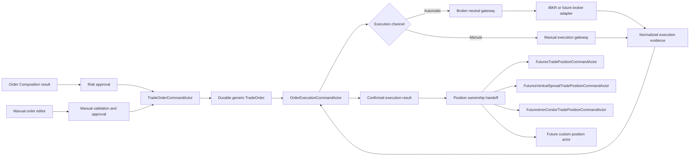

# Generic Trade Order System Design

Date: 2026-09-12  
Status: Superseded by `Generic-Trade-Order-Backend-Schema-Design-v1.1.md`  
Scope: Historical first draft. The v1.1 design retains `OptionTrade` and adds `FuturesTrade` as first-class backend trade definitions under the generic Trade Order root.

> **Supersession notice:** The decision in this draft to retire `OptionTrade` was rejected. Use v1.1 for implementation. This file is retained only to preserve design history.

## 1. Purpose

This document defines a new generic Trade Order model for futures, futures options, equities, multi-leg strategies, and future custom structures. It replaces the removed legacy Trade Order implementation and establishes one durable order definition that both manual execution and automatic broker execution consume.

The design intentionally accepts breaking source changes. Compatibility is required for durable historical data and staged operational migration, but the new domain model must not preserve an option-specific abstraction merely to avoid updating callers.

The resulting domain separates four authorities:

1. **Trade Order** records exactly what was approved for execution.
2. **Order Execution** owns how that order is submitted, modified, cancelled, reconciled, and filled, whether manually or by a broker adapter.
3. **Trade Position** owns the resulting strategy-specific economic position after confirmed fills.
4. **Trade Monitor** observes the established position and produces current and historical monitoring results.

## 2. Verified repository baseline

The workspace currently has the following relevant state:

- Legacy Trade Order command handlers, decorators, exceptions, `TradeOrderBoundedContext`, and `TradeOrderBoundedContextState` have been removed.
- Shared legacy Trade Order commands, events, validation, entity ID, state enum, and `TradeOrderReadModel` still exist.
- `TradeOrderReadModel` has a broadly usable header but embeds `OptionTradeLegReadModel`, `TradeLimitReadModel`, `TradeTypeLimitReadModel`, and `TradeFillReadModel` collections.
- `OptionTradeFactory` consumes `TradeOrderReadModel` directly and only constructs Long/Short Iron Condor trades. Other trade types throw `NotImplementedException`.
- `OptionTrade`, `IOptionTrade`, `OptionLeg`, dynamic `OptionLegData`, fills, limits, position collection, commands, events, query paths, projectors, and TradeDb tables still exist.
- Current `trade_order` storage has no schema version or exact strategy-catalog references and stores no generic child-leg topology.
- Current `option_leg` is keyed by order ID, trade ID, and contract ID and assumes option-only fields.
- Order Composition already produces a much stronger generic candidate containing exact Deployment, Strategy, Structure, and Variant `CatalogKey` values plus generic `CompositionLeg` records.
- Order Composition currently limits candidates to one, two, or four legs and requires every ratio to be one.
- The Order Execution specification already establishes the future event-sourced execution workflow, deterministic policy, broker gateway, reconciliation, compensation, and position handoff.
- The IBKR adapter specification already defines broker-neutral gateway and broker-specific translation boundaries.
- The futures-option position design defines strategy-specific Iron Condor and Vertical Spread position actors and a Trade-domain futures-option realtime router.

This design joins those pieces into one coherent order-to-position model.

## 3. Governing decisions

| Concern | Decision |
| --- | --- |
| Common order | One generic `TradeOrder` aggregate represents every approved executable trade structure. |
| Leg model | All instruments use `TradeOrderLeg`; option attributes are optional typed details, not a separate leg hierarchy. |
| Strategy grouping | `TradeOrderComponent` groups one or more legs under exact strategy/structure/variant references. |
| Custom trade | A custom order contains multiple components. Each component can use a different strategy; a one-leg component supports a distinct strategy per leg. |
| Single future | One order, one component, one futures leg. |
| Vertical | One order, one component, two option legs. |
| Iron Condor | One order, one component, four option legs. |
| Identity | Order, component, leg, execution attempt, broker order, and fill identities are distinct and stable. Dates and mutable states are not identity components. |
| Order authority | Trade Order owns approved intent and frozen definition, not broker truth or live P&L. |
| Execution authority | `Order/Execution` owns both manual and automatic broker execution attempts and all resulting execution evidence. |
| Broker boundary | Broker-neutral domain contracts; IBKR types stay in the IBKR infrastructure adapter. |
| Manual boundary | Manual execution uses the same execution aggregate and invariants with a manual execution adapter/input channel. |
| OptionTrade | The separate `OptionTrade` aggregate is retired after its required durable facts and consumers migrate. |
| Position creation | Confirmed execution results initialize the appropriate strategy position actor. |
| Persistence | PostgreSQL event history remains immutable; new read schemas are additive during migration. |
| Serialization | New MessagePack contracts begin at schema version 1; legacy keys/types are read by explicit migration adapters only. |

## 4. Domain boundaries

### 4.1 Trade Order

Trade Order answers:

- What portfolio and fund authorized this trade?
- Which exact workflow, assignment, deployment, strategy, structure, variant, parameters, and risk approval produced it?
- Which instruments, sides, ratios, quantities, expiries, and contract details were approved?
- Must the structure execute atomically, or is controlled legging permitted?
- What price, time, risk, and operational envelope constrains execution?
- Is the order ready, cancelled before execution, expired, or bound to an execution attempt?

Trade Order does not own:

- broker connection or broker order status;
- execution retries/repricing/reconciliation;
- actual fills and commissions as mutable order state;
- current option marks or Greeks;
- live position P&L; or
- position monitoring decisions.

### 4.2 Order Execution

Order Execution answers:

- Which execution channel is being used?
- Was the order sent manually, to IBKR, or to a future broker?
- What broker/manual acknowledgements and mutations occurred?
- What filled, at what price, quantity, time, and commission?
- Is exposure balanced, partial, uncertain, cancelled, rejected, or complete?
- What reconciliation evidence proves the final result?
- When is ownership safe to hand to the strategy position actor?

Both manual and automatic orders use the same execution state machine. The difference is the adapter and evidence source, not the domain aggregate.

### 4.3 Trade Position

Trade Position begins from confirmed execution allocations. It owns current economic state and strategy-specific calculations. Futures, Vertical Spread, Iron Condor, and future custom-position owners are selected from the frozen order/component topology.

### 4.4 Trade Monitor

Trade Monitor consumes complete position state. It does not reconstruct order approval or broker execution.

## 5. System flow



## 6. Aggregate and identity model

### 6.1 `TradeOrderId`

Use one stable identity for the order aggregate:

```text
TradeOrderId
  PortfolioId
  FundId
  OrderId
  TradeId
```

The existing integer order and trade IDs remain unchanged because upstream Portfolio, workflow, and execution specifications already freeze them. `ValueDate` is an indexed attribute, not part of identity. An order remains the same order if execution crosses a session or calendar boundary.

The actor thread key must be a canonical, culture-independent representation of all identity fields. It must not use display names.

### 6.2 `TradeOrderComponentId`

Each component has an identity unique within its order:

```text
TradeOrderComponentId
  TradeOrderId
  ComponentId
```

`ComponentId` is an immutable small integer or stable UUID assigned when the order is frozen. It is never inferred from array order. `ComponentOrdinal` separately controls deterministic presentation and broker translation.

### 6.3 `TradeOrderLegId`

Each leg has a stable identity unique within its order:

```text
TradeOrderLegId
  TradeOrderId
  LegId
```

`LegId` must not be the contract ID. The same contract may appear in more than one component, in a roll, hedge, allocation, or future custom structure. `LegOrdinal` provides canonical ordering.

### 6.4 Other identities

- `ExecutionAttemptId`: one execution lifecycle for one frozen order revision.
- `ExecutionOperationId`: one submit/modify/cancel/manual-record operation.
- `BrokerOrderKey`: broker-specific order identity wrapped by a broker-neutral value.
- `BrokerExecutionKey`: broker execution identity.
- `TradeFillId`: stable internal identity for one execution or correction.
- `PositionHandoffId`: idempotent transfer of confirmed exposure into a position owner.

These identities must never be conflated or regenerated during replay.

## 7. Trade Order aggregate

### 7.1 Root model

The new `ITradeOrder`/`TradeOrder` root contains:

#### Identity and tenancy

- schema version;
- `TradeOrderId`;
- value date;
- creation source and originator;
- correlation and causation IDs.

#### Frozen workflow evidence

- workflow ID and revision;
- order-composition result ID and hash;
- risk-approval ID, version, and hash;
- portfolio assignment version;
- exact parameter-set references and hashes that affect order construction or approval;
- market snapshot ID/hash and validity time used for approval.

#### Parent catalog definition

- exact Deployment `CatalogKey`;
- exact Strategy `CatalogKey`;
- exact Structure `CatalogKey`;
- exact Variant `CatalogKey`;
- definition/dependency hash.

For a custom composite order, the parent keys identify the custom orchestration/structure definition. Component keys identify each economic sub-strategy.

#### Lifecycle

- `TradeOrderStatus`;
- immutable revision;
- approved UTC time;
- valid-until UTC time;
- cancelled/expired UTC time and reason when applicable;
- active execution-attempt binding when present.

#### Execution envelope

- execution mode policy;
- order type;
- time in force;
- atomic requirement;
- allow-legging flag;
- signed approved limit/reservation prices;
- maximum quantity/units;
- maximum slippage/cost/commission allowance;
- maximum execution duration;
- market-data freshness limits;
- compensation/partial-exposure permissions; and
- execution policy/constraint/pricing versions.

#### Topology

- immutable `ITradeOrderComponentCollection`;
- immutable `ITradeOrderLegCollection` or legs accessed through components;
- one canonical topology hash.

### 7.2 Aggregate invariants

The root enforces:

1. At least one component and one leg.
2. Every leg belongs to exactly one component.
3. Component and leg IDs/ordinals are unique.
4. Every catalog reference has the expected catalog kind and positive version.
5. Every component topology matches its exact structure/variant definition.
6. Parent custom topology permits every child component.
7. Every instrument detail matches its instrument class.
8. Quantity, ratio, multiplier, and contract identity are valid.
9. Approval and all hashes are present before execution readiness.
10. Expired or cancelled orders cannot start a new execution.
11. A frozen revision cannot be mutated. A permitted pre-execution change creates a new revision and invalidates the prior approval.
12. An execution attempt binds one exact order revision/hash.
13. No component or leg may be silently added, removed, reordered, or substituted by an execution adapter.

## 8. Generic component model

`ITradeOrderComponent`/`TradeOrderComponent` represents one economic strategy unit within the parent order.

Required members:

- component ID and ordinal;
- component role (`Primary`, `Hedge`, `Adjustment`, `Compensation`, `Custom`);
- exact Deployment/Strategy/Structure/Variant catalog keys;
- strategy owner/capability key used for position routing;
- unit quantity and component ratio relative to parent units;
- side, bias, and premium mode where defined;
- atomicity relative to sibling components;
- allow-legging policy;
- component limit/reservation economics when separately constrained;
- component definition hash;
- immutable leg IDs; and
- optional parent-component ID for a future explicitly hierarchical structure.

The initial implementation should keep one flat component list. Parent-component identity is reserved for future composition but must not permit recursive unbounded graphs. If enabled later, the catalog definition sets a maximum depth.

Examples:

| Order | Components |
| --- | --- |
| Long ES future | One `Future` component containing one long ES futures leg |
| Put credit spread | One `Vertical` component containing short/long put legs |
| Short Iron Condor | One `ShortIronCondor` component containing four legs; its put/call verticals are calculation components inside the position model, not separate order aggregates |
| Future plus option hedge | Parent custom order with one Future component and one option strategy component |
| Multiple independent strategies sent together | Parent custom order with one component per strategy and explicit cross-component execution policy |

## 9. Generic leg model

### 9.1 Common leg fields

`ITradeOrderLeg`/`TradeOrderLeg` contains:

- leg ID, component ID, and ordinal;
- authoritative instrument ID and broker-neutral contract ID;
- instrument class and asset type;
- underlying instrument/contract ID when applicable;
- raw symbol for diagnostics only;
- exchange/venue, currency, and trading class when required;
- side (`Buy`/`Sell`);
- ratio and approved quantity;
- contract multiplier;
- expiry/last-trading UTC when applicable;
- tick-rule identity/version;
- price currency and units;
- leg definition hash;
- opening/closing effect;
- optional broker routing hints approved by execution policy; and
- typed instrument details.

Quantity is an absolute approved amount. Side carries direction. Negative quantity must not encode side.

### 9.2 Futures details

`FuturesTradeOrderLegDetails` contains:

- futures root;
- delivery/contract month;
- expiry and last-trading UTC;
- multiplier;
- settlement type if material;
- exchange/trading class; and
- verified contract-definition reference/hash.

It has no option right or strike.

### 9.3 Option details

`OptionTradeOrderLegDetails` contains:

- call/put right;
- strike;
- option expiration UTC/date;
- option style when material;
- exercise/settlement attributes when material;
- underlying futures contract ID;
- multiplier; and
- verified option-contract-definition reference/hash.

`OptionLegAction.Short/Long` is replaced by generic `Buy/Sell` side plus opening/closing effect. Long/short position meaning is derived from confirmed signed fills, not duplicated in an option-only enum.

### 9.4 Equity and future instrument details

The discriminated detail contract can add `EquityTradeOrderLegDetails` and later instrument types without changing common component or order semantics. Unknown detail types fail deserialization/validation for executable orders; they are not treated as a generic fallback.

## 10. Trade Order collections

Collections must be read-only after order freeze and expose allocation-conscious access:

- count and indexed enumeration;
- lookup by stable component/leg ID;
- lookup legs by component;
- lookup legs by contract ID without assuming uniqueness;
- canonical ordinal enumeration;
- topology and semantic validation;
- canonical hash input; and
- creation through builders/factories before freeze.

Mutable `List<T>` objects must not escape the aggregate. Construction can use builders; committed models expose immutable arrays or private arrays with read-only enumeration.

## 11. Order origin and manual orders

Introduce `TradeOrderOrigin`:

```text
Unknown
StrategyWorkflow
Manual
Imported
RecoveryCorrection
```

A manual order uses the same model and risk invariants. Manual describes who initiated the order; it does not permit missing topology, quantities, contract validation, approval evidence, or execution bounds.

Manual creation flow:

1. User selects portfolio/fund and an approved catalog deployment/structure, or an explicitly supported manual custom structure.
2. UI builds a draft using reference and market-data APIs.
3. Server validates instruments and topology.
4. Portfolio/Risk authorizes the frozen order.
5. `TradeOrderCommandActor` persists the approved order.
6. User chooses or policy selects the Manual execution channel.
7. `OrderExecutionCommandActor` manages the same execution lifecycle used for broker execution.

Manual fill entry is normalized as execution evidence. It requires execution time, quantity, price, leg allocation, fees/commission when known, external reference/source, and operator identity. Corrections append new evidence; they do not overwrite a prior fill.

## 12. Automatic broker orders

Automatic execution consumes the exact same frozen order revision. `OrderExecutionCommandActor` converts its approved topology into a broker-neutral request and passes it to `IBrokerOrderGateway`.

The adapter may translate:

- a one-leg future into a native futures order;
- a two-leg vertical into an atomic broker combo where supported;
- a four-leg Iron Condor into an atomic BAG/combo;
- a custom order into one or several broker orders only when the frozen execution envelope explicitly defines the grouping and legging behavior.

The adapter cannot change instruments, sides, ratios, total quantity, reservation price, or execution policy. An unsupported broker structure is rejected before submission.

## 13. Domain models in `Domain.Trade/Model`

The Model folder should be reorganized around shared economic concepts rather than OptionTrade ownership.

```text
Model/
  Order/
    ITradeOrder
    TradeOrder
    ITradeOrderComponent
    TradeOrderComponent
    ITradeOrderComponentCollection
    TradeOrderComponentCollection
    ITradeOrderLeg
    TradeOrderLeg
    ITradeOrderLegCollection
    TradeOrderLegCollection
    TradeOrderFactory
    TradeOrderTopologyValidator
    TradeOrderCanonicalizer
    TradeOrderHash
    FuturesTradeOrderLegDetails
    OptionTradeOrderLegDetails
  Execution/
    execution-domain value/calculation models only
  Position/
    shared position interfaces and collection
  Strategy/
    strategy-specific calculation models
```

Factories are selected by supported capability/structure keys, not a switch that throws for every newly catalogued display enum. The capability registry explicitly maps a versioned structure builder/validator to supported code. Unsupported catalog capabilities fail before the order becomes executable.

### 13.1 Futures schema

Futures is a first-class generic order specialization:

- `FuturesTradeOrderDefinition` or a validated `TradeOrder` factory result;
- one Future component for the normal case;
- one `TradeOrderLeg` with `FuturesTradeOrderLegDetails`;
- long/short represented by Buy/Sell side;
- exact Future structure/variant catalog keys; and
- futures-specific validator in the Model folder.

A separate duplicate futures order header is prohibited.

### 13.2 Options schema

Options use the same root/component/leg model with `OptionTradeOrderLegDetails`. Vertical and Iron Condor topology validators enforce two/four legs, option rights, sides, expiries, ratios, wing ordering, and supported symmetry rules from the frozen structure definition.

### 13.3 Custom schema

Custom orders use the common root with more than one component or a custom structure component. They do not use an untyped JSON collection. Every component and leg remains typed, versioned, validated, and hash-covered.

## 14. OptionTrade conversion and retirement

### 14.1 Target decision

The separate `OptionTrade` aggregate becomes unnecessary after the new order, execution, and position boundaries exist. Its current responsibilities move as follows:

| Current OptionTrade responsibility | New owner |
| --- | --- |
| Identity, strategy, underlying, dates | Generic Trade Order |
| Static option legs | Generic Trade Order components/legs |
| Order placement/open/close | Order Execution |
| Fills and commissions | Order Execution evidence/projection |
| Trade limits and type limits | Frozen approval/execution/risk envelope |
| Position collection | Strategy Trade Position actor |
| Dynamic option leg data | Strategy Trade Position state |
| Daily P&L/risk calculations | Strategy position/monitor models |
| End-of-day position transition | Position/monitor lifecycle |

### 14.2 Types to retire after migration

- `IOptionTrade` and `OptionTrade`;
- `OptionTradeFactory` and `IronCondorTrade` as trade aggregates;
- `IOptionLeg`, `OptionLeg`, and their collection in favor of generic legs;
- `IOptionLegData`, `OptionLegData`, and their collection;
- embedded `TradePositions` in OptionTrade read/snapshot contracts;
- live OptionTrade leg-data commands/events;
- option-trade order placement/open/close commands that duplicate generic order/execution messages; and
- OptionTrade-specific lifecycle projection tables after read migration.

Strategy-specific Iron Condor/Vertical calculation types remain, but move to position Model folders and consume generic frozen leg definitions plus live observations.

### 14.3 Compatibility views

During migration, existing OptionTrade API/UI consumers may receive a composed compatibility read model built from:

```text
Generic Trade Order definition
+ latest Order Execution summary/fills
+ latest strategy Trade Position
= legacy-shaped OptionTradeReadModel
```

This is a read adapter only. No new OptionTrade aggregate events are written after cutover.

## 15. Trade Order lifecycle

Introduce `TradeOrderStatus` with explicit state semantics:

```text
Draft
PendingApproval
Approved
ReadyForExecution
ExecutionBound
Executed
Cancelled
Expired
Rejected
Failed
```

The order status summarizes order authority. Detailed broker/manual states remain in the execution aggregate.

Permitted transitions:

```text
Draft -> PendingApproval
PendingApproval -> Approved | Rejected
Approved -> ReadyForExecution | Cancelled | Expired
ReadyForExecution -> ExecutionBound | Cancelled | Expired
ExecutionBound -> Executed | Failed
```

An execution failure with no exposure may release the binding for an explicitly authorized new attempt. This uses a new event and does not mutate history. An execution with unknown or partial exposure remains bound until reconciliation/compensation reaches a safe terminal result.

## 16. Trade Order actor

`TradeOrderCommandActor` is a standard event-sourced command actor. Orders are low-frequency business records, so it uses the standard synchronous durable path, not the high-frequency resident event window.

It owns:

- creation from an approved automatic or manual result;
- topology and catalog validation;
- canonicalization and hashing;
- approval/rejection recording when approval is a separate message;
- readiness, cancellation, expiration;
- binding/releasing an execution attempt;
- accepting final execution summary/handoff evidence; and
- immutable snapshot/replay.

The actor follows standard maps and folders:

```text
Order/
  Command/
    Actor/
    State/
    Handlers/
    Extensions/
    Validation/
    Exceptions/
    EventProjector/
  Event/
    Actor/
    Handlers/
    Extensions/
  Query/
    Actor/
    Handlers/
    Extensions/
  Docs/
```

Actor classes contain message/validation maps and lifecycle plumbing. Domain transformations live in handlers and Model types. Message construction and sending live in extension files.

## 17. Order Execution architecture

### 17.1 Single execution aggregate

`OrderExecutionCommandActor` owns an `ExecutionAttemptId`. It is the sole mutable owner of the attempt state for either channel:

```text
ExecutionChannel
  Manual
  Broker
```

Broker can later be refined by `BrokerProvider` (`IBKR`, future providers) without changing the core state machine.

### 17.2 Channel adapters

```text
IOrderExecutionGateway
  IManualOrderExecutionGateway
  IBrokerOrderGateway
```

Both return normalized immutable execution evidence. Only broker infrastructure uses broker SDK types. The manual gateway is an application/UI input boundary that validates authenticated operator commands and emits the same normalized acknowledgement, fill, commission, cancellation, and correction evidence.

### 17.3 Shared state and invariants

The shared execution state tracks:

- exact order ID/revision/hash;
- execution attempt and operation IDs;
- channel/provider/session;
- submitted topology and broker grouping;
- acknowledgement and working state;
- requested and filled quantities per leg;
- normalized fills/commissions/corrections;
- balanced units and residual exposure;
- price/reprice/cancel history;
- reconciliation evidence;
- terminal disposition; and
- position-handoff status.

Manual execution cannot mark a multi-leg order completely filled unless every required leg allocation produces the approved ratios or the execution is explicitly classified as partial/unbalanced exposure.

### 17.4 Relationship to existing execution specification

`Order/Execution/Docs/OrderExecutionWorkflowSpecification.md` remains authoritative for deterministic decision policy, action masks, repricing, cancellation, reconciliation, compensation, recovery, and position handoff. This design broadens its approved structure from the initial ES futures-option combo to the generic order/component/leg contract and adds the Manual channel.

`IbkrOrderExecutionAdapterSpecification.md` remains authoritative for IBKR translation and broker behavior. Its combo-leg input must be generated from generic frozen legs.

## 18. Shared types and enums

### 18.1 Required enums

- `TradeOrderOrigin`;
- `TradeOrderStatus`;
- `TradeOrderComponentRole`;
- `TradeInstrumentClass`;
- `TradeLegSide`;
- `PositionEffect` (`Open`, `Close`, `Auto` where supported and validated);
- `ExecutionChannel`;
- `BrokerProvider`;
- `ExecutionGroupingType` (`Single`, `AtomicCombo`, `SequentialGroups`);
- `ExecutionEvidenceSource`;
- `ExecutionFillDisposition`;
- `ExecutionExposureState`; and
- `TradeOrderChangeReason`.

Existing `TradeType` may remain as a compatibility/display classification during migration. Exact catalog keys and structure capability determine executable behavior. Adding a future strategy must not require extending a closed switch merely to deserialize an order.

### 18.2 Contract versioning

Every durable/wire root includes `SchemaVersion`. Child contracts have their own schema version when independently persisted or evolved. MessagePack integer keys are append-only and never reused. Enum numeric values are explicit and never reordered.

Unknown schema versions and unknown executable enum values fail with detailed configuration/contract errors. Historical readers may preserve unknown payload bytes for diagnostics but cannot execute them.

## 19. Commands

### 19.1 Trade Order commands

- `CreateTradeOrderCommand`;
- `SubmitTradeOrderForApprovalCommand` when not already approved upstream;
- `ApproveTradeOrderCommand`;
- `RejectTradeOrderCommand`;
- `MarkTradeOrderReadyForExecutionCommand`;
- `CancelTradeOrderCommand`;
- `ExpireTradeOrderCommand`;
- `BindTradeOrderExecutionCommand`;
- `ReleaseTradeOrderExecutionCommand` after proven no-exposure terminal failure;
- `CompleteTradeOrderExecutionCommand`; and
- `SnapshotTradeOrderCommand`.

An automatic workflow normally sends an already approved frozen order package, allowing create and approval to be one atomic command/event where the upstream risk contract proves authority. Manual flow may use explicit draft/approval messages.

### 19.2 Execution commands

- `StartOrderExecutionCommand`;
- `SubmitOrderExecutionCommand`;
- `ModifyOrderExecutionCommand`;
- `CancelOrderExecutionCommand`;
- `RecordManualOrderAcknowledgementCommand`;
- `RecordManualTradeFillCommand`;
- `CorrectManualTradeFillCommand`;
- `ApplyBrokerOrderUpdateCommand`;
- `ApplyBrokerExecutionFillCommand`;
- `ApplyBrokerCommissionCommand`;
- `ReconcileOrderExecutionCommand`;
- `ResumeOrderExecutionCommand`;
- `CompleteExecutionCompensationCommand`;
- `FailOrderExecutionCommand`; and
- `HandoffTradePositionCommand`.

User-requested manual operations and automatic policy decisions result in different reason/source evidence while using the same validated state transitions.

## 20. Events

### 20.1 Trade Order events

- `TradeOrderCreatedEvent` containing the complete frozen definition;
- `TradeOrderSubmittedForApprovalEvent`;
- `TradeOrderApprovedEvent`;
- `TradeOrderRejectedEvent`;
- `TradeOrderReadyForExecutionEvent`;
- `TradeOrderCancelledEvent`;
- `TradeOrderExpiredEvent`;
- `TradeOrderExecutionBoundEvent`;
- `TradeOrderExecutionReleasedEvent`;
- `TradeOrderExecutedEvent`; and
- `TradeOrderSnapshotEvent`.

### 20.2 Execution events

Retain and generalize the existing execution specification event families:

- attempt started and ownership acquired;
- submit/modify/cancel decision and dispatch;
- manual/broker acknowledgement;
- working/rejected/cancelled status;
- fill applied/corrected and commission applied;
- exposure classified;
- reconciliation requested/completed/failed;
- compensation requested/completed/failed;
- execution filled/cancelled/rejected/failed/manual intervention required;
- position handoff requested/acknowledged/failed; and
- execution ownership released.

Every event includes order ID/revision/hash, attempt ID, operation/command ID, causation/correlation, UTC source/receive times, and schema version.

## 21. Queries and read models

### 21.1 Trade Order queries

- get by `TradeOrderId`;
- get by workflow/composition/risk result;
- get orders for portfolio/fund and date range;
- get ready/unbound orders;
- get orders by status;
- get topology/components/legs;
- get order with current execution summary; and
- get order lineage and immutable hashes.

### 21.2 Execution queries

- get attempt by ID;
- get active attempt for order revision;
- get execution timeline;
- get fills/commissions by order, attempt, component, or leg;
- get reconciliation evidence;
- get manual-intervention-required executions; and
- get position handoff status.

### 21.3 Read-model separation

Use separate immutable read models:

- `TradeOrderReadModel` for the root;
- `TradeOrderComponentReadModel`;
- `TradeOrderLegReadModel`;
- `TradeOrderApprovalReadModel`;
- `OrderExecutionSummaryReadModel`;
- `OrderExecutionAttemptReadModel`;
- `TradeExecutionFillReadModel`; and
- composed UI/detail models at the application boundary.

Do not embed live position data or unbounded execution history in `TradeOrderReadModel`.

## 22. Persistence design

### 22.1 Authoritative event streams

PostgreSQL event sourcing is authoritative for:

```text
trade-order/{portfolioId}/{fundId}/{orderId}/{tradeId}
order-execution/{executionAttemptId}
```

Trade Order uses standard synchronous event persistence. Execution uses its event-sourced workflow requirements and must never report a broker mutation or terminal result before its required durable boundary.

### 22.2 TradeDb read schemas

Add versioned generic projections. Logical tables:

#### `trade_order_v2`

- complete stable identity and revision;
- schema/status/origin;
- value/approval/validity timestamps;
- workflow/composition/risk IDs and hashes;
- parent catalog keys and definition hash;
- execution envelope summary and hash;
- topology hash;
- active attempt ID;
- audit metadata.

#### `trade_order_component_v2`

- complete order partition identity/revision;
- component ID/ordinal/role;
- exact component catalog keys;
- capability/owner key;
- unit quantity/ratio;
- execution grouping/policy;
- definition hash.

#### `trade_order_leg_v2`

- complete order identity/revision;
- leg ID, component ID, ordinal;
- instrument/contract/underlying identity;
- instrument class and asset type;
- side/effect, quantity/ratio/multiplier;
- expiry, venue, currency, trading class;
- typed futures/option detail payload with schema/discriminator;
- tick-rule and definition hashes.

#### `trade_order_approval_v2`

- order identity/revision;
- approval/risk authority and hashes;
- approved constraints and validity;
- approval audit.

#### Execution projections

Use the execution specification's event log and operational projections, expanded with component/leg IDs and channel/provider. Fills are append/correction records keyed by internal fill identity and broker/manual source identity.

### 22.3 Keys and query tables

The current `trade_order` primary key `(tradeId, valueDate)` is not the new aggregate identity. Projection tables must support exact lookup by complete `TradeOrderId` and separate query projections for fund/date/status. Scylla/Cassandra query tables are purpose-specific; do not use filtering to simulate relational joins.

Root, component, and leg projections carry the same order revision and topology hash. Readers reject mixed revisions.

### 22.4 Legacy schemas

Initially retain:

- `trade_order`;
- `option_trade`;
- `option_leg`;
- `trade_fill` and `trade_fill_data`;
- `trade_limit` and `trade_type_limit`; and
- current OptionTrade/TradePosition schemas.

They become read-only compatibility sources after cutover. Historical rows are transformed by explicit adapters/backfill jobs. They are removed only after a repository usage audit, data-retention approval, and verification that no application version writes or reads them.

## 23. Serialization and migration

### 23.1 New contract policy

The new generic contracts do not reinterpret the legacy `TradeOrderReadModel` keys. Create an explicitly versioned replacement contract or a clean versioned namespace/type whose MessagePack layout is documented and tested.

Reasons:

- the legacy type conflates header, option legs, fills, and limits;
- replacing key 27 with generic legs would deserialize old payloads incorrectly;
- legacy identity includes `ValueDate` while the target identity does not;
- strategy/component references have no legacy representation; and
- execution evidence must move out of the order payload.

### 23.2 Legacy adapter

An adapter reads legacy TradeOrder/OptionTrade payloads and produces a migration candidate:

- infer only facts explicitly present;
- map old option legs to one supported component when topology is unambiguous;
- require reviewed catalog mappings for strategy/structure/variant;
- preserve original IDs and timestamps;
- record source event/table identity and adapter version;
- compute a new topology hash;
- reject ambiguous or unsupported records into a migration report; and
- never silently default missing economic or risk facts for execution.

Historical migration creates reference/read compatibility. It does not make an old unapproved order newly executable.

## 24. API and UI design

### 24.1 APIs

Expose generic endpoints/service methods for:

- creating and validating manual drafts;
- submitting/approving/cancelling orders;
- selecting execution channel;
- starting and operating an execution attempt;
- recording manual evidence;
- querying order/component/leg detail;
- querying execution/fill/reconciliation history; and
- retrieving composed blotter rows.

OptionTrade-specific command APIs become compatibility endpoints during migration and are then removed.

### 24.2 Manual order UI

The manual editor uses the common schema:

- header and portfolio/fund authority;
- strategy/structure/variant selection;
- component list;
- selected component leg grid;
- instrument-specific futures/option detail editor;
- quantity/ratio and execution grouping;
- current market/economic evidence;
- risk and execution envelope;
- validation/approval status; and
- explicit execution channel selection.

Data is read-only after approval. A material change creates a new draft/revision and requires reapproval.

### 24.3 Operations UI

Execution UI displays manual and broker attempts in one view with channel/provider filters. It shows acknowledgements, working status, fills by leg, balanced units, residual exposure, reconciliation, compensation, failures, and position handoff. Manual entry actions appear only for Manual-channel attempts and require operator identity/audit.

The Trade Blotter reads composed generic order, execution, and position projections. It does not drive market updates or calculate authoritative P&L.

## 25. Security and authority

- Automatic order creation requires a valid upstream workflow/risk authority and exact hashes.
- Manual order creation, approval, execution, fill correction, cancellation, and intervention are distinct permissions.
- The initial single-user development policy may satisfy authorization in development, but every action still records principal and source.
- Production broker dispatch requires environment/account authorization and an explicit armed state.
- Manual evidence cannot impersonate broker evidence.
- Secrets and broker account identifiers are redacted from normal messages/logs.

## 26. Error and degraded-operation behavior

| Condition | Behavior |
| --- | --- |
| Unsupported structure capability | Reject before order approval/readiness with exact missing capability. |
| Invalid component/leg topology | Reject creation; report component, leg, rule, catalog key, and hash. |
| Expired market/risk evidence | Do not bind execution; require new approval. |
| Unknown execution result | Keep attempt bound; reconcile before another mutation. |
| Broker unavailable | Order remains ready or attempt becomes reconnect/reconcile state; no blind submit. |
| Manual evidence incomplete | Reject evidence without mutating execution state. |
| Partial/unbalanced fill | Classify exposure and follow compensation/manual-intervention rules. |
| Projection failure | Durable events remain authoritative; report lag/failure and run explicit recovery. |
| Legacy record ambiguous | Quarantine/report for review; never infer an executable order. |
| Position handoff fails | Execution retains ownership and retries only through idempotent explicit handoff recovery. |

All failures include inner exception chain, actor/thread, order/revision/hash, attempt/operation, component/leg, channel/provider, event/command IDs, stream versions, and durable outcome. Expected validation failures are structured results rather than thrown/logged exception noise.

## 27. Observability

Supervisor metrics cover:

- Trade Order and Execution actor mailbox depth/age;
- commands processed/rejected/failed;
- orders by status/origin;
- ready orders without attempts;
- active attempts by channel/provider/status;
- acknowledgement, fill, cancel, reconciliation, and handoff latency;
- partial/unbalanced/unknown exposure counts;
- manual evidence and correction counts;
- broker reconnect and ambiguous mutation counts;
- event commit and projection latency;
- projection recovery and migration failures;
- per-actor allocation rate and GC; and
- detailed last failure with bounded history.

Successful high-frequency broker callbacks do not generate formatted per-message information logs.

## 28. Required project layout

```text
TomasAI.IFM.Domain.Trade.Shared/Order/
  Identifiers/
  Enums/
  Commands/
  Events/
  Queries/
  ViewModels/
  Validation/
  Execution/

TomasAI.IFM.Domain.Trade/Order/
  Command/Actor/
  Command/State/
  Command/Handlers/
  Command/Extensions/
  Command/Validation/
  Command/Exceptions/
  Command/EventProjector/
  Event/Actor/
  Event/Handlers/
  Event/Extensions/
  Query/Actor/
  Query/Handlers/
  Query/Extensions/
  Execution/
    Command/Actor/
    Command/State/
    Command/Handlers/
    Command/Extensions/
    Event/Handlers/
    Event/Extensions/
    Query/
    Model/
    Gateways/
    Docs/
  Docs/

TomasAI.IFM.Domain.Trade/Model/Order/
TomasAI.IFM.Domain.Trade/Model/Position/
TomasAI.IFM.Domain.Trade/Model/Strategy/
```

The exact namespaces may preserve solution naming conventions, but ownership and dependency direction are mandatory.

## 29. Migration and implementation gates

### Gate TO-0: Baseline and broken-reference inventory

- Build the solution after the legacy implementation removal and capture every broken reference.
- Inventory legacy TradeOrder and OptionTrade source, wire, event, storage, API, service, UI, test, and scheduled-task dependencies.
- Freeze representative durable payloads and database fixtures.
- Map existing docs to the new authority.

Exit: complete impact manifest and repeatable baseline failures/fixtures.

### Gate TO-1: Shared generic contracts

- Implement identities, enums, generic root/component/leg/read models, typed instrument details, collections, canonicalization, hashing, and validation.
- Add futures, vertical, Iron Condor, and custom fixtures.
- Add explicit MessagePack schemas and compatibility fixture tests.

Exit: all generic topology and serialization tests pass without actor/storage dependencies.

### Gate TO-2: Domain model and factories

- Implement `TradeOrder` aggregate model and capability-driven factories.
- Implement futures, option, vertical, Iron Condor, and custom component validators.
- Remove reliance on `OptionTradeFactory` for new creation.

Exit: Order Composition candidates convert deterministically to frozen order definitions and hashes.

### Gate TO-3: Trade Order actor

- Implement standard command actor, state, repository, maps, handlers, extensions, failures, snapshots, and replay.
- Implement automatic-approved and manual draft/approval flows.
- Implement execution binding barriers/invariants.

Exit: actor unit/integration/replay tests pass for every supported topology and lifecycle.

### Gate TO-4: Generic storage and queries

- Add new versioned TradeDb projection schemas and query tables.
- Implement idempotent projectors and typed queries.
- Verify no mixed revisions and exact hash round trips.

Exit: storage integration tests pass and legacy tables remain unchanged/readable.

### Gate TO-5: Execution contract alignment

- Generalize the execution envelope/approved structure to generic components and legs.
- Implement common channel enum and gateway contracts.
- Preserve deterministic policy and safety rules.

Exit: existing execution state-machine tests pass for one-leg future, vertical, and Iron Condor.

### Gate TO-6: Manual execution

- Implement manual gateway/input, acknowledgement, fill allocation, commission, correction, cancellation, reconciliation, and audit.
- Add UI/API boundary contracts without bypassing actor state.

Exit: manual full, partial, corrected, cancelled, and unbalanced scenarios pass end to end.

### Gate TO-7: Broker execution

- Align IBKR translation with generic legs and execution grouping.
- Implement one-leg Future, Vertical, and Iron Condor combo translation.
- Reject unsupported custom groupings.

Exit: deterministic fake/scripted broker tests pass; later paper acceptance remains required before live use.

### Gate TO-8: OptionTrade conversion

- Route all new option creation through generic Trade Order.
- Move execution lifecycle/fills into Order Execution.
- Move position/dynamic leg data into strategy position actors.
- Supply composed compatibility OptionTrade queries.
- Stop writing new OptionTrade aggregate events/tables.

Exit: existing application behavior is supplied by new authorities, and no production path creates/mutates a new OptionTrade aggregate.

### Gate TO-9: Position handoff

- Map filled generic components to Futures, Vertical, Iron Condor, or supported custom position owners.
- Prove idempotent handoff and exact signed quantity/opening basis/commission allocation.

Exit: execution cannot release ownership until the correct position actor acknowledges the exact handoff.

### Gate TO-10: API/UI conversion

- Convert command/query clients, manual order UI, operations view, blotter, notifications, and services.
- Remove UI-generated backend position updates.

Exit: no active UI/API dependency on legacy TradeOrder or OptionTrade mutations.

### Gate TO-11: Legacy retirement and qualification

- Run repository-wide usage audit.
- Remove legacy shared commands/events/models/factories/actors/projectors after historical readers are isolated.
- Retain data adapters/archives as required.
- Run full build, unit, integration, storage, actor, NATS, replay, failure, UI verification, benchmark, and soak suites.

Exit: no unexplained legacy runtime path, no schema overwrite, and complete verification evidence.

## 30. Test requirements

### 30.1 Unit tests

- every identity format/round trip;
- canonical component/leg ordering and hash stability;
- futures one-leg topology;
- all vertical option topologies;
- long/short Iron Condor topology;
- custom multi-component and strategy-per-component topology;
- same contract in multiple components with distinct leg IDs;
- typed instrument detail validation;
- closed/unknown enum and schema handling;
- immutable/frozen collection behavior;
- lifecycle transitions and revision invalidation;
- execution envelope validation;
- manual/broker channel equivalence for normalized evidence;
- fill allocation and balanced-unit calculation;
- legacy adapter accepted and rejected fixtures; and
- command/validation map completeness.

### 30.2 Actor integration tests

- automatic approved order creation through actor messaging;
- manual draft/approval path;
- duplicate command idempotency and payload conflict;
- bind/execute/complete ordering;
- cancel/expire race;
- execution failure release with proven zero exposure;
- no release under unknown exposure;
- replay and snapshot equivalence;
- actor exception containment and detailed failure result; and
- position handoff acknowledgement barrier.

### 30.3 Storage tests

- schema creation/migration is additive;
- immutable event histories remain readable;
- root/component/leg revisions remain coherent;
- idempotent projections;
- exact lookup and fund/date/status query tables;
- no filtering-dependent hot query;
- fill corrections preserve original rows;
- legacy table backfill and quarantine reporting; and
- MessagePack LZ4 on/off event compatibility where configured.

### 30.4 Execution verification

- single Future manual and broker paths;
- standalone vertical manual and broker paths;
- Iron Condor manual and broker combo paths;
- custom multi-component supported grouping;
- unsupported grouping rejected before dispatch;
- acknowledgement timeout, reject, partial fill, cancel/fill race;
- disconnect and ambiguous mutation reconciliation;
- unbalanced exposure compensation/manual intervention;
- restart before/after dispatch and fill;
- duplicate/reordered broker/manual evidence; and
- idempotent strategy-position handoff.

### 30.5 API/UI tests

- generic manual editor for futures/options/custom components;
- read-only behavior after approval;
- new revision and reapproval after material change;
- permission and principal audit;
- channel-specific operations controls;
- composed Trade Blotter query;
- no OptionTrade live mutation from UI; and
- complete error details.

### 30.6 Performance and allocation tests

Trade Order is low frequency; prioritize correctness and deterministic allocation bounds. Benchmark:

- construction/canonicalization/hash for 1, 2, 4, 16, and configured maximum legs;
- MessagePack serialize/deserialize sizes and allocations;
- actor create/replay/snapshot latency;
- projection and composed-query latency;
- execution callback throughput for burst fills/status updates; and
- position handoff latency.

Set explicit maximum component count, leg count, serialized payload size, and query page size from measured evidence.

## 31. Acceptance criteria

The system is aligned when:

1. One generic Trade Order contract represents a Future, Vertical, Iron Condor, and validated custom structure.
2. A component can carry independent exact strategy/structure/variant references.
3. Multiple components can use different strategies within one parent order.
4. Every leg has a stable identity independent of contract ID.
5. Futures legs require no option-only fields.
6. Option details are typed and validated.
7. Order Composition converts without losing catalog, market, pricing, or risk evidence.
8. Trade Order owns approved intent only.
9. Manual and broker execution use one execution aggregate and normalized evidence model.
10. Broker adapters cannot alter approved topology/economics.
11. Fills and commissions are execution evidence by leg.
12. Confirmed fills hand off exactly once to the correct strategy position owner.
13. The new system writes no new OptionTrade aggregate state after cutover.
14. Dynamic leg data and positions are absent from Trade Order.
15. Legacy event and table history remains readable without rewriting immutable payloads.
16. Active APIs, UI, services, and tests use the new contracts.
17. Full build and all unit/integration/storage/replay/failure/UI verification gates pass.
18. No removed legacy TradeOrder implementation is restored as a parallel authority.

## 32. Non-negotiable constraints

- Do not create separate duplicate order roots for Futures and Options.
- Do not model an Iron Condor as four independent strategy orders.
- Do not require a strategy reference directly on every leg when several legs belong to one component; use component ownership and allow one-leg components.
- Do not use contract ID as leg identity.
- Do not encode Buy/Sell in signed quantity.
- Do not store arbitrary executable custom topology only as JSON.
- Do not infer catalog references from display names.
- Do not execute an unsupported capability or unknown schema.
- Do not let manual operations bypass approval, execution state, reconciliation, or audit.
- Do not expose broker SDK types outside infrastructure.
- Do not blindly retry an ambiguous broker mutation.
- Do not mix order, execution, position, and monitor authority.
- Do not rewrite historical events or overwrite legacy schemas during migration.

## 33. Relationship to existing documents

- `Order/Execution/Docs/OrderExecutionWorkflowSpecification.md` supplies the execution state machine and safety rules and must be updated during Gate TO-5 to consume generic components/legs and the Manual channel.
- `Order/Execution/Docs/IbkrOrderExecutionAdapterSpecification.md` supplies IBKR translation/reconciliation rules and must consume broker-neutral generic order legs.
- `Order/Execution/Docs/ScriptedBrokerTestHarnessSpecification.md` supplies deterministic adapter verification.
- `Strategy/Workflow/IntrinsicTime/OrderComposer/Docs/OrderComposition-Specification-v1.0.md` owns construction of candidate structures and already provides the starting generic candidate/leg contract.
- `Futures/Option/Docs/Futures-Option-Strategy-Trade-Position-Actor-Design-v1.0.md` owns live futures-option strategy position routing/state after execution.
- `Domain.Trade/Docs/Trade-Structure-Strategy-Position-Monitor-Design.md` supplies the broader separation and is superseded where it retains OptionTrade or chooses a conflicting durability boundary.
- `Documents/system/Actor-Implementation-Conventions.md` remains authoritative for actor folder, map, handler, extension, state, repository, messaging, and exception conventions.
