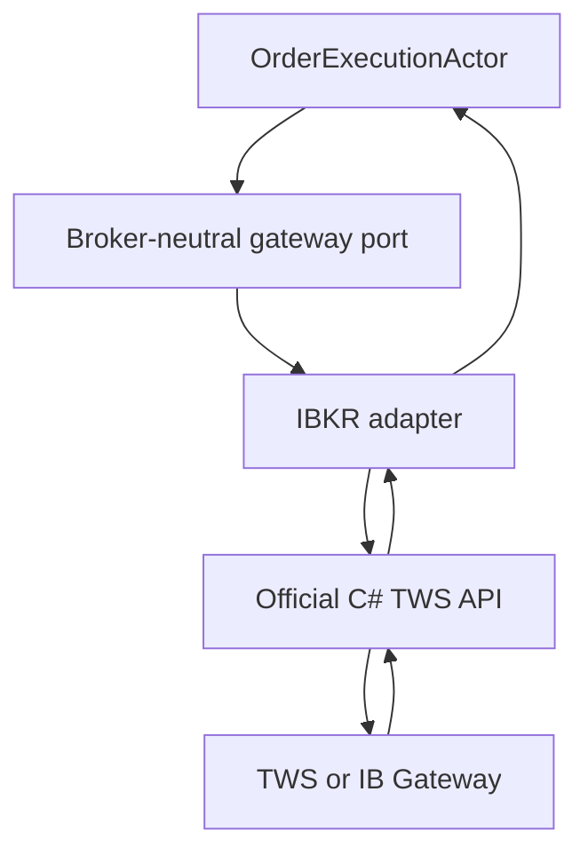

# IBKR Order Execution Adapter Specification

**Document version:** 1.0  
**Status:** Implementation specification  
**Target runtime:** .NET 10 or later  
**Broker API:** Official Interactive Brokers TWS API for C#  
**Host:** Trader Workstation or IB Gateway  
**Primary product scope:** ES futures-option multi-leg combination orders  
**Companion specification:** `OrderExecutionWorkflowSpecification.md`  
**Last updated:** 2026-08-02

---

## 1. Purpose

This document specifies the IBKR-specific infrastructure required by the broker-neutral `OrderExecutionWorkflowSpecification`.

The workflow specification owns:

- why and when to submit, wait, reprice, cancel, reconcile, compensate, or escalate;
- the deterministic policy and permitted-action mask;
- price, time, slippage, edge, quantity, and risk constraints;
- the execution-attempt aggregate and its business state;
- final position-monitor handoff.

This specification owns:

- connection to Trader Workstation or IB Gateway;
- the official C# TWS API request and callback model;
- API client identity and order-ID allocation;
- IBKR contract resolution and combination-contract construction;
- translation of broker-neutral limit orders into IBKR `Contract`, `ComboLeg`, and `Order` objects;
- `placeOrder`, order modification, and cancellation calls;
- callback normalization, correlation, deduplication, and dispatch;
- IBKR open-order, completed-order, execution, commission, and position queries;
- broker-session reconciliation and restart recovery evidence;
- IBKR error, warning, connectivity, and operational handling;
- adapter-specific testing, diagnostics, security, and release acceptance.

The adapter is not a strategy component. It must never select an execution action, calculate expected edge, widen a reservation price, change an approved strategy, or compensate exposure without an explicit workflow command.

---

## 2. Architecture Decision

IBKR integration shall be a separate infrastructure assembly implementing broker-neutral ports defined for the execution workflow.

No `IBApi` type may cross the infrastructure boundary. The workflow shall not reference:

- `EClientSocket`;
- `EWrapper`;
- `EReader`;
- `Contract`;
- `ComboLeg`;
- `Order`;
- `OrderState`;
- `Execution`;
- `CommissionReport` or equivalent current API type;
- IBKR status strings or error-code integers.

The adapter translates outbound broker-neutral commands into IBKR calls and translates inbound IBKR callbacks into immutable broker-neutral messages.

This separation is mandatory because the TWS API is a TCP socket message protocol connected through TWS or IB Gateway, with request methods and asynchronous callback streams. IBKR explicitly directs order clients to monitor error, order-status, open-order, and execution callbacks together. A single callback must not be treated as complete broker truth.

---

## 3. Dependency Direction



Allowed dependency direction:

```text
Execution.Contracts
        ^
Execution.Application
        ^
Execution.Infrastructure.IBKR
        ^
Official IBApi assembly
```

The IBKR assembly may depend on execution ports and contracts. Domain, application, projection, and policy assemblies must not depend on the IBKR assembly or official `IBApi` types.

---

## 4. Delivery Phases

### 4.1 Required V1 phases

| Phase | Name | Required outcome |
|---|---|---|
| 1 | API package, session, and message pumps | Pinned official API, validated configuration, single active client, reader loop, outbound serialization, readiness state |
| 2 | Contract and combo-order translation | Resolved option contracts, four-leg BAG construction, overall combo pricing, deterministic field mapping, preflight validation |
| 3 | Order operations and callback normalization | Submit, modify, cancel, status, fills, commissions, errors, correlation, deduplication, and workflow messages |
| 4 | Reconciliation and recovery | Open/completed orders, executions, positions, disconnect/reconnect, process restart, ambiguous state resolution |
| 5 | Observability, testing, and operational acceptance | Metrics, traces, callback replay, paper integration, chaos tests, deployment runbook, V1 acceptance gates |

All five phases are required before the deterministic workflow can pass its V1 paper-trading acceptance boundary.

### 4.2 Post-V1 phases

| Phase | Name | Possible outcome |
|---|---|---|
| 6 | Additional IBKR order capabilities | Explicitly approved order types, time-in-force profiles, venue profiles, or broker algorithms |
| 7 | Multi-account and failover extensions | Separately controlled account routing, redundant gateway supervision, expanded reconciliation |
| 8 | Advanced execution diagnostics | Deeper broker-latency attribution, venue-level analysis, and automated API-version compatibility reports |

Post-V1 work must not change the broker-neutral workflow contract without an explicit versioned contract revision.

---

## 5. Scope

### 5.1 Included in V1

- Official IBKR C# TWS API only.
- Connection through either TWS or IB Gateway, selected by configuration.
- One configured trading account per adapter instance.
- One dedicated nonzero API client ID per running production instance.
- One logical broker session epoch per connection.
- ES futures-option contract verification.
- Four-leg iron-condor combination orders.
- `BAG` combination contract construction.
- Overall combination limit price.
- Limit order submission, price-only modification, and individual cancellation.
- DAY time in force unless an approved routing profile explicitly specifies another supported value.
- Open-order, completed-order, execution, commission, and position evidence.
- Normalized broker-neutral callback messages.
- Callback deduplication and out-of-order tolerance.
- Disconnect, reconnect, nightly reset, and process-restart recovery.
- Paper and live environment isolation.
- Structured logging, metrics, tracing, API log correlation, and operational alerts.

### 5.2 Excluded from V1

- IBKR market data as the platform's primary strategy market-data feed.
- Arbitrary `Contract` construction from a ticker string at submission time.
- Market orders.
- Native bracket, OCA, stop, trailing-stop, discretionary, hidden, pegged, or algorithmic orders.
- Per-leg pricing for the four-leg iron condor.
- Non-guaranteed four-leg combinations.
- Autonomous SMART-routing changes.
- Financial Advisor allocations or account groups.
- API binding or takeover of manually entered TWS orders.
- Use of API client ID 0 in the normal execution process.
- Global cancellation from the per-attempt workflow.
- Order modification by cancelling and silently assigning a new order ID.
- Reuse of an order ID for a different logical order.
- Broker-specific policy decisions.
- Direct calls to IBKR from UI, strategy, risk, or position-monitor components.
- Third-party IBKR wrappers in the production execution path.

### 5.3 Important operational boundary

The adapter reports broker facts; it does not decide their business meaning. For example:

- It reports `PendingCancel`; the workflow decides to wait or reconcile.
- It reports an execution; the workflow classifies balanced or unbalanced exposure.
- It reports a capped price; the workflow decides whether that violates the execution envelope.
- It reports error code 201 with normalized rejection data; the workflow determines the terminal result.
- It reports disconnect/reconnect facts; the workflow freezes normal execution and requests reconciliation.

---

## 6. Official API Baseline and Version Control

### 6.1 Source policy

Implementation must use the official Interactive Brokers C# API distributed with the TWS API package. Do not introduce `ib_insync`, `ib_async`, or another unofficial wrapper into the production C# execution boundary.

The implementation repository must record:

- downloaded TWS API version;
- `IBApi.dll` assembly version and file hash;
- minimum supported TWS version;
- minimum supported IB Gateway version;
- date official documentation was reviewed;
- adapter compatibility-test version;
- known broker behavior deviations discovered in paper or live validation.

### 6.2 Upgrade rule

An IBKR API, TWS, or IB Gateway upgrade is an infrastructure release, not a routine package bump. Before promotion:

1. Review the current official changelog and order-management documentation.
2. Compare public C# request and callback signatures.
3. Rebuild the adapter against the new assembly.
4. Run callback-contract, serializer, fake-host, and paper integration tests.
5. Replay stored normalized callback fixtures.
6. Verify BAG order construction and echoed order fields.
7. Verify order ID, modify, cancel, fill, commission, and reconciliation flows.
8. Record the new compatibility manifest.
9. Require explicit release approval.

Do not load different `IBApi` assembly versions dynamically in one process.

### 6.3 Official reference set

The implementation and review baseline is listed in Section 35. URLs are authoritative references, but observed paper behavior and pinned-version callback fixtures are also required because API behavior can differ by version, host, exchange, and account configuration.

---

# Part I — Required V1 Adapter

## 7. Phase 1: API Package, Session, and Message Pumps

### 7.1 Suggested assembly structure

```text
Trading.Execution.Infrastructure.IBKR/
  Api/
    IbkrApiVersionManifest.cs
    IbkrApiCompatibilityValidator.cs
  Configuration/
    IbkrConnectionOptions.cs
    IbkrExecutionOptions.cs
    IbkrConfigurationValidator.cs
  Session/
    IbkrSessionService.cs
    IbkrSessionState.cs
    IbkrSessionLease.cs
    IbkrOrderIdAllocator.cs
  Reader/
    IbkrEWrapperBridge.cs
    IbkrReaderLoop.cs
    IbkrCallbackEnvelope.cs
    IbkrCallbackDispatcher.cs
  Writer/
    IbkrCommandPump.cs
    IbkrOutboundCommand.cs
    IbkrDispatchReceipt.cs
  Contracts/
    IbkrContractResolver.cs
    IbkrContractCache.cs
    IbkrComboContractBuilder.cs
    IbkrMarketRuleCache.cs
  Orders/
    IbkrComboOrderBuilder.cs
    IbkrOrderTranslator.cs
    IbkrOrderEchoValidator.cs
    IbkrOrderStatusMapper.cs
  Correlation/
    IbkrOrderCorrelationStore.cs
    IbkrExecutionDeduplicator.cs
  Reconciliation/
    IbkrReconciliationCoordinator.cs
    IbkrOpenOrderCollector.cs
    IbkrExecutionCollector.cs
    IbkrCompletedOrderCollector.cs
    IbkrPositionCollector.cs
  Errors/
    IbkrErrorCatalog.cs
    IbkrErrorClassifier.cs
    IbkrAdvancedRejectParser.cs
  Gateway/
    IbkrBrokerOrderGateway.cs
  Diagnostics/
    IbkrMetrics.cs
    IbkrHealthCheck.cs
```

Names may be adapted to the existing solution, but responsibilities and dependency boundaries must remain distinct.

### 7.2 Configuration

```csharp
public enum IbkrEnvironment : byte
{
    Paper = 1,
    Live = 2
}

public enum IbkrHostApplication : byte
{
    TraderWorkstation = 1,
    IbGateway = 2
}

public sealed record IbkrConnectionOptions(
    string Host,
    int Port,
    int ClientId,
    string AccountId,
    IbkrEnvironment Environment,
    IbkrHostApplication HostApplication,
    TimeSpan ConnectTimeout,
    TimeSpan ReadinessTimeout,
    TimeSpan HeartbeatInterval,
    TimeSpan HeartbeatTimeout,
    TimeSpan ReconnectMinimumDelay,
    TimeSpan ReconnectMaximumDelay,
    bool EnableOrderSubmission,
    string InstanceIdentity);
```

Validation requirements:

- Host must be an explicit allowlisted address. Production should normally use loopback or a protected private host.
- Port must be explicitly configured; do not infer live versus paper solely from a conventional port number.
- Client ID must be positive and unique for the adapter instance.
- Account ID must match an allowlisted account returned by IBKR.
- Environment must be explicit.
- `EnableOrderSubmission` must default to `false`.
- Live order submission requires a separate live authorization setting unavailable to paper configuration.
- Paper and live instances use different client IDs, state directories, metrics dimensions, and startup authorization.
- Secrets and login credentials are not accepted through this adapter configuration.
- Unknown configuration fields that may indicate a version mismatch should fail validation in production.

### 7.3 TWS or IB Gateway choice

The adapter supports both hosts through the same API surface.

- Use TWS when an operator needs the complete broker UI during development or active supervision.
- Use IB Gateway when a smaller unattended host is operationally preferable.
- The choice does not change workflow behavior.
- Host-specific startup, authentication, restart, and reauthentication procedures belong in deployment runbooks.
- Automatic login or reauthentication must comply with IBKR-supported mechanisms; the adapter must not scrape or automate an unsupported UI login.

### 7.4 Single-active-client rule

Only one adapter process may own the configured `(environment, account, clientId)` tuple.

Implement an `IBrokerConnectionLease` or equivalent durable local/process lease:

```csharp
public interface IBrokerConnectionLease : IAsyncDisposable
{
    ValueTask<BrokerLeaseResult> TryAcquireAsync(
        BrokerConnectionIdentity identity,
        CancellationToken cancellationToken);
}
```

Requirements:

- Acquire before connecting.
- Refuse startup if the lease is already held.
- Do not steal a live lease automatically.
- Release only after the socket and command pumps stop.
- A stale lease may be cleared only after process and broker-state verification.
- Error code 326 or equivalent client-ID conflict is a critical startup failure, not a reason to choose a random client ID.

### 7.5 Session state

```csharp
public enum IbkrSessionStatus : byte
{
    Stopped = 0,
    AcquiringLease = 1,
    ConnectingSocket = 2,
    StartingReader = 3,
    AwaitingNextValidOrderId = 4,
    AwaitingAccountIdentity = 5,
    SynchronizingBrokerState = 6,
    ReadyForQueries = 7,
    ReadyForOrders = 8,
    ConnectivityLost = 9,
    Reconnecting = 10,
    ReconciliationRequired = 11,
    Faulted = 12,
    Stopping = 13
}
```

`ReadyForOrders` requires all of the following:

- socket connected;
- reader loop alive;
- a valid connection/session epoch;
- `nextValidId` received;
- configured account confirmed in the managed account set;
- client ID confirmed not to conflict;
- API version compatibility accepted;
- initial open-order synchronization completed;
- initial position synchronization completed;
- non-terminal locally persisted attempts reconciled or explicitly blocked;
- outbound command pump healthy;
- callback dispatcher healthy;
- order submission enabled for the configured environment;
- no global or account execution block active.

Socket connection alone never means `ReadyForOrders`.

### 7.6 Session identity

```csharp
public readonly record struct BrokerSessionEpoch(
    Guid Value,
    long Sequence,
    DateTimeOffset ConnectedAtUtc,
    int ClientId,
    IbkrEnvironment Environment);
```

- Create a new epoch for every successful socket connection.
- Attach the epoch to every outbound command, callback, query, and normalized message.
- Ignore or quarantine callbacks known to belong to an obsolete epoch.
- If epoch ownership cannot be determined, report an ambiguous-session incident and reconcile.

### 7.7 Connection and reader topology

Use the official C# API connection objects appropriate to the pinned version, normally including:

- `EClientSocket`;
- `EReaderSignal` implementation;
- `EReader`;
- an `EWrapper` implementation.

Required topology:

1. The session service creates the official API objects.
2. It connects using configured host, port, and client ID.
3. It starts the official reader according to the pinned API's required sequence.
4. A dedicated long-running reader loop waits for signals and processes messages.
5. `EWrapper` callbacks perform minimal translation and enqueue immutable callback envelopes.
6. A single callback dispatcher normalizes and publishes broker-neutral messages.
7. A separate single-writer command pump serializes all outbound `EClientSocket` operations.

The reader thread must never:

- call strategy, risk, pricing, persistence, UI, or actor business logic;
- wait on the workflow actor;
- perform database I/O;
- perform network I/O other than required API message processing;
- calculate compensation or execution decisions;
- drop fills, status changes, errors, or connectivity messages.

### 7.8 Inbound callback channel

IBKR order callbacks are low volume relative to market data and must be lossless at the process level.

V1 shall use a dedicated single-reader callback channel with:

- O(1) callback enqueue work;
- monotonically increasing local receive sequence;
- source callback name;
- session epoch;
- receive UTC time and monotonic timestamp;
- normalized copies of all fields needed after the callback returns;
- no reference to mutable `IBApi` objects after enqueue;
- a measured high-water mark;
- a critical health failure if callbacks cannot be retained.

Do not share this channel with tick, depth, historical-data, or option-chain traffic.

### 7.9 Outbound command pump

All outbound `EClientSocket` calls are serialized by one adapter-owned writer.

```csharp
public interface IIbkrCommandPump
{
    BrokerDispatchReceipt TryDispatch(in IbkrOutboundCommand command);
}

public readonly record struct BrokerDispatchReceipt(
    Guid OperationId,
    BrokerSessionEpoch SessionEpoch,
    BrokerDispatchStatus Status,
    DateTimeOffset AcceptedAtUtc,
    string? FailureCode);
```

`Accepted` means only that the adapter validated and queued the call locally. It does not mean IBKR accepted the order.

Requirements:

- Bounded queue with no silent drop.
- If full, reject locally before any socket call and mark the adapter unhealthy.
- Preserve command order.
- Verify the expected session epoch immediately before the API call.
- Do not retry a socket call automatically after an ambiguous exception.
- Emit an adapter callback recording whether the call was attempted.
- Any uncertain submit/modify/cancel result requires workflow reconciliation.

### 7.10 Liveness and connectivity

The adapter must distinguish:

- local socket disconnected;
- reader loop stopped;
- TWS/IB Gateway connected locally but disconnected from IB servers;
- restored connectivity with market-data subscriptions lost;
- restored connectivity with data maintained;
- TWS/IB Gateway socket port reset;
- host authenticated but not ready for orders;
- API client ID conflict;
- heartbeat timeout.

IBKR system messages such as 1100, 1101, 1102, and 1300 must be normalized into session events. These codes are not order decisions.

After any order-affecting connectivity loss:

1. Mark the session not ready for orders.
2. Reject new normal order commands locally.
3. Preserve all callback processing.
4. Reconnect according to bounded backoff.
5. Establish a new session epoch.
6. Reacquire next valid order ID and account identity.
7. Synchronize open orders and positions.
8. Request workflow reconciliation for every affected active attempt.
9. Return to `ReadyForOrders` only after reconciliation succeeds.

### 7.11 Daily maintenance and reauthentication

- Scheduled IBKR maintenance and host reauthentication windows must be represented in the operational calendar.
- New execution attempts should be blocked inside a configurable maintenance safety window.
- Existing native orders may remain active at the broker during an API interruption; never assume disconnect means cancel.
- Delayed execution reports received after reconnection must be processed normally.
- An operator alert must precede an expected reauthentication boundary.

---

## 8. Phase 2: Contract Resolution and Combo-Order Translation

### 8.1 Contract identity policy

Every option leg must use an IBKR `conId` resolved and verified before execution. Symbol, expiry, strike, right, multiplier, trading class, exchange, and currency remain validation attributes; they are not substitutes for a verified `conId`.

```csharp
public sealed record IbkrResolvedContractIdentity(
    long PlatformInstrumentId,
    int ConId,
    string Symbol,
    string SecurityType,
    string LastTradeDateOrContractMonth,
    decimal Strike,
    string Right,
    string Multiplier,
    string Exchange,
    string Currency,
    string TradingClass,
    string LocalSymbol,
    decimal MinimumTick,
    IReadOnlyList<string> ValidExchanges,
    IReadOnlyList<int> MarketRuleIds,
    DateTimeOffset VerifiedAtUtc,
    string ContractFingerprint);
```

### 8.2 Resolution responsibilities

`IIbkrContractResolver` shall:

- resolve platform instrument identity to one unambiguous IBKR contract;
- request contract details when the cache is missing, stale, or invalid;
- reject zero, multiple, or semantically inconsistent matches;
- verify `conId`, expiry, strike, right, multiplier, trading class, currency, and exchange;
- return market-rule identifiers and minimum-tick information;
- persist a versioned contract fingerprint;
- support prewarming all candidate legs before trade approval;
- never choose among ambiguous contracts during order submission.

### 8.3 Contract cache

- Cache by platform instrument ID and IBKR `conId`.
- Include API version, host environment, verification date, and contract fingerprint.
- Invalidate on contract-detail mismatch or IBKR contract error.
- Expired option contracts cannot be used for new entry orders.
- An execution attempt stores the exact resolved contract snapshot used for submission.
- A cache refresh must not mutate the contract identity of an active attempt.

### 8.4 Minimum price increment

Do not rely solely on `ContractDetails.MinTick` for all prices and exchanges. IBKR documents that minimum increments may differ by exchange and price level and provides market-rule IDs and `reqMarketRule` for the complete structure.

`IIbkrMarketRuleProvider` shall:

- identify the market rule corresponding to the selected routing exchange;
- request and cache its price-increment ladder;
- calculate the valid increment for the current proposed price;
- expose the rule version/fingerprint to the order translator;
- reject a price when a valid tick cannot be established;
- never round through the workflow's reservation price.

The workflow's broker-neutral price calculator remains authoritative over economic direction. The adapter performs a final IBKR tick and representability validation.

### 8.5 Approved combo translation input

The gateway receives a broker-neutral order request:

```csharp
public sealed record BrokerComboOrderRequest(
    Guid OperationId,
    Guid ExecutionAttemptId,
    Guid RiskApprovalId,
    long ExpectedAttemptVersion,
    string AccountId,
    BrokerOrderPurpose Purpose,
    BrokerOrderCashFlow CashFlow,
    BrokerOrderSide OverallSide,
    int ComboQuantity,
    BrokerLimitPrice LimitPrice,
    BrokerTimeInForce TimeInForce,
    string RoutingProfile,
    IReadOnlyList<BrokerComboLegRequest> Legs,
    DateTimeOffset CreatedAtUtc,
    DateTimeOffset NotAfterUtc,
    string OrderPayloadHash);

public readonly record struct BrokerComboLegRequest(
    long PlatformInstrumentId,
    int IbkrConId,
    BrokerOrderSide Side,
    int Ratio,
    string Exchange,
    string ContractFingerprint);
```

The adapter must verify that the payload hash matches its normalized input before dispatch.

### 8.6 BAG contract construction

The builder shall construct an IBKR spread/combination contract with:

- security type `BAG`;
- configured underlying symbol or other required combo identity fields for the pinned API;
- approved currency;
- approved routing exchange;
- exactly the approved legs;
- each leg's verified `conId`;
- each leg's positive integer ratio;
- each leg's `BUY` or `SELL` action;
- each leg's approved exchange;
- an explicit open/close value where required by account/product rules;
- no short-sale fields unless explicitly required and supported.

V1 validation:

- Exactly four legs for an iron condor.
- Every leg resolves to the same approved expiry.
- All legs have the expected futures-option security type.
- Ratios match the approved structure.
- Side/strike ordering matches the candidate hash.
- No duplicate leg identity.
- No zero or negative ratio.
- No leg is substituted based only on symbol or strike.

### 8.7 Overall combo pricing

V1 four-leg orders use one overall order price. IBKR's current documentation states that combos with more than two legs use an overall price and must not be submitted as non-guaranteed combinations.

Therefore:

- `Order.OrderType = "LMT"`;
- set the overall `Order.LmtPrice` through the price-convention translator;
- do not populate per-leg `OrderComboLeg` prices;
- do not set a NonGuaranteed smart-combo routing parameter;
- reject any profile attempting per-leg pricing for the four-leg order;
- verify the echoed order uses the intended overall limit price.

### 8.8 Debit, credit, and IBKR sign convention

The broker-neutral workflow represents cash flow separately from non-negative price magnitude. The adapter must not infer debit or credit from a raw `double` alone.

Implement a versioned `IIbkrComboPriceConvention`:

```csharp
public interface IIbkrComboPriceConvention
{
    IbkrTranslatedComboPrice Translate(
        BrokerOrderCashFlow cashFlow,
        BrokerOrderSide overallSide,
        BrokerLimitPrice domainPrice,
        IbkrComboRoutingProfile routingProfile);
}
```

Requirements:

- Define an explicit decision table for overall action, leg actions, debit/credit, and IBKR limit-price sign.
- Validate the table in the IBKR paper environment for every supported V1 combination direction.
- Store the convention version with every submission.
- Round-trip the outbound price against `openOrder` and `orderStatus` echoes.
- Reject an echo that changes economic direction or exceeds tolerance.
- Never silently flip a sign to satisfy an IBKR rejection.
- A convention change requires a new adapter version and all combo translation tests.

### 8.9 V1 order fields

The builder must explicitly set or validate at least:

| IBKR order concept | V1 requirement |
|---|---|
| Order ID | Allocated by the adapter; immutable for logical order and its price modifications |
| Action | Derived from the approved combo convention; never inferred from current market |
| Total quantity | Approved combo-unit quantity only |
| Order type | `LMT` |
| Limit price | Overall combo limit price |
| Time in force | `DAY` by default; versioned routing-profile value |
| Account | Exact allowlisted configured account |
| Order reference | Durable compact correlation reference |
| Transmit | `true` for an authorized live/paper dispatch |
| Parent ID | Zero/empty for standalone V1 combo |
| OCA group | Empty |
| Outside regular trading hours | Explicit routing-profile value; never inherited accidentally |
| All-or-none | Disabled unless a later approved profile proves support |
| Hidden/discretionary | Disabled |
| Algorithm strategy | Empty |
| What-if | False for real dispatch; separate preflight operation if used |
| Percentage-constraint override | Disabled |
| Non-guaranteed routing | Disabled for four-leg V1 combo |
| Price management | Explicitly disabled unless a separately validated profile allows it |

Do not rely on TWS presets for deterministic fields. Any field that can materially affect routing, price, quantity, visibility, timing, or broker modification must be set explicitly or verified from the `openOrder` echo.

### 8.10 Order precautions and capping

IBKR may reject orders or report broker price precautions/capping. The adapter shall:

- preserve warning text and structured fields;
- normalize `mktCapPrice` or equivalent cap information;
- compare the echoed/effective price with the requested price;
- emit `BrokerOrderPriceCapped` when applicable;
- never treat a capped price as an approved workflow reprice;
- never set an override flag merely to force acceptance;
- allow the workflow to cancel when the effective broker behavior violates its envelope.

### 8.11 Order echo validation

On `openOrder`, compare the broker echo with the original normalized request:

- account;
- `orderRef`;
- client/order identifiers;
- contract type and combo leg count;
- every leg `conId`, side, ratio, and exchange;
- quantity;
- order type;
- limit price and price convention;
- time in force;
- transmit status where meaningful;
- routing fields;
- parent/OCA fields;
- warning and margin/state information.

Classify differences as:

- expected broker normalization;
- informational enrichment;
- warning requiring workflow review;
- unsafe mutation requiring cancel/reconciliation;
- uncorrelated foreign order.

The classification rules are versioned and covered by fixtures from the pinned API.

---

## 9. Order Identity and Correlation

### 9.1 IBKR identifiers

The adapter must distinguish:

| Identifier | Meaning |
|---|---|
| `clientId` | API client identity for the connection and order ownership |
| `orderId` | Client-scoped API order identifier used for place, modify, and cancel |
| `permId` | IBKR-assigned persistent order identifier when available |
| `orderRef` | Application-supplied correlation text stored with the order |
| `execId` | IBKR execution identifier used to deduplicate fills and join commissions |
| `parentId` | Parent order ID; expected zero for standalone V1 combo |
| session epoch | Local identity for one socket connection lifecycle |
| operation ID | Platform identity for one intended submit, modify, cancel, or query operation |

No one identifier is sufficient in every callback state.

### 9.2 Order ID allocator

IBKR requires unique order identifiers and permits reuse of the same identifier only to modify that existing order.

```csharp
public interface IIbkrOrderIdAllocator
{
    IbkrOrderIdReservation Reserve(
        BrokerSessionEpoch epoch,
        Guid executionAttemptId,
        Guid operationId);
}
```

Rules:

- Do not allocate until `nextValidId` has been received.
- Maintain a durable high-water mark per environment/client ID.
- The next ID is at least the maximum of IBKR's next valid ID, persisted high-water mark plus one, and any greater order ID observed for this client plus one.
- Persist reservation before calling `placeOrder`.
- Never release or reuse a reserved ID for another logical order, even if dispatch fails ambiguously.
- Use the same `orderId` for a price modification of the same logical order.
- A new compensation order receives a new `orderId` and its own operation ID.
- Exhaustion or invalid range is a critical adapter fault.
- Do not reset the IBKR order sequence automatically.

### 9.3 Durable correlation record

```csharp
public sealed record IbkrOrderCorrelation(
    Guid ExecutionAttemptId,
    Guid InitialOperationId,
    BrokerOrderPurpose Purpose,
    BrokerSessionEpoch CreatedSessionEpoch,
    int ClientId,
    int OrderId,
    int? PermId,
    string OrderRef,
    string AccountId,
    string OrderPayloadHash,
    long LastCallbackSequence,
    DateTimeOffset CreatedAtUtc,
    DateTimeOffset UpdatedAtUtc);
```

Persist before submit and update when `permId` becomes available.

### 9.4 Order reference

`orderRef` shall contain a compact, non-sensitive, checksum-protected correlation token. It must not contain the full account number, strategy secrets, or personally identifying data.

Recommended logical content:

```text
execution-attempt short token
order purpose
logical order sequence
checksum/version
```

The exact encoding must be tested against the pinned API's accepted field length and character rules. The durable correlation store remains authoritative; `orderRef` is not the only lookup key.

### 9.5 Correlation precedence

For inbound callbacks:

1. Exact `(environment, clientId, orderId)` match.
2. Known `permId` match.
3. Valid known `orderRef` match with contract/account verification.
4. Known `execId` linked to a prior execution.
5. Otherwise classify as uncorrelated/foreign and do not attach to an attempt automatically.

Conflicting matches are a critical reconciliation incident.

---

## 10. Phase 3: Gateway Contract and Outbound Operations

### 10.1 Broker-neutral gateway port

The workflow-facing port should be non-blocking and callback-driven:

```csharp
public interface IBrokerOrderGateway
{
    BrokerGatewaySnapshot GetSnapshot();

    BrokerDispatchReceipt SubmitCombo(
        in BrokerComboOrderRequest request);

    BrokerDispatchReceipt ModifyComboLimit(
        in BrokerComboModifyRequest request);

    BrokerDispatchReceipt CancelOrder(
        in BrokerOrderCancelRequest request);

    BrokerDispatchReceipt RequestReconciliation(
        in BrokerReconciliationRequest request);
}
```

The port returns local dispatch status only. Broker acknowledgement arrives later as a normalized broker event.

### 10.2 Gateway snapshot

```csharp
public readonly record struct BrokerGatewaySnapshot(
    BrokerSessionEpoch SessionEpoch,
    BrokerGatewayStatus Status,
    bool ReadyForQueries,
    bool ReadyForOrders,
    bool ReaderHealthy,
    bool WriterHealthy,
    bool ReconciliationRequired,
    int ClientId,
    string AccountAlias,
    string ApiVersion,
    string HostVersion,
    DateTimeOffset ObservedAtUtc);
```

The snapshot is informational. The command pump revalidates readiness and epoch at actual dispatch time.

### 10.3 Submit operation

Required sequence:

1. Validate the broker-neutral request and operation identity.
2. Confirm session is `ReadyForOrders` and epoch is current.
3. Confirm account and environment authorization.
4. Resolve and revalidate all leg contracts.
5. Build and validate the BAG contract.
6. Translate debit/credit convention and exact IBKR limit price.
7. Validate tick increment.
8. Build the explicit `Order` fields.
9. Compute final normalized payload hash.
10. Reserve and persist a unique `orderId` correlation.
11. Enqueue one `placeOrder(orderId, contract, order)` operation.
12. Publish `BrokerSubmitDispatched` after the call is attempted.
13. Await broker evidence through callbacks; do not report broker acceptance synchronously.

If a failure occurs before step 10, return a local deterministic rejection. If a failure occurs after order-ID reservation or during the socket call, preserve the reservation and require reconciliation.

### 10.4 Modify operation

IBKR modification is performed by submitting `placeOrder` again with the same API `orderId` from the owning client.

V1 permits changing only the overall limit price. The following are immutable:

- account;
- contract and legs;
- leg actions and ratios;
- overall action;
- original maximum quantity;
- order type;
- order reference;
- routing profile;
- time in force unless a later specification explicitly allows it.

Sequence:

1. Resolve the existing durable correlation.
2. Confirm the same client ID owns the order.
3. Confirm no other broker mutation is pending for that logical order.
4. Confirm the expected previously acknowledged price/version.
5. Translate and validate the new overall limit price.
6. Rebuild the complete order object using immutable original fields and the new price.
7. Keep the same `orderId` and `orderRef`.
8. Enqueue `placeOrder` once.
9. Await `openOrder`, `orderStatus`, error, fill, or reconciliation evidence.

Do not implement modify as cancel plus a new normal-entry order. The workflow may explicitly cancel and later start a newly approved attempt, but that is a different business operation.

### 10.5 Cancel operation

Sequence:

1. Resolve durable correlation and owning client ID.
2. Validate session epoch while allowing cancel during degraded-but-locally-connected states when safe.
3. Enqueue one individual `cancelOrder` call using the pinned API signature.
4. Preserve the supplied manual-cancel timestamp field according to API requirements; do not fabricate operator identity.
5. Publish local dispatch outcome.
6. Await order-status, error, fill, open/completed-order, and reconciliation evidence.

Rules:

- `PendingCancel` is not terminal.
- `Cancelled` or API-cancelled status does not erase fills.
- Error 10147 or an equivalent not-found response does not prove the order never existed.
- Error 10148 or equivalent already-filled response immediately triggers execution reconciliation.
- A fill received after cancel dispatch is valid and must be forwarded.
- Do not automatically repeat cancel after ambiguous failure; reconcile first.

### 10.6 Global cancel

The per-attempt `IBrokerOrderGateway` must not expose `reqGlobalCancel`.

If a platform-wide kill switch later requires it, implement a separate privileged service because IBKR documents that global cancellation can affect all open orders, including orders created outside the current API workflow.

The privileged path requires:

- explicit global kill-switch state;
- account/environment confirmation;
- operator and/or automated safety authorization;
- warning that manual/TWS orders can be affected;
- immediate account-wide reconciliation;
- complete audit events.

### 10.7 What-if orders

V1 does not run an IBKR what-if request synchronously before every execution because it adds another broker round trip and is not a substitute for the platform risk engine.

Optional preflight use may be added for:

- adapter integration testing;
- candidate/risk validation outside the final execution window;
- contract and order-field verification.

A what-if response never authorizes a live order and must use a distinct operation purpose and correlation.

---

## 11. Callback Normalization

### 11.1 Callback envelope

```csharp
public sealed record IbkrCallbackEnvelope(
    BrokerSessionEpoch SessionEpoch,
    long ReceiveSequence,
    DateTimeOffset ReceivedAtUtc,
    long MonotonicTimestamp,
    string CallbackName,
    object Payload);
```

The internal payload may initially be callback-specific. Before leaving the infrastructure assembly, it must become a broker-neutral strongly typed message.

### 11.2 Broker-neutral event sink

```csharp
public interface IBrokerExecutionEventSink
{
    void Publish(BrokerExecutionEvent message);
}

public abstract record BrokerExecutionEvent(
    Guid EventId,
    BrokerSessionEpoch SessionEpoch,
    long ReceiveSequence,
    DateTimeOffset ReceivedAtUtc,
    Guid? ExecutionAttemptId,
    Guid? OperationId);
```

Publishing must enqueue into the actor/message infrastructure and return quickly. It does not execute workflow logic on the callback dispatcher.

### 11.3 Required callback coverage

At minimum normalize callbacks equivalent to:

- connection acknowledgement and closure;
- `nextValidId`;
- managed accounts;
- `openOrder`;
- `openOrderEnd`;
- `orderStatus`;
- `execDetails`;
- `execDetailsEnd`;
- commission/fee report;
- `completedOrder`;
- `completedOrdersEnd`;
- `position`;
- `positionEnd`;
- all relevant `error` overloads, including advanced rejection text when supplied;
- current time or liveness responses if used;
- market-rule and contract-detail callbacks used by preflight/reference services.

### 11.4 Order status normalization

```csharp
public enum BrokerOrderStatus : byte
{
    Unknown = 0,
    PendingSubmit = 1,
    PreSubmitted = 2,
    Submitted = 3,
    PendingCancel = 4,
    ApiCancelled = 5,
    Cancelled = 6,
    Filled = 7,
    Inactive = 8
}
```

The mapper shall preserve:

- original IBKR status string;
- filled and remaining summary quantities;
- average and last fill prices;
- `permId`, `parentId`, and `clientId`;
- held reason;
- market-cap price;
- source and receive timestamps.

Rules:

- Unknown strings map to `Unknown`, are retained verbatim, and force conservative workflow handling.
- Duplicate status callbacks are expected and must be deduplicated economically without hiding their diagnostic arrival.
- Out-of-order status must not remove a previously applied execution.
- `Filled` status is corroborating order state; individual execution reports remain the authoritative fill ledger.
- `Inactive` is not automatically equivalent to rejected or cancelled; combine it with error and open-order evidence.

### 11.5 Open-order callback

Normalize `openOrder` into:

```csharp
public sealed record BrokerOpenOrderObserved(
    Guid EventId,
    BrokerSessionEpoch SessionEpoch,
    int ClientId,
    int OrderId,
    int? PermId,
    string? OrderRef,
    string AccountId,
    BrokerContractSnapshot Contract,
    BrokerOrderSnapshot Order,
    BrokerOrderStateSnapshot State,
    BrokerOrderEchoComparison? EchoComparison,
    DateTimeOffset ReceivedAtUtc);
```

The callback provides both correlation evidence and an echo of broker-effective order fields. It must not be reduced to a status string.

### 11.6 Execution/fill callback

Normalize each execution into an immutable fill message keyed by `execId`:

```csharp
public enum BrokerExecutionInstrumentKind : byte
{
    Unknown = 0,
    ComboBag = 1,
    ComponentLeg = 2
}

public sealed record BrokerExecutionReceived(
    Guid EventId,
    BrokerSessionEpoch SessionEpoch,
    string ExecutionId,
    int? OrderId,
    int? PermId,
    int? ClientId,
    string AccountId,
    int ContractConId,
    string ContractSecurityType,
    BrokerExecutionInstrumentKind InstrumentKind,
    BrokerOrderSide Side,
    decimal Quantity,
    decimal Price,
    DateTimeOffset ExecutionTimeUtc,
    string Exchange,
    string? OrderRef,
    bool IsCorrectionOrBust,
    bool IsComboSummary,
    string RawExecutionFingerprint,
    DateTimeOffset ReceivedAtUtc);
```

Requirements:

- Deduplicate by broker execution identity plus environment/account safeguards.
- Preserve corrections and busts as distinct revision events; do not delete the original fill.
- Validate quantity and price representation.
- Correlate to the parent combo and identify whether the callback describes the BAG summary or a component leg.
- Preserve both BAG-summary and component-leg execution records when IBKR supplies both, but never count both as separate economic exposure.
- Component-leg executions are preferred for reconstructing exact exposure. If only a BAG summary is available, mark leg evidence incomplete and require position/execution reconciliation before declaring the structure balanced.
- Forward every new execution even if parent order status is cancelled or terminal.
- Never calculate balanced combo exposure inside the adapter; supply complete normalized leg facts to the workflow.

### 11.7 Commission callback

Commission and fee reports may arrive after the execution event. Normalize and join by execution ID:

```csharp
public sealed record BrokerCommissionReceived(
    Guid EventId,
    BrokerSessionEpoch SessionEpoch,
    string ExecutionId,
    decimal Commission,
    string Currency,
    decimal? RealizedPnl,
    DateTimeOffset ReceivedAtUtc);
```

Rules:

- Commission is an enrichment, not a prerequisite for acknowledging exposure.
- A missing commission report must not suppress a fill.
- Late commission reports update projections and rewards idempotently.
- Preserve original currency and convert only in downstream accounting with a defined rate source.

### 11.8 Error callback

```csharp
public enum BrokerMessageSeverity : byte
{
    Information = 1,
    Warning = 2,
    RecoverableError = 3,
    OrderRejected = 4,
    ConnectivityLost = 5,
    Critical = 6
}

public sealed record BrokerErrorReceived(
    Guid EventId,
    BrokerSessionEpoch SessionEpoch,
    int? RequestOrOrderId,
    int ErrorCode,
    string Message,
    BrokerMessageSeverity Severity,
    BrokerErrorCategory Category,
    bool RequiresReconciliation,
    string? AdvancedRejectJson,
    Guid? ExecutionAttemptId,
    Guid? OperationId,
    DateTimeOffset ReceivedAtUtc);
```

Requirements:

- Prefer structured error code and callback context over parsing message text.
- Retain unknown codes and classify them conservatively.
- Redact sensitive content from advanced rejection data before ordinary logs while retaining secured diagnostic evidence where allowed.
- A request/order identifier may be absent or ambiguous; never attach by numeric ID alone without client/session/account context.
- Do not swallow informational farm messages, but keep them out of order-failure metrics unless relevant.

### 11.9 Callback deduplication

Maintain separate dedupe semantics by callback type:

- Execution: exact execution identity/revision.
- Commission: execution identity plus normalized report fingerprint.
- Order status: economic status fingerprint including quantities and prices.
- Open order: order/contract/order-state echo fingerprint.
- Error: session, identifier, code, message hash, and bounded time window for diagnostic coalescing.
- Position: account, `conId`, position quantity, average cost, and snapshot sequence.

Deduplication prevents duplicate domain mutation but must preserve a counter of duplicate callbacks for diagnostics.

### 11.10 Callback ordering

The adapter must tolerate:

- fill before initial order acknowledgement;
- order status before `openOrder`;
- commission before or after internal fill projection;
- cancel status after complete execution;
- callbacks repeated across reconciliation requests;
- connection status interleaved with order callbacks;
- callbacks from old and new session epochs during reconnect transitions.

Do not create a global assumption that one callback sequence is guaranteed.

---

## 12. IBKR Error Classification

### 12.1 Versioned catalog

`IIbkrErrorClassifier` uses a versioned catalog derived from official documentation plus observed pinned-version behavior.

```csharp
public interface IIbkrErrorClassifier
{
    BrokerErrorClassification Classify(
        int code,
        string message,
        IbkrCallbackContext context);
}
```

The catalog is data, not a large unreviewed switch mixed into `EWrapper`.

### 12.2 Required V1 categories

| Example code | Meaning | Normalized handling |
|---|---|---|
| 1100 | IB server connectivity lost | Session unsafe; block normal orders; reconcile after restoration |
| 1101 | Connectivity restored, data lost | Rebuild required subscriptions; reconcile orders/positions |
| 1102 | Connectivity restored, data maintained | Still reconcile active order/exposure state before resuming |
| 1300 | Socket port reset | Reconnect using approved configuration; do not trust embedded port without validation |
| 200 | Contract missing or ambiguous | Reject preflight/order translation; invalidate relevant contract cache |
| 201 | Order rejected | Normalize rejection; workflow terminal/reconcile according to exposure evidence |
| 202 | Order cancelled by server | Normalize cancellation reason and reconcile fills/exposure |
| 203 | Security unavailable/not allowed | Trading-permission or contract failure; reject and alert |
| 312–314 | Invalid combo/BAG details | Adapter construction defect or stale contract; block profile and alert |
| 326 | Client ID already in use | Critical session startup failure; do not choose a random ID |
| 329 | Unsupported modification | Stop modifications, reconcile, and cancel only if permitted |
| 10147 | Order to cancel not found | Ambiguous; query orders/executions/positions |
| 10148 | Order cannot cancel because already filled/state conflict | Immediate fill/execution reconciliation |

This table is not exhaustive. Unknown order-related errors default to reconciliation-required unless proven informational.

### 12.3 Warnings versus acceptance

An order can produce warnings through `openOrder` or errors/status combinations. The adapter must not emit `BrokerOrderAccepted` merely because no immediate error arrived.

Acknowledgement evidence is a normalized accepted/working callback or reconciled open-order evidence associated with the exact request.

### 12.4 Prohibited error behavior

- Do not retry a rejected order with changed parameters.
- Do not widen a price because of rejection text.
- Do not choose a different contract after an ambiguous-contract error.
- Do not change client ID after a conflict.
- Do not treat cancel-not-found as success.
- Do not discard a fill because an order-rejected or cancelled message was also received.
- Do not use human message text as the only trigger when a stable code exists.

---

## 13. Phase 4: Reconciliation and Recovery

### 13.1 Reconciliation evidence

The adapter provides evidence; the execution workflow owns the final business classification.

Required evidence sets:

- active/open orders for the configured API client;
- completed orders available from the current broker session/history window;
- executions/fills available from the supported request window;
- current positions for all relevant legs and account;
- durable local order correlations and event history;
- current session/client/account identity.

No single evidence set is sufficient by itself.

### 13.2 Reconciliation request

```csharp
public sealed record BrokerReconciliationRequest(
    Guid OperationId,
    Guid ExecutionAttemptId,
    string AccountId,
    IReadOnlyList<int> RelevantConIds,
    int? KnownOrderId,
    int? KnownPermId,
    string? KnownOrderRef,
    DateTimeOffset LookbackStartUtc,
    DateTimeOffset DeadlineUtc,
    string Reason);
```

### 13.3 Query coordinator

The coordinator must serialize or correlate API requests according to the pinned API's request-ID capabilities.

- `reqOpenOrders`-style collections may use an end callback without a request ID; permit only one such collector per session.
- `reqExecutions` uses a request ID and ends with the corresponding end callback.
- completed-order collection uses its documented end callback.
- positions may be a shared subscription/snapshot ending with `positionEnd`; snapshot versioning is required.
- contract-details and market-rule requests use independent request IDs and cannot share execution reconciliation state.

Every collector has:

- session epoch;
- operation ID;
- request ID if supported;
- start/deadline timestamps;
- callback item count;
- end-marker state;
- error state;
- immutable completed snapshot.

### 13.4 Open orders

For normal attempt reconciliation, request orders owned by the configured API client.

Requirements:

- Collect until `openOrderEnd` or the pinned equivalent.
- Correlate using client/order ID, `permId`, and `orderRef`.
- Preserve full contract, order, and order-state echoes.
- The absence of an order from active orders does not prove zero fills or zero exposure.
- Requests for all open orders may be used for diagnostics, but visibility does not imply modification ownership.
- Do not automatically bind manually entered TWS orders in V1.

### 13.5 Completed orders

Completed-order queries supplement but do not replace local persistence.

- Collect until the completed-orders end callback.
- Normalize final order and contract echoes.
- Correlate with local attempts when identifiers match unambiguously.
- Treat retention/window limitations as expected and explicitly report evidence completeness.
- A missing completed order is not proof that an order never existed.

### 13.6 Executions

- Query using the narrowest safe filter supported by the pinned API.
- Collect until `execDetailsEnd`.
- Deduplicate against streaming executions.
- Preserve every leg execution, execution ID, price, quantity, time, exchange, account, order ID, client ID, and `permId` available.
- Join commission reports asynchronously.
- Report the query's supported lookback/window in the evidence snapshot.
- Local event persistence is required because broker execution queries are not an indefinite historical store.

### 13.7 Positions

- Maintain a current account position projection from the initial `reqPositions` snapshot and subsequent updates, or the appropriate pinned-version alternative.
- Mark the projection incomplete until `positionEnd`.
- Version every complete snapshot.
- Filter reconciliation evidence to the configured account and relevant `conId` values.
- Position quantity is corroborating account truth but may include exposure from another authorized source; correlate carefully.
- A zero position snapshot must be complete and current before it supports a flat conclusion.

### 13.8 Reconciliation result

```csharp
public sealed record BrokerReconciliationCompleted(
    Guid EventId,
    Guid OperationId,
    Guid ExecutionAttemptId,
    BrokerSessionEpoch SessionEpoch,
    DateTimeOffset StartedAtUtc,
    DateTimeOffset CompletedAtUtc,
    bool OpenOrdersComplete,
    bool CompletedOrdersComplete,
    bool ExecutionsComplete,
    bool PositionsComplete,
    IReadOnlyList<BrokerOpenOrderSnapshot> OpenOrders,
    IReadOnlyList<BrokerCompletedOrderSnapshot> CompletedOrders,
    IReadOnlyList<BrokerExecutionReceived> Executions,
    IReadOnlyList<BrokerPositionSnapshot> Positions,
    IReadOnlyList<BrokerErrorReceived> QueryErrors,
    string EvidenceHash,
    BrokerEvidenceConfidence Confidence);
```

The adapter does not label the workflow `Filled`, `CancelledWithoutFill`, or `UnbalancedExposure`; it supplies normalized evidence for that classification.

### 13.9 Reconciliation confidence

```csharp
public enum BrokerEvidenceConfidence : byte
{
    Incomplete = 0,
    Conflicting = 1,
    CompleteForCurrentSession = 2,
    CompleteForRequestedWindow = 3
}
```

Never report a stronger confidence than supported by end callbacks, session continuity, and documented query windows.

### 13.10 Disconnect recovery

On local socket loss or IB server connectivity loss:

1. Stop accepting new normal submit/modify commands.
2. Continue processing already received callbacks.
3. Mark every active order as requiring reconciliation.
4. Reconnect with bounded exponential backoff and jitter generated outside deterministic workflow decisions.
5. Acquire a new session epoch and next valid order ID.
6. Verify the account and API version.
7. Rebuild open-order and position snapshots.
8. Request executions/completed orders for the safe window.
9. Publish reconciliation evidence for every affected attempt.
10. Resume order readiness only after workflow blocks are cleared.

Reconnect logic may retry the connection itself. It must never retry an order mutation.

### 13.11 Process restart recovery

At adapter startup:

1. Acquire the single-client lease.
2. Load durable order-ID high-water mark and correlation records.
3. Connect and establish the session.
4. Receive `nextValidId` and calculate a safe new high-water mark.
5. Load non-terminal execution attempts from the workflow recovery service.
6. Synchronize open orders and positions.
7. Query executions and completed orders using the supported safe window.
8. Publish a reconciliation result for each non-terminal attempt.
9. Do not dispatch new orders until the workflow declares recovery complete.

### 13.12 Foreign/manual orders

An order not created by this adapter is classified as foreign unless a separately authorized binding workflow exists.

- Report its existence for account-risk visibility when visible.
- Do not attach it to an execution attempt by symbol and price similarity.
- Do not modify or cancel it from the per-attempt gateway.
- Do not use client ID 0 auto-binding in V1.
- Include foreign positions in account-level risk while keeping ownership distinct.

---

## 14. Workflow Integration Contract

### 14.1 Outbound mapping

| Workflow action | Gateway operation | IBKR operation |
|---|---|---|
| `Submit` | `SubmitCombo` | Build BAG and LMT order; allocate ID; `placeOrder` |
| `RepriceOneTick` | `ModifyComboLimit` | Same order ID; rebuilt order with new overall limit; `placeOrder` |
| `RepriceToMidpoint` | `ModifyComboLimit` | Same mapping, if enabled by workflow profile |
| `Cancel` | `CancelOrder` | Individual `cancelOrder` |
| `ReconcileBrokerState` | `RequestReconciliation` | Open/completed orders, executions, positions |
| `CompletePartialExposure` | `SubmitCombo` with compensation purpose | New bounded compensation order ID |
| `NeutralizePartialExposure` | `SubmitCombo` or approved leg-specific compensation request | New bounded compensation order ID(s) |

Any V1 leg-specific compensation contract requires a separate broker-neutral compensation request type. It must not overload normal entry `BrokerComboOrderRequest` in a way that obscures purpose or quantities.

### 14.2 Inbound mapping

| Normalized adapter event | Workflow message |
|---|---|
| `BrokerSubmitDispatched` | Diagnostic/local-operation acknowledgement |
| `BrokerOpenOrderObserved` | `BrokerOrderUpdateReceived` and echo validation evidence |
| `BrokerOrderStatusChanged` | `BrokerOrderUpdateReceived` |
| `BrokerExecutionReceived` | `BrokerFillReceived` |
| `BrokerCommissionReceived` | Execution-cost enrichment |
| `BrokerErrorReceived` | Broker error/rejection/connectivity message |
| `BrokerSessionStatusChanged` | Broker connectivity/session message |
| `BrokerReconciliationCompleted` | Reconciliation evidence message |
| `BrokerOrderPriceCapped` | Order update requiring envelope reevaluation |

### 14.3 Ownership of timeouts

- Workflow owns submit, modify, cancel, total-execution, reconciliation, and compensation business deadlines.
- Adapter owns socket-connect, reader liveness, command-queue, individual query collection, and heartbeat infrastructure deadlines.
- Adapter timeout never silently retries a broker mutation.
- Adapter publishes infrastructure timeout facts; workflow decides the next business action.

### 14.4 Ownership of prices

- Workflow calculates economically permitted broker-neutral prices.
- Adapter validates IBKR representability, tick rules, and debit/credit sign convention.
- Adapter may reject a price but may not improve, worsen, or substitute one.
- IBKR-reported effective/capped prices are observations returned to the workflow.

### 14.5 Ownership of exposure

- Adapter reports normalized executions and current position evidence.
- Workflow reconstructs intended versus actual combo exposure.
- Adapter does not infer that a parent combo status implies all legs are balanced.
- Compensation orders are sent only from explicit workflow commands under a compensation purpose and envelope.

---

## 15. Reliability and Idempotency

### 15.1 Outbound idempotency

- Every broker command has an operation ID.
- The gateway stores local dispatch state keyed by operation ID.
- Repeating an identical already-dispatched operation returns the original dispatch receipt and does not call IBKR again.
- A repeated operation with different payload is an invariant violation.
- Submit correlation is persisted before `placeOrder`.
- Modify and cancel correlation is persisted before dispatch.

### 15.2 Inbound idempotency

- Callback receive sequence is local diagnostic ordering, not economic identity.
- Execution ID is the primary fill dedupe key.
- Commission joins are idempotent.
- Order status duplicates do not create duplicate workflow transitions.
- Reconciliation replays may repeat all prior executions and must remain safe.

### 15.3 Ambiguous socket-call outcome

If `placeOrder` or `cancelOrder` throws or the socket drops during the call:

- record that dispatch was attempted;
- retain the order ID reservation and correlation;
- do not make a second call automatically;
- publish `BrokerMutationOutcomeUnknown`;
- force reconciliation.

### 15.4 Backpressure

- Outbound queue full: reject before call, mark writer degraded, alert.
- Inbound callback backlog high: block new orders, alert, continue draining.
- Inbound loss or dispatcher crash: session becomes faulted; reconcile after restart.
- Never discard fill or error callbacks to preserve liveness metrics.

---

## 16. Security and Environment Isolation

### 16.1 Network

- Bind TWS/IB Gateway API access to loopback when running on the same machine.
- If remote connection is required later, use a protected private network and explicit trusted-IP configuration.
- Do not expose the API port to the public internet.
- Validate the configured host and environment at startup.

### 16.2 Account safeguards

- Exact account allowlist.
- Paper/live environment distinction in every command and correlation record.
- Live mode disabled by default.
- Separate authorization required to enable live order dispatch.
- Adapter rejects a callback or query result for an unexpected account from automatic attachment.
- Full account number is redacted in ordinary logs and UI; use a stable alias.

### 16.3 TWS/IB Gateway settings

The deployment checklist must verify:

- API socket clients are enabled;
- read-only API mode is disabled only on the intended trading host;
- correct socket port;
- trusted IP policy;
- order precautions are understood and not blindly overridden;
- automatic restart/reauthentication configuration is documented;
- API message logging level is appropriate;
- environment and account displayed by the host match adapter configuration.

The adapter should fail closed when configuration cannot be verified indirectly through connection/account responses.

### 16.4 Sensitive data

- No IBKR usernames, passwords, two-factor codes, session tokens, or API credentials in application logs or configuration committed to source control.
- Advanced rejection JSON and API logs may contain sensitive data; restrict retention and access.
- Order and execution audit records retain business identifiers but redact account information for general telemetry.

---

## 17. Observability

### 17.1 Structured logging

All adapter logs should include, when known:

- environment;
- host application;
- API and host version;
- account alias;
- client ID;
- session epoch;
- local callback or command sequence;
- execution attempt ID;
- operation ID;
- order ID;
- `permId`;
- hashed/redacted `orderRef`;
- execution ID for fills/commissions;
- normalized status/error category.

Do not log raw mutable `IBApi` object dumps in normal operation.

### 17.2 Metrics

Required metrics:

- connection attempts, successful sessions, and reconnects;
- session readiness duration;
- reader-loop and writer-loop health;
- inbound callback queue depth and high-water mark;
- outbound queue depth and local dispatch rejections;
- callback counts by normalized type;
- duplicate callbacks by type;
- unknown/unmapped status and error counts;
- order-ID reservations and high-water mark;
- submit/modify/cancel socket-call latency;
- time from dispatch to first acknowledgement/open-order/status callback;
- time from execution callback to workflow publication;
- reconciliation request duration and evidence completeness;
- contract cache hit/miss/ambiguity counts;
- market-rule cache hit/miss counts;
- order-echo mismatch counts;
- connectivity codes and downtime duration;
- uncorrelated/foreign order and execution counts;
- callback replay incompatibilities after API upgrade.

Avoid order IDs, execution IDs, and attempt IDs as metric labels.

### 17.3 Tracing

Create spans for:

- connect and readiness sequence;
- contract and market-rule resolution;
- submit translation and dispatch;
- modify translation and dispatch;
- cancel dispatch;
- callback normalization;
- reconciliation query bundle;
- restart recovery.

Link adapter spans to the workflow trace using operation and execution-attempt correlation.

### 17.4 Health checks

Separate health states:

- process alive;
- socket connected;
- reader healthy;
- writer healthy;
- account verified;
- query ready;
- order ready;
- reconciliation required;
- callback backlog safe;
- API version supported.

Do not collapse these into one boolean `IsConnected` check.

### 17.5 IBKR API logs

- Document how to enable and collect IBKR API logs for incidents.
- Record local operation timestamps and IDs so logs can be correlated.
- Do not make verbose broker logging a permanent high-volume production default without storage and privacy controls.
- Preserve incident logs for rejected, missing, duplicated, or ambiguous orders according to retention policy.

---

## 18. Phase 5: Testing Strategy

### 18.1 Unit tests

- Configuration validation and paper/live isolation.
- Session-state transitions.
- Safe order-ID high-water calculation.
- Order-reference encoding, decoding, checksum, and length.
- Contract fingerprint comparison.
- Four-leg BAG construction.
- Overall combo pricing with no per-leg price.
- NonGuaranteed rejection for four legs.
- Debit/credit/action/sign translation table.
- Tick validation across market-rule price bands.
- Explicit V1 order fields.
- Open-order echo comparison.
- Status-string normalization, including unknown values.
- Error catalog classification.
- Execution and commission deduplication.
- Callback correlation precedence.
- Immutable-field checks on modification.

### 18.2 Contract tests against official API types

Compile and execute tests against the pinned official C# assembly:

- Every used request method exists with the expected signature.
- Every implemented callback signature matches `EWrapper`.
- Decimal/quantity conversions retain required precision.
- Unset-value handling is explicit.
- Advanced order-rejection callback fields are captured when supported.
- `Order`, `Contract`, `ComboLeg`, `OrderState`, `Execution`, and commission types expose the expected fields.
- Serialized callback fixtures can be normalized after refactoring.

### 18.3 Fake-host/callback harness

Build a deterministic `EWrapper` callback driver or adapter seam capable of producing:

- connection and `nextValidId` in any valid or invalid order;
- duplicate order statuses;
- fill before acknowledgement;
- open-order echo with changed fields;
- partial leg fills;
- commission before/after fill projection;
- rejection plus inactive/cancelled status;
- cancel-not-found and already-filled errors;
- disconnect during submit/modify/cancel;
- old-epoch callbacks after reconnect;
- incomplete query snapshots without end callbacks;
- conflicting open-order/execution/position evidence;
- unknown future status strings and error codes.

### 18.4 Recorded callback replay

- Record normalized, redacted paper callback sequences for canonical scenarios.
- Store pinned API/host version with every fixture.
- Replay through the callback bridge and assert exact broker-neutral events.
- Retain fixtures across API upgrades.
- Any difference requires explicit classification as intended compatibility change or defect.

### 18.5 Paper integration tests

Against IBKR paper trading, verify:

1. Connection, reader startup, account identity, and next valid ID.
2. Contract resolution for every ES option leg.
3. Minimum tick and market-rule lookup.
4. Four-leg BAG construction accepted by IBKR.
5. Overall limit-price convention for credit and debit strategy directions.
6. Initial passive DAY LMT submission.
7. `openOrder` echo matches intended fields.
8. Status callbacks are normalized and duplicate-safe.
9. Price-only modification uses the same order ID.
10. Individual cancellation and final reconciliation.
11. Complete, balanced partial, and any paper-supported partial-leg behavior.
12. Execution and commission correlation.
13. Open/completed-order, execution, and position reconciliation.
14. TWS/IB Gateway restart and process restart recovery.
15. Connectivity-loss handling without duplicate order submission.

Paper fills validate integration behavior but do not prove realistic live fill probability or queue behavior.

### 18.6 Chaos tests

- Terminate the process immediately before and after `placeOrder`.
- Terminate immediately before and after `cancelOrder`.
- Drop the socket after command enqueue but before callback.
- Restart with a reserved order ID and unknown dispatch outcome.
- Deliver every callback twice.
- Deliver order status in reverse progression.
- Delay `execDetails` beyond cancellation.
- Deliver a late fill after a locally terminal-looking cancel.
- Change session epoch during reconciliation.
- Fill the outbound queue.
- Stall callback dispatch while the reader remains alive.
- Return account mismatch.
- Return ambiguous contract details.
- Change echoed limit price or combo legs.

### 18.7 Performance tests

- Callback bridge enqueue latency and allocation.
- Callback normalization throughput and p99 latency.
- Outbound command queue latency.
- BAG/order construction latency.
- Execution callback to workflow publication latency.
- Reconciliation snapshot memory use.
- Recovery time with the expected maximum active-attempt count.

The adapter is not an HFT matching engine, but fill and cancel callbacks must not be delayed by unrelated market-data processing.

---

## 19. V1 Acceptance Gates

The adapter is V1 complete only when:

- no `IBApi` type exists outside the infrastructure assembly;
- one active process/client lease is enforced;
- readiness requires next valid ID, account confirmation, and broker-state synchronization;
- order IDs are durable, monotonic, and never reused for different logical orders;
- a four-leg iron condor is translated into the verified BAG structure;
- four-leg orders use one overall LMT price and never NonGuaranteed/per-leg pricing;
- debit/credit price convention is verified in paper for every supported strategy direction;
- all material order fields are explicit or echo-verified;
- modifications retain the same order ID and change only permitted fields;
- cancel-not-found and cancel/fill races force reconciliation;
- fills are deduplicated by execution identity and are never suppressed by status;
- commission reports enrich rather than gate fills;
- duplicate `orderStatus` callbacks cause no duplicate domain mutation;
- unknown statuses/errors are preserved and handled conservatively;
- reconnect never retries an order mutation blindly;
- restart recovery reconciles before enabling new orders;
- open orders, completed orders, executions, and positions contribute to reconciliation evidence;
- foreign/manual orders are never silently adopted or modified;
- all critical callbacks can be replayed from pinned fixtures;
- paper integration tests pass against the intended TWS and/or IB Gateway deployment;
- the deterministic workflow passes its end-to-end fake and paper broker acceptance using this adapter;
- no TODO, placeholder, permissive default, or swallowed exception remains on an order safety path.

---

# Part II — Operational Detail

## 20. Session State Transitions

| Current | Input | Next | Required output |
|---|---|---|---|
| `Stopped` | Start | `AcquiringLease` | Acquire unique client lease |
| `AcquiringLease` | Lease acquired | `ConnectingSocket` | Create API objects and connect |
| `AcquiringLease` | Lease denied | `Faulted` | Critical duplicate-instance alert |
| `ConnectingSocket` | Socket connected | `StartingReader` | Start reader and callback pump |
| `StartingReader` | Reader healthy | `AwaitingNextValidOrderId` | Await handshake callbacks |
| `AwaitingNextValidOrderId` | ID received | `AwaitingAccountIdentity` | Persist safe high-water candidate |
| `AwaitingAccountIdentity` | Account verified | `SynchronizingBrokerState` | Request open orders and positions |
| `SynchronizingBrokerState` | Complete and coherent | `ReadyForQueries` | Publish query readiness |
| `ReadyForQueries` | Recovery reconciled and submission enabled | `ReadyForOrders` | Publish order readiness |
| any ready state | Connectivity lost | `ConnectivityLost` | Block mutations; mark reconcile required |
| `ConnectivityLost` | Reconnect begins | `Reconnecting` | New connection attempt |
| `Reconnecting` | Socket restored | `StartingReader` | Create new session epoch |
| any | Reader/writer fatal | `Faulted` | Block orders and alert |
| any non-stopped | Stop | `Stopping` | Drain/stop safely and release lease |

No transition directly from socket connection to `ReadyForOrders` is permitted.

## 21. Normalized Order Status Rules

| IBKR status | Adapter meaning | Workflow implication |
|---|---|---|
| `PendingSubmit` | Sent but not accepted as working | Await acknowledgement/error within workflow deadline |
| `PreSubmitted` | Held/simulated condition before routing | Working-like broker state; reason/details retained |
| `Submitted` | Accepted/working | Normal workflow reevaluation |
| `PendingCancel` | Cancel requested, not final | Continue accepting fills; wait/reconcile |
| `ApiCancelled` | API cancellation state | Reconcile before flat conclusion |
| `Cancelled` | Remaining quantity cancelled | Reconcile fills and positions |
| `Filled` | Parent reports complete fill | Corroborate with executions and positions |
| `Inactive` | Not active for one of several reasons | Use errors and other evidence; never guess |
| unknown | Future/unrecognized value | Preserve raw value; block unsafe progression |

## 22. Correlation Incident Rules

| Incident | Required adapter behavior |
|---|---|
| Unknown order ID with known `orderRef` | Verify account/contract and attach only if unambiguous |
| Known order ID with different `orderRef` | Critical conflict; do not overwrite correlation |
| Known `permId` attached to another attempt | Critical duplicate/corruption incident |
| Execution with no known order | Publish uncorrelated execution and account-risk alert; reconcile |
| Same `execId` with changed economic fields | Treat as correction/conflict, retain both revisions, reconcile |
| Old session callback for active order | Accept only if identifiers prove relevance; mark epoch anomaly |
| Foreign manual order | Report separately; do not adopt |

## 23. Adapter Failure Modes

| Failure | Safe behavior |
|---|---|
| Official API assembly mismatch | Fail startup |
| TWS/IB Gateway unavailable | No order readiness; bounded reconnect |
| Client ID conflict | Fail session; operator action required |
| Account mismatch | Fail closed and disconnect |
| Missing next valid ID | Query ready may remain false; no order dispatch |
| Contract ambiguity | Reject before submit |
| Invalid BAG | Reject locally or normalize broker defect; block profile |
| Invalid tick | Reject locally; never round outside envelope |
| Outbound queue full | Reject locally, mark unhealthy |
| Reader stopped | Fault session; reconcile after restart |
| Callback backlog high | Block new orders; drain and alert |
| Socket exception during mutation | Outcome unknown; reconcile |
| Unknown order status | Preserve and force conservative handling |
| Unknown order error | Reconciliation required by default |
| Reconciliation timeout | Publish incomplete evidence; workflow escalates |
| Position snapshot incomplete | Never conclude flat |

## 24. Deployment Profiles

### 24.1 Development

- Paper environment only.
- TWS permitted for visual inspection.
- Submission disabled by default and enabled deliberately per test.
- Verbose adapter logs allowed with bounded retention.
- Fake host and callback replay available without TWS.

### 24.2 Paper production rehearsal

- Same process topology, persistence, client lease, and actor flow as live.
- TWS or IB Gateway selected to match intended live operation.
- Dedicated paper client ID.
- Complete restart, disconnect, and reconciliation drills.
- No assumption that paper fill quality predicts live fills.

### 24.3 Live

- Separate configuration and client ID.
- Live dispatch disabled by default after deployment until explicitly armed.
- Exact account allowlist.
- API/host version pinned.
- Operational maintenance calendar active.
- Critical alerts tested.
- Baseline deterministic execution policy only until separately promoted.
- Immediate fallback/kill-switch runbook available.

## 25. Configuration Example

Values marked `REQUIRED` require environment-specific validation and must not become implicit defaults.

```json
{
  "ibkrExecution": {
    "api": {
      "assemblyVersion": "REQUIRED",
      "assemblySha256": "REQUIRED",
      "minimumHostVersion": "REQUIRED"
    },
    "connection": {
      "host": "127.0.0.1",
      "port": "REQUIRED",
      "clientId": "REQUIRED",
      "accountId": "REQUIRED_SECRET_SETTING",
      "accountAlias": "PrimaryTrading",
      "environment": "Paper",
      "hostApplication": "TraderWorkstation",
      "enableOrderSubmission": false,
      "connectTimeoutMilliseconds": "REQUIRED",
      "readinessTimeoutMilliseconds": "REQUIRED"
    },
    "queues": {
      "outboundCapacity": "REQUIRED",
      "callbackHighWaterWarning": "REQUIRED",
      "callbackHighWaterCritical": "REQUIRED"
    },
    "orders": {
      "timeInForce": "DAY",
      "outsideRegularTradingHours": "REQUIRED",
      "allowNonGuaranteed": false,
      "allowPerLegPrices": false,
      "allowMarketOrders": false,
      "allowGlobalCancelFromAttemptGateway": false,
      "allowBindManualOrders": false,
      "allowPriceManagement": false,
      "comboPriceConventionVersion": "REQUIRED"
    },
    "reconciliation": {
      "openOrderTimeoutMilliseconds": "REQUIRED",
      "executionTimeoutMilliseconds": "REQUIRED",
      "completedOrderTimeoutMilliseconds": "REQUIRED",
      "positionSnapshotTimeoutMilliseconds": "REQUIRED",
      "executionLookback": "REQUIRED"
    }
  }
}
```

The account ID belongs in protected configuration and must be redacted from ordinary diagnostic output.

---

# Part III — Implementation Guidance for Codex

## 26. Implementation Order

### Increment 1 — API package and type seam

- Pin official API assembly and compatibility manifest.
- Create broker-neutral gateway and event contracts.
- Create strict IBKR infrastructure boundary.
- Add build-time tests proving no `IBApi` reference leaks into domain/application assemblies.

### Increment 2 — Session and message pumps

- Configuration validation and environment guards.
- Single-client lease.
- Connection, reader loop, callback envelopes, outbound command pump.
- Session epoch and readiness state.
- Fake connection and liveness tests.

### Increment 3 — Order identity

- Next-valid-ID handling.
- Durable high-water allocator.
- Order reference codec.
- Correlation store and conflict rules.
- Crash/idempotency tests.

### Increment 4 — Contracts and market rules

- Contract resolver/cache.
- ES futures-option validation.
- Market-rule lookup and tick validation.
- Four-leg BAG builder.
- Contract ambiguity and stale-cache tests.

### Increment 5 — Order translator

- Debit/credit combo convention.
- Explicit LMT/DAY order builder.
- Overall price and no-NonGuaranteed enforcement.
- Order echo validator.
- Translation fixtures and paper preflight.

### Increment 6 — Submit, modify, and cancel

- Non-blocking gateway dispatch.
- `placeOrder` initial and same-ID modification.
- Individual cancel.
- Local dispatch receipts and unknown-outcome rules.
- Workflow fake-host integration.

### Increment 7 — Callback normalization

- Order status/open order.
- Executions/fills and commissions.
- Errors and connectivity messages.
- Completed orders and positions.
- Dedupe, ordering, and correlation tests.

### Increment 8 — Reconciliation and recovery

- Query collectors and end callbacks.
- Evidence bundle and confidence.
- Disconnect/reconnect.
- Process restart.
- Foreign/manual-order separation.
- Chaos tests.

### Increment 9 — Operations and acceptance

- Structured logs, metrics, traces, health checks.
- API log correlation.
- Paper integration suite.
- Recorded callback fixtures.
- Deployment and incident runbooks.
- V1 acceptance report.

Do not implement optional post-V1 IBKR features before Increment 9 passes unless explicitly requested.

## 27. Code-Generation Rules

When Codex implements this specification:

1. Inspect the exact official `IBApi` assembly and current solution conventions before generating signatures.
2. Record the pinned API version and hash.
3. Inspect existing broker, actor, message, clock, persistence, and logging abstractions.
4. Map specification type names to existing solution types before editing.
5. Implement only the requested increment.
6. Keep all `IBApi` types inside the infrastructure assembly.
7. Never fabricate a callback guarantee not present in official documentation or verified fixtures.
8. Never infer successful broker acceptance from a successful socket call.
9. Never retry an ambiguous order mutation.
10. Never silently choose an alternate contract, account, client ID, route, price, quantity, or order type.
11. Generate tests with every increment.
12. Run build, format, unit, contract, and relevant integration tests.
13. Treat an official API signature mismatch as a blocked implementation requiring inspection, not a reason to use dynamic invocation.
14. Do not add a third-party IBKR wrapper to simplify the implementation.
15. Do not leave safety paths as TODOs, swallowed exceptions, permissive fallbacks, or log-only failures.

## 28. Suggested Public Contracts

The exact namespaces may change, but these conceptual contracts must exist:

```csharp
public interface IBrokerOrderGateway { }
public interface IBrokerExecutionEventSink { }
public interface IBrokerConnectionLease { }
public interface IIbkrOrderIdAllocator { }
public interface IIbkrContractResolver { }
public interface IIbkrMarketRuleProvider { }
public interface IIbkrComboContractBuilder { }
public interface IIbkrComboPriceConvention { }
public interface IIbkrOrderTranslator { }
public interface IIbkrOrderEchoValidator { }
public interface IIbkrErrorClassifier { }
public interface IIbkrReconciliationCoordinator { }
```

Infrastructure-only types include the actual `EWrapper` bridge, official reader/socket objects, and raw `IBApi` translators.

## 29. Canonical Submit Scenario

1. Workflow persists `OrderSubmissionRequested` with operation ID.
2. Workflow calls `SubmitCombo` with broker-neutral request.
3. Gateway validates order readiness, account, environment, and epoch.
4. Contract resolver returns exact verified leg `conId` identities.
5. BAG builder constructs the four approved legs.
6. Combo convention translates debit/credit and overall action/price.
7. Market-rule validator confirms the tick.
8. Order builder creates explicit LMT/DAY fields and order reference.
9. Order-ID allocator durably reserves a unique ID.
10. Correlation record is persisted.
11. Command pump calls `placeOrder` once.
12. Gateway emits local dispatch evidence.
13. `openOrder` and/or status callback arrives and is normalized.
14. Echo validator compares broker-effective fields.
15. Workflow receives broker-order update and begins its acknowledgement/reprice logic.
16. Execution callbacks arrive per leg and are deduplicated.
17. Commission callbacks enrich the executions.
18. Workflow determines complete/balanced/unbalanced fill state.

Every crash, timeout, disconnect, duplicate, and callback reorder between these steps must map to a tested rule in this document.

## 30. Canonical Modify Scenario

1. Workflow persists deterministic reprice decision.
2. Gateway resolves the original correlation and owner client ID.
3. It verifies only the overall limit price changed.
4. It translates and validates the new price and tick.
5. It rebuilds the order with original immutable fields.
6. It calls `placeOrder` with the same IBKR order ID.
7. It does not increment the order-ID allocator for the modification.
8. It waits for callback evidence.
9. Fills arriving before, during, or after modification are forwarded immediately.
10. Unknown outcome triggers reconciliation, never blind repeat.

## 31. Canonical Cancel/Fill Race

1. Workflow persists cancellation intent.
2. Gateway calls individual `cancelOrder` once.
3. Status reports `PendingCancel`.
4. A new execution arrives before final cancellation.
5. Adapter forwards the execution immediately and deduplicates by execution ID.
6. Later status reports `Cancelled` for remaining quantity.
7. Workflow requests reconciliation.
8. Adapter returns open/completed-order, execution, and position evidence.
9. Workflow classifies actual exposure and accepts, compensates, or escalates.

At no point may the adapter discard the execution because cancellation was requested first.

## 32. Canonical Restart Scenario

1. Process stops after `placeOrder` was called but before acknowledgement was persisted.
2. Restart acquires the same configured client lease.
3. Durable order ID and correlation records are loaded.
4. New socket session receives next valid order ID.
5. Adapter selects a safe high-water mark without reusing the prior ID.
6. Initial open-order and position synchronization runs.
7. Execution and completed-order evidence is requested.
8. Adapter publishes reconciliation evidence for the active attempt.
9. Workflow discovers whether the order is working, filled, cancelled, or ambiguous.
10. No new submit occurs unless the original attempt is proven safe and workflow rules explicitly allow progression.

## 33. Definition of Done

The IBKR adapter is complete when it can safely and reproducibly translate the broker-neutral workflow contract into the pinned official C# TWS API and return complete normalized broker evidence without leaking IBKR types or broker-specific decisions into the core system.

The governing boundary is:

> The workflow decides the permitted execution action. The IBKR adapter translates that exact action, sends it once, and reports every broker fact required to prove what actually happened.

---

## 34. Companion-Specification Relationship

The two documents should be implemented and reviewed together but versioned independently.

| Concern | Owning specification |
|---|---|
| Execution policy and MDP action | Order Execution Workflow |
| Reservation price and edge | Order Execution Workflow |
| Wait/reprice/cancel deadline | Order Execution Workflow |
| Partial-exposure business classification | Order Execution Workflow |
| Compensation decision | Order Execution Workflow |
| TWS/IB Gateway connectivity | IBKR Adapter |
| API client and order IDs | IBKR Adapter |
| BAG/ComboLeg/Order construction | IBKR Adapter |
| `placeOrder`/modify/cancel calls | IBKR Adapter |
| Callback and error normalization | IBKR Adapter |
| Open/completed order and execution queries | IBKR Adapter |
| Position evidence collection | IBKR Adapter |
| Final position-monitor handoff | Order Execution Workflow |

The workflow can be developed against a deterministic fake gateway before this adapter is complete. This adapter is mandatory before end-to-end IBKR paper-trading acceptance.

## 35. Official IBKR References

The following official sources were reviewed for this specification:

- [TWS API introduction](https://www.interactivebrokers.com/docs/tws-api/doc/introduction)
- [Placing orders](https://www.interactivebrokers.com/docs/tws-api/doc/quick-start/placing-orders)
- [Next valid order ID](https://www.interactivebrokers.com/docs/tws-api/doc/synchronous-api/next-valid-id)
- [Combo orders](https://www.interactivebrokers.com/docs/tws-api/doc/orders/place-order/combo-orders)
- [Modifying orders](https://www.interactivebrokers.com/docs/tws-api/doc/orders/modifying-orders)
- [Cancel order](https://www.interactivebrokers.com/docs/tws-api/doc/synchronous-api/cancel-order)
- [Order status](https://www.interactivebrokers.com/docs/tws-api/doc/order-management/order-status/introduction)
- [Open orders](https://www.interactivebrokers.com/docs/tws-api/doc/synchronous-api/open-orders)
- [Currently active orders](https://www.interactivebrokers.com/docs/tws-api/doc/order-management/requesting-currently-active-orders/introduction)
- [Executions](https://www.interactivebrokers.com/docs/tws-api/doc/synchronous-api/executions)
- [Commission and fees report](https://www.interactivebrokers.com/docs/tws-api/doc/order-management/commission-and-fees-report)
- [Positions](https://www.interactivebrokers.com/docs/tws-api/doc/account-portfolio-data/positions/introduction)
- [Minimum price increment](https://www.interactivebrokers.com/docs/tws-api/doc/orders/minimum-price-increment/introduction)
- [Order placement considerations](https://www.interactivebrokers.com/docs/tws-api/doc/orders/place-order/order-placement-considerations)
- [System message codes](https://www.interactivebrokers.com/docs/tws-api/doc/error-handling/system-message-codes)
- [Error codes](https://www.interactivebrokers.com/docs/tws-api/doc/error-handling/error-codes)

Review these sources again against the exact API version installed at implementation time. Where official documentation and observed pinned-version behavior differ, fail safe, preserve the evidence, and document the compatibility decision before live use.
