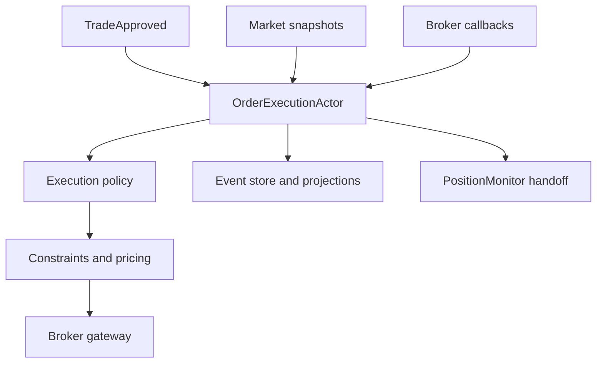

# Order Execution Workflow Specification

**Document version:** 1.0  
**Status:** Implementation specification  
**Target runtime:** .NET 10 or later  
**Primary strategy scope:** ES futures-option multi-leg combination orders  
**V1 order type:** Single multi-leg limit order  
**Architecture:** Actor model, event sourcing, deterministic runtime decisions  
**Serialization:** Versioned MessagePack contracts  
**Last updated:** 2026-08-02

---

## 1. Purpose

This document specifies a complete order-execution subsystem for the deterministic trading platform. It is intended to be sufficiently precise for phased code generation by Codex and subsequent implementation, review, simulation, paper trading, and controlled live deployment.

The immediate V1 requirement is a safe deterministic workflow from an approved trade through submission, acknowledgement, repricing, cancellation, fill handling, reconciliation, compensation, and final handoff to position monitoring.

The same contracts must later support:

- shadow execution policies;
- Markov Decision Process data capture;
- offline policy training and evaluation;
- deterministic deployment of a frozen learned policy;
- controlled fallback to the baseline deterministic policy.

The production system must never learn online, invent arbitrary order parameters, bypass risk constraints, or submit an order directly from a statistical model.

---

## 2. Executive Architecture Decision

Order execution shall be implemented as a **constrained sequential decision workflow**.

The `OrderExecutionActor` owns the operational lifecycle. A pure `IExecutionPolicy` selects one action from an explicitly permitted action set. Deterministic constraint and price services validate and translate that action into an exact broker operation.

For V1:

- the active policy is deterministic and rule-based;
- all order prices and quantities are computed by deterministic code;
- only limit orders are permitted;
- a missed trade is preferable to a trade whose approved edge has disappeared;
- the actor must reconcile unknown broker state before sending another mutation;
- partial or unbalanced exposure is handled by a deterministic compensation policy;
- every observation, decision, action, broker update, and result is persisted;
- the workflow is replayable and produces identical decisions from identical inputs.

For later versions:

- alternative policies may run in shadow mode;
- an MDP may be trained offline from recorded episodes and simulation;
- only a frozen, versioned, validated policy artifact may become active;
- hard constraints, compensation logic, and final risk authority remain deterministic.

---

## 3. Delivery Phases

### 3.1 Required V1 phases

| Phase | Name | Required outcome |
|---|---|---|
| 1 | Domain foundation and safety envelope | Immutable contracts, identifiers, state model, action model, invariants, and component boundaries |
| 2 | Deterministic execution workflow | Submission, acknowledgement, wait, bounded repricing, cancellation, completion, and position handoff |
| 3 | Reconciliation and compensation | Partial fills, late fills, ambiguous broker state, disconnects, restart recovery, and bounded exposure neutralization |
| 4 | Persistence, replay, observability, and acceptance | Event persistence, Scylla projections, deterministic replay, metrics, operational UI, test harness, and V1 acceptance gates |

Phases 1 through 4 are a single V1 release boundary. The system is not production-ready if any of them is missing.

### 3.2 Post-V1 phases

| Phase | Name | Required outcome |
|---|---|---|
| 5 | Shadow policy framework | Multiple policies evaluate the same state; only the primary policy can act |
| 6 | MDP dataset and execution simulator | Versioned transition dataset, action masks, reward components, and realistic replay/simulation |
| 7 | Offline training and validation | Walk-forward training, off-policy evaluation, stress testing, and policy artifact creation |
| 8 | Controlled policy promotion | Shadow, paper-active, restricted-live, active, rollback, and drift-monitoring lifecycle |
| 9 | Advanced execution extensions | Optional venue routing, additional order shapes, portfolio-aware execution, and other explicitly approved capabilities |

No post-V1 phase may weaken or replace a V1 safety invariant.

---

## 4. Scope

### 4.1 Included in V1

- Execution of a risk-approved ES futures-option combination order.
- One broker order representing the complete approved multi-leg structure.
- Limit orders only.
- Fresh-market validation before initial submission.
- A deterministic passive-to-aggressive price ladder.
- Bounded wait, modify, cancel, and reconciliation behavior.
- Whole-combo fills, balanced partial-combo fills, and unbalanced leg exposure.
- Late fills received during or after cancellation.
- Broker rejection, acknowledgement timeout, disconnect, reconnect, and process restart.
- Preauthorized operational compensation using bounded limit prices.
- Event-sourced state and a denormalized execution-attempt projection.
- Position-monitor ownership handoff after confirmed fill.
- Manual cancellation, pause, reconciliation, and intervention workflows.
- Deterministic replay and simulation hooks.

### 4.2 Explicitly excluded from V1

- Market orders.
- Unbounded order chasing.
- Strategic delta hedging.
- Autonomous legging into a desired strategy.
- Changing the candidate's strikes, maturity, ratios, side, or approved maximum quantity.
- Increasing risk after approval.
- Online reinforcement learning.
- Random exploration in a live account.
- LLM participation in the execution path.
- A model generating an exact price, quantity, timeout, or compensation order.
- Starting another execution attempt while broker exposure is unknown.
- Treating broker cancellation acknowledgement as proof that no late fill can exist.

Operational completion or neutralization of accidental partial exposure is not considered strategic hedging. It is mandatory risk containment.

---

## 5. Core Principles

1. **Preserve edge, not fill rate.** The system must not chase a fill after the approved economics have disappeared.
2. **The broker is the execution truth.** Internal state is authoritative for workflow intent; broker orders, fills, executions, and positions are authoritative for actual exposure.
3. **Unknown means unsafe.** Unknown order or exposure state immediately blocks new submissions for the affected account and instrument scope until reconciliation.
4. **One owner.** The execution actor owns the attempt and any resulting exposure until position monitoring acknowledges ownership.
5. **Pure policy.** The policy cannot read clocks, network services, caches, databases, or broker APIs. All required facts are supplied in an immutable decision state.
6. **Constraints precede action.** The policy can choose only from an action mask built by deterministic constraints.
7. **Exact parameters remain deterministic.** A selected action such as `RepriceOneTick` is converted to an exact tick-aligned price by deterministic code.
8. **At-least-once delivery is expected.** Commands and broker updates must be idempotent; exactly-once delivery must not be assumed.
9. **No blind retry.** A timed-out submit, modify, or cancel is reconciled before another broker mutation.
10. **Replayability.** Identical ordered inputs and configuration versions must produce identical decisions and domain events.
11. **Version everything that affects a decision.** State schema, policy, constraints, reward, market-data rules, price calculation, and serialization schemas are versioned.
12. **Fail safe.** When information required to establish safety is unavailable, the only automatic actions are cancel, reconcile, compensate under a preapproved envelope, or escalate.

---

## 6. Terminology

| Term | Definition |
|---|---|
| Execution attempt | One lifecycle beginning with an approved trade and ending in one terminal execution result |
| Combo unit | One complete set of strategy legs in the approved ratios |
| Balanced partial fill | Fewer combo units than ordered were filled, but every filled unit contains the complete approved leg ratio |
| Unbalanced exposure | Filled legs do not currently match an integer number of approved combo units |
| Execution envelope | Immutable constraints approved before execution, including quantity, price, slippage, timing, and compensation boundaries |
| Reservation price | The worst entry price the workflow is permitted to accept |
| Edge remaining | Deterministically recalculated economic advantage remaining at a proposed executable price after costs and safety buffers |
| Reconciliation | Comparison of internal intent against broker open orders, executions, fills, and positions |
| Compensation | Operational completion or neutralization of accidental exposure using preapproved rules |
| Behavior policy | Policy that selected the action actually applied during an episode |
| Shadow policy | Policy that evaluates the same decision state but cannot cause a broker operation |
| Action mask | Set of actions currently permitted by workflow state and deterministic constraints |
| Terminal result | Final outcome that prevents any further normal action for the execution attempt |

---

## 7. System Context



### 7.1 Upstream dependencies

- `TradeStrategyWorkflowActor` or equivalent orchestration component.
- `PortfolioRiskActor`, which emits the final `TradeApproved` result.
- `CandidateBuilderActor`, which supplies the approved strategy structure and deterministic economic reference values.
- Market-data services providing fresh underlying, leg, and combination-order observations.
- Account and broker-session services providing connectivity and trading-state facts.

### 7.2 Downstream dependencies

- IBKR broker adapter through `IBrokerOrderGateway`.
- PostgreSQL event store for authoritative execution-domain events.
- ScyllaDB `ExecutionAttemptLog` projection for operational history and analysis.
- `PositionMonitorActor` for an established position.
- OpenTelemetry logs, metrics, and traces.
- Operational UI execution grid and detail pane.

---

# Part I — Required V1 Implementation

## 8. Phase 1: Domain Foundation and Safety Envelope

### 8.1 Component responsibilities

#### `OrderExecutionActor`

The actor shall:

- process one message at a time;
- own all mutable state for its active execution attempts;
- apply persisted events to rebuild state;
- request immutable market snapshots;
- construct decision states;
- request the permitted action mask;
- call the active execution policy;
- validate and apply the selected action;
- send idempotent broker operations;
- schedule and reject stale timers;
- initiate reconciliation and compensation;
- persist events before exposing downstream state transitions;
- coordinate final handoff to position monitoring.

The actor shall not perform broker work on a dedicated market-data thread. Broker callbacks must be converted into immutable actor messages and processed sequentially.

#### `IExecutionPolicy`

The policy shall:

- be a pure deterministic function;
- return exactly one proposed action and reason;
- select only an action present in the supplied action mask;
- have no broker, database, cache, time, random, file, or network dependency;
- be independently replayable and unit-testable.

#### `IExecutionConstraintEvaluator`

The constraint evaluator shall:

- build the action mask;
- enforce the execution envelope;
- reject invalid market state;
- evaluate hard price, quantity, freshness, time, exposure, and connectivity constraints;
- be authoritative over the policy.

#### `IExecutionPriceCalculator`

The price calculator shall:

- calculate the initial price and all permitted ladder prices;
- use the instrument's valid tick size;
- preserve debit/credit semantics;
- prevent a price worse than the reservation price;
- return both a domain price and broker-adapter representation;
- never use raw floating-point equality.

#### `IExecutionEconomicsEvaluator`

The economics evaluator shall:

- recalculate expected edge from a coherent market snapshot;
- include estimated commissions, exchange fees, slippage allowance, and safety buffer;
- determine whether a proposed price retains minimum approved edge;
- evaluate adverse underlying and strategy-value movement;
- return deterministic component values suitable for logging.

#### `IExecutionCompensationPolicy`

The compensation policy shall:

- be deterministic and separate from the normal execution policy;
- classify observed exposure as none, balanced, or unbalanced;
- select only preauthorized completion or neutralization actions;
- enforce compensation time and price bounds;
- escalate when safe automatic containment cannot be established.

#### `IBrokerOrderGateway`

The gateway shall:

- translate domain orders into IBKR-specific requests;
- map IBKR callbacks into broker-neutral messages;
- preserve stable client and broker correlation identifiers;
- support submit, modify, cancel, open-order query, execution/fill query, and position query;
- expose connectivity and session epochs;
- never contain strategy or policy decisions.

### 8.2 Identifier model

Every execution-related record must carry enough identity for idempotency and auditability.

```csharp
public readonly record struct ExecutionAttemptId(Guid Value);
public readonly record struct TradeCandidateId(Guid Value);
public readonly record struct RiskApprovalId(Guid Value);
public readonly record struct BrokerSessionId(Guid Value);
public readonly record struct BrokerOrderKey(string Value);
public readonly record struct BrokerExecutionKey(string Value);
public readonly record struct DecisionId(Guid Value);
public readonly record struct OperationId(Guid Value);
```

Required envelope metadata:

```csharp
public readonly record struct MessageIdentity(
    Guid MessageId,
    Guid CorrelationId,
    Guid CausationId,
    long SequenceNumber,
    int SchemaVersion);
```

Rules:

- `ExecutionAttemptId` is created once and never reused.
- One `RiskApprovalId` may authorize only the explicitly stated execution attempt or a defined idempotent retry of that same attempt.
- Client order references must contain or map durably to `ExecutionAttemptId` and `OperationId`.
- Each broker mutation receives a new `OperationId`.
- A submit timeout never creates a new execution attempt.
- Duplicate commands and duplicate broker updates must be detected and ignored after idempotent acknowledgement.

### 8.3 Price representation

Debit and credit semantics must never be inferred from the sign conventions of a broker API.

```csharp
public enum OrderCashFlow : byte
{
    Debit = 1,
    Credit = 2
}

public readonly record struct MoneyPrice(
    decimal Magnitude,
    string Currency);

public readonly record struct ComboLimitPrice(
    OrderCashFlow CashFlow,
    MoneyPrice Price);
```

Domain rules:

- `Magnitude` is non-negative.
- For a debit entry, a lower price is better and repricing toward the market increases the debit.
- For a credit entry, a higher price is better and repricing toward the market decreases the credit.
- The cash-flow direction cannot change during an attempt.
- If the observable market changes from the approved cash-flow direction to the opposite direction, normal execution must cancel and reconcile.
- The broker adapter alone translates the domain representation into the broker's signed limit-price convention.
- Actual implementation may substitute the platform's existing fixed-point `Price` value type, but the debit/credit separation and comparison semantics are mandatory.

Required comparison operations:

```csharp
public interface IExecutionPriceSemantics
{
    bool IsBetterThan(in ComboLimitPrice left, in ComboLimitPrice right);
    bool IsNoWorseThan(in ComboLimitPrice price, in ComboLimitPrice reservationPrice);
    decimal SlippageFrom(in ComboLimitPrice referencePrice, in ComboLimitPrice price);
}
```

### 8.4 Approved strategy structure

The execution actor receives an immutable approved order structure. It may not change it.

```csharp
public readonly record struct ApprovedComboLeg(
    long InstrumentId,
    OptionRight Right,
    OrderSide Side,
    int Ratio,
    decimal Strike,
    DateOnly Expiration);

public sealed record ApprovedComboStructure(
    IReadOnlyList<ApprovedComboLeg> Legs,
    int ApprovedComboQuantity,
    int MinimumAcceptableComboQuantity,
    string ExchangeRoutingProfile,
    string AccountId);
```

Validation requirements:

- All ratios are positive integers.
- The leg collection is non-empty and matches the approved candidate hash.
- Quantity is positive and does not exceed risk approval.
- Expiry and instruments are tradeable for the current broker session.
- No duplicate semantic leg exists unless explicitly supported by the candidate schema.
- The structure hash is persisted and compared before every submission or compensation completion.

### 8.5 Execution envelope

The risk approval must contain or reference an immutable execution envelope.

```csharp
public sealed record ExecutionEnvelope(
    int SchemaVersion,
    string ConstraintProfile,
    ComboLimitPrice InitialLimitPrice,
    ComboLimitPrice ReservationPrice,
    decimal MinimumEdgePerCombo,
    decimal MaximumEntrySlippagePerCombo,
    decimal MaximumCompensationSlippagePerCombo,
    decimal MaximumAdverseUnderlyingMove,
    decimal MaximumAdverseStrategyValueMove,
    TimeSpan MaximumMarketDataAge,
    TimeSpan PassiveWaitDuration,
    TimeSpan RepriceInterval,
    TimeSpan MaximumExecutionDuration,
    TimeSpan SubmissionAcknowledgementTimeout,
    TimeSpan ModifyAcknowledgementTimeout,
    TimeSpan CancelAcknowledgementTimeout,
    TimeSpan ReconciliationTimeout,
    TimeSpan MaximumUnbalancedExposureDuration,
    int MaximumRepriceCount,
    int RepriceIncrementTicks,
    bool AcceptBalancedPartialQuantity,
    bool PermitEmergencyComboCompletion,
    bool PermitEmergencyFlattening,
    int PriceAlgorithmVersion,
    int EconomicsAlgorithmVersion,
    int CompensationProfileVersion);
```

Envelope rules:

- All durations must be positive except an explicitly disabled optional interval.
- The initial price must be no worse than the reservation price.
- Maximum execution duration is a hard deadline, not a suggestion.
- Maximum reprice count cannot be exceeded even if time remains.
- A reprice cannot consume more than the remaining slippage budget.
- Compensation boundaries are separate from normal-entry boundaries.
- Compensation permission preauthorizes containment only; it does not authorize increasing the original position.
- The envelope is hashed and included with `ExecutionAttemptStarted`.
- Updating an envelope requires a new risk approval and a new execution attempt unless the original attempt is confirmed to have no exposure and is terminal.

### 8.6 Workflow state

```csharp
public enum ExecutionStatus : byte
{
    Created = 0,
    AwaitingFreshMarket = 1,
    ReadyToSubmit = 2,
    SubmissionPending = 3,
    Working = 4,
    ModifyPending = 5,
    BalancedPartialFill = 6,
    UnbalancedExposure = 7,
    CancelPending = 8,
    Reconciling = 9,
    Compensating = 10,
    AwaitingPositionMonitor = 11,
    Filled = 20,
    CancelledWithoutFill = 21,
    PartialFillNeutralized = 22,
    Rejected = 23,
    Failed = 24,
    ManualInterventionRequired = 25
}
```

Terminal statuses are `Filled`, `CancelledWithoutFill`, `PartialFillNeutralized`, `Rejected`, `Failed`, and `ManualInterventionRequired`. A terminal status cannot return to a non-terminal status. Discovery of a late fill after a terminal status creates a high-severity reconciliation incident associated with the original attempt; it must not silently reopen normal execution.

Minimum aggregate state:

```csharp
public sealed record ExecutionAttemptState(
    ExecutionAttemptId AttemptId,
    TradeCandidateId CandidateId,
    RiskApprovalId RiskApprovalId,
    ExecutionStatus Status,
    ApprovedComboStructure Structure,
    ExecutionEnvelope Envelope,
    BrokerSessionId BrokerSessionId,
    BrokerOrderKey? ActiveBrokerOrder,
    long DomainEventSequence,
    long DecisionSequence,
    int RequestedComboQuantity,
    int BalancedFilledComboQuantity,
    IReadOnlyDictionary<long, int> FilledLegQuantities,
    ComboLimitPrice? CurrentLimitPrice,
    int RepriceCount,
    DateTimeOffset CreatedAtUtc,
    DateTimeOffset HardDeadlineUtc,
    bool ExposureIsKnown,
    bool PositionMonitorAcknowledged,
    string ActivePolicyName,
    int ActivePolicyVersion);
```

Production state should use immutable or actor-owned collections. Mutable collections must never escape the actor boundary.

### 8.7 Decision state

The decision state is a normalized, immutable snapshot constructed immediately before policy evaluation.

```csharp
public readonly record struct ExecutionDecisionState(
    int StateSchemaVersion,
    ExecutionAttemptId AttemptId,
    long DecisionSequence,
    ExecutionStatus Status,
    OrderCashFlow CashFlow,
    int RequestedComboQuantity,
    int BalancedFilledComboQuantity,
    bool HasUnbalancedExposure,
    bool ExposureIsKnown,
    bool BrokerConnected,
    bool MarketDataFresh,
    long MarketSnapshotVersion,
    TimeSpan MarketDataAge,
    TimeSpan ElapsedSinceSubmission,
    TimeSpan TimeSinceLastBrokerMutation,
    TimeSpan RemainingExecutionTime,
    int RepriceCount,
    int RemainingReprices,
    ComboLimitPrice CurrentLimitPrice,
    ComboLimitPrice CurrentMidPrice,
    ComboLimitPrice CurrentNaturalPrice,
    ComboLimitPrice ReservationPrice,
    decimal SpreadWidth,
    decimal EntrySlippageUsed,
    decimal RemainingSlippageBudget,
    decimal ExpectedEdgePerCombo,
    decimal UnderlyingMoveFromApproval,
    decimal AdverseUnderlyingMove,
    decimal StrategyValueMoveFromApproval,
    decimal AdverseStrategyValueMove,
    ExecutionActionMask PermittedActions);
```

State construction requirements:

- All price observations must originate from one coherent market snapshot.
- Snapshot age and source sequence must be recorded.
- Elapsed durations use a monotonic clock while the process is running.
- Wall-clock timestamps are retained for persistence and restart reconstruction.
- No policy input may be loaded lazily during evaluation.
- Missing required data must be represented explicitly and normally restrict the action mask to cancel, reconcile, compensate, or escalate.

### 8.8 Action model

```csharp
[Flags]
public enum ExecutionActionMask : ushort
{
    None = 0,
    Wait = 1 << 0,
    Submit = 1 << 1,
    RepriceOneTick = 1 << 2,
    RepriceToMidpoint = 1 << 3,
    Cancel = 1 << 4,
    ReconcileBrokerState = 1 << 5,
    AcceptBalancedPartialFill = 1 << 6,
    CompletePartialExposure = 1 << 7,
    NeutralizePartialExposure = 1 << 8,
    EscalateForManualIntervention = 1 << 9
}

public enum ExecutionAction : byte
{
    Wait = 1,
    Submit = 2,
    RepriceOneTick = 3,
    RepriceToMidpoint = 4,
    Cancel = 5,
    ReconcileBrokerState = 6,
    AcceptBalancedPartialFill = 7,
    CompletePartialExposure = 8,
    NeutralizePartialExposure = 9,
    EscalateForManualIntervention = 10
}
```

The production implementation may use a compact value type instead of flags, but every policy evaluation must log the complete permitted action set.

### 8.9 Decision result

```csharp
public readonly record struct ExecutionDecision(
    DecisionId DecisionId,
    long DecisionSequence,
    string PolicyName,
    int PolicyVersion,
    ExecutionAction ProposedAction,
    ExecutionAction AppliedAction,
    ExecutionDecisionReason Reason,
    ExecutionActionMask PermittedActions,
    decimal ExpectedEdgePerCombo,
    decimal RemainingSlippageBudget,
    bool WasConstrained,
    int ConstraintProfileVersion,
    int StateSchemaVersion);
```

If a policy returns an action outside the mask:

1. do not invoke the broker;
2. record `PolicyActionRejected`;
3. apply the deterministic safe fallback action;
4. raise a policy-defect alert;
5. disable that policy version for new attempts.

### 8.10 Commands and internal messages

| Message | Producer | Purpose |
|---|---|---|
| `ExecuteApprovedTrade` | Strategy workflow | Starts one idempotent attempt from a final risk approval |
| `MarketExecutionStateChanged` | Market-data bridge | Signals a material decision-state change |
| `BrokerOrderUpdateReceived` | Broker adapter | Carries acknowledgement, working, modified, cancelled, rejected, or other order status |
| `BrokerFillReceived` | Broker adapter | Carries a broker execution/fill report |
| `ExecutionTimerExpired` | Scheduler | Triggers acknowledgement, reprice, hard-deadline, reconciliation, or compensation deadline handling |
| `ReconcileExecutionRequested` | Actor, operator, or recovery service | Starts broker truth reconciliation |
| `CancelExecutionRequested` | Strategy workflow or operator | Requests bounded cancellation; does not assume zero exposure |
| `ResumeRecoveredExecution` | Recovery service | Rehydrates an active attempt and forces reconciliation before action |
| `PositionMonitoringStarted` | Position monitor | Acknowledges durable ownership of the filled position |

Every command must include message identity, attempt identity, and expected aggregate version where applicable.

### 8.11 Authoritative domain events

At minimum, implement these versioned events:

- `ExecutionAttemptStarted`
- `FreshMarketSnapshotAccepted`
- `ExecutionDecisionMade`
- `OrderSubmissionRequested`
- `OrderAcknowledged`
- `OrderWorking`
- `OrderModificationRequested`
- `OrderModificationAcknowledged`
- `OrderCancellationRequested`
- `OrderCancellationAcknowledged`
- `BrokerFillApplied`
- `BalancedPartialFillDetected`
- `UnbalancedExposureDetected`
- `ReconciliationStarted`
- `ReconciliationCompleted`
- `CompensationStarted`
- `CompensationOrderRequested`
- `CompensationCompleted`
- `ExecutionFilled`
- `ExecutionCancelledWithoutFill`
- `ExecutionPartialFillNeutralized`
- `ExecutionRejected`
- `ExecutionFailed`
- `ManualInterventionRequired`
- `PositionMonitoringRequested`
- `PositionMonitoringOwnershipAccepted`
- `ExecutionOwnershipReleased`
- `PolicyActionRejected`
- `LateFillIncidentDetected`

Each event must contain:

- schema version;
- event ID;
- aggregate ID;
- aggregate sequence;
- correlation and causation IDs;
- UTC event time;
- relevant broker session and order identifiers;
- policy, state-schema, constraint, price-algorithm, and economics-algorithm versions when a decision is involved.

### 8.12 Event-sourcing and idempotency rules

- Persist domain intent before sending an externally visible broker mutation when the gateway protocol supports safe recovery from the persisted operation ID.
- Persist the broker result after applying it idempotently.
- Maintain a bounded durable set or sequence-aware index of applied broker execution IDs.
- A broker fill is applied exactly once at the domain level even if delivered repeatedly.
- An order-status update older than an already-confirmed state may be recorded as telemetry but must not regress aggregate state.
- Conflicting broker observations force reconciliation.
- Optimistic concurrency conflicts cause aggregate reload and message re-evaluation; they do not cause blind broker retries.
- Event serialization uses versioned MessagePack contracts. Never reuse removed field identifiers for a different meaning.

### 8.13 Non-negotiable invariants

1. Only a final, unexpired risk approval can start an attempt.
2. An attempt submits at most the approved combo quantity.
3. No normal order price may be worse than the reservation price.
4. No normal order may exceed the maximum entry-slippage budget.
5. No new submit occurs while another order for the attempt may still be live.
6. No replacement occurs until the prior broker mutation is acknowledged or reconciled.
7. The cash-flow direction, legs, ratios, expiry, and strikes are immutable.
8. A fill can never be discarded because it arrived after a cancel request.
9. Unknown exposure blocks new execution for the affected account and scope.
10. Unbalanced exposure always has higher decision priority than normal entry execution.
11. Compensation cannot increase exposure beyond completion of the originally approved combo quantity.
12. A terminal attempt never resumes normal execution.
13. Position ownership is released only after `PositionMonitorActor` acknowledges durable monitoring.
14. No learned policy can bypass the action mask, price calculator, compensation policy, or risk rules.
15. No online policy or reward update occurs in the production process.

---

## 9. Phase 2: Deterministic Execution Workflow

### 9.1 Start conditions

On `ExecuteApprovedTrade`, the actor shall:

1. Deduplicate the command.
2. Validate risk-approval identity, scope, expiry, account, quantity, candidate hash, and execution envelope.
3. Confirm that no conflicting active attempt exists for the candidate.
4. Confirm that the broker session is connected and trading is permitted.
5. Create and persist `ExecutionAttemptStarted`.
6. Enter `AwaitingFreshMarket`.
7. Obtain a coherent market snapshot no older than `MaximumMarketDataAge`.
8. Recalculate current edge and envelope compliance.
9. Cancel without submission if the trade is no longer valid.
10. Otherwise build the first decision state and evaluate the deterministic policy.

Risk approval must not be interpreted as an instruction to submit regardless of current market conditions. It authorizes submission only while the envelope remains valid.

### 9.2 Material reevaluation triggers

Policy evaluation occurs only after a material event:

- initial fresh-market snapshot;
- broker acknowledgement or status change;
- fill or partial fill;
- combination quote changes by at least a configured tick threshold;
- underlying movement changes the adverse-move bucket or breaches a hard limit;
- expected edge crosses a configured threshold;
- market data becomes stale or fresh again;
- reprice timer expires;
- acknowledgement or hard deadline expires;
- broker connectivity changes;
- reconciliation completes;
- operator requests a permitted action.

High-frequency quote events may be coalesced before entering the actor mailbox, but a hard-limit breach must not be dropped. Coalescing rules must be deterministic and measured.

### 9.3 Decision priority

The V1 policy and constraint evaluator must apply this priority order:

1. **Unbalanced or unknown exposure:** reconcile, compensate, or escalate.
2. **Confirmed complete fill:** finalize and hand off to position monitoring.
3. **Broker state uncertain:** reconcile; do not submit, modify, or assume cancellation.
4. **Connectivity or market-data safety failure:** cancel if a live order may exist, then reconcile.
5. **Hard envelope breach:** cancel immediately.
6. **Hard execution deadline:** cancel immediately.
7. **Balanced partial fill:** cancel remaining quantity, reconcile, then accept or neutralize according to the envelope.
8. **Pending broker mutation:** wait for acknowledgement until its timeout, then reconcile.
9. **Eligible reprice point:** recalculate economics, validate the next price, then reprice or cancel.
10. **Normal working state:** wait.

Lower-priority logic must never override a higher-priority condition.

### 9.4 Baseline deterministic policy

```csharp
public sealed class BaselineExecutionPolicy : IExecutionPolicy
{
    public ExecutionDecision Evaluate(
        in ExecutionDecisionState state,
        in ExecutionPolicyContext context);
}
```

The implementation must be a pure function. `ExecutionPolicyContext` contains only immutable version information and deterministic thresholds not already embedded in state.

Normative behavior:

```text
IF unbalanced exposure OR exposure unknown
    select ReconcileBrokerState, CompletePartialExposure,
    NeutralizePartialExposure, or Escalate according to the action mask
ELSE IF status permits initial submission
    select Submit only if fresh, connected, within time, and edge is sufficient
ELSE IF a broker mutation is pending
    select Wait unless its acknowledgement timeout requires reconciliation
ELSE IF hard deadline, stale data, adverse move, edge, price, or slippage limit is breached
    select Cancel
ELSE IF balanced partial fill exists
    select Cancel until remaining order state is reconciled
ELSE IF reprice interval has elapsed AND a valid next ladder price exists
    select RepriceOneTick
ELSE
    select Wait
```

`RepriceToMidpoint` may be enabled by a versioned deterministic profile, but V1 should begin with one-tick ladder movement because it is easier to reason about, replay, and constrain.

### 9.5 Initial price

The initial price is selected as follows:

1. Start with `ExecutionEnvelope.InitialLimitPrice`.
2. Validate the price against the current coherent combo quote.
3. Snap to the valid combo tick using a side-aware rule that never makes the price more aggressive than intended.
4. Verify that it is no worse than the reservation price.
5. Recalculate expected edge at the snapped price.
6. Verify that minimum edge and slippage constraints remain satisfied.
7. Persist the decision and exact normalized price before submission.

If any check fails, do not submit.

### 9.6 Reprice ladder

The ladder is deterministic:

- Each normal step moves `RepriceIncrementTicks` toward the market.
- For a debit, moving toward the market increases the debit.
- For a credit, moving toward the market decreases the credit.
- The new price must differ from the active broker price after tick normalization.
- The new price must remain no worse than the reservation price.
- Repricing must not exceed `MaximumRepriceCount`.
- Repricing must not occur more frequently than `RepriceInterval`.
- Economics are recalculated using a fresh coherent snapshot immediately before each modification.
- A reprice that would violate edge or slippage constraints becomes `Cancel`, not `Wait`.
- Reprice counters increase only when a broker modification is acknowledged or reconciliation confirms the new working price.

The system must not repeatedly modify an order at the same normalized price.

### 9.7 Submission protocol

1. Persist `OrderSubmissionRequested` with an `OperationId` and normalized order payload hash.
2. Send the broker request once using a stable client reference.
3. Enter `SubmissionPending`.
4. Start an acknowledgement timer carrying the attempt ID, operation ID, decision sequence, and expected state.
5. On acknowledgement, persist `OrderAcknowledged` and enter `Working`.
6. On rejection, persist the complete normalized reason and enter `Rejected` unless broker ambiguity requires reconciliation.
7. On timeout, do not resubmit. Enter `Reconciling` and query broker truth.

### 9.8 Modify protocol

1. Build and validate the next exact price.
2. Persist `OrderModificationRequested` with a new `OperationId`.
3. Send the broker modification through the gateway.
4. Enter `ModifyPending`.
5. On acknowledgement, persist the effective working price and increment the confirmed reprice count.
6. On timeout or conflicting update, reconcile before further action.
7. Apply all fills received while modification is pending before considering another modification.

The adapter may implement broker-specific modify semantics, but the domain must observe a single logical working order unless reconciliation proves otherwise.

### 9.9 Cancellation protocol

1. Persist `OrderCancellationRequested` with a new `OperationId` and reason.
2. Send cancel once.
3. Enter `CancelPending`.
4. Continue accepting and applying fills.
5. On cancellation acknowledgement, enter `Reconciling`; cancellation acknowledgement alone is not terminal proof.
6. Query or otherwise confirm final order, execution, fill, and position state.
7. End as:
   - `CancelledWithoutFill` when zero exposure is confirmed;
   - fill processing when complete exposure exists;
   - partial-fill processing when balanced or unbalanced exposure exists;
   - `ManualInterventionRequired` when truth cannot be established within bounded recovery rules.

### 9.10 Hard cancellation conditions

Cancel the normal entry order when any of the following is true:

- maximum execution duration expired;
- market data is stale beyond the envelope;
- broker connectivity is lost while an order may be working;
- expected edge is below `MinimumEdgePerCombo`;
- entry price would be worse than the reservation price;
- maximum entry slippage is exhausted;
- adverse underlying move exceeds its limit;
- adverse strategy-value move exceeds its limit;
- approved cash-flow direction is no longer consistent with the observable market;
- candidate instruments become untradeable, halted, expired, or invalid;
- account, margin, or kill-switch state disallows continued entry;
- the action or price calculator reports an invariant violation.

### 9.11 Fill processing

Every fill is processed in this order:

1. Deduplicate by broker execution identity and session.
2. Validate that the fill belongs to the attempt or classify it as an incident.
3. Persist the raw normalized fill facts.
4. Update cumulative quantities and cash flow.
5. Reconstruct leg-ratio exposure.
6. Classify exposure as none, balanced partial, balanced complete, overfilled, or unbalanced.
7. Reevaluate workflow priority immediately.

An overfill is an invariant breach and must enter compensation/reconciliation with a critical alert.

### 9.12 Complete fill and position handoff

When a complete approved position is confirmed:

1. Cancel or reconcile any remaining broker order state.
2. Calculate the authoritative execution summary from broker fills.
3. Persist `ExecutionFilled`.
4. Emit `PositionMonitoringRequested` containing the filled structure, quantities, prices, commissions known so far, and execution correlation IDs.
5. Enter `AwaitingPositionMonitor`.
6. Require `PositionMonitoringStarted` from the position monitor after its state is durably established.
7. Persist `ExecutionOwnershipReleased` and enter terminal `Filled`.

Until step 6, the execution actor remains responsible for raising alerts about broker exposure. It must not submit normal entry modifications after a complete fill.

Immediate market movement after confirmed handoff is a position-management concern. The execution subsystem continues to collect post-fill measurements for reward and quality analysis but cannot autonomously reopen the entry workflow.

---

## 10. Phase 3: Reconciliation, Recovery, and Compensation

### 10.1 Exposure classification

```csharp
public enum ExposureClassification : byte
{
    Unknown = 0,
    None = 1,
    BalancedPartialCombo = 2,
    BalancedCompleteCombo = 3,
    UnbalancedLegs = 4,
    Overfilled = 5,
    ConflictingBrokerEvidence = 6
}
```

Classification must use actual leg fills and current broker positions, not only the parent order's status text.

### 10.2 Reconciliation triggers

Reconciliation is mandatory after:

- submission acknowledgement timeout;
- modify acknowledgement timeout;
- cancellation acknowledgement or timeout;
- broker disconnect or session epoch change;
- process restart with a non-terminal attempt;
- an unknown order identifier;
- a duplicate or conflicting execution report;
- a late fill;
- an overfill;
- an out-of-order status transition that conflicts with applied fills;
- an operator request;
- any state where internal quantity differs from broker-observed quantity.

### 10.3 Reconciliation algorithm

1. Persist `ReconciliationStarted` and freeze normal broker mutations.
2. Capture the current broker-session epoch.
3. Query open orders for the account and execution reference.
4. Query recent executions and fills from a safe lookback boundary.
5. Query current positions for all approved legs.
6. Correlate results using broker order ID, permanent ID when available, client reference, execution ID, account, instrument, side, and time window.
7. Deduplicate and reconstruct actual leg quantities and cash flows.
8. Compare broker truth, event-sourced internal state, and expected operation state.
9. Persist `ReconciliationCompleted` with normalized evidence hashes and classification.
10. Rebuild the action mask and continue only if the result is coherent.

If the broker session changes during the query sequence, discard the result and retry within the bounded reconciliation policy.

No reconciliation code may infer zero exposure merely because an order is absent from the open-order list.

### 10.4 Restart recovery

At process or actor-system startup:

1. Load all non-terminal execution aggregates from the event store.
2. Do not resume timers or send broker mutations immediately.
3. Establish a broker session and current account state.
4. Reconcile each active attempt.
5. Reconstruct monotonic deadlines from persisted UTC boundaries, treating already-expired deadlines as expired.
6. Apply fills discovered during downtime.
7. Continue normal execution only when order and exposure truth are coherent and the envelope is still valid.
8. Otherwise cancel, compensate, or escalate.

### 10.5 Balanced partial-combo fill

A balanced partial fill contains complete approved leg ratios for fewer combo units than requested.

Required behavior:

1. Cancel the unfilled remainder.
2. Reconcile the final filled quantity.
3. If `AcceptBalancedPartialQuantity` is true and filled quantity is at least `MinimumAcceptableComboQuantity`, accept the smaller position.
4. Emit position-monitor handoff using the actual filled quantity.
5. If the quantity is below the approved minimum or partial acceptance is disabled, close the balanced combo units using the compensation envelope.
6. Do not submit a new normal order to restore the original requested quantity without a new risk approval.

### 10.6 Unbalanced leg exposure

Unbalanced exposure is a critical operational state.

Required sequence:

1. Persist `UnbalancedExposureDetected` immediately.
2. Cancel every remaining normal order associated with the attempt.
3. Mark the account/instrument execution scope as blocked for new entries.
4. Reconcile leg quantities and working orders.
5. Start the maximum-unbalanced-exposure timer.
6. Invoke `IExecutionCompensationPolicy` with the confirmed exposure and preapproved compensation envelope.
7. Complete missing legs or flatten filled legs according to the deterministic matrix.
8. Use bounded marketable limit prices only; market orders remain prohibited in V1.
9. Reconcile after every compensation mutation.
10. Release the execution block only after exposure is confirmed balanced and handed off, or confirmed flat.

### 10.7 Deterministic compensation matrix

| Observed condition | Permitted response | Terminal direction |
|---|---|---|
| No filled exposure | Confirm cancellation | `CancelledWithoutFill` |
| Balanced full approved quantity | Cancel remainder if any, then hand off | `Filled` |
| Balanced acceptable partial quantity | Cancel remainder, accept smaller position | `Filled` |
| Balanced unacceptable partial quantity | Close filled combo units with bounded limits | `PartialFillNeutralized` |
| Unbalanced legs and safe completion is permitted | Buy/sell only missing ratio quantities up to the approved combo quantity | `Filled` or further reconcile |
| Unbalanced legs and completion is unsafe or not permitted | Flatten the filled legs with bounded limits | `PartialFillNeutralized` |
| Overfill | Flatten excess first; never increase other legs merely to legitimize excess without explicit rules | Reconcile, then filled or neutralized |
| Conflicting or unknown evidence | Reconcile; perform no speculative mutation | Escalate if unresolved |
| Compensation limit cannot be met before deadline | Escalate with continuous high-severity alert | `ManualInterventionRequired` |

Safe completion may be chosen only when all are true:

- explicitly permitted by the envelope;
- it cannot exceed the originally approved combo quantity;
- all required market data is fresh;
- the completion price is inside compensation bounds;
- completion produces the exact approved leg ratios;
- account and broker connectivity are coherent;
- deterministic worst-case exposure comparison favors completion over flattening under the configured compensation profile.

Otherwise flattening is preferred if permitted and feasible.

### 10.8 Compensation price rules

- Compensation prices use a distinct versioned algorithm and slippage budget.
- A compensation action may be more aggressive than a normal entry action but must remain bounded.
- Every compensation price must be tick-aligned and validated immediately before submission.
- If the price bound cannot be met, the workflow escalates rather than silently widening the bound.
- Changing a compensation bound requires an authenticated operator action and a new explicit risk authorization; it is never a policy decision.

### 10.9 Late fills

A fill may arrive after modify, cancel, disconnect, or terminal processing.

Required behavior:

- Always apply a new valid broker execution once.
- Immediately recompute exposure.
- Persist `LateFillIncidentDetected` if the attempt was believed to be terminal or flat.
- Block new affected-scope entries.
- Reconcile broker truth.
- Invoke compensation if unintended exposure exists.
- Never create an ordinary new execution attempt to conceal the late fill.
- Link incident, compensation, and final result to the original attempt.

### 10.10 Broker disconnect

On disconnect:

- mark broker state unsafe;
- do not assume working orders were cancelled;
- stop normal submission and repricing;
- retain all incoming messages already queued;
- reconnect through the broker-session service;
- start a new broker-session epoch;
- reconcile every affected active attempt before normal activity resumes.

### 10.11 Manual intervention

Permitted operator commands:

- request cancellation;
- pause normal repricing;
- force reconciliation;
- acknowledge an alert;
- select one of the precomputed, currently permitted compensation actions;
- supply a new separately authorized compensation envelope;
- mark the incident resolved after broker truth is confirmed.

Operator actions must record identity, UTC timestamp, reason, before/after state, and authorization reference. The UI must not provide a button that bypasses limit, quantity, instrument, account, or exposure validation.

---

## 11. Phase 4: Persistence, Replay, Observability, and V1 Acceptance

### 11.1 Persistence responsibilities

#### PostgreSQL event store

The event store contains the authoritative ordered history of the execution aggregate. It must support optimistic concurrency and recovery of every active attempt.

Recommended stream identity:

```text
execution-attempt-{ExecutionAttemptId}
```

#### ScyllaDB execution projection

Create an `ExecutionAttemptLog` projection optimized for operational review and policy analysis.

Recommended partitioning:

- partition key: trading date plus account or a bounded account/date bucket;
- clustering: attempt start time and execution attempt ID;
- secondary access projections by candidate ID, broker order key, policy version, and terminal result as needed.

The projection should contain:

- attempt and correlation identities;
- candidate and risk approval identities;
- approved strategy summary;
- envelope and version hashes;
- current and terminal status;
- all normalized broker order and fill facts;
- decision snapshots and decisions;
- proposed and applied actions;
- constraint results;
- price, edge, slippage, spread, timing, and adverse-move measurements;
- reconciliation and compensation summaries;
- final execution-quality measurements;
- operator actions and incidents.

Do not use the Scylla projection as the authoritative recovery source.

### 11.2 Decision transition record

Persist a record suitable for deterministic replay and later MDP construction:

```csharp
public sealed record ExecutionTransitionRecord(
    int TransitionSchemaVersion,
    ExecutionAttemptId AttemptId,
    long DecisionSequence,
    DateTimeOffset ObservedAtUtc,
    long MonotonicElapsedTicks,
    ExecutionDecisionState State,
    ExecutionActionMask AvailableActions,
    ExecutionAction ProposedAction,
    ExecutionAction AppliedAction,
    string BehaviorPolicyName,
    int BehaviorPolicyVersion,
    string ConstraintProfile,
    int ConstraintProfileVersion,
    DecisionOutcome? Outcome,
    RewardComponents? Reward,
    bool IsTerminal);
```

`Outcome` and `Reward` may be populated later by a projection when sufficient future observations exist. The original state and applied action are immutable.

### 11.3 Deterministic replay

Replay must support two modes:

1. **Exact replay:** rebuild the aggregate and verify that the original active policy produces the original proposed action from every original state.
2. **Counter-policy replay:** run another policy against the original states without claiming unobserved fills or rewards as factual counterfactual outcomes.

Exact replay must verify:

- aggregate event hashes and ordering;
- state-schema and configuration versions;
- action mask;
- proposed action;
- constrained/applied action;
- calculated price;
- reason code;
- terminal state.

A mismatch is a release-blocking determinism defect unless explicitly explained by a schema migration with a retained legacy evaluator.

### 11.4 Time handling

- Use UTC wall time for persisted timestamps and cross-process correlation.
- Use a monotonic clock for elapsed durations and in-process deadlines.
- Every scheduled timer carries a unique deadline ID, expected attempt version, expected status, and originating decision sequence.
- Stale timers are ignored and measured.
- On restart, use persisted UTC deadlines conservatively, then reconcile before acting.
- Never use local time or daylight-saving transitions in execution calculations.

### 11.5 Logging and tracing

All logs must include:

- execution attempt ID;
- candidate ID;
- correlation and causation IDs;
- account alias, not secrets;
- broker-session ID;
- broker order key when known;
- aggregate and decision sequence;
- policy and constraint versions;
- execution status and action reason.

Do not log broker credentials, tokens, full sensitive account identifiers, or raw payloads containing secrets.

One distributed trace should cover risk approval through position-monitor handoff, with child spans for broker mutations, acknowledgements, reconciliation, and compensation.

### 11.6 Metrics

Required counters and histograms:

- attempts started and terminal results;
- submit-to-acknowledgement latency;
- submit-to-first-fill and submit-to-complete-fill latency;
- total execution duration;
- number of reprices;
- cancellation rate and cancellation reasons;
- fill rate, balanced partial-fill rate, and unbalanced-exposure rate;
- reconciliation count, duration, and outcomes;
- compensation count, duration, and outcomes;
- late fills and overfills;
- entry slippage from approval, initial quote, midpoint, and reservation price;
- edge retained at fill;
- quote age and spread at each action;
- post-fill price movement at configured horizons;
- policy/action-mask violations;
- stale timers and duplicate broker messages;
- unknown-exposure duration;
- position-handoff latency;
- deterministic replay mismatch count.

Avoid high-cardinality metric labels such as raw attempt IDs or order IDs. Put those values in traces and structured logs.

### 11.7 Alerts

#### Critical

- unbalanced or overfilled exposure;
- unknown exposure beyond the first reconciliation interval;
- compensation failure or deadline breach;
- late fill after a confirmed-flat terminal result;
- conflicting broker evidence;
- duplicate live orders for one attempt;
- policy action outside its mask;
- position-monitor handoff failure while exposure exists;
- account execution attempted while a kill switch is active.

#### Warning

- acknowledgement timeout;
- excessive reconciliation frequency;
- stale market data while an order is working;
- unusual cancellation or reprice rate;
- slippage close to the envelope maximum;
- shadow-policy divergence above threshold.

### 11.8 Operational UI

The execution tab should use an information-dense grid with a lower detail pane.

Suggested grid columns:

- traffic-light state;
- attempt and candidate short IDs;
- strategy and expiry;
- requested/filled quantity;
- status;
- current limit, midpoint, and reservation price;
- edge remaining;
- reprices used/allowed;
- elapsed/remaining time;
- broker order status;
- exposure classification;
- active policy version;
- last decision reason;
- alert indicator.

Traffic-light mapping:

- **Green:** coherent working state within the envelope or completed safe handoff.
- **Yellow:** waiting for acknowledgement, repricing, cancelling, or reconciling with no confirmed unbalanced exposure.
- **Red:** unbalanced/unknown exposure beyond grace, compensation, overfill, unresolved late fill, or manual intervention.

The detail pane should show ordered decisions, broker messages, fills, price/edge components, constraint checks, reconciliation evidence, and operator actions.

### 11.9 Performance requirements

The workflow is latency-sensitive but is not an HFT matching-engine component.

- Pure policy evaluation target: p99 below 100 microseconds under normal state size.
- Constraint and price evaluation target: p99 below 250 microseconds excluding market-data acquisition.
- Actor message processing target: p99 below 1 millisecond excluding broker, persistence, and external query latency.
- No blocking broker or database call on the actor's sequential execution context.
- No allocation-heavy processing on market-data callback threads.
- Broker and market callbacks are converted to compact immutable messages.
- Performance tests must report allocations and tail latency rather than only averages.

Targets are initial engineering budgets and may be revised from measurement, but revisions must be documented and versioned.

### 11.10 Required test strategy

#### Unit tests

- Debit and credit price comparisons.
- Tick normalization and rounding direction.
- Reservation-price enforcement.
- Slippage and edge calculations.
- Action-mask construction for every workflow status.
- Policy priority and reason codes.
- Duplicate fill and message handling.
- Leg-ratio exposure classification.
- Timer staleness.
- Event application and aggregate invariants.

#### Property-based tests

- No generated normal price is worse than reservation.
- Filled quantity never exceeds approved quantity without producing an overfill incident.
- Duplicate input messages do not change final economic state.
- Event replay produces the same aggregate.
- A policy cannot produce an applied action outside the mask.
- No transition leaves unbalanced exposure in a normal working state.
- Terminal states never resume normal execution.

#### Model-based state-machine tests

Generate event sequences containing:

- acknowledgements before and after timeout;
- fills before acknowledgement;
- fills during modification;
- fills during and after cancellation;
- duplicate, missing, and out-of-order callbacks;
- disconnect and reconnect at every non-terminal state;
- process restart at every non-terminal state;
- balanced partial fills and unbalanced legs;
- broker rejection and unknown order reports;
- position-monitor acknowledgement loss.

Assert invariants after every transition.

#### Integration tests

Use a deterministic fake broker capable of scripting:

- acceptance, rejection, and delayed acknowledgement;
- partial, complete, and leg-imbalanced fills;
- duplicate and out-of-order callbacks;
- cancel/modify races;
- disconnects and session changes;
- late fills;
- open-order, execution, and position query inconsistencies.

#### Replay tests

- Golden execution episodes stored with expected event and decision hashes.
- Replay across process versions with retained schema readers.
- Exact action and price equality for the same policy artifact.
- Counter-policy results stored separately from factual behavior results.

#### Chaos and operational tests

- Kill the process after persisting intent but before gateway completion.
- Kill the process after broker acceptance but before internal acknowledgement.
- Drop or duplicate every callback type.
- Delay persistence and broker responses independently.
- Rotate broker session during reconciliation.
- Make market data stale during every pending state.
- Make position-monitor handoff unavailable after fill.

### 11.11 V1 acceptance gates

Phases 1 through 4 are complete only when:

- all non-negotiable invariants have automated tests;
- the fake-broker state matrix passes deterministically;
- no submit/modify/cancel timeout can generate a blind duplicate order;
- late fills are detected and contained;
- active attempts recover after process restart by reconciling first;
- unbalanced exposure always blocks normal execution;
- bounded compensation completes or escalates explicitly;
- exact replay matches the original decisions and prices;
- position monitoring durably acknowledges ownership before release;
- all critical alerts are exercised in an operational test;
- paper-trading runs produce complete transition records with no schema gaps;
- the deterministic baseline can be restored using configuration without code changes;
- no TODO, placeholder, or unimplemented exception remains in a V1 safety path.

---

# Part II — Post-V1 Policy Optimization

## 12. Phase 5: Shadow Policy Framework

### 12.1 Objective

Enable one active behavior policy and multiple shadow policies to evaluate the exact same decision state without allowing a shadow policy to affect broker behavior.

### 12.2 Policy host

```csharp
public interface IExecutionPolicyHost
{
    PolicyEvaluationSet Evaluate(
        in ExecutionDecisionState state,
        in ExecutionPolicyContext context);
}

public sealed record PolicyEvaluationSet(
    ExecutionDecision BehaviorDecision,
    IReadOnlyList<ShadowExecutionDecision> ShadowDecisions);
```

Rules:

- The behavior policy is selected before an attempt starts and remains fixed for that attempt.
- Shadow policies receive an immutable copy of the same state and action mask.
- Shadow evaluation cannot delay the behavior-policy deadline. It may be skipped under load.
- Shadow policies cannot invoke gateways or mutate actor state.
- Shadow results are logged with their own policy artifacts and latency.
- The applied action always comes from the behavior policy after deterministic constraints.
- Divergence is analytical evidence, not permission to alter the live action.

### 12.3 Baseline comparison

The V1 deterministic baseline remains permanently available as:

- a shadow comparator;
- a release acceptance benchmark;
- an automatic fallback policy;
- an incident replay reference.

---

## 13. Phase 6: MDP Dataset and Execution Simulator

### 13.1 MDP definition

The order-execution MDP is defined as:

```text
State: normalized ExecutionDecisionState
Actions: masked ExecutionAction values
Transition: next material execution observation after an applied action
Reward: retained edge minus slippage, fees, delay, adverse selection, and exposure penalties
Terminal: filled, cancelled flat, neutralized, rejected, failed, or intervention required
```

The market is only partially observable. The engineered state therefore includes short-horizon summary features such as quote age, spread, elapsed time, price movement, edge decay, and adverse movement. The implementation must not claim that the true market is perfectly Markovian.

### 13.2 Transition construction

For decision sequence `t`, create:

```text
(state_t, available_actions_t, action_t, outcome_t,
 reward_components_t, state_t+1, terminal_t+1)
```

Rules:

- Transitions are built from immutable execution records, never mutable current projections.
- The behavior policy and version are mandatory.
- The action mask is mandatory.
- Missing future data is marked censored, not imputed silently.
- Broker and market-data timestamps retain source time, receive time, and processing time when available.
- Dataset generation is reproducible from a versioned query and code revision.
- Training, validation, and test episodes are separated chronologically to prevent leakage.
- All transitions from one execution attempt remain in one split.

### 13.3 Reward components

Store components separately before computing a scalar reward:

```csharp
public readonly record struct RewardComponents(
    decimal RetainedEntryEdge,
    decimal EntrySlippage,
    decimal CommissionsAndFees,
    decimal WaitingCost,
    decimal PostFillAdverseSelection,
    decimal CancellationOpportunityCost,
    decimal PartialExposurePenalty,
    decimal UnknownExposurePenalty,
    decimal ConstraintViolationPenalty,
    decimal TotalReward,
    int RewardDefinitionVersion);
```

Recommended conceptual formula:

```text
Reward = retained entry edge
       - entry slippage
       - commissions and exchange fees
       - bounded waiting cost
       - post-fill adverse-selection cost
       - bounded cancellation opportunity cost
       - large partial/unknown exposure penalties
       - very large constraint-violation penalty
```

Requirements:

- Cancellation penalty must remain small enough that the policy does not learn to chase poor fills.
- Partial and unknown exposure penalties must dominate ordinary fill-quality improvements.
- Hard constraint violations remain impossible at runtime even if present in simulated training data.
- Post-fill movement should be measured at versioned horizons such as 1, 5, 15, and 60 seconds.
- Reward weights and horizons are versioned and retained with the policy artifact.
- Reward calculation must use data unavailable to the runtime only for training labels, never as an input feature at decision time.

### 13.4 Counterfactual limitation

Recorded data reveals the outcome of the applied action, not the outcome of actions that were not taken. A shadow policy disagreement does not establish that the shadow action would have produced a better fill.

Therefore:

- do not assign factual rewards to unexecuted shadow actions;
- use a calibrated simulator, safe paper exploration, or conservative off-policy evaluation;
- report action-support coverage and uncertainty;
- reject policies whose claimed gain depends primarily on poorly represented actions or states.

### 13.5 Execution simulator

The simulator must model:

- source and receive timestamps for market data;
- actor decision latency;
- broker submission, modification, and cancellation latency;
- queue and fill assumptions;
- partial fills and leg imbalance;
- fees and commissions;
- spread changes and quote disappearance;
- cancel/fill races;
- disconnect and stale-data scenarios;
- the exact V1 state machine, action mask, price calculator, and compensation rules.

The fill model must be replaceable and versioned. At minimum provide conservative, neutral, and optimistic fill assumptions. Policy acceptance must not depend only on the optimistic model.

IBKR paper fills are useful for workflow validation but must not be treated as proof of live fill quality. Real small-size execution data, when eventually authorized, should be used to recalibrate latency and fill assumptions without enabling online learning.

---

## 14. Phase 7: Offline MDP Training and Validation

### 14.1 Training boundary

Training runs outside the live trading process. It may use Python or another research environment, but the deployed artifact must have a deterministic .NET evaluator.

No training code may have broker credentials or live-order capability.

### 14.2 Model approach

Begin with the simplest policy class that meets measured needs:

1. discretized/table policy;
2. small deterministic decision tree;
3. fitted value or Q-function with an action mask;
4. more complex offline reinforcement-learning model only when data volume and validation justify it.

The model selects from predefined actions. It does not output arbitrary prices or quantities.

### 14.3 Constrained MDP

Treat execution as a constrained MDP:

- the reward optimizes fill quality and retained edge;
- hard safety rules define impossible actions through the action mask;
- exposure, slippage, time, price, and quantity boundaries remain deterministic;
- compensation stays outside the learned normal-execution policy unless a future separately approved specification changes that boundary.

### 14.4 Training requirements

- Chronological walk-forward splits.
- Separate strategy, volatility, spread, time-of-day, and market-quality reports.
- Action-support and state-coverage reports.
- Sensitivity to reward weights.
- Stress tests for rare partial-fill and disconnect conditions.
- Comparison against the deterministic baseline.
- Confidence intervals or conservative uncertainty estimates.
- No training/validation leakage across an execution episode.
- Reproducible data manifest, source hashes, code revision, and random seeds.
- No selection solely by mean reward; tail loss and operational incidents are primary gates.

### 14.5 Policy artifact

```csharp
public sealed record ExecutionPolicyManifest(
    string PolicyName,
    int PolicyVersion,
    string ArtifactHash,
    int StateSchemaVersion,
    int ActionSchemaVersion,
    int ConstraintProfileVersion,
    int RewardDefinitionVersion,
    int PriceAlgorithmVersion,
    string TrainingDatasetId,
    DateTimeOffset TrainingStartUtc,
    DateTimeOffset TrainingEndUtc,
    DateTimeOffset CreatedAtUtc,
    string CodeRevision,
    string ApprovalStatus,
    string ApprovedBy,
    DateTimeOffset? ApprovedAtUtc);
```

Artifact requirements:

- immutable and content-addressed;
- signed or otherwise integrity-protected;
- loadable without network access;
- deterministic for identical input;
- bounded in execution time and memory;
- compatible only with declared schema versions;
- rejected on unknown feature, action, constraint, or hash mismatch;
- accompanied by validation and stress-test reports.

### 14.6 Validation gates

A candidate learned policy must:

- produce zero hard-constraint violations in replay and simulation;
- never select an action outside its mask;
- remain within runtime latency and allocation budgets;
- outperform or match the baseline under conservative fill assumptions on predefined quality metrics;
- not increase unbalanced exposure, late-fill incidents, or manual interventions beyond approved thresholds;
- retain acceptable results across volatility and spread regimes;
- pass adverse reward-weight sensitivity tests;
- demonstrate adequate action support for the states in which it differs materially from baseline;
- pass shadow operation without unexplained divergence or runtime faults.

Profitability alone cannot override an operational safety failure.

---

## 15. Phase 8: Controlled Policy Promotion

### 15.1 Policy lifecycle

```text
Draft
  -> OfflineValidated
  -> Shadow
  -> PaperActive
  -> RestrictedLive
  -> Active
  -> Suspended or Retired
```

Every transition requires a persisted authorization and validation reference.

### 15.2 Promotion sequence

1. Run offline replay and simulator acceptance.
2. Run as shadow beside the deterministic baseline.
3. Run as the behavior policy in paper trading.
4. If separately authorized, run restricted live with minimum size, limited session windows, and conservative envelope profiles.
5. Expand only after minimum evidence and incident-free gates are met.
6. Retain automatic and operator-triggered fallback to the deterministic baseline.

### 15.3 Runtime controls

- Policy is fixed for the lifetime of an attempt.
- Policy changes affect only new attempts.
- A global kill switch cancels normal entry execution and begins reconciliation.
- A policy-specific kill switch prevents new attempts using that policy.
- Runtime load failure falls back to the baseline before an attempt starts.
- Runtime evaluation failure during an attempt applies the safe fallback action and disables the policy version.
- No network model endpoint is permitted in the execution decision path.
- No model self-update or live reward update is permitted.

### 15.4 Drift monitoring

Monitor:

- state-distribution drift;
- action-distribution drift;
- spread and latency drift;
- fill and cancellation rate changes;
- retained-edge and adverse-selection changes;
- action-mask restriction frequency;
- shadow-versus-behavior divergence;
- performance by volatility regime and time of day;
- calibration error in the execution simulator.

Drift can suspend a policy but cannot autonomously promote another learned policy.

---

## 16. Phase 9: Optional Advanced Extensions

Each extension requires its own approval and tests:

- venue or exchange-routing policy within a fixed approved venue set;
- adaptive but bounded timing profiles;
- additional deterministic price-ladder actions;
- multiple simultaneous approved attempts with portfolio-aware constraints;
- alternative option strategy shapes;
- broker failover where legally and operationally supported;
- portfolio-level execution scheduling;
- learned compensation support, only after a separate high-safety specification;
- partial-position acceptance rules by strategy and regime;
- contextual bandit policy for isolated one-step choices when a full MDP is unnecessary.

None of these capabilities is implied by the V1 interfaces.

---

# Part III — Implementation Guidance for Codex

## 17. Suggested Solution Structure

Adapt names to the existing solution while preserving boundaries.

```text
Trading.Execution.Contracts/
  Commands/
  Events/
  Messages/
  Serialization/

Trading.Execution.Domain/
  Aggregates/
  ValueObjects/
  Policies/
  Constraints/
  Pricing/
  Economics/
  Compensation/

Trading.Execution.Application/
  Actors/
  Handlers/
  Recovery/
  Scheduling/
  PolicyHost/

Trading.Execution.Infrastructure.IBKR/
  Gateway/
  Translators/
  CallbackBridge/
  Reconciliation/

Trading.Execution.Projections/
  ExecutionAttemptLog/
  TransitionDataset/
  Metrics/

Trading.Execution.Tests.Unit/
Trading.Execution.Tests.Property/
Trading.Execution.Tests.StateMachine/
Trading.Execution.Tests.Integration/
Trading.Execution.Tests.Replay/
Trading.Execution.Tests.Performance/
```

### 17.1 Dependency rules

- Contracts depend only on shared primitive contracts and MessagePack abstractions.
- Domain has no dependency on IBKR, databases, actors, UI, OpenTelemetry exporters, or network clients.
- Application depends on domain and contracts.
- IBKR infrastructure depends on application ports and broker SDK wrappers.
- Projections consume events but cannot mutate domain aggregates.
- Tests may use infrastructure fakes but production domain code must not depend on test utilities.

### 17.2 .NET implementation standards

- Target .NET 10 or later.
- Enable nullable reference types.
- Prefer immutable records and `readonly record struct` values where appropriate.
- Use established platform fixed-point price types where available; otherwise use `decimal` at the domain boundary and isolate broker `double` conversion.
- Use UTC and explicit monotonic-clock abstractions.
- Use cancellation tokens for infrastructure operations, not as domain state.
- Avoid `.Result`, `.Wait()`, and blocking I/O on actor processing contexts.
- Preserve sequential actor mutation.
- Use versioned MessagePack keys and compatibility tests.
- Reject invalid enum values at deserialization boundaries.
- Make all external callbacks idempotent before aggregate mutation.

## 18. Implementation Order

Codex should implement one independently compilable increment at a time.

### Increment 1 — Domain primitives

- IDs, debit/credit prices, combo legs, execution envelope.
- Workflow states, exposure classifications, actions, reasons.
- Validation and price semantics.
- Unit and property tests.

### Increment 2 — Aggregate and events

- `ExecutionAttemptState` and event application.
- Command preconditions and state transitions.
- Idempotency records and aggregate invariants.
- Event replay tests.

### Increment 3 — Constraints, pricing, and economics

- Action-mask builder.
- Initial and one-tick ladder price calculators.
- Edge, slippage, freshness, time, and adverse-move checks.
- Baseline deterministic policy.
- Exhaustive decision-priority tests.

### Increment 4 — Actor happy path

- Approved-trade start.
- Fresh snapshot acquisition.
- Submit, acknowledge, working, reprice, cancel, fill, and handoff.
- Timer identity and staleness handling.
- Deterministic fake broker integration.

### Increment 5 — Reconciliation

- Open-order, execution/fill, and position query ports.
- Evidence correlation and exposure reconstruction.
- Disconnect and restart recovery.
- Cancel/fill race tests.

### Increment 6 — Compensation

- Balanced and unbalanced exposure classification.
- Compensation envelope and matrix.
- Complete-versus-flatten decision.
- Late-fill and overfill incidents.
- Manual-intervention escalation.

### Increment 7 — Persistence and projections

- PostgreSQL event integration.
- Scylla execution-attempt and transition projections.
- MessagePack compatibility tests.
- Exact and counter-policy replay services.

### Increment 8 — Operations

- OpenTelemetry instrumentation.
- Operational grid/detail view models.
- Alerts, kill switches, and operator commands.
- Performance, chaos, recovery, and V1 acceptance suite.

### Increment 9 — Shadow framework

- Policy host, behavior/shadow isolation, divergence projection.
- Baseline fallback and policy registry.

### Increment 10 — MDP research pipeline

- Dataset builder, reward projector, simulator, training interface, artifact loader, and promotion workflow.

Do not generate post-V1 code before the required V1 increments compile and their acceptance tests pass, unless explicitly requested.

## 19. Code-Generation Rules

When this specification is supplied to Codex for implementation:

1. First inspect the existing actor base classes, event conventions, value types, broker adapter, persistence abstractions, MessagePack conventions, testing frameworks, and namespace layout.
2. Produce a short mapping from specification names to existing project types before editing.
3. Reuse established primitives where they satisfy the specified semantics.
4. Do not create a second actor framework, event store, clock abstraction, result type, or logging convention without identifying a real gap.
5. Preserve user changes and unrelated worktree modifications.
6. Implement only the requested increment.
7. Include tests in the same increment.
8. Run formatting, compilation, unit tests, and the relevant specialized suite.
9. Report any behavior that cannot be implemented because a broker capability is unavailable; do not simulate success in production code.
10. Do not leave a safety path as a TODO, placeholder, swallowed exception, or permissive default.
11. Do not make a broker-specific sign convention part of the domain model.
12. Do not weaken invariants to make an integration test pass.
13. Any new configuration field requires validation, a safe default or mandatory explicit value, and inclusion in the configuration/version hash.
14. Any schema change requires a compatibility test and a new schema version.
15. Any policy change requires a new policy version and replay comparison.

## 20. Required Reason-Code Families

Use stable machine-readable reason codes plus human-readable descriptions.

```csharp
public enum ExecutionDecisionReason : ushort
{
    None = 0,

    InitialSubmissionPermitted = 100,
    PassiveWaitActive = 110,
    RepriceIntervalReached = 120,
    RepriceTowardMarketPermitted = 121,

    MaximumExecutionDurationReached = 200,
    MaximumRepriceCountReached = 201,
    ReservationPriceWouldBeBreached = 202,
    MinimumEdgeWouldBeBreached = 203,
    SlippageBudgetWouldBeBreached = 204,
    AdverseUnderlyingMoveBreached = 205,
    AdverseStrategyValueMoveBreached = 206,
    MarketDataStale = 207,
    CashFlowDirectionChanged = 208,
    TradingPermissionRevoked = 209,

    SubmissionAcknowledgementTimedOut = 300,
    ModifyAcknowledgementTimedOut = 301,
    CancelAcknowledgementTimedOut = 302,
    BrokerDisconnected = 303,
    BrokerStateUnknown = 304,
    ConflictingBrokerEvidence = 305,

    BalancedPartialFillDetected = 400,
    UnbalancedExposureDetected = 401,
    CompleteFillConfirmed = 402,
    LateFillDetected = 403,
    OverfillDetected = 404,

    CompensationCompletionPreferred = 500,
    CompensationFlattenPreferred = 501,
    CompensationBoundUnavailable = 502,
    ManualInterventionRequired = 503,

    PolicyActionNotPermitted = 600,
    PolicyEvaluationFailed = 601,
    InvariantViolation = 602
}
```

New reason codes may be added but existing numeric meanings must never be reused.

## 21. Example Configuration

Values below are placeholders requiring calibration in paper trading. They are not trading recommendations and must not silently become production defaults.

```json
{
  "execution": {
    "baselinePolicy": {
      "name": "BaselinePassiveLadder",
      "version": 1
    },
    "marketData": {
      "maximumAgeMilliseconds": "REQUIRED",
      "materialComboMoveTicks": "REQUIRED",
      "materialUnderlyingMove": "REQUIRED"
    },
    "timing": {
      "passiveWaitMilliseconds": "REQUIRED",
      "repriceIntervalMilliseconds": "REQUIRED",
      "maximumExecutionMilliseconds": "REQUIRED",
      "submissionAckTimeoutMilliseconds": "REQUIRED",
      "modifyAckTimeoutMilliseconds": "REQUIRED",
      "cancelAckTimeoutMilliseconds": "REQUIRED",
      "reconciliationTimeoutMilliseconds": "REQUIRED",
      "maximumUnbalancedExposureMilliseconds": "REQUIRED"
    },
    "ladder": {
      "maximumReprices": "REQUIRED",
      "repriceIncrementTicks": 1,
      "allowRepriceToMidpoint": false
    },
    "recovery": {
      "maximumReconciliationAttempts": "REQUIRED",
      "blockAccountScopeOnUnknownExposure": true
    },
    "policy": {
      "onlineLearningEnabled": false,
      "liveRandomExplorationEnabled": false,
      "fallbackPolicy": "BaselinePassiveLadder:1"
    }
  }
}
```

Startup must fail closed if a `REQUIRED` value has not been explicitly supplied by an approved profile.

## 22. End-to-End V1 Scenario

The canonical successful episode is:

1. `PortfolioRiskActor` emits a final risk approval with an execution envelope.
2. The workflow sends `ExecuteApprovedTrade`.
3. `OrderExecutionActor` validates identities, structure, approval, account, broker, and market freshness.
4. The actor persists `ExecutionAttemptStarted`.
5. Economics remain valid, so the baseline policy selects `Submit`.
6. The constraint evaluator permits submission and the price calculator returns an exact tick-aligned limit.
7. The actor persists submission intent and sends the combo order.
8. IBKR acknowledges the order.
9. The passive timer expires without a fill.
10. A fresh snapshot confirms the trade still has sufficient edge.
11. The policy selects `RepriceOneTick`.
12. Constraints confirm remaining price, slippage, time, and edge capacity.
13. The actor modifies and receives acknowledgement.
14. A complete combo fill arrives.
15. The actor applies and reconciles all leg fills.
16. The actor persists `ExecutionFilled` and requests position monitoring.
17. `PositionMonitorActor` durably establishes the position and acknowledges ownership.
18. The actor persists ownership release and terminal `Filled`.
19. The execution-quality projector adds post-fill adverse-selection measurements at configured horizons.

At every numbered step, a crash, timeout, duplicate callback, disconnect, cancel/fill race, or partial fill must have a defined tested path in this specification.

## 23. Definition of Done

The complete subsystem is done when:

- V1 Phases 1–4 satisfy all acceptance gates;
- execution cannot exceed approved price, quantity, time, slippage, or exposure boundaries;
- the broker can be reconciled after every ambiguous state;
- all partial-fill forms are contained deterministically;
- exact replay is reliable enough to explain every applied action;
- the operational UI clearly shows normal, stalled, and dangerous transitions;
- transition data is complete enough to add shadow policies without changing V1 messages;
- a later MDP policy can select only the same bounded action vocabulary;
- the deterministic baseline remains a permanent, tested fallback.

The governing design principle is:

> The policy may decide which safe action to take next; deterministic code decides whether that action is permitted, calculates its exact parameters, reconciles actual exposure, and retains final control of execution risk.

