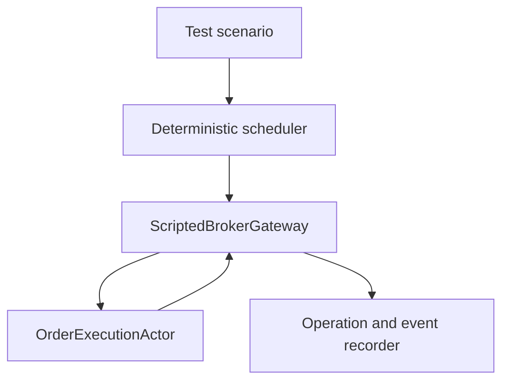

# Scripted Broker Test Harness Specification

**Document version:** 1.0  
**Status:** Implementation specification  
**Target runtime:** .NET 10 or later  
**Classification:** Test-only infrastructure  
**Primary system under test:** Deterministic order-execution workflow  
**Companion specifications:** `OrderExecutionWorkflowSpecification.md`, `IbkrOrderExecutionAdapterSpecification.md`  
**Last updated:** 2026-08-02

---

## 1. Purpose

This document specifies a deterministic, scripted, test-only implementation of the broker-neutral `IBrokerOrderGateway` contract used by the order-execution workflow.

The harness exists to prove that the workflow behaves safely when broker events arrive late, duplicated, out of order, partially, ambiguously, or not at all. These conditions are difficult or impossible to force reliably through an external broker paper environment.

The harness shall allow Codex to generate automated tests for:

- order submission and acknowledgement;
- deterministic waiting and repricing;
- cancellation and cancel/fill races;
- complete and partial fills;
- balanced and unbalanced exposure;
- duplicate and out-of-order callbacks;
- broker disconnection and reconnection;
- reconciliation with consistent, incomplete, or conflicting evidence;
- process restart at every material execution point;
- compensation success, failure, and escalation;
- position-monitor ownership handoff;
- every non-negotiable invariant in the workflow specification.

The harness is not a broker, paper-trading service, market simulator, fill-probability model, or production fallback.

---

## 2. Mandatory Naming Decision

The implementation shall be named **Scripted Broker Test Harness**, not “fake broker” in public types, configuration, logs, test names, or documentation.

Recommended principal type:

```csharp
ScriptedBrokerGateway
```

Recommended assembly:

```text
Trading.Execution.Testing.ScriptedBroker
```

The clearer name prevents confusion with:

- IBKR Paper Trading;
- an alternative production broker;
- a realistic market/fill simulator;
- a mock that returns automatic success;
- a later MDP execution simulator.

---

## 3. Absolute Safety Boundary

The harness shall never:

- connect to TWS, IB Gateway, IBKR, an exchange, or any external network service;
- reference `IBApi` or any IBKR infrastructure assembly;
- send real or paper orders;
- load broker credentials or account configuration;
- be registered by production dependency injection;
- be selected by paper or live application configuration;
- ship in a production publish output or deployment image;
- automatically succeed when a scenario omitted an expected broker response;
- generate random fills;
- claim to predict broker fill behavior;
- act as a fallback when the IBKR adapter fails;
- update an MDP or execution policy;
- use wall-clock sleeps to drive broker behavior;
- weaken production interfaces or invariants for test convenience.

If the harness is detected in a paper/live process, startup must fail immediately before any order subsystem becomes ready.

---

## 4. Relationship to the Other Execution Components

| Component | Purpose | Connects externally? | Used in production? |
|---|---|---:|---:|
| `ScriptedBrokerGateway` | Scripted workflow and failure-path testing | No | No |
| IBKR adapter callback harness | Tests `IBApi` translation and callback normalization | No | No |
| `IbkrBrokerOrderGateway` | Actual TWS/IB Gateway integration | Yes | Yes |
| IBKR Paper Trading | End-to-end broker integration rehearsal | Yes | Paper only |
| Future MDP execution simulator | Statistical market/fill-policy research | No | Research only |

### 4.1 What this harness tests

```text
OrderExecutionActor
Execution aggregate
Deterministic policy
Constraints and pricing decisions
Timers and timeouts
Reconciliation business classification
Compensation decisions
Persistence and recovery
Position-monitor handoff
```

### 4.2 What this harness does not test

```text
IBKR Contract/ComboLeg/Order construction
IBKR order-ID behavior
IBKR C# callback signatures
TWS/IB Gateway connectivity
IBKR price-sign conventions
IBKR exchange routing
Realistic queue position or fill probability
Live broker latency
Market microstructure
```

Those concerns belong to the IBKR adapter tests, IBKR Paper Trading, and later execution simulation.

---

## 5. Architecture Decision

The harness implements the same broker-neutral gateway port used by the real IBKR adapter. The workflow must be unaware of which test implementation supplies broker events.



The scenario owns all simulated broker behavior. The gateway records outbound workflow operations and emits only the events explicitly scheduled by the scenario.

There is no implicit “happy path.” If a test expects acknowledgement or a fill, the scenario must declare it.

---

## 6. Delivery Phases

### 6.1 Required V1 phases

| Phase | Name | Required outcome |
|---|---|---|
| 1 | Test-only isolation and core contracts | Project boundary, production exclusion, deterministic IDs, scenario manifest, actual gateway/event contracts |
| 2 | Manual clock and deterministic scheduler | Zero-sleep virtual time, stable event ordering, controlled actor/timer advancement, reproducible trace |
| 3 | Scripted gateway and broker ledger | Submit/modify/cancel/reconcile recording, explicit broker responses, orders/fills/commissions/positions |
| 4 | Fault injection, reconciliation, and restart | Duplicate/reordered/dropped events, disconnects, incomplete evidence, crash checkpoints, recovery driver |
| 5 | Scenario catalogue, invariant assertions, and CI | Complete V1 safety matrix, property/model tests, replay hashes, production packaging guards |

All five phases are required before the workflow's deterministic V1 acceptance suite is complete.

### 6.2 Optional later phases

| Phase | Name | Possible outcome |
|---|---|---|
| 6 | Recorded normalized-event import | Convert redacted paper/live broker-neutral event traces into deterministic scripts |
| 7 | Seeded generative scenario testing | Reproducible state-machine sequence generation and shrinking |
| 8 | Market-replay bridge | Convert a separately versioned market/fill simulation into explicit scripted broker events |

Optional phases must retain deterministic reproduction and test-only isolation.

---

# Part I — Required V1 Harness

## 7. Phase 1: Test-Only Isolation and Core Contracts

### 7.1 Suggested project layout

```text
tests/
  Trading.Execution.Testing.ScriptedBroker/
    Clock/
    Scheduling/
    Scenarios/
    Gateway/
    Ledger/
    Events/
    Faults/
    Reconciliation/
    Recovery/
    Assertions/
    Reporting/

  Trading.Execution.Tests.Unit/
  Trading.Execution.Tests.Property/
  Trading.Execution.Tests.StateMachine/
  Trading.Execution.Tests.Integration/
  Trading.Execution.Tests.Recovery/
  Trading.Execution.Tests.Acceptance/
```

Recommended test harness project properties:

```xml
<PropertyGroup>
  <TargetFramework>net10.0</TargetFramework>
  <IsPackable>false</IsPackable>
  <IsPublishable>false</IsPublishable>
  <TestOnlyAssembly>true</TestOnlyAssembly>
  <Nullable>enable</Nullable>
</PropertyGroup>
```

These properties are necessary but not sufficient. Architecture and publish-output tests are also mandatory.

### 7.2 Dependency rules

The harness may reference:

- broker-neutral execution contracts;
- execution application interfaces required to drive the actor;
- shared clock and identifier abstractions;
- testing and assertion libraries.

The harness must not reference:

- `Trading.Execution.Infrastructure.IBKR`;
- the official `IBApi` assembly;
- production startup/hosting projects;
- broker credential providers;
- external network clients;
- production database infrastructure unless a specific integration test intentionally uses an isolated disposable database.

Production projects must not reference the harness assembly.

### 7.3 Production-exclusion safeguards

Implement every safeguard below:

1. Harness project is physically located under the test tree.
2. `IsPackable` and `IsPublishable` are false.
3. Production projects have no project or package reference to the harness.
4. An architecture test scans production dependency graphs for any `.Testing.ScriptedBroker` reference.
5. A publish test asserts the harness DLL and symbols are absent from paper/live publish output.
6. Production broker-provider configuration accepts an allowlist containing only approved production adapters such as `IBKR`.
7. A paper/live startup guard rejects any type whose assembly is marked `TestOnlyAssembly`.
8. Harness construction requires an explicit test-host marker supplied only by the test composition root.
9. Harness does not implement or expose a network listener.
10. CI fails if the harness or its registration extension is referenced outside test projects.

No single environment-variable check is sufficient as the only safeguard.

### 7.4 Test-host marker

```csharp
public sealed class ScriptedBrokerTestHostToken
{
    internal ScriptedBrokerTestHostToken(string testRunId)
    {
        TestRunId = testRunId;
    }

    public string TestRunId { get; }
}
```

The test composition root creates the token through an internal test factory. The gateway constructor requires it. This is an additional accidental-use barrier, not a security credential.

### 7.5 Gateway contract

`ScriptedBrokerGateway` implements the exact broker-neutral interface used by `OrderExecutionActor`:

```csharp
public sealed class ScriptedBrokerGateway : IBrokerOrderGateway
{
    public BrokerGatewaySnapshot GetSnapshot();

    public BrokerDispatchReceipt SubmitCombo(
        in BrokerComboOrderRequest request);

    public BrokerDispatchReceipt ModifyComboLimit(
        in BrokerComboModifyRequest request);

    public BrokerDispatchReceipt CancelOrder(
        in BrokerOrderCancelRequest request);

    public BrokerDispatchReceipt RequestReconciliation(
        in BrokerReconciliationRequest request);
}
```

The harness shall not create a test-specific gateway interface that bypasses production behavior.

### 7.6 Event contract

The harness publishes the same normalized broker-neutral events produced by the IBKR adapter, including equivalents of:

- session status changes;
- local broker dispatch results;
- order acknowledgement and open-order observation;
- order-status changes;
- executions/fills;
- commissions;
- broker warnings/errors;
- price-capping observations where needed;
- reconciliation results;
- completed/open-order evidence;
- position evidence.

Tests must not call private actor methods to simulate broker outcomes.

### 7.7 Deterministic identifiers

The harness may not use unrecorded `Guid.NewGuid()`, random numbers, process IDs, wall-clock ticks, or collection hash order for economic identifiers.

```csharp
public interface IDeterministicTestIdGenerator
{
    Guid Next(string purpose);
    long NextSequence(string purpose);
    string NextBrokerOrderKey();
    string NextExecutionId();
}
```

Identifiers derive from:

- scenario ID;
- scenario version;
- stable purpose string;
- monotonically increasing sequence.

The same scenario definition and input must produce the same IDs and trace hash.

### 7.8 Scenario identity

```csharp
public sealed record BrokerScenarioManifest(
    string ScenarioId,
    int ScenarioVersion,
    int SchemaVersion,
    string Description,
    string RequiredWorkflowPolicy,
    int RequiredWorkflowPolicyVersion,
    DateTimeOffset InitialUtc,
    long InitialMonotonicTicks,
    string DefinitionHash,
    IReadOnlyList<string> RequirementIds,
    IReadOnlyList<string> Tags);
```

Scenario IDs are stable and machine-readable, for example:

```text
SUBMIT-HAPPY-001
CANCEL-LATE-FILL-001
RESTART-AFTER-SUBMIT-001
UNBALANCED-COMPENSATE-001
```

Changing expected behavior creates a new scenario version.

### 7.9 Scenario definition principles

- Every outbound expectation is explicit.
- Every inbound broker event is explicit.
- Every virtual-time advance is explicit.
- Unexpected outbound operations fail immediately by default.
- Missing expected operations fail at scenario completion.
- Unconsumed scheduled events fail unless intentionally marked optional.
- Scenario definitions are immutable after execution begins.
- Scenario execution produces a complete ordered trace.
- No default callback is inferred merely from a gateway method call.

---

## 8. Phase 2: Manual Clock and Deterministic Scheduler

### 8.1 Manual clock

```csharp
public interface IManualExecutionClock : IClock, IMonotonicClock
{
    void AdvanceBy(TimeSpan duration);
    void AdvanceTo(DateTimeOffset utcTime);
    ManualClockSnapshot GetSnapshot();
}
```

Requirements:

- Initial UTC and monotonic values come from the scenario manifest.
- UTC and monotonic time advance together unless a dedicated wall-clock-anomaly scenario explicitly separates them.
- Time cannot move backward in normal scenarios.
- `AdvanceBy` rejects negative duration.
- Scenario logic never calls `Task.Delay`, `Thread.Sleep`, timer polling, or the system clock.
- All workflow timers use the same injected manual clock/scheduler in deterministic tests.
- Persisted UTC deadlines can be tested independently from in-process monotonic deadlines.

### 8.2 Scheduler

```csharp
public interface IDeterministicBrokerScheduler
{
    ScheduledEventId Schedule(
        DateTimeOffset dueAtUtc,
        ScheduledBrokerAction action,
        int explicitPriority = 0);

    bool RunNext();
    int RunDue();
    int RunUntilIdle(int maximumSteps);
    void AdvanceBy(TimeSpan duration);
    void AdvanceTo(DateTimeOffset utcTime);
    SchedulerSnapshot GetSnapshot();
}
```

### 8.3 Stable ordering

Scheduled actions are ordered by:

1. due UTC time;
2. explicit scenario priority;
3. insertion sequence.

No ordering may depend on:

- dictionary enumeration;
- task scheduler behavior;
- thread-pool timing;
- object hash codes;
- random values;
- operating-system timer resolution.

When the scenario needs a fill before an acknowledgement at the same timestamp, it expresses that order explicitly through priority or insertion order.

### 8.4 Scheduler actions

The scheduler supports at least:

```csharp
public enum ScheduledBrokerActionKind : byte
{
    EmitSessionEvent = 1,
    EmitOrderAcknowledgement = 2,
    EmitOpenOrder = 3,
    EmitOrderStatus = 4,
    EmitExecution = 5,
    EmitCommission = 6,
    EmitBrokerError = 7,
    CompleteReconciliation = 8,
    DisconnectSession = 9,
    ReconnectSession = 10,
    InvokeWorkflowTimer = 11,
    Checkpoint = 12,
    CrashSystemUnderTest = 13,
    RestartSystemUnderTest = 14,
    ExecuteAssertion = 15
}
```

### 8.5 Scenario execution modes

#### Step mode

Runs one scheduled action at a time. Used for debugging and precise intermediate assertions.

#### Due mode

Runs all actions due at current virtual time in stable order.

#### Until-idle mode

Runs due actions and actor/test-dispatch work until both the scheduler and system-under-test queues are idle. It must enforce a maximum step count to detect loops.

#### Advance mode

Moves virtual time, triggers workflow deadlines, then drains due work deterministically.

### 8.6 Actor integration

Deterministic actor tests should use a controllable test dispatcher compatible with the production actor semantics:

- one message at a time per actor;
- ordered mailbox processing;
- no direct aggregate mutation from the test;
- actor timers backed by the manual scheduler;
- explicit drain-to-idle operation;
- maximum-message guard for infinite loops.

Tests that deliberately use the real thread-pool actor runtime remain integration tests. Their outer synchronization may use a bounded real timeout to prevent a hung test process, but broker behavior and workflow deadlines still use virtual time.

### 8.7 Timer identity testing

The scheduler must support stale timer scenarios:

- schedule a submit-acknowledgement timeout;
- acknowledge before it fires;
- retain and later deliver the obsolete timer;
- verify the actor ignores it using deadline ID, expected status, attempt version, and decision sequence.

### 8.8 No hidden progress

The harness does not advance virtual time automatically when a gateway method is called. Tests choose when time moves. This prevents accidental timeout coverage from depending on machine speed.

---

## 9. Scenario Model and DSL

### 9.1 Scenario object

```csharp
public sealed class ScriptedBrokerScenario
{
    public BrokerScenarioManifest Manifest { get; }
    public IReadOnlyList<ExpectedBrokerOperation> ExpectedOperations { get; }
    public IReadOnlyList<ScheduledBrokerAction> ScheduledActions { get; }
    public BrokerLedgerSeed InitialBrokerState { get; }
    public IReadOnlyList<ScenarioAssertionDefinition> Assertions { get; }
}
```

### 9.2 Recommended fluent builder

```csharp
var scenario = BrokerScenario
    .Define("CANCEL-LATE-FILL-001", version: 1)
    .StartingAt(new DateTimeOffset(2026, 1, 12, 14, 30, 0, TimeSpan.Zero))
    .GivenSessionReady()
    .ExpectSubmit(match => match
        .ForAttempt(attemptId)
        .WithComboQuantity(1)
        .WithLimitPrice(expectedInitialPrice))
    .ThenAfter(TimeSpan.FromMilliseconds(25))
        .EmitOrderAcknowledged()
    .ExpectCancel()
    .ThenAfter(TimeSpan.FromMilliseconds(5))
        .EmitOrderStatus(BrokerOrderStatus.PendingCancel)
    .ThenAfter(TimeSpan.FromMilliseconds(1))
        .EmitComponentLegFill(leg1, quantity: 1, price: 12.25m)
    .ThenAfter(TimeSpan.FromMilliseconds(2))
        .EmitOrderStatus(BrokerOrderStatus.Cancelled)
    .WhenReconciliationRequested()
        .ReturnCompleteEvidenceFromLedger()
    .AssertStatusObserved(ExecutionStatus.UnbalancedExposure)
    .AssertNoAdditionalNormalSubmit()
    .AssertCompensationOrManualIntervention();
```

The exact syntax may be refined, but scenarios must remain strongly typed and avoid fragile string parsing.

### 9.3 Scenario triggers

Scheduled responses can be triggered by:

- absolute virtual time;
- relative time after the prior step;
- receipt of a matching gateway operation;
- publication of a matching workflow event;
- completion of reconciliation;
- explicit test-driver command;
- system-under-test crash or restart;
- checkpoint reached.

### 9.4 Operation matching

```csharp
public sealed record BrokerOperationMatcher(
    BrokerOperationKind Kind,
    Guid? ExecutionAttemptId,
    Guid? OperationId,
    string? ExpectedPayloadHash,
    BrokerOrderPurpose? Purpose,
    int? Quantity,
    BrokerLimitPrice? LimitPrice,
    IReadOnlyList<BrokerLegMatcher>? Legs);
```

Matcher rules:

- Exact semantic comparison by default.
- Tests may ignore explicitly irrelevant fields, but ignored fields are listed in the trace.
- Raw object reference equality is prohibited.
- Decimal price comparison is exact after domain normalization.
- Collection order is significant where the production contract says it is significant.
- Unexpected changed account, leg, side, ratio, quantity, or price fails immediately.

### 9.5 Expected-operation cardinality

Support:

- exactly once;
- never;
- at most once;
- explicit ordered sequence;
- a bounded count for retry/query behavior;
- unordered group only when business semantics genuinely allow it.

Normal submit, modify, and cancel expectations should normally be exactly once.

### 9.6 Unexpected operations

Default behavior is immediate failure with:

- scenario ID/version;
- current virtual time;
- actual operation and payload;
- next expected operations;
- recent workflow/broker trace;
- pending scheduled actions.

An explicit `AllowUnexpectedForDiagnostics` mode may exist for exploratory development but is prohibited in acceptance tests.

### 9.7 Scenario completion

A scenario is complete only when:

- the expected terminal workflow state is reached;
- all required broker operations occurred with correct payloads;
- no prohibited operation occurred;
- all required scheduled events were emitted;
- required reconciliation assertions passed;
- no unexpected work remains queued;
- final invariant set passes;
- trace hash is computed.

---

## 10. Phase 3: Scripted Gateway and Broker Ledger

### 10.1 Gateway state

```csharp
public sealed record ScriptedBrokerGatewayState(
    BrokerGatewaySnapshot GatewaySnapshot,
    long NextOperationSequence,
    long NextEventSequence,
    IReadOnlyDictionary<string, ScriptedBrokerOrder> Orders,
    IReadOnlyDictionary<string, ScriptedBrokerExecution> Executions,
    IReadOnlyDictionary<string, ScriptedBrokerCommission> Commissions,
    IReadOnlyDictionary<long, ScriptedBrokerPosition> Positions,
    IReadOnlyList<RecordedBrokerOperation> RecordedOperations,
    IReadOnlyList<RecordedBrokerEvent> RecordedEvents);
```

The harness owns its broker ledger. It does not replace the workflow's event-sourced aggregate.

### 10.2 Recorded operation

```csharp
public sealed record RecordedBrokerOperation(
    long Sequence,
    DateTimeOffset OccurredAtUtc,
    long MonotonicTicks,
    BrokerOperationKind Kind,
    Guid OperationId,
    Guid ExecutionAttemptId,
    object NormalizedRequest,
    string PayloadHash,
    BrokerDispatchReceipt DispatchReceipt,
    ExpectedBrokerOperation? MatchedExpectation);
```

Every call to the gateway is recorded before the scripted local dispatch outcome is returned.

### 10.3 Local dispatch outcomes

Scenarios can configure:

```csharp
public enum ScriptedDispatchBehavior : byte
{
    AcceptLocally = 1,
    RejectNotReady = 2,
    RejectQueueFull = 3,
    RejectValidation = 4,
    ThrowBeforeDispatch = 5,
    ThrowAfterDispatchOutcomeUnknown = 6,
    AcceptButEmitNoBrokerResponse = 7
}
```

`AcceptLocally` means only that the gateway accepted the command, matching the production contract. It does not schedule acknowledgement unless the scenario explicitly requests one.

### 10.4 Synthetic broker identifiers

The workflow harness uses broker-neutral synthetic identifiers, not IBKR order IDs or `IBApi` objects.

```csharp
public readonly record struct ScriptedBrokerOrderKey(string Value);
public readonly record struct ScriptedBrokerExecutionId(string Value);
public readonly record struct ScriptedBrokerSessionId(Guid Value);
```

IDs are deterministic and stable across scenario replay. IBKR-specific ID allocation is tested by the IBKR adapter harness, not here.

### 10.5 Scripted order state

```csharp
public enum ScriptedBrokerOrderStatus : byte
{
    Created = 0,
    Working = 1,
    ModifyPending = 2,
    CancelPending = 3,
    Cancelled = 4,
    Filled = 5,
    Rejected = 6,
    Unknown = 7
}

public sealed record ScriptedBrokerOrder(
    ScriptedBrokerOrderKey OrderKey,
    Guid ExecutionAttemptId,
    Guid InitialOperationId,
    BrokerOrderPurpose Purpose,
    ScriptedBrokerOrderStatus Status,
    BrokerComboOrderRequest OriginalRequest,
    BrokerLimitPrice CurrentLimitPrice,
    int RequestedComboQuantity,
    decimal BrokerReportedFilledQuantity,
    decimal BrokerReportedRemainingQuantity,
    long Version,
    DateTimeOffset CreatedAtUtc,
    DateTimeOffset LastUpdatedAtUtc);
```

### 10.6 Submit handling

On `SubmitCombo`:

1. Record the actual request.
2. Match the next submit expectation.
3. Validate operation ID and payload idempotency.
4. Apply the scripted local dispatch behavior.
5. If locally accepted, create a synthetic broker order in `Created` state.
6. Schedule only the responses declared by the scenario.
7. Return the deterministic local dispatch receipt.

There is no automatic acknowledgement or fill.

### 10.7 Modify handling

On `ModifyComboLimit`:

- match the expected logical order;
- assert the order exists unless the scenario explicitly tests unknown-order handling;
- verify only permitted broker-neutral fields changed;
- record the request exactly once;
- apply scripted local dispatch behavior;
- update the ledger only when a scripted broker acknowledgement or reconciliation says the modification became effective;
- allow fills to occur before, during, or after modification;
- never create a new logical order implicitly.

### 10.8 Cancel handling

On `CancelOrder`:

- match expected order and operation;
- record the request;
- apply scripted local dispatch behavior;
- do not mark the broker order cancelled automatically;
- allow pending, rejected, not-found, filled, late-fill, or no-response sequences;
- change ledger state only through explicit scheduled broker evidence.

### 10.9 Event emission

When emitting a broker event:

1. Allocate deterministic event ID and receive sequence.
2. Update the scripted broker ledger according to the event's explicitly configured ledger behavior.
3. Record the event and pre/post ledger hashes.
4. Publish the actual broker-neutral event to the production event sink.
5. Drain the controlled actor dispatcher as configured.
6. Execute any assertions attached to the event boundary.

### 10.10 Fill events

The harness supports:

- complete combo-unit fill;
- balanced partial combo-unit fill;
- component-leg fill;
- BAG-summary fill;
- BAG summary plus component legs;
- duplicate execution ID;
- same execution ID with conflicting economic data;
- correction or bust;
- overfill;
- fill before acknowledgement;
- fill during modification;
- fill during cancellation;
- fill after cancellation acknowledgement;
- fill after workflow terminal state.

When BAG summary and component-leg events are both emitted, the scenario explicitly marks their relationship so assertions can verify that the workflow does not double-count exposure.

### 10.11 Commission events

The harness supports commission:

- immediately after execution;
- before the actor processes the corresponding execution;
- after terminal fill processing;
- duplicated;
- absent;
- in another currency;
- revised through a deterministic correction event.

Commission timing never gates exposure recognition.

### 10.12 Broker error events

Scenarios can emit normalized:

- informational messages;
- warnings;
- order rejection;
- server cancellation;
- cancel-not-found;
- already-filled/cannot-cancel;
- connectivity loss/restoration;
- order-state unknown;
- invalid or unknown future error category.

The harness does not reproduce IBKR numeric mapping; it emits the broker-neutral classification expected from the adapter. Numeric IBKR mapping is tested separately.

### 10.13 Session events

Support:

- ready for queries and orders;
- connected but not order-ready;
- connectivity lost;
- reconnecting;
- new session epoch;
- reconciliation required;
- reader/writer unhealthy representation;
- faulted;
- recovery complete.

The scenario controls whether working orders remain active across disconnect.

---

## 11. Broker Ledger

### 11.1 Purpose

The ledger provides a deterministic model of the broker facts the scenario has declared. It is used to construct reconciliation snapshots and verify that broker events remain internally coherent when desired.

It is not a pricing engine or fill model.

### 11.2 Ledger collections

- open orders;
- completed orders;
- execution records;
- commission records;
- positions by account/instrument;
- session epochs;
- operation dispatch history;
- emitted callback history.

### 11.3 Ledger update modes

```csharp
public enum ScriptedLedgerUpdateMode : byte
{
    ApplyNormally = 1,
    EmitWithoutApplying = 2,
    ApplyWithoutEmitting = 3,
    ApplyConflictingEvidence = 4
}
```

`ApplyNormally` is used for coherent scenarios. The other modes intentionally create missing or conflicting broker evidence.

### 11.4 Position ledger

```csharp
public sealed record ScriptedBrokerPosition(
    string AccountAlias,
    long InstrumentId,
    decimal Quantity,
    decimal AverageCost,
    long SnapshotVersion,
    DateTimeOffset UpdatedAtUtc);
```

Position changes can be:

- derived from explicitly applied component-leg executions;
- seeded directly for restart/reconciliation scenarios;
- deliberately withheld to simulate an incomplete snapshot;
- deliberately contradicted for safety-path testing.

### 11.5 Coherent ledger invariant mode

In strict/coherent mode:

- filled plus remaining equals requested quantity where semantically applicable;
- executions do not exceed requested quantity unless scenario explicitly declares overfill;
- component fills update positions;
- completed orders are not simultaneously open;
- duplicate execution IDs do not change quantities;
- commission references an existing or explicitly future execution;
- session and correlation identities are consistent.

### 11.6 Fault mode

Fault mode can violate selected broker-ledger invariants intentionally. Every permitted violation must be declared by a scenario fault token so accidental ledger corruption still fails the test.

---

## 12. Phase 4: Fault Injection

### 12.1 Fault declaration

```csharp
public sealed record BrokerFaultDefinition(
    string FaultId,
    BrokerFaultKind Kind,
    DateTimeOffset ActivatesAtUtc,
    int MaximumApplications,
    string Purpose,
    string ExpectedWorkflowResponse);
```

### 12.2 Required fault kinds

```csharp
public enum BrokerFaultKind : byte
{
    DropResponse = 1,
    DelayResponse = 2,
    DuplicateEvent = 3,
    ReorderEvents = 4,
    ConflictingEvent = 5,
    UnknownStatus = 6,
    UnknownError = 7,
    DisconnectBeforeDispatch = 8,
    DisconnectAfterDispatch = 9,
    NewSessionEpoch = 10,
    LocalQueueFull = 11,
    LocalDispatchException = 12,
    AmbiguousDispatchException = 13,
    IncompleteReconciliation = 14,
    ConflictingReconciliation = 15,
    MissingPositionEnd = 16,
    MissingExecutionEnd = 17,
    LateFill = 18,
    Overfill = 19,
    FillCorrectionOrBust = 20,
    PositionMonitorUnavailable = 21
}
```

### 12.3 Duplicate events

Duplicates may be exact or semantically equivalent with different receive IDs. Tests must verify economic idempotency while retaining diagnostic duplicate counts.

Required duplicate targets:

- acknowledgement;
- working status;
- pending-cancel status;
- cancelled status;
- execution;
- commission;
- reconciliation result;
- session-restored event;
- position-monitor acknowledgement where applicable.

### 12.4 Event reordering

Required reorder cases:

- fill before acknowledgement;
- fill before open-order observation;
- cancelled status before delayed fill;
- commission before execution processing;
- session restored before old-epoch callbacks drain;
- reconciliation evidence before a delayed streaming execution;
- position update before execution callback;
- position-monitor acknowledgement after execution ownership timeout.

### 12.5 Dropped/no-response behavior

The scenario can accept a local operation and emit no broker response. The workflow must then reach its virtual timeout and reconcile. The harness must not silently complete the pending expectation.

### 12.6 Dispatch ambiguity

For `ThrowAfterDispatchOutcomeUnknown`:

- operation is recorded as attempted;
- the scripted order may or may not exist according to the scenario;
- no automatic retry occurs;
- later reconciliation reveals working, filled, cancelled, absent, or conflicting state;
- test asserts the workflow never sends a blind duplicate submit.

### 12.7 Connectivity fault

Disconnect scenarios define:

- whether the outbound operation was attempted;
- whether the broker order exists;
- which events were delayed;
- whether the session epoch changes;
- whether broker state remained intact;
- what reconciliation evidence appears after reconnect.

The harness never assumes disconnect cancels orders.

---

## 13. Reconciliation Simulation

### 13.1 Request handling

When the workflow calls `RequestReconciliation`, the harness:

1. records and matches the request;
2. validates requested attempt/account/instruments;
3. applies the configured dispatch behavior;
4. schedules the declared reconciliation response or timeout;
5. returns local dispatch receipt;
6. emits a normal broker-neutral reconciliation result only when scheduled.

### 13.2 Evidence modes

```csharp
public enum ScriptedReconciliationMode : byte
{
    FromCoherentLedger = 1,
    ExplicitSnapshot = 2,
    IncompleteOpenOrders = 3,
    IncompleteExecutions = 4,
    IncompletePositions = 5,
    ConflictingEvidence = 6,
    Timeout = 7,
    SessionChangedDuringQuery = 8
}
```

### 13.3 Complete coherent snapshot

`FromCoherentLedger` constructs:

- open-order evidence;
- completed-order evidence;
- executions;
- commissions when present;
- positions;
- completeness flags;
- deterministic evidence hash;
- current session ID.

### 13.4 Explicit conflicting snapshot

Tests can declare conflicts such as:

- open order says zero filled while execution exists;
- completed order says cancelled while position shows exposure;
- execution reports one leg but position shows another quantity;
- two orders share an impossible correlation;
- flat position snapshot is incomplete;
- evidence comes from different session epochs.

The workflow must remain blocked or escalate; the harness must not resolve the conflict automatically.

### 13.5 Query timeout

A reconciliation timeout is driven by virtual time. It may emit:

- no response;
- partial evidence followed by no completion;
- explicit incomplete result;
- session disconnect before completion.

### 13.6 Evidence reproducibility

The same ledger and reconciliation mode must produce byte-equivalent normalized evidence and the same hash, excluding fields explicitly designated as diagnostic-only.

---

## 14. Crash and Restart Testing

### 14.1 Separation of broker and system-under-test lifetimes

The scripted broker ledger can outlive the workflow process/actor instance. This models the real fact that a broker order may continue while the application restarts.

```csharp
public interface IExecutionSystemLifecycleDriver
{
    ValueTask StopAsync(CrashMode mode, CancellationToken cancellationToken);
    ValueTask StartAsync(CancellationToken cancellationToken);
    ValueTask DrainAsync(CancellationToken cancellationToken);
}
```

### 14.2 Crash modes

```csharp
public enum CrashMode : byte
{
    GracefulStop = 1,
    AbruptBeforePersistence = 2,
    AbruptAfterPersistenceBeforeDispatch = 3,
    AbruptDuringDispatch = 4,
    AbruptAfterDispatchBeforeCallback = 5,
    AbruptAfterCallbackBeforeEventPersistence = 6
}
```

Some modes require an event-store or gateway seam capable of exposing a deterministic checkpoint. Tests must not approximate these windows using arbitrary sleeps.

### 14.3 Broker checkpoint

```csharp
public sealed record ScriptedBrokerCheckpoint(
    string CheckpointId,
    DateTimeOffset UtcTime,
    long MonotonicTicks,
    ScriptedBrokerGatewayState GatewayState,
    SchedulerSnapshot Scheduler,
    string StateHash);
```

### 14.4 Restart procedure

1. Stop or discard the workflow/actor instance at an explicit checkpoint.
2. Preserve the scripted broker ledger and selected pending broker events.
3. Recreate production workflow services using the same isolated event store.
4. Reinject manual clock and test dispatcher.
5. Expose the broker session as disconnected or newly reconnected according to the scenario.
6. Start workflow recovery.
7. Expect reconciliation before any new normal submit.
8. Emit declared evidence from the surviving broker ledger.
9. Verify recovered aggregate state and exact next action.

### 14.5 Required restart checkpoints

- before execution-attempt start persistence;
- after attempt start, before gateway submit;
- after submit intent persistence, before local gateway call;
- after gateway recorded dispatch, before acknowledgement;
- after acknowledgement, before aggregate event persistence where injectable;
- during modify;
- during cancel;
- after partial fill;
- during reconciliation;
- during compensation;
- after complete fill, before position-monitor handoff;
- after handoff request, before ownership acknowledgement.

### 14.6 Restart assertions

- no duplicate normal order;
- no reused operation ID with different payload;
- no loss of a previously persisted fill;
- broker evidence applied idempotently;
- expired deadlines handled conservatively;
- normal execution blocked until reconciliation completes;
- terminal ownership remains unambiguous.

---

## 15. Assertions and Diagnostics

### 15.1 Assertion API

```csharp
public interface IScriptedBrokerAssertions
{
    void AssertOperationOccurred(BrokerOperationMatcher matcher, int count = 1);
    void AssertOperationNeverOccurred(BrokerOperationMatcher matcher);
    void AssertOperationsInOrder(params BrokerOperationMatcher[] matchers);
    void AssertNoUnexpectedOperations();
    void AssertNoPendingRequiredActions();
    void AssertBrokerLedger(BrokerLedgerAssertion assertion);
    void AssertFinalWorkflowState(ExecutionStateAssertion assertion);
    void AssertAllInvariants();
}
```

### 15.2 Required operation assertions

- exact submit count;
- exact modify count and price ladder;
- same logical order across modifications;
- exact cancel count;
- reconciliation requested after ambiguity;
- compensation purpose and bounded quantities;
- no normal submit after unknown/unbalanced exposure;
- no broker operation after terminal ownership release;
- no action outside permitted mask.

### 15.3 Negative assertion windows

To assert that no operation occurs during an interval:

1. record operation sequence;
2. advance virtual time by the specified interval;
3. drain actor/scheduler work;
4. assert no matching operation appeared.

Do not use real-time waiting to prove absence.

### 15.4 Failure report

Every scenario failure report includes:

- scenario ID, version, and definition hash;
- test build and workflow-policy version;
- initial and current virtual time;
- expected versus actual operation;
- ordered workflow events;
- ordered broker operations;
- ordered broker events;
- scheduler pending queue;
- broker ledger snapshot;
- aggregate state snapshot;
- active timers;
- most recent invariant results;
- deterministic replay command or test filter.

### 15.5 Scenario run report

```csharp
public sealed record BrokerScenarioRunReport(
    BrokerScenarioManifest Manifest,
    bool Passed,
    DateTimeOffset FinalUtc,
    long ExecutedSchedulerSteps,
    long ProcessedActorMessages,
    IReadOnlyList<RecordedBrokerOperation> Operations,
    IReadOnlyList<RecordedBrokerEvent> Events,
    IReadOnlyList<ScenarioAssertionResult> Assertions,
    string FinalBrokerLedgerHash,
    string FinalWorkflowStateHash,
    string TraceHash);
```

---

## 16. Phase 5: Complete V1 Scenario Catalogue

Every scenario below requires a stable ID, expected operations, final state, and invariant assertions.

### 16.1 Session and readiness

| ID family | Scenario | Required assertion |
|---|---|---|
| `SESSION-001` | Gateway ready | Approved attempt may proceed to fresh-market validation |
| `SESSION-002` | Connected but not order-ready | No submit; workflow waits/cancels according to deadline |
| `SESSION-003` | Disconnected before submit | No submit; reconciliation/session handling triggered |
| `SESSION-004` | Disconnect after local dispatch | No blind repeat; reconciliation required |
| `SESSION-005` | New session epoch | Old callback handled conservatively; active attempt reconciled |
| `SESSION-006` | Session fault during cancel | Fill remains possible; reconciliation required |

### 16.2 Normal submission and fill

| ID family | Scenario | Required assertion |
|---|---|---|
| `SUBMIT-001` | Submit, acknowledge, complete fill | One submit; correct payload; position handoff |
| `SUBMIT-002` | Immediate fill before acknowledgement | Fill applied once; no duplicate submit |
| `SUBMIT-003` | Open-order observation before status | Acknowledgement state remains coherent |
| `SUBMIT-004` | Status before open-order observation | Echo later validated; no regression |
| `SUBMIT-005` | Commission delayed | Position recognized before commission; later enrichment |
| `SUBMIT-006` | No commission | Terminal fill still valid; missing-cost telemetry |
| `SUBMIT-007` | Broker warning but order working | Warning persisted; policy reevaluates if required |
| `SUBMIT-008` | Broker price cap observed | Effective price checked; workflow cancels if envelope violated |

### 16.3 Submission acknowledgement failures

| ID family | Scenario | Required assertion |
|---|---|---|
| `ACK-001` | Acknowledgement delayed but within deadline | No premature duplicate or cancel |
| `ACK-002` | Acknowledgement arrives after timeout | Timeout causes reconciliation; late ack applied safely |
| `ACK-003` | No acknowledgement | Reconciliation, never resubmit blindly |
| `ACK-004` | Local dispatch rejected before call | No broker order assumed; workflow handles local failure |
| `ACK-005` | Exception after ambiguous dispatch | Order ID/attempt retained; reconciliation required |
| `ACK-006` | Broker rejects order | Terminal reject or reconcile according to evidence |
| `ACK-007` | Duplicate acknowledgement | Single economic transition |

### 16.4 Wait and repricing

| ID family | Scenario | Required assertion |
|---|---|---|
| `REPRICE-001` | Passive wait, one-tick reprice, fill | Exact price ladder and one modification |
| `REPRICE-002` | Multiple permitted reprices | No more than configured maximum |
| `REPRICE-003` | Reprice would breach reservation | Cancel, no invalid modify |
| `REPRICE-004` | Reprice would consume slippage | Cancel |
| `REPRICE-005` | Edge disappears before reprice | Cancel |
| `REPRICE-006` | Market data becomes stale | Cancel/reconcile; no price modification |
| `REPRICE-007` | Fill arrives during modify | Fill applied; no subsequent invalid reprice |
| `REPRICE-008` | Modify acknowledgement missing | Reconcile; no repeat modify |
| `REPRICE-009` | Duplicate modify acknowledgement | Reprice count increments once |
| `REPRICE-010` | Stale reprice timer fires after fill | Timer ignored |

### 16.5 Cancellation

| ID family | Scenario | Required assertion |
|---|---|---|
| `CANCEL-001` | Cancel with no fill | Reconcile to confirmed flat terminal result |
| `CANCEL-002` | Pending cancel, then cancelled | Pending state not considered terminal |
| `CANCEL-003` | Cancel acknowledgement missing | Reconciliation required |
| `CANCEL-004` | Cancel-not-found | Not treated as success; reconcile |
| `CANCEL-005` | Already-filled/cannot-cancel | Execution reconciliation immediately |
| `CANCEL-006` | Duplicate cancel request command | One broker cancel operation |
| `CANCEL-007` | Duplicate cancelled callbacks | One economic transition |
| `CANCEL-008` | Hard deadline causes cancel | No later normal reprice |

### 16.6 Cancel/fill races

| ID family | Scenario | Required assertion |
|---|---|---|
| `CANCEL-FILL-001` | Fill after cancel request | Fill applied; actual exposure classified |
| `CANCEL-FILL-002` | Fill after pending-cancel status | Same |
| `CANCEL-FILL-003` | Fill after cancelled status | Late-fill incident and reconciliation |
| `CANCEL-FILL-004` | Fill after flat terminal belief | Entry block and incident; compensate if exposed |
| `CANCEL-FILL-005` | Partial fill followed by cancellation | Balanced/unbalanced classification correct |
| `CANCEL-FILL-006` | Duplicate late fill | Applied once |

### 16.7 Fill classification

| ID family | Scenario | Required assertion |
|---|---|---|
| `FILL-001` | Complete component-leg fill | Exact approved structure, one position handoff |
| `FILL-002` | Balanced partial combo quantity accepted | Remaining cancelled; actual smaller quantity handed off |
| `FILL-003` | Balanced partial below minimum | Position neutralized under compensation rules |
| `FILL-004` | Unbalanced single-leg fill | Normal entry blocked; compensation priority |
| `FILL-005` | Multiple unbalanced legs | Exact net exposure reconstruction |
| `FILL-006` | Overfill | Critical incident and excess neutralization path |
| `FILL-007` | BAG summary plus component legs | No double counting |
| `FILL-008` | BAG summary only | Leg evidence incomplete; reconcile before balanced conclusion |
| `FILL-009` | Duplicate execution ID | Applied once |
| `FILL-010` | Same execution ID, conflicting values | Critical conflict and reconcile |
| `FILL-011` | Execution correction/bust | Revision applied explicitly; no silent deletion |
| `FILL-012` | Position update precedes fill | Evidence retained; reconcile/correlate conservatively |

### 16.8 Reconciliation

| ID family | Scenario | Required assertion |
|---|---|---|
| `RECON-001` | Complete flat evidence | Cancelled-without-fill allowed |
| `RECON-002` | Working order exists | No duplicate submit; resume/cancel per workflow state |
| `RECON-003` | Completed fill evidence | Fill reconstructed and handed off |
| `RECON-004` | Balanced partial evidence | Partial policy applied |
| `RECON-005` | Unbalanced position evidence | Execution block and compensation |
| `RECON-006` | Open order absent, execution exists | Fill not missed |
| `RECON-007` | Open/completed order says cancelled, position exposed | Conflict escalated/compensated |
| `RECON-008` | Incomplete position snapshot | Never conclude flat |
| `RECON-009` | Missing end marker/time-out | Incomplete evidence; no unsafe progression |
| `RECON-010` | Session changes during query | Discard/retry within workflow policy |
| `RECON-011` | Duplicate reconciliation result | Idempotent application |
| `RECON-012` | Conflicting correlations | Critical manual intervention |

### 16.9 Disconnect and reconnect

| ID family | Scenario | Required assertion |
|---|---|---|
| `CONNECTION-001` | Disconnect while working | Stop normal reprice; reconcile after reconnect |
| `CONNECTION-002` | Disconnect during modify | Outcome unknown; no repeat modify |
| `CONNECTION-003` | Disconnect during cancel | Fill remains possible; reconcile |
| `CONNECTION-004` | Reconnect with state maintained | Still reconcile active attempt before new order |
| `CONNECTION-005` | Reconnect with delayed fill | Fill applied once |
| `CONNECTION-006` | Reconnect fails repeatedly | Bounded behavior and critical alert; no order mutation |

### 16.10 Compensation

| ID family | Scenario | Required assertion |
|---|---|---|
| `COMP-001` | Safe completion permitted | Missing legs only; never exceed approved quantity |
| `COMP-002` | Safe completion not permitted | Flatten path selected |
| `COMP-003` | Compensation price bound unavailable | No silent widening; manual intervention |
| `COMP-004` | Fill during compensation | Exposure recalculated before next action |
| `COMP-005` | Compensation acknowledgement missing | Reconcile; no duplicate compensation order |
| `COMP-006` | Compensation succeeds flat | Entry block released only after confirmed flat |
| `COMP-007` | Compensation creates balanced approved position | Position handed off with actual fills |
| `COMP-008` | Compensation deadline exceeded | Critical alert and manual intervention |
| `COMP-009` | Overfill during compensation | Critical incident; no risk increase |

### 16.11 Restart recovery

| ID family | Scenario | Required assertion |
|---|---|---|
| `RESTART-001` | Restart before submit dispatch | Recovery does not invent broker order |
| `RESTART-002` | Restart after dispatch before acknowledgement | Reconcile before any submit |
| `RESTART-003` | Restart with working order | Correlate and continue/cancel safely |
| `RESTART-004` | Restart with fill during downtime | Fill discovered and applied |
| `RESTART-005` | Restart after partial fill | Exact exposure reconstructed |
| `RESTART-006` | Restart during cancel | Late fill and final state reconciled |
| `RESTART-007` | Restart during compensation | Existing compensation order not duplicated |
| `RESTART-008` | Restart after fill before handoff | Position-monitor ownership established once |
| `RESTART-009` | Restart after handoff request | No duplicate position creation |

### 16.12 Position-monitor handoff

| ID family | Scenario | Required assertion |
|---|---|---|
| `HANDOFF-001` | Monitor accepts immediately | Ownership released once |
| `HANDOFF-002` | Monitor acknowledgement delayed | Execution retains responsibility/alerting |
| `HANDOFF-003` | Monitor unavailable | No new entry action; high-severity alert |
| `HANDOFF-004` | Duplicate monitor acknowledgement | Idempotent ownership release |
| `HANDOFF-005` | Restart during handoff | Exactly one durable monitored position |

### 16.13 Manual/operator commands

| ID family | Scenario | Required assertion |
|---|---|---|
| `MANUAL-001` | Operator requests cancel | Same bounded cancel/reconcile path |
| `MANUAL-002` | Operator requests reconcile | No unvalidated broker mutation |
| `MANUAL-003` | Operator command duplicated | Idempotent operation |
| `MANUAL-004` | Operator requests prohibited action | Rejected and audited |
| `MANUAL-005` | New compensation authorization | Exact new envelope/version applied |

---

## 17. Non-Negotiable Invariant Assertions

Every scenario runs the common invariant set after every material transition where practical.

1. Submitted normal quantity never exceeds approved quantity.
2. No normal price is worse than the reservation price.
3. No operation uses an action outside the permitted mask.
4. No normal submit occurs while another order may still be live for the attempt.
5. No submit/modify/cancel ambiguity causes a blind repeated mutation.
6. A duplicate execution does not change exposure twice.
7. A late fill is never discarded.
8. Unknown exposure blocks new normal execution.
9. Unbalanced exposure has priority over normal waiting/repricing.
10. Compensation does not increase exposure beyond approved completion.
11. Terminal state does not resume normal execution.
12. Position ownership is released only after durable monitor acknowledgement.
13. A stale timer cannot mutate a later workflow state.
14. Reconciliation does not conclude flat from incomplete position evidence.
15. Same operation ID cannot carry different payloads.
16. Same broker execution ID cannot silently change economics.
17. Every applied action, event, and state transition is replayable.
18. No scripted behavior occurs unless declared by the scenario.

---

## 18. Harness Self-Tests

The harness itself requires tests so workflow tests can be trusted.

### 18.1 Determinism

- Run the same scenario repeatedly and compare trace, ledger, IDs, timestamps, operation order, event order, and final hashes.
- Run on different process runs and, where CI permits, different operating systems.
- Verify no dependence on wall clock or collection hash order.

### 18.2 Scheduler

- Stable ordering by time, priority, and insertion sequence.
- Same-time events preserve explicit order.
- Maximum-step loop detection.
- Stale scheduled action cancellation/retention semantics.
- Advance-to and advance-by behavior.
- UTC/monotonic consistency.

### 18.3 Matcher

- Exact semantic match.
- Useful difference report for every field.
- Rejection of unexpected quantity, leg, price, account, purpose, or payload hash.
- Ordered and cardinality expectations.

### 18.4 Ledger

- Coherent fill/order/position updates.
- Duplicate execution idempotency.
- Explicit conflict injection only with a fault token.
- Stable evidence and state hashes.
- BAG summary/component relationship without double counting.

### 18.5 Recovery

- Broker ledger survives system-under-test recreation.
- Pending scheduled events follow checkpoint policy.
- Operation/event sequences remain monotonic.
- Reconciliation after restart returns declared evidence.

### 18.6 Isolation

- No network dependency.
- No `IBApi` reference.
- No production project reference.
- No harness DLL in production publish output.
- Paper/live startup rejects harness provider/type.

---

## 19. Property-Based and Model-Based Testing

### 19.1 Property tests

Generate deterministic bounded sequences and assert:

- duplicate inputs preserve final economic state;
- no generated allowed sequence violates execution invariants;
- terminal states remain terminal;
- action-mask violations are rejected;
- order quantities and price boundaries hold;
- exposure equals unique applied component executions plus explicit corrections;
- replay reconstructs identical state.

### 19.2 Explicit seed

Generative tests may use randomness only when:

- seed is explicit;
- seed is written to failure output;
- generated sequence is materialized in the scenario report;
- failing sequence can be replayed without the generator;
- shrink result is stored as a stable regression scenario.

No live or paper execution ever uses generative exploration.

### 19.3 State-machine model

Model states should include:

- no attempt;
- awaiting market;
- submission pending;
- working;
- modify pending;
- cancel pending;
- balanced partial;
- unbalanced;
- reconciling;
- compensating;
- awaiting handoff;
- terminal outcomes.

The model generates only events valid for its configured fault class, while dedicated negative scenarios inject invalid/conflicting broker evidence.

### 19.4 Shrinking

When a generated sequence fails, shrink while preserving:

- the invariant violation;
- causal operation/event ordering;
- necessary virtual-time advances;
- session and correlation identities.

Persist the minimized sequence as a named regression scenario.

---

## 20. Replay and Trace Hashing

### 20.1 Canonical trace

The trace contains:

- scenario start;
- virtual clock changes;
- workflow commands/events;
- gateway calls and dispatch receipts;
- broker events;
- ledger changes;
- actor timer events;
- reconciliation requests/results;
- crash/restart checkpoints;
- assertions;
- final state.

### 20.2 Canonicalization

Before hashing:

- use stable field ordering;
- normalize decimal representation;
- normalize UTC timestamps;
- exclude real test-run duration and machine-specific paths;
- include schema and policy versions;
- include deterministic IDs;
- include ignored matcher fields explicitly.

### 20.3 Golden traces

Use golden traces for a small set of canonical acceptance scenarios. Do not approve a changed trace merely because code changed. Review the semantic difference and update scenario version when intended.

### 20.4 Counter-policy testing

The harness may run the same scripted broker path against another deterministic policy, but the test must not claim that unexecuted counterfactual broker responses would have been identical in reality. This is workflow comparison, not MDP off-policy evaluation.

---

## 21. CI and Release Gates

### 21.1 Pull-request suite

- Harness self-tests.
- Core happy path.
- Submit/acknowledgement failure matrix.
- Reprice and cancellation matrix.
- Duplicate and late-fill matrix.
- Common invariants.
- Architecture and production-exclusion tests.

### 21.2 Full deterministic acceptance suite

- Entire Section 16 catalogue.
- Restart checkpoints.
- Compensation scenarios.
- Position-monitor handoff scenarios.
- Property/model tests with approved fixed seed set.
- Golden trace verification.

### 21.3 Paper integration boundary

Passing the harness suite permits the workflow to proceed to IBKR Paper Trading integration. It does not permit live trading by itself.

### 21.4 Production publish gate

For every paper/live publish artifact, CI verifies:

- no harness assembly;
- no harness symbols or registration extension;
- no test scenario assets;
- no test broker provider configuration;
- no dependency path from production entry point to the test assembly.

### 21.5 Release evidence

The V1 release report includes:

- scenario catalogue versions;
- passed/failed/skipped counts;
- invariant coverage;
- trace hashes for canonical scenarios;
- workflow policy and schema versions;
- code revision;
- target runtime;
- architecture/publish guard result.

---

## 22. Observability of Test Runs

The harness uses test diagnostics, not production OpenTelemetry exporters by default.

Optional isolated integration tests may verify production instrumentation by using in-memory exporters.

Required test diagnostics:

- virtual execution duration;
- real test duration separately;
- scheduled action count;
- actor message count;
- broker operation/event count;
- duplicate/conflict count;
- reconciliation count and modes;
- crash/restart count;
- maximum pending scheduler depth;
- final trace and state hashes.

Never send harness test data to production telemetry backends.

---

## 23. Performance Requirements

The harness prioritizes determinism and diagnostic clarity, but the full suite must remain practical.

- No real-time delay in deterministic scenarios.
- Thousands of virtual milliseconds or hours should execute in milliseconds where workflow work is small.
- Core scenario startup should not require TWS, Docker, network, or external databases.
- Full restart tests may use isolated persistence containers when explicitly categorized.
- A runaway scenario is stopped by maximum scheduler steps and actor-message limits.
- Failure reports are bounded but retain paths to complete trace artifacts.

Performance measurements of the harness are not production latency measurements.

---

## 24. Configuration

The harness should favor code-defined scenario configuration. A small test settings object may control diagnostics and guardrails:

```csharp
public sealed record ScriptedBrokerHarnessOptions(
    int MaximumSchedulerSteps,
    int MaximumActorMessages,
    int MaximumRecordedOperations,
    int MaximumRecordedEvents,
    bool CaptureFullTraceOnSuccess,
    bool CaptureFullTraceOnFailure,
    bool FailOnUnexpectedOperation,
    bool FailOnPendingRequiredAction,
    bool VerifyInvariantAfterEveryTransition);
```

There is deliberately no host, port, account, credential, paper/live, or network setting.

---

# Part II — Implementation Guidance for Codex

## 25. Suggested Types

```csharp
public sealed class ScriptedBrokerGateway : IBrokerOrderGateway { }
public sealed class ScriptedBrokerScenario { }
public sealed class BrokerScenarioBuilder { }
public sealed class DeterministicBrokerScheduler { }
public sealed class ManualExecutionClock { }
public sealed class DeterministicTestIdGenerator { }
public sealed class ScriptedBrokerLedger { }
public sealed class ScriptedReconciliationBuilder { }
public sealed class BrokerFaultInjector { }
public sealed class ScriptedBrokerOperationRecorder { }
public sealed class ScriptedBrokerEventRecorder { }
public sealed class BrokerScenarioRunner { }
public sealed class BrokerScenarioRunReportBuilder { }
public sealed class ScriptedBrokerAssertions { }
public sealed class ExecutionSystemLifecycleDriver { }
```

Use existing platform test abstractions where they meet this specification.

## 26. Implementation Order

### Increment 1 — Isolation and contract mapping

- Create test-only project and build properties.
- Reference actual broker-neutral contracts.
- Add dependency architecture test.
- Add production publish-output test.
- Add test-host token and registration factory.
- Document mapping to current solution interfaces.

### Increment 2 — Clock, IDs, and scheduler

- Manual UTC/monotonic clock.
- Stable priority/insertion scheduler.
- Deterministic ID generator.
- Step, due, until-idle, and advance modes.
- Self-tests and loop guards.

### Increment 3 — Scenario and operation expectations

- Immutable scenario manifest.
- Strongly typed builder.
- Submit/modify/cancel/reconcile matchers.
- Exact cardinality and order assertions.
- Unexpected-operation diagnostics.

### Increment 4 — Gateway and coherent ledger

- Implement actual `IBrokerOrderGateway`.
- Local dispatch behaviors.
- Synthetic broker identities.
- Orders, executions, commissions, positions.
- Explicit event scheduling and publication.
- Happy-path scenarios.

### Increment 5 — Faults and reconciliation

- Drop/delay/duplicate/reorder.
- Dispatch ambiguity and disconnect.
- Complete/incomplete/conflicting reconciliation.
- Ledger fault tokens.
- Late-fill and overfill scenarios.

### Increment 6 — Restart and recovery

- Lifecycle driver.
- Broker checkpoints.
- System-under-test recreation.
- Required restart matrix.
- Recovery diagnostics.

### Increment 7 — Assertions and full catalogue

- Common invariant assertion engine.
- Section 16 scenarios.
- Golden traces.
- Full V1 acceptance report.

### Increment 8 — Generative extensions

- Property/state-machine generator.
- Explicit seed and shrinking.
- Regression scenario materialization.

Do not implement Increment 8 before the explicit V1 scenario catalogue passes.

## 27. Code-Generation Rules

When Codex implements this specification:

1. Inspect the current `IBrokerOrderGateway`, broker-neutral events, actor test tools, clocks, event store, and test framework first.
2. Produce a mapping from specification types to existing types before editing.
3. Implement only the requested increment.
4. Do not add `IBApi` or reference the IBKR infrastructure project.
5. Do not add any network package or socket listener.
6. Do not add a production registration path.
7. Do not use `Task.Delay` or `Thread.Sleep` for scenario behavior.
8. Do not return automatic broker success when a response is unspecified.
9. Do not create random fills.
10. Do not use system time or random GUIDs for deterministic identities.
11. Reuse actual production contracts and actor entry points.
12. Include self-tests with every harness increment.
13. Keep failure diagnostics precise and bounded.
14. Run architecture, publish, unit, state-machine, integration, and replay tests relevant to the increment.
15. Do not leave required scenarios, invariants, or production-exclusion paths as TODOs or permissive defaults.

## 28. Canonical Happy-Path Test

```csharp
[Fact]
public async Task Approved_combo_is_submitted_filled_and_handed_off_once()
{
    var scenario = BrokerScenario
        .Define("SUBMIT-001", version: 1)
        .GivenSessionReady()
        .ExpectSubmit(x => x
            .WithQuantity(1)
            .WithPurpose(BrokerOrderPurpose.Entry)
            .WithLimitPrice(Expected.InitialLimit))
        .ThenAfter(25.Milliseconds())
            .EmitOrderAcknowledged()
        .ThenAfter(10.Milliseconds())
            .EmitAllComponentLegFills(Expected.IronCondor)
        .ThenAfter(2.Milliseconds())
            .EmitCommissions(Expected.Commissions)
        .AssertPositionMonitoringRequestedOnce()
        .AssertNoCancel()
        .AssertNoCompensation()
        .Build();

    var result = await _runner.RunAsync(scenario);

    result.AssertPassed();
}
```

This is illustrative. Generated code must use the existing test framework and value types.

## 29. Canonical Cancel/Fill-Race Test

```csharp
[Fact]
public async Task Late_fill_after_cancel_is_reconciled_and_not_discarded()
{
    var scenario = BrokerScenario
        .Define("CANCEL-FILL-003", version: 1)
        .GivenSessionReady()
        .ExpectSubmit()
        .EmitOrderAcknowledged()
        .AdvanceUntilExecutionDeadline()
        .ExpectCancelExactlyOnce()
        .EmitOrderStatus(BrokerOrderStatus.PendingCancel)
        .EmitOrderStatus(BrokerOrderStatus.Cancelled)
        .EmitLateComponentLegFill(Expected.ShortPutLeg)
        .ExpectReconciliation()
        .ReturnEvidenceFromLedger()
        .AssertLateFillAppliedExactlyOnce()
        .AssertNormalEntryBlocked()
        .AssertCompensationOrManualIntervention()
        .Build();

    var result = await _runner.RunAsync(scenario);

    result.AssertPassed();
}
```

## 30. Canonical Restart Test

```csharp
[Fact]
public async Task Restart_after_ambiguous_submit_reconciles_before_resubmitting()
{
    var scenario = BrokerScenario
        .Define("RESTART-002", version: 1)
        .GivenSessionReady()
        .ExpectSubmitExactlyOnce()
        .UseDispatchBehavior(
            ScriptedDispatchBehavior.ThrowAfterDispatchOutcomeUnknown)
        .BrokerLedgerShowsOrderWorking()
        .CrashSystemUnderTest(CrashMode.AbruptDuringDispatch)
        .RestartSystemUnderTest()
        .ExpectReconciliationBeforeAnySubmit()
        .ReturnEvidenceFromLedger()
        .AssertSubmitCount(1)
        .AssertRecoveredOrderCorrelation()
        .Build();

    var result = await _runner.RunAsync(scenario);

    result.AssertPassed();
}
```

## 31. Definition of Done

The Scripted Broker Test Harness is complete when:

- it implements the exact broker-neutral gateway contract;
- it uses no network or broker API;
- its behavior is completely scenario-driven;
- virtual time eliminates broker-related sleeps;
- operation/event ordering is deterministic and replayable;
- the coherent and conflicting reconciliation modes work;
- broker ledger survives controlled system-under-test restart;
- every Section 16 scenario passes;
- common invariants run throughout the suite;
- repeated runs produce identical trace hashes;
- architecture and publish tests prove it cannot ship or be selected in paper/live execution;
- passing the suite provides evidence to proceed to IBKR Paper Trading, not evidence to proceed directly to live trading.

The governing rule is:

> The scripted harness never decides what a broker would probably do. A test declares exactly what the broker reports, and the harness proves that the deterministic workflow responds safely.
