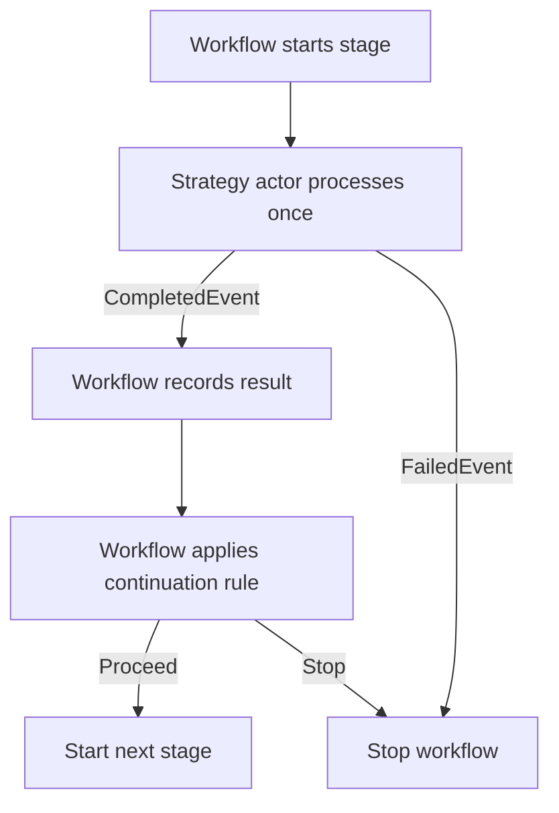
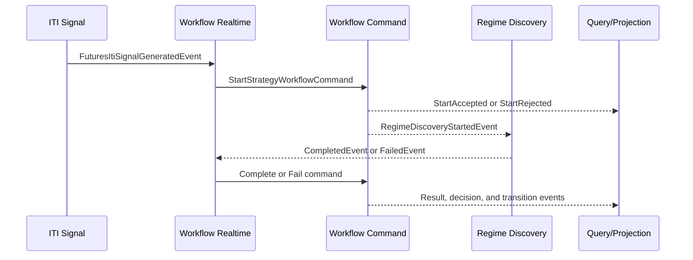

# Intrinsic Time Strategy Workflow

## Design Document v0.2

**Status:** Draft skeleton design for staged refinement  
**Date:** 2026-08-22  
**Primary actor:** `IntrinsicTimeStrategyWorkflowCommandActor`  
**Workflow type:** Deterministic, real-time, single-flight strategy workflow  
**Implementation target:** .NET 10 actor platform with PostgreSQL EventStoreDb, NATS Core/JetStream, and ScyllaDB projections
**Portfolio/Fund prerequisite:** [Portfolio-Fund-High-Level-Design-v0.1.md](../../../Documents/system/Portfolio-Fund-High-Level-Design-v0.1.md)

---

## 1. Document Purpose

This document defines the architectural skeleton for the Intrinsic Time Strategy Workflow.

The workflow coordinates these deterministic strategy actors in order:

1. Regime Discovery
2. Market Condition
3. Trade Selection
4. Order Composition
5. Risk Management

It defines:

- workflow identity and single-flight execution;
- the responsibilities of the workflow Command, Realtime, and Query actors;
- immutable in-memory workflow state passed to strategy actors;
- start-request acceptance and rejection tracking;
- the generic command/event protocol used by every strategy stage;
- the strict distinction between strategy-actor processing completion and workflow continuation;
- the Regime Discovery vertical slice as the first concrete stage skeleton;
- persistence, projections, queries, idempotency, recovery, and observability boundaries;
- placeholders for the continuation rules and detailed result contracts that will be designed with each strategy actor.

This is a design document, not yet a Codex implementation specification. It deliberately does not invent continuation rules or detailed strategy result properties that have not yet been designed.

---

## 2. Core Design Decisions

The following decisions are fixed for this version.

1. `EntityId` is the actor routing and concurrency boundary.
2. Only one strategy workflow may be executing for a given `EntityId`.
3. Each accepted execution receives a UUIDv7 `StrategyWorkflowId`.
4. Every distinct start request is recorded as Accepted or Rejected.
5. Duplicate transport delivery is idempotent and is not another start attempt.
6. The workflow is real-time and has no business retries.
7. Workflows are not queued, superseded, or executed in parallel for the same `EntityId`.
8. Each strategy stage is started at most once for an accepted workflow.
9. A strategy actor `CompletedEvent` means only that the actor successfully finished processing and produced a result.
10. A strategy actor `CompletedEvent` does not authorize the next workflow stage.
11. The workflow command actor owns all continuation decisions.
12. A strategy actor `FailedEvent` means the actor could not complete its assigned processing; the workflow stops immediately.
13. The workflow command actor is the sole writer and terminal-state authority for the workflow aggregate.
14. The workflow realtime actor translates events into commands but never decides whether the workflow continues.
15. The workflow query actor is side-effect free.
16. PostgreSQL EventStoreDb is authoritative.
17. ScyllaDB workflow views are rebuildable projections.
18. Immutable workflow snapshots cross actor boundaries; mutable aggregate references never do.
19. Only a completed workflow whose Risk Management result passes workflow continuation rules may start Order Execution.
20. LLM or agentic advisory output cannot advance the authoritative workflow, approve risk, or trigger execution.
21. TradeSelection and OrderComposition use the frozen new Portfolio/Fund mandate and composition identity model; they do not use the legacy Fund aggregate as production authority.
22. Fund reserves the integer OrderId and TradeId values after TradeSelection and before OrderComposition; all downstream stages preserve them unchanged.
23. OrderExecution is the final separate workflow and remains deferred during Portfolio/Fund, TradeSelection, and OrderComposition implementation.

---

## 3. Scope

### 3.1 Included

- acceptance or rejection of the primary intrinsic-time trigger;
- creation of a new strategy workflow execution;
- enforcement of one executing workflow per `EntityId`;
- orchestration of the five strategy stages;
- recording each strategy actor's processing result;
- evaluation of stage-specific workflow continuation rules;
- completion or stopping of the strategy workflow;
- handoff of a valid, risk-approved order intent to Order Execution;
- in-memory active workflow queries;
- ScyllaDB historical and operational projections;
- event replay and actor recovery.

The OrderExecution item above defines the eventual strategy-workflow boundary. Actual broker dispatch is not part of the Portfolio/Fund, TradeSelection, or OrderComposition implementation phase.

### 3.2 Excluded

- the detailed Regime Discovery algorithm;
- the detailed Market Condition algorithm;
- the detailed Trade Selection algorithm;
- the detailed Order Composition algorithm;
- the detailed Risk Management algorithm;
- final continuation rules for any stage;
- broker order submission, fills, cancel/replace, or reconciliation;
- position monitoring and exit workflows;
- LLM-controlled strategy decisions;
- automatic business retries;
- concurrent workflows for one entity.

Portfolio/Fund aggregate behavior, storage, UI, and legacy isolation are specified by the companion Portfolio/Fund HLD rather than this workflow orchestration document.

---

## 4. Workflow Stages

| Sequence | Stage | Strategy actor | Purpose |
| ---: | --- | --- | --- |
| 1 | Regime Discovery | `RegimeDiscoveryActor` | Produce the deterministic regime result required by workflow continuation rules |
| 2 | Market Condition | `MarketConditionActor` | Produce the current market-condition result |
| 3 | Trade Selection | `TradeSelectorActor` | Produce the selected strategy result, if any |
| 4 | Order Composition | `OrderComposerActor` | Produce the deterministic candidate/order-intent result |
| 5 | Risk Management | `RiskManagerActor` | Produce the final deterministic risk-evaluation result |

The workflow sequence is fixed. A stage cannot be skipped, repeated, or processed out of order.

---

## 5. Actor Topology

### 5.1 Workflow actors

The workflow is implemented by three actors.

#### IntrinsicTimeStrategyWorkflowCommandActor

The command actor is the sole owner of authoritative workflow state.

Responsibilities:

- handle workflow commands;
- load or reconstruct entity/workflow state from persisted events;
- enforce the single-flight invariant for `EntityId`;
- validate workflow identity, current stage, input workflow revision, message identity, and result contract;
- record Accepted and Rejected start decisions;
- record completed strategy-actor results;
- invoke the appropriate workflow continuation rule after a completed result;
- start the next stage or stop the workflow based on the continuation decision;
- stop immediately after an actor processing failure;
- complete the workflow only after Risk Management has completed and its result passes workflow continuation rules;
- persist workflow-owned events using optimistic concurrency;
- publish events only after persistence succeeds.

The command actor does not calculate regimes, market conditions, trade selections, order compositions, or risk results.

#### IntrinsicTimeStrategyWorkflowRealtimeActor

The realtime actor is the event-to-command adapter.

Responsibilities:

- consume the primary `FuturesItiSignalGeneratedEvent`;
- construct and send `StartStrategyWorkflowCommand`;
- consume strategy-actor Completed and Failed events;
- translate those events into the corresponding workflow commands;
- preserve `EntityId`, `WorkflowId`, `MessageId`, correlation, causation, input workflow revision, timestamps, and schema version;
- consume `IntrinsicTimeStrategyWorkflowCompletedEvent` and send the idempotent Order Execution command;
- deduplicate at-least-once message delivery.

It must not:

- mutate workflow state;
- apply continuation rules;
- infer whether a stage result is sufficient;
- start the next strategy actor on its own;
- stop or complete the workflow on its own.

#### IntrinsicTimeStrategyWorkflowQueryActor

The query actor serves read-only workflow state.

Responsibilities:

- return the active workflow by `EntityId`;
- return a workflow by `WorkflowId`;
- return start attempts and their Accepted/Rejected decisions;
- return current stage processing and continuation state;
- return the workflow timeline;
- serve active state from an immutable in-memory projection;
- serve historical and paged state from ScyllaDB projections;
- never publish trading events or send workflow commands.

### 5.2 Strategy actors

Each strategy actor owns its own processing state and business calculations.

A strategy actor:

- receives a stage-started event containing an immutable workflow snapshot;
- processes its assigned strategy capability once;
- publishes exactly one logical `CompletedEvent` or `FailedEvent`;
- never mutates workflow state;
- never decides whether the workflow starts the next stage;
- never publishes a workflow completed or workflow stopped event.

---

## 6. Identity Model

### 6.1 EntityId

`EntityId` is the permanent actor-routing and concurrency identity.

```text
ActorId = { ActorType, EntityId }
```

All commands for the same entity are processed sequentially by the same workflow command actor mailbox.

The exact composition of `EntityId` will be finalized with the surrounding strategy entity design. It must be stable, serializable, and suitable for routing, persistence, replay, telemetry, and idempotency.

### 6.2 StrategyWorkflowId

`StrategyWorkflowId` identifies one accepted execution of the strategy workflow.

It is:

- created as a UUIDv7 when `StartStrategyWorkflowCommand` is constructed;
- unique for each distinct start request;
- promoted to the executing workflow identity only if the start is accepted;
- passed through every strategy actor and workflow message;
- used to query the individual workflow state;
- passed to the Order Execution handoff;
- attached to OpenTelemetry spans and structured logs.

```csharp
public readonly record struct StrategyWorkflowId(Guid Value)
{
    public static StrategyWorkflowId New(TimeProvider timeProvider) =>
        new(Guid.CreateVersion7(timeProvider.GetUtcNow()));

    public override string ToString() => Value.ToString("N");
}
```

### 6.3 Message and correlation identities

| Identifier | Purpose |
| --- | --- |
| `MessageId` | Unique identity of one command or event |
| `EntityId` | Actor routing and single-flight boundary |
| `WorkflowId` | One proposed or accepted strategy workflow execution |
| `TriggerEventId` | Primary intrinsic-time event that requested the workflow |
| `CorrelationId` | Business correlation across the accepted strategy workflow and Order Execution handoff |
| `CausationId` | `MessageId` of the message that directly caused the current message |

For an accepted workflow, `CorrelationId` should normally be the `StrategyWorkflowId` value. The incoming trigger correlation remains available through `TriggerEventId`, `CausationId`, and optional parent-correlation metadata.

### 6.4 OpenTelemetry identity

`StrategyWorkflowId` is a business workflow identifier, not a replacement for the W3C OpenTelemetry trace ID.

The platform propagates normal `traceparent` and `tracestate` context through messaging headers and records `StrategyWorkflowId` as a span and structured-log attribute.

Recommended span attributes:

```text
strategy.workflow.id
strategy.workflow.entity_id
strategy.workflow.revision
strategy.workflow.stage
strategy.trigger.event_id
messaging.message.id
```

`StrategyWorkflowId` must not be used as a metric dimension because it is high-cardinality.

---

## 7. Single-Flight Execution

### 7.1 Invariant

For each `EntityId`:

```text
ExecutingWorkflowCount ∈ { 0, 1 }
```

No second workflow may start until the active workflow becomes terminal through:

- `IntrinsicTimeStrategyWorkflowCompletedEvent`; or
- `IntrinsicTimeStrategyWorkflowStoppedEvent`.

### 7.2 Start decisions

Every distinct `StartStrategyWorkflowCommand` produces exactly one decision:

| Entity state | Start decision |
| --- | --- |
| No executing workflow | Accepted |
| Executing workflow exists | Rejected: `WorkflowAlreadyExecuting` |
| Same command or trigger delivered again | Idempotent duplicate; not another attempt |

There is no queue, supersede policy, or parallel execution option.

### 7.3 Accepted start

An accepted start atomically appends:

```text
StrategyWorkflowStartAcceptedEvent
RegimeDiscoveryStartedEvent
```

The accepted event creates the individual workflow state. The Regime Discovery started event makes Regime Discovery the current processing stage and carries the first immutable workflow snapshot.

### 7.4 Rejected start

A rejected start appends:

```text
StrategyWorkflowStartRejectedEvent
```

The rejected event records:

- `EntityId`;
- requested UUIDv7 workflow ID;
- active workflow ID;
- start command ID;
- trigger event ID;
- active stage;
- rejection reason;
- rejection timestamp.

It does not:

- create another workflow;
- stop the active workflow;
- change the active workflow's logical revision;
- queue the rejected trigger.

### 7.5 Start attempt history

The event stream contains the complete start-attempt history through Accepted and Rejected events. No separate `StartAttemptedEvent` is required because Accepted and Rejected are exhaustive decisions.

The live aggregate should not retain an unbounded collection of attempts. It retains only operational summary fields such as:

- total start requests;
- accepted count;
- rejected count;
- last requested workflow ID;
- last start decision;
- last start timestamp.

Complete history is provided by the event stream and ScyllaDB projection.

---

## 8. Workflow and Stage Semantics

### 8.1 Strategy actor processing status

```csharp
public enum StrategyActorProcessingStatus
{
    NotStarted = 0,
    Processing = 1,
    Completed = 2,
    Failed = 3,
    TimedOut = 4
}
```

### 8.2 Workflow continuation decision

```csharp
public enum StrategyWorkflowContinuationDecision
{
    NotEvaluated = 0,
    Proceed = 1,
    Stop = 2
}
```

Processing status and continuation decision are separate state dimensions.

Example:

```text
Regime Discovery processing status: Completed
Workflow continuation decision:     Stop
```

This means Regime Discovery successfully produced its result, but the workflow rules determined that the next stage must not start.

### 8.3 CompletedEvent semantics

A strategy actor `CompletedEvent` means:

> The actor successfully completed its assigned processing and produced a result payload.

It does not mean:

- the workflow stage is sufficient for continuation;
- a trade opportunity exists;
- the next actor should start;
- the workflow should complete;
- an order may execute.

After receiving a Completed event, the workflow must:

1. validate the active workflow identity and current stage;
2. validate the input workflow revision;
3. validate the result contract;
4. record the accepted processing result;
5. apply the stage-specific workflow continuation rule;
6. persist the continuation decision;
7. start the next stage or stop the workflow.

### 8.4 FailedEvent semantics

A strategy actor `FailedEvent` means:

> The actor was unable to complete its assigned processing and could not produce a completed result.

The workflow does not apply normal continuation rules after a Failed event. It records the failure and stops immediately.

### 8.5 Invalid completed result

If an actor publishes a Completed event but its result violates the required contract, the workflow stops with a workflow result-validation failure.

This is distinct from the actor's own Failed event:

- actor Failed: the actor could not finish processing;
- invalid completed result: the actor reported completion, but the workflow could not accept the result contract.

---

## 9. State Model

### 9.1 Entity-level coordination state

The entity-level state enforces the single-flight invariant and tracks start-request summaries.

```csharp
public sealed record StrategyWorkflowEntityState
{
    public required string EntityId { get; init; }

    public StrategyWorkflowId? ActiveWorkflowId { get; init; }
    public StrategyWorkflowStatus ActiveWorkflowStatus { get; init; }

    public long TotalStartRequests { get; init; }
    public long AcceptedStartRequests { get; init; }
    public long RejectedStartRequests { get; init; }

    public Guid? LastStartCommandId { get; init; }
    public StrategyWorkflowId? LastRequestedWorkflowId { get; init; }
    public StrategyWorkflowStartDecision? LastStartDecision { get; init; }
    public DateTimeOffset? LastStartRequestedAtUtc { get; init; }

    public required long EntityStreamRevision { get; init; }
}
```

### 9.2 Individual immutable workflow state

Every accepted workflow receives an immutable in-memory state representation.

```csharp
public sealed record IntrinsicTimeStrategyWorkflowState
{
    public required StrategyWorkflowId WorkflowId { get; init; }
    public required string EntityId { get; init; }

    public required Guid TriggerEventId { get; init; }
    public required Guid CorrelationId { get; init; }

    public required string StrategyId { get; init; }
    public required int StrategyVersion { get; init; }
    public required string InstrumentId { get; init; }

    public required StrategyWorkflowStatus Status { get; init; }
    public required StrategyWorkflowOutcome Outcome { get; init; }
    public required StrategyWorkflowStage CurrentStage { get; init; }
    public required long WorkflowRevision { get; init; }

    public required DateTimeOffset StartedAtUtc { get; init; }
    public DateTimeOffset? TerminalAtUtc { get; init; }

    public required RegimeDiscoveryWorkflowState RegimeDiscovery { get; init; }
    public required MarketConditionWorkflowState MarketCondition { get; init; }
    public required TradeSelectionWorkflowState TradeSelection { get; init; }
    public required OrderCompositionWorkflowState OrderComposition { get; init; }
    public required RiskManagementWorkflowState RiskManagement { get; init; }

    public string? StopReasonCode { get; init; }
}
```

The exact result properties inside the five stage states will be defined with the corresponding strategy actor.

### 9.3 Stage state skeleton

```csharp
public sealed record StrategyWorkflowStageState<TResult>
{
    public required StrategyActorProcessingStatus ProcessingStatus { get; init; }
    public required StrategyWorkflowContinuationDecision ContinuationDecision { get; init; }

    public DateTimeOffset? StartedAtUtc { get; init; }
    public DateTimeOffset? CompletedAtUtc { get; init; }
    public DateTimeOffset? FailedAtUtc { get; init; }

    public TResult? Result { get; init; }

    public string? ContinuationRuleSetId { get; init; }
    public int? ContinuationRuleSetVersion { get; init; }
    public IReadOnlyList<string> ContinuationReasonCodes { get; init; } = [];

    public string? FailureCode { get; init; }
    public string? FailureMessage { get; init; }
}
```

Concrete stage-state types may wrap this generic skeleton or use explicit records if that better matches the codebase conventions.

### 9.4 Immutable state passing

The workflow state passed to strategy actors is immutable and transferred by value as part of the stage-started message.

The workflow command actor remains the only component allowed to produce the next state version.

Each subsequent stage receives a new state instance:

```text
Start accepted
    → workflow snapshot containing Regime Discovery = Processing

Regime Discovery result accepted and continuation = Proceed
    → new workflow snapshot containing Regime Discovery result
    → Market Condition = Processing
```

Strategy actors must not receive a shared mutable aggregate reference.

### 9.5 Entity stream revision and workflow revision

Two revisions are required:

| Revision | Meaning |
| --- | --- |
| `EntityStreamRevision` | Advances for every event in the entity stream, including rejected start attempts |
| `WorkflowRevision` | Advances only when the active individual workflow changes state |

A rejected start changes entity history but not the active workflow:

```text
Rejected start:
    EntityStreamRevision + 1
    WorkflowRevision unchanged
```

Strategy actors receive and return `WorkflowRevision`, not raw entity stream revision.

---

## 10. Workflow Status and Outcome

```csharp
public enum StrategyWorkflowStartDecision
{
    None = 0,
    Accepted = 1,
    Rejected = 2
}
```

```csharp
public enum StrategyWorkflowStage
{
    None = 0,
    RegimeDiscovery = 1,
    MarketCondition = 2,
    TradeSelection = 3,
    OrderComposition = 4,
    RiskManagement = 5
}
```

```csharp
public enum StrategyWorkflowStatus
{
    NotStarted = 0,
    Running = 1,
    Completed = 2,
    Stopped = 3
}
```

```csharp
public enum StrategyWorkflowOutcome
{
    None = 0,
    OrderReady = 1,
    StoppedByContinuationRule = 2,
    StrategyActorFailed = 3,
    InvalidStrategyActorResult = 4,
    StageTimedOut = 5,
    Cancelled = 6,
    ConsistencyFault = 7
}
```

Detailed stop reason codes are defined with each strategy actor and its continuation rules.

`Completed` has one meaning:

> Risk Management completed processing, the workflow accepted its result, and the Risk Management continuation rule authorized the Order Execution handoff.

All other terminal paths use `Stopped`.

---

## 11. Generic Strategy Stage Protocol

Every stage follows the same structural pattern.



### 11.1 Started event

The workflow publishes a stage-started event containing:

- message metadata;
- `EntityId`;
- `WorkflowId`;
- `WorkflowRevision`;
- the immutable workflow state;
- stage start timestamp;
- optional processing deadline.

### 11.2 Completed event

The strategy actor publishes a Completed event containing:

- message metadata;
- `EntityId`;
- `WorkflowId`;
- `InputWorkflowRevision`;
- the strategy actor's completed result;
- completion timestamp.

It does not contain the workflow continuation decision.

### 11.3 Failed event

The strategy actor publishes a Failed event containing:

- message metadata;
- `EntityId`;
- `WorkflowId`;
- `InputWorkflowRevision`;
- failure code and summary;
- failure timestamp.

It never contains a retry request.

### 11.4 Workflow completion command for a stage

The workflow realtime actor maps the actor Completed event to a workflow Complete command.

The command means:

> Validate and record the strategy actor result, evaluate the stage continuation rule, and persist the resulting workflow transition.

### 11.5 Workflow failure command for a stage

The workflow realtime actor maps the actor Failed event to a workflow Fail command.

The command means:

> Validate and record the strategy actor failure and stop the workflow.

### 11.6 Atomic transition

After a completed actor result, the workflow atomically appends:

```text
StrategyWorkflowStageResultRecordedEvent
StrategyWorkflowStageContinuationEvaluatedEvent
NextStrategyStageStartedEvent
```

or:

```text
StrategyWorkflowStageResultRecordedEvent
StrategyWorkflowStageContinuationEvaluatedEvent
IntrinsicTimeStrategyWorkflowStoppedEvent
```

After a Failed event, the workflow atomically appends:

```text
StrategyWorkflowStageFailedEvent
IntrinsicTimeStrategyWorkflowStoppedEvent
```

---

## 12. Command Catalog

### 12.1 Workflow start command

```text
StartStrategyWorkflowCommand
```

### 12.2 Regime Discovery commands

```text
CompleteRegimeDiscoveryCommand
FailRegimeDiscoveryCommand
TimeoutRegimeDiscoveryCommand
```

### 12.3 Market Condition commands

```text
CompleteMarketConditionCommand
FailMarketConditionCommand
TimeoutMarketConditionCommand
```

### 12.4 Trade Selection commands

```text
CompleteTradeSelectionCommand
FailTradeSelectionCommand
TimeoutTradeSelectionCommand
```

### 12.5 Order Composition commands

```text
CompleteOrderCompositionCommand
FailOrderCompositionCommand
TimeoutOrderCompositionCommand
```

### 12.6 Risk Management commands

```text
CompleteRiskManagementCommand
FailRiskManagementCommand
TimeoutRiskManagementCommand
```

### 12.7 Administrative terminal command

```text
CancelStrategyWorkflowCommand
```

Timeout and cancellation are terminal safeguards, not business retries. Exact timeout policies remain to be defined.

---

## 13. Workflow-Owned Event Catalog

### 13.1 Start events

```text
StrategyWorkflowStartAcceptedEvent
StrategyWorkflowStartRejectedEvent
```

### 13.2 Stage lifecycle events

```text
RegimeDiscoveryStartedEvent
StrategyWorkflowRegimeDiscoveryResultRecordedEvent
StrategyWorkflowRegimeDiscoveryContinuationEvaluatedEvent
StrategyWorkflowRegimeDiscoveryFailedEvent
StrategyWorkflowRegimeDiscoveryTimedOutEvent

MarketConditionStartedEvent
StrategyWorkflowMarketConditionResultRecordedEvent
StrategyWorkflowMarketConditionContinuationEvaluatedEvent
StrategyWorkflowMarketConditionFailedEvent
StrategyWorkflowMarketConditionTimedOutEvent

TradeSelectionStartedEvent
StrategyWorkflowTradeSelectionResultRecordedEvent
StrategyWorkflowTradeSelectionContinuationEvaluatedEvent
StrategyWorkflowTradeSelectionFailedEvent
StrategyWorkflowTradeSelectionTimedOutEvent

OrderCompositionStartedEvent
StrategyWorkflowOrderCompositionResultRecordedEvent
StrategyWorkflowOrderCompositionContinuationEvaluatedEvent
StrategyWorkflowOrderCompositionFailedEvent
StrategyWorkflowOrderCompositionTimedOutEvent

RiskManagementStartedEvent
StrategyWorkflowRiskManagementResultRecordedEvent
StrategyWorkflowRiskManagementContinuationEvaluatedEvent
StrategyWorkflowRiskManagementFailedEvent
StrategyWorkflowRiskManagementTimedOutEvent
```

### 13.3 Terminal events

```text
IntrinsicTimeStrategyWorkflowCompletedEvent
IntrinsicTimeStrategyWorkflowStoppedEvent
```

Workflow-owned events record what the workflow accepted and decided. They do not duplicate ownership of the source strategy actor's Completed or Failed event.

---

## 14. Strategy Actor Output Event Catalog

These events are owned by the corresponding strategy actors.

```text
RegimeDiscoveryCompletedEvent
RegimeDiscoveryFailedEvent

MarketConditionCompletedEvent
MarketConditionFailedEvent

TradeSelectionCompletedEvent
TradeSelectionFailedEvent

OrderCompositionCompletedEvent
OrderCompositionFailedEvent

RiskManagementCompletedEvent
RiskManagementFailedEvent
```

None of these events directly starts the next workflow stage.

---

## 15. Realtime Event-to-Command Mapping

| Incoming event | Directed workflow command |
| --- | --- |
| `FuturesItiSignalGeneratedEvent` | `StartStrategyWorkflowCommand` |
| `RegimeDiscoveryCompletedEvent` | `CompleteRegimeDiscoveryCommand` |
| `RegimeDiscoveryFailedEvent` | `FailRegimeDiscoveryCommand` |
| `MarketConditionCompletedEvent` | `CompleteMarketConditionCommand` |
| `MarketConditionFailedEvent` | `FailMarketConditionCommand` |
| `TradeSelectionCompletedEvent` | `CompleteTradeSelectionCommand` |
| `TradeSelectionFailedEvent` | `FailTradeSelectionCommand` |
| `OrderCompositionCompletedEvent` | `CompleteOrderCompositionCommand` |
| `OrderCompositionFailedEvent` | `FailOrderCompositionCommand` |
| `RiskManagementCompletedEvent` | `CompleteRiskManagementCommand` |
| `RiskManagementFailedEvent` | `FailRiskManagementCommand` |

The realtime actor copies the source result or failure into the workflow command without adding a continuation decision.

---

## 16. Query Catalog

### 16.1 Active and individual workflow queries

```text
GetStrategyWorkflowByIdQuery
GetActiveStrategyWorkflowByEntityIdQuery
```

### 16.2 Start-attempt queries

```text
GetStrategyWorkflowStartAttemptsQuery
GetLatestStrategyWorkflowStartDecisionQuery
```

### 16.3 Stage queries

```text
GetStrategyWorkflowStageStateQuery
GetRegimeDiscoveryWorkflowStateQuery
GetMarketConditionWorkflowStateQuery
GetTradeSelectionWorkflowStateQuery
GetOrderCompositionWorkflowStateQuery
GetRiskManagementWorkflowStateQuery
```

### 16.4 Operational queries

```text
GetStrategyWorkflowTimelineQuery
GetRecentStrategyWorkflowsQuery
GetStoppedStrategyWorkflowsQuery
GetCompletedStrategyWorkflowsQuery
```

### 16.5 Query behavior

Active queries may initially be served from the query actor's immutable in-memory projection.

Historical, paged, or filtered queries are served from ScyllaDB projections.

Queries never:

- start actors;
- advance stages;
- modify state;
- publish trading events;
- trigger Order Execution.

---

## 17. Start Workflow Vertical Slice

### 17.1 Trigger

The primary trigger is:

```text
FuturesItiSignalGeneratedEvent
```

The exact eligible ITI signal subtype will be defined later. The workflow realtime actor uses the event to construct `StartStrategyWorkflowCommand` with a UUIDv7 proposed workflow ID.

### 17.2 Command handling

```csharp
if (IsDuplicate(command.MessageId, command.TriggerEventId))
{
    return;
}

if (state.HasExecutingWorkflow)
{
    Append(new StrategyWorkflowStartRejectedEvent(...));
    return;
}

AppendAtomically(
    new StrategyWorkflowStartAcceptedEvent(...),
    new RegimeDiscoveryStartedEvent(...));
```

### 17.3 StartAccepted meaning

`StrategyWorkflowStartAcceptedEvent`:

- creates the accepted individual workflow state;
- assigns the proposed UUIDv7 as the active workflow ID;
- initializes status as Running;
- initializes all five stage states;
- increments start-attempt counters;
- begins workflow revisioning.

### 17.4 StartRejected meaning

`StrategyWorkflowStartRejectedEvent`:

- records a distinct rejected start request;
- references the currently executing workflow;
- does not create another workflow;
- does not change active workflow revision;
- updates start-attempt queries and projections.

---

## 18. Regime Discovery Vertical Slice

Regime Discovery is the first stage and establishes the reusable pattern for all later stages.

### 18.1 Message sequence



### 18.2 RegimeDiscoveryStartedEvent

The event contains the immutable state required by the Regime Discovery actor.

```csharp
public sealed record RegimeDiscoveryStartedEvent
{
    public required Guid MessageId { get; init; }
    public required string EntityId { get; init; }

    public required StrategyWorkflowId WorkflowId { get; init; }
    public required long WorkflowRevision { get; init; }

    public required Guid CorrelationId { get; init; }
    public required Guid CausationId { get; init; }

    public required IntrinsicTimeStrategyWorkflowState WorkflowState { get; init; }

    public required DateTimeOffset StartedAtUtc { get; init; }
    public DateTimeOffset? ExpectedCompletionAtUtc { get; init; }
}
```

### 18.3 Regime Discovery actor responsibility

`RegimeDiscoveryRealtimeActor`:

1. validates that the supplied immutable state identifies Regime Discovery as the current stage;
2. executes Regime Discovery once;
3. publishes `RegimeDiscoveryCompletedEvent` if it successfully produces a result;
4. publishes `RegimeDiscoveryFailedEvent` if it cannot complete processing.

It does not decide whether Market Condition starts.

### 18.4 RegimeDiscoveryResult skeleton

```csharp
public sealed record RegimeDiscoveryResult
{
    public required Guid ResultId { get; init; }

    // Detailed Regime Discovery output properties will be added
    // when the RegimeDiscovery actor is designed.

    public required DateTimeOffset MarketDataAsOfUtc { get; init; }
    public required DateTimeOffset ProducedAtUtc { get; init; }
}
```

Potential classifications, scores, supporting snapshot references, hashes, and reason values remain intentionally undefined in this document.

### 18.5 RegimeDiscoveryCompletedEvent

```csharp
public sealed record RegimeDiscoveryCompletedEvent
{
    public required Guid MessageId { get; init; }
    public required string EntityId { get; init; }

    public required StrategyWorkflowId WorkflowId { get; init; }
    public required long InputWorkflowRevision { get; init; }

    public required Guid CorrelationId { get; init; }
    public required Guid CausationId { get; init; }

    public required RegimeDiscoveryResult Result { get; init; }

    public required DateTimeOffset CompletedAtUtc { get; init; }
}
```

This event means processing completed. It contains no `Proceed`, `Stop`, `NoTrade`, or next-stage instruction.

### 18.6 RegimeDiscoveryFailedEvent

```csharp
public sealed record RegimeDiscoveryFailedEvent
{
    public required Guid MessageId { get; init; }
    public required string EntityId { get; init; }

    public required StrategyWorkflowId WorkflowId { get; init; }
    public required long InputWorkflowRevision { get; init; }

    public required Guid CorrelationId { get; init; }
    public required Guid CausationId { get; init; }

    public required string FailureCode { get; init; }
    public required string FailureMessage { get; init; }

    public required DateTimeOffset FailedAtUtc { get; init; }
}
```

This event means the actor could not produce a completed Regime Discovery result.

### 18.7 CompleteRegimeDiscoveryCommand

The workflow realtime actor converts the Completed event into:

```csharp
public sealed record CompleteRegimeDiscoveryCommand
{
    public required Guid MessageId { get; init; }
    public required string EntityId { get; init; }

    public required StrategyWorkflowId WorkflowId { get; init; }
    public required long InputWorkflowRevision { get; init; }

    public required Guid SourceEventId { get; init; }
    public required Guid CorrelationId { get; init; }
    public required Guid CausationId { get; init; }

    public required RegimeDiscoveryResult Result { get; init; }
    public required DateTimeOffset CompletedAtUtc { get; init; }
}
```

The command actor then:

1. verifies the active workflow and current stage;
2. verifies `InputWorkflowRevision`;
3. validates the Regime Discovery result contract;
4. records the result;
5. evaluates the Regime Discovery workflow continuation rule;
6. persists the decision;
7. starts Market Condition or stops the workflow.

### 18.8 Regime Discovery continuation rule placeholder

```csharp
private StrategyWorkflowContinuationResult
    EvaluateRegimeDiscoveryContinuation(
        IntrinsicTimeStrategyWorkflowState workflow,
        RegimeDiscoveryResult result)
{
    // Defined with the full RegimeDiscovery actor design.
    throw new NotImplementedException();
}
```

```csharp
public sealed record StrategyWorkflowContinuationResult
{
    public required StrategyWorkflowContinuationDecision Decision { get; init; }
    public required string RuleSetId { get; init; }
    public required int RuleSetVersion { get; init; }
    public required IReadOnlyList<string> ReasonCodes { get; init; }
}
```

### 18.9 Regime Discovery proceed transition

If the future continuation rule returns `Proceed`, atomically append:

```text
StrategyWorkflowRegimeDiscoveryResultRecordedEvent
StrategyWorkflowRegimeDiscoveryContinuationEvaluatedEvent
MarketConditionStartedEvent
```

The `MarketConditionStartedEvent` carries a new immutable workflow snapshot containing the recorded Regime Discovery result and decision.

### 18.10 Regime Discovery stop transition

If the continuation rule returns `Stop`, atomically append:

```text
StrategyWorkflowRegimeDiscoveryResultRecordedEvent
StrategyWorkflowRegimeDiscoveryContinuationEvaluatedEvent
IntrinsicTimeStrategyWorkflowStoppedEvent
```

The workflow is terminal, but Regime Discovery remains recorded as successfully completed.

### 18.11 Regime Discovery failure transition

After `RegimeDiscoveryFailedEvent`, the realtime actor sends `FailRegimeDiscoveryCommand`.

The command actor atomically appends:

```text
StrategyWorkflowRegimeDiscoveryFailedEvent
IntrinsicTimeStrategyWorkflowStoppedEvent
```

No continuation rule is evaluated and no retry occurs.

---

## 19. Later Strategy Stage Skeletons

Each later stage repeats the Regime Discovery structural pattern.

### 19.1 Market Condition

```text
MarketConditionStartedEvent
    → MarketConditionCompletedEvent
        → CompleteMarketConditionCommand
            → record result
            → evaluate Market Condition continuation rules
            → TradeSelectionStartedEvent or WorkflowStoppedEvent

MarketConditionFailedEvent
    → FailMarketConditionCommand
        → WorkflowStoppedEvent
```

### 19.2 Trade Selection

```text
TradeSelectionStartedEvent
    → TradeSelectionCompletedEvent
        → CompleteTradeSelectionCommand
            → record result
            → evaluate Trade Selection continuation rules
            → OrderCompositionStartedEvent or WorkflowStoppedEvent

TradeSelectionFailedEvent
    → FailTradeSelectionCommand
        → WorkflowStoppedEvent
```

### 19.3 Order Composition

```text
OrderCompositionStartedEvent
    → OrderCompositionCompletedEvent
        → CompleteOrderCompositionCommand
            → record result
            → evaluate Order Composition continuation rules
            → RiskManagementStartedEvent or WorkflowStoppedEvent

OrderCompositionFailedEvent
    → FailOrderCompositionCommand
        → WorkflowStoppedEvent
```

### 19.4 Risk Management

```text
RiskManagementStartedEvent
    → RiskManagementCompletedEvent
        → CompleteRiskManagementCommand
            → record result
            → evaluate Risk Management continuation rules
            → WorkflowCompletedEvent or WorkflowStoppedEvent

RiskManagementFailedEvent
    → FailRiskManagementCommand
        → WorkflowStoppedEvent
```

Risk Management does not publish the workflow completed event. The workflow command actor owns that terminal transition.

---

## 20. Order Execution Handoff

Only `IntrinsicTimeStrategyWorkflowCompletedEvent` may cause the Order Execution command.

The terminal completed event must contain or reference:

- `StrategyWorkflowId`;
- final immutable workflow revision;
- accepted Order Composition result or order-intent ID/hash;
- accepted Risk Management result or risk-approval ID;
- risk approval expiry, once defined;
- strategy and configuration versions;
- completion timestamp.

The workflow realtime actor consumes the committed terminal event and sends the idempotent Order Execution command.

Order Execution is a separate workflow with its own identity and broker lifecycle. A later broker failure does not rewrite the completed strategy workflow.

---

## 21. Persistence Model

### 21.1 Authoritative entity stream

To enforce the single-flight invariant atomically, the command-side persistence boundary is the strategy entity:

```text
intrinsic-time-strategy-workflow-{EntityId}
```

The stream may contain multiple sequential accepted workflows and rejected start requests. Every workflow-owned event includes `WorkflowId`.

### 21.2 Workflow reconstruction

The command actor reconstructs:

- entity-level coordination state;
- currently active individual workflow state;
- recent terminal summary needed for command validation.

Full historical workflow and start-attempt lists belong to projections, not the live aggregate.

### 21.3 Optimistic concurrency

All appends use the expected entity stream revision.

After a concurrency conflict, the command actor reloads the stream and re-evaluates the command. It never blindly appends.

### 21.4 Publication

Workflow events are published only after the authoritative append succeeds. The durable event/outbox path handles publication and redelivery.

---

## 22. ScyllaDB Projections

Initial projections:

### 22.1 StrategyWorkflowView

One row per accepted `WorkflowId` containing:

- entity and workflow identity;
- trigger identity;
- strategy identity/version;
- workflow status/outcome;
- current stage and workflow revision;
- five stage processing states;
- five continuation decisions;
- accepted stage result summaries/references;
- terminal reason;
- timestamps.

### 22.2 StrategyWorkflowStartAttemptView

One row per distinct start decision containing:

- `EntityId`;
- requested workflow ID;
- Accepted or Rejected;
- active workflow ID for rejections;
- command and trigger identities;
- active stage at rejection;
- reason code;
- decision timestamp.

### 22.3 ActiveStrategyWorkflowByEntityView

At most one row per `EntityId`, containing the currently executing workflow summary.

The row is removed or marked terminal after Completed or Stopped.

### 22.4 StrategyWorkflowTimelineView

Ordered workflow transition entries for operations and debugging.

All ScyllaDB views are rebuildable from PostgreSQL EventStoreDb.

---

## 23. In-Memory Query Representation

The initial query implementation may keep immutable active workflow snapshots indexed by:

```text
EntityId
WorkflowId
```

The query actor applies only committed workflow events to its in-memory projection.

It must never expose the command actor's mutable internal aggregate. Responses contain immutable snapshots or DTOs.

If an active query requests a minimum `WorkflowRevision`, the query actor must return:

- the snapshot at or beyond that revision; or
- a typed `SnapshotNotReady` response.

It must not silently return stale state as current.

---

## 24. Idempotency and Delivery

NATS/JetStream delivery is at-least-once. Duplicate delivery is expected.

### 24.1 Duplicate start command

- same `MessageId`: no-op;
- same `TriggerEventId` for the same strategy/entity: no-op;
- neither produces another Accepted or Rejected attempt event.

### 24.2 Duplicate stage result

- same source event ID and same result identity/hash: no-op;
- same identity with different content: consistency fault and workflow stop;
- late result after terminal workflow: stale no-op with metric/log.

### 24.3 No business retry

The following are not allowed:

- rerunning a strategy calculation after a Failed event;
- restarting a stage after a Failed event;
- retrying continuation rules as a new business attempt;
- starting another workflow for the entity before the active one is terminal;
- queuing rejected start requests.

Transport redelivery of the same message is handled idempotently and is not a business retry.

---

## 25. Timeout and Stalled Stage Handling

A real-time stage must not leave an entity blocked forever.

The stage-started event may carry `ExpectedCompletionAtUtc`. A durable timeout mechanism may send the matching timeout command.

The command actor applies the timeout only if:

- the workflow is still active;
- the same stage is still current;
- the expected input workflow revision is still applicable;
- no Completed or Failed result has already been accepted.

The timeout transition stops the workflow. It does not rerun the stage.

Exact stage timeouts will be defined with each strategy actor.

---

## 26. Workflow Invariants

The command actor must enforce:

1. One executing workflow per `EntityId`.
2. One accepted workflow per eligible trigger identity.
3. One UUIDv7 workflow ID identifies one proposed start request.
4. A terminal workflow is immutable.
5. Only the current stage may publish an applicable result.
6. Each stage starts at most once per workflow.
7. Each stage produces at most one accepted logical result.
8. A Completed event never directly starts the next stage.
9. A continuation decision can occur only after an accepted Completed result.
10. A Failed event always stops the workflow.
11. A workflow continuation decision is persisted before the next stage is published.
12. Stage result, continuation decision, and next-stage/terminal event are appended atomically.
13. A rejected start does not modify active workflow revision or state.
14. Only the workflow command actor publishes workflow terminal events.
15. Only a workflow Completed event may trigger Order Execution.

---

## 27. Observability

### 27.1 Tracing

Create spans for:

- trigger consumption;
- start command dispatch and handling;
- event-store append;
- stage-start publication;
- strategy actor processing;
- Completed/Failed event consumption;
- continuation-rule evaluation;
- projection updates;
- terminal transition;
- Order Execution handoff.

### 27.2 Structured logging

Every workflow log should include:

- `EntityId`;
- `WorkflowId`;
- `WorkflowRevision`;
- current stage;
- `MessageId`;
- `CorrelationId`;
- `CausationId`;
- event/command type.

### 27.3 Metrics

Initial metrics:

- start requests;
- accepted starts;
- rejected starts;
- executing workflows;
- completed workflows;
- stopped workflows;
- strategy actor failures by stage;
- continuation stops by stage and reason;
- stage duration;
- end-to-end workflow duration;
- timeouts;
- duplicate messages;
- stale results;
- consistency faults;
- projection lag.

Workflow IDs must not be metric labels.

---

## 28. Test Skeleton

### 28.1 Start tests

- accepts a start when the entity has no executing workflow;
- atomically emits Accepted and Regime Discovery Started;
- rejects a distinct start while a workflow is executing;
- records requested and active workflow IDs on rejection;
- does not alter active workflow revision on rejection;
- ignores duplicate start-command delivery;
- allows a new start after Completed;
- allows a new start after Stopped.

### 28.2 Regime Discovery tests

- passes the immutable workflow snapshot to Regime Discovery;
- accepts one Completed result for the correct workflow and revision;
- records the result before evaluating continuation;
- proceeds to Market Condition when the continuation rule returns Proceed;
- stops while retaining Completed processing status when the continuation rule returns Stop;
- stops immediately after `RegimeDiscoveryFailedEvent`;
- does not evaluate continuation after Failed;
- rejects a result for another workflow;
- rejects a result for a stale workflow revision;
- ignores duplicate identical result delivery;
- treats conflicting duplicate content as a consistency fault;
- ignores a late result after terminal state.

### 28.3 Generic stage tests

The Regime Discovery tests become a reusable contract suite for the other four strategy stages.

### 28.4 Query tests

- query by active `EntityId`;
- query by `WorkflowId`;
- query Accepted and Rejected start history;
- query stage processing status separately from continuation decision;
- query terminal workflow state;
- rebuild ScyllaDB views from the event stream;
- rebuild in-memory active state after actor/query restart.

---

## 29. Open Design Placeholders

The following are intentionally deferred until the corresponding actor is designed:

1. Exact eligibility rules for `FuturesItiSignalGeneratedEvent`.
2. Exact `EntityId` composition.
3. Regime Discovery result fields.
4. Regime Discovery continuation rules and reason codes.
5. Market Condition result fields and continuation rules.
6. Trade Selection result fields and continuation rules.
7. Order Composition result fields and continuation rules.
8. Risk Management result fields and continuation rules.
9. Exact stage timeout values.
10. Final Order Execution command name and payload alignment.
11. Detailed NATS subjects and queue configuration.
12. Concrete ScyllaDB table schemas.
13. Concrete PostgreSQL event serialization contracts.
14. Snapshot retention and in-memory query eviction policy.

These placeholders are design extension points, not permission for an implementation agent to invent business behavior.

---

## 30. Path to Implementation Specifications

The recommended documentation sequence is:

1. finalize this workflow skeleton;
2. design `RegimeDiscoveryActor` result and continuation rules;
3. update this workflow document with the Regime Discovery rules;
4. produce the Regime Discovery implementation specification;
5. repeat for Market Condition;
6. repeat for Trade Selection;
7. repeat for Order Composition;
8. repeat for Risk Management;
9. finalize the terminal Order Execution handoff;
10. create the complete Codex implementation specification for all three workflow actors.

This sequencing keeps strategy calculations inside their capability actors while preserving workflow ownership of stage sequencing and continuation.

---

## 31. Final Architectural Rule

The complete workflow can be summarized as:

```text
Distinct StartStrategyWorkflowCommand
    → Start Accepted or Rejected

Accepted
    → Start current strategy actor with immutable workflow state

StrategyActorCompletedEvent
    → Record completed result
    → Evaluate workflow-owned continuation rules
    → Start next strategy actor or stop workflow

StrategyActorFailedEvent
    → Record actor processing failure
    → Stop workflow immediately

RiskManagerCompletedEvent
    → Record risk result
    → Evaluate workflow-owned Risk Management continuation rules
    → Complete workflow or stop workflow

WorkflowCompletedEvent only
    → Send Order Execution command
```

The strategy actors own processing results. The workflow actor owns whether those results permit the strategy to continue.
## 24. Generated pipeline decision references

Regime Discovery and Market Condition expose storage-free, on-demand decision-reference queries through their stage
Query actors and Core NATS request/reply. Each returns a typed array of representative pairwise DTO rows generated by
the production decision model. Reference rows are explicitly non-authoritative and non-exhaustive; they cannot affect
workflow execution, configuration, persistence, or downstream decisions. CSV formatting is a caller-side concern
implemented by the typed services in `Domain.Trade.Shared/DataExport`.

The complete V1 contract, console example, extension rules, and PDR qualification record are defined in
`Workflow/IntrinsicTime/Docs/Pipeline-Decision-Reference-Queries-v1.0.md`.
