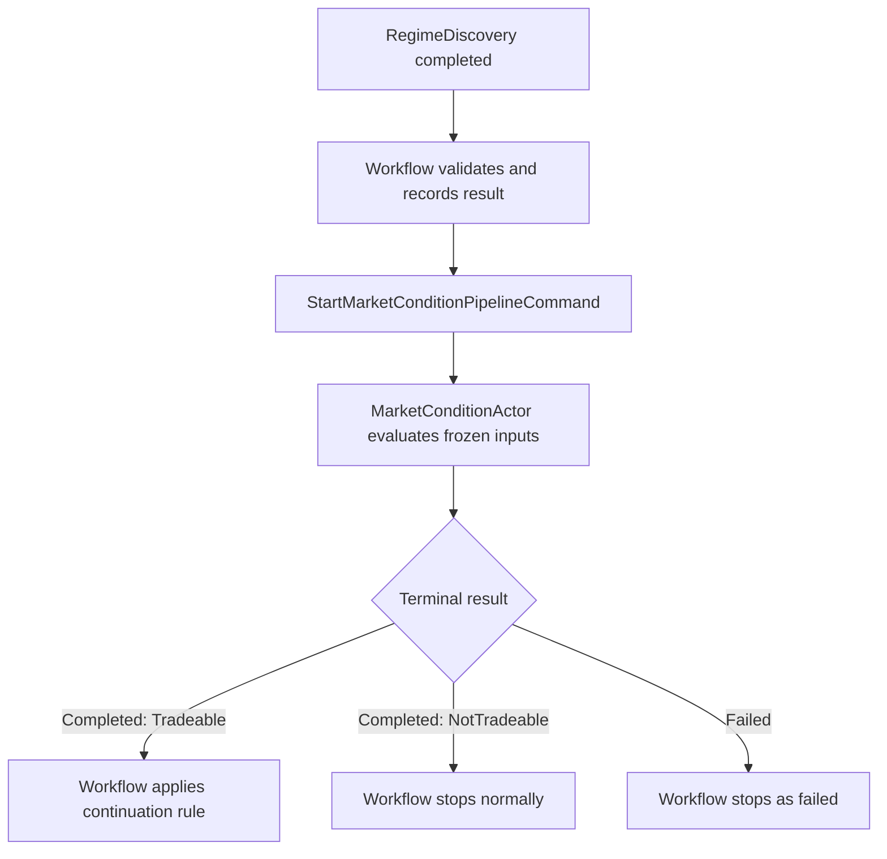

# MarketCondition High-Level Design

**Document version:** 0.1 
**Status:** High-level design 
**System:** Intrinsic Time Trade Strategy Workflow 
**Stage:** MarketCondition 
**Primary implementation target:** .NET 10 / C# actor-based trading system

**Detailed specification:** `MarketCondition-Specification-v1.0.md`

**Implementation plan:** `MarketCondition-Implementation-Plan-v1.0.md`

> Architecture alignment: the detailed V1 specification is authoritative for implementation mechanics. It replaces
> this high-level document's provisional Start/MarketConditionActor/publication language with the completed-only
> FunctionActor request/reply pattern established by Regime Discovery. The business boundaries in this document remain
> authoritative.

## 1. Purpose

MarketCondition is the second decision stage in the trade strategy workflow. It receives the market regime already discovered for the workflow and determines whether a usable trading opportunity exists **now** for the requested instrument, fund, and decision horizon.

Its central question is:

> Given the discovered regime, the intrinsic-time trigger, and current market and operational conditions, is the market tradeable now, and what condition is present?

MarketCondition does not select a trade, compose an order, approve portfolio risk, or execute anything. It produces a deterministic, typed result that the Strategy Workflow evaluates before deciding whether to continue to TradeSelection.

## 2. Position in the Strategy Workflow

The fixed workflow sequence is:

1. RegimeDiscovery
2. MarketCondition
3. TradeSelection
4. OrderComposition
5. RiskManagement
6. OrderExecution

The stages cannot be skipped, repeated, or reordered within one workflow execution.

## 3. Separation of Responsibilities

| Stage | Primary question | Typical time character | Authoritative output |
| --- | --- | --- | --- |
| RegimeDiscovery | What market regime exists? | Broader and relatively persistent | Trend, volatility, structure, scores, and horizon context |
| MarketCondition | Is there a tradeable opportunity now? | Immediate and short-lived | Tradeability, condition classification, direction, phase, strength, confidence, evidence, and blockers |
| TradeSelection | Which permitted trade structure best fits? | Workflow decision | Selected trade type or no compatible trade |
| OrderComposition | What exact legs, quantities, and prices express it? | Execution preparation | Candidate order |
| RiskManagement | May the portfolio accept this candidate order? | Portfolio and capital state | Approved or denied |
| OrderExecution | Can and should the approved order be submitted now? | Broker and venue state | Submission and execution result |

This separation prevents MarketCondition from becoming a second regime engine, strategy selector, or risk manager.

## 4. Core Design Decisions

1. **One actor at the workflow boundary.** `MarketConditionActor` owns the MarketCondition stage. V1 uses private, deterministic evaluator components rather than a graph of child actors.
2. **Deterministic authority.** All classifications, gates, scores, and reason codes are produced by versioned deterministic rules.
3. **Completed does not mean continue.** A completed event means the actor processed its inputs successfully and returned a valid result. Only the Strategy Workflow decides whether to continue.
4. **NotTradeable is a successful business result.** It is represented by `MarketConditionPipelineCompletedEvent`, not by a failure event.
5. **Failed means unable to evaluate reliably.** Failure is reserved for invalid contracts, missing configuration, corrupt mandatory inputs, calculation errors, or other technical inability to produce a valid result.
6. **No automatic actor retries.** A failure stops the workflow. A later market trigger may start a new workflow after the current workflow reaches a terminal state.
7. **Frozen evaluation.** Each invocation evaluates an immutable point-in-time input snapshot and the parameter-set version frozen when the workflow started.
8. **Short-lived result.** Every result carries `EvaluatedAtUtc` and `ValidUntilUtc`. An expired result cannot authorize downstream processing.
9. **No LLM authority.** The actor produces structured evidence and a deterministic summary. A workflow-level LLM summary may explain the result later but cannot change it.

## 5. Actor Boundary

### 5.1 Actor name

`MarketConditionActor`

### 5.2 Actor responsibility

The actor:

- validates the stage invocation and its immutable inputs;
- constructs or accepts a point-in-time MarketCondition input snapshot;
- checks data fitness and hard tradeability gates;
- evaluates current market condition features;
- classifies direction, phase, and condition;
- calculates strength and confidence;
- generates evidence, blocker reasons, and a deterministic summary;
- emits exactly one logical terminal event for the invocation.

### 5.3 Actor exclusions

The actor does not:

- recalculate or override the RegimeDiscovery result;
- select an option or futures strategy;
- select strikes, expiries, quantities, or limit prices;
- approve capital, margin, or portfolio risk;
- place or modify broker orders;
- mutate Strategy Workflow state;
- retry failed processing;
- call an LLM for a decision;
- consume unrestricted live state throughout its calculation.

## 6. Invocation Contract

### 6.1 Start command

`StartMarketConditionPipelineCommand`

| Field | Purpose |
| --- | --- |
| `WorkflowId` | GUID v7 identity shared by the full strategy workflow and mapped to the OTEL trace identity |
| `StageInvocationId` | Unique identity for this logical MarketCondition invocation |
| `EntityId` | Workflow concurrency entity, such as fund-strategy-instrument identity |
| `FundId` | Fund for which the opportunity is being evaluated |
| `InstrumentId` | Primary market instrument, initially ES |
| `DecisionHorizon` | Daily, Weekly, or Monthly |
| `WorkflowRevision` | Expected workflow revision for ordered stage acceptance |
| `TriggeredAtUtc` | Time of the original workflow trigger |
| `StageStartedAtUtc` | Time MarketCondition was invoked |
| `TriggerContext` | Immutable intrinsic-time DC/TE/TR trigger details and source sequence identifiers |
| `RegimeDiscoveryResult` | Previously accepted, immutable typed result |
| `WorkflowSnapshot` | Read-only context accepted by the workflow through the prior stage |
| `ParameterSetId` | Selected MarketCondition parameter-set identity |
| `ParameterSetVersion` | Immutable parameter version frozen at workflow start |
| `TraceContext` | W3C trace propagation information when not derivable from `WorkflowId` |

The command contains a result envelope, not a mutable workflow object. MarketCondition returns its own result envelope and never edits the input snapshot.

### 6.2 Optional cancel command

`CancelMarketConditionPipelineCommand` is optional for the first implementation.

If implemented, a successfully applied cancellation emits the normal failed terminal event with `FailureCategory = Cancelled`. This preserves the invariant that every invocation ends in exactly one `Completed` or `Failed` event. A third terminal event type should not be introduced without changing the workflow-wide contract.

### 6.3 Queries

Queries are read-only and are not part of the calculation path:

- `GetMarketConditionInvocationStateQuery`
- `GetLatestMarketConditionResultQuery`
- `GetMarketConditionHistoryQuery`

Query projections may be eventually consistent. The Strategy Workflow's accepted stage state remains authoritative for the executing workflow.

## 7. Input Model

MarketCondition combines five categories of input.

### 7.1 Accepted upstream result

The accepted `RegimeDiscoveryResult` supplies:

- trend regime and direction by horizon;
- trend strength and confidence;
- volatility regime and term-structure condition;
- market structure classification;
- fusion score and supporting evidence;
- source timestamps, snapshot identifiers, and parameter version;
- deterministic RegimeDiscovery summary.

MarketCondition uses this result as context. It may identify disagreement between the current trigger and the discovered regime, but it must not rewrite the upstream result.

### 7.2 Intrinsic-time trigger context

The trigger context supplies, where applicable:

- DC, TE, or TR event type;
- direction;
- directional-change threshold;
- overshoot or excursion measurements;
- source instrument;
- trigger timestamp and market-data sequence;
- previous intrinsic-time state;
- trigger quality or completeness indicators.

### 7.3 Immediate market-condition snapshot

The actor reads or receives a point-in-time snapshot of the latest required values. Candidate inputs include:

- exchange session and market-open state;
- configured fund entry window;
- futures bid/ask spread, depth, volume, and quote age;
- ES option-chain availability, quote coverage, spread quality, and maturity availability;
- current volatility level, rate of change, and shock indicators;
- abnormal price movement or market dislocation flags;
- scheduled event-risk window state;
- upstream data freshness, completeness, and sequence health;
- Databento and IBKR connectivity or feed-health state;
- broker availability needed to regard the market as operationally tradeable.

V1 need not store full order books or option chains in the result. It stores the calculated evidence, essential measurements, source sequence identifiers, timestamps, and snapshot hashes required for diagnosis.

### 7.4 Workflow and fund context

The read-only context may include:

- fund identity and decision horizon;
- strategy family permissions;
- entry calendar and session rules;
- current workflow state and revision;
- whether another business rule has temporarily disabled new entries;
- summarized portfolio exposure for context.

MarketCondition must not use portfolio exposure to perform capital allocation, margin approval, or final risk authorization. Those decisions remain with RiskManagement.

### 7.5 Parameter set

The Strategy Workflow selects the applicable parameter set from configuration storage and freezes its identity and version for the full workflow execution. The MarketCondition parameter set contains configuration such as:

- required input definitions;
- maximum data ages by source and timeframe;
- permitted sessions and fund entry windows;
- event-risk exclusion windows;
- spread, depth, liquidity, and option-chain quality thresholds;
- volatility change and shock thresholds;
- abnormal-movement thresholds;
- feature normalization rules;
- classification thresholds;
- score weights and minimum confidence;
- hard-blocker rules;
- result validity lifetime;
- deterministic summary template version.

No runtime configuration update changes an already executing workflow.

## 8. Point-in-Time Snapshot Rules

MarketCondition is more time-sensitive than RegimeDiscovery. Its inputs must therefore be frozen around one `EvaluationTimestampUtc`.

The snapshot builder must:

1. read each required latest-value input once;
2. retain its source timestamp and sequence identifier;
3. calculate age relative to the evaluation timestamp;
4. apply the versioned freshness and completeness rules;
5. seal the snapshot before condition evaluation begins;
6. calculate a stable snapshot hash or equivalent diagnostic identity.

The actor must not reread individual features midway through evaluation. This avoids combining values from materially different market moments.

## 9. Evaluation Model

Evaluation occurs in two ordered layers.

### 9.1 Layer 1: hard tradeability gates

Hard gates answer whether it is safe and meaningful to classify an opportunity now.

Initial gate groups are:

| Gate | Example checks | Typical completed result when blocked |
| --- | --- | --- |
| Data fitness | Freshness, completeness, sequence health, required source availability | `NotTradeable / DataUnfit` |
| Session eligibility | Exchange state, holiday/session rules, fund entry window | `NotTradeable / SessionBlocked` |
| Event risk | Configured economic or market event exclusion window | `NotTradeable / EventRiskBlocked` |
| Market integrity | Abnormal move, volatility shock, crossed/invalid market, dislocation | `NotTradeable / MarketDislocated` |
| Liquidity | Spread, depth, quote coverage, option-chain quality | `NotTradeable / LiquidityInsufficient` |
| Operational readiness | Required feed and broker connectivity health | `NotTradeable / OperationsUnavailable` |
| Workflow eligibility | Entry disabled, stale upstream result, expired stage allowance | `NotTradeable / WorkflowIneligible` |

An expected condition that can be measured and classified is a completed `NotTradeable` result. For example, quotes known to be older than the configured maximum age produce `NotTradeable / DataUnfit`.

The actor fails only when it cannot perform the classification reliably—for example, the command is corrupt, the parameter set cannot be resolved, or required health metadata is itself unavailable or invalid.

### 9.2 Layer 2: opportunity classification and scoring

If no hard gate blocks processing, the actor evaluates:

- alignment between the intrinsic-time trigger and discovered regime;
- direction consistency across the requested and supporting horizons;
- whether momentum is initiating, continuing, weakening, or reversing;
- volatility behavior: contracting, stable, expanding, or shocked;
- liquidity quality and execution feasibility at evaluation time;
- current location within the permitted entry window;
- strength and agreement of supporting evidence;
- conflicting evidence and uncertainty.

The exact formulas and weights are specification-level details. They must be deterministic, independently testable, versioned, and configurable by instrument and decision horizon.

## 10. MarketCondition Result

`MarketConditionResult` is a self-contained immutable result envelope.

### 10.1 Core classification

| Field | Recommended values or range |
| --- | --- |
| `Tradeability` | `Tradeable`, `NotTradeable` |
| `ConditionType` | `Directional`, `RangeBound`, `Transition`, `VolatilityExpansion`, `VolatilityContraction`, `Dislocated`, `NoOpportunity` |
| `Direction` | `Bullish`, `Bearish`, `Neutral`, `Undefined` |
| `Phase` | `Initiating`, `Confirmed`, `Continuing`, `Weakening`, `Exhausting`, `Reversing`, `Undefined` |
| `Strength` | Normalized integer from 0 to 100 |
| `Confidence` | Decimal from 0.00 to 1.00 |
| `VolatilityBehavior` | `Contracting`, `Stable`, `Expanding`, `Shock`, `Undefined` |
| `LiquidityQuality` | `Healthy`, `Degraded`, `Unusable`, `Unknown` |

These values describe the market. They do not name or approve a trade strategy.

### 10.2 Evidence and explanation

The result also contains:

- ordered `EvidenceItems` with typed feature name, observed value, normalized contribution, source timestamp, and reason code;
- ordered `ConflictingEvidenceItems`;
- zero or more `BlockingReasons`;
- `PrimaryReasonCode`;
- input data-quality result;
- upstream alignment result;
- deterministic `SummaryText`;
- parameter-set identity and version;
- source snapshot identity and hash;
- evaluation and validity timestamps.

Evidence must be machine-readable first. Summary text is a projection for operators and future workflow-level LLM summarization; it is not authoritative state.

### 10.3 Example deterministic summaries

Tradeable:

> Monthly ES condition is Tradeable: bearish directional continuation, confirmed phase, strength 72, confidence 0.81. Liquidity is healthy and no hard blocker is active.

Not tradeable:

> Monthly ES condition is NotTradeable: option-chain quote quality is below the configured minimum. Evaluation completed successfully; no strategy selection was attempted.

## 11. Events and Terminal Semantics

### 11.1 Lifecycle events

- `MarketConditionPipelineStartedEvent`
- `MarketConditionPipelineCompletedEvent`
- `MarketConditionPipelineFailedEvent`

Only `Completed` and `Failed` are terminal.

### 11.2 Completed event

`MarketConditionPipelineCompletedEvent` contains:

- workflow, entity, and invocation identities;
- accepted workflow revision;
- full `MarketConditionResult`;
- deterministic summary;
- processing timestamps and duration;
- parameter-set and input-snapshot identities;
- trace context.

It means the actor successfully processed the selected MarketCondition rules. It does **not** mean:

- the result is Tradeable;
- the workflow must continue;
- a trade exists;
- portfolio risk is approved;
- an order may be submitted.

### 11.3 Failed event

`MarketConditionPipelineFailedEvent` contains:

- workflow, entity, and invocation identities;
- stage and expected workflow revision;
- failure category and stable reason code;
- safe diagnostic message;
- whether processing had started;
- parameter-set and available snapshot identities;
- timestamps, duration, and trace context.

Initial failure categories are:

- `ContractInvalid`
- `ConfigurationUnavailable`
- `RequiredInputInvalid`
- `CalculationFailed`
- `InvariantViolation`
- `Cancelled` — optional
- `Timeout` — optional

Failures are not converted into `NotTradeable` merely to keep the workflow running.

### 11.4 Exactly one logical terminal event

For each `StageInvocationId`, the actor must commit exactly one logical terminal outcome. Duplicate transport delivery must not rerun the calculation or create a second outcome.

A repeated command with the same invocation identity and identical contract is deduplicated. A repeated invocation identity with a different payload is a contract violation. Transport recovery may republish an already committed terminal event without recalculating the stage; this is not a strategy retry.

## 12. Workflow Continuation Rules

The Intrinsic Time Strategy Workflow actor is the sole continuation authority.

After receiving a terminal event it:

1. validates `WorkflowId`, `EntityId`, `StageInvocationId`, stage, and revision;
2. validates the parameter version and result envelope;
3. records the terminal event and accepted stage result;
4. advances the workflow revision once for the logical transition;
5. applies the configured continuation rule.

Recommended high-level rules:

| MarketCondition terminal outcome | Workflow action |
| --- | --- |
| `Completed + Tradeable + valid result` | Continue to TradeSelection |
| `Completed + NotTradeable` | Stop normally with a no-trade reason |
| `Completed + expired result` | Stop with `MarketConditionExpired`; do not rerun the stage |
| `Completed + invalid result envelope` | Stop as a workflow contract failure |
| `Failed` | Stop immediately as failed |

The final thresholds and detailed continuation matrix should be defined jointly with TradeSelection so that MarketCondition describes the opportunity without selecting the strategy.

## 13. Time-Horizon Model

The actor supports Daily, Weekly, and Monthly decision horizons through configuration, while each invocation evaluates one primary horizon for one entity.

- The primary horizon determines applicable entry windows, freshness limits, feature weights, and thresholds.
- Other horizons may be supplied as supporting regime context.
- Cross-horizon agreement or conflict becomes evidence; it does not create multiple results in one invocation.
- A result for one fund or horizon cannot be reused as authority for another without a new workflow invocation.

This supports the planned three-fund income portfolio while allowing initial production calibration to concentrate on monthly ES futures and directionally biased futures-option trades.

## 14. State and Persistence

### 14.1 Private actor state

The actor's private state includes:

- invocation identity and status;
- received command metadata;
- accepted workflow revision;
- parameter-set identity and version;
- input snapshot identity;
- evaluation timestamps;
- committed terminal outcome;
- result or failure information.

### 14.2 Authoritative and query storage

Consistent with the wider architecture:

- authoritative stage events are persisted through the event-store path;
- the accepted result is recorded in Strategy Workflow state;
- ScyllaDB may hold query and Operations UI projections;
- configuration parameter sets and their versions remain queryable in ScyllaDB;
- Redis may serve latest-value inputs but is not the authoritative history of the decision.

Persist evidence and source references needed to explain the decision. Do not persist unrestricted tick, chain, or order-book payloads inside workflow events.

## 15. Observability and Traceability

The workflow GUID v7 is propagated through every command, event, log, and span and is mapped consistently to the OTEL trace identity. `StageInvocationId` identifies the MarketCondition span and logical stage execution.

### 15.1 Traces

Recommended spans:

- MarketCondition command handling;
- input-snapshot assembly;
- data-fitness evaluation;
- hard-gate evaluation;
- condition classification;
- score and confidence calculation;
- terminal event persistence and publication.

Useful span attributes include stage, entity, instrument, fund, horizon, workflow revision, parameter version, tradeability, condition type, primary reason code, and input data ages.

### 15.2 Metrics

Recommended metrics:

- processing count by terminal outcome;
- Tradeable versus NotTradeable count;
- blocker count by stable reason code;
- failure count by failure category;
- processing duration and p50/p95/p99;
- queue depth and actor mailbox age;
- source data age and freshness rejection count;
- condition, direction, phase, strength, and confidence distributions;
- result-expired-before-continuation count;
- timeout and manual-cancel count when implemented.

Workflow IDs, entity IDs, and invocation IDs must not be metric labels because they create unbounded cardinality.

### 15.3 Structured logs

Logs should emphasize state transitions, blockers, failures, and unusual latency. Normal feature evidence belongs in the result and trace rather than a large series of individual information logs.

## 16. Operations UI Projection

The Strategy Observation view should display:

- stage status and duration;
- Tradeable or NotTradeable;
- condition type, direction, phase, strength, and confidence;
- volatility behavior and liquidity quality;
- primary reason and all blockers;
- supporting and conflicting evidence;
- data freshness summary;
- parameter-set version;
- evaluation and expiry times;
- deterministic summary;
- workflow, trace, and invocation correlation identifiers.

A NotTradeable result should appear as a normal completed stage with a clear no-trade reason, not as an operational error. A Failed result should appear as a warning or error requiring diagnosis.

## 17. Security and Data Integrity

- Commands and events use the authenticated NATS service identity and least-privilege subjects defined by the wider Zero Trust design.
- The actor accepts start and cancel commands only from authorized workflow or operator identities.
- Parameter-set identity and version are validated before evaluation.
- Result and event contracts are versioned.
- Diagnostic messages exclude secrets, credentials, and unrestricted broker payloads.
- Actor state cannot be modified through query endpoints.

## 18. Failure, Timeout, and Cancellation Policy

V1 has no automatic processing retry.

Optional later controls are:

- a per-stage workflow timeout;
- a manual cancel command from the Operations UI;
- warning detection when the actor produces no terminal event within the expected period.

If timeout or cancellation becomes active, it must race safely with normal completion so that only one terminal outcome is committed. The workflow must never continue on a late completion received after it has accepted a terminal timeout or cancellation failure.

## 19. Testing Strategy

### 19.1 Deterministic evaluator tests

- hard-gate behavior for every reason code;
- boundary tests for freshness, spread, depth, volatility, and confidence thresholds;
- direction, phase, condition, strength, and confidence classification;
- identical frozen inputs and parameter version produce identical results;
- evidence contributions reconcile with the final score.

### 19.2 Contract and invariant tests

- valid and invalid start commands;
- stale or conflicting workflow revisions;
- parameter-set mismatch;
- duplicate command delivery;
- same invocation identity with conflicting payload;
- exactly one logical terminal event;
- completed NotTradeable is never published as Failed;
- calculation failure is never disguised as NotTradeable.

### 19.3 Workflow integration tests

- Tradeable result continues to TradeSelection;
- NotTradeable result stops normally;
- Failed result stops immediately;
- expired result stops without redispatch;
- late and duplicate terminal events do not advance the workflow twice;
- optional timeout/cancel races preserve terminal atomicity.

### 19.4 Replayable test fixtures

Although the production workflow is realtime and does not provide a business replay feature, tests should use captured immutable input fixtures. This makes rule changes and parameter versions comparable without introducing replay into the live workflow.

## 20. Recommended V1 Scope

V1 should implement:

- one `MarketConditionActor`;
- one versioned `StartMarketConditionPipelineCommand`;
- Started, Completed, and Failed events;
- immutable input-snapshot assembly;
- data, session, event-risk, market-integrity, liquidity, operational, and workflow gates;
- deterministic direction, phase, condition, strength, and confidence results;
- versioned parameters by instrument and horizon;
- result expiry;
- evidence and stable reason codes;
- deterministic summary text;
- workflow continuation handling;
- OTEL trace, metrics, and structured logging;
- Operations UI projection;
- duplicate-delivery protection;
- no automatic retries.

Optional for the initial implementation:

- per-stage timeout;
- manual cancellation;
- richer order-book microstructure scoring;
- advanced cross-horizon feature fusion;
- workflow-level LLM narrative summary.

## 21. Deferred Specification Decisions

The implementation specification should later define:

1. the exact MarketCondition feature list for ES futures and ES futures options;
2. freshness limits for every source and timeframe;
3. initial hard-gate thresholds;
4. condition and phase classification formulas;
5. score normalization and feature weights;
6. minimum Tradeable confidence by Daily, Weekly, and Monthly horizon;
7. option-chain quote-quality and liquidity rules;
8. event-risk source and lockout windows;
9. result validity lifetime and downstream expiry handling;
10. complete reason-code catalog;
11. event and MessagePack schema definitions;
12. private actor event-sourcing schema;
13. detailed continuation matrix shared with TradeSelection;
14. timeout and cancellation state machine if included.

## 22. Acceptance Criteria for This High-Level Design

The MarketCondition design is ready to progress to a detailed specification when:

- RegimeDiscovery and MarketCondition responsibilities are unambiguous;
- Tradeable, NotTradeable, and Failed semantics are accepted;
- the initial gate groups are accepted;
- the result classification fields are accepted;
- the workflow continuation ownership is accepted;
- configuration ownership and frozen-version behavior are accepted;
- the V1 and deferred scopes are accepted.

## 23. Final Design Summary

MarketCondition is a deterministic, time-sensitive opportunity and tradeability classifier. It turns an accepted RegimeDiscovery result plus the current intrinsic-time and market snapshot into one typed result explaining:

- whether the market is tradeable now;
- what condition, direction, and phase are present;
- how strong and reliable that assessment is;
- which evidence supports or conflicts with it;
- why processing stopped when the result is NotTradeable.

The actor always reports Completed or Failed, never selects a trade, never authorizes risk, and never retries itself. The Strategy Workflow remains the sole authority for accepting the result and deciding whether the workflow proceeds to TradeSelection.
