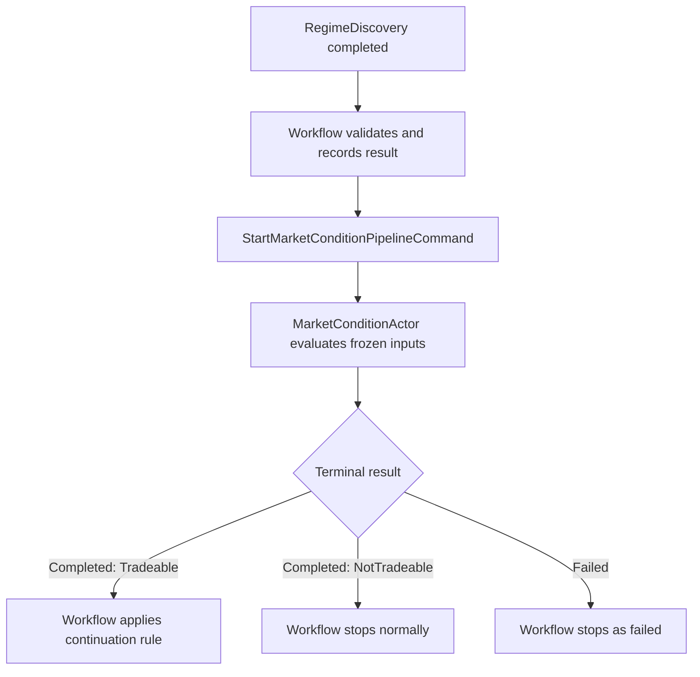
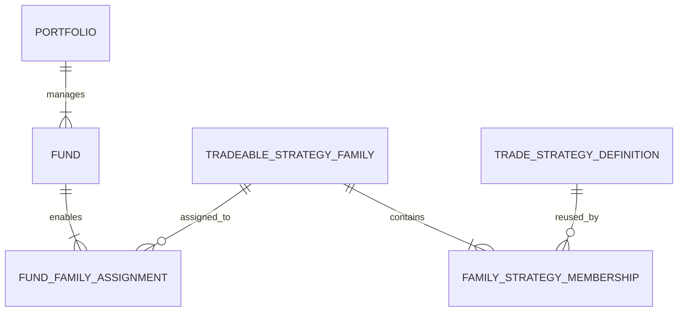

# MarketCondition High-Level Design

**Document version:** 0.3  
**Status:** High-level design  
**System:** Intrinsic Time Trade Strategy Workflow  
**Stage:** MarketCondition  
**Primary implementation target:** .NET 10 / C# actor-based trading system

### Revision history

| Version | Change |
| --- | --- |
| 0.1 | Initial generic MarketCondition actor design |
| 0.2 | Added the underlying-regime versus traded-product-condition model, `EsFuturesConditionEvaluator`, `EsFuturesOptionsConditionEvaluator`, ES fund examples, and the finalized `TradeStrategy` stage name |
| 0.3 | Added the portfolio-governed fund and trade-universe model, `TradeableStrategyFamily` assignments, reusable strategy membership, allocation and risk ownership, and immutable workflow trade-universe snapshots |

## 1. Purpose

MarketCondition is the second decision stage in the trade strategy workflow. It receives the market regime already discovered for the workflow and determines whether a usable trading opportunity exists **now** in the product that the active fund is permitted to trade.

The core separation is:

> RegimeDiscovery evaluates the underlying risk-driver market. MarketCondition evaluates the current tradability, integrity, liquidity, and relative-value condition of the actual traded-product universe.

For the initial ES implementation:

- RegimeDiscovery evaluates ES futures trend, volatility, and market structure, supported by VIX and VIX futures information.
- MarketCondition evaluates ES futures microstructure for the Daily Futures fund.
- MarketCondition evaluates the relevant ES futures-option chain for the Weekly Vertical and Monthly Iron Condor funds.

These are different dataset purposes. They may originate from some of the same raw feeds, but they must not duplicate derived features or decision ownership.

The Portfolio domain owns the higher-level trading mandate. It manages its funds and assigns each fund one or more `TradeableStrategyFamily` definitions together with its timeframe, asset universe, allocation, and risk limits. The resulting fund mandate determines which traded-product MarketCondition profile is evaluated and constrains the strategies that TradeStrategy may subsequently select.

Its central question is:

> Given the discovered regime, the intrinsic-time trigger, and current market and operational conditions, is the market tradeable now, and what condition is present?

MarketCondition does not select a trade, compose an order, approve fund risk, or execute anything. It produces a deterministic, typed result that the Strategy Workflow evaluates before deciding whether to continue to TradeStrategy.

## 2. Position in the Strategy Workflow

The fixed workflow sequence is:

1. RegimeDiscovery
2. MarketCondition
3. TradeStrategy
4. OrderComposition
5. RiskManagement
6. OrderExecution

The stages cannot be skipped, repeated, or reordered within one workflow execution.



## 3. Separation of Responsibilities

| Stage | Primary question | Typical time character | Authoritative output |
| --- | --- | --- | --- |
| RegimeDiscovery | What regime exists in the underlying risk-driver market? | Broader and relatively persistent | ES trend, volatility, structure, scores, and horizon context |
| MarketCondition | Is the fund's permitted ES futures or options market tradeable now? | Immediate and short-lived | Product integrity, liquidity, opportunity condition, confidence, evidence, and blockers |
| TradeStrategy | Which permitted trading strategy best fits the regime, product condition, and fund mandate? | Workflow decision | Selected strategy definition or no compatible strategy |
| OrderComposition | What exact legs, quantities, and prices express it? | Execution preparation | Candidate order |
| RiskManagement | May the portfolio accept this candidate order? | Portfolio and capital state | Approved or denied |
| OrderExecution | Can and should the approved order be submitted now? | Broker and venue state | Submission and execution result |

This separation prevents MarketCondition from becoming a second regime engine, strategy selector, order builder, or risk manager.

## 4. Core Design Decisions

1. **One actor at the workflow boundary.** `MarketConditionActor` owns the MarketCondition stage. V1 uses private, deterministic evaluator components rather than a graph of child actors.
2. **Two dataset purposes.** RegimeDiscovery consumes the underlying Market State dataset. MarketCondition consumes a separate Tradable Instrument Condition dataset selected for the active fund.
3. **Product-specific evaluation.** The actor dispatches to `EsFuturesConditionEvaluator` or `EsFuturesOptionsConditionEvaluator` through a versioned MarketCondition profile.
4. **Portfolio-governed universe.** The Portfolio manages its funds and assigns the `TradeableStrategyFamily` definitions, timeframe, assets, allocation, and risk limits that define each fund's allowed trading universe.
5. **Reusable strategy definitions.** A strategy definition may belong to multiple strategy families. Family membership is many-to-many and does not duplicate the strategy implementation.
6. **Frozen mandate.** The Strategy Workflow freezes the accepted Portfolio/Fund trade-universe snapshot at workflow start. Configuration changes cannot alter an inflight decision.
7. **Deterministic authority.** All classifications, gates, scores, and reason codes are produced by versioned deterministic rules.
8. **Completed does not mean continue.** A completed event means the actor processed its inputs successfully and returned a valid result. Only the Strategy Workflow decides whether to continue.
9. **NotTradeable is a successful business result.** It is represented by `MarketConditionPipelineCompletedEvent`, not by a failure event.
10. **Failed means unable to evaluate reliably.** Failure is reserved for invalid contracts, missing configuration, corrupt mandatory inputs, calculation errors, or other technical inability to produce a valid result.
11. **No automatic actor retries.** A failure stops the workflow. A later market trigger may start a new workflow after the current workflow reaches a terminal state.
12. **Frozen evaluation.** Each invocation evaluates an immutable point-in-time input snapshot and the parameter-set version frozen when the workflow started.
13. **Short-lived result.** Every result carries `EvaluatedAtUtc` and `ValidUntilUtc`. An expired result cannot authorize downstream processing.
14. **No LLM authority.** The actor produces structured evidence and a deterministic summary. A workflow-level LLM summary may explain the result later but cannot change it.

## 5. Actor Boundary

### 5.1 Actor name

`MarketConditionActor`

### 5.2 Actor responsibility

The actor:

- validates the stage invocation and its immutable inputs;
- validates the Portfolio/Fund trade-universe snapshot selected at workflow start;
- resolves the versioned MarketCondition profile selected by the fund and workflow;
- selects exactly one product-specific evaluator for the invocation;
- constructs or accepts a point-in-time MarketCondition input snapshot;
- checks data fitness and hard tradeability gates;
- evaluates current market condition features;
- classifies direction, phase, and condition;
- calculates strength and confidence;
- generates evidence, blocker reasons, and a deterministic summary;
- emits exactly one logical terminal event for the invocation.

### 5.3 Actor exclusions

The actor does not:

- recalculate or override the RegimeDiscovery result;
- use RSI, EMA, ADX, ATR, or other underlying-regime indicators to create a competing regime;
- create, enable, disable, or reassign a `TradeableStrategyFamily`;
- change a fund allocation or risk limit;
- select an option or futures strategy;
- select strikes, expiries, quantities, or limit prices;
- approve capital, margin, or portfolio risk;
- place or modify broker orders;
- mutate Strategy Workflow state;
- retry failed processing;
- call an LLM for a decision;
- consume unrestricted live state throughout its calculation.

## 6. Invocation Contract

### 6.1 Start command

`StartMarketConditionPipelineCommand`

| Field | Purpose |
| --- | --- |
| `WorkflowId` | GUID v7 identity shared by the full strategy workflow and mapped to the OTEL trace identity |
| `StageInvocationId` | Unique identity for this logical MarketCondition invocation |
| `EntityId` | Workflow concurrency entity, such as fund-strategy-instrument identity |
| `PortfolioId` | Portfolio that owns and governs the fund |
| `FundId` | Fund for which the opportunity is being evaluated |
| `PortfolioFundMandateSnapshotId` | Immutable portfolio/fund mandate selected when the workflow started |
| `TradeableStrategyFamilyIds` | Enabled families from the frozen mandate; used for provenance and traded-product scope, not strategy selection |
| `AllowedStrategySetId` | Identity of the normalized, deduplicated strategy set available to downstream TradeStrategy |
| `UnderlyingInstrumentId` | Underlying risk driver, initially the active ES futures contract |
| `TradedProductType` | `EsFuture` or `EsFuturesOption` for the initial implementation |
| `MarketConditionProfileId` | Frozen profile selecting the evaluator, dataset requirements, universe scope, and rules |
| `DecisionHorizon` | Daily, Weekly, or Monthly |
| `WorkflowRevision` | Expected workflow revision for ordered stage acceptance |
| `TriggeredAtUtc` | Time of the original workflow trigger |
| `StageStartedAtUtc` | Time MarketCondition was invoked |
| `TriggerContext` | Immutable intrinsic-time DC/TE/TR trigger details and source sequence identifiers |
| `RegimeDiscoveryResult` | Previously accepted, immutable typed result |
| `WorkflowSnapshot` | Read-only context accepted by the workflow through the prior stage |
| `ParameterSetId` | Selected MarketCondition parameter-set identity |
| `ParameterSetVersion` | Immutable parameter version frozen at workflow start |
| `TraceContext` | W3C trace propagation information when not derivable from `WorkflowId` |

The command contains a result envelope, not a mutable workflow object. MarketCondition returns its own result envelope and never edits the input snapshot.

### 6.2 Optional cancel command

`CancelMarketConditionPipelineCommand` is optional for the first implementation.

If implemented, a successfully applied cancellation emits the normal failed terminal event with `FailureCategory = Cancelled`. This preserves the invariant that every invocation ends in exactly one `Completed` or `Failed` event. A third terminal event type should not be introduced without changing the workflow-wide contract.

### 6.3 Queries

Queries are read-only and are not part of the calculation path:

- `GetMarketConditionInvocationStateQuery`
- `GetLatestMarketConditionResultQuery`
- `GetMarketConditionHistoryQuery`

Query projections may be eventually consistent. The Strategy Workflow's accepted stage state remains authoritative for the executing workflow.

## 7. Input Model

MarketCondition combines the accepted upstream result with a separate, fund-selected traded-instrument snapshot. The distinction is architectural: raw feeds may overlap, but the derived datasets and their decision purposes do not.

### 7.1 Accepted upstream result

The accepted `RegimeDiscoveryResult` supplies:

- trend regime and direction by horizon;
- trend strength and confidence;
- volatility regime and term-structure condition;
- market structure classification;
- fusion score and supporting evidence;
- source timestamps, snapshot identifiers, and parameter version;
- deterministic RegimeDiscovery summary.

MarketCondition uses this result as context. It may identify disagreement between the current trigger and the discovered regime, but it must not rewrite the upstream result.

### 7.2 Intrinsic-time trigger context

The trigger context supplies, where applicable:

- DC, TE, or TR event type;
- direction;
- directional-change threshold;
- overshoot or excursion measurements;
- source instrument;
- trigger timestamp and market-data sequence;
- previous intrinsic-time state;
- trigger quality or completeness indicators.

### 7.3 Tradable Instrument Condition snapshot

The actor reads or receives a point-in-time snapshot of the latest required values for the instrument the fund may actually trade. Candidate inputs include:

- exchange session and market-open state;
- configured fund entry window;
- futures quotes, order-book depth, trades, volume, price impact, and quote age for an ES futures invocation;
- synchronized ES futures reference quotes and the permitted option-chain region for an ES futures-options invocation;
- option quotes, trades, contract definitions, expiration availability, quote coverage, spread quality, volume, and open interest;
- put-call parity, synthetic-forward consistency, implied-volatility surface, skew, and term-structure measurements for options;
- current traded-product volatility level, rate of change, and shock indicators;
- abnormal price movement or market dislocation flags;
- scheduled event-risk window state;
- upstream data freshness, completeness, and sequence health;
- Databento and IBKR connectivity or feed-health state;
- broker availability needed to regard the market as operationally tradeable.

V1 need not store full order books or option chains in the result. It stores the calculated evidence, essential measurements, source sequence identifiers, timestamps, and snapshot hashes required for diagnosis.

### 7.4 Dataset ownership

| Dataset | Owner | ES examples | Decision purpose |
| --- | --- | --- | --- |
| `UnderlyingMarketState` | RegimeDiscovery | ES bars, RSI, RSI slope, EMA20/50/200, ADX, ATR ratio, Bollinger position, VIX regime, VIX term structure | Describe the broader ES risk-driver regime |
| `TradableInstrumentCondition` | MarketCondition | ES futures book/trades or ES option-chain parity, IV, skew, liquidity, and surface integrity | Determine whether the permitted traded product is usable now |
| `PortfolioFundMandate` | Portfolio/Fund domain | Portfolio and fund identity, timeframe, allocation, risk-limit references, allowed assets, `TradeableStrategyFamilyIds`, sizing hints, calendar, and no-trade rules | Define and govern the fund's allowed trading universe |
| `AllowedStrategySet` | Portfolio/Fund trade-universe resolver | Deduplicated strategy definitions reachable from the enabled families, with source-family provenance | Constrain downstream TradeStrategy selection |
| `CandidateExecutionData` | Order composition stages | Exact contracts, legs, Greeks, theoretical value, quantity, limit price, margin, slippage | Construct and approve a specific order |

MarketCondition may compare current traded-product data with accepted RegimeDiscovery values. For example, it may compare current option implied volatility with realized-volatility context supplied by RegimeDiscovery. It must not independently recalculate the upstream regime feature.

### 7.5 Workflow and fund context

The read-only context may include:

- portfolio identity and mandate version;
- fund identity and decision horizon;
- enabled `TradeableStrategyFamilyIds`;
- normalized `AllowedStrategySetId`;
- allowed underlying assets and traded products;
- configured fund allocation and risk-limit references;
- entry calendar and session rules;
- current workflow state and revision;
- whether another business rule has temporarily disabled new entries;
- summarized portfolio exposure for context.

MarketCondition uses the mandate only to resolve its evaluator, traded-product universe, entry eligibility, and required dataset. It must not enforce capital allocation, margin, gross-risk, leverage, drawdown, or final risk authorization. The Portfolio/Fund domain owns those configured limits and RiskManagement applies them to the candidate trade.

### 7.6 MarketCondition profile and parameter set

The Strategy Workflow selects the applicable parameter set from configuration storage and freezes its identity and version for the full workflow execution. The MarketCondition parameter set contains configuration such as:

- required input definitions;
- evaluator type and traded-product type;
- compatible `TradeableStrategyFamilyIds` and product-data requirement set;
- underlying and traded-instrument identifiers;
- allowed expiration classes, days-to-expiration range, and strike universe for options;
- active futures contract and roll-policy reference for futures;
- maximum data ages by source and timeframe;
- permitted sessions and fund entry windows;
- event-risk exclusion windows;
- spread, depth, liquidity, and option-chain quality thresholds;
- volatility change and shock thresholds;
- abnormal-movement thresholds;
- feature normalization rules;
- classification thresholds;
- score weights and minimum confidence;
- hard-blocker rules;
- result validity lifetime;
- deterministic summary template version.

No runtime configuration update changes an already executing workflow.

## 8. Product-Specific Evaluator Architecture

### 8.1 Evaluator selection

`MarketConditionActor` owns messaging, invocation state, parameter validation, snapshot sealing, persistence, terminal events, and observability. It selects exactly one deterministic evaluator from the frozen `MarketConditionProfileId`:

| Fund profile | Initial `TradeableStrategyFamily` | Underlying regime source | Traded-product evaluator |
| --- | --- | --- | --- |
| Daily ES Futures | `DailyEsFuturesFamily` | ES futures RegimeDiscovery result using the Daily decision horizon | `EsFuturesConditionEvaluator` |
| Weekly ES Vertical Spreads | `WeeklyEsVerticalSpreadFamily` | ES futures RegimeDiscovery result using the Weekly decision horizon | `EsFuturesOptionsConditionEvaluator` using the configured weekly option universe |
| Monthly ES Iron Condors | `MonthlyEsIronCondorFamily` | ES futures RegimeDiscovery result using the Monthly decision horizon | `EsFuturesOptionsConditionEvaluator` using the configured monthly option universe |

Evaluator selection is configuration-driven from the frozen Portfolio/Fund mandate and its enabled families. It is not inferred dynamically from whatever instruments happen to be present in a market-data feed.

For V1, all enabled strategy families within one fund workflow entity must resolve to one compatible traded-product type and one MarketCondition evaluator. If a future fund authorizes strategy families spanning different traded-product types, the preferred design is a separate workflow entity per product scope rather than combining unrelated evaluators into one MarketCondition result.

### 8.2 Evaluator component contract

Both evaluators implement a common conceptual contract such as `IMarketConditionEvaluator`. They are synchronous, deterministic C# calculation components inside the actor boundary, not independently messaged actors.

The common evaluation context contains:

- workflow, entity, fund, horizon, and invocation identities;
- Portfolio/Fund mandate, enabled family, and allowed-strategy-set identities;
- accepted `RegimeDiscoveryResult`;
- immutable intrinsic-time trigger context;
- immutable product-specific input snapshot;
- immutable MarketCondition profile and parameter version;
- evaluation and validity timestamps.

The common evaluator result contains:

- `Tradeability`;
- evaluator and profile identity;
- traded-product type;
- market-integrity, liquidity, and data-quality states;
- opportunity strength and confidence;
- alignment with the accepted underlying regime;
- product-specific measurements;
- evidence, conflicts, blockers, and reason codes;
- deterministic summary text.

Evaluators must not perform messaging, persistence, configuration lookup, workflow continuation, strategy selection, risk approval, or broker submission.

### 8.3 `EsFuturesConditionEvaluator`

#### Purpose

`EsFuturesConditionEvaluator` determines whether the active ES futures contract can be traded now and whether its immediate trading condition supports the accepted ES regime and intrinsic-time trigger.

It is the primary evaluator for the Daily ES Futures fund. It may also provide the synchronized ES futures reference snapshot needed by the options evaluator, but the two evaluators produce distinct product-condition results.

#### Input universe

The frozen futures snapshot contains, where available:

- active ES contract identity and roll-policy reference;
- best bid, best ask, bid size, and ask size;
- configured order-book depth levels;
- recent trades, trade sizes, and timestamps;
- trade and quote sequence identifiers;
- recent volume and trade rate;
- session state and price-limit state;
- price at the intrinsic-time trigger;
- current price and trigger-relative displacement;
- short-window realized movement used only for immediate shock detection;
- market-data feed health and quote age.

The evaluator does not recalculate RSI, EMA, ADX, ATR, Bollinger Bands, or the ES regime.

#### Deterministic feature groups

| Feature group | Example measurements | Purpose |
| --- | --- | --- |
| Quote integrity | Non-crossed market, valid prices and sizes, monotonic sequence, quote age | Determine whether the futures snapshot is trustworthy |
| Transaction cost | Spread in ticks, spread stability, estimated price impact | Determine immediate cost of entry |
| Book liquidity | Depth by level, depth concentration, bid/ask imbalance, replenishment | Determine whether expected fund size can interact with the market |
| Trade activity | Trade rate, volume rate, average trade size, aggressor imbalance when reliable | Describe current participation and flow |
| Trigger condition | Price displacement, elapsed time, continuation or reversal since DC/TE/TR | Determine whether the original trigger remains actionable |
| Market stress | Short-lived volatility jump, gap, depth collapse, price-limit proximity | Detect immediate dislocation without redefining the regime |
| Session quality | Regular session, overnight session, configured open/close exclusion windows | Apply fund-specific entry rules |

#### Futures result extension

`EsFuturesConditionResult` extends the common result with values such as:

- `FuturesMarketIntegrity`;
- `SpreadTicks` and `SpreadQuality`;
- `DepthQuality`;
- `TradeActivityState`;
- `OrderFlowBias` and its confidence when reliably measurable;
- `EstimatedPriceImpact` for the configured sizing band;
- `TriggerContinuationState`;
- `MarketStressState`;
- `SessionLiquidityState`.

Order-flow bias is supporting evidence. It does not override the direction owned by RegimeDiscovery.

#### Daily ES example

```text
UnderlyingRegime: Bearish / Strong / Continuing
TradedProduct: ES Future
FuturesMarketIntegrity: Healthy
SpreadQuality: Healthy
DepthQuality: Healthy
OrderFlowBias: Bearish
TriggerContinuationState: Confirmed
MarketStressState: Normal
Tradeability: Tradeable
OpportunityStrength: 84
Confidence: 0.87
```

If ES remains in a bearish regime but the book loses depth and estimated price impact exceeds the configured limit, the evaluator returns `Completed + NotTradeable / FuturesLiquidityInsufficient`.

### 8.4 `EsFuturesOptionsConditionEvaluator`

#### Purpose

`EsFuturesOptionsConditionEvaluator` determines whether the ES futures-option market relevant to the active fund is coherent, sufficiently liquid, appropriately priced, and usable now.

It is the primary evaluator for:

- the Weekly ES Vertical Spread fund using the configured weekly expiration universe;
- the Monthly ES Iron Condor fund using the configured monthly expiration universe.

The evaluator operates on a deliberately restricted chain region. It does not scan an unknown universe of products. The frozen Portfolio/Fund mandate and the MarketCondition profiles referenced by its enabled strategy families define the permitted ES option product, expiration class, days-to-expiration range, strike range or moneyness band, and minimum contract-quality rules.

#### Input universe

The frozen options snapshot contains:

- synchronized ES futures reference bid, ask, and timestamp;
- selected ES option contract definitions;
- permitted expirations and strikes;
- call and put bid, ask, sizes, last trade, volume, and quote timestamps;
- open interest when available and its effective date;
- option exercise, premium, settlement, multiplier, and tick conventions;
- applicable discount-rate input;
- implied-volatility calculation inputs and status;
- intrinsic-time trigger timestamp and reference price;
- option-feed completeness, sequence, and health metadata.

The snapshot must preserve call, put, and futures timestamp alignment closely enough for the configured parity and surface tests. An apparently large pricing difference produced by asynchronous quotes is a data-quality problem, not automatically a market opportunity.

#### A. Option-market integrity

Market-integrity evaluation determines whether the chain can be trusted.

It includes:

- put-call parity across matched strike and expiration pairs;
- synthetic-forward versus observed ES futures consistency;
- crossed, locked, negative, or otherwise invalid quotes;
- call and put price monotonicity across strikes;
- vertical-spread price consistency;
- butterfly or convexity consistency where contract rules permit;
- implied-volatility solver success;
- implied-volatility surface continuity;
- quote timestamp alignment and stale-quote ratios.

For a European-style option-on-futures relationship, the conceptual parity equation is:

\[
C - P \approx e^{-rT}(F-K)
\]

The production implementation must use the exact CME contract exercise, premium, and settlement conventions. It must evaluate executable bid/ask bounds, transaction costs, and synchronized quotes rather than treating a midpoint difference as an arbitrage.

Parity should be evaluated across a representative set of usable strikes. Recommended aggregate evidence includes:

- usable matched call/put pair count;
- median parity residual in ticks and currency;
- maximum parity residual;
- percentage of pairs outside the executable tolerance band;
- median synthetic-forward deviation;
- quote synchronization age;
- parity state: `Healthy`, `Degraded`, `Invalid`, or `Unknown`.

Put-call parity is primarily a market-coherence and data-quality signal. It must not be interpreted as an independent bullish or bearish forecast.

#### B. Option liquidity and execution quality

Liquidity evaluation includes:

- percentage of eligible strikes with valid two-sided quotes;
- absolute and premium-relative bid/ask width;
- displayed size and depth where available;
- recent trade frequency and volume;
- open interest with effective-date awareness;
- expiration-level liquidity concentration;
- estimated slippage for the fund's configured sizing range;
- general availability of the strike regions needed by the permitted strategy family.

For a fund that enables an Iron Condor family, MarketCondition determines whether the chain generally contains usable put-side and call-side regions for that family. It does not select `BalancedIronCondor`, `DirectionallyBiasedIronCondor`, or the final four legs. Exact strategy selection, multi-leg constructability, Greeks, theoretical value, quantity, and limit price remain downstream responsibilities.

#### C. Volatility and relative-value condition

The evaluator may calculate:

- ATM implied volatility;
- implied-volatility skew or slope;
- smile curvature;
- option implied-volatility term structure across permitted expirations;
- change in IV since the intrinsic-time trigger;
- option IV relative to realized-volatility context accepted from RegimeDiscovery;
- volatility risk premium;
- premium condition: `Rich`, `Fair`, `Cheap`, or `Unknown`.

This is a valid cross-dataset comparison. MarketCondition reads current option IV and compares it with the authoritative realized-volatility or regime context supplied upstream; it does not recreate the ES regime.

VIX level and VIX futures term-structure regime remain owned by RegimeDiscovery. ES option-surface measurements remain owned by `EsFuturesOptionsConditionEvaluator`.

#### D. Option trading activity

Supporting trade evidence may include:

- call and put trade volume;
- put/call volume ratio;
- delta-adjusted option volume;
- buyer-initiated and seller-initiated flow when classification quality is sufficient;
- activity concentration by strike and expiration;
- volume relative to the configured normal baseline;
- change in open interest when the next authoritative update is available.

These features require confidence and data-quality metadata. Put/call ratios and large put activity may represent hedging rather than a directional forecast, so they remain evidence rather than standalone direction rules.

#### E. Options result extension

`EsFuturesOptionsConditionResult` extends the common result with values such as:

- `OptionMarketIntegrity`;
- `ParityState`;
- `SyntheticForwardState`;
- `SurfaceContinuityState`;
- `OptionLiquidityQuality`;
- `ChainCoverageQuality`;
- `OptionPremiumCondition`;
- `AtmImpliedVolatility`;
- `SkewCondition`;
- `VolatilityRiskPremiumState`;
- `OptionFlowCondition`;
- `OptionImpliedBias` and its confidence;
- `GeneralConstructability` for the permitted strategy family.

`OptionImpliedBias` is supporting evidence and may be compared with the underlying direction from RegimeDiscovery. It does not replace that direction.

#### Monthly ES options example

```text
UnderlyingRegime: ModeratelyBearish / NormalVolatility
TradedProduct: ES Futures Options
ExpirationClass: Monthly
OptionMarketIntegrity: Healthy
ParityState: Healthy
SurfaceContinuityState: Healthy
OptionLiquidityQuality: Healthy
OptionPremiumCondition: Rich
SkewCondition: ElevatedButStable
VolatilityRiskPremiumState: Positive
GeneralConstructability: Available
RegimeAlignment: Compatible
Tradeability: Tradeable
OpportunityStrength: 76
Confidence: 0.83
```

TradeStrategy may use this result with the Monthly fund mandate to select a directionally bearish Iron Condor. The downstream order-composition stage then selects the exact expiration, four strikes, quantities, Greeks, theoretical value, and limit price.

#### Weekly ES options example

```text
UnderlyingRegime: Bullish / Strong / Initiating
TradedProduct: ES Futures Options
ExpirationClass: Weekly
OptionMarketIntegrity: Healthy
OptionLiquidityQuality: Healthy
OptionPremiumCondition: Rich
SkewCondition: SteepDownsideSkew
OptionImpliedBias: CautiouslyBearish
RegimeAlignment: Conflicted
Tradeability: Tradeable
OpportunityStrength: 61
Confidence: 0.67
```

The market is technically tradeable, but the option market conflicts with the underlying regime. TradeStrategy decides whether a permitted bullish vertical exploits the option condition appropriately or whether the evidence requires a normal no-strategy result.

#### Unusable option-chain example

```text
UnderlyingRegime: Bullish / Moderate / Continuing
ParityState: Invalid
StaleQuoteRatio: Excessive
SurfaceContinuityState: Invalid
OptionLiquidityQuality: Unusable
Tradeability: NotTradeable
PrimaryReasonCode: OptionChainIntegrityFailure
```

The workflow stops normally before TradeStrategy even though the underlying regime itself is valid.

### 8.5 Exact-strategy and exact-order boundary

MarketCondition can determine that the permitted ES option-chain region is generally usable and that its volatility or relative-value condition may support a strategy. It cannot:

- select a vertical, Iron Condor, or another strategy;
- select exact strikes or expiration;
- calculate final quantities;
- approve risk or margin;
- authorize an executable limit price.

Those decisions remain with TradeStrategy, order composition, RiskManager, and OrderExecution respectively.

### 8.6 Extension to other markets

The reusable pattern is:

> RegimeDiscovery studies the primary risk driver; MarketCondition studies the actual traded-instrument universe.

| Strategy universe | RegimeDiscovery dataset | MarketCondition evaluator dataset |
| --- | --- | --- |
| NQ futures options | NQ futures trend, volatility, and structure | NQ option parity, surface, skew, flow, and liquidity |
| Crude-oil futures options | CL futures trend, realized volatility, and curve structure | CL option surface, parity, expiration liquidity, and trade activity |
| Equity options | Underlying equity trend, volatility, and market structure | Stock option chain, contract-aware parity, IV surface, and liquidity |
| Treasury futures options | Treasury yield and futures regime | Treasury option surface, parity, and chain liquidity |
| FX options | Spot, rates, and macro regime | Forward consistency, risk reversals, IV surface, and liquidity |

Adding a market therefore requires a new RegimeDiscovery feature profile, a product-specific MarketCondition evaluator or profile, permitted TradeStrategy definitions, and product-specific order and risk rules. The workflow contract remains stable.

### 8.7 Portfolio-governed fund and trade universe

#### Purpose

The Portfolio domain defines the trading universe before any strategy workflow begins. It manages its funds and assigns each fund:

- a decision timeframe;
- allowed underlying assets and traded products;
- one or more enabled `TradeableStrategyFamily` definitions;
- capital allocation;
- gross-risk, leverage, loss, drawdown, frequency, and other applicable risk limits;
- entry calendars and portfolio/fund no-trade rules;
- compatible RegimeDiscovery and MarketCondition profiles.

The Portfolio does not select the strategy for an individual market trigger. It defines the authorized universe within which TradeStrategy is allowed to make that selection.

#### Domain relationships



This is deliberately a many-to-many relationship between strategy families and strategy definitions. A family groups strategies for authorization, product scope, timeframe, and operational purpose. It does not own or duplicate their implementation.

#### Portfolio responsibility

The Portfolio owns:

- portfolio identity, lifecycle, and configuration version;
- managed fund collection;
- allocation across funds;
- portfolio-level and delegated fund-level risk budgets;
- permission to activate, suspend, or retire funds;
- approval of which strategy families each fund may trade;
- cross-fund constraints and kill-switch policy when implemented.

#### Fund responsibility

Each Fund owns or references:

- `FundId` and active configuration version;
- decision horizon or timeframe;
- allowed asset, venue, instrument, and traded-product scope;
- enabled `TradeableStrategyFamilyIds`;
- fund allocation and sizing hints;
- gross-risk cap, leverage cap, maximum daily loss, and other fund limits;
- entry window, frequency target, and no-trade rules;
- RegimeDiscovery and MarketCondition profile bindings.

The current initial fund model is:

| Fund | Timeframe | Initial traded product | Initial `TradeableStrategyFamily` | MarketCondition evaluator |
| --- | --- | --- | --- | --- |
| Daily Futures Fund | Daily | ES futures | `DailyEsFuturesFamily` | `EsFuturesConditionEvaluator` |
| Weekly Vertical Fund | Weekly | ES futures options | `WeeklyEsVerticalSpreadFamily` | `EsFuturesOptionsConditionEvaluator` |
| Monthly Iron Condor Fund | Monthly | ES futures options | `MonthlyEsIronCondorFamily` | `EsFuturesOptionsConditionEvaluator` |

Allocation and risk-limit values are configuration owned by the Portfolio/Fund domain and are not hard-coded in MarketCondition.

#### `TradeableStrategyFamily`

A `TradeableStrategyFamily` is a versioned grouping and authorization object. It should contain or reference:

- `StrategyFamilyId` and version;
- display and domain name;
- compatible timeframes;
- allowed underlying assets and traded-product types;
- required MarketCondition evaluator and profile compatibility;
- member strategy definitions through `FamilyStrategyMembership`;
- optional family-level eligibility, ranking, and parameter-template metadata;
- activation state and effective interval.

The family identifies what kinds of strategies the Portfolio permits a fund to consider. It does not mean that every member strategy is suitable for every trigger.

#### `TradeStrategyDefinition`

A `TradeStrategyDefinition` is the reusable, versioned definition of one deterministic strategy. It owns or references:

- stable `StrategyDefinitionId` and version;
- deterministic strategy logic;
- compatible underlying assets, traded products, timeframes, and order structures;
- required RegimeDiscovery and MarketCondition features;
- strategy-specific parameter schema;
- downstream candidate-construction requirements;
- eligibility and rejection reason codes.

The same strategy definition may appear in multiple strategy families without copying its code or authoritative definition.

#### Many-to-many strategy membership

`FamilyStrategyMembership` links a strategy family to a strategy definition. Recommended fields include:

- `StrategyFamilyId` and version;
- `StrategyDefinitionId` and version policy;
- enabled state;
- membership priority or ranking hint;
- optional family-specific parameter-template reference;
- effective interval;
- configuration provenance.

For example, `DirectionallyBiasedIronCondor` could be a member of both `MonthlyEsIronCondorFamily` and a future `DirectionalPremiumIncomeFamily`. It remains one strategy definition. Each membership records why and how that strategy is exposed through the family.

If multiple enabled families expose the same `StrategyDefinitionId`, the trade-universe resolver must deduplicate it before TradeStrategy executes while retaining every contributing `SourceStrategyFamilyId` for explanation and audit.

Conflicting family or fund overrides must be rejected during configuration validation or fund activation. They must not be resolved nondeterministically during a realtime strategy workflow.

#### Initial strategy-family examples

The following memberships illustrate the intended hierarchy; the detailed strategy definitions and parameters belong in the TradeStrategy design.

| Initial family | Example member strategies |
| --- | --- |
| `DailyEsFuturesFamily` | ES trend continuation, ES breakout, ES pullback, ES mean reversion |
| `WeeklyEsVerticalSpreadFamily` | Bull call vertical, bear put vertical, bull put credit vertical, bear call credit vertical |
| `MonthlyEsIronCondorFamily` | `BalancedIronCondor`, `DirectionallyBiasedIronCondor` |

Only explicitly enabled and versioned memberships are tradeable. Examples in this document do not activate a strategy by themselves.

#### Fund-family assignment

`FundFamilyAssignment` records the Portfolio's decision to make a strategy family available to a fund. Recommended fields include:

- `PortfolioId` and version;
- `FundId` and version;
- `StrategyFamilyId` and selected version policy;
- enabled state and effective interval;
- assignment priority;
- approved MarketCondition profile binding;
- optional fund-level family parameter-template reference;
- configuration audit metadata.

This assignment is the authoritative route from a Portfolio-managed Fund to its allowed strategy universe.

#### Normalized allowed strategy set

Before starting the realtime workflow, or as part of its accepted start transition, a deterministic trade-universe resolver produces `AllowedStrategySet` by:

1. reading the active Portfolio and Fund versions;
2. validating the fund timeframe, assets, products, allocation, and risk-limit configuration;
3. resolving all enabled `FundFamilyAssignment` records;
4. validating family compatibility with the fund and requested workflow entity;
5. expanding the family-to-strategy memberships;
6. removing disabled or ineffective memberships;
7. deduplicating strategies by `StrategyDefinitionId` and selected version;
8. retaining source-family provenance for every strategy;
9. resolving one compatible MarketCondition profile for the product-scoped workflow;
10. producing a versioned, immutable snapshot and checksum.

TradeStrategy may evaluate only strategies contained in this normalized set. It cannot dynamically query an unrestricted strategy catalog and cannot add a strategy that was not authorized when the workflow started.

#### `PortfolioFundMandateSnapshot`

The Strategy Workflow freezes a compact immutable snapshot containing or referencing:

- `PortfolioId` and `PortfolioVersion`;
- `FundId` and `FundVersion`;
- decision timeframe;
- allowed assets, instruments, venues, and traded products;
- enabled `TradeableStrategyFamilyIds` and versions;
- normalized `AllowedStrategySetId` and checksum;
- each strategy's source-family provenance;
- fund allocation reference;
- portfolio and fund risk-limit snapshot references;
- sizing-hint reference;
- calendar and no-trade rule references;
- RegimeDiscovery and MarketCondition profile identities;
- effective and frozen timestamps.

The full mutable Portfolio aggregate is never passed through the workflow. Commands carry the immutable snapshot or stable snapshot identity required by the receiving stage.

#### Use by each workflow stage

| Stage | Use of the frozen Portfolio/Fund mandate |
| --- | --- |
| RegimeDiscovery | Select underlying asset, decision horizon, and compatible regime profile |
| MarketCondition | Select traded-product type, evaluator, restricted futures/option universe, entry gates, and MarketCondition profile |
| TradeStrategy | Restrict selection to the deduplicated `AllowedStrategySet` and retain source-family provenance |
| OrderComposition | Enforce selected-strategy contract and fund sizing hints while building the candidate |
| RiskManagement | Apply the authoritative portfolio/fund allocation and risk-limit snapshots to the candidate |
| OrderExecution | Confirm final instrument and operational permissions before submission |

MarketCondition therefore receives strategy-family context to determine what traded-product condition must be measured. It does not choose a family or a member strategy and does not consume allocation or risk values as trade approval.

#### Configuration changes during an inflight workflow

Portfolio, fund, family, membership, allocation, or risk-limit changes do not mutate the snapshot already accepted by an inflight workflow. Emergency kill-switch and explicit cancellation policies remain separate safety authorities and may stop new or inflight processing according to their own design.

A later workflow uses the newly active configuration version. This preserves deterministic explanation of why a particular strategy universe was available for each workflow attempt.

## 9. Point-in-Time Snapshot Rules

MarketCondition is more time-sensitive than RegimeDiscovery. Its inputs must therefore be frozen around one `EvaluationTimestampUtc`.

The snapshot builder must:

1. read each required latest-value input once;
2. retain its source timestamp and sequence identifier;
3. calculate age relative to the evaluation timestamp;
4. apply the versioned freshness and completeness rules;
5. seal the snapshot before condition evaluation begins;
6. calculate a stable snapshot hash or equivalent diagnostic identity.

For an ES futures evaluation, the snapshot must align quotes, book levels, and trades closely enough for the configured microstructure measurements. For an ES futures-options evaluation, matched calls, puts, and the ES futures reference must satisfy the configured synchronization tolerance before parity or surface calculations are accepted.

The actor must not reread individual features midway through evaluation. This avoids combining values from materially different market moments. The accepted RegimeDiscovery result and the Tradable Instrument Condition snapshot retain separate identities so their provenance remains visible to TradeStrategy and observability projections.

The `PortfolioFundMandateSnapshot` is logically frozen at workflow start and is not rebuilt at the MarketCondition evaluation timestamp. The result records both the mandate-snapshot identity and the point-in-time traded-product snapshot identity.

## 10. Evaluation Model

Evaluation occurs in two ordered layers.

### 10.1 Layer 1: hard tradeability gates

Hard gates answer whether it is safe and meaningful to classify an opportunity now.

Initial gate groups are:

| Gate | Example checks | Typical completed result when blocked |
| --- | --- | --- |
| Data fitness | Freshness, completeness, sequence health, required source availability | `NotTradeable / DataUnfit` |
| Session eligibility | Exchange state, holiday/session rules, fund entry window | `NotTradeable / SessionBlocked` |
| Event risk | Configured economic or market event exclusion window | `NotTradeable / EventRiskBlocked` |
| Futures market integrity | Invalid/crossed quote, sequence problem, price-limit proximity, trigger invalidation, immediate dislocation | `NotTradeable / FuturesMarketIntegrityInvalid` |
| Options market integrity | Parity, synthetic-forward, surface, quote synchronization, or chain-consistency failure | `NotTradeable / OptionChainIntegrityFailure` |
| Liquidity | Futures spread/depth/impact or option spread/coverage/activity below the selected profile | `NotTradeable / LiquidityInsufficient` |
| Operational readiness | Required feed and broker connectivity health | `NotTradeable / OperationsUnavailable` |
| Workflow eligibility | Entry disabled, stale upstream result, expired stage allowance | `NotTradeable / WorkflowIneligible` |

An expected condition that can be measured and classified is a completed `NotTradeable` result. For example, quotes known to be older than the configured maximum age produce `NotTradeable / DataUnfit`.

The actor fails only when it cannot perform the classification reliably—for example, the command is corrupt, the parameter set cannot be resolved, or required health metadata is itself unavailable or invalid.

### 10.2 Layer 2: opportunity classification and scoring

If no hard gate blocks processing, the actor evaluates:

- alignment between the intrinsic-time trigger and discovered regime;
- product-specific evidence produced by the selected evaluator;
- for ES futures: spread, depth, trade activity, trigger continuation, flow quality, price impact, and market stress;
- for ES futures options: parity, synthetic-forward consistency, surface continuity, chain coverage, liquidity, IV, skew, volatility risk premium, and option activity;
- alignment or conflict between traded-product evidence and the accepted underlying direction and regime;
- liquidity quality and general execution feasibility at evaluation time without composing an exact order;
- current location within the permitted entry window;
- strength and agreement of supporting evidence;
- conflicting evidence and uncertainty.

The exact formulas and weights are specification-level details. They must be deterministic, independently testable, versioned, and configurable by instrument and decision horizon.

## 11. MarketCondition Result

`MarketConditionResult` is a self-contained immutable result envelope.

It is a discriminated result: common fields are always present, and exactly one typed payload is present according to `EvaluatorType`.

### 11.1 Core classification

| Field | Recommended values or range |
| --- | --- |
| `Tradeability` | `Tradeable`, `NotTradeable` |
| `EvaluatorType` | `EsFutures`, `EsFuturesOptions` |
| `TradedProductType` | `EsFuture`, `EsFuturesOption` |
| `PortfolioFundMandateSnapshotId` | Frozen portfolio/fund authority for this workflow |
| `TradeableStrategyFamilyIds` | Families whose product scope led to this evaluation |
| `AllowedStrategySetId` | Deduplicated downstream strategy universe |
| `ConditionType` | `Directional`, `RangeBound`, `Transition`, `VolatilityExpansion`, `VolatilityContraction`, `Dislocated`, `NoOpportunity` |
| `TradedProductBias` | `Bullish`, `Bearish`, `Neutral`, `Conflicted`, `Undefined`; supporting evidence only |
| `Phase` | `Initiating`, `Confirmed`, `Continuing`, `Weakening`, `Exhausting`, `Reversing`, `Undefined` |
| `OpportunityStrength` | Normalized integer from 0 to 100 |
| `Confidence` | Decimal from 0.00 to 1.00 |
| `VolatilityBehavior` | `Contracting`, `Stable`, `Expanding`, `Shock`, `Undefined` |
| `LiquidityQuality` | `Healthy`, `Degraded`, `Unusable`, `Unknown` |
| `MarketIntegrity` | `Healthy`, `Degraded`, `Invalid`, `Unknown` |
| `RegimeAlignment` | `Aligned`, `Compatible`, `Conflicted`, `Invalidated`, `Unknown` |
| `ProductConditionPayload` | Exactly one `EsFuturesConditionResult` or `EsFuturesOptionsConditionResult` |

The authoritative underlying direction remains in `RegimeDiscoveryResult`. MarketCondition may report futures flow bias or option-implied bias and compare it with the regime, but it cannot replace the upstream direction. These values describe the traded-product market and do not name or approve a trading strategy.

### 11.2 Evidence and explanation

The result also contains:

- ordered `EvidenceItems` with typed feature name, observed value, normalized contribution, source timestamp, and reason code;
- ordered `ConflictingEvidenceItems`;
- zero or more `BlockingReasons`;
- `PrimaryReasonCode`;
- input data-quality result;
- upstream `RegimeDiscoveryResult` reference and alignment result;
- evaluator, profile, traded-product, and typed-payload identifiers;
- Portfolio/Fund mandate, family, and allowed-strategy-set identities;
- deterministic `SummaryText`;
- parameter-set identity and version;
- source snapshot identity and hash;
- evaluation and validity timestamps.

Evidence must be machine-readable first. Summary text is a projection for operators and future workflow-level LLM summarization; it is not authoritative state.

### 11.3 Example deterministic summaries

Tradeable:

> Monthly ES futures-options condition is Tradeable: chain integrity and parity are healthy, option premium is rich, liquidity is healthy, and the option evidence is compatible with the moderately bearish ES regime. Opportunity strength is 76 and confidence is 0.83.

Not tradeable:

> Monthly ES futures-options condition is NotTradeable: synchronized call, put, and futures quotes failed the configured chain-integrity requirements. Evaluation completed successfully; TradeStrategy was not started.

## 12. Events and Terminal Semantics

### 12.1 Lifecycle events

- `MarketConditionPipelineStartedEvent`
- `MarketConditionPipelineCompletedEvent`
- `MarketConditionPipelineFailedEvent`

Only `Completed` and `Failed` are terminal.

### 12.2 Completed event

`MarketConditionPipelineCompletedEvent` contains:

- workflow, entity, and invocation identities;
- accepted workflow revision;
- full `MarketConditionResult`;
- deterministic summary;
- processing timestamps and duration;
- parameter-set and input-snapshot identities;
- Portfolio/Fund mandate, family, and allowed-strategy-set identities;
- trace context.

It means the actor successfully processed the selected MarketCondition rules. It does **not** mean:

- the result is Tradeable;
- the workflow must continue;
- a trade exists;
- fund risk is approved;
- an order may be submitted.

### 12.3 Failed event

`MarketConditionPipelineFailedEvent` contains:

- workflow, entity, and invocation identities;
- stage and expected workflow revision;
- failure category and stable reason code;
- safe diagnostic message;
- whether processing had started;
- parameter-set and available snapshot identities;
- timestamps, duration, and trace context.

Initial failure categories are:

- `ContractInvalid`
- `ConfigurationUnavailable`
- `RequiredInputInvalid`
- `CalculationFailed`
- `InvariantViolation`
- `Cancelled` — optional
- `Timeout` — optional

Failures are not converted into `NotTradeable` merely to keep the workflow running.

### 12.4 Exactly one logical terminal event

For each `StageInvocationId`, the actor must commit exactly one logical terminal outcome. Duplicate transport delivery must not rerun the calculation or create a second outcome.

A repeated command with the same invocation identity and identical contract is deduplicated. A repeated invocation identity with a different payload is a contract violation. Transport recovery may republish an already committed terminal event without recalculating the stage; this is not a strategy retry.

## 13. Workflow Continuation Rules

The Intrinsic Time Strategy Workflow actor is the sole continuation authority.

After receiving a terminal event it:

1. validates `WorkflowId`, `EntityId`, `StageInvocationId`, stage, and revision;
2. validates the Portfolio/Fund mandate, enabled family, allowed-strategy-set, and parameter versions;
3. validates the result envelope and product-evaluator compatibility;
4. records the terminal event and accepted stage result;
5. advances the workflow revision once for the logical transition;
6. applies the configured continuation rule.

Recommended high-level rules:

| MarketCondition terminal outcome | Workflow action |
| --- | --- |
| `Completed + Tradeable + valid result` | Continue to TradeStrategy |
| `Completed + NotTradeable` | Stop normally with a no-trade reason |
| `Completed + expired result` | Stop with `MarketConditionExpired`; do not rerun the stage |
| `Completed + invalid result envelope` | Stop as a workflow contract failure |
| `Failed` | Stop immediately as failed |

The final thresholds and detailed continuation matrix should be defined jointly with TradeStrategy so that MarketCondition describes the opportunity without selecting the strategy. TradeStrategy may consider only the strategies in the frozen `AllowedStrategySetId` and must preserve source-family provenance in its result.

## 14. Time-Horizon Model

The actor supports Daily, Weekly, and Monthly decision horizons through configuration, while each invocation evaluates one primary horizon and one traded-product profile for one entity.

- The primary horizon determines applicable entry windows, freshness limits, feature weights, and thresholds.
- Other horizons may be supplied as supporting regime context.
- Cross-horizon agreement or conflict becomes evidence; it does not create multiple results in one invocation.
- A result for one fund or horizon cannot be reused as authority for another without a new workflow invocation.

The initial mapping is:

| Fund | Primary regime source | Initial family | MarketCondition evaluator | Traded-product scope |
| --- | --- | --- | --- | --- |
| Daily Futures | ES Daily-horizon regime using the configured 1-hour/4-hour context | `DailyEsFuturesFamily` | `EsFuturesConditionEvaluator` | Active ES futures contract |
| Weekly Verticals | ES Weekly-horizon regime using the configured intraday and supporting context | `WeeklyEsVerticalSpreadFamily` | `EsFuturesOptionsConditionEvaluator` | Permitted weekly ES option expirations and strike region |
| Monthly Iron Condors | ES Monthly-horizon regime using the configured Daily and supporting context | `MonthlyEsIronCondorFamily` | `EsFuturesOptionsConditionEvaluator` | Permitted monthly ES option expirations and strike region |

This is the concrete reference implementation for extending the workflow to other assets, timeframes, and markets.

## 15. State and Persistence

### 15.1 Private actor state

The actor's private state includes:

- invocation identity and status;
- received command metadata;
- accepted workflow revision;
- parameter-set identity and version;
- Portfolio/Fund mandate snapshot identity and version;
- enabled strategy-family and normalized allowed-strategy-set identities;
- input snapshot identity;
- evaluation timestamps;
- committed terminal outcome;
- result or failure information.

### 15.2 Authoritative and query storage

Consistent with the wider architecture:

- authoritative stage events are persisted through the event-store path;
- the accepted result is recorded in Strategy Workflow state;
- ScyllaDB may hold query and Operations UI projections;
- configuration parameter sets and their versions remain queryable in ScyllaDB;
- Portfolio, Fund, strategy-family, membership, allocation, and risk-limit projections remain owned by their corresponding domains;
- the frozen `PortfolioFundMandateSnapshot` and `AllowedStrategySet` references are retained with workflow state;
- Redis may serve latest-value inputs but is not the authoritative history of the decision.

Persist evidence and source references needed to explain the decision. Do not persist unrestricted tick, chain, or order-book payloads inside workflow events.

## 16. Observability and Traceability

The workflow GUID v7 is propagated through every command, event, log, and span and is mapped consistently to the OTEL trace identity. `StageInvocationId` identifies the MarketCondition span and logical stage execution.

### 16.1 Traces

Recommended spans:

- MarketCondition command handling;
- input-snapshot assembly;
- data-fitness evaluation;
- hard-gate evaluation;
- condition classification;
- score and confidence calculation;
- terminal event persistence and publication.

Useful span attributes include stage, entity, portfolio, fund, horizon, workflow revision, bounded family type, allowed-strategy-set version, parameter version, tradeability, condition type, primary reason code, and input data ages.

The selected evaluator, MarketCondition profile, traded-product type, expiration class, parity state, futures or option liquidity state, and RegimeDiscovery alignment should also be trace attributes when applicable. Strike-level values and contract identifiers should remain span events or result evidence rather than high-cardinality metric labels.

### 16.2 Metrics

Recommended metrics:

- processing count by terminal outcome;
- Tradeable versus NotTradeable count;
- blocker count by stable reason code;
- failure count by failure category;
- processing duration and p50/p95/p99;
- queue depth and actor mailbox age;
- source data age and freshness rejection count;
- condition, direction, phase, strength, and confidence distributions;
- evaluator count and duration by bounded evaluator type;
- futures spread/depth rejection counts;
- option parity, surface-integrity, chain-coverage, and liquidity rejection counts;
- result-expired-before-continuation count;
- timeout and manual-cancel count when implemented.

Workflow IDs, entity IDs, and invocation IDs must not be metric labels because they create unbounded cardinality.

### 16.3 Structured logs

Logs should emphasize state transitions, blockers, failures, and unusual latency. Normal feature evidence belongs in the result and trace rather than a large series of individual information logs.

## 17. Operations UI Projection

The Strategy Observation view should display:

- stage status and duration;
- Portfolio, Fund, mandate version, and allocation/risk snapshot references;
- enabled `TradeableStrategyFamily` names and versions;
- normalized allowed-strategy-set identity and strategy count;
- Tradeable or NotTradeable;
- condition type, direction, phase, strength, and confidence;
- selected evaluator and traded-product profile;
- underlying RegimeDiscovery summary and its separate snapshot identity;
- futures condition details for Daily Futures workflows;
- parity, synthetic-forward, surface, skew, premium, chain coverage, and option liquidity details for Weekly and Monthly option workflows;
- volatility behavior and liquidity quality;
- primary reason and all blockers;
- supporting and conflicting evidence;
- data freshness summary;
- parameter-set version;
- evaluation and expiry times;
- deterministic summary;
- workflow, trace, and invocation correlation identifiers.

A NotTradeable result should appear as a normal completed stage with a clear no-trade reason, not as an operational error. A Failed result should appear as a warning or error requiring diagnosis.

## 18. Security and Data Integrity

- Commands and events use the authenticated NATS service identity and least-privilege subjects defined by the wider Zero Trust design.
- The actor accepts start and cancel commands only from authorized workflow or operator identities.
- Portfolio, Fund, family, membership, allocation, and risk-limit changes require their own authorized domain commands and cannot be changed through MarketCondition.
- Parameter-set identity and version are validated before evaluation.
- Result and event contracts are versioned.
- Diagnostic messages exclude secrets, credentials, and unrestricted broker payloads.
- Actor state cannot be modified through query endpoints.

## 19. Failure, Timeout, and Cancellation Policy

V1 has no automatic processing retry.

Optional later controls are:

- a per-stage workflow timeout;
- a manual cancel command from the Operations UI;
- warning detection when the actor produces no terminal event within the expected period.

If timeout or cancellation becomes active, it must race safely with normal completion so that only one terminal outcome is committed. The workflow must never continue on a late completion received after it has accepted a terminal timeout or cancellation failure.

## 20. Testing Strategy

### 20.1 Deterministic evaluator tests

- hard-gate behavior for every reason code;
- boundary tests for freshness, spread, depth, volatility, and confidence thresholds;
- direction, phase, condition, strength, and confidence classification;
- identical frozen inputs and parameter version produce identical results;
- evidence contributions reconcile with the final score.

`EsFuturesConditionEvaluator` tests additionally cover:

- valid, crossed, locked, stale, and out-of-sequence futures markets;
- spread and depth boundaries;
- trade-rate and order-flow classification confidence;
- trigger continuation and invalidation;
- price-impact and market-stress gates;
- assurance that underlying regime indicators are never recalculated.

`EsFuturesOptionsConditionEvaluator` tests additionally cover:

- contract-aware put-call parity with synchronized bid/ask bounds;
- apparent parity deviations caused by stale or asynchronous quotes;
- synthetic-forward comparison with the ES futures reference;
- strike monotonicity, vertical consistency, convexity, and IV-solver behavior;
- volatility-surface continuity and skew calculations;
- chain coverage, two-sided quote, spread, volume, and open-interest rules;
- IV-versus-upstream-realized-volatility comparison;
- weekly and monthly profile universe restrictions;
- assurance that exact option legs are not selected by the evaluator.

### 20.2 Contract and invariant tests

- valid and invalid start commands;
- stale or conflicting workflow revisions;
- parameter-set mismatch;
- Portfolio/Fund mandate or allowed-strategy-set mismatch;
- family-to-product or family-to-evaluator incompatibility;
- disabled, expired, or unauthorized family assignment;
- duplicate strategy membership across families is deterministically deduplicated;
- conflicting family or fund overrides fail configuration activation rather than realtime selection;
- duplicate command delivery;
- same invocation identity with conflicting payload;
- exactly one logical terminal event;
- completed NotTradeable is never published as Failed;
- calculation failure is never disguised as NotTradeable.

### 20.3 Workflow integration tests

- Tradeable result continues to TradeStrategy;
- TradeStrategy receives exactly the frozen, deduplicated allowed-strategy set;
- a strategy exposed through multiple families appears once with all source-family IDs;
- TradeStrategy cannot select a strategy outside the frozen allowed set;
- NotTradeable result stops normally;
- Failed result stops immediately;
- expired result stops without redispatch;
- late and duplicate terminal events do not advance the workflow twice;
- optional timeout/cancel races preserve terminal atomicity.

### 20.4 Replayable test fixtures

Although the production workflow is realtime and does not provide a business replay feature, tests should use captured immutable input fixtures. This makes rule changes and parameter versions comparable without introducing replay into the live workflow.

## 21. Recommended V1 Scope

V1 should implement:

- one `MarketConditionActor`;
- versioned Portfolio/Fund mandate snapshots and a deterministic trade-universe resolver contract;
- `TradeableStrategyFamily`, `FundFamilyAssignment`, `FamilyStrategyMembership`, and `AllowedStrategySet` identities required by MarketCondition and TradeStrategy;
- the initial `DailyEsFuturesFamily`, `WeeklyEsVerticalSpreadFamily`, and `MonthlyEsIronCondorFamily` assignments;
- the common deterministic `IMarketConditionEvaluator` contract;
- `EsFuturesConditionEvaluator` for the Daily ES Futures fund;
- `EsFuturesOptionsConditionEvaluator` for the Weekly Vertical and Monthly Iron Condor funds;
- versioned Daily Futures, Weekly Options, and Monthly Options MarketCondition profiles;
- one versioned `StartMarketConditionPipelineCommand`;
- Started, Completed, and Failed events;
- immutable input-snapshot assembly;
- data, session, event-risk, market-integrity, liquidity, operational, and workflow gates;
- typed common, ES futures, and ES futures-options results;
- deterministic market integrity, liquidity, opportunity strength, confidence, and regime-alignment results;
- contract-aware option parity, synthetic-forward, surface, skew, chain-quality, and option-liquidity evaluation;
- futures quote integrity, spread, depth, trade activity, trigger continuation, and market-stress evaluation;
- versioned parameters by instrument and horizon;
- result expiry;
- evidence and stable reason codes;
- deterministic summary text;
- workflow continuation handling;
- OTEL trace, metrics, and structured logging;
- Operations UI projection;
- duplicate-delivery protection;
- no automatic retries.

Optional for the initial implementation:

- per-stage timeout;
- manual cancellation;
- richer multi-level order-book and order-flow scoring beyond the initial futures gates;
- advanced option-flow classification;
- advanced cross-horizon feature fusion;
- workflow-level LLM narrative summary.

## 22. Deferred Specification Decisions

The implementation specification should later define:

1. exact `IMarketConditionEvaluator` and discriminated result contracts;
2. the exact `EsFuturesConditionEvaluator` feature formulas and thresholds;
3. the exact `EsFuturesOptionsConditionEvaluator` feature formulas and thresholds;
4. CME ES option contract-style handling for parity, exercise, premium, settlement, multipliers, and ticks;
5. executable put-call parity bounds, normalization, aggregation, and tolerance rules;
6. weekly and monthly expiration, days-to-expiration, strike, or moneyness universe rules;
7. synchronization and freshness limits for ES futures, calls, puts, trades, rates, and open interest;
8. initial market-integrity, futures-liquidity, option-chain-quality, and hard-gate thresholds;
9. IV surface, skew, volatility-risk-premium, option-flow, and confidence formulas;
10. score normalization and feature weights by evaluator and fund profile;
11. minimum Tradeable confidence by Daily, Weekly, and Monthly horizon;
12. event-risk source and lockout windows;
13. result validity lifetime and downstream expiry handling;
14. complete reason-code catalog;
15. event and MessagePack schema definitions;
16. private actor event-sourcing schema;
17. detailed continuation matrix shared with TradeStrategy;
18. timeout and cancellation state machine if included.

The Portfolio/Fund and TradeStrategy specifications should additionally define:

19. Portfolio-to-Fund ownership, lifecycle, and versioning;
20. fund allocation and risk-limit snapshot contracts;
21. `TradeableStrategyFamily` and `TradeStrategyDefinition` schemas;
22. many-to-many `FamilyStrategyMembership` and `FundFamilyAssignment` schemas;
23. strategy deduplication, version selection, provenance, and override-conflict rules;
24. `AllowedStrategySet` resolution and checksum rules;
25. configuration activation validation and effective-dating;
26. product-scope handling when a future fund enables families requiring different MarketCondition evaluators.

## 23. Acceptance Criteria for This High-Level Design

The MarketCondition design is ready to progress to a detailed specification when:

- RegimeDiscovery and MarketCondition responsibilities are unambiguous;
- the Market State and Tradable Instrument Condition dataset ownership is accepted;
- `EsFuturesConditionEvaluator` and `EsFuturesOptionsConditionEvaluator` boundaries are accepted;
- Daily, Weekly, and Monthly fund-to-evaluator mappings are accepted;
- Portfolio ownership of funds, allocation, and risk-limit configuration is accepted;
- fund-level `TradeableStrategyFamily` assignments are accepted;
- many-to-many reusable strategy membership and deterministic deduplication are accepted;
- the immutable `PortfolioFundMandateSnapshot` and `AllowedStrategySet` contracts are accepted;
- Tradeable, NotTradeable, and Failed semantics are accepted;
- the initial gate groups are accepted;
- the result classification fields are accepted;
- the workflow continuation ownership is accepted;
- configuration ownership and frozen-version behavior are accepted;
- the V1 and deferred scopes are accepted.

## 24. Final Design Summary

MarketCondition is a deterministic, time-sensitive traded-product opportunity and tradeability classifier. It turns an accepted ES underlying RegimeDiscovery result plus the intrinsic-time trigger and one fund-selected product snapshot into one typed result explaining:

- whether the active ES futures or ES futures-options market is tradeable now;
- which product evaluator and frozen profile were used;
- whether futures quotes/book/trades or the permitted option-chain region are internally coherent and sufficiently liquid;
- what product condition, bias, phase, and regime alignment are present;
- how strong and reliable that assessment is;
- which evidence supports or conflicts with it;
- why processing stopped when the result is NotTradeable.

The Portfolio manages its Funds and defines each fund's timeframe, allowed assets and products, capital allocation, risk limits, and enabled `TradeableStrategyFamily` definitions. Families group reusable strategy definitions through many-to-many membership. The workflow freezes this authority as a `PortfolioFundMandateSnapshot` and a deduplicated `AllowedStrategySet` before the decision proceeds.

`EsFuturesConditionEvaluator` provides the Daily Futures reference implementation. `EsFuturesOptionsConditionEvaluator` provides the Weekly Vertical and Monthly Iron Condor reference implementation using parity, synthetic-forward consistency, IV surface, skew, relative value, chain coverage, liquidity, and option activity.

The actor always reports Completed or Failed, never selects a strategy family, member strategy, or exact order, never changes allocation or authorizes risk, and never retries itself. The Strategy Workflow remains the sole authority for accepting the result and deciding whether the workflow proceeds to TradeStrategy. TradeStrategy is constrained to the strategy definitions authorized by the frozen Portfolio/Fund universe.
