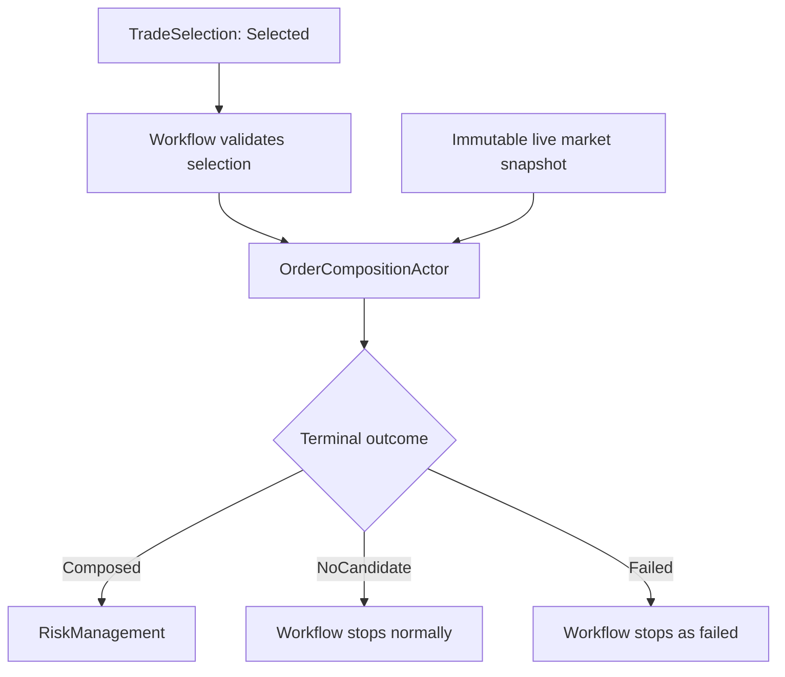
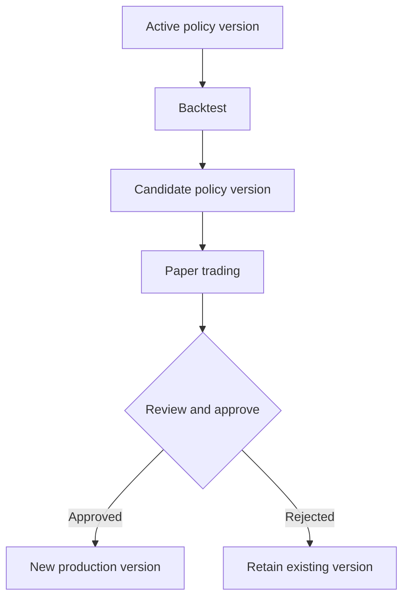

# OrderComposition High-Level Design

## Current specification alignment - 2026-09-07

The [detailed specification v1.0](OrderComposition-Specification-v1.0.md) is now the authoritative implementation contract. Its section 1 supersedes the older HLD wording below where it differs: all twelve catalog variants may use any one Daily/Weekly/Monthly horizon; policies bind through the existing ConfigurationDb deployment graph; composition builds one normalized unit and Portfolio Risk Management determines final units; long/debit and short/credit condors are both supported; Market Condition remains market-only; and composition uses the shared five-map Function actor with typed execution policy, completed-only persistence and shared boundary serialization. Family membership is provenance, not a separate live policy lookup or permission grant.

The HLD body is retained as design history. The [implementation record](OrderComposition-Prerequisite-Implementation-Record-v1.0.md) now records prerequisite worker ownership/context refresh and durable workflow preparation/dispatch code. It also distinguishes remaining business-source recovery, final composer gates and live qualification; this HLD does not certify their completion.

The [prerequisite implementation plan](OrderComposition-Prerequisite-Implementation-Plan-v1.0.md) records the approved initial restriction to verified European-style ES options on futures and the work needed for Treasury conversion/freshness, exact contract conventions, production Black-76 enrichment, chain ownership/recovery and coherent snapshots. It also corrects the detailed specification's former interpolation/fixed-day-count/missing-pricing outcome assumptions. These pricing rules and the specification's current catalog/horizon rules supersede conflicting historical text below. The full composer implementation document can be written once producer/consumer contracts are frozen; live qualification is a separate milestone.


**Document version:** 0.1  
**Status:** High-level design  
**System:** Intrinsic Time Trade Strategy Workflow  
**Stage:** OrderComposition  
**Primary implementation target:** .NET 10 / C# actor-based trading system

## 1. Purpose

OrderComposition is the fourth decision stage in the opening strategy workflow. It converts the immutable strategy selected by TradeSelection into one exact, broker-neutral order candidate that RiskManagement can approve or reject.

Its central question is:

> Given the selected strategy, its TradeStrategyFamily-owned composition policy, the accepted regime and market condition, and a coherent live market snapshot, what exact ES futures or ES futures-options order best expresses the strategy now?

OrderComposition selects the futures contract or option expiration, strikes, legs, ratios, candidate quantity, order type, price, time in force, execution bounds, and conservative candidate-risk measurements. It does not select a different strategy, approve financial risk, reserve capital, obtain broker order identifiers, or submit an order.

The initial product universe is restricted to:

- Daily ES futures;
- Weekly ES futures-option vertical spreads;
- Monthly ES futures-option iron condors.

## 2. Position in the workflow

The fixed opening sequence is:

1. RegimeDiscovery
2. MarketCondition
3. TradeSelection
4. OrderComposition
5. RiskManagement
6. OrderExecution



The Strategy Workflow is the sole stage sequencer. OrderComposition cannot invoke RiskManagement directly, alter workflow state, retry itself, or loop back to TradeSelection.

## 3. Canonical components

| Role | Component |
| --- | --- |
| Workflow stage | `OrderComposition` |
| Actor | `OrderCompositionActor` |
| Deterministic calculation component | `OrderComposer` |
| Parameter resolver | `CompositionParameterResolver` |
| Futures implementation | `EsFuturesOrderComposer` |
| Vertical implementation | `EsVerticalSpreadOrderComposer` |
| Iron-condor implementation | `EsIronCondorOrderComposer` |
| Start command | `StartOrderCompositionPipelineCommand` |
| Terminal events | `OrderCompositionPipelineCompletedEvent`, `OrderCompositionPipelineFailedEvent` |

`OrderCompositionActor` owns messaging, invocation state, validation, persistence, cancellation, terminal-event atomicity, and observability. Private deterministic components perform parameter resolution, candidate generation, pricing, filtering, scoring, and validation.

## 4. Responsibility boundaries

| Component | Authoritative responsibility |
| --- | --- |
| RegimeDiscovery | Accepted underlying ES direction, trend, volatility, structure, strength, and confidence |
| MarketCondition | Current traded-product tradeability, liquidity, integrity, bias, phase, volatility, skew, term structure, event/session context, and typed evidence |
| TradeSelection | One Portfolio-authorized, versioned `TradeStrategyDefinition` |
| TradeStrategyFamily definition | Owns the available strategy membership and OrderComposition policy bindings for the family version |
| OrderComposition | Resolves bounded condition-dependent parameters and creates one exact order candidate |
| RiskManagement | Approves or rejects the exact candidate and atomically reserves its risk |
| OrderExecution | Works the unchanged approved order within its approved execution envelope |
| Broker adapter | Translates the broker-neutral order to IBKR or emulator contracts and reports broker truth |

The primary invariant is:

> TradeSelection chooses the strategy. OrderComposition expresses it exactly. RiskManagement owns financial authorization. OrderExecution owns market interaction.

## 5. Core design decisions

1. **One workflow actor.** A single `OrderCompositionActor` coordinates private product-specific composers.
2. **Family-owned policies.** The existing `TradeStrategyFamilyDefinition` is extended with versioned OrderComposition policy bindings for its member strategies.
3. **Strategy-specific behavior inside the family.** A family containing several strategies carries a distinct policy binding for each member strategy or an explicit family default plus member override. A balanced and directionally biased iron condor are not forced to share identical parameters.
4. **Frozen policy version.** The effective family, strategy, binding, and policy versions are resolved before OrderComposition begins and cannot change during the invocation.
5. **Base plus bounded adaptation.** Every adaptive parameter has a baseline, hard limits, ordered deterministic adjustment rules, and a recorded resolved value.
6. **Backtesting and paper trading tune policy.** Research results create new policy versions. They never mutate an active historical version.
7. **No automatic production optimization.** Backtesting or paper-trading output cannot activate a production policy automatically. Activation is an explicit configuration/governance action.
8. **One coherent market snapshot.** Composition uses one immutable snapshot derived from continuously maintained live ES futures and option-chain state.
9. **Existing Black-76 pricer is authoritative.** OrderComposition consumes the user's custom C# Black-76 futures-option pricer/calculator through a narrow interface; it does not reimplement pricing mathematics.
10. **Deterministic output.** Identical immutable inputs and policy versions produce the same resolved parameters, candidate ordering, selected candidate, reason codes, and candidate hash.
11. **No strategy substitution.** OrderComposition cannot switch strategy, structure, product, or family.
12. **No progressive safeguard relaxation.** When no candidate satisfies hard constraints, the business outcome is `NoCandidate`.
13. **Candidate quantity is proposed, not authorized.** The composer calculates an exact quantity from static policy, Fund hints, and liquidity. RiskManagement approves or rejects it unchanged.
14. **No risk-driven recomposition loop in V1.** A rejection does not trigger automatic quantity reduction or recomposition.
15. **Broker-neutral candidate.** No IBKR DTO or broker order ID crosses into the domain/application contract.
16. **Multi-leg atomicity.** Weekly verticals and monthly iron condors are composed as one atomic combo candidate with one net limit price.
17. **No LLM authority.** An LLM cannot resolve parameters, choose legs, alter prices, rank candidates, or authorize an order.

## 6. TradeStrategyFamily ownership

### 6.1 Updated family definition

The existing family implementation should be extended conceptually as follows:

```csharp
public sealed record TradeStrategyFamilyDefinition
{
    public required Guid StrategyFamilyId { get; init; }
    public required int Version { get; init; }
    public required string Name { get; init; }

    public required IReadOnlyList<FamilyStrategyMembership>
        StrategyMemberships { get; init; }

    public required IReadOnlyList<FamilyStrategyCompositionPolicyBinding>
        OrderCompositionPolicies { get; init; }

    public required DateTimeOffset EffectiveFromUtc { get; init; }
    public DateTimeOffset? EffectiveUntilUtc { get; init; }
    public required bool Enabled { get; init; }
    public required string DefinitionChecksum { get; init; }
}
```

### 6.2 Policy binding

```csharp
public sealed record FamilyStrategyCompositionPolicyBinding
{
    public required Guid StrategyDefinitionId { get; init; }
    public required int StrategyDefinitionVersion { get; init; }

    public required Guid OrderCompositionPolicyId { get; init; }
    public required int OrderCompositionPolicyVersion { get; init; }

    public required bool Enabled { get; init; }
    public required int ResolutionPriority { get; init; }
    public required string BindingChecksum { get; init; }
}
```

This structure is necessary because one strategy definition may appear in multiple families and may legitimately use different composition policies in each family. The selected TradeSelection result therefore retains source-family provenance and the exact effective family-policy binding.

### 6.3 Resolution rules

Before realtime composition, configuration resolution must:

1. identify the exact selected strategy definition and source family;
2. locate exactly one effective enabled policy binding;
3. validate family membership and compatible versions;
4. validate policy schema and parameter completeness;
5. reject ambiguous bindings unless an explicit deterministic priority resolves them;
6. calculate and retain checksums;
7. freeze the resolved binding in the workflow mandate/selection result.

An unresolved, missing, duplicated, disabled, or incompatible policy binding is a configuration failure and must not be discovered by silently selecting a default during live composition.

## 7. Policy model

```csharp
public sealed record StrategyOrderCompositionPolicy
{
    public required Guid PolicyId { get; init; }
    public required int Version { get; init; }
    public required Guid StrategyFamilyId { get; init; }
    public required int StrategyFamilyVersion { get; init; }
    public required Guid StrategyDefinitionId { get; init; }
    public required int StrategyDefinitionVersion { get; init; }

    public required BaseCompositionParameters BaseParameters { get; init; }
    public required CompositionParameterBounds HardBounds { get; init; }
    public required IReadOnlyList<CompositionAdjustmentRule> AdjustmentRules { get; init; }

    public required CandidateEligibilityPolicy EligibilityPolicy { get; init; }
    public required CandidateScoringPolicy ScoringPolicy { get; init; }
    public required CandidateTieBreakingPolicy TieBreakingPolicy { get; init; }
    public required PricingPolicy PricingPolicy { get; init; }
    public required QuantityCompositionPolicy QuantityPolicy { get; init; }
    public required ExecutionEnvelopePolicy ExecutionPolicy { get; init; }

    public required DateTimeOffset EffectiveFromUtc { get; init; }
    public DateTimeOffset? EffectiveUntilUtc { get; init; }
    public required PolicyLifecycleState LifecycleState { get; init; }
    public required string PolicyChecksum { get; init; }
}
```

Recommended lifecycle states are `Draft`, `Backtest`, `PaperTrading`, `ProductionApproved`, `Retired`, and `Disabled`. Promotion preserves the immutable policy version and records approval provenance; a parameter edit creates a new version.

### 7.1 Base values and hard bounds

Each adaptive numeric parameter contains:

- base target;
- hard minimum;
- hard maximum;
- unit and rounding rule;
- applicable product/strategy scope.

Examples include DTE, target delta, delta tolerance, wing width, minimum credit, quote age, cross-leg time skew, limit-price improvement, quantity, and candidate lifetime.

### 7.2 Adjustment rules

```csharp
public sealed record CompositionAdjustmentRule
{
    public required string RuleCode { get; init; }
    public required int Priority { get; init; }
    public required CompositionConditionPredicate When { get; init; }
    public required CompositionParameter TargetParameter { get; init; }
    public required AdjustmentOperation Operation { get; init; }
    public required decimal Value { get; init; }
    public required string ReasonCode { get; init; }
}
```

The initial operation set is deliberately small: `Set`, `Add`, `Subtract`, `Multiply`, `Minimum`, and `Maximum`.

Rules execute by ascending priority and then stable rule code. Duplicate priority is permitted only when rule-code ordering is an approved part of the policy. Configuration validation should reject circular dependencies and rules targeting incompatible parameters.

The canonical resolution formula is:

```text
resolved = RoundToUnit(
    Clamp(
        ApplyOrderedRules(baseValue),
        hardMinimum,
        hardMaximum))
```

### 7.3 Approved adjustment inputs

Rules may use only typed, immutable inputs present in the invocation:

- accepted RegimeDiscovery direction, trend, volatility, strength, and confidence;
- accepted MarketCondition tradeability, product bias, phase, opportunity strength, confidence, liquidity, integrity, implied-volatility condition, skew, and term structure;
- intrinsic-time trigger type, direction, threshold, and overshoot evidence;
- frozen Fund mandate, calendar, session, event, and non-financial sizing hints;
- immutable composition-market snapshot statistics.

The resolver must not perform an ad hoc external query. Economic events, session state, VIX context, and other external factors must already be captured in accepted upstream results or the frozen mandate.

Emergency kill switches and explicit cancellation remain separate safety authorities.

## 8. Parameter-resolution phase

```csharp
public interface ICompositionParameterResolver
{
    ResolvedCompositionParameters Resolve(
        in CompositionParameterContext context);
}
```

The result records every calculation:

```csharp
public sealed record ResolvedCompositionParameter
{
    public required CompositionParameter Parameter { get; init; }
    public required decimal BaseValue { get; init; }
    public required decimal ResolvedValue { get; init; }
    public required decimal HardMinimum { get; init; }
    public required decimal HardMaximum { get; init; }
    public required IReadOnlyList<AppliedCompositionAdjustment>
        AppliedAdjustments { get; init; }
    public required bool WasClamped { get; init; }
}
```

`ResolvedCompositionParameters` includes the complete ordered collection, resolution ID, family/strategy/policy versions, source-result identifiers, resolution time, reason codes, and canonical resolution hash.

If a condition-dependent adjustment cannot be evaluated because a required typed input is absent, the outcome is `Failed` when the policy contract declares that input mandatory. An ordinary market condition that produces no permitted parameter combination results later in `NoCandidate`.

## 9. Initial policy categories

Exact V1 values are versioned hypotheses established before implementation and then tuned by deterministic backtesting and paper trading.

### 9.1 Daily ES futures policies

Each ES futures strategy policy defines at minimum:

- active-contract and rollover selection;
- base quantity and hard quantity range;
- maximum bid/ask spread;
- maximum quote age;
- initial limit reference and offset in ticks;
- price rounding;
- planned stop distance or strategy risk-distance reference;
- stress-loss distance;
- maximum adverse entry movement;
- candidate lifetime;
- default execution pattern and hard execution bounds.

Adjustments may depend on volatility regime, trend strength, ES liquidity, session, intrinsic-time movement magnitude, and short-term spread/price behavior. They alter order expression, not the selected strategy trigger.

### 9.2 Weekly vertical-spread policies

Each vertical strategy policy defines at minimum:

- target and permitted DTE range;
- call/put and credit/debit structure permitted by the selected strategy;
- target short-leg delta and hard delta range;
- permitted spread widths;
- minimum absolute credit where applicable;
- minimum credit-to-width and return-on-risk ratios;
- maximum per-leg and synthetic combo spread;
- minimum displayed size;
- maximum quote age and cross-leg time skew;
- base quantity and hard quantity range;
- natural/mid/limit price policy;
- candidate lifetime and execution envelope.

Adjustments may depend on directional strength, implied-volatility level, skew, expected movement, regime/condition alignment, liquidity, event proximity, and session.

### 9.3 Monthly iron-condor policies

Balanced and directionally biased iron condors require separate strategy-policy bindings. Each policy defines at minimum:

- target and permitted DTE range;
- separate short-put and short-call base delta targets;
- hard delta ranges and maximum permitted asymmetry;
- permitted put and call wing widths;
- ratio requirements, initially 1:1:1:1 unless explicitly configured otherwise;
- minimum absolute credit;
- minimum credit-to-maximum-wing-width ratio;
- minimum expected return on maximum risk;
- maximum net delta and other aggregate-Greek bounds used for candidate eligibility;
- liquidity, quote-age, and cross-leg-skew requirements;
- base quantity and hard quantity range;
- net-credit pricing policy;
- candidate lifetime and execution envelope.

Adjustments may change put/call delta targets, strike distance, wing widths, DTE target, credit threshold, quantity within static bounds, and pricing aggressiveness. They must not convert an iron condor to a naked or different strategy structure.

## 10. Live market-data requirements

### 10.1 Continuously maintained state

A live market-data service maintains:

- ES futures definitions and active-contract quotes;
- ES futures-option definitions by expiration, strike, and right;
- live best bid, ask, size, timestamp, and sequence per subscribed option;
- option-chain completeness and integrity state;
- slower-moving reference fields such as volume and open interest when available.

The system should subscribe only to the bounded chain region required by active family policies: eligible expirations, calls and puts, target-delta/strike regions, and enough surrounding strikes to support maximum permitted widths.

### 10.2 Immutable composition snapshot

OrderComposition consumes a single `MarketCompositionSnapshot` containing:

- snapshot ID and schema version;
- ES underlying contract, bid, ask, midpoint, last, size, sequence, and timestamp;
- eligible futures-option definitions;
- relevant option bid, ask, size, sequence, and timestamp;
- implied-volatility inputs or values;
- newest/oldest quote times and maximum cross-leg skew;
- completeness, integrity, and freshness results;
- capture time and expiry time;
- canonical snapshot checksum.

The snapshot prevents a vertical or iron condor from being constructed from materially different market moments. The actor does not continually reread live state during one invocation.

## 11. Custom Black-76 integration

The existing custom C# Black-76 futures-option pricer/calculator remains authoritative.

```csharp
public interface IFuturesOptionPricer
{
    FuturesOptionValuation Calculate(
        in FuturesOptionPricingInput input);
}
```

The input includes ES futures price, strike, time to expiration, risk-free rate, implied volatility, option right, and any existing pricer conventions. The output supplies theoretical value and available Greeks such as delta, gamma, theta, and vega. If implied-volatility inversion is already part of the calculator, it remains behind the same pricing boundary or a companion interface.

OrderComposition is responsible for:

- supplying coherent snapshot and reference-data inputs;
- validating pricing-input freshness and validity;
- invoking the pricer deterministically;
- aggregating signed Greeks across legs and ratios;
- using valuation outputs in eligibility and ranking;
- retaining the pricer/model version and input hash as evidence.

OrderComposition must not duplicate Black-76 formulas or replace executable bid/ask prices with theoretical prices. Live chain prices describe tradeability; Black-76 describes valuation and option behavior.

## 12. Start command

`StartOrderCompositionPipelineCommand` contains:

- schema version;
- WorkflowId, StageInvocationId, EntityId, and expected workflow revision;
- PortfolioId, FundId, horizon, ES root, and traded-product type;
- trigger and stage timestamps;
- immutable trigger context;
- accepted RegimeDiscovery result;
- accepted MarketCondition result;
- selected TradeSelection result;
- frozen Portfolio/Fund mandate snapshot;
- selected source-family reference;
- frozen family-policy binding and policy definition;
- immutable market-composition snapshot;
- required instrument/reference/rate snapshot identifiers;
- trace context.

The actor repeats trust-boundary validation for all identities, versions, checksums, validity windows, product compatibility, and required typed payloads.

## 13. Composition algorithm

The canonical algorithm is:

1. Validate the command, identities, versions, and accepted upstream envelopes.
2. Validate that TradeSelection outcome is `Selected`.
3. Resolve and validate exactly one family-owned policy binding.
4. Validate market snapshot integrity, completeness, freshness, and product match.
5. Resolve condition-dependent parameters from base values and ordered rules.
6. Select the permitted ES futures contract and, for options, eligible expirations.
7. Generate structurally valid contract/leg combinations.
8. Price option legs through the custom Black-76 calculator.
9. Calculate live natural price, midpoint, proposed limit, and worst acceptable price.
10. Calculate quantities, aggregate Greeks, maximum/planned loss, notional, fees, and slippage reserve.
11. Apply all hard eligibility constraints.
12. Score remaining candidates deterministically.
13. Apply stable deterministic tie breakers.
14. Select exactly one candidate or return `NoCandidate`.
15. Validate the complete candidate and execution envelope.
16. Calculate canonical parameter, market-evidence, and candidate hashes.
17. Persist one logical result and emit exactly one terminal event.

## 14. Product-specific construction

### 14.1 ES futures

The composer selects exactly one active permitted ES contract, side, contract count, limit price, time in force, and execution envelope. Limit is the normal V1 entry order. Any permitted Limit-to-Market escalation is an OrderExecution policy bounded by the RiskManagement-approved envelope, not an unapproved composer action.

### 14.2 Weekly vertical

The composer creates one two-leg atomic combo with equal ratios unless the selected strategy explicitly defines otherwise. It selects expiration, right, long/short strikes, width, quantity, and one net debit/credit limit price.

### 14.3 Monthly iron condor

The composer creates one four-leg atomic combo containing long put, short put, short call, and long call. It selects expiration, separate put/call targets, wings, quantity, and one overall net-credit limit price. IBKR ultimately receives one BAG/combo price, not four independently executable limit orders.

## 15. Pricing

For options, conservative natural pricing uses:

```text
Long leg  -> ask
Short leg -> bid
```

The candidate records per-leg bid/ask/mid/theoretical values plus combo natural, midpoint, proposed limit, and worst acceptable price. All prices are rounded using contract/combo tick rules.

Minimum credit should support normalized requirements rather than only a fixed point value:

- minimum absolute credit;
- minimum credit-to-wing-width ratio;
- minimum credit-to-maximum-loss ratio;
- minimum expected return on risk.

A candidate satisfies every requirement enabled by its policy.

## 16. Quantity boundary

The composer calculates an exact positive integer combo quantity from:

- policy base/minimum/maximum;
- frozen Fund non-financial sizing hints;
- displayed liquidity and participation limits;
- structure ratios and contract constraints;
- deterministic rounding.

It does not consume available Portfolio risk or reserve capital. RiskManagement evaluates the exact resulting quantity against open exposure, working-order reservations, Portfolio/Fund limits, margin, and account safety. V1 RiskManagement approves or rejects unchanged; it does not silently resize.

## 17. Candidate schema

`ComposedOrderCandidate` includes:

- candidate, workflow, invocation, Portfolio, and Fund identities;
- source family, strategy definition, binding, and policy versions;
- resolved-parameter object and hash;
- product, strategy structure, trade mode, and direction;
- exact ordered legs with instrument IDs, sides, ratios, expiration, strike/right, multiplier, and tick size;
- exact combo quantity;
- order type, limit price, time in force, and combo action;
- market snapshot/evidence reference;
- live and theoretical pricing summary;
- aggregate Greeks;
- maximum/planned/stress loss and gross notional;
- estimated fees and slippage reserve;
- immutable execution envelope;
- composition and expiry timestamps;
- ordered reason codes and deterministic summary;
- canonical candidate hash.

The candidate contains no broker order ID and is explicitly `Unapproved`.

## 18. RiskManagement handoff

RiskManagement receives the exact candidate plus current Portfolio/Fund risk, reserved working-order risk, and broker/account safety snapshots. Initial V1 risk is additive with no offsetting/netting credit.

Defined-risk verticals and iron condors use conservative bounded-loss formulas including multiplier, quantity, fees, and slippage reserve. ES futures supply gross notional, contract count, planned loss, stress loss, and margin estimate.

Approval atomically reserves risk against the candidate hash. Any economic change after approval—including contract, expiration, strike, side, ratio, increased quantity, or a price outside the envelope—requires cancellation/abandonment, a new composition invocation, a new candidate hash, and renewed risk approval.

## 19. Terminal semantics

`OrderCompositionPipelineCompletedEvent` contains one business outcome:

- `Composed`: one complete unapproved candidate was created;
- `NoCandidate`: evaluation completed normally but no exact candidate satisfied the selected policy.

Common `NoCandidate` reasons include no eligible contract/expiration, no strikes in the resolved delta range, inadequate liquidity, stale quotes, excessive cross-leg skew, insufficient credit, invalid wing combination, failed Greek bounds, or no valid positive quantity.

`OrderCompositionPipelineFailedEvent` is reserved for technical or contract failures such as identity mismatch, corrupt policy, missing mandatory typed input, unsupported structure, missing instrument definitions, calculation failure, persistence failure, cancellation, or optional timeout.

Completed does not mean continue. The Strategy Workflow validates the result and applies the continuation rule. There is no automatic retry or fallback strategy.

## 20. Cancellation, timeout, and atomicity

An optional cancel command and optional actor timeout may be implemented consistently with the Strategy Workflow design. Cancellation is cooperative until the terminal outcome begins committing.

For every accepted invocation, the actor must commit exactly one logical terminal event: Completed or Failed. Duplicate delivery must return/re-emit the stored terminal result without recomputing against newer market data.

## 21. Determinism and hashing

Canonical serialization and hashing cover:

- accepted upstream-result identities and hashes;
- mandate, family, strategy, binding, and policy versions/checksums;
- market and reference snapshot hashes;
- ordered applied rules and resolved parameters;
- ordered candidate legs and quantities;
- pricing, risk, and execution-envelope values;
- reason-code and algorithm versions.

Wall-clock values used for freshness are taken from the command/snapshot evaluation time, not read repeatedly during calculation. Collections are sorted by explicit stable keys. Floating-point behavior, decimal rounding, and pricer versions are fixed and testable.

## 22. Backtesting and paper-trading feedback

Backtesting and paper trading are the approved mechanisms for adjusting baseline values and policies.

They may produce evidence for changes to:

- DTE targets and bounds;
- delta targets/tolerances and asymmetry;
- wing/spread widths;
- credit and return-on-risk requirements;
- liquidity/freshness thresholds;
- candidate scoring weights;
- pricing offsets and candidate lifetimes;
- quantity hints and participation limits;
- adjustment predicates, operations, magnitudes, and precedence.

The governance flow is:



Backtest and paper results must retain dataset/period, engine version, family/strategy/policy versions, parameter hashes, metrics, and approval provenance. Promotion is explicit. Existing trades and inflight workflows continue to reference their original immutable versions.

## 23. Persistence and observability

Persist at minimum:

- invocation identity and lifecycle;
- accepted input identities and hashes;
- selected family-policy binding;
- base and resolved parameter values;
- each applied/skipped adjustment and reason;
- snapshot integrity/freshness evidence;
- generated/rejected candidate counts and rejection reasons;
- selected candidate and hashes;
- duration by validation, resolution, generation, pricing, scoring, and persistence phase;
- terminal outcome.

OpenTelemetry should expose counts and latency by family, strategy, product, policy version, and outcome without placing high-cardinality candidate/workflow IDs on metrics. IDs remain available in traces and structured logs.

## 24. Testing requirements

Required tests include:

- family membership and policy-binding resolution;
- ambiguous/missing/disabled/incompatible bindings;
- policy schema, checksum, lifecycle, and effective-date validation;
- every adjustment predicate and operation;
- rule precedence, clamping, rounding, and explanation evidence;
- deterministic replay from identical inputs;
- futures rollover and contract selection;
- option-chain completeness, staleness, and cross-leg skew;
- Black-76 input/output integration and aggregate Greeks;
- vertical and iron-condor leg ordering and sign conventions;
- natural, midpoint, limit, tick rounding, credit, and maximum-loss formulas;
- stable scoring and tie breaking;
- quantity boundaries and zero-quantity rejection;
- `Composed`, `NoCandidate`, `Failed`, cancellation, and timeout paths;
- duplicate command/event delivery and single-terminal-event atomicity;
- candidate-hash stability and mutation detection;
- production-policy version promotion without inflight mutation;
- IBKR/emulator contract translation compatibility without broker types entering the domain.

Golden tests should preserve representative Daily futures, Weekly vertical, balanced Monthly iron-condor, and directionally biased Monthly iron-condor compositions across low, normal, high, and extreme/no-trade conditions.

## 25. Initial implementation plan

1. Extend `TradeStrategyFamilyDefinition` with strategy-policy bindings.
2. Define immutable policy, binding, resolved-parameter, market-snapshot, and candidate contracts.
3. Add configuration validation and checksum generation outside the realtime path.
4. Adapt the live ES futures/option-chain service to capture coherent composition snapshots.
5. Wrap the existing Black-76 calculator with the narrow OrderComposition interface.
6. Implement parameter resolution and evidence capture.
7. Implement ES futures, vertical, and iron-condor composers.
8. Implement deterministic pricing, eligibility, scoring, tie breaking, and hashing.
9. Implement actor lifecycle, persistence, terminal events, cancellation, timeout, and telemetry.
10. Integrate the exact candidate with RiskManagement and later OrderExecution.
11. Establish initial policy versions, backtest them, promote candidates to paper trading, and activate production versions only after explicit review.

## 26. Deferred decisions

The architecture is complete without fixing the optimized numeric values. The following must be populated as versioned V1 policy data and tuned through backtesting/paper trading:

- base and hard DTE values;
- target delta values and permitted tolerances;
- spread and wing-width sets;
- absolute and normalized credit thresholds;
- liquidity and freshness thresholds;
- scoring weights;
- quantity defaults and bounds;
- price improvement and candidate-expiry settings;
- specific condition-adjustment magnitudes.

These are configuration decisions, not missing architectural components.

## 27. Summary

OrderComposition is a deterministic, family-policy-driven translation from one selected strategy to one exact unapproved ES order candidate. The existing `TradeStrategyFamilyDefinition` owns versioned policy bindings for each member strategy. Each policy combines testable baseline values, hard safeguards, ordered condition-dependent adjustments, eligibility rules, and deterministic ranking. Live option-chain data supplies executable prices; the existing custom C# Black-76 calculator supplies theoretical values and Greeks. Backtesting and paper trading create and validate new immutable policy versions, while RiskManagement retains final authority over every exact candidate.
