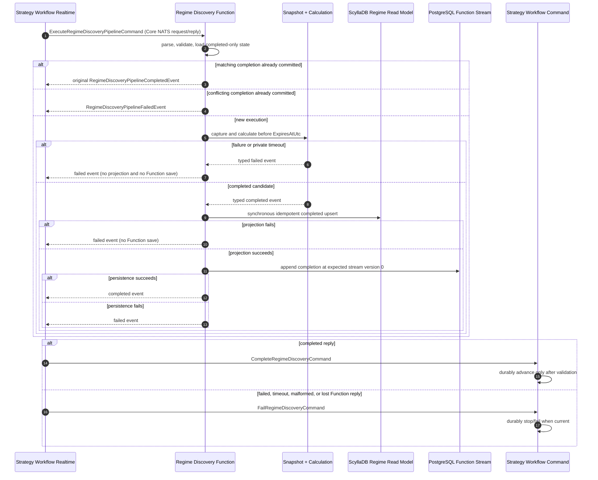

# Regime Discovery Implementation Specification

Implementation Specification v1.0

| Item | Value |
| --- | --- |
| Status | RD-0 through RD-19 and FNC-00 through FNC-12 implemented; FunctionActor flow authoritative |
| Date | 2026-08-27 |
| Design authority | `Regime-Discovery-Specification-v1.0.md` |
| Atomic revision plan | `Regime-Discovery-Atomic-Workflow-Implementation-Plan-v1.0.md` |
| Workflow authority | `Intrinsic-Time-Strategy-Workflow-Implementation-v1.0.md` |
| Target | Deterministic V1 / .NET 10 actor application |

## 1. Approved decisions

1. Each Strategy Workflow calculates only its own Daily, Weekly, or Monthly
   horizon. It may use configured supporting observation timeframes, but it
   does not calculate the other two workflow horizons.
2. The deterministic scoring, confidence, fusion, required-signal,
   freshness, quality, restriction, and reason-code rules are defined in the
   companion design specification and are implementation requirements.
3. PostgreSQL `ConfigurationDbContext` is authoritative for immutable,
   versioned strategy and pipeline parameter sets.
4. Configuration lifecycle belongs to the Reference bounded context under
   `Configuration/Trade/StrategyWorkflow` and
   `Configuration/Trade/StrategyWorkflow/Pipeline`.
5. Regime Discovery captures one immutable latest-signal snapshot and never
   substitutes database reads or numeric defaults for unavailable required
   hot signals.
6. Regime Discovery has one completed-only event-sourced Function actor. Trend,
   Volatility, Market Structure, and Fusion are sealed actor-owned calculation
   models, not actors. There is no Regime Discovery Realtime actor.
7. The Function actor dispatches `ExecuteRegimeDiscoveryPipelineCommand`
   through exact `_parseMap`, `_validationMap`, and `_receiveMap` mappings and
   directly returns a typed completed or failed event to Strategy Workflow.
8. Only a completed candidate reaches the synchronous optional Function
   projector. Projection must succeed before completed-only Function state is
   saved. Failed results are neither projected nor saved, and no terminal
   result is published through Core NATS or JetStream.
9. Every execution has a fixed, persisted `ExpiresAtUtc`. Timeout takes
   precedence at `now >= ExpiresAtUtc`; an expired completion can never advance
   Strategy Workflow. A later Start command is the authoritative lazy backstop
   when a timeout/failure notification was lost.
10. Trend, Volatility, and Market Structure may run on ordinary .NET thread
   pool work and be awaited together only if repeatable benchmarks show a
   material benefit over deterministic sequential execution.

### 1.1 RD-0 baseline and compatibility decisions

RD-0 completed its repository inventory and baseline on 2026-08-26:

- `dotnet build TomasAI.IFM.sln --no-restore` succeeded with zero warnings
  and zero errors;
- the Regime Discovery implementation folder contains documentation only;
  no Command actor, state, calculation model, projector, query, or schema has
  been implemented yet;
- Strategy Workflow already defines and routes the Regime Discovery Start,
  Completed, Failed, and legacy Processing contracts;
- the legacy `RegimeDiscoveryPipelineProcessingEvent` has been removed because
  a Function request/reply has no public processing lifecycle;
- terminal events are returned only to the Strategy Workflow realtime caller,
  which sends the matching Complete or Fail command directly to the Strategy
  Workflow Command actor; and
- Regime Discovery execution identity combines the stable
  `IntrinsicTimeStrategyWorkflowEntityId` with `StrategyWorkflowId`, so a
  terminal execution cannot block or mutate a later workflow for the same
  strategy entity.

The approved implementation order is:

```text
RD-0 -> RD-1 -> RD-11/RD-12 -> RD-10 -> RD-14/RD-15
     -> RD-2/RD-3/RD-4 -> RD-5 through RD-9 -> RD-13 -> RD-16 through RD-18
```

This order builds and tests the deterministic core through an injected
snapshot-provider boundary before completing live cache/configuration wiring.

## 2. Project-dependency boundary

`TomasAI.IFM.Domain.Reference.Shared` already references
`TomasAI.IFM.Domain.Trade.Shared`. Making Trade.Shared reference
Reference.Shared would create a circular project dependency. Therefore:

- immutable parameter-set types used by pipeline messages live with their
  Trade.Shared pipeline contracts;
- Reference.Shared owns configuration lifecycle commands, queries, identities,
  metadata, and public read models;
- Domain.Reference implements configuration command/query actors under the
  approved Reference/Configuration hierarchy; and
- Application.Storage implements authoritative PostgreSQL persistence through
  ConfigurationDbContext.

This separates contract ownership from configuration lifecycle ownership
without introducing a new shared project or changing existing project
dependencies.

## 3. Configuration architecture

### 3.1 Logical Reference layout

```text
TomasAI.IFM.Domain.Reference.Shared/Configuration/
  Common/
  Trade/
    StrategyWorkflow/
      Pipeline/
        RegimeDiscovery/
        MarketCondition/
        TradeSelection/
        OrderComposition/
        RiskManagement/

TomasAI.IFM.Domain.Reference/Configuration/
  Trade/
    StrategyWorkflow/
      Command/ Query/
      Pipeline/
        RegimeDiscovery/Command/ Query/
        MarketCondition/Command/ Query/
        TradeSelection/Command/ Query/
        OrderComposition/Command/ Query/
        RiskManagement/Command/ Query/
```

Configuration is partitioned first by owning domain. Future Fund, MarketData,
Securities, or other configuration families receive sibling folders below
`Reference/Configuration`; they do not share the Trade strategy hierarchy.

The first implementation exposes Regime Discovery end to end. Generic
ConfigurationDb refactoring and parameter-set CRUD for the other pipelines are
explicitly deferred until those actors are designed. Their business properties
must not be invented as opaque placeholders.

### 3.2 PostgreSQL storage

Proposed files:

- `TomasAI.IFM.Application.Storage/ConfigurationDb/ConfigurationDbContext.cs`
- `TomasAI.IFM.Application.Storage/ConfigurationDb/IConfigurationDbContext.cs`
- `TomasAI.IFM.Application.Storage/ConfigurationDb/ConfigurationDbSql.cs`
- `TomasAI.IFM.Application.Storage/ConfigurationDb/ConfigurationDbParameter.cs`
- `TomasAI.IFM.Application.Storage/ConfigurationDb/Schema/ConfigurationSchemaDb.cs`
- `TomasAI.IFM.Application.Storage/ConfigurationDb/Schema/ConfigurationSchemaSql.cs`

`ConfigurationDbConnection` is a PostgreSQL connection. Development may point
it at the same physical database as EventSourceDb, but ConfigurationDb uses its
own `reference_configuration` PostgreSQL schema and context.

Tables:

- `reference_configuration.intrinsic_time_strategy_workflow_parameter_set`
- `reference_configuration.regime_discovery_parameter_set`
- `reference_configuration.market_condition_parameter_set` (deferred)
- `reference_configuration.trade_selection_parameter_set` (deferred)
- `reference_configuration.order_composition_parameter_set` (deferred)
- `reference_configuration.risk_management_parameter_set` (deferred)

Every table has:

```text
parameter_set_id uuid
version integer
schema_version smallint
status smallint
effective_from_utc timestamptz null
retired_at_utc timestamptz null
payload_json jsonb
payload_sha256 text
description text
created_utc timestamptz
created_by text
PRIMARY KEY (parameter_set_id, version)
```

Published parameter identity, version, schema, payload, and hash are
immutable. Guarded lifecycle metadata may publish or retire a row; changing a
published payload inserts a new version. Publication verifies that the
deserialized typed payload is valid and that its canonical JSON SHA-256 equals
the stored hash. Selection is explicit by ID/version or deterministic by
effective time; ties are rejected as configuration faults. Loading historical
workflow state never re-resolves an effective version.

### 3.3 Factory, DI, and startup changes

Append `ConfigurationDb` and `ConfigurationSchema` to
`IDbContextFactory`/`DbContextFactory`. Register the PostgreSQL connection,
context, interface, and schema in Application.Api.Server Startup and add the
connection string to development/production settings without embedding
credentials.

### 3.4 Workflow resolution

The existing Strategy Workflow admission path resolves Regime configuration in
the Workflow Realtime context before it sends the Start command. ConfigurationDb
refactoring is on hold for the Regime-first implementation. The admission path:

1. resolves the effective Intrinsic Time Strategy Workflow parameter set;
2. resolves its referenced Regime Discovery parameter-set ID/version;
3. validates and canonicalizes the typed RegimeDiscoveryParameterSet;
4. supplies those frozen values to the Workflow Command actor, which commits
   them with the Started state transition;
5. stores the frozen parameter set in the immutable workflow view carried by
   `WorkflowStrategyStateUpdatedEvent`; and
6. allows the EventProjector/Realtime dispatch path to append that exact view
   and parameter set to `ExecuteRegimeDiscoveryPipelineCommand`.

The payload is part of durable workflow history. State reconstruction uses the
recorded payload and never reads ConfigurationDb to reinterpret an old
workflow; reconstruction never redispatches work.

## 4. Current hot-cache and indicator inventory

### 4.1 Infrastructure that exists

| Capability | Current contract/source | Assessment |
| --- | --- | --- |
| Latest live futures price | `IMarketDataApi.TryGetLastTickPrice` returning `FuturesMarketPriceSnapshot` from TickAggregation | Usable; has contract/value-date identity, trade source sequence, and exchange timestamp |
| Stream activity | `IMarketDataApi.IsTickDataStreamActive` | Usable as live-price validity evidence |
| RSI/TDI/MACD/ADX | Dedicated signal contracts, actors, projections, latest queries, and common observation provenance | Calculation foundations are implemented; unified cache registration and restart warming remain |
| ATR | Dedicated Wilder ATR14 Command/Realtime/Event/Query implementation with baseline and ratio | Calculation foundation is implemented across intraday and Daily-supported horizons; unified cache registration remains |
| ITI | `FuturesItiSignalGeneratedEvent` / `FuturesItiSignalV2ReadModel` | Target-horizon trigger has direction, band level, reversal level, sequence, and intrinsic time |
| EMA | Dedicated EMA20/50/200 signal actors, projections, queries, and shared observation lineage | Calculation foundation is implemented; normalized slope/prior-value snapshot assembly remains |
| Bollinger Bands | Dedicated Bollinger(20,2) signal actors with width, position, and baseline support | Calculation foundation is implemented; Market Structure compatible-join output remains |
| VX term structure | `FuturesVxTermStructureSignal` Command/Realtime/Event/Query implementation | Front/second futures baseline is implemented; VIX spot composition, rollover qualification, and unified cache integration remain |
| VWAP | Event-sourced session VWAP Command actor with realtime routing, projection, query, and recovery | Implemented but not a V1 required Regime Discovery input unless enabled by a later parameter version |
| Generic caches | Redis blackboard, `IDataCacheService`, `IDbCache`, latest-value channels | Reusable primitives, but none provides an atomic typed regime snapshot |

Scylla latest queries are useful for startup warming, diagnostics, and tests.
They are not the hot-path source during a Regime Discovery calculation.

### 4.2 Missing signal infrastructure

The following must exist before the full deterministic V1 pipeline can be
enabled:

- one typed latest-signal cache keyed by instrument, signal type, observation
  timeframe, and calculation configuration;
- atomic snapshot capture with a cache revision and immutable values;
- registration/warming of the existing common provenance and indicator
  contracts in that unified cache;
- normalized EMA slope/prior-value snapshot assembly;
- the Market Structure compatible join containing rolling 20-observation
  high/low, range, and breakout-distance inputs;
- current VIX level composition with the implemented front/second
  VIX-futures term structure;
- prior volatility composite inputs needed for expanding/contracting; and
- optional realized-volatility percentile.

### 4.3 Proposed snapshot provider

Add `IRegimeDiscoveryMarketSignalSnapshotProvider` with its provider-neutral
request/response contracts in Domain.MarketData.Analytics.Shared and a
singleton implementation in the Market Data Analytics boundary. Generated
indicator events update immutable cache entries. Startup warming loads only
the most recent compatible projection for each configured key, marks it warm
after validation, and then realtime events advance it. The authoritative
upstream design is `Regime-Discovery-Market-Signal-Interface-Design-v1.0.md`.

Each mutation increments a monotonic cache revision. Capture reads the
revision, gathers all configured keys, then verifies that the revision did not
change; it retries a bounded number of times before reporting a consistency
failure. The returned `RegimeDiscoveryMarketSignalSnapshot` is immutable and records
the capture revision, snapshot identity, target horizon, supporting
timeframes, all source identities/timestamps, and data-quality results.

The V1 cache is process-local because the current API host runs the relevant
actors together. The provider interface prevents that deployment assumption
from leaking into Regime Discovery; a later distributed cache/actor-backed
implementation can replace it without changing pipeline contracts.

## 5. Parameter and result contracts

Proposed Trade.Shared paths:

```text
Strategy/Workflow/IntrinsicTime/Pipeline/Configuration/RegimeDiscovery/
  RegimeDiscoveryParameterSet.cs
  RegimeDiscoveryHorizonConfiguration.cs
  TrendRegimeConfiguration.cs
  VolatilityRegimeConfiguration.cs
  MarketStructureRegimeConfiguration.cs
  MarketRegimeFusionConfiguration.cs
  RegimeDiscoveryFreshnessConfiguration.cs
  RegimeDiscoveryDataQualityConfiguration.cs

Strategy/Workflow/IntrinsicTime/Pipeline/RegimeDiscovery/Model/
  TrendRegimeResult.cs
  VolatilityRegimeResult.cs
  MarketStructureRegimeResult.cs
  MarketRegimeFusionResult.cs
  RegimeDiscoveryResult.cs
  RegimeDiscoveryEvidence.cs
  RegimeDiscoveryReason.cs
  RegimeDiscoveryEnums.cs
```

The market-signal snapshot, requirement, availability, signal envelope, and
provider contracts live in
`TomasAI.IFM.Domain.MarketData.Analytics.Shared/RegimeDiscovery`; Trade.Shared
already depends on Analytics.Shared, which preserves the dependency direction.

All public/shared contracts use append-only MessagePack keys and XML comments.
Parameter/result records are immutable. Score values are validated for finite
range and persisted after six-decimal midpoint-to-even rounding.

`ExecuteRegimeDiscoveryPipelineCommand` appends the typed parameter set,
parameter payload hash, and target horizon. Existing keys are never reordered.
`RegimeDiscoveryPipelineCompletedEvent` continues to carry the opaque
`StrategyStageResultEnvelope`, whose payload is the MessagePack-serialized
typed RegimeDiscoveryResult.

## 6. Function actor and calculation topology

The implementation lives under
`TomasAI.IFM.Domain.Trade/Strategy/Workflow/IntrinsicTime/RegimeDiscovery`.
Only the Regime Discovery Function actor owns completed-only durable state.

```text
Strategy Workflow Realtime actor
  -> ExecuteRegimeDiscoveryPipelineCommand
RegimeDiscovery Function actor
  -> _parseMap -> _validationMap -> exact-type _receiveMap
  -> ExecuteRegimeDiscoveryPipeline.ExecuteAsync(...)
Async Function extension
  -> enforce the immutable ExpiresAtUtc deadline around snapshot and calculation
  -> capture immutable signal snapshot and frozen configuration
  -> run Trend, Volatility, Market Structure, and Fusion as pure models
  -> return FunctionResult<CompletedEvent, FailedEvent>
Function projector (completed candidate only)
  -> synchronously upsert the completed ScyllaDB read model
Function state repository (after projection succeeds)
  -> append RegimeDiscoveryPipelineCompletedEvent at expected stream version 0
Function actor
  -> return the typed terminal event directly to Strategy Workflow Realtime
Strategy Workflow Realtime actor
  -> send CompleteRegimeDiscoveryCommand or FailRegimeDiscoveryCommand and require acceptance
Strategy Workflow Command actor
  -> validate active WorkflowId/revision/stage/deadline
  -> commit WorkflowStrategyStateUpdatedEvent or ignore a stale terminal message
```

There is no Regime Discovery Command actor, Event actor, Realtime actor,
processing event, private terminal-event family, or component mailbox. The
Function projector owns no queue, publication, checkpoint, retry, or replay.
The completed Function stream is replayed only to hydrate idempotency state
after restart; it is not a message-delivery or projector replay mechanism.

### 6.1 Function actor layout and dispatch

The Command actor follows the system convention documented in
`Documents/system/Actor-Implementation-Conventions.md`:

```text
RegimeDiscovery/
  Command/
    Actor/
    State/
    EventProjector/
    Validation/
    Extensions/
  Model/
  Query/
```

Its derived actor remains mechanical and owns explicit `_parseMap`,
`_validationMap`, and `_receiveMap` dictionaries. Receive dispatch uses the
request's exact concrete CLR type; it must not use a type switch or string type
name. The Execute entry delegates to an asynchronous extension returning:

```csharp
FunctionResult<RegimeDiscoveryPipelineCompletedEvent,
               RegimeDiscoveryPipelineFailedEvent>
```

`BaseEventSourceFunctionActor` owns parse, validation, state load, optional
projection, completed-only state save, exception conversion, and typed reply.
The concrete Execute extension owns only snapshot capture, calculation, its
private hard deadline, and creation of the completed or failed candidate.

### 6.2 Actor-owned calculation models

The `Model` folder contains sealed, deterministic computation types:

- `TrendRegimeCalculationModel`
- `VolatilityRegimeCalculationModel`
- `MarketStructureRegimeCalculationModel`
- `MarketRegimeFusionModel`
- `RegimeDiscoveryCalculationModel`, which coordinates the component models

Each model receives immutable input and returns an immutable typed result. A
model does not mutate actor state, send messages, resolve services, write
storage, or publish events. Fusion receives the three completed component
results directly from the coordinator.

The coordinator initially supports both deterministic sequential execution
and awaited `Task.Run`/`Task.WhenAll` execution on the normal .NET thread pool.
It must not use dedicated threads, `TaskCreationOptions.LongRunning`, or
fire-and-forget work. Production selects parallel execution only after the
RD-13 benchmark demonstrates identical normalized output and a material
end-to-end latency improvement without p95/p99, allocation, or thread-pool
regression. Otherwise V1 remains sequential.

RD-13 qualified sequential execution on 2026-08-26 using BenchmarkDotNet
0.15.8 and .NET 10.0.10. Separate workflows were scheduled independently
to model actor-dispatcher concurrency; only the three specialists inside each
workflow varied between sequential and thread-pool-parallel execution.

| Horizon | Workflows | Sequential | Inner parallel | Parallel ratio |
| --- | ---: | ---: | ---: | ---: |
| Daily | 1 | 35.11 us | 53.01 us | 1.51 |
| Daily | 3 | 81.14 us | 81.93 us | 1.02 |
| Weekly | 1 | 38.35 us | 50.83 us | 1.33 |
| Weekly | 3 | 84.67 us | 93.98 us | 1.11 |
| Monthly | 1 | 36.01 us | 52.09 us | 1.45 |
| Monthly | 3 | 81.34 us | 88.82 us | 1.09 |

Inner parallel execution also allocated approximately two percent more memory.
V1 therefore uses `RegimeDiscoveryExecutionMode.Sequential`; independent
workflow actors retain normal dispatcher concurrency without creating nine
additional inner work items for the maximum three in-flight horizons.

### 6.3 Superseded RD-19 private/public event rules (historical)

> This subsection records the former CommandActor/EventProjector/RealtimeActor design and is
> superseded by the FNC FunctionActor sequence in section 6.5. None of the private events or
> publication routes described below remains executable.

Internal durable domain events are not public workflow contracts:

| Outcome | Private committed event | Projected public event |
| --- | --- | --- |
| Success | `RegimeDiscoveryCalculationCompletedEvent` | `RegimeDiscoveryPipelineCompletedEvent` |
| Failure | `RegimeDiscoveryCalculationFailedEvent` | `RegimeDiscoveryPipelineFailedEvent` |

- The private completed event contains the full typed result, deterministic
  result hash, snapshot/configuration identities, and evidence needed to
  reconstruct Command state.
- The private failed event contains `StrategyPipelineFailure`, structured
  Regime Discovery reason codes, and input identities; no partial result is
  treated as complete.
- Duplicate executes and matching terminal outcomes are idempotent. A conflicting
  result hash for the same execution/result identity is a consistency failure.
- V1 removes the public `RegimeDiscoveryPipelineProcessingEvent` from the live
  flow. If compatibility requires retaining its contract temporarily, no actor
  routes or publishes it.
- Only the EventProjector publishes the public terminal event, and only after
  the terminal ScyllaDB projection succeeds. Only the Regime Discovery Realtime
  actor translates that event into a Strategy Workflow command.

### 6.4 Superseded RD-19 sequence (historical)

> This diagram is retained only to explain the RD-19 migration history. The authoritative current
> implementation is section 6.5.

The sequence below is the authoritative V1 data flow for Regime Discovery and
the Strategy Workflow transitions that surround it. Solid database arrows are
authoritative commits. Realtime arrows are deliberately non-durable: losing one
stops progression and therefore fails closed.

```mermaid
sequenceDiagram
    autonumber
    participant Trigger as ITI Trigger Source
    participant WRT as Strategy Workflow Realtime
    participant Config as PostgreSQL ConfigurationDb
    participant WC as Strategy Workflow Command
    participant WPG as PostgreSQL Workflow Event Stream
    participant WP as Workflow EventProjector
    participant RC as Regime Discovery Command
    participant Calc as Snapshot + Pure Calculation Models
    participant RPG as PostgreSQL Regime Event Stream
    participant RP as Regime EventProjector
    participant Scylla as ScyllaDB Regime Projection
    participant RRT as Regime Discovery Realtime

    Trigger->>WRT: FuturesItiSignalGeneratedEvent
    WRT->>Config: Resolve effective Regime parameter set
    Config-->>WRT: Typed immutable set + version + SHA-256
    WRT->>WC: StartIntrinsicTimeStrategyWorkflowCommand
    WC->>WC: Load latest WorkflowStrategyStateUpdatedEvent

    alt Active workflow exists and now < ExpiresAtUtc
        WC-->>WRT: Reject as busy (no state event)
    else Active workflow exists and now >= ExpiresAtUtc
        WC->>WPG: Commit old StateUpdated(TimedOut) + new StateUpdated(Started) atomically
        WPG-->>WP: Committed state-update batch
    else No active workflow
        WC->>WPG: Commit StateUpdated(Started, RegimeDiscovery, frozen view, ExpiresAtUtc)
        WPG-->>WP: Committed state update
    end

    Note over WC,RRT: The remaining execution sequence occurs only when a new Started state committed
    WP-->>WRT: StateUpdated(Started, RegimeDiscovery)
    WRT->>RC: ExecuteRegimeDiscoveryPipelineCommand<br/>WorkflowId + revision + immutable view + parameters + ExpiresAtUtc
    RC->>RC: Start private timer for remaining hard deadline
    RC->>Calc: Capture snapshot and calculate within remaining deadline

    alt Complete before hard deadline
        Calc-->>RC: Immutable RegimeDiscoveryResult
        RC->>RC: Clear timer and verify now < ExpiresAtUtc
        RC->>RPG: Commit RegimeDiscoveryCalculationCompletedEvent
    else Required data or business failure before deadline
        Calc-->>RC: Deterministic failure
        RC->>RC: Clear timer
        RC->>RPG: Commit RegimeDiscoveryCalculationFailedEvent
    else Private hard timer fires first
        RC->>Calc: Cancel/abandon calculation result
        RC->>RPG: Commit RegimeDiscoveryCalculationFailedEvent
    else Unexpected exception or process failure before commit
        RC--xRPG: No terminal commit; log attempt
    end

    Note over RPG,RRT: Projection and terminal notification occur only when a private terminal event committed
    RPG-->>RP: Committed private terminal event
    RP->>Scylla: Upsert terminal Regime read model

    alt Completed projection and publication succeed
        RP-->>RRT: RegimeDiscoveryPipelineCompletedEvent
        RRT->>WC: CompleteRegimeDiscoveryCommand
        WC->>WC: Validate active WorkflowId + revision + stage + now < ExpiresAtUtc
        alt Completion is current and unexpired
            WC->>WPG: Commit StateUpdated(Started, MarketCondition, view + Regime result)
        else Completion is stale, expired, duplicate, or superseded
            WC--xWPG: Ignore; no workflow advancement
        end
    else Failed/timeout projection and publication succeed
        RP-->>RRT: RegimeDiscoveryPipelineFailedEvent
        RRT->>WC: FailRegimeDiscoveryCommand
        WC->>WPG: Commit StateUpdated(Failed or TimedOut) when still current
    else Projection or realtime publication is lost
        RP--xRRT: No workflow command; workflow cannot advance
    end
```

The hard deadline is persisted in the workflow state and copied to the Execute
command. Timeout wins at the exact boundary: `now >= ExpiresAtUtc`. The private
calculation timeout attempts to commit a Failed terminal event promptly. If the
timer, failure publication, or realtime command is lost, the next Start command
loads the authoritative workflow snapshot, terminalizes an expired workflow,
and starts the replacement in one PostgreSQL event batch. A late completion is
then rejected by deadline, workflow identity, revision, or stage fencing.

The full immutable workflow view travels forward but is never accepted back
from a pipeline actor as authoritative state. Regime Discovery returns only its
own result. The Strategy Workflow Command actor loads its committed view, adds
the validated Regime result, advances the machine state, and commits the next
complete snapshot.

#### Strategy Workflow and Regime Discovery message responsibilities

| Message | Owner and purpose |
| --- | --- |
| `StartIntrinsicTimeStrategyWorkflowCommand` | Strategy Workflow admission command. Rejects an unexpired active workflow or atomically expires it before accepting a new workflow. |
| `WorkflowStrategyStateUpdatedEvent` | Sole authoritative Strategy Workflow state/snapshot event. Carries machine state, immutable workflow view, revision, current stage, and hard deadline. |
| `ExecuteRegimeDiscoveryPipelineCommand` | Executes one isolated Regime attempt using the frozen workflow view, parameter set, and deadline. |
| `RegimeDiscoveryCalculationCompletedEvent` | Private PostgreSQL terminal success owned by the Regime Command actor. |
| `RegimeDiscoveryCalculationFailedEvent` | Private PostgreSQL terminal business failure or timeout owned by the Regime Command actor. |
| `RegimeDiscoveryPipelineCompletedEvent` | Non-durable public notification created after successful Regime projection. It cannot itself mutate workflow state. |
| `RegimeDiscoveryPipelineFailedEvent` | Non-durable public failure/timeout notification created after successful Regime projection. |
| `CompleteRegimeDiscoveryCommand` | Requests the Workflow Command actor to validate and atomically add the Regime result to the immutable workflow view. |
| `FailRegimeDiscoveryCommand` | Requests a terminal Failed/TimedOut workflow transition when the reported execution is still current. |

An unexpected exception produces an operational log but no Regime terminal
event. A successful command reply is not proof of workflow advancement; only a
committed `WorkflowStrategyStateUpdatedEvent` is authoritative.

### 6.5 Authoritative FNC FunctionActor sequence



The request's `ExpiresAtUtc` is the authoritative calculation deadline. The
caller adds five seconds only for the timeout reply to cross the transport; it
does not extend calculation time. A late worker result is observed and
discarded and cannot reach projection or persistence.

Only the Strategy Workflow Command actor can authorize progression. A
completed ScyllaDB row alone is never sufficient. ScyllaDB and PostgreSQL do
not share an ACID transaction, so a PostgreSQL outage after the completed
upsert can leave an observational row without Function state. The caller still
receives failure, and the workflow cannot progress toward order execution.

| Message | Current owner and purpose |
| --- | --- |
| `ExecuteRegimeDiscoveryPipelineCommand` | Command-shaped Function request carrying the immutable workflow/parameter view and hard deadline. |
| `RegimeDiscoveryPipelineCompletedEvent` | Direct completed Function reply and the only event allowed in completed-only Function state. It is never published. |
| `RegimeDiscoveryPipelineFailedEvent` | Direct non-durable failed Function reply. It is neither projected nor persisted by the Function. |
| `CompleteRegimeDiscoveryCommand` | Durable Strategy Workflow transition request derived from a completed Function reply. |
| `FailRegimeDiscoveryCommand` | Durable Strategy Workflow failure/timeout request derived from a failed or unavailable Function reply. |

## 7. Persistence and projections

The single Regime Discovery Function actor uses the PostgreSQL event-source
repository only for completed-only idempotency state. Its optional synchronous
Function projector writes the completed ScyllaDB result before that state save.
There are no Regime Command, Event, or Realtime actors and no durable terminal
message-replay consumer.

TradeDb ScyllaDB projections are non-authoritative observations and add query
tables for:

- completed pipeline result/history;
- Trend, Volatility, and Market Structure component results;
- Fusion/result by workflow execution;
- evidence/reasons;
- snapshot data-quality summary; and
- completed operational status.

Failed and timed-out Function attempts are visible through Strategy Workflow
state and logs; Regime Discovery does not create a failed ScyllaDB read model.

Projection schemas must be query-shaped, versioned, and avoid
`ALLOW FILTERING`. V1 performs no automatic projector replay, workflow
redispatch, or calculation recovery. Projection precedes public terminal
publication so a Strategy Workflow continuation never observes a missing
Regime Discovery read model. A lost projection/publication can prevent
progression and appear as an operational issue, but cannot manufacture a
workflow completion.

## 8. Implementation gates

Gate identifiers describe dependencies and qualification outcomes; execution
uses the approved skeleton-first order recorded in section 1.1.

| Gate | Outcome |
| --- | --- |
| RD-0 | Approve revised design and this implementation specification; baseline build/tests |
| RD-1 | Add immutable parameter/result/enums/reason contracts with validation, MessagePack, and XML comments |
| RD-2 | Add PostgreSQL ConfigurationDb context/schema, all six parameter-set tables, factory/DI/settings, and storage integration tests |
| RD-3 | Add Reference Configuration identities, commands, queries, actors, and Regime Discovery typed lifecycle tests |
| RD-4 | Extend Strategy Workflow resolution/history and append ExecuteRegimeDiscovery fields; preserve contract compatibility |
| RD-5 | Add common latest-signal cache/snapshot provider and deterministic atomic-capture tests |
| RD-6 | Add missing provenance to MACD/ADX/ATR contracts and populate/cache existing RSI/TDI/MACD/ADX/ATR/ITI signals |
| RD-7 | Implement missing EMA and ATR-baseline upstream signals for all configured observation timeframes |
| RD-8 | Implement missing Bollinger/range/high-low market-structure signals and caches |
| RD-9 | Implement current VIX/term-structure inputs; keep realized volatility optional |
| RD-10 | Implement the single Regime Discovery Command actor, state, repository, EventProjector, validation, `_receiveMap`, asynchronous Execute extension, private terminal events, and idempotency |
| RD-11 | Implement sealed Trend, Volatility, and Market Structure calculation models with exact deterministic tests |
| RD-12 | Implement the sealed Fusion model and coordinator, including reason ordering, quality/restrictions, and envelope serialization |
| RD-13 | Benchmark sequential versus awaited thread-pool-parallel component calculation for Daily, Weekly, and Monthly workloads; verify identical output and select the production execution mode |
| RD-14 | Integrate immutable snapshot acquisition, calculation coordinator, Command state update, PostgreSQL commit, ScyllaDB projection, then public Completed/Failed publication |
| RD-15 | Add TradeDb projections, query actor/API contracts, and idempotent storage tests without workflow redispatch |
| RD-16 | Run boundary integration with real Strategy Workflow for Daily, Weekly, and Monthly executions, success/failure/idempotency/restart paths |
| RD-17 | Run full Trade, Reference, MarketData Analytics, Application Storage, actor BDD/unit/integration suites and full solution build |
| RD-18 | Enable live Regime Discovery only after cache warm-up health and all required signals pass qualification |
| RD-19 | Implement composite execution identity, hard deadline, single Workflow StateUpdated snapshot event, immutable view handoff, lazy expiry, and late-result fencing |
| FNC-00..12 | Replace the Regime Command/projector-publication/Realtime chain with direct completed-only FunctionActor request/reply and qualify it |

Implementation status as of 2026-08-28: RD-0 through RD-19 and FNC-00 through
FNC-12 are implemented.
RD-13 selected sequential execution from the recorded BenchmarkDotNet results.
RD-16 qualifies the real Regime Discovery worker inside the Strategy Workflow
with concurrent Daily, Weekly, and Monthly success, injected pipeline failure,
active-workflow rejection, PostgreSQL state reconstruction without redispatch,
and ScyllaDB projection. RD-17
completed the affected BDD, unit, integration, actor-startup, and storage
qualification matrix. RD-18's exact-snapshot cache readiness guard defaults to
required. The overall workflow feature deliberately remains disabled by
default; enabling it in a development environment still requires published
horizon configuration and warm qualified signal caches.

The terminal result types use stage-specific verbs such as
`RegimeDiscoveryPipelineCompleted` and `RegimeDiscoveryPipelineFailed`. This
prevents MessagePack contract ambiguity with the Workflow actor's own generic
state-update event. They are returned directly to Strategy Workflow Realtime;
they are not published. Strategy Workflow Realtime sends the typed Complete or
Fail command to the Workflow Command actor.

Qualification evidence recorded on 2026-08-26:

- Trade: 127 unit, 6 BDD, and 39 integration tests passed; 2 unrelated legacy
  integration tests remained intentionally skipped.
- Market Data Analytics: 941 unit, 464 BDD, and 48 integration tests passed.
- Reference: 8 unit and 14 integration tests passed; the existing Reference BDD
  assembly contains no discoverable scenarios.
- Application Storage: 373 of 374 tests passed in the full 7.5-minute run. The
  sole failure was a transient Scylla `LOCAL_SERIAL` timeout in the concurrent
  command-log benchmark; that exact concurrency test passed immediately on
  isolated rerun. All Regime Discovery, configuration, TradeDb, and positional
  parameter catalog storage tests passed in the full run.

Manual cancellation remains deferred. The hard Regime execution deadline and
lazy workflow-expiry backstop are mandatory parts of RD-19.

## 9. Test requirements

- Golden-vector unit tests cover every threshold boundary, piecewise segment,
  weight override, rounding rule, confidence band, classification precedence,
  restriction, and reason-code order.
- Cache tests cover missing, stale, future, not-warm, invalid, incompatible,
  optional omission, concurrent mutation, bounded capture retry, and startup
  warming.
- Function-actor tests cover exact mapped dispatch, async extension success and
  failure, optional projection, projection/persistence failure barriers,
  duplicate completion, conflicting completion, and invalid terminal results.
- Model unit tests prove deterministic Trend, Volatility, Market Structure,
  and Fusion output without actor infrastructure.
- Benchmark/correctness tests compare sequential and thread-pool-parallel
  component execution for typical and maximum Daily, Weekly, and Monthly
  snapshots, including one and three concurrent workflows. Both modes must
  produce byte-for-byte equivalent normalized output.
- Configuration integration tests use real PostgreSQL and verify append-only
  versions, hash validation, deterministic effective selection, retirement,
  and all six table mappings.
- Projection integration tests use real ScyllaDB and verify idempotent writes
  with no filtering queries and no automatic workflow redispatch.
- Workflow integration tests run one Daily, one Weekly, and one Monthly
  workflow. Each asserts that only its own target-horizon result is returned,
  while its supporting observation evidence is preserved.
- A complete integration cycle verifies direct Completed/Failed Function reply,
  completed-only ScyllaDB projection, opaque envelope round-trip, direct
  Strategy Workflow command translation, and no terminal publication route.
- Atomic-flow tests verify timeout precedence at the exact boundary, no state
  commit for an unexpected exception, immutable-view accumulation, rejection
  of late/old-revision results, and atomic old-workflow expiry plus new Start.

## 10. Initial implementation blockers

The actor skeleton can be built before all market signals exist, but live
success cannot be enabled until RD-7 through RD-9 provide every configured
required signal. Tests may inject immutable snapshots; production code may not
fabricate required EMA, Bollinger, term-structure, freshness, or provenance
values.

No automatic retry, Event actor, private component actor, durable message replay
consumer, raw tick/bar recalculation inside Regime Discovery, cross-pipeline
addressing, or pipeline-specific TraceId field is introduced by this plan. The
Regime Realtime actor is strictly a stateless terminal-event-to-workflow-command
adapter.
