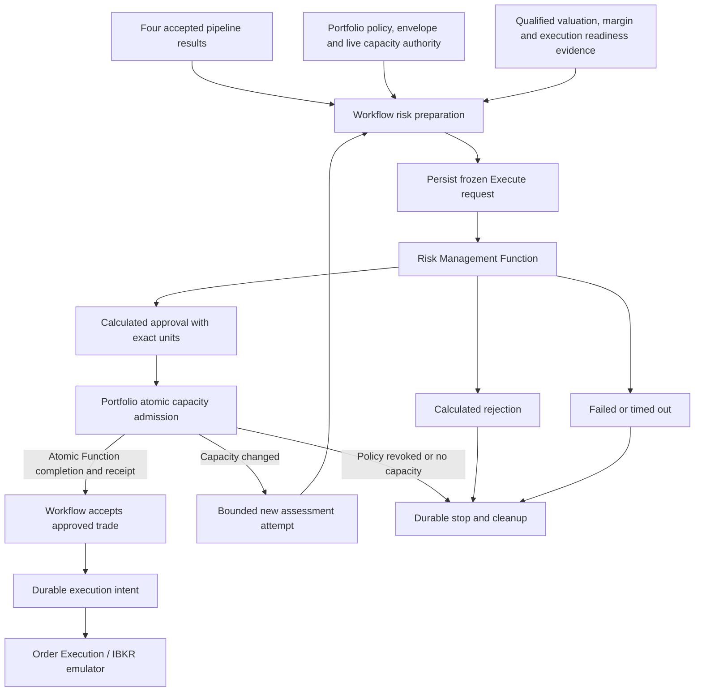

# Risk Management — Detailed Design v0.1

| Item | Value |
| --- | --- |
| Date | 2026-09-08 |
| Status | Implementation in progress; mapped Function, policy/preparation, typed workflow dispatch and acceptance implemented; financial ownership/execution handoff still pending |
| Code baseline reviewed | `fd066b9b` |
| Location | `Domain.Trade/Strategy/Workflow/IntrinsicTime/RiskManager` |
| Pipeline position | Fifth and final decision stage, after Order Composition |
| Function | Implemented `RiskManagementFunctionActor`, derived from `BaseEventSourceFunctionActor` |
| Capacity authority | Implemented Portfolio-domain `CapacityReservationFunctionActor`, with atomic PostgreSQL completion; end-to-end workflow qualification pending |
| Question answered | May this Portfolio/Fund place this exact composed trade now, and with how many complete strategy units? |
| Initial scope | ES futures and verified European-style ES futures options; one triggering Daily, Weekly or Monthly horizon |

## 1. Purpose and authority

Risk Manager takes the four accepted upstream results and current Portfolio financial authority, checks the exact candidate against available capacity, and determines a final integer strategy-unit quantity or a reasoned rejection. A calculated approval becomes permission to request execution only after Portfolio has durably reserved the required capacity and the workflow has accepted that reservation.

An approved decision permits a bounded execution request. It does not mean an order has been submitted, accepted by an exchange, filled, or opened as a position. Order Execution owns those outcomes. The initial integration target is the IBKR emulator; an actual IBKR connection is not assumed or implemented by this design.

This remains the target design. Numerical Models, the mapped Risk Function, typed financial boundary and the two Portfolio financial Functions now exist. Production policy/preparation, workflow acceptance and emulator reconciliation remain open; the implemented pieces do not establish an end-to-end trading path. The current execution evidence and remaining gates are recorded in Portfolio implementation-plan section 22.3.

Normative alignment:

- [System actor conventions, section 13.3](../../../../../../Documents/system/Actor-Implementation-Conventions.md#133-functionactor-convention).
- [Regime Discovery specification](../../RegimeDiscovery/Docs/Regime-Discovery-Specification-v1.0.md) and [implementation](../../RegimeDiscovery/Docs/Regime-Discovery-Implementation-v1.0.md).
- [Market Condition design](../../MarketCondition/Docs/MarketCondition-High-Level-Design-v0.4.md), [specification](../../MarketCondition/Docs/MarketCondition-Specification-v2.0.md) and [implementation plan](../../MarketCondition/Docs/MarketCondition-Implementation-Plan-v2.0.md).
- [Trade Selection specification](../../TradeSelection/Docs/TradeSelection-Specification-v1.0.md) and [implementation plan](../../TradeSelection/Docs/TradeSelection-Implementation-Plan-v1.0.md).
- [Order Composition specification](../../OrderComposer/Docs/OrderComposition-Specification-v1.0.md), [implementation plan](../../OrderComposer/Docs/OrderComposition-Implementation-Plan-v1.0.md) and [implementation record](../../OrderComposer/Docs/OrderComposition-Implementation-Record-v1.0.md).
- [Portfolio/Fund specification](../../../../../../TomasAI.IFM.Domain.Portfolio/Docs/Portfolio-Fund-Specification-v1.0.md).
- [Portfolio/Fund financial-domain design, sections 27–34](../../../../../../Documents/system/Portfolio-Fund-High-Level-Design-v0.1.md#27-new-portfolio-financial-subdomains) and [specification v1.2, sections 37–46](../../../../../../TomasAI.IFM.Domain.Portfolio/Docs/Portfolio-Fund-Specification-v1.0.md#37-financial-subdomain-scope-and-ownership) define General Ledger, Capacity Reservation, financial storage, transaction UI and legacy migration. The [implementation plan v1.2, sections 15–22](../../../../../../TomasAI.IFM.Domain.Portfolio/Docs/Portfolio-Fund-Implementation-Plan-v1.0.md#15-financial-phase-authority-scope-and-dependencies) defines the seven financial gates, guardrails and test requirements. Implementation remains pending; PF-FIN-05 must qualify the real Risk/Fund/workflow handoff with emulator accounting.
- [ConfigurationDb strategy catalog implementation](../../../../../../TomasAI.IFM.Application.Storage/Docs/ConfigurationDb-Strategy-Catalog-Implementation.md).

Current code takes precedence over stale implementation-status language in older documents. In particular, the first four Function actors and composer models exist; Portfolio outcome recording does not implement risk sizing or capacity reservation.

## 2. Decisions fixed by this design

1. One ITI signal produces one workflow for one Daily, Weekly or Monthly horizon. Risk Manager does not wait for additional horizon results, fabricate them, or rerun upstream analysis.
2. The selected ConfigurationDb deployment, strategy, structure, variant, product, side, bias and parameter versions are immutable input. Risk may reduce quantity to zero, but cannot substitute contracts or another strategy.
3. The candidate remains one immutable unapproved unit. Sizing is a separate result with per-leg quantity equal to strategy units times the candidate leg ratio.
4. Portfolio owns capital, limits, financial policy, allocations and committed utilization. Risk Manager owns deterministic evaluation and proposed final sizing. Portfolio's `CapacityReservationFunctionActor` owns atomic capacity admission through a command-shaped Function request/reply.
5. Read models and cached Fund envelopes alone cannot authorize capacity. Concurrent workflows must contend on durable Portfolio-wide authority shared by all Funds.
6. All four accepted upstream results are retained and validated. Their restrictions can tighten eligibility and risk budgets; their confidence cannot override financial hard limits.
7. Valid business refusal is `Rejected`, a successfully completed calculation. Missing/untrustworthy required inputs, unsupported contracts and calculation faults are `Failed`; expiry is `TimedOut`. None may submit a trade.
8. Use all five Function maps, typed context and execution policy, extension handlers, pure `Model` calculations and shared MessagePack boundaries. No domain logic or timer helpers in the actor.
9. Risk Management Function completion persists the calculated result. A separate Portfolio `CapacityReservationFunctionActor` commits capacity usage, reservation receipt and its completed event in one PostgreSQL transaction. Workflow acceptance and execution delivery remain durable workflow operations outside both Functions.
10. All supported initial variants are covered: long/short futures; four credit/debit call/put verticals; long/debit and short/credit iron condors with balanced, bullish or bearish bias.
11. V1 admits new exposure only. Reduce-only/closing/rebalancing requests require a separate qualified intent and position-linked authorization; an entry must never masquerade as a hedge to bypass an entry block.
12. Monetary values, Greek units, price sign, observation time, source/version and business IDs must have explicit contracts. Null, unknown, stale and zero are not interchangeable.

## 3. What exists and what must be added

| Area | Verified existing behavior | Required Risk Manager work |
| --- | --- | --- |
| Workflow risk route | `PrepareRiskManagementCommand` resolves server-owned inputs and commits `RiskExecution`; Realtime dispatches `ExecuteRiskManagementPipelineCommand` | Qualify the complete five-stage production workflow and financial handoff |
| Workflow completion | Recomputes and validates the exact typed result; rejection completes NoTrade, approval remains pending capacity authorization | Add durable reservation receipt acceptance, Fund authorization and execution ownership |
| Risk Function | Five-map Function/context/extensions, Models and completed-only PostgreSQL state implemented and runtime-tested | Observation history and complete workflow qualification |
| Portfolio snapshot | `PortfolioFundStrategySnapshot`: Portfolio, mandate, allocation, envelope, assignments, financial policy | Add coherent current utilization, working exposure, valuation and authority epochs |
| Financial limits | `PortfolioFinancialPolicyReadModel`, exact `CatalogDeployment` caps, `FundRiskEnvelopeReadModel` | Normalize remaining capacity by scope; add reservation accounting and missing unit definitions |
| Identity reservation | `FundCompositionReservationResult` provides committed Order/Trade IDs | Reuse IDs; do not treat this as reserved money, margin or loss capacity |
| Capacity reservation | Atomic reservation/consumption Functions and shared transactional completion implemented | Wire exact Risk/Fund/workflow acceptance and qualify complete lifecycle; the default sequential projection/append path is not used for financial mutations |
| Portfolio outcome | `RecordRiskOutcome` stores an Approved/Rejected reference | Add exact sized-decision and capacity receipt validation; do not use reference recording as a ledger |
| Composer | Typed candidate, prices, signed Greeks, payoff evidence, liquidity ceiling, execution limits | Independently validate/recompute unit risk and scale the same candidate |
| Catalog capabilities | Production registry contains selector and composer capabilities | Implement/register genuine risk validators; retain publication blocks until available |
| Execution | Portfolio composition aggregate explicitly refuses execution transitions | Add separately versioned execution handoff and emulator lifecycle integration; no generic success bypass |

Important compatibility defect to address during implementation: existing `RiskManagementResultReference.CandidateSha256` is compared to `FundOrder.CompositionResultHash`, which is the composition **result** hash. Introduce distinct `CompositionResultHash`, `UnitCandidateHash`, `RiskAssessmentHash` and `SizedOrderHash` in a versioned replacement/append-only contract. Preserve historical hashes and readers; never silently reinterpret the old field.

## 4. Architecture and ownership



| Owner | Responsibility |
| --- | --- |
| Workflow Command actor | Stage/revision authority; frozen preparation; accepted risk decision; recoverable commands/intents; one terminal continuation |
| Workflow Realtime extensions | Deliver committed intents, request Function, map typed replies, reconcile lost replies; never grant authority from notification receipt |
| Risk Function | Evaluate exactly frozen inputs, propose integer quantity, return Approved/Rejected calculation or typed failure |
| Risk `Model` | Lineage checks, effective rule resolution, risk normalization, scenario loss, exposure constraints, deterministic sizing |
| Portfolio `CapacityReservationFunctionActor` (new) | Await atomic current-capacity validation, usage update, reservation receipt and completed-event commit before returning Complete |
| Portfolio `GeneralLedger` (new) | Own financial transaction posting, balanced journals, account balances, corrections, period control and reconciliation; supply committed balance evidence to capacity admission |
| Portfolio/Fund Command actors | Existing policy/mandate/allocation lifecycle and order references; participate in admission fencing and durable outcome recording |
| Portfolio reservation lifecycle owner | Consume, adjust, expire and release existing reservations under the same capacity fence; a replayed reservation completion is historical evidence, not its current status |
| ConfigurationDb | Immutable reusable risk parameter/schema versions and supported capabilities; no current balances or reservations |
| Market data / pricing | Versioned snapshots and valuations with completeness/freshness; no financial permission |
| Order Execution | Consume approved authority exactly once, submit/reconcile emulator orders and report fills/rejections/cancellation |
| Position/accounting owner | Durable positions and P&L; reconcile fills and residual commitments into Portfolio utilization |
| Query actors / Scylla | Observable evidence and status, with exact Fund access checks; never spendable authority |

Avoid a circular dependency: neutral typed risk contracts live in the shared contract layer already reachable by Portfolio and Trade. Calculation adapters live in Domain.Trade; shared projects must not reference application providers. Portfolio ledger code must not depend on the Risk Function CLR actor type.

### 4.1 Agreed Portfolio subdomain locations

The agreed directories are `TomasAI.IFM.Domain.Portfolio/CapacityReservation` and `TomasAI.IFM.Domain.Portfolio/GeneralLedger`. They establish the ownership locations; their financial implementations remain planned.

- `CapacityReservation` contains `CapacityReservationFunctionActor`, reservation rules, receipts and consumption/release lifecycle. It owns holds and risk commitments, not cash journal entries.
- `GeneralLedger` owns the redesigned Fund transaction capability, chart of accounts, balanced journal headers/lines, authoritative account balances, source identities, reversals/corrections, accounting periods and reconciliation. Reuse qualified legacy transaction behavior and tests through an explicit migration; legacy Scylla balances are not the new financial authority.
- Both use coordinated PostgreSQL financial authority. Withdrawals, transfers and other postings affecting spendable funds must participate in the same admission-fence protocol as capacity reservations. Define this through shared transactional storage contracts, not direct cross-actor calls inside an open transaction or eventually consistent balance events.
- A hold is not a cash expense. Keep settled cash, unsettled obligations, valuation/P&L and active holds distinct, with explicit accounting rules to avoid double counting. Scylla supplies rebuildable reporting views.
- Future QuickBooks integration maps committed General Ledger accounting entries through an external adapter with durable delivery identities and reconciliation. It must not block capacity decisions. Preserve accounting-entity and currency dimensions; Portfolio/Fund identity does not automatically identify a QuickBooks company.

General Ledger migration and authoritative balance integration are prerequisites for production-quality capacity reservation. Creating these folders does not migrate the existing `Domain.Fund/Transaction` actors, tables or UI.

## 5. Upstream inputs and use

### 5.1 Common lineage

Every upstream result must be the workflow's accepted result, with exact result ID/hash, invocation identity, input revision, schema/algorithm version, trigger ID, Portfolio/Fund, underlying market and target horizon. Revisions form the recorded chain; they are not required to be numerically equal across stages. Compare each stage with its own accepted revision and predecessor references.

Do not fetch the latest result for a symbol to replace the accepted result. Do not accept a valid but unrelated result from another workflow. Materialized payloads are immutable and bounded; include their hashes and read-once provenance in the risk input fingerprint.

### 5.2 Regime Discovery

Consume the accepted final regime decision, direction/confidence, specialist evidence, limitations and restrictions for the triggering horizon. Hard restrictions, including no-new-trade instructions, are inherited and cannot be cleared by Risk Manager. Use explicitly configured soft restrictions to reduce the risk budget. No new cross-horizon consensus or indicator calculation is introduced.

### 5.3 Market Condition

Consume `MarketConditionAssessmentResult.Assessment`: availability, condition, liquidity, stress, volatility behavior, session, event risk, trigger alignment, data quality, confidence, limitations and inherited restrictions. Verify its Regime result reference against section 5.2.

A complete adverse market state can reject an entry normally. Unavailable required evidence fails evaluation. Calendar download completion is provenance, not proof that no significant event exists or that the calendar is fresh. Use the assessment's validated event evidence and validity; Risk Manager does not download FMP calendar or Treasury data during calculation.

### 5.4 Trade Selection

Consume the selected candidate/intent, exact deployment graph and all selected catalog keys, assignment/version, product, side/bias/premium mode, parameter bindings, accepted authority and upstream references. Validate permission remains current at admission. Selection ranking is explanatory evidence; Risk Manager does not rescore alternative strategies or switch credit/debit or long/short direction.

### 5.5 Order Composition

Require typed `OrderCompositionResult` with `Composed`, one `CompositionCandidate`, `UnitQuantity=1`, `ApprovalState=Unapproved`, positive `LiquidityCapacityUnits`, accepted Portfolio identity reservation and consistent selected contracts.

Use all legs, ratios, side, multipliers, definition hashes, linked underlying, expiry, quote provenance, pricing/Greek evidence, parameter-resolution hash, snapshot/binding hashes, pricer version, payoff evidence and execution envelope. Preserve its price limit, worst debit, valid-until, atomicity and prohibitions on legging/market escalation. `NoCandidate` must already have stopped the workflow; routing it to risk is a contract failure.

The candidate alone does not contain the complete valuation reference context. Preparation must also supply the immutable accepted composition snapshot/context or an integrity-checked bounded materialization from its saved request. Reuse the same Black-76 version and explicit Treasury/calendar/exercise/tick conventions for any independent recomputation.

## 6. Portfolio and account evidence

Proposed `PortfolioRiskAuthoritySnapshot` includes:

| Group | Required content |
| --- | --- |
| Identity | PortfolioId/FundId; actual actor aggregate versions; business OrderId/TradeIds; account and environment identity |
| Governance | Portfolio/Fund operating states, financial policy ID/version/hash, activation/revocation epoch, mandate/version/hash, exact assignment and permitted catalog keys |
| Delegation | Allocation/version, FundRiskEnvelope ID/version/hash, source policy linkage, effective and expiry times |
| Capital | Capital base, protected reserve, maximum deployable, Fund allocation, free cash, net liquidation/equity, source/time and valuation currency |
| Existing usage | Committed position usage, unfilled working-order commitments, active unconsumed reservations, pending replacements, unsettled obligations and fee/cash commitments |
| Limits | Portfolio, exact deployment and Fund per-trade/aggregate risk, margin, gross notional, contracts, open positions, drawdown and remaining loss budget |
| Exposures | Canonical per-market signed Greeks, gross exposure, scenario losses, concentration buckets and their sources/versions |
| P&L/drawdown | Realized/unrealized P&L, net-of-external-flows high-water mark, value-date loss usage, valuation cut and completeness |
| Consistency | Portfolio admission epoch, utilization revision, position/fill ingestion watermark, policy fence, snapshot ID/hash, as-of/received/expiry times, completeness |

Existing financial models do not supply every row above. Implement the missing snapshot provider and normalized utilization contracts; do not fabricate zeros from empty queries. A genuinely empty Portfolio is valid only with an authoritative complete-empty snapshot and a known ingestion watermark.

For v1, candidate, Fund, Portfolio and account valuation currencies must all be USD. Other currencies fail with `RM.CONFIG.CURRENCY_UNSUPPORTED`; future FX support requires immutable rates, timestamps, conversion conventions and conservative rounding. Do not silently convert or compare amounts across currencies.

Calculate remaining capacity separately at Portfolio, exact deployment, Fund and configured concentration scopes. Intersecting the configured maximum caps is insufficient: each scope has different existing usage. Existing `ResolveEffectiveCaps(CatalogKey, ...)` assists cap normalization but is not the admission algorithm.

Policy activation, Fund suspension, envelope changes and kill switches invalidate **new admission** even when the frozen analytical snapshot has not expired. This check belongs to current financial authority, not a read-model cache.

V1 requires an exclusive, verified Portfolio-to-execution-account mapping for the capacity pool. Multiple Funds in that Portfolio share its account capacity. If multiple Portfolios share one broker/emulator account, independent Portfolio ledgers cannot each spend the same buying power: require an account-level atomic allocation authority before enabling that configuration. Reject unsupported shared-account mappings during publication/admission.

## 7. Additional evidence and data boundaries

### 7.1 Margin and execution readiness

Proposed `RiskMarginEvidence` supplies exact candidate hash, account/environment, method/version, source, initial/maintenance requirements, cash settlement obligations, house add-ons, quantity range, currency, timestamps and validity. It must state whether requirements are linear or provide a bounded quantity schedule. V1 cannot assume combo margin equals maximum payoff loss, or that a futures stop bounds loss.

For emulator development, use a versioned `EmulatorMarginSchedule` with explicit product/strategy eligibility and deterministic requirements. Label its source/environment on every result and reservation; live admission must reject emulator evidence. No silent fallback from a missing real margin source to the emulator schedule. Actual broker integration is later and may require additional house margin; reserve/recheck before allowing execution under a different source or requirement.

Market reference data remains sourced through existing DataBento/pricing services. A pricing/definition feed is not an account buying-power or house-margin source. Readiness evidence must identify an execution owner that can enforce atomic combos, price bounds, quantity, session/cutoff and cancellation/reconciliation.

### 7.2 Observation consistency

Preparation acquires bounded immutable evidence before calculation. Required sources carry observation time and completeness, not just cache arrival time. Reject future timestamps beyond the configured tolerance; enforce age and inter-source skew separately. Missing margin, incomplete positions, unknown working orders, missing valuation or ingestion gaps fail closed.

Do not silently refresh the composed candidate inside Risk Manager. If candidate prices expire, stop that attempt; re-composition requires an explicit new workflow/revision and fresh accepted candidate. Capacity-only conflicts may retry risk with unchanged still-valid candidate under section 12.

## 8. Configuration and three engineering profiles

Use the existing ConfigurationDb immutable ParameterSchema/ParameterSet and deployment binding lifecycle. Proposed role: `RiskManagementRules`; proposed calculator capability: `RiskManagement/v1`. Resolve exact schema/set ID, version, content hash, algorithm version and risk model capabilities. Structure-specific model support is explicit; family display text is never dispatch logic.

Author three initial profiles, `RiskManagement.Daily/v1`, `.Weekly/v1` and `.Monthly/v1`. All twelve supported variants can bind to each horizon. They may start with identical numerical limits; a longer analytical horizon does not grant more capital, longer quote validity or permission to wait for other horizons.

| Parameter group | Required fields / semantics |
| --- | --- |
| Authority | Exact supported horizon/products/structures/variants, environment, currency, activation and policy sources |
| Sizing | MaximumStrategyUnits, minimum units=1, per-trade allocation fraction, risk model version, largest-feasible-integer rule |
| Entry gates | Explicit accepted session/data-quality/availability sets; disposition for each adverse assessment state and restriction |
| Budget reductions | Baseline fraction and named multipliers in [0,1], applied by minimum; never increase delegated hard limits |
| Futures | Planned-distance policy, stress scenarios, loss-charge rule and notional method; no assumption of bounded maximum loss |
| Options | Bounded payoff requirement, independent payoff/Greek tolerance, exit cost reserve and scenario definitions |
| Margin/cash | Method/source/environment, quantity schedule or proven linear form, incremental add-on and settlement cash method |
| Aggregate | Loss, margin, gross notional, per-market Greek, count, concentration, value-date loss and drawdown limits |
| Freshness | Candidate/quote/valuation/margin/capacity age limits, cross-source skew, activation and execution authorization lifetimes |
| Bounded work | Input bytes, maximum positions/working orders/reservations, scenarios, quantity evaluations, retries and lifecycle deadlines |
| Execution | Limit-only, allowed TIF, atomic combos, no legging/no market escalation, cutoff policy, emulator environment |

Proposed **engineering fixture defaults**, requiring explicit publication before use:

- MaximumStrategyUnits=10; TradeRiskFractionOfFundAllocation=0.01; MinimumStrategyUnits=1.
- Normal risk multiplier=1; any permitted degraded-liquidity, elevated-stress or elevated-event soft condition=0.5; combine by minimum. Hard restriction, dislocation, volatility shock, poor liquidity, closed session and a new-entry request under ReduceOnly reject. Unknown required state fails.
- Candidate/quote age ceiling=1000 ms, source skew=250 ms, capacity/position valuation age=1000 ms, margin evidence age=60000 ms; all remain subject to stricter upstream/source limits. Evidence collection cannot extend the candidate lifetime.
- Loading budget=1000 ms; new calculation budget=250 ms; admission/acceptance must fit original workflow and candidate expiry. These are test parameters, not measured production latency promises.
- MaximumStrategyUnits hard ceiling=100; at most 100 quantity evaluations, 128 stress scenarios, 10,000 normalized exposure records, 2 MiB uncompressed Execute content and 512 KiB result content. Effective transport limit may be smaller; reject oversize, never truncate or widen NATS limits silently.
- Capacity contention: at most three total risk assessment attempts, all within the original workflow/candidate deadline. Never silently retry a technical failure into a new economic decision.
- Underlying-relative stress shocks {-0.20,-0.10,-0.05,+0.05,+0.10,+0.20}, IV shifts {-0.10,0,+0.10}, and elapsed-time shifts {0,1 calendar day}, producing 36 scenarios. IV is floored at 0.0001 annual decimal; option time is floored at zero, using intrinsic value at expiry. The pinned curve is held constant in this initial scenario method, and that limitation is recorded. Futures use underlying shocks only. These scenarios are engineering tests, not a statistical loss bound.
- All financial limits, account balance, actual margin requirements and fee schedules must come from explicit Portfolio/source fixtures or published versions. There are no implicit dollar balances, margin constants or automatically activated production defaults.

Strict schema validation rejects unknown fields, duplicates, unavailable models, non-finite values, invalid currency/units, out-of-range fractions and inconsistent bounds. New strategy variants require a supported risk model plus tests and exact permission; adding catalog metadata alone cannot enable execution.

## 9. Deterministic calculation

### 9.1 Ordered evaluation

1. Validate request shape, exact types, IDs, hashes, schema and bounds before state loading.
2. Verify accepted upstream lineage, candidate integrity and original expiry.
3. Validate current-as-frozen Portfolio authority, exact catalog permission, state and policy compatibility.
4. Validate data completeness, pricing/margin/readiness qualification and units.
5. Apply inherited and risk-policy hard entry gates.
6. Resolve most restrictive financial limits and soft budget reductions with a stable trace.
7. Independently calculate unit payoff, stress, Greeks, gross notional, margin and cash usage.
8. Calculate the feasible integer quantities against every scope and execution limit.
9. Choose the largest feasible positive quantity; otherwise return Rejected with binding constraints.
10. Freeze result, sized-order hash, expiry, full lineage and projected post-trade utilization. Complete does not reserve capacity.

Validation failures and arithmetic/pricer faults produce Failed; valid limit breaches produce Rejected. Collect deterministic reason ordering (gate priority, scope, constraint ID); return all bounded binding constraints, with one primary reason. Do not rank by localized messages.

### 9.2 One-unit financial normalization

Preserve signed debit semantics: positive is payment and negative is credit. Use the authorized worst debit for risk, not the most favorable midpoint. For options, recompute payoff at all strikes and outer slopes using original ratios/multipliers, including unequal condor wings. Maximum loss must be finite for the supported option structures.

Composer's `MaximumLoss`, `PlannedLoss` and `StressLoss` already incorporate its `CostReserve`. Do not add that reserve twice. Track components: core payoff/movement loss, included entry/price slippage reserve, incremental close/operational reserve. If Risk policy requires a higher entry reserve, add only the positive excess above the included reserve. Every term states whether it is per contract, per unit or whole order.

For bounded options, define unit loss charge as `max(recomputed worst-price payoff loss, maximum scenario loss) + incremental reserves`. Scenario loss is measured from the authorized entry value to the stressed close value with the same included-cost convention. This conservative maximum, rather than their sum, avoids double counting alternative loss measures.

For futures, define unit loss charge as `max(validated planned loss, composer stress loss, risk scenario loss) + incremental reserves`. Planned loss requires explicit distance/reference provenance; it is not a guaranteed stop fill or a maximum possible loss. `MaximumLoss` remains null with `RiskBound=Unbounded`. Margin and gross notional are separate constraints.

Use monetary decimal arithmetic, checked integer multiplication and conservative rounding: consumption up, available money down to the currency minor unit. Black-76 numerical outputs retain the qualified algorithm/tolerance; round only at documented boundaries. Any non-finite result or overflow fails.

### 9.3 Greek and notional units

Current composer Greeks are signed sums of per-leg derivatives before contract-multiplier application. Delta is underlying-equivalent; Vega is per annual decimal volatility and Theta per year. Validate these tags and the actual source convention; normalize positions and candidate to the same units.

For a candidate with common multiplier `m` and reference future `F`: dollar delta per index point=`m * Delta`; dollar gamma per index point squared=`m * Gamma`; dollar vega per one volatility percentage point=`m * Vega * 0.01`; dollar theta per calendar day follows the pinned time convention (ACT/365F gives `m * Theta / 365`). Multiply by final units once. Retain unscaled and normalized evidence separately.

Use gross leg notional `sum(abs(ratio_i) * abs(F_i) * multiplier_i)` per strategy unit for v1, including options; no offset between long/short legs or across expiries for this gross cap. Use signed net Greeks only in explicitly named net limits. Do not treat a condor's near-zero delta as zero gross exposure.

Existing optional envelope Greek caps and `MaximumDrawdown` need explicit unit/schema normalization before use. Do not guess whether a historical value is currency, percentage or a raw derivative. Unknown units fail; absent optional caps are disabled only when the exact policy explicitly permits omission.

### 9.4 Position, reservation and working-order usage

All active exposures count: filled positions plus outstanding unfilled commitment plus unconsumed reservations. A reservation transferred to an order commitment is one exposure, not two. Deduplicate only by authoritative lifecycle IDs and quantities; never by matching symbol or price. A cancellation request is not confirmed cancellation.

V1 gives no diversification/correlation discount and no cash benefit for uncollected credit premium. Risk charges and gross usage are additive across trades. Evaluate signed Greek limits both at net position level and with conservative outstanding-order bounds so opposite pending orders cannot pretend both will fill.

For each market bucket, derive reachable exposure interval `[lo, hi]` from committed signed exposure plus every independently fillable pending quantity/reservation contribution. Candidate quantity q adds interval `[min(0,q*g), max(0,q*g)]`. Require `max(abs(lo), abs(hi)) <= cap` after addition. This does not assume simultaneous fills or allow an unfilled hedge to finance an entry.

Default underlying concentration key is normalized product root/exchange/currency across expiries and all triggering horizons. Exact-deployment usage is additionally tracked; family names are labels. Unknown bucket mapping fails.

Drawdown is a currency amount `max(0, flow-adjusted high-water equity - current marked equity)` using an authoritative, consistently marked series. External deposits/withdrawals adjust the high-water baseline and are not trading profit/loss. The value-date loss budget uses the explicit exchange/account business date and a versioned P&L method; midnight UTC is not an implicit reset. An envelope's `RemainingLossBudget` must declare its utilization watermark and included commitments. Use either the reconciled remaining amount or the limit minus matching usage; never subtract the same reservations twice.

### 9.5 Sizing constraints and selection

Let `A` be the Fund's allocated capital, `f` the profile risk fraction, `k` the minimum applicable reduction multiplier, and `L(q)` the conservative loss charge for q units. The new-trade risk budget is `min(Portfolio per-trade cap, deployment per-trade cap, Fund per-trade cap, A*f*k)`. Independent aggregate scopes each require `usedLoss(scope)+L(q) <= aggregateCap(scope)` and appropriate remaining loss budget.

For each integer q from 1 through `min(profile maximum units, candidate liquidity capacity, implementation quantity ceiling)` evaluate:

| Constraint | Required predicate |
| --- | --- |
| Trade loss | `L(q) <= effective per-trade budget` |
| Aggregate loss | Every Portfolio/deployment/Fund/bucket total remains within its limit |
| Margin | Existing used/reserved margin plus qualified requirement(q) and explicit add-ons fits every margin cap and account buying power |
| Cash | Unreserved spendable cash covers entry settlement, margin funding and incremental fee/variation reserves using the source's non-overlapping accounting components |
| Gross notional | Existing usage plus q times unit gross leg notional fits every applicable scope |
| Contracts | Existing gross contract commitment plus `q * sum(abs(leg ratios))` fits Fund and any stricter limits |
| Positions | This new order consumes one strategy-position slot, not q slots or one slot per leg; existing pending entries already consume slots |
| Greeks | Per-market net and conservative pending-fill intervals remain within explicitly normalized limits |
| Drawdown/loss budget | Pre-entry policy state permits new exposure; reserved loss plus actual value-date loss remains within budget |
| Concentration | Underlying/expiry/deployment limits remain satisfied without unqualified offsets |
| Execution | Exact whole-unit quantities, source quantity range, atomicity, session and lifetime constraints hold |

Select the largest feasible q deterministically. Bounded enumeration handles non-linear margin schedules and non-monotone net-exposure constraints; do not rely on a single ratio or binary search. Linear loss is `q*unitLoss` only when fee/margin/operational terms truly scale linearly; fixed order costs are charged once.

If no q fits, return Rejected with q=0 and observed headroom/binding constraints. All mandatory numeric zero caps prohibit the corresponding positive usage. A zero denominator cannot produce unlimited size. A disabled optional constraint must have an explicit enabled flag, never use zero as infinity.

## 10. Result contracts and decision meaning

Proposed `RiskManagementAssessmentResult` contains:

- Schema, ResultId, invocation/attempt ID, WorkflowId, input revision, trigger/horizon, Portfolio/Fund/Order/Trade IDs, evaluated/produced/expiry times.
- All four upstream result IDs/hashes; unit candidate and composition result hashes; prepared-input hash; exact catalog/parameter/algorithm/valuation/margin versions.
- `Decision = Approved | Rejected`, integer ProposedStrategyUnits, immutable sized legs and execution bounds. Approved requires units>=1; Rejected requires zero and no executable legs/authority.
- Per-unit and total risk charges, cash, margin, gross notional, normalized Greeks, stress evidence, existing/projected usage, headroom and binding constraints.
- Authority/usage epoch, source watermarks, policy/envelope IDs/versions, environment and qualification limitations.
- Ordered reason codes, explanatory summary and bounded parameter trace.
- `SizedOrderHash` and `AssessmentHash`, calculated from explicit canonical typed content; no reservation receipt embedded yet.

Here `Approved` means **calculated eligible at the frozen snapshot**, not authorized to submit. Query/UI status must display `AssessmentApprovedAwaitingReservation` until Portfolio/workflow acceptance. Never expose a single ambiguous Approved flag for the entire lifecycle.

Proposed `RiskAuthorizationReceipt` contains ReservationId, Portfolio authority epoch/aggregate revision, assessment/result/candidate/sized-order hashes, exact quantity and accounting vector, accepted policy/envelope/deployment/assignment versions, environment, granted/expiry times, status, and durable event identity. Consumers verify the authoritative receipt, not just a caller-supplied object or hash.

Proposed `AcceptedRiskDecision` joins the immutable assessment to the committed Portfolio receipt and workflow acceptance revision. `ExecutionEligible` additionally requires successful durable Fund outcome recording and execution readiness. Rejected decisions have no financial receipt.

## 11. Actor convention and wire design

Proposed layout:

```text
RiskManager/
  Docs/RiskManagement-High-Level-Design-v0.1.md
  Function/Actor/RiskManagementFunctionActor.cs
  Function/Actor/RiskManagementFunctionContext.cs
  Function/ExecuteRiskManagementPipeline.cs
  Function/CompleteRiskManagementPipeline.cs
  Function/FailRiskManagementPipeline.cs
  Function/ResolveRiskManagementExecutionPolicy.cs
  Function/State/...
  Function/Projector/...
  Model/RiskEvaluator.cs
  Model/RiskAuthorityValidator.cs
  Model/RiskParameterResolver.cs
  Model/RiskExposureNormalizer.cs
  Model/RiskScenarioEvaluator.cs
  Model/RiskSizer.cs
  Model/RiskAcceptance.cs
  Realtime/PrepareRiskManagement.cs
  Realtime/ExecuteRiskManagementFunction.cs
  Query/Actor/...
```

The Function's frozen `_parseMap`, `_validationMap`, `_receiveMap`, `_executionPolicyMap` and `_eventMap` dispatch exact CLR types. `ValidateAsync` invokes base `ValidateMappedCommand`; rules are `List<ValidationError>` extension methods. `_eventMap` maps separate completed/failed extensions for outcomes, failures, conflicts and commit/replay observations. No direct domain-handler invocation bypasses those maps.

Inject `IRiskManagementFunctionContext` directly; alias its registration to the same singleton as `IFunctionActorContext<RiskManagementFunctionActor>`, following Regime Discovery, Market Condition, Trade Selection and Order Composition. No `Typed()` coercion, custom deadline helpers, domain calculations in overrides, nested serialized result bytes or direct Function event publication.

Pure Models receive frozen values, versioned calculation dependencies and cancellation tokens. They do not query Portfolio, refresh markets, reserve cash, submit orders or read wall-clock time. Execution policy extension supplies TimeProvider and deadlines; base owns enforcement, late-worker observation and exception mapping. Loading has its separately bounded replay allowance; subsequent stages use the original request deadline. Exact-boundary expiry prevents new work.

Proposed request `ExecuteRiskManagementPipelineCommand` includes common Function metadata, risk attempt identity, frozen workflow context, all accepted upstream envelopes, accepted composition reference/context, Portfolio authority snapshot, risk binding, margin/readiness evidence, fixed evaluation/expiry times and input hash. Risk attempt identity includes workflow, accepted risk-preparation revision and attempt ordinal; retries of one attempt reuse everything byte-for-byte/semantically unchanged.

Use a typed risk result slot appended to `StrategyStageResultEnvelope`. At baseline keys 0..11 are occupied, so key 12 is the proposed next slot; confirm against the tree before specification/implementation. Likewise workflow view currently ends at key 32 and legacy state at 28; risk fields must append, never repurpose. Allocate new error IDs against the full registry. These proposed slots are not a released wire manifest.

Shared MessagePack handles transport/storage/uncompressed size measurement once at boundaries. Hash canonical typed semantic data with stable numeric normalization, ordering, version and exclusion of diagnostic `IgnoreMember` fields. Do not clone or normalize through MessagePack; do not embed serialized payloads in the completed message. Add an explicit nested wire manifest and old-reader fixtures in the detailed specification.

Calculated Approved **and Rejected** results use completed-only Function persistence: synchronous idempotent Scylla projection first, PostgreSQL completed event append second. Failed/TimedOut calculations are not saved as Function state. Workflow commands durably record their failure/stop. A matching completion replays unchanged, including after expiry; replay never extends authorization or reserves twice. Scylla-only orphan evidence cannot authorize a trade.

## 12. Preparation, admission and concurrency

### 12.1 Durable preparation

After accepted Composed, ensure Portfolio has durably recorded the exact composition reference on the reserved Fund order. Fetch bounded current authority/usage and required margin/readiness evidence. Validate lineage and validity, then commit `AcceptRiskManagementPreparationCommand` with the final Execute request and pending dispatch intent in the authoritative workflow event.

Recovery before acceptance may capture new evidence. Recovery after acceptance reuses the identical request. Nested workflow context omits self-references and repeated saved requests; retain full evidence separately with exact hashes. Never advance the stage on a query/service acknowledgement that lacks the required durable business acceptance.

### 12.2 Atomic Portfolio admission

Proposed `ReservePortfolioTradeRiskCommand` is a command-shaped Function request targeting Portfolio's `CapacityReservationFunctionActor`. The capacity ledger and admission fence are keyed by **PortfolioId**, not FundId, symbol or workflow. Each Function execution has a distinct deterministic reservation/request identity, allowing completed-only per-request replay while different requests share the Portfolio capacity ledger. Its request includes exact assessment/quantity/hashes, admission epoch, all applicable versions, accounting vector, reservation deadline and deterministic idempotency key.

Admission must atomically:

1. Recognize an identical existing reservation before charging anything again; conflicting reuse fails.
2. Verify assessment completion and current workflow/candidate eligibility through the accepted preparation evidence and current admission fence.
3. Verify current Portfolio/Fund states, active policy, assignment, envelope, kill switch, valuation watermark and source environment.
4. Compare expected utilization revision; independently validate the proposed accounting vector against versioned models/evidence and **all** current scope limits.
5. Commit reservation, usage increment, authoritative receipt and the Capacity Reservation Function's completed event in one PostgreSQL transaction. Return Complete only after that transaction commits.

Per-actor serialization is insufficient across server instances: use expected aggregate version and durable uniqueness on reservation/idempotency identities. Activation/suspension, admission and utilization ingestion must share a PostgreSQL Portfolio admission fence/epoch. Their authoritative updates and fence changes must participate in the same transactional serialization protocol; consuming policy-change events eventually is insufficient. Existing repositories require extension to support this boundary. This is required implementation work, not a capability of `RecordRiskOutcome` today.

Do not attempt one transaction across PostgreSQL, Scylla, NATS and an emulator. The capacity Function's synchronous write targets authoritative PostgreSQL tables, not an eventually consistent read model. Scylla observation projections may lag without changing the committed reservation. The caller awaits the Function reply asynchronously; no actor worker thread is blocked waiting for a separate projection event. Existing Fund/workflow acceptance requirements still apply after this reservation completes.

#### 12.2.1 Transactional Function completion

The current `BaseEventSourceFunctionActor` awaits `ProjectFunctionResultAsync` and then `SaveFunctionStateAsync` as separate lifecycle operations. That is appropriate for the existing calculation Functions, but a committed capacity update followed by a failed completed-event append would leave a financial reservation without its replayable completion. Merely pointing the projector at PostgreSQL does not remove that gap, even if both writes use the same database.

Add an explicit opt-in transactional completion contract to the shared base/persistence layer. For this Function, that path replaces the separate projection/append operations: a request-scoped transaction reads and fences current capacity, validates admission, performs the authoritative table updates, constructs the exact receipt/completed event, appends that event using the same PostgreSQL connection/transaction, and commits. Finalize in-memory completed state only after confirmed commit. Do not hold a transaction across independently timed projection/persistence callbacks or store one in the singleton context. Existing calculation Functions keep their current lifecycle behavior.

Actor-specific admission rules and receipt/event construction remain in mapped extensions and Models. The shared base owns transaction-stage lifecycle, timeout/cancellation observation and typed result dispatch; it must not acquire Portfolio-specific business logic. Transactional outcomes and replay observations still pass through `_eventMap`. Do not override actor lifecycle methods with custom SQL, deadline arithmetic or direct event handlers.

Proposed contracts are `CapacityReservationCompletedEvent` and `CapacityReservationFailedEvent`. Complete carries the committed receipt. Known insufficient capacity, revoked authority or a confirmed transaction rollback returns Fail with a specific admission reason and no new reservation. A lost connection during COMMIT or lost reply is an uncertain outcome, not proof of rollback: reconcile the original reservation/execution identity; if confirmation is unavailable, return a failure classified `OutcomeUnknown`, and the caller must not reserve under a new identity or submit. No failed Function event is persisted as completed state.

An identical committed retry returns the same receipt/completed event without charging capacity again. An identical request after a confirmed non-committed failure may be retried; changed capacity evidence requires the separately identified assessment attempt described below. Conflicting reuse of an identity fails. Historical completion replay after consumption, release or expiry does not restore authority: consumption checks current reservation state, expiry and policy fence.

#### 12.2.2 Portfolio Function conventions

Locate the actor and its `Function`, `Model`, `State` and transactional persistence collaborators under `TomasAI.IFM.Domain.Portfolio/CapacityReservation`. Inject `ICapacityReservationFunctionContext` directly, aliased to the same singleton as `IFunctionActorContext<CapacityReservationFunctionActor>`. Declare the same five frozen maps and ordered `List<ValidationError>` extensions as the pipeline Functions. Use typed execution policy, separate Execute/Complete/Fail extensions and standard shared MessagePack serialization. The Function returns its terminal event directly and does not publish it through an eventual projector.

This is an auxiliary Portfolio Function called by the fifth pipeline stage; it is not a sixth strategy-analysis stage. Portfolio Administration remains the UI for configuring financial authority, not the execution path for reservations. This design does not require a user to click a reservation button.

### 12.3 Races and reassessment

If the utilization revision changed, return `CapacityChanged` without reserving or mutating the calculated result. The workflow may create a new assessment attempt with new capacity evidence and a new identity, retaining the same still-valid composer candidate. Up to three attempts are permitted. Fund/Portfolio hard revocation stops immediately; an expired candidate requires new composition, not a risk retry.

Only one live reservation is allowed per business order and accepted candidate; a new attempt cannot stack capacity. A lost reply is reconciled using the original reservation key before starting another attempt. Portfolio must not silently shrink the requested quantity: a different quantity needs a separately calculated and accepted sized result.

After the retry ceiling, record a normal capacity-contention stop when current evidence is valid; transport/authority unavailability remains Failed. No indefinite wait or busy retry inside the Function.

## 13. Workflow acceptance and execution authority

Replace the current generic `CompleteRiskManagement` success path. The acceptance extension verifies exact accepted request, typed assessment, recomputed sized economics, Portfolio receipt, Fund order reference and current workflow revision/time. Candidate topology and ratios are unchanged; final units and every financial hash must agree.

The durable sequence is:

1. Save calculated risk outcome at the workflow attempt boundary.
2. For rejection, durably record Fund risk rejection and stop with NoTrade; release composition discovery ownership and any unconsumed financial hold.
3. For calculated approval, request/reconcile atomic Portfolio admission.
4. Record the versioned risk outcome and reservation reference on the Fund order, using existing business IDs.
5. Accept one final Approved decision and persist one recoverable execution intent referencing the receipt, sized order, authority versions and idempotency key.
6. Order Execution verifies/reconciles current authority and awaits `CapacityConsumptionFunctionActor` (`ConsumeCapacityReservationCommand`) to commit conversion to an order obligation before any external submission attempt. Unknown result requires original-identity reconciliation; replay cannot authorize duplicate submission.

Steps spanning actors are a durable saga with explicit pending states and reconciliation. Missing acknowledgements do not prove failure or rollback. Approved calculation plus lost reservation reply is `AdmissionUnknown`; it cannot submit until resolved. Workflow completion means the risk decision/handoff is durable; it never means Filled.

The execution payload preserves exact instrument IDs, sides/ratios, final units/leg quantities, signed limit and worst debit, tick rule, TIF, expiration/cutoff, atomic combo requirement, environment, receipt and source hashes. V1 forbids independent leg submission, market escalation and worsening price/quantity. Changing instrument, side, quantity upward, limit beyond bounds, TIF or source environment requires a new risk decision/reservation. Decreasing remaining quantity requires authoritative reservation adjustment and an execution revision, not editing the immutable assessment.

Authorization expiry is the minimum of workflow, candidate, selected authority/binding, envelope, margin/valuation/readiness evidence, session/cutoff and configured risk lifetime. No retry extends it. A receipt replay after expiry is historical evidence only.

## 14. Reservation and execution lifecycle

Portfolio has two financial Functions: `CapacityReservationFunctionActor` and `CapacityConsumptionFunctionActor`. Subsequent working/fill/submission-unknown/cancel/release/expiry updates use `CapacityReservationCommandActor`; single/batch financial posting uses `GeneralLedgerCommandActor`. Lifecycle Commands reject Consume. Commands still commit business effects, receipts and domain outcomes atomically, with correlated durable post-commit delivery; queue acceptance or delayed Scylla projection cannot establish financial authority. Both actor types use the same Portfolio fence and current reservation version.

| State | Capacity treatment and transition |
| --- | --- |
| Reserved | Full approved accounting vector held; not yet submit-capable without accepted workflow/Fund handoff |
| Consumed / submission pending | Converted to working-order commitment before external send; capacity remains held |
| Working / partial fill | Filled quantity becomes position usage; residual quantity remains committed; no double count or premature release |
| SubmissionUnknown | Retain conservative full outstanding exposure; reconcile by stable execution/client-order identity |
| Rejected by execution venue/emulator | Release only after authoritative terminal evidence and fill reconciliation |
| Cancel pending | Keep capacity until terminal cancellation plus any racing fills are reconciled |
| Filled | Transfer remaining commitment to position usage; entry authorization does not release open-position risk |
| Expired unconsumed | Portfolio confirms no consumption, records expiry and releases exactly once |
| Expired consumed | No blind time-based release; reconcile order status and residual fills |
| Closed | Reduce position usage only on durable position/accounting evidence |

Receipt expiry limits permission to **start** execution; it does not erase an already submitted commitment. A restarted sweeper must reconcile state, not release by wall clock alone. Late/duplicate/out-of-order fills are applied idempotently by execution/fill identity and sequence; gaps block new admission or retain conservative upper bounds.

Policy reduction below existing exposure blocks new entries and may initiate a separately authorized risk-reduction workflow. It does not manufacture fills or silently close existing trades. Kill switches revoke unconsumed authority through the shared fence; already submitted orders require execution cancellation/reconciliation.

## 15. Failure and reason taxonomy

| Category | Examples | Workflow behavior |
| --- | --- | --- |
| Rejected | `RM.REJECT.NO_CAPACITY`, `.PER_TRADE_RISK`, `.MARGIN`, `.CASH`, `.GROSS_NOTIONAL`, `.GREEKS`, `.CONCENTRATION`, `.POSITION_COUNT`, `.DRAWDOWN`, `.LOSS_BUDGET`, `.MARKET_RESTRICTION`, `.REDUCE_ONLY` | Completed calculation, normal NoTrade, no execution |
| Invalid input | `RM.CONTRACT.LINEAGE`, `.HASH`, `.CANDIDATE`, `.QUANTITY`, `.UNIT_MISMATCH` | Failed, no reservation |
| Unavailable data | `RM.DATA.CAPACITY_INCOMPLETE`, `.VALUATION_STALE`, `.MARGIN_UNAVAILABLE`, `.EXECUTION_UNKNOWN` | Failed, explicit source evidence |
| Configuration | `RM.CONFIG.MODEL_UNSUPPORTED`, `.CURRENCY_UNSUPPORTED`, `.POLICY_MISMATCH`, `.PARAMETER_INVALID` | Failed; no fallback |
| Deadline | `RM.TIME.EXPIRED` | TimedOut; reconcile any in-flight admission before cleanup |
| Concurrency | `RM.ADMISSION.CAPACITY_CHANGED`, `.AUTHORITY_REVOKED`, `.IDEMPOTENCY_CONFLICT` | Bounded new attempt, stop, or failure according to section 12 |
| Persistence/transport | Projection/append unavailable, lost request/reply, unknown submission | Preserve uncertainty and reconcile authoritative identities |

Hard policy revocation established by authoritative state is a business refusal. Missing authority is a technical/data failure. A rejected or failed result must never fall through the current generic Proceed path. Fix inherited Risk timeout/error labels that currently refer to Regime Discovery during the typed cutover.

## 16. Persistence, queries and observability

PostgreSQL stores completed Function events, authoritative workflow attempts/decisions/intents, Portfolio reservations/accounting transitions and transactional admission fences. ConfigurationDb stores immutable risk rules; mutable usage must not be placed in configuration tables.

Proposed additive Scylla TradeDb tables:

| Table | Partition / clustering | Use |
| --- | --- | --- |
| `risk_management_invocation` | WorkflowId / InvocationId | Immutable assessment ID/input/result hashes and typed event payload |
| `risk_management_history` | PortfolioId, FundId, value date / evaluated UTC desc, InvocationId | Bounded decision history |

Use existing physical Portfolio/Fund integer IDs; checked conversion for any wider Order/Trade DTOs. Upserts are identical-content idempotent and conflicting-content failures. No `ALLOW FILTERING`, truncation or automatic deletion. Retention and archival must retain the authoritative evidence needed by open orders/positions and configured audit policy.

Queries expose Invocation, Result and paged Fund history with scope-bound/versioned cursors, server max page size 100 and exact Fund authorization. Query joins authoritative PostgreSQL workflow/reservation state to distinguish CalculatedApproved, Rejected, AwaitingAdmission, Authorized, Expired, Revoked, SubmissionUnknown and SuspectedOrphan. Scylla presence is never an approval receipt.

Record bounded metrics for preparation/calculation/admission/acceptance latency, decisions/reasons, contention/retries, projected orphans, pending reconciliation, held capacity and source age. Do not put order/workflow/contract IDs in metric labels; include them in structured diagnostic logs and authorized queries. Preserve deterministic result content independently from wall-clock telemetry.

No observation UI work is required to implement this actor. Expose sufficient typed status/evidence for the later strategy workflow observation view, including the latest ITI signal and each risk attempt.

## 17. Domain-specific limitations

Initial options require explicit European exercise-style qualification and linked underlying/expiry compatibility. European exercise does not imply cash settlement or absence of expiry exposure. Futures options can create futures positions on exercise/assignment. V1 therefore requires a qualified close-before-expiry policy and an execution owner capable of enforcing its cutoff; unsupported hold-through-expiry requests fail. Future support must reserve resulting futures exposure and lifecycle obligations explicitly. [CME exercise and assignment explanation](https://www.cmegroup.com/education/courses/introduction-to-options/learn-about-exercise-and-assignment).

Futures margin is a performance bond and can change; it is not a trade's maximum possible loss. Maintain separate margin, cash and loss-charge constraints with pinned source/version, and refresh readiness before execution when requirements change. [CME performance-bond FAQ](https://www.cmegroup.com/solutions/risk-management/performance-bonds-margins/faq-performance-bonds-margins.html).

Black-76 pricing and scenario loss are calculation evidence, not a calibrated probability of profit, VaR, expected shortfall or broker margin engine. V1 makes no diversification credit or probabilistic loss guarantee. Jade Lizards, calendars, ratio structures, American options, other roots/currencies and risk-reduction strategies require explicit additional models and capability qualification.

## 18. Representative decisions

### 18.1 Credit vertical fits three units

Controlled USD fixture: candidate has unit loss charge 250 including all applicable costs, liquidity ceiling 8 and profile ceiling 10. Remaining trade budget is 1000, aggregate loss budget 900, margin headroom 1800 with margin requirement 500/unit, and gross-notional headroom allows five units. Other constraints permit three units. Loss gives at most three and margin gives at most three, so calculation approves three. Portfolio reserves that exact vector; only its committed receipt plus workflow acceptance permits execution intent.

### 18.2 Long future cannot fit one unit

Candidate remains `RiskBound=Unbounded`; planned loss 400, stress charge 1200 and effective trade budget 1000. q=1 fails even if available margin is large. Return Rejected/PerTradeRisk, not one contract based solely on the planned stop or margin deposit.

### 18.3 Concurrent Funds contend

Two Funds assess against a Portfolio with 1000 remaining aggregate risk. Each proposes 700. First reservation commits; second sees an epoch/revision conflict and cannot spend the original 1000. It reassesses against the new remaining 300 or stops. At no point may aggregate committed/reserved risk become 1400.

### 18.4 Approved calculation expires before admission

Function completion is stored, but candidate validity expires before capacity admission. Historical replay returns the same calculated assessment. Admission/acceptance refuses execution; no timestamp refresh or automatic new candidate is permitted.

### 18.5 Debit/bias variant preserved

A long bullish iron condor is sized only as the exact four-leg debit candidate. Its long/short signs, unequal-wing payoff and signed Greeks are preserved. A risk cap breach rejects or reduces units; it does not convert it to a short credit condor or a balanced structure.

## 19. Required verification matrix

| ID | Tests / evidence |
| --- | --- |
| RM-01 | All 12 variants on each of 3 horizons; exact one-horizon lineage; no cross-workflow/result substitution |
| RM-02 | All five frozen maps, base validation, list extensions, typed context singleton, execution policy and terminal-map architecture |
| RM-03 | Explicit wire manifests, append-only keys, old readers, shared serialization, canonical numeric/culture/hash stability and immutable nested content |
| RM-04 | Exact catalog publish/reject/retire; unsupported risk capabilities; Fund assignment/variant revocation; no legacy-family fallback |
| RM-05 | Independent option payoff fixtures including unequal wings, debit/credit signs, multiplier once, fee/slippage once and incremental reserves |
| RM-06 | Futures unbounded risk, stress versus stop, normalized Greeks/units, gross leg notional and controlled scenarios |
| RM-07 | Integer boundary sizing, zero capacity, fixed costs, non-linear margin, non-monotone exposure, checked overflow and complete bounded enumeration |
| RM-08 | Complete-empty Portfolio versus incomplete data; working/reserved/filled usage without double counting; pending opposite orders cannot fund each other |
| RM-09 | Scope-specific limits across Portfolio/Fund/deployment/underlying, different usage by scope, drawdown/value-date loss and external capital flows |
| RM-10 | Two Funds and two server instances competing for one capacity pool; stale versions; policy activation/suspension racing admission |
| RM-11 | Same-key replay and conflicting content; lost admission replies; duplicate attempts; one live reservation and one accepted decision |
| RM-12 | Crash before/after preparation and calculation Function projection/append; capacity transaction rollback after table update but before event append; atomic reservation/event visibility; unknown COMMIT recovery; Fund recording, workflow acceptance and outbox dispatch |
| RM-13 | Exact deadline boundaries, stale candidate, replay after expiry, cancellation/late writes and no revival of stopped workflows |
| RM-14 | Approval/rejection/failure separation; old opaque completion cannot proceed; typed risk result cannot bypass Portfolio receipt |
| RM-15 | Real NATS/PostgreSQL/Scylla Function completion/replay, orphan repair, authorized query scope and bounded paging |
| RM-16 | Emulator consume/submit/lost-reply recovery; stable client order identity; partial fills, rejection, cancel/fill race and retained uncertain exposure |
| RM-17 | Unconsumed expiry release versus consumed timeout; restart reconciliation; position transfer and eventual close without premature capacity reuse |
| RM-18 | Emulator-source evidence denied in live environment; unavailable margin; unsupported atomicity/expiry handling; no unsized execution |
| RM-19 | Five pipeline stages together with one real ITI horizon; accepted lineage, whole-unit sizing, Portfolio receipt, normal NoTrade and recoverable execution intent |
| RM-20 | Measured latency/allocation under bounded maximum scope, contention and cancellation; no locks around provider I/O or blocking async waits |

BDD scenarios must state business outcomes: sufficient capacity permits exact units; adverse conditions reject; unknown data fails; two Funds cannot overspend; replay cannot submit twice. Unit tests cover independent math, not merely copies of implementation formulas. Integration tests use real storage/transport and explicit emulator fixtures. Verification tests cover architecture, wire compatibility and end-to-end lineage. Record exact counts, failed/skipped cases and controlled versus live sources; never mark emulator evidence as broker/live acceptance.

## 20. Implementation boundaries and next documents

The detailed specification must freeze nested DTO keys, error IDs, command/event/query subjects, normalized money/Greek/count semantics, catalog schemas, default profile payloads, capacity transaction/fence protocol, durable saga states and the calculation/test vectors above. The implementation plan should separate these gates:

1. **RM-G01 Contracts and catalog:** typed request/results/receipts, compatibility, genuine risk capability registration and three profiles.
2. **RM-G02 Portfolio authority and utilization:** General Ledger transaction/balance integration and legacy reconciliation, coherent snapshot, account/margin/emulator sources, shared admission fence and accounting provenance. The General Ledger migration has its own detailed design and delivery plan; it cannot be claimed complete by this Risk Manager gate alone.
3. **RM-G03 Pure Models:** all variant/horizon risk normalization, scenario evaluation, limit intersection and deterministic sizing.
4. **RM-G04 Functions:** mapped Risk Management and Portfolio Capacity Reservation Functions; opt-in shared transactional completion with unchanged existing Function behavior; bounded policies, completed evidence and real transport/storage tests.
5. **RM-G05 Admission/workflow:** atomic capacity/receipt/completed-event transaction, durable preparation/acceptance, rejection/expiry cleanup and lost-reply/unknown-commit recovery.
6. **RM-G06 Execution boundary:** enforce receipt consumption, sized immutable intent, emulator idempotency and fill/cancel accounting. Actual IBKR connectivity is excluded.
7. **RM-G07 Queries and verification:** additive projections, observable authority states, full five-stage tests and release evidence.

RM-G02 and RM-G05 are mandatory for trustworthy approval. A pure sizing calculator plus `RecordFundOrderRiskOutcomeCommand` cannot satisfy this design. RM-G06 is mandatory before claiming that an approved risk result can safely place an emulator trade; it can be delivered by the separate execution owner but remains an explicit joint acceptance dependency.

Design decisions requiring later operational qualification, rather than missing code choices, are real account/provider margin, approved financial limits and profile publication, full-session/expiry behavior, measured latency budgets and actual IBKR activation. This document selects conservative engineering behavior for implementation and tests without asserting those operational qualifications already exist.

## 21. Definition of completion

Risk Manager is code complete only when it consumes the four exact accepted results, calculates a reproducible decision/quantity, follows all Function conventions, integrates atomic Portfolio admission and durable workflow acceptance, exposes verifiable evidence, and passes the applicable unit/BDD/integration/verification gates. The five-stage decision workflow is complete when approved decisions produce one recoverable, sized, authorized execution intent and rejected/failed decisions cannot produce one.

Trade placement readiness additionally requires a qualified execution consumer that enforces that intent and reconciles submissions/fills with Portfolio usage. Actual live trading remains dependent on the separately implemented broker connection and operational qualification. No UI status, Function reply, Scylla row, allocated business ID or historical Approved flag substitutes for this authority chain.
