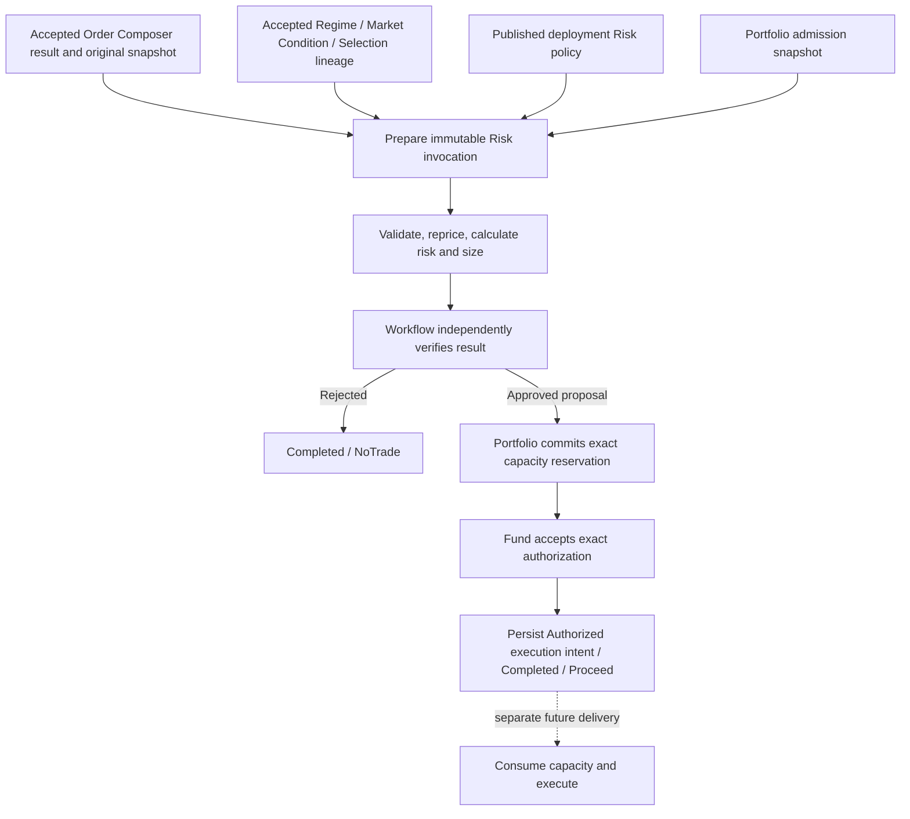

# Risk Manager specification v1.0

Date: 2026-09-09. Implementation baseline: `5d93bf7c` (including `7a456468`). Status: detailed specification of the current development implementation, with separately identified delivery gaps and execution dependencies.

Owner scope update, 2026-09-09: dedicated Risk history queries, observation UI and detailed rejection explanations are required in this delivery, together with Fund outcome consistency and recovery verification. The endpoint remains Authorized intent. These additions are planned, not yet implemented; see [Risk Manager implementation plan v1.0](RiskManagement-Implementation-Plan-v1.0.md). Automatic re-sizing was subsequently approved and implemented; see the [implementation record](RiskManagement-Automatic-Resizing-Implementation.md). The relevant behavior below is updated accordingly. Current-behavior descriptions below continue to describe the stated baseline.

## 1. Purpose and authority

Risk Manager answers: **Given this exact composed order and this Portfolio's current financial authority, what whole number of strategy units is eligible, and can that exact proposal obtain capacity and Fund authorization?**

Its two business inputs are the accepted Order Composer result and Portfolio financial admission data. The Composer result is accompanied by its original market snapshot and accepted Regime Discovery, Market Condition and Trade Selection lineage. A published, deployment-bound Risk policy supplies calculation settings. These dependencies are mandatory; an order DTO plus a displayed cash balance is insufficient.

This document specifies software behavior, internal calculation conventions and development qualification. It does not establish broker margin, approved capital amounts or production trading readiness. “Must” describes a requirement of this baseline unless explicitly marked future or open. Existing source contracts remain authoritative for serialization. A discrepancy between this document and code must be resolved explicitly rather than silently changing financial behavior.

This specification supersedes the current-behavior interpretation of [RiskManagement-High-Level-Design-v0.1.md](RiskManagement-High-Level-Design-v0.1.md). That design remains historical rationale; its proposed retry loop, dedicated history tables, richer queries and execution flow are not all implemented. Portfolio financial gate completion does not establish completion of every proposal in that earlier document.

## 2. Ownership and delivery boundary

| Owner | Responsibility |
|---|---|
| Trade Selection | Select deployment, strategy, structure, variant, side, bias and premium mode for one horizon |
| Order Composer | Produce one unapproved unit candidate with exact contracts, ratios, frozen prices, valuation evidence, liquidity ceiling and execution constraints |
| Risk preparation | Resolve the exact published policy and Portfolio snapshot; persist an immutable invocation |
| Risk calculation Function | Validate lineage and economics; calculate unit risk and largest feasible integer quantity |
| Workflow acceptance | Independently recompute the result and durably coordinate reservation and authorization |
| Portfolio capacity | Own current usage, admission serialization, reservation receipts and subsequent capacity lifecycle |
| Fund authorization | Accept the exact reservation against the existing Fund order and its version |
| General Ledger | Own financial postings, balances and accounting evidence used by Portfolio |
| Future execution owner | Consume authorized capacity, enforce the execution envelope, submit and reconcile orders |

Risk does not select a substitute strategy, change the candidate's topology, create capital, post a trade fill, or infer that a transport timeout released a hold. An `Approved` Risk result is an eligible sizing proposal. `Authorized` is a later durable workflow checkpoint with reservation and Fund acceptance. Neither means Submitted or Filled.



## 3. Supported universe

V1 supports ES, USD, the `Emulator` environment, and exactly one triggering horizon: Daily, Weekly or Monthly. Horizons use separate policy identities; Risk must not combine several horizons into one decision.

| Structure capability v1 | Legs | Qualified variant names |
|---|---:|---|
| Future | 1 | LongFuture, ShortFuture |
| CallVertical | 2 | BullCallDebit, BearCallCredit |
| PutVertical | 2 | BullPutCredit, BearPutDebit |
| IronCondor | 4 | ShortBalancedIronCondor, ShortBullishIronCondor, ShortBearishIronCondor, LongBalancedIronCondor, LongBullishIronCondor, LongBearishIronCondor |

Catalog publication requires the corresponding `risk` capability version 1, matching `builder` capability, exact leg count, one expiry group and unit ratios. Runtime validation still checks actual contracts and economics. Publication alone is insufficient authority.

Options require European exercise, Actual365Fixed, a supported Cash or DeliveryOfFuture settlement definition, and consistent underlying, multiplier, expiry and pricing conventions. Other roots/currencies, American options, calendars, naked options and additional ratio structures require a separate qualified extension. Futures retain unbounded maximum-loss semantics even when a finite admission charge is calculated.

## 4. Input A: accepted Order Composer result

### 4.1 Required evidence

| Input | Required content and use |
|---|---|
| `CompositionResult` envelope | Typed `Composed` result, candidate, result ID and valid payload hash |
| Candidate identity | Portfolio/Fund, deployment/strategy/structure/variant keys, assignment version, horizon, order ID, primary trade ID |
| Selection semantics | Exact side, bias and premium mode from the accepted selection |
| Unit definition | `UnitQuantity=1`, `ApprovalState="Unapproved"`; 1, 2 or 4 legs |
| Legs | Instrument and underlying IDs, Buy/Sell, positive ratio, multiplier, definition hash, original quote, option strike/right/expiry and valuation |
| Pricing | Worst signed debit and cost reserve; resolved Composer fee per contract |
| Risk evidence | Positive planned loss and Composer stress loss for futures |
| Liquidity | Maximum available strategy units for the candidate |
| Execution envelope | Limit, Day, no legging, no market escalation; atomic options; worst debit matching pricing |
| Original `MarketSnapshot` | Exact digest, generation and contracts used by Composer; retained on the prepared Composition execution |
| Upstream envelopes | Regime, Market Condition and selected Trade Selection result with exact linked IDs/hashes |

Risk preserves instruments, sides, ratios, catalog selection and business order/trade identities. It changes only whole strategy units and resulting leg contract quantities. It does not refresh market prices within a replayed invocation.

### 4.2 Identity and lineage invariants

All four upstream results must belong to the same workflow and workflow entity, with the same horizon as the Risk policy. Assessment must reference the exact Regime result and hash. Selection must contain the exact accepted Assessment envelope. Composition must reference the exact Selection result and hash and precede the Risk input revision.

Candidate deployment, strategy, structure, variant, assignment version, side, bias and premium mode must match selection. Candidate Portfolio/Fund/deployment must match sizing authority; deployment and assignment version must match financial authority. Rehashing substituted data cannot satisfy these lineage requirements.

### 4.3 Market and valuation validation

Candidate hash, snapshot digest and candidate-to-snapshot hash must match canonical content. Snapshot contract IDs must be unique. Each leg must resolve to its exact frozen instrument; its quote must equal the original instrument quote and use the snapshot generation.

In Production and unrecognized execution environments, candidate age at evaluation is at most 1,000 ms. Development, Test, Emulator and Paper execution environments observe candidate/quote age without an age-limit rejection until production qualification. The policy uses the immutable invocation environment, so replay does not depend on host settings. Candidate and snapshot must remain valid. Quotes require nonnegative bid, ask at least bid, positive bid/ask sizes, event time no later than received time, received time no later than evaluation, and, in Production or unrecognized execution environments, event age at most 1,000 ms. Non-production age observations appear in structured logs, histogram metrics and decision explanations. Explicit snapshot, order, financial-authority and authorization expirations remain enforced. Option and underlying quote event times may differ by at most 250 ms.

Future definitions must match ES/USD, contract, multiplier and definition digest; last trading must be in the future. Futures carry no option valuation. Options require matching definition, strike/right, underlying, expiry, effective interval and fresh pricing generation. Risk recomputes `Black76ComposerPricer` valuation from the frozen instrument at the candidate evaluation time and requires exact equality with the candidate valuation. A self-consistent candidate hash is not sufficient pricing evidence.

Declared Composer Greek units must be `UnderlyingEquivalent`, `PerAnnualDecimalVolatility` and `PerYear`. Rates must be finite and within [-1,1]; implied volatility must be in (0,10]. All calculation legs share one underlying and multiplier, the same forward, and for options the same remaining time and annual rate.

## 5. Input B: Portfolio financial admission snapshot

### 5.1 Read contract

Preparation requests `GetFinancialAdmissionSnapshot` for the exact Portfolio, Fund, deployment and normalized underlying key `FinancialScopeKeys.Underlying(symbol, exchange, currency)`, using scoped `LedgerRead` access. The authoritative provider is `FinancialQueryStore`; UI projections are not inputs to admission.

| Field/group | Meaning |
|---|---|
| `FinancialRead.Status` | Must be Found; unavailable or missing is not zero usage |
| `FinancialRevision` | Positive coherent revision; later reservation uses an expected revision |
| `ObservedAtUtc` | Not in the future and at most one second old at preparation |
| Book / Portfolio / Fund IDs | Exact destination book and ownership |
| `OperatingState`, `MigrationQualified`, `CanPrepareAdmission` | Must be Active, true, true |
| `Authority` | Exact versioned financial and deployment authority |
| `AvailableCash` | Ledger-derived available cash, including Portfolio's commitment treatment |
| `Limits`, `Usage` | Relevant Portfolio, Fund, deployment and underlying measures |
| `Environment`, account reference | Explicit execution environment and account used to bind funding evidence |
| `MaximumRiskPerTrade` | Positive deployment admission ceiling |

The store requires spendable Fund/deployment readiness and validates financial sources when ready. Its scoped query currently caps returned usage rows at 256; the wider Risk DTO independently permits at most 10,000 usage entries. These are different limits, not a promise that the query returns the DTO maximum.

### 5.2 Financial authority

The frozen `FinancialAuthorityReference` carries positive authority epoch, Portfolio version, Fund mandate version, policy ID/version, envelope ID/version and assignment version; exact deployment; financial snapshot hash; nonempty source and valuation watermarks; and validity. These values bind the calculation to qualified financial authority. They do not reserve money by themselves.

The Fund USD LossCharge limit must exist and be enabled. Preparation sets:

```text
RiskCapital = max(0, AvailableCash)
PerTradeLossBudget = min(Fund LossCharge limit maximum, MaximumRiskPerTrade)
```

The V1 capital basis is available settled cash. It does not derive risk capital from NAV, historical legacy balances or projected profit. Aggregate usage is checked separately from the per-trade budget.

### 5.3 Legacy and development capital

The owner's selected policy is retained read-only legacy history with separately entered development capital. Original legacy records retain source precision and identifiers; unrecorded currency is not silently assigned USD. The retention seal recognizes zero capital. Historical mapped Funds remain permanent Draft.

Trading uses separately configured development Funds/books, explicit development opening capital, reconciliation, fresh financial qualification and authority activation. Retaining historical records alone cannot make an admission snapshot spendable. Application-data retention/capital setup has not been established by the generated-scope integration tests.

## 6. Published policy and configuration

Preparation resolves the RiskManagement pipeline reference from the exact selected deployment. The ConfigurationDb row must match the referenced payload hash, be Published, be effective at preparation and not yet retired. Publication validates horizon and product compatibility with deployment. No policy substitution by “latest” version is permitted.

| Parameter | Default / permitted values |
|---|---|
| SchemaVersion | 1 |
| ParameterSetId / Version | Nonempty GUID / positive integer |
| TargetHorizon | Daily, Weekly, Monthly |
| Root / Currency / Environment | ES / USD / Emulator |
| MaximumUnits | 10; permitted 1–100 |
| PerTradeRiskFraction | 0.01; permitted (0,1] |
| RiskCapitalBasis | AvailableSettledCash |
| MarginMethodVersion | 1 |
| MarginPerGrossContract | 25,000; permitted (0,1,000,000] USD |
| FeePerGrossContract | 5; permitted [0,1,000] USD |
| VariationReservePerGrossContract | 1,000; permitted [0,1,000,000] USD |
| IncrementalLossReserve | 0; permitted [0,1,000,000] USD per strategy unit |

These are engineering settings, not broker quotations or recommended financial limits. Default profile IDs are `597ecfc1-23b3-4fb2-8ed4-49172cb58f01` (Daily), ending `02` (Weekly), and ending `03` (Monthly). Default creation does not publish, assign or activate them.

Policy JSON requires declared fields, rejects unmapped members and uses canonical decimal serialization. `ConfigurationPayloadSha256` identifies the complete published configuration. The separate `PolicyHash` hashes policy ID, long policy version and the reduced sizing policy. Both meanings must be preserved.

## 7. Durable invocation and deadlines

Preparation requires a Started workflow at RiskManagement with no saved Risk execution. It persists the invocation in `WorkflowStrategyStateUpdatedEvent` before realtime dispatch. Input revision is the next workflow revision; preparation currently creates attempt ordinal 1.

```text
ExpiresAtUtc = min(workflow expiry,
                   candidate validity,
                   original market snapshot validity,
                   financial authority validity,
                   Market Condition assessment validity)
```

The result must still be valid at preparation and subsequent acceptance. Missing assessment expiry fails. Retry/replay never extends the deadline. Additional broker/session readiness gates belong to future execution qualification; they must not be inferred from this formula.

Function route is actor type Function, actor `RiskManagementPipelineFunction`, verb `Execute`, bounded context `RiskManagementPipelineBoundedContext`. Error ID is 23025. `PostEvents` must be false. Entity format is `{WorkflowEntityId.Format()}.RiskManagement.V1.{WorkflowId}.{InputWorkflowRevision}.{AttemptOrdinal}`. Preparation creates ordinal 1; automatic re-sizing can create ordinals 2 and 3 using fresh financial usage/cash while preserving the original upstream evidence, policy, authority and expiry.

Loading gets a 1,000 ms stage budget. Calculation gets 250 ms, capped by invocation expiry. Other non-loading lifecycle stages get 1,000 ms capped by expiry. These are enforced code budgets, not demonstrated production latency guarantees. Calculation checks cancellation and expiry before and after work.

## 8. Risk calculations

### 8.1 Market eligibility

Regime must be complete. Assessment must be Available with a defined condition and known session, liquidity, stress, volatility and event-risk states. Unknown/invalid states fail validation rather than producing a favorable default.

Closed session, Poor liquidity, Dislocated condition, Shock volatility or `NoNewTrade` in Regime/Assessment returns business rejection `RM.MARKET.NEW_ENTRY_BLOCKED`.

Otherwise the risk-budget multiplier is 0.5 if liquidity is Degraded, stress is Elevated, event risk is Elevated, or either restriction list contains any restriction other than None. It is 1 otherwise. Several adverse flags do not compound the multiplier. It reduces the loss budget; it does not halve margin or cash requirements.

### 8.2 Notation and money conventions

Let `r_i` be signed leg ratio (Buy positive, Sell negative), `M` the common contract multiplier, `D` the worst signed debit in index points, `C` Composer cost reserve in USD and `I` incremental unit loss reserve in USD. A credit has negative signed debit. Money charges round upward to cents: `ceil(x * 100) / 100`.

Option scenario prices use Black-76 and round to 12 decimal places with midpoint-to-even. Only negative floating noise down to -1e-10 index points is clamped to zero; materially negative or nonfinite prices fail. Arithmetic overflow must not produce a smaller accepted charge.

### 8.3 Bounded option payoff

For options, total signed call ratios and total signed put ratios must each be zero. The model evaluates all unique strikes and zero:

```text
Payoff(S) = sum(r_i * max(0, S-K_i)) for calls
          + sum(r_i * max(0, K_i-S)) for puts
MinimumPayoff = minimum Payoff(S) over zero and all strikes
MaximumLoss = max(0, (D - MinimumPayoff) * M) + C
```

The balanced outer slopes and breakpoint enumeration support the qualified bounded verticals and condors, including unequal wings. Candidate maximum-loss claims do not replace this calculation.

### 8.4 Fixed scenario grid and futures

The model evaluates 36 combinations: forward changes {-20%, -10%, -5%, +5%, +10%, +20%}, absolute annual-decimal volatility changes {-0.10, 0, +0.10}, and elapsed time {0, 1/365 year}. Scenario volatility floors at 0.0001 and remaining time at zero. Futures use shocked forward directly; options use Black-76 at the pinned annual rate.

```text
ScenarioValue = sum(r_i * scenario leg price)
ScenarioLoss = max(0, maximum over scenarios of ((D - ScenarioValue) * M + C))
Option LossCharge = max(MaximumLoss, ScenarioLoss) + I
Future LossCharge = max(PlannedFutureLoss, ComposerFutureStressLoss, ScenarioLoss) + I
```

Futures require positive planned and Composer stress losses and return `MaximumLoss=null`. Scenario count remains 36 even where futures ignore volatility/time dimensions. The finite charge is an admission convention, not a bound on futures loss or a probability-based VaR estimate.

### 8.5 Unit funding and exposure

| Measure | Calculation |
|---|---|
| SettlementCash | Futures 0; options `ceilMoney(max(0,D*M))` |
| GrossNotional | `ceilMoney(sum(abs(r_i)*forward_i*M))` |
| GrossContracts | `sum(abs(r_i))` |
| Delta | `sum(r_i*legDelta_i*M)` |
| Gamma | `sum(r_i*legGamma_i*M)` |
| VegaPerPoint | `sum(r_i*legVega_i*M)*0.01` |
| ThetaPerDay | `sum(r_i*legTheta_i*M)/365` |

Futures use leg delta 1 and zero gamma, vega and theta. Theta is reported but is not emitted as a capacity limit exposure in V1. ComposerFeeReserve is resolved Composer fee per contract times gross contracts and must lie between zero and C. It is retained to prevent double-counting entry fees.

## 9. Funding evidence and whole-unit sizing

### 9.1 Quantity-specific funding

`RiskQuantityFunding` contains exact whole-order MarginRequirement, MarginFunding, EntryFees, VariationReserve and evidence for each candidate quantity. The sizing algorithm supports a nonmonotone quantity schedule; it must not infer missing quantities by linear interpolation.

The current preparation provider is explicitly `IBKR-Emulator/GrossContractMargin/v1`. For each quantity 1 through MaximumUnits it multiplies gross contracts by the configured margin, fee and variation figures; MarginRequirement equals MarginFunding. It grants no spread offset. Evidence hash binds policy hash, candidate hash, execution account, environment, evaluation/expiry, quantity, gross contracts and all amounts. This local schedule is not a functioning broker emulator or an IBKR margin response.

Every quote in the feasible search range must exist and have nonnegative amounts. Evidence requires nonempty ID/source, positive version, 64-character content hash, exact environment, observation no later than evaluation and no more than 60 seconds old, and validity through the decision expiry. A missing larger quote must fail rather than silently yield a smaller approval.

### 9.2 Quantity search

```text
Qmax = min(policy.MaximumUnits, max(0, candidate.LiquidityCapacityUnits))
LossBudget = min(PerTradeLossBudget, RiskCapital*PerTradeRiskFraction)
             * upstreamRiskMultiplier
```

Validate the complete funding grid for 1..Qmax first. Enumerate Qmax down to 1; return the first quantity satisfying cash, loss budget and every enabled scope limit. If none fits, return zero units and `RM.CAPACITY.NO_FEASIBLE_QUANTITY`. Equality with a limit is allowed.

For each q:

```text
SettlementCash(q) = ceilMoney(unit.SettlementCash*q)
MarginFunding(q) = ceilMoney(quote.MarginFunding)
FeeReserve(q) = ceilMoney(quote.EntryFees)
VariationReserve(q) = ceilMoney(quote.VariationReserve)
CashRequired(q) = SettlementCash(q)+MarginFunding(q)+FeeReserve(q)+VariationReserve(q)
LossCharge(q) = ceilMoney(unit.LossCharge*q
                 + max(0,quote.EntryFees-unit.ComposerFeeReserve*q))
MarginRequirement(q) = ceilMoney(quote.MarginRequirement)
GrossNotional(q) = ceilMoney(unit.GrossNotional*q)
GrossContracts(q) = unit.GrossContracts*q
PositionSlots(q) = 1
```

CashRequired must not exceed AvailableCash; LossCharge must not exceed LossBudget. Premium credit supplies zero entry settlement debit and is not treated as immediately spendable incoming capital. Margin, cash and loss are distinct constraints.

### 9.3 Capacity vector

| Scope | Required exposure measures |
|---|---|
| Portfolio | SettlementCash (total CashRequired), LossCharge, Margin, GrossNotional, PositionSlots |
| Fund | Same five plus GrossContracts |
| Deployment | Same five plus GrossContracts |
| Normalized underlying | Delta, Gamma, Vega |

The resulting vector has 20 exposure entries. Monetary measures use USD; contracts and positions use their respective count units; Greeks use normalized units. AccountingMethodVersion and exposure MethodVersion are 1. Requirements carry a canonical content hash.

Each emitted exposure must have a limit keyed by scope kind, scope key, measure and unit. A missing limit fails even if other limits would permit the trade. Disabled limits are explicitly present but do not constrain sizing. Duplicate limit or usage keys and negative limit maxima fail.

For each enabled limit:

```text
Existing = abs(Held) + abs(Working) + abs(Position)
Existing + abs(ProposedExposure) <= Maximum
```

Missing usage for a valid scoped snapshot is treated as zero. Pending opposite orders are not assumed to hedge one another. V1 provides no correlation/diversification credit.

## 10. Result contract and acceptance

`RiskAssessmentResult` schema 1 includes invocation/result/workflow/entity IDs, input revision, Composer result ID/hash, unit candidate hash, sized order hash, original order ID, evaluation/production/expiry, outcome, units, unit risk, capacity requirements, authority, margin evidence, environment, Portfolio/Fund, horizon, sized legs, reasons, input hash and policy hash.

ResultId equals InvocationId. ProducedAtUtc equals the frozen EvaluatedAtUtc for deterministic content; it is not measured completion latency. Approved requires 1–100 units, requirements with valid hash, unit risk, margin evidence, sized order hash and 1/2/4 sized legs. Each leg uses original instrument/side and `Contracts=Ratio*StrategyUnits`, associated with the candidate's PrimaryTradeId. Rejected requires zero units, no requirements/margin evidence/sized legs/sized-order hash; unit risk can remain available when sizing rejected after calculation.

SizedOrderHash hashes original OrderId, CandidateHash, selected units, sized legs, complete Composer execution envelope, requirements hash and expiry. It is distinct from the unit candidate and result hashes.

Workflow acceptance verifies current workflow/revision/stage, original invocation, source event/correlation/causation, result input hash, timestamps and typed result validity. It independently runs `RiskEvaluator` over the saved request and compares complete result hashes. A rehashed altered result fails. An old opaque completion without a typed saved invocation cannot authorize trading (`RM.RESULT.LEGACY_READ_ONLY`).

Business rejection completes the workflow with NoTrade and Stop. Calculation approval records the result but leaves the workflow Started, with no Proceed decision until financial handoff completes. Expiry takes precedence; invalid results fail. Stale/duplicate terminal commands do not advance the current workflow revision.

## 11. Capacity reservation and Fund authorization

### 11.1 Durable state machine

| Phase | Required action and next durable state |
|---|---|
| None after accepted approval | Verify Fund order is RiskPending and belongs to exact Portfolio/Fund/workflow/Composition hash; read admission authority; save ReservePending with the exact request and Fund order version |
| ReservePending | Dispatch saved reservation; read authoritative operation receipt; compare exact grant; save FundPending with Fund authorization reference |
| FundPending | Query saved Fund command's acceptance; send exact authorization if needed; verify committed matching acceptance and expiry; save Authorized intent/order |
| Authorized | Workflow Completed, outcome Completed, continuation Proceed; no consumption or submission is dispatched |
| Historical ConsumePending / Consumed / Submitted | Remain readable; current Risk dispatch/recovery does not resume execution or release capacity from these checkpoints |

Every transition checks exact workflow ID, revision and expected phase. Commands persist the next request/state; realtime dispatch performs external actor requests. Lost acknowledgements preserve the saved request.

### 11.2 Reservation identity and contents

Stable financial IDs use the first 16 bytes of SHA-256 of UTF-8 `RiskFinancial/v1/{invocation:N}/{purpose}`, converted using .NET Guid semantics. Purposes include Reserve, Reservation, Fund and Execution; phase advancement uses `Advance/{phase}`, with FundPending advancement using Execution. Existing Consume/Submit helper identities do not imply active execution integration.

Reservation binds operation/request hash, Portfolio/Fund/book, checked integer order/trade IDs, workflow/revision, Risk invocation/result/hash, Composer result ID/hash, unit candidate hash, sized order hash, exact units, requirements, financial authority, margin evidence, environment, fixed expiry and accepted-intent reference.

The second admission read must still match the result's exact authority and active/qualified ownership. It supplies the expected financial revision. Portfolio loads the committed Risk assessment inside its financial transaction rather than trusting caller-supplied approval. Shared financial fencing and revision checks serialize competing reservations and cash mutations. The reservation, usage, operation receipt, completion event and financial revision commit atomically. Portfolio must never silently shrink an accepted sized proposal.

The workflow compares the receipt against operation/input/completed-event IDs, ownership, reservation/order/trades, Risk and Composer hashes, candidate/sized hashes, units, recomputed requirements hash, expiry, environment and authority epoch. Fund authorization is derived from this exact grant and applied against the captured Fund order version. The final read must contain the expected Fund command ID, nonempty event ID and identical authorization.

### 11.3 Authorized intent and future execution

The durable intent identifies execution/revision, Portfolio/Fund/order/reservation, sized-order and requirements hashes, environment, expiry and execution-order hash. `FinancialExecutionOrder` includes book, exact sized legs, signed proposed debit and entry fees. The full original execution envelope remains bound by SizedOrderHash and the saved invocation; the smaller execution-order DTO does not independently contain every envelope field.

A future execution consumer must retrieve and enforce that original envelope and consume the reservation before submission. Current Risk code deliberately stops at Authorized. Helper methods for Consume and Submit and legacy enum fields are compatibility/integration artifacts, not evidence of a delivered execution owner.

## 12. Concurrency, uncertainty and lifecycle

An immutable invocation replay returns the same committed calculation; same identity with changed content conflicts. A financial request retry uses its original operation ID and bytes. No timeout, missing UI row or delayed projection proves rollback. Authoritative receipt lookup reconciles uncertain commit before a new operation is considered.

Current recovery scans durable workflow snapshots, permits a 15-second quiet period, and polls on a two-second service interval. It redispatches current work or sends a mapped timeout at workflow expiry. Per-command recovery requests have a three-second deadline; realtime financial calls have a five-second local timeout. Terminal workflows are not restarted. Authorized and historical execution checkpoints are excluded from automatic Risk recovery.

Financial contention cannot mutate a saved result/request. An absent operation receipt at a newer financial revision, read together under the Portfolio lock, proves that the old expected-revision request cannot commit. Only then may ReservePending prepare a fresh invocation. Before any reservation is saved, changed financial sizing inputs can also trigger a new invocation. A found receipt continues the original handoff; unavailable evidence or absence at the same revision remains unresolved. At most three total attempts are permitted; further proven contention ends in NoTrade / RM.CAPACITY.CONTENTION_EXHAUSTED. Authority changes and expired or stale evidence never renew permission. Recovery cadence does not override short candidate validity.

Portfolio owns reservation expiry and release. Unconsumed expiry may release through its authoritative lifecycle; consumed, working, partially filled or uncertain execution must retain appropriate commitments until reconciled. Timeout of the Risk workflow alone is not a release instruction. Fill transfer, cancellation and position close use separate financial evidence. The Risk specification does not claim that a real execution source currently supplies those facts.

## 13. Failure and reason semantics

| Category | Current examples | Treatment |
|---|---|---|
| Eligible | RM.CAPACITY.ELIGIBLE | Approved calculation; handoff still required |
| Business rejection | RM.MARKET.NEW_ENTRY_BLOCKED; RM.CAPACITY.NO_FEASIBLE_QUANTITY | Completed / NoTrade / Stop |
| Preparation/configuration | RM.CONFIG.MISSING; RM.CONFIG.NOT_EFFECTIVE; RM.CONFIG.INVALID; RM.AUTHORITY.UNAVAILABLE | Fail preparation; no invented policy or cash |
| Input integrity | RM.INPUT.LINEAGE; RM.INPUT.UPSTREAM_IDENTITY; RM.INPUT.HASH; RM.INPUT.VALUATION_MISMATCH | Invalid input; no approval |
| Staleness/market evidence | RM.INPUT.STALE; RM.INPUT.QUOTE; RM.INPUT.QUOTE_SKEW; RM.INPUT.UNKNOWN_MARKET_STATE | Evidence failure |
| Model/policy | RM.CALCULATION.UNBOUNDED_OPTIONS; RM.CALCULATION.FUTURES_LOSS_MISSING; RM.POLICY.INVALID | Unsupported/invalid calculation |
| Funding/limits | RM.MARGIN.QUANTITY_MISSING; RM.MARGIN.EVIDENCE; RM.AUTHORITY.LIMIT_MISSING | Fail, never fallback to smaller unsupported size |
| Result/deadline | RM.RESULT.INVALID; RM.TIME.EXPIRED | InvalidResult or TimedOut according to acceptance path |
| Handoff | RM.HANDOFF.AUTHORITY; RM.HANDOFF.RESERVATION_MISMATCH; RM.HANDOFF.FUND_AUTHORIZATION | Do not advance authorization |
| Pending replies | RM.HANDOFF.RESERVATION_PENDING; RM.HANDOFF.FUND_PENDING; RM.HANDOFF.GRANT_UNAVAILABLE | Preserve checkpoint and reconcile |

This is the principal taxonomy, not an exhaustive wire enumeration. Exact emitted codes live in the linked models/contracts. The earlier HLD's more granular `RM.REJECT.*` reasons are not the current output vocabulary. Current sizing returns a common no-feasible-quantity reason rather than a per-constraint explanation vector.

## 14. Wire and persistence manifest

MessagePack numeric keys must remain stable; additions must not renumber existing fields. Enums retain numeric values, including historical states. Hashes use existing semantic/canonical serializers rather than arbitrary JSON formatting.

| Contract | Key mapping |
|---|---|
| ExecuteRiskManagementPipelineCommand | 0 SchemaVersion; 1 CommandId; 2 Subject; 3 PostEvents; 4 EntityId; 5 ErrorCode; 6 RouteTo; 7 InputWorkflowRevision; 8 CorrelationId; 9 CausationId; 10 RequestedAtUtc; 11 ExpiresAtUtc; 12 EvaluatedAtUtc; 13 RegimeResult; 14 MarketConditionResult; 15 SelectionResult; 16 CompositionResult; 17 MarketSnapshot; 18 Policy; 19 PolicyId; 20 PolicyVersion; 21 PolicyHash; 22 SizingAuthority; 23 Authority; 24 Funding; 25 IncrementalLossReserve; 26 InputSha256; 27 ConfigurationPayloadSha256 |
| RiskAssessmentResult | 0 SchemaVersion; 1 ResultId; 2 WorkflowId; 3 EntityId; 4 InvocationId; 5 InputWorkflowRevision; 6 CompositionResultId; 7 CompositionResultHash; 8 UnitCandidateHash; 9 SizedOrderHash; 10 OrderId; 11 EvaluatedAtUtc; 12 ProducedAtUtc; 13 ValidUntilUtc; 14 Outcome; 15 StrategyUnits; 16 UnitRisk; 17 Requirements; 18 Authority; 19 MarginEvidence; 20 Environment; 21 PortfolioId; 22 FundId; 23 TargetHorizon; 24 Legs; 25 Reasons; 26 InputHash; 27 PolicyHash |
| RiskUnitResult | 0 MaximumLoss; 1 ScenarioLoss; 2 LossCharge; 3 SettlementCash; 4 GrossNotional; 5 GrossContracts; 6 Delta; 7 Gamma; 8 VegaPerPoint; 9 ThetaPerDay; 10 Scenarios; 11 ComposerFeeReserve |
| RiskSizedLeg | 0 InstrumentId; 1 Side; 2 Contracts; 3 TradeId |
| RiskQuantityFunding | 0 StrategyUnits; 1 MarginRequirement; 2 MarginFunding; 3 EntryFees; 4 VariationReserve; 5 Evidence |
| RiskSizingPolicy | 0 Horizon; 1 MaximumUnits; 2 PerTradeRiskFraction |
| RiskSizingAuthority | 0 PortfolioId; 1 FundId; 2 DeploymentKey; 3 UnderlyingId; 4 AvailableCash; 5 RiskCapital; 6 PerTradeLossBudget; 7 Limits; 8 Usage; 9 EvaluatedAtUtc; 10 ValidUntilUtc; 11 Environment |
| RiskSizingResult | 0 StrategyUnits; 1 Requirements; 2 MarginEvidence; 3 Reasons |
| RiskFinancialHandoffState | 0 Phase; 1 ReservationRequest; 2 Reservation; 3 FundCommandId; 4 FundOrderVersion; 5 Authorization; 6 FundAcceptance; 7 ExecutionAcceptance; 8 ConsumptionRequest; 9 Consumption; 10 Order; 11 SubmissionRequest; 12 Submission |

RiskAssessmentOutcome values are Undefined=0, Approved=1, Rejected=2. Handoff values are None=0, ReservePending=1, FundPending=2, ConsumePending=3, Consumed=4, Submitted=5, Authorized=6.

Request content and encoded payload are each capped at 1 MiB; result content at 512 KiB. Funding has at most 100 rows, limits at most 256, snapshot instruments at most 10,000 and usage DTO entries at most 10,000. Required identity/revision/hash checks precede calculation.

The Risk Function uses the shared mapped lifecycle: parse, validation, receive, execution-policy and terminal-event maps. Its PostgreSQL event-source repository stores completed Function state with expected stream version zero; workflow state stores prepared invocation, accepted result and handoff checkpoints. Current `RiskManagementFunctionContext.FunctionProjector` is null. The earlier proposed dedicated Scylla risk invocation/history tables and paged Risk query API are not part of this implementation. Other stages and Portfolio financial history have their own projections.

Portfolio authoritative state and receipts remain in PostgreSQL. Scylla financial history and UI are read models and cannot establish current execution authority. ConfigurationDb owns immutable published policy payloads, not mutable usage.

## 15. Worked sizing examples

These are illustrative arithmetic examples of the specified model, not recorded market decisions or suggested settings.

**Credit call vertical.** Sell strike 100, buy strike 110, multiplier 50, signed debit -2 and cost reserve 5. Minimum payoff is -10 points. MaximumLoss is `(-2-(-10))*50+5 = 405 USD`. SettlementCash is zero. Unit LossCharge is at least 405 and may be larger if the scenario result or incremental reserve is larger.

**Three-unit approval.** Suppose the computed unit charge is 250, available cash/risk capital is 1,000,000, per-trade budget is 1,000, risk fraction is 0.1%, multiplier is 1, and liquidity permits 8 units. Effective loss budget is 1,000. If remaining enabled aggregate loss headroom is 900 and all cash, quantity funding and other limits permit at least 3, q=4 fails aggregate loss and q=3 passes. Result is 3 units. Under the current default gross-contract schedule, a two-leg q=3 order needs 150,000 margin, 30 entry fees and 6,000 variation reserve; these fit the stated cash if settlement debit and other commitments leave sufficient headroom.

**No feasible future.** Unit planned loss 400, Composer stress loss 1,200 and scenario loss no greater than 1,200 yield at least 1,200 unit charge. A 1,000 effective loss budget rejects q=1 even if margin fits. MaximumLoss remains null.

**Competing Funds.** Two calculated proposals each request 700 against 1,000 shared headroom. One reservation can commit; the second must face current revision/usage checks. The earlier approved calculation does not entitle it to the original headroom. After authoritative absence/newer-revision proof, a new bounded invocation may size against the remaining 300; the original request and result remain unchanged.

**Fee reconciliation.** Unit charge already contains 5 Composer fees. At q=3 it includes 15. If the quantity quote charges 18 entry fees, add only 3 to LossCharge. FeeReserve still holds all 18 for funding.

## 16. Verification and acceptance evidence

The 2026-09-09 financial qualification recorded 1,511 passed, zero failed/skipped, plus API build and Development startup verification. This is the combined Portfolio/Trade/shared/UI suite count, not 1,511 Risk-specific tests. The 36 five-stage cases cover 12 variants across three horizons using actual upstream actor results. Financial boundaries use actual committed Risk events, PostgreSQL reservations and exact fenced Fund authorization; market/configuration/funding setup is labelled test data. This is not one broker-connected end-to-end run.

| Requirement | Existing evidence |
|---|---|
| RM-S01 strict policy, three horizons and frozen authority | RiskPreparationTests; RiskCatalogCapabilityTests; RiskManagementRuntimeTests |
| RM-S02 immutable lineage and typed wire roundtrip | RiskFunctionTests; RiskAcceptanceTests |
| RM-S03 independent repricing, payoff, unequal wings, futures and Greeks | RiskCalculationTests |
| RM-S04 complete quantity grid, nonmonotone margin, fees and scope limits | RiskCalculationTests |
| RM-S05 exact reservation receipt and Fund acceptance | RiskFinancialHandoffTests; FundRiskAuthorizationIntegrationTests |
| RM-S06 Authorized intent without submission | RiskFinancialHandoffTests.Fund_authorization_finishes_pipeline_with_unconsumed_intent_and_no_emulator_submission |
| RM-S07 lost notification, deadline and historical checkpoint protection | FinancialWorkflowRecoveryTests; runtime recovery tests |
| RM-S08 shared cash/capacity races and atomic rollback | CapacityReservationIntegrationTests; FinancialWriteFaultMatrixTests |
| RM-S09 unknown commit, duplicate delivery and process restart | FinancialCommitUncertaintyTests; FinancialRealNatsActorTests; FinancialProcessRestartTests |
| RM-S10 all five stages and qualified financial boundary | FiveStageFinancialRuntimeTests; FiveStageFinancialBoundary |
| RM-S11 legacy zero-capital retention and separate development setup | LegacyFinancialInventoryIntegrationTests; Portfolio financial presentation/system tests |

See the [Portfolio financial evidence report](../../../../../../TomasAI.IFM.Domain.Portfolio/Docs/Portfolio-Financial-Gate-Evidence-2026-09-09.md) for exact suite counts and boundary qualifications. The runner is `scripts/Test-PortfolioFinancialGates.ps1`; it requires a separate local NATS broker and serializes schema-mutating suites. This document change does not claim a new execution of that qualification run.

## 17. Open decisions and separate deliveries

| Item | Current boundary / required decision |
|---|---|
| Application activation | Perform the actual retention cutover, enter approved development capital, reconcile, qualify and activate authority; generated tests do not perform these operations |
| Execution owner | Deliver consumption, full-envelope enforcement, stable submission identity, fill/cancel reconciliation and restart handling before placing trades |
| Broker margin and production security | Explicitly deferred; current policy accepts Emulator only |
| Expiry/assignment/session handling | Qualify execution cutoff and contract lifecycle behavior before executable options trading; definition checks alone do not implement an execution policy |
| Fresh sizing after contention | RM-D05 approved and implemented: at most three total attempts, authoritative reservation reconciliation, unchanged upstream/policy/authority and no expiry extension |
| Dedicated Risk history/query/UI | Confirmed in this delivery; implement exact/history queries, authoritative lifecycle detail and read-only UI under RM-IP04–06; optional streaming/export/analytics remain separate scope additions |
| Rejection diagnostics | Confirmed in this delivery; implement deterministic constraint and per-quantity explanations under RM-IP02; baseline result still has a generic no-feasible-quantity reason |
| Fund outcome synchronization | Confirmed in this delivery under RM-IP03/07: rejection, failure and expiry must converge with Fund state through durable evidence and recovery, while preserving authorized/uncertain financial effects |
| Additional risk methods | Drawdown/day-loss policy, NAV capital, portfolio correlations, probabilistic risk and richer scenario calibration require explicit scoped specifications; do not infer them from generic capacity measures |
| Production performance | Select operational SLOs and qualify actual load; code budgets and financial-store load tests are not a production Risk latency guarantee |

The current development endpoint is a reproducible Risk decision and, when admitted, a durable Authorized intent. Trade placement readiness requires the separate execution and operational deliveries above.

## 18. Source map

Paths below are relative to this document unless described as repository-relative. They provide the implementation references for the requirements above.

- [Preparation](../Model/RiskPreparation.cs) and [workflow preparation handler](../../Command/PrepareRiskManagement.cs).
- [Evaluator](../Model/RiskEvaluator.cs), [unit model](../Model/RiskUnitModel.cs), [sizing model](../Model/RiskSizingModel.cs), [emulator funding model](../Model/EmulatorMarginModel.cs).
- [Acceptance](../Model/RiskAcceptance.cs) and [workflow result handler](../../Command/CompleteRiskManagement.cs).
- [Financial identities and request construction](../Model/RiskFinancialHandoff.cs), [handoff advancement](../../Command/AdvanceRiskFinancialHandoff.cs), [realtime financial dispatch](../Realtime/ExecuteRiskFinancialHandoff.cs).
- [Function actor](../Function/Actor/RiskManagementFunctionActor.cs), [execution budgets](../Function/ResolveRiskManagementExecutionPolicy.cs), [Function context](../Function/Actor/RiskManagementFunctionContext.cs).
- [Recovery model](../Model/FinancialWorkflowRecoveryModel.cs) and [recovery service](../Realtime/FinancialWorkflowRecoveryService.cs).
- [Order Composer specification](../../OrderComposer/Docs/OrderComposition-Specification-v1.0.md).
- [Portfolio specification](../../../../../../TomasAI.IFM.Domain.Portfolio/Docs/Portfolio-Fund-Specification-v1.0.md) and [financial contract/storage manifests](../../../../../../TomasAI.IFM.Domain.Portfolio/Docs/Portfolio-Financial-Implementation-Manifests-v1.0.md).
- Repository `TomasAI.IFM.Domain.Trade.Shared/Strategy/Workflow/IntrinsicTime/Pipeline/RiskManagement/`: RiskContracts, RiskAssessmentResult, RiskCalculationContracts, RiskParameterSet and RiskFinancialHandoffState.
- Repository `TomasAI.IFM.Domain.Trade.Shared/Strategy/Workflow/IntrinsicTime/Pipeline/Commands/ExecuteRiskManagementPipelineCommand.cs`: exact request contract.
- Repository `TomasAI.IFM.Application.Storage/PortfolioFinancial/`: FinancialQueryStore, CapacityReservationStore and FundRiskAuthorizationStore.
- Repository `TomasAI.IFM.Domain.Trade.UnitTests/Strategy/Workflow/IntrinsicTime/RiskManager/` and `TomasAI.IFM.Domain.Trade.IntegratedTests/Strategy/Workflow/IntrinsicTime/`: calculation, contract, handoff and runtime evidence.


## Delivery update (2026-09-09)

The expanded delivery adds detailed explanations, dedicated history/query/UI, terminal Fund reconciliation and bounded automatic re-sizing. See [delivery, contract manifest, verification and runbook](RiskManagement-Delivery-and-Runbook.md) for the implementation and supported boundary. The versioned explanation is an additive workflow sidecar; original schema-1 Risk result hashes remain unchanged.
