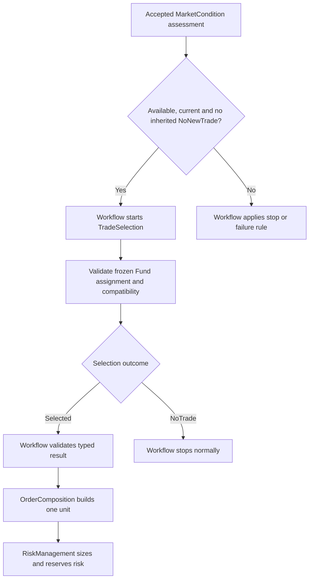

# TradeSelection High-Level Design

> **Strategy catalog direction (2026-09-06):** TradeSelection implementation is on hold at the user's request. Reusable strategy definitions, structures, variants and deployments will be owned by PostgreSQL ConfigurationDb; Portfolio owns Fund authorization. The catalog decision supersedes the earlier fixed three-variant scope and selector-only template catalog. Sections below retain the previous baseline where not explicitly updated; their proposed schemas, wire layouts and TS gates must be realigned before implementation. This document update does not resume any gate. See [ConfigurationDb strategy catalog design](../../../../../../TomasAI.IFM.Application.Storage/Docs/ConfigurationDb-Strategy-Catalog-Design-v1.0.md).

**Document version:** 0.7\
**Revised:** 2026-09-06\
**Status:** Catalog direction updated; TradeSelection implementation on hold\
**System:** Intrinsic Time Trade Strategy Workflow\
**Stage:** TradeSelection\
**Implementation target:** .NET 10 / C# actor-based trading system

This domain Docs document is the canonical TradeSelection design. The filename remains `TradeSelection-High-Level-Design-v0.1.md` for stable references; the internal revision is 0.7. The duplicate under `Documents/system` has been consolidated here and removed.

### Revision history

| Version | Change |
| --- | --- |
| 0.1 | Initial actor and template-selection design |
| 0.2 | Added Daily ES futures, Weekly verticals and Monthly directional Iron Condors |
| 0.3 | Added annual active-Fund context and minimum Fund risk inputs |
| 0.4 | Domain copy added mandate, reusable strategy definitions, allowed-set normalization and family provenance |
| 0.5 | System copy clarified exact family identity, typed selection results and one-unit construction with Portfolio Risk Manager sizing |
| 0.6 | Consolidated both copies; aligned with assessment-only MarketCondition and implemented RegimeDiscovery; separated initial single-template scope, future expansion and verified implementation gaps |
| 0.7 | Put implementation on hold; adopted the ConfigurationDb reusable strategy/structure/variant catalog and explicit legacy-family compatibility |

### Related authorities

- [TradeSelection implementation plan v1.0](TradeSelection-Implementation-Plan-v1.0.md): ordered TS-01 through TS-08 code changes, test gates and deployment dependencies.

- [Detailed TradeSelection specification v1.0](TradeSelection-Specification-v1.0.md): complete input/parameter contracts, explicit test profiles, typed outcomes, durable lifecycle and composition reservation handoff.

- [MarketCondition design](../../MarketCondition/Docs/MarketCondition-High-Level-Design-v0.4.md) and [specification](../../MarketCondition/Docs/MarketCondition-Specification-v2.0.md): market-only assessment and accepted upstream contracts.
- [Portfolio/Fund design](../../../../../../Documents/system/Portfolio-Fund-High-Level-Design-v0.1.md) and [specification](../../../../../../TomasAI.IFM.Domain.Portfolio/Docs/Portfolio-Fund-Specification-v1.0.md): Portfolio authority, Fund mandates, integer business identities, composition identity reservation and persistence boundaries.
- [Strategy family and product catalog](../../../../../../TomasAI.IFM.Domain.Reference/Docs/Trade-Strategy-Symbol-Catalog-Implementation.md): exact family identity and product references.
- [Trade Strategy Builder design](../../OrderComposer/Docs/Trade-Strategy-Builder-Design-v1.0.md): complete one-unit construction and Portfolio Risk Manager final sizing.

## Current catalog scope

The target selector consumes exact Fund-authorized strategy deployments for the triggering horizon. Trading logic, instrument class, payoff structure, side, bias and premium mode are separate. Desired structures include Long/Short futures, all four bullish/bearish credit/debit verticals, and Long/Short iron condors with Balanced/Bullish/Bearish bias. A small root universe can support multiple reusable approaches, including future mean-reversion, Jade Lizard and double-calendar definitions when their capabilities are implemented.

The original three horizon profiles remain proposed test deployments, not a closed strategy taxonomy. Bounded candidate selection and deterministic ranking/tie rules require a revised specification before multiple candidates are enabled. Neither family grouping nor a new catalog definition grants Fund permission. RegimeDiscovery and MarketCondition remain market-only; Composer selects actual contracts and RiskManagement retains final sizing.

## 1. Purpose

TradeSelection is the third of the five opening decision stages. It determines whether the strategy assigned to the active Fund is compatible with the accepted RegimeDiscovery result and MarketCondition assessment for the timeframe of the triggering futures ITI signal.

Each invocation evaluates one target horizon: Daily, Weekly or Monthly. It does not wait for three independent assessments or launch workflows for the other horizons. Supporting observations already included in the accepted regime context remain available as evidence.

The central question is:

> Given the accepted regime and current market assessment for this timeframe, is the Fund's authorized strategy compatible enough to send to OrderComposition?

MarketCondition describes the underlying market. Fund permissions, strategy families and template suitability are TradeSelection concerns. An `Available` assessment establishes usable assessment evidence; it is neither permission to trade nor proof that an option structure can be constructed.

The result is a selected versioned strategy/template or `NoTrade`. Exact contracts, expiration, strikes, leg ratios and prices belong to OrderComposition. Final strategy-unit quantity and financial approval belong to Portfolio Risk Manager.

## 2. Position in the Strategy Workflow

The five opening decision stages are RegimeDiscovery, MarketCondition, TradeSelection, OrderComposition and RiskManagement. OrderExecution is a separate downstream boundary. IBKR integration is not implemented; an IBKR emulator precedes actual broker connectivity.



The Strategy Workflow owns sequencing and accepted revisions. TradeSelection cannot invoke OrderComposition directly or mutate workflow state. The existing command actor address is `TradeSelectionPipelineCommand`; the proposed actor implementation must integrate with that routing contract.

## 3. Separation of Responsibilities

| Component | Responsibility |
| --- | --- |
| RegimeDiscovery | Determine trend direction, phase, strength, volatility and structure; preserve confidence, quality and restrictions |
| MarketCondition | Assess current underlying-market condition, liquidity, stress, session, event risk, volatility behavior, trigger alignment and evidence quality for the trigger horizon |
| Fund | Own investment intent, permitted assets, horizon and strategy guidance |
| Portfolio | Own capital, financial limits, delegated FundRiskEnvelope and risk authority |
| TradeSelection | Validate authorized family/template and evaluate compatibility using accepted upstream facts |
| OrderComposition | Construct complete one-unit candidate, including contracts, strikes, per-unit ratios, prices and unit economics |
| RiskManagement | Determine final units, independently validate sized risk and atomically reserve capacity, or reject |
| OrderExecution | Submit and manage only approved economics through the execution boundary |

Direction, trend phase and trend strength come from RegimeDiscovery. MarketCondition must not recreate these as an opportunity verdict or tailor its assessment to a trade family.

## 4. Core Design Decisions

1. One deterministic actor owns the TradeSelection lifecycle; private evaluators may perform calculations.
2. Freeze accepted upstream results, authority, assignments and policy versions. Inflight workflows cannot adopt newly published configuration silently.
3. Initial scope is one assigned template per Fund/horizon. A compatible template produces `Selected`; expected incompatibility produces `NoTrade`.
4. Configuration corruption, invalid contracts and inability to evaluate produce `Failed`; they must not be disguised as market incompatibility.
5. The workflow independently validates every terminal result before continuation.
6. No automatic strategy retry, live unrestricted catalog reread or LLM decision authority.
7. Preserve exact family ID/version and authorization provenance. Display names and SystemKey are not unique identities.
8. Never construct orders, size final quantities, reserve capital or communicate with a broker inside TradeSelection.

## 5. Actor Boundary

The planned `TradeSelectionActor` validates invocation identity, expected workflow revision, frozen Fund authority and upstream acceptance; evaluates the assigned strategy; commits one immutable result or failure; and publishes through durable infrastructure.

The invocation identity must be unambiguous across workflow, stage and accepted input revision, with command identity and payload hash retained for deduplication. The detailed contract must reconcile any proposed `StageInvocationId` with existing command and event keys instead of adding competing identities.

Private components may include invocation validation, assignment validation, compatibility evaluation, result assembly and deterministic summary generation. These components have no independent continuation authority.

The actor cannot repair invalid upstream results, fetch a replacement regime, query a live option chain for construction, change the target horizon, or choose another Fund after incompatibility. Separate emergency stop/cancellation authority may stop a workflow without rewriting frozen inputs.

## 6. Initial Strategy Universe and Family Identity

| Assigned Fund horizon | Initial template | Direction | Product class |
| --- | --- | --- | --- |
| Daily | ES directional future | Long or Short | Futures |
| Weekly | ES futures-option vertical | Bullish or Bearish | Futures options |
| Monthly | ES directionally biased Iron Condor | Bullish-biased or Bearish-biased | Futures options |

These are initial Portfolio/Fund assignments, not hard-coded meanings of upstream timeframes. RegimeDiscovery and MarketCondition evaluate the trigger horizon independently of these families. Broader reference-catalog support does not expand this initial ES-only construction scope.

### 6.1 Exact identity

Every eligible assignment and selected result retains `TradeStrategyFamilyId` and `DefinitionVersion`, matching the frozen reference definition. Multiple products/timeframes may share a Family-Strategy SystemKey. Do not resolve by SystemKey or display text alone. `TradeStrategySymbolId` identifies a product; it does not identify an expiring futures or option contract.

A versioned reusable strategy definition describes permitted regimes, horizons, underlying/product scope, direction, trend phase/strength, condition, assessment confidence, volatility, liquidity and event compatibility, plus its construction-profile reference. It may specify DTE, payoff or width ranges, but no current contracts, quantities or prices.

The detailed specification resolves the reusable strategy/template as `TradeSelectionTemplateDefinition`, keyed by the existing TradeTemplateId/version. The existing assignment's selection hint profile refers to the single typed `TradeSelectionParameterSet`. No competing mutable strategy catalog or second hint policy is introduced.

### 6.2 Initial assignment

Resolve exactly one effective assigned template for the selected Fund and horizon. Zero assignments, multiple effective assignments, missing definitions or conflicting overrides are configuration failures. An intact assignment whose enabled state or compatibility policy disallows new selection produces `NoTrade` with a stable reason.

### 6.3 Future normalized allowed set

The domain copy's family-membership model remains an expansion design, not a requirement to implement broad ranking initially. A future Portfolio/Fund resolver may expand many-to-many `FamilyStrategyMembership`, select effective immutable definition versions, deduplicate by definition ID/version, retain all contributing family references, resolve overrides and construction profiles, sort deterministically and calculate a checksum.

A future `AllowedStrategySet` should carry set ID/schema/checksum, parent mandate identity, ordered members, source-family provenance, resolution time and validity. TradeSelection validates that frozen set; it does not rebuild it from live configuration. Fund-family assignment must not select a family-dependent MarketCondition evaluator or require an option-specific assessment payload.

## 7. Portfolio/Fund Authority and Freezing

Portfolio/Fund is an implementation prerequisite. Fund owns intent; Portfolio owns capital and financial risk. Financial constraints delegated to a Fund remain Portfolio-authored through `FundRiskEnvelope`.

The initial annual configuration intends one active Fund for each `(PortfolioId, TradingYear, DecisionHorizon)` slot. Resolve the chosen Fund and freeze its selection authority at workflow start. Missing, duplicate or mismatched Fund identity is a configuration error. This is a design requirement: the existing workflow `FundId` alone does not implement the complete snapshot.

| Frozen input group | Required contents |
| --- | --- |
| Identity | Snapshot ID/schema/hash; Portfolio ID/version; Fund ID/mandate version |
| Validity | Trading year, effective interval, resolution timestamp and operating permissions |
| Decision scope | Target horizon, underlying root, venue and authorized product classes |
| Assignment | Exact family ID/version, template/definition ID/version and provenance |
| Selection policy | Compatibility parameters, reason-code and summary-template versions |
| Construction | Assigned OrderComposition profile ID/version and permitted constraint ranges |
| Financial provenance | Portfolio risk-policy reference, allocation reference, FundRiskEnvelope reference and risk currency |

Pass this authority separately from the market-only upstream results. RegimeDiscovery and MarketCondition profiles are selected for market root/horizon and matching published regime parameter version, not by family. Trace or workflow Fund attribution does not grant the upstream evaluator Fund-specific decision authority.

The detailed specification reuses the existing `PortfolioFundStrategySnapshot` and embeds it in one TradeSelectionBinding with exact reference/template/parameter evidence. Earlier names such as PortfolioFundMandateSnapshot and FundMandateSnapshot do not require competing new Portfolio payloads.

Allocation examples such as 10/30/60 percent are optional Portfolio configuration, not deployed defaults or contract quantities. Live utilization and financial capacity are evaluated by RiskManagement, not used as a TradeSelection market-fit score.

## 8. Accepted Upstream Inputs

### 8.1 RegimeDiscovery

Consume the accepted result for `TargetHorizon`, including its fused decision, specialist evidence, immutable identities, hashes and parameter versions. `RegimeDiscoveryDecision.Direction`, `TrendPhase` and `TrendStrength` supply directional and trend semantics. Preserve volatility, structure, confidence, quality and restrictions.

Supporting timeframe observations inside the accepted result may contribute to versioned compatibility rules. They do not authorize extra assessment requests or require all three target-horizon results to exist.

### 8.2 MarketCondition assessment

| Assessment field | TradeSelection interpretation |
| --- | --- |
| `Availability` | Whether usable assessment evidence was produced |
| `UpstreamContext` | Preserved accepted RegimeDiscovery decision, including inherited restrictions |
| `ConditionType` | Current market classification |
| `AssessmentConfidence` | Confidence in the assessment, separate from regime confidence and trend strength |
| `LiquidityCondition` | Underlying-market liquidity evidence |
| `StressState` | Current stress classification |
| `SessionState` | Current session context |
| `EventRiskState` | Scheduled-event risk context |
| `VolatilityBehavior` | Current volatility behavior |
| `TriggerAlignment` | Relationship to the single triggering ITI signal |
| Data quality, evidence and limitations | Required and optional source availability and explanatory evidence |
| `InheritedRestrictions` | Accepted upstream restrictions; never weakened downstream |
| Evaluation/validity timestamps and identities | Freshness, lineage, exact versions and reproducibility |

`Available` with poor liquidity, a closed session or elevated event risk is a legitimate descriptive assessment. The relevant versioned strategy policy decides whether that combination is compatible. No generic `Tradeable` verdict is reintroduced.

Underlying liquidity does not prove option-chain liquidity, spreads, strikes, expiration availability or executable prices. OrderComposition obtains and validates those construction inputs. If future selection needs additional option-level features, first specify their source and frozen contract; do not restore family-specific MarketCondition payloads.

Retired concepts such as `Tradeability`, `OpportunityStrength`, family hints, `EsFuturesConditionResult` and `EsFuturesOptionsConditionResult` are not inputs to this design. Historical DTOs may remain readable without becoming an executable legacy path.

### 8.3 Entry validation

The workflow and selection boundary must require an accepted assessment with exact workflow/revision, horizon, profile, regime lineage and hashes; `Availability = Available`; unexpired `ValidUntilUtc`; an unexpired workflow deadline; and no inherited `NoNewTrade` restriction. Validate preserved upstream context instead of trusting independently reconstructed classifications.

Unavailable or restricted assessments stop before selection under the workflow's normal no-trade rule. Expired inputs follow its timeout rule; invalid contracts fail. A caller bypassing these prerequisites cannot turn an invalid invocation into a valid selection.

## 9. Invocation Contract

The existing `StartTradeSelectionPipelineCommand` carries command/routing metadata, `WorkflowId`, `InputWorkflowRevision`, `WorkflowState`, `TriggerEvent`, correlation/causation IDs, request time and expected completion time. It provides workflow snapshot scaffolding, not a complete typed selection authority contract.

The implementation specification must add or bind the frozen authority, assigned template, selection policy, accepted upstream context, invocation identity and schema/version semantics required here. Preserve existing serialized key meanings and reject unsupported payloads lacking required authority; do not silently fill them from latest configuration.

Queries are separate, eventually consistent projections. They cannot influence an inflight decision by substituting a newer result or assignment.

## 10. Deterministic Evaluation

1. Validate invocation, accepted assessment, regime lineage, target horizon, authority identity, hashes and validity.
2. Validate the one effective Fund assignment, exact family/definition/template versions, ES product scope and construction profile.
3. Apply frozen operating permissions and permitted direction/horizon/product rules.
4. Evaluate strategy compatibility with regime direction, phase and strength and the descriptive assessment fields.
5. Return the assigned template as `Selected` if all required rules pass; otherwise return `NoTrade` with ordered incompatibility reasons.
6. Validate the assembled typed result, recheck validity before committing, and commit one terminal outcome.

Initial scoring is optional because no cross-template ranking occurs. No randomness or LLM decision is permitted. Identical frozen inputs and versions produce identical decisions and ordered evidence.

A legitimate `Unknown` optional observation required by a particular strategy may produce `NoTrade` under its explicit policy. Missing mandatory contract fields, corrupt configuration and calculation failures produce `Failed`. Exact condition mappings, thresholds and reason codes require a versioned detailed specification; this high-level document does not activate trading rules.

## 11. Compatibility Examples

| Accepted context | Possible assigned-template decision |
| --- | --- |
| Daily regime direction Up, permitted trend phase/strength and acceptable assessment | Select Long ES futures |
| Weekly regime direction Down with compatible condition and volatility | Select the assigned bearish vertical |
| Monthly Up or Down regime with compatible assessment | Select the assigned bullish- or bearish-biased condor |
| Available assessment with incompatible transition, liquidity or event policy | Return `NoTrade` |

These illustrate ownership and are not calibrated trading rules. Market assessment availability alone never guarantees selection or downstream constructability.

## 12. TradeSelection Result

`TradeSelectionResult` is an immutable, self-contained result envelope. It is the authoritative
selected-trade-strategy input to downstream OrderComposition, not merely a score, family hint or
template ID. The requirements below are normative design requirements; the existing opaque
`StrategyStageResultEnvelope` transport is not evidence that this typed payload is implemented.

### 12.1 Core result

| Field | Required contract semantics |
| --- | --- |
| `SelectionOutcome` | Required: `Selected` or `NoTrade`; operational failure uses the Failed event |
| `TradeTemplateId` | Required non-empty selected template identity for `Selected`; absent for `NoTrade` |
| `TradeTemplateVersion` | Required positive frozen template version for `Selected`; absent for `NoTrade` |
| `TradeFamily` | Required selected family: `Future`, `OptionVertical` or `IronCondor`; `None` only for `NoTrade`. Bind to the exact versioned ReferenceDb family identity, not a display-name lookup |
| `TradeFamilyReference` | Required for `Selected`: `TradeStrategyFamilyId` and `DefinitionVersion` matching the selected template and frozen Fund assignment; absent for `NoTrade` |
| `InstrumentClass` | Required `Futures` or `FuturesOptions`, consistent with selected family; `None` for `NoTrade` |
| `DirectionalBias` | Required explicit permitted direction for `Selected`: `Long`/`Short` for the initial futures profile, `Bullish`/`Bearish` or explicitly permitted `Neutral` for options; `Undefined` only for `NoTrade` |
| `DecisionHorizon` | Required typed Daily, Weekly or Monthly on both outcomes; must equal the invocation/Fund mandate and accepted MarketCondition target horizon |
| `CompatibilityScore` | Normalized 0 to 100 score; optional when a single-template binary policy is used |
| `SelectionConfidence` | Deterministic 0.00 to 1.00 confidence in template compatibility |
| `PrimaryReasonCode` | Required stable reason for selection or no selection |
| `CompositionPolicyId` / `CompositionPolicyVersion` | Required frozen construction-policy reference for `Selected`; absent for `NoTrade`. Resolve explicitly to the assigned OrderCompositionProfile ID/version, not an independent mutable policy |
| `DecisionContext` | Required immutable accepted RegimeDiscovery and MarketCondition results with their identities, hashes, schema/parameter versions and validity; same workflow and accepted input revision chain |
| `ValidUntilUtc` | Required result expiry, bounded by assessment validity, workflow deadline and required assignment/policy validity; never extended by downstream handoff |

### 12.1.1 Required selected-result invariants

Every `SelectionOutcome = Selected` result MUST identify **which strategy family/template, which
direction and which horizon** were selected. The workflow validates those fields before accepting
the result; OrderComposition validates them again before construction.

- Family, template/version, instrument class and construction-policy reference must agree with
  each other and the frozen authorized Fund assignment. A known template with a conflicting family
  is invalid, not an instruction to switch builder types.
- Direction must be compatible with the accepted RegimeDiscovery direction and template's permitted
  directions. For futures, an explicit versioned mapping may translate Up to Long and Down
  to Short. No sign inference from names, summaries or an old ITI row is permitted.
- Horizon identifies the selected workflow horizon, not option expiry or a lease TTL. It cannot
  be replaced by another horizon because a contract is unavailable. Broader regime context may
  have its own horizon; it is preserved, not incorrectly forced to equal the target horizon.
- The selected template and decision context are immutable. No downstream lookup of a newer
  template, regime or MarketCondition may silently replace the accepted versions.
- Missing, unknown, default or contradictory required fields produce a contract failure and
  block OrderComposition. Consumers must not reconstruct missing selection fields from hints.

For `NoTrade`, no strategy is selected: template/family-reference/policy identities are absent,
family and instrument class are `None`, and selected direction is `Undefined`. Retain the requested
horizon, accepted upstream context, workflow attribution and reason. An observed Up regime
direction in that context does not become a selected bullish strategy. NoTrade never invokes
OrderComposition and must not be encoded as a partially populated Selected result.

### 12.1.2 Downstream selected-trade-strategy parameter

OrderComposition receives the accepted result as its selected-trade-strategy parameter, including
the frozen regime and MarketCondition context. It does not independently select a strategy or
reclassify those inputs. Fresh live chain/futures snapshots and authenticated Portfolio construction
constraints are separate inputs; they do not overwrite the selected decision context.

Use one canonical result contract. If an internal adapter calls its parameter
`SelectedTradeStrategy`, it is a validated Selected-only view of this result, preserving the
result ID/hash and versions, not a second independently mutable strategy object.

The selected family routes construction to the appropriate one-unit builder: monthly condor
(four option legs), weekly vertical (two option legs), or daily outright futures (one futures leg),
subject to the exact template/profile. The result does not yet contain chosen contracts, strikes,
prices or final quantity. OrderComposition supplies complete one-unit construction; Portfolio
Risk Manager determines final units and reserves risk.

Typed payload serialization and validation must be versioned explicitly inside the existing stage
envelope. Preserve prior schema meanings; an old payload lacking mandatory selection fields cannot
be treated as qualified input to the new builder. No runtime contract is modified by this document.

### 12.2 Composition constraints

`CompositionConstraints` communicates the selected structure's intent without constructing the order. It may contain:

- required instrument class and trade family;
- directional bias;
- allowed debit, credit, or configured pricing style;
- permitted expiration or DTE range;
- permitted leg-count and structure shape;
- permitted width or payoff-profile ranges;
- template-specific liquidity requirements that OrderComposition must revalidate;
- named composition parameter-set identity and version.

It must not contain a current expiration selection, strike selection, contract quantity, leg quantity, marketable price, broker order ID, or risk approval.

### 12.3 Evidence and rejected alternatives

The result also contains:

- ordered `SelectionEvidenceItems`;
- ordered `ConflictingEvidenceItems`;
- `RejectedAlternatives`, each with template identity, eligibility status, score if calculated, and stable reason codes;
- the accepted immutable RegimeDiscovery and MarketCondition `DecisionContext` and their identities/hashes (not merely latest-result lookup keys);
- catalog and parameter-set identities and versions;
- evaluated and validity timestamps;
- deterministic `SummaryText`.

Evidence is machine-readable authority. Summary text is an operator projection and may later be supplied to a non-authoritative workflow summary service.

### 12.4 Example deterministic summaries

Selected:

> Monthly ES TradeSelection completed: selected the bullish-biased Iron Condor template. The accepted regime direction was Up and the current assessment met the assigned compatibility policy. Exact expiry, strikes and one-unit prices remain for OrderComposition; final units remain for Portfolio Risk Manager.

NoTrade:

> Monthly ES TradeSelection completed with NoTrade: the assessment was Available, but its Transition condition did not meet the assigned template's compatibility policy. No order composition was attempted.

## 13. One-Unit Construction and Risk Handoff

OrderComposition receives the accepted selection unchanged and builds one normalized strategy unit: initially one futures leg, two vertical legs or four condor legs, with exact ratios determined by the selected profile. It supplies contracts, prices, multiplier, fees, slippage assumptions, candidate identity/hash, validity and unit economics. Final unit quantity remains absent.

Portfolio Risk Manager determines the final number of units and independently recalculates the sized candidate before atomic risk reservation. It may approve more than one unit; the earlier Composer-sized/RiskManager-reduce-only rule is withdrawn. Changing approved size requires recalculation and approval; changing legs requires a new candidate and validation.

RiskManagement requires frozen Portfolio/Fund policy and delegated-envelope references, accepted selection, complete candidate economics, current open risk and working reservations, and current broker/account safety evidence. Policy versions are frozen; current financial and reconciliation state is checked at risk time. The broker-facing evidence path must support the emulator before live IBKR integration.

### 13.1 Conservative gross-risk model

The initial design uses additive Fund and Portfolio ledgers:

```text
ProjectedGrossRisk = OpenGrossRisk + ReservedWorkingOrderRisk + CandidateGrossRisk
```

Both Fund and Portfolio constraints apply. Reserve atomically to prevent concurrent workflows consuming the same capacity. No cross-position or cross-Fund netting, correlation, hedge or margin-offset credit is granted initially. Defined-risk offsets within one validated atomic spread may be recognized.

The retained initial economics, subject to independent exact payoff validation, are:

```text
Debit vertical risk = NetDebit * Multiplier * Units + CostReserve
Credit vertical risk = (SpreadWidth - NetCredit) * Multiplier * Units + CostReserve
Condor risk = (max(PutWingWidth, CallWingWidth) - NetCredit) * Multiplier * Units + CostReserve
Futures gross notional = abs(Contracts) * FuturesPrice * ContractMultiplier
Futures planned loss = abs(EntryPrice - MaximumLossExitPrice) * ContractMultiplier * abs(Contracts)
Futures candidate risk = max(PlannedLossAtExit, ConfiguredStressLoss) + CostReserve
```

Spread formulas apply to the supported normalized defined-risk structures; arbitrary ratios require exact payoff calculation. Resolve multipliers from instrument definitions. Costs and sized economics must be recalculated rather than assumed linear. Futures have no option-style finite maximum loss; a planned exit does not guarantee that loss bound. Initial margin is a separate check, never maximum loss.

Approved risk binds candidate hash, final units, price tolerance, calculated Fund/Portfolio risk, policy/envelope versions, reservation ID and expiry. Rejection is a business outcome. Reservation release, fill conversion, reconciliation, notional/margin/contract caps, loss states and broker safety remain downstream responsibilities, not evidence that those actors are complete.

## 14. Lifecycle and Persistence

The existing shared lifecycle events are `TradeSelectionPipelineProcessingEvent`, `TradeSelectionPipelineCompletedEvent` and `TradeSelectionPipelineFailedEvent`. Use the existing Processing contract; the old design's Started event is not an implemented alternative.

The planned actor commits exactly one logical Completed or Failed outcome per invocation. Completed contains either typed `Selected` or `NoTrade`. Failure records a stable category/reason, safe diagnostic, identities, available versions and timings. Invalid contract/configuration, corrupt upstream data, calculation failure and invariant violations are technical failures.

Persist invocation identity and payload hash, accepted revisions, frozen authority/assignment/policy references, upstream hashes, ordered evidence, result/failure and publication state. An identical duplicate must not recalculate. Reusing an invocation identity with a different payload is a contract violation. Transport recovery may republish a committed terminal event without creating a new business decision.

Authoritative actor events/state and configuration belong in the existing PostgreSQL-backed event-sourcing/configuration infrastructure. ScyllaDB may hold query projections and history. Redis may cache immutable snapshots but is not authoritative. Reconcile actor state, durable projection/publication and outbox semantics with the repository infrastructure in the detailed implementation plan; an uncommitted best-effort publish is insufficient.

If cancellation is added, it must compete atomically with completion and timeout. Late terminal messages cannot create a second outcome. No automatic business retry occurs; a later eligible market trigger may create a new workflow.

## 15. Workflow Continuation and Validity

The workflow validates stage, invocation, entity, Fund, revision, horizon, assignment, upstream context, schema and required selected fields before accepting a result and advancing once.

| Accepted terminal outcome | Required action |
| --- | --- |
| Completed, valid Selected | Pass the accepted typed selection unchanged to OrderComposition |
| Completed, NoTrade | Stop normally with selection reasons |
| Expired result or exceeded workflow deadline | Stop under the expiry/timeout rule; do not rerun selection |
| Invalid or contradictory result | Contract failure; no construction dispatch |
| Failed | Stop as failed |
| Identical duplicate or late terminal event | No second continuation |

Only Selected can dispatch a builder. Do not infer a selection from generic Completed status, candidate lists, summary text or a latest-result lookup. Preserve selection identity/hash, family/template versions, direction, horizon and accepted decision context across the handoff.

Selection validity cannot exceed MarketCondition `ValidUntilUtc`, the workflow deadline or required assignment/policy validity. RegimeDiscovery provides as-of/production timestamps and lineage; do not invent a generic RegimeDiscovery expiry field. Specify permitted upstream age through the existing profile and acceptance contracts. A downstream handoff never extends validity.

If no exact order can be constructed, OrderComposition returns its defined business outcome. There is no implicit fallback loop to select a different family or horizon.

## 16. Configuration Ownership

| Owner | Frozen configuration responsibility |
| --- | --- |
| RegimeDiscovery | Published regime parameter version for the trigger horizon |
| MarketCondition | Market root/horizon assessment profile with exact matching regime parameter binding; no family evaluator |
| Portfolio/Fund | Operating permission, non-financial mandate, effective family/template assignment and authority provenance |
| TradeSelection | Compatibility parameters, direction mapping, thresholds and stable reason/summary versions |
| OrderComposition | Construction profile, allowed structures and exact one-unit building rules |
| Portfolio Risk Manager | Portfolio policy, delegated Fund envelope, sizing, risk and reservation rules |

Configuration updates affect later workflows. Emergency permission changes use explicit safety authority without rewriting accepted market assessments or historical selections. Published profile availability and runtime deployment qualification are separate from source-code completion.

## 17. Queries, Observability and Access

Planned read models should expose invocation status, latest result, history and frozen eligible assignment. Earlier suggested query names such as `GetTradeSelectionInvocationStateQuery` and `GetLatestTradeSelectionResultQuery` are design names, not claims of implemented endpoints. Eventually consistent projections cannot act as realtime decision authority.

Capture workflow/stage/correlation IDs, accepted revisions, Fund and exact family/template versions, target horizon, upstream result hashes, policy versions, outcome/reasons, evidence, validity and duration. Use high-cardinality identities in traces/logs, not metric labels. Metrics should cover duration, failures, NoTrade causes and duplicate/late delivery.

The eventual Strategy observation view should distinguish assessment availability, selection compatibility, construction and risk status for the workflow from the latest futures ITI signal. It must not turn Available into a green trading authorization. The UI enhancement remains deferred until all five pipeline operators are code complete, followed by testing them together one stage at a time.

Queries must enforce Portfolio/Fund access. Configuration and activation require authorized, audited changes. Logs and operator summaries must omit secrets and unsafe broker/account details. Typed machine-readable evidence is authoritative; explanatory text and any future LLM summary are not.

## 18. Required BDD, Unit, Integration and Verification Tests

These are requirements for the future TradeSelection implementation, not tests executed by this documentation change.

### 18.1 Upstream and invocation contracts

- One Daily, Weekly or Monthly ITI trigger requires only its matching target-horizon result; supplied supporting regime evidence is preserved.
- Accept only matching accepted regime/assessment lineage, profiles, hashes and revisions.
- Reject unavailable, expired, restricted or malformed entry contracts; verify workflow stop semantics before selection.
- Available with Poor liquidity, Closed session or Elevated event risk remains descriptive; versioned compatibility policy determines selection.
- No executable legacy Tradeable path, family-dependent MarketCondition evaluator or option-specific assessment requirement exists.

### 18.2 Selection behavior

- Exact family ID/version disambiguates repeated SystemKey/display names; product ID is never treated as an expiring contract.
- One effective initial assignment is required; missing, duplicate, conflicting or unknown versions fail configuration validation.
- Exercise Daily Long/Short, Weekly Bullish/Bearish and Monthly directional condor fixtures, including incompatibility producing NoTrade.
- Frozen operating permissions and template compatibility cannot be bypassed by favorable market evidence.
- Identical frozen inputs produce stable decisions and ordered reasons across serialization and collection-order changes.
- Distinguish optional Unknown evidence from missing mandatory fields and calculation failure.
- No unrestricted catalog/chain read, upstream mutation, exact-order construction, final sizing or LLM decision occurs in selection.

### 18.3 Typed result and workflow continuation

- Selected requires matching family/template/profile versions, product class, direction and target horizon.
- NoTrade retains context/reasons but no selected-only fields; it never dispatches construction.
- Missing/default/contradictory required values and unsupported old payload schemas fail closed.
- Serialization round trips preserve hashes, identities, accepted upstream context and versions.
- Selected reaches OrderComposition unchanged; expired or invalid results cannot dispatch a builder.
- Duplicate, conflicting, out-of-order and late deliveries cannot advance twice.

### 18.4 Actor and downstream integration

- Durable terminal commit/publication survives restart and projection failure without business recalculation.
- Completion, failure and optional timeout/cancellation races preserve one logical terminal outcome.
- Future allowed-set expansion retains every source-family provenance reference and rejects conflicting overrides.
- One-unit construction has no final size; risk may approve multiple units only after independent calculation and atomic reservation.
- Test exact spread payoff, unequal condor wings, futures planned/stress loss, multiplier, costs, notional and margin separately.
- Concurrent Fund/Portfolio reservations cannot consume the same capacity; rejection/cancellation/fill reconciliation follow downstream rules.
- Use deterministic fixtures and an isolated integration environment. Runtime qualification and emulator/broker tests remain explicit work, not inferred from passing unit tests.

## 19. Deferred Scope and Specification Decisions

Deferred expansion includes multiple-template ranking, normalized many-to-many allowed-set resolution, cross-asset vehicle selection, non-ES products, advanced cross-Fund netting/correlation and optional narrative summaries. Initial scope does not need ranking or tie-breaking between multiple templates.

The [detailed specification v1.0](TradeSelection-Specification-v1.0.md) now defines the following initial decisions with explicit engineering test defaults:

1. Canonical strategy-definition/template/assignment identities and their mapping to existing Reference and Portfolio contracts.
2. The composed frozen authority contract, resolution timing, versioning, hashes, validity and existing serialized-key compatibility.
3. Exact compatibility matrices, regime-direction mapping, Unknown handling, thresholds and reason codes.
4. Weekly debit/credit variant and monthly directional-condor definitions and construction constraints.
5. Typed Selected/NoTrade schema, validation, evidence ordering, confidence/optional score and result expiry.
6. Actor identity, state, durable event/publication/projection contracts and duplicate/conflict recovery.
7. Workflow Selected/NoTrade/expiry acceptance and unchanged construction handoff.
8. Operational enable/pause/cancellation semantics and deployment qualification fixtures.
9. Separate construction/risk details: unit economics, final sizing, costs/stress assumptions, reservations and emulator evidence.

## 20. Verified Implementation Alignment

This table records a source review on 2026-09-06. Implemented means the identified code exists; it does not assert deployment qualification or completion of the whole pipeline.

| Area | Current code | Remaining work |
| --- | --- | --- |
| RegimeDiscovery | Specialist trend/volatility/structure results and fused decision with target horizon, direction, phase, strength and restrictions | Deployment/profile qualification remains separate |
| MarketCondition | Assessment-only calculation and acceptance contracts; market-only descriptive result with preserved regime context | Operational publication/qualification is separate from this design |
| Selection entry | `ValidateForSelection` verifies running selection stage, accepted assessment, deadline, availability, validity and restrictions | Integrate the complete selection actor and authority contract |
| Selection helper | `MarketAssessmentSelectionConsumer` validates a supplied frozen Fund mandate/hash and filters supplied candidates against mandate and assessment | It does not resolve a complete assigned-template snapshot, calculate full compatibility, own actor lifecycle or emit typed Selected/NoTrade |
| Commands/events/routing | Start command and Processing/Completed/Failed events provide pipeline scaffolding | Typed input/result, persistent actor implementation, policy evaluation and durable lifecycle remain |
| Result transport | Generic `StrategyStageResultEnvelope` exists | Required typed selection payload and boundary invariants remain |
| Workflow continuation | `CompleteTradeSelection` advances generic completion after the workflow deadline check | Typed Selected/NoTrade acceptance, selection expiry and guarded builder dispatch remain |
| Reference/Portfolio | Exact family/product references, PortfolioFundStrategySnapshot, its resolver/query service and composition reservation contracts exist | Integrate the frozen snapshot with TradeSelection; enforce its one-assignment/permission rules and reservation handoff; future normalized allowed set remains deferred |
| Construction/risk | One-unit construction and final risk sizing are documented boundaries | This design is not proof of downstream actor, emulator or broker implementation |
| Observation and combined testing | Existing workflow observation infrastructure is available | Requested UI upgrade and coordinated five-operator qualification remain deferred |

The helper's candidate array, deterministic ordering and `NoStrategy` result are not a persisted TradeSelection decision or a completed template-ranking actor. Full code completion requires the typed lifecycle and continuation work above.

Implementation evidence:

- [RegimeDiscovery results](../../../../../../TomasAI.IFM.Domain.Trade.Shared/Strategy/Workflow/IntrinsicTime/Pipeline/RegimeDiscovery/Model/RegimeDiscoveryResults.cs)
- [Assessment contracts](../../../../../../TomasAI.IFM.Domain.Trade.Shared/Strategy/Workflow/IntrinsicTime/Pipeline/MarketCondition/Assessment/MarketConditionAssessmentContracts.cs) and [models](../../../../../../TomasAI.IFM.Domain.Trade.Shared/Strategy/Workflow/IntrinsicTime/Pipeline/MarketCondition/Assessment/MarketConditionAssessmentModels.cs)
- [Selection consumer](../MarketAssessmentSelectionConsumer.cs)
- [Start command](../../../../../../TomasAI.IFM.Domain.Trade.Shared/Strategy/Workflow/IntrinsicTime/Pipeline/Commands/StartTradeSelectionPipelineCommand.cs)
- [Current TradeSelection continuation](../../Command/CompleteTradeSelection.cs)

## 21. Acceptance Criteria

The consolidated design is ready to drive a detailed specification when one-trigger/one-horizon semantics, market-only upstream ownership, exact versioned family identity, one initial assigned template, immutable Fund authority, typed Selected/NoTrade results and workflow continuation are preserved.

Implementation completion additionally requires the missing contracts, actor lifecycle, deterministic compatibility policy, persistence/publication, guarded construction handoff and BDD/unit/integration/verification coverage listed above. A helper that filters candidates or a generic stage completion alone does not satisfy these criteria.
