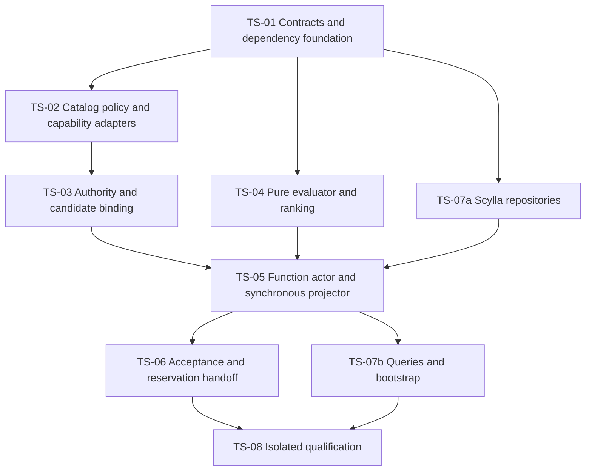

# TradeSelection Implementation Plan v1.1

| Item | Value |
| --- | --- |
| Revised | 2026-09-07 |
| Status | Code complete; isolated selector qualification passed |
| Coding gates | TS-01 through TS-08 complete for isolated selector scope |
| Normative contract | [Detailed specification v1.1](TradeSelection-Specification-v1.0.md) |
| Design | [High-level design revision 0.8](TradeSelection-High-Level-Design-v0.1.md) |
| Existing prerequisite | ConfigurationDb catalog, Reference UI/APIs and Portfolio deployment references implemented |
| Actor standard | [Shared Function actor conventions](../../../../../../Documents/system/Actor-Implementation-Conventions.md#133-functionactor-convention); RegimeDiscovery and MarketCondition are the implementation references |
| Scope | One ES trigger horizon; bounded authorized deployment/variant selection; durable result, queries and guarded reservation handoff |
| Excluded | Construction/risk algorithms, emulator/live broker, UI redesign and combined live five-operator qualification |

This plan replaces the suspended selector-only template plan. The old template table, one-assignment requirement and timeframe-to-strategy mapping are removed. Existing filenames remain stable for links. The sections below are the implementation acceptance criteria. Runtime evidence and final gate status are recorded in [TradeSelection-Implementation-Evidence-v1.0.md](TradeSelection-Implementation-Evidence-v1.0.md).

## 1. Readiness and dependency boundaries

The specification now defines exact deployment/strategy/structure/variant/parameter identities; schema-3 Portfolio mapping; multiple authorized candidates; twelve variant signatures; common policy and deterministic ranking; one Daily, Weekly or Monthly trigger; bounded frozen evidence; completed-only Function persistence and direct request/reply; and workflow-owned reservation recovery. There is no remaining selection-policy decision requiring another design round before starting TS-01.

The implementation now provides these dependencies:

- A dependency-safe contract assembly, since Portfolio.Shared and Reference.Shared already reference Trade.Shared.
- Typed selection policy, activation reference and specialized-rule validation over the existing catalog.
- A selector-specific Portfolio query/resolver, because the current resolver requires an asset class, drops disabled assignments and rejects some deny states.
- Real selector capability registration and a narrow exact OrderComposition-profile contract/adapter. Production now registers only implemented selector validators. No production fixture or permissive validator may bypass missing builder/risk capabilities.
- Completed-only selector Function actor, Scylla projections, query wiring and durable reservation-to-construction dispatch.

Selector code qualification uses isolated, explicitly named fixture capabilities for downstream algorithms that are outside these gates. Production registration fails unsupported requirements; code completion does not mean a live deployment can be published. Operational qualification waits for actual downstream capabilities, effective published policies and exact enabled Fund permissions/assignments. Preserve the user's sequence: complete the five operators, exercise them together one at a time, then upgrade observation UI.

## 2. Pre-implementation source baseline (retained for traceability)

| Existing source | Verified behavior | Work required |
| --- | --- | --- |
| IConfigurationDbContext.StrategyCatalog / context / schema | Immutable exact graph operations, publication guards and normalized relationships | Reuse; do not create a second template catalog |
| StrategyCatalogContracts / Examples / Defaults | GUID/int CatalogKeys, twelve variant examples, three basic authoring strategies | Add typed transport snapshots and semantic validation; examples remain drafts |
| FundTradeTemplateAssignmentReadModel / PortfolioFundCommandActor | Schema-3 template GUID/version equals CatalogDeployment; one selection/composition binding by kind | Preserve mapping/actual Role strings and add selector authority resolution |
| PortfolioFundStrategyResolver | Strict active Fund/asset filtering, sorted multiple assignments, original canonical hash | Add separate bounded selection path; leave strict callers unchanged |
| StartTradeSelectionPipelineCommand | Historical keys 0-13 and route exist | Preserve for reads; new Execute Function contract |
| Workflow view/state | Last keys 26/22, assessment binding | Append selector binding at 27/23 and handoff at 28/24; recheck before implementation |
| MarketAssessmentSelectionConsumer | Filters caller-supplied candidates against mandate/assessment | Replace runtime usage with full typed evaluator |
| CompleteTradeSelection | Generic completion advances to OrderComposition after deadline check | Typed result/winner validation and reservation state before dispatch |
| BaseEventSourceFunctionActor / Function repository / IFunctionProjector | Completed-only synchronous lifecycle | Reuse, enforce map conventions and qualify replay/orphans |
| API Startup | Catalog reference adapter exists; capability registry is empty | Register only real implemented selector capabilities; downstream absence stays explicit |

## 3. Order and gate dependencies



Coding sequence: TS-01; TS-02; TS-03 and TS-04; TS-07a; TS-05; TS-06; TS-07b; TS-08. TS-04 can start after TS-01 with explicit frozen fixtures. TS-07a precedes actor gate closure; TS-07 is complete only after queries/bootstrap. Parallel work is optional; the dependency order is mandatory.

Path aliases below: TradeShared=`TomasAI.IFM.Domain.Trade.Shared`; Trade=`TomasAI.IFM.Domain.Trade`; Selector=`Trade/Strategy/Workflow/IntrinsicTime/TradeSelection`; Workflow=`Trade/Strategy/Workflow/IntrinsicTime`; Storage=`TomasAI.IFM.Application.Storage`; Portfolio/PortfolioShared and Reference/ReferenceShared are their existing domain projects. Pipeline=`TradeShared/Strategy/Workflow/IntrinsicTime/Pipeline`.

## 4. TS-01: shared contracts and dependency foundation

**Specification:** sections 2-7, 9, 12, 14. **Dependencies:** none.

Create `TomasAI.IFM.Domain.Strategy.Contracts.Shared` with the repository's net10.0 conventions. It may depend on Shared, MarketData.Analytics.Shared and Trade.Primitives.Shared as needed; it must not depend on Trade.Shared, Portfolio.Shared or Reference.Shared.

Move the pure DTO closure required by typed bindings: Portfolio enums/workflow snapshots/reservation and associated read models, TradeStrategyFamilyReference, CatalogKey/kinds and the pure catalog records used by those DTOs. Include the new CatalogDeployment dependency that the prior extraction plan missed. Preserve namespaces, all existing MessagePack keys, JSON property/ignore rules, canonical Portfolio hashes and public behavior. Keep command/request/service implementations in their original domain projects. Type-forward every moved public type from its former assembly; do not duplicate full names. Capture compatibility vectors before moving. Determine the transitive closure using actual project references and add only needed solution/filter inventory entries.

Add proposed types under Pipeline/TradeSelection and Pipeline/Configuration/TradeSelection:

| Target group | Responsibility |
| --- | --- |
| TradeSelectionBinding / SelectionCandidateBinding / snapshot DTOs | Complete typed Portfolio/catalog/pipeline evidence with bounded deduplicated graphs |
| TradeSelectionParameterSet / SelectionVariantRule / specialized payload | Complete 38-field policy and exact twelve-rule defaults; explicit JSON presence and validation |
| TradeSelectionResult / CandidateIntent / CandidateDecision / RuleEvidence | Typed Selected/NoTrade and full rejected/eligible-alternative evidence |
| TradeSelectionContracts / Payload / CanonicalOrder | Validate binding, invocation, result, hashes and canonical ranking identities |
| WorkflowCompositionHandoffState / frozen Function dispatch intent | Persistent reservation and original Function request in existing workflow |

Use explicit MessagePack keys from the specification. Catalog authoring JsonElement is projected to bounded canonical SettingsJson in the new typed DTO; verify reconstruction using the original ConfigurationDb content hash. Do not publish typeless objects or reinterpret a generic JSON dictionary as authority. Extract only pure canonical helpers if needed to prevent Storage references in shared contracts; preserve source serializer behavior.

Introduce the dedicated ExecuteTradeSelectionPipelineCommand schema from specification section 13; preserve historical Start keys without activating its Command route. Append view keys 27/28/29 and state keys 23/24/25 (binding/handoff/frozen Function dispatch) after key inventory verification. Extend Execute workflow transport and StartOrderComposition only after inspecting their current keys. Existing missing selector schema must remain invalid 0; no constructor default may promote old starts. Historical messages retain readable legacy keys.

**Tests/exit:** contract, presence, unknown schema/property/enum, clone/immutability, byte/hash vectors, catalog DTO round-trip, checked long-to-int versions and project-cycle tests. Portfolio/Reference existing wire/hash tests and affected shared/domain builds pass. TS-C20, C25-C27, C39 coverage. No database rows created by deserialization.

## 5. TS-02: reuse ConfigurationDb and implement selector policies

**Specification:** sections 3-5, 7-9. **Dependencies:** TS-01. Generic catalog storage is already implemented; this gate adds selector integration.

1. Add `ConfigurationDbContext.TradeSelection.cs`, typed interface methods `InsertTradeSelectionDraftAsync`, `GetTradeSelectionVersionAsync`, `ResolveTradeSelectionVersionAsync`, strict parser/serializer and lifecycle guards over the existing TradeSelection parameter table. Audit generic Publish/Retire/insert paths so invalid payloads or mutable published content cannot bypass typed operations. Use additive migrations only where required by actual guard deficiencies; create no selector-only template table.
2. Add an exact SelectionPolicyReference to the versioned workflow activation parameter contract, pinned per root/horizon and persisted before binding. Update its authoring/validation, append-only transport, resolution and test factories. Each candidate deployment must reference the same common ID/version/hash. Zero-candidate invocations still have an explicit policy. No latest-by-timeframe runtime lookup.
3. Build `TradeSelectionDefaultProfiles` with exactly three complete engineering policies. Serialize all fields and all twelve rules; IDs come from a saved manifest. Use existing basic family/strategy/structure/variant definitions as authoring inputs; do not recreate or publish them on startup. Add authoring tests for arbitrary valid Role strings and exactly one selection/composition binding by kind, preserving the current Portfolio writer's mapping.
4. Add semantic validators for selector policy and optional specialized role `TradeSelectionVariants`. Read ParameterSet and exact ParameterSchema from the catalog graph, validate the existing shape DSL and typed complete rule replacement, mandatory restrictions/direction rules, supported signatures and bounds. Implement no per-variant relational binding column: the current deployment-level relationships are sufficient.
5. Implement trusted selector evaluator/data/semantic registration with exact capability role/code/version. Validate both metadata and availability; no catalog string chooses arbitrary CLR type/script. Real builder/risk capability requirements remain unresolved until those operators implement them. Fail production publication/binding explicitly; isolated test registries are composition-local.
6. Add `ISelectionConstructionProfileResolver` and an exact-version descriptor adapter over the existing OrderComposition parameter store. It returns actual payload/hash/lifecycle and declared capability/variant constraints, not invented defaults. Implement the narrow typed descriptor parser/validator needed for this boundary. Unknown/unimplemented full construction algorithm is a deployment dependency, not a reason to falsely register a builder. Preserve exact profile identity shared by assignment and deployment.

**Tests/exit:** actual isolated PostgreSQL draft/read/publish/retire, immutability, rollback, exact hash mismatch, unique kind/Role behavior, three full default payloads, common-policy conflict, specialized schema/version failures, unsupported capability and catalog graph regressions. TS-C21-C24, C26-C27, C38, C40. Test publication may use explicit isolated downstream fixture validators; record that limitation. Production unknown capabilities still fail.

## 6. TS-03: Fund authority, candidate resolution and freeze

**Specification:** sections 2-6, 9, 11. **Dependencies:** TS-01/02.

Add `ResolveForSelection` to the Portfolio resolver/query boundary and its typed request in PortfolioShared/Queries, service API, query actor dispatch and NATS client. Reuse existing data sources and PortfolioCanonicalHash. Keep strict Resolve behavior for existing callers. Enforce exact Fund identity or unique Fund resolution, captured UTC as-of, year/root/horizon, frozen allocation/policy/envelope and known denial states.

Implement bounded assignment retrieval with overflow detection before asset-class filtering; include disabled rows for reasons and permit zero/multiple distinct deployment assignments. Reject overlapping duplicate deployment assignments. Match schema-3 permissions exactly; neither names nor legacy mapping grant authority. Resolve FuturesOption from catalog to FuturesOptions mandate vocabulary. Frozen snapshot revision is the activation revision, not a later continuation revision.

Add Selector/Model/TradeSelectionBindingResolver with narrow catalog/Portfolio/profile interfaces. Resolve only enabled effective exactly permitted deployments using existing GetPublishedStrategyDeploymentAsync. Freeze actual canonical graph hashes and complete typed policy/schema values. Enumerate assignment x allowed variant x matching product, deduplicate shared graph evidence, bind all exact parent/assignment/policy identities, record exclusions and enforce limits. An invalid enabled authorized graph fails the binding, not silently the candidate. Preserve current Role strings and unique pipeline kind identity mapping.

The existing catalog snapshot read is repeatable-read per graph; Portfolio and several graph reads do not share one database transaction. Capture the common as-of instant and revalidate before acceptance. Conflicting shared nodes/publication changes fail/retry pre-acceptance. Persist the accepted binding; do not read latest definitions during selector execution.

Update workflow realtime activation, Execute command/handler, snapshot persistence/clones, view-to-state mapping and explicit selector Function request builder. Copy binding unchanged into the dedicated Execute Function schema 1, carry original accepted upstream envelopes and compute actual deadline with TimeProvider. Freeze UTC.TriggerCreatedDate.Test.v1 RequestedTradeDate from non-default UTC trigger.CreatedOn. Family/variant changes must not alter upstream profiles or require other timeframe results.

**Tests/exit:** PortfolioFundSelectionResolverTests, TradeSelectionBindingTests and actual query/storage integration. TS-C11, C14-C29, C40, plus existing strict resolver regressions. Hash survives activation/replay/dispatch; all-permitted, empty, disabled and unauthorized sets have specified distinct behavior.

## 7. TS-04: deterministic evaluator and all twelve variants

**Specification:** sections 4, 7-12, 17-18. **Dependency:** TS-01; TS-02 factories support test authoring.

Add Selector/TradeSelectionEvaluator with `Evaluate(validatedFrozenInput, workflowFrozenEvaluationTime)`, rule predicates, capability dispatch, result assembly and deterministic summaries. It has no database, broker, provider, mutable-cache or current-clock dependency. Use trusted evaluator versions only.

Implement global rules G01-G21, per-candidate C01-C09, optional complete specialized rule replacement and exact side/bias/premium direction semantics. Balanced condors map to Neutral permission; Long/Short do not stand for bullish/bearish options intent. Use decimal confidence comparisons and retain all applicable ordered reasons.

Implement lexicographic winner selection: assignment Priority, effective variant Preference, then canonical deployment/strategy/structure/variant GUID text and numeric versions, product ID and AssignmentVersion. All candidate evidence has stable canonical order. Ineligible, EligibleNotSelected and Selected are distinct statuses. Equal preferences are resolved by identity, not failure/randomness. Empty authorized set and all-incompatible set yield the specified distinct NoTrade reasons.

Remove the old helper from runtime decision paths when its usages migrate. It can be deleted after reference checks; no candidate-array adapter may masquerade as a typed terminal result. Retain existing MarketCondition acceptance tests with the complete selector boundary fixtures replacing helper-only claims.

**Tests/exit:** TS-C01-C19, C22-C30. Run all 36 positive variant/horizon combinations, mixed candidate priority/tie/permutation scenarios, confidence boundaries, every gate rejection/Unknown and zero network access. Verify changing only display names cannot change ranking. Use real serialized accepted upstream contexts with consistent hashes. All outputs are bounded and deterministic for fixed inputs/identities/time.

## 8. TS-07a: Scylla projection repositories

**Specification:** section 15. **Dependency:** TS-01. Complete before TS-05 exit.

Add TradeDb/Schema/TradeSelectionSchemaCql and register additive invocation/history tables with the configured keyspace. Add partial TradeDb/ITradeDbContext methods for idempotent upsert of the candidate completed invocation at source_sequence=1, upsert completed-result history, exact invocation/result and bounded Fund/date page. Follow the specified partition/clustering keys, null selected identity columns for NoTrade and full original event/result payloads.

Use prepared CQL and stable source event IDs/sequences/timestamps. Detect conflicting duplicate content; candidate projection cannot be reported as accepted workflow state. No ALLOW FILTERING, unbounded scans, automatic TTL or test cleanup of existing business tables. Paging tokens bind Portfolio/Fund/date/schema/page size.

**Tests/exit:** real isolated Scylla schema idempotence, idempotent projection/history, exact result mismatch, corruption/hash validation, orphan-versus-accepted evidence and paging scope tests (TS-C33, C37). Projector storage methods are real and tested before actor closure.

## 9. TS-05: mapped completed-only Function actor

**Specification:** sections 6, 10-13, 16. **Dependencies:** TS-01/03/04/07a.

Add Selector/Function/Actor/TradeSelectionFunctionActor inheriting BaseEventSourceFunctionActor and its typed context. Add Function state/repository and ExecuteTradeSelectionPipeline command extension. Declare immutable static readonly _parseMap, _validationMap and exact-type _receiveMap with manifest parity; use ParseMappedFunction and ResolveMappedFunctionHandler. Do not duplicate transport, mailbox lifecycle, state loading or reply in the domain extension. Use new Function request/completed/failed contracts, the TradeSelectionPipelineFunction/Execute route and existing bounded context. Historical selector Command/Realtime contracts remain readable but inactive on the new path.

Implement these explicit targets under Selector:

| Target | Role |
| --- | --- |
| `Function/Actor/TradeSelectionFunctionActor.cs` | Shared-base inheritance, three immutable maps and stage overrides |
| `Function/Actor/TradeSelectionFunctionContext.cs` | Typed actor context and explicit dependencies |
| `Function/Extensions/ExecuteTradeSelectionPipeline.cs` | Mapped command extension invoking the pure evaluator |
| `Function/State/TradeSelectionFunctionState.cs` | Completed-only fingerprint/idempotency state |
| `Function/State/TradeSelectionFunctionStateRepository.cs` | Load and optimistic completed append without command denormalization |
| `Function/Projector/TradeSelectionFunctionProjector.cs` | Synchronous candidate-completion projection, no mailbox or publication |

Use the [MarketCondition actor](../../MarketCondition/Function/Actor/MarketConditionFunctionActor.cs) for deadline stage hooks and [RegimeDiscovery actor](../../RegimeDiscovery/Function/Actor/RegimeDiscoveryFunctionActor.cs) for the common mapped execution pattern. Enforce the specification section 13 mapping table through architecture and real actor-ingress tests before closing TS-05. Log Function attempts without command-audit reservation. Verify typed context/repository/projector registration through the actual test host; a direct evaluator fixture alone cannot close the actor gate.

Workflow dispatch persists the complete immutable request, evaluation time, deadline and deterministic invocation identity before the Function call. InvocationId/ResultId = Execute.CommandId. The Function validates, loads completed state, returns an identical completion on replay, otherwise calculates and synchronously projects before the optimistic completed append and reply. No Processing/Failed Function events, acceptance append or durable Function EventProjector. A projection/persistence failure returns typed failure; a pre-append projection can remain orphaned. Queries must not present it as workflow authority.

Preserve cancellation and bounded loading, execution, projection and persistence, including replay after market expiry and late-worker observation. Function failures map to deterministic workflow failure commands; the workflow owns durable terminal status and reservation recovery. Do not silently convert lost replies into new command IDs or extend deadlines.

**Tests/exit:** map shape/parity and ingress guards; TS-C31-C33/C29; actual Function NATS request/reply and event-source/Scylla behavior. Cover calculation/projection/append failure, orphan rows, lost reply after commit, matching replay after restart/expiry, conflicting duplicate, optimistic append race, timeout and caller cancellation. Shared-base, RegimeDiscovery and MarketCondition regression tests must pass. No claim of durable Function projection or exactly-once network delivery.

## 10. TS-06: workflow acceptance and composition reservation

**Specification:** sections 12/14. **Dependencies:** TS-03/04/05.

Replace CompleteTradeSelection generic Proceed behavior with exact typed validation and pure verification of the winner using frozen inputs/evaluation time. Do not fetch current market/catalog data to manufacture a different result. Validate expiry with current TimeProvider separately. NoTrade stops normally; corrupt, expired, forged or wrong-revision results cannot reserve or dispatch.

On Selected, persist reservation pending and a durable side-effect intent while CurrentStage remains TradeSelection. Map ReserveFundOrderCompositionRequest.TradeTemplateId/version to the selected **Deployment**; profile references and original snapshot hash/revision must match. Preserve structure/variant/parameter intent in accepted result/handoff, since the existing Portfolio reservation request does not carry those fields. Exactly one primary strategy instruction reserves one order/trade pair, not one per option leg. Do not confuse composition ID reservation with financial risk allocation.

Use the existing Portfolio API/service. Save the exact request, idempotency key=ResultId, timestamp and hash; recover unknown timeout outcomes by the same request, never a fresh key. Validate committed response identities. Persist reservation plus durable explicit StartOrderComposition intent before dispatch; include the unchanged typed selection/context, snapshot and reservation using new append-only fields. Only then advance CurrentStage and revision. Preserve original frozen snapshot revision; continuation revision fences callbacks independently.

Expire/cancel pending state without reopening it on a late reply. Reconcile committed FundOrder to Expired/Cancelled using Portfolio commands; retain allocated integer IDs. Recover accepted reservation before builder notification after restart. Composer probes in this gate capture one logical dispatch; they are not completed Composer algorithms.

**Tests/exit:** TS-C30, C34-C36, C40 with actual Portfolio reservation/idempotency integration and workflow NATS recovery. No generic completion bypass, losing candidate, missing permission or uncommitted reservation can dispatch construction. Boundaries preserve all exact catalog versions/hashes and Side/Bias/PremiumMode.

## 11. TS-07b: queries, APIs and production registration

**Specification:** sections 15-16. **Dependencies:** TS-01/05/07a.

Add typed invocation/result/history queries and read models under Pipeline/TradeSelection, query API contract, Selector/Query actor/context and NATS client. Register actual query maps, repository/resolver/evaluator, TimeProvider, Function/query actors, typed Function context/repository and synchronous Function projector; reuse workflow Realtime translation through the current container/actor scanning mechanism. Add only registrations discovery does not provide; naming classes is not proof of registration.

Apply selector-specific transport/result limits consistently across start, terminal event, workflow acceptance, projection hydration and query response. Query authorization checks Portfolio/Fund scope; eventual projection does not imply workflow acceptance or financial approval. Default page 50, max 200; no UI work.

**Tests/exit:** TS-C26-C27, C37-C38: actual API Server bootstrap plus test-host registration, NATS query round-trip, authorization rejection, missing/exact result, pagination/corruption, actual hash round-trip. Explicitly assert test-only capability validators cannot resolve from production composition. TS-07 closes only when both a and b pass.

## 12. TS-08: qualification and evidence

**Dependencies:** TS-01 through TS-07. Execute specification TS-C01 through TS-C40; these are fixture groups, not an expected fixed test count. Require all 36 positive variant/horizon cases and mixed-candidate permutation/boundary cases.

| Test project | Ownership |
| --- | --- |
| Domain.Trade.UnitTests | New contracts, serializers, evaluator, actor state, continuation and hash/size invariants |
| Domain.Trade.BDDTests | Catalog selection and permission/NoTrade business scenarios |
| Application.Storage.IntegrationTests | Real PostgreSQL catalog/policy lifecycle and Scylla projection/query repositories |
| Domain.Portfolio.UnitTests / IntegrationTests | Selector authority path, strict caller compatibility and actual reservation recovery |
| Domain.Reference.UnitTests | Moved catalog/reference contract and canonical definition compatibility |
| Domain.Trade.IntegratedTests | Real event-source/projector/NATS/Workflow boundaries and bootstrap |
| Domain.Trade.VerificationTests | Captured source-to-accepted-selection/reservation/handoff evidence |

Mandatory crash matrix: invalid ingress before load; execution failure; Scylla failure; projection success before completed append; completed append before Function reply; Portfolio reservation commit before response; workflow stop before callback; saved reservation before construction dispatch. The selector has no terminal-event enqueue/publish/acknowledgement path. Preserve IDs/hashes and exactly one logical decision/side effect at each point.

Run builds and tests after the corresponding implementations exist. For example:

```powershell
dotnet build TomasAI.IFM.Application.Api.Server/TomasAI.IFM.Application.Api.Server.csproj
dotnet test TomasAI.IFM.Domain.Trade.UnitTests/TomasAI.IFM.Domain.Trade.UnitTests.csproj --logger trx
dotnet test TomasAI.IFM.Domain.Trade.BDDTests/TomasAI.IFM.Domain.Trade.BDDTests.csproj --logger trx
dotnet test TomasAI.IFM.Domain.Portfolio.UnitTests/TomasAI.IFM.Domain.Portfolio.UnitTests.csproj --logger trx
dotnet test TomasAI.IFM.Domain.Reference.UnitTests/TomasAI.IFM.Domain.Reference.UnitTests.csproj --logger trx
```

Add exact selector-scoped integration/verification filters when tests are created, assert nonzero discovery and record counts. Use isolated owned PostgreSQL/Scylla resources and NATS subjects. Missing service/skipped case is missing evidence; continue independent work but do not close the affected gate. Do not stop, recreate or delete unrelated services/data to pass tests.

Create TradeSelection-Implementation-Evidence-v1.0.md only after collecting evidence. Record source revision, date/SDK, commands, passed/failed/skipped counts, fixture IDs, source hashes, isolated resource names, artifact paths and remaining operational dependencies. Documentation review is not runtime testing. No combined live five-operator or UI result is claimed by isolated selector qualification.

## 13. Additive rollout and operational activation

Roll out dependency assembly/type forwards, additive policy guards and Scylla schemas, then compatible runtime registrations. Preserve existing catalog/version data and old wire keys. New selector starts require the new binding/schema and pinned activation policy; legacy unbound inflight starts fail explicitly rather than receiving synthesized defaults.

Author three complete common policies with saved identities, exact graph parameter bindings and reviewed Fund assignments. Repeated authoring is idempotent only for identical content. Publication of a deployment still requires actual qualified evaluator/data/validator/builder/risk capabilities; do not relax current graph validation just to exercise the selector. Test-only registrations are confined to isolated fixtures. Actual construction/risk readiness is outside these gates and must be qualified before live activation.

Preserve event/outbox state on pause/rollback. Disable new starts through existing operational controls, reconcile in-flight reservations and use compatible recovery code. Never drop tables or reuse allocated IDs. Configuration retirement changes later bindings without rewriting accepted snapshots; explicit emergency workflow cancellation remains effective.

## 14. Gate status and readiness conclusion

| Gate | Specification coverage | Required predecessor | Status |
| --- | --- | --- | --- |
| TS-01 | 2-7, 9, 12, 14 | None | Complete; scoped qualification passed |
| TS-02 | 3-5, 7-9 | TS-01 | Complete; scoped qualification passed |
| TS-03 | 2-6, 9, 11 | TS-01/02 | Complete; scoped qualification passed |
| TS-04 | 4, 7-12, 17-18 | TS-01 | Complete; scoped qualification passed |
| TS-05 | 6, 10-13, 16 | TS-01/03/04/07a | Complete; scoped qualification passed |
| TS-06 | 12, 14 | TS-03/04/05 | Complete; scoped qualification passed |
| TS-07a/b | 15-16 | TS-01; TS-05 for b | Complete; scoped qualification passed |
| TS-08 | 17-20 | All earlier gates | Complete; scoped qualification passed |

TS-01 through TS-08 are complete for the isolated selector scope. The actual Function, repositories, queries, evaluator and durable workflow handoff passed qualification. The evidence also records five older unfiltered workflow-host verification failures; this is not a claim that the whole repository or combined five-operator suite is green. Production activation remains conditional on real downstream builder/risk capabilities and reviewed published configuration. No observation UI or broker implementation is included.

## 15. Source map

- [Catalog contracts](../../../../../../TomasAI.IFM.Domain.Strategy.Contracts.Shared/Reference/StrategyCatalog/StrategyCatalogContracts.cs), [current catalog operations](../../../../../../TomasAI.IFM.Application.Storage/ConfigurationDb/IConfigurationDbContext.StrategyCatalog.cs), [catalog implementation](../../../../../../TomasAI.IFM.Application.Storage/Docs/ConfigurationDb-Strategy-Catalog-Implementation.md).
- [Fund assignment](../../../../../../TomasAI.IFM.Domain.Strategy.Contracts.Shared/Portfolio/ViewModels/FundTradeTemplateAssignmentReadModel.cs), [snapshot/reservation contracts](../../../../../../TomasAI.IFM.Domain.Strategy.Contracts.Shared/Portfolio/Contracts/PortfolioWorkflowContracts.cs), [strict resolver](../../../../../../TomasAI.IFM.Domain.Portfolio/Workflow/PortfolioFundStrategyResolver.cs), [composition aggregate](../../../../../../TomasAI.IFM.Domain.Portfolio/Workflow/PortfolioFundCompositionAggregate.cs).
- [Workflow realtime dispatch](../../Realtime/Actor/IntrinsicTimeStrategyWorkflowRealtimeActor.cs), [generic completion](../../Command/CompleteTradeSelection.cs), [start contract](../../../../../../TomasAI.IFM.Domain.Trade.Shared/Strategy/Workflow/IntrinsicTime/Pipeline/Commands/StartTradeSelectionPipelineCommand.cs).
- [Shared Function lifecycle](../../../../../../TomasAI.IFM.Shared/EventModelActor/BaseEventSourceFunctionActor.cs), [event-source persistence](../../../../../../TomasAI.IFM.Application.Storage/EventSourceDb/EventSourceActorDbContext.cs), [Function convention](../../../../../../Documents/system/Actor-Implementation-Conventions.md#133-functionactor-convention), [API startup](../../../../../../TomasAI.IFM.Application.Api.Server/Startup.cs).

Implementation and runtime qualification on 2026-09-07; see the evidence document for exact commands and results.
