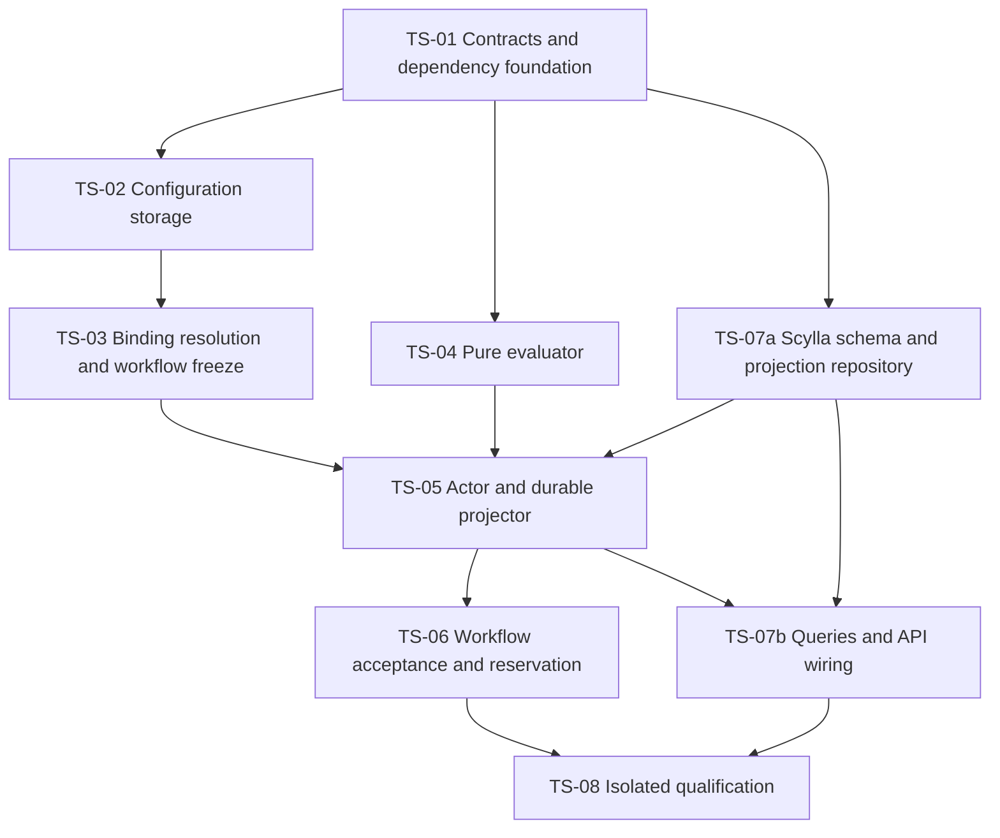

# TradeSelection Implementation Plan v1.0

> **Strategy catalog direction (2026-09-06):** TradeSelection implementation is on hold at the user's request. Reusable strategy definitions, structures, variants and deployments will be owned by PostgreSQL ConfigurationDb; Portfolio owns Fund authorization. The catalog decision supersedes the earlier fixed three-variant scope and selector-only template catalog. Sections below retain the previous baseline where not explicitly updated; their proposed schemas, wire layouts and TS gates must be realigned before implementation. This document update does not resume any gate. See [ConfigurationDb strategy catalog design](../../../../../../TomasAI.IFM.Application.Storage/Docs/ConfigurationDb-Strategy-Catalog-Design-v1.0.md).

| Item | Value |
| --- | --- |
| Version / revised | 1.0 / 2026-09-06 |
| Status | On hold at user request; TS-01 through TS-08 must be realigned with the ConfigurationDb catalog |
| Normative contract | [Detailed specification v1.0](TradeSelection-Specification-v1.0.md) |
| Design | [High-level design, revision 0.7](TradeSelection-High-Level-Design-v0.1.md) |
| Objective | Complete the typed selector and its isolated tests, including durable lifecycle, queries and guarded composition handoff |
| Initial policy | Three explicit engineering profiles; minimum regime and assessment confidence 0.50 |
| Excluded | UI redesign, combined live five-stage qualification, broker/emulator implementation, construction algorithms and financial sizing |

This plan translates the specification into ordered code changes and verifiable gates. Proposed filenames below are implementation targets, not claims that those files exist. Existing components are identified separately. No source code, schema, deployed configuration or running workflow is changed by creating this plan.

## Hold boundary and prerequisites

Do not execute TS-01 through TS-08 from this revision. First specify the reusable catalog schema/lifecycle/capabilities, legacy family/template mapping, Portfolio assignment and risk compatibility, and exact frozen catalog references. Then revise the selector specification, dependency extraction plan, candidate/variant policy, builder contracts and qualification matrix. The previous TS-02 selector-only template table is superseded; all filenames and wire layouts below remain provisional.

The hold is limited to TradeSelection implementation. Existing upstream behavior and prior test evidence remain as recorded. Completing these documentation updates does not automatically resume implementation.

## 1. Completion boundaries

**Document complete for resumption** will mean the catalog-aligned plan specifies the work, dependencies, test ownership and exit evidence; this retained baseline has not yet reached that status. **Selector code complete** requires every TS gate below to pass its applicable builds and tests. **Operationally qualified** additionally requires real published assignments/construction profiles and controlled execution in the target environment. These statuses are independent.

A missing external service may block an integration run, but a skipped test is not a pass. Record the exact blocked check and continue work that does not require that service. Do not mark TS-08 complete or claim operational qualification while required evidence is missing.

Maintain the user's sequence: complete the five pipeline operators first; then exercise them together one at a time; enhance the Strategy observation view afterward. Selector-owned query/telemetry contracts are included now, UI rendering is not.

## 2. Verified baseline and integration risks

| Verified source | Existing behavior | Planned action |
| --- | --- | --- |
| StartTradeSelectionPipelineCommand | Keys 0-13, existing Command route | Append binding/schema without changing old meanings |
| MarketAssessmentSelectionConsumer | Validates supplied mandate/hash and filters supplied candidates | Replace runtime decision with typed single-template evaluation |
| MarketConditionAssessmentContracts.ValidateForSelection | Enforces accepted assessment and restrictions | Reuse, add selector-specific authority/clock/value checks |
| PortfolioFundStrategySnapshot and resolver | Real typed snapshot/hash; strict resolver can return multiple enabled assignments and filters asset type | Add selector-specific resolution; keep existing strict callers intact |
| FundTradeTemplateAssignmentReadModel | Exact family in schema >= 2, long profile versions | Require complete exact references; checked conversion to int parameter version |
| CompleteTradeSelection.Execute | Generic completion immediately chooses OrderComposition after deadline check | Validate typed outcome; persist reservation pending before dispatch |
| Workflow realtime actor | Builds later-stage starts generically and maps view into workflow state | Add explicit selection builder, binding copy and reservation substate branch |
| ConfigurationDb | TradeSelection parameter kind and table exist | Add typed policy operations, immutable template table and lifecycle guards |
| EventSourceActorDbContext / IRequireDurableProjection | Atomic event/initial-projector-state persistence is available | Register selector events and durable handlers; prove recovery behavior |
| StrategyStageResultEnvelope | Default cap 65536 bytes | Apply selector-specific 262144-byte default consistently; retain other stage limits |

The first implementation risk is the project dependency graph. Portfolio.Shared already references Trade.Shared; Reference.Shared also references Trade.Shared. Adding reverse project references from Trade.Shared for typed SelectionBinding would create cycles. Address this in TS-01 before adding the new contracts.

Other explicit risks are Portfolio snapshot JSON hash compatibility, frozen versus continuation revisions, the generic dispatcher's unconditional next-stage behavior, and missing real construction-profile storage/resolution. Each is covered by a gate, not left as a hidden assumption.

## 3. Work order and dependency graph

The specification's TS identifiers are stable deliverable IDs, not a strict numerical build order. Implement storage methods needed by the projector before closing the actor gate.



Recommended coding sequence: TS-01; TS-02; TS-03 and TS-04; TS-07a; TS-05; TS-06; TS-07b; TS-08. Independent activities may overlap, but a gate cannot close until all its dependencies and tests pass.

## 4. Path conventions

All following paths are relative to repository root. Directory aliases in this document are prose shorthand, not new repository directories:

| Alias | Existing root |
| --- | --- |
| TradeShared | TomasAI.IFM.Domain.Trade.Shared |
| Trade | TomasAI.IFM.Domain.Trade |
| Pipeline | TradeShared/Strategy/Workflow/IntrinsicTime/Pipeline |
| Workflow | Trade/Strategy/Workflow/IntrinsicTime |
| Selector | Workflow/TradeSelection |
| PortfolioShared | TomasAI.IFM.Domain.Portfolio.Shared |
| Portfolio | TomasAI.IFM.Domain.Portfolio |
| Storage | TomasAI.IFM.Application.Storage |

Keep new selector DTOs under Pipeline/TradeSelection, policy payloads under Pipeline/Configuration/TradeSelection, and runtime classes under Selector. Use partial storage implementations matching the existing MarketConditionAssessment pattern. Do not create a second actor called TradeSelector or a second strategy catalog.

## 5. TS-01: shared contracts and dependency foundation

**Specification coverage:** sections 2, 4-8, 9.1, 12 and 14.1. **Dependencies:** none. **Owner projects:** shared contracts, Trade.Shared, Portfolio.Shared, Reference.Shared and their contract tests.

### 5.1 TS-01a: remove the prospective assembly cycle

Create `TomasAI.IFM.Domain.Strategy.Contracts.Shared/TomasAI.IFM.Domain.Strategy.Contracts.Shared.csproj`, targeting net10.0 with the repository's existing build conventions. This dependency foundation contains the existing cross-domain DTOs needed by frozen workflow bindings. It references Shared, MarketData.Analytics.Shared and Trade.Primitives.Shared as needed, and SHALL NOT reference Trade.Shared, Portfolio.Shared or Reference.Shared.

Move the following existing DTO source groups into `Portfolio/Contracts`, `Portfolio/ViewModels` and `Reference/ViewModels` folders in that assembly. Preserve original public namespaces and every field/key/validation/hash behavior:

- PortfolioShared/Contracts/PortfolioEnums.cs and PortfolioWorkflowContracts.cs.
- PortfolioShared/ViewModels/PortfolioReadModels.cs, FundAllocationRiskReadModels.cs, PortfolioFinancialPolicyReadModels.cs, FundTradeTemplateAssignmentReadModel.cs and FundCompositionProjectionReadModels.cs.
- Reference.Shared/ViewModels/TradeStrategyFamilyReadModel.cs, including its enum/timeframe helpers.
- The TradeStrategyFamilyReference record from Reference.Shared/ViewModels/TradeStrategyFamilyReference.cs; leave Create/Change/Remove request records in Reference.Shared and reference the moved type.

Move the transitive pure DTO dependencies together; do not copy definitions into two assemblies. Do not move legacy history/query APIs or actor behavior into the foundation. The existing TradeStrategyFamilyType already has a type-forwarding precedent; keep its original primitive owner.

Add project references from Trade.Shared, Portfolio.Shared and Reference.Shared to the foundation. Remove moved source definitions from their old compile sets and add `TypeForwardedTo` entries in the former owner assemblies for each moved public type. Update relevant solution/solution-filter/project inventories only where required by existing build tooling.

**Methods/checks:** no behavioral method changes in this extraction. Capture MessagePack bytes, PortfolioCanonicalHash output and public type inventory before moving; compare after. Validate `DefensiveCopy`, family validation and financial-policy hash helpers unchanged. Check the complete project-reference graph remains acyclic and no duplicate full type names exist. Keep source ownership clearly documented in the new project.

**Exit:** affected shared projects, Portfolio and Trade build; existing serialization/Portfolio/Reference unit tests pass; golden byte/hash vectors are unchanged. Do not replace typed snapshots with loosely typed JSON to evade the dependency problem.

### 5.2 TS-01b: selector types and serialization

Add these planned files:

| Target | Types/responsibility |
| --- | --- |
| Pipeline/TradeSelection/TradeSelectionEnums.cs | Outcome, direction, family/class, structure variant, rule status and Unknown policy enums |
| Pipeline/TradeSelection/TradeSelectionBinding.cs | Binding, construction descriptor and product reference |
| Pipeline/TradeSelection/TradeSelectionTemplateDefinition.cs | Single canonical template ID/version contract |
| Pipeline/TradeSelection/TradeSelectionResult.cs | Typed Selected/NoTrade result and complete DecisionContext |
| Pipeline/TradeSelection/SelectionRuleEvidence.cs | Ordered typed rule evidence and bounded canonical values |
| Pipeline/TradeSelection/TradeSelectionContracts.cs | ValidateBinding, ValidateInvocation, ValidateResult, ReadResult and outcome invariants |
| Pipeline/TradeSelection/TradeSelectionPayload.cs | Binding/template hashes, bounded serializers and canonical evidence values |
| Pipeline/Configuration/TradeSelection/TradeSelectionParameterSet.cs | All 33 specification fields with explicit validation |
| Pipeline/Configuration/TradeSelection/TradeSelectionParameterPayload.cs | Complete-field JSON parser, canonical serializer and SHA-256 |
| Pipeline/Configuration/TradeSelection/TradeSelectionDefaultProfiles.cs | Complete Daily/Weekly/Monthly draft factories, with supplied durable IDs |
| TradeShared/.../Model/WorkflowCompositionHandoffState.cs | Pending reservation state from specification 14.1 |

Append Start command keys 14/15; append SelectionBinding at view key 27 and state key 23, then CompositionHandoff at view key 28 and state key 24. Recheck current key inventory before implementing. Existing missing schema must remain 0/invalid; do not use a constructor default that silently accepts old starts.

Implement JSON presence tracking, duplicate-property rejection, numeric enum validation and explicit required fields. A record initializer is not evidence that a field was supplied. Use G29 decimals, sorted new set-valued arrays and stable property order. Existing Portfolio hashing and upstream envelope bytes remain under their original serializers.

**Tests:** new TradeSelectionContractTests, TradeSelectionParameterTests and TradeSelectionSerializationTests under Domain.Trade.UnitTests/Strategy/Workflow/IntrinsicTime/TradeSelection. Cover every field omission, 0.50 boundaries, enum sets, old keys, hashes, NoTrade sentinels, positive IDs and checked profile-version conversion. Add baseline vectors for the moved shared types in Portfolio/Reference tests.

**Exit:** complete schemas/default factories are testable without storage; all 24 fixture definitions can be expressed without unspecified fields. No template/profile/database rows are fabricated by deserialization.

## 6. TS-02: ConfigurationDb policy and template lifecycle (on hold; storage proposal superseded)

**Specification coverage:** sections 5.3, 7-9 and 16. **Dependencies:** TS-01.

| Existing/planned target | Action |
| --- | --- |
| Storage/ConfigurationDb/IConfigurationDbContext.cs | Add typed policy/template APIs; partial companion allowed |
| ConfigurationDbContext.TradeSelection.cs (new) | Implement exact-version reads, draft insert and published resolution |
| TradeSelectionConfigurationSql.cs (new) | Parameterized policy/template SQL and lifecycle operations |
| ConfigurationParameterSet.cs | Add resolved selector return types; reuse TradeSelection kind |
| Schema/TradeSelectionSchemaSql.cs (new) | Template DDL and selector lifecycle guards |
| Schema/ConfigurationSchemaDb.cs | Register additive schema objects and migrations |

Implement `InsertTradeSelectionDraftAsync`, `GetTradeSelectionVersionAsync`, `ResolveTradeSelectionVersionAsync`; add equivalent explicit template methods `InsertTradeSelectionTemplateDraftAsync`, `GetTradeSelectionTemplateVersionAsync`, `ResolveTradeSelectionTemplateVersionAsync`, `PublishTradeSelectionTemplateAsync` and `RetireTradeSelectionTemplateAsync`. Reuse existing PublishAsync/RetireAsync for parameter kind TradeSelection after enforcing selector validation.

Parameter IDs/versions come from Fund assignments, not a latest-horizon query. Template versions are long; policy versions are int. Keep separate typed SQL parameters and checked conversions. Recompute hashes on reads. Validate profile root/horizon/variant at resolution, while retaining effective/publication evidence for the binding.

Create the specification's template table and guards on existing parameter rows without dropping tables, resetting profiles or rewriting historical payloads. Draft inserts are idempotent only for identical persisted identity/content; conflicting reuse fails. Publish/retire transitions affect exactly one eligible row. Prohibit modification of published content through all write paths, including generic ConfigurationDb operations.

Add an explicit authoring service/factory that emits three complete drafts and an identity manifest. It accepts actual catalog/template/construction references and stores generated IDs once. It is not an API-startup job and does not auto-publish or enable workflows.

**Tests:** TradeSelectionConfigurationIntegrationTests in Application.Storage.IntegrationTests. Use actual isolated PostgreSQL schema; test migration repeatability, draft/publish/retire, exact version lookup, wrong hashes, missing/unknown fields, duplicate inserts and immutable published content. Test all factory defaults through the same validation used by storage.

**Exit:** real storage round trips preserve canonical payload/hash and status; no execution can resolve Draft or an unassigned latest version.

## 7. TS-03: selection binding resolution and workflow freeze

**Specification coverage:** sections 5-6 and 11. **Dependencies:** TS-01, TS-02.

Modify Portfolio/Workflow/PortfolioFundStrategyResolver.cs and Query/PortfolioQueryService.cs. Add a clearly named `ResolveForSelection` path and corresponding query request/verb in PortfolioShared/Queries/PortfolioQueries.cs, service API in PortfolioShared/ServiceApi/PortfolioServiceApis.cs, query actor dispatch in Portfolio/Query/Actor/PortfolioQueryActor.cs and client in Application.Api.Nats.Client/PortfolioQueryApi.cs.

Keep the original strict resolver unchanged for its callers. The selection path counts exactly one effective assignment before Enabled filtering, preserves known deny states and distinguishes malformed/missing authority from ordinary permission denial. Resolve product class from the chosen Fund/assignment, never by blindly passing Futures from the ITI trigger. Validate exact family/product/root relationships through Reference/MarketData catalog APIs.

Add Selector/Model/TradeSelectionBindingResolver.cs with `ResolveAsync` and a narrow `ISelectionConstructionProfileResolver`. Compose the Portfolio snapshot, exact family row, published template, typed selection parameters and real construction descriptor. The production descriptor resolver must read an authoritative exact-version construction profile; no dummy descriptor fallback. If that source is not implemented yet, implement the narrow contract/adapter with an explicit unavailable result and use immutable fixtures only in isolated tests. Record this as an operational dependency, not silently active configuration.

Modify these workflow integration points:

- Realtime/Actor/IntrinsicTimeStrategyWorkflowRealtimeActor.cs: resolve binding before accepted start and freeze it with the existing upstream bindings; add a selector-specific partial file for clarity.
- TradeShared/.../Commands/ExecuteIntrinsicTimeStrategyWorkflowCommand.cs: carry the resolved binding in the initial command, appending keys after inspecting its schema.
- Command/ExecuteIntrinsicTimeStrategyWorkflow.cs and Command/Actor/IntrinsicTimeStrategyWorkflowCommandActor.cs: validate/persist binding with start acceptance.
- Realtime view-to-state mapping and every state clone/serialization path: preserve binding/hash; do not change the frozen Portfolio revision to the current stage revision.
- Selector-specific start construction: set schema 1 and binding, use current injected time for expiry checks, and calculate the actual selector deadline as the specification requires. Do not rely solely on `view.UpdatedAtUtc` as the current clock.

Persist the explicit UTC.TriggerCreatedDate.Test.v1 date convention and RequestedTradeDate in the binding. No receipt-time fallback, option expiry guess or calendar call inside pure evaluation.

**Tests:** PortfolioFundSelectionResolverTests and TradeSelectionBindingTests plus real Portfolio query integration. Prove disabled/blocked states remain explainable, absent/ambiguous configuration fails, a Weekly/Monthly options assignment resolves from a futures trigger, and every workflow mapping preserves hash and original frozen revision. Verify upstream regime/assessment parameters remain unchanged when Fund/family assignments differ.

**Exit:** a valid new workflow carries one complete immutable binding through selection dispatch; missing construction authority fails clearly and cannot become a fixture-backed live start.

## 8. TS-04: deterministic evaluator

**Specification coverage:** sections 7-8, 10-12, 17-18. **Dependencies:** TS-01; fixtures can be developed before storage is available.

Add Selector/Model/TradeSelectionEvaluator.cs with `Evaluate(ValidatedTradeSelectionInput input, DateTime evaluatedAtUtc)`. Add TradeSelectionDirectionMapper.cs, TradeSelectionReasonCodes.cs and TradeSelectionSummaryBuilder.cs. `ValidatedTradeSelectionInput` is a private immutable computation input assembled only after shared contract validation; it is not a second public binding schema.

Implement the fixed R01-R24 order, all applicable evidence, first rejection as primary reason and exact direction normalization. Keep classifications as sets; do not compare enum ordinals. Use unrounded decimal comparisons. SelectionConfidence is min of accepted confidences, rounded only for the specified result field; CompatibilityScore stays null.

Map legitimate unknown evidence, ordinary incompatibility and technical failure separately. NoNewTrade remains an entry prohibition. NoTrade retains full context but no selected-only family/template/product/profile/direction fields. The evaluator has no actor, storage, network, LLM, clock or mutable cache dependency; time is an explicit argument.

Retire MarketAssessmentSelectionConsumer from runtime selection. Delete it only after checking references, or retain a private reusable predicate if useful; do not adapt its candidate array into a claimed complete result or keep a legacy alternate path.

**Tests:** TradeSelectionEvaluatorTests and TradeSelectionBehaviorScenarios in existing UnitTests/BDDTests projects. Implement all TS-F01-TS-F24 fixtures, ordinal rule ordering, multiple rejection evidence, invariant summaries, immutability and UTC expiry bounds. Fixtures use genuine serialized accepted envelopes and update every hash/context relationship when a baseline changes.

**Exit:** all fixtures pass deterministically with fixed input/time; forbidden external calls are impossible through evaluator dependencies. Numerical defaults are recorded as test configuration, not hard-coded hidden thresholds.

## 9. TS-07a: Scylla schema and projection repository

**Specification coverage:** section 15. **Dependencies:** TS-01. This storage portion must precede TS-05 completion; TS-07b closes the rest of TS-07 later.

Add TradeSelectionSchemaCql.cs under Storage/TradeDb/Schema and register it in TradeSchemaDb.cs. Create `trade_selection_invocation_event` and `trade_selection_history_by_fund_date` exactly as specified, using the configured TradeDb keyspace and no implicit TTL. Do not alter unrelated execution tables.

Add Storage/TradeDb/TradeDbContext.TradeSelection.cs and typed interface methods, preferably in a partial ITradeDbContext companion:

- `AppendTradeSelectionInvocationEventAsync`: write the immutable source-sequence row.
- `UpsertTradeSelectionTerminalHistoryAsync`: write terminal history with original event date/time and IDs.
- `GetTradeSelectionInvocationAsync`: latest source-sequence row for exact workflow/invocation.
- `GetTradeSelectionResultAsync`: exact result ID validation within that invocation.
- `GetTradeSelectionHistoryPageAsync`: bounded Fund/UTC-date partition query.

Use prepared statements and explicit CQL parameters. Reject same event identity with conflicting hash; retries use original keys and timestamps. Processing must not overwrite terminal status because current status derives from persisted sequence order, not arrival order. Keep full authoritative event/result bytes bounded; null unavailable metadata on rejected input is valid, inventing Fund identity is not.

**Tests:** TradeSelectionProjectionStorageIntegrationTests in Application.Storage.IntegrationTests. Run actual Scylla fixture tables. Prove schema creation is repeatable, both access patterns work, retries do not duplicate history, late Processing cannot regress status, exact result mismatch does not return latest, and UTC history dates remain stable across retries.

**Exit:** the projector can call real tested storage methods before TS-05 is accepted; no ALLOW FILTERING, unbounded date scans or display-only substitutes for result bytes.

## 10. TS-05: persistent command actor and durable projection

**Specification coverage:** sections 10-13 and 16. **Dependencies:** TS-01, TS-03, TS-04 and TS-07a.

Add the following under Selector:

| Path | Responsibility / key methods |
| --- | --- |
| Command/Actor/TradeSelectionPipelineCommandActor.cs | Parse Start, validate routable input, execute one logical invocation |
| Command/Actor/TradeSelectionPipelineCommandContext.cs | Existing CommandActorContext pattern; injected services, TimeProvider and repository/projector |
| Command/State/TradeSelectionCommandState.cs | Accepted immutable input, IDs, revision, business hash, deadline and terminal state |
| Command/State/TradeSelectionStateRepository.cs | Load invocation state and append with expected stream version |
| Command/ExecuteTradeSelection.cs | Acceptance, Evaluate, result assembly and current-time commit checks |
| Command/Events/TradeSelectionInvocationAccepted.cs | Persisted private acceptance record; stable evaluation time and allocated event/result IDs |
| Command/EventProjector/TradeSelectionEventProjector.cs | Durable immutable projection before terminal delivery |
| Realtime/Actor/TradeSelectionPipelineRealtimeActor.cs | Existing pipeline Realtime address, committed-event forwarding and correlation |
| Realtime/Actor/TradeSelectionPipelineRealtimeContext.cs | Runtime dependencies and mailbox mapping |
| TradeSelectionTelemetry.cs | Bounded metric labels, traces and structured diagnostics |

Follow BaseEventSourceCommandActor and the established DownloadLog durable projector pattern, not the completed-only MarketCondition Function actor lifecycle. Register only committed selector events and preserve existing shared Processing/Completed/Failed event IDs, keys and route names. Do not publish projection success as a second business Completed result or convert projection failure into a new business Failed outcome.

Opt lifecycle events into `IRequireDurableProjection`. Implement its actual `RequiredProjection` property with stable actor/projector names and the correct initial EventProjector stage; it is not an empty marker. Reuse EventSourceActorDbContext's same-transaction initial projection-state insert. The accepted private state must be sufficient for recovery without querying a latest Fund or parameter version.

At acceptance allocate IDs once and persist them together with the immutable input and evaluation timestamp. Preserve InvocationId=CommandId. On duplicate business hash return/resume the persisted invocation. Changed payload under the same identity is a conflict without replacing the original result. Optimistic concurrency reloads the winner; no losing callback publishes an event.

Apply projection idempotently to Scylla, then publish the same logical lifecycle event through existing pipeline routing. Durable outbox/replay owns transport retries. A committed terminal result is not recalculated because Scylla, publication or command acknowledgement failed. Resume an uncommitted calculation only from saved inputs while its deadline is still current.

Inspect existing BaseEventProjector event transformations before wiring the descriptor. If standard completion/failure projection wrappers differ from pipeline business events, implement an explicit forwarding adapter carrying original event ID/hash; do not pass a generic projection acknowledgement to CompleteTradeSelection.

**Tests:** TradeSelectionActorTests, TradeSelectionLifecycleIntegrationTests and TradeSelectionDurableProjectionTests. Exercise actual event-source transaction, failure before enqueue, recovery on restart, projection outage, publish failure, crash after publish before acknowledgement, duplicate and conflicting commands, deadline races and optimistic append conflicts. Verify event/projector names resolve in the actual actor container.

**Exit:** one logical terminal event per accepted invocation; no best-effort-only publication window; failures remain pending recoverable projection work rather than a second decision. TS-07a real storage tests must already pass.

## 11. TS-06: typed workflow acceptance and reservation handoff

**Specification coverage:** sections 11-14. **Dependencies:** TS-03, TS-04, TS-05.

Modify Workflow/Command/CompleteTradeSelection.cs and its command-actor validators to deserialize the typed envelope with the selector byte limit, validate lineage/binding and recompute deterministic decision fields at saved EvaluatedAtUtc. Current-time checks remain separate. NoTrade stops normally without reserving an OrderId. Invalid/expired outcomes cannot dispatch a builder.

Add Workflow/Command/RecordTradeSelectionReservation.cs and FailTradeSelectionReservation.cs, with corresponding shared workflow commands appended to parser/validation maps. New callback commands contain workflow/entity, expected current revision, accepted selection result ID/hash, reservation request hash and typed response or safe failure. Use existing command metadata conventions and explicit keyed schemas; a callback cannot rewrite the accepted selection or frozen snapshot.

Accepting Selected persists CompositionHandoff=ReservationPending and advances once, keeping CurrentStage=TradeSelection. Save the complete reservation request and durable intent in the same workflow snapshot transition. Modify Workflow/Realtime/Actor/IntrinsicTimeStrategyWorkflowRealtimeActor.cs or a focused CompositionHandoff partial to branch on this state before generic stage dispatch. Do not invoke selection again merely because CurrentStage still says TradeSelection.

Map the existing ReserveFundOrderCompositionRequest exactly as specification 14.2. Critical fields:

- Request.WorkflowRevision is the original PortfolioSnapshot.WorkflowRevision.
- AcceptedSelectionRevision in handoff state is the current continuation revision.
- IdempotencyKey is accepted selection ResultId; replay never changes request timestamps/hash.
- Exactly one Primary TradeInstruction reserves one OrderId/TradeId for the strategy intent, not one per leg.
- Preserve original snapshot hash casing and selected template/profile references.

Use existing Portfolio command APIs and composition service. A transport timeout with unknown outcome triggers exact-request recovery/query, never a new idempotency key. Persist the committed response before dispatching OrderComposition. Reject callback identity/revision mismatch, duplicates and late responses. Expiry/stop during pending reservation must reconcile any committed FundOrder to Expired/Cancelled using the Portfolio boundary; IDs are retained.

Extend StartOrderCompositionPipelineCommand with versioned typed selected result/context and Fund reservation fields after inspecting its current keys. Create an explicit construction-start builder rather than relying on reflection to silently ignore new mandatory fields. Preserve selected result bytes/hash and family/template/direction/horizon through dispatch. OrderComposition algorithm implementation remains outside this gate.

Modify workflow projector/realtime delivery as necessary so a crash after snapshot acceptance but before dispatch cannot lose the reservation or construction-start intent. Persisted handoff state must be recoverable even if realtime notification is lost. Existing cancellation/timeout handlers must recognize ReservationPending and prevent a late successful callback from reopening a terminal workflow.

**Tests:** TradeSelectionWorkflowContinuationTests, TradeSelectionReservationIntegrationTests and existing pipeline message/boundary tests. Include real Portfolio reservation idempotence, differing frozen/current revisions, crash before and after reservation commit, lost response, late response after expiry, exactly one logical builder dispatch, typed NoTrade stop and preservation of accepted context bytes.

**Exit:** no generic Completed bypass remains; only valid Selected plus committed current reservation reaches the construction boundary. Tests may capture the outgoing construction command with a probe; a probe is not a completed OrderComposition actor.

## 12. TS-07b: query actors, clients and runtime wiring

**Specification coverage:** sections 15-16. **Dependencies:** TS-01, TS-07a, TS-05.

Add Pipeline/TradeSelection/Queries/TradeSelectionQueries.cs and ReadModels/TradeSelectionReadModels.cs for the three specified queries and bounded results; add a selector query API interface under TradeShared/.../ServiceApi. Add Selector/Query/Actor/TradeSelectionQueryActor.cs and TradeSelectionQueryContext.cs with repository-backed handlers. Query projection state does not imply workflow acceptance or risk approval.

Add Application.Api.Nats.Client/TradeSelectionQueryApi.cs following the existing MarketConditionAssessmentQueryApi convention. Update Application.Api.Server/QueryMaps.cs and Startup.cs query API registrations, and test-host registrations in the corresponding integration fixtures. No HTTP endpoint is required unless the existing query facade needs one for this API; do not create a parallel transport unnecessarily.

Page size defaults to 50, range 1-200. Bind paging state to Portfolio, Fund, UTC date, schema and page size. Reject wrong scope/identity rather than returning another Fund's row. Enforce existing service authorization at the query boundary; do not trust caller-supplied PortfolioId alone.

Verify registration in the actual container/actor scanning path: Command, Realtime, Query, contexts, state repository, typed configuration resolver, event projector and API client. Existing Startup.RegisterGenericTypes and actor registry use discovery; do not assume that naming a class registers it. Add only registrations the discovery mechanism does not supply, and resolve all required services in a bootstrap test. Test API Server registration and representative integration-test host registration independently.

Apply per-selector payload limits across actor request serialization, result envelope validation, query response hydration and workflow dispatch. Retain unrelated stages' size limits. Larger new context payloads must not fail only after a terminal event has committed.

**Tests:** TradeSelectionQueryIntegrationTests and TradeSelectionBootstrapTests, using real Scylla/NATS where applicable. Cover NotFound, history order, paging, scope rejection, blocked authorization, corrupt payload/hash, latest source-sequence selection and container resolution.

**Exit:** TS-07a and TS-07b are both green; actual query transport returns the committed typed result without authority-changing reconstruction. No UI changes are included.

## 13. TS-08: isolated qualification and regression evidence

**Specification coverage:** sections 17-20. **Dependencies:** all earlier gates.

Create shared captured input fixtures with consistent accepted regime/assessment envelopes, full binding and all hashes. Reference fixture codes TS-F01 through TS-F24 in test names or theory data. Run all three horizon mappings, both directions, exact numerical boundaries and the complete ordinary/technical failure distinction.

| Existing project | Planned selector test ownership |
| --- | --- |
| TomasAI.IFM.Domain.Trade.UnitTests | Contracts, serializers, defaults, evaluator, actor transitions and workflow acceptance |
| TomasAI.IFM.Domain.Trade.BDDTests | Business selection scenarios, permission denial, NoTrade and unchanged context |
| TomasAI.IFM.Application.Storage.IntegrationTests | PostgreSQL policy/template lifecycle and Scylla schema/query persistence |
| TomasAI.IFM.Domain.Portfolio.UnitTests | Selector-specific resolver and legacy caller isolation |
| TomasAI.IFM.Domain.Portfolio.IntegrationTests | Real snapshot/query and composition reservation/recovery |
| TomasAI.IFM.Domain.Reference.UnitTests | Moved family contract compatibility and exact identity validation |
| TomasAI.IFM.Domain.Trade.IntegratedTests | Actor/event-source/projector/NATS workflow and query boundary behavior |
| TomasAI.IFM.Domain.Trade.VerificationTests | Source-to-handoff fixture verification and captured real transport evidence |

Use test-owned PostgreSQL schema, Scylla tables/keyspace and NATS subjects with run-specific prefixes. Do not restore, stop or clean unrelated services. Cleanup only verified test-owned resources and preserve logs/results for failures. Provider/broker accounts and live business signals are unnecessary for these selector tests.

### 13.1 Required crash/failure matrix

| Injection point | Required invariant |
| --- | --- |
| Before acceptance commit | No accepted invocation or orphan publication marker |
| After acceptance before evaluation | Recover exact saved input/time/IDs, or expire once |
| After terminal append before enqueue | Atomic projector marker makes committed event discoverable |
| Scylla projection failure | Pending durable work, no recalculation or terminal replacement |
| Projection succeeds, publication fails | Same event/hash retried, history remains idempotent |
| Publication succeeds, acknowledgement lost | Duplicate delivery accepted at most once by workflow |
| Reservation commits, response lost | Same idempotency key returns original IDs |
| Workflow stops before reservation callback | No builder; committed reservation reconciled without ID reuse |
| Accepted reservation before builder notification | Recover one logical construction-start intent |

### 13.2 Execution commands and evidence

Commands below are to run during implementation after the relevant tests exist; they were not executed while authoring this plan. Use current repository SDK/restore conventions. Do not use a test filter that accidentally reports zero matched tests as success.

```powershell
dotnet build TomasAI.IFM.Application.Api.Server/TomasAI.IFM.Application.Api.Server.csproj
dotnet test TomasAI.IFM.Domain.Trade.UnitTests/TomasAI.IFM.Domain.Trade.UnitTests.csproj --logger trx
dotnet test TomasAI.IFM.Domain.Trade.BDDTests/TomasAI.IFM.Domain.Trade.BDDTests.csproj --logger trx
dotnet test TomasAI.IFM.Domain.Portfolio.UnitTests/TomasAI.IFM.Domain.Portfolio.UnitTests.csproj --logger trx
dotnet test TomasAI.IFM.Domain.Reference.UnitTests/TomasAI.IFM.Domain.Reference.UnitTests.csproj --logger trx
```

Run selector-scoped cases in Storage.IntegrationTests, Portfolio.IntegrationTests, Trade.IntegratedTests and Trade.VerificationTests using explicit category/fully-qualified filters added with the tests; record exact commands and assert expected nonzero discovery counts. Use their existing isolated fixtures instead of assuming an arbitrary environment variable provisions the services. Broaden regression tests when shared-contract extraction or changed behavior warrants it.

Add `TradeSelection-Implementation-Evidence-v1.0.md` only when evidence is collected. For each gate record source revision/working-tree baseline, date, SDK, exact test command/filter, passed/failed/skipped count, fixture IDs, infrastructure isolation, artifact paths and unresolved issues. A source review or passing mock-only test must not be recorded as database/NATS recovery verification.

**Exit:** all required applicable tests pass with reproducible artifacts. No hidden skips, empty filters, live-profile assumptions or probes represented as implemented downstream actors.

## 14. Schema rollout, deployment and recovery

Use additive migrations first: contract-foundation assembly packaging; parameter/template schema and guards; selector Scylla tables; then compatible runtime binaries and registrations. Check schema idempotence against an empty isolated database and one containing existing parameter/market-condition rows. Do not delete or reload reference definitions to install TradeSelection.

Keep old serialized keys for historical reads. New selector starts require schema 1 and a complete binding. Old unbound inflight workflows reaching the new selection boundary fail explicitly; they do not receive synthesized defaults or switch to the candidate helper. Record the behavior in release notes and pause new starts during a controlled rollout if operationally needed.

After code qualification, author real versioned parameters, templates and exact Fund assignments, resolve a real construction descriptor and publish deliberately. Initial authoring creates the three approved test profiles but does not calibrate them or enable automatic execution. Reusing existing provider downloads and upstream bindings does not publish missing downstream configuration.

If deployment needs to be paused or rolled back, disable new workflow starts and preserve committed actor/outbox state. Do not drop new tables or reuse reserved business IDs. A binary rollback must retain ability to read newly persisted types/keys; otherwise hold deployment paused while deploying a compatible forward fix. Drain/recover committed publication work with compatible code.

Operational qualification proceeds separately: published dependencies -> controlled selector invocation -> captured reservation and OrderComposition boundary -> later combined five-operator tests. Actual construction, RiskManagement implementation, emulator and UI remain their own work items.

## 15. Gate status and specification traceability

| Gate | Specification sections | Required predecessor | Initial status |
| --- | --- | --- | --- |
| TS-01 | 2, 4-8, 9.1, 12, 14.1 | None | On hold |
| TS-02 | 5.3, 7-9, 16 | TS-01 | On hold |
| TS-03 | 5-6, 11 | TS-01, TS-02 | On hold |
| TS-04 | 7-8, 10-12, 17-18 | TS-01 | On hold |
| TS-05 | 10-13, 16 | TS-01, TS-03, TS-04, TS-07a | On hold |
| TS-06 | 11-14 | TS-03, TS-04, TS-05 | On hold |
| TS-07 | 15-16 | TS-01; TS-05 for query/bootstrap closure | On hold |
| TS-08 | 17-20 | TS-01 through TS-07 | On hold |

For every gate, update status only from actual implementation/test evidence. TS-07a may be complete while TS-07 remains open for its query/registration work. The dependency-foundation extraction is part of TS-01, not a claim that the specification's business contracts changed.

Before marking selector code complete verify: no project-reference cycle; immutable typed inputs survive persistence and dispatch; all three parameter defaults are explicit; only one effective template is considered; no permission/expiry bypass exists; Selected/NoTrade are typed; durable terminal delivery survives restart; reservation gates construction; required integration tests pass. Profile publication and combined live qualification remain clearly identified as separate operational steps.

## 16. Source map for implementation

The following existing files were inspected to anchor this plan. New targets above intentionally have no links until they exist.

- [Workflow realtime dispatch and state mapping](../../Realtime/Actor/IntrinsicTimeStrategyWorkflowRealtimeActor.cs), [command actor](../../Command/Actor/IntrinsicTimeStrategyWorkflowCommandActor.cs), [current completion handler](../../Command/CompleteTradeSelection.cs).
- [Start selection contract](../../../../../../TomasAI.IFM.Domain.Trade.Shared/Strategy/Workflow/IntrinsicTime/Pipeline/Commands/StartTradeSelectionPipelineCommand.cs), [workflow state](../../../../../../TomasAI.IFM.Domain.Trade.Shared/Strategy/Workflow/IntrinsicTime/Model/IntrinsicTimeStrategyWorkflowState.cs), [workflow view](../../../../../../TomasAI.IFM.Domain.Trade.Shared/Strategy/Workflow/IntrinsicTime/Model/IntrinsicTimeStrategyWorkflowView.cs), [pipeline routes](../../../../../../TomasAI.IFM.Domain.Trade.Shared/Strategy/Workflow/IntrinsicTime/Routing/IntrinsicTimeStrategyPipelineRoutes.cs).
- [Portfolio snapshot/reservation contracts](../../../../../../TomasAI.IFM.Domain.Portfolio.Shared/Contracts/PortfolioWorkflowContracts.cs), [resolver](../../../../../../TomasAI.IFM.Domain.Portfolio/Workflow/PortfolioFundStrategyResolver.cs), [query service](../../../../../../TomasAI.IFM.Domain.Portfolio/Query/PortfolioQueryService.cs), [composition service](../../../../../../TomasAI.IFM.Domain.Portfolio/Workflow/PortfolioFundCompositionService.cs).
- [Trade.Shared project references](../../../../../../TomasAI.IFM.Domain.Trade.Shared/TomasAI.IFM.Domain.Trade.Shared.csproj), [Portfolio.Shared references](../../../../../../TomasAI.IFM.Domain.Portfolio.Shared/TomasAI.IFM.Domain.Portfolio.Shared.csproj), [Reference.Shared references](../../../../../../TomasAI.IFM.Domain.Reference.Shared/TomasAI.IFM.Domain.Reference.Shared.csproj), [existing type-forwarder example](../../../../../../TomasAI.IFM.Domain.Reference.Shared/TradeStrategyFamilyTypeForwarder.cs).
- [ConfigurationDb interface](../../../../../../TomasAI.IFM.Application.Storage/ConfigurationDb/IConfigurationDbContext.cs), [schema initialization](../../../../../../TomasAI.IFM.Application.Storage/ConfigurationDb/Schema/ConfigurationSchemaDb.cs), [TradeDb context](../../../../../../TomasAI.IFM.Application.Storage/TradeDb/TradeDbContext.cs), [TradeDb schema registration](../../../../../../TomasAI.IFM.Application.Storage/TradeDb/Schema/TradeSchemaDb.cs).
- [DownloadLog command context](../../../../../../TomasAI.IFM.Domain.MarketData/DownloadLog/Command/Actor/DownloadLogCommandContext.cs), [durable projector example](../../../../../../TomasAI.IFM.Domain.MarketData/DownloadLog/Command/EventProjector/DownloadLogEventProjector.cs), [required-projection contract](../../../../../../TomasAI.IFM.Shared/EventSourcing/IRequireDurableProjection.cs), [transactional event-source storage](../../../../../../TomasAI.IFM.Application.Storage/EventSourceDb/EventSourceActorDbContext.cs).
- [API startup/container registration](../../../../../../TomasAI.IFM.Application.Api.Server/Startup.cs), [query maps](../../../../../../TomasAI.IFM.Application.Api.Server/QueryMaps.cs), [existing assessment NATS client](../../../../../../TomasAI.IFM.Application.Api.Nats.Client/MarketConditionAssessmentQueryApi.cs).

Document verification checks links/anchors, gate coverage, proposed versus existing targets and dependency ordering. It does not execute the future tests or mark any implementation gate complete.
