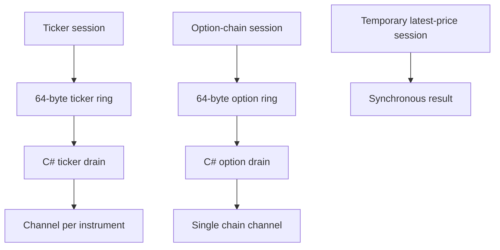
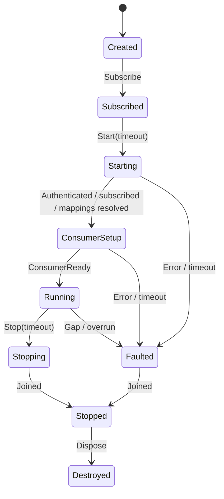

# Databento Native Market-Data Services Design Specification

**Version:** 1.1

**Status:** Implementation-ready specification

**Date:** 2026-08-01

**Managed target:** .NET 10 (`net10.0`), x64

**Native target:** C++20, CMake 3.24 or later, x64

**Platforms:** Windows 11 and Linux/WSL2

**Databento C++ dependency:** exact tag `v0.62.1`

## 1. Purpose

This document specifies three synchronous C# and native C++ Databento services:

1. `DatabentoTickerFeed` — one long-lived Databento session for a caller-supplied array of tickers.
2. `DatabentoOptionChainFeed` — one long-lived Databento session for selected calls and puts belonging to one underlying and one exact maturity.
3. `DatabentoLatestPriceClient` — one synchronous function that opens a temporary session, waits for a price selected by policy or times out, and always closes the session before returning.

It also specifies a synchronous `GetChainDefinitions` operation that discovers all outright call and put definitions for one underlying and maturity. That operation should normally run before the long-lived option-chain feed starts.

The two long-lived feeds use:

- one native Databento producer thread each;
- one user-sized native-memory SPSC ring each;
- one portable native wait signal each;
- one dedicated synchronous C# drain thread each;
- fixed, blittable, C#-compatible records of exactly 64 bytes;
- no asynchronous managed/native calls, reverse P/Invoke callbacks, or hot-path allocations.

The ticker feed publishes to one bounded managed channel per actual instrument. The option-chain feed publishes all selected option records to one bounded managed channel because the chain has one underlying and one maturity. The one-shot latest-price operation uses no ring or channel.

## 2. Binding decisions

The implementation shall follow these decisions:

1. The minimum and only required managed target is `.NET 10`.
2. All public managed methods and all C ABI functions are synchronous.
3. Every potentially blocking public method accepts a timeout parameter.
4. C# chooses the timeout. Native code enforces the same absolute deadline using Databento/OS blocking timeouts where available.
5. The native producer uses `databento::LiveBlocking`, not `LiveThreaded`, so the component owns and pins the actual producer thread.
6. Quote, trade, and MBO order-update records are separate, C#-compatible readonly structures of exactly 64 bytes.
7. The native ring stores one 64-byte canonical market-data record per slot. It does not expose raw DBN records or C++ SDK objects to C#.
8. Feed depth is selected with method/configuration parameters:
   - MBP-1 top-of-book quotes;
   - trades;
   - MBO order updates for full-depth reconstruction;
   - any supported combination within one Databento session.
9. V1 maps `MarketDataKinds.Quote` exclusively to Databento `mbp-1`. TBBO and sampled BBO schemas are outside the V1 public configuration and may be added later as separately named data kinds if required.
10. Latest-price policy is selected with a parameter: last trade, quote midpoint, bid, or ask. Quote midpoint, bid, and ask use `mbp-1`.
11. Ticker feed, option-chain feed, and latest-price query own independent Databento live sessions.
12. V1 uses one ticker-feed session, one option-chain session, and at most one temporary latest-price session per dataset.
13. Chain-definition discovery normally completes before the option-chain feed is opened, so steady-state CME usage remains two long-lived sessions plus an optional temporary latest-price session.
14. An option-chain request contains one underlying, one exact maturity, a caller-selected strike list, and a caller-selected right policy. The default right policy is both calls and puts.
15. Option-chain market-data kinds are parameterized in the same way as the ticker feed.
16. Trading-critical managed channels default to full backpressure and never overwrite or drop. Sustained pressure that exhausts the native ring faults the stream and requires recovery.
17. Databento remains the primary market-data provider. IBKR remains the broker/execution/account authority and is outside this component.
18. NATS, JetStream, ScyllaDB, PostgreSQL, Redis, OpenTelemetry exporters, files, UI dispatch, order books, price-change detection, Intrinsic Time, indicators, regimes, strategies, risk, and execution are outside the native producer and managed drain hot paths.
19. Native ring memory locking is enabled by default; production requires verified locks, while development may continue only with explicit degraded health when locking is unavailable.
20. A managed drain pass processes at most 8,192 records in 512-record native reads, then publishes every partial batch and rechecks lifecycle state before continuing.
21. An empty running feed waits indefinitely on its native signal; only data publication, stop, or fault wakes it, and normal operation never polls with periodic timeout slices.
22. The host uses Server GC with background collection and a process-wide feed coordinator selects `SustainedLowLatency` while at least one long-lived feed is running; this component never enters a no-GC region.
23. NUMA placement defaults to automatic same-node locality for each producer/drain pair and its native buffers; single-node systems require no NUMA-specific operation.
24. Paper-trading and production hosts reserve one logical P-core per long-lived producer/drain thread and exclude those processors from ordinary process workers; development defaults to pinning without strict worker isolation.
25. V1 uses normal OS base pages and explicitly opts native feed mappings out of Windows large pages and Linux transparent huge pages.
26. All deadlines use high-resolution monotonic clocks; Databento event/receive timestamps remain unchanged and local monotonic ingress time is metrics-only.
27. The actor default for `Stop` is five seconds and the host shutdown allowance is thirty seconds; an incomplete final drain never forces memory reclamation.
28. Live sessions request five-second heartbeats and the pinned C++ client reports a hung connection after ten seconds without any record or heartbeat; transport health never infers instrument staleness solely from an unchanged market.
29. Recovery is visible and actor-controlled, uses schema-appropriate replay/snapshot rebuilding, and never restores trading readiness before continuity is proven.
30. Cold-path health snapshots are polled every second and aggregated metrics are exported every five seconds.
31. Local pipeline qualification uses explicit p50/p99/p99.9 latency gates in addition to the existing throughput and loss requirements.
32. Development, paper-trading, production, and synthetic-CI profiles define the strictness of every platform feature without changing record or recovery semantics.

## 3. Databento limits and terminology

Databento distinguishes a **dataset**, a **session/connection**, and a **subscription request**:

- A dataset is a data source such as CME Globex MDP 3.0: `GLBX.MDP3`.
- One `LiveBlocking` client instance owns one live session and is associated with one dataset.
- One session may contain multiple subscription requests for different schemas and symbol arrays in the same dataset.

As of this specification:

- Standard plans allow **10 simultaneous live sessions per dataset per team**.
- Plus and Unlimited plans allow **50 simultaneous live sessions per dataset per team**.
- Additional API keys do not increase the team limit.
- A gateway accepts at most five new connections per second from the same IP address.
- Subscription requests above ten per second are delayed rather than rejected.

Therefore the V1 CME design uses:

| Service | Dataset | Normal lifetime | Simultaneous sessions |
| --- | --- | --- | ---: |
| Ticker feed | `GLBX.MDP3` | Long-running | 1 |
| Option-chain feed | `GLBX.MDP3` | Long-running | 1 |
| Latest-price query | `GLBX.MDP3` | Temporary | 0 or 1 |
| **Maximum normal total** | `GLBX.MDP3` | While latest query runs | **3 of 10 Standard sessions** |

`GetChainDefinitions` uses the Historical API and does not consume a live-session slot. It should normally run before the option-chain session starts so the resolved definition set can be validated as one immutable subscription.

The host must maintain a per-dataset session budget and a per-IP connection-start rate governor. Connection-limit and rate-limit errors are operational faults, not retry-spin conditions.

Official references:

- [Databento live connection limits](https://databento.com/docs/api-reference-live/basics/connection-limits)
- [Databento live subscriptions and sessions](https://databento.com/docs/api-reference-live/client/subscribe)
- [Databento C++ client](https://github.com/databento/databento-cpp)
- [Databento options-on-futures introduction](https://databento.com/docs/examples/options/options-on-futures-introduction)
- [Databento parent symbology](https://databento.com/docs/standards-and-conventions/symbology)
- [Databento instrument definitions](https://databento.com/docs/schemas-and-data-formats/instrument-definitions)
- [Databento C++ live heartbeats and recovery](https://databento.com/docs/api-reference-live/basics/schemas-and-conventions?historical=cpp&live=cpp)
- [Microsoft native interoperability best practices](https://learn.microsoft.com/en-us/dotnet/standard/native-interop/best-practices)
- [Microsoft .NET garbage-collector configuration](https://learn.microsoft.com/en-us/dotnet/core/runtime-config/garbage-collector)
- [Microsoft .NET garbage-collection latency modes](https://learn.microsoft.com/en-us/dotnet/standard/garbage-collection/latency)
- [Microsoft GCSettings.LatencyMode](https://learn.microsoft.com/en-us/dotnet/api/system.runtime.gcsettings.latencymode?view=net-10.0)
- [Microsoft Windows CPU Sets](https://learn.microsoft.com/en-us/windows/win32/procthread/cpu-sets)
- [Microsoft SetProcessDefaultCpuSets](https://learn.microsoft.com/en-us/windows/win32/api/processthreadsapi/nf-processthreadsapi-setprocessdefaultcpusets)
- [Microsoft SYSTEM_CPU_SET_INFORMATION](https://learn.microsoft.com/en-us/windows/win32/api/winnt/ns-winnt-system_cpu_set_information)
- [Microsoft SetThreadPriority](https://learn.microsoft.com/en-us/windows/win32/api/processthreadsapi/nf-processthreadsapi-setthreadpriority)
- [Microsoft scheduling priorities](https://learn.microsoft.com/en-us/windows/win32/procthread/scheduling-priorities)
- [Microsoft VirtualLock](https://learn.microsoft.com/en-us/windows/win32/api/memoryapi/nf-memoryapi-virtuallock)
- [Microsoft SetProcessWorkingSetSize](https://learn.microsoft.com/en-us/windows/win32/api/memoryapi/nf-memoryapi-setprocessworkingsetsize)
- [Microsoft GetNumaProcessorNodeEx](https://learn.microsoft.com/en-us/windows/win32/api/winbase/nf-winbase-getnumaprocessornodeex)
- [Microsoft VirtualAlloc2](https://learn.microsoft.com/en-us/windows/win32/api/memoryapi/nf-memoryapi-virtualalloc2)
- [Microsoft working-set NUMA page information](https://learn.microsoft.com/en-us/windows/win32/api/psapi/ns-psapi-psapi_working_set_ex_block)
- [Microsoft high-resolution timestamps](https://learn.microsoft.com/en-us/windows/win32/sysinfo/acquiring-high-resolution-time-stamps)
- [Microsoft Stopwatch.GetTimestamp](https://learn.microsoft.com/en-us/dotnet/api/system.diagnostics.stopwatch.gettimestamp?view=net-10.0)
- [Microsoft Windows large-page support](https://learn.microsoft.com/en-us/windows/win32/memory/large-page-support)
- [Intel hybrid CPU topology detection](https://www.intel.com/content/www/us/en/developer/articles/guide/12th-gen-intel-core-processor-gamedev-guide.html)
- [Linux eventfd](https://man7.org/linux/man-pages/man2/eventfd.2.html)
- [Linux mlock](https://man7.org/linux/man-pages/man2/mlock.2.html)
- [Linux resource limits](https://man7.org/linux/man-pages/man2/getrlimit.2.html)
- [Linux getpriority/setpriority](https://man7.org/linux/man-pages/man2/setpriority.2.html)
- [Linux capabilities](https://man7.org/linux/man-pages/man7/capabilities.7.html)
- [Linux NUMA overview](https://man7.org/linux/man-pages/man7/numa.7.html)
- [Linux mbind](https://man7.org/linux/man-pages/man2/mbind.2.html)
- [Linux get_mempolicy](https://man7.org/linux/man-pages/man2/get_mempolicy.2.html)
- [Linux thread affinity](https://man7.org/linux/man-pages/man2/sched_setaffinity.2.html)
- [Linux madvise](https://man7.org/linux/man-pages/man2/madvise.2.html)
- [Linux clock_gettime](https://man7.org/linux/man-pages/man2/clock_gettime.2.html)

## 4. Public managed API

The public managed surface is synchronous and parameter driven.

```csharp
public interface IDatabentoTickerFeed : IDisposable
{
    void Subscribe(
        ReadOnlySpan<TickerSubscription> subscriptions,
        TimeSpan timeout);

    void Start(TimeSpan timeout);
    void Stop(TimeSpan timeout);

    ISynchronousBatchReader<MarketDataBatch64> GetReader(
        InstrumentKey instrument);
    IReadOnlyList<TickerInstrumentRegistration> GetInstruments();
    FeedHealthSnapshot GetHealth();
}

public interface IDatabentoOptionChainFeed : IDisposable
{
    void Subscribe(
        OptionChainSubscription subscription,
        TimeSpan timeout);

    void Start(TimeSpan timeout);
    void Stop(TimeSpan timeout);

    ISynchronousBatchReader<MarketDataBatch64> Reader { get; }
    FeedHealthSnapshot GetHealth();
}

public interface ISynchronousBatchReader<TBatch>
    where TBatch : class, IDisposable
{
    bool TryRead(out TBatch? batch);
    TBatch Read(TimeSpan timeout);
    bool IsCompleted { get; }
}

public interface IDatabentoMarketDataQueries
{
    OptionChainDefinitions GetChainDefinitions(
        OptionChainDefinitionRequest request,
        TimeSpan? timeout = null);

    uint ContractIdToInstrumentId(
        string contractId,
        TimeSpan? timeout = null);

    string InstrumentIdToContractId(
        uint instrumentId,
        TimeSpan? timeout = null);

    ContractDetail? GetContractDetail(
        string contractName,
        TimeSpan? timeout = null);

    IReadOnlyList<ContractDetail> GetContractDetails(
        string ticker,
        TimeSpan? timeout = null);

    IReadOnlyList<ContractDetail?> GetContractDetails(
        string[] contractNames,
        TimeSpan? timeout = null);
}

public interface IDatabentoFeedFactory
{
    IDatabentoTickerFeed CreateTickerFeed(DatabentoFeedOptions options);
    IDatabentoOptionChainFeed CreateOptionChainFeed(DatabentoFeedOptions options);
    IDatabentoMarketDataQueries CreateMarketDataQueries(DatabentoFeedOptions options);
}
```

There are no `Task`, `ValueTask`, `IAsyncEnumerable`, `ChannelReader<T>`, async suffixes, managed callbacks from native code, or fire-and-forget operations in these interfaces. `Read` uses one monotonic deadline, throws the typed terminal exception when completion is faulted, and throws `TimeoutException` without consuming a batch when its timeout expires. `TryRead` never blocks. A completed reader continues to return already-published batches before exposing terminal completion.

Feed `Dispose()` is deliberately nonblocking: it releases a `Created`,
`Subscribed`, successfully `Stopped`, or fully joined `Faulted` feed, and throws
`InvalidOperationException` without releasing anything if start/stop work or a
native/drain thread is still active. The caller must use `Stop(timeout)` first.
Batch `Dispose()` only returns its lease to the preallocated pool and never waits.
This preserves the rule that every potentially blocking public operation has a
caller-supplied timeout.

### 4.1 Parameter models

```csharp
[Flags]
public enum MarketDataKinds : byte
{
    None = 0,
    Quote = 1,
    Trade = 2,
    MboOrderUpdate = 4
}

public enum LatestPricePolicy : byte
{
    LastTrade = 1,
    QuoteMidpoint = 2,
    Bid = 3,
    Ask = 4
}

public enum LatestPriceFreshnessPolicy : byte
{
    NextObserved = 1,
    ReplayLookbackThenLive = 2
}

[Flags]
public enum OptionRightSelection : byte
{
    None = 0,
    Call = 1,
    Put = 2,
    Both = Call | Put
}

public enum OptionUniversePolicy : byte
{
    ParentOptionSymbol = 1,
    UnderlyingFuture = 2,
    ExplicitOptionRoots = 3
}

public enum CpuAffinityMode : byte
{
    AutoPerformanceCores = 1,
    Explicit = 2,
    Unpinned = 3
}

public enum FeedThreadPriority : byte
{
    Normal = 0,
    AboveNormal = 1,
    Highest = 2
}

public enum FeedDeploymentProfile : byte
{
    Development = 1,
    PaperTrading = 2,
    Production = 3,
    SyntheticCi = 4
}

public enum FeedDataSourceMode : byte
{
    Synthetic = 1,
    DatabentoLive = 2
}
```

```csharp
public readonly record struct LogicalProcessorLocation(
    ushort ProcessorGroup,
    ushort LogicalProcessorIndex);

public sealed record FeedCpuAffinityOptions
{
    public CpuAffinityMode Mode { get; init; } =
        CpuAffinityMode.AutoPerformanceCores;
    public LogicalProcessorLocation? NativeProducer { get; init; }
    public LogicalProcessorLocation? ManagedDrain { get; init; }
    public bool RequirePerformanceCore { get; init; } = true;
}

public sealed record FeedThreadPriorityOptions
{
    public FeedThreadPriority NativeProducer { get; init; } =
        FeedThreadPriority.AboveNormal;
    public FeedThreadPriority ManagedDrain { get; init; } =
        FeedThreadPriority.Highest;
    public bool RequireConfiguredPriority { get; init; }
}

public sealed record FeedRingBackpressureOptions
{
    public int SpinIterations { get; init; } = 256;
    public TimeSpan RingFullTimeout { get; init; } =
        TimeSpan.FromMilliseconds(2);
}

public sealed record FeedMemoryOptions
{
    public bool LockRingMemory { get; init; } = true;
    public bool RequireLockedMemory { get; init; }
    public bool RequireBasePagePolicy { get; init; }
}

public sealed record FeedDrainOptions
{
    public int NativeReadRecordCapacity { get; init; } = 512;
    public int MaxRecordsPerDrainPass { get; init; } = 8_192;
}

public sealed record FeedGcOptions
{
    public bool EnableSustainedLowLatency { get; init; } = true;
    public bool RequireGcConfiguration { get; init; }
}

public enum NumaLocalityMode : byte
{
    Auto = 1,
    ExplicitNode = 2,
    Disabled = 3
}

public sealed record FeedNumaOptions
{
    public NumaLocalityMode Mode { get; init; } = NumaLocalityMode.Auto;
    public ushort? Node { get; init; }
    public bool RequireNumaLocality { get; init; }
}

public enum FeedCoreIsolationMode : byte
{
    PinnedOnly = 1,
    ExcludeFromProcessWorkers = 2
}

public sealed record FeedCoreIsolationOptions
{
    public FeedCoreIsolationMode Mode { get; init; } =
        FeedCoreIsolationMode.ExcludeFromProcessWorkers;
    public bool RequireCoreIsolation { get; init; }
}

public sealed record FeedTransportHealthOptions
{
    public TimeSpan HeartbeatInterval { get; init; } =
        TimeSpan.FromSeconds(5);
    public TimeSpan HungConnectionTimeout =>
        HeartbeatInterval + TimeSpan.FromSeconds(5);
    public TimeSpan HealthPollInterval { get; init; } =
        TimeSpan.FromSeconds(1);
    public TimeSpan MetricsExportInterval { get; init; } =
        TimeSpan.FromSeconds(5);
}

public sealed record DatabentoFeedOptions
{
    internal DatabentoFeedOptions() { }

    public required FeedDeploymentProfile DeploymentProfile { get; init; }
    public required string Dataset { get; init; }
    public FeedDataSourceMode DataSource { get; init; } =
        FeedDataSourceMode.Synthetic;
    public int RingMemoryBytes { get; init; } = 1 << 20;
    public int ManagedChannelRecordCapacity { get; init; } = 8_192;
    public int ManagedBatchRecordCapacity { get; init; } = 512;
    public FeedCpuAffinityOptions CpuAffinity { get; init; } = new();
    public FeedThreadPriorityOptions ThreadPriority { get; init; } = new();
    public FeedRingBackpressureOptions RingBackpressure { get; init; } = new();
    public FeedMemoryOptions Memory { get; init; } = new();
    public FeedDrainOptions Drain { get; init; } = new();
    public FeedGcOptions GarbageCollection { get; init; } = new();
    public FeedNumaOptions Numa { get; init; } = new();
    public FeedCoreIsolationOptions CoreIsolation { get; init; } = new();
    public FeedTransportHealthOptions TransportHealth { get; init; } = new();

    public static DatabentoFeedOptions ForProfile(
        FeedDeploymentProfile profile,
        string dataset) =>
        FeedDeploymentProfiles.Resolve(profile, dataset);
}

public readonly record struct TickerSubscription(
    string Symbol,
    DatabentoInputSymbology InputSymbology,
    MarketDataKinds DataKinds);

public sealed record TickerInstrumentRegistration(
    string RequestedSymbol,
    string RawSymbol,
    InstrumentKey Instrument);

public sealed record OptionChainDefinitionRequest
{
    public required string Dataset { get; init; }
    public required string Underlying { get; init; }
    public required DateOnly MaturityDate { get; init; }
    public OptionUniversePolicy UniversePolicy { get; init; } =
        OptionUniversePolicy.ParentOptionSymbol;
    public IReadOnlyList<string> ExplicitOptionRoots { get; init; } = [];
    public OptionRightSelection Rights { get; init; } = OptionRightSelection.Both;
}

public sealed record OptionContractDefinition
{
    public required string Dataset { get; init; }
    public required string RawSymbol { get; init; }
    public required string Ticker { get; init; }
    public required string Underlying { get; init; }
    public required InstrumentKey Instrument { get; init; }
    public required OptionRightSelection Right { get; init; }
    public required decimal StrikePrice { get; init; }
    public required DateOnly MaturityDate { get; init; }
    public ulong? ExpirationTimestampNanoseconds { get; init; }
    public ulong? ActivationTimestampNanoseconds { get; init; }
    public long? MinimumPriceIncrement { get; init; }
    public int? ContractMultiplier { get; init; }
}

public sealed record OptionChainDefinitions
{
    public required string Dataset { get; init; }
    public required string Underlying { get; init; }
    public required DateOnly MaturityDate { get; init; }
    public required OptionUniversePolicy UniversePolicy { get; init; }
    public required OptionRightSelection Rights { get; init; }
    public required IReadOnlyList<OptionContractDefinition> Contracts { get; init; }
}

public sealed record OptionChainSubscription
{
    public required string Underlying { get; init; }
    public required DateOnly MaturityDate { get; init; }
    public required IReadOnlyList<decimal> Strikes { get; init; }
    public OptionRightSelection Rights { get; init; } = OptionRightSelection.Both;
    public MarketDataKinds DataKinds { get; init; } =
        MarketDataKinds.Quote | MarketDataKinds.Trade;
    public required IReadOnlyList<OptionContractDefinition> ResolvedContracts { get; init; }
}

public sealed record LatestPriceRequest
{
    public required string Dataset { get; init; }
    public required string Symbol { get; init; }
    public DatabentoInputSymbology InputSymbology { get; init; }
    public LatestPricePolicy PricePolicy { get; init; }
    public LatestPriceFreshnessPolicy FreshnessPolicy { get; init; }
    public TimeSpan ReplayLookback { get; init; }
}
```

`DatabentoFeedOptions.ForProfile(profile, dataset)` is the only profile-default source. It returns a
fully resolved options value matching Section 20.1; a caller may use a `with`
expression to make an intentional override. The required `DeploymentProfile`
prevents a bare options object from silently acquiring development fallbacks,
and the required nonblank `Dataset` becomes the one dataset stored in
`dbf_feed_config_v1` for that feed.
`IDatabentoFeedFactory` validates and snapshots the resolved options synchronously,
before allocating a native handle. The snapshot supplies every field of
`dbf_feed_config_v1`; later mutation or replacement of caller-owned option objects
cannot change a running feed. Queries do not accept these long-lived-feed tuning
options.

Validation includes positive capacities, a native ring large enough for the
configured minimum after power-of-two normalization,
an integral managed batch-slot count, the affinity/NUMA rules, and all timeout and
profile strictness rules in this specification. Paper-trading and production
profile resolution sets every `Require...` flag to true, selects worker-core
exclusion, and prohibits overriding a required control to a degraded fallback.
Development and synthetic-CI overrides may relax only the platform strictness
listed in Section 20.1; they cannot alter ordering, loss, recovery, or lifecycle
semantics.

## 5. Synchronous timeout contract

### 5.1 Single deadline

Every blocking managed method converts its `TimeSpan timeout` into one monotonic absolute deadline. All stages consume from that same deadline:

- connection-rate-governor wait;
- native thread startup;
- TCP connection;
- authentication;
- subscription acknowledgement;
- first/replay record wait;
- graceful stop and join.

The timeout must not restart at each stage.

### 5.2 Native enforcement

The C ABI receives `timeout_ms` or an absolute monotonic deadline. Native code:

- clips Databento `TimeoutConf.connect` and `TimeoutConf.auth` to remaining time;
- uses `LiveBlocking::NextRecord(remaining)` for bounded record waits;
- uses `WaitForSingleObject` or `poll` with the remaining time for explicitly bounded ring waits; the long-lived drain uses the signal-driven infinite operational wait defined in Section 10;
- returns `DBF_TIMEOUT` when the deadline expires;
- closes or stops any partially created session before returning.

No managed `Timer`, asynchronous cancellation callback, or abandoned native thread implements the timeout.

### 5.3 Timeout result semantics

- A timeout is not a partial success unless the method explicitly returns a result with `IsComplete = false`.
- `GetLatestPrice` returns `DBF_TIMEOUT` and no usable price when its policy is not satisfied.
- `GetChainDefinitions` returns no chain unless the latest Historical definition interval is downloaded and decoded successfully. Diagnostic counts may be logged outside the hot path.
- `Stop` timeout leaves the handle undisposed and reports that join is incomplete; it never frees live memory.

### 5.4 Clock and timestamp defaults

- Windows native interval measurement and deadlines use `QueryPerformanceCounter` with one cached `QueryPerformanceFrequency` conversion.
- Linux native interval measurement and deadlines use `clock_gettime(CLOCK_MONOTONIC)`.
- Managed interval measurement and deadlines use `Stopwatch.GetTimestamp`/`Stopwatch.GetElapsedTime`.
- Wall-clock UTC, `DateTime.UtcNow`, `GetSystemTime*`, and `CLOCK_REALTIME` are prohibited for deadlines and hot-path elapsed-time measurement.
- Managed code passes a remaining duration across the ABI. Native code constructs its own monotonic absolute deadline once on entry; raw managed/native clock ticks are never compared across that boundary.
- Each canonical record preserves Databento `ts_event` and `ts_recv` exactly. Immediately after `LiveBlocking::NextRecord` returns and before decode or backpressure, native code samples local monotonic ingress time for last-record health and benchmark histograms only; it does not enlarge or reinterpret the 64-byte record ABI.
- Cold-path logs may add UTC correlation timestamps, but those values never participate in ordering, freshness, timeout, or latency calculations.

## 6. Three-session architecture



One live session can contain multiple schema subscriptions. Requesting quote, trade, and MBO data for the same ticker feed therefore means up to three subscription requests within the ticker session, not three sessions.

## 7. Common thread and ownership model

Each long-lived feed owns:

- one opaque native handle;
- one `LiveBlocking` session;
- one native producer thread pinned to a configured logical CPU;
- one fixed-slot SPSC ring in native memory;
- one native data/state signal;
- one dedicated synchronous managed drain thread;
- one reusable unmanaged read buffer;
- one managed batch pool;
- its managed channel registry.

Ownership requirements:

- Only the native producer writes ring slots and producer head.
- Only the managed drain thread, while executing native `ReadBatch`, writes consumer tail.
- The ticker drain thread is the only writer to its per-instrument channels.
- The option drain thread is the only writer to its single chain channel.
- Downstream readers never reference the native ring or reusable drain buffer.
- Actor processing remains on the .NET ThreadPool; only market-data ingestion/drain threads are dedicated.

The latest-price query runs synchronously on the caller's thread inside native code. It owns one local `LiveBlocking` client and closes it before returning. Callers must not invoke it on the UI thread or latency-sensitive actor callback.

### 7.1 CPU affinity policy

The V1 default is `CpuAffinityMode.AutoPerformanceCores`. A process-wide placement coordinator resolves affinity when a feed starts and assigns different logical processors to the ticker producer, ticker drain, option-chain producer, and option-chain drain. The temporary latest-price query is not pinned.

Automatic placement follows these rules:

1. Enumerate online, available, non-parked logical processors and their physical-core topology.
2. On a homogeneous processor, treat all available physical cores as performance candidates.
3. On an Intel hybrid processor, admit only logical processors identified as Intel Core type `0x40`; exclude Intel Atom/E-core type `0x20`, including low-power E-cores.
4. Prefer one logical processor from each distinct physical P-core before using a P-core SMT sibling.
5. Allocate unique logical processors across all active long-lived Databento producer and drain threads.
6. If the required P-core placements cannot be identified or allocated, fail feed startup with a typed affinity error. Never silently fall back to E-cores when `RequirePerformanceCore` is true.
7. On a multi-node system, keep each feed's producer and drain assignments on the same NUMA node selected by the policy in Section 9.1.2. Distinct feeds may use different nodes after same-feed locality is satisfied.

Windows implementation:

- Enumerate `SYSTEM_CPU_SET_INFORMATION` with `GetSystemCpuSetInformation`.
- Use `EfficiencyClass`, where higher values represent faster and less energy-efficient processors, as the OS topology preference.
- Use `Group`, `LogicalProcessorIndex`, and `CoreIndex` to preserve processor-group and physical-core identity.
- On Intel hybrid processors, confirm candidates with CPUID leaf `0x1A`, where core type `0x40` is a P-core and `0x20` is an E-core.
- Pin each thread with `SetThreadSelectedCpuSets` and verify the selected CPU set after assignment.

Linux implementation:

- Enumerate online CPUs and physical-core sibling topology from the OS.
- On Intel hybrid processors, temporarily bind the topology probe to each candidate and use CPUID leaf `0x1A` to classify P-cores and E-cores.
- Pin the final native producer or managed drain thread with `sched_setaffinity`.

`Explicit` mode accepts processor-group/index pairs for the two feed threads. When `RequirePerformanceCore` is true, explicit selections are topology-validated and E-core selections are rejected. If explicit processors are on different NUMA nodes while `RequireNumaLocality` is true, configuration is rejected before either thread starts. `Unpinned` is available for diagnostics and unsupported environments but is not the production default. The managed drain thread calls a small native affinity helper from inside that dedicated thread so Windows and Linux use the same topology and pinning implementation.

Health and startup logs record the configured affinity mode, resolved processor group/index, physical core, SMT sibling position, NUMA node, efficiency class where available, detected Intel core type, and observed processor after pinning.

### 7.2 Thread priority policy

The process remains in its normal scheduling priority class. V1 raises only the two dedicated long-lived feed threads, with the managed drain slightly higher than the native producer so committed ring records are consumed before the ring overruns.

| Thread | Managed priority | Windows mapping in a normal-priority process | Linux mapping |
| --- | --- | --- | --- |
| Native producer | `AboveNormal` | `THREAD_PRIORITY_ABOVE_NORMAL` (`+1`, base priority 9) | `SCHED_OTHER`, nice `-5` |
| Managed drain | `Highest` | `THREAD_PRIORITY_HIGHEST` (`+2`, base priority 10) | `SCHED_OTHER`, nice `-10` |

Requirements:

- Windows uses `SetThreadPriority` from within each dedicated thread and verifies the result with `GetThreadPriority`.
- Linux uses `SCHED_OTHER` and applies the configured nice value to the individual thread. Negative nice values require `CAP_SYS_NICE` or equivalent permission.
- If Linux development execution lacks permission and `RequireConfiguredPriority` is false, the affected thread remains at nice `0`, feed health becomes warning/degraded, and the configured and observed priorities are reported.
- If `RequireConfiguredPriority` is true, inability to apply or verify either priority fails feed startup with a typed priority-configuration error.
- Production configuration sets `RequireConfiguredPriority` to true after container/service permissions have been validated.
- Windows `THREAD_PRIORITY_TIME_CRITICAL` and `REALTIME_PRIORITY_CLASS` are prohibited.
- Linux `SCHED_FIFO`, `SCHED_RR`, and other real-time scheduler policies are prohibited.
- The temporary latest-price query and definition-discovery caller threads retain their existing scheduler priority.

The native producer and managed drain both block when idle; neither implements a priority-elevated busy-wait loop. Health and startup logs record the requested and observed process class, thread priority, Linux scheduler policy/nice value, and any permission-based fallback.

### 7.3 Process-worker core isolation

`ExcludeFromProcessWorkers` is the paper-trading and production default. The host-level CPU reservation coordinator runs before actor workers start and reserves four logical processors for the maximum normal pair of long-lived feeds: ticker producer, ticker drain, option producer, and option drain. Each reservation uses a distinct physical P-core before any P-core SMT sibling. The operating system and unrelated processes are not excluded; V1 isolates only ordinary threads in this process.

The host configures Server GC with `System.GC.NoAffinitize = true` so runtime hard affinity does not conflict with the host CPU-set policy. Windows applies `SetProcessDefaultCpuSets` containing every allowed processor except the four feed reservations, while each feed thread uses its explicit selected CPU set. Linux launches ordinary managed workers with an affinity mask excluding those four processors while leaving the container/cgroup allowed set broad enough for each feed thread to select its reserved processor with `sched_setaffinity`.

The reservation remains stable for the process lifetime so ThreadPool and GC workers cannot later inherit a released feed processor. A feed that is not running simply leaves its reserved processor idle. Startup verifies the general-worker set excludes every reservation and each feed thread observes exactly its assigned processor.

Development defaults to `PinnedOnly`: feed threads are pinned as specified, but general process workers may still use those processors. Physical-host development continues to require P-core identification; synthetic CI may explicitly disable strict affinity. Paper trading and production set `RequireCoreIsolation = true`; inability to establish or verify isolation raises `FeedCoreIsolationException`, mapped to `DBF_CORE_ISOLATION_FAILED`, before a live session opens.

## 8. Canonical 64-byte record ABI

### 8.1 Design rule

Databento C++ SDK types are decoded and normalized in native code into one of three fixed records:

- `dbf_quote_record64`;
- `dbf_trade_record64`;
- `dbf_mbo_record64`.

Every record is exactly 64 bytes, naturally aligned to eight bytes, blittable, and mirrored by a C# readonly struct. Prices remain signed integers in Databento fixed-price units; they are not converted to `double` or `decimal` on the hot path.

### 8.2 Common header

```cpp
struct dbf_record_header32 {
    std::uint32_t instrument_id;
    std::uint16_t publisher_id;
    std::uint8_t record_kind;
    std::uint8_t flags;
    std::int64_t ts_event_ns;
    std::int64_t ts_recv_ns;
    std::uint32_t sequence;
    std::uint16_t source_schema;
    std::uint16_t reserved;
};
static_assert(sizeof(dbf_record_header32) == 32);
```

`flags` includes normalized bits for replay, snapshot, bad/undefined price, and source data-quality flags. Exact bit assignments are versioned in the public C header.

### 8.3 Quote record

```cpp
struct dbf_quote_record64 {
    dbf_record_header32 header;
    std::int64_t bid_price;
    std::int64_t ask_price;
    std::uint32_t bid_size;
    std::uint32_t ask_size;
    std::uint32_t bid_count;
    std::uint32_t ask_count;
};
static_assert(sizeof(dbf_quote_record64) == 64);
static_assert(std::is_trivially_copyable_v<dbf_quote_record64>);
```

Quote records are normalized from Databento MBP-1 data. V1 does not select TBBO or sampled BBO through configuration. MBP-1 supplies the continuously updated top level required by the ticker feed, option-chain feed, and quote-based latest-price policies. If a source field is absent, its value is zero and the corresponding header presence flag is unset.

### 8.4 Trade record

```cpp
struct dbf_trade_record64 {
    dbf_record_header32 header;
    std::int64_t price;
    std::uint32_t size;
    std::uint8_t action;
    std::uint8_t side;
    std::uint8_t dbn_flags;
    std::uint8_t depth;
    std::int32_t ts_in_delta_ns;
    std::uint8_t channel_id;
    std::uint8_t reserved8[3];
    std::int64_t ts_out_ns;
};
static_assert(sizeof(dbf_trade_record64) == 64);
static_assert(std::is_trivially_copyable_v<dbf_trade_record64>);
```

If `ts_out` was not requested, `ts_out_ns` is zero and its presence bit is unset.

### 8.5 MBO order-update record

```cpp
struct dbf_mbo_record64 {
    dbf_record_header32 header;
    std::uint64_t order_id;
    std::int64_t price;
    std::uint32_t size;
    std::int32_t ts_in_delta_ns;
    std::uint8_t action;
    std::uint8_t side;
    std::uint8_t dbn_flags;
    std::uint8_t channel_id;
    std::uint32_t reserved32;
};
static_assert(sizeof(dbf_mbo_record64) == 64);
static_assert(std::is_trivially_copyable_v<dbf_mbo_record64>);
```

MBO records preserve the fields required for downstream full-depth order-book reconstruction. Snapshot boundaries and clear-book actions are retained through action/flag values and control events.

### 8.6 Discriminated ring record

```cpp
union dbf_market_record64 {
    dbf_record_header32 header;
    dbf_quote_record64 quote;
    dbf_trade_record64 trade;
    dbf_mbo_record64 mbo;
};
static_assert(sizeof(dbf_market_record64) == 64);
static_assert(alignof(dbf_market_record64) == 8);
```

C# mirrors these with `[StructLayout(LayoutKind.Sequential, Pack = 8, Size = 64)]` readonly structs and an explicit-layout 64-byte discriminated record. Startup tests assert sizes and offsets before opening a live session.

## 9. Native SPSC fixed-slot ring

### 9.1 Allocation

The caller configures `ring_memory_bytes`. Native code calculates:

```text
requestedSlots = floor(ring_memory_bytes / 64)
capacitySlots = greatest power of two <= requestedSlots
actualRingBytes = capacitySlots * 64
```

The V1 default is:

```text
ring_memory_bytes = 2^20 = 1,048,576 bytes = 1 MiB
capacitySlots = 1,048,576 / 64 = 16,384 records
actualRingBytes = 1,048,576 bytes
unusedRequestedBytes = 0
```

This allocation applies independently to each long-lived feed. With one ticker feed and one option-chain feed running, their two native record rings consume 2 MiB in total, excluding cursor metadata, signals, native session state, and managed drain buffers. The default remains caller-configurable.

Requirements:

- reject values that cannot hold the configured minimum records;
- report actual capacity and unused requested bytes;
- allocate page-aligned memory with `VirtualAlloc`/`VirtualAlloc2` on Windows or anonymous `mmap` on Linux according to the NUMA policy;
- prefault all pages before connecting;
- apply the memory-locking policy below after prefaulting;
- keep head and tail on separate cache lines;
- release only after producer and consumer have stopped.

### 9.1.1 Memory-locking policy

`LockRingMemory` defaults to true. Development configuration may leave `RequireLockedMemory` false, allowing startup to continue with explicit degraded health if locking is unavailable. Production configuration sets both values to true and treats any inability to lock the entire ring as a typed startup failure.

The policy applies to each feed's page-aligned native record-ring allocation. It does not call `mlockall`, lock unrelated process memory, or imply that Databento SDK buffers and managed heaps are locked.

Windows requirements:

- prefault the ring and call `VirtualLock` for the exact page-rounded allocation;
- treat a successful `VirtualLock` return as the lock verification and retain `GetLastError` when it fails;
- report the requested locked bytes and current process working-set limits for diagnosis;
- do not silently change the process working-set limits. Production provisioning may explicitly raise them because Windows limits lockable pages relative to the process minimum working set;
- call `VirtualUnlock` after both ring participants stop and before `VirtualFree`.

Linux requirements:

- prefault the ring and call `mlock` for the exact page-rounded allocation;
- inspect `RLIMIT_MEMLOCK` before the attempt and record the soft/hard limits for diagnosis;
- treat a successful `mlock` return as the lock verification and retain `errno` when it fails;
- provision a sufficient `RLIMIT_MEMLOCK`; use `CAP_IPC_LOCK` only when the deployment needs to exceed the unprivileged limit;
- call `munlock` after both ring participants stop and before `munmap`.

If `LockRingMemory` is true and the lock fails:

1. with `RequireLockedMemory = true`, release the allocation and fail feed startup with `DBF_MEMORY_LOCK_FAILED` before opening the live session;
2. with `RequireLockedMemory = false`, keep the prefaulted allocation, mark health warning/degraded, and report configured, requested, and observed lock state plus the native error;
3. never report the feed as fully healthy while a requested lock is absent.

`LockRingMemory = false` is an explicit diagnostic/unsupported-environment choice and is reported as disabled rather than as a failed lock. Ring allocation remains prefaulted in every mode.

### 9.1.2 NUMA locality and first touch

`NumaLocalityMode.Auto` is the default. Topology discovery considers only processors and memory nodes available to the process/container. On a system with one effective memory node, locality is inherently satisfied: record that node, use the normal allocation APIs, and perform no NUMA policy call.

On a multi-node system, automatic placement:

1. maps eligible P-cores to NUMA nodes before assigning feed threads;
2. selects a node with at least two available logical processors on distinct physical P-cores;
3. pins that feed's producer and drain to those same-node cores;
4. allocates, applies node policy, and write-prefaults the native ring from the already pinned producer thread;
5. allocates and write-prefaults the reusable unmanaged read buffer from the already pinned drain thread;
6. verifies the resident node of every page before opening the Databento live session;
7. balances additional feed pairs across eligible nodes only after preserving same-feed locality.

`ExplicitNode` requires `Node` and restricts both automatic CPU selection and both native allocations to that effective node. `Node` must be absent in `Auto` and `Disabled` modes. `Disabled` performs no NUMA placement or page verification and is intended only for diagnostics or unsupported environments. Explicit CPU affinity and explicit NUMA configuration must identify the same node.

Windows implementation:

- map processor group/index assignments to nodes with `GetNumaProcessorNodeEx`;
- on multi-node systems allocate the ring and read buffer through the native helper using `VirtualAlloc2` with `MemExtendedParameterNumaNode`;
- pin the owning thread before it write-prefaults every page;
- query each resident page with `QueryWorkingSetEx` and require its valid `PSAPI_WORKING_SET_EX_BLOCK.Node` to equal the selected node;
- apply `VirtualLock` to the ring only after locality verification, then retain both verified allocations until shutdown.

Linux implementation:

- derive CPU/node topology and effective cpuset restrictions from the OS;
- create each anonymous mapping, apply `mbind(..., MPOL_BIND, ...)` for the selected allowed node before first write, and then prefault from the pinned owning thread;
- verify every resident page with `get_mempolicy(..., MPOL_F_NODE | MPOL_F_ADDR)`;
- apply `mlock` to the ring only after locality verification, then retain both verified mappings until shutdown.

Production sets `RequireNumaLocality = true`. If topology, allocation policy, thread placement, or page verification cannot satisfy the requested node, startup releases both allocations and returns `DBF_NUMA_CONFIGURATION_FAILED` before opening the live session. Development may leave strictness false; failure then retains valid allocations where safe, marks health warning/degraded, and reports requested and observed nodes plus the native error. It never reports same-node locality without page verification on a multi-node system.

The managed batch pool remains preallocated and allocation-free after startup, but V1 does not claim page-level NUMA binding for GC-managed arrays. GC heap placement is observed separately and is not part of the strict native locality contract.

### 9.1.3 Base-page policy

V1 always uses the operating system's normal base-page size. Windows never passes `MEM_LARGE_PAGES` or `MEM_64K_PAGES`. Linux applies `madvise(..., MADV_NOHUGEPAGE)` to the complete ring and unmanaged read-buffer mappings before NUMA policy, prefaulting, verification, and locking.

The one-MiB default ring does not justify the privilege, alignment, internal-fragmentation, startup, and deployment costs of large/huge pages. Failure to apply the required Linux no-huge-page policy is `DBF_PAGE_CONFIGURATION_FAILED` in strict paper-trading/production profiles and an explicit degraded-health warning in development. Metrics report the configured base-page size and observed Windows `LargePage`/Linux mapping state. Large/huge pages may be benchmarked in a future ABI version but are not a V1 configuration option.

### 9.2 Producer publication

```text
head = local producer head
tail = acquire-load consumer tail
if head - tail == capacity: execute bounded-full policy
slot = ring[head & mask]
write complete 64-byte record to slot
release-store head + 1
if previously empty: signal waiter
```

### 9.3 Consumer batch read

`dbf_read_batch64` copies up to `destination_record_capacity` whole records into the caller's reusable buffer and returns the record count plus a `more_available` flag.

```text
tail = local consumer tail
head = acquire-load producer head
available = head - tail
count = min(available, destination capacity, max records)
copy one or two contiguous ring segments
release-store tail + count
return count and whether head still differs from new tail
```

There is no variable-length parsing, wrap marker, per-slot allocation, lock, or compare-and-swap loop.

### 9.4 Full policy

The ring never overwrites unread records. The V1 default is 256 CPU-relax attempts followed by scheduler yields until an absolute two-millisecond ring-full deadline. The deadline starts on the first observation of a continuously full ring and uses the platform monotonic clock. If consumer progress creates space at any point, the producer publishes normally and clears that full episode.

```text
SpinIterations = 256
RingFullTimeout = 2 ms
```

On full:

1. capture `fullDeadline = monotonicNow + RingFullTimeout`;
2. execute at most `SpinIterations` CPU-relax attempts, re-reading the consumer tail after each attempt and respecting the same deadline;
3. if still full, yield the current thread and re-read the consumer tail until the deadline;
4. if continuously full at the deadline, set `RingOverrun`;
5. capture the ring capacity, used records, full duration, spin count, yield count, producer sequence, and last consumed sequence in the fault snapshot;
6. transition feed to `Faulted`;
7. stop accepting records;
8. wake managed consumer;
9. require snapshot/replay recovery before readiness is restored.

`SpinIterations` and `RingFullTimeout` remain caller-configurable and are validated as positive values. Iteration counts alone never determine the fault deadline. Neither phase sleeps, allocates, logs, takes a lock, or extends the original deadline. Infinite blocking, deadline renewal on spurious progress checks, ring overwrite, and silent dropping are prohibited.

## 10. Portable wait signal

The signal means data may be available or feed state changed. Ring cursors and feed state remain authoritative.

The managed drain uses `dbf_feed_wait(feed, DBF_WAIT_INFINITE, ...)` whenever the ring is empty and the feed is running. This is an operational wait, not a public lifecycle deadline: `Start`, `Stop`, definition discovery, and latest-price operations retain their caller-supplied finite deadlines. `DBF_WAIT_INFINITE` is valid only for the internal long-lived feed wait.

Windows:

- manual-reset `CreateEventW` event;
- `SetEvent`, `ResetEvent`, and `WaitForSingleObject(INFINITE)`.

Linux:

- `eventfd(0, EFD_CLOEXEC | EFD_NONBLOCK)`;
- nonblocking counter write/read;
- `poll(..., -1)` for the infinite operational wait.

Wake and coalescing rules:

1. The producer signals only when publication changes the ring from empty to nonempty; further publications while it remains nonempty do not signal again.
2. Stop and the first terminal fault always signal, regardless of ring occupancy.
3. The managed drain never waits while its last read reported more data or a cursor recheck observes committed records.
4. Once a drain pass leaves the ring empty, the next native wait clears/drains the possibly stale signal, applies an acquire fence, and rechecks both cursors and state before blocking.
5. Spurious or coalesced wakes are handled entirely inside the native wait loop and do not cause periodic managed polling.
6. Signal operations perform no allocation, logging, callback, or lock acquisition on the producer path.

`dbf_wait_for_data` uses this race-free sequence:

```text
if ring non-empty: return Data
if terminal state: return terminal status
clear/drain signal
acquire fence
recheck ring and state
wait indefinitely for operational use, or with the caller's remaining deadline for an explicitly bounded diagnostic wait
repeat
```

This clear/recheck sequence prevents a producer publication between reset and wait from becoming a lost wake. The native descriptor may be exposed as non-owning diagnostic metadata. Portable C# always waits through the synchronous native function; Linux `eventfd` is not wrapped as a .NET `WaitHandle`.

## 11. Native feed lifecycle



Rules:

- `Subscribe` is synchronous and cold path.
- `Start(timeout)` blocks until Running, timeout, or fault.
- `Stop(timeout)` requests stop, wakes waiters, drains committed records, and joins both feed sides within the deadline.
- A native handle starts once. Restart requires a new handle.
- Destroy while a producer is live is rejected.
- The first terminal fault is preserved as the primary error.

Managed `Start` first acquires the process coordinators. It then starts the dedicated drain thread; that thread pins
itself, applies its priority, allocates and verifies the registered native read
buffer, and reports drain readiness. Only after drain readiness does the control
thread call `dbf_feed_start`, which starts the native producer and blocks on the
same deadline until connection, authentication, subscription, and all initial
symbol mappings complete. The native producer then pauses in `ConsumerSetup`
without requesting another SDK record. Managed code copies the immutable mapping
registry, creates all channels and complete batch-pool partitions, starts their
reader state, and calls `dbf_feed_set_consumer_ready` with the remaining deadline.
The drain thread remains on a pre-created managed start gate and does not call
`dbf_feed_wait` or `dbf_feed_read_batch64` before this point. Consumer readiness
opens that gate, the native producer enters `Running` and resumes `NextRecord`,
and the drain immediately consumes any setup-window records already in the ring;
public `Start`
returns only after both sides report ready. The option-chain feed uses the same
handshake but creates its one known channel before signaling consumer readiness.
Any failure reverses only the resources already acquired, including pools, the
registered buffer, and GC/coordinator leases, and preserves the original failure.

Native producer sequence:

```cpp
PinCurrentThread(config.cpu);
ApplyConfiguredPriority();
AllocateRingOnResolvedNumaNode();
ApplyBasePagePolicy();
WritePrefaultAndVerifyRingPages();
ApplyConfiguredMemoryLock();
WaitForManagedDrainBufferReady();

auto client = BuildLiveBlockingClientFromEnvironment(
    config.dataset,
    std::chrono::seconds{5},
    SlowReaderBehavior::Warn);
ApplyStoredSubscriptions(client);
client.Start();
ReadUntilInitialMappingsResolved();
SetConsumerSetupAndSignal();
WaitForConsumerReady(RemainingStartDeadline());
SetRunningAndSignal();

while (!stop_requested) {
    if (const auto* source = client.NextRecord(RemainingOrStopSlice())) {
        NormalizeAndPublish64(*source);
    }
}

client.Stop();
SetStoppedAndSignal();
```

The API key comes from `DATABENTO_API_KEY`, is never passed as a managed string, and is never logged.

While resolving initial mappings, any market-data record encountered before the
last required mapping is normalized into the native ring in arrival order; it is
not discarded and the managed drain does not consume it until consumer readiness.
The normal ring-full deadline remains active, and an overrun during this bounded
setup window fails startup rather than concealing loss. No further SDK record is
requested while native state is `ConsumerSetup`.

### 11.1 Graceful shutdown and final drain

The higher-level actor supplies five seconds as its default `Stop` timeout. The executable host allows thirty seconds for total process shutdown and may stop the two feeds concurrently. The public feed method continues to require an explicit timeout so a caller may choose a stricter deadline.

Shutdown ordering is fixed:

1. transition to `Stopping`, prevent new subscriptions, and request native producer stop;
2. stop the Databento client so no new canonical records can be committed;
3. wake the managed drain and consume every record already committed to the native ring;
4. publish every full and partial managed batch through the normal full-backpressure policy;
5. complete output channels with the preserved primary terminal status;
6. free the registered native read buffer after its final read, let the drain exit, and join producer and drain threads;
7. unlock and release the native ring mapping only after both ring participants have stopped and all unpublished leases have been returned.

If a consumer leaves a channel full until the five-second actor deadline, `Stop` throws `FeedStopDrainIncompleteException` carrying `DBF_STOP_DRAIN_INCOMPLETE`. The feed remains in `Stopping`, its handle and buffers remain valid, and consumers may continue reading before the actor calls `Stop` again with a new deadline. Published or consumer-held leases are never forcibly reclaimed. Process termination is the only ultimate forced teardown and is not presented as a successful graceful stop.

After a data-quality fault, all records committed before the fault are still drained and delivered before channel completion, but the stream remains `Suspect`/`Faulted` and those records do not restore trading readiness.

## 12. Ticker-feed design

### 12.1 One session, many symbols and schemas

The ticker feed owns one session for one dataset. The caller passes an array of tickers. Native code groups requests by selected `MarketDataKinds` and sends the minimum subscription requests needed.

Examples:

- Quote only: one MBP-1 subscription containing all eligible symbols.
- Trade only: one trades subscription containing all symbols.
- Quote + trade: two subscription requests in the same session.
- Quote + trade + MBO: three subscription requests in the same session.

The method parameters choose the input symbology and data kinds. The native adapter maps source DBN messages into the correct 64-byte record type.

V1 long-lived ticker subscriptions must identify stable actual instruments using
Databento raw-symbol or instrument-ID input symbology. Parent, continuous, and
other selectors that can remap to a different actual instrument while the feed is
running are rejected before connection; a higher-level actor resolves those
selectors and recreates the feed at a roll boundary. During `Start`, native symbol
mapping must resolve every requested ticker to exactly one `InstrumentKey` and raw
symbol. Managed code creates every channel and its complete pool partition while
the feed is still `Starting`; only then may the feed enter `Running`. Duplicate
requests that resolve to the same key are rejected unless their data-kind sets are
identical, in which case they are coalesced.

### 12.2 Routing

The managed drain thread routes by:

```csharp
public readonly record struct InstrumentKey(
    ushort PublisherId,
    uint InstrumentId);
```

Symbol mapping and definition control records update an in-memory mapping table. No database lookup occurs per record.

`GetInstruments()` returns a cold-path immutable snapshot of the completed initial
mapping registry, sorted by requested symbol then instrument key. It is empty
before resolution and complete before `Start` returns successfully. Callers use
the returned keys with `GetReader`; an unknown key is rejected synchronously.
Because V1 admits only stable actual-instrument selectors, any unexpected
post-start mapping to a new key is a symbol-integrity fault rather than permission
to allocate another channel or pool.

The native mapping copy uses this fixed descriptor plus a separately sized UTF-8
blob:

```cpp
struct dbf_ticker_instrument_mapping_v1 {
    std::uint32_t struct_size;
    std::uint32_t abi_version;
    std::uint32_t subscription_index;
    std::uint32_t instrument_id;
    std::uint16_t publisher_id;
    std::uint16_t reserved16;
    std::uint32_t requested_symbol_offset;
    std::uint16_t requested_symbol_length;
    std::uint16_t raw_symbol_length;
    std::uint32_t raw_symbol_offset;
};
static_assert(sizeof(dbf_ticker_instrument_mapping_v1) == 32);
```

Offsets and lengths are byte counts into the copied blob. They are bounds-checked
before UTF-8 decoding. `subscription_index` refers to the original caller order;
coalesced duplicates may therefore produce multiple descriptors pointing to one
instrument reader.

Each instrument has:

```csharp
BoundedBatchChannel<MarketDataBatch64>
```

Channel configuration:

- bounded;
- a default capacity budget of 8,192 records for each instrument channel;
- `SingleWriter = true`;
- `SingleReader = true`;
- a fixed 16-slot reference ring at the default 512-record batch capacity;
- pre-created readable, writable, and terminal wait signals;
- full-backpressure wait semantics;
- no drop modes for stateful data;
- pooled/preallocated batch leases;
- deterministic return to pool.

`BoundedBatchChannel<TBatch>` is the internal allocation-free SPSC transport
specified in Section 17.4. Its enforcing reader implements
`ISynchronousBatchReader<TBatch>`; the implementation does not expose or write
through `System.Threading.Channels`.
The drain thread groups records per instrument and writes batches, not individual
records.

## 13. Contract details and option-chain definition discovery

### 13.0 Current contract-detail query API

`CreateMarketDataQueries` binds queries to `DatabentoFeedOptions.Dataset`. Contract
details use Databento's Historical `definition` schema rather than a live session,
so they remain available while the exchange is closed. The native client reads
`DATABENTO_API_KEY` directly from the process environment. The default timeout is
30 seconds and callers may override it per request.

- `GetContractDetail(fullName)` returns one future/call/put definition or `null`.
- `GetContractDetails(ticker)` queries the `[ticker].FUT` and `[ticker].OPT`
  Databento parent symbols, removes definition updates by raw symbol, and sorts by
  expiration, contract kind, strike, then raw symbol.
- `GetContractDetails(fullNames)` returns exactly one nullable item for every input,
  in input order. A syntactically valid unresolved symbol produces `null`; malformed
  provider symbols remain request errors.

Application contract-ID mappings support outright futures and futures options only:

- Future: `SYMBOLyyyyMMdd`, for example `ES20260918`.
- Call option: `SYMBOLyyyyMMddCstrike`, for example `ES20260918C6950`.
- Put option: `SYMBOLyyyyMMddPstrike`, for example `ES20260918P6950.5`.

The date is the UTC calendar date of Databento's definition `expiration` timestamp.
This is deliberately not derived from the maturity-day field because some futures
definitions use provider sentinel values there. Symbols and option rights are
uppercase. Strikes are positive decimals exactly representable in Databento's 1e-9
fixed-point units; reverse formatting removes unnecessary trailing zeros.

`ContractIdToInstrumentId` parses the ID, retrieves current `.FUT` and `.OPT`
definitions for its ticker, and requires exactly one matching outright instrument.
`InstrumentIdToContractId` requests the latest definition using
`stype_in=instrument_id`, formats the canonical application ID, then validates that
the ID resolves uniquely back to the same instrument. Missing, malformed, stale,
unsupported, provider-rejected, or ambiguous mappings throw
`DatabentoContractMappingException`, which reports direction, requested ID, provider
status, and detailed context.

Databento instrument IDs are only guaranteed unique within a given day and may be
remapped. These APIs intentionally use the latest available definition interval and
must not be treated as a permanent instrument-ID registry. See
[Databento symbology](https://databento.com/docs/standards-and-conventions/symbology).

The application layer may wrap the provider query service with
`CachedDatabentoMarketDataQueries`, exposed for dependency injection as
`ICachedDatabentoMarketDataQueries`. Its cache dependency is the Blackboard-owned
`IDatabentoContractMappingCache`, exposed through the Blackboard domain root as
`IBlackboardService.MarketDataSecurities.DatabentoContractMapping`. A typical
composition is:

```csharp
var provider = databentoFeedFactory.CreateMarketDataQueries(options);
IDatabentoMarketDataQueries queries = new CachedDatabentoMarketDataQueries(
    provider,
    blackboard.MarketDataSecurities.DatabentoContractMapping,
    options.Dataset);
```

Only successful provider mappings are cached, and every success writes the pair in
both directions. Cache keys include dataset and current UTC definition date. Each
entry carries a 24-hour hard expiration and uses a 15-minute sliding Redis TTL;
valid reads renew both directional keys without extending the hard expiration.
The decorator coalesces concurrent misses for the same identifier and timeout.
Provider/mapping failures are not cached, cache infrastructure failures fall back
to the provider, and conflicting cached pairs are evicted before a detailed
`DatabentoContractMappingException` is thrown. Contract-detail queries are passed
through without caching.

The mapping cache also provides scoped invalidation operations:

- `ClearMapping(dataset, contractId)` clears a known pair from both directions.
- `ClearMapping(dataset, instrumentId)` clears a known pair from both directions.
- `ClearCurrentMappings(dataset)` clears only the dataset's current UTC
  definition-date partition.

The partition operation uses Redis prefix scanning within the Databento mapping
namespace. It does not flush the Redis database or modify other Blackboard model
keys.

The native implementation asks Metadata for the current available Definition range
and downloads the most recent definition interval. It therefore does not depend on
market hours or the live gateway's replay behavior. Historical API requests still
require network access and the account's dataset entitlement.

`ContractDetail` preserves provider fixed-point prices as signed 1e-9 integer units
and timestamps as unsigned Unix-epoch nanoseconds. Provider undefined/sentinel
values are exposed as nullable properties. Returned strings include raw symbol,
ticker/asset, underlying, currency, settlement currency, exchange, security type,
CFI, and unit of measure.

On OpenSSL-based Windows builds, set `SSL_CERT_FILE` to a trusted PEM CA bundle.
Certificate verification remains enabled; the implementation never falls back to
an insecure TLS mode.

### 13.1 Public behavior

```csharp
OptionChainDefinitions GetChainDefinitions(
    OptionChainDefinitionRequest request,
    TimeSpan? timeout = null);
```

The method:

1. validates dataset, underlying selector, exact maturity, universe policy, and rights;
2. asks Metadata for the latest available Historical `definition` interval;
3. downloads and decodes that complete interval with one monotonic deadline;
4. expands the requested parent, resolved underlying future, or explicit roots through the existing current-contract query;
5. rejects provider, timeout, incomplete-download, and decode failures without returning a partial chain;
6. filters exact maturity date;
7. keeps outright calls and puts only;
8. excludes option spreads/combinations;
9. filters by the requested underlying or option roots;
10. sorts by strike then right;
11. releases every native Historical result handle in `finally`;
12. returns all matching definitions.

Databento parent option symbols use `[ROOT].OPT`, for example `ES.OPT`. CME weekly, monthly, daily, and quarterly options may use different roots, so the universe policy is explicit:

- `ParentOptionSymbol`: fastest; searches one parent such as `ES.OPT`.
- `UnderlyingFuture`: complete for a specific underlying future; may require a much larger definition scan.
- `ExplicitOptionRoots`: searches the caller-supplied set of option roots.

### 13.2 Definition record

Phase 4 reuses the Phase 3 `dbf_contract_detail_v1` record and opaque
`dbf_contract_details_result_t` ownership API. The native result owns its fixed
numeric detail array and separate UTF-8 string blob until the managed wrapper
copies them. Option discovery then projects current call/put details into immutable
`OptionContractDefinition` values. This avoids a redundant option-only definition
ABI while preserving signed 1e-9 fixed-point strikes, provider instrument and
publisher IDs, underlying identity, maturity, activation/expiration timestamps,
tick size, and multiplier. String decoding is a permitted cold-path allocation.

### 13.3 Native result ownership

The public managed operation is one synchronous method. Internally it composes the existing contract-detail query and opaque result handle:

```cpp
dbf_status dbf_contract_details_query(...,
    dbf_contract_details_result_t** result);
dbf_status dbf_contract_details_result_get_counts(...);
dbf_status dbf_contract_details_result_copy(...);
dbf_status dbf_contract_details_result_get_error(...);
dbf_status dbf_contract_details_result_destroy(...);
```

All copy/destroy calls are synchronous. The managed wrapper guarantees destroy in `finally`.

## 14. Option-chain live feed

### 14.1 Selection

The caller first obtains definitions, then selects strikes and rights. The long-lived option-chain feed receives resolved raw-symbol contracts rather than rediscovering ambiguous symbols.

Validation requires:

- exactly one nonblank dataset from the feed's immutable creation options;
- exactly one underlying;
- exactly one maturity date;
- at least one strike;
- `Call`, `Put`, or `Both` rights selected by parameter;
- every resolved contract matches underlying, maturity, requested strike, and right;
- every resolved contract came from a definition result for the feed's dataset;
- outright options only;
- no duplicate instrument IDs/raw symbols.

### 14.2 One option-chain session

The option feed opens one `LiveBlocking` session. It may add multiple schema subscriptions within that session for the same selected raw-symbol array:

- Quote -> MBP-1;
- Trade -> trades;
- MBO -> MBO;
- combinations selected by `MarketDataKinds`.

### 14.3 One ring and one channel

The feed owns one native producer, one 64-byte SPSC ring, one managed drain thread, and one:

```csharp
BoundedBatchChannel<MarketDataBatch64>
```

All selected option instruments share this channel. Every record retains `PublisherId`, `InstrumentId`, record kind, event/receive timestamps, sequence, and source schema. The batch preserves session arrival order. Downstream code joins numeric instrument IDs to the immutable definition set captured at startup.

The option-chain channel has one shared default capacity budget of 8,192 records across all selected option instruments and uses the same preallocated single-writer, single-reader, full-backpressure transport as the ticker channels. Its public `Reader` is the enforcing `ISynchronousBatchReader<MarketDataBatch64>` view.

The channel contains pooled batches and never references the reusable P/Invoke read buffer.

## 15. One-shot latest-price query

### 15.1 Public behavior

```csharp
LatestPriceResult64 GetLatestPrice(
    LatestPriceRequest request,
    TimeSpan timeout);
```

The method:

1. validates the request and timeout;
2. acquires a per-dataset session permit and per-IP start-rate permit;
3. opens one local `LiveBlocking` session;
4. subscribes to trades for `LastTrade`, or MBP-1 for `QuoteMidpoint`, `Bid`, and `Ask`;
5. waits synchronously until the policy is satisfied or the deadline expires;
6. returns one 64-byte result;
7. calls `Stop` and destroys the client in `finally`;
8. releases the session permit.

Policy mapping:

| `LatestPricePolicy` | Required observation | Returned price |
| --- | --- | --- |
| `LastTrade` | Valid trade record | Trade price |
| `QuoteMidpoint` | Valid bid and ask | Overflow-safe midpoint |
| `Bid` | Valid bid | Bid price |
| `Ask` | Valid ask | Ask price |

Freshness mapping:

- `NextObserved`: no replay; waits for the next qualifying live record.
- `ReplayLookbackThenLive`: subscribes using the caller's bounded replay lookback and keeps the newest qualifying record while catching up.

The query must not return an arbitrary trade when midpoint was requested or silently fall back to another price policy.

### 15.2 Result layout

```cpp
struct dbf_latest_price_result64 {
    std::uint32_t instrument_id;
    std::uint16_t publisher_id;
    std::uint8_t selected_policy;
    std::uint8_t flags;
    std::int64_t selected_price;
    std::int64_t bid_price;
    std::int64_t ask_price;
    std::int64_t last_trade_price;
    std::int64_t ts_event_ns;
    std::int64_t ts_recv_ns;
    std::uint32_t bid_size;
    std::uint32_t ask_size;
};
static_assert(sizeof(dbf_latest_price_result64) == 64);
```

Flags indicate which bid/ask/trade fields are valid, whether replay contributed, and whether the final record was live.

### 15.3 Operational constraint

The latest-price function is not a polling API. Databento accepts at most five new gateway connections per second from one IP. Repeated requests should use the latest value already held by a long-lived ticker/option feed. The one-shot function is for initialization, diagnostics, low-frequency queries, and cases where no relevant long-lived feed exists.

## 16. C ABI

### 16.1 ABI rules

- `extern "C"` exports only;
- `cdecl` on Windows and Linux;
- fixed-width integers;
- no native `bool` across ABI;
- no C++ exceptions across ABI;
- no STL/Databento types across ABI;
- `struct_size` and `abi_version` lead every extensible request/result;
- all reserved fields must be zero;
- opaque handles use managed `SafeHandle` wrappers;
- last-error text is bounded, sanitized UTF-8;
- C# uses source-generated `.NET 10` `[LibraryImport]` declarations.

### 16.2 Required status codes

```cpp
enum dbf_status : std::int32_t {
    DBF_OK = 0,
    DBF_INVALID_ARGUMENT = 1,
    DBF_INVALID_STATE = 2,
    DBF_ABI_MISMATCH = 3,
    DBF_NO_MEMORY = 4,
    DBF_OS_ERROR = 5,
    DBF_DATABENTO_ERROR = 6,
    DBF_TIMEOUT = 7,
    DBF_BUFFER_TOO_SMALL = 8,
    DBF_RING_OVERRUN = 9,
    DBF_CONNECTION_LIMIT = 10,
    DBF_RATE_LIMIT = 11,
    DBF_SYMBOL_RESOLUTION_FAILED = 12,
    DBF_INCOMPLETE_DEFINITIONS = 13,
    DBF_NOT_SUPPORTED = 14,
    DBF_INTERNAL_ERROR = 15,
    DBF_AFFINITY_CONFIGURATION_FAILED = 16,
    DBF_PRIORITY_CONFIGURATION_FAILED = 17,
    DBF_MEMORY_LOCK_FAILED = 18,
    DBF_NUMA_CONFIGURATION_FAILED = 19,
    DBF_CORE_ISOLATION_FAILED = 20,
    DBF_STOP_DRAIN_INCOMPLETE = 21,
    DBF_CONNECTION_HUNG = 22,
    DBF_PAGE_CONFIGURATION_FAILED = 23
};

inline constexpr std::uint32_t DBF_WAIT_INFINITE = 0xFFFFFFFFu;
```

Managed `void` methods translate every non-`DBF_OK` result into a typed managed
exception carrying the canonical status, native error text, and health snapshot;
they never discard a status. `DBF_TIMEOUT` maps to
`DatabentoFeedTimeoutException`, whose public base type is `TimeoutException`;
other native faults derive from `DatabentoFeedException`.
`DBF_STOP_DRAIN_INCOMPLETE` is synthesized by the managed
`Stop` coordinator when its single deadline expires while publishing the final
drain; `dbf_feed_stop` itself owns only native-producer stop/join and cannot
observe managed-channel occupancy. The resulting
`FeedStopDrainIncompleteException` leaves the feed in `Stopping` and supports the
repeated-`Stop` behavior in Section 11.1.

### 16.3 Required feed exports

```cpp
std::uint32_t dbf_get_abi_version();

dbf_status dbf_feed_create(
    const dbf_feed_config_v1* config,
    const std::uint8_t* utf8_blob,
    std::uint32_t utf8_blob_bytes,
    dbf_feed_t** feed);

dbf_status dbf_feed_subscribe_tickers(
    dbf_feed_t* feed,
    const dbf_ticker_subscription_v1* subscriptions,
    std::uint32_t subscription_count,
    const std::uint8_t* utf8_blob,
    std::uint32_t utf8_blob_bytes,
    std::uint32_t timeout_ms);

dbf_status dbf_feed_subscribe_option_chain(
    dbf_feed_t* feed,
    const dbf_option_chain_subscription_v1* subscription,
    const dbf_option_contract_selection_v1* contracts,
    std::uint32_t contract_count,
    const std::uint8_t* utf8_blob,
    std::uint32_t utf8_blob_bytes,
    std::uint32_t timeout_ms);

dbf_status dbf_feed_start(dbf_feed_t* feed, std::uint32_t timeout_ms);
dbf_status dbf_feed_get_ticker_mapping_counts(
    dbf_feed_t* feed,
    std::uint32_t* mapping_count,
    std::uint32_t* utf8_blob_bytes);
dbf_status dbf_feed_copy_ticker_mappings(
    dbf_feed_t* feed,
    dbf_ticker_instrument_mapping_v1* mappings,
    std::uint32_t mapping_capacity,
    std::uint8_t* utf8_blob,
    std::uint32_t utf8_blob_capacity);
dbf_status dbf_feed_set_consumer_ready(
    dbf_feed_t* feed,
    std::uint32_t timeout_ms);
dbf_status dbf_feed_wait(dbf_feed_t* feed, std::uint32_t timeout_ms,
                         dbf_wait_result_v1* result);
dbf_status dbf_feed_allocate_read_buffer64(
    dbf_feed_t* feed,
    std::uint32_t record_capacity,
    dbf_market_record64** buffer);
dbf_status dbf_feed_read_batch64(dbf_feed_t* feed,
                                 dbf_market_record64* destination,
                                 std::uint32_t destination_record_capacity,
                                 dbf_batch_result_v1* result);
dbf_status dbf_feed_free_read_buffer64(
    dbf_feed_t* feed,
    dbf_market_record64* buffer);
dbf_status dbf_feed_stop(dbf_feed_t* feed, std::uint32_t timeout_ms);
dbf_status dbf_feed_get_stats(dbf_feed_t* feed, dbf_stats_v1* stats);
dbf_status dbf_feed_get_last_error(...);
dbf_status dbf_feed_destroy(dbf_feed_t* feed);
```

The managed drain thread pins itself and calls
`dbf_feed_allocate_read_buffer64` before `dbf_feed_start`. Native code allocates,
applies the resolved base-page and NUMA policies, write-prefaults, verifies, and
registers exactly one buffer for that feed. `dbf_feed_read_batch64` accepts only
that registered pointer and a capacity no greater than its allocation. A pointer
from another feed, a second allocation, an invalid capacity, an early free, or a
double free returns `DBF_INVALID_ARGUMENT` or `DBF_INVALID_STATE` without changing
ownership.

After a successful stop and final drain, the drain thread calls
`dbf_feed_free_read_buffer64` exactly once before it exits. Startup rollback frees
an allocated buffer before destroying the handle. `dbf_feed_destroy` rejects a
running producer or drain, but after both have stopped it releases a still-owned
registered buffer as a last-resort `SafeHandle` cleanup path. Thus every buffer is
allocated and freed by the same native module and no allocator ownership crosses
the ABI.

`dbf_feed_start` returns only in native `ConsumerSetup` after initial mappings are
stable, or on timeout/fault. Mapping count/copy exports are valid only in that
state and use the usual two-call size/copy pattern; count changes are prohibited
there. `dbf_feed_set_consumer_ready` transitions to `Running` and fails if mapping
copy/validation did not complete. The count/copy calls are nonblocking; the
managed control checks the remaining public `Start` deadline before and after
them, and passes only that remaining duration to the two blocking native startup
calls. The option-chain path exposes one mapping for every resolved raw symbol,
and managed startup verifies those mappings before consumer readiness permits
drain publication.

`dbf_feed_config_v1` contains the dataset offset/length into the create-call UTF-8
blob and all native portions of the immutable resolved options snapshot. Create
bounds-checks and copies the dataset before returning; it never retains a managed
pointer. Managed-only channel, pool, GC, monitoring, and host-core-isolation
settings remain in the same managed snapshot and are not duplicated into the C
structure.

### 16.4 Query exports

```cpp
dbf_status dbf_contract_details_query(...,
    dbf_contract_details_result_t** result);
dbf_status dbf_contract_details_result_get_counts(...);
dbf_status dbf_contract_details_result_copy(...);
dbf_status dbf_contract_details_result_get_error(...);
dbf_status dbf_contract_details_result_destroy(...);

dbf_status dbf_get_latest_price(
    const dbf_latest_price_request_v1* request,
    std::uint32_t timeout_ms,
    dbf_latest_price_result64* result);
```

All native functions validate ABI size/version before reading optional fields.

## 17. Managed implementation

### 17.1 Projects

```text
native/DatabentoFeed.Native/
managed/MarketData.Databento.Interop/
managed/MarketData.Databento.Runtime/
managed/MarketData.Databento.Tests/
managed/MarketData.Databento.Benchmarks/
samples/DatabentoMarketData.Console/
```

Native output:

```text
runtimes/win-x64/native/databento_feed_native.dll
runtimes/linux-x64/native/libdatabento_feed_native.so
```

### 17.2 Interop

- Target `net10.0` and x64.
- Prefer `[LibraryImport]` and generated marshalling.
- Use unsafe pointers for batch read.
- Use `SafeDbFeedHandle` and `SafeDefinitionResultHandle`.
- Allocate each feed's reusable unmanaged read buffer once on the pinned drain thread through `dbf_feed_allocate_read_buffer64`; the single-node helper path uses the normal page-aligned platform allocation.
- Write-prefault and verify that buffer before signaling startup readiness to the native producer.
- The buffer is an array of 64-byte records and is never exposed after reuse.
- Release it with `dbf_feed_free_read_buffer64` after successful stop/final drain; never use `NativeMemory`, `Marshal.FreeHGlobal`, or a managed allocator for this buffer.
- Assert exact sizes/offsets for every ABI struct during tests and optional debug startup.

### 17.3 Managed drain loop

The drain thread synchronously repeats. One drain pass reads no more than 8,192 records, using at most 512 records per native call:

```text
Wait(DBF_WAIT_INFINITE)
if data:
    recordsThisPass = 0
    while recordsThisPass < MaxRecordsPerDrainPass:
        readCapacity = min(512, MaxRecordsPerDrainPass - recordsThisPass)
        ReadBatch64 into reusable unmanaged buffer with readCapacity
        group and copy into pooled managed batches
        publish each completed full batch with full backpressure
        remember whether publication had to wait
        recordsThisPass += recordsRead
        recheck stop/fault state
        if publication waited, no more data, or terminal: break
    publish nonempty partial batches to owned channel(s) with full backpressure
    recheck stop/fault state
    if more data remains: begin another pass without waiting
if terminal:
    drain final committed records
    complete channels
    exit
```

No `Task.Run`, async state machine, reverse callback, per-record delegate, managed string conversion, or exporter call occurs in the loop.

`NativeReadRecordCapacity` defaults to 512 records, matching a 32 KiB reusable unmanaged read buffer. `MaxRecordsPerDrainPass` defaults to 8,192 records, so a continuously populated ring requires at most 16 native reads before a pass boundary. Both values remain caller-configurable; validation requires positive values, `MaxRecordsPerDrainPass >= NativeReadRecordCapacity`, and an integral number of reads per pass.

A pass ends when it reaches 8,192 records, observes no more committed records, encounters managed backpressure, or observes stop/fault state. At every pass boundary the drain publishes all nonempty partial per-instrument batches, preserving first-record arrival order for publication, and performs the lifecycle check. If native data remains after that check, the next pass starts immediately without sleeping or waiting on a possibly stale signal. Pass boundaries never discard, reorder, or reread records.

Managed channel capacity is expressed as a record budget rather than a batch-object count:

```text
managedChannelRecordCapacity = 8,192 records
rawPayloadCapacity = 8,192 * 64 = 524,288 bytes = 512 KiB per channel
batchRecordCapacity = 512 records
fullBatchPayloadBytes = 512 * 64 = 32,768 bytes = 32 KiB
channelBatchSlots = managedChannelRecordCapacity / batchRecordCapacity = 16
```

The V1 default managed batch capacity is 512 records. A batch is a maximum-capacity container, not a requirement to wait for 512 records. The drain thread publishes a partial batch at the end of its current drain pass and before any terminal channel completion so low-volume instruments are not held indefinitely. The channel's queued pooled batches must not represent more than 8,192 records at their configured maximum batch size. Each ticker instrument receives its own 16-batch budget; the option-chain feed shares one 16-batch budget across the entire chain. Channel and pool object overhead is additional to the 512 KiB raw payload calculation. The record and batch capacities remain caller-configurable, but configuration validation requires a positive batch capacity no greater than the channel record capacity and an integral batch-slot count.

### 17.4 Channel-full behavior

The V1 default and only permitted trading-critical channel-full mode is full backpressure, semantically equivalent to `BoundedChannelFullMode.Wait`. The implementation is a component-owned `BoundedBatchChannel<TBatch>`, not `Channel.CreateBounded`: the standard asynchronous writer wait path cannot guarantee the drain thread's zero-allocation and synchronous-only contracts when full.

`BoundedBatchChannel<TBatch>` is an SPSC fixed reference ring allocated before `Running`. It pre-creates its readable, writable, and terminal wait signals and the wait-handle collections used by the writer. Its synchronous internal writer surface is limited to `TryWrite`, `WaitToWriteOrStop`, `TryComplete`, and `DrainUnread`. Its public enforcing reader implements `ISynchronousBatchReader<TBatch>` with `TryRead` and monotonic-deadline `Read`; no asynchronous API or continuation is exposed. Full backpressure preserves the batch and its pooled lease until channel capacity becomes available; it never drops the oldest batch, drops the newest batch, overwrites an entry, or treats a temporarily full channel as immediate data loss.

For trading-critical channels:

1. attempt `TryWrite`;
2. if full, retain ownership of the unpublished pooled batch and block in `WaitToWriteOrStop` on the pre-created writable/terminal signals;
3. while waiting, do not read more records from the native ring, thereby propagating backpressure into that bounded ring;
4. when capacity becomes available, publish the retained batch in order and resume draining;
5. make the wait interruptible by feed stop, disposal, or native terminal fault;
6. on interruption, return any unpublished pooled lease exactly once and complete the channel with the applicable terminal fault;
7. if sustained downstream pressure fills the native ring through its two-millisecond full deadline, report `RingOverrun`, mark the stream `Suspect`, gate new trade entries, and require explicit snapshot/replay recovery.

A channel becoming full is an observable backpressure event, not by itself a stream fault. The managed drain must not busy-spin while waiting, and stop/dispose must remain bounded even when no consumer ever reads another batch. Per-channel ordering must be unchanged across a backpressure wait.

The channel ring uses monotonic producer/consumer sequence counters and release/acquire publication, or an equivalently proven lock-based SPSC implementation. The writer never creates a task, `ValueTask` source, delegate, cancellation registration, wait-handle array, or exception on the steady-state or full-wait path. Stop/fault sets terminal state before signaling both wait directions. Completion is idempotent, wakes a blocked writer and reader, and makes all already-published batches readable before the terminal result. `DrainUnread` returns every unread lease exactly once during disposal.

Drop modes are allowed only in separate noncritical telemetry/UI projections.

### 17.5 Managed batch pool and lease ownership

V1 fully allocates every trading-critical batch container and its fixed 512-record backing buffer before the feed enters `Running`. The pool never grows and never falls back to `new`, `ArrayPool<T>`, or an unbounded reserve after startup.

The default pool reservation is derived independently for each channel:

```text
channelBatchSlots = 16
writerAssemblyOrPendingLeases = 1
maximumOutstandingReaderLeases = 1
poolBatchCountPerChannel = 16 + 1 + 1 = 18 batches
rawPoolPayloadPerChannel = 18 * 512 * 64 = 589,824 bytes = 576 KiB
```

The ticker feed reserves 18 batches for every configured instrument channel. The option-chain feed reserves 18 batches for its one shared channel. Reservations are partitioned per channel so one inactive or stalled instrument cannot consume another instrument's capacity. When caller-configured channel or batch capacities differ, `poolBatchCountPerChannel` remains `channelBatchSlots + 2`.

Ownership rules:

1. Each channel has exactly one reader and permits at most one outstanding consumer lease.
2. The enforcing `ISynchronousBatchReader<TBatch>` rejects another read until the current batch is disposed.
3. A successful channel write transfers lease ownership from the drain thread to the channel and then to the reader.
4. The reader must dispose the batch after processing and before reading the next batch; disposal returns its preallocated container to the same channel partition exactly once.
5. The drain thread may own only its current assembly/unpublished batch for that channel. A channel-full wait retains that same lease rather than renting another.
6. Access after disposal, double return, wrong-pool return, and generation-token mismatch are contract violations and produce typed diagnostics; they never place the buffer into the free list twice.
7. Stop or fault returns unpublished leases immediately. Feed disposal completes and drains unread queued leases; a consumer-held lease keeps only its retired pool partition alive until that lease is returned and is reported as outstanding health state.

If a rent unexpectedly finds no free batch, the drain thread does not allocate. It stops draining the native ring and enters the same interruptible full-backpressure path until a lease is returned. Pool exhaustion and its duration are observable; sustained upstream pressure remains bounded by the native ring-overrun policy.

### 17.6 .NET garbage-collection policy

The executable host, not this class-library project, configures Server GC and background collection at process startup:

```xml
<PropertyGroup>
  <ServerGarbageCollection>true</ServerGarbageCollection>
  <ConcurrentGarbageCollection>true</ConcurrentGarbageCollection>
</PropertyGroup>
<ItemGroup>
  <RuntimeHostConfigurationOption
      Include="System.GC.NoAffinitize"
      Value="true" />
</ItemGroup>
```

These startup settings are verified with `GCSettings.IsServerGC` and by successfully selecting `GCLatencyMode.SustainedLowLatency`; the library cannot switch a running process from workstation GC to Server GC. Production sets `RequireGcConfiguration = true`. Development may leave it false, in which case an unavailable requested setting produces explicit warning/degraded health rather than being reported as active.

A process-wide `FeedGcCoordinator` owns the latency-mode transition:

1. On the first long-lived feed start, serialize coordinator access, verify Server GC, capture `GCSettings.LatencyMode`, set `SustainedLowLatency`, verify the readback, and only then allow the feed to enter `Running`.
2. Additional ticker or option-chain feeds increment the active-feed reference count without recapturing or resetting the mode. All active feeds must request compatible GC options.
3. When the final feed stops or startup rolls back, decrement the reference count exactly once and restore the captured mode only if the current mode is still the value installed by the coordinator.
4. If another host component changed the mode during the active interval, do not overwrite its value during release; report the ownership conflict through health and diagnostics.
5. A requested configuration that cannot be applied or verified throws a typed managed `FeedGcConfigurationException` before the native live session opens when `RequireGcConfiguration` is true.
6. Definition discovery and one-shot latest-price queries do not acquire the coordinator and do not change the process latency mode.

`SustainedLowLatency` is chosen because it supports longer time-sensitive intervals with background generation-2 collection. It does not eliminate all collections or guarantee pause-free operation. This component never calls `GC.TryStartNoGCRegion`, `GC.EndNoGCRegion`, or `GC.Collect`; an already active `NoGCRegion` is an incompatible ownership state and feed startup fails without attempting to end a region owned by other code.

The managed drain's preallocated buffers, batches, metrics counters, routing tables, and interop state are complete before `Running`. After startup, `GC.GetAllocatedBytesForCurrentThread` deltas on the dedicated drain thread must remain zero during steady-state synthetic and live-equivalent replay. Allocation detected there is a correctness/performance fault in qualification tests, not a reason to enter a no-GC region.

## 18. Data quality and recovery

### 18.1 Transport health and trading readiness

Every long-lived client requests a five-second Databento heartbeat interval, the minimum accepted by the pinned client. Receipt of any market-data, system, error, or heartbeat record refreshes the session's last-message monotonic time. The pinned Databento C++ client throws `HeartbeatTimeoutError` after one heartbeat interval plus five seconds, so ten seconds without any record is a hung connection and maps to `DBF_CONNECTION_HUNG`; the feed becomes `Suspect`, gates new entries, stops, and delegates recovery to the actor. Configuration requires a heartbeat of at least five seconds, positive monitoring intervals, and a metrics-export interval that is an integral multiple of the health-poll interval.

Transport health does not declare an instrument stale merely because its book, quote, or trade has not changed. Market closure is represented by higher-level session-calendar state as `Closed`, not `Stale`. Optional higher-level price-age risk defaults are five seconds for futures and thirty seconds for options during an expected-open session, but those are actor/strategy gates outside this transport component.

Feed readiness requires connection/authentication success, acknowledgement of every requested subscription, completion of every requested replay, a non-hung heartbeat state, and no active data-quality fault. Per-instrument trading readiness additionally requires a valid initial quote or reconstructed MBO baseline for every field the consumer needs. A trade-only subscription does not become stale solely because no trade occurs. Option-chain feed readiness does not require an update from every selected contract; each contract exposes its own baseline-ready state.

Required handling:

- Preserve Databento event and receive timestamps.
- Preserve venue/publisher sequence fields.
- Detect malformed source records before creating a 64-byte record.
- Detect duplicate, gap, reverse sequence, stale stream, and replay/live boundaries downstream per publisher/instrument/schema.
- Request Databento slow-reader `warn` for trading-critical supported schemas.
- Treat skipped-record errors as a fault.
- Treat unresolved requested symbols as explicit subscription errors.
- Treat incomplete Historical chain-definition download/decode as a provider or timeout failure and return no partial chain.
- Never continue as healthy after ring overrun.
- Keep affected streams `Suspect`/`Recovering` and gate new entries until state is rebuilt.

### 18.2 Actor-controlled recovery defaults

V1 reconnect is fail closed: stop, dispose, recreate session, recover state, then restore readiness. Hidden retry that resumes trading without health transitions is prohibited. Each visible recovery attempt has a thirty-second deadline.

For a hung connection or disconnect without an error record, the actor waits according to the sequence 1, 2, 5, 10, and 30 seconds, subject to the shared connection-start governor, and creates a new feed/session on each of at most five attempts. Five failures leave the stream `Faulted` and raise an operator alert. A Databento `ErrorMsg`, authentication error, invalid request, or unresolved-symbol error is not retried automatically because the same request is expected to fail again.

Recovery is schema-specific:

- Trades and MBP-1 persist the last `ts_event` plus the count of records observed at that exact timestamp per schema/instrument. Reconnect replays from the lowest saved timestamp, discards earlier records, and discards exactly the already-observed count at the equal timestamp before applying new records.
- MBO requests a Databento snapshot, clears/rebuilds the book from the snapshot boundary, applies following updates in sequence, and waits for the live boundary before readiness.
- Definition discovery redownloads the latest complete Historical definition interval and rebuilds the immutable definition set before publishing a result.
- A ring overrun, skipped record, sequence gap/reversal, or slow-reader fault waits until downstream pressure is healthy before beginning the same schema-appropriate rebuild; reconnecting immediately into the same blocked consumer is prohibited.

Throughout recovery the affected stream remains `Recovering` or `Suspect`, all new trade entries remain gated, duplicate filtering is explicit and counted, and readiness returns only after replay/snapshot completion, sequence continuity, and required per-instrument baselines have been verified.

## 19. Observability

The native hot path updates relaxed atomic counters only. A normal managed monitoring component polls snapshots.

Required native metrics:

- session state and session ID;
- dataset and feed mode;
- producer CPU configured/observed;
- reserved feed processors and configured/observed general-worker CPU set;
- effective NUMA-node count, locality mode/strictness, selected producer/drain node, ring pages observed per node, and last NUMA-policy/verification error;
- producer scheduler and priority/nice configured/observed;
- records received by source type;
- 64-byte records published/consumed;
- ring used/high-water/capacity records;
- ring memory-lock configured/required/observed state, requested/locked bytes, platform limit, and last native error;
- configured base-page size, large/huge-page exclusion state, and observed page type;
- ring full episodes, spins, yields, recovered-full episodes, overruns, maximum full duration, and configured full timeout;
- signal attempts, empty-to-nonempty signals, coalesced publications, waits, wake reason/duration, bounded-wait timeouts, and spurious wakes;
- malformed records;
- Databento system/error records;
- connection/auth/subscription durations;
- last message/heartbeat/local-ingress monotonic time and last Databento event/receive times;
- heartbeat interval, silence duration, hung transitions, slow-reader warnings, replay starts/completions, and duplicate records removed.

Required managed metrics:

- P/Invoke wait/read durations;
- drain CPU configured/observed;
- read-buffer requested/observed NUMA node and pages observed per node;
- drain scheduler and priority/nice configured/observed;
- priority-configuration fallback count and last fallback reason;
- Server GC configured/observed state, latency mode configured/observed/prior state, active feed GC leases, mode ownership conflicts, and drain-thread allocated-byte delta;
- records and batches drained;
- drain-pass count, records/reads/duration per pass, configured pass/read limits, limit-hit count, and partial batches flushed at pass boundaries;
- pool configured/free/in-use/high-water counts, rent/return/miss counts, wait duration, and outstanding lease age;
- channel occupancy/high-water by instrument or chain;
- channel-full entries, total/current/maximum wait duration, recovered-full events, and terminal backpressure faults;
- allocated bytes on drain thread;
- definition count and discovery duration;
- latest-price request count, policy, duration, timeout, and connection-governor delay;
- active session count per dataset;
- feed/instrument readiness state, recovery attempt/delay/duration/result, entry-gate state, and stop-drain-incomplete count.

### 19.1 Polling and alert defaults

- Poll native and managed health snapshots every one second from a normal-priority monitoring thread.
- Export aggregated counters, gauges, and histograms every five seconds.
- Publish state transitions and first terminal faults immediately from the cold control path; no exporter runs on producer or drain threads.
- Warn when a polling interval's native-ring high-water reaches 50% and mark it critical at 75%; a full ring remains an immediate terminal fault.
- Warn when managed-channel occupancy is at least 75% for two consecutive polls and mark it critical at 90% in any poll.
- Warn when a channel partition has two or fewer free batch leases; zero free leases enters the defined full-backpressure path.
- Treat every channel-full/full-backpressure entry as a warning and any continuous managed wait over 100 milliseconds as critical unless the native ring faults first.
- Warn after four consecutive drain passes reach the 8,192-record limit.
- Treat a Databento slow-reader warning, skipped record, gap/reversal, hung connection, or ring overrun as immediate `Suspect`/fault state rather than a thresholded metric warning.
- Rate-limit repeated logs for the same unchanged condition to once per minute while counters continue updating without suppression.

No logger or OpenTelemetry exporter executes on native producer or managed drain threads.

## 20. Build and dependency rules

- Pin `databento-cpp` exact tag `v0.62.1`; never build production against `main`.
- Record the resolved commit and native ABI version in build metadata.
- Any Databento upgrade requires record-mapping regression tests and definition-layout review.
- Build C++20 release binaries with hidden symbols except explicit C exports.
- Enable project warnings as errors.
- Run ASan/UBSan in Linux test builds and thread-race tests where supported.
- Use reproducible build inputs.
- Load native binaries only from the expected RID runtime directory.

### 20.1 Deployment profiles

| Setting | Development workstation | Paper trading | Production | Synthetic CI |
| --- | --- | --- | --- | --- |
| Data source | Synthetic by default; licensed live opt-in | Live | Live | Synthetic only |
| Intel P-core identification | Required on a physical hybrid host | Required | Required | Optional/unpinned |
| Process-worker core isolation | `PinnedOnly` | Required | Required | Disabled |
| Thread-priority verification | Degraded fallback allowed | Required | Required | Degraded fallback allowed |
| Ring memory lock | Requested; degraded fallback allowed | Required | Required | Optional |
| NUMA locality | Automatic; degraded fallback allowed | Required | Required | Optional |
| Server GC and sustained-low-latency verification | Requested; degraded fallback allowed | Required | Required | Not required |
| Base-page/no-huge-page policy | Requested; degraded fallback allowed | Required | Required | Requested where supported |
| Five-second heartbeat and readiness gates | Enabled for licensed live runs | Required | Required | Simulated |
| Recovery state machine | Enabled | Required | Required | Deterministically simulated |
| Health/metrics cadence | 1 second / 5 seconds | 1 second / 5 seconds | 1 second / 5 seconds | Test controlled |

Paper trading deliberately uses production strictness so permissions, CPU reservation, memory locking, NUMA locality, GC configuration, heartbeat detection, recovery, and daily operational procedures are exercised before capital is at risk. Profile selection changes only platform strictness and the data source; record layout, ordering, loss policy, lifecycle, readiness, and recovery semantics remain identical.

`ForProfile` resolves the following normative values before caller overrides:

- `Development`: synthetic data, automatic P-core pinning, `PinnedOnly`, all
  platform `Require...` flags false, ring locking and low-latency GC requested.
  A caller may explicitly opt into licensed `DatabentoLive` data.
- `PaperTrading` and `Production`: live data, automatic P-core pinning,
  `ExcludeFromProcessWorkers`, ring locking enabled, and every affinity,
  isolation, priority, lock, base-page, NUMA, and GC `Require...` flag true.
- `SyntheticCi`: synthetic data, unpinned threads, `PinnedOnly`, ring locking
  disabled, NUMA disabled, low-latency GC disabled, and every platform
  `Require...` flag false.

All profiles resolve the same one-MiB ring, 8,192-record channel, 512-record
batch/read size, 8,192-record drain pass, two-millisecond native ring-full
deadline, thread-priority requests, five-second heartbeat, one-second health poll,
and five-second metrics export unless an allowed explicit override is supplied.
The factory rejects `DatabentoLive` under `SyntheticCi`, synthetic data under
paper trading or production, or any paper-trading/production override that
weakens a required platform control. The resolved snapshot and its profile are
included in startup diagnostics.

## 21. Implementation phases for Codex

Implementation status: all six phases are code complete. Phases 1 and 2 use the
licence-free synthetic producer. Phases 3 through 5 use the optional live-enabled
build with the pinned Databento client while retaining deterministic offline
coverage. Phase 6 recovery, monitoring, qualification gates, and Windows/Linux
RID packaging are implemented. Credentialed and long-duration runtime evidence
remains deferred to the final acceptance pass as documented in
`Phase6_Implementation.md`.

Phase status is based on code completion and deterministic verification. Runtime
smoke confirmations that require suitable market hours or external provider
conditions are tracked in the corresponding phase implementation document and do
not block work on later phases. Any such deferred checks must be rerun during the
final all-phases acceptance pass; a discovered defect reopens the owning phase.

### Phase 1: ABI, 64-byte records, fixed ring, and signal

- Create public C header and ABI tests.
- Implement all four 64-byte structures and exact C# mirrors.
- Implement fixed-slot native SPSC ring.
- Implement Windows event and Linux eventfd/poll signal.
- Implement synthetic producer and lifecycle.
- Implement synchronous timeout/deadline utilities.
- Implement registered native read-buffer allocate/read/free ownership exports.
- Implement base-page, monotonic-clock, and five-second/final-drain lifecycle defaults.

Exit: synthetic C++ producer can be synchronously started, waited, batch-drained through the registered native buffer, stopped, and destroyed from .NET 10 on Windows and Linux with all ABI ownership tests passing.

### Phase 2: Managed feed runtime

- Implement `LibraryImport` declarations and safe handles.
- Implement unmanaged batch buffer and dedicated drain thread.
- Implement the preallocated synchronous bounded batch channel and reader contract.
- Implement ticker per-instrument batching/channels.
- Implement option-chain single batching/channel.
- Implement pool ownership, health, and backpressure behavior.
- Implement the feed factory, profile resolver, and immutable configuration snapshot.
- Implement affinity, core isolation, priority, NUMA, memory-lock, and GC coordinators with profile strictness.

Exit: deterministic synthetic mixed quote/trade/MBO replay preserves order and has no steady-state allocations after warmup.

### Phase 3: Databento ticker feed

- Integrate pinned `LiveBlocking` v0.62.1.
- Implement one session with parameter-selected schema subscriptions.
- Normalize DBN records into the 64-byte structures.
- Implement synchronous start/stop deadlines and error classification.
- Configure five-second heartbeats, slow-reader warnings, hung mapping, and readiness state.
- Add closed-market Historical current-contract detail queries and strict futures/futures-option contract-ID mappings.
- Add optional application-layer bidirectional mapping caching, scoped clearing, and DI-facing interfaces.

Exit: live ticker arrays stream selected record kinds through per-instrument channels; current contract details and mappings are available independently of market hours. Market-open runtime smoke confirmation may be deferred under the policy above.

### Phase 4: Definitions and option-chain feed

- Extend the Phase 3 current-contract definition query/result handle for complete option-chain discovery.
- Implement parent/underlying/explicit-root universe policies.
- Filter exact maturity, outright calls/puts, strike, and underlying.
- Implement resolved-contract option-chain subscription.
- Stream through one native ring and one managed channel.

Exit: definition discovery returns complete sorted chain and selected strikes stream quotes/trades/MBO as requested.

Status: code complete. The credentialed closed-market discovery, live option
startup, and market-open record-delivery observations are tracked in
`Phase4_Implementation.md` and are non-blocking until final runtime acceptance.

### Phase 5: Latest price

- Implement parameter-selected price and freshness policies.
- Implement temporary session lifecycle and deadline cleanup.
- Implement per-dataset session budget and five-connections-per-second IP governor.
- Prove every failure/timeout closes the temporary session.

Exit: each price policy returns only a qualifying value or a typed timeout/fault.

Status: code complete. Deterministic policy, freshness, ABI, admission-control,
and cleanup tests pass. The credentialed current-contract observations are
tracked in `Phase5_Implementation.md` and are non-blocking until final runtime
acceptance.

### Phase 6: Recovery, packaging, and qualification

- Add recovery orchestration and readiness gates.
- Add cold-path metrics polling/export.
- Add deployment packaging and runtime resolution.
- Run latency, throughput, regression, leak, thirty-minute, and 24-hour endurance qualification.

Status: code complete. Deterministic recovery, readiness, replay, monitoring,
RID-resolution, and qualification-gate tests pass. Target-host latency,
throughput, leak, credentialed recovery, thirty-minute, and 24-hour reports are
deferred runtime acceptance evidence tracked in `Phase6_Implementation.md`.

## 22. Test specification

### 22.1 ABI and layout

- Every native and managed record is exactly 64 bytes.
- All field offsets match.
- All records are blittable/trivially copyable.
- ABI version/struct-size mismatches are rejected.
- Reserved fields must be zero.
- Native exceptions never cross ABI.
- read-buffer allocation returns a page-aligned registered pointer with the requested record capacity;
- a second allocation, wrong-feed pointer, excessive read capacity, early free, and double free are rejected without ownership loss;
- startup rollback, normal drain-thread release, and stopped-handle last-resort destroy each release the registered buffer exactly once;
- ticker mapping count/copy rejects wrong state, short descriptor/blob buffers, malformed UTF-8 bounds, nonzero reserved fields, and ABI-size/version mismatches;

### 22.2 Ring and signal

- empty, one, full, wrap, exact-capacity, and two-segment batch cases;
- mixed quote/trade/MBO records;
- no reorder, duplicate, corruption, or loss;
- full ring faults before overwrite;
- signal before wait, during reset, between check and wait;
- stale signal and spurious wake;
- one coalesced signal for a burst that keeps the ring continuously nonempty;
- no managed/native wait call while committed records or `more_available` remain;
- an idle running feed remains blocked without periodic timeout returns or polling activity;
- data publication, stop, and fault each release an infinite operational wait;
- publication in every clear/fence/recheck/wait race window cannot produce a lost wake;
- stop/fault with empty and non-empty ring;
- Windows/Linux semantic equivalence.

### 22.3 Timeout, affinity, NUMA, priority, memory, GC, and lifecycle

- every deployment profile resolves the exact defaults in Section 20.1 and the factory snapshots those values before native-handle creation;
- blank datasets are rejected and both long-lived feed types pass their one immutable creation dataset into `dbf_feed_config_v1`;
- paper-trading/production reject synthetic data and weakened strictness, synthetic CI rejects live data, and development live data requires an explicit override;
- invalid ring/channel/batch/drain capacities and incompatible affinity/NUMA combinations fail before native allocation;
- connect, authentication, subscription, record, definition, latest-price, stop, and join timeout;
- one monotonic deadline across all stages;
- native startup pauses in `ConsumerSetup`, buffers pre-mapping market data without reordering, requests no further SDK record while paused, and enters `Running` only after mapping copy plus consumer readiness;
- consumer-setup timeout/overrun and managed pool-construction failure roll back the buffer, ring, channels, and coordinator leases exactly once;
- timeout closes temporary latest-price/definition session;
- synthetic homogeneous and hybrid CPU-topology classification;
- automatic placement uses distinct physical cores before P-core SMT siblings;
- Intel hybrid automatic placement selects only CPUID core type `0x40` and never type `0x20`;
- Windows CPU-set processor-group and efficiency-class handling;
- explicit E-core selection is rejected when `RequirePerformanceCore` is true;
- insufficient or unclassifiable P-core capacity fails startup rather than falling back silently;
- observed producer and drain processor locations match their resolved assignments;
- process-worker isolation reserves four logical P-core processors, excludes them from the ordinary worker set, and leaves each explicit feed assignment usable;
- development `PinnedOnly` does not claim worker isolation, while strict isolation failure occurs before a live session opens;
- single-effective-node topology performs no NUMA policy call and reports locality satisfied;
- automatic multi-node placement keeps each producer/drain pair on distinct physical P-cores within one eligible node;
- explicit processors on different nodes or an explicit unavailable node are rejected when strict locality is required;
- process/container CPU and memory-node restrictions exclude disallowed topology from automatic selection;
- Windows `VirtualAlloc2`/`QueryWorkingSetEx` and Linux `mbind`/`get_mempolicy` paths verify every ring and read-buffer page on the selected node;
- NUMA policy and verification occur before memory locking and before the live session opens;
- strict locality failure returns `DBF_NUMA_CONFIGURATION_FAILED` and releases both allocations;
- non-strict locality failure reports requested and per-page observed nodes with degraded health;
- two concurrent feeds preserve same-feed locality and may balance their pairs across eligible nodes;
- managed batch-pool pages are not reported as satisfying the strict native NUMA contract;
- Windows allocations omit large-page flags and Linux mappings successfully apply `MADV_NOHUGEPAGE` before NUMA/prefault/lock operations;
- strict base-page policy failure returns `DBF_PAGE_CONFIGURATION_FAILED`, while development fallback is degraded and observable;
- Windows producer priority maps to `THREAD_PRIORITY_ABOVE_NORMAL` and is observed as `+1` in a normal-priority process;
- Windows drain priority maps to `THREAD_PRIORITY_HIGHEST` and is observed as `+2` in a normal-priority process;
- Linux producer and drain use `SCHED_OTHER` and are observed at nice `-5` and `-10`, respectively, when permission is available;
- missing Linux priority permission with `RequireConfiguredPriority = false` leaves the thread at nice `0` and reports degraded health;
- inability to apply or verify priority with `RequireConfiguredPriority = true` fails startup with the typed priority-configuration error;
- prohibited Windows time-critical/real-time and Linux `SCHED_FIFO`/`SCHED_RR` configurations cannot be selected or are rejected before thread startup;
- temporary latest-price and definition-discovery caller priorities remain unchanged;
- successful Windows `VirtualLock` and Linux `mlock` cover the complete page-rounded ring allocation;
- strict memory-lock failure returns `DBF_MEMORY_LOCK_FAILED` before a live session opens and releases the allocation;
- non-strict memory-lock failure continues with prefaulted memory and degraded health containing the native error and platform limit;
- disabled locking is reported distinctly from lock failure;
- unlock occurs only after both ring participants stop and before the native mapping is released;
- two concurrently running feed rings account for their locks independently;
- production rejects workstation GC, disabled background GC, failed `SustainedLowLatency` readback, and an active `NoGCRegion` before opening a live session;
- development GC mismatch continues only with warning/degraded health when strict configuration is disabled;
- first-feed acquisition captures and changes latency mode, overlapping feeds share one reference-counted interval, and last-feed release restores the prior mode;
- failed feed startup releases its GC coordinator lease exactly once;
- an external latency-mode change is detected and is not overwritten when the last feed releases;
- definition discovery and latest-price queries never change process GC latency mode;
- wall-clock jumps do not change native or managed deadline duration;
- Windows QPC, Linux `CLOCK_MONOTONIC`, and managed `Stopwatch` elapsed-time conversions satisfy boundary/overflow tests;
- raw managed and native timestamp ticks are never compared across the ABI;
- local ingress sampling occurs after `NextRecord` and before decode/ring backpressure without changing Databento timestamps;
- stop with an immediately draining consumer delivers all committed records and partial batches before completion;
- a channel blocked through the actor deadline makes `Stop` throw `FeedStopDrainIncompleteException` carrying `DBF_STOP_DRAIN_INCOMPLETE`, retains valid resources, and permits drain plus a successful repeated `Stop`;
- the thirty-second host shutdown budget does not force a successful status or reclaim published/consumer-held leases;
- repeated stop/dispose safety;
- feed `Dispose()` is nonblocking, releases only inactive/joined states, and rejects active or incomplete-stop states without freeing their resources;
- destroy-running rejection;
- 1,000 repeated lifecycle cycles without handle/memory growth.

### 22.4 Record mapping

- DBN trade -> `TradeRecord64` golden mapping;
- DBN MBP-1 -> `QuoteRecord64` golden mapping;
- `MarketDataKinds.Quote` creates MBP-1 subscriptions and never TBBO/BBO subscriptions;
- DBN MBO -> `MboRecord64` golden mapping;
- undefined prices and absent counts;
- snapshot/replay/clear-book flags;
- integer price preservation;
- exact timestamp and sequence preservation;
- unknown/unconfigured DBN type handling.

### 22.5 Ticker feed

- the feed-creation dataset is used for the ticker session and cannot change after factory creation;
- array of symbols and mixed symbology;
- stable raw-symbol/instrument-ID selectors resolve completely before `Running`, while continuous/parent/remapping selectors are rejected;
- `GetInstruments()` exposes the immutable requested/raw-symbol-to-key registry and every returned key resolves to exactly one reader;
- identical duplicate resolutions coalesce, conflicting duplicates fail, and an unexpected post-start new-key mapping faults without allocating a channel;
- parameter combinations for Quote/Trade/MBO;
- minimum subscription grouping within one session;
- per-instrument order preserved;
- symbol-resolution failure;
- channel-full full-backpressure behavior with ordered resume and no batch loss;
- no hot-path string or database lookup.

### 22.6 Chain definitions

- parent, underlying-future, and explicit-root universe policies;
- exact maturity-date filtering;
- both/call/put right selection;
- exclude spreads and mismatched underlyings;
- weekly/monthly/quarterly root coverage fixtures;
- negative/large strikes in fixed-price representation;
- duplicate definition removal;
- complete Historical interval and incomplete/timeout failure handling;
- string-blob bounds and UTF-8 decoding;
- sorted result stability.

### 22.7 Option-chain feed

- every resolved definition belongs to the feed-creation dataset and a cross-dataset definition set is rejected;
- one underlying and maturity accepted;
- mixed underlying/maturity rejected;
- selected strike/right filtering;
- resolved raw symbols subscribed in one session;
- all record kinds share one channel;
- record instrument ID joins to immutable definitions;
- batch lease ownership and return;
- single-reader enforcement and rejection of a second read while a lease is outstanding;
- no per-record channel write.

### 22.8 Latest price

- LastTrade, QuoteMidpoint, Bid, and Ask policies;
- NextObserved and ReplayLookbackThenLive freshness;
- no invalid policy fallback;
- crossed/locked/undefined quote handling;
- midpoint overflow safety and fixed-price rounding rule;
- timeout with no qualifying record;
- session closes on success, error, and timeout;
- connection start governor enforces five per second;
- dataset session budget enforced.

### 22.9 Transport health, readiness, recovery, and monitoring

- five-second heartbeat configuration is passed to every long-lived Databento client;
- any record resets the last-message monotonic time;
- 9.999 seconds of silence remains non-hung and ten seconds maps the pinned client's `HeartbeatTimeoutError` to `DBF_CONNECTION_HUNG`;
- an unchanged instrument remains transport-healthy while session records/heartbeats continue;
- subscription acknowledgement, replay completion, baseline readiness, market-closed, and fault gates are independent and deterministic;
- an option-chain feed can be ready while individual contracts remain baseline-not-ready;
- disconnect recovery uses exactly 1/2/5/10/30-second visible delays, observes the connection governor, and stops after five failed attempts;
- Databento error/authentication/invalid-request/unresolved-symbol faults do not retry automatically;
- Trades and MBP-1 replay deduplication handles multiple records sharing the saved `ts_event` exactly;
- MBO snapshot clear/rebuild/live-boundary recovery restores sequence-continuous state;
- definition refresh requires a newly downloaded complete Historical current interval before replacing the immutable set;
- entries remain gated throughout recovery and readiness returns only after the schema-specific baseline is verified;
- one-second polling and five-second export cadence use fake monotonic time in deterministic tests;
- ring/channel/pool/drain-pass threshold transitions and once-per-minute repeated-log limiting match Section 19.1;

### 22.10 Performance and allocation

- default `ring_memory_bytes` is exactly `2^20`, producing 16,384 64-byte slots and zero unused requested bytes;
- default managed channel capacity is exactly 8,192 records per channel, with batch-slot capacity derived from the configured batch record capacity;
- default managed batch capacity is 512 records, producing 32 KiB full batches and 16 batch slots per default channel;
- partial managed batches are published at the end of each drain pass rather than waiting to become full;
- a default drain pass processes no more than 8,192 records through at most sixteen 512-record native reads;
- pass-boundary tests cover empty, partial, exact 8,192-record, and 8,193-record inputs; mixed instruments; stop/fault between reads; and immediate continuation when native data remains;
- every pass boundary publishes nonempty partial batches in first-record arrival order and rechecks lifecycle state without loss, duplication, or stale-signal waiting;
- trading-critical managed channels use full backpressure, retain exactly one unpublished batch lease while waiting, and resume in order when capacity becomes available;
- full managed channels stop native-ring draining without busy-spinning, and stop/dispose/native-fault interruption returns the retained lease exactly once;
- the internal fixed batch-channel ring and all writer wait objects are created before `Running`; entering and leaving a full wait creates no drain-thread allocation, task, cancellation registration, delegate, exception, or wait-handle collection;
- public readers expose only synchronous `TryRead` and monotonic-deadline `Read`; timeout consumes no batch, terminal completion follows unread batches, and completion wakes blocked readers;
- each default channel preallocates exactly 18 reusable 512-record batches: 16 queued, one writer-owned, and one reader-owned;
- the managed pool never grows after startup, pool exhaustion applies full backpressure, and a second read with an outstanding consumer lease is rejected;
- lease tests cover ownership transfer, return, double-dispose, use-after-dispose, wrong-pool/generation mismatch, unread-channel disposal, and a consumer-held lease during feed disposal;
- default native full-ring handling performs at most 256 CPU-relax attempts and then yields only until the original two-millisecond monotonic deadline;
- consumer progress during a full episode resumes publication and resets the next episode, while continuous fullness at the deadline faults without overwrite or loss concealment;
- full-policy tests cover progress during spin, progress during yield, wraparound, exact deadline expiry, monotonic-clock behavior, and stop/fault races;
- no native producer-loop allocation after startup;
- no managed drain allocation after feed startup;
- steady-state `GC.GetAllocatedBytesForCurrentThread` delta is zero on each dedicated drain thread and the component never enters `NoGCRegion` or forces a collection;
- multi-node qualification reports all native ring and reusable read-buffer pages local to their owning producer/drain pair and compares throughput/latency against an injected cross-node baseline;
- no one-object-per-record behavior;
- sustained at least 5 million 64-byte records per second through native ring/batch boundary on target hardware;
- burst at least 10 million records per second for ten seconds;
- replay at least 2x worst measured market-open load through downstream state processing;
- zero silent loss or per-instrument reorder.

Qualification-only sideband instrumentation measures from the native ring release-publication timestamp to successful managed channel publication with a warmed consumer that drains immediately. Production record layouts and hot-path behavior remain unchanged.

| Synthetic load | p50 | p99 | p99.9 |
| --- | ---: | ---: | ---: |
| 1 million records/second | <= 50 microseconds | <= 250 microseconds | <= 1 millisecond |
| 5 million records/second sustained | Report | <= 500 microseconds | <= 2 milliseconds |
| 10 million records/second for ten seconds | Report | <= 1 millisecond | <= 5 milliseconds |

The five-million-record qualification run lasts at least thirty minutes. Before paper trading, the production-strict profile completes a 24-hour soak with zero loss, reorder, overrun, channel backpressure, handle growth, post-start drain allocation, or terminal health transition. Provider/network latency is recorded separately and is not part of the local pipeline gate. A change fails performance regression when throughput falls by more than 10% or p99 latency rises by more than 20% relative to the accepted same-hardware baseline.

## 23. Codex implementation constraints

Codex shall:

1. Implement phases in order and stop after each phase's tests pass.
2. Keep the synthetic producer permanently available for tests and benchmarks.
3. Preserve synchronous-only public and native APIs.
4. Use one absolute deadline per blocking method.
5. Preserve the exact 64-byte layouts and size assertions.
6. Avoid raw DBN or C++ SDK types in managed public contracts.
7. Avoid mutex queues, `ConcurrentQueue`, NATS, or managed `Channel` between native producer and managed drain; use the SPSC ring.
8. Avoid native-to-managed callbacks.
9. Avoid per-record channel writes; publish pooled batches.
10. Avoid logs, exporters, database writes, and UI work on hot threads.
11. Fail closed on ring/channel loss, skipped records, incomplete definitions, and sequence integrity faults.
12. Keep ticker, option chain, and latest price as separate session-owning services.
13. Count live sessions per dataset and rate-limit new connections per IP.
14. Ask for a design decision before introducing a second producer for one ring, dynamic sharding, or shared-session multiplexing across the three services.

## 24. Definition of done

The implementation is complete when:

- the solution targets and builds for `net10.0` x64;
- Windows and Linux native libraries build reproducibly;
- current Databento dependency is pinned and recorded;
- automatic affinity pins long-lived producer and drain threads to distinct P-cores on Intel hybrid processors, with explicit affinity overrides available;
- paper-trading and production reserve four feed processors from ordinary process workers and verify every feed's explicit assignment;
- automatic NUMA placement keeps each feed's producer, drain, ring, and unmanaged read buffer on one verified node; single-node systems use the normal allocation path;
- Windows and Linux use verified base-page mappings without large/transparent-huge pages;
- the normal-priority process runs native producers at Windows `ABOVE_NORMAL`/Linux nice `-5` and managed drains at Windows `HIGHEST`/Linux nice `-10`, verifies observed values, and never uses a real-time scheduler;
- a continuously full native ring spins at most 256 times, yields only within one two-millisecond monotonic deadline, and then fails closed with a complete overrun snapshot;
- production locks and verifies every native ring page before connecting, while development may use an explicit degraded fallback when platform limits or permissions prevent locking;
- managed drains use 512-record native reads and enforce an 8,192-record pass boundary with partial-batch publication and lifecycle checks;
- an empty running feed blocks on a coalesced infinite native wait and wakes only for actionable data, stop, or fault without periodic polling;
- the host runs Server GC with background collection, active feeds share one verified `SustainedLowLatency` interval, the prior mode is safely restored, and no no-GC region is used;
- all deadlines and local latency measurements use the specified monotonic clocks while Databento event/receive timestamps remain exact;
- the five-second default stop drains every committed record or throws the typed `DBF_STOP_DRAIN_INCOMPLETE` exception without forced reclamation inside the thirty-second host shutdown allowance;
- five-second heartbeats let the pinned client detect ten seconds of transport silence, and transport health remains separate from higher-level instrument price-age policy;
- visible actor-controlled recovery applies the schema-specific replay/snapshot policy and never restores readiness before continuity and baselines are verified;
- cold monitoring polls every second, exports every five seconds, and enforces the specified warning/critical thresholds without hot-thread logging;
- local latency, thirty-minute sustained, regression, and 24-hour paper-trading soak gates all pass on target hardware;
- development, paper-trading, production, and synthetic-CI profiles produce the same record, loss, lifecycle, readiness, and recovery semantics;
- every trading-critical managed channel uses full backpressure with ordered, lossless resume and bounded lifecycle interruption;
- every default channel has an 18-batch preallocated partition, permits one writer and one outstanding reader lease, and performs no post-start pool growth or fallback allocation;
- all managed/native APIs are synchronous and bounded where they block;
- quote, trade, MBO, option definition, and latest-price records are exact 64-byte readonly/blittable mirrors;
- ticker feed uses one session and accepts an array of tickers plus parameter-selected data kinds;
- every V1 quote request uses Databento MBP-1 for ticker, option-chain, and quote-based latest-price operations;
- ticker records reach a bounded batch channel per actual instrument;
- chain definitions return every matching outright call/put for one underlying/maturity and selected universe policy;
- option-chain feed accepts resolved selected strikes/rights and uses one session, ring, managed thread, and output channel;
- latest-price query selects its price/freshness policy by parameter, opens one temporary session, and closes it on every path;
- normal CME operation consumes two long-lived `GLBX.MDP3` sessions and at most one temporary latest-price session;
- session/rate limits are enforced locally before connection attempts;
- no trading-critical record is silently dropped or overwritten;
- lifecycle, ABI, ring, signal, timeout, mapping, definitions, option-chain, latest-price, fault, leak, allocation, and performance tests pass;
- downstream market state can emit `ReferencePriceChanged` and `MarketFieldsChanged`, while Intrinsic Time remains a higher-level actor.

## 25. Design rationale

The fixed 64-byte record makes the native ring much simpler and faster than a variable-length DBN byte ring. Every slot is directly indexable, every batch is a typed array, record boundaries require no parsing, and native C++ layout is decoupled from the managed ABI. Separate quote, trade, and MBO structures preserve top-of-book efficiency while retaining a full-depth path when requested.

Independent sessions keep lifecycle, timeout, recovery, and failure domains explicit. They also fit comfortably within Databento's Standard `10 sessions per dataset per team` limit: ticker feed, option-chain feed, and a temporary latest-price query use three `GLBX.MDP3` sessions while all are active. Multiple quote/trade/MBO subscription requests remain consolidated inside their owning session.

Finally, synchronous APIs do not imply busy waiting or one-record calls. Native waits block on Databento/OS primitives, C# drains records in batches, and managed channels carry pooled batches. This preserves deterministic ownership and very high throughput without introducing asynchronous state machines at the C#/C++ boundary.
