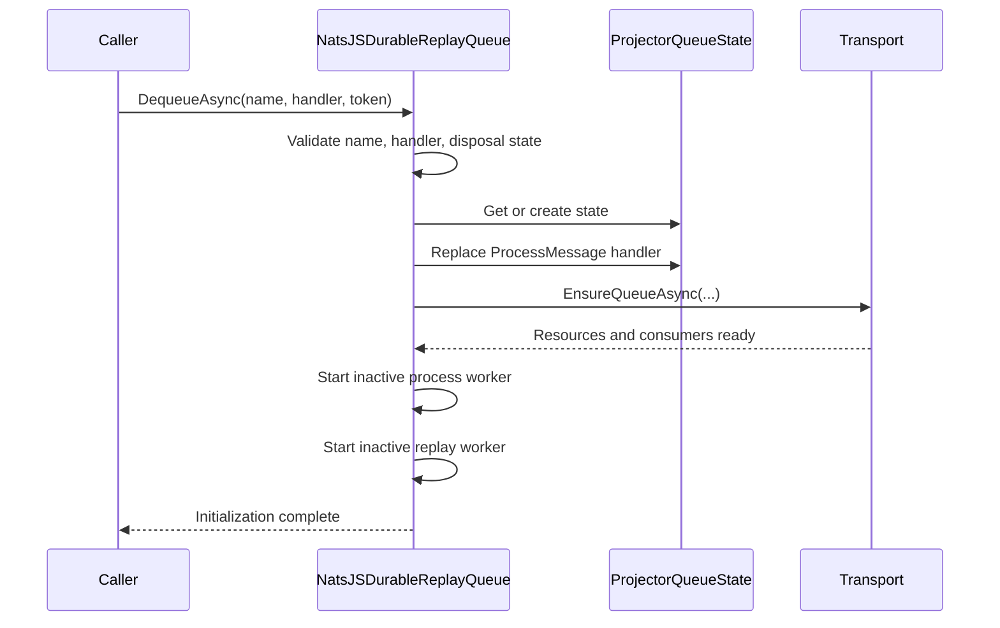
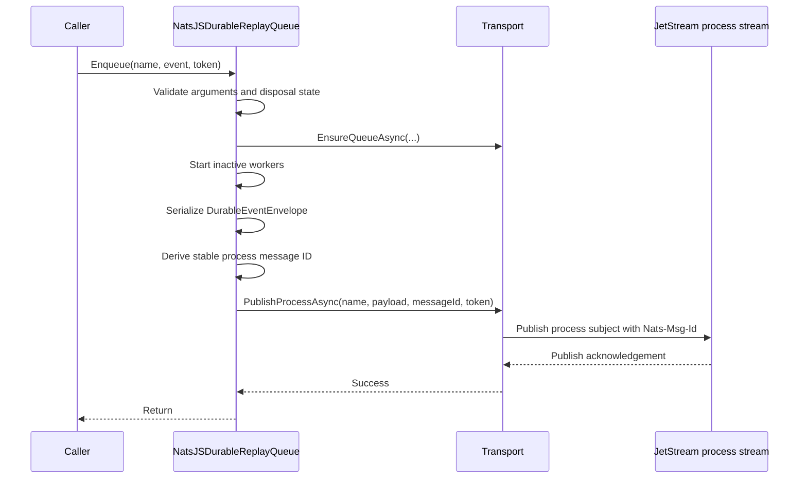
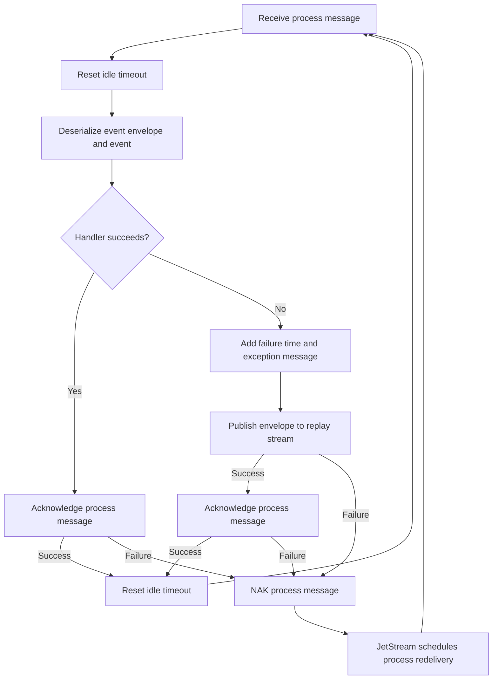
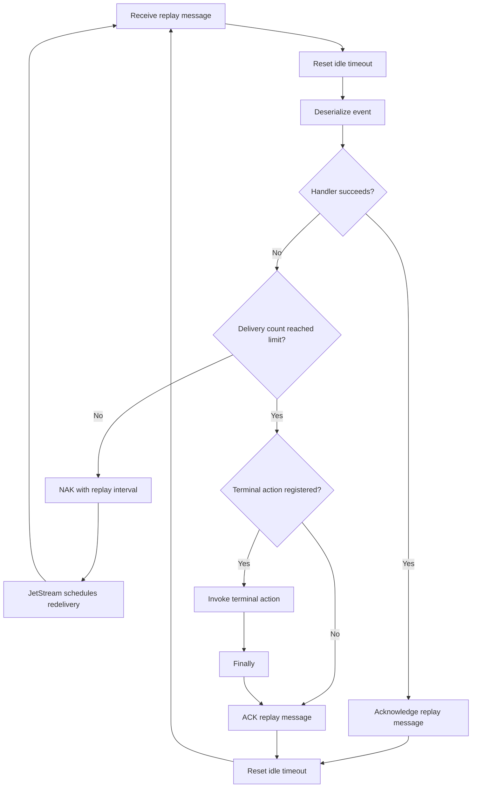

# NatsJSDurableReplayQueue

## Purpose

`NatsJSDurableReplayQueue` provides a projector-scoped durable event-processing queue with a separate retry lane backed by NATS JetStream. It implements `IDurableReplayQueue` and owns the background workers that deserialize events, invoke the projector handler, acknowledge successful messages, and route failed messages through replay.

The implementation is split across two source files:

- `NatsJSDurableReplayQueue.cs` contains projector state, lifecycle management, event serialization, processing, replay, and terminal-failure behavior.
- `NatsJSDurableQueueTransport.cs` contains the JetStream resource model and the NATS-specific publish, consume, acknowledgement, and negative-acknowledgement operations.

The queue is durable at the JetStream boundary: publish operations wait for a successful server acknowledgement, streams retain messages independently of the process lifetime, and durable consumers retain delivery state across client reconnects.

## Architecture

One `NatsJSDurableReplayQueue` instance can serve multiple projectors. Each projector has isolated in-memory configuration and its own JetStream process and replay resources.

```mermaid
flowchart LR
    Caller[Event projector] -->|Enqueue IEvent| Queue[NatsJSDurableReplayQueue]
    Queue -->|Serialize envelope| Transport[NatsJSDurableQueueTransport]

    subgraph JetStream[Projector-scoped JetStream resources]
        PS[Process stream]
        PC[Durable process consumer]
        RS[Replay stream]
        RC[Durable replay consumer]
        PS --> PC
        RS --> RC
    end

    Transport -->|Publish process payload| PS
    PC -->|Consume| ProcessWorker[Process worker]
    ProcessWorker -->|Success: ACK| PC
    ProcessWorker -->|Failure: publish replay| RS
    ProcessWorker -->|After replay publish: ACK| PC
    ProcessWorker -->|Replay publish or ACK fails: delayed NAK| PC

    RC -->|Consume| ReplayWorker[Replay worker]
    ReplayWorker -->|Success: ACK| RC
    ReplayWorker -->|Retry available: delayed NAK| RC
    ReplayWorker -->|Limit reached: terminal action, then ACK| RC

    ProcessWorker --> Handler[Registered projector handler]
    ReplayWorker --> Handler
    ReplayWorker --> Terminal[Optional max-attempts action]
```



### Component responsibilities

| Component | Responsibility |
| --- | --- |
| `NatsJSDurableReplayQueue` | Maintains per-projector state, starts and stops workers, serializes events, invokes handlers, and applies retry policy. |
| `ProjectorQueueState` | Stores one projector's handler, terminal action, replay settings, worker tasks, cancellation sources, and lifecycle gate. |
| `INatsJSDurableQueueTransport` | Defines the queue operations independently of NATS and enables isolated unit testing. |
| `NatsJSDurableQueueTransport` | Creates JetStream resources, publishes payloads, consumes messages, and wraps JetStream ACK/NAK operations. |
| `NatsJSDurableQueueSettings` | Carries resource names, replay interval, maximum deliveries, and backoff values. |
| `INatsJSDurableMessage` | Exposes payload data, current delivery count, ACK, and delayed NAK. |
| `DurableEventEnvelope` | Stores the projector name, runtime event type, event JSON, enqueue time, and optional failure details. |

## Projector isolation and resource naming

The in-memory state dictionary is keyed by the original projector name with ordinal, case-sensitive comparison. Before a projector name is used in NATS resource names, each character other than a letter, digit, hyphen, or underscore is replaced with an underscore.

For a projector named `Fund.Projector`, the normalized name is `Fund_Projector` and the resources are:

| Resource | Generated name |
| --- | --- |
| Process stream | `IFM_Fund_Projector_PROCESS` |
| Process subject | `ifm.projector.Fund_Projector.process` |
| Process durable consumer | `Fund_Projector-process-worker` |
| Replay stream | `IFM_Fund_Projector_REPLAY` |
| Replay subject | `ifm.projector.Fund_Projector.replay` |
| Replay durable consumer | `Fund_Projector-replay-worker` |

Because normalization is lossy, different logical names can map to the same NATS names. For example, `Fund.Projector` and `Fund/Projector` both normalize to `Fund_Projector`. Projector names should therefore be chosen so that their normalized forms are unique.

## Default configuration

| Setting | Default | Meaning |
| --- | --- | --- |
| Maximum replay deliveries | `3` | A replay message is terminally handled on its third replay delivery. |
| Replay interval | `30 seconds` | Used when workers are started before `StartAsync` supplies a different interval. |
| Worker idle timeout | `2 minutes` | A process or replay worker stops after this period without a consumed message. |

Replay backoff is generated once for every allowed replay delivery. For zero-based attempt index `n`, the delay is:

```text
min(replayInterval × 2^min(n, 6), 2 minutes)
```

For a 10-second replay interval and three maximum replay deliveries, the configured backoff is 10, 20, and 40 seconds. Every value is capped at two minutes.

## JetStream configuration

`NatsJSDurableQueueTransport.EnsureQueueAsync` creates or updates two streams and two durable consumers.

### Process consumer

| Setting | Value |
| --- | --- |
| Filter subject | Generated process subject |
| Acknowledgement policy | Explicit |
| Delivery policy | All available messages |
| Maximum delivery count | Unlimited (`-1`) |

Application failures are explicitly copied to the replay stream by the process worker. Process delivery remains unlimited so a replay-publication or acknowledgement failure can redeliver the original message instead of stranding it between the two streams.

### Replay consumer

| Setting | Value |
| --- | --- |
| Filter subject | Generated replay subject |
| Acknowledgement policy | Explicit |
| Delivery policy | All available messages |
| ACK wait | Configured replay interval |
| Maximum delivery count | Configured maximum replay attempts |
| Backoff | Generated exponential backoff sequence |

The replay worker also sends an explicit delayed NAK using the configured replay interval. JetStream tracks the delivery count exposed through message metadata.

## Connection and initialization model

The transport opens its NATS connection lazily during the first `EnsureQueueAsync` call. A single `NatsClient` and JetStream context are shared by all projectors owned by the queue instance.

A transport-wide semaphore serializes connection and resource initialization. Initialization uses a double-check pattern:

1. Look for an initialized projector with matching settings without taking the semaphore.
2. Acquire the connection semaphore.
3. Check the settings again in case another caller initialized the projector.
4. Connect to NATS if this is the first queue.
5. Create or update both streams.
6. Create or update both durable consumers.
7. Store their handles in the transport's projector dictionary.

A settings match compares the generated names, replay interval, and maximum replay attempts. Matching settings make initialization a no-op.

## Per-projector state

`ProjectorQueueState` retains the following values for each original projector name:

- the handler shared by process and replay messages;
- the optional maximum-attempts action;
- the maximum replay delivery count;
- the replay interval;
- separate cancellation sources for process and replay workers;
- separate worker tasks;
- a lifecycle semaphore that serializes start and stop operations for that projector.

Stopping an idle worker does not remove this state. Handler and retry configuration remain available when the workers restart.

## Public action flows

### Construct the queue

`new NatsJSDurableReplayQueue(options)` performs only local initialization:

1. Validate that `options` is not null.
2. Create `NatsJSDurableQueueTransport` with those options.
3. Store the default two-minute idle timeout.

No NATS connection is opened until a queue action calls `EnsureQueueAsync`. The transport currently uses `INatsJetStreamConsumerOptions.Url`; stream and durable-consumer names are generated by this queue rather than read from the other consumer options.

### `DequeueAsync`

`DequeueAsync(eventProjectorName, processMessageFunc, cancellationToken)` registers the callback used to process both new and replayed events.



Important semantics:

- The method registers a handler and starts workers; it does not wait for or return a message.
- A later call for the same projector replaces the handler.
- The handler is assigned before workers start, preventing those newly started workers from observing a missing handler.
- The cancellation token is linked to any workers created by the call, so canceling it later also stops those workers.
- If no custom interval has been set through `StartAsync`, queue initialization uses the 30-second default.

### `StartAsync`

`StartAsync(eventProjectorName, replayInterval, cancellationToken)` establishes or updates queue configuration and ensures both workers are active.

1. Verify that the queue is not disposed.
2. Require a nonblank projector name.
3. Require a replay interval greater than zero.
4. Get or create the projector state.
5. Store the new replay interval in that state.
6. Acquire the projector lifecycle gate.
7. Generate NATS resource names and replay backoff settings.
8. Ask the transport to create or update the streams and consumers.
9. Start a process worker if none exists or the previous worker completed.
10. Start a replay worker if none exists or the previous worker completed.
11. Release the lifecycle gate and return.

`StartAsync` does not register a handler. If existing messages can be delivered, call `DequeueAsync` first so the shared handler is present. Calling `StartAsync` repeatedly is safe; an active worker is not duplicated.

### `Enqueue`

`Enqueue(eventProjectorName, domainEvent, cancellationToken)` synchronously publishes an event to the projector's process subject.



The operation is synchronous because it waits on asynchronous initialization and publication with `GetAwaiter().GetResult()`. Return from `Enqueue` means JetStream acknowledged the publish; it does not mean the event handler has run. The process message ID is derived from projector name plus positive `EventId`, falling back to the event `Id`, so repeated publication of the same event can be suppressed by JetStream during the stream's duplicate window.

If this action starts inactive workers, its cancellation token remains linked to their lifetime. Callers should normally register a handler before enqueueing.

### `StopAsync`

`StopAsync(eventProjectorName, cancellationToken)` stops both workers for one projector:

1. Validate the projector name.
2. Return immediately if the projector has no in-memory state.
3. Acquire the projector lifecycle gate.
4. Cancel the process and replay worker tokens.
5. Await both worker tasks.
6. Dispose their cancellation sources.
7. Clear the task and cancellation-source references.
8. Release the lifecycle gate.

The operation does not delete JetStream streams or consumers and does not remove projector state. `StartAsync`, `DequeueAsync`, or `Enqueue` can restart the workers later.

The supplied cancellation token controls only the wait to acquire the lifecycle gate. Once the gate is acquired, the method waits for the workers without that caller token.

### `SetMaxAttemptsReachedAction`

`SetMaxAttemptsReachedAction(eventProjectorName, action, overwrite)` configures terminal replay handling.

- With `overwrite: true`, the action always replaces the current action.
- With `overwrite: false`, an atomic compare-and-exchange installs it only when no action is registered.
- The action receives the deserialized event after the replay handler fails on the maximum delivery.
- The replay message is acknowledged in a `finally` block after the action, including when the action throws.

This method updates in-memory state only and does not start workers or contact NATS.

### `SetMaxReplayAttemps`

`SetMaxReplayAttemps(eventProjectorName, maxReplayAttemps, overwrite)` configures the maximum replay delivery count. The method name and parameter retain the `Attemps` spelling from `IDurableReplayQueue`.

- Values below one are rejected.
- With `overwrite: true`, the value is replaced immediately.
- With `overwrite: false`, an atomic compare-and-exchange replaces the value only when its current value equals the default of three.
- The replay worker reads the current value when it handles a failure.
- JetStream consumer settings are reconciled on a later queue initialization call.

Because `overwrite: false` compares the numeric value rather than tracking whether it was explicitly configured, a current value of three remains replaceable even if it was explicitly set to three.

### `GetMaxReplayAttemps`

`GetMaxReplayAttemps(eventProjectorName)` returns the current in-memory replay limit. If the projector has not been seen before, this action creates its local state and returns the default value of three. It does not initialize NATS resources or start workers.

### `DisposeAsync`

Asynchronous disposal owns the complete queue shutdown:

1. Atomically mark the queue disposed; repeated calls return immediately.
2. Cancel both workers for every projector.
3. Await all non-null worker tasks.
4. Dispose all projector cancellation sources and lifecycle gates.
5. Dispose the transport and its NATS client.

JetStream streams and durable consumers remain on the server. Most public actions reject use after disposal. `StopAsync` is intended as a lifecycle operation and does not perform the queue's explicit disposed-state check.

### `Dispose`

Synchronous disposal calls `DisposeAsync` and blocks until it completes. It has the same ownership and persistence semantics as asynchronous disposal.

## Process worker flow

The process worker consumes the process durable consumer until it is canceled, becomes idle, or faults.



Detailed behavior:

1. Receive a transport message.
2. Reset the worker's idle cancellation deadline.
3. Deserialize the durable envelope and reconstruct its runtime `IEvent` type.
4. Resolve the projector's current handler.
5. Invoke the handler.
6. On success, explicitly acknowledge the process message. An ACK failure requests process redelivery and does not create a replay message.
7. On a non-cancellation handler or deserialization exception, update the envelope with `FailedAtUtc` and `ErrorMessage`.
8. Derive a stable replay message ID from the projector name and SHA-256 hash of the original process payload.
9. Publish the failed envelope to the replay stream and wait for the server acknowledgement.
10. If replay publication fails, NAK the process message with the replay interval and continue consuming.
11. Acknowledge the original process message only after replay publication succeeds. If that ACK fails, NAK the process message.
12. Reset the idle deadline and continue consuming.

The handler exception boundary is separate from process acknowledgement. Therefore, an ACK transport failure after successful application processing cannot incorrectly route the event to replay. Redelivery can still invoke the handler again, so projector state remains the application-level idempotency boundary.

Cancellation requested by the worker token exits the loop without being treated as an event failure.

## Replay worker flow

The replay worker consumes the replay durable consumer and uses the same projector handler.



Detailed behavior:

1. Receive a replay message and reset the idle deadline.
2. Deserialize the event before entering the handler exception block.
3. Invoke the current projector handler.
4. On success, acknowledge the replay message.
5. On failure before the configured maximum delivery, send a NAK with the replay interval.
6. JetStream redelivers the same message and increments its delivery count.
7. On failure at the maximum delivery, invoke the optional terminal action.
8. Acknowledge the replay message in a `finally` block so it is not delivered again, even if the terminal action throws.
9. Reset the idle deadline and continue when the worker remains active.

As in the process worker, an ACK failure after a successful handler call enters retry handling and can cause the handler to execute again.

### Deferred requirement: stream-aware replay supersession

Before the replay worker invokes the registered process action, it must eventually perform a stream-history check to determine whether the replayed event is stale relative to the current event-stream head. This check is intentionally not implemented yet.

The check must answer more than whether a newer global event exists. It must establish that:

1. the replayed event belongs to a particular event stream and has a durable stream version;
2. the current stream head is later than that version;
3. the replayed event is an ancestor in the current head's direct stream history; and
4. a projector-specific rule says that one of the later events supersedes the replayed action.

For example, replaying an old insert after a later delete in the same direct stream history could recreate data that the latest stream state says must remain deleted. In that case, the replay worker should not invoke the process action. It should persist an agreed terminal projector outcome and acknowledge the replay message. If the event is not superseded, normal replay processing continues.

Supporting this safely requires adding stream identity and `stream_version_id` information to `event_log`, making that information available to projector recovery/replay, and defining projector-specific supersession rules. The eventual implementation must also account for a stream update racing with the pre-action check, for example by validating the observed stream-head version when terminal projector state is written. Until those pieces exist, replay continues to execute every explicitly recoverable `Processing` or `Retrying` event.

## Serialization envelope

Events are serialized with Newtonsoft.Json in two layers:

```text
DurableEventEnvelope
├── EventProjectorName : string
├── EventType          : assembly-qualified runtime type name
├── EventJson          : JSON serialized as the runtime event type
├── EnqueuedAtUtc      : DateTimeOffset
├── FailedAtUtc        : nullable DateTimeOffset
└── ErrorMessage       : nullable string
```

The envelope itself is UTF-8 JSON. `ConstructorHandling.AllowNonPublicDefaultConstructor` is enabled for both envelope and event serialization.

Deserialization resolves `EventType` with `Type.GetType(..., throwOnError: true)`, verifies that the resolved type implements `IEvent`, and deserializes `EventJson` as that runtime type. Renaming or removing an event type or assembly can therefore make previously stored events unreadable unless type compatibility is preserved.

The failure envelope stores only the exception message, not the stack trace or exception type.

## Idle lifecycle

Process and replay workers have independent cancellation sources and independent idle timers.

1. A newly started worker schedules cancellation after the idle timeout.
2. Receiving a message resets its timer.
3. Completing message handling resets it again.
4. If the timeout expires, the worker's consume operation is canceled.
5. The expected cancellation is swallowed and the worker task completes.
6. A later `StartAsync`, `DequeueAsync`, or `Enqueue` sees the completed task and creates a new worker and cancellation source.

The timeout remains active while the handler is executing. A handler that runs longer than the idle timeout can leave the token canceled before the subsequent ACK, NAK, or replay publication.

## Concurrency model

- Projector states are stored in a `ConcurrentDictionary` using ordinal, case-sensitive keys.
- Each projector has a `SemaphoreSlim` that serializes its worker start and stop transitions.
- Different projectors can start and stop concurrently.
- Transport resource initialization is serialized globally by a separate semaphore because it also owns lazy connection creation.
- Handler replacement is a reference assignment; an in-flight message can continue using a handler reference it already read.
- Maximum attempt values use volatile reads and writes or atomic compare-and-exchange.
- Terminal-action conditional registration uses atomic compare-and-exchange.
- The queue is designed for concurrent use, but it does not serialize event handler invocations across process and replay workers. Both workers can call the same handler concurrently.

## Delivery and failure semantics

This design does not provide exactly-once event handling. Projectors should be idempotent or otherwise detect duplicate work.

| Situation | Result |
| --- | --- |
| Process handler succeeds and ACK succeeds | Process message completes. |
| Process handler fails and replay publish succeeds | Replay message is durable, then the process message is ACKed. |
| Process handler fails and replay publish fails | The process message is NAKed with the replay interval. Unlimited process delivery permits another handoff attempt, and the worker continues consuming. |
| Process handler succeeds but process ACK fails | The process message is NAKed for redelivery; it is not copied to replay. The handler may execute again. |
| Replay publish succeeds but process ACK fails | The process message is NAKed. On redelivery, the same replay message ID suppresses an immediate duplicate replay publication within JetStream's duplicate window. |
| Replay handler fails below its limit | Delayed NAK requests another delivery. |
| Replay handler fails at its limit | Optional terminal action runs and the replay message is ACKed. |
| Terminal action fails | The replay message is still ACKed; the action exception can end the worker. |
| Payload cannot be deserialized in the replay worker | Deserialization occurs outside the per-message handler catch and can fault the replay worker. |
| Worker token is canceled | Expected cancellation stops the worker without routing the event as a failure. |

The process-to-replay handoff is deliberately ordered as publish replay, await publish acknowledgement, then ACK process. It is not a distributed transaction, but this ordering prevents the normal handler-failure path from acknowledging the process message before the replay copy is durable. Stable `Nats-Msg-Id` headers reduce duplicates caused by ambiguous publish/ACK outcomes. A JetStream duplicate publication acknowledgement is treated as an accepted publish because the original message is already durable. Duplicate protection is bounded by the stream duplicate window, so persistent projector state is still required for long-lived idempotency.

## Recommended projector lifecycle

`BaseEventProjector` owns queue initialization for its projector. Its lifecycle methods keep infrastructure setup separate from per-batch event publication:

```csharp
public async ValueTask StartAsync(
    ICommandActorContext context,
    CancellationToken cancellationToken = default)
{
    _context = IsArgumentNull.Set(context);

    await DurableReplayQueue.DequeueAsync(
        ProjectorName,
        ProcessQueuedDomainEventAsync,
        cancellationToken);

    await RecoverUncompletedEventsAsync(cancellationToken);

    await DurableReplayQueue.StartAsync(
        ProjectorName,
        TimeSpan.FromSeconds(30),
        cancellationToken);
}

public async ValueTask StopAsync(CancellationToken cancellationToken = default)
    => await DurableReplayQueue.StopAsync(ProjectorName, cancellationToken);
```

The owning command actor should pass its runtime context to the projector's `StartAsync` from its startup lifecycle and call `StopAsync` from its shutdown lifecycle. The context is created by the actor supervisor and is therefore supplied at lifecycle time rather than injected into the projector constructor. Handler registration deliberately precedes queue startup so recovered messages cannot be consumed before a handler is available.

`DomainEventsProjectionAsync` is then limited to its data-plane responsibilities:

1. Create the initial projection state for each saved domain event.
2. Upsert that state into the event-source database using `(EventId, ProjectorName)`.
3. Cache the same state in the blackboard for active processing.
4. Enqueue each event to the already-configured projector queue.

It does not register the handler or call the durable queue's `StartAsync` for every event batch. If workers later stop after their idle timeout, `Enqueue` automatically restarts them using the retained handler and settings.

## Event-log recovery and durable projector state

The event log is the source of truth and serves the role that would otherwise require a separate outbox payload table. `SaveEventsAsync` commits the source events before `DenormalizeEventsAsync` publishes them to JetStream. Once an explicit `Processing` state has been recorded, the durable `event_projector_state` table allows a failed queue publication to be recovered without copying the event payload. The short interval between the event-log commit and creation of that explicit state is intentionally not inferred as pending yet; stream-version-aware recovery will address that case later.

Projection state belongs to an event/projector pair rather than to an actor:

```text
event_log.EventVersion ──┐
                        ├── event_projector_state (EventId, ProjectorName)
projector identity ──────┘
```

The table stores the actor name as metadata, but its primary key is `(EventId, ProjectorName)` because more than one projector may independently consume the same event. The source event's stream remains available through the `event_log` row and is not duplicated in projector state.

During projector startup, `BaseEventProjector`:

1. registers the durable queue handler;
2. asks `EventSourceActorDbContext` for event-log rows matching `ProjectedEventTypes`;
3. selects only rows with an explicit projector state whose outcome is `Processing` or `Retrying`;
4. reconstructs each domain event from `EventTypeName` and `EventData`;
5. restores its `(EventId, ProjectorName)` state; and
6. enqueues it to the projector's process queue.

An event-log row with no `(EventId, ProjectorName)` state is not considered pending and is excluded from startup recovery. This prevents a newly created state table from automatically replaying all historical events. States with terminal `Completed` or `Failed` outcomes are also excluded. Failed events can still be handled through an explicit operational replay policy. Active workflow stages are written back to both the database and blackboard; terminal state is persisted before its blackboard entry is cleared.

Stream-aware supersession is intentionally deferred and is described in the replay-worker requirement above. For example, a historical insert should eventually be suppressible when a later event in the same stream's direct history has already deleted that entity. That policy requires a durable stream version on the event log and projector-specific rules for determining whether an older event has been superseded. Until that is implemented, the event-log recovery scan only resumes events that were explicitly registered as `Processing` or `Retrying`; it does not infer work from the absence of state.

The state table is created lazily by `EventSourceActorDbContext` in the same PostgreSQL event-source store as `event_log`. A unique index on `event_log.EventVersion` establishes the global event identity required by the `EventId` foreign key without changing the event log's existing composite primary key. Event selection joins `event_log` to `event_name_id` and filters by the event names supported by the projector.

Event type metadata is resolved by the same composite identity enforced by `event_name_id`: `(EventName, EventTypeName)`. This matters when an event name survives an assembly or namespace move; looking up only by the short event name can attach a new event to obsolete type metadata and make startup reconstruction fail. If a persisted type still cannot be loaded, reconstruction returns an `UnknownEvent`; startup marks that explicit projector state as failed and continues recovering other events rather than failing the entire projector lifecycle.

Application-wide shutdown can dispose the durable queue singleton after individual projector lifecycles have stopped, closing the shared NATS connection while leaving server-side resources intact.

## Operational considerations

- JetStream resources persist after queue disposal and must be removed through separate administration if they are no longer needed.
- Stable projector names preserve durable-consumer continuity. Renaming a projector creates a different resource set and leaves the old set in place.
- Normalized projector names must be unique to prevent two logical projectors from targeting the same streams and consumers.
- Event assemblies and type names must remain resolvable for as long as serialized events can remain in either stream.
- Preserve event `EventId`/`Id` values across retries because they form the stable process publication identity.
- The handler should be idempotent because ACK failures and process-to-replay transitions can cause repeated application work.
- The terminal action should record enough context for operators because its message is ACKed regardless of action success.
- Handler execution should normally complete inside the worker idle timeout.
- Monitoring should cover worker faults, replay volume, terminal-action calls, consumer pending counts, redelivery counts, and old resources left by renamed projectors.

## Test coverage

`NatsJSDurableReplayQueueTests` uses `FakeNatsJSDurableQueueTransport` to verify:

- deterministic stream, subject, and consumer naming;
- generated replay backoff;
- successful processing and acknowledgement;
- process failure handoff to replay;
- replay-publication failure, process NAK, and successful handoff after redelivery;
- replay duplicate suppression when the process ACK fails after replay publication;
- duplicate suppression when the same event is enqueued repeatedly;
- delayed replay redelivery and later success;
- terminal action and final acknowledgement;
- isolation between projector names;
- conditional configuration with `overwrite: false`;
- worker restart after idle timeout;
- explicit stop followed by restart; and
- rejection of nonpositive replay limits.

The fake transport models separate process and replay channels, stable message-ID duplicate suppression, injected replay-publication failures, and delivery-count increments when a message is negatively acknowledged.

`NatsJSDurableReplayQueueIntegrationTests` runs against an actual JetStream server and verifies:

- the process consumer is created with explicit acknowledgement and unlimited redelivery;
- repeated enqueue of the same event is stored and processed once through `Nats-Msg-Id` duplicate suppression;
- an injected replay-publication failure causes real process-message NAK/redelivery before the handoff completes; and
- a process message published by one transport instance is consumed after that transport is disposed and a new queue instance starts.

The integration suite uses `IFM_NATS_URL` when set and otherwise connects to `nats://localhost:4222`. The repository service can be started with `docker compose -f Docker/NatsJetstream/docker-compose.yml up -d`. Each test creates uniquely named streams and removes them during teardown.

`FundEventProjectionIntegrationTests` is the reference command-actor implementation test. It runs against PostgreSQL, Redis, ScyllaDB, and an actual JetStream server and verifies both complete application flows:

1. `FundStateRepository.SaveStateAsync` saves a `FundCreatedEvent` to `event_log`, `DenormalizeEventsAsync` records `Processing`, JetStream invokes `FundEventProjector`, the Fund read model is written, and the projector state reaches `Completed`.
2. An event and explicit `Processing` state are saved without queue publication; a new projector `StartAsync` reconstructs that event from `event_log`, enqueues it, writes the Fund read model, and reaches `Completed`.

The first test gates the projector handler so it can assert that the source event exists and its durable state is `Processing` before projection is allowed to finish. Storage tests verify the projector-state mapping, the unique event-version relationship, the composite `(EventId, ProjectorName)` state key, and the composite event-name/type lookup. Shared tests verify that obsolete or unavailable event assemblies degrade to `UnknownEvent` instead of aborting startup recovery.
