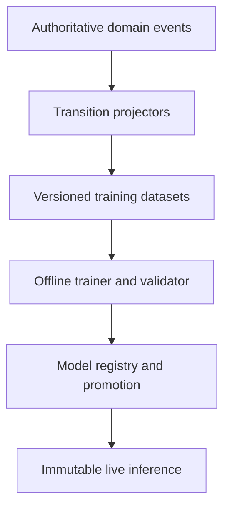

# Markov Statistical Models Specification

**Document version:** 1.0  
**Status:** Architecture, implementation, and educational specification  
**Target runtime:** .NET 10 or later  
**Primary system:** Deterministic ES futures-options trading platform  
**Primary strategy scope:** Monthly directionally biased Iron Condors in V1  
**Model families:** Markov Chains, Hidden Markov Models, and Markov Decision Processes  
**Initial live-control policy:** No Markov model directly controls live trading in V1  
**Recommended first concrete release:** V1.1 for Markov Chain infrastructure and shadow forecasts  
**Companion specifications:** `OrderExecutionWorkflowSpecification.md`, `IbkrOrderExecutionAdapterSpecification.md`, `IbkrBrokerAccountSpecification.md`, `IbkrMarketDataSpecification.md`, `IbkrContractReferenceSpecification.md`, and `ScriptedBrokerTestHarnessSpecification.md`  
**Last updated:** 2026-08-02

---

## 1. Purpose

This document explains and specifies three related statistical and decision-model families for the deterministic trading system:

1. Markov Chains;
2. Hidden Markov Models (HMMs);
3. Markov Decision Processes (MDPs).

It defines:

- what each model means mathematically and operationally;
- the differences between a statistical Markov model, an actor state machine, and a trading policy;
- the best places to use each model in the current architecture;
- where the models should not be used;
- the state, observation, action, transition, reward, and output contracts;
- integration with the existing actors, events, projections, databases, Redis, and deterministic replay;
- offline training, validation, calibration, promotion, rollback, and governance;
- a phased delivery plan covering V1, V1.1, V1.x, V2, and V3;
- Codex-ready implementation increments and acceptance criteria.

The objective is not to make the trading system randomly probabilistic. The objective is to add reproducible estimates of what is likely to happen next and, later, a tightly constrained method for choosing among already-permitted execution actions.

---

## 2. Executive Architecture Decision

The deterministic trading system remains authoritative.

Markov models shall be introduced under the following hierarchy:

1. hard safety rules and broker truth;
2. deterministic workflow state and permitted-action masks;
3. deterministic risk and strategy policy;
4. versioned statistical forecasts;
5. versioned policy recommendations;
6. optional later execution action selection inside the permitted mask.

The following decisions are normative:

- V1 collects clean transition evidence but does not permit Markov models to change live actions.
- V1.1 implements the reusable Markov Chain library and runs execution and regime forecasts in shadow/advisory mode.
- V1.x implements HMM regime inference in shadow mode and an MDP execution policy in simulator/paper mode.
- V2 may promote validated regime probabilities into bounded deterministic scoring inputs.
- V2 may allow a validated MDP to select `Wait`, `Reprice`, or `Cancel` only after the deterministic workflow supplies a permitted-action mask and hard constraints.
- A model never submits an order, widens a reservation price, increases quantity, bypasses risk, creates a hedge, or mutates broker state directly.
- Random state sampling is prohibited in live decision paths. It is allowed only in explicitly seeded simulation with every random draw reproducible.
- Model training is offline or operationally scheduled. Live actors use immutable promoted models and never learn online from unreviewed events.

The central boundary is:

> Deterministic code defines what is safe and legal. Markov models estimate what is likely. A promoted MDP may later choose only among actions that deterministic code has already permitted.

---

## 3. Current Trading-System Context

This specification assumes the established architecture:

- actor-based command/event/query processing;
- sequential processing inside each domain actor;
- NATS Core and JetStream messaging;
- PostgreSQL event store;
- ScyllaDB projections and analytical histories;
- Redis for current hot snapshots when useful;
- Databento as the primary market-data provider;
- IBKR as broker, execution provider, account source, and secondary market-data provider;
- deterministic Black-76 option pricing and risk calculations on CPU;
- deterministic open-position pipeline:
  - `RegimeDiscoveryActor`;
  - `TradeSelectionActor`;
  - `CandidateBuilderActor`;
  - `PortfolioRiskActor`;
  - `OrderExecutionActor`;
- deterministic close-position pipeline:
  - `PositionMonitorActor`;
  - `ExitDecisionActor`;
  - `OrderExecutionActor`;
- `FusionRegimeActor` combining trend, volatility, Bollinger Band, ATR, and VIX evidence;
- `PositionMonitorActor` using Green/Yellow/Red health and forward-loss evidence;
- one approved multi-leg IBKR combination limit order in V1;
- no V1 hedging or model-directed compensating trade;
- LLM advice outside the execution path and without authority to change deterministic values.

Markov modelling shall integrate with these boundaries rather than introduce a parallel trading system.

---

## 4. Common Markov Foundation

### 4.1 State

A state is a finite, versioned representation of the information considered sufficient to forecast the next relevant transition.

Examples:

- `MonthlyBullishStrong` for a simple market-regime chain;
- `Working + Age2To5Seconds + OneTickBehind + NormalLiquidity` for execution;
- `Yellow + ForwardLossMedium + Dte15To30 + VolatilityRising` for position monitoring.

State design is the most important modelling decision. A poor state cannot be rescued by a sophisticated algorithm.

### 4.2 Markov property

Let the state at time or decision step `t` be `S_t`. A first-order Markov model assumes:

$$
P(S_{t+1}\mid S_t,S_{t-1},\ldots,S_0)
=
P(S_{t+1}\mid S_t)
$$

This does not claim that markets have no memory. It claims that the current state representation contains the history needed for the model's intended forecast.

If previous history materially changes the next-state distribution, the implementation shall do one of the following:

- add a state feature such as `TimeInStateBucket`;
- use a higher-order chain;
- use a semi-Markov model for duration;
- use an HMM with an observation window;
- declare that the Markov assumption is inadequate.

It shall not conceal the failure with a larger training dataset.

### 4.3 Transition

A transition is an observed movement from one valid state to another:

$$
S_t=i \rightarrow S_{t+1}=j
$$

The estimated one-step transition probability is:

$$
P_{ij}=P(S_{t+1}=j\mid S_t=i)
$$

For a finite state set, all transition probabilities form a transition matrix `P`. Every row shall satisfy:

$$
P_{ij}\geq0
$$

and

$$
\sum_j P_{ij}=1
$$

### 4.4 N-step forecast

If the one-step matrix is `P`, the `n`-step transition matrix is:

$$
P^{(n)}=P^n
$$

If the current distribution is the row vector $\pi_t$, then:

$$
\pi_{t+n}=\pi_tP^n
$$

This provides probabilities several state transitions into the future. It does not automatically correspond to clock time unless the state process uses fixed time steps.

### 4.5 Fixed-time versus event-time chains

The implementation shall declare its time semantics:

- fixed-time chain: one transition opportunity every bar, second, minute, hour, or day;
- event-time chain: one transition opportunity at each material domain event;
- decision-time chain: one transition opportunity whenever the workflow may select an action.

The current architecture should use:

- fixed-time or regime-event transitions for market regimes;
- decision-time transitions for order execution;
- material position-update transitions for position health.

Datasets with different time semantics must not be pooled without an explicit model.

### 4.6 Duration and semi-Markov behaviour

A basic Markov chain implies a geometric duration distribution. If the probability of remaining in state `i` is $P_{ii}$, the simple expected number of steps in the state is:

$$
E[D_i]=\frac{1}{1-P_{ii}}
$$

Market regimes and working orders often have duration-dependent behaviour. Therefore:

- V1.1 state schemas should include coarse duration buckets;
- calibration shall measure accuracy by duration bucket;
- V2 may introduce a semi-Markov implementation when duration buckets become too coarse or cause state explosion.

### 4.7 Stationarity

A simple model often assumes that transition probabilities are stable over its training/application window. Trading behaviour changes with:

- volatility regime;
- session and time of day;
- broker/API behaviour;
- market structure;
- strategy/order-shape changes;
- instrument maturity;
- liquidity and event conditions.

Every model artifact shall therefore record its training period, environment, instruments, session coverage, strategy/order version, and detected drift. No model is considered permanently stationary.

### 4.8 Stationary distribution

For an ergodic chain, a stationary distribution $\pi^*$ satisfies:

$$
\pi^*=\pi^*P
$$

It describes the long-run proportion of model steps expected in each state if the transition structure remains unchanged. This can be useful for comparing observed regime occupancy with the fitted chain, but it is not a forecast that markets will remain structurally stable forever. Production use shall report the fitted time window and reject long-run interpretations when drift or non-ergodic structure makes them misleading.

---

## 5. Markov Chains

### 5.1 Definition

A Markov Chain models transitions among observable states. It has:

- a finite or countable state set;
- an initial state/distribution;
- a transition-probability matrix;
- no action-selection mechanism;
- no reward function;
- no hidden-state requirement.

A Markov Chain answers:

> Given the current observable state, what is the probability distribution over the next state or future states?

It does not answer:

> Which action should the system choose?

### 5.2 Example regime chain

Suppose a simplified daily market model has three observed states:

- `Bullish`;
- `Sideways`;
- `Bearish`.

An example transition matrix is:

| Current state | Next Bullish | Next Sideways | Next Bearish |
|---|---:|---:|---:|
| Bullish | 0.70 | 0.25 | 0.05 |
| Sideways | 0.20 | 0.60 | 0.20 |
| Bearish | 0.05 | 0.25 | 0.70 |

If the current state is `Bullish`, the model forecasts a 70% probability of remaining Bullish for the next model step, 25% of becoming Sideways, and 5% of becoming Bearish.

These values are examples only. No example probability or threshold in this document is a production default.

### 5.3 Estimation from counts

For observed transition counts $N_{ij}$, maximum-likelihood estimation is:

$$
\hat{P}_{ij}=\frac{N_{ij}}{\sum_kN_{ik}}
$$

Production estimation shall support versioned smoothing so an unobserved transition is not automatically assigned absolute impossibility. With symmetric additive smoothing $\alpha$:

$$
\hat{P}_{ij}=\frac{N_{ij}+\alpha}{\sum_kN_{ik}+\alpha K}
$$

where `K` is the number of destination states.

The artifact shall retain raw counts, effective counts, smoothing parameters, and confidence/uncertainty diagnostics.

### 5.4 Absorbing states

An absorbing state has:

$$
P_{ii}=1
$$

Execution terminal states such as `Filled`, `Cancelled`, or `Rejected` may be modelled as absorbing within one execution attempt. The domain workflow may later start another attempt, but that belongs to a new episode rather than a transition out of the previous terminal state.

### 5.5 Best uses in the current system

Markov Chains are best suited for:

- observed regime persistence and transition forecasting;
- passive execution fill/partial-fill/cancel/reject forecasts;
- position-health deterioration/recovery forecasts;
- operational health/reconnect transition analytics;
- seeded scenario generation for simulation;
- providing the estimated transition component later consumed by an MDP.

### 5.6 Limitations

A simple chain is unsuitable when:

- the important state is not directly observable;
- actions materially affect the next-state distribution but are ignored;
- duration in state materially changes behaviour and is omitted;
- state construction loses relevant history;
- the system needs continuous high-dimensional raw observations without discretization;
- transition probabilities drift too quickly to validate;
- there are too few observations for each state.

---

## 6. Hidden Markov Models

### 6.1 Definition

A Hidden Markov Model assumes that the meaningful state is latent—not observed directly—and generates observable evidence.

For trading:

- hidden state: the market's underlying regime;
- observations: RSI, RSI slope, ADX, EMA relationships, Bollinger Band position, ATR ratio, VIX level, VIX term structure, returns, and volatility.

An HMM contains:

- hidden states $Z_t$;
- observations $X_t$;
- initial hidden-state distribution $\pi$;
- hidden-state transition probabilities $A$;
- observation/emission model $B$.

### 6.2 HMM assumptions

The usual first-order transition assumption is:

$$
P(Z_t\mid Z_{t-1},Z_{t-2},\ldots)=P(Z_t\mid Z_{t-1})
$$

The observation assumption is commonly:

$$
P(X_t\mid Z_t,Z_{t-1},X_{t-1},\ldots)=P(X_t\mid Z_t)
$$

These are modelling assumptions, not market laws. Their adequacy must be tested.

### 6.3 Joint probability

For one hidden-state and observation sequence:

$$
P(z_{1:T},x_{1:T})
=
P(z_1)P(x_1\mid z_1)
\prod_{t=2}^{T}
P(z_t\mid z_{t-1})P(x_t\mid z_t)
$$

### 6.4 Three principal HMM operations

#### Filtering

Estimate the current hidden-state distribution using evidence available up to now:

$$
P(Z_t\mid X_{1:t})
$$

This is the correct online operation for live advisory output because it does not use future data.

#### Smoothing

Estimate past hidden states using the entire observation sequence:

$$
P(Z_t\mid X_{1:T})
$$

Smoothing is useful for offline analysis and labels, but it is look-ahead information and must never be presented as what the live system knew at time `t`.

#### Decoding

The Viterbi algorithm estimates the most likely hidden-state path. It is valuable for analysis, but the online actor should usually consume a full probability distribution rather than only the winning label.

### 6.5 Training

HMM parameters may be fitted using expectation-maximization/Baum-Welch or supervised/semi-supervised approaches when valid labels exist.

Training shall address:

- multiple initializations and local optima;
- feature scaling and missing observations;
- correlated indicators;
- heavy-tailed return/volatility emissions;
- number-of-state selection;
- minimum state occupancy;
- label switching;
- walk-forward validation;
- stability across retraining windows.

### 6.6 Label switching

HMM state number 0 has no intrinsic meaning. Separate training runs may permute statistically equivalent state labels.

The model registry shall map internal hidden states to stable semantic labels using a versioned interpretation procedure based on emission characteristics. Promotion shall fail if a candidate's semantic mapping is ambiguous.

### 6.7 Best use in the current system

The best HMM placement is a `HiddenRegimeAdvisor` beside—not inside—the deterministic `FusionRegimeActor`.

The deterministic actor continues to publish the official rule-based regime. The HMM publishes:

- hidden-state probability distribution;
- most probable hidden state;
- entropy/uncertainty;
- probability of regime change;
- persistence estimate;
- model version and input completeness;
- disagreement with the deterministic regime.

This is especially appropriate because “market regime” is not directly observable. Indicators are evidence about it.

### 6.8 HMMs are not appropriate for every state

Do not use an HMM merely because a process is uncertain.

- IBKR order status is observed broker evidence, not a hidden regime.
- account balances and positions are observed broker facts with freshness/completeness state.
- deterministic workflow state is known by the workflow.
- a missing callback is an uncertainty/reconciliation problem, not proof of a hidden Markov state.

### 6.9 Emission-model choice

Observations may use categorical, Gaussian, multivariate Gaussian, mixture, or more robust heavy-tailed emission models. The choice is part of the immutable model specification.

- categorical emissions suit already discretized indicator states;
- continuous emissions preserve more information but require careful scaling and distribution validation;
- correlated indicators should not be treated as conditionally independent without evidence;
- return/volatility features often require robust treatment because Gaussian tails may be inadequate;
- a more complex emission model must earn its complexity through stable walk-forward performance.

---

## 7. Markov Decision Processes

### 7.1 Definition

A Markov Decision Process extends Markov transitions with actions and consequences.

An MDP is commonly defined as:

$$
\mathcal{M}=(\mathcal{S},\mathcal{A},P,R,\gamma)
$$

where:

- $\mathcal{S}$ is the state space;
- $\mathcal{A}$ is the action space;
- $P(s'\mid s,a)$ is the transition probability after action `a`;
- $R(s,a,s')$ is the reward/cost;
- $\gamma$ is an optional discount factor.

A policy $\pi(a\mid s)$ specifies which action to take in a state.

### 7.2 Return and value

For discounted continuing problems, a return can be written:

$$
G_t=\sum_{k=0}^{\infty}\gamma^kR_{t+k+1}
$$

The state-value function under policy $\pi$ is:

$$
V^{\pi}(s)=E_{\pi}[G_t\mid S_t=s]
$$

The action-value function is:

$$
Q^{\pi}(s,a)=E_{\pi}[G_t\mid S_t=s,A_t=a]
$$

### 7.3 Bellman relationship

For an optimal finite MDP, the action-value relationship is conceptually:

$$
Q^*(s,a)=\sum_{s'}P(s'\mid s,a)
\left[R(s,a,s')+\gamma\max_{a'}Q^*(s',a')\right]
$$

The implementation may use finite-horizon dynamic programming, constrained optimization, fitted models, or a precomputed policy. It shall not assume model-free reinforcement learning is required.

### 7.4 Best use: micro order execution

Order execution is the strongest MDP use case because:

- the workflow observes an execution state;
- it can choose among actions;
- the action changes fill probability, price quality, waiting cost, and risk;
- the episode has a bounded horizon;
- terminal outcomes are observable and auditable.

For the V1 Iron Condor combination order, the MDP's purpose is narrow:

> Select among safe micro-execution actions for one already-approved economic order.

It does not select the strategy, legs, quantity, maximum risk, or reservation price.

### 7.5 Recommended execution actions

The eventual MDP action set is:

- `Wait`;
- `RepriceWithinApprovedBounds`;
- `Cancel`;
- `RequestReconciliation`;
- `EscalateUnknown`.

V1 prohibits hedging and compensating trades. Therefore no MDP action may create a hedge, change the option structure, increase quantity, or submit a replacement outside the approved execution attempt.

### 7.6 Permitted-action mask

The deterministic workflow calculates a mask before policy evaluation:

```text
PermittedActions =
    Wait
  | RepriceWithinApprovedBounds
  | Cancel
```

The MDP receives the mask and may recommend only a contained action. The workflow independently validates the selected action again before producing a broker command.

If:

- the recommended action is not permitted;
- the model is unavailable/stale/incompatible;
- the state is unknown or out of distribution;
- the inference deadline expires;
- a safety invariant is false;

the deterministic fallback policy executes.

### 7.7 Execution reward is not trading alpha

The execution reward/cost function shall measure execution quality and operational risk, not whether the underlying strategy later made money.

Candidate components include:

- fill price relative to the approved reference/reservation price;
- time-to-fill;
- unfilled opportunity cost under bounded policy;
- adverse price movement while waiting;
- partial-fill exposure duration;
- modification count;
- cancellation/reconciliation cost;
- unknown broker-state penalty;
- hard terminal penalties for safety violations.

Post-trade strategy P&L must not leak into the execution reward in a way that teaches execution to change strategy exposure.

### 7.8 Finite-horizon and event-time design

An execution attempt has deadlines and terminal states, so a finite-horizon event-time MDP is preferred over an indefinite discounted process.

The decision index advances when:

- broker status changes materially;
- market price/liquidity crosses configured thresholds;
- a deterministic decision timer expires;
- a risk/account/connection condition changes;
- a partial fill occurs.

Clock-time and time remaining belong in the state.

### 7.9 Why MDP is not V1 live control

The current platform first needs:

- reliable broker callback normalization;
- exact order/contract correlation;
- deterministic workflow/fake-broker tests;
- execution transition data;
- action-conditioned outcome data;
- calibrated transition estimates;
- stable rewards and hard constraints;
- shadow and paper evidence.

Without those foundations, an MDP would optimize assumptions rather than observed execution behaviour.

### 7.10 Exploration, exploitation, and counterfactual limits

An MDP normally benefits from observing outcomes under different actions. Historical deterministic policy creates selection bias: the dataset reveals what happened after the action actually taken, not what would have happened after every alternative.

The system shall not perform unsafe stochastic exploration in live trading. It may improve action coverage through:

- deterministic scripted simulation;
- seeded stochastic simulation;
- carefully bounded paper-trading variation;
- offline policy evaluation with explicit assumptions;
- later small production canaries after approval.

Unsupported actions remain masked. A policy may not assign fabricated certainty to counterfactual outcomes merely because the solver requires a complete transition table.

---

## 8. Model Comparison

| Concern | Markov Chain | Hidden Markov Model | Markov Decision Process |
|---|---|---|---|
| State observable? | Yes | No; inferred from observations | Usually represented as observable decision state |
| Actions included? | No | No | Yes |
| Reward/cost included? | No | No | Yes |
| Principal output | Next/future-state probabilities | Hidden-state probabilities/path | Action recommendation or policy |
| Best current use | Regime/execution/position transition forecast | Latent market-regime advice | Micro order execution |
| First concrete implementation | V1.1 | V1.x | V1.x paper/shadow |
| First possible production influence | V2 bounded feature | V2 advisory/scoring input | V2 constrained execution action |
| Direct broker authority | Never | Never | Never; workflow remains authority |

### 8.1 Actor state machine versus Markov model

| Actor state machine | Markov model |
|---|---|
| Defines legal transitions | Estimates likely transitions |
| Driven by business rules and broker evidence | Driven by fitted probabilities |
| Must be correct without model availability | May be unavailable or stale |
| Persists authoritative workflow state | Produces versioned forecast/advice |
| Deterministic by definition | Deterministic inference over statistical parameters |

The same names may appear in both representations, but ownership is different.

---

## 9. Placement and Priority in the Current Architecture

| Priority | Domain | Recommended model | First implementation | First possible controlled use |
|---:|---|---|---|---|
| 1 | Order execution observations | Markov Chain / action-conditioned transitions | V1.1 shadow | MDP foundation in V1.x |
| 2 | Market-regime persistence | Markov Chain | V1.1 shadow | Bounded deterministic score in V2 |
| 3 | Latent market regime | HMM | V1.x shadow | Advisory/scoring feature in V2 |
| 4 | Micro order actions | MDP | V1.x simulator and paper | Constrained production policy in V2 |
| 5 | Position-health transitions | Markov Chain | V1.x shadow | Monitoring prioritization in V2 |
| 6 | Position-exit action optimization | Constrained MDP | V2 research | V3 only if hard exits remain superior constraints |
| 7 | Infrastructure recovery analytics | Markov Chain/semi-Markov | V2 | Operational forecasting only |
| 8 | Stochastic scenario generation | Chain/HMM | V1.x research | Seeded backtesting/QA only |

### 9.1 Recommended first concrete model

The first implemented model should be an observed Markov Chain, not an HMM or MDP.

Recommended order:

1. implement the generic immutable transition-matrix library;
2. implement a regime-transition forecaster because its state/output are easy to inspect;
3. implement an execution-transition forecaster because it supplies the MDP foundation;
4. implement HMM regime advice;
5. implement the constrained execution MDP.

The regime chain is the easiest proof of the infrastructure. Execution is the highest-value eventual decision application.

---

## 10. Order-Execution Transition Model

### 10.1 Purpose

The execution transition model estimates what is likely to happen next under the current order state and, when available, a candidate action.

It initially runs in shadow mode beside `OrderExecutionActor` and the deterministic `OrderExecutionWorkflow`.

### 10.2 Episode boundary

One execution attempt is one episode:

- starts when an approved order attempt becomes ready for submission;
- includes submit, acknowledge, working, modification, partial fill, cancel, and reconciliation evidence;
- ends at filled, cancelled, rejected, expired, or terminal unresolved escalation;
- never crosses into a separate economic order or compensation workflow.

### 10.3 Core observable state

The state schema should include bounded categorical/bucketed fields:

```text
WorkflowStage
BrokerOrderStatus
ElapsedSinceSubmitBucket
ElapsedSinceLastActionBucket
DecisionTimeRemainingBucket
LimitDistanceFromExecutableMarketBucket
BidAskSpreadBucket
DisplayedOrEstimatedLiquidityBucket
PartialFillRatioBucket
AdverseMovementBucket
MarketVolatilityBucket
MarketDataFreshness
BrokerConnectionHealth
AccountReadiness
ModificationCountBucket
OrderShape
SessionBucket
```

### 10.4 State restrictions

- Do not include raw prices where relative tick/approved-bound distances are the relevant semantics.
- Do not use unbounded timestamps or identifiers as state dimensions.
- Do not combine states across materially different order shapes without evidence.
- V1/V1.1 training is initially scoped to the supported multi-leg Iron Condor combination limit order.
- Unknown/missing/stale fields require explicit categories.
- State schema versions are immutable once model training begins.

### 10.5 Transition outcomes

Possible next/terminal state categories include:

- acknowledged;
- working unchanged;
- working after modification;
- partially filled;
- filled;
- cancel pending;
- cancelled;
- rejected;
- broker state unknown;
- reconciliation required;
- disconnected/degraded;
- timed out under workflow policy.

### 10.6 Action-conditioned evidence

A plain passive chain estimates:

$$
P(S_{t+1}\mid S_t)
$$

The MDP requires:

$$
P(S_{t+1}\mid S_t,A_t)
$$

Therefore every execution decision observation shall record:

- state before action;
- permitted-action mask;
- deterministic action selected;
- action parameters such as bounded price step;
- broker command invocation evidence;
- next material state;
- elapsed/event-time interval;
- terminal outcome;
- model/advisor output if present;
- environment and policy versions.

### 10.7 Partial fills

Even when IBKR executes a combination as a BAG order, the system may receive partial filled quantity across the total order quantity. The state shall represent filled ratio, remaining quantity, and relevant elapsed exposure without implying an unsupported leg-level hedge action.

### 10.8 Output

An execution forecast includes:

- probability of fill within the specified decision horizon;
- probability of partial fill;
- probability of remaining working;
- probability of adverse transition;
- probability of cancel/reject/unknown outcome;
- expected transitions/time-to-terminal where validated;
- state coverage/sample count;
- calibration/quality status;
- model and state-schema versions;
- out-of-distribution indication.

It is an observation, not an order command.

---

## 11. Market-Regime Markov Chain

### 11.1 Authority

`FusionRegimeActor` remains the deterministic V1 regime authority. The Markov Chain consumes its immutable regime snapshots/events.

### 11.2 Separate horizons

Use separate models for:

- hourly bridge regime;
- monthly/daily core regime;
- any later weekly regime.

Do not place horizon into one giant Cartesian state unless validation proves the joint model has sufficient coverage.

### 11.3 Initial observed-state design

A practical initial state is:

```text
Direction = Bullish | Neutral | Bearish
Strength = Weak | Moderate | Strong
VolatilityRegime = Low | Normal | High | Extreme
TimeInRegime = New | Established | Extended
```

However, the first implementation should consider separate/factorized chains if the Cartesian product produces sparse states.

VIX `Extreme` remains a deterministic no-trade condition. A transition probability cannot override it.

### 11.4 Forecasts

Useful outputs include:

- probability of regime persistence over 1, 3, and 5 model steps;
- probability of deterioration to Neutral/Bearish;
- probability of strengthening;
- expected duration under the validated model;
- probability of entering a prohibited volatility state;
- state coverage and uncertainty;
- model disagreement with current deterministic score direction.

### 11.5 V2 consumption

After shadow validation, `TradeSelectionActor` or `PortfolioRiskActor` may consume a bounded feature such as:

```text
RegimePersistenceProbability
RegimeDeteriorationProbability
RegimeForecastQuality
```

The feature shall have:

- a configured maximum score contribution;
- a freshness requirement;
- a minimum quality/coverage requirement;
- a deterministic missing-model fallback;
- complete decision logging.

It shall not override VIX, maximum risk, account readiness, or other hard gates.

---

## 12. Hidden Market-Regime Advisor

### 12.1 Placement

Create a `HiddenRegimeAdvisor` that consumes the same normalized signal snapshots available to regime discovery:

- RSI level and slope;
- EMA20/50/200 relations and price relation;
- ADX level/direction;
- Bollinger Band normalized position/width;
- ATR ratio and change;
- VIX level/regime;
- VIX term-structure measures;
- return and realized-volatility features appropriate to the horizon;
- data completeness/freshness.

It publishes advice to the existing regime/decision logging path. It does not replace the indicator calculators or `FusionRegimeActor`.

### 12.2 Frequency

- monthly/core HMM updates on the daily signal snapshot cadence;
- bridge HMM updates on the hourly cadence;
- no HMM inference on every tick;
- no HMM work on dedicated market-data/order-book threads.

### 12.3 Output contract

The output shall include:

- probability for every semantic hidden state;
- most probable state;
- probability of a hidden-state transition;
- filtered state only for online use;
- entropy or another uncertainty measure;
- observation-window bounds;
- input completeness/freshness;
- out-of-distribution/drift state;
- model/emission/feature-schema versions;
- deterministic-regime agreement category.

### 12.4 Recommended hidden states

Start with a small interpretable set, for example:

- TrendingBullish;
- TrendingBearish;
- RangeBound;
- VolatilityExpansion;
- Stress/Extreme.

The actual number and semantics must be selected by walk-forward evidence. More states are not automatically better.

### 12.5 V2 use

The HMM may become one bounded input into `FusionRegimeActor` or the later consensus layer only after:

- hidden-state semantics remain stable across retraining;
- probabilities are calibrated enough for the intended use;
- state occupancy is sufficient;
- walk-forward results improve decision quality without breaking hard constraints;
- shadow/paper disagreement is understood;
- promotion is explicitly approved.

The HMM shall still publish probabilities, not just a label.

---

## 13. Position-Health Markov Chain

### 13.1 Placement

The model consumes material `PositionUpdated` and `PositionMonitorActor` state transitions. It does not consume every option tick directly.

### 13.2 Suggested state

```text
Health = Green | Yellow | Red
ForwardLossBucket
ProfitLossBucket
DteBucket
UnderlyingMoveBucket
ImpliedVolatilityChangeBucket
RegimeAlignment = Aligned | Neutral | Opposed
DataFreshness
TimeInHealthStateBucket
```

### 13.3 Useful forecasts

- probability Yellow returns to Green;
- probability Yellow becomes Red within a horizon;
- probability of forward-loss breach;
- expected time/steps to terminal exit condition;
- transition risk under volatility expansion;
- state coverage/uncertainty.

### 13.4 Authority

Hard forward-loss, maximum-loss, broker-account, and data-health exit rules remain deterministic. In V2, forecasts may prioritize monitoring or increase deterministic evaluation frequency. They shall not delay a required exit.

An MDP for exit optimization is deferred to V3 research because the downside of learning an unsafe delay is much larger than the initial likely benefit.

---

## 14. Operational and Simulation Uses

### 14.1 Operational health chains

Possible states:

```text
Healthy
Degraded
Disconnected
Recovering
Resynchronizing
Ready
```

These chains may estimate recovery duration and recurring degradation probability. They remain observability tools; connection lifecycle and readiness are deterministic.

### 14.2 Fake broker and simulation

The scripted broker harness remains the authority for deterministic acceptance scenarios.

A separate stochastic broker simulator may use fitted Markov/action-conditioned transitions to generate varied scenarios, but it must:

- use an explicit seed;
- record each pseudo-random draw;
- record model and state versions;
- permit exact replay;
- never replace scripted safety acceptance tests;
- never run in production connectivity code.

### 14.3 Backtesting

Markov/HMM scenario generation can improve functional and stress testing when historical option-chain coverage is limited. Synthetic outcomes must always be labelled synthetic and must not be mixed with historical performance claims.

---

## 15. Component and Dependency Architecture

### 15.1 Suggested modules

```text
Framework.Statistics.Markov/
  Core/
    MarkovStateSpace.cs
    TransitionMatrix.cs
    TransitionCounts.cs
    MarkovChainModel.cs
    MarkovForecast.cs
  Hidden/
    HiddenMarkovModel.cs
    EmissionModel.cs
    ForwardFilter.cs
    ViterbiDecoder.cs
  Decision/
    MdpModel.cs
    MdpPolicy.cs
    FiniteHorizonSolver.cs
    PermittedActionMask.cs
  Validation/
    CalibrationMetrics.cs
    StateCoverage.cs
    ModelDrift.cs

Framework.Trading.Models/
  Registry/
    IStatisticalModelRegistry.cs
    StatisticalModelManifest.cs
    StatisticalModelLifecycle.cs
  Regime/
    IRegimeTransitionForecaster.cs
    IHiddenRegimeAdvisor.cs
  Execution/
    IExecutionTransitionForecaster.cs
    IExecutionPolicyAdvisor.cs
  Position/
    IPositionHealthForecaster.cs

Trading.Application/
  Projections/
    RegimeTransitionProjector.cs
    ExecutionTransitionProjector.cs
    PositionTransitionProjector.cs
  Training/
    ModelTrainingCoordinator.cs
    ModelValidationCoordinator.cs
  Actors/
    HiddenRegimeAdvisorActor.cs
    ModelLifecycleActor.cs
```

Names may follow existing solution conventions. Responsibilities are normative.

### 15.2 Dependency direction

- `Framework.Statistics.Markov` contains pure mathematical/statistical code and no trading, broker, database, NATS, Redis, or UI dependency.
- Domain model ports depend on provider-neutral trading types.
- Projectors transform authoritative domain events into model observations.
- Trainers read immutable datasets and create candidate artifacts.
- Live actors consume immutable promoted artifacts through read-only interfaces.
- Models never call IBKR, Databento, repositories, NATS, actor mailboxes, or the LLM.
- OrderExecution does not depend on HMM implementation details.
- Regime actors do not depend on MDP implementation details.

### 15.3 Inference placement

| Model | Execution context | I/O during inference |
|---|---|---|
| Regime Markov Chain | Regime actor/application service | None |
| Execution Markov Chain | OrderExecution actor/application service | None |
| HMM filter | Dedicated advisory actor at hourly/daily cadence | None after snapshot supplied |
| Execution MDP policy | OrderExecution workflow actor | None |
| Training/validation | Offline/background process | Reads versioned datasets; writes candidate artifacts |

No inference runs on the Databento native/managed boundary, IBKR callback thread, order-book thread, price-change detector, or Intrinsic Time dedicated thread.

---

## 16. Event and Data Flow



### 16.1 Source events

Existing domain events remain the source of truth. Relevant examples include:

- regime snapshot/transition events;
- order requested/submitted/acknowledged/modified/partially filled/filled/cancelled/rejected/reconciled events;
- market/decision timer observations associated with execution decisions;
- position updated and health-state transition events;
- broker connection/readiness transitions;
- model lifecycle events.

### 16.2 Derived observation records

Projectors produce immutable derived observations rather than modifying original events.

```text
ObservationId
DomainEpisodeId
DomainSequence
ObservedAt
StateSchemaVersion
StateBefore
PermittedActions
ActionTaken
ActionParametersFingerprint
StateAfter
ElapsedDuration
TerminalOutcome
InputSnapshotVersions
Environment
SourceEventIds
ProjectionVersion
```

### 16.3 Model lifecycle events

Recommended durable events:

- `StatisticalModelTrainingRequested`;
- `StatisticalModelCandidateCreated`;
- `StatisticalModelValidationCompleted`;
- `StatisticalModelShadowEnabled`;
- `StatisticalModelPaperEnabled`;
- `StatisticalModelPromotionApproved`;
- `StatisticalModelActivated`;
- `StatisticalModelRetired`;
- `StatisticalModelRolledBack`.

Forecast outputs may be durable execution/strategy evidence or high-volume analytical observations according to established event/projection policy. An execution action influenced by a model must always persist the exact forecast/policy reference in authoritative decision evidence.

### 16.4 No look-ahead

Training projection shall distinguish:

- information available before the decision;
- selected action;
- later outcome.

Future observations, smoothed HMM labels, final fill information, or end-of-day values cannot appear in the pre-decision state.

---

## 17. Storage Mapping

### 17.1 PostgreSQL event store

Persist:

- authoritative trading events;
- model lifecycle/promotion/rollback events;
- model-influenced decision evidence;
- immutable references to model artifacts and datasets.

### 17.2 ScyllaDB

Persist/project:

- denormalized transition observations;
- training/evaluation datasets;
- shadow and paper forecasts;
- forecast-versus-outcome results;
- calibration and drift histories;
- position/regime/execution analytical histories.

### 17.3 ConfigurationDb/model registry

Store:

- active model identity per domain/environment;
- state/feature/action schema versions;
- model lifecycle state;
- validation evidence references;
- activation and rollback metadata;
- approved thresholds/fallback policies;
- artifact hashes and immutable locators.

### 17.4 Redis and in-process memory

- Load the active immutable model into process memory before publishing model readiness.
- Redis may cache the current artifact/snapshot if established platform policy supports it.
- Redis is not the model registry or sole artifact store.
- Inference shall not require a Redis/network round trip.
- A model swap is atomic and changes the active model generation.

### 17.5 Model artifact

Every artifact shall contain or reference:

- model family/type;
- model ID/version;
- domain and environment;
- state/observation/action/reward schema versions;
- transition matrix or model parameters;
- raw/effective transition counts where applicable;
- smoothing/prior configuration;
- training period and data lineage;
- instrument/order/strategy/session scope;
- validation/calibration/drift metrics;
- software/runtime compatibility version;
- creation/approval timestamps;
- SHA-256 or platform-standard integrity hash;
- lifecycle status.

---

## 18. Model State Design

### 18.1 Sufficiency versus state explosion

Adding features may improve state sufficiency but multiplies the number of possible states. Sparse states make probability estimates unreliable.

For categorical dimensions with sizes $d_1,d_2,\ldots,d_n$, the maximum Cartesian state count is:

$$
|\mathcal{S}|=\prod_{k=1}^{n}d_k
$$

The design shall therefore:

- start with a small interpretable schema;
- use domain-informed buckets;
- merge categories only before training under a versioned rule;
- measure occupancy and outgoing transition counts;
- use separate/factorized models when appropriate;
- reject model promotion when critical states are sparse;
- avoid automatic feature expansion in production.

### 18.2 Missing and stale values

Missing, unavailable, stale, delayed, and not-applicable are different conditions. They shall not be silently converted to zero or a normal bucket.

Model policy may:

- assign explicit bounded categories;
- reject inference and use deterministic fallback;
- use an HMM emission model capable of missing inputs if explicitly validated.

### 18.3 Discretization

Bucket boundaries are model/schema parameters. They shall be:

- defined from domain meaning and training distribution;
- immutable within a model version;
- applied identically in training, replay, shadow, paper, and production;
- implemented as pure deterministic functions;
- protected by boundary/golden tests.

### 18.4 Out-of-distribution state

Inference shall report `OutOfDistribution` or `InsufficientCoverage` when:

- the state is unknown;
- state count/coverage is below policy;
- input feature range exceeds trained bounds materially;
- the active environment/order shape is not in scope;
- drift invalidates calibration.

The deterministic fallback is mandatory.

---

## 19. Training and Estimation

### 19.1 Dataset immutability

Every training run references an immutable dataset manifest containing:

- source event/projection boundaries;
- observation query/version;
- state/action/reward schema;
- inclusion/exclusion rules;
- training/validation/test time ranges;
- environment and strategy/order versions;
- record counts and integrity hash.

### 19.2 Chronological splitting

Random row splitting is prohibited for time-dependent trading evaluation.

Use:

- chronological train/validation/test partitions;
- walk-forward evaluation;
- embargo/gap when overlapping labels/horizons could leak information;
- final untouched out-of-sample period;
- paper-trading validation after offline validation.

### 19.3 Separate environments

Paper and live behaviour may differ. Every observation records environment. Models shall not pool environments silently.

Promotion to live use requires evidence that the model is valid for the live environment or a documented conservative transfer policy.

### 19.4 Rare transitions

Rare safety-relevant transitions shall not be removed merely to improve aggregate accuracy. Use:

- smoothing/priors;
- explicit rare-state aggregation only when semantics remain safe;
- stress/scripted testing;
- confidence intervals or uncertainty estimates;
- conservative fallback.

### 19.5 HMM fitting

HMM training shall use multiple deterministic seeds/initializations and record all selected hyperparameters. Candidate selection includes stability and interpretability, not likelihood alone.

### 19.6 MDP transition/reward estimation

The MDP may be model-based and built from action-conditioned transition estimates. Before optimization:

- prove action logging is complete;
- identify selection bias in historical deterministic actions;
- avoid claiming outcomes for actions not sufficiently observed;
- use simulation/paper exploration only within safety bounds;
- keep an explicit uncertainty/unsupported-action mask;
- validate reward components and scales independently.

Model-free reinforcement learning is not required and is deferred until model-based constrained policies have been exhausted.

---

## 20. Validation and Promotion Metrics

### 20.1 Markov Chain validation

Measure:

- row/state support counts;
- one-step log loss;
- Brier score;
- calibration curves/tables;
- transition confusion matrix;
- horizon-specific forecast accuracy;
- state occupancy and duration fit;
- probability stability across windows;
- out-of-distribution rate;
- performance by volatility/session/order-shape segment.

Accuracy alone is insufficient. A model predicting the majority transition everywhere may be accurate but useless.

### 20.2 HMM validation

Measure:

- out-of-sample log likelihood;
- hidden-state occupancy;
- transition/emission stability;
- semantic-label stability;
- posterior entropy;
- regime duration realism;
- agreement/disagreement with deterministic regimes;
- relationship to future outcomes without using them as live inputs;
- sensitivity to initialization and number of states;
- walk-forward economic usefulness as an advisory feature.

### 20.3 MDP validation

Measure:

- action agreement/disagreement with deterministic policy;
- estimated and realized execution cost;
- fill and partial-fill outcomes;
- time-to-terminal;
- cancellation and modification rates;
- adverse-selection measures;
- safety-action violations—required to be zero;
- unsupported/out-of-distribution state rate;
- fallback rate;
- policy stability under plausible parameter uncertainty;
- paper results with confidence bounds;
- worst-case and stress outcomes, not only average reward.

### 20.4 Calibration

When a model forecasts 70% across a sufficiently large comparable set, approximately 70% should realize the event under the defined horizon/outcome.

Calibration shall be evaluated per domain-relevant segment. A globally calibrated model may be badly miscalibrated during high volatility or at the market open.

### 20.5 Promotion gates

Candidate lifecycle:

```text
Draft
Trained
OfflineValidated
Shadow
Paper
Approved
Active
Degraded
Retired
RolledBack
```

Promotion requires:

- all required metrics within approved limits;
- complete lineage and artifact integrity;
- replay determinism;
- shadow/paper duration and sample minimums;
- zero hard-safety violations;
- documented fallback behaviour;
- operator/model-risk approval;
- compatible application/state schema;
- rollback test.

---

## 21. Determinism and Reproducibility

### 21.1 Live inference

Given the same:

- model artifact/version;
- input snapshot and schema;
- clock/deadline observation;
- permitted-action mask;
- deterministic arithmetic/runtime policy;

the model shall produce the same forecast or recommendation.

### 21.2 Prohibited live randomness

Do not sample a next state or action randomly in live operation. The system consumes probability distributions or a deterministic promoted policy.

If two actions tie, resolve them using a deterministic safe tie-break order documented in the policy artifact.

### 21.3 Simulation randomness

Simulation shall record:

- pseudo-random algorithm/version;
- seed;
- draw sequence or enough evidence for exact replay;
- model/version;
- input scenario/version.

### 21.4 Numeric policy

- transition probabilities and optimisation math may use `double` internally when deterministic test tolerances are defined;
- trading prices, quantities, commissions, margin, and reward inputs derived from money use existing exact decimal/fixed-point types before controlled normalization;
- matrix rows are normalized deterministically;
- NaN, infinity, negative probability, overflow, and row-sum violations fail validation;
- no hidden culture/timezone dependency is allowed.

### 21.5 No online self-training

Active model parameters shall not mutate as new events arrive. Retraining creates a new immutable candidate that follows the full lifecycle.

---

## 22. Safety and Decision Governance

### 22.1 Hard rules always dominate

Models cannot override:

- `PortfolioRiskActor` approval;
- account readiness and freshness;
- VIX Extreme no-trade gate;
- maximum position/strategy risk;
- quantity and capital limits;
- approved contract identity;
- reservation price/slippage/edge bounds;
- forward-loss or maximum-loss exits;
- connection/broker-state reconciliation requirements;
- market-data freshness/quality gates;
- manual/automatic kill switches.

### 22.2 Fail-closed versus fallback

The policy must define whether model absence:

- uses the established deterministic fallback; or
- closes new-risk permission for a model-required V2 feature.

V1.1 and V1.x models are optional shadow/advisory components, so their failure never blocks an otherwise safe deterministic action.

### 22.3 No strategy leakage into execution MDP

The execution MDP receives an approved economic order and execution constraints. It does not receive authority to change:

- strategy type;
- option legs or ratios;
- direction;
- quantity;
- risk budget;
- profit target/stop;
- maximum acceptable execution price;
- whether the trade was approved.

### 22.4 LLM boundary

The LLM advisor may compare or explain Markov outputs in offline/operational analysis. It cannot:

- modify model parameters;
- promote a model;
- select a live MDP action;
- change a probability/value;
- bypass deterministic gates.

### 22.5 Operator controls

Operations shall support:

- model mode: Disabled, Shadow, Paper, Active;
- current model/version visibility;
- immediate model disable;
- rollback to last approved model;
- comparison with deterministic fallback;
- drift/calibration health;
- audit of activation and every model-influenced action.

---

## 23. Provider-Neutral C# Contracts

Exact names may follow repository conventions. The following semantics shall exist.

### 23.1 Common forecast

```csharp
public readonly record struct StateProbability(
    int StateId,
    double Probability);

public sealed record MarkovForecast(
    string ModelId,
    string ModelVersion,
    string StateSchemaVersion,
    int CurrentStateId,
    int HorizonSteps,
    Instant AsOf,
    IReadOnlyList<StateProbability> Distribution,
    long EffectiveStateObservationCount,
    ForecastQuality Quality,
    bool IsOutOfDistribution);
```

### 23.2 Regime forecaster

```csharp
public interface IRegimeTransitionForecaster
{
    RegimeTransitionForecast Forecast(in RegimeMarkovState state);
}
```

### 23.3 Hidden regime advisor

```csharp
public interface IHiddenRegimeAdvisor
{
    HiddenRegimeForecast Infer(in MarketRegimeObservationWindow observations);
}
```

### 23.4 Execution transition forecaster

```csharp
public interface IExecutionTransitionForecaster
{
    ExecutionTransitionForecast Forecast(
        in ExecutionMarkovState state,
        ExecutionAction? candidateAction);
}
```

### 23.5 MDP policy advisor

```csharp
public interface IExecutionPolicyAdvisor
{
    ExecutionPolicyRecommendation Recommend(
        in ExecutionDecisionState state,
        PermittedExecutionActions permittedActions,
        Instant decisionDeadline);
}
```

The result is advice. It does not contain an IBKR order or call a gateway.

### 23.6 Policy recommendation

```csharp
public sealed record ExecutionPolicyRecommendation(
    ExecutionAction RecommendedAction,
    string ModelId,
    string ModelVersion,
    string StateSchemaVersion,
    string ActionSchemaVersion,
    string RewardVersion,
    double EstimatedValue,
    ForecastQuality Quality,
    bool UsedFallback,
    string DecisionFingerprint);
```

### 23.7 Synchronous inference

Live inference interfaces shall be synchronous, bounded, allocation-controlled, and free of I/O. Model loading, training, validation, and artifact management may use asynchronous background operations.

---

## 24. Performance Requirements

### 24.1 Data structures

- immutable indexed state/action dictionaries;
- contiguous row-major transition arrays where practical;
- precomputed row offsets and permitted-action policy tables;
- no dictionaries keyed by unbounded raw strings in the decision path;
- no LINQ or avoidable allocation in repeated execution inference;
- bounded observation windows for HMM inference;
- atomic immutable model generation swap.

### 24.2 Inference expectations

- one-step Markov forecast should be an indexed row lookup plus bounded copy/aggregation;
- multi-step forecasts may use precomputed horizon matrices for approved horizons;
- HMM cadence is hourly/daily and not latency critical;
- an execution MDP should preferably use an offline-solved policy/value table so online selection is bounded and fast;
- no inference waits for training, storage, Redis, NATS, market data, or broker I/O.

### 24.3 Overload

If inference cannot complete by its deadline:

- return a classified timeout/unavailable result;
- execute deterministic fallback;
- record the condition;
- do not extend the broker workflow deadline silently.

---

## 25. Configuration

Representative configuration:

```json
{
  "StatisticalModels": {
    "GlobalMode": "Shadow",
    "DeterministicFallbackRequired": true,
    "RegimeMarkovChain": {
      "Enabled": true,
      "Mode": "Shadow",
      "ActiveModelId": "monthly-regime-chain",
      "ActiveModelVersion": "<registry-controlled>",
      "RequiredStateSchemaVersion": "monthly-regime-state-v1",
      "ForecastHorizons": [1, 3, 5],
      "MinimumStateObservations": 500,
      "MaximumModelAge": "30.00:00:00"
    },
    "ExecutionTransitionModel": {
      "Enabled": true,
      "Mode": "Shadow",
      "ActiveModelId": "ibkr-combo-execution-transition",
      "ActiveModelVersion": "<registry-controlled>",
      "RequiredStateSchemaVersion": "ibkr-combo-execution-state-v1",
      "InferenceTimeout": "00:00:00.005",
      "MinimumStateObservations": 200,
      "MaximumModelAge": "30.00:00:00"
    },
    "HiddenRegimeModel": {
      "Enabled": false,
      "Mode": "Disabled",
      "ActiveModelId": "monthly-hidden-regime",
      "ObservationWindow": 60,
      "MaximumModelAge": "30.00:00:00"
    },
    "ExecutionMdp": {
      "Enabled": false,
      "Mode": "Disabled",
      "ActivePolicyId": "ibkr-combo-execution-policy",
      "InferenceTimeout": "00:00:00.005",
      "RequirePermittedActionMask": true,
      "FallbackPolicy": "DeterministicExecutionV1"
    }
  }
}
```

Values are illustrative and must be validated from collected data and performance tests. Model versions are activated through the registry lifecycle, not edited casually in a local configuration file.

---

## 26. Observability

### 26.1 Health dimensions

Expose per model/domain:

- configured and effective mode;
- active model/policy/schema versions;
- artifact integrity/compatibility;
- loaded/ready state;
- model age and training period;
- state coverage;
- out-of-distribution rate;
- current calibration/drift status;
- inference count/latency/failure/fallback rate;
- last successful forecast;
- shadow/paper disagreement rate;
- activation/rollback state.

### 26.2 Metrics

At minimum:

- `markov_inference_total{domain,model_family,outcome}`;
- `markov_inference_duration_seconds{domain,model_family}`;
- `markov_fallback_total{domain,reason}`;
- `markov_out_of_distribution_total{domain}`;
- `markov_state_coverage_ratio{domain}`;
- `markov_calibration_brier{domain,horizon}`;
- `markov_log_loss{domain,horizon}`;
- `markov_model_age_seconds{domain}`;
- `markov_shadow_disagreement_total{domain,category}`;
- `mdp_action_recommendations_total{action,mode}`;
- `mdp_action_mask_rejections_total{reason}`;
- `hmm_posterior_entropy{horizon}`;
- `statistical_model_drift_state{domain}`.

Labels shall be bounded. Never label metrics by order ID, position ID, account, symbol, expiry, strike, model error text, or raw state fingerprint.

### 26.3 Decision logging

For every model-influenced action, persist:

- authoritative input snapshot IDs;
- current state fingerprint;
- permitted-action mask;
- model/policy and schema versions;
- complete recommendation distribution/value evidence needed for audit;
- deterministic fallback recommendation;
- final action and governing reason;
- inference timing/quality/OOD status.

### 26.4 Alerts

Alert on:

- artifact hash/compatibility failure;
- active-model load failure;
- calibration/drift gate failure;
- state coverage collapse;
- elevated OOD/fallback rate;
- MDP action outside mask—must never reach dispatch;
- model-influenced hard-rule conflict;
- replay mismatch;
- unexpected active model generation;
- inability to rollback.

---

## 27. Testing Strategy

### 27.1 Mathematical unit tests

Markov Chain:

- row probabilities nonnegative and sum to one;
- count/smoothing estimation;
- one-step and n-step forecasts;
- absorbing-state behaviour;
- stationary-distribution functions if implemented;
- duration calculations;
- invalid matrix rejection.

HMM:

- forward probabilities on small known examples;
- filtering without future observations;
- Viterbi path on known examples;
- emission likelihoods and missing inputs;
- scaling/log-domain underflow protection;
- label-mapping determinism.

MDP:

- finite-horizon Bellman/dynamic programming examples;
- permitted-action masking;
- terminal-state values;
- deterministic tie breaking;
- reward/cost calculation;
- fallback when no permitted model action exists.

### 27.2 Property tests

Prove:

- forecast distributions always normalize;
- adding identical counts preserves probability ratios under the specified estimator;
- no unpermitted MDP action is returned as executable;
- same model/input produces identical bytes/fingerprint;
- permutation of transition observations does not change batch estimates;
- state bucket boundaries are complete and non-overlapping;
- unknown/missing/stale inputs never map silently to normal values;
- model swap is atomic;
- numerical invalidity always fails closed or falls back.

### 27.3 Replay tests

Replay authoritative events through:

- transition projectors;
- state encoders;
- model inference;
- deterministic action comparison;
- model-influenced decision logging.

The replay shall reproduce state IDs, forecasts, actions/recommendations, fingerprints, and quality states for the same model generation.

### 27.4 Scripted execution tests

The fake broker harness shall cover:

- immediate fill;
- long working state;
- repeated repricing within limits;
- partial fill then fill;
- partial fill then cancellation;
- reject;
- disconnect/reconnect;
- unknown broker state and reconciliation;
- stale market/account input;
- deadline expiry;
- recommendation outside mask;
- model timeout/unavailable/OOD;
- deterministic fallback.

The MDP never receives broker API access in tests or production.

### 27.5 Shadow tests

For every decision:

- run deterministic V1 action;
- run model forecast/recommendation without changing action;
- persist both;
- compare predicted probabilities with realized outcomes;
- monitor calibration and disagreement by segment.

### 27.6 Paper tests

- activate only approved paper-mode artifacts;
- preserve all hard gates and permitted-action masks;
- compare policy and fallback on the same decisions;
- initially apply no action, then apply constrained actions after explicit promotion;
- prove zero order outside approved economics/limits;
- validate rollback during an active paper session.

### 27.7 Production canary

V2 production activation requires a bounded canary:

- small approved order subset/size;
- limited session/conditions;
- immediate disable/rollback;
- deterministic fallback always ready;
- enhanced audit/alerts;
- predefined stop conditions;
- no automatic expansion.

---

## 28. Version Roadmap

### 28.1 V1 — deterministic foundation and data collection

V1 remains fully deterministic.

Implement:

- authoritative state-transition event completeness;
- state/action/outcome observation schemas;
- `ExecutionTransitionProjector`;
- `RegimeTransitionProjector`;
- model lifecycle/manifest contracts;
- dataset lineage and no-look-ahead tests;
- shadow-output storage shape, even if no model is active.

Do not implement live model control.

V1 success means future modelling has trustworthy data rather than retrofitted guesses.

### 28.2 V1.1 — first concrete Markov Chain implementations

Implement:

- `Framework.Statistics.Markov` core;
- immutable transition matrix/count estimator;
- model registry loading and integrity checks;
- monthly/core and hourly/bridge regime chains in shadow mode;
- passive execution transition model in shadow mode;
- forecast logging, calibration, coverage, drift, replay, and UI diagnostics;
- deterministic fallback and model-disable operations.

No forecast changes a live trading decision.

This is the recommended first concrete implementation release.

### 28.3 V1.x — HMM and MDP research/paper implementations

Implement:

- `HiddenRegimeAdvisor` in shadow mode;
- separate core and bridge HMMs;
- action-conditioned execution transition estimates;
- explicit execution reward/cost model;
- finite-horizon constrained MDP solver/policy artifact;
- stochastic seeded execution simulator;
- MDP shadow recommendations;
- MDP paper-mode actions only after shadow promotion;
- model comparison and governance UI.

Hard strategy, risk, account, price, and workflow gates remain unchanged.

### 28.4 V2 — controlled production influence

Eligible after all gates pass:

- regime Markov persistence as a bounded deterministic scoring feature;
- HMM hidden-regime probabilities as advisory/consensus features;
- constrained execution MDP selecting only among permitted `Wait`, bounded `Reprice`, `Cancel`, `Reconcile`, or `Escalate` actions;
- production canary followed by explicit staged expansion;
- continuous calibration/drift monitoring;
- immediate deterministic fallback and rollback.

V2 shall not use model outputs to choose exact strategy math, bypass risk, or create a hedge.

### 28.5 V3 — advanced research

Potential work:

- semi-Markov duration models;
- hierarchical/factorial regime models;
- constrained offline reinforcement learning after action coverage exists;
- portfolio-aware execution scheduling;
- position-exit MDP research with hard loss exits retained;
- Bayesian uncertainty around transition/reward models;
- C3 consensus integration;
- richer synthetic scenario generation.

Every V3 capability follows the same immutable artifact, shadow, paper, canary, and rollback lifecycle.

---

## 29. Implementation Plan for Codex

### Increment 1 — Model-neutral observation foundation (V1)

1. Inspect existing events, actors, IDs, timestamps, serialization, and projections.
2. Define versioned transition observation contracts.
3. Implement pure state encoders for regime and execution.
4. Implement transition projectors into Scylla analytical tables.
5. Add dataset manifests and no-look-ahead checks.
6. Add deterministic replay tests.

### Increment 2 — Markov math core (V1.1)

1. Implement immutable indexed state spaces.
2. Implement count matrices and versioned smoothing.
3. Implement transition matrices and validation.
4. Implement one-step/n-step forecasts.
5. Implement coverage, duration, and calibration metrics.
6. Add unit/property/golden tests.

### Increment 3 — Model registry and lifecycle (V1.1)

1. Define artifact/manifest and integrity hashing.
2. Implement candidate/active/retired lifecycle state.
3. Implement compatibility and atomic model loading.
4. Implement disable and rollback.
5. Add persistence/restart/replay tests.

### Increment 4 — Regime Chain (V1.1)

1. Finalize separate core/bridge state schemas.
2. Train on chronological projected data.
3. Validate state support, calibration, persistence, and drift.
4. Add `IRegimeTransitionForecaster`.
5. Publish shadow forecasts and diagnostics.
6. Keep deterministic regime authority unchanged.

### Increment 5 — Execution Chain (V1.1)

1. Finalize execution episode/state/outcome schemas.
2. Verify broker/workflow events cover every transition.
3. Train passive transition estimates.
4. Add `IExecutionTransitionForecaster` in shadow mode.
5. Compare forecasts with scripted/paper outcomes.
6. Preserve deterministic execution actions.

### Increment 6 — HMM regime advisor (V1.x)

1. Define normalized observation vectors/windows.
2. Implement forward filter and supported emission models.
3. Implement deterministic multi-start training pipeline.
4. Implement semantic label mapping and stability tests.
5. Run core/bridge shadow models.
6. Log disagreement/entropy without influencing V1 decisions.

### Increment 7 — MDP model and policy (V1.x)

1. Define action-conditioned transitions and coverage masks.
2. Define/review reward and hard constraints separately.
3. Implement finite-horizon solver and immutable policy artifact.
4. Implement required permitted-action mask.
5. Add `IExecutionPolicyAdvisor` with deterministic fallback.
6. Run simulator, shadow, then explicitly promoted paper mode.

### Increment 8 — V2 promotion

1. Freeze promotion criteria before reviewing final results.
2. Validate complete out-of-sample/shadow/paper evidence.
3. Promote bounded regime features if approved.
4. Run MDP production canary if independently approved.
5. Verify rollback and operational stop conditions.
6. Expand only through explicit versioned changes.

Each increment must compile, pass its relevant tests, preserve earlier deterministic behaviour, and be independently deployable or disabled.

---

## 30. Acceptance Criteria

### Architecture

- [ ] Pure Markov math is separated from trading and infrastructure.
- [ ] Domain actors remain authoritative.
- [ ] Training and live inference are separate.
- [ ] Live inference performs no I/O.
- [ ] Every active model is immutable, versioned, hashed, and rollback-capable.
- [ ] No model has direct broker or market-data-thread access.

### Data integrity

- [ ] State/action/outcome observations are derived from authoritative events.
- [ ] State schemas are versioned and deterministic.
- [ ] Missing/stale/unknown values remain explicit.
- [ ] Chronological splits and no-look-ahead tests pass.
- [ ] Paper/live environments and order shapes are not pooled silently.
- [ ] Dataset and artifact lineage is complete.

### Markov Chain

- [ ] All matrices are valid stochastic matrices.
- [ ] Raw/effective counts and smoothing are retained.
- [ ] Coverage and calibration are reported by critical segment.
- [ ] Regime and execution chains run in V1.1 shadow mode.
- [ ] Chain failure has no effect on deterministic V1 actions.

### HMM

- [ ] Online output uses filtering, not future-aware smoothing.
- [ ] Hidden-state semantic mapping is stable and versioned.
- [ ] Multiple initialization and walk-forward tests pass.
- [ ] Posterior distribution/entropy are exposed.
- [ ] HMM remains shadow/advisory until V2 promotion.

### MDP

- [ ] Transition estimates are action-conditioned.
- [ ] Reward contains execution quality, not strategy-alpha leakage.
- [ ] A permitted-action mask is mandatory.
- [ ] No unpermitted recommendation reaches broker dispatch.
- [ ] Deterministic fallback is always available.
- [ ] V1.x use is simulator/shadow/paper only.
- [ ] V2 live use requires canary and explicit promotion.

### Determinism and safety

- [ ] Same artifact/input produces the same output.
- [ ] Live decisions contain no random sampling.
- [ ] Simulation seeds/draws are replayable.
- [ ] Hard risk/account/VIX/price/forward-loss rules dominate.
- [ ] Model timeout, stale state, OOD, drift, or incompatibility falls back safely.
- [ ] Model activation/disable/rollback is audited and tested.

### Quality and operations

- [ ] Unit, property, replay, scripted, shadow, and paper tests pass.
- [ ] Calibration, drift, coverage, inference, and fallback metrics exist.
- [ ] Operations can see and disable active models.
- [ ] Runbooks cover bad artifact, drift, miscalibration, OOD, and rollback.

---

## 31. Instructions to Codex

Codex shall:

1. inspect and reuse existing actor, event, serialization, storage, time, and configuration conventions;
2. preserve the existing deterministic workflow before adding model code;
3. implement observation quality before model complexity;
4. keep mathematical code pure and independently testable;
5. use versioned integer state/action IDs internally with stable manifests;
6. prevent look-ahead at schema/projector boundaries;
7. use immutable model artifacts and atomic generation changes;
8. require an explicit model mode and deterministic fallback;
9. expose full probability distributions and quality, not only labels;
10. enforce permitted-action masks twice—inside policy advice and before broker command creation;
11. perform no training or artifact mutation inside domain actors;
12. perform no database/network calls during live inference;
13. add tests with every state, action, feature, reward, or schema change;
14. treat calibration/drift/coverage as release criteria;
15. avoid new third-party ML dependencies unless the standard implementation cannot meet a documented requirement;
16. never use an LLM to calculate or alter a live probability, transition matrix, reward, or action;
17. stop when current data cannot support the proposed state/action granularity.

Codex shall raise a specification issue instead of guessing when:

- authoritative events cannot reconstruct pre-decision state;
- a state feature contains future information;
- state coverage is insufficient;
- HMM labels cannot be mapped stably;
- action-conditioned execution evidence is missing;
- reward components conflict with execution safety;
- model compatibility/artifact integrity cannot be proven;
- a caller asks a model to bypass deterministic authority;
- a live action would require unsupported stochastic exploration;
- deterministic replay fails.

---

## 32. What Not to Use Markov Models For

Do not use these models to:

- replace exact Black-76 pricing or Greeks;
- replace account balances, positions, fills, or broker reconciliation;
- invent missing IBKR callbacks;
- predict every tick directly in V1;
- bypass VIX Extreme or portfolio-risk gates;
- choose unapproved option legs, quantity, or capital allocation;
- widen an approved reservation price;
- convert probability into certainty;
- treat synthetic scenarios as historical evidence;
- hide stale/missing data;
- make an LLM or model responsible for broker safety;
- introduce a large reinforcement-learning platform before transition data exists.

The presence of uncertainty does not automatically justify a Markov model. The domain must have a stable state/decision definition, sufficient evidence, an evaluable outcome, and a safe fallback.

---

## 33. Final Recommended Roadmap

The recommended sequence for this trading system is:

1. **V1:** collect authoritative state/action/outcome evidence while all decisions remain deterministic.
2. **V1.1:** implement concrete observed Markov Chains for regime persistence and execution outcomes in shadow mode.
3. **V1.x:** implement the market-regime HMM in shadow mode and the execution MDP in simulator/shadow/paper mode.
4. **V2:** permit validated regime probabilities as bounded scoring features and permit a constrained execution MDP to select only workflow-approved micro actions.
5. **V3:** research semi-Markov, advanced constrained RL, and position-exit policies without weakening hard exits.

The highest-value long-term model is the execution MDP. The safest and most useful first concrete implementation is the observed Markov Chain. The best HMM use is latent market-regime inference.

---

## 34. Definition of Done

This specification is implemented when:

- the platform records complete, versioned transition observations from authoritative events;
- reusable pure Markov Chain, HMM, and MDP mathematical components exist at the scheduled release phases;
- regime and execution Markov forecasts can be replayed exactly;
- HMM outputs represent calibrated hidden-regime probabilities without look-ahead;
- the MDP can recommend only actions allowed by the deterministic execution workflow;
- model artifacts are immutable, validated, promoted, observable, and rollback-capable;
- every model failure or incompatibility has a deterministic safe fallback;
- no model directly controls IBKR, changes economic trade intent, or bypasses risk;
- shadow, paper, and later canary evidence meets explicit promotion criteria.

The governing relationship is:

> A Markov Chain estimates what happens next. An HMM estimates which hidden condition probably exists. An MDP chooses among permitted actions using transition and cost estimates. The deterministic trading system remains responsible for safety, authority, and broker commands.
