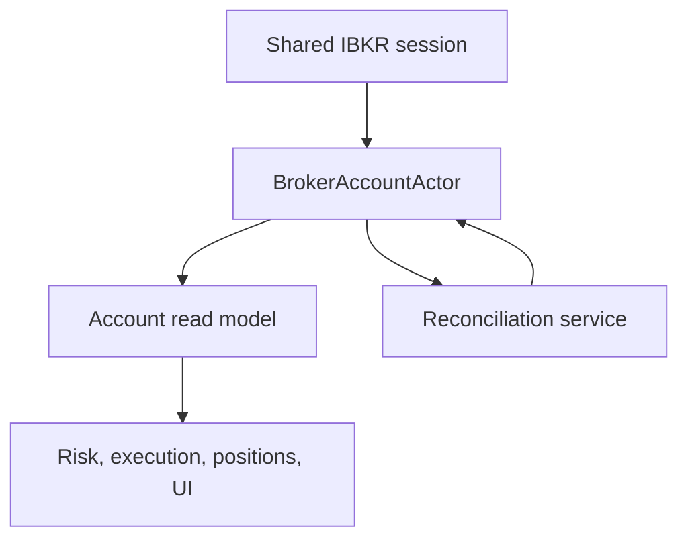
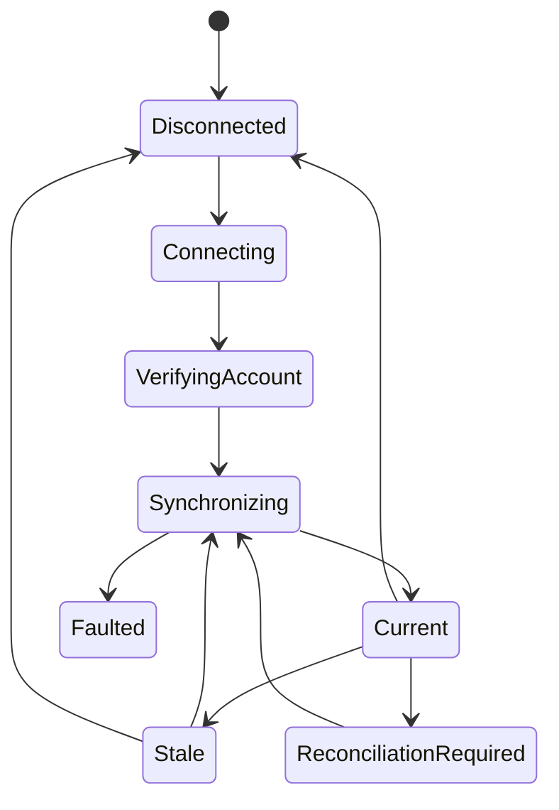

# IBKR Broker Account API Specification

**Document version:** 1.2  
**Status:** Implementation specification  
**Target runtime:** .NET 10 or later  
**Broker API:** Official Interactive Brokers TWS API for C#  
**Host:** Trader Workstation or IB Gateway  
**Implementation project:** `Framework.TradeBroker.InteractiveBrokers`  
**Implementation module:** `Framework.TradeBroker.InteractiveBrokers.BrokerAccount`  
**Shared connection module:** `Framework.TradeBroker.InteractiveBrokers.Connection`  
**Primary account scope:** One configured IBKR trading account  
**Primary product scope:** ES futures and futures options  
**Companion specifications:** `IbkrBrokerConnectionSpecification.md`, `OrderExecutionWorkflowSpecification.md`, `IbkrOrderExecutionAdapterSpecification.md`, `ScriptedBrokerTestHarnessSpecification.md`  
**Last updated:** 2026-08-02

---

## 1. Purpose

This document specifies a Codex-ready IBKR broker-account module for the deterministic trading system. The module provides safe, normalized access to the IBKR account and portfolio information required by execution, portfolio risk, position monitoring, reconciliation, operations, and audit.

The implementation must expose:

- the account or accounts accessible to the logged-in IBKR user;
- net liquidation value, cash, settled cash, buying power, equity, and margin values;
- broker positions and average cost;
- broker portfolio valuation and position P&L;
- account-level daily, realized, and unrealized P&L;
- coherent initial snapshots followed by incremental updates;
- explicit connection, synchronization, completeness, and freshness state;
- discrepancies between internal position state and broker state;
- deterministic read models for `PortfolioRiskActor`, `PositionMonitorActor`, order execution, the operational UI, and monitoring.

This module is an **account telemetry, safety-gating, and reconciliation API**. It is not an online-banking API. It must not automate deposits, withdrawals, credential changes, tax-profile changes, account applications, or arbitrary Client Portal administration.

---

## 2. Executive Architecture Decision

`Framework.TradeBroker.InteractiveBrokers` shall be the single concrete Interactive Brokers implementation of the provider-neutral `Framework.TradeBroker` API. Its `OrderExecution` and `BrokerAccount` modules shall remain separate capabilities while sharing one physical broker-session component in its `Connection` module.

Do not create an unrelated second `EClientSocket`, reader thread, client ID, or login simply because account functions are implemented in a separate assembly. The official TWS API multiplexes requests and asynchronous callbacks over a session. One shared session shall own:

- `EClientSocket`, `EReaderSignal`, `EReader`, and the inbound message pump;
- serialized outbound API calls;
- connection lifecycle and session epochs;
- request-ID and order-ID namespaces;
- callback fan-out to the order, account, position, P&L, and contract modules;
- IBKR error-code classification and connection health;
- TWS or IB Gateway configuration.

`Framework.TradeBroker.InteractiveBrokers.BrokerAccount` shall own only account subscriptions, account-callback normalization, account projections, reconciliation, freshness rules, and mappings to contracts defined by `Framework.TradeBroker`.

Recommended dependency structure:

```text
Framework.TradeBroker
        ^
        |
Framework.TradeBroker.InteractiveBrokers
        +-- Connection
        +-- BrokerAccount
        +-- OrderExecution
        +-- ContractReference
        +-- MarginPreview
        +-- MarketDataVerification
        +-- Reporting/Flex
        |
  Official IBApi and Flex HTTPS API
```

The TWS-backed modules may reference official `IBApi` types internally when translating requests or callbacks, but those types must not cross into `Framework.TradeBroker`, actors, policies, projections, or UI contracts.

`Framework.MarketData.Databento` remains the separate concrete implementation of `Framework.MarketData` and the primary market-data source. The two provider projects meet through broker-neutral workflow inputs and canonical instrument identities; neither concrete provider project depends directly on the other.

`Framework.TradeBroker.InteractiveBrokers.Connection` shall own:

- the physical TWS/IB Gateway connection and single `EWrapper` entry point;
- the reader loop and serialized outbound API-call dispatcher;
- API client ID, connection readiness, session epoch, and reconnect supervision;
- shared request-ID and order-ID allocation;
- request/order correlation registration and callback routing;
- connection-level errors, liveness, pacing coordination, and singleton subscription leases;
- feature registration and current-epoch resynchronization notifications.

It shall not own order workflow state, account snapshots, contract caches, market-data books, margin policy, or reporting data.

No `IBApi` type may cross from the `.InteractiveBrokers` infrastructure projects into broker-neutral framework, domain, strategy, risk, execution-policy, position-monitor, projection, or UI contracts.

This shared-session requirement is a normative refinement to the session ownership described in `IbkrOrderExecutionAdapterSpecification.md`. A dedicated `IbkrBrokerConnectionSpecification.md` shall be the authoritative specification for this cross-cutting component.

---

## 3. Meaning of “Manage the Account”

### 3.1 Included trading-system responsibilities

| Capability | V1 | Owner |
|---|---:|---|
| Verify the configured account is accessible | Required | Account module |
| Receive account summary and ledger values | Required | Account module |
| Receive margin and buying-power values | Required | Account module |
| Receive initial and changing broker positions | Required | Account module |
| Receive portfolio market value and position P&L | Required | Account module |
| Receive real-time account P&L | Required | Account module |
| Receive selected per-position P&L | Required for open positions | Account module |
| Publish a broker-account trading gate | Required | Account module |
| Reconcile broker and internal positions | Required | Reconciliation service |
| Expose read-only queries to application actors | Required | Account read model |
| Persist observations, discrepancies, and readiness changes | Required | Projections/event store |
| Support paper/live environment separation | Required | Configuration/deployment |
| Support multiple accounts or portfolio models | Post-V1 | Account module |
| Retrieve historical statements and confirmations | Post-V1, strongly recommended | Flex reporting module |

### 3.2 Explicitly excluded

- Order placement, modification, and cancellation. Those belong to the IBKR order adapter.
- Strategy decisions, execution-policy decisions, and risk approval.
- Transfers, deposits, withdrawals, bank instructions, or currency conversion orders.
- Authentication-secret creation or rotation through application code.
- Username, password, two-factor authentication, profile, tax, or regulatory-form management.
- Account opening, account closure, permission applications, or market-data subscription purchases.
- Financial Advisor allocation groups, family accounts, and models in V1.
- Treating cached account data as current after a new connection or process restart.
- Treating an internal trade ledger as proof of broker exposure.
- Direct IBKR calls from strategy, UI, risk, or position-monitor code.
- Using the Client Portal Web API as a simultaneous second hot-path account truth source.

---

## 4. Safety Principles

1. **The broker is the book of truth for actual positions, cash, margin, and fills.** Internal state remains authoritative for strategy intent and workflow history.
2. **A snapshot is not complete until its documented end callback is observed.** A partial initial download must never be marked current.
3. **Every connection creates a new session epoch.** Observations from an earlier epoch cannot complete the current epoch.
4. **Unknown is unsafe.** Missing critical account values, an unverified account, an incomplete position download, or an unresolved discrepancy closes the automatic new-risk gate.
5. **No network calls from the risk hot path.** Risk reads an immutable in-memory or Redis-backed projection with explicit version, age, and quality metadata.
6. **Currencies are not interchangeable.** Preserve the currency supplied by IBKR. Never add values across currencies without an explicit, versioned FX conversion policy.
7. **Absence is not zero before completion.** No position callback does not mean a zero position until `positionEnd` completes the initial position set.
8. **Unchanged is not stale by itself.** IBKR account values are incremental and may not be resent when unchanged. Freshness must combine session health, synchronization state, callback evidence, and source-specific age rules.
9. **P&L is telemetry, not an accounting ledger.** Broker P&L reset behavior and market valuation can differ from internal analytics; preserve both sources and label them.
10. **No account callback may directly submit or cancel an order.** It publishes facts and safety gates to the responsible actor.
11. **All mutations are serialized.** Subscription start/stop and refresh operations pass through the shared session’s outbound command queue.
12. **Production starts fail-closed.** Trading remains disabled until the configured account is verified, all mandatory initial data is complete, and reconciliation passes.

---

## 5. Delivery Phases

### 5.1 Required V1 phases

| Phase | Name | Required outcome |
|---|---|---|
| 1 | Shared session and broker-neutral contracts | Shared IBKR transport, account identity verification, immutable contracts, callback routing, request-ID ownership |
| 2 | Account summary, cash, and margin | Coherent critical account values, currency handling, typed normalization, raw-tag preservation, trading gate |
| 3 | Positions, portfolio, and P&L | Complete initial position set, incremental position and valuation updates, account P&L, bounded per-position P&L subscriptions |
| 4 | Reconciliation, projections, and recovery | Broker/internal comparison, discrepancy state, reconnect resynchronization, persistence, Redis latest state, consumer integration |
| 5 | Verification and operational acceptance | Unit, property, replay, scripted-broker, paper-account, reconnect, load, observability, and runbook acceptance |

All five phases are required for the V1 production boundary. A read-only UI displaying account values is not a complete account implementation.

### 5.2 Post-V1 phases

| Phase | Name | Outcome |
|---|---|---|
| 6 | Historical broker reporting | Flex Query retrieval, statements, executions, commissions, cash movements, and end-of-day reconciliation |
| 7 | Multi-account and model support | `reqAccountUpdatesMulti`, `reqPositionsMulti`, account routing, model codes, and per-account gates |
| 8 | Broker-side quote verification | Small, optional IBKR market-data subset for execution diagnostics or fallback—not strategy pricing authority |
| 9 | Advanced margin diagnostics | Rate-limited `WhatIf` previews for exceptional workflows and margin-model comparison |

---

## 6. System Context



### 6.1 Upstream dependencies

- Shared IBKR transport and session supervisor.
- Official IBKR C# TWS API.
- TWS or IB Gateway.
- Internal position ledger and execution projections.
- Contract reference service mapping IBKR `conId` values to canonical instruments.
- Monotonic clock and UTC clock abstractions.
- Configuration and secret providers.

### 6.2 Downstream consumers

| Consumer | Required data | Required behavior |
|---|---|---|
| `PortfolioRiskActor` | NLV, available funds, excess liquidity, margin, buying power, positions, gate | Reject new risk if gate is closed or snapshot version/age is invalid |
| `OrderExecutionActor` | Account verified, session current, position reconciliation state | May submit only after independent risk approval and open gate |
| `PositionMonitorActor` | Broker position, average cost, market value, position P&L | Compare with internal position; never overwrite strategy identity silently |
| Reconciliation workflow | Broker positions plus internal executions/positions | Emit explicit match, difference, or unknown result |
| Operations UI | Values, source currency, ages, completeness, discrepancies | Visibly distinguish current, stale, incomplete, and faulted data |
| Monitoring | Connection, subscription, lag, parsing, discrepancy metrics | Alert without causing direct order mutations |

---

## 7. Assemblies and Component Responsibilities

### 7.1 `Framework.TradeBroker`

Contains broker-neutral types only:

- account identity and environment;
- account-value, ledger, margin, position, portfolio, and P&L records;
- account readiness and trading-gate contracts;
- snapshot version and source metadata;
- broker-account events and queries;
- interfaces consumed by application actors.

It must not reference `IBApi`.

### 7.2 `Framework.TradeBroker.InteractiveBrokers.Connection`

Owns:

- the one active `EClientSocket` and reader loop;
- session connection state and monotonically increasing session epoch;
- outbound API-call serialization;
- request-ID allocation by logical namespace;
- callback routing;
- sensitive-data-safe logging and connection-level error normalization;
- current-time/connection evidence;
- lifecycle hooks used by all TWS API feature implementations.

### 7.3 `Framework.TradeBroker.InteractiveBrokers.BrokerAccount`

Owns:

- account subscription coordination;
- calls to account, position, and P&L request functions;
- normalization of account-related callbacks;
- IBKR tag parsing and typed mapping;
- filtering to the configured account;
- position contract normalization;
- per-position P&L subscription budgeting;
- resubscription after reconnect.

### 7.4 Broker-account application components

Owns:

- `BrokerAccountActor`;
- snapshot assembly and readiness state;
- source-specific freshness evaluation;
- account trading gate;
- reconciliation orchestration;
- event persistence and projection updates;
- consumer notifications.

### 7.5 Broker-account projections

Owns:

- latest-account snapshot projection;
- account observation history;
- broker position projection;
- discrepancy projection;
- UI/query DTOs;
- Redis cache serialization and compare-and-set versioning.

---

## 8. Official TWS API Surface

The implementation shall wrap the current official API surface behind internal interfaces. Exact signatures must be confirmed against the pinned official C# API package during implementation.

### 8.1 Required V1 requests and callbacks

| Purpose | Outbound request | Inbound callback(s) | Completion/cancel evidence |
|---|---|---|---|
| Accessible accounts | `reqManagedAccts()` | `managedAccounts(accountsList)` | One response for the request/session |
| Account summary | `reqAccountSummary(reqId, group, tags)` | `accountSummary(reqId, account, tag, value, currency)` | `accountSummaryEnd(reqId)`; `cancelAccountSummary(reqId)` |
| Account and portfolio updates | `reqAccountUpdates(true, account)` | `updateAccountValue`, `updatePortfolio`, `updateAccountTime` | `accountDownloadEnd(account)`; stop with `reqAccountUpdates(false, account)` |
| All accessible positions | `reqPositions()` | `position(account, contract, pos, avgCost)` | `positionEnd()`; `cancelPositions()` |
| Account P&L | `reqPnL(reqId, account, modelCode)` | `pnl(reqId, dailyPnL, unrealizedPnL, realizedPnL)` | Continuous until `cancelPnL(reqId)` |
| Position P&L | `reqPnLSingle(reqId, account, modelCode, conId)` | `pnlSingle(reqId, pos, dailyPnL, unrealizedPnL, realizedPnL, value)` | Continuous until `cancelPnLSingle(reqId)` |

### 8.2 Post-V1 multi-account requests

| Purpose | Request | Callback(s) |
|---|---|---|
| Account/model updates | `reqAccountUpdatesMulti(requestId, account, modelCode, ledgerAndNLV)` | `accountUpdateMulti`, `accountUpdateMultiEnd` |
| Account/model positions | `reqPositionsMulti(requestId, account, modelCode)` | `positionMulti`, `positionMultiEnd` |
| Family/account relationships | `reqFamilyCodes()` | `familyCodes(...)` |

These functions must not be enabled in the single-account V1 simply for completeness. They are reserved behind versioned capabilities.

### 8.3 Important IBKR constraints encoded by the module

- Only one `reqAccountUpdates` account subscription is active at a time. Starting it for another account replaces the first; the V1 coordinator must prevent accidental switching.
- No more than the documented number of account-summary subscriptions may be active. The V1 coordinator uses one short-lived initial summary request and does not leak subscriptions.
- `reqPositions` initially returns all positions for all accessible accounts, then incremental changes. V1 filters by an exact allow-listed account ID and logs unexpected accounts without publishing them to the configured account projection.
- `positionEnd` completes only the initial position download. Later changes do not produce another end marker.
- `accountDownloadEnd` completes the initial `reqAccountUpdates` download for the account.
- Account and P&L callbacks are asynchronous and may interleave with order callbacks.
- A valid zero-position set is represented by a completed initial download containing no nonzero positions, not by a timeout.

---

## 9. Account Identity and Environment

### 9.1 Required configuration

```csharp
public sealed record IbkrAccountOptions
{
    public required string AccountId { get; init; }
    public required BrokerEnvironment Environment { get; init; }
    public required string BaseCurrency { get; init; }
    public string ModelCode { get; init; } = "";
    public bool EnableMultiAccountApis { get; init; } = false;
}

public enum BrokerEnvironment
{
    Paper,
    Live
}
```

### 9.2 Identity rules

1. Account IDs are loaded from secrets or deployment configuration, never committed to source.
2. Logs and metrics use a stable irreversible alias, not the complete account ID.
3. On every session epoch, `reqManagedAccts` verifies that the configured account is accessible.
4. The actor must enter `Faulted` if the configured account is absent, duplicated after normalization, or does not match the expected paper/live deployment.
5. No “first returned account” fallback is allowed.
6. Trimming surrounding whitespace is allowed; case folding or other account-ID rewriting is not allowed unless the official format explicitly permits it.
7. An unexpected additional accessible account is informational in V1. Data for it is ignored by the configured-account projection.

### 9.3 Account identity contract

```csharp
public readonly record struct BrokerAccountId(string Value);

public sealed record BrokerAccountIdentity(
    BrokerAccountId AccountId,
    string AccountAlias,
    BrokerEnvironment Environment,
    string BaseCurrency,
    string ModelCode,
    bool IsVerified,
    long SessionEpoch,
    DateTimeOffset VerifiedAtUtc);
```

The public/API serialization layer must redact `AccountId.Value` unless the caller is an explicitly authorized internal service.

---

## 10. Readiness and Lifecycle State

### 10.1 State model

```csharp
public enum BrokerAccountReadiness
{
    Disconnected,
    Connecting,
    VerifyingAccount,
    Synchronizing,
    Current,
    Stale,
    ReconciliationRequired,
    Faulted,
    Stopping
}
```

### 10.2 Allowed transitions



Any state may transition to `Stopping`. `Faulted` requires an operator action or a new validated configuration/session before synchronization restarts.

### 10.3 Requirements for `Current`

All conditions are mandatory:

- shared IBKR session is connected and ready in the current epoch;
- configured account has been verified through managed accounts;
- initial account-summary request reached `accountSummaryEnd`;
- initial account/portfolio request reached `accountDownloadEnd`;
- initial position request reached `positionEnd`;
- every critical account field has a valid typed value or an explicitly approved `NotApplicable` status;
- no mandatory callback parse failure is unresolved;
- broker/internal position reconciliation completed for the current snapshot version;
- no critical discrepancy is open;
- freshness policy evaluates as usable;
- environment and account allow-list checks pass.

Account P&L readiness is required only when the session has an open position or the configured policy requires it. Per-position P&L readiness is not required to open the account gate.

### 10.4 Trading gate

```csharp
public enum BrokerAccountGateReason
{
    None,
    Disconnected,
    AccountUnverified,
    InitialDownloadIncomplete,
    CriticalValueMissing,
    CriticalValueInvalid,
    DataStale,
    PositionMismatch,
    PositionStateUnknown,
    MarginUnsafe,
    BrokerRestriction,
    ManualPause,
    Faulted
}

public sealed record BrokerAccountTradingGate(
    bool AllowsNewRisk,
    bool AllowsRiskReduction,
    IReadOnlyList<BrokerAccountGateReason> Reasons,
    long SnapshotVersion,
    long SessionEpoch,
    DateTimeOffset EvaluatedAtUtc);
```

`AllowsRiskReduction` may remain true while `AllowsNewRisk` is false, but this fact does not itself authorize an order. The execution/risk workflow still owns order authorization and its compensation envelope.

---

## 11. Snapshot and Provenance Contracts

### 11.1 Complete snapshot

```csharp
public sealed record BrokerAccountSnapshot(
    BrokerAccountIdentity Identity,
    long SnapshotVersion,
    BrokerAccountReadiness Readiness,
    BrokerAccountTradingGate TradingGate,
    BrokerAccountBalances Balances,
    BrokerAccountMargins Margins,
    BrokerAccountPnl? AccountPnl,
    IReadOnlyDictionary<CurrencyCode, BrokerCurrencyLedger> Ledgers,
    IReadOnlyDictionary<BrokerPositionKey, BrokerPosition> Positions,
    BrokerAccountCompleteness Completeness,
    BrokerAccountFreshness Freshness,
    BrokerAccountQuality Quality,
    DateTimeOffset AssembledAtUtc);
```

### 11.2 Completeness

```csharp
public sealed record BrokerAccountCompleteness(
    bool AccountVerified,
    bool AccountSummaryComplete,
    bool AccountDownloadComplete,
    bool PositionsComplete,
    bool CriticalValuesComplete,
    bool ReconciliationComplete,
    Guid SynchronizationId,
    long SessionEpoch);
```

### 11.3 Source metadata

Every normalized observation must carry:

```csharp
public sealed record BrokerObservationMetadata(
    string Broker,
    long SessionEpoch,
    int? RequestId,
    long ReceiveSequence,
    DateTimeOffset ReceivedAtUtc,
    long ReceivedAtMonotonicTicks,
    string SourceCallback,
    string AdapterVersion,
    string ApiPackageVersion);
```

IBKR callbacks do not provide a reliable exchange-style event time for every account datum. `ReceivedAtUtc` is the adapter receive time and must not be mislabeled as broker calculation time.

### 11.4 Versioning

- `ReceiveSequence` is strictly increasing within one process/session ingress stream.
- `SnapshotVersion` is strictly increasing for each published account snapshot.
- A snapshot version is published only after the actor processes an observation or readiness transition.
- Redis writes use compare-and-set semantics so an older projection cannot overwrite a newer version.
- The session epoch is part of every cache key or serialized payload.

---

## 12. Account Values, Cash, and Margin

### 12.1 Typed balance model

```csharp
public sealed record BrokerAccountBalances(
    MoneyValue NetLiquidation,
    MoneyValue TotalCashValue,
    MoneyValue? SettledCash,
    MoneyValue? AccruedCash,
    MoneyValue? EquityWithLoanValue,
    MoneyValue? GrossPositionValue,
    MoneyValue? PreviousEquityWithLoanValue,
    DecimalValue? Leverage,
    DecimalValue? Cushion);

public sealed record BrokerAccountMargins(
    MoneyValue BuyingPower,
    MoneyValue AvailableFunds,
    MoneyValue ExcessLiquidity,
    MoneyValue InitMarginRequirement,
    MoneyValue MaintenanceMarginRequirement,
    MoneyValue? FullAvailableFunds,
    MoneyValue? FullExcessLiquidity,
    MoneyValue? FullInitMarginRequirement,
    MoneyValue? FullMaintenanceMarginRequirement,
    MoneyValue? LookAheadAvailableFunds,
    MoneyValue? LookAheadExcessLiquidity,
    MoneyValue? LookAheadInitMarginRequirement,
    MoneyValue? LookAheadMaintenanceMarginRequirement,
    DateTimeOffset? LookAheadNextChangeUtc,
    int? HighestSeverity);

public sealed record MoneyValue(decimal Value, CurrencyCode Currency);
public sealed record DecimalValue(decimal Value);
public readonly record struct CurrencyCode(string Value);
```

The implementation may add fields without breaking V1 consumers by extending versioned contracts or an `AdditionalValues` map.

### 12.2 Critical V1 tags

The summary/update normalizer shall recognize at least:

| Category | IBKR key/tag |
|---|---|
| Identity | `AccountType`, `AccountCode` |
| Core equity | `NetLiquidation`, `EquityWithLoanValue`, `PreviousEquityWithLoanValue`, `GrossPositionValue` |
| Cash | `TotalCashValue`, `SettledCash`, `AccruedCash` |
| Capacity | `BuyingPower`, `AvailableFunds`, `ExcessLiquidity`, `Cushion`, `Leverage` |
| Current margin | `InitMarginReq`, `MaintMarginReq` |
| Full margin | `FullInitMarginReq`, `FullMaintMarginReq`, `FullAvailableFunds`, `FullExcessLiquidity` |
| Look-ahead margin | `LookAheadNextChange`, `LookAheadInitMarginReq`, `LookAheadMaintMarginReq`, `LookAheadAvailableFunds`, `LookAheadExcessLiquidity` |
| Risk signal | `HighestSeverity`, `DayTradesRemaining` where applicable |
| P&L fallback/diagnostic | `RealizedPnL`, `UnrealizedPnL` when supplied as account values |

The current official Account Summary Tags and Account Value Keys documentation is authoritative. Unknown future keys must be preserved as raw values and must not crash the stream.

### 12.3 Raw value preservation

```csharp
public sealed record BrokerRawAccountValue(
    string Key,
    string RawValue,
    string RawCurrency,
    string AccountAlias,
    AccountValueSegment Segment,
    BrokerObservationMetadata Metadata);

public enum AccountValueSegment
{
    Total,
    Securities,
    Commodities,
    Unknown
}
```

IBKR account keys may identify securities and commodities segments with suffixes. The parser shall preserve both the original key and normalized segment. Segment values must not silently replace total values.

### 12.4 Parsing rules

1. Parse numbers with invariant culture only.
2. Treat official unset sentinel values, empty strings, `NaN`, and infinities as missing/invalid according to field policy.
3. Use `decimal` for money, position quantity, and average cost in broker-neutral contracts.
4. Convert from IBKR numeric types once at the adapter boundary; record conversion failures.
5. Do not round money except for display. Preserve received precision.
6. Validate currency against an ISO-style uppercase code or documented IBKR pseudo-currency such as the base-summary designation. Preserve unrecognized codes as raw data and close the gate if they affect a critical field.
7. Reject a critical value with a mismatched account ID.
8. Keep the latest value by actor receive sequence, not wall-clock comparison.
9. Preserve all raw values for diagnostics even when a typed value is successfully produced.

### 12.5 Currency policy

- The configured base currency is mandatory.
- Base-currency totals populate `BrokerAccountBalances` and `BrokerAccountMargins`.
- Per-currency cash/ledger data populates `Ledgers`.
- A field received in another currency must not populate a base-currency total.
- V1 does not synthesize base-currency totals using external FX data.
- If IBKR’s summary convention uses a base/summary pseudo-currency label, isolate that behavior in a versioned `IIbkrCurrencyClassifier` and test it against paper-account captures.

---

## 13. Positions and Portfolio Valuation

### 13.1 Position key

```csharp
public readonly record struct BrokerPositionKey(
    BrokerAccountId AccountId,
    int ConId,
    string ModelCode);
```

The IBKR `conId` is the broker identity. Symbol, expiry, strike, right, exchange, multiplier, and local symbol are descriptive attributes and must not replace the key.

### 13.2 Position model

```csharp
public sealed record BrokerPosition(
    BrokerPositionKey Key,
    CanonicalInstrumentId? CanonicalInstrumentId,
    BrokerContractDescriptor Contract,
    decimal Quantity,
    decimal AverageCost,
    MoneyValue? MarketPrice,
    MoneyValue? MarketValue,
    MoneyValue? UnrealizedPnl,
    MoneyValue? RealizedPnl,
    MoneyValue? DailyPnl,
    BrokerPositionQuality Quality,
    BrokerObservationMetadata LastQuantityMetadata,
    BrokerObservationMetadata? LastValuationMetadata);
```

### 13.3 Contract descriptor

```csharp
public sealed record BrokerContractDescriptor(
    int ConId,
    string Symbol,
    string LocalSymbol,
    string SecurityType,
    string Currency,
    string Exchange,
    string? PrimaryExchange,
    string? LastTradeDateOrContractMonth,
    decimal? Strike,
    string? Right,
    string? Multiplier,
    string? TradingClass);
```

### 13.4 Quantity and valuation merge

IBKR supplies related facts through both `position` and `updatePortfolio`.

- `position` is the authoritative V1 source for broker quantity and broker average cost.
- `updatePortfolio` supplies account-scoped position, market price, market value, average cost, unrealized P&L, and realized P&L.
- The actor merges them by exact account and `conId`.
- A quantity difference between the two streams is a temporary discrepancy during a configurable convergence window; after the window it becomes a critical discrepancy.
- The module never manufactures a `BAG` strategy position. IBKR position callbacks normally expose the actual leg contracts. Strategy grouping remains an internal position-monitor concern.
- A zero quantity update removes the position from the active position dictionary only after persisting the observation/tombstone.
- Missing valuation does not remove a valid nonzero position.

### 13.5 Canonical-instrument resolution

- First look up `conId` in the contract-reference cache.
- If missing, publish the broker position immediately with `CanonicalInstrumentId = null` and close the new-risk gate for affected reconciliation.
- Queue an idempotent contract-details resolution through the contract-reference module.
- Never block the IBKR reader thread while resolving a contract.
- After resolution, publish a new snapshot version and rerun reconciliation.

### 13.6 Position completeness

At the start of synchronization:

1. Create an empty staging dictionary for the current synchronization ID.
2. Apply matching `position` callbacks to staging.
3. Ignore for projection purposes—but count and log—positions belonging to other accounts.
4. On `positionEnd`, atomically compare staging with the previous active set.
5. Emit zero/removal observations for positions previously active but absent from the completed set.
6. Promote staging to the active set.
7. Mark `PositionsComplete = true` only for the current epoch and synchronization ID.

Incremental position callbacks after `positionEnd` update the active set directly.

---

## 14. Account and Position P&L

### 14.1 Account P&L

```csharp
public sealed record BrokerAccountPnl(
    MoneyValue Daily,
    MoneyValue Unrealized,
    MoneyValue Realized,
    string ResetScheduleSource,
    BrokerObservationMetadata Metadata);
```

Start exactly one account P&L subscription for the configured account and model code after account verification. Correlate every callback by request ID. Values are account-currency telemetry as defined by IBKR and must be labeled with the configured/account P&L currency policy.

IBKR P&L is affected by the P&L reset behavior configured in TWS. The module must not describe daily P&L as “since application start” or as a final accounting statement.

### 14.2 Per-position P&L

Per-position subscriptions shall be managed by `IbkrPositionPnlSubscriptionManager`.

Rules:

- Subscribe only for a nonzero position in the configured account.
- Use account, model code, and `conId` exactly.
- Cancel promptly after a confirmed zero position.
- Use a deterministic maximum active-subscription budget.
- If open positions exceed the budget, prioritize positions owned by the active trading system, then highest absolute risk/notional, then stable `conId` order.
- Subscription priority cannot be based on nondeterministic dictionary iteration.
- A missing or invalid callback must not zero P&L.
- Per-position P&L staleness affects monitoring quality but does not invalidate known quantity.

### 14.3 P&L data hierarchy

| Use | Preferred source | Fallback/diagnostic |
|---|---|---|
| Actual broker quantity | `position` | `updatePortfolio` quantity |
| Broker average cost | `position` | `updatePortfolio` average cost |
| Position market value | `updatePortfolio` | `pnlSingle.value` when semantically equivalent and validated |
| Position daily P&L | `pnlSingle` | none |
| Position unrealized/realized P&L | `pnlSingle` | `updatePortfolio` |
| Account daily/unrealized/realized P&L | `pnl` | account-value tags for diagnostic comparison |
| Historical/final activity | Flex statement | Never reconstruct solely from real-time P&L |

Differences between legitimate P&L sources are recorded and surfaced; they are not automatically “corrected” by choosing the numerically preferred value.

---

## 15. Subscription Coordinator

### 15.1 Startup sequence

After the shared session signals readiness:

1. Begin a new `SessionEpoch` and `SynchronizationId`.
2. Mark the account `VerifyingAccount` and close both account data and new-risk gates.
3. Call `reqManagedAccts()`.
4. Verify the exact configured account.
5. Allocate one account-summary request ID and call `reqAccountSummary` using `group = "All"` and the explicit V1 tag list.
6. Start `reqAccountUpdates(true, configuredAccount)`.
7. Start `reqPositions()`.
8. Start one `reqPnL` subscription.
9. Stage callbacks until their required end markers arrive.
10. Cancel the initial account-summary subscription after `accountSummaryEnd` unless a documented operational reason requires it to remain open.
11. Normalize and validate critical fields.
12. Resolve unknown position contracts.
13. Reconcile broker positions against the internal book.
14. Publish `Current` only when all gates pass.

The relative request ordering after account verification is deterministic. Callback interleaving is expected and must be safe.

### 15.2 Shutdown sequence

1. Mark `Stopping` and close new-risk permission.
2. Cancel all per-position P&L subscriptions in stable request-ID order.
3. Cancel the account P&L subscription.
4. Cancel any active account-summary request.
5. Stop account updates for the configured account.
6. Cancel the positions subscription only if this module is the shared subscription owner and no other module has a lease.
7. Persist final readiness/health state.
8. Release subscription leases; the shared transport owns socket disconnection.

### 15.3 Shared subscription leases

The order adapter may also require positions for reconciliation. Implement a reference-counted or owner-set lease:

```csharp
public interface IIbkrSubscriptionLeaseManager
{
    ValueTask<IAsyncDisposable> AcquirePositionsAsync(
        string owner,
        CancellationToken cancellationToken);
}
```

Only the lease manager may start or cancel the singleton `reqPositions` subscription. Account and order modules receive the same normalized position stream.

### 15.4 Reconnect sequence

On disconnect:

- invalidate all current-epoch completeness flags;
- retain the last snapshot only as historical/stale evidence;
- close `AllowsNewRisk` immediately;
- do not emit synthetic zero values or zero positions;
- cancel local subscription bookkeeping without assuming the broker processed cancel calls;
- increment reconnect/failure metrics.

After reconnect, perform the full startup synchronization. Incremental callbacks alone cannot restore `Current`; all required current-epoch end markers and reconciliation must complete again.

---

## 16. Freshness Policy

### 16.1 Separate freshness dimensions

```csharp
public sealed record BrokerAccountFreshness(
    DataFreshness Connection,
    DataFreshness AccountValues,
    DataFreshness Positions,
    DataFreshness PortfolioValuation,
    DataFreshness AccountPnl,
    DateTimeOffset EvaluatedAtUtc);

public sealed record DataFreshness(
    FreshnessStatus Status,
    TimeSpan Age,
    TimeSpan AllowedAge,
    string Evidence);

public enum FreshnessStatus
{
    Unknown,
    Current,
    Degraded,
    Stale,
    NotApplicable
}
```

### 16.2 Default policy profile

Defaults are configuration, not hidden constants:

| Dimension | Suggested paper default | Interpretation |
|---|---:|---|
| Shared connection evidence | 30 seconds | Heartbeat/current-time or other validated session evidence |
| Initial synchronization deadline | 30 seconds | Failure triggers retry/reconciliation, never partial promotion |
| Account value maximum age | 4 minutes | Accommodates IBKR’s incremental/change-driven account update cadence |
| Position set maximum age | Session based | A completed subscription remains current while session health is current; changes arrive incrementally |
| Portfolio valuation maximum age with open positions | 15 seconds during market session | Degrade monitoring if valuation stops while connection remains healthy |
| Account P&L maximum age with open positions | 5 seconds during market session | Degrade P&L quality; quantity remains valid |
| Position merge convergence window | 5 seconds | Temporary difference between position/portfolio streams before discrepancy |
| Reconciliation maximum age before new order | 60 seconds | May be refreshed by an execution/position change and successful comparison |

The production values must be calibrated from paper and live-safe observation. Do not use the account-value timeout as a claim that IBKR promises that exact cadence.

### 16.3 Market-session awareness

- P&L and valuation freshness policy may distinguish regular, extended, and closed sessions.
- Session classification comes from the system’s trading calendar, not local wall-clock assumptions.
- Connection and account-identity freshness requirements apply even when markets are closed.
- An open broker position never becomes zero or safe merely because its valuation is stale.

---

## 17. Account Snapshot Assembly

### 17.1 Staging buffers

Maintain separate current-synchronization buffers for:

- managed-account verification;
- account summary;
- account values and portfolio callbacks;
- complete positions;
- P&L subscriptions.

Each buffer includes `SessionEpoch` and `SynchronizationId`. A callback with a mismatched request ID or epoch is recorded as late/foreign and cannot complete the active buffer.

### 17.2 Atomic promotion

The actor may publish intermediate snapshots while synchronizing, but they must have:

- `Readiness = Synchronizing`;
- `AllowsNewRisk = false`;
- exact completeness flags;
- no implication that absent positions are zero.

Only the actor can atomically promote the complete staged account state to `Current` after validation and reconciliation.

### 17.3 Required critical-field profile

```csharp
public sealed record CriticalAccountFieldProfile(
    IReadOnlySet<string> RequiredSummaryTags,
    IReadOnlySet<string> RequiredUpdateKeys,
    IReadOnlySet<string> OptionalKeys,
    string Version);
```

For a standard single-account V1, the final implementation profile must require at least:

- net liquidation;
- total cash value;
- buying power;
- available funds;
- excess liquidity;
- initial margin requirement;
- maintenance margin requirement;
- account type/account identity;
- completed broker position set.

If IBKR does not provide an otherwise required value for the actual account type, mark it `NotApplicable` only through an explicit tested account-type rule. Do not silently downgrade it to optional at runtime.

---

## 18. Broker/Internal Reconciliation

### 18.1 Authority model

| Fact | Authority |
|---|---|
| Strategy identity, planned legs, approved quantity | Internal event-sourced workflow |
| Submitted order intent | Internal execution aggregate |
| Broker order/execution/fill fact | IBKR order/execution callbacks and reconciliation |
| Actual account position quantity | IBKR position state |
| Broker cash and margin | IBKR account state |
| Internal analytic Greeks and theoretical value | Internal market/risk services |
| Historical statement totals | IBKR Flex reporting after retrieval |

### 18.2 Reconciliation key and normalization

- Compare positions by configured account, IBKR `conId`, and model code.
- Normalize quantities as decimals and compare exact contract units unless an instrument-specific tolerance is explicitly documented.
- Do not match options by display symbol alone.
- Do not net different expiries, strikes, rights, or multipliers.
- Internal combo positions are expanded into their canonical leg quantities before comparison.

### 18.3 Reconciliation result

```csharp
public enum PositionReconciliationStatus
{
    Match,
    BrokerOnly,
    InternalOnly,
    QuantityMismatch,
    ContractUnresolved,
    Unknown
}

public sealed record PositionDiscrepancy(
    BrokerPositionKey Key,
    PositionReconciliationStatus Status,
    decimal BrokerQuantity,
    decimal InternalQuantity,
    decimal Difference,
    string Reason,
    long BrokerSnapshotVersion,
    long InternalBookVersion,
    DateTimeOffset DetectedAtUtc);
```

### 18.4 Behavior

- `Match`: permit downstream gate evaluation.
- `BrokerOnly`: close new-risk gate; publish critical alert; require ownership classification or manual resolution.
- `InternalOnly`: close new-risk gate; query broker order/execution evidence through the order adapter; do not create a broker position internally.
- `QuantityMismatch`: close new-risk gate; classify active execution/late fill possibilities; trigger order/execution reconciliation.
- `ContractUnresolved`: close affected account/instrument new-risk gate; resolve contract.
- `Unknown`: close gate and retry bounded reconciliation.

The account module does not autonomously flatten, complete, or alter a position. Compensation remains owned by `OrderExecutionWorkflowSpecification.md` or a separately approved position-recovery workflow.

### 18.5 Reconciliation triggers

- successful initial synchronization;
- reconnect synchronization;
- every position quantity change;
- every completed execution attempt;
- late fill or execution discovery;
- internal position-book version change;
- operator request;
- scheduled safety check during active trading;
- before opening the new-risk gate after a stale/fault state.

---

## 19. Broker-Neutral Interfaces

### 19.1 Consumer read interface

```csharp
public interface IBrokerAccountReadModel
{
    BrokerAccountSnapshot GetLatest();

    bool TryGetPosition(
        BrokerPositionKey key,
        out BrokerPosition position);
}
```

Requirements:

- Synchronous calls read immutable local state only.
- No IBKR/network call is allowed.
- Returned collections are immutable or read-only snapshots.
- Consumers validate `TradingGate`, `SnapshotVersion`, `SessionEpoch`, and freshness.
- The implementation is safe for concurrent reads.

### 19.2 Actor query contract

```csharp
public sealed record GetBrokerAccountSnapshot(
    Guid CorrelationId,
    long? MinimumSnapshotVersion = null);

public sealed record BrokerAccountSnapshotResponse(
    Guid CorrelationId,
    BrokerAccountSnapshot Snapshot);
```

### 19.3 Administrative command interface

```csharp
public interface IBrokerAccountAdministration
{
    ValueTask RequestResynchronizationAsync(
        AccountResynchronizationReason reason,
        CancellationToken cancellationToken);

    ValueTask SetManualPauseAsync(
        bool paused,
        string operatorId,
        string reason,
        CancellationToken cancellationToken);
}
```

This interface is operationally authenticated and audited. It does not contain order functions or financial-transfer functions.

### 19.4 IBKR infrastructure interface

```csharp
internal interface IIbkrAccountCommands
{
    ValueTask RequestManagedAccountsAsync(CancellationToken cancellationToken);
    ValueTask RequestAccountSummaryAsync(int requestId, string group, string tags, CancellationToken cancellationToken);
    ValueTask CancelAccountSummaryAsync(int requestId, CancellationToken cancellationToken);
    ValueTask SetAccountUpdatesAsync(bool subscribe, string account, CancellationToken cancellationToken);
    ValueTask<IAsyncDisposable> AcquirePositionsAsync(string owner, CancellationToken cancellationToken);
    ValueTask RequestAccountPnlAsync(int requestId, string account, string modelCode, CancellationToken cancellationToken);
    ValueTask CancelAccountPnlAsync(int requestId, CancellationToken cancellationToken);
    ValueTask RequestPositionPnlAsync(int requestId, string account, string modelCode, int conId, CancellationToken cancellationToken);
    ValueTask CancelPositionPnlAsync(int requestId, CancellationToken cancellationToken);
}
```

Every method enqueues a serialized outbound session operation and returns dispatch acceptance, not broker completion.

---

## 20. Callback Normalization

### 20.1 Normalized messages

Implement immutable messages including:

- `IbkrManagedAccountsObserved`;
- `IbkrAccountSummaryValueObserved`;
- `IbkrAccountSummaryCompleted`;
- `IbkrAccountValueObserved`;
- `IbkrPortfolioValueObserved`;
- `IbkrAccountUpdateTimeObserved`;
- `IbkrAccountDownloadCompleted`;
- `IbkrPositionObserved`;
- `IbkrPositionsCompleted`;
- `IbkrAccountPnlObserved`;
- `IbkrPositionPnlObserved`;
- `IbkrAccountRequestErrorObserved`;
- `IbkrSessionStateChanged`.

Each includes metadata and correlation identifiers where available.

### 20.2 Reader-thread rule

Callbacks must perform only bounded work:

1. capture primitive/IBApi callback fields;
2. copy contract fields into a broker-neutral raw DTO;
3. assign ingress metadata and sequence;
4. enqueue to a bounded channel or actor mailbox;
5. return.

No callback may:

- block on a database, Redis, HTTP, or another actor;
- call `placeOrder`, cancel an order, or invoke risk logic;
- resolve contracts synchronously;
- perform unbounded logging or serialization;
- throw through the TWS reader loop because a tag is unknown.

### 20.3 Backpressure

- The account channel is bounded and instrumented.
- Critical identity, completion, quantity, connection, and error messages must not be silently dropped.
- Coalescing is permitted only for replaceable high-frequency valuation/P&L updates with the same key, within the same epoch, before actor processing.
- Coalescing must preserve the newest receive sequence and increment a coalesced-count metric.
- If guaranteed delivery cannot be maintained, close the account gate and force resynchronization.

---

## 21. Request-ID Ownership and Correlation

The shared transport shall allocate request IDs from one collision-free process-wide allocator. Logical ranges may aid diagnostics but must not rely on unsafe fixed constants across instances.

```csharp
public enum IbkrRequestPurpose
{
    AccountSummary,
    AccountPnl,
    PositionPnl,
    AccountUpdatesMulti,
    PositionsMulti,
    ContractDetails,
    Other
}

public interface IIbkrRequestIdAllocator
{
    int Allocate(IbkrRequestPurpose purpose, string owner);
    void Release(int requestId, IbkrRequestPurpose purpose, string owner);
}
```

Requirements:

- Never reuse a request ID while an active or cancellation-draining request can still emit callbacks.
- Correlation state includes purpose, configured account alias, session epoch, start time, and lifecycle.
- A callback with an unknown request ID is recorded and ignored for projection mutation unless the callback type is an unscoped singleton stream such as positions.
- On reconnect, retire all request IDs from the old epoch and allocate new IDs.

---

## 22. Actor Commands, Events, and Timers

### 22.1 Commands/messages

The `BrokerAccountActor` shall process at least:

- `BrokerSessionBecameReady`;
- `BrokerSessionDisconnected`;
- every normalized callback message in Section 20;
- `SynchronizationDeadlineElapsed`;
- `FreshnessEvaluationDue`;
- `ReconciliationCompleted`;
- `ContractResolutionCompleted`;
- `InternalPositionBookChanged`;
- `RequestBrokerAccountResynchronization`;
- `SetBrokerAccountManualPause`;
- `StopBrokerAccount`.

Timers carry actor generation, session epoch, and synchronization ID. Stale timers are ignored deterministically.

### 22.2 Durable domain events

Persist low-volume safety and lifecycle facts in the authoritative event store:

- `BrokerAccountSynchronizationStarted`;
- `BrokerAccountIdentityVerified`;
- `BrokerAccountInitialDownloadCompleted`;
- `BrokerAccountBecameCurrent`;
- `BrokerAccountBecameStale`;
- `BrokerAccountGateChanged`;
- `BrokerAccountDiscrepancyDetected`;
- `BrokerAccountDiscrepancyResolved`;
- `BrokerAccountFaulted`;
- `BrokerAccountManualPauseChanged`;
- `BrokerAccountSessionDisconnected`.

Do not write every one-second P&L callback into the primary PostgreSQL event stream.

### 22.3 Observation persistence

- Detailed account, position, valuation, and P&L observations go to a ScyllaDB `BrokerAccountObservationLog` or equivalent append-oriented projection.
- Latest immutable snapshot goes to Redis and process memory.
- Periodic compact snapshots and every position/account-gate change are retained for audit.
- Raw IBKR strings are retained for a bounded diagnostic period with account IDs redacted/encrypted according to policy.
- Persistence failure for lifecycle or position changes closes the new-risk gate.
- Loss of optional high-frequency P&L history degrades analytics but must still alert and record a gap marker.

---

## 23. Data Stores and Suggested Schemas

### 23.1 Redis latest state

Suggested keys:

```text
broker-account:{environment}:{accountAlias}:snapshot
broker-account:{environment}:{accountAlias}:gate
broker-account:{environment}:{accountAlias}:position:{conId}:{modelCode}
```

Store serialized contract version, snapshot version, session epoch, and expiry metadata. Redis expiry is not the primary freshness decision; the object’s freshness fields are.

### 23.2 Scylla account observation log

Suggested partitioning:

```text
Partition key: (account_alias, trading_date_utc)
Clustering:    received_at_utc, receive_sequence
```

Suggested columns:

- observation type;
- session epoch and synchronization ID;
- snapshot version;
- request ID/purpose;
- account-value key, typed value, raw value, currency, segment;
- `conId`, model code, quantity, average cost, valuation/P&L fields;
- completeness/readiness/gate fields;
- adapter/API versions;
- parse quality and error reason.

### 23.3 Discrepancy projection

Key by account alias and broker position key. Retain first detected, last observed, resolved timestamp, broker/internal versions, severity, operator notes, and resolution classification.

---

## 24. Error and Warning Handling

### 24.1 Categories

```csharp
public enum BrokerAccountErrorCategory
{
    Connection,
    Authentication,
    AccountPermission,
    InvalidRequest,
    Pacing,
    SubscriptionConflict,
    ParseFailure,
    ContractResolution,
    Persistence,
    Reconciliation,
    Unknown
}
```

The mapping from IBKR numeric error codes/messages to this enum must be versioned and tested. Do not embed business behavior throughout switch statements in callback handlers.

### 24.2 Required behavior

| Error | Action |
|---|---|
| Connection lost | Mark disconnected/stale, close new-risk gate, start shared reconnect policy |
| Configured account inaccessible | Fault; no automatic account substitution |
| Account subscription switched unexpectedly | Fault subscription coordinator and resynchronize |
| Summary request rejected | Retry with bounded backoff if transient; otherwise fault/close gate |
| Position subscription failure | Close gate and resynchronize |
| P&L request failure | Degrade P&L quality; close gate only if current policy requires P&L |
| Critical parse failure | Preserve raw value, close gate, alert, require corrected parser/version |
| Unknown noncritical key | Preserve and metric; continue |
| Channel overflow/dropped critical callback | Close gate and force full resynchronization |
| Persistence failure | Close gate for lifecycle/position data; retry without blocking reader |

### 24.3 Retry policy

- Retries are bounded, deterministic, and keyed by session epoch.
- Use monotonic time and configured intervals.
- Do not create duplicate long-lived subscriptions.
- Before retrying a timed-out summary/P&L request, cancel/retire the old request ID and allocate a new one according to the coordinator state machine.
- Session reconnect retries belong to shared transport, not the account actor.

---

## 25. Configuration

```csharp
public sealed record BrokerAccountModuleOptions
{
    public required IbkrAccountOptions Account { get; init; }
    public required TimeSpan InitialSynchronizationTimeout { get; init; }
    public required TimeSpan ConnectionEvidenceMaxAge { get; init; }
    public required TimeSpan AccountValueMaxAge { get; init; }
    public required TimeSpan PortfolioValuationMaxAge { get; init; }
    public required TimeSpan AccountPnlMaxAge { get; init; }
    public required TimeSpan PositionMergeConvergenceWindow { get; init; }
    public required TimeSpan ReconciliationMaxAge { get; init; }
    public required int MaxPositionPnlSubscriptions { get; init; }
    public required CriticalAccountFieldProfile CriticalFields { get; init; }
    public required string FreshnessPolicyVersion { get; init; }
    public required string AccountValueMappingVersion { get; init; }
}
```

Validation at process start shall reject:

- empty account ID or base currency;
- live environment using paper-only endpoint/profile or the reverse;
- nonpositive timeouts;
- a freshness threshold shorter than the calibrated source behavior without an explicit override;
- zero/negative P&L subscription budget when per-position P&L is required;
- missing critical-field profile/version;
- multi-account APIs enabled for the V1 single-account deployment;
- unredacted account ID configured as a metric label.

Configuration affecting account gates is versioned and included in snapshot quality metadata.

---

## 26. Security and Privacy

- TWS/IB Gateway connection settings and account ID come from the approved secret/configuration provider.
- The application must never accept IBKR usernames, passwords, or two-factor codes through its public API.
- Bind TWS/IB Gateway API access to loopback or an explicitly secured private network.
- Use TWS/IB Gateway trusted-IP and read-only settings according to deployment role; the shared execution session cannot be read-only when it must trade.
- Separate paper and live processes, configuration, secrets, ports, client IDs, databases/partitions, dashboards, and alerts.
- Redact account IDs, usernames, and access tokens in logs, traces, metrics, exception messages, and test fixtures.
- Restrict account-snapshot endpoints because positions and balances are sensitive financial data.
- Audit manual pause, resynchronization, discrepancy classification, and gate override attempts.
- No operator may directly force `Current`; only a successful synchronization/reconciliation can do so.
- Do not implement an account-gate bypass. Emergency risk-reduction workflows require their own explicit authorization and audit path.

---

## 27. Observability

### 27.1 Metrics

At minimum:

```text
ibkr_account_readiness{environment,account_alias}
ibkr_account_gate_allows_new_risk{environment,account_alias}
ibkr_account_session_epoch{environment,account_alias}
ibkr_account_snapshot_version{environment,account_alias}
ibkr_account_sync_duration_seconds{environment,account_alias}
ibkr_account_sync_failures_total{environment,reason}
ibkr_account_value_age_seconds{environment,field_group}
ibkr_account_position_count{environment,account_alias}
ibkr_account_position_discrepancies{environment,status}
ibkr_account_callbacks_total{environment,callback}
ibkr_account_callback_parse_failures_total{environment,callback,field}
ibkr_account_unknown_keys_total{environment,key_hash}
ibkr_account_channel_depth{environment}
ibkr_account_callbacks_coalesced_total{environment,callback}
ibkr_account_pnl_subscription_count{environment}
ibkr_account_subscription_errors_total{environment,purpose,category}
```

Do not use raw account IDs, `conId` values with unbounded cardinality, symbols, or raw error messages as general metric labels.

### 27.2 Structured logs

Include:

- account alias;
- environment;
- session epoch and synchronization ID;
- request ID and purpose;
- receive sequence;
- snapshot/internal-book version;
- readiness/gate transition;
- hashed/redacted instrument identity;
- normalized error category and IBKR code;
- callback age and persistence result.

Raw balances and full position details should not appear in routine info logs.

### 27.3 Alerts

Critical alerts:

- live account unexpectedly unverified;
- account in `Disconnected`, `Stale`, `ReconciliationRequired`, or `Faulted` during an active trading session;
- broker/internal position discrepancy;
- critical callback parse failure;
- critical callback loss/channel overflow;
- account data persistence failure;
- paper/live environment mismatch;
- manual pause or attempted bypass;
- synchronization timeout after bounded retries.

---

## 28. Determinism and Replay

The account module is an external-observation processor. Determinism means the same ordered normalized callbacks, configuration versions, timer messages, internal-book versions, and prior actor state produce the same snapshots, events, gates, and reconciliation results.

Requirements:

- Clock access is injected through `IUtcClock` and `IMonotonicClock`.
- Timer firings are explicit actor messages in replay.
- Dictionary traversal affecting output uses stable key ordering.
- Snapshot hashes use a canonical serialization.
- Parsing uses invariant culture.
- The replay harness controls session epoch, request IDs, receive sequences, and callback order.
- Wall-clock freshness decisions are reproduced from recorded evaluation messages.
- Network timing or task scheduling must not alter state-transition outcomes.

The module need not reproduce the broker’s P&L calculation. It must reproduce how received P&L observations affected its own state.

---

## 29. Testing Strategy

### 29.1 Unit tests

Cover:

- every critical account tag and segment suffix;
- invariant-culture numeric parsing;
- unset/missing/NaN/infinite values;
- currency classification and base-currency selection;
- managed-account allow-list verification;
- end-marker completeness rules;
- position staging, zero positions, removals, and incremental updates;
- merging `position` and `updatePortfolio`;
- P&L request correlation and lifecycle;
- readiness and gate transitions;
- freshness calculations by market session;
- request-ID retirement after reconnect;
- stale callback/timer rejection;
- stable subscription prioritization;
- redaction.

### 29.2 Property tests

Prove or heavily sample:

- a snapshot cannot be `Current` without all mandatory current-epoch completion flags;
- old-epoch callbacks never complete a new synchronization;
- absent position callbacks before `positionEnd` never create a zero position conclusion;
- no unverified account can allow new risk;
- any critical discrepancy closes new-risk permission;
- snapshot versions are strictly increasing;
- duplicate observations are idempotent when sequence/deduplication identity matches;
- stable input ordering produces stable snapshot serialization/hash;
- unknown noncritical tags cannot crash processing;
- account ID never appears in metric labels or normal logs.

### 29.3 Scripted broker tests

Extend or reuse `ScriptedBrokerTestHarnessSpecification.md` with an account-capable scripted port. Scenarios must include:

1. Normal initial account/position download.
2. Zero-position account followed by `positionEnd`.
3. Callbacks arriving in every meaningful interleaving before end markers.
4. Missing `accountSummaryEnd`.
5. Missing `accountDownloadEnd`.
6. Missing `positionEnd`.
7. Duplicate end markers.
8. Late old-epoch callbacks after reconnect.
9. Account values updating without position changes.
10. Position change preceding portfolio valuation.
11. Portfolio quantity preceding position quantity.
12. Temporary mismatch converging inside the window.
13. Persistent mismatch becoming a discrepancy.
14. Unknown `conId` resolved later.
15. P&L callback with invalid request ID.
16. P&L stream stops while connection remains healthy.
17. Account summary subscription error/pacing error.
18. Unexpected accessible account.
19. Configured account absent.
20. Channel pressure with safe valuation coalescing.
21. Critical callback overflow causing resynchronization.
22. Persistence outage.
23. Process restart with a stale Redis snapshot.
24. Manual pause across reconnect.
25. Paper/live configuration mismatch.

### 29.4 Paper-account integration tests

Using IB Gateway or TWS paper trading:

- connect and verify only the intended paper account;
- capture and validate actual critical tags/currencies for the account type;
- confirm initial end-marker behavior;
- establish and close a small permitted paper position;
- verify position, portfolio, and P&L convergence;
- restart the process with an open paper position;
- disconnect/reconnect the gateway;
- confirm no new-risk gate opens until full resynchronization;
- compare TWS Account/Portfolio windows with normalized read models;
- verify the order and account modules coexist on the same session without request-ID collisions;
- retain redacted callback fixtures for regression tests.

### 29.5 Live-readiness test boundary

No live order is authorized by this specification. Before the account module can support restricted live trading, require:

- all automated suites green;
- an approved paper soak period including gateway resets/reconnects;
- no unexplained account/position mismatch;
- verified alert routing and runbook;
- exact live account/environment allow-list review;
- rollback to closed new-risk gate on deployment failure;
- sign-off on official API package and TWS/IB Gateway version compatibility.

---

## 30. Phase-by-Phase Codex Implementation Plan

### Phase 1 — Shared session and contracts

Codex shall:

1. Create or extend provider-neutral `Framework.TradeBroker` types for identity, snapshot, completeness, freshness, quality, gate, positions, P&L, and metadata.
2. Implement or consume `Framework.TradeBroker.InteractiveBrokers.Connection` according to `IbkrBrokerConnectionSpecification.md`.
3. Implement `Framework.TradeBroker.InteractiveBrokers.BrokerAccount` inside the concrete IBKR provider project.
4. Implement account-ID redaction and paper/live environment validation.
5. Implement normalized account callback messages and bounded ingress channel.
6. Add unit tests for session epoch, correlation, redaction, and callback routing.

Exit criteria:

- order and account adapters compile against one shared session abstraction;
- no `IBApi` type exists in broker-neutral assemblies;
- account callbacks can be replayed without a broker;
- request-ID collision tests pass.

### Phase 2 — Account summary, cash, margin, and gate

Codex shall:

1. Implement managed-account verification.
2. Implement the explicit account-summary tag request and lifecycle.
3. Implement `reqAccountUpdates` ownership and callbacks.
4. Implement raw account-value storage, segment parsing, typed mapping, and currency policy.
5. Implement synchronization buffers, completion flags, freshness, and critical-field validation.
6. Implement `BrokerAccountActor`, immutable latest read model, and closed-by-default gate.
7. Add unit/property/scripted tests for incomplete, invalid, stale, and duplicate data.

Exit criteria:

- paper callback captures produce correct balances/margins;
- no partial snapshot becomes current;
- all invalid critical-value cases close the gate;
- account-summary subscription is cancelled/retired correctly.

### Phase 3 — Positions, portfolio, and P&L

Codex shall:

1. Implement the shared positions subscription lease.
2. Implement initial position staging and atomic promotion at `positionEnd`.
3. Normalize `updatePortfolio` and merge valuation with position quantity.
4. Integrate canonical contract lookup/async resolution.
5. Implement account P&L and bounded per-position P&L subscription manager.
6. Publish position and P&L updates to `PositionMonitorActor` through broker-neutral messages.
7. Add callback interleaving, merge-window, reconnect, and subscription-budget tests.

Exit criteria:

- zero and nonzero position sets are represented correctly;
- open paper positions converge across position/portfolio/P&L views;
- no stale P&L value can replace quantity truth;
- old-epoch subscriptions/callbacks are harmless.

### Phase 4 — Reconciliation, recovery, and projections

Codex shall:

1. Implement broker/internal leg-level reconciliation by account and `conId`.
2. Implement discrepancy lifecycle and new-risk gate integration.
3. Persist lifecycle/discrepancy events and detailed Scylla observations.
4. Implement Redis latest projection with version compare-and-set.
5. Implement reconnect and process-restart resynchronization.
6. Integrate `PortfolioRiskActor`, execution, position monitoring, and UI DTOs.
7. Add persistence-outage, restart, late-fill, and unknown-contract tests.

Exit criteria:

- a stale persisted snapshot is never considered current after restart;
- any broker/internal mismatch is visible and blocks new risk;
- successful reconciliation reopens the gate only after all other checks pass;
- consumers make no direct IBKR calls.

### Phase 5 — Operational acceptance

Codex shall:

1. Implement metrics, traces, logs, alerts, and redaction tests.
2. Add paper integration/soak test tooling and callback capture/replay.
3. Create operator runbooks for disconnect, synchronization timeout, discrepancy, parse failure, persistence outage, and manual pause.
4. Produce an API compatibility report containing pinned IBApi, TWS/IB Gateway, .NET, schema, and adapter versions.
5. Execute the complete V1 acceptance checklist.

Exit criteria:

- paper soak and restart tests pass;
- operational alerts are demonstrated;
- no unresolved high-severity defect or discrepancy remains;
- live deployment remains disabled until separate approval.

---

## 31. V1 Acceptance Checklist

### Architecture

- [ ] Order and account modules share one IBKR transport/session.
- [ ] Only infrastructure references `IBApi`.
- [ ] One configured account is exact-match allow-listed.
- [ ] Request-ID ownership is collision-free.
- [ ] Paper and live environments are isolated.

### Account state

- [ ] Managed-account verification is required each epoch.
- [ ] Account summary, account download, and positions have explicit completion flags.
- [ ] Critical balance and margin values are typed and currency-safe.
- [ ] Raw keys and unknown noncritical keys are preserved.
- [ ] Snapshot/version/session metadata is available to every consumer.
- [ ] New-risk gate is fail-closed.

### Positions and P&L

- [ ] Position absence is trusted only after `positionEnd`.
- [ ] Positions are keyed by account/model/`conId`.
- [ ] Position and portfolio streams merge deterministically.
- [ ] Account P&L is correlated and labeled with reset semantics.
- [ ] Per-position P&L subscriptions are bounded and cancelled.
- [ ] Unknown contracts close the affected reconciliation gate.

### Recovery and reconciliation

- [ ] Disconnect invalidates current completeness immediately.
- [ ] Reconnect performs a full current-epoch synchronization.
- [ ] Restart never promotes cached account state without broker resync.
- [ ] Internal combo positions reconcile to broker legs.
- [ ] Every mismatch is explicit, durable, visible, and gate-closing.
- [ ] Account module never autonomously places a compensation order.

### Operations and quality

- [ ] Critical callback loss forces resynchronization.
- [ ] Lifecycle/position persistence failure closes new-risk permission.
- [ ] Logs/metrics redact account identity and sensitive balances.
- [ ] Scripted and paper scenarios pass.
- [ ] Runbooks and alerts are verified.
- [ ] Official API/TWS compatibility versions are pinned and recorded.

---

## 32. Additional IBKR API Modules Needed by the Trading System

### 32.1 Priority matrix

| Priority | Module/specification | Need | Release | Uses shared TWS connection? |
|---:|---|---|---|---:|
| 0 | `.Connection` | Required foundation | V1 | Owns it |
| 1 | `.OrderExecution` | Required | V1 | Yes |
| 2 | `.BrokerAccount` | Required | V1 | Yes |
| 3 | `.ContractReference` | Required | V1 | Yes |
| 4 | `.Reporting.Flex` | Strongly recommended | V1.1 | No—dedicated HTTPS/Flex transport |
| 5 | `.MarketDataVerification` | Limited verification/fallback | V1.x | Yes |
| 6 | `.MarginPreview` | Optional/rate-limited | V1.x | Yes; shares order IDs/callback routing |
| 7 | Multi-account/FA/model extensions in the applicable modules | Not needed now | Later only | Yes |

Every module in this table is contained by the single concrete provider project `Framework.TradeBroker.InteractiveBrokers`. The leading-dot names are namespaces/modules, not additional deployable provider projects.

The shared connection is a **TWS socket connection hub**, not a generic container for every IBKR integration. A module shares it only when it calls the official TWS socket API through the same TWS or IB Gateway session.

### 32.2 Connection-sharing classification

| IBKR capability | Project | Transport ownership | Shared resources |
|---|---|---|---|
| Orders, modifications, cancellations, executions | `.OrderExecution` | Shared TWS connection | Order IDs, request IDs, outbound dispatcher, order/error callbacks |
| Account values, positions, portfolio, P&L | `.BrokerAccount` | Shared TWS connection | Request IDs, singleton position lease, account/P&L callbacks |
| Contract details, option parameters, market rules | `.ContractReference` | Shared TWS connection | Request IDs, callback routes, pacing coordinator |
| IBKR quote/mark verification | `.MarketDataVerification` | Shared TWS connection | Ticker/request IDs, market-data-line budget, callback routes |
| `WhatIf` margin preview | `.MarginPreview` | Shared TWS connection | Order IDs, open-order/order-state callbacks, pacing coordinator |
| Flex statements and confirmations | `.Reporting.Flex` | Its own `HttpClient`/HTTPS client | Flex token, query IDs, polling/backoff; never `EClientSocket` |
| Future Client Portal Web API | Separate project if ever justified | Its own HTTP/WebSocket authenticated session | Nothing from the TWS physical connection |

Provider modules must not call one another merely to reach the socket. They depend internally on `.Connection`, which routes callbacks using request IDs, order IDs, ticker IDs, and registered singleton-stream ownership.

### 32.3 Contract Reference API — required

Create a separate `IbkrContractReferenceSpecification.md` for `Framework.TradeBroker.InteractiveBrokers.ContractReference` before production order implementation if the existing adapter’s contract section is not implemented as a reusable module.

It should wrap:

- `reqContractDetails` and its completion callback;
- `reqSecDefOptParams` for option expiries/strikes;
- contract matching and ambiguity rejection;
- `conId`, local symbol, trading class, multiplier, exchange, expiry, strike, right, and currency validation;
- market-rule/minimum-tick lookup;
- cache versioning and expiry;
- mapping between Databento instrument identity and IBKR `conId`;
- paper/live contract equivalence tests.

This is required because safe option execution cannot construct an IBKR contract from a display symbol or a possibly stale strike/expiry assumption.

### 32.4 Flex Reporting API — strongly recommended

Create `IbkrFlexReportingSpecification.md` for `Framework.TradeBroker.InteractiveBrokers.Reporting.Flex` as a non-hot-path module. It must not depend on or share `.Connection`; Flex is an HTTPS API with separate token/query lifecycle.

It should:

- retrieve only preconfigured Flex Queries using the Flex Web Service;
- keep the Flex token in the secret provider and out of logs;
- request and poll report generation with documented pacing/backoff;
- download XML/CSV reports idempotently;
- ingest executions, commissions, fees, cash transactions, dividends/interest if relevant, transfers, and position/statement totals;
- reconcile real-time TWS observations against official historical records;
- preserve immutable raw report files/hashes and normalized rows;
- never block or authorize intraday order execution.

Real-time callbacks are operational truth during trading; Flex reports are the stronger source for completed historical accounting and audit.

### 32.5 IBKR market data — optional and deliberately narrow

Databento remains the primary strategy and execution market-data provider. Do not build a second full IBKR market-data stack for V1.

A later limited adapter may be useful for:

- broker mark/quote comparison for held positions;
- diagnosing why IBKR P&L differs from internal marks;
- checking broker-recognized market state before an exceptional action;
- operational fallback display.

It must not silently replace Databento in pricing, feature generation, or execution policy. Any fallback requires an explicit versioned source-selection policy and risk approval.

### 32.6 `WhatIf` margin preview — optional, not per decision tick

IBKR supports previewing expected margin impact by submitting an order object with `WhatIf = true`. Treat this as a separately rate-limited diagnostic/pretrade service, not as a high-frequency execution-policy query. It must use a unique correlated order preview lifecycle and can never be confused with a transmitted order.

### 32.7 APIs not recommended for the current architecture

| API/family | V1 decision | Reason |
|---|---|---|
| Client Portal/Web API trading path | Do not add | Duplicates the TWS order/account control plane, authentication, session state, and failure modes |
| FIX/CTCI | Do not add | Institutional complexity and no current requirement |
| Digital Account Management | Do not add | Account onboarding/profile administration is outside the trading-system boundary |
| Funding/transfer automation | Do not add | High-risk financial administration, unrelated to deterministic execution |
| PortfolioAnalyst/reporting UI APIs | Do not add | Flex reporting covers the audit/reconciliation need more directly |
| Scanner/news/fundamental APIs | Do not add for V1 | Not required for deterministic ES option execution/account safety |
| FA allocation/family/model APIs | Do not add for V1 | Single-account scope; premature complexity |

Using both TWS API and Client Portal Web API for the same live account state would not create independent truth; it would create another session, cache, pacing, correlation, and conflict surface. Add it only for a capability that TWS/Flex cannot supply and document ownership explicitly.

---

## 33. Instructions to Codex

When generating code from this specification:

1. Implement phases in order and stop at each exit criterion for review.
2. Inspect the current repository and reuse existing actor, event, clock, serialization, result, logging, and database abstractions.
3. Do not let a provider module own a private IBKR socket. Use `Framework.TradeBroker.InteractiveBrokers.Connection` for all TWS API calls and callbacks.
4. Pin the official IBKR API package/source version and record it in build metadata.
5. Confirm current C# signatures against the pinned package rather than copying historical examples blindly.
6. Keep all `IBApi` types inside the concrete `Framework.TradeBroker.InteractiveBrokers` provider project.
7. Generate broker-neutral contracts first, then adapter mappings, actor behavior, projections, and tests.
8. Use immutable records at boundaries and actor-owned mutable staging internally.
9. Use `decimal` for broker-neutral money/quantity and invariant culture for parsing.
10. Make every timeout, tag set, freshness threshold, subscription budget, and compatibility version explicit configuration.
11. Write tests before enabling a new readiness transition or gate-opening condition.
12. Treat compiler warnings, nullable warnings, analyzer violations, and failing tests as implementation failures.
13. Never include live account identifiers, credentials, access tokens, or captured balances in generated fixtures.
14. Default all new-risk permissions to false.
15. Do not add order placement, transfer, funding, or account-profile operations to this module.
16. Produce an implementation report listing files changed, tests run, assumptions, pinned versions, remaining risks, and phase exit status.

---

## 34. Definition of Done

This specification is implemented when:

- the system maintains one shared, supervised IBKR session for order and account functions;
- the configured account is verified every session epoch;
- cash, margin, buying power, positions, portfolio valuation, and P&L are normalized behind broker-neutral contracts;
- initial snapshots cannot be confused with partial callback streams;
- all data exposes completeness, freshness, provenance, quality, and version metadata;
- broker/internal positions reconcile at leg/`conId` level;
- stale, unknown, invalid, or discrepant state closes the new-risk gate;
- reconnect and restart require full broker resynchronization;
- critical state is durable and high-frequency observations are retained without overloading the primary event store;
- risk, execution, position monitoring, UI, and operations consume the read model without direct IBKR calls;
- automated and paper-account acceptance tests pass;
- live use remains behind a separate controlled release approval.

---

## 35. Official Reference Baseline

Implementation shall verify the current official documentation and the pinned C# API package. The following official pages define the baseline used for this specification:

- [TWS API documentation introduction](https://www.interactivebrokers.com/docs/tws-api/doc/introduction)
- [Requesting Account Summary](https://www.interactivebrokers.com/docs/tws-api/doc/account-portfolio-data/account-summary/requesting-account-summary)
- [Account Summary Tags](https://www.interactivebrokers.com/docs/tws-api/doc/account-portfolio-data/account-summary/account-summary-tags)
- [Requesting Account Updates](https://www.interactivebrokers.com/docs/tws-api/doc/account-portfolio-data/account-updates/requesting-account-updates)
- [Receiving Account Updates](https://www.interactivebrokers.com/docs/tws-api/doc/account-portfolio-data/account-updates/receiving-account-updates)
- [Account Value Keys](https://www.interactivebrokers.com/docs/tws-api/doc/account-portfolio-data/account-updates/account-value-keys)
- [Request Managed Accounts](https://www.interactivebrokers.com/docs/tws-api/doc/account-portfolio-data/managed-accounts/request-managed-accounts)
- [Request Positions](https://www.interactivebrokers.com/docs/tws-api/doc/account-portfolio-data/positions/request-positions)
- [Receive Positions](https://www.interactivebrokers.com/docs/tws-api/doc/account-portfolio-data/positions/receive-positions)
- [Request Account P&L](https://www.interactivebrokers.com/docs/tws-api/doc/account-portfolio-data/profit-loss-pn-l/request-p-l-for-accounts)
- [Receive Account P&L](https://www.interactivebrokers.com/docs/tws-api/doc/account-portfolio-data/profit-loss-pn-l/receive-p-l-for-accounts)
- [Request Position P&L](https://www.interactivebrokers.com/docs/tws-api/doc/account-portfolio-data/profit-loss-pn-l/request-p-l-for-individual-positions)
- [Contract Details](https://www.interactivebrokers.com/docs/tws-api/doc/contracts-financial-instruments/contract-details/introduction)
- [Option Chains](https://www.interactivebrokers.com/docs/tws-api/doc/contracts-financial-instruments/option-chains/introduction)
- [Test Order Impact (WhatIf)](https://www.interactivebrokers.com/docs/tws-api/doc/orders/test-order-impact-what-if)
- [Flex Web Service introduction](https://www.interactivebrokers.com/docs/web-api/flex-web-service/flex-web-service/introduction)
- [IBKR Web API documentation](https://www.interactivebrokers.com/campus/ibkr-api-page/webapi-doc/)

If the current API package or official documentation conflicts with an example or signature here, preserve this document’s architectural and safety invariants while updating the adapter mapping and its compatibility tests.
