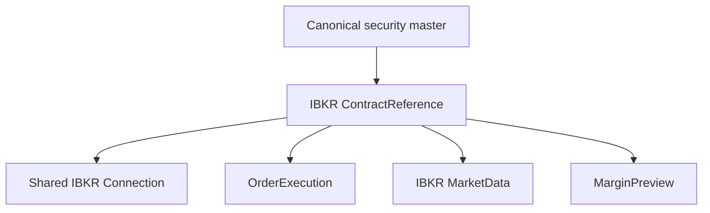
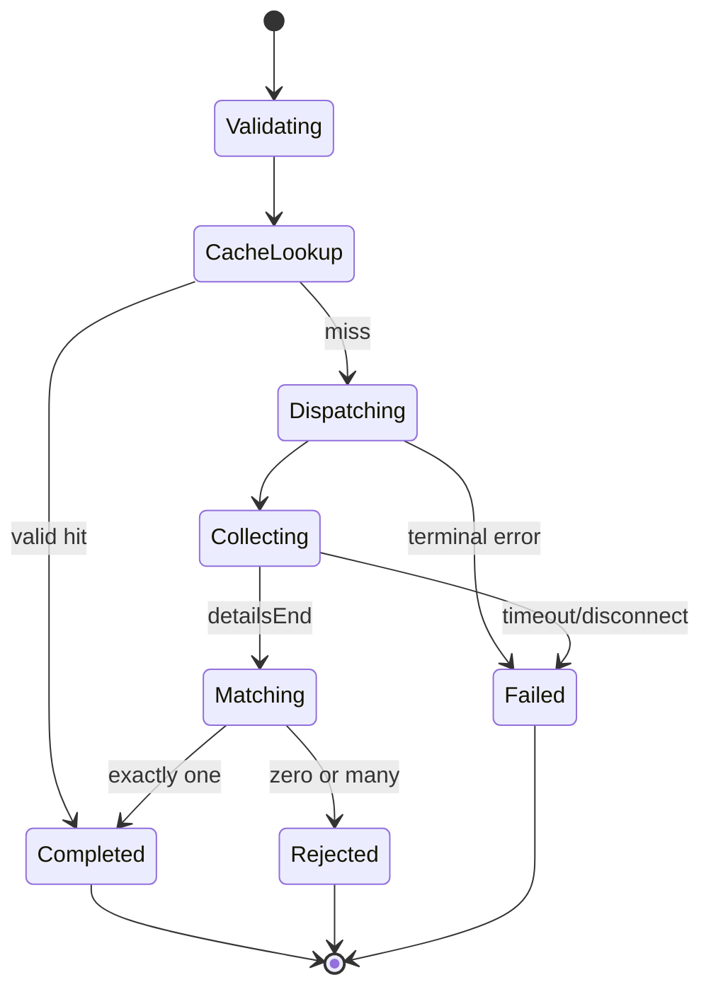

# IBKR Contract Reference Specification

**Document version:** 1.0  
**Status:** Implementation specification  
**Target runtime:** .NET 10 or later  
**Provider API:** Official Interactive Brokers TWS API for C#  
**Host:** Trader Workstation or IB Gateway  
**Implementation project:** `Framework.TradeBroker.InteractiveBrokers`  
**Implementation module:** `Framework.TradeBroker.InteractiveBrokers.ContractReference`  
**Shared connection module:** `Framework.TradeBroker.InteractiveBrokers.Connection`  
**Release priority:** Required V1 safety dependency  
**Primary product scope:** ES futures, ES futures options, combination legs, and future supported instruments  
**Companion specifications:** `IbkrBrokerConnectionSpecification.md`, `IbkrOrderExecutionAdapterSpecification.md`, `IbkrMarketDataSpecification.md`, `IbkrBrokerAccountSpecification.md`, `IbkrMarginPreviewSpecification.md`, and the Databento market-data specification  
**Last updated:** 2026-08-02

---

## 1. Purpose

This document specifies the single reusable IBKR contract-reference capability used by order execution, broker account normalization, IBKR market data, and margin preview.

The module shall:

- resolve a broker-neutral instrument identity to one exact IBKR contract;
- reject ambiguous, incomplete, contradictory, or stale identities;
- retrieve and normalize contract details;
- retrieve option-chain definition parameters;
- retrieve exchange-specific market rules and variable price increments;
- validate resolved contracts against requested economic identity;
- cache only versioned, environment-scoped results with explicit freshness;
- map an IBKR `conId` back to the canonical security-master identity;
- expose broker-neutral results without leaking mutable `IBApi.Contract` objects;
- share the supervised TWS connection, request-ID allocator, callback router, pacing coordinator, and session epoch;
- support deterministic fake-broker, replay, paper-account, and compatibility tests.

This module is required before production order submission. A futures option identified only by a display symbol, expiry assumption, or strike label is not safe to trade.

---

## 2. Normative Architecture Decision

`Framework.TradeBroker.InteractiveBrokers.ContractReference` is the sole owner of IBKR contract discovery, exact resolution, option-definition discovery, and market-rule lookup.

It is not the canonical security master. The platform security master owns provider-neutral instrument identity. This module owns the verified mapping between that identity and IBKR's representation.



Required dependency direction:

- consumers depend on narrow contract-reference interfaces;
- the module depends on `.Connection` internal ports;
- `.Connection` never depends on contract semantics;
- `.ContractReference` never calls order, account, market-data, or strategy logic;
- consumers never read or mutate the module's cache directly;
- no second `EClientSocket`, reader loop, client ID, or callback wrapper is permitted.

---

## 3. Safety Invariants

The implementation shall preserve all of the following:

1. Production execution uses an exact, verified contract result.
2. More than one surviving contract match is an error, never a scoring opportunity.
3. Zero matches is an explicit not-found result, never an invitation to relax constraints silently.
4. A cached mapping is scoped by provider, environment, account/session policy, API compatibility version, and query fingerprint.
5. `conId` is broker identity, not the platform's canonical instrument ID.
6. Option-definition strikes and expirations describe available parameters; they do not prove that every Cartesian combination is a tradable contract.
7. A selected option is resolved again through contract details before use.
8. Exchange and market-rule associations remain paired by their documented list ordering.
9. `minTick` alone is insufficient when a variable market rule is available.
10. No consumer receives a mutable shared `IBApi.Contract` instance.
11. A disconnect or session-epoch change terminates in-flight requests and invalidates session-bound evidence.
12. Late callbacks cannot complete a new request that reused the same numeric identifier.
13. Timeout, cancellation, and ambiguity never produce a successful resolution.
14. Contract resolution does not authorize an order or a market-data subscription.

---

## 4. Scope

### 4.1 Required V1 capabilities

- exact resolution by `conId`;
- exact resolution by a complete futures identity;
- exact resolution by a complete futures-option identity;
- deterministic validation of symbol, security type, expiry, strike, right, multiplier, currency, exchange, trading class, and underlying where applicable;
- `reqContractDetails` request/callback/completion handling;
- `reqSecDefOptParams` request/callback/completion handling;
- `reqMarketRule` request/callback handling;
- exact association of `validExchanges` with `marketRuleIds`;
- fixed-decimal normalization of strikes and price increments;
- option-definition result completeness and provenance;
- positive and negative caches with explicit TTL and source version;
- in-flight request coalescing;
- integration ports for OrderExecution, MarketData, BrokerAccount, and MarginPreview;
- startup compatibility checks and golden mappings for the configured ES products;
- scripted and paper-account acceptance tests.

### 4.2 V1.x extensions

- futures calendar and continuous-contract helper policies outside execution identity;
- additional security types after explicit field profiles are specified;
- exchange schedule/calendar normalization;
- richer corporate-action and identifier mapping;
- persistent reference-data history and correction events;
- batch prewarming and controlled background refresh;
- multi-account or multi-region cache partitions if they become necessary.

### 4.3 Non-goals

The module does not:

- choose which instrument a strategy should trade;
- synthesize missing option contracts;
- select an execution exchange for the workflow;
- determine limit prices or execution actions;
- own live quotes, historical bars, or option Greeks;
- calculate margin;
- replace the security master;
- assume Databento and IBKR identifiers are interchangeable;
- expose unrestricted broker contract searches to hot-path strategy code.

---

## 5. Delivery Phases

| Phase | Release | Required outcome |
|---|---|---|
| CR-1 | V1 | Contracts, configuration, API compatibility manifest, pure normalization |
| CR-2 | V1 | Contract-details request lifecycle, exact filtering, ambiguity rejection |
| CR-3 | V1 | Option-definition requests and exact option-resolution composition |
| CR-4 | V1 | Market-rule lookup, exchange pairing, price-increment validation |
| CR-5 | V1 | Cache, persistence, reconnect behavior, consumers, observability |
| CR-6 | V1 | Scripted, compatibility, and paper-account acceptance |
| CR-7 | V1.x | Additional instruments, background refresh, historical reference data |

No V1 order-execution paper acceptance may pass until CR-1 through CR-6 pass.

---

## 6. Suggested Project Structure

The implementation may adapt names to repository conventions, but responsibilities shall remain separate.

```text
Framework.TradeBroker/
  ContractReference/
    IBrokerContractReference.cs
    ContractReferenceModels.cs
    ContractReferenceFailures.cs

Framework.TradeBroker.InteractiveBrokers/
  ContractReference/
    IbkrContractReferenceGateway.cs
    IbkrContractReferenceOptions.cs
    IbkrContractQueryMapper.cs
    IbkrContractDetailsNormalizer.cs
    IbkrContractMatcher.cs
    IbkrContractFingerprint.cs
    IbkrOptionDefinitionGateway.cs
    IbkrMarketRuleGateway.cs
    IbkrContractReferenceCache.cs
    IbkrContractReferenceStore.cs
    IbkrContractReferenceHealth.cs
    IbkrContractReferenceMetrics.cs
    Internal/
      ContractDetailsRequestActor.cs
      OptionDefinitionRequestActor.cs
      MarketRuleRequestCoordinator.cs
      ContractReferenceCallbackSink.cs

Framework.TradeBroker.InteractiveBrokers.Tests/
  ContractReference/
    Unit/
    Property/
    Scripted/
    Compatibility/
    Paper/
```

Provider-neutral contracts may live in an existing instrument-reference assembly if the repository already has one. Do not duplicate an established canonical identity type.

---

## 7. Official API Baseline

### 7.1 Required request/callback mapping

| Capability | Outbound C# API | Inbound callback(s) | Completion signal |
|---|---|---|---|
| Contract details | `reqContractDetails(reqId, contract)` | `contractDetails(reqId, details)` | `contractDetailsEnd(reqId)` |
| Option parameters | `reqSecDefOptParams(reqId, symbol, exchange, secType, conId)` | `securityDefinitionOptionParameter(...)` | `securityDefinitionOptionParameterEnd(reqId)` |
| Market rule | `reqMarketRule(marketRuleId)` | `marketRule(marketRuleId, increments)` | Callback itself for the requested rule |
| Request failure | applicable request | `error(...)` | Classified terminal or informational error |

Codex shall compile a compatibility adapter against the pinned official C# package. Callback signatures and field availability in that package are authoritative. A mismatch stops implementation and creates a compatibility issue; it is not handled by reflection or guesswork.

### 7.2 Compatibility manifest

The build shall record:

- official API package name and exact version;
- supported TWS/IB Gateway version range;
- server version observed during handshake;
- normalized contract schema version;
- matching-policy version;
- market-rule schema version;
- golden-fixture version.

The service shall refuse order-capable readiness when the live server is outside the tested compatibility range unless an explicitly audited override exists.

---

## 8. Provider-Neutral Public Contracts

### 8.1 Interface

Use repository-standard cancellation and result conventions. A representative API is:

```csharp
public interface IBrokerContractReference
{
    ValueTask<ContractResolutionResult> ResolveAsync(
        ContractResolutionRequest request,
        CancellationToken cancellationToken);

    ValueTask<OptionDefinitionResult> GetOptionDefinitionsAsync(
        OptionDefinitionRequest request,
        CancellationToken cancellationToken);

    ValueTask<MarketRuleResult> GetMarketRuleAsync(
        MarketRuleRequest request,
        CancellationToken cancellationToken);

    ContractReferenceHealthSnapshot GetHealth();
}
```

This is a control-plane API, not a per-tick data path. Asynchrony represents bounded broker I/O; it must not introduce nondeterministic business decisions.

### 8.2 Resolution modes

```csharp
public enum ContractResolutionMode : byte
{
    ExactByBrokerContractId = 1,
    ExactByEconomicIdentity = 2,
    DiscoveryOnly = 3
}
```

- `ExactByBrokerContractId` verifies a supplied `conId` against expected economic fields.
- `ExactByEconomicIdentity` supplies all fields required by the configured security-type profile.
- `DiscoveryOnly` may return multiple candidates, but its output type cannot be passed to order execution or live market-data subscription APIs.

There is no `BestMatch` mode.

### 8.3 Resolution request

```csharp
public sealed record ContractResolutionRequest(
    CanonicalInstrumentId InstrumentId,
    ContractResolutionMode Mode,
    BrokerContractId? ExpectedBrokerContractId,
    string Symbol,
    BrokerSecurityType SecurityType,
    string Currency,
    string Exchange,
    string? PrimaryExchange,
    LocalDate? Expiry,
    FixedDecimal? Strike,
    OptionRight? Right,
    FixedDecimal? Multiplier,
    string? TradingClass,
    BrokerContractId? UnderlyingBrokerContractId,
    ResolutionUse Use,
    FreshnessRequirement Freshness,
    string PolicyVersion);
```

Every string is normalized at the boundary using invariant, documented rules. Empty and unspecified are distinct where the IBKR API distinguishes them.

### 8.4 Resolved contract

```csharp
public sealed record ResolvedBrokerContract(
    CanonicalInstrumentId InstrumentId,
    BrokerContractId BrokerContractId,
    string Symbol,
    BrokerSecurityType SecurityType,
    string Currency,
    string Exchange,
    string? PrimaryExchange,
    string? LocalSymbol,
    string? TradingClass,
    LocalDate? Expiry,
    FixedDecimal? Strike,
    OptionRight? Right,
    FixedDecimal? Multiplier,
    BrokerContractId? UnderlyingBrokerContractId,
    FixedDecimal? MinimumTick,
    IReadOnlyList<ExchangeMarketRuleBinding> ExchangeMarketRules,
    string? TimeZoneId,
    string? TradingHoursRaw,
    string? LiquidHoursRaw,
    ContractReferenceProvenance Provenance,
    ContractFingerprint Fingerprint);
```

Use the repository's exact decimal and date types. Do not store strike, multiplier, or increment in binary floating point at the provider-neutral boundary.

### 8.5 Provenance

Provenance shall include:

- provider `InteractiveBrokers`;
- source request fingerprint;
- connection session epoch;
- request ID where applicable;
- requested, first-callback, completed, and normalized timestamps;
- API/server compatibility versions;
- matching-policy version;
- cache disposition: live, fresh cache, stale cache diagnostic, or replay;
- source record count;
- normalized schema version;
- raw diagnostic payload hash;
- completeness state.

Account numbers, credentials, and unrestricted raw payloads do not belong in provenance.

### 8.6 Result states

```csharp
public enum ContractResolutionStatus : byte
{
    Resolved = 1,
    NotFound = 2,
    Ambiguous = 3,
    Contradictory = 4,
    Incomplete = 5,
    Stale = 6,
    TimedOut = 7,
    Cancelled = 8,
    Disconnected = 9,
    PacingLimited = 10,
    BrokerRejected = 11,
    CompatibilityFailure = 12,
    InternalFailure = 13
}
```

Only `Resolved` may carry an order-capable result. Discovery candidates use a separate result type.

---

## 9. Canonical Identity and Matching

### 9.1 Security-master ownership

The security master issues `CanonicalInstrumentId` and owns the economic identity. A persisted mapping shall include:

```text
CanonicalInstrumentId
Provider = InteractiveBrokers
Environment
BrokerContractId
ContractFingerprint
MatchingPolicyVersion
ResolvedAt
ValidatedAt
CompatibilityVersion
State
```

Mappings are evidence, not eternal facts. Corrections create a new version; they do not overwrite history silently.

### 9.2 Required profiles

#### Futures

An exact futures query shall constrain at least:

- symbol;
- security type;
- contract month or expiry according to the pinned API behavior;
- exchange/routing scope;
- currency;
- multiplier when configured;
- trading class when required to remove ambiguity.

#### Futures options

An exact futures-option query shall constrain at least:

- symbol;
- security type;
- exact expiration;
- exact fixed-decimal strike;
- put/call right;
- exchange/routing scope;
- currency;
- multiplier;
- trading class;
- underlying `conId` when known.

The profile may require more fields for a venue or product. It may never require fewer merely to force a match.

### 9.3 Deterministic filtering

The matcher shall:

1. normalize the request;
2. validate that the security-type profile is complete;
3. construct the narrowest supported IBKR query;
4. collect all callbacks until the documented completion signal;
5. normalize each candidate independently;
6. compare every required field with explicit rules;
7. retain exact candidates only;
8. return success only when exactly one candidate survives;
9. emit redacted mismatch evidence for all rejected candidates.

The matcher shall not use fuzzy string matching, nearest strike, nearest expiry, first callback wins, lowest `conId`, exchange preference scoring, or callback arrival order.

### 9.4 Field comparison rules

- symbols and IBKR enumerations use invariant canonical casing;
- currency uses ISO-style uppercase codes expected by the API;
- expiry parsing is profile-specific and must distinguish month-only from exact-date values;
- strike and multiplier use exact normalized decimals;
- rights normalize only documented IBKR values to `Put` or `Call`;
- exchange comparison distinguishes request routing exchange from returned primary/listing exchange;
- missing is not equal to an expected non-null value;
- unexpected conflicting values reject the candidate;
- extra non-conflicting broker metadata may be retained.

### 9.5 Fingerprint

The stable fingerprint shall cover all economic and routing fields used by downstream materialization, plus the matching policy and normalized schema versions. It shall not depend on object identity, hash randomization, callback order, timestamps, or raw JSON/XML formatting.

---

## 10. Contract-Details Request Lifecycle

### 10.1 States



### 10.2 Routing sequence

For every live request:

1. capture the active connection epoch;
2. allocate a request ID with purpose `ContractDetails`;
3. register the route before dispatch;
4. enqueue `reqContractDetails` through the shared outbound dispatcher;
5. collect matching `contractDetails` callbacks in a bounded request actor;
6. reject callbacks with the wrong request ID or epoch;
7. treat `contractDetailsEnd` as the normal collection boundary;
8. normalize and match only after collection completes;
9. unregister/tombstone the route before publishing the result;
10. retain the tombstone long enough to classify late callbacks.

### 10.3 Bounds

Configuration shall define:

- request timeout;
- maximum candidates;
- maximum raw diagnostic bytes;
- in-flight request limit;
- route-tombstone duration;
- queue-admission timeout.

Exceeding a bound fails explicitly. No list grows without limit.

### 10.4 Errors

An error is correlated by request ID when possible. The versioned IBKR error catalog classifies it as:

- informational;
- request warning;
- request terminal;
- connectivity/session terminal;
- pacing/resource terminal;
- compatibility/permission terminal;
- unknown and therefore conservative.

An unclassified error cannot be transformed into `NotFound`.

---

## 11. Option-Definition Capability

### 11.1 Request

```csharp
public sealed record OptionDefinitionRequest(
    CanonicalInstrumentId UnderlyingInstrumentId,
    BrokerContractId UnderlyingBrokerContractId,
    string UnderlyingSymbol,
    BrokerSecurityType UnderlyingSecurityType,
    string? FuturesOptionExchange,
    LocalDate? MinimumExpiry,
    LocalDate? MaximumExpiry,
    FreshnessRequirement Freshness,
    string PolicyVersion);
```

The underlying must already be exactly resolved. `UnderlyingBrokerContractId` shall match the verified underlying result.

### 11.2 Callback normalization

Each normalized definition includes:

- underlying `conId`;
- exchange;
- trading class;
- multiplier;
- sorted unique expiration set;
- sorted unique fixed-decimal strike set;
- source request and epoch;
- completeness and freshness;
- raw payload hash.

Multiple callbacks for different exchange/trading-class groupings remain separate records. They are not unioned unless a provider-neutral consumer explicitly requests a union view, and that view preserves membership provenance.

### 11.3 Deterministic collection

- allocate/register request ID before `reqSecDefOptParams`;
- collect until `securityDefinitionOptionParameterEnd`;
- deduplicate identical callbacks by stable content fingerprint;
- sort records by exchange, trading class, multiplier, then content fingerprint;
- sort expiration and strike sets deterministically;
- enforce record/strike/expiration bounds;
- reject underlying-ID mismatches;
- expose partial data only as incomplete diagnostics, never as a complete chain.

### 11.4 Exact option composition

The safe path is:

1. exactly resolve the underlying;
2. obtain complete option definitions;
3. select an allowed exchange/trading-class/multiplier grouping under a versioned strategy-universe rule;
4. verify that the requested expiration and strike occur in that grouping;
5. issue an exact futures-option `reqContractDetails` request;
6. require exactly one verified option contract;
7. persist the canonical-to-IBKR mapping.

The option-definition response alone is never order-capable.

---

## 12. Market Rules and Price Increments

### 12.1 Exchange/rule binding

The normalized contract details may expose comma-separated valid exchanges and corresponding market-rule IDs. The implementation shall:

1. parse both lists without locale dependence;
2. preserve original ordering;
3. require compatible list lengths under the pinned API's documented semantics;
4. bind each exchange to the rule at the same index;
5. retain empty/unsupported rule identifiers explicitly;
6. never sort one list independently of the other.

### 12.2 Market-rule correlation

`reqMarketRule` is keyed by market-rule ID rather than a newly allocated request ID in the documented API. Therefore:

- `.Connection` shall provide a keyed route/lease mechanism for `marketRuleId` callbacks;
- `.ContractReference` shall coalesce concurrent requests for the same rule ID;
- only one outbound request per missing rule ID may be active;
- every waiter receives the same immutable normalized result;
- a cache hit avoids a broker call;
- an epoch change fails all active waiters;
- a late callback is associated only with the correct keyed request generation.

Numeric IDs alone are insufficient; the internal key includes environment, connection epoch, rule ID, and request generation.

### 12.3 Normalized schedule

```csharp
public sealed record MarketRuleSnapshot(
    int MarketRuleId,
    IReadOnlyList<PriceIncrementBand> Bands,
    ContractReferenceProvenance Provenance);

public sealed record PriceIncrementBand(
    FixedDecimal LowEdgeInclusive,
    FixedDecimal Increment);
```

Rules:

- normalize to exact decimals;
- reject negative increments and non-monotonic low edges;
- sort only after proving the source represents the same semantic schedule;
- reject duplicate low edges with different increments;
- retain the full schedule, not merely the smallest increment.

### 12.4 Price validation

The module shall expose a pure function that returns the applicable increment for a proposed price and a pure validation/quantization result. Quantization requires an explicit caller policy (`Reject`, `TowardZero`, `AwayFromZero`, `Floor`, or `Ceiling`) and may not choose a favorable direction itself.

Order execution owns whether a rounded price is permitted. ContractReference only provides verified increment evidence and deterministic math.

---

## 13. Cache and Persistence

### 13.1 Cache layers

The module may use:

- an immutable in-process hot cache;
- a shared latest-value cache if established by repository architecture;
- a durable append-only mapping/reference store;
- test/replay fixture stores.

The durable record is authoritative history. A distributed cache is not the sole record of a mapping correction.

### 13.2 Cache keys

Keys shall include all fields that affect the result:

```text
Provider
Environment
RequestKind
NormalizedQueryFingerprint
MatchingPolicyVersion
NormalizedSchemaVersion
APICompatibilityVersion
```

Market-rule keys also include rule ID. Option-definition keys include the exact underlying `conId`, requested exchange scope, and definition policy.

### 13.3 Freshness

Configuration shall define separate TTLs for:

- exact contract mappings;
- option definitions;
- market rules;
- not-found results;
- ambiguity results;
- permission/pacing failures.

Negative TTLs shall be short and error-class specific. Connectivity and internal failures are not cached as not-found.

The result always exposes resolution and validation time. A caller may require `LiveOnly`, `FreshCacheAllowed`, or `DiagnosticStaleAllowed`. Order submission defaults to fresh validated evidence under the configured order policy.

### 13.4 In-flight coalescing

Concurrent identical requests share one live broker request. Cancellation by one waiter does not cancel the shared broker request while other waiters remain. The request actor is cancelled only when all waiters cancel or the lifecycle terminates.

### 13.5 Correction handling

If the same canonical identity resolves to a different `conId` or materially different fingerprint:

- do not overwrite the active mapping silently;
- create a discrepancy/correction record;
- invalidate dependent cached materializations;
- mark the mapping `NeedsReview` or apply a preapproved deterministic rollover rule;
- prevent new order use until the configured resolution policy succeeds;
- notify operations with redacted evidence.

---

## 14. Shared Connection Integration

### 14.1 Feature registration

At startup, the module registers:

- feature owner `ContractReference`;
- request purposes `ContractDetails` and `OptionDefinition`;
- keyed callback owner for market rules;
- callback handlers for details, detail-end, option parameters, option-parameter-end, market rules, and correlated errors;
- outbound priority and pacing class;
- reconnect/resynchronization hook.

Duplicate ownership fails startup.

### 14.2 Priority

Contract resolution required for an already-approved order may use a bounded high control-plane priority, below cancellations and broker kill operations but above background cache warming and bulk market-data discovery.

Background refresh may never starve:

- order cancel/modify operations;
- connection liveness;
- account safety resynchronization;
- active order reconciliation.

### 14.3 Callback thread

The shared `EWrapper` callback shall only copy the minimum immutable fields into a bounded envelope and enqueue it. It shall not match candidates, parse calendars, persist records, log full contracts, or await locks/I/O.

### 14.4 Reconnect

On disconnect:

- terminate all in-flight actors with `Disconnected`;
- tombstone their routes;
- retain durable cache entries but mark session-bound freshness accordingly;
- do not infer request completion.

After reconnect:

- wait for `.Connection` readiness and a new epoch;
- re-register feature ownership;
- do not automatically retry an abandoned request on behalf of a completed caller;
- permit new caller-driven resolution;
- optionally prewarm only after order/account recovery priorities are satisfied.

---

## 15. Consumer Integration

### 15.1 OrderExecution

OrderExecution shall:

- resolve every leg and required underlying through this module;
- persist each `conId` and fingerprint in the approved order correlation record;
- require the intended exchange/trading-class/multiplier/expiry/strike/right;
- use the verified market rule for price validation;
- reject ambiguity, stale disallowed evidence, or a post-approval fingerprint change;
- materialize fresh private `IBApi.Contract` and `ComboLeg` objects from immutable results.

OrderExecution shall not duplicate its own general contract cache or matching algorithm.

### 15.2 MarketData

IBKR MarketData shall:

- use exact resolved contracts before subscription;
- use option definitions only as a discovery universe;
- bind every physical ticker subscription to a contract fingerprint;
- resubscribe across epochs using revalidated identities;
- reject a provider switch that cannot prove instrument equivalence.

### 15.3 BrokerAccount

BrokerAccount may use this module to map broker positions to canonical instruments. An unresolved position remains visible as an unresolved broker position; it must not disappear from risk totals.

### 15.4 MarginPreview

MarginPreview shall use the same resolved contract fingerprints and pure contract/order materializers as the corresponding real-order proposal. A preview for different contract evidence is not evidence for the real proposal.

### 15.5 Databento mapping

The platform security master owns any relationship between Databento instrument identity and IBKR `conId`. This module contributes verified IBKR mappings. It must not import Databento concrete API types into the IBKR provider project.

---

## 16. Configuration

A representative configuration is:

```json
{
  "TradeBroker": {
    "InteractiveBrokers": {
      "ContractReference": {
        "Enabled": true,
        "RequestTimeout": "00:00:10",
        "QueueAdmissionTimeout": "00:00:02",
        "MaxConcurrentRequests": 32,
        "MaxCandidatesPerRequest": 256,
        "MaxOptionDefinitionGroups": 64,
        "MaxStrikesPerGroup": 10000,
        "MaxExpirationsPerGroup": 1000,
        "ContractCacheTtl": "1.00:00:00",
        "OptionDefinitionCacheTtl": "00:15:00",
        "MarketRuleCacheTtl": "7.00:00:00",
        "NotFoundCacheTtl": "00:00:30",
        "AmbiguousCacheTtl": "00:01:00",
        "RouteTombstoneTtl": "00:02:00",
        "OrderResolutionFreshness": "01:00:00",
        "MatchingPolicyVersion": "ibkr-contract-match-v1",
        "NormalizedSchemaVersion": 1,
        "PrewarmConfiguredUnderlyings": true
      }
    }
  }
}
```

Durations, capacities, product profiles, and exchange rules shall be validated at startup. Unsafe defaults, zero/negative limits, unknown policy versions, and impossible freshness relationships fail configuration.

Environment-specific values belong in deployment configuration. Secrets are not required by this module beyond the shared connection's authentication boundary.

---

## 17. Error Model

```csharp
public sealed record ContractReferenceFailure(
    ContractReferenceFailureCode Code,
    string SafeMessage,
    bool IsRetryable,
    bool IsTerminalForRequest,
    bool InvalidatesReadiness,
    TimeSpan? RetryAfter,
    string? BrokerCode,
    string? DiagnosticFingerprint);
```

Required failure codes include:

- invalid request;
- incomplete security-type profile;
- contract not found;
- ambiguous contract;
- contradictory contract fields;
- underlying mismatch;
- invalid option definition;
- invalid market-rule association;
- invalid price-increment schedule;
- request timeout;
- request cancelled;
- connection unavailable;
- connection epoch changed;
- route collision;
- pacing limited;
- permissions/entitlement failure;
- broker rejected;
- result too large;
- compatibility mismatch;
- persistence failure;
- unknown broker error;
- internal invariant failure.

Retryability is classification data, not permission to retry. The caller or a documented request policy owns retry decisions. No automatic retry may relax identity constraints.

---

## 18. Health, Observability, and Operations

### 18.1 Health snapshot

Expose:

- enabled/configured state;
- shared connection readiness and epoch;
- API compatibility state;
- feature registration state;
- in-flight request counts by type;
- queue occupancy and oldest age;
- cache hit/miss/stale rates;
- last successful live resolution time;
- last option-definition completion;
- last market-rule completion;
- timeout/error/ambiguity counts;
- late callback count;
- persistence health;
- readiness for order-capable resolution.

### 18.2 Metrics

At minimum:

- `ibkr_contract_reference_requests_total{kind,outcome}`;
- `ibkr_contract_reference_duration_seconds{kind}`;
- `ibkr_contract_reference_candidates{kind}`;
- `ibkr_contract_reference_ambiguous_total`;
- `ibkr_contract_reference_cache_total{kind,result}`;
- `ibkr_contract_reference_inflight{kind}`;
- `ibkr_contract_reference_late_callbacks_total{kind}`;
- `ibkr_contract_reference_market_rule_bands`;
- `ibkr_contract_reference_corrections_total`;
- `ibkr_contract_reference_persistence_failures_total`.

Metric labels shall be bounded. Never label by raw symbol, `conId`, account, expiry, strike, request ID, or error text.

### 18.3 Logging

Structured logs may include a correlation ID, hashed instrument identity, request kind, epoch, timing, outcome, candidate count, failure category, and safe fingerprint.

Do not log full raw contracts by default. Account values, credentials, tokens, and unrestricted broker error text must be redacted. A secure diagnostic mode requires explicit enablement and bounded retention.

### 18.4 Alerts

Alert on:

- compatibility mismatch;
- persistent resolution failures for configured production instruments;
- any ambiguity on an order-intended query;
- correction of an active mapping;
- invalid market-rule schedule;
- request-route collisions;
- sustained timeout/pacing rates;
- cache/persistence corruption;
- order-capable readiness false during an expected trading window.

---

## 19. Security and Data Governance

- validate every query before it reaches `IBApi`;
- bound all returned collections and raw diagnostic capture;
- never deserialize arbitrary polymorphic types from cache or replay storage;
- sign or hash persisted reference snapshots according to platform audit policy;
- apply least privilege to storage and diagnostic access;
- redact account identifiers even though contract data itself is not generally secret;
- never accept a caller-supplied mutable `IBApi.Contract` as an order-capable input;
- never use a raw display symbol as a cache key without its full normalized query;
- retain reference corrections under the platform audit-retention policy.

---

## 20. Determinism and Replay

Every live normalized callback envelope shall be replayable with:

- callback kind;
- request/key identity;
- connection epoch;
- arrival ordinal assigned by the shared callback pump;
- normalized primitive fields;
- receive timestamp from the injected clock;
- source fixture/compatibility version.

Replay uses an injected clock and deterministic scheduler. Given identical inputs, policy versions, and ordered envelopes, it shall produce byte-equivalent normalized results and the same terminal status.

Callback arrival order may vary, but candidate collection results shall be order-independent because matching and final sorting use stable content keys.

---

## 21. Test Requirements

### 21.1 Unit tests

Cover:

- every security-type profile validation;
- exact decimal/date normalization;
- exchange and market-rule list pairing;
- all matcher field comparisons;
- zero/one/multiple candidate outcomes;
- stable fingerprints;
- market-rule band validation and increment selection;
- cache-key completeness and TTL policy;
- error classification;
- configuration validation;
- IBApi-to-normalized mapping for every consumed field.

### 21.2 Property tests

Prove:

- callback permutation does not change the normalized result;
- adding a contradictory candidate cannot turn ambiguity into success;
- no incomplete profile produces an order-capable result;
- decimal round-trips are invariant-culture safe;
- exchange/rule pairing is never changed by sorting;
- fingerprints are stable and materially sensitive;
- cache keys distinguish every semantic request-field change.

### 21.3 Scripted shared-connection tests

The deterministic broker harness shall support:

- zero, one, and many `contractDetails` callbacks;
- error before, during, and after detail callbacks;
- missing/delayed `contractDetailsEnd`;
- duplicated and late callbacks;
- disconnect and epoch change mid-request;
- request-ID collision attempts;
- option-definition callbacks from multiple exchanges in varied order;
- missing option-definition completion;
- market-rule callback before/after waiter cancellation;
- concurrent coalesced market-rule callers;
- queue/pacing rejection;
- malformed and oversized payloads.

### 21.4 Golden compatibility tests

Maintain redacted pinned fixtures for:

- current ES future;
- next configured ES future;
- ES call and put with representative strikes;
- at least one ambiguous broad query;
- option-parameter groups;
- at least one variable market-rule schedule;
- combo-leg materialization inputs.

Golden fixtures must be reviewed on API/TWS upgrades. Snapshot tests alone are insufficient; semantic assertions are mandatory.

### 21.5 Paper-account tests

In the paper environment:

- resolve configured underlying and option instruments;
- prove exact field equality and unique matches;
- retrieve option definitions and resolve selected members exactly;
- retrieve and validate applicable market rules;
- subscribe through IBKR MarketData using the same resolution;
- construct but do not transmit an order using the same immutable results;
- disconnect/reconnect and prove epoch isolation and revalidation;
- compare paper/live contract identity behavior under an approved non-trading live-read test if permitted.

No automated test submits a live order.

---

## 22. V1 Acceptance Criteria

### Architecture

- [ ] One reusable `.ContractReference` implementation exists.
- [ ] It uses only the shared `.Connection` for TWS API calls.
- [ ] Security-master and provider responsibilities are separate.
- [ ] Consumers use narrow immutable contracts.
- [ ] No duplicate contract cache/matcher exists in OrderExecution or MarketData.

### Resolution safety

- [ ] Required futures and futures-option profiles are complete.
- [ ] Exactly one candidate is required for success.
- [ ] Ambiguous/not-found/incomplete results cannot become order-capable.
- [ ] Underlying, expiry, strike, right, multiplier, exchange, trading class, and currency are verified where applicable.
- [ ] Option definitions are never treated as proof of a tradable contract.

### Market rules

- [ ] Valid exchange and market-rule IDs remain correctly paired.
- [ ] Full variable increment schedules are normalized and validated.
- [ ] Concurrent market-rule requests are coalesced safely.
- [ ] Order prices can be validated with explicit rounding policy.

### Lifecycle and resilience

- [ ] Routes register before outbound calls.
- [ ] All requests are bounded and complete only on valid terminal evidence.
- [ ] Disconnect/epoch changes terminate in-flight work.
- [ ] Late callbacks cannot contaminate new requests.
- [ ] Cache entries expose freshness and compatibility versions.
- [ ] Mapping corrections are versioned and fail closed.

### Quality and operations

- [ ] Unit, property, scripted, golden, and paper tests pass.
- [ ] Metrics/logs are bounded and redacted.
- [ ] Compatibility manifest and upgrade gate are enforced.
- [ ] Runbook covers ambiguity, not-found, correction, pacing, and reconnect.

---

## 23. Implementation Order for Codex

### Increment 1 — Contracts and pure logic

1. Locate and reuse canonical instrument/decimal/date types.
2. Add provider-neutral request/result/failure contracts.
3. Add configuration and validation.
4. Pin the official C# API and compatibility manifest.
5. Implement pure normalization, profiles, matching, and fingerprints.
6. Add unit/property tests before broker I/O.

### Increment 2 — Contract details

1. Register the feature and callbacks with `.Connection`.
2. Implement bounded request actors and route lifecycles.
3. Map `reqContractDetails`, callbacks, completion, and errors.
4. Add exact-resolution and ambiguity tests.
5. Add cache coalescing only after request correctness passes.

### Increment 3 — Option definitions

1. Implement request/result normalization.
2. Handle multi-group callbacks and completion.
3. Implement exact option-composition workflow.
4. Add bounds, determinism, and scripted tests.

### Increment 4 — Market rules

1. Parse exchange/rule bindings.
2. Implement keyed market-rule routing and coalescing.
3. Normalize/validate band schedules.
4. Implement pure increment selection and price validation.

### Increment 5 — Persistence and consumers

1. Add versioned mapping/reference persistence.
2. Add freshness, negative-cache, and correction policy.
3. Integrate OrderExecution, MarketData, BrokerAccount, and MarginPreview.
4. Remove or delegate duplicated contract logic in consumers.

### Increment 6 — Operational acceptance

1. Add health, metrics, logs, alerts, and runbook.
2. Complete compatibility fixtures.
3. Run multi-feature scripted tests.
4. Run paper-account acceptance.
5. Record the V1 compatibility evidence.

Each increment shall compile, pass its relevant tests, and preserve all earlier acceptance criteria before the next begins.

---

## 24. Instructions to Codex

Codex shall:

1. inspect existing solution conventions and reuse established primitives;
2. implement the narrowest vertical increment first;
3. never invent an IBKR signature or field—compile against the pinned assembly;
4. keep all `IBApi` types inside the concrete provider boundary;
5. route every API call through `.Connection`;
6. register callback routes before dispatch;
7. make time, scheduling, IDs, storage, and broker callbacks injectable;
8. use exact decimals and explicit date parsing;
9. preserve callback evidence before business normalization;
10. fail closed on ambiguity, incompatibility, or a changed mapping;
11. add deterministic tests with each behavior;
12. avoid reflection, dynamic dispatch, unbounded channels, fire-and-forget tasks, and global mutable caches;
13. expose no `IBApi.Contract` through provider-neutral APIs;
14. update companion specifications if an approved implementation decision changes ownership.

Codex shall stop and report a specification issue when:

- the pinned API lacks a required callback or field;
- existing canonical identity cannot express a required economic field;
- a requested product cannot be uniquely resolved under the stated profile;
- exchange/market-rule associations are inconsistent;
- another module already owns incompatible contract logic;
- persistence cannot record mapping versions/corrections;
- a requested shortcut would permit ambiguous order materialization.

---

## 25. Definition of Done

The module is done when the trading system can provide a canonical ES future or futures-option identity and receive one immutable, fully verified IBKR contract mapping with complete provenance and applicable price-increment evidence; the same mapping is consumed by order execution, IBKR market data, broker-account position normalization, and margin preview; ambiguity and lifecycle faults fail closed; and deterministic plus paper tests prove that no callback, cache, reconnect, or matching edge case can silently substitute a different contract.

The governing rule is:

> Discover broadly only in a non-trading result type; trade only a uniquely resolved and freshly verified broker contract.

---

## 26. Authoritative Implementation References

Codex shall recheck these official references and the pinned C# assembly at implementation time:

- [Request contract details](https://www.interactivebrokers.com/docs/tws-api/doc/contracts-financial-instruments/contract-details/request-contract-details)
- [Receive contract details and completion](https://www.interactivebrokers.com/docs/tws-api/doc/contracts-financial-instruments/contract-details/receive-contract-details)
- [Request option-chain parameters](https://www.interactivebrokers.com/docs/tws-api/doc/contracts-financial-instruments/option-chains/request-option-chains)
- [Receive option-chain parameters](https://www.interactivebrokers.com/docs/tws-api/doc/contracts-financial-instruments/option-chains/receive-option-chains)
- [Minimum price increment](https://www.interactivebrokers.com/docs/tws-api/doc/orders/minimum-price-increment/introduction)
- [Request a market rule](https://www.interactivebrokers.com/docs/tws-api/doc/orders/minimum-price-increment/request-market-rule)
- [Receive a market rule](https://www.interactivebrokers.com/docs/tws-api/doc/orders/minimum-price-increment/receive-market-rule)

Documentation examples do not replace compilation or paper verification. If current official behavior conflicts with this document, preserve the identity, uniqueness, correlation, immutability, and fail-closed invariants while raising a versioned specification compatibility issue.
