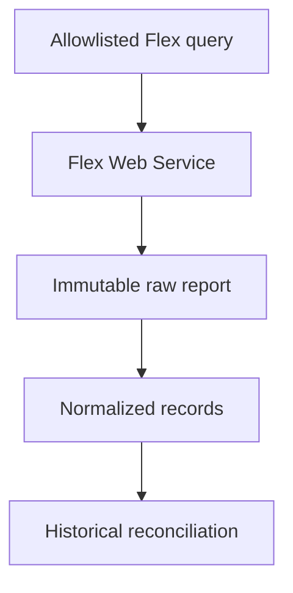
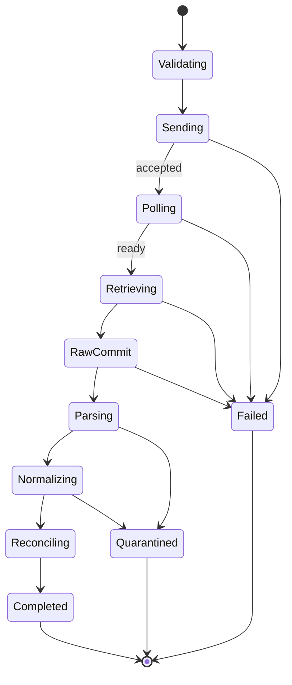

# IBKR Flex Reporting Specification

**Document version:** 1.0  
**Status:** Implementation specification  
**Target runtime:** .NET 10 or later  
**Provider API:** Interactive Brokers Flex Web Service Version 3 over HTTPS  
**Implementation project:** `Framework.TradeBroker.InteractiveBrokers`  
**Implementation module:** `Framework.TradeBroker.InteractiveBrokers.Reporting.Flex`  
**Transport module:** Dedicated hardened `HttpClient`; never the TWS socket connection  
**Release priority:** V1.1 strongly recommended  
**Primary account scope:** The configured IBKR trading account and approved reporting queries  
**Companion specifications:** `IbkrBrokerAccountSpecification.md`, `IbkrOrderExecutionAdapterSpecification.md`, `IbkrBrokerConnectionSpecification.md`, and `OrderExecutionWorkflowSpecification.md`  
**Last updated:** 2026-08-02

---

## 1. Purpose

This document specifies a Codex-ready IBKR Flex reporting module for historical accounting, audit, post-trade reconciliation, and operational investigation.

The module shall:

- invoke only explicitly allowlisted, preconfigured IBKR Flex Queries;
- request asynchronous report generation through Flex Web Service Version 3;
- poll and retrieve generated reports over validated HTTPS endpoints;
- preserve the exact raw response before parsing or normalization;
- compute and persist a content hash and ingestion manifest;
- parse XML defensively and deterministically;
- normalize executions, orders, commissions, fees, cash activity, positions, balances, transfers, interest, dividends, and other configured sections;
- make ingestion idempotent while preserving broker corrections and reversals;
- reconcile historical Flex records with real-time TWS order, execution, position, and account observations;
- expose report completeness, query-schema compatibility, freshness, and reconciliation evidence;
- protect tokens, account identifiers, financial values, and raw statements;
- support scheduled retrieval, bounded manual backfill, deterministic parsing, fake-HTTP integration tests, and production operations.

Flex reporting is a non-hot-path historical control. It must never block, approve, reject, retry, modify, cancel, or compensate a live order.

---

## 2. Normative Architecture Decision

`Framework.TradeBroker.InteractiveBrokers.Reporting.Flex` is part of the same concrete IBKR provider project but owns a separate HTTPS integration.

It shall not depend on:

- `Framework.TradeBroker.InteractiveBrokers.Connection`;
- `EClientSocket`, `EReader`, `EWrapper`, TWS client IDs, request IDs, order IDs, or session epochs;
- the live order dispatcher;
- market-data callback infrastructure;
- account subscription leases.

It may depend on provider-neutral reporting/reconciliation contracts, secret resolution, durable storage, an injected clock, a scheduler, and a hardened HTTP transport.



The raw report is committed before normalized projections are considered complete. Reprocessing must always be possible from raw bytes plus parser/schema versions.

---

## 3. Authority and Safety Model

### 3.1 Data authority

- During trading, live TWS callbacks and the supervised broker-account/order modules are operational observations.
- Flex is the stronger source for completed historical statements, trade confirmations, commissions/fees, cash ledger activity, and audit.
- Flex is not an intraday liveness or execution-state API.
- Differences between live observations and later Flex records create reconciliation outcomes; Flex does not rewrite live history silently.

### 3.2 Prohibited uses

The module shall never:

- return an `OrderApproved` or trading-readiness decision;
- sit synchronously in the order-submission path;
- cause a live order retry or compensation action;
- create or modify Flex Query definitions in the IBKR portal;
- accept arbitrary query IDs from an operator or HTTP request;
- expose the Flex token through configuration DTOs, logs, traces, metrics, exception messages, or user interfaces;
- follow arbitrary report URLs supplied in a response;
- treat an incomplete query schema as a complete statement;
- delete or overwrite raw reports or prior normalized corrections silently.

### 3.3 Failure isolation

A Flex outage, invalid token, malformed report, or storage failure may degrade historical-reporting health and reconciliation freshness. It shall not degrade the TWS socket, order cancellation, real-time account capture, or market-data processing.

---

## 4. Scope and Release Phases

### 4.1 Required V1.1 scope

- named allowlisted query profiles;
- secret-provider token retrieval;
- Flex Web Service v3 `SendRequest` and `GetStatement` lifecycle;
- mandatory `User-Agent` and bounded timeouts;
- HTTPS host allowlist and returned-URL validation;
- XML response handling;
- immutable raw report storage with SHA-256;
- ingestion manifests and parser schema fingerprints;
- Activity Statement query profile;
- Trade Confirmation/Executions query profile when separate detail is required;
- normalized account, balance, cash, position, execution/order, commission/fee, and cash-transaction records for configured sections;
- idempotency, corrections, and reconciliation with TWS observations;
- scheduled daily retrieval and bounded manual backfill;
- health, metrics, redacted logs, alerts, and runbooks;
- fake-service, parser, storage, and controlled live-query acceptance tests.

### 4.2 V1.x extensions

- additional validated report sections;
- multiple accounts and advisor partitions;
- trade-date and statement-period backfill orchestration if supported by configured queries;
- downstream tax-lot or performance projections;
- signed report export for external audit;
- additional output formats only when XML cannot meet a documented requirement.

### 4.3 Non-goals

- portal UI automation;
- query-definition creation or editing;
- online banking or funding actions;
- live order/account/position subscriptions;
- replacing the event store or the platform ledger;
- parsing every possible IBKR Flex field in V1.1;
- using CSV when XML supports the required typed sections;
- assuming a query's configured period can be overridden by undocumented URL parameters.

---

## 5. Suggested Project Structure

```text
Framework.TradeBroker/
  Reporting/
    IBrokerHistoricalReporting.cs
    BrokerReportModels.cs
    BrokerReconciliationModels.cs

Framework.TradeBroker.InteractiveBrokers/
  Reporting/
    Flex/
      IbkrFlexReportingService.cs
      IbkrFlexOptions.cs
      IbkrFlexQueryProfile.cs
      IbkrFlexHttpClient.cs
      IbkrFlexEndpointPolicy.cs
      IbkrFlexProtocolParser.cs
      IbkrFlexRequestCoordinator.cs
      IbkrFlexRawReportStore.cs
      IbkrFlexManifestStore.cs
      IbkrFlexXmlParser.cs
      IbkrFlexSchemaValidator.cs
      IbkrFlexNormalizer.cs
      IbkrFlexIdempotency.cs
      IbkrFlexReconciler.cs
      IbkrFlexScheduler.cs
      IbkrFlexHealth.cs
      IbkrFlexMetrics.cs
      Sections/
        AccountInformationParser.cs
        NetAssetValueParser.cs
        CashReportParser.cs
        OpenPositionsParser.cs
        TradesParser.cs
        CommissionFeesParser.cs
        CashTransactionsParser.cs
        TransfersParser.cs
        CorporateActionsParser.cs

Framework.TradeBroker.InteractiveBrokers.Tests/
  Reporting/Flex/
    Unit/
    Property/
    Golden/
    HttpIntegration/
    StorageIntegration/
    LiveReadOnly/
```

Reuse existing raw-object, event, projection, and reconciliation stores where available. Do not introduce a new database solely because this module has a separate transport.

---

## 6. Official Protocol Baseline

### 6.1 Version 3 lifecycle

The implementation targets Flex Web Service v3 explicitly.

1. Send a generation request using the configured token and preconfigured query ID.
2. Parse the XML acknowledgement.
3. Require a successful status and reference code.
4. validate the returned report URL, if supplied.
5. Poll/retrieve the statement using the token and reference code.
6. distinguish a completed report from a documented XML status/error response.
7. stop at the bounded deadline/attempt limit.

Representative official endpoints use:

```text
SendRequest?t={TOKEN}&q={QUERY_ID}&v=3
GetStatement?t={TOKEN}&q={REFERENCE_CODE}&v=3
```

Codex shall confirm the current official hosts, paths, parameter names, status values, and error codes at implementation time. The token necessarily appears in the provider request URI; application telemetry must therefore redact the entire query string.

### 6.2 Query definitions

Flex Queries are created and configured in the IBKR portal. The service retrieves those predefined queries; it does not create or mutate them.

A query profile shall record:

- internal stable alias;
- IBKR query ID from deployment configuration;
- report kind;
- expected output format;
- expected account scope;
- expected sections;
- required fields per section;
- parser schema version;
- configured scheduling policy;
- completeness policy version;
- enabled environment(s).

Query IDs are deployment data. They shall never be caller-supplied free text.

### 6.3 Preferred format

V1.1 requires XML because it preserves section and field structure and supports deterministic schema validation. CSV/text support is out of scope unless a documented IBKR limitation requires it.

### 6.4 API compatibility manifest

Record:

- Flex protocol version;
- official endpoint policy version;
- query-profile versions;
- parser schema versions;
- normalization schema version;
- IBKR error-catalog version;
- raw manifest schema version;
- reconciliation policy version.

---

## 7. Query Profile Requirements

### 7.1 Minimum approved query suite

#### Daily activity and audit query

Configure the sections required for the account's daily historical truth, including as applicable:

- account information;
- net asset value and account totals;
- cash report or statement of funds;
- open positions;
- trades/executions and orders;
- commissions and fees;
- cash transactions;
- dividends and interest;
- deposits/withdrawals/transfers;
- corporate actions;
- other product-specific sections required to explain ledger changes.

#### Trade confirmation/execution query

Use a separate approved query when the daily activity query cannot provide the required execution-level timing, broker identifiers, order identifiers, commission/fee detail, or correction state.

The implementation shall not assume two queries are required when one validated query is complete, nor assume one is sufficient without field validation.

### 7.2 Required-field manifest

Each parser declares exact required and optional source fields. At first report and whenever a profile/schema version changes, the validator shall compare actual headers/attributes against the manifest.

Outcomes:

- all required fields/sections present: `Complete`;
- optional fields absent: complete with capability flags;
- required field or section absent: `SchemaIncomplete`;
- unknown extra fields: retained/diagnosed and allowed only under policy;
- changed semantic format: `SchemaIncompatible`.

No missing required field is coerced to zero, empty string, false, or current time.

### 7.3 Period semantics

The configured Flex Query controls its period and other report options unless the official service explicitly documents request-time control. The module shall record the statement period returned by the report rather than infer it from scheduler time.

Manual backfill may invoke only a query profile designed and configured for backfill. It shall not append undocumented date parameters.

---

## 8. Public Contracts

### 8.1 Reporting service

```csharp
public interface IBrokerHistoricalReporting
{
    ValueTask<BrokerReportRequestReceipt> RequestAsync(
        BrokerReportRequest request,
        CancellationToken cancellationToken);

    ValueTask<BrokerReportStatus> GetStatusAsync(
        BrokerReportRunId runId,
        CancellationToken cancellationToken);

    IAsyncEnumerable<BrokerReportManifest> ListAsync(
        BrokerReportSearch search,
        CancellationToken cancellationToken);

    ValueTask<BrokerHistoricalReconciliation> ReconcileAsync(
        BrokerReconciliationRequest request,
        CancellationToken cancellationToken);
}
```

The external service API does not expose the Flex token, raw IBKR URL, or arbitrary query ID.

### 8.2 Report request

```csharp
public sealed record BrokerReportRequest(
    BrokerReportQueryAlias QueryAlias,
    ReportInvocationReason Reason,
    RequestedBy RequestedBy,
    string IdempotencyKey,
    LocalDate? ExpectedStatementDate,
    bool ForceProviderInvocation);
```

- `QueryAlias` resolves through the allowlisted profile registry.
- `ForceProviderInvocation` is privileged and audited; it does not bypass rate, host, or schema policy.
- `ExpectedStatementDate` is validation metadata, not an undocumented provider parameter.

### 8.3 Manifest

```csharp
public sealed record BrokerReportManifest(
    BrokerReportRunId RunId,
    BrokerReportQueryAlias QueryAlias,
    RedactedProviderReference ProviderReference,
    BrokerReportStatusCode Status,
    Instant RequestedAt,
    Instant? ProviderAcceptedAt,
    Instant? RetrievedAt,
    LocalDate? PeriodStart,
    LocalDate? PeriodEnd,
    string ContentSha256,
    long ContentLength,
    string ContentType,
    RawObjectLocator RawObject,
    string QueryProfileVersion,
    string ParserSchemaVersion,
    string NormalizationSchemaVersion,
    ReportCompleteness Completeness,
    IReadOnlyList<ReportSectionManifest> Sections,
    AccountIdentityHash AccountScopeHash,
    BrokerReportFailure? Failure);
```

Provider reference codes are operational identifiers, not public API data. Logs use a hash or truncated redacted form.

### 8.4 Terminal statuses

```csharp
public enum BrokerReportStatusCode : byte
{
    Accepted = 1,
    AwaitingProvider = 2,
    Retrieved = 3,
    RawCommitted = 4,
    Parsed = 5,
    Normalized = 6,
    Reconciled = 7,
    Completed = 8,
    Duplicate = 9,
    Cancelled = 10,
    TimedOut = 11,
    ProviderRejected = 12,
    AuthenticationFailed = 13,
    SchemaIncomplete = 14,
    SchemaIncompatible = 15,
    RawStorageFailed = 16,
    ParseFailed = 17,
    NormalizationFailed = 18,
    ReconciliationFailed = 19,
    OutcomeUnknown = 20,
    InternalFailure = 21
}
```

`ReconciliationFailed` does not erase a successfully captured raw report. Stage statuses and failures remain visible.

---

## 9. Request Lifecycle

### 9.1 State machine



### 9.2 Admission

Before any HTTP call:

- validate enabled environment and profile;
- resolve the token through the secret provider;
- validate query ID syntax without logging its paired token;
- enforce concurrency, schedule, and minimum-invocation intervals;
- check the local idempotency key;
- create and durably persist a run manifest in `Accepted` state;
- capture the effective query-profile and parser versions.

If the initial manifest cannot be persisted, no provider request is sent.

### 9.3 Generation request

The HTTP layer shall:

- build the URI from an immutable allowlisted base endpoint and encoded parameters;
- set the documented `User-Agent`;
- use HTTP GET only where the official protocol requires it;
- disallow request auto-redirect or validate every redirect explicitly;
- apply connection and total-request deadlines;
- cap headers and response bytes;
- avoid request URI logging/tracing;
- parse the acknowledgement as hardened XML;
- persist safe status/error evidence.

### 9.4 Poll/retrieve

Polling shall use:

- a documented initial delay;
- bounded exponential or scheduled backoff with optional deterministic jitter from an injected source;
- maximum attempts;
- absolute run deadline;
- documented retryable provider statuses/error codes;
- cancellation support;
- one active poll loop per provider reference code.

There is no infinite retry. An operator may start a new audited run after the terminal policy allows it.

### 9.5 Ambiguous network outcomes

If a generation request may have reached the provider but the acknowledgement was lost, do not issue an immediate automatic duplicate. Mark the run `OutcomeUnknown`, preserve evidence, and apply a versioned recovery policy. The safest default is operator/scheduled retry after the minimum interval with a new run linked to the prior one.

Retrieval is read-only and may be retried only under the bounded policy for the same reference code.

---

## 10. Endpoint and Transport Security

### 10.1 Endpoint policy

The configuration shall contain exact official HTTPS base URIs and an allowlist of approved IBKR hosts. At every request:

- scheme must be `https`;
- host must exactly match or be an explicitly permitted subdomain under a strict policy;
- port must be approved;
- userinfo is prohibited;
- path must match the expected service family;
- DNS/IP results must not bypass platform egress controls;
- redirects are disabled by default;
- returned report URLs are parsed, normalized, and revalidated before use.

Never concatenate or follow a returned URL blindly.

### 10.2 Token handling

- store only the secret-provider reference in normal configuration;
- resolve the token as late as possible;
- keep it in memory only for the request scope where practical;
- never persist it in manifests, raw metadata, exception data, caches, or replay fixtures;
- redact query strings and authorization-like values from HTTP diagnostics;
- prevent reverse-proxy/service-mesh access logs from recording the URI query;
- rotate tokens using an operational runbook;
- treat a newly generated token as invalidating prior tokens according to current IBKR behavior;
- optionally use IBKR's configured IP restriction when operationally suitable.

### 10.3 HTTP client

Use a named/typed `HttpClient` with:

- dedicated handler/pool;
- TLS validation enabled;
- no shared TWS dependency;
- decompression limits;
- bounded connect/header/body timeouts;
- maximum response size;
- no ambient cookies;
- no automatic authentication;
- no unsafe proxy override;
- a redacting telemetry handler.

---

## 11. Raw Report Capture

### 11.1 Commit-before-parse rule

When a completed report is received:

1. stream through a bounded buffer or directly to approved temporary storage;
2. calculate SHA-256 while receiving;
3. validate byte limit and basic content type/signature;
4. atomically commit immutable raw bytes to the raw report store;
5. persist manifest locator, hash, length, and retrieval metadata;
6. only then enqueue parsing.

If raw commit fails, parsing and normalization do not proceed.

### 11.2 Raw object key

A representative logical key is:

```text
provider=interactive-brokers/
report=flex/
environment={environment}/
query={safe-alias}/
period-end={yyyy-MM-dd-or-unknown}/
run={run-id}/
sha256={hash}.xml
```

Use repository storage conventions. Do not include raw account numbers, tokens, query IDs, or reference codes in object paths.

### 11.3 Immutability

- raw bytes are write-once;
- identical content may deduplicate physically only if logical manifests remain complete;
- retention follows financial/audit policy;
- deletion requires the platform's privileged retention process;
- parser retries always reference the recorded hash;
- hash mismatch quarantines the object and raises a critical alert.

---

## 12. XML Parsing and Schema Validation

### 12.1 Hardened parser

The XML parser shall:

- disable DTD processing;
- prohibit external entity resolution;
- bound total bytes, element depth, attribute count/length, text length, and record count;
- use forward-only streaming where practical;
- never instantiate types from source-provided type names;
- use invariant numeric/date/time parsing;
- preserve missing versus empty versus explicit zero;
- reject malformed duplicate keys when semantics require uniqueness;
- attach source path and safe record ordinal to failures;
- avoid including full financial records in exceptions.

### 12.2 Schema fingerprint

For each report, calculate a deterministic schema fingerprint from:

- root/version attributes used by the parser;
- section names;
- field/attribute names;
- configured required/optional classification;
- parser schema version.

Field order alone shall not change the fingerprint when the format treats order as insignificant.

### 12.3 Unknown fields

Unknown fields shall be:

- counted and represented in the section manifest;
- optionally retained in a bounded encrypted extension map if audit policy permits;
- excluded from normalized semantics until explicitly mapped;
- escalated when they collide with or change a known semantic field.

### 12.4 Quarantine

Malformed, oversized, incompatible, or incomplete reports retain their raw object and manifest but do not update complete normalized projections. Quarantine records include safe reason, parser version, source hash, and remediation state.

---

## 13. Normalized Data Model

### 13.1 Common provenance

Every normalized row includes:

- provider;
- environment;
- report run ID;
- raw content hash;
- query alias/profile version;
- parser and normalization versions;
- section name and source record ordinal or stable source key;
- account identity hash and separately protected account reference where required;
- report period;
- ingestion timestamp;
- correction/reversal indicators;
- normalized-row fingerprint.

### 13.2 Exact values

- monetary values, quantities, prices, multipliers, and rates use exact decimals;
- currencies remain explicit;
- timestamps retain source timezone/offset evidence and a normalized instant when possible;
- date-only fields remain dates;
- boolean and enum values accept only documented representations;
- missing values remain missing.

### 13.3 Core V1.1 records

#### Account and period

- broker account identity/profile hash;
- report period and generated time;
- base currency;
- account/entity capabilities needed for reconciliation.

#### Balance/NAV/cash

- opening and closing cash by currency;
- net asset value/account totals;
- deposits, withdrawals, transfers, fees, interest, dividends, and other classified ledger movements;
- source total and normalized recomputation evidence where possible.

#### Positions

- `conId` and available contract descriptors;
- symbol, security type, expiry, strike, right, multiplier, currency;
- quantity, cost basis/average cost, mark/value when reported;
- realized/unrealized results when reported;
- open/close period state.

#### Trades, orders, and executions

- broker execution/trade/order identifiers;
- transaction/correction identifiers when provided;
- trade and settlement dates;
- execution instant and exchange;
- side, quantity, price, currency, multiplier;
- order type, time-in-force, account/model fields when configured;
- client/order references useful for correlation;
- commission/fee links;
- cancel/correction/reversal indicators.

#### Commissions and fees

- linked broker identifier(s);
- commission/fee type;
- exact amount and currency;
- tax/regulatory/exchange components when provided;
- source and correction state.

### 13.4 Extension records

Corporate actions, complex cash transactions, closed lots, wash sales, and asset-class summaries are added only with explicit schemas and tests. Unmapped sections remain present in the manifest and raw report.

---

## 14. Idempotency and Corrections

### 14.1 Run idempotency

The service shall enforce:

- caller idempotency by query alias + caller key + policy window;
- provider-run uniqueness by reference-code hash when available;
- raw-content identity by SHA-256;
- normalized row identity using stable broker keys plus report scope and semantic fingerprint.

Duplicate invocation returns the existing run when policy permits. It does not re-download or reinsert rows unnecessarily.

### 14.2 Stable row keys

Prefer documented broker identifiers such as execution ID, trade ID, transaction ID, order ID, or a validated composite. Never use source row ordinal alone as business identity.

When no stable broker key exists, use a versioned composite of all material source fields plus report scope and preserve collision evidence.

### 14.3 Corrections and reversals

- a later materially different row with the same stable broker identity is a new version/correction;
- preserve the prior version;
- link replacement, correction, or reversal relationships;
- do not update financial history in place without audit history;
- recompute affected reconciliation periods/projections;
- expose correction arrival time and source report hash.

### 14.4 Transaction boundaries

Projection publication shall be atomic per report or deterministic partition. A partially normalized report cannot appear as complete. Use staging plus promotion and make recovery idempotent.

---

## 15. Historical Reconciliation

### 15.1 Inputs

The reconciler may compare Flex normalized records with:

- OrderExecution durable commands and broker callbacks;
- execution/fill and commission observations;
- BrokerAccount positions and account snapshots;
- internal position/ledger events;
- prior Flex reports;
- ContractReference mappings for canonical instrument identity.

It reads immutable snapshots/records through provider-neutral ports. It does not call live TWS APIs.

### 15.2 Reconciliation categories

| Category | Meaning |
|---|---|
| `Matched` | Material identifiers and values agree within explicit exact/tolerance policy |
| `FlexOnly` | Historical broker record lacks an internal/live observation |
| `InternalOnly` | Internal/live observation lacks expected Flex evidence after completeness window |
| `ValueMismatch` | Identity matches but quantity/price/commission/cash differs |
| `IdentityMismatch` | Broker identifiers or instrument mapping conflict |
| `TimingPending` | Flex report is not yet complete for the expected period |
| `Corrected` | Later Flex evidence supersedes prior historical data |
| `Unresolvable` | Required identifiers/schema are insufficient |

### 15.3 Comparison rules

- compare exact decimals unless a versioned source-specific tolerance is documented;
- do not compare different currencies without explicit conversion evidence;
- distinguish trade date, execution timestamp, settlement date, and statement period;
- identify combo parent/leg and partial-fill relationships explicitly;
- reconcile commissions only after the configured completeness delay;
- do not interpret a missing current-day record as a mismatch before the query's reporting window closes;
- preserve both values and source provenance in discrepancy evidence.

### 15.4 Outcomes

Reconciliation creates durable results and alerts. It may request human review or downstream ledger correction through an explicit separate workflow. It never directly mutates live order state or submits broker actions.

---

## 16. Scheduling and Backfill

### 16.1 Scheduler

The scheduler shall support:

- one or more named query profiles;
- exchange/account-local calendar policy;
- post-statement availability delay;
- retry windows;
- disabled days/maintenance windows;
- maximum concurrent runs;
- missed-run detection;
- leader/singleton ownership in multi-instance deployment;
- idempotent restart recovery.

All schedule decisions use an injected clock and configured calendar. Host local time is not authoritative.

### 16.2 Manual invocation

Manual runs require:

- authenticated authorization;
- query alias selection only;
- reason and operator identity;
- bounded date/period expectation if supported by the profile;
- concurrency/rate enforcement;
- complete audit event.

Manual invocation cannot reveal the token or bypass endpoint/schema/raw-storage policy.

### 16.3 Backfill

A backfill coordinator:

- uses only a profile explicitly configured to provide the desired period;
- creates one idempotent logical request per expected report period;
- bounds the total period and provider invocations;
- pauses on authentication, schema, or systemic provider failures;
- does not overwhelm normal scheduled reporting;
- records gaps that cannot be retrieved.

---

## 17. Configuration

Representative configuration:

```json
{
  "TradeBroker": {
    "InteractiveBrokers": {
      "Reporting": {
        "Flex": {
          "Enabled": true,
          "ProtocolVersion": 3,
          "SendRequestBaseUri": "https://<official-ibkr-host>/<official-path>/SendRequest",
          "GetStatementBaseUri": "https://<official-ibkr-host>/<official-path>/GetStatement",
          "AllowedHosts": ["<official-ibkr-host>"],
          "TokenSecretReference": "secret://trading/ibkr/flex-token",
          "UserAgent": "TradingSystem-Flex/1.0 operations@example.invalid",
          "ConnectTimeout": "00:00:10",
          "RequestTimeout": "00:00:30",
          "RunDeadline": "00:10:00",
          "InitialPollDelay": "00:00:05",
          "MaximumPollDelay": "00:00:30",
          "MaximumPollAttempts": 30,
          "MaximumResponseBytes": 104857600,
          "MaximumXmlDepth": 64,
          "MaximumRecords": 2000000,
          "MaximumConcurrentRuns": 2,
          "MinimumQueryInterval": "00:01:00",
          "RawRetentionPolicy": "FinancialAudit",
          "QueryProfiles": [
            {
              "Alias": "daily-activity",
              "QueryId": "<deployment-value>",
              "ReportKind": "ActivityStatement",
              "ExpectedFormat": "Xml",
              "ProfileVersion": "daily-activity-v1",
              "ParserSchemaVersion": "ibkr-flex-activity-v1",
              "Schedule": "<repository-scheduler-expression>"
            },
            {
              "Alias": "trade-confirmations",
              "QueryId": "<deployment-value>",
              "ReportKind": "TradeConfirmations",
              "ExpectedFormat": "Xml",
              "ProfileVersion": "trade-confirmations-v1",
              "ParserSchemaVersion": "ibkr-flex-trades-v1",
              "Schedule": "<repository-scheduler-expression>"
            }
          ]
        }
      }
    }
  }
}
```

Placeholders must be replaced with verified official endpoints and deployment values. The file shall not contain the token. Startup validates URLs, allowlists, limits, aliases, unique query IDs, schedules, secret references, and required-field manifests.

---

## 18. Error Classification and Retry

### 18.1 Failure model

```csharp
public sealed record BrokerReportFailure(
    BrokerReportFailureCode Code,
    string SafeMessage,
    bool IsRetryable,
    bool RequiresCredentialAction,
    bool RequiresSchemaAction,
    TimeSpan? RetryAfter,
    string? ProviderErrorCode,
    string DiagnosticFingerprint);
```

Required categories:

- invalid local request/profile;
- disabled environment;
- idempotent duplicate;
- secret unavailable;
- token invalid/expired;
- query unknown/disabled;
- provider busy/not ready;
- provider rejected;
- transport timeout;
- DNS/TLS/connection failure;
- endpoint/redirect policy violation;
- response too large;
- malformed protocol XML;
- report malformed;
- required section/field missing;
- schema incompatible;
- raw storage failure;
- manifest persistence failure;
- normalization failure;
- reconciliation failure;
- cancelled;
- outcome unknown;
- unknown provider/internal failure.

### 18.2 Retry matrix

- validation, endpoint-policy, authentication, query, schema, and raw-integrity failures: no automatic retry;
- documented not-ready/busy status: bounded poll/backoff;
- transient retrieval transport failure: bounded retry for the same reference code;
- ambiguous generation request: no immediate automatic duplicate;
- raw storage failure after retrieval: retry local immutable commit from safely retained bounded bytes when possible, not provider generation;
- parser/normalizer failure: reprocess from verified raw bytes after code/schema correction;
- reconciliation failure: retry reconciliation without re-downloading.

The current official Flex error catalog shall be represented in versioned configuration/code with tests. Unknown codes default to conservative terminal classification until reviewed.

---

## 19. Observability and Health

### 19.1 Health snapshot

Expose:

- enabled/configured state;
- endpoint policy valid;
- secret resolvable without exposing value;
- scheduler leadership and next/last run;
- active/queued runs;
- last successful retrieval per query alias;
- last complete report period per alias/account scope;
- latest schema compatibility;
- raw and manifest storage health;
- normalization/reconciliation lag;
- quarantined report count;
- unresolved discrepancy counts/severity;
- historical-reporting readiness.

Historical-reporting readiness is not live trading readiness.

### 19.2 Metrics

- `ibkr_flex_runs_total{query_alias,outcome}`;
- `ibkr_flex_run_duration_seconds{query_alias,stage}`;
- `ibkr_flex_poll_attempts{query_alias}`;
- `ibkr_flex_response_bytes{query_alias}`;
- `ibkr_flex_records_total{query_alias,section}`;
- `ibkr_flex_schema_unknown_fields_total{query_alias,section}`;
- `ibkr_flex_quarantined_total{query_alias,reason}`;
- `ibkr_flex_last_complete_period_age_seconds{query_alias}`;
- `ibkr_flex_reconciliation_total{category}`;
- `ibkr_flex_storage_failures_total{stage}`.

Labels use bounded aliases/categories, never query IDs, account numbers, reference codes, tokens, execution IDs, symbols, or error text.

### 19.3 Logs and traces

Allowed safe fields include run ID, query alias, stage, attempt, elapsed time, byte/record counts, content-hash prefix, schema version, outcome, safe error category, and discrepancy count.

The HTTP request target shall be recorded as a safe endpoint alias only. Never log `RequestUri`, raw query string, response body, token, raw account, balances, positions, or full broker identifiers in standard telemetry.

### 19.4 Alerts

Alert on:

- token/authentication failure;
- missing expected report beyond its availability window;
- schema incompatibility or missing required section;
- raw hash mismatch or storage failure;
- persistent provider/transport failures;
- quarantined reports;
- significant or unresolved reconciliation discrepancies;
- scheduler not running or duplicate leadership;
- retention/integrity policy violation.

---

## 20. Data Protection and Audit

- encrypt raw and normalized financial data at rest and in transit;
- restrict access by service identity and operator role;
- store account references separately or protected according to platform policy;
- audit every manual run, backfill, reparse, export, quarantine release, and correction;
- do not use production raw reports in ordinary development fixtures;
- create synthetic/redacted golden fixtures;
- honor jurisdictional financial-record retention without ad hoc deletion;
- protect backups under the same policy;
- test restore and hash verification;
- never send raw report content to general logs, traces, error trackers, or AI systems.

---

## 21. Determinism and Replay

Parsing and normalization shall be pure relative to:

- exact raw bytes/content hash;
- query profile version;
- parser schema version;
- normalization version;
- injected timezone/calendar rules;
- deterministic reference mappings.

Given the same inputs, the module shall produce the same manifests, normalized row fingerprints, ordering, and completeness result.

Records are sorted by documented stable source/business keys before deterministic batch publication. XML attribute order, source whitespace, dictionary iteration order, host culture, host timezone, and current wall clock shall not alter semantics.

Reconciliation similarly records its exact input versions and policy version so it can be replayed.

---

## 22. Test Requirements

### 22.1 Unit tests

Cover:

- configuration and endpoint validation;
- secret redaction;
- protocol acknowledgement/status/error parsing;
- every supported section/field mapping;
- exact decimals, dates, timestamps, currencies, missing values;
- required/optional/unknown schema behavior;
- stable hashes, manifests, row fingerprints, and deduplication;
- correction/reversal behavior;
- retry classification and backoff bounds;
- reconciliation categories and timing windows.

### 22.2 Security/property tests

Prove:

- no token appears in serialized configuration snapshots, manifests, logs, traces, or exceptions;
- every accepted report/redirect URL is HTTPS and allowlisted;
- XML entity/DTD attacks are rejected;
- size/depth/record bounds hold;
- source record/attribute permutation does not change normalized semantics where ordering is irrelevant;
- locale/timezone changes do not change output;
- duplicate ingestion cannot duplicate normalized financial effects;
- malformed reports cannot update complete projections.

### 22.3 Fake HTTP integration tests

Script:

- immediate completed report;
- multiple not-ready polls followed by success;
- documented provider error codes;
- invalid/expired token;
- invalid query;
- response timeout before and after acknowledgement;
- ambiguous generation outcome;
- retrieval retry for same reference code;
- disallowed returned host/scheme/path;
- redirect attempts;
- oversized compressed/uncompressed body;
- malformed acknowledgement and report XML;
- connection cancellation/restart;
- concurrent and duplicate runs.

Assert exact request count, timing, terminal status, raw-store effects, and absence of token leakage.

### 22.4 Golden parser tests

Use synthetic or approved redacted fixtures for:

- daily activity with all required sections;
- trades with partial fills and multiple commissions;
- combo parent/legs when represented;
- multi-currency cash;
- transfers, interest, dividends, and fees;
- missing optional fields;
- missing required fields;
- unknown added fields;
- correction/reversal reports;
- empty valid statement;
- malformed/oversized inputs.

Golden tests assert both normalized values and completeness/schema manifests.

### 22.5 Storage/recovery tests

- crash after accepted manifest;
- crash during download;
- crash after raw commit but before parsing;
- crash during staging normalization;
- crash before atomic promotion;
- duplicate scheduler leadership attempt;
- reparse from raw with a new parser version;
- hash corruption detection;
- backup/restore validation.

### 22.6 Controlled live read-only acceptance

Using a non-production or explicitly approved account/query:

- retrieve each configured query;
- verify official endpoint, token, query, and `User-Agent` behavior;
- validate required sections/fields;
- commit raw report and manifest;
- normalize representative records;
- compare known portal report totals;
- run TWS-vs-Flex reconciliation on a known completed trade;
- prove telemetry contains no token/account/financial payload.

No test creates, changes, cancels, or transmits an order.

---

## 23. Acceptance Criteria

### Architecture and isolation

- [ ] `.Reporting.Flex` uses a dedicated hardened HTTPS client.
- [ ] It has no dependency on `.Connection` or `IBApi`.
- [ ] It is absent from the live order authorization/dispatch path.
- [ ] A Flex failure cannot block TWS callbacks or order cancellation.

### Protocol and security

- [ ] Version 3 is explicit on every request.
- [ ] Only allowlisted query profiles may run.
- [ ] Every endpoint/returned URL is HTTPS and allowlisted.
- [ ] Token and query-string data are absent from all telemetry and persistence.
- [ ] Polling, timeouts, sizes, and retries are bounded.

### Data integrity

- [ ] Raw bytes are immutably committed and hashed before parsing.
- [ ] Every normalized row points to a raw hash and parser/profile versions.
- [ ] Required sections/fields determine completeness explicitly.
- [ ] Parsing is hardened and invariant-culture deterministic.
- [ ] Duplicate ingestion has no duplicate financial effect.
- [ ] Corrections/reversals preserve history.

### Reconciliation and operations

- [ ] TWS/Flex discrepancies are durable, classified, and reviewable.
- [ ] Missing current-period data is not declared mismatched prematurely.
- [ ] Scheduler and backfill are idempotent and bounded.
- [ ] Health, metrics, alerts, and runbooks are verified.
- [ ] Unit, property, fake-HTTP, golden, recovery, and live read-only tests pass.

---

## 24. Implementation Order for Codex

### Increment 1 — Contracts and security boundary

1. Reuse platform report, storage, secret, time, and audit abstractions.
2. Add options, query-profile registry, validation, and public contracts.
3. Implement endpoint allowlist and telemetry redaction.
4. Add secret-leak and configuration tests.

### Increment 2 — Protocol lifecycle

1. Implement typed HTTP client for v3 generation/retrieval.
2. Add hardened protocol XML parsing.
3. Add persisted run state machine, polling, deadlines, and error catalog.
4. Complete fake-HTTP lifecycle tests.

### Increment 3 — Immutable raw capture

1. Implement bounded streaming download and SHA-256.
2. Add raw-store and manifest-store adapters.
3. Enforce commit-before-parse.
4. Add crash/recovery and integrity tests.

### Increment 4 — Schema and normalization

1. Implement streaming hardened report parser.
2. Add required-field manifests for approved queries.
3. Implement core V1.1 section normalizers.
4. Add deterministic golden/property tests.

### Increment 5 — Idempotency and reconciliation

1. Implement row identity, staging, atomic promotion, corrections, and reversals.
2. Add TWS/internal historical reconciliation ports.
3. Add discrepancy projections and tests.

### Increment 6 — Scheduling and operations

1. Add singleton scheduler and manual/backfill authorization.
2. Add health, metrics, logs, alerts, and runbook.
3. Run controlled live read-only acceptance.
4. Record query/profile/schema evidence for release.

Every increment shall be independently buildable and testable. Do not implement parser breadth before the security boundary, raw capture, and lifecycle are correct.

---

## 25. Instructions to Codex

Codex shall:

1. inspect existing persistence, scheduler, secret, audit, and HTTP conventions first;
2. use only official Flex Web Service behavior and pinned query profiles;
3. never invent provider parameters or status meanings;
4. keep token-bearing URIs outside ordinary telemetry;
5. validate endpoint policy at configuration and request time;
6. commit raw bytes before parsing;
7. use streaming, bounded, DTD-disabled XML processing;
8. use exact numeric/date/time types;
9. preserve missing values and source provenance;
10. implement idempotency and correction history before scheduled production use;
11. use injected clock, scheduler, HTTP handler, stores, and reconciliation inputs;
12. add tests with every new section/field mapping;
13. keep the module entirely outside trading authorization;
14. update required-field manifests when portal query definitions change.

Codex shall stop and raise a specification/configuration issue when:

- official endpoints/status codes differ from the pinned mapping;
- a query is not XML or lacks a required section/field;
- a returned URL violates the allowlist;
- raw immutable storage is unavailable;
- the repository lacks a safe secret-resolution path;
- stable row identity cannot be established for a required financial effect;
- an implementation request would expose a token or raw statement;
- a consumer attempts to make live trading contingent on an in-flight Flex report.

---

## 26. Definition of Done

The module is done when scheduled and authorized manual runs can retrieve only approved Flex queries through a hardened v3 HTTPS lifecycle, persist byte-exact immutable reports with hashes and complete manifests, deterministically normalize the required financial sections, preserve duplicates/corrections correctly, reconcile completed historical broker evidence with TWS/internal observations, and operate without exposing secrets or entering the live trading control path.

The governing boundary is:

> TWS reports what the broker is doing now; Flex proves what the broker recorded historically. Neither transport is allowed to impersonate the other.

---

## 27. Authoritative Implementation References

Codex shall verify the current official instructions, endpoints, statuses, and query fields at implementation time:

- [Flex Web Service overview](https://www.ibkrguides.com/complianceportal/complianceportal/flexweb.htm)
- [Flex Web Service Version 3](https://www.ibkrguides.com/complianceportal/complianceportal/flexweb3.htm)
- [Flex Web Service error codes](https://www.ibkrguides.com/complianceportal/flex3error.htm)
- [Flex Query overview](https://ibkrguides.com/orgportal/performanceandstatements/flex.htm)
- [Create an Activity Flex Query](https://www.ibkrguides.com/orgportal/performanceandstatements/activityflex.htm)
- [Activity Flex Query field reference](https://www.ibkrguides.com/reportingreference/reportguide/activity%20flex%20query%20reference.htm)
- [Trades section reference](https://www.ibkrguides.com/reportingreference/reportguide/tradesfq.htm)
- [Statement of Funds section reference](https://www.ibkrguides.com/reportingreference/reportguide/statement%20of%20fundsfq.htm)

If current official documentation conflicts with an example in this specification, preserve separation from the live TWS path, endpoint/token security, raw immutability, explicit completeness, idempotency, and historical auditability while recording a versioned compatibility issue.
