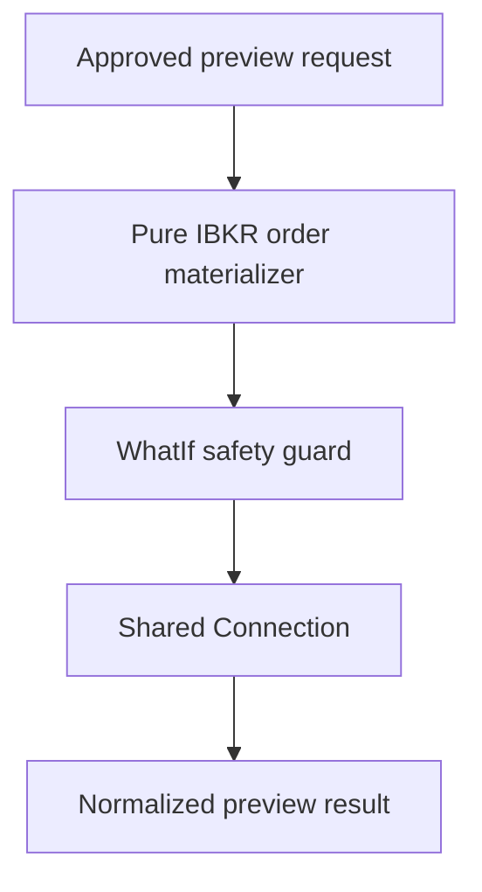
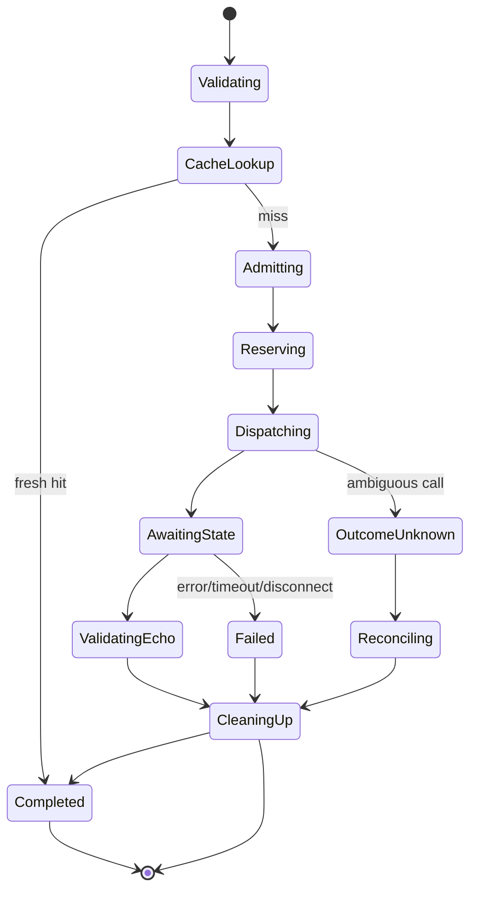

# IBKR Margin Preview Specification

**Document version:** 1.0  
**Status:** Implementation specification  
**Target runtime:** .NET 10 or later  
**Provider API:** Official Interactive Brokers TWS API for C#  
**Host:** Trader Workstation or IB Gateway  
**Implementation project:** `Framework.TradeBroker.InteractiveBrokers`  
**Implementation module:** `Framework.TradeBroker.InteractiveBrokers.MarginPreview`  
**Shared connection module:** `Framework.TradeBroker.InteractiveBrokers.Connection`  
**Release priority:** Optional, rate-limited V1.x diagnostic/pretrade service  
**Primary product scope:** The same ES futures-option orders supported by OrderExecution  
**Companion specifications:** `IbkrBrokerConnectionSpecification.md`, `IbkrContractReferenceSpecification.md`, `IbkrOrderExecutionAdapterSpecification.md`, `IbkrBrokerAccountSpecification.md`, and `OrderExecutionWorkflowSpecification.md`  
**Last updated:** 2026-08-02

---

## 1. Purpose

This document specifies a safe, separately rate-limited IBKR margin-impact preview service using the TWS API's `WhatIf` order mechanism.

The module shall:

- accept a complete broker-neutral proposed-order definition;
- require the same verified contracts and deterministic order translation used by real IBKR execution;
- reserve a distinct broker order ID with owner `MarginPreview`;
- create an IBKR order whose final outbound invariant includes `WhatIf = true`;
- submit the preview through the shared connection's serialized dispatcher;
- correlate the returned `openOrder`/`OrderState` and applicable error evidence;
- normalize available initial-margin, maintenance-margin, equity-with-loan, commission/fee, currency, and warning fields;
- expose completeness, freshness, account snapshot dependency, request fingerprint, and broker provenance;
- cancel the what-if order after the review result according to official operational guidance;
- rate-limit, coalesce, and optionally cache only exact request fingerprints;
- support deterministic fake-broker, property, paper-account, and safety tests.

This service provides broker-estimated diagnostics. It does not authorize a real order and does not replace the platform risk engine, broker-account safety gate, position limits, reservation-price policy, or deterministic execution workflow.

---

## 2. Normative Architecture Decision

`Framework.TradeBroker.InteractiveBrokers.MarginPreview` is a distinct module in the concrete IBKR provider project.

It shares only infrastructure that must be globally coordinated:

- physical TWS connection;
- connection/session epoch;
- serialized outbound API dispatcher;
- order-ID allocator;
- order-ID callback route registry;
- correlated error routing;
- pacing/resource coordinator;
- injected clock and telemetry conventions.

It does not share:

- the live OrderExecution workflow aggregate;
- live-order route ownership;
- execution retry/reprice/cancel decisions;
- broker-neutral order authorization;
- execution-attempt persistence state;
- strategy or MDP state/action selection.



OrderExecution and MarginPreview shall use the same pure provider-internal contract/order materializers so the preview represents the proposed real order. The materializers contain no socket I/O or workflow state. The MarginPreview boundary then creates a private order instance and applies/validates preview-only invariants.

---

## 3. Non-Negotiable Safety Invariants

1. Every outbound preview order has `WhatIf == true` at the final call boundary.
2. The final invariant is checked immediately before `EClientSocket.placeOrder` executes, not only during earlier mapping.
3. A preview order ID is allocated from the shared allocator with owner `MarginPreview` and can never be claimed by OrderExecution.
4. Preview callbacks can never enter a live execution workflow route.
5. Live-order callbacks can never complete a preview.
6. A preview result never returns `Approved`, `Authorized`, or any command that transmits an order.
7. A preview request never mutates a live order.
8. No automatic retry occurs after an ambiguous `placeOrder` invocation outcome.
9. Timeout or cancellation never causes a fallback real order.
10. Preview failure cannot prevent cancel/modify/kill operations for existing real orders.
11. Every request uses exact ContractReference results and records their fingerprints.
12. Cache reuse requires an exact order fingerprint, account snapshot version, contract-reference version, environment, and freshness policy.
13. IBKR estimates are observations, not guarantees of final margin or execution acceptance.
14. The service is not called once per market-data tick or per execution-policy transition.
15. A preview is cancelled after result collection; cancellation is cleanup, not evidence that a real order existed.

---

## 4. Scope

### 4.1 V1.x included

- single-account preview service;
- supported ES futures-option single-leg and combination limit-order shapes already supported by OrderExecution;
- shared exact contract resolution;
- shared pure IBKR contract/order materialization;
- distinct preview order-ID allocation and callback routing;
- `Order.WhatIf = true` final boundary guard;
- `placeOrder` request and `openOrder`/`OrderState` normalization;
- correlated warning/error classification;
- bounded wait, cleanup cancellation, route tombstone, and late-callback handling;
- conservative pacing defaults and shared connection resource priority;
- exact fingerprint coalescing/short-lived cache;
- complete provenance and stale/completeness results;
- deterministic/scripted/property/paper safety tests;
- health, metrics, alerts, and operator runbook.

### 4.2 Later extensions

- additional order types after OrderExecution supports them;
- multi-account previews;
- portfolio scenario batches under separate documented broker/API limits;
- scheduled risk-diagnostic sampling;
- historical comparison of broker estimates to realized margin changes;
- provider-neutral alternative margin estimators.

### 4.3 Non-goals

- per-tick margin calculation;
- real order submission;
- order modification or compensation;
- replacing portfolio risk calculations;
- guaranteeing IBKR acceptance, fill, or post-fill margin;
- previewing an order shape not executable by the real adapter;
- inferring missing `OrderState` fields as zero;
- using the preview ID as the later real order ID;
- automatically converting a preview into a transmitted order;
- exposing mutable `IBApi.Contract`, `IBApi.Order`, or `IBApi.OrderState` outside the provider boundary.

---

## 5. Release Phases

| Phase | Release | Required outcome |
|---|---|---|
| MP-1 | V1.x | Contracts, capability/configuration, pure fingerprints, strict final safety guard |
| MP-2 | V1.x | Shared order-ID routing and bounded request lifecycle |
| MP-3 | V1.x | Pinned `OrderState` mapping, completeness, errors, cleanup cancellation |
| MP-4 | V1.x | Rate limiting, coalescing, cache, account/contract dependencies |
| MP-5 | V1.x | Deterministic safety suite, paper acceptance, operations |
| MP-6 | Later | Additional order shapes/accounts and diagnostic analytics |

Do not enable the service in production until MP-1 through MP-5 pass. It may remain disabled without blocking V1 live trading because it is not a V1 dependency.

---

## 6. Suggested Project Structure

```text
Framework.TradeBroker/
  MarginPreview/
    IBrokerMarginPreview.cs
    MarginPreviewModels.cs
    MarginPreviewFailures.cs

Framework.TradeBroker.InteractiveBrokers/
  Orders/
    IbkrContractMaterializer.cs
    IbkrOrderMaterializer.cs
    IbkrOrderFingerprint.cs
  MarginPreview/
    IbkrMarginPreviewService.cs
    IbkrMarginPreviewOptions.cs
    IbkrMarginPreviewAdmission.cs
    IbkrWhatIfSafetyGuard.cs
    IbkrMarginPreviewRequestActor.cs
    IbkrMarginPreviewCallbackSink.cs
    IbkrMarginPreviewNormalizer.cs
    IbkrMarginPreviewRateLimiter.cs
    IbkrMarginPreviewCache.cs
    IbkrMarginPreviewHealth.cs
    IbkrMarginPreviewMetrics.cs

Framework.TradeBroker.InteractiveBrokers.Tests/
  MarginPreview/
    Unit/
    Property/
    Scripted/
    Compatibility/
    Paper/
```

If the existing OrderExecution module already contains correct pure materializers, extract or expose a narrow provider-internal interface without moving execution policy. Do not duplicate translation logic and then allow the copies to diverge.

---

## 7. Official API Baseline

### 7.1 What-if mechanism

The official workflow sets `Order.WhatIf = true` and passes the contract/order to `EClient.placeOrder`. IBKR performs a credit/margin check rather than routing the order to a destination. Expected post-trade margin information is returned through the order-state information accompanying `EWrapper.openOrder`.

The official documentation also advises conservative use: do not submit many what-if requests, avoid more than approximately one per minute, keep real-order-to-what-if usage conservative, and cancel the what-if order after reviewing margin information. These are encoded as defaults and operational constraints, not treated as a throughput entitlement.

### 7.2 Required calls and callbacks

| Purpose | API/callback | Owner |
|---|---|---|
| Allocate broker order ID | shared `nextValidId`-synchronized allocator | `.Connection` |
| Submit preview | `placeOrder(orderId, contract, orderWithWhatIfTrue)` | `.MarginPreview` through dispatcher |
| Receive order and margin state | `openOrder(orderId, contract, order, orderState)` | route owner `.MarginPreview` |
| Receive status if emitted | `orderStatus(...)` | route owner `.MarginPreview` |
| Receive warning/failure | `error(...)` | correlated route/connection classifier |
| Cleanup preview | `cancelOrder(...)` using pinned signature | `.MarginPreview` through dispatcher |

Codex shall compile against the pinned C# package and inspect the exact `OrderState` field types/names. This specification defines normalized semantics, not a guessed source signature.

### 7.3 Compatibility manifest

Record:

- official C# API exact package/version;
- TWS/IB Gateway tested versions;
- server version range;
- order-materializer version;
- ContractReference schema/matching version;
- margin-preview normalization schema version;
- `OrderState` field capability map;
- IBKR error-catalog version.

A source field removed, renamed, type-changed, or newly sentinel-encoded is a compatibility failure until mapping/tests are updated.

---

## 8. Public Broker-Neutral Contracts

### 8.1 Interface

```csharp
public interface IBrokerMarginPreview
{
    ValueTask<MarginPreviewResult> PreviewAsync(
        MarginPreviewRequest request,
        CancellationToken cancellationToken);

    MarginPreviewCapabilities GetCapabilities();

    MarginPreviewHealthSnapshot GetHealth();
}
```

The service API shall not expose a generic submit method or accept arbitrary provider objects.

### 8.2 Request

```csharp
public sealed record MarginPreviewRequest(
    MarginPreviewRequestId RequestId,
    AccountIdentity Account,
    BrokerNeutralOrderDefinition ProposedOrder,
    AccountSnapshotVersion AccountSnapshotVersion,
    Instant AccountSnapshotObservedAt,
    IReadOnlyList<ResolvedContractReference> Contracts,
    MarginPreviewPurpose Purpose,
    FreshnessRequirement Freshness,
    string RiskPolicyVersion,
    string OrderMaterializerVersion,
    string IdempotencyKey);
```

`BrokerNeutralOrderDefinition` must be the same immutable approved/proposed shape consumed by the real adapter before IBKR materialization. It includes all material fields: account, side, quantity, legs/ratios, order type, limit price, time-in-force, exchange/routing profile, currency, order reference, and supported flags.

The request is not itself order authorization. Its type shall not implement or contain a live `SubmitOrderCommand`.

### 8.3 Purposes

Allowed bounded purposes include:

- candidate risk validation outside the final execution window;
- operator pretrade diagnostic;
- adapter/order-field integration validation;
- scheduled low-frequency risk sampling;
- paper-environment acceptance test.

Unknown purposes are rejected. Purpose participates in audit and rate policy, not the economic fingerprint.

### 8.4 Result

```csharp
public sealed record MarginPreviewResult(
    MarginPreviewRequestId RequestId,
    MarginPreviewStatus Status,
    OrderEconomicFingerprint OrderFingerprint,
    AccountSnapshotVersion AccountSnapshotVersion,
    MarginImpactValues Values,
    CommissionEstimate? Commission,
    IReadOnlyList<BrokerPreviewWarning> Warnings,
    MarginPreviewCompleteness Completeness,
    MarginPreviewProvenance Provenance,
    MarginPreviewFailure? Failure);
```

The result type intentionally has no `Approved`, `CanTrade`, `Transmit`, `BrokerOrder`, or `PlaceOrder` member.

### 8.5 Margin values

```csharp
public sealed record MarginImpactValues(
    CurrencyCode? BaseCurrency,
    DecimalValueState InitialMarginBefore,
    DecimalValueState InitialMarginChange,
    DecimalValueState InitialMarginAfter,
    DecimalValueState MaintenanceMarginBefore,
    DecimalValueState MaintenanceMarginChange,
    DecimalValueState MaintenanceMarginAfter,
    DecimalValueState EquityWithLoanBefore,
    DecimalValueState EquityWithLoanChange,
    DecimalValueState EquityWithLoanAfter);
```

Each `DecimalValueState` distinguishes:

- present parsed value;
- absent in pinned API;
- source unset/sentinel;
- unparsable source;
- not applicable;
- withheld/permission-limited.

Never normalize missing/unset to zero.

### 8.6 Commission estimate

When supported by the pinned `OrderState`, normalize:

- exact commission value and/or minimum/maximum range;
- commission currency;
- commission/fee warning text as a redacted classified warning;
- source field-presence flags.

The result shall label estimates explicitly. It must not be stored as an actual execution commission.

### 8.7 Status

```csharp
public enum MarginPreviewStatus : byte
{
    Completed = 1,
    CompletedIncomplete = 2,
    CacheHit = 3,
    Coalesced = 4,
    Unsupported = 5,
    InvalidRequest = 6,
    AccountStale = 7,
    ContractStale = 8,
    RateLimited = 9,
    QueueRejected = 10,
    TimedOut = 11,
    Cancelled = 12,
    Disconnected = 13,
    BrokerRejected = 14,
    OutcomeUnknown = 15,
    CompatibilityFailure = 16,
    CleanupFailed = 17,
    InternalFailure = 18
}
```

`CleanupFailed` may accompany usable preview evidence but makes health degraded and requires route/order reconciliation. Represent primary result and cleanup state separately if the repository result conventions support it.

---

## 9. Exact Order Equivalence

### 9.1 Shared pure materialization

The same versioned pure functions shall materialize:

- each private `IBApi.Contract`/combo contract;
- each combo leg;
- action and quantity;
- order type and limit price;
- time-in-force;
- routing/exchange fields;
- account and supported order flags;
- deterministic order reference.

OrderExecution applies live-execution invariants after materialization. MarginPreview applies preview-only invariants after materialization. Neither reimplements economic translation.

### 9.2 Fingerprint

Before any provider call, compute a stable economic fingerprint over:

- account identity hash/environment;
- every contract fingerprint and leg order/ratio/action;
- total quantity;
- action;
- order type;
- exact limit/auxiliary prices;
- time-in-force;
- routing profile/exchange;
- currency;
- all material supported flags;
- materializer and schema versions.

Exclude:

- broker preview order ID;
- request timestamps;
- callback arrival data;
- `WhatIf` itself;
- telemetry correlation IDs.

The result records the fingerprint. A consumer must compare it to the intended proposal before using the observation.

### 9.3 Contract requirement

Every contract must be an immutable exact success from `IbkrContractReferenceSpecification.md` under the configured freshness policy. The preview actor revalidates:

- canonical ID and `conId` association;
- contract fingerprint;
- environment;
- expiry/strike/right/multiplier/trading class/exchange;
- price increment/rule for the proposed price;
- combo leg uniqueness and ratio validity.

### 9.4 Echo validation

When `openOrder` echoes contract/order fields, normalize and compare all material economic fields against the outbound fingerprint before accepting margin values. A mismatch returns `BrokerRejected` or `CompatibilityFailure`, quarantines the evidence, and triggers an alert.

---

## 10. Final What-If Safety Guard

### 10.1 Boundary design

Only one internal method is permitted to invoke `placeOrder` for this module. It accepts a dedicated type that can be constructed only by the safety guard:

```csharp
internal readonly record struct ValidatedWhatIfOrder(
    int BrokerOrderId,
    IBApi.Contract Contract,
    IBApi.Order Order,
    OrderEconomicFingerprint Fingerprint,
    ConnectionEpoch Epoch);
```

Immediately before dispatch, the guard shall prove:

- feature/configuration enabled;
- environment permitted;
- current connection epoch/readiness;
- broker order ID reserved with owner `MarginPreview`;
- matching registered preview route exists;
- order instance is private to this operation;
- `Order.WhatIf == true`;
- account matches request and configured account policy;
- order fingerprint matches the prevalidated request;
- all contracts match exact reference fingerprints;
- order type is allowlisted;
- no provider field can transform it into a live order under the pinned API;
- rate/admission token is active;
- request has not expired/cancelled.

If any condition fails, `placeOrder` is not called.

### 10.2 Construction rule

The module shall clone/materialize a fresh private order and then set `WhatIf = true`. It shall not modify a live OrderExecution object, reuse a live order ID, or toggle a submitted order between what-if and real modes.

### 10.3 Static enforcement

Where repository architecture permits:

- restrict `EClientSocket` access to `.Connection` internals;
- expose a purpose-tagged dispatcher operation;
- require `BrokerOperationPurpose.MarginPreview` and `ValidatedWhatIfOrder`;
- unit-test assembly dependency rules;
- add a source/analyzer test that MarginPreview cannot call a general live-order dispatcher method.

### 10.4 No conversion

A real order is always a new workflow command with a new broker order ID and a new live-order route. There is no “promote preview” operation.

---

## 11. Request Lifecycle and Correlation

### 11.1 States



### 11.2 Required sequence

1. validate request, account freshness, contracts, order shape, and price rules;
2. compute fingerprint;
3. check/coalesce exact in-flight request and fresh cache;
4. obtain pacing/admission lease;
5. capture connection epoch;
6. reserve a unique shared broker order ID with owner `MarginPreview`;
7. register the preview route before dispatch;
8. materialize a private contract/order;
9. apply and execute the final what-if safety guard;
10. call `placeOrder` once through the dispatcher;
11. await correlated margin/error evidence under a deadline;
12. validate echoed order/contract evidence;
13. normalize completeness and result;
14. issue cleanup cancellation when safe/required;
15. tombstone the route and release resources;
16. publish and optionally cache the immutable result.

### 11.3 Route key

The internal route key includes:

```text
Environment
ConnectionEpoch
BrokerOrderId
Owner = MarginPreview
PreviewRequestGeneration
```

Numeric order ID alone is not sufficient.

### 11.4 Completion evidence

The normal result requires a correlated `openOrder` carrying an `OrderState` for the preview and a valid echo/fingerprint comparison. `orderStatus` alone is not margin evidence.

If the pinned API provides an explicit additional terminal field/status, map it through a versioned completion policy. Never complete based on elapsed silence.

### 11.5 Duplicate and late callbacks

- identical callbacks are deduplicated by stable envelope fingerprint;
- a later same-route callback with materially different margin values is retained as a version and resolved under a documented terminal policy;
- callbacks after route tombstone are counted/diagnosed but cannot change the published result;
- callbacks from a different epoch/owner are rejected;
- no callback is forwarded to the OrderExecution event sink.

---

## 12. Timeout, Cancellation, and Cleanup

### 12.1 Time bounds

Configuration shall define:

- queue admission timeout;
- preview response timeout;
- cleanup-cancel timeout;
- route tombstone TTL;
- ambiguous-outcome reconciliation timeout;
- overall request deadline.

All use the injected monotonic clock where elapsed time matters.

### 12.2 Caller cancellation

Cancellation before dispatch prevents the call. Cancellation after dispatch triggers cleanup/reconciliation but does not erase broker evidence already received. The caller may receive `Cancelled`; the actor continues bounded safety cleanup independently.

### 12.3 Cleanup cancel

After result or terminal failure, enqueue the pinned `cancelOrder` call for the preview order ID when the connection/route state makes it safe and meaningful. Cleanup:

- uses owner `MarginPreview`;
- is lower priority than cancellation of real orders but higher than background preview work;
- is idempotent under the classified broker responses;
- records invocation and outcome;
- does not imply that a destination order existed.

### 12.4 Ambiguous submission

If the dispatcher cannot prove whether `placeOrder` was invoked:

- mark `OutcomeUnknown`;
- do not allocate a new ID and retry automatically;
- retain the route;
- request/observe broker evidence through the shared connection's safe order-reconciliation mechanism if applicable;
- issue owner-safe cleanup for the original ID when possible;
- terminate under a bounded reconciliation deadline;
- alert if ownership/evidence remains unresolved.

At no point is a real order submitted.

---

## 13. Normalization and Completeness

### 13.1 Source-field compatibility map

At implementation time, Codex shall enumerate every consumed `OrderState` member from the pinned C# assembly, including its type, unset/sentinel behavior, currency relationship, and representative paper response.

The map shall cover available semantics for:

- initial margin before/change/after;
- maintenance margin before/change/after;
- equity with loan before/change/after;
- commission and minimum/maximum commission;
- commission currency;
- warning text;
- any completion/status fields used by the policy.

Do not hardcode a field because an older sample names it. Compile and test the pinned version.

### 13.2 Parsing

- parse numeric strings using invariant culture and exact decimals;
- recognize only documented/sampled unset sentinels;
- preserve raw safe field presence metadata/hash;
- distinguish zero from absent;
- reject NaN/infinity/overflow;
- do not infer currency from account base currency unless the source semantics document that relationship;
- normalize warnings through a redacting classifier.

### 13.3 Completeness profiles

```csharp
public enum MarginPreviewCompleteness : byte
{
    Complete = 1,
    MarginCompleteCommissionUnavailable = 2,
    Partial = 3,
    UnsupportedFields = 4,
    EchoMismatch = 5,
    Invalid = 6
}
```

The configured completeness profile declares required value groups for each supported order/account type. A response can be useful but partial; the result must say so.

### 13.4 Sanity checks

Without inventing business approval, normalization shall check:

- after approximately equals before plus change under an explicit decimal tolerance and source semantics;
- currency is valid/known when commission values exist;
- magnitude fits configured diagnostic safety bounds;
- values do not use unparsed sentinel strings;
- all echoed material order fields match;
- warning/error combinations are classified.

Failed checks produce incomplete/invalid evidence and alerts; they never authorize trading.

---

## 14. Rate Limiting and Resource Priority

### 14.1 Conservative defaults

The default policy shall:

- permit no more than one provider what-if invocation per rolling minute process-wide/account-wide as configured;
- cap concurrent active previews at one unless current official behavior and tests justify more;
- track a conservative real-order-to-what-if ratio consistent with current official guidance;
- reject or defer excess requests explicitly;
- prevent scheduler/manual callers from bypassing the same budget.

These defaults may become stricter by environment or incident mode. Increasing them requires documented official/API review and paper load evidence.

### 14.2 Shared connection priority

Priority order shall preserve at least:

1. real-order global safety/cancel operations;
2. real-order cancel/modify and recovery;
3. connection liveness and account safety resynchronization;
4. approved new real-order operations;
5. contract resolution required by approved work;
6. margin preview cleanup;
7. margin preview submission;
8. background reference/market-data/reporting work as applicable.

MarginPreview cannot consume the final reserved queue capacity needed by real-order safety.

### 14.3 Admission results

Admission may return `Accepted`, `Coalesced`, `FreshCache`, `RateLimited`, `QueueRejected`, `Disabled`, or `Degraded`. It exposes `RetryAfter` only as scheduling information; callers shall not spin or retry automatically in the execution hot path.

---

## 15. Cache and Coalescing

### 15.1 Exact key

The cache key includes:

```text
Provider = InteractiveBrokers
Environment
AccountIdentityHash
AccountSnapshotVersion
AccountSnapshotObservedAtBucketOrExactPolicy
OrderEconomicFingerprint
ContractReferenceFingerprints
MarketRuleVersions
OrderMaterializerVersion
PreviewNormalizationVersion
RiskPolicyVersion
```

If any material component changes, the prior preview is not reusable.

### 15.2 Freshness

Cache TTL shall be short and exposed in the result. The consumer receives:

- provider-observed time;
- cache-stored time;
- age;
- configured maximum age;
- account snapshot age/version;
- contract-reference ages/versions.

A cached preview never becomes a timeless risk fact.

### 15.3 Coalescing

Identical concurrent requests may share one provider invocation. All waiters receive the same immutable economic result with caller-specific receipt metadata outside the result if needed. One waiter's cancellation does not cancel the shared actor while other waiters remain.

### 15.4 No unsafe cache fallback

If a live request fails, the service may return a stale cached result only as `DiagnosticStale` evidence when the caller explicitly permits it. It must not label it completed/current or use it to authorize execution.

---

## 16. BrokerAccount and Risk Integration

### 16.1 Account dependency

Before dispatch, require a BrokerAccount snapshot that:

- belongs to the same configured account/environment;
- is complete enough for the configured preview policy;
- is not stale beyond the policy;
- has no unresolved account identity mismatch;
- has a durable version recorded in the request.

This snapshot is dependency/provenance. MarginPreview does not mutate BrokerAccount state.

### 16.2 Risk-engine relationship

The platform risk engine may consume the preview as one optional observation. It shall continue to enforce:

- position and exposure limits;
- current broker-account margin/cash gates;
- internal scenario risk;
- strategy and concentration limits;
- maximum loss/edge/slippage policy;
- stale-data and discrepancy gates.

The risk decision records whether a preview was absent, current, stale, partial, or failed. The default V1.x architecture must define explicitly whether a preview is required for a specific order class. It is not globally required merely because the module exists.

### 16.3 Execution relationship

If an approved workflow chooses to reference a preview, it shall verify:

- exact order economic fingerprint;
- exact account snapshot version policy;
- contract and materializer versions;
- result status/completeness;
- maximum age;
- no disqualifying warning/error.

The workflow still creates a new live submit command and OrderExecution allocates a different broker order ID.

---

## 17. Configuration

Representative configuration:

```json
{
  "TradeBroker": {
    "InteractiveBrokers": {
      "MarginPreview": {
        "Enabled": false,
        "AllowedEnvironments": ["Paper"],
        "MaximumConcurrentPreviews": 1,
        "MinimumInterval": "00:01:00",
        "MinimumRealOrderToPreviewRatio": 10,
        "QueueAdmissionTimeout": "00:00:02",
        "PreviewResponseTimeout": "00:00:15",
        "CleanupCancelTimeout": "00:00:05",
        "AmbiguousOutcomeTimeout": "00:00:20",
        "OverallDeadline": "00:00:30",
        "RouteTombstoneTtl": "00:02:00",
        "CacheTtl": "00:00:30",
        "MaximumAccountSnapshotAge": "00:00:10",
        "MaximumContractReferenceAge": "01:00:00",
        "RequireCompleteMarginValues": true,
        "AllowedOrderTypes": ["Limit", "ComboLimit"],
        "NormalizationSchemaVersion": "ibkr-margin-preview-v1",
        "SafetyGuardVersion": "ibkr-whatif-guard-v1"
      }
    }
  }
}
```

Production/live enablement is separate from paper enablement and requires an audited deployment change after paper acceptance. Unknown order types, environments, schema versions, or nonpositive bounds fail configuration.

The real-order-to-preview ratio is a conservative operational gate based on current official guidance. If the system has insufficient reliable real-order counts, it shall enforce the minimum interval and reject ratio-dependent admission rather than fabricate counts.

---

## 18. Error and Warning Model

```csharp
public sealed record MarginPreviewFailure(
    MarginPreviewFailureCode Code,
    string SafeMessage,
    bool IsRetryableByExplicitCallerPolicy,
    bool RequiresCleanup,
    bool InvalidatesPreviewHealth,
    TimeSpan? RetryAfter,
    string? BrokerErrorCode,
    string DiagnosticFingerprint);
```

Required categories:

- disabled/environment not permitted;
- invalid/unsupported order;
- stale/incomplete account snapshot;
- unresolved/stale/changed contract;
- invalid price increment;
- rate/ratio/concurrency limited;
- queue rejected;
- connection not ready;
- order-ID reservation or route collision;
- final what-if invariant failure;
- provider call not invoked;
- provider call outcome unknown;
- broker warning;
- broker rejection;
- timeout/cancellation/disconnect;
- echoed-order mismatch;
- missing/unparseable margin fields;
- compatibility failure;
- cleanup cancel failure;
- persistence/audit failure;
- internal invariant failure.

Warnings are version-classified and redacted. Unknown warnings cannot be treated as harmless automatically. The result preserves whether a warning is informational, requires review, invalidates completeness, or indicates rejection.

---

## 19. Persistence and Audit

Persist a bounded audit record containing:

- request ID and idempotency hash;
- account identity hash/environment;
- order economic fingerprint;
- contract fingerprints;
- account snapshot version/time;
- purpose and requester identity/category;
- materializer/safety/normalization policy versions;
- connection epoch and broker preview order ID in protected operational storage;
- lifecycle timestamps;
- callback evidence hashes/types;
- normalized result/completeness;
- cleanup attempt/outcome;
- cache/coalescing disposition;
- classified failure/warnings.

Do not persist mutable IBApi objects or unrestricted raw broker text. Financial values and broker IDs follow the platform's protected trading-record access/retention policy.

Audit persistence required before dispatch shall fail closed. Post-callback persistence failure degrades health, prevents cache publication, and raises a critical operational event without discarding in-memory cleanup responsibility.

---

## 20. Health and Observability

### 20.1 Health snapshot

Expose:

- enabled and environment-permitted state;
- shared connection readiness/epoch;
- feature registration and safety-guard version;
- API/`OrderState` compatibility state;
- current rate/ratio/concurrency budget;
- active/queued requests and oldest age;
- last successful provider preview;
- last complete result;
- cache hit/coalesce rates;
- timeout, rejection, incomplete, echo-mismatch counts;
- outcome-unknown and cleanup-failure counts;
- late/wrong-owner callback counts;
- persistence health;
- preview-service readiness.

Preview readiness is separate from trading readiness.

### 20.2 Metrics

- `ibkr_margin_preview_requests_total{purpose,outcome}`;
- `ibkr_margin_preview_duration_seconds{stage}`;
- `ibkr_margin_preview_active`;
- `ibkr_margin_preview_admission_total{result}`;
- `ibkr_margin_preview_cache_total{result}`;
- `ibkr_margin_preview_completeness_total{state}`;
- `ibkr_margin_preview_warnings_total{category}`;
- `ibkr_margin_preview_echo_mismatch_total`;
- `ibkr_margin_preview_outcome_unknown_total`;
- `ibkr_margin_preview_cleanup_total{outcome}`;
- `ibkr_margin_preview_late_callbacks_total{category}`;
- `ibkr_margin_preview_safety_guard_failures_total{reason}`.

Use bounded labels. Do not label by account, order ID, request ID, symbol, conId, strike, warning text, or fingerprint.

### 20.3 Logs

Allowed fields: request correlation, hashed fingerprint prefix, purpose, environment, epoch, stage, durations, status, completeness, warning category, safe error category, cache/coalesce state, and cleanup state.

Redact account values, exact positions/margin values in ordinary logs, full order details, broker IDs, and raw error/warning text.

### 20.4 Alerts

Alert immediately on:

- any final safety-guard failure;
- wrong-owner/cross-route callback;
- echoed economic-order mismatch;
- ambiguous provider invocation outcome;
- cleanup failure that remains unresolved;
- API compatibility mismatch;
- persistent missing/unparseable margin fields;
- rate behavior outside configured limits;
- audit persistence failure.

---

## 21. Determinism and Replay

The deterministic harness shall record normalized envelopes for:

- outbound operation admitted/invoked result;
- preview route and epoch;
- `openOrder`/normalized order-state fields;
- `orderStatus` when used;
- correlated errors/warnings;
- cleanup cancellation result;
- connection changes and timers.

Given the same request, account/contract versions, materializer/safety policies, ordered callback envelopes, and injected time, replay shall produce the same fingerprint, state transitions, result, completeness, cleanup decision, and audit fingerprints.

Do not use host wall time, random IDs, dictionary order, locale, or thread scheduling as business inputs. Broker numeric IDs may differ between live runs but are excluded from economic fingerprints.

---

## 22. Test Requirements

### 22.1 Unit tests

Cover:

- configuration and environment gates;
- all request validation;
- order economic fingerprints;
- shared pure materializer equivalence;
- final safety guard success/failure for every invariant;
- pinned `OrderState` field mapping and unset sentinels;
- exact decimal/currency parsing;
- completeness/sanity checks;
- rate/ratio/concurrency admission;
- exact cache-key and TTL behavior;
- error/warning classification;
- cleanup decision matrix.

### 22.2 Property and architecture tests

Prove:

- no input can reach preview `placeOrder` with `WhatIf != true`;
- preview IDs/routes are never owned by OrderExecution;
- live callback routes cannot complete previews and vice versa;
- any material order-field change changes the economic fingerprint;
- timestamps/preview IDs do not change the fingerprint;
- cache reuse is impossible after an account/contract/materializer change;
- missing source values never become numeric zero;
- callback permutation/duplication obeys deterministic terminal policy;
- cancellation/timeout never creates a live submit command;
- the MarginPreview assembly cannot call a live-order dispatcher entry point.

### 22.3 Scripted broker scenarios

The fake shared connection shall support:

- complete `openOrder` with all margin values;
- missing commission or optional values;
- missing required margin values;
- unset/sentinel values;
- broker warning followed by result;
- terminal rejection before/after `openOrder`;
- callback before dispatcher acknowledgement;
- duplicate and conflicting callbacks;
- wrong owner/order ID/epoch callback;
- timeout and caller cancellation before/after dispatch;
- disconnect/reconnect during every state;
- placeOrder definitely not invoked;
- placeOrder outcome ambiguous;
- cleanup cancellation success, already absent, timeout, and failure;
- route/order-ID collision attempts;
- queue/rate/ratio rejection;
- stale cache request and coalesced callers.

Every scenario asserts outbound API call count and inspects the exact `WhatIf` value at the final fake boundary.

### 22.4 Mutation/safety tests

Introduce deliberate mutations and require failure:

- remove the `WhatIf = true` assignment;
- set it false after materialization;
- route preview through live order purpose;
- reuse preview order ID for live order;
- skip route-before-dispatch;
- skip echo comparison;
- retry after ambiguous submission;
- omit cleanup;
- reuse cache after account version change;
- coerce missing margin to zero.

The release pipeline shall include these invariants through targeted tests or mutation testing where supported.

### 22.5 Paper-account acceptance

For each supported order shape:

- resolve exact contracts through `.ContractReference`;
- build the same economic order through the shared materializer;
- capture outbound preview and prove `WhatIf == true`;
- receive and normalize paper `OrderState` fields;
- validate echoed fields/fingerprint;
- cancel cleanup and prove no destination order exists;
- inspect TWS/API open/completed order evidence under the documented what-if behavior;
- test timeout/disconnect in a controlled session;
- prove no OrderExecution workflow/fill event was created;
- verify pacing defaults and redacted telemetry.

Live-account enablement, if ever required, is read/preview-only under a separate audited change window and explicit operator approval. Automated tests shall never transmit a live order.

---

## 23. Acceptance Criteria

### Boundary safety

- [ ] MarginPreview is a separate module and result type.
- [ ] It shares `.Connection` infrastructure but no live workflow state.
- [ ] It uses the same pure economic materializer as OrderExecution.
- [ ] The final outbound guard proves `WhatIf == true`.
- [ ] No preview can be promoted or converted into a real order.
- [ ] Preview/live IDs and callback routes are ownership-isolated.

### Evidence correctness

- [ ] Exact contract and account versions are required and recorded.
- [ ] Echoed economic fields must match the request fingerprint.
- [ ] All pinned `OrderState` fields have compiled mappings and paper fixtures.
- [ ] Missing/unset/unsupported values remain explicit.
- [ ] Results state completeness, freshness, warnings, and provenance.

### Lifecycle and resources

- [ ] Routes register before one-time outbound dispatch.
- [ ] Ambiguous invocation is never automatically retried.
- [ ] Timeout/cancellation/disconnect lead only to bounded cleanup/reconciliation.
- [ ] Cleanup cancel outcome is recorded.
- [ ] Rate, ratio, concurrency, queues, and timeouts are bounded.
- [ ] Real-order safety operations always have higher priority.

### Quality and operations

- [ ] Unit, property, architecture, mutation, scripted, and paper tests pass.
- [ ] Preview failures do not change trading readiness unless a separate explicit risk policy requires preview evidence.
- [ ] Metrics/logs are bounded and redacted.
- [ ] Alerts and runbook cover safety guard, ambiguity, route isolation, and cleanup.
- [ ] Compatibility manifest is recorded.

---

## 24. Implementation Order for Codex

### Increment 1 — Types, translation, and invariant guard

1. Reuse provider-neutral order, account, contract, decimal, and identity types.
2. Extract/verify the shared pure IBKR materializers.
3. Implement economic fingerprinting.
4. Add preview request/result/failure contracts and configuration.
5. Implement the final `ValidatedWhatIfOrder` guard.
6. Complete property/architecture tests before any broker call.

### Increment 2 — Shared connection lifecycle

1. Add `MarginPreview` order-ID ownership and route registration.
2. Add purpose-tagged dispatcher operation.
3. Implement the bounded request actor/state machine.
4. Route `openOrder`, status, and errors exclusively to the actor.
5. Add timeout, epoch, late-callback, and ambiguous-call tests.

### Increment 3 — Source mapping and cleanup

1. Pin and enumerate `OrderState` fields/sentinels.
2. Implement normalized margin/commission/warning mapping.
3. Implement echo validation and completeness checks.
4. Implement owner-safe cleanup cancellation.
5. Add golden compatibility/scripted tests.

### Increment 4 — Admission and dependencies

1. Add account and ContractReference freshness validation.
2. Add conservative rate/ratio/concurrency budgets.
3. Add exact coalescing and short cache.
4. Integrate optional risk/workflow consumption without authorization leakage.

### Increment 5 — Production-quality acceptance

1. Add audit persistence, health, metrics, logs, alerts, and runbook.
2. Add mutation/safety suite.
3. Run paper-account acceptance for every supported shape.
4. Keep production disabled until evidence is reviewed.

Each increment shall compile and preserve every non-negotiable invariant. Do not build caching or broad order-shape support before final-boundary safety and route isolation are proved.

---

## 25. Instructions to Codex

Codex shall:

1. inspect the existing shared Connection and OrderExecution materializers first;
2. compile every IBApi signature/field against the pinned official C# package;
3. expose no mutable IBApi type through public contracts;
4. route every broker call through `.Connection`;
5. reserve/register the preview route before dispatch;
6. enforce `WhatIf == true` at the final outbound boundary;
7. call `placeOrder` no more than once per admitted preview;
8. never retry an ambiguous invocation automatically;
9. validate the returned economic echo before accepting values;
10. represent missing/sentinel/unsupported fields explicitly;
11. execute bounded owner-safe cleanup;
12. make time, broker callbacks, IDs, stores, and rate state injectable;
13. add safety tests before paper enablement;
14. keep the module disabled by default.

Codex shall stop and report a specification issue when:

- the pinned package lacks the documented what-if behavior or required state fields;
- the shared connection cannot enforce order-ID route ownership;
- the real adapter and preview would use different economic materialization;
- exact ContractReference evidence is unavailable;
- account snapshot provenance cannot be recorded;
- a requested order type is not already specified for real execution;
- a caller requests conversion/promotion into a real order;
- any code path could invoke `placeOrder` without the final guard;
- safe cleanup or audit persistence cannot be implemented.

---

## 26. Definition of Done

The module is done when a supported broker-neutral proposed order can be transformed through the same pure IBKR materialization as real execution, dispatched exactly once under a final `WhatIf == true` guard using an isolated preview order ID/route, returned as a normalized and provenance-rich margin estimate, cleaned up safely, rate-limited conservatively, and proven through property, mutation, scripted, compatibility, and paper tests never to create or authorize a transmitted order.

The governing rule is:

> A margin preview is disposable broker evidence about one exact proposed order. It is never an order, never an approval, and never a path to transmission.

---

## 27. Authoritative Implementation References

Codex shall verify the pinned C# API and current official IBKR guidance at implementation time:

- [Test order impact with a what-if order](https://www.interactivebrokers.com/docs/tws-api/doc/orders/test-order-impact-what-if)
- [Place order API](https://www.interactivebrokers.com/docs/tws-api/doc/quick-start/placing-orders)
- [Request and receive open orders](https://www.interactivebrokers.com/docs/tws-api/doc/synchronous-api/open-orders)
- [Order ID requirements](https://www.interactivebrokers.com/docs/tws-api/doc/quick-start/order-id)
- [Cancel an order](https://www.interactivebrokers.com/docs/tws-api/doc/synchronous-api/cancel-order)
- [Order placement considerations](https://www.interactivebrokers.com/docs/tws-api/doc/orders/place-order/order-placement-considerations)
- [Error codes](https://www.interactivebrokers.com/docs/tws-api/doc/error-handling/error-codes)

If current official documentation or the pinned assembly conflicts with an example in this document, preserve the final what-if guard, preview/live ownership isolation, exact order equivalence, one-call ambiguity rule, explicit completeness, conservative pacing, and no-authorization boundary while raising a versioned compatibility issue.
