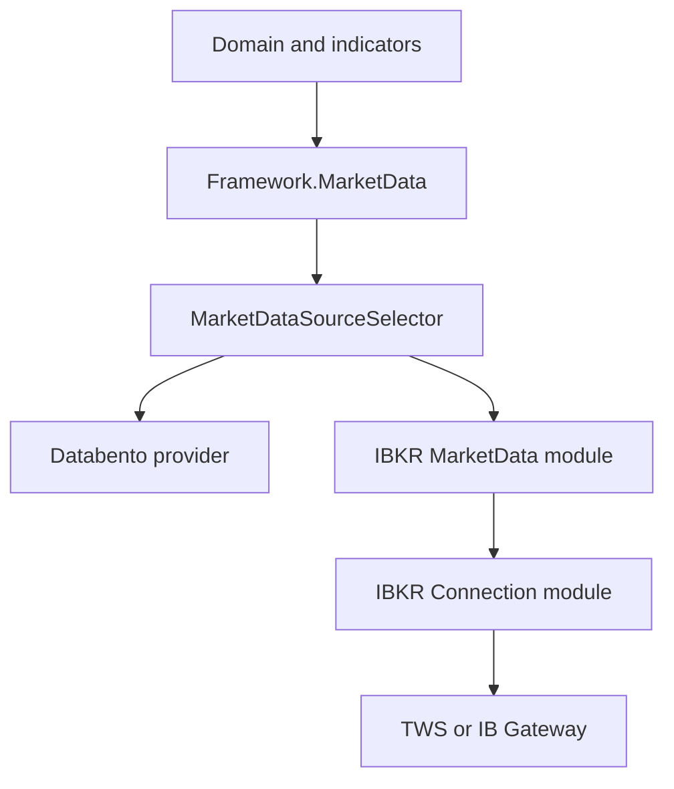
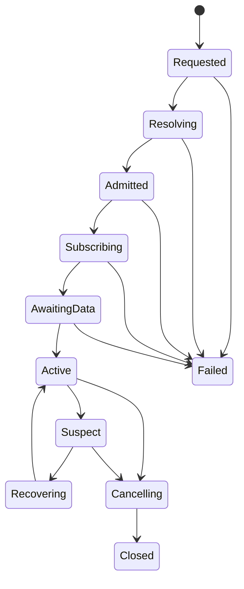

# IBKR Market Data Provider Specification

**Document version:** 1.1  
**Status:** Implementation specification  
**Target runtime:** .NET 10 or later  
**Provider API:** Official Interactive Brokers TWS API for C#  
**Host:** Trader Workstation or IB Gateway  
**Implementation project:** `Framework.TradeBroker.InteractiveBrokers`  
**Implementation module:** `Framework.TradeBroker.InteractiveBrokers.MarketData`  
**Provider-neutral API:** `Framework.MarketData`  
**Shared connection module:** `Framework.TradeBroker.InteractiveBrokers.Connection`  
**Primary provider:** `Framework.MarketData.Databento`  
**Secondary provider:** `Framework.TradeBroker.InteractiveBrokers.MarketData`  
**Primary product scope:** ES futures, ES futures options, VX futures observations, and held-position marks
**Companion specifications:** `IbkrBrokerConnectionSpecification.md`, `IbkrBrokerAccountSpecification.md`, `IbkrOrderExecutionAdapterSpecification.md`, `IbkrContractReferenceSpecification.md`, `OrderExecutionWorkflowSpecification.md`, `ScriptedBrokerTestHarnessSpecification.md`, and the Databento market-data specification  
**Last updated:** 2026-08-02

---

## 1. Purpose

This document specifies a Codex-ready Interactive Brokers implementation of the trading system's provider-neutral market-data API.

`Framework.TradeBroker.InteractiveBrokers.MarketData` is a real secondary market-data provider. It is not merely a quote-verification helper. It shall implement the same canonical `Framework.MarketData` contracts consumed from `Framework.MarketData.Databento`, subject to an explicit capability profile that describes differences in schemas, timing, sequencing, entitlements, depth, update frequency, and historical availability.

The implementation shall provide:

- live top-of-book quotes and trades;
- deterministic latest-price snapshots;
- bounded logical option-chain subscriptions for one underlying and one expiry;
- option-chain definition access through the IBKR contract-reference capability;
- option quote and, when entitled, option-computation observations;
- explicit live, frozen, delayed, and delayed-frozen data typing;
- connection, subscription, entitlement, pacing, freshness, loss, and divergence health;
- deterministic conversion into canonical fixed-layout records;
- provider provenance on every record and snapshot;
- explicit source-selection and provider-switch behavior;
- safe sharing of the existing TWS connection with account and order modules;
- deterministic scripted, paper, replay, load, reconnect, and fault testing;
- later V1.x extensions for tick-by-tick, market depth, real-time bars, historical bars/ticks, and expanded analytics.

The module must protect order execution and account reconciliation from market-data volume. It must never block the shared IBKR callback thread, consume unbounded memory, starve an order cancellation, conceal dropped records, silently substitute delayed data, or imply that IBKR and Databento provide identical information.

---

## 2. Normative Architecture Decision

### 2.1 Provider layout

The framework shall use the following provider organization:

```text
Framework.MarketData
        +-- provider-neutral contracts
        +-- canonical records
        +-- capabilities
        +-- source-selection policy
        +-- feed health
        +-- replay contracts

Framework.MarketData.Databento
        +-- primary market-data implementation
        +-- managed C# API
        +-- native C++ adapter
        +-- native session/thread/ring-buffer implementation

Framework.TradeBroker.InteractiveBrokers
        +-- Connection
        +-- BrokerAccount
        +-- OrderExecution
        +-- ContractReference
        +-- MarketData
        +-- MarginPreview
        +-- Reporting/Flex
```

The folder/module location under `Framework.TradeBroker.InteractiveBrokers` expresses ownership by the concrete external provider and permits all TWS-backed capabilities to share one connection. It does not make market data a broker-account or order-execution concern.

### 2.2 Contract parity, not implementation parity

Databento and IBKR shall implement the same provider-neutral capabilities where both providers genuinely support the requested semantics. They shall not be forced into false equivalence.

| Concern | Databento implementation | IBKR implementation |
|---|---|---|
| Role | Primary live/historical feed | Secondary/fallback/verification feed |
| Language boundary | C# public API over C++ native adapter | C# provider over official C# TWS API |
| Physical session | Databento-owned | Shared TWS/IB Gateway socket |
| Ingress | Native producer threads and SPSC rings | Shared `EWrapper` callback ingress and dedicated market-data rings |
| Canonical output | `Framework.MarketData` records | The same canonical record families |
| Sequence | Provider/exchange semantics where supplied | Usually synthetic callback sequence, explicitly flagged |
| Market-by-order | Supported only for entitled Databento schemas | Not claimed unless the pinned IBKR API supplies equivalent semantics; V1 reports unsupported |
| Option chain | Dataset definitions plus one logical chain feed | Contract-reference definitions plus many bounded ticker subscriptions exposed as one logical chain feed |
| Historical data | Primary acquisition and replay source | Secondary, capability-limited V1.x source |
| Failover | Preferred source | Explicitly selected secondary source; never silently blended |

### 2.3 Dependency direction



The following rules are mandatory:

- domain, strategy, indicator, intrinsic-time, risk, workflow, projection, and UI code depend on `Framework.MarketData`, not a concrete provider;
- `Framework.TradeBroker.InteractiveBrokers.MarketData` may depend on provider-neutral `Framework.MarketData`, the IBKR `.Connection` module, and a narrow `.ContractReference` port;
- the IBKR provider must not depend on `Framework.MarketData.Databento`;
- the Databento provider must not depend on the IBKR provider;
- only the composition root and provider-neutral source selector know both concrete registrations;
- `IBApi` types must not cross the concrete IBKR project boundary;
- order execution, account, and market-data modules must not call one another to reach the socket;
- the `.Connection` module must not reference `.MarketData`.

Architecture tests shall fail the build if these rules are violated.

---

## 3. Goals and Non-Goals

### 3.1 Goals

1. Provide an IBKR secondary feed without changing downstream market-data consumers.
2. Preserve deterministic meaning through explicit provider capabilities and provenance.
3. Support the V1 ES futures-option execution and position-monitoring workflow.
4. Allow a bounded option chain for candidate construction without indiscriminate chain subscription.
5. Supply a deterministic latest-price operation with an explicit price-selection policy and timeout.
6. Detect stale, incomplete, delayed, divergent, disconnected, unentitled, paced, and locally lossy streams.
7. Share one TWS connection while isolating market-data throughput from critical order/account callbacks.
8. Preserve live/replay behavioral parity at the canonical-record boundary.
9. Permit phased V1.x growth without redesigning provider-neutral contracts.

### 3.2 Non-goals for V1

- Replacing Databento as the default strategy feed.
- Combining Databento and IBKR ticks into a synthetic blended tape.
- Claiming exchange-grade sequence continuity where IBKR does not expose it.
- Treating aggregated depth as market-by-order data.
- Subscribing every strike returned by an option-chain definition.
- Persisting an entire live option chain merely because it is available.
- Running indicator, intrinsic-time, database, UI, logging, or order-policy code on the IBKR callback thread.
- Automatically placing, modifying, cancelling, or compensating orders.
- Using delayed, frozen, stale, or divergent data to authorize new risk by default.
- Creating a private TWS connection for market data.
- Adding scanner, news, fundamentals, Client Portal, FIX, or third-party wrapper dependencies to this module.

---

## 4. Delivery Phases

### 4.1 Required V1 phases

| Phase | Name | Required outcome |
|---:|---|---|
| 1 | Shared contracts and capability baseline | Provider-neutral contracts confirmed, IBKR capability profile, fixed records, options, API manifest, architecture tests |
| 2 | Connection integration and subscription lifecycle | Shared callback routes, ticker IDs, outbound operations, ingress ring, epochs, generation-safe cancellation, pacing admission |
| 3 | V1 market-data capabilities | Live L1 quote/trade feed, latest-price snapshots, option definitions, bounded one-expiry option-chain feed, canonical normalization |
| 4 | Health, recovery, and source selection | Freshness, loss, reconnect, resubscribe, data-type enforcement, divergence, explicit Databento/IBKR selection and provider-switch reset |
| 5 | Deterministic and paper acceptance | Scripted callbacks, golden mappings, load/backpressure tests, paper subscriptions, execution integration, operations runbook |

All five phases are required for V1 production use of IBKR market data.

### 4.2 V1.x phases

| Phase | Capability | Required safeguards |
|---:|---|---|
| 6 | Tick-by-tick and five-second bars | Explicit tick type, line/pacing admission, timestamps, no implied exchange sequence, replay tests |
| 7 | Market depth | Venue/depth capability check, aggregated-depth labeling, snapshot/rebuild rules, no MBO claim |
| 8 | Option computations | Separate analytics records, invalid/unavailable value handling, underlying-entitlement health, no use as authoritative internal pricing |
| 9 | Historical bars and historical ticks | Request chunking, pacing, completion, cancellation, provenance, gap semantics, Databento precedence |
| 10 | Controlled automatic secondary selection | Versioned state machine, risk approval, reset boundary, divergence tests, no stream blending |

V1.x extensions shall not weaken V1 safety defaults.

---

## 5. Suggested Project Structure

```text
Framework.TradeBroker.InteractiveBrokers/
  MarketData/
    Api/
      IbkrMarketDataProvider.cs
      IbkrMarketDataCapabilities.cs
      IbkrMarketDataRegistration.cs
    Configuration/
      IbkrMarketDataOptions.cs
      IbkrMarketDataConfigurationValidator.cs
      IbkrMarketDataSubscriptionBudget.cs
      IbkrMarketDataFreshnessProfile.cs
    Contracts/
      IbkrMarketDataFeaturePort.cs
      IbkrContractLookupPort.cs
      IbkrMarketDataDiagnosticsPort.cs
    Lifecycle/
      IbkrMarketDataFeature.cs
      IbkrMarketDataReadiness.cs
      IbkrMarketDataRecoveryCoordinator.cs
    Subscriptions/
      IbkrSubscriptionRegistry.cs
      IbkrSubscriptionAggregate.cs
      IbkrSubscriptionHandle.cs
      IbkrSubscriptionAdmission.cs
      IbkrTickerBinding.cs
      IbkrOptionChainSubscription.cs
    Ingress/
      IbkrMarketDataCallbackAdapter.cs
      IbkrMarketDataIngressRecord.cs
      IbkrMarketDataIngressRing.cs
      IbkrMarketDataProcessor.cs
    Normalization/
      IbkrQuoteAssembler.cs
      IbkrTradeNormalizer.cs
      IbkrDepthNormalizer.cs
      IbkrOptionComputationNormalizer.cs
      IbkrTimestampNormalizer.cs
      IbkrCanonicalRecordFactory.cs
    LatestPrice/
      IbkrLatestPriceService.cs
      IbkrSnapshotRequest.cs
      IbkrLatestPriceSelector.cs
    OptionChains/
      IbkrOptionChainDefinitionProvider.cs
      IbkrOptionChainPlanner.cs
      IbkrOptionChainAdmissionValidator.cs
    Health/
      IbkrMarketDataHealthTracker.cs
      IbkrMarketDataFreshnessMonitor.cs
      IbkrMarketDataEntitlementTracker.cs
      IbkrMarketDataDivergenceObserver.cs
    Pacing/
      IbkrMarketDataQuotaClient.cs
      IbkrMarketDataLineLedger.cs
    Errors/
      IbkrMarketDataErrorClassifier.cs
      IbkrMarketDataFailure.cs
    Diagnostics/
      IbkrMarketDataMetrics.cs
      IbkrMarketDataHealthCheck.cs

Framework.MarketData/
  Providers/
  Records/
  Subscriptions/
  OptionChains/
  SourceSelection/
  Health/
  Replay/
```

Names may follow established repository conventions. Ownership and dependency boundaries are normative.

---

## 6. Official API Baseline

### 6.1 Source and version policy

- Use the official Interactive Brokers C# TWS API directly.
- Pin one API assembly/source version for the entire `Framework.TradeBroker.InteractiveBrokers` project.
- Record assembly version, file hash, supported TWS/IB Gateway versions, server-version assumptions, and validation date in the shared API manifest.
- Do not add a third-party IBKR wrapper.
- Do not copy obsolete signatures without checking the pinned official C# API.
- Treat IBKR API/TWS/IB Gateway upgrades as compatibility changes requiring callback-surface and golden-test review.

### 6.2 Required API mappings

| Provider capability | Outbound API family | Required callback families |
|---|---|---|
| Market-data type | `reqMarketDataType` | `marketDataType` and relevant errors |
| L1 streaming/snapshot | `reqMktData`, `cancelMktData` | `tickPrice`, `tickSize`, `tickString`, `tickGeneric`, `tickSnapshotEnd`, option-computation callbacks, errors |
| Tick-by-tick V1.x | `reqTickByTickData`, cancellation counterpart | all-last, bid/ask, midpoint tick-by-tick callbacks, errors |
| Market depth V1.x | `reqMktDepth`, `cancelMktDepth`, depth-exchange discovery where needed | `updateMktDepth`, `updateMktDepthL2`, errors |
| Five-second bars V1.x | `reqRealTimeBars`, `cancelRealTimeBars` | `realtimeBar`, errors |
| Historical bars V1.x | `reqHistoricalData`, `cancelHistoricalData` | `historicalData`, updates, completion, errors |
| Historical ticks V1.x | official historical-tick request/cancel methods | trade, bid/ask, midpoint result callbacks, completion, errors |
| Earliest data V1.x | official head-timestamp request/cancel methods | head timestamp and errors |
| Option definitions | `reqSecDefOptParams` through `.ContractReference` | option-parameter records and completion |
| Contract resolution | `reqContractDetails` through `.ContractReference` | contract details, completion, errors |

Every callback implemented on the shared `EWrapper` must have an explicit route disposition: connection, account, order, contract, market data, margin preview, broadcast, intentionally ignored with justification, or unsupported with a failing compatibility test.

### 6.3 Upgrade gate

An upgrade requires:

1. official changelog review;
2. request and callback signature diff;
3. callback-router coverage test;
4. canonical mapping golden tests;
5. market-data type and entitlement tests;
6. line-budget and pacing tests;
7. reconnect/resubscribe tests;
8. option-chain tests;
9. paper TWS and paper IB Gateway tests;
10. explicit compatibility-manifest approval.

---

## 7. Provider-Neutral Contracts

### 7.1 Contract rule

The implementation shall first inspect the existing `Framework.MarketData` and Databento implementation. Existing equivalent types shall be reused. Codex must not create a parallel abstraction merely because the illustrative names below differ from repository names.

The required semantic capabilities are normative even when names are adapted.

### 7.2 Provider identity and capabilities

```csharp
public enum MarketDataProviderId : byte
{
    Unknown = 0,
    Databento = 1,
    InteractiveBrokers = 2,
    Replay = 3
}

[Flags]
public enum MarketDataCapability : ulong
{
    None = 0,
    LiveTopOfBook = 1UL << 0,
    LiveTrades = 1UL << 1,
    LatestPrice = 1UL << 2,
    OptionChainDefinitions = 1UL << 3,
    OptionChainQuotes = 1UL << 4,
    OptionComputations = 1UL << 5,
    TickByTickTrades = 1UL << 6,
    TickByTickBidAsk = 1UL << 7,
    MarketDepth = 1UL << 8,
    MarketByOrder = 1UL << 9,
    RealTimeBars = 1UL << 10,
    HistoricalBars = 1UL << 11,
    HistoricalTicks = 1UL << 12,
    DelayedData = 1UL << 13,
    FrozenData = 1UL << 14
}

public sealed record MarketDataProviderCapabilities(
    MarketDataProviderId ProviderId,
    MarketDataCapability Capabilities,
    ImmutableArray<MarketDataSchema> Schemas,
    ImmutableArray<AssetClass> AssetClasses,
    int ConfiguredTopOfBookLimit,
    int ConfiguredDepthLimit,
    int ConfiguredTickByTickLimit,
    bool SuppliesExchangeSequence,
    bool SupportsAtomicQuoteEvents,
    string CapabilityVersion);
```

IBKR V1 shall report:

- `LiveTopOfBook`, `LiveTrades`, `LatestPrice`, `OptionChainDefinitions`, `OptionChainQuotes`, `DelayedData`, and `FrozenData` only when implemented and configuration permits them;
- `OptionComputations` only after the V1.x implementation and entitlement tests pass;
- `MarketDepth` only after Phase 7;
- `MarketByOrder = false` unless a later pinned API/dataset supplies semantically equivalent order-level events and a new specification approves the mapping;
- `SuppliesExchangeSequence = false` for normal L1 TWS callbacks;
- `SupportsAtomicQuoteEvents = false` because bid/ask prices and sizes can arrive as separate callbacks.

### 7.3 Synchronous control plane

To parallel the existing Databento managed API, provider control operations shall be synchronous and timeout-bounded. The IBKR TWS callbacks remain asynchronous internally, but that mechanism must not leak into the public control contract.

```csharp
public interface IMarketDataProvider : IDisposable
{
    MarketDataProviderId ProviderId { get; }
    MarketDataProviderCapabilities GetCapabilities();
    MarketDataProviderHealth GetHealth();

    MarketDataConnectResult Connect(
        MarketDataConnectRequest request,
        TimeSpan timeout);

    MarketDataSubscriptionResult Subscribe(
        MarketDataSubscriptionRequest request,
        TimeSpan timeout);

    MarketDataCancelResult Cancel(
        MarketDataSubscriptionId subscriptionId,
        TimeSpan timeout);

    LatestPriceResult GetLatestPrice(
        LatestPriceRequest request,
        TimeSpan timeout);

    OptionChainDefinitionResult GetOptionChainDefinitions(
        OptionChainDefinitionRequest request,
        TimeSpan timeout);

    OptionChainSubscriptionResult SubscribeOptionChain(
        OptionChainSubscriptionRequest request,
        TimeSpan timeout);
}
```

If the existing provider-neutral API uses separate capability interfaces, preserve that design. Do not create one oversized interface solely to match this example.

Rules:

- every blocking method requires a caller-supplied positive timeout;
- no method may wait indefinitely;
- cancellation caused by timeout must unregister completion state and issue the corresponding broker cancellation when applicable;
- a timeout result is not proof that IBKR rejected or completed the request;
- late callbacks after timeout are generation-checked and ignored or reconciled safely;
- control methods must not run on the shared callback thread or the market-data processor thread;
- stream consumption uses fixed records/rings or the existing provider-neutral batch reader, not per-tick synchronous method calls.

### 7.4 Stream reader

The provider-neutral data plane shall expose the repository's existing batch/ring reader. If none exists, use a synchronous bounded batch-reader contract equivalent to:

```csharp
public interface IMarketDataRecordReader
{
    MarketDataReadResult Read(
        Span<CanonicalMarketRecord64> destination,
        TimeSpan timeout);
}
```

Required semantics:

- zero records plus `TimedOut` is distinct from `Completed`, `Disconnected`, `Invalid`, and `Failed`;
- a read never returns records from more than one logical subscription unless the reader explicitly represents a multiplexed subscription;
- the returned count never exceeds the destination length;
- records are returned in the module's observed callback-processing order;
- provider session epoch, subscription generation, and source provenance remain available;
- no stream reader fabricates exchange ordering.

---

## 8. Canonical Fixed Records

### 8.1 General requirements

- Quote and trade records shall remain unmanaged-compatible readonly structs no larger than 64 bytes, matching the Databento managed-data-plane constraint.
- Use `[StructLayout(LayoutKind.Sequential, Pack = 1, Size = 64)]` and size assertions.
- Use scaled integers or the existing canonical fixed-decimal value for authoritative prices.
- Do not use binary floating point as the authoritative exchange price, option strike, or quantity representation.
- Option Greeks and implied volatility may use explicitly documented floating/fixed-point analytics fields because they are derived observations, not authoritative trade prices.
- A provider-specific raw tick type must never cross the provider boundary.

### 8.2 Common 40-byte header

The following conceptual layout is required unless an existing canonical layout already provides equivalent fields within 64 bytes:

| Offset | Size | Field | Meaning |
|---:|---:|---|---|
| 0 | 8 | `InstrumentId` | Stable internal security-master identity |
| 8 | 8 | `ObservedSequence` | Provider sequence when available; otherwise synthetic per-subscription sequence |
| 16 | 8 | `EventTimeUnixNanos` | Provider/exchange event time when available; otherwise explicitly estimated |
| 24 | 8 | `ReceiveTimeUnixNanos` | Local high-resolution callback ingress time normalized to UTC epoch representation |
| 32 | 4 | `SessionEpoch` | Shared IBKR connection epoch |
| 36 | 1 | `ProviderId` | `InteractiveBrokers` |
| 37 | 1 | `RecordFlags` | Synthetic sequence, estimated time, delayed, frozen, snapshot, stale, etc. |
| 38 | 2 | `SubscriptionGeneration` | Generation-safe logical subscription identity component |

The remaining 24 bytes hold record-family payload. If the existing Databento record header differs, adapt IBKR into that exact canonical representation and preserve equivalent provenance through side metadata when necessary.

### 8.3 Quote payload

```text
Int64 BidPriceScaled
Int64 AskPriceScaled
UInt32 BidSize
UInt32 AskSize
```

The quote assembler shall emit a quote only according to the subscription's explicit emission policy:

- `EveryMaterialFieldChange`;
- `PriceChangeOnly`;
- `CompleteQuoteChangeOnly`;
- `LatestValueCoalescedForDisplay`.

`LatestValueCoalescedForDisplay` is forbidden for strategy, order-book, intrinsic-time, replay-capture, or execution-authority streams.

### 8.4 Trade payload

The 24-byte payload shall contain at minimum:

- scaled trade price;
- trade size in canonical units;
- aggressor/side when known, otherwise `Unknown`;
- venue or stable venue key when known;
- provider condition flags;
- reserved/version bits.

Absence of aggressor or venue information must be represented explicitly. It must not be inferred from the previous quote unless a separately versioned inference component produces a derived record.

### 8.5 Depth payload

V1.x depth records shall contain price, size, level/position, side, operation, venue/market-maker key where supplied, and flags. They shall be labeled `AggregatedDepth` unless the provider contract proves order-level semantics.

### 8.6 Option data

Option identity—underlying, expiry, strike, right, multiplier, exchange, trading class, and IBKR `conId`—belongs in the security master/definition snapshot, not repeated in every quote record. Option quotes therefore use the same 64-byte quote record keyed by `InstrumentId`.

Option computations shall use a separate versioned analytics record. Missing, invalid, unset, infinite, or provider-sentinel values must map to explicit availability flags rather than plausible numeric values.

### 8.7 Compile-time/runtime assertions

Tests shall assert:

```csharp
Assert.Equal(64, Unsafe.SizeOf<CanonicalQuoteRecord64>());
Assert.Equal(64, Unsafe.SizeOf<CanonicalTradeRecord64>());
Assert.False(RuntimeHelpers.IsReferenceOrContainsReferences<CanonicalQuoteRecord64>());
Assert.False(RuntimeHelpers.IsReferenceOrContainsReferences<CanonicalTradeRecord64>());
```

Equivalent repository test conventions are acceptable.

---

## 9. Configuration

```csharp
public sealed record IbkrMarketDataOptions
{
    public required bool Enabled { get; init; }
    public required MarketDataEnvironment Environment { get; init; }
    public required IbkrRequestedMarketDataType RequestedDataType { get; init; }
    public required bool RequireLiveDataForNewRisk { get; init; }
    public required int MaxTopOfBookLines { get; init; }
    public required int MaxOptionChainLines { get; init; }
    public required int MaxTickByTickLines { get; init; }
    public required int MaxDepthLines { get; init; }
    public required int ReservedEmergencyLines { get; init; }
    public required int IngressRingCapacity { get; init; }
    public required int DefaultOutputRingCapacity { get; init; }
    public required TimeSpan DefaultControlTimeout { get; init; }
    public required TimeSpan MaxControlTimeout { get; init; }
    public required TimeSpan FirstDataTimeout { get; init; }
    public required TimeSpan QuoteStaleAfter { get; init; }
    public required TimeSpan TradeStaleAfter { get; init; }
    public required TimeSpan OptionQuoteStaleAfter { get; init; }
    public required TimeSpan SnapshotSettleWindow { get; init; }
    public required TimeSpan ResubscribeBackoff { get; init; }
    public required int MaxResubscribeAttemptsPerEpoch { get; init; }
    public required LatestPriceSourcePolicy DefaultLatestPricePolicy { get; init; }
    public required bool AllowDelayedForDisplay { get; init; }
    public required bool AllowFrozenForPositionDisplay { get; init; }
    public required bool AllowAutomaticStrategyFailover { get; init; }
}
```

Validation shall reject:

- nonpositive capacities, budgets, and timeouts;
- a default timeout greater than the configured maximum;
- an option-chain line budget greater than the total top-of-book allocation unless separately allocated;
- delayed/frozen data allowed for new-risk authorization;
- automatic strategy failover enabled without an approved source-selection policy version;
- live environment with paper-only contract mappings or account/session configuration;
- capacities that are not compatible with the selected ring implementation;
- missing freshness thresholds for an enabled schema;
- ambiguous latest-price precedence.

Secrets and TWS host settings belong to the shared connection configuration, not this module.

---

## 10. Shared Connection Integration

### 10.1 Ownership

`Framework.TradeBroker.InteractiveBrokers.Connection` owns:

- `EClientSocket`, `EReaderSignal`, `EReader`, and `EWrapper`;
- physical connection and client ID;
- reader and writer loops;
- request/ticker ID allocation;
- callback routing;
- session epoch;
- connection and farm status;
- global pacing coordination;
- feature registration and recovery notices.

The market-data module owns:

- market-data subscription aggregates;
- logical subscription IDs and generations;
- ticker-ID bindings allocated through the connection;
- market-data-line accounting within its allocation;
- callback conversion into compact ingress records;
- quote assembly and canonical normalization;
- output rings/readers;
- freshness, entitlement, and subscription health;
- market-data-specific resubscription;
- latest-price and logical option-chain orchestration.

### 10.2 Feature registration

On startup the module registers one `MarketData` feature with the connection and supplies:

- callback families handled;
- outbound operation categories;
- requested pacing quotas;
- broadcast/system messages of interest;
- a resynchronization callback;
- readiness state;
- diagnostic identity.

Failure to obtain the feature lease leaves the module disabled. It must not create another socket.

### 10.3 Outbound priority

All API calls pass through the shared outbound dispatcher. Market-data subscribe, resubscribe, snapshot, historical, and cancellation operations shall have explicit priorities below emergency order cancellation and safety-critical execution/account reconciliation operations.

Market-data admission shall be rejected or deferred when executing it would violate a shared pacing or critical-operation reserve. The module must never bypass the shared writer.

### 10.4 Callback isolation

The shared callback thread may perform only:

1. capture local receive timestamp and current session epoch;
2. O(1) route lookup by ticker/request ID;
3. convert the callback's required primitive values into a compact ingress record;
4. attempt a nonblocking write to the market-data ingress ring;
5. update minimal loss/latency counters;
6. return.

It must not:

- await;
- acquire a contended lock;
- block on a full buffer;
- call strategy, order, account, database, logging exporter, UI, or actor code;
- construct unbounded strings or collections;
- publish to NATS directly;
- execute quote assembly, indicators, intrinsic time, or source-selection logic.

### 10.5 Ingress overflow

An ingress write failure is a correctness event, not a benign performance metric.

On overflow:

- increment the exact lost-callback count;
- identify affected ticker/subscription when possible;
- mark affected subscription health `InvalidLocalLoss`;
- prohibit new-risk use of the stream;
- publish one coalesced operational event outside the callback thread;
- cancel/resubscribe or rebuild according to schema recovery policy;
- never silently resume a stateful book as if continuity remained.

---

## 11. Identifiers, Correlation, and Generations

### 11.1 Identifier types

Keep these identities distinct:

| Identifier | Owner | Lifetime |
|---|---|---|
| `MarketDataSubscriptionId` | Provider-neutral layer | Logical subscription lifetime |
| `OptionChainSubscriptionId` | Provider-neutral layer | Logical one-underlying/one-expiry chain |
| `IbkrTickerId` | Shared connection allocator | One physical IBKR ticker request |
| `IbkrRequestId` | Shared connection allocator | One finite request such as historical/definition query |
| `SessionEpoch` | Shared connection | One physical connection epoch |
| `SubscriptionGeneration` | Market-data module | Incremented on physical rebind/resubscribe |
| `InstrumentId` | Security master | Stable internal instrument lifetime |
| `IbkrConId` | IBKR | Provider contract lifetime/meaning |

Do not use raw `int` values interchangeably.

### 11.2 Binding

Each active physical ticker binding shall contain:

- ticker ID;
- logical subscription ID;
- subscription generation;
- session epoch;
- canonical instrument ID;
- IBKR `conId` and normalized contract fingerprint;
- requested schema/tick type;
- requested/effective market-data type;
- created and first-data timestamps;
- cancellation state;
- route token.

### 11.3 Late callbacks

A callback is accepted only when ticker ID, session epoch, route token, and subscription generation match an active binding. Otherwise it is counted as late/stale and ignored.

Ticker IDs must not be immediately reused within an epoch. Reuse policy belongs to the shared allocator.

---

## 12. Subscription Lifecycle

### 12.1 State machine



### 12.2 Transition rules

- `Requested -> Resolving`: validate provider, schema, instrument identity, source policy, and timeout.
- `Resolving -> Admitted`: resolve an unambiguous IBKR contract and reserve all required line/pacing capacity.
- `Admitted -> Subscribing`: allocate ticker IDs, register routes, and dispatch physical requests.
- `Subscribing -> AwaitingData`: dispatch receipt confirms local send, not broker acceptance.
- `AwaitingData -> Active`: required first fields arrive with an acceptable effective data type before timeout.
- `Active -> Suspect`: stale, farm issue, entitlement ambiguity, local loss, data-type downgrade, sequence regression, or divergence.
- `Suspect -> Recovering`: recovery action is admitted and started.
- `Recovering -> Active`: a new generation is complete and continuity requirements are satisfied.
- any active state -> `Cancelling`: user cancellation, timeout cleanup, disconnect, budget revocation, or shutdown.
- `Cancelling -> Closed`: routes are removed after cancellation dispatch and bounded late-callback quarantine.

### 12.3 Idempotency

The provider shall define a canonical subscription fingerprint from provider ID, instrument set, schema, market-data type, price policy, depth/tick type, snapshot/stream mode, and relevant options.

Repeated requests with the same caller idempotency key and fingerprint return the existing logical subscription. Reuse with different content is rejected.

### 12.4 Cancellation

Cancellation is idempotent. The module shall:

1. mark the generation cancellation-pending;
2. dispatch the correct physical cancellation for every ticker/request;
3. stop accepting new records for the generation after the defined boundary;
4. release routes and line reservations;
5. complete the reader with an explicit terminal status;
6. retain diagnostic metadata for the configured retention period.

---

## 13. Live Top-of-Book and Trade Feed

### 13.1 Request model

```csharp
public sealed record MarketDataSubscriptionRequest(
    MarketDataSubscriptionId SubscriptionId,
    ImmutableArray<InstrumentId> Instruments,
    MarketDataSchema Schema,
    MarketDataDeliveryMode DeliveryMode,
    RequestedDataQuality RequiredQuality,
    QuoteEmissionPolicy QuoteEmissionPolicy,
    bool RequireAllInstruments,
    string IdempotencyKey,
    string ConfigurationVersion);
```

V1 schemas:

- `TopOfBook`;
- `Trades`;
- `TopOfBookAndTrades`;
- `OptionTopOfBook`.

Unsupported schemas return `CapabilityNotSupported`; they are not degraded silently.

### 13.2 Contract resolution

Every instrument must resolve to exactly one approved IBKR contract through the narrow contract-reference port. The module shall prefer a verified `conId` and also validate relevant symbol, security type, exchange, currency, expiry, strike, right, multiplier, local symbol, and trading class.

Ambiguous, stale, mismatched, or environment-incompatible mappings fail before line reservation.

### 13.3 Quote assembly

Because IBKR price and size fields may arrive in separate callbacks, the module shall maintain single-writer mutable quote state per ticker on the dedicated market-data processor thread.

Each field contains:

- value;
- availability;
- receive time;
- provider event time if available;
- effective data type;
- callback sequence;
- generation.

A quote is `Complete` only when required bid and ask prices are present, non-sentinel, valid for the same generation, within the configured field-skew window, and not stale. Missing sizes may be allowed only when the subscription policy explicitly allows price-only quotes; the record must carry the absence flag.

Never interpret a negative, unset, maximum-value, NaN, infinite, or other official provider sentinel as a tradable price.

### 13.4 Synthetic sequence

IBKR L1 callbacks generally do not provide a canonical exchange sequence suitable for cross-provider continuity. The module shall assign a monotonically increasing `ObservedSequence` per physical subscription generation in processor-observed callback order and set `SyntheticSequence`.

Consumers must not:

- compare this sequence with Databento sequence values;
- infer exchange completeness from monotonicity;
- continue a Databento order book using IBKR synthetic sequence;
- persist it as an exchange sequence.

### 13.5 Trade records

Trade normalization shall preserve the best available provider time, local receive time, price, size, conditions, and venue metadata. If IBKR supplies a cumulative or generic tick instead of an individual trade, it must map to a distinct statistic/derived record, not `TradePrint`.

### 13.6 Data type

Requested and effective market-data type must both be stored. The effective type is authoritative.

| Effective type | New-risk default | Position display | Operational display |
|---|---|---|---|
| Live | Eligible if healthy | Yes | Yes |
| Frozen | No | Configurable with visible flag | Yes with visible flag |
| Delayed | No | Configurable, never authoritative | Yes with visible delay flag |
| Delayed frozen | No | Diagnostic only | Diagnostic only |
| Unknown | No | No authoritative use | Health/error only |

A type downgrade transitions the affected stream to `Suspect` until policy evaluates it.

---

## 14. Latest Price

### 14.1 Contract

```csharp
public enum LatestPriceSourcePolicy : byte
{
    LastTrade = 1,
    Midpoint = 2,
    Bid = 3,
    Ask = 4,
    BrokerMark = 5,
    BestAvailable = 6
}

public sealed record LatestPriceRequest(
    InstrumentId InstrumentId,
    LatestPriceSourcePolicy SourcePolicy,
    RequestedDataQuality RequiredQuality,
    TimeSpan MaximumAge,
    bool AllowExistingSubscription,
    string ConfigurationVersion);
```

### 14.2 Deterministic selection

- If an acceptable current value exists on an active IBKR subscription and `AllowExistingSubscription` is true, reuse it.
- Otherwise allocate a temporary snapshot or bounded temporary streaming request through the shared connection.
- Wait only until the caller timeout.
- Apply exactly the requested source policy.
- `BestAvailable` must use a configuration-versioned precedence list; it must not change dynamically.
- Midpoint requires valid noncrossed bid and ask from an acceptably complete quote.
- A broker mark must remain labeled as a broker mark and must not be relabeled last trade or midpoint.
- Return source field, data type, provider, session epoch, age, event/receive time, and completeness.
- Cancel and release the temporary ticker after success, timeout, cancellation, or failure.

### 14.3 Result states

`LatestPriceResult` shall distinguish:

- `Succeeded`;
- `TimedOut`;
- `NotEntitled`;
- `DelayedNotAllowed`;
- `FrozenNotAllowed`;
- `NoValidPrice`;
- `Stale`;
- `ContractUnresolved`;
- `PacingDeferred`;
- `LineBudgetExceeded`;
- `Disconnected`;
- `Failed`.

Failure must never return zero or a previous price as if current.

---

## 15. Option-Chain Definitions

### 15.1 Ownership

The physical IBKR option-definition and contract-detail calls belong to `Framework.TradeBroker.InteractiveBrokers.ContractReference`. The market-data module exposes or composes the provider-neutral option-chain definition capability through a narrow port; it shall not duplicate the contract cache or create a second definition subsystem.

### 15.2 Request

```csharp
public sealed record OptionChainDefinitionRequest(
    InstrumentId UnderlyingInstrumentId,
    LocalDate Expiry,
    string? Exchange,
    bool Calls,
    bool Puts,
    string DefinitionPolicyVersion);
```

### 15.3 Definition result

The result shall include:

- underlying canonical identity and IBKR `conId`;
- requested and resolved expiry;
- exchange(s);
- trading class;
- multiplier;
- available strikes in deterministic numeric order;
- call/put availability;
- provider definition timestamp;
- local retrieval timestamp;
- contract-reference cache/version identity;
- completeness and warnings;
- source provider.

Raw option-parameter results can contain combinations that are not guaranteed to represent individually tradable contracts. Before a strike becomes subscribable or orderable, resolve and validate its specific contract details.

### 15.4 Determinism

- Normalize expiry and strike using the canonical date and fixed-decimal types.
- Deduplicate using the canonical contract fingerprint.
- Sort by expiry, strike, right, exchange, trading class, and `conId` as applicable.
- Never depend on callback arrival order.
- Cache only with an explicit version, retrieval time, expiry policy, and environment.
- Never use a display symbol alone as option identity.

---

## 16. Logical Option-Chain Subscription

### 16.1 Scope

One logical option-chain subscription represents:

- one underlying;
- one exact expiry;
- one explicitly selected set of strikes and rights;
- one requested schema;
- one output reader/ring;
- one logical subscription ID.

Internally, IBKR may require one physical ticker subscription per selected option contract. The module hides that physical multiplicity while retaining each ticker's identity and health.

### 16.2 Request

```csharp
public sealed record OptionChainSubscriptionRequest(
    OptionChainSubscriptionId SubscriptionId,
    InstrumentId UnderlyingInstrumentId,
    LocalDate Expiry,
    ImmutableArray<FixedDecimal> ExactStrikes,
    OptionRightSelection Rights,
    MarketDataSchema Schema,
    RequestedDataQuality RequiredQuality,
    bool RequireAllContracts,
    int MaximumContracts,
    string SelectionPolicyVersion,
    string IdempotencyKey);
```

An alternative strike-selection rule such as `NearestToUnderlying`, delta band, or count around ATM may be supported only when the exact deterministic rule, source price, tie-breaking, and policy version are part of the request and result.

### 16.3 Admission

Before any physical subscription is sent:

1. retrieve/validate definitions;
2. resolve every exact option contract;
3. reject duplicates and ambiguity;
4. enforce `MaximumContracts`;
5. calculate required market-data lines and pacing cost;
6. reserve the complete required capacity when `RequireAllContracts` is true;
7. allocate ticker IDs and routes;
8. create the output ring;
9. persist/log the deterministic subscription plan where repository conventions require it.

The default V1 behavior is `RequireAllContracts = true`. Partial chains can bias candidate construction and are therefore not silently accepted.

### 16.4 Output ordering

Live records are emitted in observed callback-processing order. Definition snapshots and subscription membership are returned in deterministic sorted order.

Consumers requiring a point-in-time chain snapshot must request/read a snapshot object that states:

- member count expected and present;
- per-member age and completeness;
- snapshot capture boundary;
- provider and session epoch;
- missing/stale members;
- effective data types;
- quality status.

### 16.5 Cancellation and resubscription

Cancelling a logical chain cancels every member ticker idempotently. Reconnect creates a new chain generation with new physical ticker bindings. No record from an old generation may enter the new generation's reader.

### 16.6 V1 persistence policy

V1 shall not persist the entire live option-chain stream to ScyllaDB by default. Persist:

- subscription plan and membership;
- definition version;
- selected candidate-leg observations required for audit;
- chain snapshot used by candidate construction;
- health, errors, and selection provenance.

Full option-chain capture may be added later for backtesting under an explicit storage/licensing plan.

---

## 17. Option Computations and Greeks (V1.x)

IBKR option market-data subscriptions may produce option-computation observations. These are secondary provider analytics and shall not replace the system's deterministic CPU option pricer.

Rules:

- normalize option computations into a separate canonical analytics record;
- identify whether a computation is bid, ask, last, model, or other provider category;
- preserve implied volatility, delta, gamma, vega, theta, option price, present value of dividends, and underlying price only when supplied and valid;
- represent every unavailable field explicitly;
- record the market-data entitlement/quality required for both option and underlying;
- never use an IBKR model value as an exchange trade;
- never use provider Greeks as the sole deterministic risk authority;
- compare against the internal pricer only in a downstream diagnostic/reconciliation component.

---

## 18. Tick-by-Tick, Bars, and Depth (V1.x)

### 18.1 Tick-by-tick

- Expose the supported provider tick types through capabilities.
- Require the requested type as a parameter.
- Preserve provider timestamps and local receive time.
- Do not equate callback order with an exchange sequence.
- Enforce all documented simultaneous-request and line limits through configured budgets plus runtime error handling.

### 18.2 Five-second bars

- Label them as provider-generated five-second bars.
- Do not mix them with internally aggregated deterministic bars without an explicit source/version distinction.
- Preserve `whatToShow`, regular-trading-hours policy, and provider source.
- Reconnect creates a discontinuity unless recovered explicitly.

### 18.3 Market depth

- Request only after venue and entitlement capability checks.
- Preserve position/level, operation, side, price, size, and venue/market-maker key where supplied.
- Mark the book invalid on local loss, disconnect, unresolvable position operation, or provider reset.
- Rebuild using a fresh subscription/snapshot policy before use.
- Report `AggregatedDepth`, not `MarketByOrder`, for the V1.x TWS depth implementation.
- Do not use arbitrary drop/coalescing for stateful depth updates.

---

## 19. Historical Data (V1.x)

### 19.1 Provider role

Databento remains the primary historical and replay acquisition provider. IBKR historical data is a secondary capability for diagnostics, small repairs where explicitly approved, validation, and operational fallback.

### 19.2 Requests

Historical requests shall make explicit:

- instrument and resolved provider contract;
- start/end or end/duration;
- bar size or tick type;
- `whatToShow`/canonical schema;
- regular-trading-hours policy;
- timezone and timestamp format;
- keep-up-to-date behavior where supported;
- maximum records/chunks;
- timeout;
- source-policy version.

### 19.3 Chunking and pacing

- Validate requested duration/bar-size combinations before dispatch.
- Split requests deterministically when necessary.
- Route every chunk by request ID and generation.
- Apply shared pacing admission and documented backoff.
- Never retry indefinitely.
- Preserve chunk boundaries and completion status.
- Deduplicate only using a schema-specific canonical key.
- Expose gaps, truncation, unavailable ranges, and partial completion.

### 19.4 Replay

Normalized IBKR history may enter the same replay interface as Databento, but each replay manifest shall record provider, query parameters, entitlement context, acquisition time, API version, normalization version, and input hash.

Replaying IBKR history must not produce a hash expected from Databento data unless a higher canonical test intentionally proves equality for that exact dataset.

---

## 20. Time Semantics

Every record or associated metadata shall preserve:

| Time | Meaning |
|---|---|
| Provider/exchange event time | Time supplied for the specific IBKR callback/tick where available |
| Local callback receive time | Time captured immediately on shared callback ingress |
| Processor time | Time the dedicated market-data processor normalized the record |
| Snapshot completion time | Time a finite snapshot met its completion rule |
| Subscription generation time | Time the active physical generation began |

Rules:

- timestamps are UTC or explicitly carry their timezone before conversion;
- original provider values are retained for diagnostics when required;
- if no event time exists, use the configured fallback only with `EventTimeEstimated`;
- never overwrite event time with processing time;
- clock synchronization does not prove provider sequence completeness;
- age/freshness calculations use a monotonic clock for durations and UTC for persisted timestamps;
- provider switching creates a new provenance boundary regardless of timestamp proximity.

---

## 21. Health and Freshness

### 21.1 Health states

```csharp
public enum MarketDataHealthState : byte
{
    Disabled = 0,
    Starting = 1,
    Healthy = 2,
    Degraded = 3,
    Suspect = 4,
    Recovering = 5,
    Unavailable = 6,
    Divergent = 7,
    InvalidLocalLoss = 8
}
```

### 21.2 Health dimensions

Provider health shall not be a single connection boolean. Track:

- physical connection state and session epoch;
- market-data farm state where reported;
- requested versus effective data type;
- entitlement state;
- pacing/admission state;
- line-budget usage;
- callback ingress loss;
- processing/output ring occupancy and loss;
- first-data completion;
- quote/trade freshness per instrument;
- option-chain member completeness/freshness;
- subscription-generation state;
- timestamp sanity;
- synthetic/provider sequence behavior;
- divergence against the primary provider when observed;
- last successful and failed recovery.

### 21.3 Trading gates

| Health | Default new-entry policy | Existing-position policy |
|---|---|---|
| Healthy live | Eligible subject to source policy | Normal monitoring |
| Degraded | Explicit constraints | Continue with alerts |
| Suspect | No new entries using affected stream | Continue broker reconciliation; use safe monitoring policy |
| Recovering | No new entries | Rebuild; do not imply continuity |
| Unavailable | No new entries | Broker/account reconciliation continues |
| Divergent | No automatic blend or switch | Escalate; preserve both observations |
| InvalidLocalLoss | No new entries | Rebuild affected state before reuse |

### 21.4 Freshness

Freshness thresholds are configuration-versioned by schema, instrument class, session/calendar, and use case. A UI threshold must not be reused automatically for execution or strategy authority.

Freshness status shall contain observation time, evaluation time, age, threshold, market session, expected update behavior, and reason.

---

## 22. Entitlements, Lines, and Pacing

### 22.1 No hardcoded account assumptions

IBKR market-data entitlements and simultaneous-line availability vary by account, subscriptions, instruments, exchanges, and provider policies. The implementation shall use configured budgets, startup/paper validation, runtime effective data type, and broker errors. It shall not assume a universal line count.

### 22.2 Line ledger

The module shall maintain an auditable line ledger containing:

- configured total allocation;
- reserved emergency/operational capacity;
- active allocation by logical subscription;
- pending reservations;
- physical ticker count;
- released/quarantined ticker count;
- denial reasons;
- high-water mark.

Reservation occurs before dispatch. Release is idempotent.

### 22.3 Pacing

- All outbound requests use the shared pacing coordinator.
- The module maintains feature-specific budgets but cannot exceed connection-global limits.
- Pacing rejection, server pacing, and local deferral are distinct result states.
- Retrying uses bounded deterministic backoff with jitter only if the jitter seed/value is recorded or retry timing is not part of deterministic business output.
- Repeated pacing failures degrade module health.
- Market-data recovery storms must not starve order cancellation, open-order reconciliation, account synchronization, or connection liveness.

### 22.4 Entitlement failures

An entitlement failure shall identify provider, environment, contract fingerprint, requested schema/data type, request/ticker ID, session epoch, normalized failure category, and redacted message.

Do not automatically fall back from live to delayed data unless the explicit request/source policy permits it. Even then, mark the result delayed and ineligible for new-risk authorization.

---

## 23. Disconnect, Reconnect, and Recovery

### 23.1 Disconnect

On connection loss:

1. transition the feature out of ready state;
2. mark every active subscription unavailable/suspect for the old epoch;
3. complete or suspend readers according to the provider-neutral contract;
4. retain logical subscription plans but invalidate physical ticker bindings;
5. stop accepting old-epoch callbacks;
6. close new-risk use immediately;
7. preserve latest values only as stale diagnostic snapshots.

### 23.2 Reconnect

After the shared connection establishes a new epoch:

1. wait for connection readiness and required market-data farm/data-type evidence;
2. revalidate feature configuration and budgets;
3. resolve/revalidate contracts if cache policy requires it;
4. allocate new ticker IDs and increment subscription generations;
5. register routes before dispatch;
6. resubscribe in deterministic priority order with bounded pacing;
7. wait for required first data;
8. publish a new source/session boundary;
9. restore subscription health only after its acceptance rule passes.

### 23.3 Priority order

Default recovery priority:

1. held-position and risk-monitoring instruments;
2. active order/execution verification instruments;
3. ES/VX core operational instruments;
4. candidate option contracts;
5. broader option-chain members;
6. display-only subscriptions;
7. research/historical requests.

The policy is configuration-versioned.

### 23.4 No continuity fiction

Reconnect and resubscription do not continue the prior provider sequence. Books and stateful consumers must rebuild or accept an explicit new baseline. A fresh quote does not repair lost depth deltas.

---

## 24. Source Selection and Failover

### 24.1 Defaults

```text
PrimaryProvider   = Databento
SecondaryProvider = InteractiveBrokers
V1StrategyMode    = PrimaryOnly
V1OperationalMode = PrimaryWithSecondaryObservation
```

IBKR can be used for:

- broker quote/mark comparison;
- held-position monitoring fallback;
- diagnosing broker P&L/mark differences;
- latest-price diagnostics;
- explicit operational display fallback;
- explicitly approved secondary execution observations;
- later controlled strategy fallback after Phase 10 acceptance.

### 24.2 Selection modes

```csharp
public enum MarketDataSelectionMode : byte
{
    PrimaryOnly = 1,
    PrimaryWithSecondaryObservation = 2,
    ExplicitSecondary = 3,
    ControlledAutomaticSecondary = 4
}
```

`ControlledAutomaticSecondary` is disabled for V1 strategy calculations.

### 24.3 Selection decision

Every provider selection decision shall include:

- instrument/stream identity;
- requested capability and quality;
- selected provider;
- rejected provider(s) and reasons;
- health snapshots;
- capability snapshots;
- freshness evidence;
- entitlement/data-type evidence;
- policy/configuration version;
- decision time and correlation ID;
- required downstream reset action.

### 24.4 Provider switch

A switch is a discontinuity:

- emit `MarketDataSourceChanged`;
- increment source-generation identity;
- do not carry sequence continuity;
- invalidate/rebuild provider-dependent order books;
- reset or explicitly warm indicator/intrinsic-time inputs according to their versioned policy;
- preserve prior and new source records separately;
- gate new entries until the selected stream is healthy and downstream reset completes.

### 24.5 Divergence

When both providers observe an instrument, divergence compares explicitly defined values with time alignment, maximum age, price scale, and tolerance. Divergence is an operational/risk observation, not an instruction to average the feeds.

Never:

- average Databento and IBKR prices to conceal disagreement;
- deduplicate cross-provider records without a defined identity;
- select whichever price is more favorable to an order;
- treat one provider as proof that the other's sequence gap is repaired;
- continue strategy state across a source change without reset evidence.

---

## 25. Integration with Order Execution and Account State

### 25.1 Dependency rule

`OrderExecution` and `BrokerAccount` do not depend on the IBKR `MarketData` implementation. Application workflows obtain canonical market observations through `Framework.MarketData` and source-selection ports.

### 25.2 Execution use

The deterministic execution workflow may consume:

- selected latest price;
- current bid/ask and spread;
- freshness/quality snapshot;
- provider identity and source generation;
- divergence state;
- held-position option quote snapshot.

It must never receive raw `IBApi` callbacks or ticker IDs.

An IBKR market observation does not authorize an order. Risk and workflow policy remain authoritative.

### 25.3 Callback priority isolation

Market-data load must not delay:

- order status or fill callbacks;
- order cancellation dispatch;
- open/completed-order reconciliation;
- execution/commission callbacks;
- account/position synchronization required for safety;
- connection heartbeat and system-message handling.

Load and chaos tests must demonstrate this property at configured peak rates.

### 25.4 Broker mark reconciliation

Broker account P&L/marks and IBKR market-data marks may be compared downstream using timestamps, data type, and contract identity. The market-data module does not rewrite broker account values or internal authoritative P&L.

---

## 26. Backpressure and Buffering

### 26.1 Rings

- Use bounded preallocated rings for callback ingress and hot-path output.
- The shared callback ingress is the single producer for the module ingress ring.
- One dedicated market-data processor is the single consumer of ingress and single producer for each logical output ring.
- Each logical output ring has one consumer unless the existing framework provides a validated fan-out stage.
- Capacities are explicit configuration and included in diagnostics.

### 26.2 Overflow policies

| Stream | Allowed overflow response |
|---|---|
| Stateful depth/book delta | Mark invalid and rebuild; no arbitrary drop |
| Strategy/execution quote or trade stream | Mark invalid/degraded and recover; no silent drop |
| Latest-value operational display | Explicit latest-value coalescing allowed |
| Metrics/telemetry | Sampling/coalescing allowed |
| Historical finite result | Fail/partial result explicitly; no truncation presented as complete |

### 26.3 Allocation

The hot normalization path should avoid per-record managed allocation after startup. The official C# API may allocate provider objects before callbacks; the specification does not claim zero allocation inside IBKR/TWS. It requires that application-owned callback routing, ingress records, normalization, and ring writes are allocation-controlled and regression-tested.

---

## 27. Error Model

### 27.1 Categories

```csharp
public enum MarketDataFailureCategory : byte
{
    None = 0,
    Configuration = 1,
    Disconnected = 2,
    ContractResolution = 3,
    Entitlement = 4,
    DelayedDataNotAllowed = 5,
    FrozenDataNotAllowed = 6,
    Pacing = 7,
    LineBudget = 8,
    Timeout = 9,
    SubscriptionRejected = 10,
    InvalidProviderValue = 11,
    Stale = 12,
    LocalDataLoss = 13,
    Divergence = 14,
    UnsupportedCapability = 15,
    ProtocolCompatibility = 16,
    InternalInvariant = 17
}
```

### 27.2 Error routing

The shared connection routes request/ticker-specific errors to the active market-data binding. Broadcast/system/farm errors are delivered through broadcast registration. Unmatched errors are retained as connection diagnostics and must not be guessed onto a subscription.

### 27.3 Normalized failure

Every failure contains:

- normalized category and code;
- retryability classification;
- provider code where safe;
- provider/session/subscription/generation identities;
- instrument/contract fingerprint where applicable;
- requested/effective data type;
- operation;
- local and provider timestamps where available;
- redacted diagnostic message;
- required health transition;
- whether a new-risk gate must close.

Unknown provider codes default to nonretryable/suspect until classified; they are not ignored.

---

## 28. Observability

### 28.1 Metrics

At minimum:

- connection/session epoch and market-data readiness;
- active logical subscriptions and physical ticker bindings;
- line budget used/reserved/denied/high-water;
- outbound request/cancel counts and latency;
- callbacks/records by type, instrument, and subscription;
- callback-to-ingress and ingress-to-normalized latency percentiles;
- ingress/output ring occupancy and high-water;
- local write failures/lost callback count;
- first-data latency and timeouts;
- current effective data type;
- entitlement and pacing failures;
- stale durations and health transitions;
- resubscribe attempts/results;
- option-chain expected/present/stale member counts;
- latest-price success/failure/source/age;
- primary-secondary divergence count and magnitude buckets;
- late/old-generation callback count;
- contract-resolution and ambiguity failures.

Do not log every tick in production.

### 28.2 Tracing

Control-plane traces may cover connect, subscribe, cancel, definition query, latest-price, historical request, reconnect, and source-selection decisions. High-volume records use metrics and sampled diagnostics, not a span per tick.

### 28.3 Health endpoint

Expose a redacted immutable health snapshot containing configuration version, API manifest version, environment, session epoch, connection state, farm/data-type state, subscription counts, line use, stale/loss/divergence state, last recovery, and readiness for each approved use case.

---

## 29. Security, Licensing, and Data Governance

- Do not store TWS credentials in this module.
- Redact account identity, connection identifiers when sensitive, contract descriptions where required, and provider error text before logs leave the process.
- Respect IBKR market-data subscription, exchange, redistribution, display, and retention terms.
- Tag persisted records/snapshots with provider and entitlement context.
- Do not distribute raw market data to unauthorized processes or users.
- Separate paper, live, development, QA, and replay captures.
- Never use live API credentials or real account identifiers in fixtures.
- Retain only the market data required by the approved storage and licensing policy.

---

## 30. Deterministic Test Harness

### 30.1 Required extension

Extend `ScriptedBrokerTestHarnessSpecification.md` or implement an equivalent provider test double that exercises the same shared connection and callback-routing ports without TWS.

The harness shall script:

- connection epochs and farm states;
- ticker/request ID allocation evidence;
- `tickPrice`, `tickSize`, trade, generic, string, option-computation, snapshot-end, data-type, depth, bar, historical, completion, and error callbacks;
- callback delays, duplication, reordering, omission, and late arrival;
- disconnect/reconnect;
- pacing/line/entitlement failures;
- ingress/output saturation;
- option-definition and contract-resolution responses;
- primary/secondary divergence observations.

### 30.2 Deterministic clock

Use injected UTC and monotonic clocks. Scripted time advances explicitly. Tests must not depend on wall-clock sleeps.

### 30.3 Golden mappings

Golden tests shall verify exact bytes/fields for:

- complete and incomplete quotes;
- trades;
- price/size callback ordering combinations;
- invalid/unset fields;
- delayed/frozen flags;
- synthetic sequence and session epoch;
- option identity mapping;
- source provider and generation;
- reconnect boundaries;
- depth operation mapping when implemented;
- historical records when implemented.

---

## 31. Test Requirements

### 31.1 Unit tests

- configuration validation;
- capability reporting;
- request fingerprints/idempotency;
- quote assembly field skew and completeness;
- price/quantity scaling and overflow;
- timestamp fallback flags;
- synthetic sequence scope;
- latest-price source precedence;
- contract ambiguity rejection;
- option-chain planning, sorting, limits, and all-or-nothing admission;
- line ledger reservation/release;
- data-type enforcement;
- freshness and health transitions;
- error classification;
- provider-switch reset requirements;
- fixed record sizes and unmanaged compatibility.

### 31.2 Property tests

- no duplicate active ticker binding;
- line use never exceeds admitted budget;
- cancellation is idempotent;
- old generation callbacks never appear in new generation output;
- observed sequence is monotonic within one generation;
- deterministic inputs produce byte-identical canonical outputs;
- sorting/deduplication of definitions is callback-order independent;
- invalid values never become valid prices;
- no provider switch implies sequence continuity.

### 31.3 Integration tests with shared connection fake

- concurrent account, order, contract, and market-data routes;
- market-data flood while order cancel/fill callbacks remain timely;
- subscribe/cancel race;
- timeout followed by late callback;
- disconnect during latest-price request;
- reconnect with new epoch and resubscription;
- pacing recovery storm with critical-operation reserve;
- option-chain partial failure;
- callback ingress overflow;
- unknown error code;
- controlled shutdown with active subscriptions.

### 31.4 Replay tests

- captured canonical IBKR stream replays byte-for-byte;
- same normalization version/configuration produces identical hashes;
- provider/source switch emits the same reset boundary;
- stale and health transitions reproduce with the replay clock;
- no live TWS dependency exists in replay mode.

### 31.5 Paper tests

Run against both paper TWS and paper IB Gateway where operationally supported:

- connect and effective data type;
- ES future quote/trade;
- selected ES option quotes;
- latest-price policies;
- option-chain definitions and a bounded chain;
- entitlement failure;
- cancellation and line release;
- restart/reconnect/resubscribe;
- coexistence with account and order modules;
- broker mark versus canonical observation diagnostics;
- after-hours/frozen behavior;
- scheduled gateway/TWS reset behavior.

Paper behavior does not prove live fills or production data semantics; live promotion remains separately gated.

### 31.6 Performance tests

Measure:

- callback adapter time;
- callback-to-ingress latency;
- processor throughput;
- ring occupancy;
- allocation rate after warmup;
- subscription startup latency;
- option-chain burst behavior;
- order/account callback latency under market-data load;
- recovery storm behavior;
- memory boundedness over a full trading session.

Use pass/fail budgets defined by deployment hardware and configuration. Do not invent universal latency numbers in code.

---

## 32. Acceptance Criteria

### Architecture

- [ ] Module is `Framework.TradeBroker.InteractiveBrokers.MarketData`.
- [ ] `MarketDataVerification` no longer exists as a production module name.
- [ ] IBKR and Databento implement shared provider-neutral contracts.
- [ ] No concrete provider depends on the other concrete provider.
- [ ] One shared TWS connection is used.
- [ ] No `IBApi` type crosses the concrete IBKR boundary.
- [ ] Connection, account, order, contract, and market-data ownership tests pass.

### Data correctness

- [ ] Quote and trade records satisfy the canonical fixed-layout/size contract.
- [ ] Prices and strikes use deterministic scaled/fixed-decimal representation.
- [ ] IBKR synthetic sequences are explicitly flagged and generation-scoped.
- [ ] Missing/invalid fields cannot become plausible values.
- [ ] Requested and effective data types are visible.
- [ ] Provider, epoch, generation, timestamps, and quality are retained.
- [ ] IBKR depth is not mislabeled MBO.

### V1 capabilities

- [ ] L1 quote/trade subscription is implemented.
- [ ] Latest-price policies and timeout cleanup are implemented.
- [ ] Option-chain definitions compose through ContractReference.
- [ ] One-underlying/one-expiry bounded logical option-chain feed is implemented.
- [ ] Chain membership and snapshot completeness are explicit.
- [ ] Live/frozen/delayed behavior is policy-gated.

### Isolation and resilience

- [ ] Shared callback thread never blocks on market-data processing.
- [ ] Buffers are bounded and local loss is explicit.
- [ ] Market-data load cannot starve order/account safety operations.
- [ ] Disconnect invalidates old-epoch streams immediately.
- [ ] Reconnect creates new physical bindings/generations.
- [ ] Old callbacks cannot enter new streams.
- [ ] Resubscription is prioritized, paced, and bounded.

### Source selection

- [ ] Databento is the configured primary provider.
- [ ] IBKR is the configured secondary provider.
- [ ] V1 strategy mode does not automatically fail over.
- [ ] Every record/snapshot has provenance.
- [ ] Provider switches create explicit reset boundaries.
- [ ] Divergence never causes silent averaging or blending.

### Operations

- [ ] Entitlement, pacing, line, health, freshness, loss, and divergence metrics exist.
- [ ] Scripted, replay, load, and paper tests pass.
- [ ] API/TWS compatibility manifest is pinned.
- [ ] Data licensing and retention policy is documented.
- [ ] Runbooks cover stale data, entitlement failure, line exhaustion, pacing, disconnect, and divergence.

---

## 33. Implementation Order for Codex

Codex shall implement in the following order and stop for review at each phase boundary:

### Phase 1

1. Inspect existing `Framework.MarketData` and Databento types.
2. Produce a reuse/mapping report before adding types.
3. Add only missing provider-neutral capabilities, provenance, quality, and source-selection types.
4. Add the IBKR capability profile and configuration validation.
5. Add fixed-record layout and architecture tests.
6. Record the pinned official API compatibility manifest.

### Phase 2

1. Register the market-data feature with the shared connection.
2. Add ticker/request binding and subscription aggregates.
3. Add market-data callback routes to the shared `EWrapper` bridge.
4. Add the nonblocking ingress ring and dedicated processor.
5. Add line ledger and shared pacing admission.
6. Implement lifecycle, cancellation, timeout, late-callback, and epoch tests.

### Phase 3

1. Implement contract-resolution port integration.
2. Implement L1 request/cancel and callback normalization.
3. Implement quote assembler and trade mapping.
4. Implement latest-price service.
5. Implement option definitions facade.
6. Implement bounded logical option-chain subscription and snapshot.
7. Add golden and paper tests.

### Phase 4

1. Implement freshness, effective data type, entitlement, and health.
2. Implement disconnect/reconnect/resubscribe.
3. Implement provider-neutral source selection and divergence observation.
4. Implement provider-switch reset contracts.
5. Add execution/account coexistence and recovery tests.

### Phase 5

1. Complete metrics, health checks, tracing, diagnostics, and redaction.
2. Complete load, saturation, replay, chaos, and full-session tests.
3. Produce operator runbooks.
4. Execute paper acceptance.
5. Produce a phase acceptance report with evidence and remaining risks.

Do not implement V1.x phases until the five V1 phases pass.

---

## 34. Instructions to Codex

When generating code from this specification:

1. Treat this document and its companion connection specification as normative.
2. Inspect the repository before generating types; reuse established clocks, results, actors, serialization, IDs, logging, health, and ring-buffer abstractions.
3. Treat the Databento implementation as the semantic contract reference, not as code to copy into the IBKR provider.
4. Keep the IBKR implementation entirely in C# and inside the concrete provider boundary.
5. Use only the shared `Connection` module for TWS API requests and callbacks.
6. Confirm every official request/callback signature against the pinned C# API.
7. Do not add async public control methods when the shared provider API is synchronous; hide callback completion behind bounded synchronous operations.
8. Never block the callback thread or market-data processor on I/O, actors, databases, UI, telemetry exporters, or NATS.
9. Never fabricate exchange sequence, event time, completeness, entitlement, or market-data type.
10. Never label aggregated IBKR depth as MBO.
11. Never silently use delayed/frozen data for new-risk authorization.
12. Never subscribe an unbounded option chain.
13. Never silently accept a partial chain when `RequireAllContracts` is true.
14. Never blend providers or continue state across a switch without the reset contract.
15. Use immutable boundary records and single-writer mutable staging state.
16. Use explicit timeouts, capacity, freshness, retry, and pacing configuration.
17. Write tests before enabling each readiness/health promotion.
18. Treat nullable warnings, analyzer violations, layout failures, unclassified callbacks, and failing tests as implementation failures.
19. Use no live credentials, real account identifiers, or licensed captured data in fixtures.
20. At each phase, report files changed, tests run, pinned versions, assumptions, measured results, phase exit criteria, and unresolved risks.

---

## 35. Final Architectural Invariants

1. Databento is primary; IBKR is secondary.
2. Both providers meet at `Framework.MarketData`, never through concrete cross-dependencies.
3. Provider capability differences remain explicit.
4. Every market record has provenance.
5. An IBKR callback sequence is not represented as an exchange sequence.
6. A provider switch is a reset boundary, not seamless continuity.
7. Market-data volume cannot endanger order or account correctness.
8. A full buffer, stale field, entitlement failure, delayed type, or partial chain cannot be silent.
9. One logical option-chain channel may own many physical IBKR ticker subscriptions.
10. The internal deterministic pricer remains authoritative for pricing/risk math; IBKR analytics are observations.
11. One physical TWS connection is shared by all TWS-backed IBKR modules.
12. The same normalized record contracts support live consumption, capture, and deterministic replay.

---

## 36. Authoritative Implementation References

Codex shall verify the pinned C# API against the current official IBKR documentation at implementation time. The following references establish the API families and constraints used by this specification:

- [TWS API introduction and supported language implementations](https://www.interactivebrokers.com/docs/tws-api/doc/introduction)
- [Live market-data limitations and subscription requirements](https://www.interactivebrokers.com/docs/tws-api/doc/market-data-live/live-data-limitations)
- [Option-chain request using `reqSecDefOptParams`](https://www.interactivebrokers.com/docs/tws-api/doc/contracts-financial-instruments/option-chains/request-option-chains)
- [Option market data and computations requested through `reqMktData`](https://www.interactivebrokers.com/docs/tws-api/doc/market-data-live/option-greeks/request-options-greeks)
- [Historical bar request contract](https://www.interactivebrokers.com/docs/tws-api/doc/market-data-historical/historical-bars/requesting-historical-bars)
- [TWS API pacing behavior](https://www.interactivebrokers.com/docs/tws-api/doc/pacing-limitations/pacing-behavior)

Documentation links do not replace pinning and compiling against the selected official C# API version. If the pinned signatures or provider behavior differ, implementation stops and records a specification compatibility issue rather than guessing.
