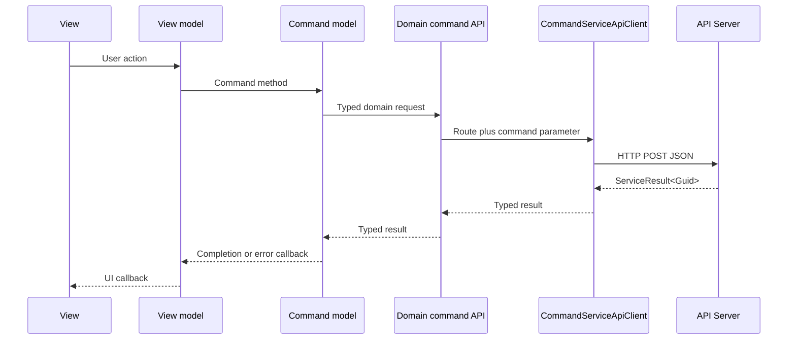

# UI.Net implementation details

## Purpose and scope

The UI.Net project family is the Windows Forms desktop client for the IFM application. It presents the operational fund, trade, market-data, reference-data, system-administration, and status-console workflows. It does not host domain actors or access storage directly.

The UI uses three backend paths:

- commands are sent by HTTP through the domain command APIs in `TomasAI.IFM.Application.Api.Client`;
- queries are sent by HTTP through the domain query APIs in `TomasAI.IFM.Application.Api.Client`;
- live domain and service events are consumed from NATS through `TomasAI.IFM.UI.EventConsumer`.

This document describes the implementation currently in the repository. The notes under [Current implementation notes](#current-implementation-notes) describe existing behavior and known constraints, not a proposed architecture.

The client is split into four assemblies. `TomasAI.IFM.UI.Net` is the Windows executable and composition root; `TomasAI.IFM.UI.Net.Views` is the Windows Forms library. `TomasAI.IFM.UI.Net.ViewModels` and `TomasAI.IFM.UI.Net.Models` are framework-neutral `net10.0` class libraries.

## Source map

| Concern | Source |
| --- | --- |
| Process entry point, WinForms configuration, and top-level exception handling | [`Program.cs`](../Program.cs) |
| Simple Injector composition root and transport registrations | [`Startup.cs`](../Startup.cs) |
| Project dependencies and target framework | [`TomasAI.IFM.UI.Net.csproj`](../TomasAI.IFM.UI.Net.csproj) |
| Models project | [`TomasAI.IFM.UI.Net.Models.csproj`](../../TomasAI.IFM.UI.Net.Models/TomasAI.IFM.UI.Net.Models.csproj) |
| ViewModels project | [`TomasAI.IFM.UI.Net.ViewModels.csproj`](../../TomasAI.IFM.UI.Net.ViewModels/TomasAI.IFM.UI.Net.ViewModels.csproj) |
| Views project | [`TomasAI.IFM.UI.Net.Views.csproj`](../../TomasAI.IFM.UI.Net.Views/TomasAI.IFM.UI.Net.Views.csproj) |
| Runtime endpoint configuration | [`appsettings.json`](../appsettings.json) |
| Environment-specific configuration files copied during build/publish | [`appsettings.Development.json`](../appsettings.Development.json), [`appsettings.Production.json`](../appsettings.Production.json) |
| Application-root abstraction | [`Contracts/IAppRoot.cs`](../../TomasAI.IFM.UI.Net.ViewModels/Contracts/IAppRoot.cs) |
| View and model marker contracts | [`IForm.cs`](../../TomasAI.IFM.UI.Net.Views/Contracts/IForm.cs), [`IModel.cs`](../../TomasAI.IFM.UI.Net.Models/Contracts/IModel.cs) |
| UI-thread and redraw helpers | [`Contracts/IFormControl.cs`](../../TomasAI.IFM.UI.Net.Views/Contracts/IFormControl.cs) |
| Model execution and error handling | [`BaseModel.cs`](../../TomasAI.IFM.UI.Net.Models/BaseModel.cs) |
| Shared editor view-model behavior | [`ViewModels/BaseEditorViewModel.cs`](../../TomasAI.IFM.UI.Net.ViewModels/ViewModels/BaseEditorViewModel.cs) |
| Main application window | [`Views/App/IFMAppView.cs`](../../TomasAI.IFM.UI.Net.Views/Views/App/IFMAppView.cs) |
| Main application orchestration | [`ViewModels/App/IFMAppViewModel.cs`](../../TomasAI.IFM.UI.Net.ViewModels/ViewModels/App/IFMAppViewModel.cs) |
| Command and query HTTP adapters | [`TomasAI.IFM.Application.Api.Client`](../../TomasAI.IFM.Application.Api.Client) |
| Concrete UI event consumers | [`TomasAI.IFM.UI.EventConsumer`](../../TomasAI.IFM.UI.EventConsumer) |
| NATS event-listener implementation | [`TomasAI.IFM.Framework.Messaging.Nats`](../../TomasAI.IFM.Framework.Messaging.Nats) |

## Runtime architecture

```mermaid
flowchart LR
    User[Desktop user]
    View[WinForms view]
    ViewModel[View model]
    Model[UI model]
    DomainApi[Domain command or query API]
    RestClient[REST command or query client]
    ApiServer[IFM API Server]
    UiConsumer[UI event consumer]
    Nats[(NATS event stream)]
    ActorRuntime[Event Model Actor runtime]

    User --> View
    View --> ViewModel
    ViewModel --> Model
    Model --> DomainApi
    DomainApi --> RestClient
    RestClient -->|HTTP| ApiServer
    ApiServer --> ActorRuntime

    ActorRuntime --> Nats
    Nats --> UiConsumer
    UiConsumer --> Model
    Model --> ViewModel
    ViewModel -->|Control.Post / BeginInvoke| View
```



The views do not send NATS actor commands or queries directly. `IActorProducer` and `IActorEventListener` are registered, while the active UI command and query models call the HTTP-facing application client APIs. Events are the live push path into the desktop process.

## Project structure

The hand-written UI code is divided across four projects with one-way dependencies: Models ← ViewModels ← Views ← UI.Net.

| Project | Responsibility |
| --- | --- |
| `TomasAI.IFM.UI.Net` | Windows executable, process startup, dependency composition, runtime configuration, application assets, and documentation. |
| `TomasAI.IFM.UI.Net.Models` | Backend adapters and event-consumer lifecycle wrappers. Models convert `ServiceResult<T>` responses into callbacks and UI error notifications. |
| `TomasAI.IFM.UI.Net.ViewModels` | Screen state, workflow orchestration, application-root abstraction, and callbacks that views bind to controls. |
| `TomasAI.IFM.UI.Net.Views` | Windows Forms, user controls, designer resources, dialogs, view contracts, and UI-thread marshaling helpers. |

At the time of writing, the project contains 33 model files, 30 view-model files, and 33 non-designer view/helper files. The view layer includes 17 forms and 12 user controls.

## Process startup and shutdown

### Entry-point sequence

[`Program.Main`](../Program.cs) performs the following sequence:

1. Register handlers for WinForms thread exceptions and unhandled AppDomain exceptions.
2. Enable visual styles, compatible text rendering settings, and system-aware high DPI mode.
3. Build configuration from `appsettings.json` in the current working directory.
4. Call `Startup.Configure` to build and verify the Simple Injector container.
5. Resolve the singleton `IFMAppView` through `IAppRoot.GetForm<IFMAppView>()`.
6. Wait synchronously for ten seconds.
7. enter the WinForms message loop with `Application.Run`.
8. terminate the process after the message loop returns.

Both top-level exception handlers display a message box containing exception information and then terminate the process.

### Main-window initialization

[`IFMAppView`](../../TomasAI.IFM.UI.Net.Views/Views/App/IFMAppView.cs) creates `IFMAppViewModel` during its load event and supplies callbacks for:

- showing error messages;
- enabling the main menu buttons;
- loading and unloading the status console;
- updating the status line and status-console list;
- updating market outlook, trade signals, trade placement, and market-data controls;
- closing open trade blotters.

Those callbacks use `Control.Post` or `ShowErrorMessage`, which dispatch work with `BeginInvoke` onto the WinForms UI thread.

### Application orchestration

`IFMAppViewModel.AppStartup` creates a site identifier, starts the status-console and application-event listeners, and begins application initialization. The active startup flow is:

1. Query the currently traded futures contracts.
2. Load the latest futures EOD data, trade signal, and bar data.
3. Query the current value date.
4. Import external yield-curve rates.
5. Import external economic-calendar records.
6. Start EOD, bar-data, trade-signal, and trade-placement event consumers.
7. Enable the market-data-feed reset listener.
8. Start the live market-data feeds.
9. Start the inactivity-reset loop.
10. Start the daily RSI signal service and load the ES status-console context.
11. Enable the main menu buttons.

Application startup and shutdown events can cause the same orchestration methods to run through `ApplicationEventModel` and `ApplicationUIEventConsumer`.

When the main form closes, `IFMAppViewModel.AppShutdown` unloads the status console, closes trade blotters, stops the principal market-data and trade event consumers, stops the RSI and trade-placement services, disables the feed-reset listener, stops live feeds, and cancels the inactivity-reset loop.

## Configuration

The UI reads the following keys from the `AppSettings` section:

| Key | Consumer | Purpose |
| --- | --- | --- |
| `AppEnvironment` | `Startup` and the main window | Environment label displayed in the UI. |
| `CommandServerBaseUri` | `CommandServiceApiOptions` | Base URI for HTTP command requests. |
| `QueryServerBaseUri` | `QueryServiceApiOptions` | Base URI for HTTP query requests. |

`appsettings.Development.json` and `appsettings.Production.json` contain the same key shape and are copied to output and publish directories. The current `Program.AppSetup` loads only `appsettings.json`; the environment-specific configuration call is commented out.

NATS producer, consumer, and event-listener options are registered as their default option implementations rather than bound from an explicit UI configuration section. The current default URL is `nats://localhost:4222`; consumer defaults also specify four dispatchers and owned command/query payloads.

## Dependency injection and lifetimes

The project uses Simple Injector as its application container. Microsoft DI is used locally to create `IHttpClientFactory`.

`Startup.Configure` registers services in this order:

1. logging;
2. the application root, forms, and models;
3. HTTP, serialization, and NATS infrastructure;
4. query APIs;
5. command APIs;
6. UI event consumers;
7. status-console producers and writers;
8. container verification.

Important lifetimes are:

| Registration | Lifetime |
| --- | --- |
| `IAppRoot` | Singleton |
| All closed `IForm<TForm>` implementations | Singleton |
| All closed `IModel<TModel>` implementations | Transient |
| `IHttpClientFactory` | Singleton |
| JSON serializer | Singleton; currently `NewtonSoftJsonSerializer` |
| Command/query service options and REST clients | Singleton |
| Domain command/query API implementations | Singleton |
| UI event consumers | Singleton |
| Status-console producer and writer | Singleton |
| `IActorProducer` and `IActorEventListener` | Transient/default registration |

The container scans the assembly containing `IForm<>` for forms and the assembly containing `IModel<>` for models. Adding a correctly implemented form or model therefore does not require an individual registration. Domain APIs and UI event consumers are registered explicitly.

`IAppRoot` provides the runtime service-locator boundary used by the views and view models:

- `GetForm<TForm>()` resolves a registered singleton form;
- `GetModel<TModel>()` resolves a transient model;
- `GetStatusConsoleWriter()` resolves the shared status writer;
- `Execute(Action)` invokes an action and currently suppresses any exception it throws.

## View, view-model, and model responsibilities

### Views

Views own WinForms controls, event handlers, dialogs, and screen lifecycle. They create or receive view models, connect view-model callbacks to control updates, and marshal asynchronous callbacks onto the UI thread.

Forms implement `IForm<TForm>` so the composition root can discover them. Controls that have an explicit open/resize/close lifecycle implement `IFormControl`. The main shell uses `TradeBlotterFactory` to create the appropriate trade control and calls its `Open`, `Resize`, and `Close` methods.

### View models

View models own screen-oriented state and workflow coordination. The codebase uses callbacks rather than a general-purpose data-binding framework. A view supplies actions such as `OnError`, `OnDataLoaded`, `OnWaitCursor`, or screen-specific update callbacks; the view model invokes them as models return results or events arrive.

`BaseEditorViewModel` centralizes:

- access to `IAppRoot`;
- command-result branching for `ServiceResult<Guid>`;
- common error, status, wait-indicator, and wait-view callbacks;
- status-console writes;
- addition of a command-exception event to selected command-response event sets.

### Models

Models form the adapter layer between view models and backend APIs or event consumers. They should not own WinForms controls.

`BaseModel<TModel>` implements `IModel<TModel>` and supplies:

- a per-instance error callback;
- exception-to-error conversion for `Task` and `ValueTask` operations;
- `ServiceResult<T>` success/failure handling for queries;
- `ServiceResult<Guid>` handling for commands.

The `BaseModelExtension.Execute` and `ExecuteQuery` helpers cast an `IModel<T>` to its concrete model and execute a caller action. Both helpers currently suppress exceptions.

## Backend communication

### Command flow



Domain command APIs construct command parameter objects and call `ICommandServiceApi`. `CommandServiceApiClient` serializes requests as JSON, uses HTTP POST, and returns `ServiceResult<Guid>`. The client adds a command or command-parameter type-name header, depending on the overload used.

UI command models normally call `BaseModel.ExecuteCommandAsync`, which invokes the completion callback only when `Success` is true and routes failures through the model error callback.

### Query flow

Query models call a domain `*QueryApi`, which constructs typed query parameters and uses `IQueryServiceApi`. `QueryServiceApiClient` normally sends HTTP GET requests with encoded query parameters and deserializes `ServiceResult<TResult>`. Some shared query-client overloads support POST when a query requires body content.

On success, `BaseModel.ExecuteAsync<TResult>` passes the returned value to the model or view-model callback. On failure, it invokes the configured error notifier.

### Event flow

UI event consumers live in the separate `TomasAI.IFM.UI.EventConsumer` project and derive from `NatsActorEventListener`. Each concrete consumer defines an event map keyed by `ActorMailboxId`, subscribes to the required verbs, deserializes the received NATS message into a concrete event, and invokes a typed or generic callback.

The UI.Net event models own the start/stop boundary for those consumers. Examples include:

- `ApplicationEventModel` for application startup and shutdown;
- `FundEventModel` and `FundOrderEventModel` for fund workflows;
- `MarketDataFeedEventModel` for feed events;
- `MarketDataAnalyticsEventModel` for analytics signals;
- `TradePlacementEventModel`, `TradePlanEventModel`, and `TradePlanActionEventModel` for trade workflows;
- `EconomicCalendarEventModel` for calendar changes;
- `StatusConsoleModel` for status-console events.

Event callbacks may execute on a messaging callback thread. A callback that updates a WinForms control must use `Control.Post`, `BeginInvoke`, or an equivalent UI-thread dispatch.

There is no SignalR path in the current UI. Live event delivery uses NATS event listeners.

### Status-console flow

`StatusConsoleModel` combines `IStatusConsoleWriter` with `IStatusConsoleEventConsumer`. Views and view models can publish informational or error status messages through the writer and subscribe to `StatusConsoleLoggedEvent` updates through the consumer. The main application view model routes those updates to both the status-console control and the one-line status label.

## Feature map

| Feature area | Primary views | Primary view models | Primary models |
| --- | --- | --- | --- |
| Application shell and live dashboard | `IFMAppView`, `MarketDataView`, `MarketOutlookView`, `MarketEconomicCalendarView`, `StatusConsoleView` | `IFMAppViewModel`, `MarketEconomicCalendarViewModel`, `StatusConsoleViewModel` | application, status-console, market-data/feed, analytics, and reference models |
| Fund maintenance and transactions | `CreateFundForm`, `FundTransactionEditor`, `AdjustFundTransactionEditor` | `CreateFundViewModel`, `FundTransactionEditorViewModel`, `AdjustFundTransactionViewModel` | `FundCommandModel`, `FundQueryModel`, `FundEventModel` |
| Fund orders and trades | `TradeOrderEditorForm`, order/trade dialogs, `TradeOrderConfirmationForm` | `TradeOrderEditorViewModel`, `FundOrderEditorViewModel`, `TradeOrderConfirmationViewModel` | fund, trade, trade-position, and trade-plan models |
| Iron condor trading | `IronCondorView`, `IronCondorTradeOrderView` | `IronCondorViewModel`, `IronCondorTradeOrderViewModel`, `IronCondorTradeInfoViewModel` | trade query/command, market-data/feed, fund, and trade-plan models |
| End-of-day processing | `TradeEndOfDayForm` | `EndOfDayProcessViewModel` | `EndOfDayProcessEventModel`, fund and trade models |
| Market-data reference maintenance | `MarketDataForm`, futures contract and option contract controls, yield-curve controls | `MarketDataViewModel`, `FuturesContractEditorViewModel`, `FuturesOptionContractEditorViewModel`, `YieldCurveRateEditorViewModel` | market-data command/query/event models and reference queries |
| Reference-data maintenance | `ReferenceForm`, `LookupTypeEditorView`, `EconomicCalendarEditorView` | `ReferenceViewModel`, `LookupTypeEditorViewModel`, `EconomicCalendarEditorViewModel` | `ReferenceCommandModel`, `ReferenceQueryModel`, `EconomicCalendarEventModel` |
| System administration | `SystemAdminForm`, `BackupDatabasesView` | `SystemAdminViewModel`, `BackupDatabasesViewModel` | `SystemAdminModel`, `SpreadDistributionJobModel` |

## UI-thread handling

`IControlExtension` provides the common cross-thread UI helpers:

- `ShowErrorMessage` posts a message box with `BeginInvoke`;
- `Post` posts an arbitrary action with `BeginInvoke`;
- `Draw` disables redraw with the Win32 `WM_SETREDRAW` message, executes a drawing action on the UI thread, reenables redraw, and refreshes the control.

The main form consistently uses `Post` for callbacks received from `IFMAppViewModel`. Several specialized trade controls use `Control.Invoke` directly. New event-driven screen updates must follow the same UI-thread rule.

## Error handling

Error handling exists at several layers:

1. `CommandServiceApiClient` and `QueryServiceApiClient` convert transport exceptions and non-success responses into `ServiceFailed<T>` results.
2. `BaseModel<TModel>` invokes its error notifier for unsuccessful service results and caught exceptions.
3. View models convert model errors into screen callbacks or status-console entries.
4. Views display errors on the UI thread.
5. `Program` handles otherwise unhandled WinForms and AppDomain exceptions, displays the exception, and terminates the process.

Several helpers and status operations intentionally catch and suppress exceptions. Callers therefore cannot assume every failure reaches the top-level handlers.

## Adding or changing a UI workflow

Use the following sequence when adding a feature:

1. Define or reuse the domain command/query/event contracts in the appropriate shared domain project.
2. Add the HTTP-facing domain API implementation to `TomasAI.IFM.Application.Api.Client` when a command or query adapter is required.
3. Register a new domain API explicitly in `Startup.RegisterCommandServices` or `Startup.RegisterQueryServices`.
4. Add a UI model implementing `IModel<TModel>` or deriving from `BaseModel<TModel>`. It will be discovered automatically and registered transiently.
5. Add a UI event consumer in `TomasAI.IFM.UI.EventConsumer` when push updates are required, then register it as a singleton in `Startup.RegisterEventConsumers`.
6. Give the model or view model explicit start and stop methods for every event consumer.
7. Add a view model that owns screen state and exposes callbacks without referencing WinForms controls.
8. Add a form implementing `IForm<TForm>` or a control implementing `IFormControl`. Forms are discovered automatically and registered as singletons.
9. Marshal every asynchronous control update onto the UI thread.
10. Stop listeners and release per-screen state when a form or control closes.

When a singleton form is reopened, its load method must fully reset any state that should not survive the previous display.

## Current implementation notes

- `Program.AppSetup` loads only `appsettings.json`; the environment-specific JSON files are copied but not selected at runtime.
- Startup blocks for ten seconds before the WinForms message loop begins.
- The process is explicitly terminated after `Application.Run` returns and after top-level unhandled exceptions.
- Forms are singletons while models are transient. Reopened forms can retain control or field state unless their load/close paths reset it.
- `CommandResponseUIEventConsumer.StartAsync` currently completes without creating a subscription. `EventModel.WaitingForCommandResponse` can therefore become true even though that consumer has not started listening.
- Some event-consumer method parameters, such as selected `consumeEvents` collections or site identifiers, are not used by their current concrete implementations.
- `IAppRoot.Execute`, the `BaseModelExtension` helpers, status-console methods, control-posting helpers, and several shutdown paths suppress exceptions.
- `IFMAppViewModel` contains operational assumptions specific to the current deployment, including ES selection, a daily 14-period RSI service, and a 900-second live-feed inactivity threshold.
- `IControlExtension.Draw` uses `user32.dll` and is Windows-only, which is consistent with the project target.
- No dedicated UI.Net automated-test project is currently referenced by this project. Backend behavior should be tested below the UI layer, while form-specific behavior requires targeted WinForms tests or manual verification.

## Build verification

From the repository root:

```powershell
dotnet build TomasAI.IFM.UI.Net\TomasAI.IFM.UI.Net.csproj
```

The build compiles the executable and its Models, ViewModels, and Views libraries together with their referenced API client, messaging, event-consumer, shared, and domain-contract projects.
