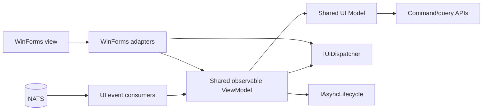
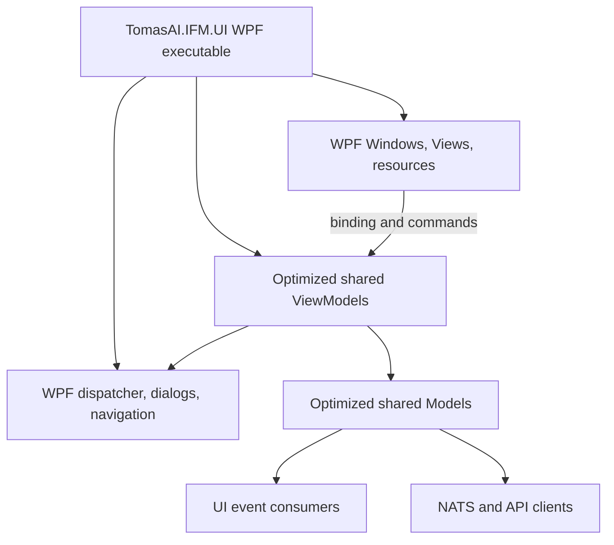

# IFM desktop UI asynchronous modernization and WPF migration plan

## Document status

| Item | Value |
| --- | --- |
| New WPF application root | `TomasAI.IFM.UI` |
| Current WinForms application | `TomasAI.IFM.UI.Net` |
| Current WinForms views | `TomasAI.IFM.UI.Net.Views` |
| Shared candidates | `TomasAI.IFM.UI.Net.ViewModels`, `TomasAI.IFM.UI.Net.Models`, `TomasAI.IFM.UI.EventConsumer` |
| Immediate delivery target | Stage 1: optimized WinForms legacy operational restoration |
| Later presentation target | Stage 2: WPF application with functional and operational parity |
| Scope of this document | Stage 1 implementation specification and Stage 2 architectural pathway |
| Stage 1 progress | S1.0 through S1.5 implemented; S1.6 transport/lifecycle implementation is complete and user-driven WinForms/backend validation is pending |

This document is the controlling migration plan for the IFM desktop client. The existing [`UI.Net implementation details`](../../TomasAI.IFM.UI.Net/Docs/UI-Implementation-Details.md) remain the description of the current WinForms implementation. This document describes the target state and the controlled path from that implementation to WPF.

The future system-wide contracts for callback and `IAsyncEnumerable` NATS event consumption, realtime-grid snapshot reconciliation, and paged projection queries are defined in [`Actor Event Streaming and Paged Query Contracts`](../../Documents/system/Actor-Event-Streaming-and-Paged-Query-Contracts.md). Those contracts are design-only until a separate implementation plan is approved. WinForms and WPF event-streaming changes must reference that system document rather than defining a UI-specific transport or acknowledgement model.

The system capability milestones from WinForms restoration through broker/account foundations, manual execution, automated strategy and monitoring, and paper-trading qualification are defined in [`IFM Operational Restoration and Trading Capability Roadmap`](../../Documents/system/IFM-Operational-Restoration-and-Trading-Capability-Roadmap.md). This UI plan controls presentation modernization only and must not be treated as the complete paper-trading roadmap.

## Executive decision

The migration is divided into two independently valuable stages:

1. **Stage 1 — fully asynchronous, UI-framework-neutral presentation logic.** Correct the current WinForms application's asynchronous execution, cancellation, event processing, UI dispatch, state notification, error handling, startup, and shutdown. Keep WinForms operational while making Models and ViewModels safe to host from either WinForms or WPF.
2. **Stage 2 — WPF presentation migration.** Build the WPF shell and replace WinForms views incrementally after the shared presentation contracts have stabilized. Reuse the optimized Models, ViewModels, event consumers, backend API clients, and lifecycle services from Stage 1.

Stage 1 restores the system to its last-known operational WinForms baseline with current improvements. It is Milestone A in the system roadmap and is not paper-trading readiness. Paper trading additionally requires the broker/account, manual execution, automated strategy, monitoring/exit, and qualification capabilities in Milestones B through F. WPF is a later presentation target and is neither a substitute for those capabilities nor necessarily a prerequisite for beginning their implementation after Stage 1 is accepted.

The new [`TomasAI.IFM.UI`](../TomasAI.IFM.UI.csproj) project is the root of the WPF application. Until Stage 2 begins, its executable window is only a compileable migration shell. `TomasAI.IFM.UI.Net` remains the active WinForms executable and will eventually be designated legacy.

## Guiding constraints

- WinForms and WPF both use one STA UI thread. WPF changes the presentation technology; it does not remove UI-thread affinity.
- UI controls and UI-bound mutable collections may be accessed only from the UI thread.
- Asynchronous I/O must remain naturally asynchronous. `Task.Run` is not a substitute for asynchronous network, storage, NATS, or timer APIs.
- Background work must have an owner, cancellation token, observable completion, and error path.
- `async void` is permitted only at framework event boundaries that cannot return `Task`. Such handlers must immediately delegate to an awaited method and contain a top-level exception boundary.
- No shared Model or ViewModel may reference WinForms, WPF, `Dispatcher`, `Control`, `Brush`, or `System.Drawing` presentation types.
- User commands and trading state transitions must not be dropped or reordered. High-rate visual telemetry may be coalesced when only the latest value matters.
- Stage 1 changes must preserve behavior and allow migration one workflow at a time.
- Correctness and observable lifecycle take priority over micro-optimizing Task allocations. `ValueTask` is used only where measurement demonstrates value and its consumption rules are respected.

## Current-state baseline

The following static-analysis baseline was remeasured when S1.0 started on
2026-08-11. The S1.0 architecture tests enforce these values as ratchets: later
packages may reduce them, but new occurrences fail the safety suite.

| Finding | Current baseline | Consequence |
| --- | ---: | --- |
| `.Execute(async ...)` calls accepted by `Action<T>` | 0 (189 removed in S1.1) | Enforced at zero by the architecture suite |
| `_appRoot.Execute(async ...)` calls accepted by `Action` | 0 (2 removed in S1.1) | Unsafe application-root execution API removed |
| WinForms `Post`/`BeginInvoke` calls | 144 | Fire-and-forget dispatch; current helper suppresses dispatch failures |
| Awaitable `PostAsync` calls | 1 | Awaitable dispatch exists but is not yet the normal path |
| Blocking `.Wait`, `.Result`, or `GetAwaiter().GetResult()` in audited UI projects | 0 | Positive baseline; must remain zero |
| Explicit `async void` declarations | 6 | Restricted to four known WinForms adapter files; shared Models and ViewModels contain none |
| `Action` delegate tokens across Models and ViewModels | 321 | Presentation flow is callback-oriented and difficult to compose/test |
| `INotifyPropertyChanged` implementations | 0 | ViewModels are not directly suitable for WPF binding |
| Framework-neutral command abstractions | 0 | User operations do not expose consistent execution/can-execute state |
| ViewModels exposing `System.Drawing.Color` | 4 files | Prevents presentation-neutral styling |
| WinForms forms/user controls/designer files | 17 / 12 / 29 | Views require WPF reconstruction rather than conversion |
| Empty `catch` blocks | 15 | Operational failures can be suppressed |
| `Process.Kill` calls | 3 | Normal shutdown and fatal paths are not yet cooperatively coordinated |

Important current sources include:

- [`BaseModel.ExecuteAsync` and `BaseModelExtension.ExecuteAsync`](../../TomasAI.IFM.UI.Net.Models/BaseModel.cs)
- [`IAppRoot`](../../TomasAI.IFM.UI.Net.ViewModels/Contracts/IAppRoot.cs)
- [`Control.Post` and `Control.PostAsync`](../../TomasAI.IFM.UI.Net.Views/Contracts/IFormControl.cs)
- [`IFMAppViewModel`](../../TomasAI.IFM.UI.Net.ViewModels/App/IFMAppViewModel.cs)
- [`IronCondorViewModel`](../../TomasAI.IFM.UI.Net.ViewModels/Trade/IronCondor/IronCondorViewModel.cs)
- [`Program`](../../TomasAI.IFM.UI.Net/Program.cs) and [`Startup`](../../TomasAI.IFM.UI.Net/Startup.cs)

These counts are diagnostic baselines, not completion metrics by themselves. Completion is determined by the behavioral and testing gates below.

---

# Stage 1 — asynchronous modernization and presentation abstraction

## Stage 1 objective

Deliver a stable WinForms application whose Models and ViewModels:

- use Task-based APIs from the UI event boundary through the backend call;
- have explicit lifecycle and cancellation ownership;
- never update controls from a worker thread;
- apply a declared concurrency policy to every repeatable operation;
- process real-time streams with bounded memory and appropriate delivery semantics;
- expose observable, presentation-neutral state;
- can be hosted unchanged by WinForms and WPF adapters;
- start and stop cleanly without terminating the process forcibly;
- are covered by deterministic concurrency and lifecycle tests.

Stage 1 does not replace WinForms controls, introduce WPF screens, change trading rules, or alter backend command/query semantics.

## Target Stage 1 architecture



The WPF adapter is intentionally absent from the Stage 1 runtime, but all shared interfaces must be implementable by both UI frameworks without conditional compilation.

All current and future presentation implementations are governed by the normative
[Frontend Display-Only Policy](Frontend-Display-Only-Policy.md). Backend query results and notifications are authoritative. The UI may format, order, group, and select them for display, but it must not silently reject records using business validation or hidden, non-display fields.

## Threading and concurrency contract

Every Stage 1 implementation must obey these invariants:

1. **The UI thread owns presentation state.** Control properties, observable collections, selection state, and properties consumed by bindings are mutated on the UI thread.
2. **I/O does not occupy a worker thread while waiting.** HTTP/NATS operations are awaited directly. A `Task.Run` call requires a documented CPU-bound or blocking-legacy justification.
3. **Every long-lived operation has one owner.** A screen, application-lifetime coordinator, or dedicated hosted component owns its cancellation source and completion Task.
4. **Shutdown is cooperative.** Stop accepting work, cancel owned operations, await them, stop consumers, dispose resources, and then close the message loop.
5. **Repeatable work declares its concurrency policy.** It must be single-flight, cancel-previous, serialized, coalesced/latest-value, or explicitly parallel.
6. **Failures are observable.** No empty `catch` block may suppress an operational exception. Expected cancellation and disposal races are filtered narrowly.
7. **Streams are bounded.** A producer cannot grow an unbounded in-memory queue if the UI is slower than the producer.
8. **Trading operations are lossless.** Order commands, command acknowledgements, trade state, risk changes, and audit-relevant events cannot use latest-value/drop semantics.
9. **Visual telemetry can be sampled.** Quotes, cursor-like indicators, and rapidly replaced display snapshots may use latest-value delivery at a configured render cadence.
10. **No lock is held across `await`.** Shared mutable state uses UI-thread confinement, immutable snapshots, channels, or a narrowly scoped async-compatible gate.

## Shared presentation contracts

The contracts should initially live in the existing framework-neutral ViewModels assembly to avoid a disruptive project split during legacy operational restoration. A later rename to `TomasAI.IFM.UI.ViewModels` or extraction to `TomasAI.IFM.UI.Presentation` is optional and must not be coupled to functional migration.

### UI dispatcher

Introduce a framework-neutral dispatcher abstraction:

```csharp
public interface IUiDispatcher
{
    bool CheckAccess();

    ValueTask InvokeAsync(
        Action action,
        CancellationToken cancellationToken = default);

    ValueTask<T> InvokeAsync<T>(
        Func<T> function,
        CancellationToken cancellationToken = default);
}
```

Rules:

- `WinFormsUiDispatcher` uses `Control.InvokeAsync` against one stable root control or synchronization context.
- `WpfUiDispatcher` will use `Application.Current.Dispatcher` in Stage 2.
- Shared ViewModels depend only on `IUiDispatcher` when they must publish UI-bound state.
- Infrastructure Models should normally complete on arbitrary threads and must not know about the dispatcher.
- The dispatcher propagates action exceptions. It suppresses only the narrow disposed-control race during an already-cancelled shutdown.
- Do not add a synchronous `Invoke` method. This prevents future worker-to-UI deadlocks.

### Async lifecycle

Use a common lifecycle contract for the application and screen-scoped components:

```csharp
public interface IAsyncLifecycle
{
    Task InitializeAsync(CancellationToken cancellationToken);
    Task StopAsync(CancellationToken cancellationToken);
}
```

Components owning asynchronous resources may additionally implement `IAsyncDisposable`. Initialization and stop must be idempotent or reject duplicate calls deterministically. A component may not be considered stopped until its consumers, loops, timers, and pending UI dispatches have completed or reached a documented timeout policy.

### Observable state

Create a small framework-neutral `ObservableObject` implementing `INotifyPropertyChanged`. ViewModels expose properties and immutable/read-only snapshots rather than a collection of `Action<T>` callbacks.

- Scalar properties use `SetProperty` and raise notifications on the UI thread.
- Mutable collections exposed to a view use `ObservableCollection<T>` only when changes are UI-thread confined.
- High-volume data should publish immutable snapshots or batched collection changes rather than one notification per feed message.
- ViewModels expose semantic state such as `MarketTrendState.Up` or `Severity.Warning`, not `System.Drawing.Color`, WPF `Brush`, fonts, or control objects.
- WinForms maps semantic state to `System.Drawing.Color`; WPF maps it through styles/converters.

### Commands and user operations

Introduce a framework-neutral async operation abstraction, or an observable ViewModel method plus adapter commands. The shared layer must expose:

- `Task ExecuteAsync(object? parameter, CancellationToken cancellationToken)` or a strongly typed equivalent;
- `bool CanExecute` or explicit busy/validation state;
- execution status and last failure when relevant;
- a declared re-entry policy.

WPF `ICommand` and WinForms click handlers are adapters over the same operation. Do not place `System.Windows.Input.ICommand` behavior inside Models.

### Dialogs, navigation, and user interaction

Replace `IAppRoot.GetForm<T>()` usage in ViewModels with narrowly scoped interfaces:

```csharp
public interface IUserInteraction
{
    ValueTask ShowErrorAsync(string title, string message, CancellationToken cancellationToken = default);
    ValueTask<bool> ConfirmAsync(string title, string message, CancellationToken cancellationToken = default);
}

public interface INavigationService
{
    ValueTask OpenAsync<TDestination>(object? parameter = null, CancellationToken cancellationToken = default);
    ValueTask CloseAsync<TDestination>(CancellationToken cancellationToken = default);
}
```

Concrete signatures can evolve during implementation, but shared ViewModels must not resolve Forms, Windows, or service-locator objects. Constructor injection is the target. Transitional adapters may implement the new interfaces over `IAppRoot` while screens are migrated.

## Correct the Model execution boundary

The existing `BaseModelExtension.Execute(IModel<T>, Action<T>)` must never accept an async lambda. Add an awaitable overload and then remove or restrict the unsafe overload after its callers have moved:

```csharp
public static Task ExecuteAsync<TModel>(
    this IModel<TModel> model,
    Func<TModel, CancellationToken, Task> operation,
    CancellationToken cancellationToken = default)
    where TModel : class;
```

Implementation requirements:

- Validate the concrete model cast rather than using null-forgiving operators.
- Await the operation.
- Treat cancellation separately from failure.
- Do not use an empty `catch`.
- Either propagate exceptions to the ViewModel boundary or translate them once into a typed result. Do not both notify and silently consume the same failure.
- Add analyzers/tests or API design constraints that make `Execute(async ...)` impossible to compile.

The two `IAppRoot.Execute(async ...)` calls must be converted to ordinary awaited methods. `IAppRoot.Execute(Action)` should then be removed; it adds no safe lifecycle or error semantics.

## Convert callback APIs to Task-based results

Callback-shaped Model methods such as `GetSomethingAsync(..., Action<T> onResult)` should converge on return values:

```csharp
Task<ServiceResult<T>> GetSomethingAsync(
    Request request,
    CancellationToken cancellationToken);
```

or, where the Model owns result translation:

```csharp
Task<T> GetSomethingAsync(
    Request request,
    CancellationToken cancellationToken);
```

Conversion rules:

1. Carry the cancellation token to the lowest API that accepts it.
2. Await the result in the ViewModel.
3. Publish all related state in one dispatcher operation when possible.
4. Return completion to the view handler so it can restore busy state reliably.
5. Do not nest async callbacks inside callbacks.
6. Do not preserve a callback merely to avoid changing the caller; transitional overloads must be marked for removal and delegate to the Task-returning implementation.

## Operation concurrency policies

Each operation must select and document one of these policies:

| Policy | Suitable work | Required behavior |
| --- | --- | --- |
| Single-flight | Save, submit order, start/stop feed, backup | Reject or disable re-entry until completion |
| Cancel-previous | Search, filter, date-range reload, selection-driven query | Cancel and await the previous request before publishing the new result |
| Serialized | Trade state transitions, command responses, ordered audit events | One reader processes every item in order; no drops |
| Latest-value/coalesced | Quote display, rapidly replaced analytics snapshot | Capacity-one/latest state; slow UI does not accumulate stale values |
| Explicit parallel | Independent startup queries with no ordering dependency | Use `Task.WhenAll`; define aggregate failure behavior |

Defaulting silently to parallel execution is not allowed. A `SemaphoreSlim`, channel, or cancellation source used to enforce a policy must be owned and disposed by the same component that owns the operation.

## Real-time market-data and event processing

The UI must distinguish delivery semantics by data type:

### Latest-value display paths

Use `LatestValueAsyncChannel<T>` or an equivalent capacity-one abstraction for display-only state where intermediate values have no lasting meaning. A typical path is:

```text
NATS/feed callback -> normalize immutable snapshot -> latest-value channel
-> one consumer -> UI dispatcher -> one batched ViewModel update
```

- Use one consumer per independently rendered state group.
- Cap rendering to a useful UI cadence rather than rendering every incoming quote. The exact cadence must be measured; 10–30 updates per second is a starting test range, not a hard-coded requirement.
- Track offered, rendered, coalesced, and failed update counts.
- Completing a screen cancels the reader and completes its channel.

### Lossless paths

Commands, acknowledgements, order/trade transitions, error events, and audit-relevant events use a bounded lossless channel or the existing ordered event-consumer mechanism.

- Define capacity from measured burst size and processing latency.
- Apply backpressure or fail visibly; never silently discard.
- Preserve ordering within the required entity/stream key.
- Make duplicate handling and idempotency explicit.

### UI batching

For grids and charts, publish immutable batches on the UI thread. Avoid clearing and rebuilding a full grid on every tick. Selection and scroll position must remain stable across snapshot replacement where practical.

## Timers and periodic work

Replace `System.Threading.Timer` callbacks that launch unawaited work with owned `PeriodicTimer` loops or an equivalent non-overlapping scheduler:

```csharp
while (await timer.WaitForNextTickAsync(cancellationToken))
{
    await ExecuteIterationAsync(cancellationToken);
}
```

- Retain the loop Task.
- Prevent overlapping iterations by construction.
- Decide whether a slow iteration skips ticks or runs immediately afterward.
- Cancel and await the loop during screen/application shutdown.
- Catch and report iteration failures without silently terminating the loop unless failure is fatal.
- Use `TimeProvider` so timer behavior can be tested without real delays.

Apply this to the Iron Condor snapshot/spread-bar timers and the live-feed reset monitor. The reset monitor does not require `Task.Run`; its delay and backend calls are already asynchronous.

## Startup and shutdown

### Startup target

The WinForms message loop should start promptly, display an initializing state, and call an awaitable application coordinator after the main form is shown. The current fixed ten-second presentation delay should be removed unless a measured external readiness dependency requires it; readiness should be represented by an awaited health/readiness operation rather than elapsed time.

Independent initialization operations may use `Task.WhenAll`. Operations with dependencies remain explicit sequential steps. The coordinator publishes progress and enables commands only after required dependencies are ready.

### Shutdown target

The WinForms close boundary may remain `async void` because it is a framework event, but it must:

1. cancel the initial close while shutdown is running;
2. disable new user operations;
3. call and await `ApplicationLifecycle.StopAsync`;
4. stop and await real-time consumers and periodic loops;
5. dispose NATS/API resources and the container where supported;
6. close the form after cleanup succeeds or after a deliberate, logged timeout decision.

Remove `Process.GetCurrentProcess().Kill()` from normal shutdown. Fatal exception handling may still terminate after attempting bounded logging/cleanup, but must not be the ordinary lifecycle mechanism.

## Error, cancellation, and observability policy

- `OperationCanceledException` is normal only when the associated token was cancelled.
- Expected control-disposal races during shutdown are logged at an appropriate low level or narrowly ignored.
- Backend/service failures retain their error code, operation name, correlation/command ID, and entity identifiers.
- Unexpected exceptions reach one UI operation boundary, are logged once, and produce one user-facing error where appropriate.
- Empty `catch` blocks in the UI projects are removed.
- Fire-and-forget work is allowed only through a named supervisor that retains the Task, logs failure, and participates in shutdown.
- Include metrics for active UI operations, operation duration, cancelled operations, failed operations, channel coalescing/backpressure, event-consumer lag, and UI-dispatch latency.
- Do not log high-rate quote payloads by default; use counters and sampled diagnostics.

## `ConfigureAwait`, `Task.Run`, locking, and allocation guidance

### `ConfigureAwait`

- Shared infrastructure that does not publish UI state may use `ConfigureAwait(false)` consistently.
- ViewModels should not rely implicitly on continuation affinity. They should publish presentation state explicitly through `IUiDispatcher`.
- Do not scatter `ConfigureAwait(false)` as a substitute for an explicit threading model.

### `Task.Run`

Allowed uses are measured CPU-heavy calculations and unavoidable blocking legacy APIs. The caller still owns, cancels, and awaits the Task. Network calls, NATS operations, `Task.Delay`, and async API clients do not use `Task.Run`.

### Locking

- Prefer UI-thread confinement for presentation state.
- Prefer immutable snapshots and single-reader channels across background/UI boundaries.
- Use `lock` only for short synchronous critical sections and never across `await`.
- Use `SemaphoreSlim` only when an asynchronous mutual-exclusion policy is actually required.
- Document lock ordering if more than one lock can be acquired in a workflow.

### Allocation and latency

- Establish measurements before introducing pooling or `ValueTask` broadly.
- Batch UI notifications and coalesce stale visual updates; these are expected to matter more than micro-allocation changes.
- Avoid per-tick LINQ chains and full collection copies on verified hot display paths only after profiling identifies them.
- Reuse immutable lookup/configuration data where safe.
- Keep persistence, command handling, and audit behavior out of display throttling paths.

## Stage 1 implementation work packages

The packages are ordered to keep the WinForms application buildable and testable after each merge.

### S1.0 — baseline and safety net

Status: **Implemented on 2026-08-11.** The safety net is intentionally a
ratchet around the current application; S1.1 and later packages reduce the
recorded debt without requiring a flag-day rewrite.

- Record current build and relevant integration-test results.
- Add architecture tests that reject blocking waits in UI projects.
- Add searches/analyzers for async lambdas passed to `Action`, unowned `Task.Run`, empty catches, and UI-framework references in shared projects.
- Add fake dispatcher, fake time provider, and deterministic event-source test utilities.
- Add ViewModel tests around the highest-risk restored trading workflows before modifying them.

Implemented artifacts:

- `TomasAI.IFM.UI.Net.Presentation.UnitTests` is the WinForms presentation safety
  project and is included in `TomasAI.IFM.sln`.
- Architecture tests reject sync-over-async and UI-framework dependencies,
  allow `async void` only at the two known WinForms event boundaries, and
  ratchet unsafe execution, empty catches, detached work, forced termination,
  fire-and-forget dispatch, and presentation-color usage.
- `TestUiDispatcher`, `ManualTimeProvider`, and `ControlledEventSource<T>`
  provide deterministic concurrency, virtual timer, and ordered event tests
  without WinForms, WPF, wall-clock delays, or NATS.
- Baseline behavior tests preserve Model service-error propagation and cover
  the market-data-feed start and futures-option tick-listener boundaries used
  by the restored trading workflows.
- The initial S1.0 suite contains 23 passing tests. The existing Application
  API integration baseline remains 212 passing tests.

Exit: the baseline is repeatable and failures introduced by later packages can be localized.

### S1.1 — async Model execution boundary

Status: **Implemented on 2026-08-11.** The Model/ViewModel execution boundary
now returns observable `Task` completion. WinForms event methods remain thin
adapters; lifecycle token ownership and systematic view-adapter replacement are
the subjects of S1.2 through S1.4.

- Add `ExecuteAsync` with cancellation.
- Convert all `.Execute(async ...)` and `_appRoot.Execute(async ...)` occurrences.
- Remove the unsafe async-compatible path through `Action`.
- Convert nested async callbacks to returned Tasks.
- Preserve service error codes and stop suppressing exceptions.

Implemented artifacts:

- `BaseModelExtension.ExecuteAsync` validates the concrete Model, accepts a
  cancellation token, returns the operation Task, and propagates cancellation
  and failures. The former `Execute(Action<TModel>)` API no longer exists.
- `IAppRoot.ExecuteAsync` replaces `IAppRoot.Execute(Action)` and the WinForms
  startup adapter implements the cancellation-aware Task contract.
- All 189 Model execution call sites and both application-root execution call
  sites use the awaitable boundary. ViewModel operations expose Task completion,
  including application startup/shutdown and the affected Iron Condor flows.
- Async result continuations use `Func<T, Task>` overloads that are awaited by
  `BaseModel`; unexpected query/command exceptions propagate while unsuccessful
  `ServiceResult<T>` values retain their original error code and message.
- The futures-bar UI event path now accepts an awaited `Func<T, ValueTask>` so
  event processing completion and failure remain observable to the listener.
- Architecture tests ratchet both unsafe execution patterns to zero. Model tests
  cover retained completion, pre-start cancellation, exception propagation, and
  service-error preservation. The presentation suite contains 28 passing tests.

Exit: no async lambda is convertible to `Action` in UI code; all affected operations have observable completion.

### S1.2 — lifecycle and cancellation

Status: **Implemented on 2026-08-11.** Application and listener-backed screen
resources now have idempotent asynchronous lifecycle ownership. WinForms close
adapters cancel and await cleanup before allowing their form or hosted control
to be removed.

- Add application and screen `IAsyncLifecycle` ownership.
- Give every event listener, loop, and timer a lifetime token and retained Task.
- Replace detached reset-feed work and overlapping timers.
- Make close paths cancel and await their work.
- Remove normal-shutdown process termination.

Implemented artifacts:

- `AsyncLifecycleCoordinator` owns a lifetime cancellation source, serializes
  initialization and shutdown, retains background Tasks, and waits for them
  before invoking resource cleanup. Initialization and stop are idempotent and
  failed initialization can be retried.
- `IFMAppViewModel` owns its status, application, market-data, analytics, and
  trade listeners through one lifecycle. Its market-data watchdog is a retained,
  cancellable Task using `TimeProvider`; the detached `Task.Run` path is gone.
- Application shutdown events request a UI close and return to the NATS handler;
  the form-close path then awaits listener shutdown outside the listener's own
  dispatch Task, avoiding a self-stop deadlock.
- Iron Condor live-feed startup and shutdown are serialized. The two overlapping
  `System.Threading.Timer` callbacks are now retained 15-second async loops that
  run each operation sequentially and stop through the live-feed lifetime token.
- Listener-backed fund, market-data, trade, status-console, economic-calendar,
  and system-administration screens use the same lifecycle contract. Their close
  adapters hold form closure or control removal until cleanup completes.
- `SystemWaitView` retains and cancels its polling Task. Normal and unhandled
  application exits no longer call `Process.Kill`.
- Architecture ratchets require zero `Task.Run` calls, zero forced process
  termination calls, and zero unowned `System.Threading.Timer`/
  `System.Timers.Timer` instances in UI projects. Coordinator tests cover
  repeated start/stop, cancellation ordering, and failed-start recovery.

Exit: repeatedly opening/closing every screen and starting/stopping the app leaves no active owned UI tasks or listeners.

### S1.3 — presentation abstractions

Status: **Implemented on 2026-08-11.** Shared Models, ViewModels, and event
consumers now compile without WinForms, WPF, or `System.Drawing` presentation
dependencies. WinForms-specific behavior is isolated behind presentation
adapters in `TomasAI.IFM.UI.Net.Views`.

- Add `IUiDispatcher`, `IUserInteraction`, navigation, and async-operation contracts.
- Implement WinForms adapters.
- Remove `IAppRoot.GetForm<T>` and message-box/control dependencies from ViewModels.
- Replace presentation colors with semantic states.
- Enforce dependency direction with project/architecture tests.

Implemented artifacts:

- `IUiDispatcher` remains framework-neutral and supports access checks, queued
  posting, awaited actions, and awaited functions. `WinFormsUiDispatcher` maps
  it to a stable `Control` and preserves narrow shutdown-race handling.
- `IUserInteraction` represents notifications and confirmations without
  `MessageBox`; `WinFormsUserInteraction` supplies the current WinForms adapter.
- `IViewNavigator` and `NavigationResult` replace the application-root Form
  service locator. Startup owns view resolution, while the shell and modal
  workflows depend on the navigation contract.
- `IAsyncOperation` and the single-flight `AsyncOperation` implementation expose
  running state, cooperative cancellation, shared completion for duplicate
  execution, and retry after completion or failure.
- `PresentationColorRole` replaces `System.Drawing.Color` in shared market-data
  ViewModels. `WinFormsPresentationColorExtensions` maps semantic roles back to
  the existing WinForms palette at the view boundary.
- Architecture tests keep `GetForm<T>`, WinForms/WPF presentation types, and
  `System.Drawing` out of shared projects and ensure the framework adapters stay
  in the WinForms Views assembly. Async-operation tests cover completion,
  cancellation, single-flight behavior, failure propagation, and retry.

Exit: Models and ViewModels compile without WinForms, WPF, and `System.Drawing` presentation dependencies.

### S1.4 — observable ViewModels and commands

Progress on 2026-08-11: **the shared foundation, Reference/System Admin
selectors, Fund workflows, Market Data editors, and main shell/status console
are implemented, including general trading and the Iron Condor monitor.** S1.4
is complete; S1.5 real-time stream hardening is next.

- Introduce observable base state.
- Replace view callbacks with properties, collections, and async operations one screen at a time.
- Keep thin transitional WinForms bindings only while a screen is under conversion.
- Apply explicit command re-entry and busy-state policies.

Implemented in the first slice:

- `ObservableObject` provides framework-neutral `INotifyPropertyChanged` and
  equality-aware property updates.
- `IAsyncOperation`/`AsyncOperation` now expose observable `IsRunning`,
  `CanExecute`, and `LastFailure` state, preserve single-flight execution, and
  support an external execution predicate.
- `ObservableModelExtension` converts the Models' coded error callback into an
  awaited `ModelOperationException`, so migrated operations preserve both failure
  completion and the application error code.
- `ReferenceViewModel` and `SystemAdminViewModel` expose read-only selector state
  and load operations instead of public view callbacks. Their WinForms forms are
  transitional adapters that await those operations and render their properties.
- Unit tests cover observable state, busy/can-execute transitions, Model error
  propagation, selector state publication, invalid selection, and the absence of
  public callback delegates on migrated ViewModels.

Fund workflow progress on 2026-08-11:

- `FundTransactionEditorViewModel` now publishes funds, transactions, balance,
  P&L, and selected-comment state. Fund details load as one single-flight,
  consistent snapshot while the WinForms selectors are disabled, replacing three
  overlapping fire-and-forget queries.
- `CreateFundReadModel` exposes observable identifier/created-fund state and
  guarded load/create operations. `CreateFundForm` awaits both operations and
  validates the pending fund before submission.
- Fund Model/ViewModel tests cover coded query failures, safe selection,
  consistent details publication, and new-fund identifier loading.
- The adjustment editor now retains the command API's real correlation ID and
  prevents another submission until the matching terminal event arrives.
  Unrelated events are ignored; matching completion/failure events update
  observable state, and coded failures are written to the status console. A
  bounded early-event buffer closes the race where a terminal event arrives just
  before the command response returns its correlation ID.
- `FundUIEventConsumer` now routes all eight opening-trade, realized-P&L,
  commission, and unrealized-P&L adjustment completion/failure event types. Tests
  exercise listener lifecycle, correlation filtering, successful completion,
  coded failure publication, and the complete routing table.

Market Data workflow progress on 2026-08-11:

- `MarketDataViewModel` now exposes observable editor definitions, a
  single-flight load operation, safe indexed selection, and semantic
  `IsEditorBusy` state instead of WinForms button/selector callbacks.
- `MarketDataForm` awaits definition loading, observes operation/busy state, and
  remains the transitional adapter that selects the existing specialized editor
  controls. The futures-option editor now reports busy state through the shared
  ViewModel rather than invoking parent-view callbacks.
- Tests cover definition publication, invalid selection, busy-state
  notification, coded Model failure propagation, and the no-public-delegate
  contract.
- `FuturesContractEditorViewModel` now publishes read-only lookup and contract
  snapshots and exposes single-flight load/add/change/remove operations. A load
  publishes only after all reference lookups and contracts have completed, so a
  host never observes the former partially initialized editor state.
- The futures-contract WinForms control is now a thin transitional adapter: it
  awaits the ViewModel operations, renders observable state, contains the
  confirmation dialog, and catches failures at the view boundary. The twelve
  editor-specific callback fields, repeated load fan-in callbacks, and detached
  post-command refresh tasks have been removed.
- Futures-contract tests cover coherent state publication, guarded add and
  post-command refresh, coded reference-query failures, safe selection, the
  December futures month code, and the no-declared-callback contract.
- `FuturesOptionContractEditorViewModel` now publishes read-only lookup,
  selected-symbol, and option-contract state with guarded load/reload/add/change/
  remove operations. Its Model retains the command API's real correlation ID,
  and mutations remain busy until the matching completion or failure event is
  observed.
- The option editor buffers a bounded set of terminal events that arrive before
  the command response, ignores unrelated correlation IDs, converts matching
  failure events to coded operation failures, refreshes contracts only after
  successful denormalization, and cancels/awaits owned operations during stop.
- The option-contract WinForms control now awaits ViewModel operations, renders
  observable snapshots, reports semantic busy state to the Market Data shell,
  and owns only view concerns such as confirmation and validation dialogs. Its
  public ViewModel callback wiring and repeated reference-load fan-in have been
  removed.
- Option-editor tests cover coherent listener/load state, unrelated event
  filtering, matching completion, coded terminal failure, the early-event race,
  and the no-declared-callback contract.
- `YieldCurveRateEditorViewModel` now publishes time-period, inclusive date-range,
  and rate snapshots with guarded load/reload/add/change/remove/import operations.
  All four mutations retain their command IDs, await matching terminal events,
  handle the bounded early-event race, and refresh time periods plus the selected
  rate range only after successful denormalization.
- `YieldCurveRateEditorControl` is now a thin WinForms adapter that renders the
  observable snapshot, owns dialogs and confirmation, awaits ViewModel work, and
  reports semantic busy state through `MarketDataViewModel`. The modal rate dialog
  uses `YieldCurveRateEditViewModel` for observable duplicate-date validation
  instead of directly wiring Model callbacks and UI posts.
- Yield-curve tests cover initial/current-month state, calendar-year selection,
  correlation filtering, coded terminal failure, early import completion,
  duplicate-date/save state, coded validation failure, and the
  no-declared-callback contract. This completes the specialized Market Data
  editor internals.
- `EconomicCalendarEditorViewModel` now owns a guarded import operation and an
  independent listener lifecycle. Imports retain the command ID, ignore
  unrelated terminal events, buffer early completion, preserve typed failure,
  treat a zero-row complete event as success, and reload the durable
  date/country projection only after completion. The WinForms editor and parent
  Reference form await listener shutdown. Seven focused tests cover acceptance,
  correlation, early and duplicate delivery, zero rows, failure, cancellation,
  empty IDs, and new-ID retry.
- `IFMAppViewModel` now exposes observable startup/shutdown operations, menu
  availability, status line and bounded status-log state, coded error
  notifications, close requests, current contracts/value date, and the owned
  status-console ViewModel. The former twelve startup callback parameters are
  removed. Live dashboard and trade-blotter calls remain behind the explicit
  `IIFMAppLiveViewAdapter` transitional boundary until their scheduled slices.
- The shell's automatic yield-curve and economic-calendar imports now share the
  editor correlation primitive. Startup activates both terminal listeners before
  submission, attempts each command once, observes exact command IDs for a
  deterministic 30-second bound, reports only failed or unobserved results, and
  continues without retry so manual import remains available.
- Status logging retains the newest 500 entries and publishes a newest-first
  immutable snapshot. Status-writer calls now return and retain their Tasks;
  the former async lambda converted through `Action` has been removed.
- `StatusConsoleViewModel` now owns its analytics-listener lifecycle and exposes
  observable trend history, trade status, trend extremes, forward-loss ratios,
  errors, and guarded reload operations. Its public callback fields and nested
  asynchronous ratio-load callback are removed.
- The embedded economic-calendar panel now uses
  `MarketEconomicCalendarViewModel` with observable country, period, calendar,
  selection, detail, and error state; guarded load/refresh operations; and an
  owned listener that rejects refresh events after stop. Its former five public
  callback/refresh delegates and nested asynchronous query callback are removed.
- `IFMAppView` and `StatusConsoleView` are thin transitional adapters that
  subscribe to property changes, marshal rendering to WinForms, await lifecycle
  operations, and detach on shutdown. Shell/status tests cover bounded log
  retention, repeatable error notifications, coherent query snapshots,
  listener start/stop behavior, post-stop event rejection, coded failures, and
  the no-declared-callback contracts. Trading and Iron Condor workflows are the
  remaining S1.4 slices.
- The first general-trading slice converts `FundOrderEditorViewModel` to
  observable identifier, contract, date, reference, EOD-enrichment, busy,
  validation, and coded-error state with single-flight load and reference
  operations. Contract selection is safe and disabled while a query is active,
  preventing stale EOD data from being applied to a newer selection.
- `CreateFundOrderForm` now awaits identifier/EOD work, renders ViewModel
  snapshots, disables input while busy, validates save state, and disposes
  operations on close. Tests cover coherent initial loading, safe contract
  selection, date validation, duplicate-load suppression, coded failure, and
  the no-declared-callback contract.
- `TradeOrderEditorViewModel` now owns fund/order/trade selection, date filtering,
  button capability state, listener lifecycle, coded errors, and immutable
  snapshots. `TradeOrderEditorForm` only renders that state, owns dialogs and
  embedded strategy controls, and awaits editor operations instead of mutating
  ViewModel collections or assigning callback fields.
- Fund commands now return their real command IDs through `FundCommandModel`.
  The editor remains busy until the matching NATS completion/failure event,
  ignores unrelated events, buffers the bounded command-response race, reloads
  only after successful denormalization, and observes fund-order trade-state
  events through an awaited consumer contract.
- Main-editor tests cover coherent nested loading and date filtering, safe
  selection, both listener lifecycles, unrelated-event rejection, correlated
  completion, early completion buffering, coded terminal failure, and the
  no-declared-callback contract.
- `EndOfDayProcessViewModel` now publishes a coherent price/P&L/balance snapshot,
  guarded load/process operations, validation state, coded errors, completion
  status, and owned listener lifecycle. The process retains the command API's
  real ID, ignores unrelated terminal events, buffers the command-response race,
  and exposes matching failures without closing the workflow prematurely.
- `TradeEndOfDayForm` now awaits load/process operations and renders observable
  state. `TradeOrderConfirmationViewModel` is callback-free and exposes the
  selected fill source plus confirmation eligibility; the framework-neutral
  `ITradeOrderConfirmationService` allows WinForms and future WPF hosts to supply
  their own modal adapter.
- End-of-day/confirmation tests cover coherent loading, date invalidation,
  listener teardown, correlated completion, unrelated-event rejection, early
  completion, coded failure/retry, safe fill selection, and callback-free public
  state. Trade command models now return both end-of-day and placed-order IDs;
  the Iron Condor adapter forwards placed-order correlation to the main editor.
- `IronCondorTradeOrderViewModel` now replaces the former callback-oriented
  `IronCondorTradeOrderReadModel`. It exposes observable load, asset-price,
  live-feed revision, strike-range, risk-position, fund-profit, input, and coded
  error state. Initial queries are awaited coherently and the two listener
  lifecycles remain owned and disposable.
- The Iron Condor order-entry boundary now returns its placed-order command ID
  directly. Intraday P&L, option-contract preparation, confirmation, submission,
  live-feed toggling, trade removal, and close-order parent loading are awaited;
  no public delegate parameters or callback properties remain on the order-entry
  ViewModel. `IronCondorTradeOrderView` observes state and is limited to WinForms
  rendering and framework event boundaries.
- Order-entry tests cover observable input state, the no-callback public contract,
  unsupported strategy rejection, and coded load failure with loading-state
  recovery.
- `IronCondorViewModel` now publishes observable EOD history/current-price,
  trade-info, limit, position, spread-bar, trade-history, trade-plan, live-feed,
  loading, and coded-error state. Its initial monitor load is sequential and
  awaited, its reset listener is idempotent, and its public callback surface has
  been removed.
- `IronCondorView` subscribes once to monitor state, renders typed snapshots,
  awaits initial loading and history selection work, reflects feed lifecycle
  state, and detaches before disposal. Live position and EOD paths publish
  revisioned latest state suitable for the S1.5 coalescing work.
- Monitor tests cover callback-free observable defaults, safe pre-load
  selection, disposal without starting listeners, and coded initial-query
  failure. This completes S1.4; real-time stream classification, bounds,
  coalescing, and lag instrumentation move to S1.5.

Suggested order: Reference and System Admin, Fund editors, Market Data editors, main shell/status console, then trading and Iron Condor workflows.

Exit: every active screen consumes observable state and awaits ViewModel operations; callback adapters are removed or documented as intentional event-stream boundaries.

### S1.5 — real-time stream hardening

Progress on 2026-08-11: **the first Iron Condor latest-value stream slice is
implemented.** Futures EOD and trade-position updates are classified as
replaceable display state and are processed through owned capacity-one channels
at a maximum 20 Hz cadence. Newer pending values supersede older pending values;
neither channel can grow with producer rate.

- Futures EOD callbacks now enqueue state and return immediately. The serialized
  consumer publishes the newest EOD snapshot and awaits spread-distribution work,
  removing the previous fire-and-forget operation.
- Trade-position processing retains its latest-value policy and now shares the
  same time provider, metrics publication, and lifecycle diagnostics as EOD.
- `IronCondorViewModel.LiveStreamMetrics` exposes accepted event rate, processed,
  coalesced, and failed counts, queue delay, processing duration, and open/closed
  state for both latest-value streams.
- Shutdown stops each upstream consumer before closing and awaiting its channel,
  so no producer can refill a channel while the monitor is closing.
- Shared channel tests cover concurrent bursts, latest-value convergence,
  serialization, callback recovery, throttling, cancellation, rejected writes
  after closure, and the published metrics.

Progress on 2026-08-11: **the second Iron Condor lossless-stream slice is
implemented.** Trade-plan events are distinct business events and now retain
arrival order through a capacity-256 channel with batches of up to 32. The NATS
consumer callback is awaitable, so a full channel applies asynchronous
backpressure instead of blocking a thread or dropping an event.

- Ordered batches retry transient reader failures three times and surface an
  exhausted failure through channel completion rather than silently continuing.
- Events for other orders, trades, and value dates are filtered before admission;
  every accepted event is processed before normal monitor shutdown completes.
- A batch creates one immutable `TradePlans` update and retains the newest 500
  rendered entries without changing the lossless processing count.
- Trade history is explicitly classified as query-derived latest snapshot state,
  not an event stream. Its reload remains serialized by trade-position processing.
- `LiveStreamMetrics` now includes trade-plan event rate, processed batch/event
  counts, backpressure, failures, queue delay, batch duration, capacity, and
  lifecycle state.
- The WinForms adapter records dispatcher wait and render duration through the
  presentation-neutral `UiDispatchMetrics` snapshot while suppressing recursive
  metrics notifications.
- Ordered-channel tests cover bursts, ordering, bounded backpressure, batching,
  retry recovery, exhausted-failure propagation, drain-on-stop, rejected
  post-stop writes, and invalid bounds.

Progress on 2026-08-11: **the third main-shell Market Outlook and futures-bar
slice is implemented.** Both paths are classified as latest-value display state.
Market Outlook uses one capacity-one channel at a maximum 20 Hz cadence. Futures
bar events remain query-refresh triggers and use independent capacity-one
partitions per symbol at a maximum 10 Hz cadence, so an ES burst cannot supersede
a pending VX refresh.

- `KeyedLatestValueAsyncChannel<TKey, TValue>` provides reusable per-key
  coalescing, metrics, and owned shutdown over the existing latest-value channel.
- The six-hour futures-bar query remains the source of chart truth. Published
  snapshots are sorted and capped at 2,048 bars per symbol before reaching a UI.
- Market Outlook and futures-bar snapshots are observable `IFMAppViewModel`
  state; their direct transitional-adapter methods have been removed.
- EOD status writes are awaited by the serialized channel reader instead of
  being launched as detached lifecycle work.
- `MarketDataStreamMetrics` exposes event rate, processed/coalesced/failure
  counts, queue and processing latency, and lifecycle state globally and per
  symbol. The main WinForms host also records dispatch and render latency.
- Shutdown first rejects new bar triggers, stops upstream consumers, then awaits
  every active market-data partition. Already-posted WinForms work is ignored
  once shell shutdown begins.
- Tests cover per-key burst isolation, same-key convergence, metrics, idempotent
  shutdown, rejected post-stop keys, observable snapshots, per-symbol ordering
  and bounds, adapter removal, and UI latency aggregation.

Progress on 2026-08-11: **the fourth main-shell trade-signal, trade-placement,
and status-console slice is implemented.** Futures trade signals are replaceable
display state and use a capacity-one channel at a maximum 20 Hz cadence. Trade
placements and status-console entries are distinct events and use independent
capacity-512 ordered channels with batches of up to 32.

- The status-console and trade-placement NATS consumer callbacks are awaitable,
  allowing a full channel to apply asynchronous backpressure at the subscription
  boundary without blocking a thread or dropping an accepted event.
- Futures trade-signal, latest trade-placement, bounded placement history, and
  bounded status history are observable `IFMAppViewModel` state. The remaining
  `UpdateTradeSignal` and `NotifyTradePlacement` transitional adapter methods
  have been removed.
- `RealtimeStreamMetrics` exposes accepted rate, processed/coalesced event
  counts, ordered batch counts, backpressure, failures, queue delay, processing
  duration, capacity, and lifecycle state for all three paths.
- Shutdown stops each upstream consumer before closing its owned channel;
  ordered placement and console channels drain accepted events while the
  replaceable signal channel discards obsolete pending display state.
- Tests cover observable signal and placement state, newest-first ordering,
  display bounds, batch publication, empty lifecycle metrics, and adapter
  removal. Shared channel suites provide the burst, backpressure, retry,
  coalescing, and shutdown coverage used by these paths.

Progress on 2026-08-11: **the fifth and final S1.5 real-time-path audit and burst
acceptance gate is implemented.** The audit classified sustained UI event paths
by semantic type and found two remaining detached Iron Condor paths: option-tick
processing used an async lambda through `Action<T>`, and spread-bar events
discarded the returned query-refresh task. Both are now awaitable at the NATS
consumer boundary.

| Event-path class | Processing policy |
| --- | --- |
| Replaceable high-rate state | Capacity-one latest-value channels; keyed by contract or symbol where independent partitions must not supersede each other |
| Lossless business events | Fixed-capacity ordered channels with asynchronous backpressure, batching, retry, and drain-on-stop |
| Low-rate editor/CRUD state | Direct synchronous state publication from the serialized consumer; no queued presentation backlog or detached task |
| Lifecycle and one-shot command responses | Direct completion callbacks; not treated as sustained presentation streams |

- Iron Condor option ticks now use independent capacity-one partitions per
  option contract at a maximum 20 Hz cadence in both the monitor and order-entry
  ViewModels. One busy leg cannot overwrite another leg's latest state.
- Spread-bar insert events are filtered for the active order/trade/value date,
  then coalesced as query-refresh triggers at a maximum 10 Hz cadence.
- `IronCondorViewModel.LiveStreamMetrics` now includes per-contract option-tick
  metrics and spread-bar refresh metrics. `IronCondorTradeOrderViewModel` exposes
  its own per-contract option-tick metrics.
- Both screens stop their upstream consumers before closing their owned channels,
  and no async operation remains detached at either migrated registration.
- The peak latest-value fixture submits 80,000 updates across eight keys and
  verifies two processed values per key (initial and latest), 79,984 coalesced
  pending values, fixed partition count, and closed lifecycle state.
- The peak lossless fixture submits 10,000 ordered events through capacity 256,
  verifies exact output order and count, and confirms closed lifecycle state.
- Architecture tests enforce awaitable option-tick and spread-bar consumer
  contracts and reject regression to the detached Iron Condor registrations.

S1.5 is complete. The S1.6 transport and lifecycle implementation described below is also complete; Milestone A approval remains pending user-driven WinForms/backend validation and restoration gates.

Exit: burst tests show bounded memory, correct ordering for lossless events, and responsive visual updates under expected peak rates.

### S1.6 — startup, shutdown, and operational validation

- Move initialization behind an awaitable application coordinator.
- Replace the fixed delay with readiness logic.
- Implement graceful stop and disposal.
- Execute functional, concurrency, lifecycle, burst, and restoration tests.
- Update the current implementation document to describe the completed architecture.

Implementation status on 2026-08-11:

- The WinForms views remain unchanged and are treated as legacy presentation adapters.
- UI commands and queries now use `TomasAI.IFM.Application.Api.Nats.Client`; the executable and Models projects no longer reference the HTTP application client or REST messaging project.
- `NatsReadyApplicationContext` preserves the STA WinForms message loop while asynchronously connecting the shared NATS producer. The main form is shown only after connection readiness succeeds, replacing the fixed ten-second delay.
- Form closure initiates an awaited stop of the status-console producer and shared actor producer, followed by shared NATS connection-manager and container disposal. Normal shutdown no longer forcibly terminates the process.
- The presentation architecture suite rejects restoration of the HTTP client, REST messaging, fixed startup delay, or missing NATS start/stop lifecycle.
- Automatic reference-data imports run before the live-feed trading-hours gate. Their startup-only listeners are
  always stopped; typed failure or an unobserved terminal timeout is degraded startup state rather than a reason to
  retry or prevent the remaining shell initialization.
- The UI project build and automated presentation tests are the implementation gate. Controlled user-driven startup, existing workflow, reconnect, shutdown, and bounded runtime validation against the running backend remain required for Milestone A operational-restoration approval.
- QTS implementation and discretionary WinForms view changes are explicitly deferred until the current WinForms application passes those restoration gates. Only a demonstrated compatibility defect should cause another legacy-view change.

NATS transport verification on 2026-08-11:

- `Application.Api.Server` started in the Development environment, reported healthy on `/health/ready`, and hosted 81 actors plus the Core NATS command/query and JetStream event consumers.
- The WinForms process established connections to NATS port 4222 only; it established no connection to the server's HTTP port 22543.
- UI logs recorded typed query request/reply calls, successful actor command processing for market-data-feed stop, and 18 received status-console events.
- A controlled main-window close stopped the UI event consumers and shared NATS producers and exited the process in 5.4 seconds.
- Runtime verification exposed and corrected a missing `YieldCurveRateEditViewModel` composition registration without changing a WinForms view.
- The startup audit currently has expected environment/data limitations: FMP is not yet integrated for yield curves or economic calendars, and no currently traded futures contract/deterministic market test data is configured. These are startup `BlockedDependency` results, not NATS transport defects. Yield-curve validation-rule resolution must be revalidated once a non-empty FMP curve is available rather than classified prematurely.
- The startup-first FlaUI system-test plan, complete non-short-circuiting G0 register, evidence contract, and later WinForms UI test catalog are defined in [`TomasAI.IFM.UI.Net/Docs/UI-System-Test-Specification.md`](../../TomasAI.IFM.UI.Net/Docs/UI-System-Test-Specification.md). The WinForms harness and results are owned by `TomasAI.IFM.UI.Net.SystemTests`. `TomasAI.IFM.UI` remains the pure WPF executable and contains only WPF migration documentation as additional project folders.

Exit: all Stage 1 acceptance criteria pass and the operator approves the WinForms build as the restored last-known operational baseline. This completes Milestone A only.

## Stage 1 testing strategy

### Unit and concurrency tests

- Verify every async operation completes, cancels, and propagates failure.
- Verify single-flight, cancel-previous, serialized, and latest-value policies under races.
- Verify only the UI dispatcher mutates observable presentation state.
- Verify timer iterations never overlap and stop deterministically.
- Verify lossless streams preserve ordered inputs and latest-value streams converge to the newest input.
- Verify no state is published after a screen has stopped.
- Verify commands cannot double-submit during rapid repeated clicks.

### Integration tests

- Exercise command/query APIs through the same client registrations used by the desktop app.
- Start and stop actual NATS UI consumers repeatedly.
- Validate reconnect, consumer restart, duplicate delivery, delayed response, and backend-unavailable behavior.
- Validate application startup with partial dependency failure and later recovery where supported.
- Validate shutdown with operations in flight.

### UI smoke tests

- Open, exercise, and close every form/control workflow.
- Verify busy state, validation, error dialogs, selection, and navigation.
- Verify no cross-thread-control exceptions.
- Verify grids and charts remain responsive during burst traffic.
- Verify screen recreation does not duplicate event subscriptions.

### Performance and soak tests

- Measure UI-dispatch latency, render cadence, process memory, GC pause/count, CPU, event lag, and channel coalescing/backpressure.
- Run synthetic quote bursts above expected restored-system rates while commands and queries remain active.
- Run extended start/stop and screen-open/close loops to detect retained subscriptions and Tasks.
- Run a bounded restoration soak covering startup, existing intraday displays/workflows, reset/reconnect, market close where supported, and end-of-day workflows. This validates restored behavior and is not the Milestone F paper-trading soak.

Thresholds must be recorded from representative hardware before implementation sign-off. Averages alone are insufficient; capture p95/p99 latency, peak memory, and worst observed event lag.

## Stage 1 acceptance criteria

Stage 1 is complete only when all of the following are true:

- [ ] No sync-over-async calls exist in UI projects.
- [ ] No async lambda is passed to an `Action`-based execution API.
- [ ] `async void` exists only in documented UI event adapters with a top-level error boundary.
- [ ] Every background loop, timer, and listener has an owner, cancellation token, retained completion Task, and awaited stop.
- [ ] Normal shutdown does not call `Process.Kill` and leaves no owned work running.
- [ ] Models and ViewModels contain no WinForms/WPF control types or presentation colors/brushes.
- [ ] Every repeatable operation declares and tests a concurrency policy.
- [ ] UI-bound state is changed only through the UI dispatcher.
- [ ] High-rate visual streams have bounded latest-value/batching behavior.
- [ ] Trading and audit-relevant streams are lossless, ordered as required, and bounded with visible failure/backpressure.
- [ ] Error codes, correlation identifiers, cancellation, and unexpected exceptions are observable.
- [ ] Relevant unit, integration, UI smoke, burst, lifecycle, and soak tests pass.
- [ ] A restoration soak completes the agreed window without duplicate commands, stale-screen mutations, unbounded memory growth, or unrecovered consumer failure.
- [ ] Architecture and operational documentation reflects the implemented behavior.

## Stage 1 legacy operational-restoration gate

Before accepting Milestone A:

1. Review all order-entry and order-cancellation paths for single-flight behavior.
2. Confirm command IDs and trade-state events can be correlated end to end.
3. Confirm lossless event paths never use drop-oldest/latest-value configuration.
4. Exercise NATS/API disconnect and reconnect while screens are open.
5. Exercise graceful shutdown with live feeds and orders/queries in flight.
6. Capture a restoration performance baseline and configure actionable warnings for event lag, UI-dispatch delay, memory growth, and consumer failure.
7. Document rollback to the previous WinForms build.

Stage 1 validates the optimized shared presentation layer and existing end-to-end system behavior before new presentation-toolkit work or WPF view work begins. It does not validate broker-integrated paper orders, simulated fills, automated strategy decisions, portfolio-risk approval, or automated monitoring and exits.

---

# Stage 2 — WPF application migration

## Stage 2 objective

Replace `TomasAI.IFM.UI.Net` and `TomasAI.IFM.UI.Net.Views` with the WPF application rooted at `TomasAI.IFM.UI`, while reusing the Stage 1 Models, ViewModels, event consumers, lifecycle coordination, concurrency policies, and backend clients.

Stage 2 begins only after the Stage 1 contracts are stable and the WinForms application has passed its legacy operational-restoration gate. Findings from Stage 1 may refine view boundaries, screen order, chart selection, and performance thresholds. The owner may prioritize Milestones B through F before, during, or after WPF migration; presentation sequencing must not be confused with trading-capability readiness.

## Target WPF architecture



Initial project boundaries:

| Project | Stage 2 role |
| --- | --- |
| `TomasAI.IFM.UI` | WPF executable, App lifecycle, composition root, Windows/UserControls, resources, styles, converters, and WPF adapters |
| `TomasAI.IFM.UI.Net.ViewModels` | Shared optimized ViewModels; optionally renamed only after parity |
| `TomasAI.IFM.UI.Net.Models` | Shared optimized backend-facing UI Models; optionally renamed only after parity |
| `TomasAI.IFM.UI.EventConsumer` | Shared NATS UI event consumers |
| `TomasAI.IFM.UI.Net` | Legacy WinForms executable during coexistence |
| `TomasAI.IFM.UI.Net.Views` | Legacy WinForms views during coexistence |

Keeping WPF-specific code in the executable initially avoids creating project structure before view boundaries are known. A separate WPF Views assembly can be extracted later if size, modular deployment, or test isolation justifies it.

## WPF application structure

The expected folders under `TomasAI.IFM.UI` are:

```text
TomasAI.IFM.UI/
  App.xaml
  App.xaml.cs
  Bootstrap/
  Infrastructure/
    Dispatching/
    Dialogs/
    Navigation/
  Views/
    App/
    Fund/
    MarketData/
    Reference/
    SystemAdmin/
    Trade/
  Resources/
    Styles/
    Templates/
    Themes/
  Converters/
  Docs/
```

Only folders needed by implemented slices should be added; this tree defines ownership, not a requirement to create empty directories.

## WPF composition and lifecycle

- `App.xaml.cs` becomes the application lifecycle boundary.
- Build and verify the service container before showing the main Window, but display recoverable initialization state rather than blocking the dispatcher.
- Register WPF implementations of `IUiDispatcher`, `IUserInteraction`, and `INavigationService`.
- Resolve shared ViewModels and Models through constructor injection.
- Await application initialization from the WPF startup path.
- Intercept application/window close, await the shared shutdown coordinator, and then allow dispatcher shutdown.
- Preserve the same client configuration, environment selection, logging, and correlation behavior as the WinForms application.
- Changing dependency-injection containers is not required for WPF migration and should be a separate decision.

## View translation map

| WinForms construct | WPF target |
| --- | --- |
| `Form` | `Window` or navigation-hosted view |
| `UserControl` | WPF `UserControl` or `DataTemplate` |
| `DataGridView` | WPF `DataGrid` with virtualization and collection views |
| Manual callback assignment | Binding to observable properties and async command adapters |
| `Control.Post/BeginInvoke` | Shared `IUiDispatcher` implemented with WPF `Dispatcher` |
| Message boxes/dialog Forms | `IUserInteraction` WPF dialogs |
| Foreground/background colors in ViewModels | Semantic state mapped by styles or converters |
| WinForms timers | Shared Stage 1 lifecycle-owned periodic operations |
| WinForms chart | Selected WPF chart control or transitional `WindowsFormsHost` |
| Form factory/service locator | Typed navigation/dialog service and constructor injection |
| Designer resources | XAML resources, styles, templates, and theme dictionaries |

`WindowsFormsHost` may be used temporarily for a complex chart if it shortens the parity path, but every hosted WinForms control must have an owner and removal issue. It is not the final production architecture.

## Stage 2 migration sequence

### S2.0 — validate shared contracts

- Reference the optimized shared Models and ViewModels from `TomasAI.IFM.UI`.
- Implement WPF dispatcher, dialogs, navigation, logging, and lifecycle adapters.
- Prove startup, shutdown, cancellation, and one real event-consumer path in the WPF shell.
- Establish shared design resources, accessibility defaults, and UI test harness.

### S2.1 — shell and read-only vertical slice

- Implement the main shell, environment/status display, navigation, and error presentation.
- Migrate a low-risk read-only Reference or System Admin screen end to end.
- Validate binding, commands, dispatcher usage, diagnostics, and screen lifecycle.

### S2.2 — administrative and editor workflows

- Migrate remaining Reference and System Admin screens.
- Migrate Fund and Market Data editors.
- Validate form validation, confirmation, save single-flight behavior, grids, selection, and cancellation.

### S2.3 — live dashboards

- Migrate status console, market outlook, signals, and live market-data displays.
- Validate latest-value coalescing, batching, virtualization, render cadence, reconnect, and screen teardown under burst load.

### S2.4 — trading workflows

- Migrate trade creation, order confirmation/editing, trade blotters, and Iron Condor workflows last.
- Validate all lossless event ordering, command correlation, duplicate prevention, risk display, and chart performance.
- Run the WPF app in read-only/shadow mode before enabling any order-producing commands available at that point in the system roadmap.

### S2.5 — parity and retirement

- Complete functional parity matrix and operational runbooks.
- Execute WPF functional-parity, soak, failure-recovery, and performance gates.
- Approve WPF as the supported desktop only after the replacement gate below.
- Mark `TomasAI.IFM.UI.Net` and `.Views` legacy, then remove them in a separate change after the rollback window expires.

## WinForms/WPF coexistence rules

- Both applications may target the same backend for read-only parity testing.
- Do not allow both applications to issue trading commands for the same operator/session during comparison testing.
- Give each application instance a distinct client/site identity and distinct UI-consumer identity where NATS semantics require it.
- Verify whether each event consumer is broadcast, queue-group, or durable before running both clients; accidental shared durable identities can split rather than duplicate delivery.
- Keep command idempotency and correlation identical across clients.
- Compare normalized ViewModel state and command intent, not pixel layout alone.
- Maintain a known-good WinForms build and configuration throughout WPF validation and the replacement rollback window.

## Stage 2 testing and parity

Maintain a workflow parity matrix containing:

- navigation and permissions;
- initial load, refresh, validation, edit, save, and cancellation;
- busy/disabled state and duplicate-click behavior;
- error, timeout, disconnect, reconnect, and retry behavior;
- live event ordering, coalescing, and screen teardown;
- keyboard navigation, focus, scaling, and accessibility;
- chart/grid correctness and performance;
- startup, shutdown, configuration, logging, and diagnostics.

Reuse Stage 1 ViewModel tests unchanged. Add WPF adapter tests and UI automation for critical operator journeys. Compare WinForms and WPF results against the same deterministic Model/event fixtures.

## Stage 2 desktop replacement gate

WPF may replace WinForms as the supported desktop only when:

- [ ] All desktop-replacement-required workflows have signed-off functional parity.
- [ ] No WPF view bypasses the shared async lifecycle or dispatcher contracts.
- [ ] Order-producing commands available at that roadmap milestone remain single-flight/idempotent and correlate with lossless responses.
- [ ] Market-data bursts meet agreed UI latency, CPU, memory, and event-lag thresholds.
- [ ] Reconnect and backend partial-failure tests pass.
- [ ] Extended WPF parity and soak windows pass without leaks or orphaned consumers; if Milestone F is already available, applicable paper-trading journeys also pass.
- [ ] Startup/shutdown and recovery runbooks are exercised.
- [ ] Deployment, configuration, telemetry, and rollback are verified in the target environment.
- [ ] Operators complete usability validation for every workflow included in the desktop replacement.
- [ ] The WinForms rollback build remains available for the agreed stabilization period.

## Decisions intentionally deferred until Stage 2

The outcome of Stage 1 should inform these decisions:

CommunityToolkit.Mvvm, R3, and `IAsyncEnumerable` event-listener implementation are explicitly deferred until Milestone A is accepted. Their later evaluation requires a separate reviewed design/implementation plan and must preserve the accepted WinForms behavior.

- WPF charting library and whether a temporary WinForms chart host is warranted.
- Navigation style: multi-window, document tabs, or a region-based shell.
- Whether to retain Simple Injector or standardize the desktop composition root separately.
- Whether shared assemblies should be renamed from `UI.Net.*` after WinForms retirement.
- Whether an MVVM toolkit adds enough value beyond the Stage 1 shared observable/command abstractions.
- Theme, styling, accessibility level, packaging, installer, and automatic-update approach.
- Whether the WPF views should remain in `TomasAI.IFM.UI` or be split into a dedicated assembly.

None of these choices should delay Stage 1 async correctness.

## Final end state

After Stage 2 and the rollback window:

- `TomasAI.IFM.UI` is the supported WPF desktop application.
- Shared Models, ViewModels, event consumers, and presentation contracts remain independent of WPF and WinForms.
- `TomasAI.IFM.UI.Net` and `TomasAI.IFM.UI.Net.Views` are removed or archived as legacy.
- All long-running work has explicit ownership, cancellation, completion, error handling, and telemetry.
- Real-time visual data is bounded and responsive; trading/audit data remains lossless and ordered.
- Desktop replacement readiness is established by behavioral parity and operational evidence rather than framework migration alone. Paper- and live-trading readiness remain separate system-roadmap decisions.

## Change-control checklist

Update this document whenever implementation changes any of the following:

- shared UI contracts or dependency direction;
- event delivery classification;
- concurrency or cancellation policy;
- screen migration order;
- paper-trading or production acceptance thresholds;
- WPF project boundaries;
- legacy retirement and rollback strategy.

Each completed work package should link its implementation commit, tests, benchmark/soak evidence, and any accepted deviation from this plan.
