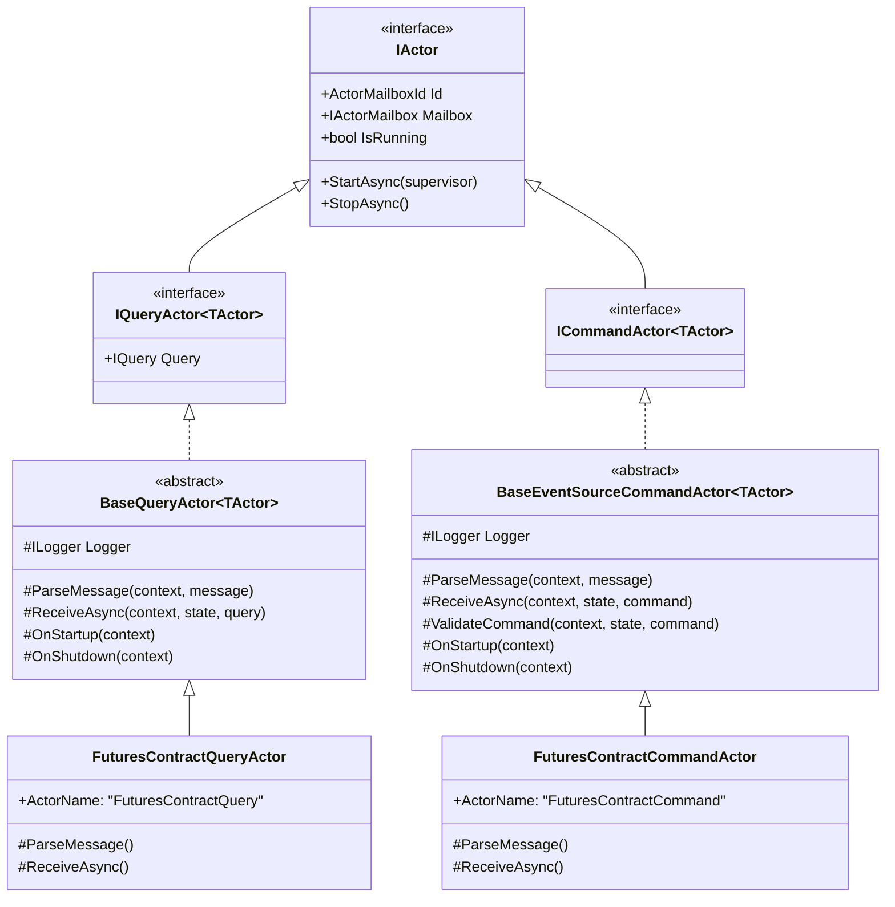
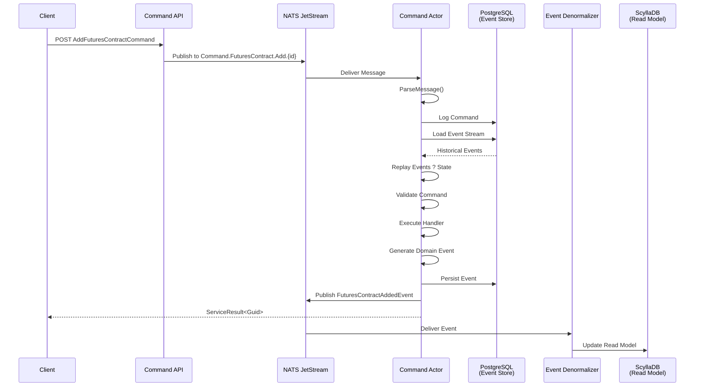
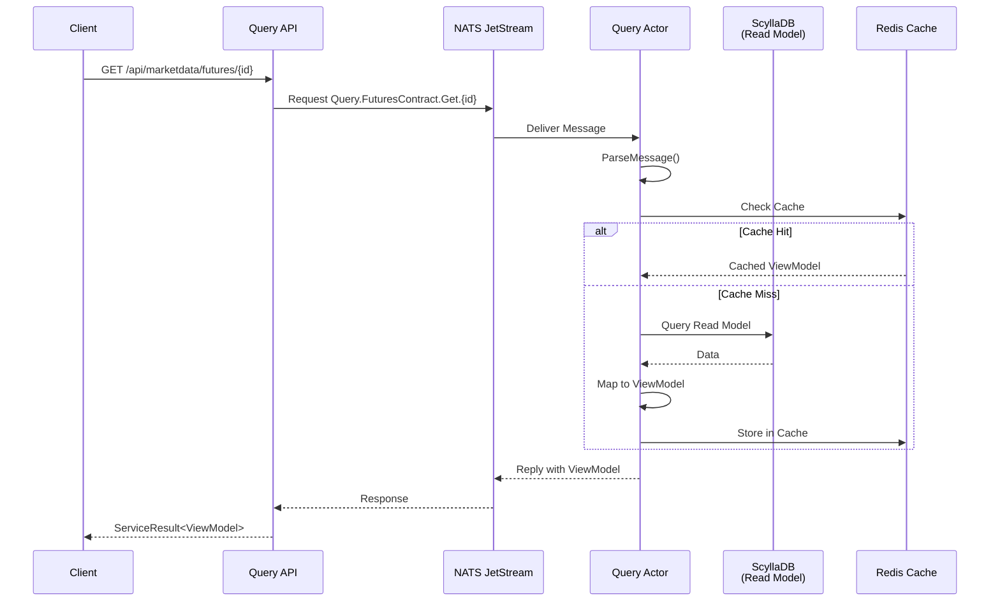
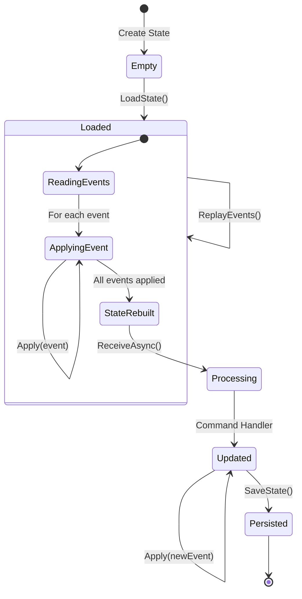
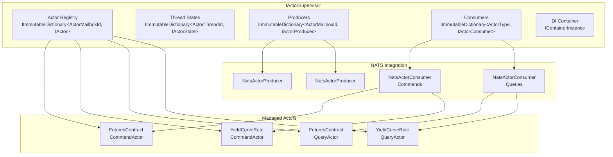
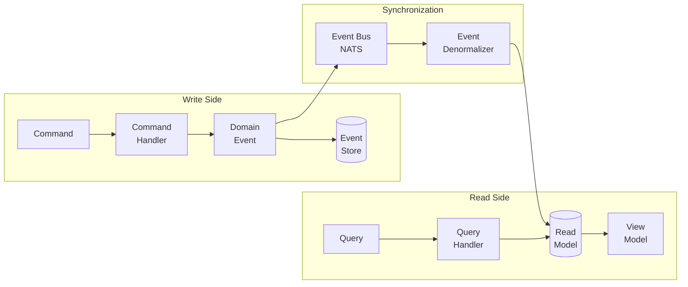
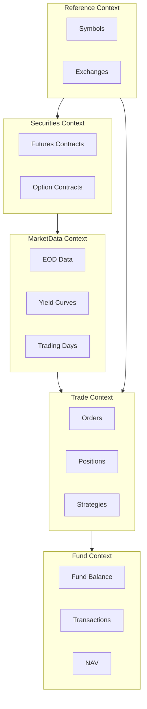
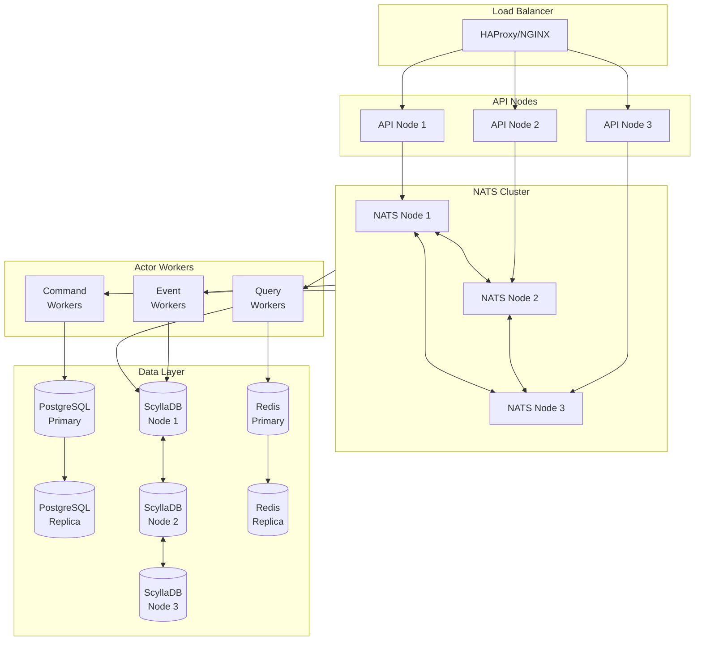
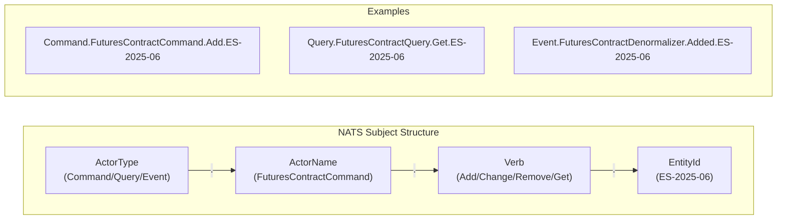

# TomasAI IFM - Architecture Diagrams

This document contains Mermaid diagrams for the TomasAI Investment Fund Manager architecture.
Use a Markdown viewer or export tool that supports Mermaid (e.g., VS Code with Mermaid extension, Typora, or Pandoc with mermaid-filter) to render these diagrams.

---

## 1. High-Level System Architecture

```mermaid
flowchart TB
    subgraph Clients["Client Layer"]
        UI[Web UI<br/>Razor Pages]
        API_Client[REST API<br/>Clients]
        External[External<br/>Systems]
    end

    subgraph Gateway["API Gateway Layer"]
        Query_API[Query API<br/>Server]
        Command_API[Command API<br/>Server]
        Event_API[Event API<br/>Server]
    end

    subgraph Messaging["Message Broker"]
        NATS[NATS JetStream]
    end

    subgraph Actors["Actor Layer"]
        Query_Actors[Query Actors]
        Command_Actors[Command Actors]
        Event_Actors[Event Actors<br/>Denormalizers]
    end

    subgraph Storage["Storage Layer"]
        PostgreSQL[(PostgreSQL<br/>Event Store)]
        ScyllaDB[(ScyllaDB<br/>Read Models)]
        Redis[(Redis<br/>Cache)]
    end

    UI --> Query_API
    UI --> Command_API
    API_Client --> Query_API
    API_Client --> Command_API
    External --> Event_API

    Query_API --> NATS
    Command_API --> NATS
    Event_API --> NATS

    NATS --> Query_Actors
    NATS --> Command_Actors
    NATS --> Event_Actors

    Command_Actors --> PostgreSQL
    Event_Actors --> ScyllaDB
    Query_Actors --> ScyllaDB
    Query_Actors --> Redis
```



---

## 2. Actor Type Hierarchy



---

## 3. Command Flow Sequence



---

## 4. Query Flow Sequence



---

## 5. Event Sourcing State Management



---

## 6. Actor Supervisor Architecture



---

## 7. CQRS Data Flow



---

## 8. Bounded Contexts



---

## 9. Deployment Architecture



---

## 10. Message Subject Naming Convention



---

## PDF Export Instructions

To export this document to PDF with rendered diagrams:

### Option 1: VS Code + Markdown PDF Extension
1. Install "Markdown PDF" extension in VS Code
2. Install "Markdown Preview Mermaid Support" extension
3. Open this file and use Ctrl+Shift+P ? "Markdown PDF: Export (pdf)"

### Option 2: Typora
1. Open this file in Typora
2. File ? Export ? PDF

### Option 3: Pandoc with Mermaid Filter
```bash
npm install -g @mermaid-js/mermaid-cli
pandoc Architecture-Diagrams.md -o Architecture-Diagrams.pdf --filter mermaid-filter
```

### Option 4: Mermaid Live Editor
1. Visit https://mermaid.live
2. Copy each diagram code block
3. Export as PNG/SVG
4. Combine into PDF document

---

*Document generated for TomasAI Investment Fund Manager v25.10*
